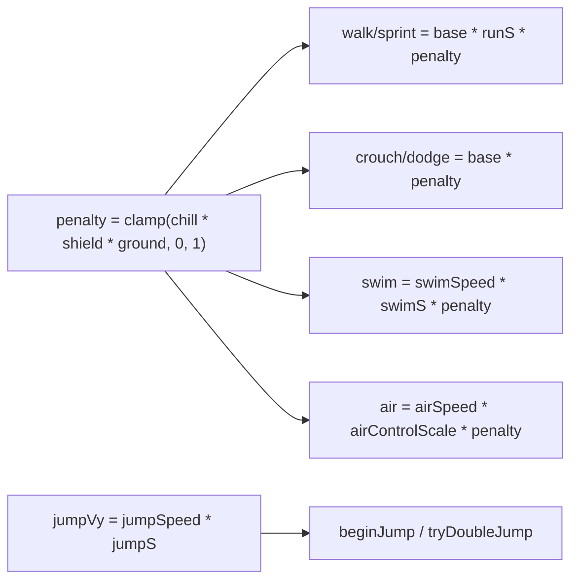
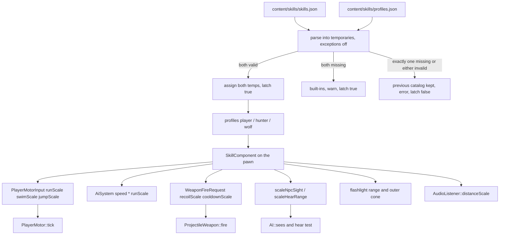

# Skills system for the player and NPCs

| Field | Value |
| --- | --- |
| **Status** | Accepted |
| **Date** | 2026-10-02 |
| **Author** | Travis Johnston |
| **Priority** | P1 — gameplay; not on the graphics track |
| **Tip baseline** | `Character/Character.h` has a `//Skills` comment and nothing else. Live locomotion, senses, and combat do not read a skill rank. |
| **Depends on** | `PlayerMotor` penalty channel, `StatusEffectComponent::moveSpeedScale`, `Shield::speedScale`, `Terrain::GroundContact::moveSpeed`, `AI::SightQuery` / `SightComponent`, `PreySense`, `ProjectileWeapon::fire`, `AudioSystem::apply3D`, content-root JSON load (`AI/AttackPattern.cpp`). |
| **Supersedes** | Nothing. Does not replace CC, stealth, jump attacks, or the unused `HumanHead` sketches. |
| **In-tree dest (docs PR only)** | `Character/DESIGN-skills.md` |

Implementation PRs must not commit `DESIGN-*.md`. The last PR copies this body in-tree and marks Status **Accepted**. That matches `Combat/DESIGN-status-effects.md`.

Namespace is `Dark`. New code is C++23, MSVC, Allman braces, 4-space indent. No C++ exceptions. JSON uses `nlohmann::json::parse(text.begin(), text.end(), nullptr, false)`.

---

## Overview

DarkEngine6 can already slow a pawn, hide the player, and let a hunter see or hear prey, but nothing records how good a character is at a physical or sensory act. Run speed, jump takeoff, swim speed, shot recoil, hunter vision, and prey hearing are constants (or stealth/status multipliers) with no progression.

This design adds one ECS component, `SkillComponent`, that both the possessed player and hunter-like NPCs (hunter and wolf) can carry. Six skills — `shoot`, `swim`, `run`, `jump`, `hear`, `see` — store an integer level and the XP inside that level. A process-wide catalog loaded once from `content/skills/` supplies the curve, the scalar endpoints, and the per-archetype starting ranks and grant masks. Each frame, consumers multiply one existing scalar. They do not replace the status, shield, or ground penalty, and they do not write combat-def fields.

At level 1 every shipped scalar is 1, so a fresh pawn matches today's movement, weapons, lights, and senses. Level 10 is a capped bonus or a capped recoil/cooldown reduction. Earned XP lives on the component for the process. The scene file cannot store it. Editor Play/Stop resets ranks to the archetype profile. Sandbox death does not.

---

## Background & Motivation

### What exists (and what does not)

There is no runtime skill system.

`Character/Character.h` is an unfinished sketch outside `namespace Dark`. It is not included by any `.cpp`. The only "skill" data on it is:

```cpp
//Skills
std::vector<Language> mLanguages;
```

`Language` is not defined. Beside it are unused floats `mClimbSpeed`, `mVerticality`, `mRunSpeed`, `mSprintSpeed`. `Character/HumanHead.h` defines `Sight`, `Hearing`, `OralSkills` (`mSpeak`, `mBite`), eyes, and ears, again outside `Dark`, and nothing in the engine includes that header except `Character/Body.h`, which is also unused. Those structs are not compiled into `DarkEngine`. v1 does not read, wrap, or migrate them. Doing so would invent a second body model next to the ECS pawns that already move and fight.

The live pieces this design composes with:

| Concern | Where it actually lives | Today's numbers |
| --- | --- | --- |
| Player walk / sprint / crouch / dodge / swim / jump | `Character/PlayerMotor.h` `PlayerMotorSettings`, applied in `PlayerMotor::tick` | walk 8, sprint 16, crouch 3.4, dodge 24, swim 5, jump 12, double jump 16, gravity 24 |
| Penalty channel | `PlayerMotorInput::speedScale`, clamped to **[0, 1]** at `PlayerMotor.cpp` (~line 211) | Multiplies walk, sprint, crouch, dodge, swim, and air control. Does **not** multiply `jumpSpeed` or `doubleJumpSpeed`. |
| Penalty product, player | `Sandbox/SandboxApp.cpp` (~1163) and `Editor/EditorPlay.cpp` (~811) | `(status ? status->moveSpeedScale() : 1) * shield.speedScale() * (onGround ? ground.moveSpeed : 1)` |
| Chill | `Combat/StatusEffectComponent::moveSpeedScale` | Min Chill magnitude in **[0.25, 1]**; other statuses do not change speed |
| Shield | `Combat/Shield::speedScale` | 1 lowered, `ShieldSettings::moveSpeedScale` (0.55) fully up |
| Ground | `Terrain::GroundContact::moveSpeed` | dirt/grass 1, rock/snow 0.75 (`Terrain/TerrainGround.cpp` `setDefaults`) |
| NPC travel | `AI/AiSystem.cpp` (~1209) | `(sprint ? pack.sprintSpeed : pack.walkSpeed) * moveSpeedScale * ground.moveSpeed`. Pack defaults: walk 9, sprint 17 (`AI/AiComponents.h`). Sprint flag is Assist, Flee, or `assistLeft > 0`, not Chase. **No [0, 1] clamp** on this product. |
| NPC sight | Chase query is the inline `SightQuery` in `tickHunters` (`AI/AiSystem.cpp` ~1006). `q.range` is `(sight ? range : 25) * sightScale` at ~1011, where `sightScale` is `PreySense::sightRangeScale`. The flat fallback (~1016) reuses that `q`. `hunterSeesPoint` (~560) is ally LOS: the only caller (~1072) passes `ov.xf->position`, and that query does not multiply prey scale. | Crouch shrinks the chase range once. It must not shrink ally LOS. |
| NPC hearing | `AiSystem.cpp` (~1031) | `dist <= prey.hearRange`. That radius is how loud the **player** is (`PlayerStealth.h`: stand 4, walk 14, sprint 24, crouch-still 1.25). It is not a hunter ear stat. Hearing ORs into `sees`. |
| Player vision tool | Flashlight spot | `range` 22, `innerConeDeg` 10, `outerConeDeg` 22, `intensity` 1571. Sandbox writes this inline (`SandboxApp.cpp` ~2162). Editor uses `spawnPlayerFlashlight` (`Character/ShieldView.cpp` ~102), same numbers. Camera stays 60° (`SetLens` 1.04719755 rad, `CameraComponent` 60). |
| Player hearing | `Audio::AudioListener` + `AudioSystem::apply3D` | `apply3D` sets `CurveDistanceScaler = 1.0f` at ~356, then overwrites it at ~371 with `Max(slot.desc.maxDistance, 1)`. `PlayDesc::maxDistance` default 64. `PlayDesc` has no emitter id. `playSoundCue` (`Audio/SoundEmitters.cpp` ~64) calls `audio.play3D(clip, pos, cue->volume)`, which builds a `PlayDesc` with no source (`AudioSystem::play3D` ~458). Music is 2D (`setMusic` leaves `spatial` false). |
| Shooting | `Weapons/ProjectileWeapon::fire` | Shot goes along `req.direction` with **no spread**. Recoil is `recoilPitchDeg` 3.5 and `recoilYawDeg` 0.8, kicked in `punchRecoil`. Cooldown default 0.40 s. `req.damageScale` is the charge multiplier (1 or `PlayerChargeSettings::attackDamageScale` 1.85). Sandbox applies `takeRecoil()` to look. `EditorApp::firePlayLoadout` does **not** read the kick. |
| Jump attack | `Combat/JumpAttack` | Player def: `telegraphSeconds = 0`, so `begin` rejects a grounded start (`heightAboveGround < minHeight` 0.45 **and** `airTime < minAirTime` 0.10). `hunterJumpDef` (`AI/AiSystem.cpp`) sets telegraph 0.40 s, cooldown 3.5 s, `connectDamage` 22, `poundDamage` 14, `leapVerticalSpeed` 10. It does **not** set flags. Connect knockdown is the `JumpAttackDef` default (`connectFlags` includes bit 7). `poundFlags` in that default do not include knockdown. Player pawns add `DamageFlags::Knockdown` later, in `attachLocalPlayer` / `attachEditorPlayer`. `JumpAttack::enterLeap` only sets the phase, the connect window, and `m_telegraphLeft`. The takeoff write is `JumpAttack::tickAutonomous` when `m_needTakeoff` is set: `m_velocity.y = m_def.leapVerticalSpeed`. |

`Scene/SceneTypes.h` `SceneObjectData` stores transforms, particles, lights, and clouds. It does not store health, motor state, or status. `Scene/SceneFile.cpp` round-trips that DTO only. There is no save-game type. `NetworkSystem` replicates transforms, not progression.

Content JSON is copied next to the exe by `cmake/CopyContent.cmake` (the whole `content/` tree). Hosts resolve files with `contentRootCandidates()` (`Core/ContentRoots.h`): exe-adjacent `content/` first, then parent walks. `AiSystem::ensureAttackPatterns` loads `ai/hunter.attacks.json` and `ai/wolf.attacks.json` **once**. `AttackPattern::parseAttackPattern` parses with exceptions disabled, fills a temporary, and assigns `out` only on success. `PhysicsSurfaceCatalog::parse` documents the same "on failure the catalog is unchanged" rule. That is the loader to copy. `AnimGraphJson` is an asset graph, not a gameplay catalog. `EntityMaster` is one file per placeable type and has no ranks.

CMake globs `Character/*.cpp` into the `DarkEngine` umbrella (`DE_ENGINE_REST_FOLDERS` in `cmake/DarkEngineTargets.cmake`, `CONFIGURE_DEPENDS`). `Weapons/` and `Combat/` are `DarkGameplay`, which already includes `Character` headers (`HealthPack` → `Character/Health`) but does not link `Character` `.cpp`. Skill logic that runs the catalog stays in `Character/` (DarkEngine). `ProjectileWeapon` may include a header-only limits file; it must not call the catalog.

Hosts that simulate the player and must both load the catalog:

| Host | Player attach | Motor tick | Hunter attach | Notes |
| --- | --- | --- | --- | --- |
| Sandbox | `SandboxApp::attachLocalPlayer` | player update (~1153) | `AiSystem::attachHunter` via `PathChase`, then wolf tag rewrite at ~3031 | Water is real (`ground.waterY = m_water.params().waterLevel`). Death calls `respawnPlayer` (~1349). |
| Editor Play | `EditorApp::attachEditorPlayer` | `EditorApp::updatePlay` | `attachEditorHunter` / `attachEditorWolf` (wolf tag set **after** `attachHunter`) | `ground.waterY = -1e9` (no swim volume). `resetPlayCombat` (~325) on Play start and Stop. Edit mode does not tick pawns. |
| Sandbox2D | — | — | — | Not a 3D pawn sim. Out of scope. Default new fields keep it unchanged. |

`World` stores components by value in a typed pool (`ECS/ComponentPool::insert` moves `T`). `SkillComponent` must stay a fixed blob: no `std::string`, no `std::vector`, no heap map. `StatusEffectComponent` (`kTypeName`, fixed `slots[]`) is the pattern.

### Pain points

1. The six verbs the user named are either constants or debuff multipliers. Nothing levels up.
2. `speedScale` cannot express a run bonus. It is clamped to [0, 1] and it also multiplies dodge, crouch, and swim. Putting run XP into that channel would either do nothing above 1 or slow the dodge.
3. Jump takeoff is a different variable from jump-attack leap speed. Scaling the wrong one changes knockdown and pounce damage.
4. Hunter sight range and prey hear radius are stealth outputs (how hidden the player is), not hunter skill.
5. A parallel `HumanHead` model would not move the player, because `PlayerMotor` never reads it.
6. Scene save would write session XP into `content/scenes`, which is the authoring copy. That is the wrong lifetime.

---

## Goals & Non-Goals

### Goals (v1)

1. One `SkillComponent` on the player, hunters, and wolves. Same six ids. Archetype profiles choose starting level and which ids gain XP.
2. Integer levels 1 through 10, XP inside the level, loaded from JSON, with a pure function from level to scalar.
3. Use-based gains for every skill, with an explicit event and unit (metres, shots, jumps, or seconds inside an existing sense check).
4. Level 1 reproduces today's shipped speeds, jump, swim, recoil, cooldown, flashlight, sight cone/range, hear radius, and 3D distance scaler.
5. Composition order is fixed: status, shield, and ground stay a penalty in [0, 1]; skill scales multiply outside that clamp, on the variables listed below only.
6. Catalog load is once per process, exception-free. Both files missing keeps the built-in table. Exactly one file missing, or either file present but invalid, leaves the previous catalog in place and does not retry.
7. Unit tests lock the curve at level 5 (not only the endpoints), a failed parse including a missing scalar and a NaN endpoint, the one-file-missing latch, penalty composition, and one sensory query that applies prey scale once.
8. Incremental PRs. Each one builds and is reviewable alone.

### Non-goals (v1)

- Skill trees, perks, respec, skill books, items, or quest grants. No quest system exists.
- UI beyond one debug readout (Editor play HUD line, Sandbox dev-tools block). No skill screen, no icons.
- Multiplayer authority, net snapshots, or client-trusted ranks. `NetworkSystem` keeps replicating transforms only. `attachReplicaCombat` does not add a `SkillComponent`.
- Saving ranks in `SceneObjectData` or any new save file.
- Hot reload of `content/skills`.
- Migrating `HumanHead`, `OralSkills`, `Body`, or `Character.h`.
- Changing `JumpAttackDef` (leap speeds, gravity, `minHeight`, `minAirTime`, connect/pound damage, poise, knockdown duration, cooldown, telegraph, homing).
- Changing charge `attackDamageScale`, parry windows, shield arc, status catalog, Chill's own magnitude, or `DamageEvent`.
- Adding shot spread. `ProjectileWeapon::fire` has no cone; level 1 is already a perfect aim along `req.direction`. A spread that shrinks with level would make level 1 worse than today.
- Scaling dodge, crouch, air control, gravity, coyote, jump buffer, or `dodgeAnimSpeed`.
- Scaling animation playback. `setFloat("speed", aim.speed)` already follows velocity. Dodge still forces `dodgeAnimSpeed` (2).
- Changing camera FOV, near/far, flashlight intensity, or flashlight inner cone.
- Teaching NPCs to swim or to fire `ProjectileWeapon`. Hunters and wolves have no swim state and no gun.
- Sandbox2D.
- A new `LogCategory`. Skills log under `LogCategory::Core`.

---

## Proposed Design

### Identity

Stable string ids in JSON. A closed `enum class` at runtime so the component is an array, not a map.

```cpp
namespace Dark
{

    enum class SkillId : uint8_t
    {
        Shoot = 0,
        Swim,
        Run,
        Jump,
        Hear,
        See,
        Count
    };

    inline constexpr int kSkillCount = static_cast<int>(SkillId::Count);

    enum class SkillScalar : uint8_t
    {
        RecoilScale = 0,
        CooldownScale,
        SwimScale,
        RunScale,
        JumpScale,
        HearScale,
        SeeRangeScale,
        SeeConeScale,
        Count
    };

} // namespace Dark
```

`const char* skillIdName(SkillId id)` returns the JSON spelling (`"shoot"`, …) or `nullptr`. Adding a seventh skill later means: append an enumerator before `Count`, add one required object in `skills.json`, add one grant call, add one consumer. It does not require a new component type. Unknown JSON ids are ignored with `DE_LOG_WARN` so a newer content file still loads on an older binary. Removing one of the six required ids fails the file.

`OralSkills` / `Hearing` / `HumanHead::mSight` stay unused. NPC sight keeps using `SightComponent` + `AI::sees`. NPC hearing keeps using `PreySense::hearRange` as the stimulus, multiplied by the **listener's** hear scalar. Player sight's only instrument is the flashlight. Player hearing's only instrument is X3DAudio distance.

### Rank, curve, and what "level up" means

Progression is use-based, not a passive clock and not a quest grant. A skill gains XP only while its event below is true. Standing still does not train run, swim, or jump. The spawn-default flashlight (`OffhandState::lightOn` starts true, and `OffhandState::reset` sets it true again) does not train See. The player's own spatial cues do not train Hear.

Time-based grants clamp `dt` to `[0, catalog.xpDtCap()]` inside `tickSkill` and every `note*SenseXp`. The shipped cap is **0.10**. That is the constexpr fallback `kSkillXpDtCap` when the built-in table is in use. JSON may set `xpDtCap` in `(0, 0.25]`. There is no second hardcoded ceiling. A negative `dt` becomes 0 before it is multiplied by a rate. It does not rely on `grantSkillXp` rejecting a negative amount.

Distance grants use planar metres the pawn **kept** after the host sweep (player) or after the hunter stuck-retry (NPC). They do not use `wish * speed * dt`. `PlayerMotor::moveHorizontal` does not see cubes, so a sample taken around `motor->tick` alone still pays for motion the sweep deletes. The sample points are in "Where metres are measured". A wall that clips the swept XZ to ~0 grants ~0. A hit-reaction slide is subtracted and does not train run.

| Field | Rule |
| --- | --- |
| Level | Integer **1 .. 10**. 0 is invalid. Shipped `maxLevel` must be 10 or the file fails. |
| XP | `float` toward the next level. At level 10, XP is forced to 0 and further grants no-op. |
| Curve | `xpToNext(level) = xpBase * level` for `level` in 1..9. Shipped `xpBase` is **100**. Legal range **[25, 500]**; outside that, parse fails. |
| Total 1 → 10 | `100 * (1+…+9) = 4500` XP. |
| Normalized rank | After clamping `level` into `1 .. maxLevel`: `t = static_cast<float>(level - 1) / static_cast<float>(maxLevel - 1)`. Integer division is wrong: `(level - 1) / (maxLevel - 1)` is 0 for levels 1..9. Level 1 → 0. Level 10 → 1. Level 5 → `4/9`. |
| Scalar | `atLevel1 + (atMaxLevel - atLevel1) * t`, then `clampSkill` into that scalar's `[min, max]`. A non-finite value becomes `kSkillIdentity` (1), not the low end of an inverted range. |

Worked XP thresholds: level 1→2 costs 100, 2→3 costs 200, …, 9→10 costs 900.

One `grantSkillXp` call may cross more than one level (`while` against `xpToNext`). In practice the per-event amounts below cannot, and the loop stops at level 10.

#### Gain events

The last column is **arithmetic at the level-1 rate**, assuming the predicate stays true and speed/cooldown never change. It is not calendar time and it is not a test oracle. `cooldownScale` and `runScale` change those rates before level 10. Do not assert "360 s of firing reaches level 10".

| Skill | Who may gain (`grant` mask) | Event | Unit | Shipped rate | At level-1 rate only (not a test) |
| --- | --- | --- | --- | --- | --- |
| `shoot` | Player only | `ProjectileWeapon::fire` returns true, and `shootLock <= 0`. Melee never grants. Failed fire never grants. On a successful grant, `noteShotXp` sets `shootLock = kShootGrantInterval` (**0.125 s**, 8/s). `tickSkill` subtracts clamped `dt` from the lock every player tick, including ticks with no shot. | XP per shot | **5** | 2.5 shots/s at the authored 0.40 s cooldown → 12.5 XP/s → 6.0 min. The lock does not bind at 0.40 s or at level-10 cooldown 0.34 s. It only binds if cooldown data drops below 0.125 s. |
| `swim` | Pawn with `PlayerMotor` | Post-tick state is `Swimming`, using locomotion metres below | XP per metre | **0.50** | 5 m/s → 2.5 XP/s → 30 min |
| `run` | Player and NPCs | Predicate below, same metres | XP per metre | **0.25** | Player sprint 16 m/s → 4 XP/s → 18.8 min. NPC chase at walk 9 m/s → 2.25 XP/s → 33 min |
| `jump` | Player motor only | `PlayerMotorResult::jumped`. If `doubleJumped`, grant a second packet the same tick. | XP per takeoff | **6** | ~1 takeoff/s → 12.5 min. Not `JumpAttack::begin`. |
| `hear` | NPC | The existing `hears` local is true: prey alive, not in water, `hearRange > 0`, dist ≤ **scaled** radius. Sample it **before** `if (hears) sees = true`. | XP per second | **2.0** | 37.5 min if that predicate stayed true |
| `hear` | Player | Alive, and `liveForeignSpatialVoices(possessedBody.id()) > 0`. A voice counts only when `PlayDesc::sourceId != 0` and `sourceId` is not the possessed body. Own `"step"` / `"fire"` / `"pain"` do not count. Music is not spatial. `sourceId == 0` does not count. | XP per second | **1.5** | 50 min only if a foreign spatial voice stayed live the whole time. Footsteps do not do that. |
| `see` | NPC | `playerAlive && !playerInWater &&` the height map is valid `&& AI::sees(q)` on the **chase** query after `scaleNpcSight`. A dead prey does not grant, even though the chase `sees` assignment at `AiSystem.cpp` ~1015 does not check `playerAlive`. Do not add that check to the chase bool. Standoff, the hear OR, and the flat fallback (~1016) do not grant. | XP per second | **2.0** | 37.5 min of that geometric predicate |
| `see` | Player | Alive, `SkillComponent::seeArmed`, and `OffhandState::lightOn` **after** `OffhandState::tick`. `seeArmed` latches when the flashlight action edge is true (`toggleLight` in `updatePossessed` / `updatePlay`). It starts false. Spawn and `OffhandState::reset` leave the light on and do **not** arm it. | XP per second | **1.5** | 50 min only after the player has toggled the light and left it on |

`seeArmed` is cleared by `resetToProfile` and by `SandboxApp::respawnPlayer` (after `m_offhand.reset()` at ~1379, which forces `lightOn` back to true). Ranks are not cleared there. Editor Stop goes through `resetToProfile`, which clears the latch with the ranks.

Run / swim qualification (same metres, different predicate). State is the **post-tick** `PlayerMotor::state()`:

- **Swim:** state is `Swimming`.
- **Run, player:** state is `Grounded`, `motorIn.sprint`, not `motorIn.crouch` (crouch wins over sprint inside the motor), not `result.dodged`, not jump-attack `busy()`.
- **Run, NPC:** brain leaf is `Chase`, `Assist`, or `Flee`. Not `Wander`, not `Memory`. Not while `JumpAttack::busy()`. Chase counts even though it uses `walkSpeed`. The sprint flag at `AiSystem.cpp` ~1207 stays the speed switch only.
- **Not run and not swim:** `Jumping`, `Falling`, `Crouch`, `Dodge`, or an in-air jump-attack commit. Air steering can move XZ while the state is `Jumping` or `Falling`. Those states fail the predicate, so the steering does not need a separate "sample before `applyAirSteering`" rule.

#### Where metres are measured

Do not move `status->tick`, `HitReaction::tick`, `integrateHitReaction`, or either host sweep. Cache the vector `HitReaction::tick` already returns. Do not call `tick` twice.

`locomotionMetres` (pure, unit-tested, no cubes inside `PlayerMotor`):

```cpp
inline float locomotionMetres(Math::Vector3f netXZ, Math::Vector3f hitSlideXZ)
{
    netXZ.y = 0.0f;
    hitSlideXZ.y = 0.0f;
    if (netXZ.Magnitude() <= 1.0e-4f)
        return 0.0f;
    if (hitSlideXZ.Dot(netXZ) > 0.0f && hitSlideXZ.MagnitudeSqrd() >= netXZ.MagnitudeSqrd() - 1.0e-6f)
        return 0.0f;
    const Math::Vector3f loco{ netXZ.x - hitSlideXZ.x, 0.0f, netXZ.z - hitSlideXZ.z };
    const float metres = loco.Magnitude();
    return metres > 0.0f ? metres : 0.0f;
}
```

A post-sweep `net` of length ~0 (a full motor step deleted by the wall) returns 0 even if `hitSlide` is non-zero. A sprint tick whose `net` equals the slide returns 0. A sprint tick whose `net` is the unclipped sum of sprint and slide returns the sprint portion only.

**Sandbox `updatePossessed`** (`Sandbox/SandboxApp.cpp`, function at ~1062). Order that already exists, and must stay:

1. `motorIn.speedScale` is read at ~1163 from `moveSpeedScale()`, shield, and ground. `StatusEffectComponent::tick` is **not** here. It stays in `updateCombat` at ~1570, which `onUpdate` calls **after** `updatePossessed` (~573) and after `m_chase.tick` (~3073). The penalty is last frame's Chill. Fill `runScale` / `swimScale` / `jumpScale` next to the ~1163 read. Do not move `status->tick` up into `updatePossessed`.
2. `before` at ~1185. `motor->tick` at ~1188.
3. Jump-attack air steering may overwrite XZ from that same `before` at ~1204.
4. `hitRx->tick(dt)` is added at ~1215. Keep the returned slide.
5. The sweep at ~1217 builds `delta` from that same `before` and writes `xf->position` at ~1247.
6. **Then** `metres = locomotionMetres(position - before, hitSlide)`, and `noteMotorXp` if the post-tick state matches swim or run.

**Editor `updatePlay`** (`Editor/EditorPlay.cpp`). Different order. Do not rearrange it to match Sandbox:

1. `status->tick` at ~756, **before** the motor. Leave it there. Fill skill scales next to the `speedScale` product at ~811.
2. `before` at ~833. `motor->tick` at ~836. `hitRx->tick` at ~838 (cache the slide). Air steering at ~840. Sweep `delta` from `before` at ~855. Position write at ~902.
3. **Then** the same `locomotionMetres` call. Editor's hit slide is inside the swept delta, same as Sandbox.

**NPC `tickHunters`.** `integrateHitReaction` runs at ~996, **before** `before` is captured at ~1253. Leave that call where it is. The slide is not inside `move`. `move` is computed at ~1265 and **replaced** after the stuck retry at ~1284. Grant `noteNpcRunXp` from that post-retry `move` (`traveled` at ~1286). The Memory seek at ~1272 writes the same `move`, and the leaf gate drops it. Do not grant from the pre-retry vector.

NPCs do not gain `shoot`, `swim`, or `jump`. The mask rejects the grant even if a caller asks. Their ranks stay at the profile (shipped: level 1) and those scalars stay 1, so they cannot drift.

Player `hear` does not change `PreySense`. Being heard is stealth, not ear training. Player `see` does not gain XP from mouse-look. There is no player vision query. The flashlight is the instrument, and only after the player has toggled it.

### Effect model

Scalars are not stored on the component. They are a pure function of catalog + level, so a catalog reload cannot desync a saved rank (v1 does not save ranks anyway). Missing `SkillComponent` means every scalar is **1**.

Hard caps live in `Character/SkillLimits.h` (header-only `constexpr`). The catalog file must already sit inside them or the parse fails. Consumers clamp again so a stale binary cannot apply a wild value.

| Skill | Scalar | Level 1 | Level 10 | Hard clamp | Multiplies | Must not touch |
| --- | --- | --- | --- | --- | --- | --- |
| Run | `runScale` | 1.00 | 1.20 | [1.00, 1.20] | `walkSpeed` and `sprintSpeed` only | crouch, dodge, air, swim, jump |
| Swim | `swimScale` | 1.00 | 1.25 | [1.00, 1.25] | `swimSpeed` only | ground speeds |
| Jump | `jumpScale` | 1.00 | 1.15 | [1.00, 1.15] | `jumpSpeed` and `doubleJumpSpeed` | gravity, coyote, buffer, double-jump window, `JumpAttackDef` |
| Shoot | `recoilScale` | 1.00 | 0.70 | [0.70, 1.00] | pitch and yaw kick degrees inside `punchRecoil` | `damage`, `damageScale`, spread (none), melee |
| Shoot | `cooldownScale` | 1.00 | 0.85 | [0.85, 1.00] | `ProjectileWeaponDesc::cooldown` for that shot | melee cooldown, charge window |
| Hear | `hearScale` | 1.00 | 1.30 | [1.00, 1.30] | NPC: `prey.hearRange`. Player: X3DAudio `CurveDistanceScaler` | `PlayerStealthSettings` numbers, 2D / music voices, doppler |
| See | `seeRangeScale` | 1.00 | 1.25 | [1.00, 1.25] | NPC: sight range after prey scale. Player: flashlight `range` | camera FOV, standoff, intensity |
| See | `seeConeScale` | 1.00 | 1.15 | [1.00, 1.15] | NPC: `coneDeg`, then clamp to 120°. Player: flashlight `outerConeDeg`, then clamp to 44° | inner cone, `SightComponent` stored defaults |

`t` at level 5 is `static_cast<float>(4) / static_cast<float>(9)`. `runScale` there is `1 + 0.20 * (4.0f / 9.0f)` ≈ 1.0889. Tests must hit level 5 with epsilon `1e-5`, not only level 1 and level 10. Those two ends are exact for both a real lerp and a step function. A level below 1 clamps to 1. A level above `maxLevel` clamps to `maxLevel` and returns that scalar (level 11 → the level-10 value). It does not return a third "out of range → 1" result. `skillScalar` returns 1 when the catalog is disabled. A missing scalar id is not a legal catalog (parse rejects it); if the in-memory table is missing one anyway, `skillScalar` returns `kSkillIdentity` (1) and does not invent a curve.

#### Worked numbers (level 1 vs level 10)

Player sprint, `PlayerMotorSettings::sprintSpeed = 16`.

- No debuff (Chill absent, shield down, grass `moveSpeed` 1): penalty = 1.
  - Level 1: `16 * 1.00 * 1 = 16` m/s. Same as today.
  - Level 10: `16 * 1.20 * 1 = 19.2` m/s.
- Chill magnitude 0.5, shield fully up (0.55), snow 0.75, on ground:
  - penalty = `clamp(0.5 * 0.55 * 0.75, 0, 1) = 0.20625`.
  - Level 1: `16 * 0.20625 = 3.3` m/s.
  - Level 10: `16 * 1.20 * 0.20625 = 3.96` m/s.
- Dodge in that same debuff, any run level: `24 * 0.20625 = 4.95` m/s. `runScale` is not in the product.
- Air control during a jump-attack commit stays `airControlScale (0.35) * penalty`. Run skill does not widen pounce steering.

Player jump, gravity stays 24.

- Level 1 takeoff `12` m/s. Apex height `v^2 / (2g) = 144/48 = 3.0` m. Apex time `0.50` s.
- Level 10 takeoff `12 * 1.15 = 13.8` m/s. Apex `190.44/48 = 3.9675` m. About **+0.97 m**.
- Double jump level 10: `16 * 1.15 = 18.4` m/s. Apex `338.56/48 = 7.05` m versus `5.33` m today.
- Windows stay 0.28 s / 0.05 s. Coyote 0.10 s. Buffer 0.12 s.

Residual coupling, accepted: the player's jump attack still uses `telegraphSeconds = 0` and still refuses to begin unless `heightAboveGround >= 0.45` or `airTime >= 0.10`. A higher hop crosses 0.45 m slightly sooner. User decision 2026-10-02: leave that gate. `minHeight` 0.45 and `minAirTime` 0.10 stay. The jump skill does not change leap speed, damage, or knockdown. If playtests later show too much air-pounce time, changing those two constants is a follow-up combat change, not a skill change. NPC jump attacks never read `jumpScale`. The Y takeoff to leave alone is `JumpAttack::tickAutonomous` under `if (m_needTakeoff)`, which assigns `m_velocity.y = m_def.leapVerticalSpeed` (hunter def: 10). `enterLeap` does not write velocity.

Swim level 10: `5 * 1.25 = 6.25` m/s before penalty. Chill and shield still apply. Ground `moveSpeed` does not, because both hosts pass ground speed only when `onGround` is Grounded, Crouch, or Dodge. Swimming is none of those. Editor Play has no water (`waterY = -1e9`), so swim XP and `swimScale` are Sandbox-only in practice. The motor still honors `swimScale` if a test puts the body in water.

Shoot, authored rifle `recoilPitchDeg = 3.5`, `recoilYawDeg = 0.8`, `cooldown = 0.40`, `damage = 24`.

- Level 1: kick 3.5° / ±0.8°, cooldown 0.40 s, damage scale still 1.00 or 1.85 from charge.
- Level 10: kick `3.5 * 0.70 = 2.45°` / `±0.56°`, cooldown `0.40 * 0.85 = 0.34` s. Damage unchanged.

NPC sight, base 25 m / 70°, prey standing (`sightRangeScale` 1) vs crouch-walk (0.55).

- Level 1 standing: 25 m, 70°. Same as today.
- Level 10 standing: range `25 * 1.25 = 31.25` m, cone `70 * 1.15 = 80.5°` (under the 120° cap).
- Level 10 crouch-walk: range `25 * 0.55 * 1.25 = 17.1875` m. Still quieter than a level-1 standing target. Standoff metres are not scaled.

NPC hear, sprinting prey radius 24 m, crouch-still 1.25 m.

- Level 10 sprint: `24 * 1.30 = 31.2` m.
- Level 10 crouch-still: `1.25 * 1.30 = 1.625` m.

Player flashlight, captured base 22 m / 22° outer (not hardcoded a second time; capture what spawn wrote).

- Level 10: range `27.5` m, outer `25.3°`. Inner stays 10°. Intensity stays 1571.

Player audio, emitter `maxDistance` 64. Hosts write the **hear skill scalar** into `AudioListener::distanceScale` (1.00 at level 1, 1.30 at level 10), not the X3DAudio curve value.

- `apply3D` computes `spatialDistanceScaler(64, 1.30) = 83.2` and stores that on `emitter.CurveDistanceScaler`. 83.2 is not a host input.
- Passing 83.2 as `distanceScale` is the wrong call. `clampSkill` caps that argument at 1.30, so `spatialDistanceScaler(64, 83.2)` still returns 83.2 and does **not** return `64 * 83.2`. The clamp therefore hides a host that stored 83.2: both the correct call (`1.30`) and the wrong call (`83.2`) produce 83.2. The test that distinguishes them is `skillScalar` Hear level 10 == **1.30** (not 83.2), plus `EXPECT_NE(spatialDistanceScaler(64, 83.2), 64.f * 83.2f)`, plus the host assignment below. A unit test that only checks the numeric product cannot see the bug.
- Curve points stay `{0, 1}` and `{1, 0}`. Doppler is unchanged. A larger scaler is a longer falloff. The falloff applies to every spatial voice the listener hears, including the player's own footsteps. That is the scalar. It is not the Hear XP predicate. Own cues still do not grant Hear XP.

#### Final speed formula

```
penalty = clamp(moveSpeedScale * shield.speedScale * (onGround ? ground.moveSpeed : 1), 0, 1)

runS  = clamp(runScale,  1.00, 1.20)   // 1 if no SkillComponent or catalog disabled
swimS = clamp(swimScale, 1.00, 1.25)
jumpS = clamp(jumpScale, 1.00, 1.15)

walk   = settings.walkSpeed       * runS * penalty
sprint = settings.sprintSpeed     * runS * penalty
crouch = settings.crouchSpeed          * penalty
dodge  = settings.dodgeSpeed           * penalty
swim   = settings.swimSpeed       * swimS * penalty
air    = settings.airSpeed * airControlScale * penalty     // runS excluded
jumpVy = settings.jumpSpeed       * jumpS                  // penalty excluded
dblVy  = settings.doubleJumpSpeed * jumpS
```

`penalty` is exactly today's `PlayerMotorInput::speedScale`. Skill fields are new inputs defaulting to 1, clamped inside `PlayerMotor::tick`.

NPC travel, same `runS`, no new clamp on the debuff product (hunters never had one):

```
speed = (sprint ? pack.sprintSpeed : pack.walkSpeed) * moveSpeedScale * ground.moveSpeed * runS
```

Level 1 `runS` is 1, so this line matches `AiSystem.cpp` today. Level 10 on snow, no Chill, sprinting: `17 * 0.75 * 1.20 = 15.3` m/s versus `12.75` today.

#### Algebra, not a call order

Sandbox and Editor do not share a frame order. Do not implement the list below as a sequence of calls, and do not move `status->tick`, `HitReaction::tick`, `integrateHitReaction`, or either sweep to make them match. The sample points are in "Where metres are measured". The sense and shot owners are in "Who calls what".



That diagram is the product. It is not the order of `updatePossessed` or `updatePlay`.

NPC sight and hear, still inside `tickHunters`, without moving the existing calls:

1. Build the chase `SightQuery` from the raw `SightComponent` (default range 25, cone 70). Do not write the component.
2. Call `scaleNpcSight` **once** with that raw query, `sightScale` (prey `sightRangeScale`), and the hunter's `seeRangeScale` / `seeConeScale`. Write `q.range` and `q.coneDeg` from the result. That **replaces** the `* sightScale` at ~1011. Do not multiply prey scale again.
3. The flat fallback (~1016) keeps using that already-scaled `q`. It still does not grant See XP.
4. Leave the chase `sees` assignment at ~1015 as it is, including standoff and the lack of a `playerAlive` check. Do not add `playerAlive` there.
5. See XP uses a **separate** bool: `playerAlive && !playerInWater &&` the height map is valid `&& AI::sees(q)`. Standoff, the hear OR, and the flat fallback do not set that bool.
6. Hear radius is `scaleHearRange(m_prey.hearRange, hearScale)`. Sample the existing `hears` local (~1031, already requires `playerAlive`) **before** `if (hears) sees = true` (~1032). Pass that `hears` into `noteNpcSenseXp`. Do not scale standoff.
7. `hunterSeesPoint` (~560) is ally LOS, not this chase cone. The only caller (~1072) passes `ov.xf->position`. Call `scaleNpcSight` there with prey scale **forced to 1** (see range and cone still apply). Crouch-walk `0.55` must not shrink packmate LOS.
8. Move speed multiplies `runS` on the existing product at ~1209, after Chill and `ground.moveSpeed`. No new `[0, 1]` clamp.
9. `noteNpcRunXp` uses the post-retry `move` at ~1284 (`traveled` ~1286). Leaf gate and `JumpAttack::busy()` are in "Where metres are measured".
10. Jump-attack begin / leap / knockdown is unchanged and grants no jump XP. Takeoff stays `tickAutonomous` under `m_needTakeoff`.

`SightComponent::coneDeg` and `range` stay the authored bases (70 / 25) so Editor Stop and `AISightTests` keep their fixtures. Skill is a query-time multiply.

Test: crouch-walk prey scale `0.55` changes the chase query once (`25 * 0.55 * seeRangeScale`) and does not change an ally query (prey argument `1`, so `25 * 1 * seeRangeScale`). At see-range level 1 the ally range stays 25 m.

### JSON

Two files, both content-relative, both copied by the existing content step:

- `content/skills/skills.json` — curve, caps, per-skill rates and scalar endpoints.
- `content/skills/profiles.json` — starting ranks and grant masks for `player`, `hunter`, `wolf`.

Load once, first time a host calls `skillCatalog().loadFromContent()`, from `SandboxApp` init and `EditorApp` init (both simulate the player). Not from `AiSystem` (Sandbox and Editor each own a catalog-using attach path; one process-wide catalog is enough). No file watcher.

`ensureAttackPatterns` sets `m_attacksLoaded = true` **before** it loads (`AI/AiSystem.cpp` ~228–232), so a failed load is never retried and a later call is a no-op. Skills latch **after** the attempt, not before. `m_loaded` is set on every terminal outcome, including failure. A second call, when `m_loaded` is already set, returns the latched bool and does not touch disk.

Resolution: walk `contentRootCandidates()`, exe-adjacent first. Size cap **64 KiB** per file (`AttackPattern`'s `kMaxJsonBytes`). Version must be **1**.

Parse contract, copied from `parseAttackPattern` plus the catalog rule on `PhysicsSurfaceCatalog`:

1. Reject empty, oversized, `is_discarded()`, non-object, bad version, non-finite numbers, duplicate ids, and a skill object whose scalar ids are not exactly the effect-table set. Log `DE_LOG_ERROR(LogCategory::Core, ...)`. Return false. Do not modify the output object.
2. Parse each file into its own temporary. Profile XP is checked against the **skills temporary from the same attempt** (`xp < xpToNext` using that temp's `xpBase` and `maxLevel`), not against the process catalog already in memory.
3. Commit matrix. Do not merge a new skills temp with the previous profiles, or the reverse.

| Skills file | Profiles file | Result |
| --- | --- | --- |
| Missing | Missing | `DE_LOG_WARN`. Keep built-in defaults (they match the shipped JSON, so level-1 scalars stay 1). Set `m_loaded`. Return **true**. |
| Valid | Valid | Assign both temps over the process catalog. Set `m_loaded`. Return **true**. |
| Missing | Present (valid or not) | `DE_LOG_ERROR`. Keep the previous catalog. Set `m_loaded`. Return **false**. |
| Present (valid or not) | Missing | Same: error, previous catalog, latch, return **false**. |
| Present but invalid | Present (anything) | Same: error, previous catalog, latch, return **false**. |
| Present (anything) | Present but invalid | Same. |

4. "Present but invalid" includes a discarded parse, a bad version, a missing required skill id, a duplicate skill id, a duplicate scalar id, `scalarCount > 4`, a non-finite `xpBase` / rate / endpoint / min / max / `xpDtCap` / profile `xp`, an endpoint outside the hard clamp, and a profile XP that fails the temp's `xpToNext` check. Last-wins is not allowed.
5. No `try` / `catch`. No `std::exception`. `std::isfinite` rejects NaN and Inf before any `<` / `>` compare, because those compares are false for NaN.

Tests: "skills valid, profiles missing" leaves the previous catalog unchanged and a second `loadFromContent` does not read disk. "skills invalid, profiles valid" does the same. "both missing" warns, keeps built-ins, returns true, and latches.

`enabled` (bool, default true) is the kill switch. When false, `grantSkillXp` no-ops and every scalar function returns 1. Hosts do not grow their own branch.

#### Schema

`skills.json`:

| Field | Type | Rule |
| --- | --- | --- |
| `version` | number | Must be 1. |
| `enabled` | bool | Default true if omitted. |
| `maxLevel` | number | Must be 10. |
| `xpBase` | number | Must be in [25, 500]. Shipped 100. |
| `xpDtCap` | number | Must be in (0, 0.25]. Shipped 0.1. |
| `skills` | array | Exactly the six ids, no duplicates. Extra unknown objects are skipped with a warning. A missing required id fails the file. |
| `skills[].id` | string | `shoot`, `swim`, `run`, `jump`, `hear`, `see`. |
| `skills[].xpPerEvent` | number | ≥ 0. Shoot 5, jump 6, others 0. |
| `skills[].xpPerMetre` | number | ≥ 0. Run 0.25, swim 0.50, others 0. |
| `skills[].xpPerSecond` | number | ≥ 0. Hear 2.0 for the NPC rate; see below. |
| `skills[].xpPerSecondPlayer` | number | ≥ 0. Player hear 1.5, player see 1.5, others 0. NPC rates stay on `xpPerSecond` so the two consumers can differ without a second skill id. |
| `skills[].scalars` | array | **Exactly** the scalar ids in the effect table for that skill, no extras, no duplicates. `shoot`: `recoilScale` and `cooldownScale`. `see`: `seeRangeScale` and `seeConeScale`. `swim`, `run`, `jump`, `hear`: that one id only. More than 4 entries fails (`SkillScalarDef scalars[4]`). A scalar id hung on the wrong skill fails, because that skill's required set is then incomplete. Endpoints, `min`, and `max` must be finite and inside the hard clamp. `atLevel1` for every shipped scalar is 1. |

`profiles.json`:

| Field | Type | Rule |
| --- | --- | --- |
| `version` | number | Must be 1. |
| `profiles` | array | Must include `player`, `hunter`, `wolf`. |
| `profiles[].id` | string | Those three. Any other id warns and is ignored. |
| `profiles[].grant` | string array | Subset of the six ids. **Omitted** is the only path to mask `0x3F` (all six). A present `"grant": []` is mask **0** and is legal: the profile grants nothing. It does not fail the file and it does not mean "all six". Hunter and wolf set `["run", "hear", "see"]`. An unknown token fails the file. |
| `profiles[].skills` | object | Keys are skill ids. Value `{ "level": int, "xp": number }`. Omitted skill means level 1, xp 0. Level must be in 1..maxLevel of the skills temp from this attempt. XP must be finite, ≥ 0, and **< xpToNext(level)** using that same temp, or 0 at max level. |

Shipped profiles are all level 1, xp 0. Wolf is not secretly faster. The reduced wolf/hunter set is the grant mask, not a stat bump. Designers can later raise wolf `hear` in JSON without a code change; that would intentionally diverge from today's detection and should be its own content review.

#### Complete example

`content/skills/skills.json`:

```json
{
  "version": 1,
  "enabled": true,
  "maxLevel": 10,
  "xpBase": 100,
  "xpDtCap": 0.1,
  "skills": [
    {
      "id": "shoot",
      "xpPerEvent": 5,
      "xpPerMetre": 0,
      "xpPerSecond": 0,
      "xpPerSecondPlayer": 0,
      "scalars": [
        { "id": "recoilScale", "atLevel1": 1.0, "atMaxLevel": 0.70, "min": 0.70, "max": 1.0 },
        { "id": "cooldownScale", "atLevel1": 1.0, "atMaxLevel": 0.85, "min": 0.85, "max": 1.0 }
      ]
    },
    {
      "id": "swim",
      "xpPerEvent": 0,
      "xpPerMetre": 0.50,
      "xpPerSecond": 0,
      "xpPerSecondPlayer": 0,
      "scalars": [
        { "id": "swimScale", "atLevel1": 1.0, "atMaxLevel": 1.25, "min": 1.0, "max": 1.25 }
      ]
    },
    {
      "id": "run",
      "xpPerEvent": 0,
      "xpPerMetre": 0.25,
      "xpPerSecond": 0,
      "xpPerSecondPlayer": 0,
      "scalars": [
        { "id": "runScale", "atLevel1": 1.0, "atMaxLevel": 1.20, "min": 1.0, "max": 1.20 }
      ]
    },
    {
      "id": "jump",
      "xpPerEvent": 6,
      "xpPerMetre": 0,
      "xpPerSecond": 0,
      "xpPerSecondPlayer": 0,
      "scalars": [
        { "id": "jumpScale", "atLevel1": 1.0, "atMaxLevel": 1.15, "min": 1.0, "max": 1.15 }
      ]
    },
    {
      "id": "hear",
      "xpPerEvent": 0,
      "xpPerMetre": 0,
      "xpPerSecond": 2.0,
      "xpPerSecondPlayer": 1.5,
      "scalars": [
        { "id": "hearScale", "atLevel1": 1.0, "atMaxLevel": 1.30, "min": 1.0, "max": 1.30 }
      ]
    },
    {
      "id": "see",
      "xpPerEvent": 0,
      "xpPerMetre": 0,
      "xpPerSecond": 2.0,
      "xpPerSecondPlayer": 1.5,
      "scalars": [
        { "id": "seeRangeScale", "atLevel1": 1.0, "atMaxLevel": 1.25, "min": 1.0, "max": 1.25 },
        { "id": "seeConeScale", "atLevel1": 1.0, "atMaxLevel": 1.15, "min": 1.0, "max": 1.15 }
      ]
    }
  ]
}
```

`content/skills/profiles.json`:

```json
{
  "version": 1,
  "profiles": [
    {
      "id": "player",
      "skills": {
        "shoot": { "level": 1, "xp": 0 },
        "swim":  { "level": 1, "xp": 0 },
        "run":   { "level": 1, "xp": 0 },
        "jump":  { "level": 1, "xp": 0 },
        "hear":  { "level": 1, "xp": 0 },
        "see":   { "level": 1, "xp": 0 }
      }
    },
    {
      "id": "hunter",
      "grant": ["run", "hear", "see"],
      "skills": {
        "run":  { "level": 1, "xp": 0 },
        "hear": { "level": 1, "xp": 0 },
        "see":  { "level": 1, "xp": 0 }
      }
    },
    {
      "id": "wolf",
      "grant": ["run", "hear", "see"],
      "skills": {
        "run":  { "level": 1, "xp": 0 },
        "hear": { "level": 1, "xp": 0 },
        "see":  { "level": 1, "xp": 0 }
      }
    }
  ]
}
```

Wolf and hunter share a mask and not a class hierarchy. `attackPatternFor` already branches on `TagComponent::name == "Wolf"` versus every other hunter. Skill profiles do the same job with an explicit id, because the wolf tag is applied **after** `attachHunter` (`SandboxApp.cpp` ~3031, `EditorApp::attachEditorWolf`). Attach order:

1. `attachLocalPlayer` / `attachEditorPlayer` → `applySkillProfile(entity, "player")`.
2. `attachHunter` → `applySkillProfile(entity, "hunter")`.
3. Immediately after the wolf tag write in Sandbox and in `attachEditorWolf` → `applySkillProfile(entity, "wolf")`.

If those two profiles stay identical, step 3 is a no-op numerically and still keeps a future wolf tune working. Do not guess the profile inside `attachHunter` from the tag alone; spawn sets the tag to `"Hunter"` first.

### Data flow



### Who calls what

There is no new `World` system type and no second tick loop. Hosts call free functions the way they already call `status->tick` and `preySenseFor`.

| Call | Where |
| --- | --- |
| `loadFromContent` | Sandbox init, Editor init, once. Second call returns the latch and does not read disk. |
| `applySkillProfile` | Player attach, hunter attach, wolf retag |
| `resetToProfile` | `EditorApp::resetPlayCombat` only, and only for entities the loop already visits (`isPawnType`: Player, Wolf, Hunter). Player → `"player"`, `SceneObjectType::Wolf` → `"wolf"`, Hunter → `"hunter"`. Zeroes `shootLock` and `seeArmed`. |
| `tickSkill` | Once per player tick even when no sense is true and no shot fires. Sandbox: **start** of `updatePossessed` (~1062). Editor: in `updatePlay`, **after** `status->tick` (~756) and before the fire block (~1039). Decays `shootLock` by `dt` clamped to `[0, catalog.xpDtCap()]`. Does not grant. |
| Motor scales | Next to the existing penalty product. Sandbox ~1163 (last frame's Chill; do not move `status->tick` out of `updateCombat` ~1570). Editor ~811 (this frame's Chill; `status->tick` stays at ~756). |
| `noteMotorXp` | After the sweep writes XZ. Sandbox after ~1247. Editor after ~902. Metres from `locomotionMetres`, not from the pre-sweep motor delta. |
| `runScale` on NPC speed + `noteNpcRunXp` | `AiSystem::tickHunters`. Speed line ~1209. Grant from post-retry `move` ~1284, leaf-gated. Not a sense. |
| `noteNpcSenseXp` | `tickHunters`, after `hears` is computed (~1031) and before relying on the chase `sees` flag. Arguments are the separate geometric bool and the pre-OR `hears` local. |
| Shoot scales + `noteShotXp` | Inside `firePossessedLoadout` and `firePlayLoadout`, only when `activeKind() == Projectile` and `fire` returns true. `noteShotXp` takes no `dt`. It grants only when `shootLock <= 0`, then sets `shootLock = kShootGrantInterval`. Do not decay the lock again after the grant. |
| `notePlayerSenseXp` | Once per alive visit, on every alive exit, not only the last line. Sandbox `updateCombat` (~1550) and Editor `updatePlay` are listed under this table. `m_chase.tick` (~3073) has already run before `updateCombat` (~3075). Do not move `tickEditorHunters` (`EditorUi.cpp` ~870, after `updatePlay`) so Hear can see this frame's hunter cues. |
| See latch | **PR 6 only** writes `seeArmed = true`, on the existing `toggleLight` edge. Sandbox: `updatePossessed` ~1124, one line, not the motor block. Editor: `updatePlay` ~773. PR 4 edits the rest of `updatePossessed` and only **clears** the latch in `respawnPlayer`. Grant only while `seeArmed && lightOn` after `OffhandState::tick`. |
| Flashlight reapply | `SandboxApp::updateFlashlight`, Editor play light block (~985). Each frame: `range = capturedRange * seeRangeScale`, `outer = min(capturedOuter * seeConeScale, 44)`. Do not multiply the already-scaled value. |
| Listener scale | Hosts assign the hear **skill scalar**, or `1`. Sandbox `onUpdate` builds the listener at ~3098 and calls `setListener` at ~3102, after `updateFlashlight` and after the gameplay block. Editor `EditorUi.cpp` ~914–927 builds a listener and calls `setListener` even in edit mode. Edit mode, a missing component, a disabled catalog, and Scene2D write `1`. |

Sandbox fire is not inside `updatePossessed`. `updatePossessed` only stores `m_fireQuick` (~1140). `updateCombat` consumes it later in the same `onUpdate`, after `updatePossessed` returned. `tickSkill` at the start of `updatePossessed` therefore decays **last frame's** lock before this frame's `noteShotXp`. That is the order. Do not move the fire call up into `updatePossessed`, and do not decay the lock a second time in `updateCombat`.

`notePlayerSenseXp` is one grant per `updateCombat` on the alive path, and one grant per `updatePlay`. Invoke the same call at every alive exit. Do not place it only before the closing brace. Do not delete the returns. Do not move `status->tick`.

Sandbox `updateCombat` (`Sandbox/SandboxApp.cpp`, function at ~1550), as it returns today:

| Exit | Lines | `notePlayerSenseXp` |
| --- | --- | --- |
| Dead | `if (!hpCombat \|\| !hpCombat->alive())` at ~1576, `return` at ~1583. May call `respawnPlayer` at ~1582. | **Do not call.** The pawn is not alive. |
| CC or jump attack | `if (ccLocked \|\| jumpBusy)` at ~1668, `return` at ~1672. No `firePossessedLoadout`. | Call once, then return. |
| Swimming | `if (swimming)` at ~1675. `firePossessedLoadout` at ~1678–1681, then `return` at ~1682. | Call once **after** that fire (so `noteShotXp` inside `firePossessedLoadout` still runs) and **before** the return. Swimming does not skip Hear or See. |
| Airborne | `if (airborne)` at ~1713, `return` at ~1722. No `firePossessedLoadout`. | Call once, then return. |
| Grounded fall-through | `firePossessedLoadout` at ~1725–1734. The function ends at ~1735. | Call once after that fire block, before the closing brace. |

A contact kill inside the standoff loop (~1627) does not add a `return`. Do not invent one, and do not treat that path as the dead return at ~1583. Whichever of the four alive exits the function still takes notes senses once.

Editor `updatePlay`, same rule. `return` at ~1048 (`if (ccLocked \|\| jumpBusy)` at ~1044) and `return` at ~1080 (`if (airborne)` at ~1071) are before `firePlayLoadout` (~1085). Both must reach the one call, and so must the grounded fall-through after fire (~1082–1091) before the function ends at ~1092. One call on those three sites, not three grants and not only the last line.

The Sandbox `seeArmed = true` write is not inside `updateCombat`, `updateFlashlight`, or the listener block. It is the `toggleLight` edge in `updatePossessed` at ~1124, after that bool is computed and before `m_offhand.tick` (~1143) consumes it. **PR 6** adds that one assignment. **PR 4** does not. PR 4 still clears `seeArmed` in `respawnPlayer` after `m_offhand.reset()` (~1379). Leaving the set out of both file lists leaves Sandbox See at 0 XP for the session, because `notePlayerSenseXp` only reads the latch.

`respawnPlayer` (~1349) resets health, the motor, and calls `m_offhand.reset()` at ~1379, which forces `lightOn` back to true. It must **not** call `resetToProfile`. After that reset, clear `seeArmed` only. Ranks and XP stay. Death is not a respec.

`AiSystem::tickHealthAndRespawn`, after `deadFor >= 8` (~367–384), calls `health.revive()`, `hit.reset()`, `StatusEffectComponent::reset()` (~371), and `brain->start()`. It must **not** call `resetToProfile`. Hunter and wolf ranks survive that revive. `seeArmed` is a player latch; this path does not touch it.

Editor edit mode does not tick XP. Stop calls `resetPlayCombat`, so a play session cannot leak ranks back into the open scene. That matches HP, CC, and motor reset already in that function.

### Player vs NPC

Same component, same catalog, different profile id.

| | Player | Hunter | Wolf |
| --- | --- | --- | --- |
| Profile id | `player` | `hunter` | `wolf` |
| Shipped start | all six at 1 / 0 XP | run, hear, see at 1 | same as hunter |
| Gains | all six | run, hear, see | run, hear, see |
| Run consumer | `PlayerMotor` walk + sprint | pack walk + sprint | same line as hunter |
| Swim consumer | `PlayerMotor` swim | none | none |
| Jump consumer | motor takeoff only | none (`JumpAttack` ignored) | none |
| Shoot consumer | projectile recoil + cooldown | none | none |
| See consumer | flashlight range + outer cone | `SightQuery` range + cone | same |
| Hear consumer | spatial distance scaler | prey hear radius | same |

Wolves are not a smaller skill enum. They are a hunter with a mask. A wolf that somehow had shoot XP would still not fire a rifle, because nothing in `AiSystem` calls `Weapon::fire`.

---

## API / Interface Changes

### Limits (header-only, included by the weapon)

```cpp
namespace Dark
{

    inline constexpr int   kSkillMaxLevel       = 10;
    inline constexpr float kSkillXpDtCap        = 0.10f;
    inline constexpr float kRunScaleMin         = 1.00f;
    inline constexpr float kRunScaleMax         = 1.20f;
    inline constexpr float kSwimScaleMin        = 1.00f;
    inline constexpr float kSwimScaleMax        = 1.25f;
    inline constexpr float kJumpScaleMin        = 1.00f;
    inline constexpr float kJumpScaleMax        = 1.15f;
    inline constexpr float kRecoilScaleMin      = 0.70f;
    inline constexpr float kRecoilScaleMax      = 1.00f;
    inline constexpr float kCooldownScaleMin    = 0.85f;
    inline constexpr float kCooldownScaleMax    = 1.00f;
    inline constexpr float kHearScaleMin        = 1.00f;
    inline constexpr float kHearScaleMax        = 1.30f;
    inline constexpr float kSeeRangeScaleMin    = 1.00f;
    inline constexpr float kSeeRangeScaleMax    = 1.25f;
    inline constexpr float kSeeConeScaleMin     = 1.00f;
    inline constexpr float kSeeConeScaleMax     = 1.15f;
    inline constexpr float kNpcConeDegCap       = 120.0f;
    inline constexpr float kFlashlightOuterCap  = 44.0f;
    inline constexpr float kSkillIdentity       = 1.0f;
    inline constexpr float kShootGrantInterval  = 0.125f; // not JSON; 8 grants/s ceiling

    // Non-finite v returns kSkillIdentity (1), including recoil and cooldown.
    // Their lo (0.70 / 0.85) is the strong cap, not the level-1 end. Do not return lo for NaN.
    inline float clampSkill(float v, float lo, float hi)
    {
        if (!std::isfinite(v))
            return kSkillIdentity;
        if (v < lo)
            return lo;
        if (v > hi)
            return hi;
        return v;
    }

} // namespace Dark
```

### Catalog

```cpp
namespace Dark
{

    struct SkillScalarDef
    {
        SkillScalar id         = SkillScalar::RunScale;
        float       atLevel1   = 1.0f;
        float       atMaxLevel = 1.0f;
        float       minV       = 1.0f;
        float       maxV       = 1.0f;
    };

    struct SkillDef
    {
        SkillId        id = SkillId::Run;
        float          xpPerEvent        = 0.0f;
        float          xpPerMetre        = 0.0f;
        float          xpPerSecond       = 0.0f;
        float          xpPerSecondPlayer = 0.0f;
        SkillScalarDef scalars[4]{};
        int            scalarCount = 0;
    };

    struct SkillProfile
    {
        // Bit i is 1 << SkillId. Omitted JSON grant is 0x3F. A present empty array is 0.
        // An int array value-initialized with {} is 0, which is an invalid level.
        // The constructor is what makes SkillProfile{} legal.
        uint8_t grantMask = 0x3Fu;
        int     level[kSkillCount];
        float   xp[kSkillCount];

        SkillProfile()
        {
            grantMask = 0x3Fu;
            for (int i = 0; i < kSkillCount; ++i)
            {
                level[i] = 1;
                xp[i]    = 0.0f;
            }
        }
    };

    class SkillCatalog
    {
    public:
        // nlohmann::json::parse(..., nullptr, false). On failure *this is unchanged.
        bool parseSkills(std::string_view jsonText);
        bool parseProfiles(std::string_view jsonText);
        bool loadFromContent();

        bool enabled() const { return m_enabled; }
        int  maxLevel() const { return m_maxLevel; }
        float xpDtCap() const { return m_xpDtCap; }
        float xpToNext(int level) const;

        const SkillDef*     find(SkillId id) const;
        const SkillProfile* profile(std::string_view id) const;

    private:
        bool        m_enabled  = true;
        int         m_maxLevel = kSkillMaxLevel;
        float       m_xpBase   = 100.0f;
        float       m_xpDtCap  = kSkillXpDtCap;
        SkillDef    m_skills[kSkillCount]{};
        // Fixed profile slots: 0 player, 1 hunter, 2 wolf.
        SkillProfile m_profiles[3]{};
        bool         m_loaded = false;
        bool         m_loadOk = true; // returned by later loadFromContent calls
    };

    SkillCatalog& skillCatalog();

    float skillScalar(SkillId id, SkillScalar scalar, int level);

} // namespace Dark
```

`skillCatalog()` returns a function-local static seeded with the built-in table. No other static initialization. `loadFromContent` assigns that object only when both temps succeed. On every other terminal outcome it leaves the object as it was, sets `m_loaded`, and stores the bool in `m_loadOk`. A later call returns `m_loadOk` without reading disk.

`skillScalar`: if the catalog is disabled, return `kSkillIdentity` (1). If the in-memory def has no such scalar (not legal after a successful parse), return `kSkillIdentity` and do not invent a curve. Otherwise clamp `level` into `1 .. maxLevel`, then `t = static_cast<float>(level - 1) / static_cast<float>(maxLevel - 1)`, lerp, and `clampSkill`. Level 11 returns the level-10 scalar. It does not return a separate "out of range → 1".

### Component and XP

```cpp
namespace Dark
{

    struct SkillRank
    {
        int   level = 1;
        float xp    = 0.0f;
    };

    struct SkillComponent
    {
        static constexpr const char* kTypeName = "Skill";

        SkillRank ranks[kSkillCount]{};
        uint8_t   grantMask = 0x3Fu;
        float     shootLock = 0.0f; // seconds until another shoot grant is allowed
        bool      seeArmed  = false; // latched by the flashlight edge, not by lightOn

        int   level(SkillId id) const;
        float xp(SkillId id) const;
        bool  allows(SkillId id) const;
        void  resetToProfile(const SkillProfile& profile);
    };

    struct MotorXpSample
    {
        PlayerMoveState state      = PlayerMoveState::Grounded;
        bool            sprint     = false;
        bool            crouch     = false;
        bool            dodged     = false;
        bool            jumped     = false;
        bool            doubleJump = false;
        bool            jumpBusy   = false;
        float           planarMetres = 0.0f;
    };

    // False if masked, disabled, non-positive, non-finite, or already max level.
    // Logs once per level gained. Does not throw.
    bool grantSkillXp(SkillComponent& comp, SkillId id, float amount);

    // Clamps dt to [0, catalog.xpDtCap()] and subtracts it from shootLock (floor 0).
    // No XP. Both player hosts call this even when no sense is true.
    void tickSkill(SkillComponent& comp, float dt);

    void noteMotorXp(SkillComponent& comp, const MotorXpSample& sample);
    // No dt. Grants only when projectileFired && shootLock <= 0, then sets the lock.
    void noteShotXp(SkillComponent& comp, bool projectileFired);
    // geometricSees is the separate chase bool (playerAlive required). heardPrey is the pre-OR hears local.
    void noteNpcSenseXp(SkillComponent& comp, bool geometricSees, bool heardPrey, float dt);
    // See XP only when seeArmed && lightOn. Hear XP only when foreignSpatialVoice.
    void notePlayerSenseXp(SkillComponent& comp, bool seeArmed, bool lightOn, bool foreignSpatialVoice, float dt);
    void noteNpcRunXp(SkillComponent& comp, bool qualifyingMove, float planarMetres);

    bool applySkillProfile(World& world, Entity e, const char* profileId);

} // namespace Dark
```

`noteMotorXp` reads rates from the catalog (`xpPerMetre` on run and swim, `xpPerEvent` on jump). It does not look at `PlayerMotor` itself, so the test does not boot a world. `planarMetres` is whatever `locomotionMetres` returned. Distance grants are not passed through `xpDtCap`.

`tickSkill` and both `note*SenseXp` functions clamp `dt` to `[0, catalog.xpDtCap()]` before any multiply. Negative `dt` becomes 0 there. They do not use a second hardcoded 0.1. The shipped value and the constexpr fallback are `kSkillXpDtCap` (0.10). JSON may set `(0, 0.25]`.

`noteShotXp` does not take `dt` and does not decay `shootLock`. Decay is only `tickSkill`. `kShootGrantInterval` (0.125) lives in `SkillLimits.h` only, not in `skills.json`. At cooldown 0.40 s, and at level-10 cooldown 0.34 s, the lock does not bind. It exists so a future cooldown under 0.125 s cannot exceed 8 grants per second.

`resetToProfile` copies `grantMask`, clamps each level into `1 .. maxLevel`, and stores xp only when level is below max (xp at max is 0). Then it sets `shootLock = 0` and `seeArmed = false`. A profile some caller zeroed by hand still cannot apply level 0, because the clamp runs here. Do not memcpy a profile onto the component.

`applySkillProfile` emplaces `SkillComponent` if missing, then `resetToProfile`. Returns false and logs if `profileId` is unknown; the entity is left unchanged in that case.

Test: `SkillProfile{}` has level 1 and xp 0 on every slot, not level 0. Test: a present `"grant": []` loads as mask 0. Test: an omitted `grant` loads as `0x3F`.

### Motor inputs

Add to `PlayerMotorInput`, after `speedScale`. Defaults keep every current caller behavior-identical:

```cpp
float speedScale = 1.0f; // existing penalty, clamped [0, 1] inside tick
float runScale   = 1.0f; // walk + sprint only, clamped [1, 1.20]
float swimScale  = 1.0f; // swimSpeed only, clamped [1, 1.25]
float jumpScale  = 1.0f; // jumpSpeed + doubleJumpSpeed only, clamped [1, 1.15]
```

`beginJump` and `tryDoubleJump` take the clamped jump scale (private signature change). They multiply `m_settings.jumpSpeed` / `doubleJumpSpeed`. They do not write `m_settings`, so the asset values stay put for the next tick.

Air path stays `applyAirControl(..., in.airControlScale * penalty)` with penalty = clamped `speedScale`. Swim path uses `swimSpeed * swimS * penalty`. Dodge and crouch use `penalty` only.

### Weapon request

Add to `WeaponFireRequest`. Defaults 1. `MeleeWeapon::fire` ignores them.

```cpp
float damageScale   = 1.0f; // existing; skills must not write this
float cooldownScale = 1.0f; // projectile only
float recoilScale   = 1.0f; // projectile only
```

`ProjectileWeapon::fire`:

```cpp
const float cool = clampSkill(req.cooldownScale, kCooldownScaleMin, kCooldownScaleMax);
const float kick = clampSkill(req.recoilScale, kRecoilScaleMin, kRecoilScaleMax);
m_cooldown = (m_desc.cooldown > 0.0f ? m_desc.cooldown : 0.0f) * cool;
```

`punchRecoil` multiplies `recoilPitchDeg` and `recoilYawDeg` by `kick` before the deg-to-rad convert. It does not store the scaled value back into `m_desc`, so the next shot at scale 1 is the authored kick again. `include "Character/SkillLimits.h"` from `ProjectileWeapon.cpp` is allowed; including `SkillCatalog.h` is not.

Hosts set the two fields from `skillScalar` only for a projectile. They leave `damageScale` as the charge already does (`charged ? 1.85 : 1`).

Editor still does not apply the kick to the camera. The scaled kick sits in `takeRecoil()` if something later reads it. v1 does not add Editor camera recoil; that would be a camera change, not a skill change. Sandbox already adds the kick to `m_lookYaw` / `m_lookPitch` and will pick up the scale with no extra math.

### Sense helpers

```cpp
namespace Dark
{

    struct SenseQuery
    {
        float range   = 25.0f;
        float coneDeg = 70.0f;
    };

    inline SenseQuery scaleNpcSight(SenseQuery base, float preySightRangeScale, float seeRangeScale, float seeConeScale)
    {
        const float prey = preySightRangeScale > 0.0f ? preySightRangeScale : 1.0f;
        SenseQuery out = base;
        out.range   = base.range * prey * clampSkill(seeRangeScale, kSeeRangeScaleMin, kSeeRangeScaleMax);
        out.coneDeg = base.coneDeg * clampSkill(seeConeScale, kSeeConeScaleMin, kSeeConeScaleMax);
        if (out.coneDeg > kNpcConeDegCap)
            out.coneDeg = kNpcConeDegCap;
        if (out.coneDeg < 1.0f)
            out.coneDeg = 1.0f;
        return out;
    }

    inline float scaleHearRange(float preyHearRange, float hearScale)
    {
        if (preyHearRange <= 0.0f)
            return 0.0f;
        return preyHearRange * clampSkill(hearScale, kHearScaleMin, kHearScaleMax);
    }

    inline float spatialDistanceScaler(float maxDistance, float hearScale)
    {
        const float base = maxDistance > 1.0f ? maxDistance : 1.0f;
        return base * clampSkill(hearScale, kHearScaleMin, kHearScaleMax);
    }

    inline void scaleFlashlight(float baseRange, float baseOuterDeg, float seeRangeScale, float seeConeScale, float& outRange, float& outOuter)
    {
        outRange = baseRange * clampSkill(seeRangeScale, kSeeRangeScaleMin, kSeeRangeScaleMax);
        outOuter = baseOuterDeg * clampSkill(seeConeScale, kSeeConeScaleMin, kSeeConeScaleMax);
        if (outOuter > kFlashlightOuterCap)
            outOuter = kFlashlightOuterCap;
    }

} // namespace Dark
```

`AudioListener` gains `float distanceScale = 1.0f`. The second argument of `spatialDistanceScaler` is that skill scalar, not an X3DAudio `CurveDistanceScaler`.

`apply3D` (`Audio/AudioSystem.cpp`) writes `CurveDistanceScaler` twice. Delete the `= 1.0f` store at ~356 in the same edit. Replace the live store at ~371:

```cpp
emitter.CurveDistanceScaler = Max(slot.desc.maxDistance, 1.0f);
```

with `spatialDistanceScaler(slot.desc.maxDistance, m_listener.distanceScale)`. Leaving the ~356 store in place, even if ~371 is also replaced, lets a later edit treat 1.0f as the curve. Non-spatial voices return before either line, so UI and music are untouched.

Hosts assign the scalar, never the product. Missing component, catalog disabled, Editor not in Play, and Scene2D all write 1:

```cpp
Audio::AudioListener lis{};
lis.distanceScale = 1.0f;
if (playMode && skillCatalog().enabled())
{
    if (SkillComponent* sk = /* possessed or play pawn */)
        lis.distanceScale = skillScalar(SkillId::Hear, SkillScalar::HearScale, sk->level(SkillId::Hear));
}
audio.setListener(lis);
```

Sandbox always simulates, so `playMode` there is "the gameplay listener", and the assignment still uses 1 when the catalog is disabled or the pawn has no component. Editor `onUpdate` calls `setListener` at `EditorUi.cpp` ~927 for edit mode too; that path keeps `distanceScale` at 1. Do not pre-multiply `PlayDesc::maxDistance`.

`PlayDesc` gains `uint32_t sourceId = 0` (0 means unattributed). `playSoundCue` and `playSoundCueAt` (`Audio/SoundEmitters.cpp` ~52–78) today call `audio.play3D(...)`, and `play3D` (~458) fills a `PlayDesc` with no id. Those two emitters must set `sourceId` from `Entity::id()` and call `play(PlayDesc)`. `play3D` stays the unattributed helper (sourceId 0) so a one-off positional blip cannot train Hear. `sourceId` 0 does not count. The possessed body's own `"step"`, `"fire"`, and `"pain"` do not count. Hunter grunt, pain, and growl can, because their entity id is not the player. Music stays 2D and is not counted.

`int AudioSystem::liveForeignSpatialVoices(uint32_t selfId) const` counts in-use slots with `desc.spatial`, `sourceId != 0`, and `sourceId != selfId` (max 24). It does not count `music`.

Chase and ally sight do not share one prey scale. `tickHunters` calls `scaleNpcSight` once on the raw chase query and replaces the `* sightScale` at ~1011. `hunterSeesPoint` calls the same helper with prey scale `1`. It is ally LOS (`ov.xf->position` at ~1072), not the chase cone. Assist vision may grow with the see skill. It must not shrink when the player crouches.

### Debug readout

Editor `drawPlayHud`: one line, `Run 3  Swim 1  Jump 2  Shoot 1  Hear 4  See 2`, reading `SkillComponent` levels. No XP bar.

Sandbox `DevToolsPanel`: a collapsing header with the same six levels plus the current scalar values. Not on by default beyond the header being closed.

That is the whole UI.

---

## Data Model Changes

### Runtime

New ECS component `Skill` (`SkillComponent`): 6 ranks × (int + float), one `uint8_t` mask, `float shootLock`, and `bool seeArmed`. No pointers. Safe to copy in `ComponentPool`. `shootLock` and `seeArmed` are runtime only. They are not ranks.

Not serialized. `SceneObjectData` gains no fields. Scene version stays 2.

### Content

Two new JSON files under `content/skills/`. No change to `content/entities/*.entity.json`, attack patterns, or `content/physics/surfaces.json`.

### Persistence boundary

| Context | Ranks |
| --- | --- |
| Sandbox `respawnPlayer` | Ranks stay. `m_offhand.reset()` (~1379) forces `lightOn` true; clear `seeArmed` after that call. Do not call `resetToProfile`. |
| Sandbox hunter/wolf recover | `tickHealthAndRespawn` after 8 s (~367–384) revives, resets hit and `StatusEffectComponent`, and restarts the brain. It does **not** call `resetToProfile`. Ranks survive. |
| Editor Play / Stop | `resetPlayCombat` (~325) resets profiles, and only for `isPawnType` pawns (Player, Wolf, Hunter). That also clears `seeArmed` and `shootLock`. |
| Editor edit | Component may sit on the pawn from attach, but nothing ticks it, and Stop resets it. |
| Scene file | Not stored. Do not add fields. |
| Network | Not replicated. Remote pawns from `attachReplicaCombat` have no component. |
| Disk dump | None in v1. |

There is no save game to extend. v1 keeps ranks in process memory only. They do not join `SceneObjectData`, so Play/Stop cannot dirty `content/scenes`. User decision 2026-10-02: the choice between an exe-adjacent user profile and a campaign blob waits until a save game exists. It does not block v1.

### Built-in defaults

The `.cpp` default table matches the JSON example, including grant masks. Tests can run with no content directory and still see level-1 identity scalars. `UnitTests` already copies `content/` next to the exe (`UnitTests/CMakeLists.txt` POST_BUILD), so a load-from-content test can follow `AttackPatternTests.cpp` `ContentFiles`.

---

## Alternatives Considered

### 1. Permanent rows inside `StatusEffectComponent`

Chill already exposes `moveSpeedScale`, and the component is on the same pawns. A "skill" could be a status that never expires.

Rejected. Slots are timed CC and ailments (`kMaxStatus` 12), `reset()` clears them on Editor Stop, Sandbox `respawnPlayer`, and the hunter revive inside `tickHealthAndRespawn` (~371), and `moveSpeedScale` only reads `StatusId::Chill`. A rank that must survive Sandbox player respawn **and** that hunter revive, and still reset on Editor Stop, is a different lifetime than a status. Folding the bonus into `moveSpeedScale` also hits the [0, 1] clamp and the dodge. Status DR and the status catalog stay untouched.

### 2. Finish `Character.h` / `HumanHead` and drive the motor from those floats

The `//Skills` comment and `OralSkills` / `Hearing` / `mRunSpeed` look like the feature.

Rejected. Those headers are not in `namespace Dark`, are not included by a translation unit, and do not match the code that moves a pawn (`PlayerMotor`), sees (`AI::sees`), or hears (`PreySense`). `mLanguages` does not compile. Wrapping them would be a second character model beside ECS. v1 leaves the sketches where they are.

### 3. `std::unordered_map<std::string, SkillRank>` on the component, curves only in code

String ids would make a seventh skill a data change only, and hardcoded curves would avoid a schema.

Rejected. `World` moves components by value; a map is a heap allocation per pawn per copy. The tick would string-compare six times per hunter per frame. The user asked for JSON, and `content/ai/*.attacks.json` is already the gameplay-definition pattern. A fixed `SkillId` plus a JSON catalog gives data-driven endpoints without a per-entity map. A new skill still needs a consumer in C++; a map does not remove that.

Passive XP (a clock on every skill) was also rejected. Sandbox and Editor Play would max `run` by standing still. The verbs in the request are things the character does.

---

## Security & Privacy Considerations

Threat model is local content and a local process, not a remote player.

| Threat | Severity | Mitigation |
| --- | --- | --- |
| Tampered `content/skills/*.json` sets a 100× speed | Medium | 64 KiB cap, version check, `maxLevel` locked to 10, scalar endpoints must lie in `SkillLimits.h` or the file is rejected and the previous catalog stays. Consumers clamp again. |
| JSON parse throws out of `nlohmann` and skips the rest of init | Medium | `parse(..., nullptr, false)` only. No `try` / `catch`. Discarded JSON is a logged failure. |
| Path traversal via the skill file | Low | Load only `skills/skills.json` and `skills/profiles.json` under `contentRootCandidates()`. No path string from the file is opened. |
| Client reports a fake level over the net | None in v1 | Ranks are not serialized and not put on `NetReplication` packets. A later net RFC must treat ranks as server state, not a client field. |
| PII in the catalog | None | Ranks are gameplay numbers. No account, no voice print, no player name beyond the existing `TagComponent`. |

Content is trusted the same way `hunter.attacks.json` is trusted: it ships with the game, it is not downloaded, and a bad file fails closed. This is not an authorization feature.

---

## Observability

No metrics service exists for gameplay. v1 does not add `PerfCounters` and does not log per-XP grants (that would flood `DarkEngine6.log` at several lines per second).

| Event | Level | Category | When |
| --- | --- | --- | --- |
| Catalog loaded | Info | Core | Once, with the absolute path, same style as `AttackPattern: loaded` |
| Both catalog files missing, built-ins kept | Warn | Core | Once, then latched. Return true. |
| Exactly one file missing, or either file invalid | Error | Core | Previous catalog unchanged. Latched. Return false. Do not log this as a warn. |
| Parse / version / range / non-finite / duplicate / wrong scalar set | Error | Core | Includes the skill id when one object is bad. Catalog unchanged. |
| Unknown extra skill id | Warn | Core | Object skipped |
| Level gained | Info | Core | One line: skill name, new level. Not the XP remainder. |

Editor HUD and the Sandbox dev-tools header are the only live readout. No alert pipeline.

---

## Rollout Plan

There is no feature-flag service. The ordered work is `## PR Plan` (titles, files, dependencies, merge gates). This section is the kill switch and the rollback. It is not a second stack, and it does not collapse host wiring into one PR.

1. `"enabled": false` forces every scalar to 1 and stops grants without reverting code. Both hosts read that one catalog flag.
2. Editor Stop and Play start call `resetPlayCombat`, which resets profiles on `isPawnType` pawns only (Player, Wolf, Hunter). A bad curve does not stick in a scene a designer saves.
3. Rollback is from the top of `## PR Plan`. Revert a consumer before the catalog. Motor defaults of 1 and `enabled: false` both restore today's products while a consumer is still linked.
4. Sandbox2D is not in the stack. `EditorUi.cpp` still builds a listener for Scene2D (~914) and leaves `distanceScale` at 1.

Content does not need a CMake source change. `CopyContent.cmake` copies the whole `content/` tree, including `content/skills/` from PR 1. New `Character/*.cpp` is picked up by `de_glob_folder` `CONFIGURE_DEPENDS`. New tests are picked up by `UnitTests/CMakeLists.txt` `GLOB_RECURSE`.

With shipped JSON, level-1 scalars are 1, so the first play session after the host PRs still matches trunk until something earns XP.

---

## Risks

| Risk | Severity | Mitigation |
| --- | --- | --- |
| Skill bonus folded into `speedScale` and clamped away, or applied to dodge | High | Separate `runScale` / `swimScale` / `jumpScale`. Unit test: dodge distance ignores `runScale`; sprint distance uses it; `speedScale` 0 still stops the pawn. |
| Jump skill writes `JumpAttackDef::leapVerticalSpeed` or knockdown | High | No jump consumer on NPCs. Player jump multiplies only `PlayerMotor` takeoff. Tests do not need a combat scene to prove the def is unread; code review plus "no reference from `SkillXp` to `JumpAttack`". |
| Higher player hop makes air pounces easier (0.45 m gate opens sooner) | Low | Cap `jumpScale` at 1.15 (~1 m apex). User decision 2026-10-02: leave `minHeight` 0.45 and `minAirTime` 0.10. A later retune of those two constants is a combat change, not a skill change. |
| Flashlight range compounded every frame (`range *= scale`) | Medium | Capture base at spawn. Reapply `base * scale` each update. Inner cone and intensity not written. |
| Dev-tools or an editor gizmo writes `LocalLightComponent::range` and the skill overwrites it next frame | Low | No current slider edits that range (`DevToolsPanel` edits shield and weapon recoil, not the flashlight cone). Document the capture as the source of truth while Play or Sandbox sim is running. |
| AI speed product accidentally clamped to [0, 1] | Medium | Do not reuse `PlayerMotor::tick`'s clamp. NPC formula is a multiply only. Test the helper, not a behavior change to Chill on hunters. |
| Wolf tag applied after attach, so wolves keep a hunter profile | Low | Shipped profiles match. Still reapply `"wolf"` at both tag-write sites so a later JSON tune works. |
| Editor Play trains ranks that then get saved into the scene | Medium | Do not add scene fields. `resetPlayCombat` resets profiles. |
| Shoot XP farms the sky | Low | Accepted. 5 XP per successful shot. The "6 min" figure is the level-1 cooldown only and is not a test. No damage change. Not a quest. `shootLock` only binds if cooldown data drops below 0.125 s. |
| Hear falloff makes every spatial voice, including own footsteps, carry 30% farther at level 10 | Low | Cap 1.30 on the listener scalar. Level 1 is identity. 2D and music excluded. Own cues still do not grant Hear XP (`sourceId` filter). |
| `DarkGameplay` calls into the catalog singleton and creates a link cycle | Medium | Weapon code includes `SkillLimits.h` only. Hosts (Sandbox, Editor, `AiSystem` in `DarkEngine`) read the catalog. |
| Invalid JSON, or exactly one of the two files missing, wipes a good catalog or merges a new skills temp with old profiles | Medium | Temps commit together or not at all. Those cases error, keep the previous catalog, and latch. Both missing is the only path that installs built-ins. Profile XP is checked against the skills temp of that attempt. |

---

## Open Questions

**Resolved.** No open questions remain.

The two items below were open until 2026-10-02. The user closed both. They are decisions, not a menu.

1. **Future save layout: decide later.** v1 stays process memory only. Ranks do not join `SceneObjectData`. Editor Stop resets Player, Wolf, and Hunter. Sandbox death and the 8 s hunter revive keep ranks. The choice between an exe-adjacent user profile and a campaign blob waits until a save game exists. It does not block v1. This matches Key Decision 11.
2. **Player pounce gate: leave the gate.** `JumpAttackDef::minHeight` 0.45 and `minAirTime` 0.10 stay. The jump skill does not change leap damage or knockdown. If playtests later show too much air-pounce time, that is a follow-up combat change to those two constants, not a skill change. This matches Key Decision 6.

Everything else in this document is a decision, not a menu. In particular: level 1 is identity, not a penalty; NPCs do not scale `JumpAttack`; wolf is a grant mask, not a smaller enum; Editor Stop wipes session XP on Player, Wolf, and Hunter; Sandbox player death and the 8 s hunter revive do not.

---

## References

- `Character/Character.h`, `Character/HumanHead.h`, `Character/Body.h` — unused sketches. Not the system.
- `Character/PlayerMotor.h`, `Character/PlayerMotor.cpp` — `speedScale` clamp and the speeds a skill may or may not multiply.
- `Character/PlayerStealth.h` — `preySenseFor`. Stimulus for NPC hear/see, not a skill.
- `Character/ShieldView.cpp` — `spawnPlayerFlashlight` (22 m, 22°, intensity 1571).
- `Combat/StatusEffectComponent.h` — `moveSpeedScale` (Chill only) and the component style to copy.
- `Combat/Shield.h` — `speedScale()` 0.55 while up.
- `Combat/JumpAttack.cpp` `enterLeap` (phase and telegraph only) and `tickAutonomous` under `m_needTakeoff` (`m_velocity.y = m_def.leapVerticalSpeed`). `AI/AiSystem.cpp` `hunterJumpDef` sets telegraph, cooldown, damages, and leap speeds. It does not set knockdown flags. Do not scale.
- `Combat/HoldCharge.h` — `attackDamageScale` 1.85 stays the only damage multiplier on a shot.
- `Combat/DESIGN-status-effects.md` — docs-PR convention.
- `AI/AttackPattern.h`, `AI/AttackPattern.cpp` — load-once JSON, exceptions disabled, assign `out` at the end.
- `AI/AiSystem.cpp` — chase `SightQuery` (~1006), `hunterSeesPoint` ally LOS (~560, caller ~1072), hear test (~1031), speed product (~1209), stuck-retry `move` (~1284), `tickHealthAndRespawn` (~367), `ensureAttackPatterns` latch-before-load (~228).
- `AI/Sight.cpp` — cone and range test. Skill scales the query before this runs.
- `AI/AiComponents.h` — `SightComponent` 70° / 25 m, pack 9 / 17.
- `Weapons/ProjectileWeapon.cpp` `fire` / `punchRecoil` — no spread; recoil and cooldown are the shoot knobs.
- `Weapons/Weapon.h` — `WeaponFireRequest::damageScale`.
- `Audio/AudioSystem.cpp` `apply3D` — `CurveDistanceScaler` at ~356 and the live store at ~371. `play3D` (~458) builds an unattributed `PlayDesc`.
- `Audio/SoundEmitters.cpp` `playSoundCue` / `playSoundCueAt` — pawn cues. They must carry `Entity::id()` as `sourceId`.
- `Editor/EditorUi.cpp` `setListener` (~914–927) — runs in edit mode and in Scene2D. `distanceScale` stays 1 unless Play.
- `Terrain/TerrainGround.cpp` — ground `moveSpeed` 1 / 1 / 0.75 / 0.75.
- `Scene/SceneTypes.h` `SceneObjectData` — no pawn progression fields.
- `Core/ContentRoots.h`, `cmake/CopyContent.cmake` — how Sandbox, Editor, and UnitTests find `content/`.
- `Physics/PhysicsSurface.h` — "on failure the catalog is unchanged."
- `UnitTests/AI/AttackPatternTests.cpp` — test style for a JSON gameplay file.
- `UnitTests/Character/PlayerMotorTests.cpp` — motor regression home.
- `UnitTests/Weapons/WeaponTests.cpp` — recoil and cooldown tests that must stay green at scale 1.
- `Sandbox/SandboxApp.cpp` `attachLocalPlayer`, speed product, `firePossessedLoadout`, wolf retag, `respawnPlayer`.
- `Editor/EditorPlay.cpp` `attachEditorPlayer`, `updatePlay`, `resetPlayCombat`, `firePlayLoadout`, `drawPlayHud`.

---

## Key Decisions

1. **New `SkillComponent`, not `HumanHead` and not `StatusEffectComponent`.** The head sketches are not compiled. Status slots are timed debuffs and get cleared on respawn. Ranks are a fixed array of six, ECS-friendly, on player and NPC alike.
2. **String ids in JSON, `SkillId` in memory.** Content can name skills; the tick indexes an array. Unknown ids warn and skip. The six known ids are required.
3. **Level 1 scalar is 1. Level cap is 10. Curve is `100 * level` XP.** Fresh pawns match trunk. The bonus is capped and data-driven inside hard clamps the code will not exceed.
4. **Use-based XP, with a named event per skill.** Run and swim pay for metres kept after the sweep (player) or after the stuck retry (NPC). Shoot pays per successful projectile shot, gated by `shootLock`, and `tickSkill` is what decays that lock. Jump pays per motor takeoff, including a second packet for a double jump. NPC See pays only on a separate geometric bool that requires `playerAlive`; the chase `sees` assignment is not changed. NPC Hear pays on the existing `hears` local, sampled before it ORs into `sees`. Player See pays only after the flashlight edge has set `seeArmed` and the light is still on. PR 6 is the only PR that writes `seeArmed = true`, including the Sandbox edge in `updatePossessed` at ~1124. Player Hear pays only for a live spatial voice whose `sourceId` is neither 0 nor the possessed body. `notePlayerSenseXp` runs on every alive exit of `updateCombat` and `updatePlay`, and not on the Sandbox dead return at ~1583. Spawn-default `lightOn` and the player's own cues do not train. No passive clock, no quests.
5. **Skill multiplies outside the [0, 1] penalty.** `speedScale` stays `chill * shield * ground`. `runScale` hits walk and sprint only. Dodge, crouch, and air control stay penalty-only so shield, Chill, and jump-attack steering do not change meaning.
6. **Jump skill is motor takeoff only.** `jumpSpeed` and `doubleJumpSpeed`. Not gravity, not `JumpAttack` leap, damage, or knockdown. User decision 2026-10-02: leave `minHeight` 0.45 and `minAirTime` 0.10. A later playtest retune of those two constants is a combat change, not a skill change. NPCs do not gain jump XP because their jump *is* the attack.
7. **Shoot does not touch damage, spread, parry, or shield.** It scales projectile recoil and cooldown only, applied per shot, not written back onto `ProjectileWeaponDesc`. Melee ignores the new request fields.
8. **See and hear scale the consumer that already exists, once.** The chase query calls `scaleNpcSight` one time with the raw `SightComponent` range/cone and the prey scale, replacing the `* sightScale` at ~1011. `hunterSeesPoint` is ally LOS and passes prey scale 1. Player flashlight reapplies from the captured base. Hosts write the hear skill scalar (1.00..1.30) into `AudioListener::distanceScale`. `apply3D` multiplies `maxDistance` once, at the ~371 store, and the ~356 `= 1.0f` store is deleted in that edit. `SightComponent` bases and `PlayerStealthSettings` stay put. Player hear XP does not make the player quieter. The listener scalar does lengthen every spatial voice, including own footsteps.
9. **One catalog, three profiles, wolf = grant mask.** Shipped ranks are all level 1 so wolf speed does not move. Hunter and wolf cannot gain shoot, swim, or jump. Reapply the wolf profile at the existing tag-write sites because the tag is set after `attachHunter`.
10. **Load once, fail closed, exceptions off.** Same parse shape as attack patterns, except the latch is set **after** the attempt (`ensureAttackPatterns` sets its flag before the load). Both missing: warn, keep built-ins, latch, return true. Both valid: commit both temps. Exactly one missing, or either file invalid: error, keep the previous catalog, do not merge temps, latch, return false. Profile XP is validated against the skills temp of that same attempt. Duplicate ids, a missing required scalar, `scalarCount > 4`, and any non-finite number fail the file. No hot reload.
11. **Session lifetime, not the scene file.** Editor Stop resets profiles on `isPawnType` pawns only (Player, Wolf, Hunter). Sandbox `respawnPlayer` keeps ranks and clears `seeArmed` because `m_offhand.reset()` turns the light back on. `tickHealthAndRespawn` keeps hunter and wolf ranks and does not call `resetToProfile`. No scene fields, no net fields, no dump file. User decision 2026-10-02: v1 stays process memory only. The choice between an exe-adjacent user profile and a campaign blob waits until a save game exists and does not block v1. Ranks do not join `SceneObjectData`.
12. **Hosts tick XP. No new gameplay system class.** Same pattern as `status->tick` in Sandbox, Editor Play, and `AiSystem`.

---

## PR Plan

Eight PRs, in this order. PR 4, PR 5, and PR 6 may proceed in parallel once PR 2 is in (PR 4 also needs PR 3). PR 7 needs PR 2 and does not wait on the consumers. PR 8 is last and is the only PR that adds a design file.

Every code PR (1 through 7) **does not commit `DESIGN-*.md`**. CMake globs pick up new `Character` sources and new tests; do not edit the glob lists unless a file lands outside those folders. `content/skills/*.json` ships in PR 1, not in a later host PR.

### PR 1 — Skill catalog JSON and level scalars

- **Title:** Add the skill catalog and level-to-scalar table
- **Files:** `Character/SkillId.h`, `Character/SkillLimits.h`, `Character/SkillCatalog.h`, `Character/SkillCatalog.cpp`, `content/skills/skills.json`, `content/skills/profiles.json`, `UnitTests/Character/SkillCatalogTests.cpp`
- **Depends on:** none
- **Description:** `SkillId`, hard clamps, `kSkillIdentity`, `kShootGrantInterval`, `kSkillXpDtCap`, built-in defaults, `parseSkills` / `parseProfiles` / `loadFromContent`. Exceptions disabled. The load matrix in "JSON" is the contract: both missing warns and keeps built-ins; both valid commits both temps; exactly one missing or either invalid keeps the previous catalog and does not merge temps. `m_loaded` latches after the attempt on every outcome. Profile XP is checked against the skills temp of that attempt. Exact scalar sets, duplicate skill ids, duplicate scalar ids, `scalarCount > 4`, and non-finite numbers fail the file. `clampSkill` returns `kSkillIdentity` for NaN, not `lo`. `skillScalar` uses `static_cast<float>` division after clamping level into `1 .. maxLevel`. No pawn reads the catalog. `"grant": []` is mask 0; an omitted `grant` is `0x3F`. `SkillProfile{}` constructs level 1.
- **Merge gate:** `SkillCatalogTests` pass. Level-5 `runScale` is within `1e-5` of `1.0f + 0.20f * (4.0f / 9.0f)`. Level 1 and level 10 alone are not enough. A shoot object missing `recoilScale` fails and leaves the previous catalog. A `runScale` endpoint of NaN fails and leaves the previous catalog. Duplicate skill ids fail the file. "Skills valid, profiles missing" and "skills invalid, profiles valid" leave the previous catalog and a second `loadFromContent` does not read disk. Both missing returns true, keeps built-ins, and latches. No `DESIGN-*.md`.

### PR 2 — SkillComponent and XP rules

- **Title:** Add SkillComponent plus use-based XP grants
- **Files:** `Character/SkillComponent.h`, `Character/SkillXp.h`, `Character/SkillXp.cpp`, `UnitTests/Character/SkillXpTests.cpp`
- **Depends on:** PR 1
- **Description:** Fixed-array component, `applySkillProfile`, `grantSkillXp`, `tickSkill`, `noteMotorXp`, `noteShotXp`, `noteNpcSenseXp`, `notePlayerSenseXp`, `noteNpcRunXp`, `locomotionMetres`. `seeArmed` starts false. `tickSkill` clamps `dt` to `[0, catalog.xpDtCap()]` (negative becomes 0; no second 0.1 ceiling) and decrements `shootLock`, including a tick with no shot and no sense. `noteShotXp(comp, fired)` takes no `dt`: it grants only when `fired && shootLock <= 0`, then sets `shootLock = kShootGrantInterval`. `resetToProfile` zeroes `shootLock` and `seeArmed` and clamps level into `1 .. maxLevel`. Grant mask blocks wolf/hunter shoot. An empty mask grants nothing. Disabled catalog grants nothing. No Sandbox, Editor, or `AiSystem` calls yet.
- **Merge gate:** `SkillXpTests` pass. Carry into the next level works, and level 10 stores XP 0. `noteShotXp(true)` grants and sets `shootLock` to 0.125; `tickSkill(0.05)` leaves the lock at 0.075 and a second `noteShotXp(true)` does not grant; `tickSkill(0.075)` clears it and the next shot grants. The lock is not decayed inside `noteShotXp`. Double jump pays 12. Crouch sprint pays 0 run XP. `notePlayerSenseXp` with `seeArmed == false` pays no See XP even when `lightOn` is true. `noteNpcSenseXp` pays See only for the geometric argument, not for a standoff argument. `locomotionMetres`: `net` length `<= 1e-4` returns 0; `net` equal to the slide returns 0; an unclipped sprint-plus-slide returns the sprint portion only. `SkillProfile{}` levels are 1. No `DESIGN-*.md`.

### PR 3 — PlayerMotor skill scales

- **Title:** Scale walk, sprint, swim, and jump takeoff without touching dodge
- **Files:** `Character/PlayerMotor.h`, `Character/PlayerMotor.cpp`, `UnitTests/Character/PlayerMotorTests.cpp`
- **Depends on:** PR 1 (for `SkillLimits.h` constants only)
- **Description:** Add `runScale`, `swimScale`, `jumpScale` defaulting to 1. Clamp inside `tick` with `clampSkill` (NaN becomes 1, not the low end of recoil's range — these three ranges are not inverted). Pass jump scale into `beginJump` and `tryDoubleJump`. Do not modify `m_settings`. Do not multiply dodge, crouch, or air control by `runScale`. Existing tests keep default inputs and must stay green.
- **Merge gate:** `PlayerMotorTests` pass. Dodge displacement ignores `runScale` 1.2. Sprint displacement uses it. `swimScale` 1.25 changes swim and not sprint. `jumpScale` 1.15 sets `velocity().y` to 13.8 on the first jump and 18.4 on the double. `speedScale` 0 still stops horizontal motion at any run scale. Air control ignores `runScale`. No `DESIGN-*.md`. No Sandbox or Editor edits.

### PR 4 — Locomotion hosts, attach, and Editor reset

- **Title:** Drive run, swim, and jump from Sandbox, Editor Play, and hunter speed
- **Files:** `Sandbox/SandboxApp.cpp` (`updatePossessed` motor, scales, sweep, and `noteMotorXp`; attach; `respawnPlayer` — **not** the `toggleLight` latch at ~1124, **not** `notePlayerSenseXp`, not `firePossessedLoadout`, not `updateFlashlight`, not dev tools), `Editor/EditorPlay.cpp` (`updatePlay` motor block and `resetPlayCombat` — not `firePlayLoadout`, not `drawPlayHud`, not the flashlight block, not `seeArmed = true`), `AI/AiSystem.cpp` (speed product ~1209 and `noteNpcRunXp` from the post-retry `move` only), `AI/AiSystem.h` only if that speed line needs a declaration
- **Depends on:** PR 2 and PR 3. Parallel with PR 5 and PR 6 after those edges. This PR and PR 6 both touch `updatePossessed`: PR 4 owns locomotion; PR 6 owns only `seeArmed = true` on `toggleLight` at ~1124. Do not take that line to "finish the function," and do not leave it for PR 6 to discover only in the call table. This PR and PR 6 also both touch `AiSystem.cpp` in different regions (speed / `move` versus the sight query). Do not take the HUD or the sense notes.
- **Description:** `loadFromContent` once from each host init. `applySkillProfile` on player attach, hunter attach, and both wolf retag sites. Fill the three motor scales beside the existing penalty product (Sandbox ~1163, Editor ~811). Do not move `status->tick` (Sandbox stays in `updateCombat` ~1570; Editor stays at ~756). `noteMotorXp` after the sweep write, using `locomotionMetres`. NPC `runS` multiplies the existing speed product. No new `[0, 1]` clamp on NPC speed. `noteNpcRunXp` is the run scalar's XP, not a sense. `resetPlayCombat` resets profiles for `isPawnType` only. `respawnPlayer` does not reset ranks; it clears `seeArmed` after `m_offhand.reset()` (~1379). It does **not** set `seeArmed`. `tickHealthAndRespawn` does not call `resetToProfile`. `tickSkill` is called at the sites in "Who calls what" so the lock decays before later PRs grant shots; this PR does not call `noteShotXp` or `notePlayerSenseXp`. No flashlight, no projectile fields, no HUD.
- **Merge gate:** Level-1 profiles reproduce trunk speeds in Sandbox and Editor Play. A wall-clipped step grants 0 run XP. A hit slide equal to `net` grants 0. `status->tick` is still in `updateCombat` for Sandbox and still before the motor for Editor. Editor Stop resets Player, Wolf, and Hunter ranks. Sandbox respawn keeps ranks and clears `seeArmed`. The diff does not contain `seeArmed = true` and does not call `notePlayerSenseXp`. No `DESIGN-*.md`.

### PR 5 — Shoot skill on projectile fire

- **Title:** Scale projectile recoil and cooldown from the shoot skill
- **Files:** `Weapons/Weapon.h`, `Weapons/ProjectileWeapon.cpp`, `UnitTests/Weapons/WeaponTests.cpp`, `Sandbox/SandboxApp.cpp` (`firePossessedLoadout` only), `Editor/EditorPlay.cpp` (`firePlayLoadout` only)
- **Depends on:** PR 2. Parallel with PR 4 and PR 6. Does not need PR 3.
- **Description:** `cooldownScale` and `recoilScale` on `WeaponFireRequest`, default 1, clamped in `ProjectileWeapon::fire` and `punchRecoil` via `SkillLimits.h` only. Do not include `SkillCatalog.h` from `Weapons/` (that would cycle `DarkGameplay` into the catalog). Do not write `m_desc`. Do not change `damageScale`. Melee ignores the fields. `noteShotXp` when `fire` returns true. Do not decay `shootLock` in the fire function; `tickSkill` already ran. Editor still does not apply recoil to the camera. Sandbox `takeRecoil()` picks up the scaled kick with no extra math.
- **Merge gate:** Existing recoil tests stay green at scale 1. Scale 0.70 shortens the pitch kick. Scale 0.85 shortens cooldown. Scale 2 clamps into `[0.70, 1]` and `[0.85, 1]`. A NaN scale becomes 1, not 0.70. A melee fire does not read the projectile scales. A shot with `shootLock > 0` does not grant. No `DESIGN-*.md`.

### PR 6 — Hear and see consumers

- **Title:** Scale chase sight, ally LOS, the flashlight, and 3D falloff
- **Files:** `Character/SkillSense.h`, `AI/AiSystem.cpp` (chase query ~1006, `hunterSeesPoint` ~560, `noteNpcSenseXp` — not the speed line), `Audio/AudioSystem.h`, `Audio/AudioSystem.cpp`, `Audio/SoundEmitters.cpp`, `Sandbox/SandboxApp.cpp` (`seeArmed = true` on `toggleLight` in `updatePossessed` at ~1124 only; `updateFlashlight`; listener at ~3098; `notePlayerSenseXp` on every alive exit of `updateCombat` — not the motor block, not the speed scales), `Editor/EditorPlay.cpp` (flashlight block ~985, `seeArmed = true` on `toggleLight` at ~773, `notePlayerSenseXp` on every alive exit of `updatePlay`), `Editor/EditorUi.cpp` (listener ~914), `UnitTests/Character/SkillSenseTests.cpp`
- **Depends on:** PR 2. Parallel with PR 4 and PR 5. The inline helpers do not need a pawn. This PR owns the Sandbox latch even though PR 4 owns the rest of `updatePossessed`.
- **Description:** Chase: one `scaleNpcSight` on the raw `SightComponent` range/cone plus prey scale, replacing `* sightScale` at ~1011. Flat fallback keeps that `q` and does not grant See XP. Do not add `playerAlive` to the chase `sees` assignment. See XP uses the separate geometric bool. `hunterSeesPoint` uses the same helper with prey scale 1. Hear radius uses `scaleHearRange`. Sample `hears` before the OR. Do not write `SightComponent` or `PlayerStealthSettings`. Do not scale standoff. Flashlight: capture base at spawn, reapply each frame. On Sandbox `toggleLight` (~1124) and Editor `toggleLight` (~773), set `seeArmed = true`. That is the only Sandbox write of the latch. `notePlayerSenseXp` reads it; it does not watch the edge. Sandbox: call it once on each alive exit of `updateCombat` — before the `return` at ~1672 (`ccLocked \|\| jumpBusy`), after `firePossessedLoadout` and before the `return` at ~1682 (swimming), before the `return` at ~1722 (airborne), and after the grounded fire block before the brace at ~1735. Do not call it on the dead `return` at ~1583. Editor: the same single call before the `return` at ~1048, before the `return` at ~1080, and after grounded fire before ~1092. One grant per function visit, not one grant per exit site stacked in one frame. `AudioListener::distanceScale` is the hear skill scalar or 1. Delete the `CurveDistanceScaler = 1.0f` store at ~356 and replace the store at ~371 with `spatialDistanceScaler`. `PlayDesc::sourceId`. `playSoundCue` / `playSoundCueAt` call `play(PlayDesc)` with `Entity::id()`. `liveForeignSpatialVoices`. Edit mode and Scene2D write `distanceScale` 1. Do not move `tickEditorHunters` above `updatePlay`. Do not move the Sandbox returns.
- **Merge gate:** Crouch-walk `0.55` changes the chase query once (`25 * 0.55 * seeRange`) and does not change an ally query (prey argument 1). Standing level-10 sight is 31.25 m / 80.5°. Cone caps at 120. Hear sprint radius 31.2 at level 10. `skillScalar` Hear level 10 is **1.30**, not 83.2. `spatialDistanceScaler(64, 1.30) == 83.2`. `spatialDistanceScaler(64, 83.2) == 83.2` and is not equal to `64 * 83.2` (the clamp hides a bad host write; the 1.30 scalar test is what catches it). `sourceId` 0 and the possessed body do not train Hear. The Sandbox diff sets `seeArmed` at the ~1124 edge and calls `notePlayerSenseXp` on the four alive sites above, not on the dead return. A swim frame and a `ccLocked` frame each note senses once. No `DESIGN-*.md`.

### PR 7 — HUD and dev readout

- **Title:** Show the six skill levels in Editor play and Sandbox dev tools
- **Files:** `Editor/EditorPlay.cpp` (`drawPlayHud` only), `Sandbox/DevToolsPanel.cpp`
- **Depends on:** PR 2. Does not depend on PR 4, PR 5, or PR 6. If a stack cannot merge `EditorPlay.cpp` with PR 4 or PR 6, land this after those edits and still limit the diff to `drawPlayHud`.
- **Description:** One HUD line of the six levels. Dev-tools collapsing header with levels and current scalars, closed by default. No XP bar. No sim change, no catalog change, no new input.
- **Merge gate:** The readout compiles against `SkillComponent` and does not call `note*` or `tickSkill`. Play with a missing component draws nothing extra rather than inventing levels. No `DESIGN-*.md`.

### PR 8 — Docs

- **Title:** Land the skills design doc
- **Files:** `Character/DESIGN-skills.md` only
- **Depends on:** PR 1 through PR 7
- **Description:** Copy this document in-tree. Set Status to **Accepted**. No code, no JSON, no tests. This is the only PR that adds a `DESIGN-*.md`.
- **Merge gate:** The diff is that one file. Status line says Accepted. No other path changes.
