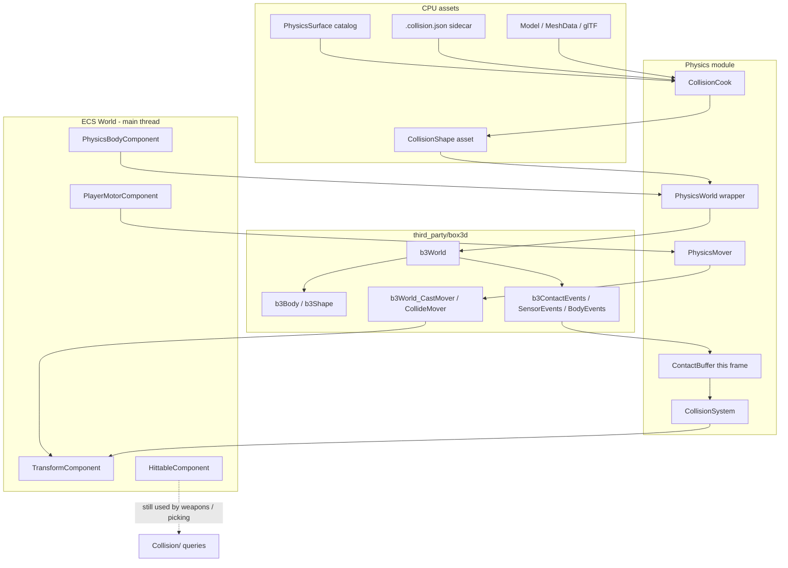
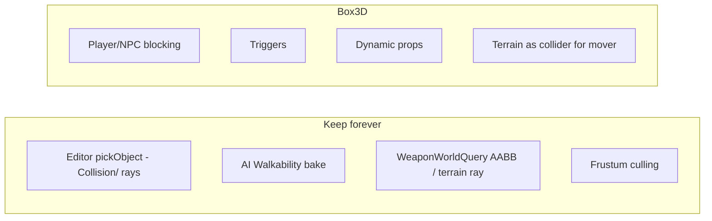

# Box3D Collision System for DarkEngine6

| Field | Value |
|-------|--------|
| **Title** | Box3D collision and physics integration |
| **Author** | DarkEngine6 |
| **Date** | 2026-09-26 |
| **Status** | Draft (rev 3, user decisions incorporated) |
| **Area** | `Physics/` (new), `Collision/` (unchanged query layer), `Character/`, `Assets/`, `ECS/`, `Scene/`, `Sandbox/`, `Editor/`, `UnitTests/` |
| **Audience** | Engine, Sandbox, Editor, and DarkGameplay owners who already know this tree |
| **Scope** | Design only. No production implementation in this document. |
| **Depends on** | Existing query `Collision/`; Box2D host pattern in `Sandbox2D/`; `Character/PlayerMotor`; `Assets/Model`; `Terrain/HeightMap`; `Weapons/WeaponWorldQuery` |

---

## Overview

DarkEngine6 has a solid **query** collision layer (`Collision/`: ray / AABB / OBB / capsule / frustum, static and swept) and a **2D physics** world (Erin Catto's Box2D 3.x, C17, used only by `Sandbox2D`). 3D gameplay still fakes solids: `PlayerMotor` walks on `TerrainGrid::heightAtWorld`, then Sandbox/Editor/AI sweep a 0.45 m sphere against a host-owned list of axis-aligned cubes and spheres. Placed glTF models, rotated OBBs, concave buildings, and terrain mesh collision are not in that list. There is no contact manifold, no trigger volume, no surface friction, and no rigid-body props.

This design vendors **Erin Catto's Box3D** (`https://github.com/erincatto/box3d`, C17, MIT, current public tag **v0.1.0**) at `third_party/box3d` the same way Box2D lives at `third_party/box2d`. A new `Physics/` module wraps the C API with bool/status returns (no C++ exceptions, no `try`/`catch` in engine or Sandbox). Visual `Model` assets cook into `CollisionShape` assets (primitives, convex hulls, triangle meshes, height fields). A `PhysicsWorld` steps on the main thread; a `CollisionSystem` copies a **frame-accumulated** contact / sensor / hit / body-move buffer (appended after each of up to five `b3World_Step`s, drained once) into ECS. Player and NPC locomotion stay **kinematic capsule movers** driven by the existing `PlayerMotor` — not dynamic rigid bodies. v1 mover acceptance is **XZ blocking against cooked statics**; vertical motion stays `PlayerMotor` + height map (ceilings/stairs are a follow-up).

`Collision/` stays. Editor picking, weapon traces, and AI walkability keep using it. Box3D owns **simulation** (blocking, stacking, triggers, character planes, optional dynamic debris). The two layers share coordinates (Y-up, metres) and a documented quaternion mapping; they do not share types.

---

## Background & Motivation

### What 3D collision actually does today

`Collision/` (`Collision/Collision.h`, `StaticCollision.h`, `SweptCollision.h`, `HitResult.h`, plus compiled `StaticCollision.cpp` / `SweptCollision.cpp` / `CapsuleCollision.cpp` in **DarkFoundation**) is a **stateless pairwise query library**, not a physics world. Shapes: point, ray, sphere, capsule, AABB, OBB, frustum. Hits: `StaticHit3D`, `RayHit3D`, `SweptHit3D`. There is no world, no broadphase, no layers, no persistence.

Gameplay uses those queries in three host-owned loops:

| Site | What collides | How |
|------|----------------|-----|
| `Sandbox/SandboxApp.cpp` ~1048–1213 | Player vs PathChase cubes | After `PlayerMotor::tick`, sweep `Sphere3f` radius `kRadius = 0.45f` XZ-only against `m_chase.cubes()` |
| `Editor/EditorPlay.cpp` ~59, 790–813 | Play-mode player vs placed cubes/spheres | Same sphere sweep vs `m_playCubes` / `m_playSpheres` |
| `AI/AiSystem.cpp` `sweepSolids` | Hunters vs the same lists | `kSweepRadius` sphere, XZ-only, shrink by `t - 0.02f` |

Editor play solids (`EditorApp::bakePlayWalkability`) convert scene cubes to `AABox3f` half-extents `0.5 * |scale|` and spheres to `Sphere3f` radius `0.5 * max(|scale|)` because the unit sphere mesh has radius 0.5. **Rotation is ignored. glTF `Model` objects are not solids.** Walkability (`AI/Walkability.h`) bakes the same lists plus the coarse height map into a 2D grid for pathfinding — a different problem from physics.

Weapons (`Weapons/Weapon.cpp`) raycast `HittableComponent` AABBs and `weaponRaycastTerrain`; projectiles (`ProjectileWeapon::tickShot`) sweep a sphere along `velocity * dt`. Melee is a range/dot test, not a collider.

Terrain (`Terrain/HeightMap.h`) already has O(1) bilinear `heightAtWorld` and a min-max pyramid `raycast`. Water swim is a **height comparison** (`PlayerMotorSettings::enterWaterDepth` / `leaveWaterHeight` vs `waterY`), not a volume.

Editor picking (`Editor/EditorSpawn.cpp` `pickObject`) iterates `EditorObjectComponent` and `Collision::Intersect`s AABBs / spheres / model bounds. That path must not start depending on a simulated world.

### What 2D physics actually does today

Box2D is **not** an engine module. `CMakeLists.txt` ~86–113 `add_subdirectory(third_party/box2d EXCLUDE_FROM_ALL)` and only `Sandbox2D` links `box2d`. `Sandbox2DApp.h` includes `<box2d/box2d.h>` and stores `b2WorldId` / `b2BodyId` / `b2ShapeId` on the host.

Pattern to copy (and tighten):

1. `b2WorldDef worldDef = b2DefaultWorldDef(); worldDef.gravity = {0, -38}; b2CreateWorld` — fail with `DE_LOG_ERROR` + `return false` if `!b2World_IsValid`.
2. Static platforms: `b2_staticBody` at AABB center, `b2MakeBox(hx, hy)`, friction 0.6, restitution 0.
3. Player: `b2_dynamicBody`, `motionLocks.angularZ = true`, `enableSleep = false`, rounded box, friction 0, `enableContactEvents = true`.
4. Fixed step `1/60`, sub-steps 4, max 5 steps/frame, accumulator `m_physAccum` (`Sandbox2DApp::updatePlayer`).
5. Control writes velocity (`b2Body_SetLinearVelocity`); after step, `syncPlayerFromBody` copies position/velocity into host state, then into `TransformComponent`.
6. Grounded = scan `b2Body_GetContactData` for manifold normal.y > 0.55.
7. Coins are **not** Box2D sensors — AABB overlap in `collectCoinsHostAuthority`.
8. Network: local pawn has a body; remotes are interpolated sprites (`Network/DESIGN.md`).

`Gameplay/Platform.h` comment is explicit: *"Hosts keep physics handles (Box2D body ids) on their own types."* 3D should **not** repeat that leak. Engine types own handles; hosts do not include `box3d.h`.

Box2D in-tree version: `third_party/box2d/CMakeLists.txt` `VERSION 3.2.0`. Box3D is the 3D successor from the same author, same C17 / id / event / filter design.

### Pain points this change removes

- Placed models (once opted in) and **rotated** boxes do not block the player or hunters.
- No triggers (water volumes, pickups, damage volumes). Footstep material is not a collision property.
- No stacking / debris / kickable props (follow-up PR, not v1 mover).
- Sphere-vs-AABB XZ sweep misses **non-axis-aligned walls** (v1 mover). **Ceilings and stairs remain a follow-up**: v1 still uses height-map Y, so those pain points are *not* closed until a later 3D mover PR.
- `PlayerMotor` ground snap fights any future rigid bodies.
- Duplicated solid lists in Sandbox, Editor, and AI (deleted in PR12 when `useHunterMover` turns on).

### Box3D is not in the repo

Grep for `box3d` / `Box3D` / `b3World` is empty. The design pins:

- **Repo:** `https://github.com/erincatto/box3d`
- **License:** MIT (Erin Catto, 2025)
- **Language:** portable C17, `b3` prefix, data-oriented, optional SIMD (SSE2/Neon)
- **Public tag to pin:** `v0.1.0` (the tag Box3D's own README documents for FetchContent). Bump only with an explicit SHA note in `third_party/box3d`. The library is pre-1.0 and the character mover is marked **experimental** in `docs/character.md`.
- **Vendor path:** `third_party/box3d` (git submodule preferred; full copy acceptable to match Box2D)
- **CMake target:** `box3d::box3d` (or `box3d` if the alias is missing on the pinned tag)

Box3D features we will use (from README + `include/box3d/box3d.h` + `include/box3d/types.h`):

- World: `b3CreateWorld` / `b3DestroyWorld` / `b3World_Step(world, dt, subStepCount)` / `b3World_IsValid`
- Bodies: static / kinematic / dynamic; `b3Body_SetTransform`; kinematic `b3Body_SetTargetTransform(body, target, timeStep, wake)`; motion locks; userData; **`enableContactRecycling` defaults true — set false on pawn bodies**
- Shapes: sphere, capsule, convex hull (`b3MakeBoxHull`, `b3CreateHull` from point cloud, `b3CreateTransformedHullShape` with scale), triangle mesh (static only), height field (static only). Static baked compound on the **v0.1.0 pin** is `b3CreateCompound` / `b3ConvertCompoundToBytes` then `b3CreateCompoundShape` (there is **no** `b3CreateBakedCompoundShape` on that tag). Dynamic/kinematic compounds = multiple shapes on one body.
- Hull lifetime: after `b3CreateHullShape`, Box3D copies hull data — **`b3DestroyHull` immediately**. Mesh and height-field pointers must outlive the shape.
- Events after step (not callbacks during step): `b3World_GetContactEvents`, `GetSensorEvents`, `GetBodyEvents`, `GetJointEvents`. `enableSensorEvents` / `enableContactEvents` / `enableHitEvents` default **false**.
- Sensors, category/mask filters (`b3Filter`, 64-bit), custom filter and pre-solve callbacks
- Queries: `b3World_CastRay` / `CastRayClosest` / `CastShape` / `OverlapAABB` / `OverlapShape`
- Character mover (experimental): `b3World_CastMover` / `CollideMover` take `b3Pos origin` plus a capsule **relative to origin**; then `b3SolvePlanes` and **`b3ClipVector`** on velocity
- Ids: opaque; persist with `b3StoreBodyId` / `b3LoadBodyId` (uint64) and `b3StoreWorldId` / `b3LoadWorldId` (uint32). Do not overlay `b3BodyId` field layouts.
- Surface material: friction, restitution, rolling resistance, tangent velocity, **`userMaterialId`**
- Debug: `b3World_Draw(world, b3DebugDraw*, maskBits)` plus `b3WorldDef.createDebugShape` / `destroyDebugShape` for multi-pass hull/mesh draw
- Determinism: cross-platform with `-ffp-contract=off`; recording/replay exists but is out of v1 scope
- Large worlds: `BOX3D_DOUBLE_PRECISION` off for v1 (play space is metres-scale around origin)

Box3D does **not** define an up axis; gravity is an application vector. Mesh/height-field contacts exist only on **static** bodies. Sensors have **no CCD**. Box3D's own docs warn that `isBullet` is a poor fit for game projectiles — use ray/shape cast instead.

---

## Goals & Non-Goals

### Goals

- Vendor Box3D and wrap it so DarkEngine/Sandbox/Editor never throw and never include `box3d/*.h` outside `Physics/*.cpp`.
- Cook collision geometry from visual models, scene primitives, and terrain height maps.
- Drive player/NPC blocking with a kinematic capsule mover that `PlayerMotor` already conceptually is.
- Import surface properties (friction, restitution, density, sensor, gameplay tags) without overloading PBR `Material`.
- Emit frame-accumulated contact/sensor/hit events into ECS for audio, damage, pickups, water. Footsteps come from **mover planes** (or a downward ray), not solver hit events.
- Keep `Collision/` queries, Editor picking, AI walkability, and weapon traces working without a physics world.
- Incremental, mergeable PRs; `PhysicsWorldDesc.enabled` defaults **false** (world create/step). Host **`usePlayerMover` / `useHunterMover`** are separate. PR9 may turn on the Sandbox **player** mover only; hunters stay on cubes until PR12.

### Non-Goals (v1)

- Replacing Box2D in Sandbox2D. 2D stays Box2D; 3D gets Box3D. No shared "Physics2D/3D" facade in v1.
- Full ragdoll, vehicles, or cloth. Joints are wrapped enough to compile a weld/distance, not shipped as gameplay.
- Soft bodies, destruction, or runtime convex decomposition of arbitrary glTF (v1 hulls are authored or bounds-derived).
- Making every projectile a dynamic `isBullet` body.
- Replacing `AI/Walkability` / `Pathfinder` with physics queries.
- Off-thread `b3World_Step`. `World` is not thread-safe (`docs/plans/2026-09-12-ecs-entity-components.md`).
- `BOX3D_DOUBLE_PRECISION`. Revisit if content lives past ~1e5 m from origin.
- Deterministic lockstep networking. Replication stays transform snapshots (`Network/Replication.h`).
- Cooking a binary `.decol` platform cache in v1 (JSON sidecar + runtime cook is enough; binary cook is a later PR).

---

## Key Decisions

1. **Library = Erin Catto Box3D v0.1.0 at `third_party/box3d`.** Same author/API family as in-tree Box2D 3.2. Rationale: one mental model (ids, events, filters, sensors), C17 so it does not throw, MIT.

2. **New `Physics/` folder in the DarkEngine umbrella, not an extension of `Collision/`.** `Collision/` stays a compiled query library in `DarkFoundation` (`StaticCollision.cpp`, `SweptCollision.cpp`, `CapsuleCollision.cpp`). Physics needs Assets (cook from `Model`/`MeshData`) and must not pull Box3D into Foundation.

3. **Opaque engine handles; Box3D headers stay in `Physics/*.cpp`.** Unlike Sandbox2D's `#include <box2d/box2d.h>`. Gameplay sees `PhysicsBodyId`, `PhysicsShapeId`, `PhysicsWorld`. DarkEngine **PRIVATE**-links `box3d::box3d` (alias `box3d` if needed). UnitTests never include `box3d/*.h`.

4. **Player/NPC = kinematic capsule mover + existing `PlayerMotor`, not a dynamic rigid body.** Box3D's mover API exists for this; dynamic characters fight the solver and would replace jump/coyote/dodge/swim we already own. A **sensor-less kinematic sibling body** is attached so weapons/overlaps/debris can see the pawn. That sibling is **omitted from the mover query filter** (so the capsule does not collide with itself) while still using category Player/Npc so Debris can bounce off it. `enableContactRecycling = false` on pawn bodies.

5. **Split transform authority.** Kinematic characters and editor-moved kinematics: ECS `TransformComponent` is source of truth, written *into* Box3D before the step (or the mover writes ECS after). Dynamic bodies: Box3D is source of truth; `b3BodyEvents` copy into ECS after the step. Static: pose frozen at create.

6. **CollisionShape is a CPU asset, distinct from PBR `Material` and from `Model`.** Visual mesh ≠ collider. Surface properties live in `PhysicsSurface` records referenced by id. GPU cache still only knows Mesh / Material / Model.

7. **Authoring order: named collision nodes > sidecar JSON > editor override > automatic bounds primitive.** Never silently use the render mesh as a dynamic collider. **`SceneObjectType::Model` gets no collider** until a sidecar, `_col*` node, or editor checkbox. Cubes/spheres auto-collide (today's sizes). Pawn capsule radius defaults to **0.45 m** (today's `kRadius` / `kPlayRadius`), not `0.5 * bounds.xz`, until a sidecar exists.

8. **Keep `Collision/` for picking, traces, and walkability.** Box3D world queries are an *additional* option for gameplay rays once the world exists (weapons may opt in later). Do not route Editor `pickObject` through Box3D.

9. **Main-thread step, `workerCount = 1`, fixed 1/60 s, 4 sub-steps, max 5 steps/frame.** Matches Sandbox2D, including `if (steps == maxSteps) accum = 0`. Box3D can take a task system later; v1 does not.

10. **Error policy = Box2D host style.** `b3World_IsValid` / `b3Body_IsValid` / null cook → `DE_LOG_ERROR(LogCategory::Collision, ...)` + `return false`. `b3SetAssertFcn` → `DE_ASSERT` in debug, log in release. No `try`/`catch`/`throw`. Sidecar / `surfaces.json` parse with `nlohmann::json::parse(text, nullptr, false)` like `Scene/SceneFile.cpp` ~315.

11. **Events append into a frame `ContactBuffer` after every `b3World_Step`, then `CollisionSystem` drains once after the catch-up loop.** Never mutate ECS inside Box3D callbacks (`b3CustomFilterFcn` / `b3PreSolveFcn` are thread-unsafe for world writes even at workerCount=1 by policy).

12. **Fast projectiles stay swept queries** (`weaponSweepClosest` / `b3World_CastShape`). Not `isBullet`. Matches Box3D's own projectile warning in `b3BodyDef::isBullet`.

13. **Treat Box3D's CMake as hostile.** v0.1.0 unconditionally sets `CMAKE_MSVC_RUNTIME_LIBRARY` to static `/MT`, `CMAKE_VERBOSE_MAKEFILE ON`, output dirs, and (if unset) `FETCHCONTENT_BASE_DIR` to `${CMAKE_SOURCE_DIR}/.fetchcontent-cache`. DarkEngine never sets CRT today, so MSVC targets are toolchain-default `/MD` with an **empty** `MSVC_RUNTIME_LIBRARY` property. **Before any engine or third-party targets**, the root `CMakeLists.txt` sets `CMAKE_MSVC_RUNTIME_LIBRARY` to `MultiThreaded$<$<CONFIG:Debug>:Debug>DLL` so DarkEngine inherits `/MD` explicitly. **Vendor patch** Box3D (comment out its CRT `set()`, gate `/ZI` on `PROJECT_IS_TOP_LEVEL`, do not set `FETCHCONTENT_BASE_DIR`). After `add_subdirectory`, save/restore output dirs / verbose, then `set_property(TARGET box3d PROPERTY MSVC_RUNTIME_LIBRARY "MultiThreaded$<$<CONFIG:Debug>:Debug>DLL")`. PR1 compares properties after treating empty as `MultiThreadedDLL` — do not require a raw string match against an unset DarkEngine property.

14. **CPU cook lives in DarkEngine, not `AssetManager::loadModel`.** `DarkAssets` cannot call Box3D or `Physics/`. `CollisionShape` holds engine POD (points, indices, samples, surface ids) with **no** `b3*` types; intern via `AssetManager::registerAsset` from a DarkEngine cook TU or host. `b3Create*Shape` happens only in `PhysicsWorld::createBody`. Optional: register a cook callback at init; do not hook `loadModel` without that callback.

15. **Ids are stored with Box3D store/load, not overlaid structs.** Public headers use `uint64_t` body/shape handles (`b3StoreBodyId` / `b3LoadBodyId`) and `uint32_t` world handles (`b3StoreWorldId` / `b3LoadWorldId`). `static_assert` the **stored** size in `Physics/*.cpp`. Never include `box3d/id.h` from a public header. v0.1.0 layouts (`b3WorldId` 4 bytes `{uint16 index1, uint16 generation}`; `b3BodyId`/`b3ShapeId` 8 bytes `{int32 index1, uint16 world0, uint16 generation}`) are internals and may change.

16. **v1 mover is XZ blocking vs cooked statics; Y remains height-map.** Acceptance: rotated walls and opted-in model hulls/meshes block in XZ; **ceilings and stairs are a follow-up PR**. Motor gravity is **not** applied as a second translation after the mover. After `PlayerMotor::tick` (`useExternalBlocking`), the host folds **jump-attack** `applyAirSteering` / `applyConnectSnap` **and** `HitReaction::tick()` into **one** `desiredDelta`, then calls `PhysicsWorld::move` once. No XZ write to `Transform` after that call. Canonical order is frozen in the Character controller section (Sandbox-like: motor → jump extras → knockback → move), not Editor's current hitRx-first order.

17. **No pawn-vs-pawn blocking.** Player mask = World | Trigger | Pickup | Debris. Npc mask = World | Trigger | Debris. Mover query mask = World | Debris (not the other pawn layer). Combat stays `HittableComponent` / jump-attack. Player↔Npc physics stays off.

18. **World tick and pawn movers are separate flags.** `PhysicsWorldDesc.enabled` defaults `false` and means **create/step/bind bodies** (needed for debug draw, sensors, and CastMover queries). Host bools `usePlayerMover` and `useHunterMover` default false and keep today's XZ sphere sweep. **PR9:** Sandbox sets `enabled=true` and `usePlayerMover=true`; hunters stay on `sweepSolids` + `m_chase.cubes()`. Cube field still agrees (dual representation). Opted-in `_col` / sidecar models will block the player and not hunters until **PR12** — do not rely on those as hunter blockers in Sandbox before PR12. **PR10:** Editor Play player may set `usePlayerMover` after Sandbox PR9 is proven; Editor hunters stay on cubes. **PR12:** `useHunterMover=true` in Sandbox and Editor, then delete host cube lists. Rollback: all three false restores the sphere sweep. Walkability bake is independent.

---

## Proposed Design

### Architecture



### Frame loop (3D hosts)

Insert physics inside `Application::onUpdate` (today: `Core/Application.cpp` ~617 `onUpdate(dt)` with no physics). Hosts that opt in call `PhysicsWorld::tick`:

```mermaid
sequenceDiagram
  participant Host as Sandbox/Editor onUpdate
  participant Motor as PlayerMotor
  participant Mover as PhysicsMover
  participant PW as PhysicsWorld
  participant B3 as b3World
  participant CS as CollisionSystem
  participant Xf as TransformComponent

  Host->>PW: tick start: ContactBuffer.clear()
  Host->>PW: syncKinematicsFromEcs()
  Note over PW: static already posed; kinematics SetTargetTransform(body, target, dt, wake)
  Host->>Motor: tick(pos, input, dt, groundQuery) with useExternalBlocking
  Note over Motor: wish velocity, jump, dodge, swim; writes Y vs height map; does not write blocking XZ
  Host->>Host: applyAirSteering on velocity only (no Transform write)
  Host->>Host: desiredDelta = vel.xz*dt + connectSnapDelta + hitRx.tick().xz
  Host->>Mover: move(origin=Transform.position, capsuleRel, desiredDelta, inOutVelocity)
  Mover->>B3: CastMover(origin, relCapsule) + CollideMover + SolvePlanes + ClipVector
  Mover->>Xf: write blocked XZ; clip horizontal velocity
  Note over Host: Frozen order: motor, jump extras, HitReaction, one move. No XZ after move.
  Host->>PW: stepFixed(dt)
  loop while accum >= 1/60 and steps < 5
    PW->>B3: b3World_Step(1/60, 4)
    PW->>PW: append events into ContactBuffer
  end
  Note over PW: if steps == maxSteps: accum = 0 (Sandbox2D hitch clamp)
  Host->>CS: apply(ContactBuffer) once
  CS->>Xf: dynamic body poses from BodyEvents
  CS-->>Host: begin/end/hit/sensor for audio, damage, pickups
```

`PlayerMotor` today both **intends** motion and **applies** XZ translation (`moveHorizontal` writes `position.x/z`) and Y (gravity + `enterGrounded` snap). The mover PR splits that: motor still owns state (Grounded/Jumping/Dodge/…) and **vertical** intent vs terrain/water; **horizontal blocking and horizontal velocity clip** move into the mover. Motor gravity must **not** also be applied as a world-space translation after the mover (double integration). Sphere sweep remains until the **host** `usePlayerMover` / `useHunterMover` flags are on (not merely `PhysicsWorldDesc.enabled`).

### Coordinate frames (pinned)

DarkEngine6:

- Y-up, metres.
- Rendering: left-handed (`Matrix4f::LookAtLHMatrix`, `PerspectiveFovLH*`), row-major / row-vector (`Math/Matrix4f.h`: translation in `m41,m42,m43`).
- Object rotation: Hamilton quaternion `Quaternion {w, x, y, z}` (`Math/Quaternion.h`). `FromAxisAngle(+Y, π/2)` rotates `+X` to `-Z` (same as a right-handed active rotation). `GltfLoader.cpp` copies glTF column-major 16-floats as a memcpy into the row-major array (the documented "transpose of convention").

Box3D:

- No up vector. `b3Vec3 {x,y,z}`, `b3Quat { b3Vec3 v; float s; }` with identity `{ {0,0,0}, 1 }`.
- Column-vector `b3Matrix3` (`cx, cy, cz`). `b3RotateVector` is the same Hamilton product.
- Gravity is whatever we pass: **`(0, -g, 0)`**.

**Mapping (no axis swap):**

| Engine | Box3D |
|--------|--------|
| `Vector3f(x,y,z)` | `b3Vec3{x,y,z}` |
| `Quaternion(w,x,y,z)` | `b3Quat{ {x,y,z}, w }` |
| gravity | `{0, -g, 0}` with `g = PlayerMotorSettings::gravity` (**24**). Sandbox2D uses −38 in 2D units; do not copy that number. |

**Concrete check (unit test `PhysicsFrameMappingTests`, no `box3d.h` in the test TU):**

```text
q = FromAxisAngle(Y_AXIS, π/2)
engine: q.Rotate(X_AXIS) == (0, 0, -1)
wrapper: Physics::rotate(q, X_AXIS) == (0, 0, -1)   // implemented in Physics/*.cpp via b3RotateVector
Physics::roundTripQuat(q) == q (within 1e-5, including double-cover q ≡ -q)
identity body at (3, 4, 5) / identity quat → TransformComponent.position == (3,4,5)
```

`Physics/PhysicsMath.h` exports **engine types only**: `rotate(Quaternion, Vector3f)` and `roundTripQuat(Quaternion)` (implemented in the `.cpp` via `b3Quat` / `b3RotateVector`). No `toB3` / `fromB3` on the public header. If this test ever fails on a Box3D upgrade, **stop** and fix the wrapper — do not silently remap axes.

**Scale:** Box3D bodies do not carry non-uniform scale. At spawn, bake `TransformComponent.scale` into the shape:

- Box / sphere / capsule: multiply local half-extents / radius (capsule radius uses `max(|sx|,|sz|)` if Y is the axis; document the rule).
- Hull: `b3CreateTransformedHullShape(..., transform, scale)` with `b3SafeScale` (Box3D rejects near-zero components).
- Mesh: `b3CreateMeshShape(..., mesh, scale)` — Box3D allows non-uniform and negative scale, forbids zero.
- Negative scale (mirrors): allowed on mesh/hull via Box3D; log a warning on capsules/spheres and use absolute radius.

**Winding:** v0.1.0 collision docs do **not** document back-face ignore as a guaranteed mesh/HF ray rule (main-branch `b3World_CastRay` comments mention it; **verify on the pin** by reading `b3RayCastMesh` at vendor time). Cook glTF triangles as they are (glTF CCW). Unit test: ray from `+Y` onto a ground quad at y=0 must hit with normal ≈ `+Y`. If it misses, flip index winding in the cook, not in the renderer.

**Handedness vs camera:** LH view does not change world XYZ. Physics and gameplay stay in the same world space the renderer already uses for `TransformComponent`.

---

## A. Building collision models from object models

### CollisionShape asset

New CPU asset `Physics/CollisionShape.h` (not a `Material`, not a GPU object):

```cpp
enum class CollisionGeom : uint8_t
{
    None = 0,
    Sphere,      // radius
    Capsule,     // pointA, pointB, radius  (Y-up default for pawns)
    Box,         // halfExtents, local rotation
    Hull,        // cooked convex (from points or authored mesh)
    Mesh,        // triangle soup, STATIC bodies only
    HeightField, // regular grid, STATIC only
    Compound,    // list of child geoms + local xforms
};

struct CollisionPart
{
    CollisionGeom geom = CollisionGeom::Box;
    Math::Vector3f   localPos{ 0, 0, 0 };
    Math::Quaternion localRot{ 1, 0, 0, 0 };
    Math::Vector3f   localScale{ 1, 1, 1 }; // baked at cook for hull/mesh
    float radius = 0.5f;
    Math::Vector3f halfExtents{ 0.5f, 0.5f, 0.5f };
    Math::Vector3f capsuleA{ 0, 0.0f, 0 };   // relative to Transform.position (= today's sweep-sphere center)
    Math::Vector3f capsuleB{ 0, 0.9f, 0 };   // + 2*radius → ~1.8 m tall; XZ radius still 0.45
    uint32_t surfaceId = 0; // PhysicsSurface catalog index
    bool sensor = false;
    uint64_t categoryBits = 0;
    uint64_t maskBits = 0;
    // hullPoints / mesh vertices+indices / height samples live in CollisionShape
    // NO b3HullData*, b3MeshData*, b3HeightFieldData* — those exist only inside PhysicsWorld
};

class CollisionShape : public Asset
{
    // parts[], bounds, sourcePath; AssetType::CollisionShape
};
```

Intern via `AssetManager::registerAsset` from a **DarkEngine** cook TU (`Physics/CollisionCook.cpp`) or host spawn, **not** from `AssetManager::loadModel` (DarkAssets cannot depend on Physics/Box3D). GPU cache never sees it (`GpuResourceCache` still only Mesh / Material / Model).

### How a glTF / Model becomes shapes

`Model` (`Assets/Model.h`) is a list of `Part { MeshData, Material, localToRoot, name, skinned }`. `GltfLoader` does not read extras today. Cooking is a **separate pass** over the CPU model plus optional sidecar.

**Priority (first match wins per node / per entity):**

1. **Named collision nodes** in the glTF (and procedural models that set `Part::name`):
   - `_col` / `_phys` / `col_` prefix/suffix: include in cook.
   - `_colconv` / `_hull`: force convex hull of that node's positions (CPU points; `b3CreateHull` only at `createBody`).
   - `_colmesh` / `_trimesh`: triangle mesh (static only).
   - `_colbox` / `_colsphere` / `_colcapsule`: fit primitive to that node's bounds.
   - glTF extras are **out of v1** (sidecar + named nodes only).
2. **Sidecar** `content/models/<name>.collision.json` next to the glTF (same virtual-path lookup as materials). Overrides node heuristics, can replace the whole compound. Parse with `json::parse(text, nullptr, false)`.
3. **Editor / scene override** on `SceneObjectData` / `PhysicsBodyComponent` (primitive type, surface id, sensor).
4. **Automatic fallback** (primitives and pawns only — **not** `SceneObjectType::Model`):
   - Spheres (`SceneObjectType::Sphere`): sphere, radius `0.5 * max(|scale|)` — preserve today's Editor convention.
   - Cubes: box, half-extents `0.5 * |scale|`.
   - Pawns (`Player` / `Hunter` / `Wolf`): **capsule** along Y, radius **0.45 m** (today's `kRadius` / `kPlayRadius`), height from bounds Y or a 1.8 m default. Do **not** use `0.5 * max(x,z) extents` until a sidecar exists — human glTF arm hang would widen the pawn past today's sweep. Walkability `agentRadius = 0.8` stays a pathfinding inflate, not the physics capsule.
   - `SceneObjectType::Model`: **no collider** until sidecar, `_col*` node, or editor checkbox.
   - Never auto-cook a triangle mesh from a skinned character. Skinned render mesh as collider is a non-goal.

**Collision-only draw skip (concrete):** at CPU model build in DarkAssets (`Model::createFromParsed` / `createFromParts`), if `Part::name` matches the collision prefixes above, set `Part::collisionOnly = true` and **do not** push that part into `opaque()` / `translucent()`. Keep it on `Model::collisionParts()`. `expandBoundsFromPart` runs only for **visual** parts, so `Model::bounds()` (and Editor `pickObject` via `usesModelBounds`) match what is drawn, not hidden `_col` meshes.

`Model::valid()` today is `!opaque.empty() || !translucent.empty()` and `createFromParsed` fails if `!valid()`. Change it to **has visual or collision parts** so a `_col*`-only helper glTF still interns. `partCount` / `partAt` stay visual-only (opaque then translucent). `GpuResourceCache::ensureModel` already uploads only `opaque()` / `translucent()` — **do not** change it and do not iterate `partAt` for collision parts. DarkEngine `CollisionCook` reads `collisionParts()` + sidecar. This is a name filter in Assets, not a Physics dependency.

Tests: `_col`-only file still interned (`valid()==true`, empty opaque); mixed file has `_col` absent from `opaque()`.

**LOD:** v1 stores one collision LOD. If a glTF has both `Tree_LOD0` and `Tree_col`, only `_col` is used. Do not generate hulls from high-poly LOD0 automatically (cost and concavity). Optional later: `maxHullVerts` in the sidecar (default 32).

**Compound:** multiple `CollisionPart`s on one body. Box3D runtime compounds = multiple shapes on one body (dynamic/kinematic OK). Static baked compounds on the v0.1.0 pin: `b3CreateCompound` / `b3ConvertCompoundToBytes` then `b3CreateCompoundShape` (static only) — use for streamed buildings if we batch, not for pawns.

**Convex vs mesh:**

| Use | Geom | Body type |
|-----|------|-----------|
| Player, hunter, wolf | Capsule | Kinematic (mover) + optional body for queries |
| Pickup, health pack | Sphere sensor | Kinematic or static sensor |
| Crate / debris | Box or hull | Dynamic |
| Tree trunk | Capsule or hull | Static |
| Building, cave, concave | Triangle mesh | Static only |
| Terrain | Height field | Static only |
| Water volume | Box/mesh **sensor** | Static sensor |

If `b3CreateHull` returns NULL (degenerate, coplanar), log `DE_LOG_ERROR(LogCategory::Collision, ...)` and fall back to the part AABB box. Do not leave the entity without a collider if the sidecar requested one.

### Authoring files

**Sidecar schema** (`content/models/tree.collision.json` example):

```json
{
  "version": 1,
  "root": {
    "body": "static",
    "parts": [
      {
        "node": "trunk_col",
        "geom": "capsule",
        "surface": "wood",
        "category": "World"
      },
      {
        "node": "canopy_colconv",
        "geom": "hull",
        "maxVerts": 24,
        "surface": "foliage"
      }
    ]
  }
}
```

**Do not** stuff friction into PBR material JSON (`Assets/Material.h` is albedo/MR/normal/ORM/emissive only). **Do not** read glTF extras in v1 (loader has no extras map). Sidecar + named `_col*` nodes are the authoring path.

Editor: a Collision section on the selected object (geom enum, surface dropdown, sensor checkbox, show collider). Persistence goes into `SceneObjectData` (new optional fields) so play-mode and Sandbox scene load agree. Scene JSON version bump when those fields ship.

### When generation happens

| When | What | Why |
|------|------|-----|
| **DarkEngine cook / host spawn** (`Physics/CollisionCook.cpp`, not `loadModel`) | Build CPU `CollisionShape` from sidecar + `Model::collisionParts()` + bounds fallback; `registerAsset` | DarkAssets cannot link Box3D; cook is POD only |
| **`PhysicsWorld::createBody`** | `b3Create*Shape` from that POD | Box3D types stay in `Physics/*.cpp` |
| **First spawn** if no cooked shape | Fallback bounds primitive for cubes/spheres/pawns | Procedural `createFromParts` trees stay Model-opt-in |
| **Terrain bake / grid load** | Copy `HeightMap` samples into a `CollisionShape`-owned float buffer; create static HF body | Box3D holds a pointer — **do not alias live sculpt memory** |
| **Not at import-time offline cook in v1** | No DarkAssets CLI required | Keep the first PRs host-only |
| **Editor transform edit** | Recreate or `b3Body_SetTransform` + rebuild scaled shape if scale changed | Scale is baked; rotation/translation of statics is a teleport (`SetTransform` is documented expensive — acceptable in editor) |
| **Editor terrain sculpt** | Rebuild the HF collider (or disable the physics HF while sculpting) | Sample buffer would otherwise be stale |

**Box3D resource lifetime:** hulls — `b3CreateHull` then `b3CreateHullShape` then **`b3DestroyHull` immediately** (world copies). Mesh (`b3MeshData*`) and height field (`b3HeightFieldData*`) pointers must remain valid for the shape lifetime; `PhysicsWorld` owns those cooked blobs and destroys them **after** the shape/body is destroyed. CPU `CollisionShape` keeps the engine float/index arrays used to rebuild.

### Static world vs dynamic actors

| Actor | Body type | Shape | Notes |
|-------|-----------|-------|--------|
| Terrain coarse HF | static | height field | **One** HF from the live coarse `HeightMap`. Sandbox default is **129×129** (`SandboxApp.cpp` `createFbm(129, 129, …)`). `kMaxHeightMapSize = 1025` is a cap. Motor Y stays `heightAt`. Streaming tiles are out of v1 |
| Water | static sensor | box or mesh | Splash/FX only. Swim stays `PlayerMotor` `waterY` height |
| Scene cube/sphere | static (default) or dynamic if tagged | box / sphere | Preserve Editor play sizes |
| Scene Model (building) | static | mesh or compound | |
| Scene Model (prop, `dynamic=true`) | dynamic | hull/box | Density from surface |
| Player / hunter / wolf | kinematic mover + kinematic body (filter: does not block self) | capsule | Motor + mover; body exists so rays/overlaps work |
| Projectile | **no body** in v1 | — | Existing sweep / optional `CastShape` |
| Pickup | static or kinematic sensor | sphere | Replaces AABB coin test in 3D |

Skinned meshes: collider is a **single capsule or compound of a few capsules** at rest pose, not per-bone in v1. Hit boxes for weapons stay `HittableComponent` AABBs unless a later PR adds bone capsules.

### Procedural Sandbox objects

PathChase trees/walkers already spawn as ECS `ModelComponent` (`topics/sandbox-pathchase.md`). After cook, `PhysicsWorld::createBodyFromEntity` reads `ModelComponent` + `CollisionShape` (trees need sidecar/`_col` to collide). `PathChase::cubes()`, `EditorApp::m_playCubes` / `m_playSpheres`, `AiSystem::tickHunters(..., cubes, cubeCount, spheres, sphereCount)`, and `WalkabilityDesc::{cubes,spheres}` stay until **PR12**.

**PR9 gap (accepted):** Sandbox `usePlayerMover=true` while hunters still `sweepSolids` on cubes. Axis-aligned PathChase cubes exist in both representations, so player vs hunter still agree on that field. **Opted-in `_col` / sidecar models block the player and not hunters until PR12.** Do not treat those models as pack blockers in Sandbox before PR12. Editor Play follows the same split (player mover in PR10, hunters in PR12).

### Terrain height-field mapping (v1)

`Terrain::HeightMap` (`Terrain/HeightMap.h`): sample `(0,0)` sits at `origin`; `worldX = origin.x + x * cellSize`, `worldZ = origin.z + z * cellSize`; world Y = `origin.y + raw * heightScale`. Samples are **raw**, size `width * height`.

Box3D `b3HeightFieldDef` wants `heights[countX * countZ]`, `scale` as cell spacing (x/z) and height scale (y), plus `globalMinimumHeight` / `globalMaximumHeight`.

**Specified mapping:**

- Copy samples into a `CollisionShape`-owned `std::vector<float>` (do **not** pass `HeightMap::mutableSamples()` / live sculpt memory).
- Body pose = heightmap **origin** (`Transform` translation = `origin`; identity rotation).
- `scale = { cellSize, heightScale, cellSize }`.
- `countX = width`, `countZ = height`.
- `globalMinimumHeight` / `globalMaximumHeight` = min/max of the **copied** buffer (required for consistent quantization if we later stitch tiles).
- Index order: engine `height(x, z)` is the sample at column x, row z. Pin Box3D's major axis with a unit test: a spike at engine `(x=1, z=0)` vs `(x=0, z=1)` on an otherwise flat field; a ray at the corresponding world XZ must hit the spike. Implementer records whether Box3D is `z * countX + x` or `x * countZ + z` and copies accordingly.
- Flat-plane test: all zeros, `origin.y = 5`, `heightScale = 1` → mover/ray at that XZ hits y ≈ 5.
- Perf: measure **129²** first (current Sandbox coarse). 1025² is a later measurement, not the v1 default scene.
- Editor sculpt: rebuild the HF (re-copy + destroy/recreate shape) on sculpt end, or set `enabled` HF off while the working map is dirty.

---

## B. Handling responses from Box3D

### Event model (no in-step ECS writes)

Box3D buffers events and returns them **after** `b3World_Step`:

- `b3ContactEvents`: begin, end, hit (speed > `hitEventThreshold`)
- `b3SensorEvents`: begin/end overlap (validate ids with `b3Shape_IsValid` — end events can refer to destroyed shapes)
- `b3BodyEvents`: bodies that moved this step + `fellAsleep`
- `b3JointEvents`: out of v1 gameplay

`b3CustomFilterFcn` and `b3PreSolveFcn` are optional, may run on workers, **must not** touch `World` or Box3D. v1: do not register pre-solve. Custom filter only if category bits are insufficient (e.g. "owner's own projectile").

Wrapper copies into a **POD frame buffer** owned by `PhysicsWorld`: **cleared once at `tick` start**, **appended after every** `b3World_Step` (up to 5), **drained once** after the loop. If `steps == maxSteps`, set `accum = 0` (Sandbox2D hitch clamp at `Sandbox2DApp.cpp` ~1178–1179) so catch-up cannot spiral. Pointers into Box3D event arrays are not stored — memcpy into engine PODs immediately.

```cpp
struct PhysicsContactEvent
{
    Entity a{};
    Entity b{};
    Math::Vector3f point{};
    Math::Vector3f normal{}; // A → B, matching b3ContactHitEvent
    float approachSpeed = 0.0f;
    uint32_t surfaceIdA = 0;
    uint32_t surfaceIdB = 0;
    enum class Kind : uint8_t { Begin, End, Hit } kind = Kind::Begin;
};

struct PhysicsSensorEvent
{
    Entity sensor{};
    Entity visitor{};
    enum class Kind : uint8_t { Begin, End } kind = Kind::Begin;
};

class ContactBuffer
{
    std::vector<PhysicsContactEvent> contacts;
    std::vector<PhysicsSensorEvent>  sensors;
    // body moves applied directly to Transform, not stored as gameplay events
};
```

`userData` on `b3Body` / `b3Shape` stores `EntityID` (uint32) packed in the pointer-sized field, or a generation-checked handle. **Never** store `Entity` by value across a `destroyEntity` without generation.

### CollisionSystem

New `Physics/CollisionSystem.cpp`, called from the host after `PhysicsWorld::step`:

| Event | Consumer |
|-------|----------|
| Sensor begin/end + surface tag `water` | Splash / FX only. Swim stays `PlayerMotor` `waterY` |
| Sensor begin + tag `pickup` | Host-authority collect (same rule as `collectCoinsHostAuthority`) |
| Sensor begin + tag `damage` | `CombatSystem` / `Health` |
| Contact **hit** (speed > threshold) | Impact audio / debris slams **only** on solver bodies (dynamic props). **Not footsteps.** |
| Mover plane + `userMaterialId` | Footsteps (`AudioSystem::play3D` via catalog clip). Fallback: downward `castRayClosest` under the capsule. |
| Body move | `TransformComponent.position/rotation` for `BodyMode::Dynamic` |
| Body `fellAsleep` | Skip interpolation; optional skip anim |

**Event flags (v0.1.0 defaults are false):**

- Every sensor: `isSensor = true` **and** `enableSensorEvents = true`.
- Debris / other solver shapes that need begin/end or hits: `enableContactEvents` / `enableHitEvents` as required.
- Kinematic pawn sibling: do **not** enable hit events for walking (the mover is outside the solver; walking on statics will **not** emit `b3ContactHitEvent`). Enable contact on the sibling only if we need debris to generate pawn-side contact events; footsteps still come from planes.
- `b3ContactHitEvent` is a speed-threshold impact, not a gait event.

Stun/CC that currently zeros motor input also **cancels a charge** (existing hold-to-charge). Physics does not fire gameplay attacks.

Manifolds: available via `b3Body_GetContactData` for "is grounded" if we ever need them. The **mover** should own grounded for the player (plane normal.y). Do not mix motor grounded (height map) and physics grounded without a single function `sampleGround` that both call.

### Character controller recommendation

**Use Box3D's geometric capsule mover, not a dynamic rigid body, for player and NPCs.**

Reasons, given this codebase:

- `PlayerMotor` is already a kinematic controller: wish speed, gravity, coyote, jump buffer, double jump, dodge, crouch, swim. Sandbox2D's *dynamic* box with `angularZ` lock is the 2D analog and still needs manual grounded tests; 3D dynamic capsules notoriously fight stairs, head hitches, and jump height.
- Box3D `docs/character.md` (experimental): 7-step loop — compute desired translation → `b3World_CastMover(world, origin, relCapsule, translation, filter, …)` → move by returned fraction → `b3World_CollideMover` → assemble `b3CollisionPlane`s → `b3SolvePlanes` → apply delta → **`b3ClipVector` on velocity**. The public wrapper must expose that, not a position-only helper.
- Current 3D code already does "cast then shrink t by 0.02" against a sphere. v1 mover is that algorithm against cooked statics **in XZ**.
- Today the blocking delta is **everything** from `before` to post-motor/jump/hit, then one sphere sweep. Sandbox (`SandboxApp.cpp` ~1163–1211): motor → `applyAirSteering` (rewrites XZ from `before`) → `applyConnectSnap` → **`hitRx->tick` adds to position** → sweep. Editor (`EditorPlay.cpp` ~785–821): motor → **`hitRx->tick` first (~789–790)** → air steering / connect snap (**~792–803**, not the `PlayerGroundQuery` lambda at 778–783) → sweep. **v1 freezes Sandbox order** for every 3D host:

  1. Snapshot `before = xf.position`.
  2. `PlayerMotor::tick` with `useExternalBlocking` (Y on the transform; XZ velocity intended, position.xz not written).
  3. If jump `inAirCommit`: `applyAirSteering` updates **velocity only** (do not write `Transform`).
  4. `desiredDelta = (vel.x, 0, vel.z) * dt`.
  5. Add connect-snap as an XZ extra (compute on a temp position or return a delta; **do not** commit `Transform` yet).
  6. Add `HitReaction::tick(dt)` XZ (same: extra vector, no write).
  7. **One** `PhysicsWorld::move`.
  8. Write blocked XZ + `setHorizontalVelocity` from clipped velocity.

  Knockback/connect-snap that skip the mover would tunnel into cooked statics. Unit test: knockback delta into a wall does not penetrate.

**v1 acceptance (product vs implementation):** XZ blocking vs cooked statics (rotated boxes, opted-in model hulls/meshes, cube/sphere primitives). **Y remains `PlayerGroundQuery::heightAt` / `groundOffset`.** Ceilings, stairs, and mesh-walkable slopes are a **follow-up PR** that starts applying mover planes to Y and clipping `m_velocity.y`. Do not advertise v1 as fixing those.

**Mover capsule defaults** (overridable on `PhysicsBodyComponent`):

Today's XZ sweep is a sphere **centered at `Transform.position`** with radius 0.45 (`SandboxApp.cpp` ~1198, `EditorPlay.cpp` ~808). `enterGrounded` sets `position.y = groundY + groundOffset` with `groundOffset = 0.5`, so that sphere occupies roughly `groundY+0.05 … groundY+0.95`. **`Transform.position` is that sphere center, not feet.** Do not move `groundOffset` to 0.

Pin the capsule to the same center so CastMover (still a 3D query) matches the cube-field sweep:

- `origin` = `Transform.position` (the `b3Pos` Cast/CollideMover are relative to).
- Relative `center1 = (0, 0, 0)` — bottom sphere coincides with today's sweep sphere. Capsule bottom = `origin.y - radius` = `groundY + 0.05`.
- Relative `center2 = (0, 0.9, 0)` — total height `(0.9 + 2*0.45) = 1.8 m`; XZ radius unchanged so unit cubes still block the same way.
- Radius **0.45 m**, not bounds-derived until a sidecar exists.
- Hunters/wolves override **`center2.y` (height)**, not radius, from bounds Y if needed.

Unit test: grounded pawn (`position.y = 0.5`) vs a unit cube at origin (half-extents 0.5, top at y=0.5) must block in XZ the same way `SweptIntersects(Sphere3f(position, 0.45), delta, cube)` does. A capsule with `center1.y = radius` would sit on top of that cube and fail this test.

**Kinematic sibling:** `b3_kinematicBody` + capsule, `enableContactRecycling = false`. Category Player (or Npc). **Mover query filter omits the Player (or Npc) bit** so CastMover does not hit the sibling. Sibling **does** collide with Debris (Player mask includes Debris; Debris mask includes Player). Update after the mover with `b3Body_SetTargetTransform(body, xf, timeStep, /*wake=*/true)` or `SetTransform` on teleports.

**Ground query:** keep `PlayerGroundQuery::heightAt` for swim/terrain Y in v1. Mover reports `grounded` when any plane has `normal.y > 0.55` (Sandbox2D's threshold) plus `surfaceId` from `userMaterialId` for footsteps. Do not also snap Y from those planes in v1.

**Velocity:** `PlayerMotor::m_velocity` XZ is an **in/out** to the mover. After planes, `b3ClipVector` (or equivalent) writes back so the next motor tick does not keep a wall-penetrating wish. Y from the motor (jump, gravity, dodge) is unchanged in v1.

**NPCs:** same capsule math when host `useHunterMover` is on (PR12). Until then `AiSystem::sweepSolids` uses cube/sphere arrays. Walkability grid **stays** for path planning.

### Trigger volumes

Sensors: `b3ShapeDef.isSensor = true` and **`enableSensorEvents = true`** (Box3D defaults sensor events **off** even for sensors). No contact response. No CCD — large fast visitors should be ray-tested if needed.

v1 triggers:

- Water (placed water bodies and/or a world-sized slab at `waterLevel`)
- Pickups / health packs
- Optional kill-Z volume

**Not** sensors: AI sight (`AI/Sight.cpp`), melee cones, editor pick. Those stay gameplay queries.

### Continuous collision vs discrete

- World: `enableContinuous = true` (Box3D default). Protects dynamic vs static tunneling.
- Characters: mover cast is already continuous along the translation.
- Projectiles: **shape/ray cast** along `velocity * dt` (existing `weaponSweepClosest`). Optional: `b3World_CastShape` with the same filter. Do not enable `isBullet` on projectiles.
- Sensors: discrete overlap only.

### Filtering

`b3Filter` is 64-bit category/mask + groupIndex. Engine enum (bits, not dense indices):

```cpp
enum class PhysicsLayer : uint64_t
{
    World      = 1ull << 0,
    Player     = 1ull << 1,
    Npc        = 1ull << 2,
    Projectile = 1ull << 3,
    Trigger    = 1ull << 4,
    Debris     = 1ull << 5,
    Pickup     = 1ull << 6,
};
```

Default masks (**v1 frozen — no pawn-vs-pawn**):

| Layer | Collides with |
|-------|----------------|
| World | Player, Npc, Debris, Projectile (query) |
| Player | World, Trigger, Pickup, Debris |
| Npc | World, Trigger, Debris |
| Projectile | World, Player, Npc (query only) |
| Trigger | Player, Npc |
| Debris | World, Player, Npc, Debris |
| Pickup | Player |

GroupIndex: unused in v1 (reserved for ragdoll self-exclusion). Query filters for weapons omit `Trigger` and `Pickup` unless the weapon is a gather.

**Mover query filter:** category = Player (or Npc), mask = **World | Debris** (not the other pawn layer, not self). Sibling kinematic body uses the table above so Debris can hit the pawn while CastMover ignores the sibling. Player↔Npc physics stays off.

### Threading

- `ECS/World` is unsynchronized. `b3World_Step` in v1 runs on the **main thread** inside `onUpdate`, same as Box2D in Sandbox2D.
- `b3WorldDef.workerCount = 1`. Do not pass enqueue/finish task callbacks. Box3D may still use SIMD.
- Future: `workerCount > 1` with Box3D's internal scheduler is allowed **only if** no engine callback touches ECS. Custom filter must stay pure.
- Do not call `b3World_Step` from a job that cannot park (Box3D docs: deadlock risk).

### Error policy

```cpp
bool PhysicsWorld::create(const PhysicsWorldDesc& desc)
{
    b3WorldDef def = b3DefaultWorldDef();
    def.gravity = { 0.0f, -desc.gravity, 0.0f };
    def.workerCount = 1;
    def.enableSleep = true;
    def.enableContinuous = true;
    m_id = b3CreateWorld(&def);
    if (!b3World_IsValid(m_id))
    {
        DE_LOG_ERROR(LogCategory::Collision, "PhysicsWorld: b3CreateWorld failed");
        m_id = {};
        return false;
    }
    return true;
}
```

Cook failures: log + fallback primitive or skip body (`PhysicsBodyComponent::valid == false`). Missing sidecar is not an error.

`b3SetAssertFcn`: debug breaks via `DE_ASSERT`; release logs `DE_LOG_ERROR` and continues if Box3D allows. Do not throw from the assert hook.

---

## C. Importing surface properties

### PhysicsSurface ≠ PBR Material

`Assets/Material.h` is a linear Rec.709 PBR recipe (albedo, metallic, roughness, normal, ORM, emissive). Overloading it with friction would couple footstep audio to specular and break the asset-split rule (CPU material interned for GPU heaps).

New catalog `content/physics/surfaces.json`:

```json
{
  "version": 1,
  "surfaces": [
    { "id": "default", "friction": 0.6, "restitution": 0.0, "density": 1.0, "rolling": 0.0,
      "tags": ["generic"], "footstep": "audio/foot_dirt.wav" },
    { "id": "wood",    "friction": 0.5, "restitution": 0.05, "density": 0.7, "tags": ["wood"],
      "footstep": "audio/foot_wood.wav" },
    { "id": "metal",   "friction": 0.4, "restitution": 0.2, "density": 3.0, "tags": ["metal"] },
    { "id": "water",   "friction": 0.0, "restitution": 0.0, "density": 0.0, "sensor": true,
      "tags": ["water"] },
    { "id": "hurt",    "friction": 0.6, "restitution": 0.0, "density": 0.0, "sensor": true,
      "tags": ["damage"], "damagePerSecond": 10 }
  ]
}
```

Loaded once at physics world create. Ids are interned to `uint32_t` for components and to `uint64_t userMaterialId` on `b3SurfaceMaterial`.

### Where properties live

| Property | Source | Box3D field |
|----------|--------|-------------|
| friction | PhysicsSurface | `b3SurfaceMaterial.friction` (mix: sqrt product, Box3D default) |
| restitution | PhysicsSurface | `restitution` (mix: max) |
| rolling resistance | PhysicsSurface | `rollingResistance` (spheres/capsules) |
| density | PhysicsSurface | `b3ShapeDef.density` (kg/m³); sensors may be 0 |
| sensor | PhysicsSurface and/or part flag | `isSensor` |
| conveyor | sidecar optional | `tangentVelocity` |
| footstep clip, climbable, damage type | **engine only** | `userMaterialId` + catalog lookup |
| debug color | optional | `customColor` |

Per-triangle materials on static meshes: `b3ShapeDef.materials` + `b3MeshDef.materialIndices` when we cook terrain splats or painted meshes. v1 terrain uses **one** surface (`dirt` / `grass`) for the whole HF; splat-based surfaces are a later PR.

glTF extras: out of v1. Sidecar `surface` string is the authoring path.

PBR roughness does **not** drive friction. An artist can name them similarly (`wood` albedo, `wood` surface) but the ids are independent.

---

## D. Other decisions required to use the system

### Ownership and CMake

**New folder `Physics/`**, globbed into `DE_ENGINE_REST_FOLDERS` in `cmake/DarkEngineTargets.cmake` (alongside Character, Terrain, Water). That puts it on the `DarkEngine` umbrella, which already PUBLIC-links DarkFoundation / DarkAssets / DarkGameplay.

Do **not** put Box3D in `DarkFoundation` (would force every test of `AABox3f` to link physics). Do **not** put it only on Sandbox (Editor Play and UnitTests need it). Do **not** add a `DarkPhysics` STATIC layer in v1; stay on the umbrella unless a later link-hygiene problem forces it.

**Vendor patch** on `third_party/box3d/CMakeLists.txt` (keep a one-file diff next to the pin; same idea as in-tree Box2D having the CRT line **commented out**):

- Comment out `set(CMAKE_MSVC_RUNTIME_LIBRARY "MultiThreaded$<$<CONFIG:Debug>:Debug>")` (unconditional on v0.1.0, not `PROJECT_IS_TOP_LEVEL`).
- Gate `/ZI` / incremental hot-reload on `PROJECT_IS_TOP_LEVEL`.
- Do not set `FETCHCONTENT_BASE_DIR` to `${CMAKE_SOURCE_DIR}/.fetchcontent-cache` (that would create a cache dir at the engine root).

Root `CMakeLists.txt`: set CRT **once before** `include(cmake/DarkEngineTargets.cmake)` so DarkEngine is not left with an empty property:

```cmake
set(CMAKE_MSVC_RUNTIME_LIBRARY "MultiThreaded$<$<CONFIG:Debug>:Debug>DLL")
```

Then the Box3D block (mirror Box2D ~86–113) **forces the box3d target CRT**:

```cmake
set(BOX3D_SAMPLES OFF CACHE BOOL "Build the Box3D samples" FORCE)
set(BOX3D_UNIT_TESTS OFF CACHE BOOL "Build the Box3D unit tests" FORCE)
set(BOX3D_BENCHMARKS OFF CACHE BOOL "Build the Box3D benchmarks" FORCE)
set(BOX3D_DOCS OFF CACHE BOOL "Build the Box3D documentation" FORCE)
set(BOX3D_PROFILE OFF CACHE BOOL "Enable profiling with Tracy" FORCE)
set(BOX3D_VALIDATE OFF CACHE BOOL "Enable heavy Box3D validation" FORCE)
set(BOX3D_DOUBLE_PRECISION OFF CACHE BOOL "Double precision world positions" FORCE)

set(_de_save_runtime_outdir "${CMAKE_RUNTIME_OUTPUT_DIRECTORY}")
set(_de_save_library_outdir "${CMAKE_LIBRARY_OUTPUT_DIRECTORY}")
set(_de_save_verbose "${CMAKE_VERBOSE_MAKEFILE}")
set(_de_save_msvc_crt "${CMAKE_MSVC_RUNTIME_LIBRARY}")
set(_de_save_fetchcontent_base "${FETCHCONTENT_BASE_DIR}")

add_subdirectory(third_party/box3d EXCLUDE_FROM_ALL)

set(CMAKE_RUNTIME_OUTPUT_DIRECTORY "${_de_save_runtime_outdir}")
set(CMAKE_LIBRARY_OUTPUT_DIRECTORY "${_de_save_library_outdir}")
set(CMAKE_VERBOSE_MAKEFILE "${_de_save_verbose}")
if (_de_save_msvc_crt)
    set(CMAKE_MSVC_RUNTIME_LIBRARY "${_de_save_msvc_crt}")
else()
    unset(CMAKE_MSVC_RUNTIME_LIBRARY)
endif()
if (_de_save_fetchcontent_base)
    set(FETCHCONTENT_BASE_DIR "${_de_save_fetchcontent_base}")
endif()

# Restoring the global does not change the box3d target. Force /MD to match DarkEngine.
if (TARGET box3d)
    set_property(TARGET box3d PROPERTY MSVC_RUNTIME_LIBRARY "MultiThreaded$<$<CONFIG:Debug>:Debug>DLL")
    set_target_properties(box3d PROPERTIES FOLDER "ThirdParty")
endif()
if (TARGET box3d::box3d)
    # alias only; CRT is on the real target
endif()
```

`target_link_libraries(DarkEngine PRIVATE box3d::box3d)` (or `box3d` + `add_library(box3d::box3d ALIAS box3d)`). PRIVATE so Sandbox/Editor/UnitTests do not get Box3D include dirs. `de_engine_target_common` PUBLIC-includes `third_party/`, which does **not** contain `box3d/include/`; that path must not be added to DarkEngine PUBLIC includes.

PR1 check: after configure, resolve each target's `MSVC_RUNTIME_LIBRARY` (**empty → `MultiThreadedDLL`**) and require they match (`MultiThreaded$<$<CONFIG:Debug>:Debug>DLL` / `/MD`). Do not compare an unset DarkEngine property to an explicit box3d string. Mixing `/MT` and `/MD` in one EXE is a link/runtime blocker.

`.gitignore`: add `third_party/box3d/build/` like `third_party/box2d/build/`. Do **not** gitignore a root `.fetchcontent-cache` as a substitute for stopping Box3D from creating it.

Box3D requires **C17**. DarkEngine is C++23; MSVC accepts the Box3D C sources as a separate target. Do not compile Box3D `.c` files into `DarkEngine`.

### Wrapper types

```cpp
// Physics/PhysicsIds.h — POD, no box3d.h, no overlay of b3*Id
using PhysicsWorldId = uint32_t; // b3StoreWorldId / b3LoadWorldId
using PhysicsBodyId  = uint64_t; // b3StoreBodyId  / b3LoadBodyId
using PhysicsShapeId = uint64_t; // b3StoreShapeId / b3LoadShapeId
inline constexpr PhysicsWorldId kNullPhysicsWorld = 0;
inline constexpr PhysicsBodyId  kNullPhysicsBody  = 0;
inline constexpr PhysicsShapeId kNullPhysicsShape = 0;
```

In `Physics/*.cpp` only: `static_assert(sizeof(PhysicsBodyId) == sizeof(uint64_t));` and round-trip store/load tests. v0.1.0 `b3WorldId` is 4 bytes `{ uint16_t index1; uint16_t generation; }`; `b3BodyId` / `b3ShapeId` are 8 bytes `{ int32_t index1; uint16_t world0; uint16_t generation; }` — **do not** publish those fields. If Box3D changes id layout, only the `.cpp` store/load calls change.

`PhysicsWorld` methods: `create`, `destroy`, `step`, `createBody`, `destroyBody`, `castRayClosest`, `move` (mover), `debugDraw`. All return `bool` or a small result struct with `hit`.

ECS:

```cpp
enum class PhysicsBodyMode : uint8_t { None, Static, Kinematic, Dynamic, Mover };

struct PhysicsBodyComponent
{
    static constexpr const char* kTypeName = "PhysicsBody";
    PhysicsBodyMode mode = PhysicsBodyMode::Static;
    PhysicsBodyId   body = kNullPhysicsBody;
    AssetID         shapeAsset = NULL_ASSET; // CollisionShape
    uint32_t        surfaceId  = 0;
    bool            sensor     = false;
    bool            valid      = false;
};
```

`T` must remain MoveAssignable (World pool swap-back). Store Box3D ids as POD; do not put `b3World*` in the component. The world pointer lives on `Application` or a `PhysicsWorld` member of the host (Sandbox/Editor), analogous to `m_physWorld` in Sandbox2D but typed as our wrapper.

On `destroyEntity`, a physics hook must `b3DestroyBody`. `World` has **no** destructor callback (`ECS/World.cpp`); the API to test liveness is `World::alive(Entity)`, not `valid`. v1: `PhysicsWorld` holds a bound list of `Entity` and each tick destroys bodies whose `!world.alive(e)`. Hosts may also call `destroyBody` on known despawn paths. Do **not** invent a `World` hook in v1.

### Sync and interpolation

Fixed step 1/60, 4 sub-steps, max 5, remainder clamped (copy Sandbox2D `m_physAccum`). Render interpolation: `alpha = accum / kStep` between `prevPose` and `pose` **only for Dynamic** bodies. Kinematic pawns use the post-mover ECS pose (already what the camera follows). Network clients already interpolate replicas (`NetInterpolation`); do not add a second interpolation on remotes — remotes have **no** Box3D body (same as Sandbox2D remotes).

Teleport (`SetTransform`) on spawn, respawn, and editor moves. After teleport, reset mover planes and motor velocity.

### Debug draw

Box3D `b3World_Draw(world, b3DebugDraw*, maskBits)` is the immediate line/point callback path. v0.1.0 `b3WorldDef` also has `createDebugShape` / `destroyDebugShape` so multi-pass hull/mesh rendering can bind GPU resources to shape lifetime. v1: implement `b3DebugDraw` into `LineMeshData` / existing `LinePipeline` (PathChase paths; Sandbox2D `m_boxOutline`). Register no-op or tessellating `createDebugShape` callbacks so `b3World_Draw` does not skip hulls/meshes (if the pin requires them for those shapes to emit lines, tessellate to the line buffer; do not build a second debug renderer). Do **not** use `Render/DebugOverlay` (fullscreen G-buffer inspector).

Host toggle: **Sandbox2D** already has `m_showCollision` on **F1**. 3D Sandbox has no F1 collision binding today — add an explicit 3D toggle (F1 is acceptable if it does not collide with an existing Sandbox 3D bind; otherwise a cvar / debug menu). Draw: shape wireframes, mover capsule, contact points, sensor AABBs. Colors from `PhysicsSurface.customColor` if set.

Cost: rebuild a transient `LineMesh` each debug frame or keep a grow-only CPU buffer. Cap at e.g. 64k lines.

### Determinism / networking

Box3D advertises cross-platform determinism and recording. v1 **does not** run physics on clients for 3D pawns:

- Host (or local solo): full `PhysicsWorld`.
- Client: replica transforms from `NetworkedComponent` (`replicateTransform = true`). Local client pawn in Sandbox2D *does* run Box2D for responsiveness; 3D can do the same for the **local mover only** (prediction) but host remains authority for hits. Document as a follow-up; v1 solo + listen-server with host-authoritative positions is enough.

Do not enable Box3D recording in shipping. Useful later for bug repro.

`Network/DESIGN.md` client-side Box2D note stays 2D-only until a 3D net PR.

### Migration: two collision systems



**Do not** silently replace `pickObject`, `Walkability::bake`, or `weaponRaycastClosest` in the first physics PRs. Optional later: `weaponRaycastClosest` can ask `PhysicsWorld::castRayClosest` for world geometry **in addition to** hittable AABBs, so shots hit buildings. Terrain raycast already works via `HeightMap::raycast` — keep it as the fast path; Box3D HF ray is a consistency check.

`PhysicsWorldDesc.enabled` (default **false**) = create/step/bind. Host `usePlayerMover` / `useHunterMover` (default false) select sphere sweep vs mover independently (Key Decision 18). Last sphere-sweep call sites before PR12 deletes the lists: `SandboxApp.cpp` ~1194–1211, `EditorPlay.cpp` ~805–821, `AiSystem::tickHunters` cube/sphere arguments. `WalkabilityDesc::{cubes,spheres}` **stays** for the path grid even after physics exists.

### Tests

Follow `UnitTests/Collision/StaticCollisionTests.cpp` and `UnitTests/Character/PlayerMotorTests.cpp`: GoogleTest, no wrapping production APIs in try/catch.

| Test file | Asserts |
|-----------|---------|
| `UnitTests/Physics/PhysicsWorldTests.cpp` | create/destroy world; static box + dynamic box rest on it (hello-world from Box3D `docs/hello.md`); `enabled=false` is a no-op step |
| `UnitTests/Physics/PhysicsFrameMappingTests.cpp` | `Physics::rotate` / `roundTripQuat`; scale bake; gravity sign. **No** `#include <box3d/…>` |
| `UnitTests/Physics/CollisionCookTests.cpp` | cube/sphere conventions; `_col` → `collisionParts()` and not in `opaque()`; `_col`-only glTF still `valid()`; Model opt-in; pawn radius 0.45; hull fallback; sidecar `parse(..., false)` |
| `UnitTests/Physics/PhysicsMoverTests.cpp` | XZ: capsule vs static box cannot tunnel, slides along wall; sensor does not block; velocity XZ clipped; Y unchanged when only a floor plane exists; **grounded pawn vs unit cube matches sphere sweep**; **knockback delta does not penetrate a wall** |
| `UnitTests/Physics/PhysicsEventsTests.cpp` | sensor begin/end across **two** fixed steps in one `tick`; contact hit on a dynamic pair; destroying visitor still yields valid-safe end; walking pawn emits **no** hit event |
| `UnitTests/Physics/PhysicsFilterTests.cpp` | player vs trigger yes; player vs npc body collision **no**; player vs projectile-layer no |
| `UnitTests/Physics/PhysicsSurfaceTests.cpp` | catalog load; `userMaterialId` round-trip; bad JSON does not throw |
| `UnitTests/Physics/PhysicsTerrainTests.cpp` | 4×4 flat HF at origin.y; spike at (1,0) vs (0,1) pins index order |

Link `UnitTests` to `DarkEngine` (already). Box3D comes in **transitively PRIVATE** — tests use only `Physics/` headers. Copy `content/physics/surfaces.json` via existing `CopyContent.cmake`.

Do not add Box3D's own `test` target to CTest (`BOX3D_UNIT_TESTS OFF`).

### Logging / observability

- `LogCategory::Collision` for all physics logs (category already exists in `Core/Log.h`).
- Info: world create, body counts on scene load.
- Warn: fallback hull, missing sidecar when a `_col` node was expected, scale bake clamp, event with invalid shape id.
- Error: world/body/shape create fail, cook fail with no fallback.
- `b3World_GetProfile` / `GetCounters` → fold physics milliseconds into existing **`PerfSlot::Update`** in v1 (`Debug/DebugTypes.h`: `kDebugPerfSlotCount = 8`, slots Frame…Present). Do **not** add `PerfSlot::Physics` without bumping the VisualDebugger snapshot protocol. Optional later: bump `kDebugPerfSlotCount` with a protocol note.
- Debug draw as above.

---

## API / Interface Changes

### New (illustrative; names freeze at implement)

```cpp
// Physics/PhysicsWorld.h  — no box3d.h
struct PhysicsWorldDesc
{
    bool  enabled      = false;      // create/step/bind bodies; pawn movers are host flags (KD 18)
    float gravity      = 24.0f;      // magnitude m/s^2; world vector is (0, -gravity, 0)
    float timeStep     = 1.0f / 60.0f;
    int   subSteps     = 4;
    int   maxSteps     = 5;
    bool  enableSleep  = true;
    bool  debugDraw    = false;
};

struct PhysicsRayHit
{
    bool hit = false;
    Entity entity{};
    Math::Vector3f point{};
    Math::Vector3f normal{};
    float fraction = 1.0f;
    uint32_t surfaceId = 0;
};

struct PhysicsMoverInput
{
    Math::Vector3f origin{};           // Transform.position (sweep-sphere center), not feet
    Math::Capsule3f capsuleRel{};      // PointA/B relative to origin; default A=(0,0,0), B=(0,0.9,0)
    Math::Vector3f desiredDelta{};     // motor XZ*dt + jump extras + HitReaction XZ
    Math::Vector3f velocity{};         // in: motor velocity; out: clipped
    uint64_t maskBits = 0;
    float pushLimit = 0.0f;            // 0 in this struct → wrapper passes FLT_MAX (Box3D rigid). Soft < FLT_MAX is later.
};

struct PhysicsMoverResult
{
    bool moved = false;
    bool grounded = false;             // any plane with normal.y > 0.55
    Math::Vector3f position{};         // origin after move
    Math::Vector3f velocity{};
    Math::Vector3f groundNormal{ 0.0f, 1.0f, 0.0f };
    uint32_t surfaceId = 0;            // userMaterialId of supporting plane
};

class PhysicsWorld
{
public:
    bool create(const PhysicsWorldDesc& desc);
    void destroy();
    bool valid() const;
    bool enabled() const;

    bool step(float dt, World& world); // if !enabled, return true without stepping
    const ContactBuffer& contacts() const;

    bool createBody(World& world, Entity e, const PhysicsBodyDesc& desc);
    void destroyBody(Entity e);

    PhysicsRayHit castRayClosest(const Math::Vector3f& origin, const Math::Vector3f& delta,
                                 uint64_t maskBits) const;

    bool move(PhysicsMoverInput& in, PhysicsMoverResult& out);

    void debugDraw(LineMeshData& out) const;
};

// Physics/PhysicsMath.h — engine types only; Box3D math stays in the .cpp
Math::Vector3f rotate(const Math::Quaternion& q, const Math::Vector3f& v);
Math::Quaternion roundTripQuat(const Math::Quaternion& q);
```

No `throw`. No `box3d.h` in this header. `step` still runs the accumulator + **append** events when enabled; `CollisionSystem` is called by the host once after `step`.

### Scene JSON (when authoring PR lands)

`SceneObjectData` gains optional:

```cpp
bool        hasCollision = false;
std::string collisionGeom;     // "box"|"sphere"|"capsule"|"hull"|"mesh"|"auto"
std::string collisionSurface;  // catalog id
bool        collisionSensor = false;
bool        collisionDynamic = false;
```

`SceneFileData::version` is **2** today (`Scene/SceneTypes.h`). Bump to **3** when these fields ship. Missing fields in old files: cubes/spheres auto-collide; models have `hasCollision = false`.

### PlayerMotor

Additive, not a rewrite: add `PlayerMotorSettings::useExternalBlocking = true` so `moveHorizontal` updates `m_velocity` XZ but does **not** write `position.x/z`. The host builds `desiredDelta` from that velocity * dt **plus** jump-attack extras **plus** `HitReaction::tick` XZ, calls `PhysicsWorld::move` **once**, then writes `result.position` XZ and clipped velocity (`setHorizontalVelocity`). Y stays inside `PlayerMotor::tick`. Keep the sphere-sweep path while host `usePlayerMover` is false.

---

## Data Model Changes

- New files under `content/physics/surfaces.json`.
- Optional `content/models/*.collision.json`.
- Scene objects: optional collision fields (above).
- ECS: `PhysicsBodyComponent`. No change to `TransformComponent`.
- `CollisionShape` interned in `AssetManager` from DarkEngine (`AssetType` gains `CollisionShape`; GPU cache unchanged).
- `Model::Part::collisionOnly` + `collisionParts()`.
- No network packet change in v1 (transforms already replicate).

Migration: old scenes without collision fields — cubes and spheres keep today's blocking sizes; **models stay non-solid** until authored. Pawn capsules stay 0.45 m radius. Document in the Editor PR.

---

## Alternatives Considered

### 1. Dynamic rigid-body character (Sandbox2D-style)

Sandbox2D's player is `b2_dynamicBody` with angular lock and velocity control. In 3D this fights stairs, capsule snags, and `PlayerMotor` jump height. Box3D's own character doc recommends a geometric mover for FPS/platforming. **Rejected for pawns.** Dynamic bodies remain for crates and debris.

### 2. Extend `Collision/` with a broadphase and contact solver

We would reimplement Box3D. The query library is good; a solver is a multi-year project. **Rejected.**

### 3. Jolt / PhysX / Bullet

Jolt is excellent (and inspired Box3D's double-precision split). The user asked to integrate Box3D "just like Box2D". Same author, same event/id/filter design, C API, no exceptions. Jolt is C++ and typically compiled with exceptions disabled carefully. **Rejected for v1**; revisit only if Box3D's pre-1.0 API or experimental mover blocks shipping.

### 4. FetchContent Box3D instead of vendoring

Box3D README recommends FetchContent. The repo vendors Box2D under `third_party/box2d` for offline/reproducible builds. **Match Box2D:** vendor/submodule, pin tag. FetchContent as a documented fallback if the submodule is missing is optional, not default.

### 5. Triangle mesh on dynamic actors

Box3D **refuses** mesh contacts on non-static bodies. Convex hull or primitives only. **Not an option.**

### 6. Physics as source of truth for every transform

Simpler mentally, but Editor gizmo moves, animation root, jump-attack snaps, and hit reactions all write `TransformComponent` today. Split authority matches those writers. **Rejected as a single rule.**

---

## Security & Privacy Considerations

- No network trust of client-side physics in v1: host (or solo) simulates; clients receive poses. A cheated client mover only affects local prediction.
- Cook paths: sidecar / surfaces JSON via `nlohmann::json::parse(text, nullptr, false)` (`Scene/SceneFile.cpp` ~315). Size-capped. Untrusted glTF already loaded via cgltf; hull cook must cap `pointCount` (e.g. 4096) and `maxHullVerts` (e.g. 64) to avoid CPU spikes. Never throw on bad JSON.
- Box3D asserts on NaN. Sanitize `TransformComponent` before `SetTransform` (reject non-finite); log and skip.
- No PII. MIT license: retain Box3D copyright in `third_party/box3d`.

---

## Observability

- `LogCategory::Collision` as specified above.
- `b3World_GetCounters()` each second in debug: body/shape/contact counts, `byteCount`.
- `b3World_GetProfile()` → milliseconds in `PerfCounters` (pairs, collide, solve).
- 3D collision overlay toggle (F1 is Sandbox2D-only today; bind explicitly in 3D).
- Unit tests are the regression alert; no production crash telemetry in-tree.

**Targets (guidance, not gates):** Sandbox scene ~dozens of statics + 1 player + 3 hunters + few props: step &lt; 1 ms on a 2020-era desktop at 1 worker. Terrain HF **129²** first (current coarse map); 1025² is a later measurement. If step &gt; 4 ms, stop adding dynamic debris before optimizing.

---

## Rollout Plan

The **PR Plan table is the only numbering.** Staging in that table:

- PR1–8: `enabled` / `usePlayerMover` / `useHunterMover` all false in shipping hosts (mover exists behind a local test toggle in PR8).
- **PR9:** Sandbox `enabled=true` + `usePlayerMover=true`. Hunters still `sweepSolids` on cubes. No `_col` models as hunter blockers yet.
- **PR10:** Editor Play `usePlayerMover` after Sandbox PR9 is proven. Editor hunters still cubes. Scene collision fields. `pickObject` unchanged.
- **PR11:** Terrain HF + water sensor.
- **PR12:** `useHunterMover=true`; delete `PathChase::m_cubes` / `m_playCubes` / `m_playSpheres`. Walkability may still bake authored cubes/spheres.
- **Optional 13–14:** weapon world rays; dynamic props.

Rollback: `enabled`, `usePlayerMover`, and `useHunterMover` all false restores the sphere sweep. Keep that path one release after default-on.

---

## Risks

| Risk | Severity | Mitigation |
|------|----------|------------|
| Box3D is v0.1.0; API and mover are unstable | High | Pin tag; wrap all calls; frame-mapping test fails the build on upgrade; read Box3D release notes before bumping |
| Character mover marked experimental | High | Keep sphere-sweep fallback; mover PR is isolated; if mover fails, kinematic body + our own plane gather is plan B |
| CRT mix `/MT` (box3d) vs `/MD` (DarkEngine) | High | Vendor-patch CRT line; `set_property` on target `box3d`; PR1 equality check. Save/restore of the global is **not** sufficient |
| Mesh winding / back-face (unverified on v0.1.0 pin) | Medium | Ground-quad ray unit test; flip in cook only; read `b3RayCastMesh` at vendor time |
| Catch-up loop dropping events | Medium | Frame buffer append; drain once; `accum = 0` at maxSteps |
| Footsteps silent (mover outside solver) | Medium | Drive from mover planes / downward ray, not `b3ContactHitEvent` |
| Double collision (motor height snap + mover) | Medium | Single write path for XZ; Y snap remains terrain until stairs exist |
| `Model` auto-collider surprises existing scenes | Medium | Auto-collider only for cube/sphere primitives; models opt in |
| Event ids after destroy | Medium | Copy events immediately; `b3Shape_IsValid` before `Entity` resolve |
| Linking Box3D into UnitTests lengthens compile | Low | EXCLUDE_FROM_ALL samples/tests; PRIVATE link |
| Pre-1.0 SIMD/determinism on MSVC | Low | `workerCount=1`; no net lockstep |
| Scale baked, editor scale gizmo expensive | Low | Recreate shape on scale change only; translate/rotate use SetTransform |

---

## Open Questions

All seven are **Resolved**. None remain as product ties.

1. **Pawn-vs-pawn — Resolved: keep off.** No Player↔Npc blocking (Key Decision 17). Combat stays `HittableComponent` / jump-attack.

2. **Box3D pin — Resolved: tag `v0.1.0`.** Bump only with an explicit SHA note in `third_party/box3d`.

3. **Terrain HF — Resolved: one coarse field at live map size.** 129² first (`SandboxApp.cpp` `createFbm(129, 129, …)`). Motor Y stays `heightAt`. Streaming tiles are out of v1. 1025² is a cap, not the first scene.

4. **Swim — Resolved: height-based `waterY`.** Sensors are splash/FX only. Do not drive swim state from overlap.

5. **Gravity — Resolved: 24.** Match `PlayerMotorSettings::gravity` so jump arcs and `PlayerMotorTests` stay meaningful. World vector `(0, -24, 0)`.

6. **Library layout — Resolved: `Physics/` on the DarkEngine umbrella.** No `DarkPhysics` STATIC unless a later link-hygiene problem requires it.

7. **Authoring — Resolved: sidecar-only for v1.** Named `_col*` nodes + `.collision.json`. No glTF extras.

---

## References

- Erin Catto Box3D: `https://github.com/erincatto/box3d` tag **v0.1.0** (`include/box3d/box3d.h`, `types.h`, `id.h`, `docs/hello.md`, `docs/collision.md`, `docs/character.md`, `docs/compound.md`, `docs/simulation.md`, root `CMakeLists.txt`)
- In-tree Box2D: `third_party/box2d` v3.2.0; host usage `Sandbox2D/Sandbox2DApp.cpp` (`createPhysicsWorld`, `updatePlayer`, `playerGrounded`, `applyPlayerControl`)
- Query collision: `Collision/Collision.h`, `HitResult.h`, `StaticCollision.h`, `SweptCollision.h`
- Player: `Character/PlayerMotor.h`, `Sandbox/SandboxApp.cpp` (~1048–1213), `Editor/EditorPlay.cpp` (`kPlayRadius`, `bakePlayWalkability`)
- AI solids: `AI/AiSystem.cpp` `sweepSolids`, `AI/Walkability.h`
- Models: `Assets/Model.h`, `Assets/MeshData.h`, `Assets/GltfLoader.cpp` (no extras today)
- Scene: `Scene/SceneTypes.h` (`SceneObjectType`, `SceneObjectData`)
- Weapons: `Weapons/Weapon.h` `WeaponWorldQuery`, `Weapons/ProjectileWeapon.cpp` `tickShot`
- Terrain: `Terrain/HeightMap.h`
- ECS: `ECS/Components.h`, `docs/plans/2026-09-12-ecs-entity-components.md`
- CMake: `CMakeLists.txt` Box2D block, `cmake/DarkEngineTargets.cmake`
- Math: `Math/Matrix4f.h` (row-major LH), `Math/Quaternion.h` (`w,x,y,z`)
- Logging: `Core/Log.h` `LogCategory::Collision`
- Error policy: `Agents.md`, `.grok/rules/no-exceptions.md`
- Network: `Network/Replication.h`, `Network/DESIGN.md` (2D Box2D authority)

---

## PR Plan

Incremental, each PR mergeable. Shipping hosts keep `usePlayerMover` / `useHunterMover` **false** until PR9 / PR12. Each PR: `cmake --build build --config Debug` and `build\bin\Debug\UnitTests.exe` green. Search the diff for `try`/`catch`/`throw` under engine/Sandbox. No Box3D headers outside `Physics/*.cpp`.

| PR | Title | Files / components | Tests | Flag | Gameplay | Deps |
|----|--------|-------------------|-------|------|----------|------|
| **1** | Vendor Box3D + CRT patch | `third_party/box3d/**` (pin v0.1.0 + CMake CRT/`/ZI`/`FETCHCONTENT` patch), root `CMakeLists.txt` (`CMAKE_MSVC_RUNTIME_LIBRARY` **before** engine targets), `cmake/DarkEngineTargets.cmake` (`Physics/` glob empty OK), `.gitignore` | Configure: `box3d` and `DarkEngine` CRT match after empty→`MultiThreadedDLL`. Link Sandbox + UnitTests | n/a | **None** | — |
| **2** | Wrapper + frame mapping | `Physics/PhysicsWorld.*`, `PhysicsIds.h`, `PhysicsMath.*`, `PhysicsAssert.cpp` (`b3SetAssertFcn`) | `PhysicsWorldTests`, `PhysicsFrameMappingTests` (`rotate` / `roundTripQuat`, no `box3d.h`) | `enabled=false` | **None** (hello-world stack in tests only) | 1 |
| **3** | Surface catalog | `content/physics/surfaces.json`, `Physics/PhysicsSurface.*` | `PhysicsSurfaceTests` (`parse(..., false)`) | off | **None** | 2 |
| **4** | CPU CollisionShape + sidecars | `Physics/CollisionShape.*`, `CollisionCook.cpp`, `Assets/Model.h` (`collisionOnly`, `collisionParts()`, `valid()` visual-or-collision), `AssetHandle.h` (`AssetType::CollisionShape`), sidecar JSON | `CollisionCookTests` (cube/sphere sizes, Model opt-in, pawn r=0.45, `_col` not in `opaque()`, `_col`-only still valid, bounds visual-only) | off | **None** | 3 |
| **5** | ECS bind + destroy scan | `PhysicsBodyComponent.h`, `createBody`/`destroyBody`, bound list + `World::alive` | WorldTests-style bind; destroy entity unbinds | off | **None** in hosts. Optional Sandbox spawn of static cubes if flag forced on in a test map | 4 |
| **6** | Debug draw | `PhysicsDebugDraw.cpp`, `b3DebugDraw` + `createDebugShape` no-ops/tessellate, 3D overlay toggle (not assumed F1) | Visual/manual; line cap | off | Overlay only when debug on | 5 |
| **7** | Frame event buffer | `CollisionSystem.cpp`, `ContactBuffer` append-per-step | `PhysicsEventsTests`, `PhysicsFilterTests` | off | **None** in shipping hosts | 5 |
| **8** | Mover behind local toggle vs cube field | `PhysicsMover.cpp`, `PlayerMotorSettings::useExternalBlocking`, Sandbox `usePlayerMover` **off** in shipping | `PhysicsMoverTests` (unit cube = sphere sweep; knockback vs wall); `PlayerMotorTests` | shipping off | Compare pose vs old sweep on the cube field. Hunters **unchanged**. Y = height map | 5–7 |
| **9** | Sandbox player mover on | `Sandbox/SandboxApp.cpp`: `enabled=true`, **`usePlayerMover=true`**, hunters still cubes | Sandbox play vs PathChase cubes | player on, hunters off | Player mover. Dual cube lists agree. Do not use `_col` models as hunter blockers | 8 |
| **10** | Editor Play player + scene fields | `Editor/EditorPlay.cpp` `usePlayerMover`, `Scene/SceneTypes.h` v3, Editor UI | SceneFile tests for new fields | Editor player after Sandbox PR9; Editor hunters still cubes | Play-mode player uses mover; `pickObject` unchanged | 9 |
| **11** | Terrain HF + water sensor | `PhysicsTerrain.cpp`, water sensor spawn | `PhysicsTerrainTests` (129-scale and 4×4 spike) | as Sandbox player | Coarse HF at live size (129² first). Motor Y still `heightAt`. Water sensor = splash only | 9 |
| **12** | Hunter movers + delete host cube lists | `AI/AiSystem.cpp` (`useHunterMover`), `PathChase::m_cubes`, `EditorApp::m_playCubes` / `m_playSpheres`, `tickHunters` args | Walkability tests **unchanged**; hunter blocking vs cooked statics | `useHunterMover=true` | Hunters on mover. Delete lists only here. Walkability may still bake authored cubes/spheres | 10–11 |

**Optional after 12:**

| PR | Title | Notes |
|----|--------|--------|
| **13** | Weapon `castRayClosest` via PhysicsWorld | Additive to `weaponRaycastClosest`; hittable AABBs + `HeightMap::raycast` remain. Projectiles stay sweeps, not `isBullet`. |
| **14** | Dynamic hull props | `collisionDynamic`, body-move → Transform, interpolation. Not required to call character collision done. |

**Does not ship in 1–8:** gameplay blocking changes. **PR9** is Sandbox **player** only. **PR12** is the first time hunters (and Editor hunters) leave the cube lists. Optional 13–14 are weapons / dynamic props, not terrain.
