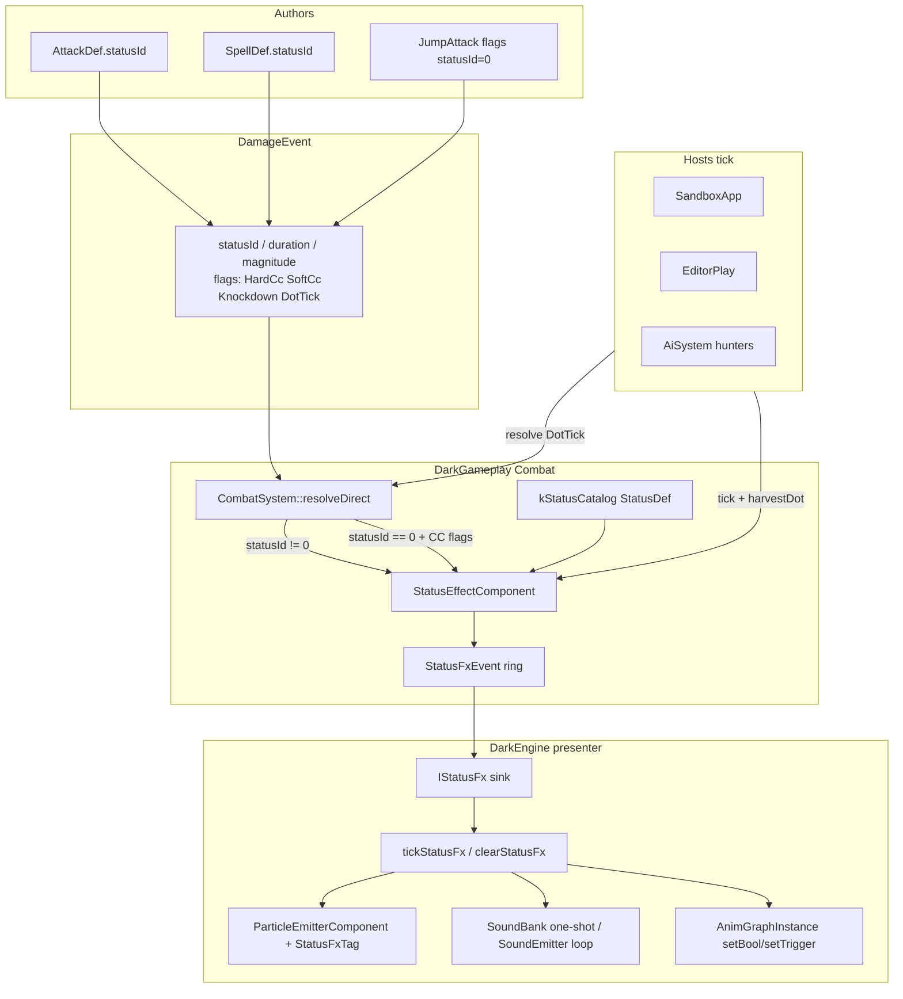
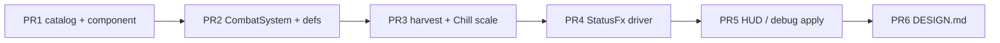

# DESIGN-status-effects.md — Status effects (logic + presentation bus)

| Field | Value |
| --- | --- |
| **Status** | Accepted |
| **Date** | 2026-09-20 |
| **Author** | (implementer) |
| **Priority** | P1 — gameplay; not on the PBR/graphics track |
| **Tip baseline** | live `main` (`Combat/StatusEffectComponent.h` is CC-only; `DamageEvent::statusId` unused) |
| **Depends on** | Landed combat: `CombatSystem::resolve` / `resolveDirect`, jump-attack knockdown + CC DR, `HitReaction`, `SpellCaster`, Editor Play/Stop reset. Landed presentation channels: `ParticleEmitter` / `ParticleEmitterComponent`, `SoundBankComponent` / `SoundEmitterComponent`, `AnimGraphInstance::setBool` / `setTrigger`. |
| **Supersedes** | Nothing. Grows `Dark::Combat::StatusEffectComponent`; does **not** replace CC DR, `applyCc`, or jump-attack knockdown. |
| **In-tree dest (last PR)** | `Combat/DESIGN-status-effects.md` |

Companion one-pager: [Cheatsheet](#cheatsheet) at the end of this file. Implementation PRs **1–N-1 must not commit `DESIGN-*.md`**. Last PR copies this body in-tree and marks Status **Accepted**.

This is a **gameplay + presentation** RFC, not a graphics RFC. No new particle engine, audio mixer, animation graph format, or G-buffer packing.

---

## Overview

DarkEngine6 can already stun, root, fear, and knock down a pawn — but only as crowd-control (CC) slots inside `Combat/StatusEffectComponent.h`. Gameplay cannot tell whether a player or hunter is poisoned, bleeding, or on fire / chilled / shocked; `DamageEvent::statusId` / `statusMagnitude` / `statusDuration` and `DamageFlags::DotTick` are wired on the event but never consumed as named ailments; `SpellDef` / `AttackDef` have no status recipe. Presentation of CC is accidental (motor lock via `hasHardCc()`, knockdown slide via `HitReaction`) and host-specific.

This RFC **grows** `StatusEffectComponent` into a bounded, catalog-driven status bag that still owns CC (same DR table, same `applyCc` / `hasHardCc` / `knockedDown` contracts) and adds named ailments (**Poison, Bleed, Ignite, Chill, Shock**) with stacking/refresh rules and optional DoT. A **presentation bus** emits apply / refresh / expire / clear events that a shared driver maps onto existing channels — ECS particle emitters, `SoundBank` one-shot cues, `AnimGraphInstance` bools/triggers — so Sandbox and Editor Play do not grow per-effect `if (poisoned)` ladders. Editor edit mode stays render-only for pawns; Play starts simulation and presentation; Stop / respawn / hunter revive call the existing `reset()` and tear down FX.

---

## Background & Motivation

### What exists (CC-only)

`Dark::Combat::StatusEffectComponent` (`Combat/StatusEffectComponent.h`):

- `kMaxStatus = 8` `StatusInstance` slots; `count`; per-category `CcDrState dr[kCcCategoryCount]`; `float now`.
- `CcCategory`: Stun, Root, Fear, Knockdown. **One slot per category**; refresh remaining if the new effective duration is longer.
- Diminishing returns: 1st application 100%, 2nd 50%, 3rd+ immune inside `kCcDrWindowSeconds = 18s`. Window restarts on each apply. Hard CC clamped to `kHardCcMaxSeconds = 3s`.
- `applyCc` / `hasHardCc` / `hasCategory` / `knockedDown` / `tick` / `reset`.
- `reset()` is already the lifecycle hammer: `SandboxApp::respawnPlayer`, `EditorApp::resetPlayCombat` (Play start **and** Stop), `AiSystem` hunter revive.

`CombatSystem::resolveDirect` (`Combat/CombatSystem.cpp` ~160–181) maps damage flags → CC **only if the hit is not blocked**:

| Flags | Category | Hard | Default duration |
| --- | --- | --- | --- |
| `DamageFlags::Knockdown` (wins over Soft/Hard) | Knockdown | true | 1.4 s |
| `DamageFlags::HardCc` | Stun | true | 1.2 s |
| `DamageFlags::SoftCc` (no knockdown) | Root | false | 0.8 s |

`ev.statusDuration` overrides the default; `ev.statusId` is stored on the slot but never looked up. Jump-attack connect (`JumpAttack::fillConnectEvent`) sets `Knockdown` + duration/force; pound sets `HardCc` + stun duration. Unit tests in `UnitTests/Combat/CombatSystemTests.cpp` freeze DR, blocked-pounce (no CC), knockdown-vs-stun independence, and `HitReaction` slide.

Hosts that attach / tick / query:

| Host | Attach | Tick | Query |
| --- | --- | --- | --- |
| `AI/AiSystem.cpp` | `attachHunter` emplaces | `tickHunters` `st->tick(dt)` | `hasHardCc()` treated like `HitReaction::stunned()` — skip AI move |
| `Sandbox/SandboxApp.cpp` | `attachReplicaCombat` / player attach | `updateCombat` (player only) | `ccLocked = hitRx->stunned() \|\| status->hasHardCc()` |
| `Editor/EditorPlay.cpp` | `attachEditorPlayer` / hunter via `AiSystem` | `updatePlay` (player) + `tickEditorHunters` → `AiSystem` | same `ccLocked` |
| Tests | stack `StatusEffectComponent` | `tick` / `applyCc` | `CombatSystemTests`, `AiAgentEntityTests`, `HunterJumpAttackTests` |

Editor product model (do not regress): edit mode is render-only for pawns (`EditorUi.cpp` ~718–725: `updatePlay` / `tickEditorHunters` only when `m_playMode`). F12 Play simulates AI/combat/anims. Stop restores `EditorAuthoredPose` and `resetPlayCombat()` (HP, CC, motors, jump, poise, brains). **Status presentation must start/stop with Play and must not leak looping sounds or emitters into edit.**

### What exists (presentation channels) — drive, do not replace

- **Particles:** `Particles/ParticleEmitter.h` CPU sim (`play` / `stop` / `update` / `emitBurst`). ECS wrapper `ParticleEmitterComponent` is **one per entity** (`World` pools are 1:1 type). Editor already `each<ParticleEmitterComponent>` sim+draw (`EditorUi.cpp` ~751, `EditorRender3D.cpp` ~472). Sandbox hit blood is **host-owned** `SandboxApp::m_blood` + `BloodSplatPool`, not ECS. `ProjectileWeapon` already embeds a `ParticleEmitter` for impacts (`Weapons/ProjectileWeapon.h`). Built-in sprite materials: `internParticleSpriteMaterial` (`Particles/ParticleMaterials.h`).
- **Audio:** `SoundBankComponent` + `playSoundCue` / `playSoundCueAt` (`Audio/SoundEmitters.cpp`) — one-shots. Live pawn banks expose `"pain"`, `"impact"`, `"fire"`, `"death"` (player); hunters add `"grunt"` / `"land"`. **There is no `"whoosh"` cue.** Looping is `SoundEmitterComponent` (`clipId`, `play` flag, `VoiceId`). **Only `SandboxApp::onUpdate` calls `tickSoundEmitters` today** (`EditorUi.cpp` sets the listener and never ticks emitters). `World::destroyEntity` removes the component pool entry and does **not** `AudioSystem::stop` — a looping voice leaks if the entity is destroyed while `play=true`. `AudioSystem::kMaxVoices = 24`.
- **Animation:** `AnimGraphInstance::setBool` / `setTrigger` / `setFloat` (`Animation/AnimGraph.h`). Pawn graphs (`content/models/skeleton.anim.json`, `human.anim.json`) expose `speed`, `shoot`, `swing`, `dead` (skeleton only). **Unknown param names are no-ops** (`setBool` returns false). Hit reaction / knockdown slide is `Character/HitReaction.h` — CC presentation must not fight it.
- **HUD:** `Ui/HudTagComponent.h` is HealthBar / Crosshair / Nameplate. Editor Play HUD (`EditorApp::drawPlayHud`) is ImGui text (HP, jump CD, hunter count). No status icons.

### Pain points

1. `statusId` on `DamageEvent` is a dead field. Spells and melee cannot apply poison/bleed without a new bag.
2. Knowing “is this pawn poisoned?” requires reading undocumented slot bytes; there is no `has(id)` / remaining / stacks query.
3. Any FX would be copied into Sandbox **and** Editor (already duplicated for pain cues, jump-attack resolve, sound banks).
4. `kMaxStatus = 8` with one-per-CC-category leaves spare slots, but there is no ailment type, DoT clock, or stacking policy.
5. Death / Stop / revive already call `reset()` for logic; nothing exists to stop a looping voice or an emitter.

---

## Goals & Non-Goals

### Goals (v1)

1. Gameplay can query **named** conditions on player and hunters: stunned, poisoned, bleeding, ignited, chilled, shocked (plus existing root / fear / knockdown).
2. One `StatusDef` catalog drives **logic** (duration, stacks, DoT, CC mapping) and **presentation hooks** (particles, audio, anim params). Adding an effect does not require a Sandbox `if` and an Editor `if`.
3. Jump-attack knockdown, CC DR, blocked-hit skip, and `hasHardCc()` motor/AI lock **keep working bit-identically** for existing callers.
4. Bounded storage: fixed slots on the component; no unbounded heap per entity on the combat hot path.
5. DoT ticks through `CombatSystem` as `DamageFlags::DotTick` events (mitigation, kill, no flinch / no CC re-apply).
6. Presentation is data-driven from apply/refresh/expire/clear events. Tests inject a sink; they do not need D3D12, XAudio, or a Window.
7. Editor Play starts FX; Stop / `reset()` / hunter revive / player respawn tear logic **and** FX down. Edit mode does not harvest DoT or spawn status emitters.
8. Independently reviewable PR stack. No `DESIGN-*.md` in code PRs.

### Non-goals (v1)

- New particle engine, GPU particles, ribbon-only status, or blood-splat replacement.
- New audio mixer, buses, or raising `kMaxVoices`.
- New anim clips / graph states / overlays for stun-loop or poison-idle (bools are set; graphs may ignore them until a follow-up).
- Material / G-buffer pawn tint as a required channel (no cheap per-instance tint on `ModelComponent` today).
- HUD icon atlas, buff bar widget, or networking replication.
- Holy / Shadow / Arcane generic hex, cleanse/immunity items.
- Dispel UI, status-on-death explosion, Fear flee AI, or anim-graph JSON edits (`setBool` only).
- Changing Root into `ccLocked`, or making Shock consume Stun DR.
- Replacing `HitReaction` knockdown slide with an anim-graph Knockdown state.
- Serializing status into `Scene/SceneFile` (runtime only).
- `HumanPhysiologicalEffects.h` (`Pain`) — unused stub; do not revive it here.

---

## Key Decisions

| ID | Decision | Rationale |
| --- | --- | --- |
| **S0** | **Grow `StatusEffectComponent`.** Do not add a second status bag. `applyCc` / `hasHardCc` / `knockedDown` / CC DR stay. | Jump-attack tests and host `ccLocked` already bind this type. A sibling bag would double-tick and desync DR. |
| **S1** | **`StatusId : uint8_t`, 0 = None.** Fits `DamageEvent::statusId`. Catalog is a static table, not assets. | Event payload already exists; no AssetManager in `DarkGameplay`. |
| **S2** | **`kMaxStatus = 12`** (was 8). Expected simultaneous: knockdown + stun + poison + bleed + ignite + chill + shock ≈ 7. 12 leaves Root/Fear + one extra. | 8 is tight once ailments share the array. Still a fixed stack array; no heap. |
| **S3** | **CC DR does not apply to ailments.** Poison/Bleed/Ignite/Chill/Shock have their own stacking (S4). DoT uses `mitigateTyped` (`resist[Poison]`, `resist[Fire]`, Slash armor for Bleed). | Mixing 18 s CC immunity into DoT would make poison a one-shot per fight. Resists already exist. |
| **S4** | **v1 stacking:** CC = today’s refresh-if-longer + DR (`applyCc`). **Every v1 ailment is `RefreshDurationMaxMag`:** `remaining = dur` (always), `magnitude = max(old, new)`, stacks=1. No Bleed stacks. No `exclusiveGroup`. `StackCount` / `ExclusiveRefresh` stay in the enum unused. | User locked Q1/Q2: refresh-only bleed at 2 HP/s. Same rule for Ignite/Chill/Shock. |
| **S5** | **Coexistence:** CC categories exclusive with themselves (today). Ailments coexist with CC **and each other**. Stun + poison + bleed + ignite + chill + shock is legal. | User locked Q3. Same-id refresh is the only exclusivity. |
| **S6** | **World-free combat math.** `tick(dt)` advances `now`, DR, `remaining`, and `tickAcc`. It does **not** compact and does **not** deal damage. `harvestDot` emits `DotTick` events from slots including those that expired this frame, then compact + `Expired`. Hosts call `harvestAndResolveDots` every sim frame after all pawn `tick`s. | Last DoT tick is otherwise lost (live `tick` swap-removes first). `JumpAttack::tryConnect` pattern. |
| **S7** | **`CombatSystem`:** `statusId != 0` → `applyStatus` (catalog defaults if duration/magnitude ≤ 0); else existing flag→CC map. Never both. `DotTick` skips same-entity filter in `resolve()`, skips iframe/block/parry/HitReaction/CC, forces `flags = DotTick` (not `|=`). Blocked non-DoT hits still skip `applyStatus`. Knockdown **slide** runs if this resolve applied Knockdown with `ccDuration > 0` (flags **or** `statusId == Knockdown`). | Jump-attack stays `statusId = 0` + flags. Self-sourced DoT must damage. Catalog CC on a spell still gets the slide. |
| **S8** | **Presentation is an event ring + sink.** Ops: Applied, Refreshed, **Ticked**, Expired, Cleared. `applyCc` pushes Applied/Refreshed using `statusIdForCc(cat)` when `ev.statusId == 0`. `harvestDot` pushes **Ticked** per interval. `IStatusFx` is testable. Default World driver in DarkEngine. | Flag-path stun (pound) must still spawn StunStars. Bleed/Ignite bursts are Ticked, not Refreshed. |
| **S9** | **Particle channel = transient ECS entities** (`StatusFxTag`, no `EditorObjectComponent`). `tickParticleEmitters(World&, dt)` is a **bit-identical extract** of `EditorUi.cpp` ~751–756: `ensureParticleRuntime` + `setTransform` from `TransformComponent` + `update(dt)`. Sandbox starts calling it **and** drawing ECS emitters. Destroy FX by collect-then-destroy, never inside `world.each`. | Naive `update`-only extract parks every authored Editor emitter at the origin. Pool swap-remove during `each` skips/double-visits. |
| **S10** | **v1 audio is one-shots only.** `applyCue` uses **live** bank names (`"impact"` / `"fire"`). All v1 catalog `loopCue` / `expireCue` are `""`. Missing cue = skip (log once). Loop bind is specified below for a non-empty `loopCue` but **no v1 row sets one** — do not add looping voices, Editor `tickSoundEmitters`, or pause-hiss policy until a row does. | `"whoosh"` is not a cue. Only Sandbox ticks emitters today. `destroyEntity` leaks XAudio loops. |
| **S11** | **Anim: `setBool` / `setTrigger` by name from `StatusDef`.** Graphs may not have the params; that is a silent no-op. **Do not** `requestState("Die")`, do not lock the graph, do not fight `HitReaction` knockdown. Graph sidecar edits are a follow-up, not this stack. | `skeleton.anim.json` has Idle/Walk/Run/Shoot/Swing/Die. Stun-loop clips do not exist. |
| **S12** | **No material tint in v1.** `ModelComponent` has no instance color; mutating `Material::setBaseColor` would tint every instance of `models/skeleton.gltf`. | Cheap path does not exist. User locked Q13. |
| **S13** | **Editor: harvest DoT + spawn FX only in Play.** Call sites are `EditorApp::onUpdate` **after** `updatePlay` **and** `tickEditorHunters`, still inside `m_playMode`. Sandbox: `SandboxApp::onUpdate` **after** `m_chase.tick` **and** `updateCombat`, inside the pause/menu guard, **outside** `updateCombat`’s dead/`ccLocked` returns. `resetPlayCombat` already `reset()`s logic; `clearAllStatusFx` on Stop. | `updateCombat` / `updatePlay` return early on stun/dead/jump. Harvest at those tails would pause world DoT. Editor hunters tick *after* `updatePlay`. |
| **S14** | **Death:** do not auto-`reset()` on kill (hosts already reset on respawn/revive). Presenter **suppresses** loops/emitters while `Health::dead()`. Logic timers still run; `resolve` filters dead targets. | Matches today’s “status lives until `reset()`”. Avoids a new death hook in three hosts. |
| **S15** | **Do not commit `DESIGN-*.md` from code PRs 1–N-1.** Last PR lands `Combat/DESIGN-status-effects.md` Accepted. | Same git policy as IBL / GTAO / reverse-Z / SSR. |
| **S16** | **Magic v1 = Ignite / Chill / Shock.** No `ArcaneHex` catalog row, no `incomingAmp`. StatusId set: None, Stun, Root, Fear, Knockdown, Poison, Bleed, Ignite, Chill, Shock. | User locked Q5. Fire/Frost/Lightning `DamageType`s already exist. |
| **S19** | **Chill = `moveSpeedScale()` (default 0.5, clamp [0.25, 1]). Shock = 0.25 s HitReaction hitch on Applied only; no Stun DR, not `hasHardCc`.** Hosts multiply motor/AI/anim speed by the scale in PR3. Shock refresh does not re-hitch. | Chill must not become Root/`ccLocked` (Q10). Shock must not become Stun. |
| **S17** | **`StatusInstance` field order is append-only.** Keep live `id, magnitude, remaining, hard, category` first; add `stacks, tickAcc, source` after. Live `applyCc` 5-arg aggregate init must keep compiling. | Reordering would store duration into `stacks` and jump-attack knockdown would not land. |
| **S18** | **`CcCategory` + DR constants move to `Combat/StatusId.h`** (with `StatusId` and the CC↔id maps). `StatusEffectComponent.h` includes it. No include cycle. | `StatusId.h` cannot include the component header that includes `StatusId.h`. |

---

## Proposed Design

### Architecture



### Tick / apply sequence

```mermaid
sequenceDiagram
  participant Host as Sandbox / Editor Play / AiSystem
  participant SEC as StatusEffectComponent
  participant CS as CombatSystem
  participant HP as Health
  participant Fx as tickStatusFx

  Note over Host,SEC: Incoming weapon / spell / jump-attack
  Host->>CS: resolve(world, DamageEvent)
  CS->>SEC: applyStatus or applyCc
  SEC->>SEC: push Applied / Refreshed

  loop each sim tick
    Host->>SEC: tick(dt) (player AND hunters; no compact)
    SEC->>SEC: remaining -= dt; tickAcc += dt
    Host->>SEC: harvestDot(out[]) then compact + Expired
    loop each DoT event
      Host->>CS: resolve(DotTick) (skip self-filter)
      CS->>HP: applyDamage (no HitReaction, no CC, no iframe)
    end
    Host->>Fx: drain events + tickStatusFx(world)
    Note over Host: harvest/FX after hunter tick, outside ccLocked/dead returns
    Fx-->>Fx: spawn/stop emitters, one-shot cues, anim bools
  end

  Note over Host,Fx: respawn / Stop / hunter revive
  Host->>SEC: reset()
  SEC->>SEC: push Cleared
  Host->>Fx: clearStatusFx(world, entity or all)
```

### Slot model (grow, do not fork)

Keep a single `slots[kMaxStatus]` array. CC still **keys by `CcCategory`** inside `applyCc` (one slot per category, refresh-if-longer). Ailments **key by `StatusId`**. A slot is either a CC instance (`category < Count`) or an ailment (`category == Count` sentinel, `id` is Poison/Bleed/Ignite/Chill/Shock).

```cpp
// Combat/StatusId.h — NEW. Owns CcCategory (moved off StatusEffectComponent.h).
namespace Dark::Combat
{
    enum class CcCategory : uint8_t
    {
        Stun = 0,
        Root,
        Fear,
        Knockdown,
        Count
    };

    inline constexpr int   kCcCategoryCount   = static_cast<int>(CcCategory::Count);
    inline constexpr float kCcDrWindowSeconds = 18.0f;
    inline constexpr float kHardCcMaxSeconds  = 3.0f;

    enum class StatusId : uint8_t
    {
        None      = 0,
        Stun      = 1, // maps to CcCategory::Stun
        Root      = 2,
        Fear      = 3,
        Knockdown = 4,
        Poison    = 5,
        Bleed     = 6,
        Ignite    = 7,
        Chill     = 8,
        Shock     = 9,
        Count
    };

    inline constexpr int kStatusIdCount = static_cast<int>(StatusId::Count);

    bool       statusIdIsCc(StatusId id);        // Stun..Knockdown
    CcCategory ccCategoryForStatus(StatusId id); // valid only if statusIdIsCc
    StatusId   statusIdForCc(CcCategory cat);    // Stun..Knockdown → matching id; else None
}
```

`StatusEffectComponent.h` includes `Combat/StatusId.h` and `ECS/Entity.h`. Do **not** include the component header from `StatusId.h`.

`StatusInstance` **appends** fields (S17). Live 5-arg aggregate `StatusInstance{ statusId, magnitude, eff, hard, cat }` stays valid; `stacks`/`tickAcc`/`source` take defaults:

```cpp
struct StatusInstance
{
    uint8_t    id        = 0;     // StatusId
    float      magnitude = 0.f;
    float      remaining = 0.f;
    bool       hard      = false;
    CcCategory category  = CcCategory::Stun; // Count = ailment
    uint8_t    stacks    = 1;     // appended
    float      tickAcc   = 0.f;   // appended — DoT accumulator
    Entity     source{};          // appended — applier; {} if unknown
};
```

**PR1 invariant:** do not rewrite the existing 5-arg `applyCc` body except (1) after a new-slot aggregate init, optionally write `source`; (2) push Applied/Refreshed (S8); (3) when `statusId == 0`, store `id = (uint8_t)statusIdForCc(cat)` so the slot and FX event carry Stun/Knockdown. Refresh path: if `eff > remaining`, update remaining/magnitude/hard/id/source and push Refreshed; if not longer, no FX event. DR immune (`eff <= 0`) still increments `dr` as today and pushes nothing.

`kMaxStatus` 8 → **12**. When the array is full:

- CC: today’s path — if a matching category slot exists, refresh it; else if `count >= kMaxStatus` return `eff` **without storing** (pre-existing hole; do not silently drop a stored Stun to make room).
- Ailment: if a matching `StatusId` slot exists, apply stack/refresh; else if full, **refuse** (return false / 0 duration). Log `DE_LOG_WARN` once per overflow (not per frame).

### Catalog (`StatusDef`)

Static table in `Combat/StatusDef.h` + `Combat/StatusCatalog.cpp`. POD, no heap, no Particles/Audio includes in the def (presentation is **names and preset enums** so `DarkGameplay` stays World-free).

```cpp
enum class StatusStackRule : uint8_t
{
    RefreshLonger = 0,       // CC only (inside applyCc): remaining = max(old, new)
    RefreshDurationMaxMag,   // v1 ailments: remaining = dur (always); magnitude = max(old, new)
    StackCount,              // unused in v1 catalog
    ExclusiveRefresh         // unused in v1 catalog
};

enum class StatusParticlePreset : uint8_t
{
    None = 0,
    StunStars,
    PoisonCloud,
    BleedDrip,
    IgniteFlames,
    ChillMist,
    ShockSparks
};

struct StatusDef
{
    StatusId         id              = StatusId::None;
    const char*      name            = "";
    DamageType       damageType      = DamageType::True;
    StatusStackRule  stack           = StatusStackRule::RefreshLonger;
    uint8_t          maxStacks       = 1;
    bool             hardCc          = false;
    CcCategory       ccCategory      = CcCategory::Count; // Count = not CC
    float            defaultDuration = 0.f;
    float            defaultMagnitude= 1.f;
    float            tickDamage      = 0.f; // 0 = no DoT
    float            tickInterval    = 1.f;
    bool             tickScalesWithStacks = false; // v1: false on every row

    // Presentation hooks (names only)
    StatusParticlePreset particle     = StatusParticlePreset::None;
    bool                 particleLoop = true;  // false = burst on apply / DoT tick
    const char*          applyCue     = "";    // pawn SoundBank name; v1 live cues only
    const char*          loopCue      = "";    // v1: always "" (S10)
    const char*          expireCue    = "";    // v1: always ""
    uint8_t              audioPriority= 0;     // unused until a row sets loopCue
    const char*          animBool     = "";    // set true on apply, false on expire
    const char*          animTrigger  = "";    // fire on apply only
};
```

v1 table (frozen numbers; tune in a follow-up, not by host):

| StatusId | Stack | DoT | CC | Presentation |
| --- | --- | --- | --- | --- |
| Stun | RefreshLonger + existing DR | none | `applyCc(Stun, hard)` | `StunStars` looping particles, applyCue `"impact"`, animBool `"stunned"` |
| Root | RefreshLonger + DR | none | `applyCc(Root, soft)` | none v1 (logic only) |
| Fear | RefreshLonger + DR | none | `applyCc(Fear, soft)` | none v1 |
| Knockdown | RefreshLonger + DR | none | `applyCc(Knockdown, hard)` | **HitReaction only** (`particle = None`; no StunStars) |
| Poison | RefreshDurationMaxMag, stacks=1 | **4 HP / 1.0 s**, `DamageType::Poison`, duration **8 s** (32 HP if unresisted) | no | `PoisonCloud` looping particles, applyCue `"fire"`, animBool `"poisoned"` |
| Bleed | RefreshDurationMaxMag, stacks=1 | **2 HP / 1.0 s**, `DamageType::Slash`, duration **6 s** (12 HP; physical armor). **No stacks.** | no | `BleedDrip` looping particles + **Ticked** `emitBurst(6)`, applyCue `"impact"`, animBool `"bleeding"` |
| Ignite | RefreshDurationMaxMag, stacks=1 | **2 HP / 1.0 s**, `DamageType::Fire`, duration **6 s** (12 HP; `resist[Fire]`). **No stacks.** | no | `IgniteFlames` looping particles + **Ticked** `emitBurst(4)`, applyCue `"fire"`, animBool `"ignited"` |
| Chill | RefreshDurationMaxMag, stacks=1 | **no DoT.** Duration **6 s**. `magnitude` **is** the move scale (default **0.5** = 50% speed, clamp [0.25, 1]). | no | `ChillMist` looping particles, applyCue `"impact"`, animBool `"chilled"` |
| Shock | RefreshDurationMaxMag, stacks=1 | **no DoT.** Duration **3 s** (FX window). On **Applied only**, CombatSystem applies HitReaction hitch **0.25 s**, knockback 0. Refresh does **not** re-hitch. Does **not** call `applyCc` / consume Stun DR / set `hasHardCc`. | no | `ShockSparks` looping particles, applyCue `"impact"`, animBool `"shocked"` |

v1 `loopCue` / `expireCue` are empty on every row. Particle `looping = true` on the emitter desc is independent of audio. **No `ArcaneHex`.** Combined unresisted DoT if all three DoTs land: 4+2+2 = 8 HP/s; plus hunter `kContactDps = 12` is lethal if you stand in melee — one ailment is not a solo kill.

`const StatusDef* statusDef(StatusId id);` returns nullptr for `None` / out of range.

Particle presets are **functions** returning `ParticleEmitterDesc`, same style as `defaultProjectileImpactParticles()` in `Weapons/ProjectileWeapon.h`. Implement in `Combat/StatusParticles.cpp` (or `Particles/StatusParticlePresets.cpp` compiled in DarkEngine). Frozen looks:

| Preset | Rate | Color (linear-ish RGB) | Gravity | Notes |
| --- | --- | --- | --- | --- |
| StunStars | 12 / s | (1.0, 0.95, 0.45) → alpha 0 | 0 | small, additive, head-high offset +1.4 m |
| PoisonCloud | 18 / s | (0.25, 0.85, 0.18) | +0.4 Y | sphere 0.35 m, additive |
| BleedDrip | 8 / s | (0.72, 0.04, 0.06) like `SandboxApp` blood | −11 Y | not additive; **Ticked** burst 6 |
| IgniteFlames | 16 / s | (1.0, 0.35, 0.05) | +1.2 Y | additive, sphere 0.3 m; **Ticked** burst 4 |
| ChillMist | 14 / s | (0.55, 0.80, 1.0) | +0.15 Y | additive, sphere 0.4 m |
| ShockSparks | 20 / s | (0.55, 0.75, 1.0) | 0 | additive, high spread, short life |

Offsets are applied by the presenter (`follow` transform + `(0, 1.1, 0)` default). Do not put world units in the combat catalog beyond the preset enum.

### Apply / tick / harvest

```cpp
struct StatusEffectComponent
{
    static constexpr int kMaxStatus   = 12;
    static constexpr int kMaxFxEvents = 16;

    StatusInstance slots[kMaxStatus]{};
    int            count = 0;
    CcDrState      dr[kCcCategoryCount]{};
    float          now   = 0.f;
    StatusFxEvent  fx[kMaxFxEvents]{};
    int            fxCount = 0;
    int            fxRead  = 0; // drain cursor; tick may wrap by dropping oldest

    void  reset();                          // clears slots+DR+now+fx ring; pushes Cleared if anything was active
    void  tick(float dt);                   // DR window + remaining + tickAcc; does NOT compact; does NOT deal damage
    void  compactExpired();                 // swap-remove remaining<=0; push Expired; called from harvestDot only
    float applyCc(CcCategory cat, float duration, bool hard, uint8_t statusId, float magnitude);
    float applyCc(CcCategory cat, float duration, bool hard, uint8_t statusId, float magnitude, Entity source);

    // Catalog path. CC ids delegate to applyCc (DR still applies). Returns effective duration (0 = refused).
    float applyStatus(StatusId id, float duration, float magnitude, Entity source = {});

    bool  hasHardCc() const;
    bool  hasCategory(CcCategory cat) const;
    bool  knockedDown() const;
    bool  has(StatusId id) const;
    int   stacks(StatusId id) const;        // 0 if absent; v1 ailments always 1 when present
    float remaining(StatusId id) const;     // 0 if absent
    // Chill: slot magnitude (default 0.5), clamped [0.25, 1]. No Chill → 1.0. Future slows would min.
    float moveSpeedScale() const;

    // Fill DotTick events for intervals that elapsed this tick. Cap = kMaxStatus. Returns written count.
    int   harvestDot(DamageEvent* out, int cap, Entity self);
};
```

`applyStatus` algorithm (defaults **first**):

1. `def = statusDef(id)`; if null, return 0.
2. `dur = duration > 0 ? duration : def->defaultDuration`. `mag = magnitude != 0 ? magnitude : def->defaultMagnitude`. If `dur <= 0`, return 0.
3. If `def->ccCategory != Count`: return `applyCc(def->ccCategory, dur, def->hardCc, (uint8_t)id, mag, source)`. `applyCc` owns DR, slot, and FX events. **Do not** push a second Applied.
4. Else find slot with `slots[i].id == (uint8_t)id`. `switch (def->stack)`:
   - `RefreshDurationMaxMag`: `remaining = dur`; `magnitude = max(magnitude, mag)`; push **Refreshed**.
   - `StackCount`: `stacks = min(stacks+1, def->maxStacks)`; `remaining = dur`; `magnitude = mag`; push **Refreshed**.
   - `ExclusiveRefresh`: `stacks = 1`; `remaining = dur`; `magnitude = mag`; push **Refreshed**.
   - `RefreshLonger` or `default:`: `DE_LOG_WARN` once, return 0 (ailments must not use CC’s rule).
   - If no slot and `count < kMaxStatus`: append (`tickAcc = 0`, `stacks = 1`, `source`, `category = Count`), push **Applied**.
   - If no slot and full: return 0 (log overflow once).
5. Return `dur` (or the slot’s `remaining` after refresh).

`tick(float dt)` — frozen order, **not** live compact-on-tick:

1. Clamp `dt >= 0`; `now += dt`.
2. Existing DR-window reset.
3. For `i in [0, count)`: `slots[i].remaining -= dt`; if the catalog row has `tickDamage > 0` and `tickInterval > 0`, `slots[i].tickAcc += dt` (**including** slots whose `remaining` just crossed ≤ 0).
4. **Do not** swap-remove. Queries (`hasHardCc`, `has`, `remaining`) already treat `remaining <= 0` as absent, so CC lock ends this frame even before harvest. Occupied ghost slots last until `harvestDot`.

`harvestDot(DamageEvent* out, int cap, Entity self)`:

1. If `out == nullptr` or `cap <= 0`, still compact (see step 4) and return 0.
2. For each slot with `def->tickDamage > 0` and `tickInterval > 0` (including `remaining <= 0` this frame): while `tickAcc >= tickInterval` and written < cap and per-slot emits < 4: emit one event, `tickAcc -= tickInterval`, push **Ticked** `{ statusId, stacks }`.
3. Event construction (**assign, do not `|=`**):
   ```cpp
   DamageEvent ev{};
   ev.source   = slot.source;   // may be {} or the victim; resolve() skips self-filter when DotTick
   ev.target   = self;
   ev.type     = def->damageType;
   ev.amount   = def->tickDamage * (def->tickScalesWithStacks ? (float)slot.stacks : 1.f);
   ev.flags    = DamageFlags::DotTick; // NOT CanBlock|CanParry, NOT |=
   ev.statusId = 0;
   ev.hitDir   = { 0, 1, 0 };
   ```
   Host helper may fill `hitPoint` from `TransformComponent`.
4. Then `compactExpired()`: swap-remove every slot with `remaining <= 0`, push **Expired** per removed id.

**Required pair:** every sim frame that calls `tick` on a component must later call `harvestDot` (via `harvestAndResolveDots`) so DoT last ticks fire and ghosts compact. Tests that only `tick` may observe `count > 0` with `remaining <= 0`; `hasHardCc()` is still false.

Frozen last-tick test: `remaining = 0.1`, `tickAcc = 0.95`, `tickInterval = 1.0`, `dt = 0.2` → one DotTick, then empty (`count == 0`).

`applyCc` FX (S8): store `id = statusId != 0 ? statusId : (uint8_t)statusIdForCc(cat)`. New slot → Applied; remaining increased → Refreshed. Jump-attack connect (`statusId = 0` + Knockdown flags) therefore emits Applied **Knockdown** (catalog `particle = None` → no stars). Pound HardCc emits Applied **Stun**.

`moveSpeedScale()` (S19):

```cpp
float StatusEffectComponent::moveSpeedScale() const
{
    float s = 1.0f;
    for (int i = 0; i < count; ++i)
    {
        if (slots[i].remaining <= 0.0f)
            continue;
        if (static_cast<StatusId>(slots[i].id) != StatusId::Chill)
            continue;
        const float mag = Math::Clamp(slots[i].magnitude, 0.25f, 1.0f);
        if (mag < s)
            s = mag;
    }
    return s;
}
```

No Chill → 1.0. Default Chill magnitude 0.5. Does **not** touch Root or `hasHardCc`. No `incomingAmp` in v1.

### CombatSystem changes (S7)

`CombatSystem::resolve` (World path), **before** the existing same-entity filter:

```cpp
const bool dot = (ev.flags & DamageFlags::DotTick) != 0;
if (ev.source.valid() && ev.source.id() == ev.target.id() && !dot)
{
    r.filtered = true;
    return r;
}
```

Keep dead-target and team filters. DotTick from `harvestDot` may have `source == target` (self-apply / debug). Tests: `CombatSystem_WorldResolve_DotTickSelfSourceDamages`. Dev Tools `applyStatus(..., Entity{})` is the non-self source for the **slot**; DoT still damages if someone passes the pawn.

`resolveDirect` frozen control flow:

1. Reject `amount < 0`. Reject `health && !health->alive()` (DoT on a corpse no-ops here).
2. **If DotTick:**
   - Do **not** return on `inIFrame()`.
   - Do **not** parry/block.
   - `mitigateTyped` as usual; apply HP; `r.applied = true`.
   - Skip CC apply and skip `HitReaction` entirely.
   - `r.severity = killed ? Fatal : Tick` (force Tick even if 4/100 would be Light).
   - Return.
3. Else existing iframe / parry / block.
4. `mitigateTyped`; poise; HP.
5. Status apply, only if `!r.blocked`:
   - If `ev.statusId != 0`: `r.ccDuration = status->applyStatus((StatusId)ev.statusId, ev.statusDuration, ev.statusMagnitude, ev.source)`. Catalog supplies defaults when duration/magnitude are 0.
   - Else existing SoftCc/HardCc/Knockdown map into `applyCc` (flag path unchanged; `statusId` stored as 0 then rewritten to `statusIdForCc` inside `applyCc`).
   - Never both on one event.
6. HitReaction (order matters; first matching branch wins):
   - If this resolve applied **Knockdown** (`mappedKnockdown` **or** `(StatusId)ev.statusId == StatusId::Knockdown`) and `r.ccDuration > 0` and not hyper-armor: existing slide (`stunSeconds = ccDuration`, knockback `statusMagnitude` or 2.4, 0.22 s, horizontal).
   - **Else if** `(StatusId)ev.statusId == StatusId::Shock` and applyStatus returned `> 0` **and the FX op was Applied** (new slot, not refresh): `HitReactionSettings{ stunSeconds=0.25f, knockbackDistance=0, knockbackSeconds=0, horizontalOnly=true }`; `hitReaction->apply(ev.hitDir)`. Detect Applied vs Refreshed by draining or by “was `!has(Shock)` before apply” — freeze: **snapshot `hadShock = status->has(Shock)` before `applyStatus`**. Hitch iff `!hadShock && applyStatus > 0`. Refresh does not re-hitch. Does not increment Stun `dr[]`.
   - Else if not DotTick and severity != Tick and not hyper: existing flinch table.

No `incomingAmp`. Ignite ticks are Fire and already go through `mitigateTyped` → `resist[Fire]`.

Blocked non-DoT hits: no `applyStatus` / no `applyCc`. Tests: `Combat_BlockedPounce_*` remains; add `Combat_BlockedHit_NoPoison`, `CombatSystem_DotTick_IgnoresBlockAndIFrame`, `CombatSystem_StatusIdKnockdown_PlaysHitReactionSlide`, `CombatSystem_StatusIdPoison_ZeroDurationUsesCatalogDefault`, `CombatSystem_IgniteDotTick_UsesFireResist`, `CombatSystem_ShockApplied_HitReactionHitch`, `CombatSystem_ShockRefresh_NoSecondHitch`.

Do not grow `ResolveResult`. Tests inspect the component / `HitReaction`.

### SpellDef / AttackDef / SpellCaster

```cpp
// both defs
uint8_t statusId        = 0;
float   statusDuration  = 0.f;
float   statusMagnitude = 0.f;
```

`SpellCaster::tryResolveProjectileHit` copies onto `DamageEvent` (today it does not). Projectile struct gains the same three fields, assigned at release from `m_def`.

`damageEventFromWeaponHit` copies from `AttackDef` when non-null. Sandbox/Editor weapon hits then apply poison if the loadout’s `AttackDef` sets `statusId`. **v1 does not change default melee** (still `statusId = 0`). A Dev Tools / test weapon or a unit test constructs an `AttackDef` with Poison; optional Sandbox debug key is PR5, not required for merge of PR2.

### Presentation bus

```cpp
enum class StatusFxOp : uint8_t
{
    Applied = 0,
    Refreshed,
    Ticked,   // harvestDot interval fired (Bleed burst)
    Expired,
    Cleared   // reset() of the whole component (entity-level)
};

struct StatusFxEvent
{
    StatusFxOp op        = StatusFxOp::Applied;
    uint8_t    statusId  = 0;
    uint8_t    stacks    = 1;
    float      remaining = 0.f;
    float      magnitude = 0.f;
};

struct IStatusFx
{
    void (*fn)(void* user, Entity target, const StatusFxEvent& ev) = nullptr;
    void* user = nullptr;
};

int drainStatusFx(StatusEffectComponent& st, StatusFxEvent* out, int cap); // copies then clears ring
```

`Cleared` is one event per `reset()` if `count > 0 || fx` pending, `statusId = 0`. Presenter treats it as “stop every channel for this entity”.

Default driver (`Combat/StatusFx.cpp` compiled in DarkGameplay is OK for headers; **implementation that calls Particles/Audio must link at the umbrella** — same pattern as `ProjectileWeapon` embedding `ParticleEmitter`. Prefer putting `StatusFx.cpp` under `Particles/` or a new `Combat` TU that only uses function pointers, and the World driver in `Particles/StatusFxDriver.cpp` compiled by DarkEngine):

```cpp
// Particles/StatusFxDriver.h — DarkEngine
void tickStatusFx(World& world, Audio::AudioSystem* audio, AssetManager* assets, IStatusFx extra = {});
void clearStatusFx(World& world, Audio::AudioSystem* audio, Entity pawn); // one pawn
void clearAllStatusFx(World& world, Audio::AudioSystem* audio);          // Editor Stop
```

`tickStatusFx` algorithm:

1. `world.each<StatusEffectComponent>` drain ring (entity is the pawn).
2. For each event, if `extra.fn` call it (tests / debug overlay). **Always**, even if `audio`/`assets` are null.
3. **Null `audio`:** skip one-shot cues and any loop-emitter start/stop. **Null `assets`:** skip `internParticleSpriteMaterial`; still spawn Transform + `ParticleEmitterComponent` (`matAssetID = 0`) + `StatusFxTag`. CPU tests assert spawn/destroy without D3D12/XAudio.
4. **Applied:** if `def->particle != None`, spawn or reuse FX entity (S9); `ensureParticleRuntime`; `play()`. If `audio` and `def->applyCue[0]`, `playSoundCue(pawn, def.applyCue)` (pawn bank). If `animBool` `setBool(true)`. If `animTrigger` `setTrigger`. If `loopCue[0]` (v1: never), bind loop (below).
5. **Refreshed:** keep emitter; do **not** burst; do **not** retrigger applyCue.
6. **Ticked:** if an FX entity exists for (pawn, statusId) and the def is Bleed or Ignite, `runtime->emitBurst` (6 / 4). No audio. Chill/Shock have no DoT, so no Ticked.
7. **Expired:** stop emitter (`stop(true)`), `setBool(false)`, stop loop voice **then** destroy FX entity.
8. **Cleared:** collect all FX entities with `follow == pawn`, stop voices, then destroy; clear anim bools for every catalog id.
9. Follow: each `StatusFxTag` copies `Transform` from follow + offset. If follow dead/missing, collect-then-destroy.
10. If follow `Health::dead()`, `runtime->stop(false)` (particles die out) until revive.

`clearStatusFx` / `clearAllStatusFx`: **collect entity ids into a stack array (cap 64), then destroy.** Never `destroyEntity` inside `world.each<StatusFxTag>` (pool swap-remove skips/double-visits). If `audio`, for each collected entity with `SoundEmitterComponent`: `audio->stop(se.voice)` **before** `destroyEntity`. `World::destroyEntity` does not stop XAudio.

#### StatusFxTag + FX entities (S9)

```cpp
struct StatusFxTag
{
    static constexpr const char* kTypeName = "StatusFx";
    Entity  follow{};
    uint8_t statusId = 0;
};
```

Spawn:

- `World::createEntity()`
- `TransformComponent` at pawn pos + offset
- `ParticleEmitterComponent` with preset desc, `matAssetID = internParticleSpriteMaterial(assets, false)`
- `StatusFxTag { follow, statusId }`
- Optional `SoundEmitterComponent` only if this effect owns the pawn’s loop slot

**Do not** add `EditorObjectComponent`. Scene save walks those, not raw emitters (`EditorSceneFile.cpp`).

Global cap: **64** FX entities. If spawn would exceed, reuse the oldest tag (stop+re-desc) or refuse (log). 12 slots × ~8 pawns = 96 theoretical; S10-style priority: **one looping particle per (pawn, statusId)** already caps at `count` per pawn ≤ 12. 8 pawns × 4 ailments = 32 < 64.

#### Shared particle tick (S9)

Extract Editor’s loop **bit-identically** to `Particles/ParticleTick.cpp`:

```cpp
void tickParticleEmitters(World& world, float dt)
{
    world.each<ParticleEmitterComponent>([&](Entity e, ParticleEmitterComponent& pe) {
        ensureParticleRuntime(pe);
        if (const TransformComponent* xf = world.get<TransformComponent>(e))
            pe.runtime->setTransform(xf->position, xf->rotation);
        pe.runtime->update(dt);
    });
}
```

Omitting `setTransform` parks every authored Editor emitter at the origin after PR4. Editor `onUpdate` replaces the inline loop with this call (edit **and** Play). Sandbox `onUpdate` calls it next to `m_blood.update(dt)` inside the pause/menu guard. Sandbox `onRender` currently draws only `m_blood`; add `each<ParticleEmitterComponent>` draw beside it (same `ParticleRenderer`). Editor draw path already exists.

PR4 merge gate: edit-mode authored emitter at a non-origin transform still simulates there.

#### Looping audio (S10) — specified, unused in v1

v1 catalog `loopCue` is `""` on every row. One-shots use pawn `playSoundCue` with live names (`"impact"`, `"fire"`). Hunter banks have `"impact"`; they do **not** have `"fire"` — Poison/Ignite applyCue `"fire"` no-ops on hunters (log once). That is acceptable v1. Chill/Shock use `"impact"` (hunters have it).

**If** a later row sets `loopCue` (not this stack’s look), the bind is:

1. Resolve `loopCue` on the **pawn** `SoundBankComponent` (`findSoundCue`); copy `clipId` onto a `SoundEmitterComponent` on the **FX entity** (never on the pawn — Sandbox player wet-loop owns that component).
2. Both hosts must call `tickSoundEmitters` (Sandbox already does, **unconditionally** after the pause block; Editor must add it in `onUpdate` next to `audio().setListener` **before** a loop row ships).
3. `clearStatusFx` stops the voice then destroys (above).
4. One loop per pawn: highest `audioPriority` wins.
5. Pause: if loops exist, either skip `tickSoundEmitters` for `StatusFxTag` entities while `m_gameplayPaused`, or set `play = false`. **v1 has no loops — ignore.**

Do not add Editor `tickSoundEmitters` in PR4 unless a loop row exists. Do not put `SoundEmitterComponent` on FX entities in v1.

### Host integration (no per-effect ladders)

Live traps this RFC must not inherit:

- `SandboxApp::updateCombat` ticks player status, then **returns** if the player is dead (`SandboxApp.cpp` ~1437–1442) and later **returns** on `ccLocked || jumpBusy` (~1507–1511).
- `EditorApp::updatePlay` **returns** on `ccLocked || jumpBusy` (`EditorPlay.cpp` ~761–765).
- `EditorApp::onUpdate` is `updatePlay` **then** `tickEditorHunters` (`EditorUi.cpp` ~718–722). Hunters have not ticked at the end of `updatePlay`.

**Frozen call sites — not “end of `updateCombat` / `updatePlay`.”**

```cpp
// Combat/StatusDot.h
int harvestAndResolveDots(World& world, CombatSystem& combat);
```

Walks every `StatusEffectComponent`, `harvestDot` (compacts even if the pawn has no `HealthComponent`), fills `target`/`hitPoint` from `TransformComponent`, `combat.resolve`. **Only caller** of `harvestDot` in hosts. Does **not** tick. `AiSystem` stays unaware of Poison.

**Sandbox `onUpdate`** (inside `!menu && (!m_gameplayPaused || m_stepGameplay)`):

1. `m_chase.tick` — hunters `StatusEffectComponent::tick`
2. `updateCombat` — player `tick`; **do not** harvest here (dead/`ccLocked` returns)
3. `harvestAndResolveDots(world, combat)` — world-wide, including stunned/dead-timer player and all hunters
4. `tickStatusFx(world, &audio(), &assets())`
5. `tickParticleEmitters(world, dt)` (next to `m_blood.update`)
6. existing `tickAnimGraphs`
7. existing `tickSoundEmitters` (after the pause block, unchanged)

Stun does not pause poison. Dead player: `resolve` filters `!alive()`, `harvestDot` still compact/Expired, presenter suppresses emission (S14). Respawn `reset()` + `clearStatusFx(player)`.

**Editor `onUpdate` when `m_playMode`:**

1. `updatePlay(dt)` — player `tick`; **do not** harvest here
2. `tickEditorHunters(dt)` — hunter `tick`
3. `harvestAndResolveDots` + `tickStatusFx` **here** (new calls in `EditorUi.cpp` / `onUpdate`, not the tail of `updatePlay`)
4. `updatePawnAnims`
5. existing later `tickParticleEmitters` extract (edit+Play)

Edit mode (`!m_playMode`): no harvest, no `tickStatusFx`. `setPlayMode(false)`: `resetPlayCombat()` then `clearAllStatusFx`. `setPlayMode(true)`: `clearAllStatusFx` then `resetPlayCombat`.

**Chill speed (PR3, required — not a 7th PR):**

`moveSpeedScale()` is combat math (PR1). Hosts **read** it in PR3:

1. Add `float speedScale = 1.0f` to `PlayerMotorInput`. `PlayerMotor::tick` multiplies grounded walk/sprint, swim, and air (`airSpeed`/`airAccel`) by `Math::Clamp(in.speedScale, 0.0f, 1.0f)`. Default 1 = no look change when Chill is absent.
2. Sandbox `updatePlayer` / Editor `updatePlay`: `motorIn.speedScale = status ? status->moveSpeedScale() : 1.0f` (still outside the harvest placement; this is on the motor input path that already runs before `ccLocked` return — set it **before** `motor->tick`, including when not ccLocked). Chill does not set `ccLocked`.
3. `AiSystem::tickHunters`: `const float speed = (sprint ? m_pack.sprintSpeed : m_pack.walkSpeed) * (stCc ? stCc->moveSpeedScale() : 1.0f);` then existing `follow` / `seekToward`.
4. Anim floats: Sandbox `updateCharacterAnims` and Editor `updatePawnAnims` multiply the 9/12/18 speed numbers by `moveSpeedScale()` so the walk cycle matches.

Test: `PlayerMotor` with `speedScale=0.5` walks at half `walkSpeed`; World hunter with Chill moves slower than without (optional AI test). `Status_Chill_MoveSpeedScale` on the component (PR1) is the math gate.

**Queries for HUD (PR5):** `status->has(Poison)` etc. Editor `drawPlayHud` lists active names + remaining. Sandbox health bar unchanged.

Mandatory PR3 test: two-entity World, poison on A, stun on B, `tick` both, `harvestAndResolveDots` once → A lost HP, B did not, stun did not block A’s tick.

### CC / HitReaction coexistence

| Condition | Motor/AI lock | HitReaction | Status FX |
| --- | --- | --- | --- |
| Stun (HardCc **or** `statusId=Stun`) | `hasHardCc` | only if severity ≥ Light from the **hit damage**, not from CC itself (`Combat_HardCc_StunsWithoutKnockdown`) | StunStars + `"stunned"` bool (FX from `applyCc`, including flag-path pound) |
| Knockdown (flags **or** `statusId=Knockdown`) | `hasHardCc` | slide from resolve (stunSeconds = ccDuration) | **none** (`particle=None`; Applied still fires) |
| Root | not `hasHardCc` (soft) | no | none v1 |
| Poison / Bleed / Ignite | no | no | presets + DoT |
| Chill | no (`ccLocked` unchanged) | no | ChillMist; `moveSpeedScale()` 0.5 |
| Shock | 0.25 s via `HitReaction::stunned()` on Applied only | hitch 0.25 s, knockback 0 | ShockSparks; not Stun DR |
| Hit flinch (no CC) | `hitRx->stunned()` short | existing | no |

`ccLocked` expressions in Sandbox/EditorPlay/AiSystem **do not change**. Root does not lock motors today; do not “fix” that here.

### Lifecycle

| Event | Logic | Presentation |
| --- | --- | --- |
| Apply | slot + DR if CC | Applied → spawn |
| Refresh | stack rule | Refreshed → keep emitter (no burst, no extra cue) |
| DoT interval | `harvestDot` event | Ticked → Bleed burst 6 / Ignite burst 4 |
| Duration end | `harvestDot` compact | Expired → destroy FX, bool false |
| `reset()` (respawn, Stop, Play start, hunter revive) | `count=0`, DR clear, now=0 | Cleared → `clearStatusFx` |
| Death | timers keep running; `resolve` no-ops | suppress loops/emission |
| Editor edit | no harvest, no apply from combat (combat not ticked) | no StatusFx entities |

### Layering / files

`DarkGameplay` already compiles `Combat/*.cpp` and `Weapons/*.cpp` (the latter includes `ParticleEmitter.h`; symbols resolve at final link). Status catalog + component stay in Combat. World driver that calls `internParticleSpriteMaterial` / `playSoundCue` belongs in DarkEngine rest **or** in Combat with the ProjectileWeapon precedent.

**Frozen file list (v1):**

| File | Layer | Role |
| --- | --- | --- |
| `Combat/StatusId.h` | DarkGameplay | `CcCategory` + DR constants (moved) + `StatusId` + CC↔id maps |
| `Combat/StatusDef.h` | DarkGameplay | POD def + stack enum + particle preset enum |
| `Combat/StatusCatalog.cpp` | DarkGameplay | `kStatusCatalog[]`, `statusDef()` |
| `Combat/StatusEffectComponent.h` | DarkGameplay | grow component (header-only math, like today) |
| `Combat/StatusDot.cpp/.h` | DarkGameplay | `harvestAndResolveDots` |
| `Combat/StatusFxEvent.h` | DarkGameplay | event POD + `IStatusFx` + drain |
| `Particles/StatusParticlePresets.cpp/.h` | DarkEngine | `ParticleEmitterDesc` for presets |
| `Particles/ParticleTick.cpp/.h` | DarkEngine | `tickParticleEmitters` |
| `Particles/StatusFxDriver.cpp/.h` | DarkEngine | World presenter |
| `Particles/StatusFxTag.h` | DarkEngine | follow tag |
| `Combat/CombatSystem.cpp` | DarkGameplay | S7 + Shock hitch snapshot |
| `Character/PlayerMotor.h/.cpp` | DarkEngine | PR3: `PlayerMotorInput::speedScale` |
| `Combat/SpellDef.h`, `SpellCaster.cpp` | DarkGameplay | copy status fields |
| `Combat/AttackDef.h`, `WeaponHitAdapter.h` | DarkGameplay | copy status fields |
| Hosts + tests | — | tick order, Play/Stop, UnitTests |

`de_glob_folder` picks new files up. No CMake list edit unless we add a file outside globbed folders.

---

## API / Interface Changes

### Before (CC only)

```cpp
float applyCc(CcCategory cat, float duration, bool hard, uint8_t statusId, float magnitude);
bool  hasHardCc() const;
bool  hasCategory(CcCategory cat) const;
bool  knockedDown() const;
void  tick(float dt);
void  reset();
```

`DamageEvent::statusId` stored, never consulted. `SpellDef` / `AttackDef` have no status fields. `CombatSystem` maps flags → `applyCc` only.

### After

- All of the above **unchanged in signature** except optional `applyCc(..., Entity source)` overload with default `{}` so existing call sites compile. **Field order of `StatusInstance` is append-only.**
- New: `applyStatus`, `has`, `stacks`, `remaining`, `moveSpeedScale`, `harvestDot`, `compactExpired`, fx ring + `drainStatusFx`. **No `incomingAmp`.**
- `tick` no longer compact-on-expiry (S6). Existing `AiAgentEntity` tick-0.25s-still-down test still passes (`remaining` 1.15).
- `CombatSystem::resolve`: DotTick skips same-entity filter. `resolveDirect`: DotTick skips iframe/block/parry/HitReaction/CC; `statusId != 0` → `applyStatus` with catalog defaults; Knockdown slide from flags **or** catalog id; Shock Applied hitch 0.25 s.
- PR3: `PlayerMotorInput::speedScale` (default 1).
- `SpellDef` / `AttackDef` / `SpellProjectile` +3 fields.
- New free functions: `statusDef`, `harvestAndResolveDots`, `tickStatusFx`, `clearStatusFx`, `tickParticleEmitters`.
- No change to `hasHardCc` semantics. No change to `JumpAttackDef` (still `statusId = 0` + flags).

---

## Data Model Changes

- `StatusEffectComponent`: 8 → 12 slots; `StatusInstance` + stacks/tickAcc/source; +16-event ring. Rough size: was ~8×(1+4+4+1+1)+padding + 4×CcDrState + now ≈ 200 B. After: 12×(~32 B with Entity) + ring 16×(~16 B) ≈ 650 B per pawn. Fine.
- No SceneFile schema. No save migration.
- No network.
- Transient FX entities are runtime-only.

---

## Tests

All in `UnitTests/Combat/` (globbed). No D3D12. `resolveDirect` remains the unit-test path.

| Test | Assert |
| --- | --- |
| Existing `Combat_CcDr_*`, knockdown, blocked pounce | **unchanged** |
| `Status_ApplyPoison_HasAndRemaining` | `applyStatus(Poison, 8, 1)` → `has`, remaining≈8, stacks=1, `!hasHardCc` |
| `Status_PoisonRefresh_DurationReplaced` | remaining=5, apply duration 3 mag 2 → remaining≈3, mag=2 |
| `Status_BleedRefresh_NoStacks` | two Bleed applies → stacks=1, remaining=default 6 |
| `Status_Chill_MoveSpeedScale` | apply Chill 0 duration → remaining≈6, `moveSpeedScale()≈0.5`; absent → 1.0; mag 0.1 clamps to 0.25 |
| `Status_Shock_DoesNotConsumeStunDr` | apply Shock then three `applyStatus(Stun,2,1)` → 2, 1, 0 (Stun DR untouched by Shock) |
| `Status_AilmentsCoexist` | Poison+Bleed+Ignite+Chill+Shock all `has` together with Stun |
| `Status_StunDelegatesToApplyCc_Dr` | `applyStatus(Stun, 2, 1)` three times → 2, 1, 0 |
| `Status_PoisonDoesNotConsumeCcDr` | 3 stuns immune, poison still applies |
| `Status_StunAndPoisonCoexist` | both `has` |
| `Status_HarvestDot_EmitsDotTick` | tick 1.0 s × 1 interval → 1 event, amount=4, type=Poison, `flags == DotTick` (not CanBlock), statusId=0 |
| `Status_HarvestDot_LastTickOnExpiry` | remaining=0.1, tickAcc=0.95, dt=0.2, interval=1.0 → one event, then `count==0` |
| `Status_ApplyStatus_ZeroDurationUsesDefault` | `applyStatus(Poison, 0, 0)` → remaining≈8 |
| `CombatSystem_DotTick_DamagesNoFlinchNoCc` | resolveDirect DotTick 10 dmg → HP 90, `!hit.stunned()`, no new CC, severity Tick |
| `CombatSystem_DotTick_IgnoresBlockAndIFrame` | blocking + iframe + DotTick → full (mitigated) dmg, no CC |
| `CombatSystem_WorldResolve_DotTickSelfSourceDamages` | `resolve(world)` with source==target + DotTick → HP drops |
| `CombatSystem_StatusIdPoison_OnHit` | ev.statusId=Poison, duration 8 → has Poison; flags without CC |
| `CombatSystem_StatusIdPoison_ZeroDurationUsesCatalogDefault` | ev.statusId=Poison, duration 0 → remaining≈8 |
| `CombatSystem_StatusIdKnockdown_PlaysHitReactionSlide` | statusId=Knockdown, no Knockdown flag, ccDuration>0 → `hit.stunned()` and knockback 2.4 |
| `CombatSystem_StatusIdZero_StillMapsHardCc` | jump-attack shaped event |
| `CombatSystem_PoundHardCc_EmitsStunApplied` | drain FX: Applied Stun (statusIdForCc) |
| `CombatSystem_KnockdownFlags_NoParticleSpawn` | Applied Knockdown; driver with World: zero `StatusFxTag` |
| `CombatSystem_Blocked_NoPoison` | blocking + CanBlock + statusId Poison → chip, `!has(Poison)` |
| `CombatSystem_IgniteDotTick_UsesFireResist` | Armor resist[Fire]=0.5, Ignite tick 2 → 1 HP |
| `CombatSystem_ShockApplied_HitReactionHitch` | first Shock via resolveDirect → `hit.stunRemaining≈0.25`, knockback 0, `!hasHardCc`, Stun `dr==0` |
| `CombatSystem_ShockRefresh_NoSecondHitch` | second Shock while active → remaining refreshed, stunRemaining not reset to 0.25 from this resolve (snapshot `hadShock`) |
| `Status_Reset_ClearsAndFxCleared` | drain sees Cleared |
| `Status_FxRing_AppliedExpired` | apply+tick past duration+`harvestDot` → Applied then Expired (tick alone does not compact) |
| `Status_FxRing_TickedOnHarvest` | poison tick 1s + harvest → Ticked |
| `Status_Overflow_RefuseAilment` | fill 12 dummy slots, apply poison → 0 |
| `Status_HarvestAndResolve_StunDoesNotPausePoison` | World: A poisoned, B stunned; one `harvestAndResolveDots` → A HP drops |
| `Spell_ProjectileCopiesStatusId` | def.statusId=Poison → DamageEvent.statusId |
| `AttackDef_WeaponHitAdapterCopiesStatus` | adapter copies id/duration/magnitude |

Presentation driver tests **without GPU:** `tickStatusFx(world, nullptr, nullptr, recorder)` still **spawns** Transform + `ParticleEmitterComponent` + `StatusFxTag` (`matAssetID` may be 0). Assert entity exists after Applied and is gone after Expired/`clearStatusFx`. Null `audio` skips cues only. Skip `Renderer`.

---

## Alternatives Considered

### A. Sibling `AilmentComponent` + keep CC component as-is

**Pros:** Zero risk to `applyCc` binary layout; ailments cannot overflow CC slots.  
**Cons:** Two bags to tick/reset in every host; `hasHardCc` and `has(Poison)` live on different types; CombatSystem takes two pointers; jump-attack tests and AI bind one type today. **Rejected (S0).**

### B. Unreal-style Gameplay Effects (GE + spec + prediction + stacking handles)

**Pros:** Industry language, modifiers, infinite catalog.  
**Cons:** Heap per effect, handle maps, prediction — none of that exists. Violates bounded storage and no-exceptions/no-RTTI style. **Rejected.**

### C. Host-owned FX only (Sandbox `m_poisonEmitter` like `m_blood`)

**Pros:** No ECS spawn, Editor scene-file safe by construction.  
**Cons:** Every new effect is a Sandbox member **and** an Editor member — the if-ladder this RFC exists to kill. **Rejected as the architecture;** Sandbox may keep `m_blood` for **hit** bursts (not status).

### D. ParticleEmitterComponent on the pawn itself

**Pros:** No follow entities.  
**Cons:** ECS 1:1 — one emitter per pawn, cannot do stun+poison; fights a future authored emitter on a pawn; Editor would save it if an `EditorObjectComponent` exists. **Rejected (S9).**

### E. DoT inside `StatusEffectComponent::tick` calling `Health::applyDamage` directly

**Pros:** Hosts cannot forget harvest.  
**Cons:** Bypasses `CombatSystem` (armor, amp, kill flags, filters). Breaks “CombatSystem is the damage authority”. **Rejected (S6).**

### F. Share CC DR with poison (3rd poison in 18 s immune)

**Pros:** One DR table.  
**Cons:** Makes DoT a CC; first poison in a gank would 50%/immune the rest. **Rejected (S3).**

---

## Security & Privacy Considerations

Single-player / listen-server sandbox. No user-generated status scripts in v1 (static catalog). Threats:

| Threat | Severity | Mitigation |
| --- | --- | --- |
| Catalog function pointers / string names as script | n/a | POD table, compile-time |
| FX entity leak → save-file injection | Low | No `EditorObjectComponent`; `clearAllStatusFx` on Stop |
| Voice exhaustion (24 loops) | Med | One loop per pawn (S10) |
| `statusId` out of range from a future net packet | Low | `statusDef` nullptr → apply no-op |

No PII. No auth.

---

## Observability

- `DE_LOG_WARN` on slot overflow and unknown `statusId` (rate-limit: first time per process, or `static bool`).
- `DE_LOG_INFO` not per apply (combat is noisy; jump-attack already logs connects).
- No new `LogCategory` (would require `Log.h` enum bump + filters). Use default Core; AI path can pass `LogCategory::AI` only if we log from `AiSystem` (we should not).
- Debug: Editor Play HUD text list (PR5). Dev Tools Apply Poison / Bleed / Ignite / Chill / Shock / Stun (PR5).
- Tests are the regression net for DR/DoT.

---

## Rollout Plan

Feature flags: none required. Catalog rows can ship with empty presentation hooks (Root/Fear). Identity disable: do not set `statusId` on weapons/spells (defaults 0); CC path unchanged.

Staged PRs (below). Rollback = revert the PR; PR1 is additive (`kMaxStatus` 12, unused slots). Do not flip a default melee to Poison in the same PR as the plumbing.

Soak: Sandbox jump-attack still knocks down; poison from a debug apply does not lock motors; Editor Stop has no leftover hiss / green cloud.

---

## Risks

| Risk | Severity | Mitigation |
| --- | --- | --- |
| `applyCc` refresh/DR drift / aggregate init | **High** | S17 append-only fields; do not rewrite `applyCc` beyond source write + FX push + `statusIdForCc` when id==0. Existing `Combat_*` tests stay green. |
| `tickParticleEmitters` drops `setTransform` | **High** | Bit-identical extract of Editor loop. PR4 merge gate: authored non-origin emitter still sims there. |
| Harvest inside `updateCombat`/`updatePlay` skipped on stun/dead | **High** | S13: harvest in `onUpdate` after hunter tick, outside those returns. PR3 files include `EditorUi.cpp`. |
| Double `tick` on player if player ever gets `AiAgentComponent` | Med | Players do not. Assert in helper comments. |
| Editor Stop leaks looping voice | Low (v1) | v1 has no loops. If a later row sets `loopCue`: `audio.stop` **before** `destroyEntity`; collect-then-destroy. |
| Sandbox does not draw ECS particles (only `m_blood`) | **High** | PR4 **must** add `each<ParticleEmitterComponent>` draw or StunStars are invisible in Sandbox |
| `SoundEmitterComponent` on player fights swim loop | Med | Loop on FX entity (S10) |
| Anim bool `"stunned"` unused | Low | Accepted; follow-up graph RFC |
| Slot full refuses an ailment | Low | 12 slots; v1 max ~4 CC + 5 ailments = 9 |
| DoT + contact DPS (`kContactDps = 12`) melts player | Med | Single ailment: Poison 4/s, Bleed/Ignite 2/s. All three DoTs = 8/s; contact is the gank, not Bleed stacks |
| `tick` without `harvestDot` leaves ghost slots | Med | Host contract: always harvest after tick. Queries ignore `remaining<=0`. |
| Chill forgotten in hunter `follow` speed | Med | PR3 file list includes `AiSystem.cpp` speed multiply + motor `speedScale` |

---

## Open Questions

**Resolved (user 2026-09-19).** Do not re-ask. Implementers follow the Answer column.

| # | Question | Status | Answer |
| --- | --- | --- | --- |
| Q1 | Poison stacking | **Resolved** | `RefreshDurationMaxMag`: `remaining = dur` always, `magnitude = max`, stacks=1 |
| Q2 | Bleed stacks / DPS | **Resolved** | **Refresh-only, no stacks, 2 HP / 1.0 s, 6 s** (12 HP). Not 1–3 stacks |
| Q3 | Coexistence | **Resolved** | Stun + poison + bleed + ignite + chill + shock may all be on one pawn |
| Q4 | HUD | **Resolved** | World FX + Play HUD text names (PR5). No icon atlas |
| Q5 | Magic | **Resolved** | **Ignite / Chill / Shock this stack.** No `ArcaneHex`. No `incomingAmp` |
| Q6 | Default weapons | **Resolved** | No `statusId` on default melee/spells. Plumbing + Dev Tools only |
| Q7 | Cleanse | **Resolved** | No cleanse/immunity items |
| Q8 | Hex amp | **Resolved** | Dropped with ArcaneHex. Do not add a generic hex row |
| Q9 | Bleed damage type | **Resolved** | **Slash** (physical armor) |
| Q10 | Root vs `ccLocked` | **Resolved** | Root does **not** become `ccLocked`. Chill is a speed scale, not Root |
| Q11 | Death | **Resolved** | Suppress FX; `reset()` on respawn/revive only |
| Q12 | Anim JSON | **Resolved** | `setBool` only; **no** `skeleton.anim.json` edits |
| Q13 | Tint | **Resolved** | No material tint |
| Q14 | Fear AI | **Resolved** | No Fear flee this stack |

---

## References

- Live: `Combat/StatusEffectComponent.h`, `Combat/CombatSystem.cpp`, `Combat/DamageEvent.h`, `Combat/DamageTypes.h`, `Combat/SpellDef.h`, `Combat/SpellCaster.cpp`, `Combat/AttackDef.h`, `Combat/WeaponHitAdapter.h`, `Combat/JumpAttack.cpp`, `Combat/JumpAttackResolve.cpp`, `Combat/ArmorStats.h` (`mitigateTyped`)
- Hosts: `Sandbox/SandboxApp.cpp` (`ccLocked`, `respawnPlayer`, `updateCombat`, `m_blood`), `Editor/EditorPlay.cpp` (`resetPlayCombat`, `updatePlay`, `drawPlayHud`), `Editor/EditorUi.cpp` (Play-only hunter tick; particle `each`), `AI/AiSystem.cpp` (`hasHardCc`, hunter `tick`/`reset`)
- Presentation: `Particles/ParticleComponents.h`, `Particles/ParticleTypes.h`, `Particles/ParticleMaterials.h`, `Audio/SoundComponents.h`, `Audio/SoundEmitters.cpp`, `Audio/AudioSystem.h` (`kMaxVoices = 24`), `Animation/AnimGraph.h`, `Animation/AnimGraphTick.cpp`, `content/models/skeleton.anim.json`, `content/models/human.anim.json`
- Tests: `UnitTests/Combat/CombatSystemTests.cpp`, `UnitTests/Combat/JumpAttackTests.cpp`, `UnitTests/Particles/ParticleEmitterComponentTests.cpp`
- Prior RFC shape: `Render/DESIGN-reflections.md` PR plan (no DESIGN in PRs 1–N-1, last docs PR)
- Not used: `Character/HumanPhysiologicalEffects.h`

---

## Implementation notes for agents

- C++23, MSVC, Allman, 4-space, `.clang-format` ColumnLimit 200. Namespace `Dark` / `Dark::Combat`. **No** `try` / `catch` / `throw`. Failures: `bool` / 0 duration, `DE_LOG_WARN` / `DE_LOG_ERROR`, `DE_ASSERT` for null out-buffers.
- Do not take member-function addresses to “lock” APIs; tests call `applyStatus` / `harvestDot` / `drainStatusFx`.
- `applyCc` is the CC source of truth. `applyStatus` for Stun/Root/Fear/Knockdown **calls it**. Do not duplicate DR math.
- **PR1 invariant:** `StatusInstance` field order stays `id, magnitude, remaining, hard, category` then appended fields. Live init `StatusInstance{ statusId, magnitude, eff, hard, cat }` must compile.
- Move `CcCategory` + DR constants into `Combat/StatusId.h`. Do not include `StatusEffectComponent.h` from `StatusId.h`.
- `tick` does not compact. `harvestDot` emits then `compactExpired`. Do not restore live swap-remove inside `tick`.
- `JumpAttack::fillConnectEvent` stays `statusId = 0`. Do not set `StatusId::Knockdown` on jump-attack.
- Harvest/FX: `SandboxApp::onUpdate` and `EditorApp::onUpdate` after hunter tick, **not** the tail of `updateCombat`/`updatePlay`.
- Editor particles currently sim in **edit and Play**. FX entities must not exist in edit. Extract must `setTransform`.
- Sandbox particle **draw** is the easy miss in PR4.
- v1 `applyCue` is `"impact"` / `"fire"`, never `"whoosh"`. `loopCue` empty.
- No `ArcaneHex`, no `incomingAmp`. Bleed has no stacks. Chill is `moveSpeedScale()`, Shock is a 0.25 s HitReaction hitch on Applied only.
- PR3 **must** wire Chill scale: `PlayerMotorInput::speedScale`, hunter `follow` speed, anim speed floats. Do not defer to a 7th PR.
- `HealthComponent` include in some combat tests is a pre-existing quirk — do not drive-by fix unless the TU already requires it.
- Do not add `LogCategory::Combat`.
- Do not touch `HumanPhysiologicalEffects.h`.
- Git identity for execute-plan: `git -c user.name="Travis Johnston" -c user.email="travisjjohnston@comcast.net"`.

---

## Cheatsheet

| Topic | v1 freeze |
| --- | --- |
| Component | Grow `StatusEffectComponent`, `kMaxStatus=12` |
| IDs | None=0, Stun, Root, Fear, Knockdown, Poison, Bleed, Ignite, Chill, Shock (**no ArcaneHex**) |
| CC | Unchanged DR 100/50/immune, 18 s, hard cap 3 s, one slot/category |
| Ailments | All `RefreshDurationMaxMag`. Poison 4/s × 8 s. Bleed **2/s × 6 s, no stacks**. Ignite 2/s Fire × 6 s. Chill 50% `moveSpeedScale`. Shock 0.25 s hitch on Applied, 3 s FX. |
| DoT | `tick` no compact; `harvestDot` last tick then compact. `flags = DotTick`. Self-filter skipped. No iframe/block/flinch. |
| CombatSystem | `statusId!=0` → catalog defaults; else flags; never both. Knockdown slide from flags or catalog id. Shock Applied hitch 0.25 s. No `incomingAmp`. |
| FX | Applied/Refreshed/Ticked/Expired/Cleared. `applyCc` emits via `statusIdForCc`. v1 one-shot cues `"impact"`/`"fire"`. |
| Particles | `tickParticleEmitters` = ensure+setTransform+update. Collect-then-destroy FX. |
| Anim | `setBool` names; graphs may ignore |
| Tint | No |
| Hosts | Harvest in `onUpdate` after hunters, outside ccLocked/dead returns. PR3: Chill `speedScale` on motor/AI/anim. |
| Tests | UnitTests, no D3D12 |
| Docs | Last PR only |

---

## PR Plan

Independently reviewable, linear stack, each mergeable without the rest of the catalog presentation. Do **not** commit `DESIGN-*.md` in PRs 1–5. Plain-git; no `gt` / `gh` required. Author: Travis Johnston `<travisjjohnston@comcast.net>`.

`de_glob_folder` picks up new `Combat/` and `Particles/` TUs and `UnitTests/Combat/*.cpp`. Do not reformat the tree. No C++ exceptions. Keep `applyCc` control flow; additive tests must not weaken CC DR numbers.

### PR1 — Component + catalog + queries (no look, no CombatSystem behavior change)

**Title:** `Status: StatusId catalog, grow StatusEffectComponent, applyStatus`

**Files:**

- New: `Combat/StatusId.h` (**moves `CcCategory` + DR constants** + `StatusId` + maps), `Combat/StatusDef.h`, `Combat/StatusCatalog.cpp`, `Combat/StatusFxEvent.h` (ops include Ticked)
- Edit: `Combat/StatusEffectComponent.h` (include StatusId.h; `kMaxStatus` 12; **append** `stacks/tickAcc/source`; `applyStatus` defaults-first; `tick` no compact; `harvestDot` + `compactExpired`; `applyCc` FX via `statusIdForCc` when id==0; `moveSpeedScale()`; optional source overload)
- Tests: `UnitTests/Combat/StatusEffectTests.cpp` including last-tick harvest, zero-duration default, poison remaining=dur, Bleed no stacks, Chill scale, Shock vs Stun DR, five-ailment coexist. **Do not fail** existing `CombatSystemTests` / `AiAgentEntityTests`.

**Depends on:** current main.

**Description:** Pure combat math. Catalog: Poison/Bleed/Ignite/Chill/Shock (no ArcaneHex). `CombatSystem::resolveDirect` **unchanged**. `harvestDot` exists but no host calls it. Ring is record-only. No DESIGN.md.

**Merge gate:** `Combat_CcDr_SecondHalf_ThirdImmune`, knockdown tests, `AiAgentEntityTests` still pass. `StatusInstance{ id, mag, rem, hard, cat }` still compiles. `Status_StunDelegatesToApplyCc_Dr` matches 2 / 1 / 0. `Status_HarvestDot_LastTickOnExpiry` green. `moveSpeedScale()` is 1 without Chill and ≈0.5 with default Chill.

### PR2 — CombatSystem + DoT resolve + def payloads

**Title:** `Status: CombatSystem applyStatus/DotTick/Shock hitch; SpellDef/AttackDef payloads`

**Files:**

- `Combat/CombatSystem.cpp` / `.h` (S7: same-entity skip except DotTick; DotTick skips iframe/block/parry/HitReaction/CC and forces Tick; `statusId != 0` → `applyStatus`; Knockdown slide from flags **or** catalog id; Shock Applied hitch snapshot; **no incomingAmp**)
- `Combat/StatusDot.cpp` / `.h` (`harvestAndResolveDots`)
- `Combat/SpellDef.h`, `Combat/SpellCaster.cpp` / `.h` (`SpellProjectile` + copy in `tryResolveProjectileHit`)
- `Combat/AttackDef.h`, `Combat/WeaponHitAdapter.h`
- Tests: self-DotTick, iframe/block ignore, poison zero-duration default, knockdown slide, Ignite Fire resist, Shock hitch + no re-hitch, blocked-poison, Spell projectile copies statusId

**Depends on:** PR1.

**Description:** Damage authority understands named status and DoT. Shock hitch only on first Applied. **No host harvest yet.** Default weapons/spells stay `statusId = 0`. No DESIGN.md.

**Merge gate:** `Combat_BlockedPounce_*` green; jump-attack `statusId==0` still maps Knockdown + slide; self-sourced DotTick damages via `resolve(world)`; Shock does not increment Stun `dr[]`.

### PR3 — Host harvest + reset lifecycle (still no FX)

**Title:** `Status: harvest DoT + Chill moveSpeedScale in Sandbox/Editor/hunters`

**Files:**

- `Sandbox/SandboxApp.cpp` — `harvestAndResolveDots` in **`onUpdate` after `m_chase.tick` and `updateCombat`**, inside pause/menu guard, **not** inside `updateCombat`. Player motor: `motorIn.speedScale = status->moveSpeedScale()`. Anim speed × scale.
- `Editor/EditorUi.cpp` (`onUpdate`) — harvest + `tickStatusFx` after `updatePlay` **and** `tickEditorHunters` when `m_playMode`
- `Editor/EditorPlay.cpp` — `motorIn.speedScale`; `updatePawnAnims` × scale
- `Character/PlayerMotor.h/.cpp` — `PlayerMotorInput::speedScale` default 1; multiply grounded/swim/air speeds
- `AI/AiSystem.cpp` — **do not** harvest here. Multiply `follow`/`seekToward` speed by `moveSpeedScale()`. Hunter `tick` stays.
- Tests: **required** `Status_HarvestAndResolve_StunDoesNotPausePoison`; `PlayerMotor` `speedScale=0.5` walks at half `walkSpeed`

**Depends on:** PR2.

**Description:** DoT ticks in Play/Sandbox even while stunned. Chill is visible in Play (player, hunters, anim). Edit mode does not harvest. No particles/audio. No DESIGN.md.

**Merge gate:** grep: no harvest in `updateCombat`/`updatePlay` tails. Stun does not pause poison. Chill does not set `ccLocked`. 1 s poison = 4 HP not 8. Walk at Chill default is ~4 m/s (0.5 × 8).

### PR4 — Presentation bus driver (particles, audio, anim)

**Title:** `Status: StatusFx driver, particle presets, tickParticleEmitters, Play/Stop teardown`

**Files:**

- New: `Particles/StatusParticlePresets.h/.cpp`, `Particles/ParticleTick.h/.cpp` (**ensure + setTransform + update**), `Particles/StatusFxTag.h`, `Particles/StatusFxDriver.h/.cpp`
- Edit: `Editor/EditorUi.cpp` (replace inline particle loop; `tickStatusFx` in Play after harvest; `clearAllStatusFx` in `setPlayMode`)
- Edit: `Sandbox/SandboxApp.cpp` / `.h` (`tickStatusFx`, `tickParticleEmitters`, **draw** ECS emitters next to `m_blood`; `clearStatusFx` on `respawnPlayer`)
- Tests: `UnitTests/Combat/StatusFxTests.cpp` — `tickStatusFx(world, nullptr, nullptr)` **still spawns** CPU emitters; collect-then-destroy; pound-shaped HardCc → StunStars entity; knockdown flags → no particle entity. `ParticleEmitterComponentTests` still pass.

**Depends on:** PR3.

**Description:** First **look** change: Poison cloud / Stun stars / Bleed drip / Ignite flames / Chill mist / Shock sparks. v1 audio is one-shot `"impact"`/`"fire"` (missing cue skip). No loops, no Editor `tickSoundEmitters`. Anim bools no-op on current graphs. **Sandbox must draw ECS particles or this PR is invisible there.** No DESIGN.md. No new WAV.

**Merge gate:** Editor Stop: zero `StatusFxTag`. Edit-mode authored emitter at non-origin still simulates there. Jump-attack knockdown: **no** StunStars. Pound HardCc: Stun FX entity exists.

### PR5 — Debug apply + Play HUD names + optional sound cues

**Title:** `Status: Dev Tools apply, Play HUD names, bank cue aliases`

**Files:**

- `Sandbox/DevToolsPanel.cpp` — buttons: Apply Poison / Bleed / Ignite / Chill / Shock / Stun (`applyStatus(..., Entity{})`). Shock button should go through `CombatSystem::resolve` with `amount=0`, `statusId=Shock`, `flags=0` so the 0.25 s hitch runs; others may `applyStatus` directly.
- `Editor/EditorPlay.cpp` `drawPlayHud` — list active `statusDef->name` + remaining
- Leave catalog cues on live `"impact"` / `"fire"`. Do **not** add `"whoosh"`.
- Do **not** change default `AttackDef` / hunter weapons (Q6)

**Depends on:** PR4.

**Description:** Makes v1 **playable/soaked** without content authors. Identity: don’t click the buttons. No DESIGN.md.

### PR6 — Docs

**Title:** `docs: DESIGN-status-effects.md Accepted`

**Files:** `Combat/DESIGN-status-effects.md` (this RFC body, Status → Accepted). No code. Optional one-liner in a combat README if one exists (none today — do not create extra markdown).

**Depends on:** PRs 1–5 merged (or stacked).

**Description:** Copy this scratch body into the git tree. Mark Status Accepted. Do **not** commit `DESIGN-*.md` from PRs 1–5.

**PR graph:**



---

*End of DESIGN-status-effects.md rev 3.*
