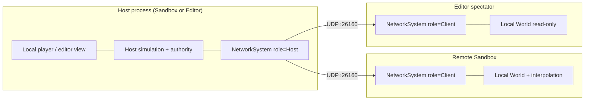
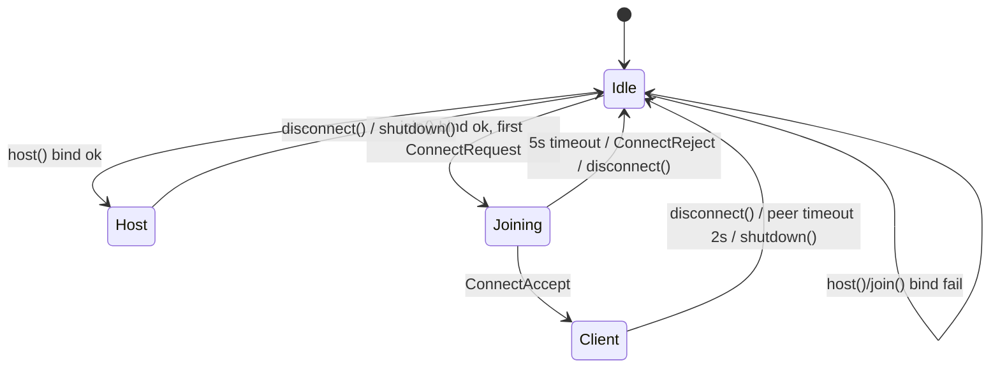
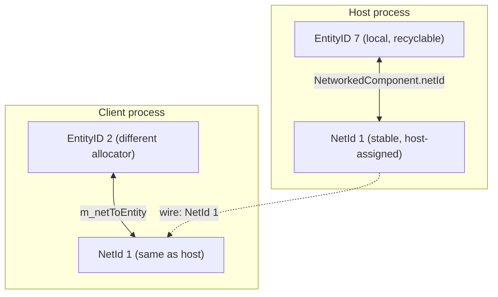
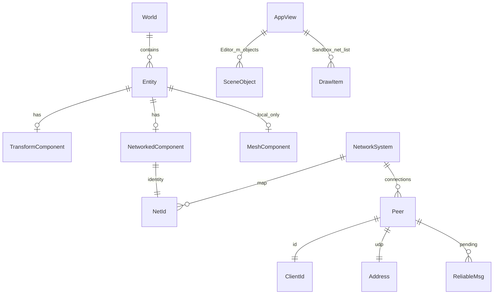

# DarkEngine6 Networking (`Network/`) — Design

| Field | Value |
|-------|--------|
| **Title** | DarkEngine6 LAN Listen-Server Networking (v1) |
| **Author** | TBD |
| **Date** | 2026-08-23 |
| **Status** | Draft (revised after design review) |
| **Audience** | Senior engine / gameplay engineers working in this repo |
| **Scope** | Engine `Network/`, `Application` tick hook, Sandbox + **Sandbox2D** demos, Editor Host/Join UI, CLI `-host`/`-join`, LAN broadcast discovery, UnitTests. **No production implementation in this document.** |

---

## Overview

DarkEngine6 has an empty `Network/` folder already listed in `DE_ENGINE_FOLDERS` (`CMakeLists.txt`), a `LogCategory::Networking` value (`Core/Log.h`), and no sockets, no net tick, and no cross-process identity. `Application::run()` (`Core/Application.cpp`) pumps input, **replaces** `dt` when it is `< 0` or `> 0.25` with `1/60` (it does **not** clamp to 0.25 s), calls `onUpdate(dt)`, ticks audio, then renders. `World::createEntity()` issues process-local `EntityID` values that are reused from a free list (`ECS/World.cpp`) — they are **not** valid as network identities.

Neither Sandbox nor the Editor draws by iterating the ECS: `SandboxApp::onRender()` draws **only** `m_cube` / `m_cubeMesh`; `EditorApp::renderScene3D()` iterates **`m_objects`**. Replication that only writes `World` is invisible until those apps grow spawn/despawn callbacks and draw the resulting objects.

This design ships a **first useful slice**: a Windows UDP listen-server (host process is also a local player) for **2–8 LAN peers**, with a thin **go-back-N** reliability layer, host-assigned `NetId`s, transform + spawn/despawn of at most **32** tagged entities (3D cube/sphere/pawn **and** 2D platform/coin/player from `SceneObjectType`), non-blocking `poll`/`flush` in the existing frame loop, a test-owned `FakeHub`, Editor Host / Join UI, **CLI `-host` / `-join`**, and **LAN UDP broadcast discovery** (typed IP remains fallback). Engine replication **never submits draws**. `NetworkSystem` never calls `Renderer`. It is gameplay replication, not REST. It is **not** internet-safe.

---

## Background & Motivation

### Current state

| Piece | Location | Fact |
|-------|----------|------|
| Placeholder folder | `Network/` | Empty; CMake already globs `Network/*.cpp` into `DarkEngine` |
| Engine glob | `CMakeLists.txt` `DE_ENGINE_FOLDERS` | Adding a `.cpp` under `Network/` is picked up automatically |
| Winsock | `CMakeLists.txt` `target_link_libraries(DarkEngine …)` | Links `d3d12`, `dxgi`, `xaudio2`, `xinput`, `ole32`, etc. **Does not link `ws2_32`** |
| Frame loop | `Application::run()` | After input, `dt = now - lastTime`; **if `dt < 0 \|\| dt > 0.25` then `dt = 1/60`** (reset, not clamp). Then `onUpdate` → `m_audio.tick()` → `onRender` → `present()`. No network tick |
| ECS ids | `ECS/Entity.h`, `ECS/World.cpp` | `EntityID` is `uint32_t`; `NULL_ENTITY = 0`; `m_nextID` starts at 1; destroyed ids go to `m_free` and are reused |
| `World::emplace` | `ECS/World.h` `ComponentPool::insert` | **Always inserts.** Double-`emplace` of the same `T` on one entity corrupts the sparse set. Callers must `has<T>()` first |
| UUID | `Core/UUID.h`, `Core/UUID.cpp` | 64-bit `mt19937_64`; hashable; unit-tested. **Not cryptographic entropy** |
| Components | `ECS/Components.h` | `TransformComponent` (pos / quat / scale), `TagComponent`, `MeshComponent` (local `AssetID`s), `CameraComponent`, `DirectionalLightComponent`. No color field; Editor tint is `SceneObject.color` |
| Scene I/O | `Scene/SceneTypes.h`, `Scene/SceneFile.*` | Versioned JSON; `SceneObjectType`; **no net id field** |
| Editor draw | `Editor/EditorApp.cpp` | `renderScene3D` / shadows iterate `m_objects`, not `World`. Gizmo drag writes `TransformComponent` directly (~1107–1148). **F5 = save**, **F6 = lighting** — do not reuse for Host/Join |
| Sandbox draw | `Sandbox/SandboxApp.cpp` | Shadow/color passes call `m_cubeMesh.draw` for `m_cube` only. `onUpdate` always spins `m_cube` and snaps Y to `terrain.heightAtWorld + 0.5f` (~273–291) |
| Sandbox terrain | `SandboxApp.cpp` ~412–413 | Height FBM seeds **1337** and **9001** (fixed) — two processes sample the same height at the same XZ |
| Debug overlay | `Render/DebugOverlay.h` | D3D12 **depth/shadow-map tile** visualizer, not a text HUD. Sandbox has no ImGui |
| Logging | `Core/Log.h` | `LogCategory::Networking` exists; Error/Fatal still emit when the category is disabled |
| Error policy | `AGENTS.md`, `.grok/rules/no-exceptions.md` | No `try` / `catch` / `throw`; `bool` + `DE_LOG_*` + `DE_ASSERT` |
| Exception scan | `scripts/check-no-exceptions.ps1` | Scans `Network/` and `Sandbox/`. **Does not scan `Editor/`** or **`Sandbox2D/`** (PR7/PR9 add them) |
| Sandbox2D | `Sandbox2D/Sandbox2DApp.*` | Parallel arrays `m_platforms` / `m_coins` / `m_player` + Box2D; `tryLoadLevel()` from `content/scenes/level2d.json` (`SceneObjectType::Platform` / `Coin` / `Spawn`). Draw iterates those arrays, not `World`. **F1 = debug**, A/D/arrows/LS/D-pad = move |
| WinMain argv | `Sandbox/main.cpp`, `Sandbox2D/main.cpp`, `Editor/main.cpp` | `LPSTR` is ignored today. `AppConfig` has no net fields |
| Platform | `Core/Window.cpp`, `Render/` | Win32 + D3D12. Not cross-platform today |
| `Application` members | `Core/Application.h` | `Window`, `Input`, `World`, `AssetManager`, `Renderer`, `AudioSystem`. Dtor does not call `m_audio.shutdown()`; `AudioSystem::~AudioSystem` does |

### Pain points

1. **No way for two processes to share a world.** Editor and Sandbox cannot see each other’s entities. Play-from-editor / live-link is impossible.
2. **EntityIDs are local.** A cube that is entity `3` on the host is a different allocation on a client. Replicating raw `EntityID` would silently map to the wrong object (or a recycled one).
3. **`MeshComponent` stores process-local `AssetID`s.** Those integers are not portable (`Assets/AssetHandle.h`). Spawn must use a **prefab** enum, not asset ids.
4. **Draw paths ignore unknown entities.** Spawning into `World` without updating `m_cube` / `m_objects` produces an invisible replica.
5. **The render thread is the only thread.** A blocking `recv` would freeze present. Sockets must be non-blocking and budgeted.
6. **Empty `Network/` is already in the glob**, but **`ws2_32` will not link until CMake is updated**.

### Why now

The engine already has a world, transforms, an editor that mutates a scene, and a sandbox that animates a cube. That is enough for a listen-server demo **if** the apps also draw what replication creates: host a session, join from a second process, see the cube spin and (in Sandbox) see each other’s pawns. Terrain, sky, and water stay **local** (each client loads its own; Sandbox height seeds match).

---

## Goals & Non-Goals

### Goals (v1)

- UDP transport on Win32 (Winsock2), non-blocking, IPv4, LAN only.
- Listen-server: one process is host **and** local player; 1–7 remote clients join.
- Async join with an explicit **`NetRole::Joining`** state; 5 s timeout owned by `poll`, not a blocking `join()`.
- Editor can **Host** the current scene (3D Cube/Sphere or 2D Platform/Coin) or **Join** as a **spectator** (empty scene of matching mode).
- Two or more **Sandbox** processes can play together (cube + owned pawns) on LAN / loopback.
- Two or more **Sandbox2D** processes can play together (platforms/coins + owned 2D pawns) on LAN / loopback.
- **CLI `-host` / `-join` in v1** (parsed into `AppConfig`, applied after `onInit`). F5/F6 and Editor Network menu remain.
- **LAN UDP broadcast discovery in v1.** Host announces; Editor/Sandbox/Sandbox2D list sessions. Typed IP is the fallback (required on same-PC).
- Stable network identity: host-assigned `NetId` (`uint32_t`) mapped to local `EntityID`. `UUID` for player/session display ids only.
- Replicate a tagged subset **capped at 32 entities**: spawn, despawn, join (as N Spawns), transform (position + rotation; **scale on spawn only**).
- Reliability (go-back-N) for connect / spawn / despawn; unreliable for snapshots, pawn pose, heartbeats.
- `NetworkSystem` ticks inside `Application::run()` without blocking present.
- App-level **spawn/despawn callbacks** so Sandbox/Editor can draw; engine never submits draws.
- App-level **`NetPeerFn`** so the host can spawn/despawn pawns; `NetworkSystem` does not create prefabs.
- Versioned binary packets, little-endian, max payload **1200 bytes**.
- Fake / in-process `FakeHub` so UnitTests do not need a real NIC.
- Logging via `DE_LOG_* (LogCategory::Networking, ...)`.
- All engine / Editor / Sandbox / our test code: **no C++ exceptions**. IP parse without `std::stoi`.

### Non-goals (explicitly out of v1)

- Dedicated / **headless** server (`HeadlessApp`). `Application` always constructs `Window` + `Renderer`. **`NetworkSystem` must not call `Renderer`.** Revisit later.
- Internet play: NAT punch-through, Steam/EOS relays, encryption, certificates, anti-cheat.
- TCP as the gameplay path, and **dual TCP+UDP** in the same process (extra bind/firewall/test surface). TCP remains a future editor command-channel idea only.
- Third-party net stacks (ENet, GameNetworkingSockets, Steam) as a v1 dependency.
- Full-world replication: terrain streaming, water, sky, particles, audio, materials, `AssetID`s.
- Physics authority, client-side prediction, lag compensation, rewind, hit registration.
- Interest management / relevancy (v1 sends **all** tagged entities to **all** peers, **up to the 32 cap**).
- IPv6, dual-stack, **multicast** (v1 discovery is **UDP broadcast**, not IGMP multicast).
- RPC framework, networked animation, inventory, chat UI.
- Cross-platform sockets (no POSIX `socket()` in v1; `ITransport` is the seam).
- Client-side Box2D authority / rollback (Sandbox2D host physics is local; remotes are interpolated sprites).
- Fragmentation of a **single** message larger than 1200 bytes (reliables are already smaller than 1200; snapshots are capped so one datagram holds the full pose set).
- Changing `EntityID` to be globally unique.
- Live replication of Editor **scale** gizmo changes (spawn-only scale).
- Editor pawns / play-from-editor possession (spectator live-link only).
- Text HUD in Sandbox (no ImGui; `DebugOverlay` is a depth tile, not text). Status is `DE_LOG_*` in Sandbox and ImGui in Editor.

---

## Key Decisions

| # | Decision | Rationale |
|---|----------|-----------|
| K1 | **UDP + thin reliability**, not TCP; **not** dual TCP+UDP in v1 | 20 Hz poses are replaceable; TCP HOL blocking stalls the stream. A second TCP socket doubles bind, firewall prompts, and FakeHub surface. Reserve TCP for a later editor file channel. |
| K2 | **Listen-server**, not dedicated server or P2P | Hosting is `host(port)` on the existing app. `Application` always constructs `Window` + `Renderer`; a dedicated process needs a headless split we do not have. |
| K3 | **Host-assigned `NetId` (`uint32_t`)**, not `EntityID`, not per-entity `UUID` on the wire | `EntityID` is recycled (`m_free`). `UUID` is for `PlayerId` / logs. |
| K4 | **Host authority** for world structure and unowned transforms; **Sandbox client-owned pawns** send pose to the host, which validates and echoes | Interactive two-client demo without prediction. **`NetworkSystem` never creates prefabs.** Apps spawn/despawn pawns from `NetPeerFn` (join/leave). |
| K5 | **Prefab enum on spawn**, never raw `AssetID` | `MeshComponent` ids are process-local. |
| K6 | **`NetworkSystem` lives on `Application`**, idle when `Idle` | Same pattern as `AudioSystem`. Sandbox, Sandbox2D, and Editor all host/join. Idle remains a no-op. **Never calls `Renderer`.** |
| K7 | **Winsock isolated.** Public headers do **not** include `<WinSock2.h>`. `UdpSocket` stores `SOCKET` as `uintptr_t` | `WIN32_LEAN_AND_MEAN` is a public DarkEngine define; `Window.cpp` includes `<Windows.h>`. Link `ws2_32` **PRIVATE** on the static lib. |
| K8 | **Test-owned `FakeHub`**, not thread-local queues | UnitTests are single-threaded. One hub, N `FakeTransport`s, explicit `register`/`close`. |
| K9 | **No auth on LAN v1**, but mandatory size/rate/token/opcode checks | “No password” ≠ “trust any datagram.” Per-source **200 pkt/s** is required, not optional. `connToken` is UUID-low-32 — **not** crypto. |
| K10 | **Net tick 20 Hz, sim ~60 Hz, payload cap 1200 B, 2–8 players, ≤32 replicated entities** | Snapshot of 32 uncompressed poses fits in one datagram (see Quantify). `registerEntity` fails at the cap. |
| K11 | **Client interpolation in tick units, writeback in `flush`** | If fewer than two snapshots for that `NetId`, snap to latest. Else sample `latestRecvTick - kNetInterpDelayTicks` using **`int32_t` tick delta** (same wrap rule as seq). Missing older slot → hold latest. No extrapolation. Skip `owner == local`. `serverTick` starts at **0** in `ConnectAccept`. |
| K12 | **Opt-in `NetworkedComponent`** | Cameras, terrain, lights stay local. |
| K13 | **Hard cap `kNetMaxReplicated = 32`; one Snapshot datagram holds all poses.** No snapshot continuation, no drop-the-tick | 24 B header + 1 B opcode + 8 B snapshot header + 32×32 B = **1057 B < 1200**. `count` is `u8` but v1 never exceeds 32. Extra snapshots-per-`flush` only as a hitch guard (max 2), each still a full set. |
| K14 | **`NetRole::{Idle, Joining, Host, Client}`.** `join(Address)` never blocks. Timeout lives in `poll(world, dt)` | Distinguishes offline vs connecting vs timed-out. No `timeoutSec` argument that invites a busy-wait. |
| K15 | **Engine never draws.** Apps register `NetSpawnFn` / `NetDespawnFn` | Sandbox iterates networked entities in `onRender`; Editor pushes/pops `m_objects`. |
| K16 | **Editor never grants or possesses a pawn.** Join requires an **empty scene of matching mode** (3D or 2D). Sandbox/Sandbox2D joining an Editor host is spectator (`localPawn() == {}`) | Avoids hide-vs-`clearScene`. ConnectRequest `wantsPawn=1` from Sandbox/Sandbox2D, `0` from Editor. Host ignores `wantsPawn` if it is Editor. Reject mismatched `sceneMode`. |
| K17 | **Scale is spawn-only.** Editor host scale-gizmo is **not** live on clients in v1 | Keeps snapshot small; call it out in the Editor UI. Position/rotation still snapshot. |
| K18 | **`registerEntity` allowed in `Idle` or `Host`, never `Joining`/`Client`** | Sandbox can tag `m_cube` in `onInit` before F5. Idle tags `netId = 0`; `host()` assigns ids. Duplicate `has<NetworkedComponent>` → no-op `true` (never second `emplace`). |
| K19 | **Host-only world-structure opcodes.** Clients sending `Spawn`/`Despawn`/`Snapshot` are dropped | Defense in depth on LAN. `PawnState` must match `owner == sender`. |
| K20 | **Go-back-N reliables** | Accept only `id == expected`; ignore others; nack-by-silence; resend unacked from the head. No reorder buffer in v1. |
| K21 | **`NetPeerFn` join/leave is how the host app learns `ClientId`s.** Engine does not spawn pawns or walk `owner == deadClientId` | `peerCount()` is not an iterator. Timeout/`Disconnect` fires **Left**; the app `unregisterEntity`s the pawn (that call **destroys** it). |
| K22 | **Datagram `seq` and reliable ids start at 1; `ack` / `reliableAck` of 0 means none. Wrap **skips 0**** | Avoids `uint16_t(0-1)==65535` acking the whole space at startup, **and** a wrap after 65535 packets looking like “no packets yet.” After increment, if the id is 0, increment again. Same for `reliableSendNext` / `reliableExpected`. Compare with `int16_t` difference. |
| K23 | **Sandbox pawn = arrows + D-pad only.** Left stick stays fly camera. WASD = cube (host-only). IJKL = fly keys | Today LeftX/Y are `fly_strafe` / `fly_forward` (`SandboxApp.cpp` ~110–115). Do not bind pawn to the stick. Unbind arrows and D-pad from cube yaw/pitch. |
| K24 | **CLI `-host` / `-join` in v1** (user decision) | `parseNetCommandLine` fills `AppConfig`; `Application::run` applies after `onInit` so callbacks exist. F5/F6 and Editor menu stay. Same-PC two-process recipe does not need discovery. |
| K25 | **LAN UDP broadcast discovery in v1** (user decision), typed IP remains fallback | Host beacons 1 Hz to `255.255.255.255:26161`. Browsers bind 26161. Extra opcode, extra socket, extra firewall prompt — accepted. Same-PC multi-bind of 26161 is unreliable on Win32; use CLI/typed IP. |
| K26 | **Headless / dedicated server stays out of v1** (user decision) | No `HeadlessApp`. `NetworkSystem` must not include or call `Renderer`. Listen-server with a window is enough. |
| K27 | **Sandbox2D is in v1** (user decision) | Same `NetworkSystem`. Prefabs `Platform` / `Coin` / `Player2D` map to `SceneObjectType`. `content/scenes/level2d.json` is ~13 platforms + 8 coins (fits the 32 cap + pawns). |

---

## Proposed Design

### Topology



The host process **does not hairpin** the local player through UDP. Local input writes `TransformComponent` directly; remote peers receive snapshots.

**Who is a player vs a view:**

| Process | Host | Client |
|---------|------|--------|
| **Sandbox** | Spins `m_cube` (host-only WASD yaw/pitch). After `host()` succeeds, the **app** creates a local `PlayerPawn` (arrows + D-pad). `NetPeerFn(Joined)` with `wantsPawn` → app creates that client’s pawn; `Left` → app `unregisterEntity` (destroys the pawn). Engine does **not** create prefabs. | On becoming `Client`: **`unregisterEntity(world, m_cube)` then `m_cube = {}`**. That destroys the Idle-tagged cube (it still has `NetworkedComponent` / `netId=0`). Do **not** leave it alive and “hide” the handle — draw iterates every `NetworkedComponent`. If `localPawn()` valid, move it with arrows/D-pad and send `PawnState`. Joining an **Editor** host: spectator (`localPawn() == {}`, no pawn input). |
| **Editor** | 3D: Cube/Sphere. 2D: Platform/Coin. Gizmos still write transforms (authority). **No pawn** (ignore `wantsPawn`). Scale gizmo is local-only (K17). | **Spectator.** Join **refused** unless `m_objects.empty()` and `SceneMode` matches the host. Spawn/delete/Create/gizmo-drag **disabled**. `wantsPawn=0`. Incoming Spawn fills `m_objects`. |
| **Sandbox2D** | After `tryLoadLevel()` / `buildLevel()`, **app** `registerEntity`s each Platform and Coin (≤32). Local player stays Box2D; a `Player2D` entity tracks pose. `Joined && wantsPawn` → spawn `Player2D` at `m_spawn`. `Left` → `unregisterEntity`. | Clear `m_platforms` / `m_coins` (do not keep a second local level). Spawn callback fills those arrays + remote sprites. If `localPawn()` valid, A/D/jump drive it and send `PawnState`. Joining Editor 2D: spectator. |

Dedicated / headless is **not** v1 (K26). Host code must not assume a camera exists. Editor never assumes a pawn. `localPawn()` is the mapped entity with `owner == localClientId()` **and** prefab `PlayerPawn` **or** `Player2D` (the host cube/platforms are not pawns).

### Join state machine



- `host()` / `join()` while not `Idle` return `false` and log. Caller must `disconnect()` first.
- `join(const Address& server)` binds an ephemeral UDP port, sends the first `ConnectRequest`, sets `Joining`, starts an internal 5 s timer. Returns **bind success only**.
- `poll(world, dt)` in `Joining`: retries `ConnectRequest` at **10 Hz**, accumulates `dt` toward 5 s, transitions to `Client` on Accept or `Idle` on timeout/Reject (`DE_LOG_ERROR`).
- `ConnectAccept` is retried by the host at **10 Hz for 5 s** or until the first packet with the new `connToken` arrives (mirrors the client retry).
- UI: Sandbox logs role changes. Editor Network menu shows `Idle` / `Joining…` / `Host (n peers)` / `Client`.

### Module layout (`Network/`)

Public headers stay Winsock-free.

```
Network/
  NetTypes.h          // NetId, ClientId, Address, enums, parseIPv4, NetSessionInfo
  NetTypes.cpp        // parseIPv4 (no stoi)
  Packet.h            // PacketWriter / PacketReader (little-endian)
  Packet.cpp
  Transport.h         // ITransport
  NetSockets.h        // refcounted WSAStartup / WSACleanup
  NetSockets.cpp      // Winsock2 includes live here and in UdpSocket.cpp only
  UdpSocket.h         // SOCKET stored as uintptr_t
  UdpSocket.cpp
  FakeTransport.h     // FakeHub + FakeTransport
  FakeTransport.cpp
  Reliability.h       // Per-peer go-back-N
  Reliability.cpp
  Protocol.h          // Opcode payloads
  Replication.h       // NetworkedComponent, maps, spawn/despawn fn types
  NetworkSystem.h
  NetworkSystem.cpp
```

`NetworkedComponent` lives in **`Network/Replication.h`**, not `ECS/Components.h`. `componentID<T>()` does not care which header defines `T`.

### Transport

**Protocol:** IPv4 UDP.

**Why UDP:** Transform snapshots are replaceable. Reliability is per message type, not per byte stream.

**Winsock lifetime (PR1, not PR3):**

```cpp
// Network/NetSockets.h — sketch
namespace Dark
{
    struct NetSockets
    {
        // Refcounted. First success calls WSAStartup(MAKEWORD(2,2)). Last shutdown calls WSACleanup.
        static bool startup();   // false → DE_LOG_ERROR, do not use sockets
        static void shutdown();  // idempotent; extra calls are no-ops
    };
}
```

`UdpSocket::open` calls `NetSockets::startup()`; `close` calls `NetSockets::shutdown()`. `FakeTransport` does **not**. Do not `WSAStartup` at process start (avoids a firewall prompt until the user Hosts/Joins). Constructor of `Application` does not open sockets.

**Socket model:**

- `socket(AF_INET, SOCK_DGRAM, IPPROTO_UDP)`.
- `ioctlsocket(s, FIONBIO, 1)` — never block the render thread.
- Non-blocking `recvfrom` until `WSAEWOULDBLOCK` (or `WSAPoll` with **0 ms**).
- Bind `INADDR_ANY` + port on host; bind ephemeral (`port = 0`) on client.
- `sendto` / `recvfrom` only. No UDP `connect()` (host talks to N peers).
- Hard cap: **1200 byte** payload. Larger `sendTo` returns `false` and logs. Larger `recvFrom`: drop, log, continue (see `recvFrom` contract).
- `htons` / `htonl` **only** inside `UdpSocket.cpp`. `Address.ipv4` and `Address.port` are **host byte order**.

**`Address` lives in `NetTypes.h`** (session APIs need it without pulling Winsock).

```cpp
// Network/NetTypes.h
struct Address
{
    uint32_t ipv4 = 0; // host byte order
    uint16_t port = 0; // host byte order
    bool operator==(const Address&) const = default;
};

// Dotted-quad + optional ":port". No iostream, no std::stoi (those can throw).
// "127.0.0.1" → ipv4 set, port unchanged. "127.0.0.1:26160" → both set.
bool parseIPv4(const char* s, Address& out);
```

Parse by walking digits and dots; reject overflow, extra tokens, and non-ASCII. Editor Join field uses this.

**`ITransport`:**

```cpp
class ITransport
{
public:
    virtual ~ITransport() = default;

    virtual bool sendTo(const Address& dest, const void* data, uint32_t size) = 0;

    // true  → a datagram was dequeued. outSize is 1..capacity, or 0 if dropped (oversize).
    // false → no datagram (would-block) or fatal socket error (already logged).
    // Never returns UINT32_MAX; never treat a failure as a huge success.
    virtual bool recvFrom(Address& src, void* buffer, uint32_t capacity, uint32_t& outSize) = 0;

    virtual Address localAddress() const = 0; // UdpSocket: getsockname; FakeTransport: ctor Address
    virtual void close() = 0;
};
```

**`FakeHub` (test-owned, not `thread_local`):**

```cpp
class FakeHub
{
public:
    void registerEndpoint(Address addr, FakeTransport& transport);
    void unregister(Address addr); // also called from FakeTransport::close()

    // Enqueue on dest unless drop policy says otherwise.
    void send(const Address& src, const Address& dest, const void* data, uint32_t size);

    void setDropRate(float p);   // 0..1, applied per send
    void dropNext(uint32_t n);   // drop the next n sends unconditionally
    // ipv4 255.255.255.255: copy to every registered endpoint except src (K25 tests)
};

class FakeTransport : public ITransport
{
public:
    FakeTransport(FakeHub& hub, Address self);
    Address localAddress() const override; // the ctor Address
    // sendTo → hub.send(self, dest, ...)
    // recvFrom → pop this endpoint's queue
    // close → hub.unregister(self)
};
```

**Lifetime:** tests construct `FakeHub` first, then two `FakeTransport`s, then `NetworkSystem::setTransport` (non-owning). `shutdown()` both systems (unregisters via `close` if the system owned the close). Destroy transports, then hub. Injected transport is **never** deleted by `NetworkSystem`. If `setTransport(nullptr)`, `host`/`join` construct an internal `UdpSocket` that **is** owned and closed on `shutdown()`.

**Injected transport skips real bind (PR3):** if `m_transport != nullptr` at `host`/`join`, do not call `UdpSocket::open` or `NetSockets::startup`. `host(port)` ignores `port`. Tests assign distinct fake addresses, e.g. host `10.0.0.1:26160` and client `10.0.0.2:0`. `boundAddress()` returns `m_transport->localAddress()`. ConnectRequest still targets the `Address` passed to `join()`.

**Include / link:**

- `NetSockets.cpp` and `UdpSocket.cpp` include `<WinSock2.h>` + `<WS2tcpip.h>` before any `Windows.h`.
- CMake: `target_link_libraries(DarkEngine PRIVATE ws2_32)` with a comment that PRIVATE on a **STATIC** lib still propagates to Sandbox / Editor / UnitTests at final link (CMake 3.13+).
- UnitTests glob picks up `UnitTests/Network/*.cpp` automatically.

### Reliability (go-back-N)

Each **connection** (host has N, client has 1). **Ids start at 1; 0 means none** (K22):

| Field | Type | Initial | Role |
|-------|------|---------|------|
| `outgoingSeq` | `uint16_t` | 0 (pre-increment; **skip 0**) | Every datagram. First on the wire is **1**. After 65535, next is **1**, not 0 |
| `incomingSeq` | `uint16_t` | 0 = none received | Last received **datagram** seq (never stored as 0 after a packet) |
| `ackBits` | `uint32_t` | 0 | Bit `i` set if datagram `incomingSeq - 1 - i` was received (skip id 0 in the bit window). Unused while `incomingSeq == 0` |
| `reliableSendNext` | `uint16_t` | 1 | Id of the next **new** reliable. After assign, if next would be 0, set **1** |
| `reliableExpected` | `uint16_t` | 1 | Next reliable id we will **accept**. After `expected++`, if it is 0, set **1** |
| `pendingReliable` | ring `{id, lastSendTime, bytes[…]}` | empty | Unacked prefix; resend from the **head** |

Datagram header — **24 bytes**, little-endian:

```
offset 0  magic        u32    0x314E4544
offset 4  version      u8     kNetProtocolVersion (authoritative)
offset 5  headerFlags  u8     v1: always 0; unknown bits ignored
offset 6  headerSize   u8     v1: 24. Drop packet if headerSize < 24 or headerSize > datagram
offset 7  reserved     u8     0
offset 8  seq          u16    first send is 1; **never 0** (wrap skips 0)
offset 10 ack          u16    datagram seq; **0 = none received yet**
offset 12 ackBits      u32
offset 16 connToken    u32    0 on ConnectRequest
offset 20 reliableAck  u16    highest contiguous reliable id received; **0 = none**
offset 22 reliableCount u8    number of reliable messages following the header
offset 23 pad          u8     0
```

Readers skip `headerSize` bytes from offset 0, then parse `reliableCount` messages, then if bytes remain, **one** unreliable `[u8 opcode][payload]`.

**Go-back-N rules:**

1. Reliable ids are assigned from **1** and **never 0**. Allocate with: `id = reliableSendNext; reliableSendNext++; if (reliableSendNext == 0) reliableSendNext = 1;`. Same skip after `reliableExpected++`. Datagram `seq`: `outgoingSeq++; if (outgoingSeq == 0) outgoingSeq = 1;` then send that value.
2. Receiver accepts a reliable message **only if** `id == reliableExpected` and `id != 0` (drop id 0). Then `expected++` (skip 0) and deliver. `id < expected` (duplicate, using `int16_t` compare) → ignore. `id > expected` (future / hole) → **ignore the rest of that datagram’s reliable section**. Nack is silence; sender resends the head.
3. UDP datagrams are atomic: if a packet arrives, every reliable in it was on the wire together. Reordering is across datagrams, not within one.
4. Sender drops prefix messages with `id <= reliableAck` **only when `reliableAck != 0`**. At startup `reliableAck` is 0 and **nothing is considered acked** — this is the bug if `expected` started at 0 (`uint16_t(0 - 1) == 65535` would ack the whole space and drop the first Join Spawns without resend).
5. Datagram `ack == 0` means no packet received yet; do not treat seq 0 as valid. Seq/ack compare uses `int16_t(a - b)` (same wrap as Quake).
6. Resend interval: **100 ms** from `lastSendTime`, from the head, packing as many pending as fit (see below).
7. Pending cap: **16 KB** per peer. Exceed → disconnect that peer (`DE_LOG_ERROR`).
8. Unreliable snapshots are **not** queued.

PR2 **must** unit-test: (a) `FakeHub.dropNext(1)` on the first reliable datagram; assert it is resent and applied in order before later ids. (b) Force `outgoingSeq` / `reliableSendNext` to 65535, send two more, assert the wire ids are **65535 then 1** (never 0) and that `ack==0` still means none.

**Packing (v1):**

1. Write the 24-byte header (fill seq/acks last).
2. If a Snapshot (or Heartbeat/PawnState) is due, **reserve** `unreliableBytes` at the tail (`1 + payload`). Remaining budget = `1200 - 24 - unreliableBytes`.
3. Greedy-append pending reliables as `[u16 len][u8 opcode][payload]` while they fit in the budget (`len` includes opcode+payload, max 512 per message).
4. Write the unreliable tail if reserved.
5. If pending reliables remain, send **additional datagrams this `flush`** with no unreliable tail (`unreliableBytes = 0`) until empty or the per-flush byte cap.

Because `kNetMaxReplicated = 32`, a full Snapshot is 1057 B and always fits in a datagram of its own. Reliables (Spawn is ~64 B) ride along when there is room, otherwise follow in extra datagrams. **Never drop the snapshot because reliables filled the packet.**

**Connect (unreliable, no token yet):**

- Client: `ConnectRequest` at 10 Hz for 5 s (`Joining`).
- Host: `ConnectAccept` at 10 Hz for 5 s or until a tokenized packet. `ConnectReject` once (Full / Version / Mode). Unknown sources never get a large reply.

### Session model

```cpp
enum class NetRole : uint8_t { Idle = 0, Joining, Host, Client };
enum class ClientId : uint8_t { Host = 0, Invalid = 0xFF /* remotes 1..7 */ };
enum class ConnectRejectReason : uint8_t { Version = 1, Full = 2, Mode = 3 };
```

No `Busy` reason: if the process is not `Host`, **ignore** `ConnectRequest` (no reply). `Full` = already 7 remotes. `Mode` = `ConnectRequest.sceneMode` does not match the host (`Scene3D` vs `Scene2D`).

- Max peers: **8** total (`kNetMaxClients = 8`).
- Default port: **26160**.
- `host(uint16_t port = 26160)`: `Idle` only; role=`Host`; local `ClientId::Host`; `connToken` = low 32 bits of a new `UUID` (**LAN uniqueness, not crypto**); assign `NetId`s to Idle-registered entities. **If `m_transport == nullptr`:** construct owned `UdpSocket`, `NetSockets::startup`, bind `INADDR_ANY:port`. **If a transport is injected:** do **not** construct `UdpSocket`, do **not** call `NetSockets::startup`, **ignore `port`**, succeed immediately, `boundAddress()` = `m_transport->localAddress()` (tests use e.g. `10.0.0.1:26160`).
- `join(const Address&)`: `Idle` only; send first `ConnectRequest`; role=`Joining`. **If `m_transport == nullptr`:** bind ephemeral UDP. **If injected:** skip bind / `WSAStartup`; client `boundAddress()` is the fake’s address (e.g. `10.0.0.2:0`); packets go to `server` via the hub.
- `disconnect()`: send `Disconnect` **3×** (unreliable), then close, run despawn callbacks for **remote-mapped** entities, `destroyEntity` them, clear maps, role=`Idle`. Host continues if it disconnected one peer (per-peer close), or goes Idle if it stopped hosting.
- Peer timeout: **2 s** of `dt` without a datagram from that address. Frozen frames **reset** `dt` to 1/60 rather than dumping 0.25 s, so a hung process does **not** fast-forward its own timers; the **other** process still ticks and will drop the hung peer.
- On remote accept, timeout, or `Disconnect`, `poll` invokes **`NetPeerFn`** (`Joined` / `Left`). NetworkSystem does **not** create `PlayerPawn` prefabs and does **not** walk `owner == deadClientId`. The **app** `registerEntity`s / `unregisterEntity`s in that callback. `unregisterEntity` **destroys** the entity (see API contract). If the app skips it on `Left`, the pawn stays as a local ghost — that is an app bug.
- Sandbox host crash → clients Idle after 2 s (client `NetPeerFn` is not required; they already go Idle).

**Who simulates:** host `onUpdate` is truth for unowned entities (cube spin). Clients apply snapshots and interpolate remotes. Sandbox client-owned pawns: client writes local transform from **pawn actions**, sends `PawnState`; host validates (finite floats, **speed ≤ 20 m/s** vs last accepted pose / elapsed host time) then echoes in the next Snapshot. Owning client **does not** interpolate its pawn.

**Pawns are app objects (K4, K21).** `NetworkSystem` has no `heightAtWorld` and must not spawn cubes.

| Who | When | What the **app** does |
|-----|------|------------------------|
| Sandbox host, self | Immediately after `host()` returns true | `createEntity` + `PlayerPawn` at cube XZ + `(-2,0,0)`, Y = `terrain.heightAtWorld(x,z) + 0.5f`, `registerEntity(..., owner=Host, color=palette[0])` |
| Sandbox host, remote | `NetPeerFn` `Joined` and `info.wantsPawn` | Same, offset `(2.0f * uint8_t(id), 0, 0)`, `owner=id`, `color=palette[id]` |
| Sandbox host, remote leave | `NetPeerFn` `Left` | Find entity with that `owner` + `PlayerPawn`; **one** `unregisterEntity` (Despawn + destroy) |
| Editor host | `Joined` / `Left` | Log only. **Never** `PlayerPawn` |
| Sandbox client vs Sandbox host | `localPawn()` becomes valid after Spawn | Arrows/D-pad move it; send `PawnState` |
| Sandbox client vs Editor host | `wantsPawn` sent but Editor ignores | `localPawn() == {}`; **do not** bind pawn motion or send `PawnState` |

Terrain seeds **1337 / 9001** (`SandboxApp.cpp` ~412–413) make Y match across Sandbox processes. Editor has no terrain; it never needs this path.

**Editor:** never creates `PlayerPawn` / `Player2D` in v1. ConnectRequest carries `wantsPawn u8` (Sandbox and Sandbox2D `1`, Editor `0`) and `sceneMode`.

### CLI `-host` / `-join` (K24)

`WinMain` today ignores `LPSTR` (`Sandbox/main.cpp`, `Sandbox2D/main.cpp`, `Editor/main.cpp`). v1 parses it **without** `std::stoi` / iostream.

```cpp
// Core/Application.h — extra AppConfig fields
struct AppConfig
{
    const char* title  = "DarkEngine6";
    uint32_t    width  = 2560;
    uint32_t    height = 1600;
    bool        vsync  = true;

    bool     netHost     = false;
    uint16_t netHostPort = kNetDefaultPort;
    Address  netJoin{};          // ipv4==0 && port==0 → do not join
    uint8_t  netSceneMode = 0;   // 0 = 3D, 1 = 2D; apps may override
};

// Core/Application.h — no exceptions, uses parseIPv4 (avoid NetTypes↔Application include cycle)
bool parseNetCommandLine(const char* lpCmdLine, AppConfig& cfg);
```

Tokens (whitespace-separated, ASCII):

| Arg | Effect |
|-----|--------|
| `-host` | `netHost = true`, port default 26160 |
| `-host 26160` / `-host:26160` | host + port |
| `-join 127.0.0.1` | join, port default 26160 (`parseIPv4`) |
| `-join 127.0.0.1:26160` | join host+port |
| both `-host` and `-join` | `DE_LOG_ERROR`, leave both unset (stay Idle) |

`Application` **stores** `AppConfig`. `run()`:

```cpp
onInit(); // apps set callbacks + Idle registerEntity
applyNetConfig(); // if netHost → host(); else if netJoin set → join(); else Idle
```

F5/F6 (Sandbox) and Editor Network menu still work when CLI is omitted. CLI is how two processes boot already connected:

```
Sandbox.exe -host
Sandbox.exe -join 127.0.0.1
Sandbox2D.exe -host
Sandbox2D.exe -join 127.0.0.1
```

### LAN broadcast discovery (K25)

**Honest surface:** a second UDP port, `SO_BROADCAST`, a new opcode, Windows firewall prompt, and FakeHub broadcast semantics. User accepted this in v1. Typed IP / CLI remains the **same-PC** and fallback path.

| Item | v1 choice |
|------|-----------|
| Port | **26161** (`kNetBeaconPort`), separate from game **26160** so beacons never mix with session packets |
| Send | Host: 1 Hz `Beacon` to `255.255.255.255:26161` from a discovery `UdpSocket` with `SO_BROADCAST` |
| Receive | Idle browsers: `browse()` binds 26161. `SO_REUSEADDR` best-effort |
| Query opcode | **None.** Listen-only — a BrowsePing would be an amplification vector |
| Age-out | Drop listings not refreshed for **3 s** |
| Same PC | Two processes binding 26161 on Win32 is **unreliable** (last binder wins). Use `-join 127.0.0.1` |
| FakeHub | `255.255.255.255` delivers a copy to every registered endpoint **except** `src` (tests for Beacon list, not production NIC) |
| Firewall | Extra inbound UDP 26161; log `DE_LOG_WARN` if `setsockopt(SO_BROADCAST)` or bind fails and keep typed IP working |

```cpp
struct NetSessionInfo
{
    Address   address{};    // ipv4 + game port from Beacon.hostPort
    char      name[32]{};
    uint8_t   sceneMode = 0;
    uint8_t   peerCount = 0;
    float     ageSec    = 0.f;
};

bool browse();              // Idle only; opens discovery socket
void stopBrowse();          // idempotent; host()/join()/shutdown() also stop
uint32_t sessionCount() const;
bool sessionAt(uint32_t i, NetSessionInfo& out) const;
```

`host()` starts beaconing; `disconnect()` stops. Injected FakeTransport: `browse()` uses the hub broadcast; no second real socket.

### Identity



**Rules:**

1. Never put `EntityID` on the wire.
2. Host allocates `NetId` from 1, monotonically, **no reuse in a session**.
3. `NetworkedComponent` stores `netId`, `owner`, `prefab`, `colorRgba8`.
4. Maps: `NetId → EntityID`, `EntityID → NetId`.
5. `PlayerId` is `UUID`, sent once in ConnectRequest for logs / UI.

Client Spawn path (engine, then callback):

```
if (m_netToEntity.contains(netId)) ignore duplicate
if (replicatedCount >= kNetMaxReplicated) { log; drop; return } // host already capped; belt and suspenders
Entity e = world.createEntity()
world.emplace<TagComponent>(e, tagFor(prefab))
world.emplace<TransformComponent>(e, xf)
world.emplace<NetworkedComponent>(e, {netId, owner, prefab, color})
m_netToEntity[netId] = e.id()
m_entityToNet[e.id()] = netId
if (m_spawnFn && !m_spawnFn(world, e, prefab, xf, color, m_spawnUser))
    { log; destroy locally; return }
```

Inbound Despawn (from host, on a client): same teardown as `unregisterEntity` **without** queuing another Despawn — `NetDespawnFn`, unmap, `destroyEntity`.

**`unregisterEntity` contract (single path):**

1. If `!world.has<NetworkedComponent>(e)`, return (no-op).
2. If `role == Host` and `netId != 0`, queue reliable `Despawn` to all peers.
3. Invoke `NetDespawnFn` (Editor erases `m_objects` / clears selection).
4. Unmap `NetId` ↔ `EntityID` (including Idle `netId == 0` local tags).
5. `world.destroyEntity(e)` — removes all components. **Idempotent** if already destroyed (`alive` check).

Apps never pair `unregisterEntity` with a second `destroyEntity`. Editor `deleteSelected` on a networked Cube/Sphere/Platform/Coin is **only** `unregisterEntity`. Non-networked objects (particle emitters) keep the existing destroy + `m_objects` erase path. Host `Left` is that single call. Sandbox client teardown of the Idle cube is that single call, then `m_cube = {}`.

### Replication (v1)

| Event | Channel | Payload |
|-------|---------|---------|
| Join | reliable, **N× Spawn** (no giant JoinSnapshot blob) | Every networked entity |
| Spawn | reliable | `NetId`, prefab, owner, pos, rot, **scale**, color rgba8 |
| Despawn | reliable | `NetId` |
| Snapshot | unreliable, 20 Hz | `serverTick u32`, `count u8`, `count` × `{NetId, pos, rot}` — **no scale** |
| PawnState | unreliable | C→H owned pawn pos/rot |
| Heartbeat | unreliable | `{serverTick u32}` **both ways** (client echoes last received `serverTick`) |

**Prefab table:**

```cpp
enum class NetPrefab : uint8_t
{
    Unknown    = 0,
    Cube       = 1, // SceneObjectType::Cube
    Sphere     = 2, // SceneObjectType::Sphere
    PlayerPawn = 3, // Sandbox 3D pawn
    Platform   = 4, // SceneObjectType::Platform
    Coin       = 5, // SceneObjectType::Coin
    Player2D   = 6, // Sandbox2D pawn
};
```

Particles, terrain, water, sky, cameras, lights, and Editor `Spawn` markers: **not replicated** (Spawn is a host-side point for pawn placement only). 2D platforms/coins **are** replicated (K27). `content/scenes/level2d.json` currently has 13 platforms + 8 coins — under the 32 cap with room for pawns.

**Cap:** `kNetMaxReplicated = 32`. `registerEntity` returns `false` when the tagged count is 32 (`DE_LOG_WARN`). Editor Host of a scene with >32 Cube+Sphere props: register the first 32, warn; Host button shows `N/32`.

**Client apply:**

- Snapshot of unknown `NetId`: ignore (Spawn in flight).
- Known: write interpolation **slots** keyed by `serverTick` (not `TransformComponent` yet).
- `serverTick` starts at **0** in `ConnectAccept` and increments once per net tick on the host.
- Per `NetId`, if **fewer than two** stored snapshots: **snap to latest** (covers `latestRecvTick` 0 and 1; never compute `u32(0) - 2`).
- Else sample tick `T = latestRecvTick - kNetInterpDelayTicks` using `int32_t(latest - stored)` (same wrap as seq; do **not** unsigned-subtract). If the older slot is absent, **hold latest**. No extrapolation.
- `flush` writes interpolated pos/rot into `TransformComponent` for entities whose `owner != localClientId`. Host skips interpolation entirely.

**NaN/Inf:** inbound Snapshot and PawnState floats that are not finite → keep last good pose, `DE_LOG_WARN` rate-limited. Quaternions **normalized** on write and after read (`Normalize()`); `Slerp` already takes the shortest path if `dot < 0` (`Math/Quaternion.cpp`).

### App view callbacks (engine never draws)

This is **required**, not implied. Today:

- `Sandbox/SandboxApp.cpp` `onRender` (~575, ~641): `m_cubeMesh.draw` for `m_cube` only.
- `Editor/EditorApp.cpp` `renderScene3D` / shadow capture: `for (const SceneObject& so : m_objects)`.
- Editor color is `SceneObject.color[4]`, not a component.

```cpp
enum class NetPeerEvent : uint8_t { Joined = 0, Left };

struct NetPeerInfo
{
    ClientId id        = ClientId::Invalid;
    Address  addr{};
    UUID     playerId{ 0ull };
    bool     wantsPawn = false; // ConnectRequest; Editor always false
};

using NetSpawnFn = bool (*)(World& world, Entity e, NetPrefab prefab,
                            const TransformComponent& xf, uint32_t colorRgba8, void* user);
using NetDespawnFn = void (*)(World& world, Entity e, NetId id, void* user);
using NetPeerFn    = void (*)(const NetPeerInfo& info, NetPeerEvent event, void* user);
```

| App | Spawn callback | Despawn callback | Peer callback | Draw change |
|-----|----------------|------------------|---------------|-------------|
| **Sandbox** | Track entity + color | Erase from that list | Host: `Joined && wantsPawn` → create/register pawn; `Left` → `unregisterEntity`. Editor-host sessions: no pawn | **Iterate networked entities**. Draw each with `m_cubeMesh`. **Tint:** after `applySurface`, set `cb.color` from `colorRgba8` (`MeshFrameConstants.color[4]` in `Render/MeshPipeline.h`; `BasicMesh.hlsl` does `albedo *= color`; Editor already tints this way ~1536–1539). 1.2× pawn scale is **optional**, not required |
| **Editor** | `m_objects.push_back({entity, typeFrom(prefab), colorFromRgba8})`; `meshForType` / 2D sprites | `std::erase_if(m_objects, …)` | Log only. Never pawn | Existing `m_objects` loop |
| **Sandbox2D** | Push `Platform`/`Coin` into `m_platforms`/`m_coins`; remote `Player2D` into a sprite list | Erase by entity/NetId | Host: `Joined && wantsPawn` → `Player2D` at `m_spawn`; `Left` → `unregisterEntity` | Existing `drawSprite` loops + remote pawns |

If spawn/despawn callbacks are unset, engine still creates/destroys ECS entities (tests). Shipping apps **must** set them before `host`/`join`. Peer callback may be unset (Editor host).

### Tick integration

Current loop (`Core/Application.cpp` 40–50):

```cpp
const float now = m_window.getTime();
float dt = now - lastTime;
lastTime = now;
if (dt < 0.0f || dt > 0.25f)
    dt = 1.0f / 60.0f;

onUpdate(dt);
m_audio.tick();
onRender();
m_renderer.present();
```

**Exact proposed `run()` body (after input):**

```cpp
const float now = m_window.getTime();
float dt = now - lastTime;
lastTime = now;
if (dt < 0.0f || dt > 0.25f)
    dt = 1.0f / 60.0f; // reset, not clamp — a hitch does not dump 0.25s into net timers

m_network.poll(m_world, dt);   // recv, join timer, apply Spawn/Despawn, fill interp slots
onUpdate(dt);                  // host sim / local pawn / editor gizmos
m_audio.tick();
m_network.flush(m_world, dt);  // interp writeback (clients), 20 Hz snapshot, send
onRender();
m_renderer.present();
```

```mermaid
sequenceDiagram
  participant OS as Win32 / D3D12
  participant App as Application::run
  participant Net as NetworkSystem
  participant Game as onUpdate
  participant Aud as AudioSystem
  participant Gfx as onRender + present

  App->>OS: beginFrame, pollEvents, updateDevices
  App->>App: compute dt (reset if dt<0 or dt>0.25)
  App->>Net: poll(world, dt)
  Note over Net: recv budget 32<br/>Joining timer<br/>Spawn/Despawn + snapshot slots
  App->>Game: onUpdate(dt)
  Note over Game: host cube spin / pawn input
  App->>Aud: tick()
  App->>Net: flush(world, dt)
  Note over Net: writeback interp except local owner<br/>snap until 2 slots; int32 tick delta<br/>≤2 snapshots if accumulator ran long<br/>reliables + sendto
  App->>Gfx: onRender, present
```

**Writeback is `flush` only**, after `onUpdate`, before `onRender`. `poll` must **not** overwrite pawn transforms the upcoming `onUpdate` will write.

**Budgets:**

| Limit | Value |
|-------|--------|
| Datagrams received per `poll()` | 32 then stop (log if hit) |
| Per-source packets | **200 / s** (mandatory). Excess dropped |
| Bytes sent per `flush()` | 64 KB |
| Snapshots per `flush()` | **≤ 2** (hitch guard; `dt` reset means this is rare) |
| `recvfrom` / `sendto` | non-blocking |

Idle (`role == Idle`): `poll`/`flush` return immediately. No socket. (`Joining` **does** poll.)

**Lifetime / member order** (`Core/Application.h` protected members):

```cpp
Window        m_window;
Input         m_input;
World         m_world;
AssetManager  m_assets;
Renderer      m_renderer;
AudioSystem   m_audio;
NetworkSystem m_network; // after audio: destroyed first (reverse order); sockets die before HWND
```

`~NetworkSystem` calls `shutdown()` (idempotent), mirroring `AudioSystem`. `Application::~Application` **may** call `m_network.shutdown()` before the log line for ordering; double-shutdown is a no-op. Do not `host()` in the `Application` constructor. **`NetworkSystem` never includes or calls `Renderer` (K26).**

`Application` stores `AppConfig`. After `onInit()`, `run()` calls `applyNetConfig()`: if `netHost` then `host(netHostPort)`; else if `netJoin` is set then `join(netJoin)`; else stay Idle. Apps must set spawn/despawn/peer callbacks inside `onInit` so CLI connect sees them.

**Threading:** single-threaded v1. No net thread.

### Packet format

**Endianness:** little-endian. `writeF32` writes the IEEE-754 bit pattern as `u32` LE (`std::bit_cast<uint32_t>` / memcpy of the **scalar**, never a padded struct).

**Magic:** `0x314E4544`. Unknown magic → drop; rate-limit 1 warning/s.

**Version:** header `version` is **authoritative**. `ConnectReject` uses the header, not a payload copy. ConnectRequest payload does **not** repeat the version.

**Framing:** one UDP datagram = one net packet. Reliables: `[u16 len][u8 opcode][payload]`. Unreliable tail: `[u8 opcode][payload]`.

**Max payload:** 1200 B application data.

**Opcode table:**

| Value | Name | Channel | Direction | Purpose |
|------:|------|---------|-----------|---------|
| 0 | `Invalid` | — | — | Drop |
| 1 | `ConnectRequest` | unreliable, client 10 Hz / 5 s | C→H | name + `PlayerId` + `wantsPawn` |
| 2 | `ConnectAccept` | unreliable, host 10 Hz / 5 s | H→C | `ClientId`, token, tick Hz, max clients, `serverTick` |
| 3 | `ConnectReject` | unreliable, once | H→C | `Version`, `Full`, or `Mode` |
| 4 | `Disconnect` | unreliable, send 3× | both | `reason u8` (0 user, 1 timeout) |
| 5 | `Heartbeat` | unreliable | both | `{serverTick u32}` (client echoes last) |
| 6 | `Spawn` | reliable | H→C | prefab + transform + owner + color |
| 7 | `Despawn` | reliable | H→C | `NetId` |
| 8 | `Snapshot` | unreliable | H→C | batched pos/rot |
| 9 | `PawnState` | unreliable | C→H | owned pawn pose |

| 10 | `Beacon` | unreliable, host 1 Hz | H→LAN | Discovery: host port, `sceneMode`, peer count, name. **No token.** Sent to `255.255.255.255:26161` |

Reserve 11–31. Bump `kProtocolVersion` on layout change. Beacons are **not** reliable and are **not** answered (listen-only, no query opcode — avoids amplification).

**ConnectRequest payload:**

```
name[32]     // ASCII, 0-padded, at most 31 chars + NUL. Truncate to last valid ASCII byte (no UTF-8).
playerId u64
wantsPawn u8  // 1 = Sandbox / Sandbox2D; 0 = Editor spectator
sceneMode u8  // 0 = Scene3D, 1 = Scene2D; host ConnectReject Mode on mismatch
pad[2]
```

**ConnectAccept payload:**

```
clientId u8
pad[3]
connToken u32
netTickHz u8
maxClients u8
pad2[2]
serverTick u32   // starts at 0; increments once per host net tick
sceneMode  u8    // 0 = 3D, 1 = 2D
pad3[3]
```

**Beacon payload** (unreliable, no `connToken`, dest `255.255.255.255:26161`):

```
hostPort   u16   // game port (26160 default)
peerCount  u8
sceneMode  u8    // 0 = 3D, 1 = 2D
name[32]         // ASCII session name
```

**Spawn payload:**

```
netId u32
prefab u8
owner u8
flags u8
pad u8
px py pz f32
qw qx qy qz f32   // normalized
sx sy sz f32      // spawn only
color rgba8 u32
```

**Snapshot payload:**

```
serverTick u32
count u8          // 0..32 in v1
pad[3]
repeat count:
  netId u32
  px py pz f32
  qw qx qy qz f32
```

**Math (corrected):** snapshot payload = `8 + count×32`. For 8 entities: **264 B**. Plus 24 B header + 1 B unreliable opcode = **289 B**. For 32 entities: `8+1024=1032` payload + 25 = **1057 B**.

**Writer/Reader:**

```cpp
class PacketWriter
{
public:
    bool begin(uint8_t* buf, uint32_t cap);
    bool writeU8(uint8_t v);
    bool writeU16(uint16_t v); // LE
    bool writeU32(uint32_t v);
    bool writeF32(float v);    // IEEE-754 bits, LE
    bool writeBytes(const void* p, uint32_t n);
    uint32_t size() const;
};

class PacketReader
{
public:
    bool begin(const uint8_t* buf, uint32_t size);
    bool readU8(uint8_t& v);
    bool readU16(uint16_t& v);
    bool readU32(uint32_t& v);
    bool readF32(float& v);
    uint32_t remaining() const; // bytes left, not bool
};
```

Overflow / underrun → `false`; caller drops that packet.

### Editor vs Sandbox wiring

Winsock must not appear in ImGui, scene JSON, or mesh pipelines. Apps talk only to `NetworkSystem`.

**Sandbox (`Sandbox/SandboxApp.*`) — PR 6**

- `onInit`: `network().setSpawnCallback` / `setDespawnCallback` / `setPeerCallback`; `registerEntity(world(), m_cube, NetPrefab::Cube)` while **Idle**.
- Keys (**do not copy to Editor**): **F5** host, **F6** join `127.0.0.1:26160`, **F4** disconnect. F1/F2/F7–F9 stay debug. Log the address. CLI `-host` / `-join` is applied by `Application` after `onInit` (K24). Optional: F3 starts `browse()` and logs discovered sessions (typed IP / CLI still work if broadcast is firewalled).
- **Bind table (K23).** Today WASD **and** arrows **and** D-pad yaw/pitch the cube; left stick flies (`SandboxApp.cpp` ~95–115). v1:

  | Input | Action |
  |-------|--------|
  | WASD | Cube yaw/pitch, **host-only** (`role() == Host`). Ignored on clients |
  | Arrows + D-pad | **Pawn XZ** if `localPawn()` valid (host or Sandbox client). Unbind from cube yaw/pitch |
  | IJKL, U/O | Fly camera (unchanged) |
  | Left stick (LeftX/Y) | **Fly camera** (unchanged). **Not** pawn |
  | Triggers / right stick | Fly climb / look (unchanged) |

  Pawn motion snaps Y with `heightAtWorld + 0.5f`, cap **20 m/s**. If `localPawn()` is `{}` (Editor host session), ignore arrows/D-pad for pawn and do not send `PawnState`.
- After `host()` succeeds: create local `PlayerPawn` as in the pawn table. Do **not** expect `NetworkSystem` to spawn it.
- **Client:** on transition to `Client`, **`unregisterEntity(world(), m_cube)` then `m_cube = {}`**. That destroys the Idle-tagged cube (`NetworkedComponent` / `netId=0`) so the `NetworkedComponent` draw loop cannot show a second local cube beside the replicated host cube. Do **not** only clear the handle. Do not spin a local cube. Do not `registerEntity`. Draw all remaining `NetworkedComponent` meshes with `m_cubeMesh`. Per draw: `applySurface` then **override `cb.color` from `colorRgba8`**.
- **Host `onRender`:** same networked iteration (cube + pawns), including shadow pass.
- Terrain/sky/water stay local. Height consistency = seeds 1337 / 9001.
- Status: **`DE_LOG_INFO` on role change** (peers, RTT). Do **not** use `Render/DebugOverlay.h` (it blits depth tiles).
- `onShutdown`: `network().shutdown()`.

**Sandbox2D (`Sandbox2D/Sandbox2DApp.*`) — PR 9**

Today gameplay is **not** ECS: `m_platforms` / `m_coins` / `m_player` + Box2D (`Sandbox2DApp.cpp`). `onRender` iterates those arrays (`drawSprite` ~707–730). `tryLoadLevel()` reads `content/scenes/level2d.json` (`SceneObjectType::Platform` / `Coin` / `Spawn`).

- `onInit`: set spawn/despawn/peer callbacks; after `tryLoadLevel()` / `buildLevel()`, create an Entity per platform/coin and `registerEntity` (`NetPrefab::Platform` / `Coin`). Create a `Player2D` entity for `m_player` (Idle tag, `netId=0`). Keys: **F5** host, **F6** join `127.0.0.1`, **F4** disconnect (F1 stays debug). CLI applied after `onInit`.
- Host: keep Box2D for the **local** player; each frame copy body pos/vel-facing into that entity’s `TransformComponent` (`position.x/y`). Platforms/coins do not need per-tick snapshots (`replicateTransform = false` is OK; spawn scale/pos is enough).
- `Joined && wantsPawn`: spawn `Player2D` at `m_spawn` with offset by `ClientId`; **no Box2D body** for remotes (sprite + interpolated transform).
- `Left`: `unregisterEntity` on that pawn.
- Client: **clear** `m_platforms` / `m_coins` (do not keep the locally loaded level). Spawn callback pushes Platform/Coin into those arrays and maps `entity` so Despawn can erase. Remote `Player2D` → extra sprite list. If `localPawn()` valid, existing A/D/jump (`registerActions` ~99–104) drive it and send `PawnState` (xy in `TransformComponent.position`; z unused). If joining Editor 2D, spectator.
- Coin collect stays **host authority**: host overlap → `unregisterEntity` on that coin (Despawn). Clients do not delete coins locally.
- Draw: existing platform/coin/player loops, plus remote pawn sprites (tint from `colorRgba8`).
- PR9 adds `"Sandbox2D"` to `scripts/check-no-exceptions.ps1`.

**Editor (`Editor/EditorApp.*`) — PR 7**

- Menu **Network** next to File/View/Create (`drawEditorUi` ~1160). **No F5/F6 net keys** (F5 save, F6 lighting). CLI `-host` / `-join` still applied after `onInit`.
- Host Session (port 26160). Join: **discovered-session list** (from `browse()` / `sessionAt`) **and** typed IP (`parseIPv4`) as fallback. Disconnect.
- Status: role, peers, `packetsIn/Out`, RTT, **“LAN only — no authentication”** (required string).
- Host: 3D only. `registerEntity` each Cube/Sphere. Subsequent `spawnObject` calls `registerEntity`; `deleteSelected` on those props is **`unregisterEntity` only**. Scale gizmo does not replicate (status hint).
- Join: enabled only if `m_objects.empty()` and `m_sceneMode` matches the host (`ConnectRequest.sceneMode`). Tooltip if not empty. On `Client`: disable place/delete/Create; **skip the drag block** that writes `TransformComponent` (~1107–1148); `deleteSelected`/`spawnObject` no-op.
- Host `deleteSelected` on a networked Cube/Sphere/Platform/Coin: **`unregisterEntity` only**. Particle emitters keep the existing destroy path.
- Callbacks maintain `m_objects` so `renderScene3D` / `renderScene2D` work (`meshForType` / 2D sprites).
- 3D Host registers Cube/Sphere (PR7). **2D Host registers Platform/Coin** (PR9, with Sandbox2D).
- PR7 adds `"Editor"` to `$defaultRoots` in `scripts/check-no-exceptions.ps1`.

### Quantify

| Metric | v1 target | Notes |
|--------|-----------|--------|
| Players | **2–8** LAN | `kNetMaxClients = 8` |
| Replicated entities | **≤ 32** | `kNetMaxReplicated`; `registerEntity` fails after |
| Sim rate | ~60 Hz | vsync; hitch **resets** `dt` to 1/60, does not dump 0.25 s |
| Net tick | **20 Hz** | Snapshot + heartbeat |
| Interpolation | **2 ticks** (`int32` delta) | Snap until 2 snapshots exist; then `latestRecvTick - 2`; hold if older slot missing |
| Payload cap | **1200 B** | |
| Snapshot 8 entities | **289 B** on wire | 24 header + 1 opcode + 264 payload |
| Snapshot 32 entities | **1057 B** on wire | Fits one datagram |
| Host upload (7 remotes × 20 Hz × 1057 B worst case) | **~148 KB/s** | ~1.2 Mbps; LAN-fine |
| Typical host upload (8 entities, 289 B) | **~40 KB/s** | |
| Client upload (PawnState ~40 B × 20 Hz) | **~0.8 KB/s** | |
| Connect timeout | **5 s** of `dt` in `Joining` | 10 Hz retries |
| Peer timeout | **2 s** of `dt` | |
| Recv budget / frame | **32 datagrams** | |
| Per-source rate | **200 pkt/s** | mandatory |
| Pending reliable / peer | **16 KB** | disconnect if exceeded |
| Pawn speed | **≤ 20 m/s** | host rejects / ignores excess |
| Snapshots / `flush` | **≤ 2** | hitch guard |

No delta compression in v1. Quantized poses are a later win; the 32-entity cap is what makes “full snapshots, no fragmentation” true.

### Risks

| Risk | Severity | Mitigation |
|------|----------|------------|
| Blocking socket stalls present | **High** | Non-blocking + recv budget; 0 ms poll |
| Invisible replicas | **High** | Mandatory spawn/despawn callbacks; PR6/PR7 change **draw** paths |
| Double cube on Sandbox client | **High** | Client **must** `unregisterEntity(m_cube)` (destroys it); not `m_cube = {}` alone |
| `EntityID` reuse / double `emplace` | **High** | Never send `EntityID`; `has<NetworkedComponent>` before insert; `NetId` not reused |
| Snapshot overflow / dropped tick | **High** | Cap 32; packing reserves snapshot bytes first |
| Winsock include order | **Medium** | Winsock only in `NetSockets.cpp` / `UdpSocket.cpp`; `SOCKET` as `uintptr_t` |
| Missing `ws2_32` | **High** | CMake in PR1 with `UdpSocket` |
| Packet flood | **Medium** | Drop >1200; 32 recv/frame; **200 pkt/s per Address** |
| Spoofed Spawn / PawnState | **Medium** (LAN) | Token; host-only opcodes; owner check |
| Stuttery 20 Hz | **Low** | Tick-based interpolation, hold on loss |
| Editor join vs local scene | **Medium** | Empty-scene-only; disable gizmos on Client |
| Host hitch vs timeout | **Low** | 2 s; other side still ticks; ≤2 snapshots/`flush` |
| `std::stoi` / exceptions on Join IP / CLI | **High** (policy) | `parseIPv4` + `parseNetCommandLine` only; exception script adds Editor (PR7) and Sandbox2D (PR9) |
| FakeHub vs thread_local mismatch | **Medium** | One test-owned hub (K8) |
| `reliableAck = expected-1` at startup / wrap-to-0 | **High** | Ids start at 1, **skip 0 on wrap**; ack 0 = none (K22); PR2 drops first reliable and tests 65535→1 |
| Host cannot spawn remote pawns | **High** | `NetPeerFn` + app-owned prefabs (K21) |
| Pawn vs fly stick overlap | **Medium** | Arrows+D-pad pawn; stick stays fly (K23) |

---

## API / Interface Changes

### `Network/NetTypes.h`

```cpp
#pragma once
#include <cstdint>
#include "Core/UUID.h"

namespace Dark
{
    using NetId = uint32_t;
    constexpr NetId NULL_NET_ID = 0;

    enum class ClientId : uint8_t { Host = 0, Invalid = 0xFF };
    enum class NetRole : uint8_t { Idle = 0, Joining, Host, Client };
    enum class NetPrefab : uint8_t { Unknown = 0, Cube, Sphere, PlayerPawn, Platform, Coin, Player2D };
    enum class ConnectRejectReason : uint8_t { Version = 1, Full = 2, Mode = 3 };
    enum class NetPeerEvent : uint8_t { Joined = 0, Left };

    struct Address
    {
        uint32_t ipv4 = 0; // host byte order
        uint16_t port = 0;
        bool operator==(const Address&) const = default;
    };

    struct NetPeerInfo
    {
        ClientId id        = ClientId::Invalid;
        Address  addr{};
        UUID     playerId{ 0ull };
        bool     wantsPawn = false;
    };

    bool parseIPv4(const char* s, Address& out);

    struct NetSessionInfo
    {
        Address address{};
        char    name[32]{};
        uint8_t sceneMode = 0;
        uint8_t peerCount = 0;
        float   ageSec    = 0.f;
    };

    constexpr uint32_t kNetMagic           = 0x314E4544u;
    constexpr uint8_t  kNetProtocolVersion = 1;
    constexpr uint8_t  kNetHeaderSize      = 24;
    constexpr uint16_t kNetDefaultPort     = 26160;
    constexpr uint16_t kNetBeaconPort      = 26161;
    constexpr uint32_t kNetMaxPayload      = 1200;
    constexpr uint32_t kNetMaxClients      = 8;
    constexpr uint32_t kNetMaxReplicated   = 32;
    constexpr float    kNetTickHz          = 20.0f;
    constexpr uint32_t kNetInterpDelayTicks = 2; // used only when ≥2 snapshots exist; int32 delta
    constexpr float    kNetJoinTimeoutSec  = 5.0f;
    constexpr float    kNetPeerTimeoutSec  = 2.0f;
    constexpr float    kNetPawnMaxSpeed    = 20.0f;
    constexpr uint32_t kNetMaxPktPerSec    = 200;
}
```

### `Network/Replication.h`

```cpp
struct NetworkedComponent
{
    NetId     netId  = NULL_NET_ID; // 0 until host() if registered while Idle
    ClientId  owner  = ClientId::Host;
    NetPrefab prefab = NetPrefab::Unknown;
    uint32_t  colorRgba8 = 0xFFFFFFFFu;
    bool      replicateTransform = true;
};

class World;
using NetSpawnFn = bool (*)(World& world, Entity e, NetPrefab prefab,
                            const TransformComponent& xf, uint32_t colorRgba8, void* user);
using NetDespawnFn = void (*)(World& world, Entity e, NetId id, void* user);
using NetPeerFn    = void (*)(const NetPeerInfo& info, NetPeerEvent event, void* user);
```

Plain struct, same style as `TransformComponent`. No virtuals. `NetPeerInfo` / `NetPeerEvent` are in `NetTypes.h`.

### `Network/NetworkSystem.h`

```cpp
class NetworkSystem
{
public:
    NetworkSystem() = default;
    ~NetworkSystem(); // calls shutdown()
    NetworkSystem(const NetworkSystem&)            = delete;
    NetworkSystem& operator=(const NetworkSystem&) = delete;

    // Non-owning. Must outlive this system until shutdown()/setTransport(nullptr).
    // nullptr → host()/join() create an owned UdpSocket.
    void setTransport(ITransport* transport);

    void setSpawnCallback(NetSpawnFn fn, void* user);
    void setDespawnCallback(NetDespawnFn fn, void* user);
    void setPeerCallback(NetPeerFn fn, void* user); // Host: Joined/Left remotes. Optional.

    bool host(uint16_t port = kNetDefaultPort); // Idle only. Injected ITransport: skip bind, ignore port.
    bool join(const Address& server);           // Idle only; async → Joining. Injected: skip bind.
    void disconnect();
    void shutdown(); // idempotent

    // LAN discovery (K25). Idle only. stopBrowse is idempotent; also called from host/join/shutdown.
    bool browse();
    void stopBrowse();
    uint32_t sessionCount() const;
    bool sessionAt(uint32_t i, NetSessionInfo& out) const;

    NetRole  role() const;
    ClientId localClientId() const;
    uint32_t peerCount() const;           // remotes only (not including Host)
    bool     isConnected(ClientId id) const;
    bool     isValid() const; // socket up or fake transport set

    // Idle or Host. Client/Joining → false.
    // If already has NetworkedComponent → true (no second emplace).
    // If tagged count == 32 → false.
    // Idle: emplace with netId=0. host() assigns ids.
    // Host: assign NetId, queue Spawn if peers exist.
    bool registerEntity(World& world, Entity e, NetPrefab prefab,
                        ClientId owner = ClientId::Host, uint32_t colorRgba8 = 0xFFFFFFFFu);
    // Unmap, Host-queue Despawn if netId!=0, NetDespawnFn, destroyEntity.
    // No-op if !has<NetworkedComponent>. Apps do not also destroyEntity.
    void unregisterEntity(World& world, Entity e);

    Entity entityFor(NetId id) const; // Entity{} if unknown
    NetId  netIdFor(Entity e) const;  // NULL_NET_ID if unknown
    Entity localPawn() const; // owner==local && (PlayerPawn || Player2D); else {}

    void poll(World& world, float dt);
    void flush(World& world, float dt);

    float   rttMs(ClientId id) const;
    Address boundAddress() const;

    uint64_t packetsIn() const;
    uint64_t packetsOut() const;
    uint64_t bytesIn() const;
    uint64_t bytesOut() const;
    uint64_t packetsDropped() const;
    uint64_t reliableResends() const;
};
```

`join()` **must not** take a timeout argument. Completion is `role() == Client` or `Idle` after failure.

### `Core/Application.h`

```cpp
#include "Network/NetworkSystem.h"
// ...
NetworkSystem& network() { return m_network; }
```

Member: `NetworkSystem m_network` immediately after `AudioSystem m_audio`. Store `AppConfig m_config` (K24). `applyNetConfig()` after `onInit()`.

### CMake

```cmake
target_link_libraries(DarkEngine
    PUBLIC
        d3d12
        # ... existing ...
    PRIVATE
        ws2_32  # UDP in Network/UdpSocket.cpp. PRIVATE on this STATIC lib still
                # propagates to Sandbox / Editor / UnitTests at final link.
)
```

---

## Data Model Changes

### Runtime (not serialized)



### Persistence / migration

- **No scene JSON migration in v1.**
- Tokens and `NetId`s are session-scoped.
- Future `NetPrefab` in `SceneObjectData` would bump `SceneFileData.version`.

### Prefab → local mesh (app responsibility)

| NetPrefab | Sandbox | Sandbox2D | Editor |
|-----------|---------|-----------|--------|
| Cube | `m_cubeMesh` + `m_cubeMaterial` | — | `meshForType(Cube)` |
| Sphere | `m_cubeMesh` placeholder OK | — | `meshForType(Sphere)` |
| PlayerPawn | `m_cubeMesh`; `cb.color` from `colorRgba8` | — | not spawned |
| Platform | — | `m_texPlatform` + `m_platforms` | 2D sprite |
| Coin | — | `m_texCoin` + `m_coins` | 2D sprite |
| Player2D | — | ferret sprite / `m_player` local; extra sprites for remotes | not spawned |

---

## Alternatives Considered

### A. TCP-only (rejected for gameplay path)

**Idea:** `SOCK_STREAM`, length-prefixed messages, OS reliability.

**Pros:** Simpler mental model; firewalls sometimes treat TCP better.

**Cons:** Head-of-line blocking. Seven `accept()`s on the game thread. No “stale pose can be dropped.”

**Dual TCP+UDP** (TCP control + UDP snapshots) is the usual hybrid. **Deferred:** two sockets, two binds, two firewall prompts, two FakeHub paths, and `select`/`WSAPoll` over a mixed set — all for a LAN cube demo whose reliable messages already fit on UDP. v1 is **one UDP socket**. Revisit TCP when Editor needs to push a whole `.json` scene.

**Verdict:** UDP + go-back-N reliables for v1.

### B. Third-party: ENet / GameNetworkingSockets / Steam (deferred)

Extra dependency vs an empty `Network/` we own. Foreign error models vs `AGENTS.md`. `ITransport` is the later seam.

### C. Dedicated server as v1 (rejected — user confirmed K26)

`Application` always constructs `Window` + `Renderer`. Listen-server **is** that sim loop plus a local view. `NetworkSystem` must not call `Renderer` so a later `HeadlessApp` can reuse it.

### D. Peer-to-peer lockstep (rejected)

Needs deterministic sim we do not have. Editor live-edit is hostile to lockstep.

### E. Replicate `EntityID` / per-entity `UUID` (rejected)

`EntityID` reuse; UUID waste and client-invented ids. Dense host `NetId` only.

### F. Multiple Snapshot datagrams / continuation flags (rejected for v1)

Would support unbounded Editor scenes. v1 instead **caps at 32** so one datagram is always enough. Continuation is the overflow valve if we lift the cap later (`headerFlags` bit reserved as 0).

---

## Security & Privacy Considerations

**Threat model (v1 = trusted LAN, untrusted datagrams).** The public internet is out of scope.

| Threat | v1 handling |
|--------|-------------|
| Oversized packets | Drop if `recvfrom` > 1200 or `len` exceeds remaining |
| Truncated / garbage opcode | Drop; rate-limited warn |
| Protocol downgrade | Header version; `ConnectReject` `Version` |
| IP spoofing after join | 32-bit `connToken` from UUID low bits — **not crypto**, LAN bar only |
| Client Spawn/Despawn/Snapshot | Drop (K19) |
| Client moving another’s pawn | `owner == sender` and speed ≤ 20 m/s |
| Flood | 32 datagrams/frame; **200 pkt/s per Address** (required) |
| Amplification | Unknown sources: only tiny `ConnectReject` or silence. Beacons are **unsolicited 1 Hz**, not replies to a query opcode |
| Discovery spoof | Beacons are unauthenticated LAN ads. Join still requires handshake + token. Typed IP always works |
| Auth | **None.** Editor UI **must** show “LAN only — no authentication” |
| Encryption / replay | None. PawnState replay on LAN is acceptable |
| Privacy | Display name is ASCII 31; no full packet dumps at Info |

Internet follow-up (not v1): DTLS/GNS, connect cookies, dedicated server.

---

## Observability

All net logs use `LogCategory::Networking`. Error/Fatal still emit when the category is disabled (`Core/Log.cpp` `shouldLog`; `UnitTests/Core/LogTests.cpp`).

| Event | Level |
|-------|-------|
| `host()` bind success | Info |
| Client joined / left | Info (token truncated) |
| Join timeout / reject | Warn / Error |
| Bind failure | Error |
| Peer timeout | Warn |
| Packet drop | Warn, rate-limited |
| Cap 32 / register fail | Warn |
| Pending reliable overflow | Error + disconnect peer |
| Beacon send / browse bind | Info; Warn if SO_BROADCAST or :26161 bind fails (typed IP still works) |
| CLI `-host` / `-join` | Info (address); Error if both flags |

Counters are **public accessors** (`packetsIn()`, `packetsOut()`, `bytesIn()`, `bytesOut()`, `packetsDropped()`, `reliableResends()`) plus `rttMs(ClientId)` so Editor ImGui does not friend the class.

Sandbox / Sandbox2D: log on role change and on discovered sessions, not a fake HUD. Editor: Network menu reads counters **and** `sessionAt` for the LAN list.

**No alerting** — offline engine.

---

## Rollout Plan

Local engine; “rollout” = mergeable PRs + a demo recipe. Engine stays offline after every merge (`Idle` no-op).

1. PR1 — packets, UDP, FakeHub, `NetSockets` / `WSAStartup`, `ws2_32`.
2. PR2 — go-back-N (FakeHub drops only).
3. PR3 — session (`Joining`, token, timeouts).
4. PR4 — replication + callbacks + FakeHub tests (**no** `Application` hook).
5. PR5 — `poll`/`flush` in `Application::run()`.
6. PR6 — Sandbox 3D Host/Join demo (keys + CLI already applied by Application).
7. PR7 — Editor Network menu (3D) + typed IP + exception-script `Editor` root.
8. PR8 — LAN broadcast discovery (`Beacon`, `browse()`, FakeHub flood).
9. PR9 — Sandbox2D listen-server + Editor 2D host/join + exception-script `Sandbox2D` root.

**Feature flag:** none. Failed `host()` → stay offline (like audio `create()` failure).

**Rollback:** revert the PR; glob drops `Network/` sources; revert `ws2_32` if needed.

**Demo (after PR6):**

```
# Same PC (CLI — discovery is unreliable with two binds of :26161)
build\bin\Debug\Sandbox.exe -host
build\bin\Debug\Sandbox.exe -join 127.0.0.1

build\bin\Debug\Sandbox2D.exe -host
build\bin\Debug\Sandbox2D.exe -join 127.0.0.1

# LAN: host, then Editor Network → discovered session, or typed IP
```

---

## Open Questions

**Resolved by user (2026-08-23) — treat as final:**

| # | Question | Decision | Where |
|---|----------|----------|--------|
| 1 | CLI `-host` / `-join` in v1? | **Yes.** Parse into `AppConfig`; apply after `onInit`. Keep F5/F6 and Editor menu. | K24 |
| 2 | LAN broadcast discovery? | **Yes, in v1.** UDP beacon `:26161` + typed IP fallback. Extra socket/opcode/firewall accepted. | K25 |
| 3 | Headless / dedicated `HeadlessApp`? | **No, out of v1.** `NetworkSystem` must not call `Renderer`. | K26 |
| 4 | Sandbox2D in v1? | **Yes.** Same `NetworkSystem`, 2D prefabs from `SceneObjectType`. | K27 |

Earlier review resolutions (still in force): Editor spectator (K16), spawn-only scale (K17), interpolation writeback in `flush` (K11).

No open product questions remain for v1.

---

## References

- `CMakeLists.txt` — `DE_ENGINE_FOLDERS` includes `Network`; no `ws2_32` today
- `Core/Application.h`, `Core/Application.cpp` — `run()` dt **reset**; member order; will store `AppConfig` and `applyNetConfig()` after `onInit`
- `Core/Log.h`, `Core/Log.cpp` — `LogCategory::Networking`
- `Core/UUID.h`, `Core/UUID.cpp`, `UnitTests/Core/UUIDTests.cpp`
- `ECS/Entity.h`, `ECS/World.h`, `ECS/World.cpp` — free-list ids; `emplace` always inserts
- `ECS/Components.h`, `Assets/AssetHandle.h` — local `AssetID`
- `Scene/SceneTypes.h`, `Scene/SceneFile.h`
- `Editor/EditorApp.cpp` — `m_objects` draw; gizmo writes; F5 save / F6 lighting; menus ~1160
- `Sandbox/SandboxApp.cpp` — `m_cube` only draw; WASD+arrows+D-pad cube; LeftX/Y fly; terrain seeds 1337 / 9001
- `Sandbox2D/Sandbox2DApp.*`, `content/scenes/level2d.json` — platforms/coins/player arrays + Box2D; ~13+8 objects
- `Sandbox/main.cpp`, `Sandbox2D/main.cpp`, `Editor/main.cpp` — `LPSTR` unused today
- `Render/MeshPipeline.h`, `content/shaders/BasicMesh.hlsl` — `MeshFrameConstants.color[4]`; `albedo *= color`
- `Render/DebugOverlay.h` — depth tile, not text
- `Audio/AudioSystem.h` — `create` / `tick` / `shutdown` / `bool`
- `Math/Quaternion.cpp` — `Slerp` shortest path if `dot < 0`
- `AGENTS.md`, `.grok/rules/no-exceptions.md`, `scripts/check-no-exceptions.ps1`
- `UnitTests/CMakeLists.txt` — recursive glob
- Prior art (not dependencies): Source seq/ack/ackBits; Unreal listen-server; Quake interpolation delay in ticks

---

## PR Plan

Incremental, each PR reviewable and mergeable. Engine stays offline-capable after every merge.

### PR 1 — Transport + packets + `WSAStartup` + CMake `ws2_32`

- **Title:** `Network: UDP transport, packet IO, NetSockets, and ws2_32`
- **Files / components:** `Network/NetTypes.h`, `Network/NetTypes.cpp` (`parseIPv4`), `Network/Packet.h/.cpp`, `Network/Transport.h`, `Network/NetSockets.h/.cpp`, `Network/UdpSocket.h/.cpp`, `Network/FakeTransport.h/.cpp`, `CMakeLists.txt` (`PRIVATE ws2_32` + comment), `UnitTests/Network/PacketTests.cpp`, `UnitTests/Network/FakeTransportTests.cpp`, `UnitTests/Network/ParseIPv4Tests.cpp`
- **Depends on:** none
- **Description:** LE writer/reader (`remaining()` is `uint32_t`; `writeF32` IEEE bits). `NetSockets::startup/shutdown` refcount — **loopback tests call this**, not `NetworkSystem`. `UdpSocket` stores `SOCKET` as `uintptr_t`; no Winsock in headers. `ITransport::recvFrom` is `bool` + `outSize`. `FakeHub` test-owned: `registerEndpoint` / `unregister` / `setDropRate` / `dropNext`. Tests: packet round-trip; fake A↔B echo; `parseIPv4` without `stoi`; optional `127.0.0.1` UDP test that skips (returns success) if bind fails. No `Application` changes.

### PR 2 — Reliability channel (FakeHub only)

- **Title:** `Network: go-back-N datagram header and reliable resend`
- **Files / components:** `Network/Reliability.h/.cpp`, `UnitTests/Network/ReliabilityTests.cpp`
- **Depends on:** PR 1
- **Description:** 24-byte header (`headerFlags=0`, `headerSize=24`). Seq and reliable ids **start at 1 and skip 0 on wrap**; `ack` / `reliableAck` **0 = none**. Accept only `id == expected`; ignore future ids; nack-by-silence; pack pending after reserving optional unreliable tail. Tests: `FakeHub.dropNext(1)` on the **first** reliable datagram (must resend; must not treat `reliableAck=0` as “all acked”); wrap 65535→1 never emits 0; every-other datagram dropped; payload still arrives in order. No session yet.

### PR 3 — Session: host / join / disconnect

- **Title:** `Network: listen-server session (Joining, token, timeout)`
- **Files / components:** `Network/Protocol.h`, `Network/NetworkSystem.h/.cpp` (session only), `UnitTests/Network/SessionTests.cpp`
- **Depends on:** PR 2
- **Description:** `NetRole::Joining`. `host()` / `join(Address)` Idle-only. Injected `ITransport`: **skip `UdpSocket` bind and `NetSockets::startup`**; `boundAddress()` = fake `localAddress()` (tests: `10.0.0.1:26160` / `10.0.0.2:0`). `join` does not block and has **no** timeout parameter; `poll(world, dt)` owns 5 s / 10 Hz `ConnectRequest`. Host retries `ConnectAccept` 10 Hz / 5 s. Token, max 8, 2 s peer timeout. `ConnectRequest` carries `wantsPawn` + `sceneMode`; reject `Mode` on mismatch. `NetPeerFn` on accept/timeout/`Disconnect`. Heartbeat `{serverTick}` starting at 0. Tests on FakeHub: handshake **without real bind**; third reject `Full`; version mismatch; mode mismatch; join timeout with synthetic `dt`; `Joined`/`Left` callback order. No ECS replication. No `Application` hook.

### PR 4 — Replication (no Application hook)

- **Title:** `Network: NetId replication, spawn/despawn callbacks, interpolation slots`
- **Files / components:** `Network/Replication.h`, `NetworkSystem` Spawn/Despawn/Snapshot/PawnState, `UnitTests/Network/ReplicationTests.cpp`
- **Depends on:** PR 3
- **Description:** `registerEntity` Idle/Host rules, `has<>` guard, cap 32. Prefabs include `Platform` / `Coin` / `Player2D` (used in PR9). Spawn/despawn callbacks invoked on apply. Snapshot packing reserved first. Interpolation: snap until two slots exist; then `int32_t` delta of `latestRecvTick - kNetInterpDelayTicks`; **tests call `flush` to observe writeback** (skip local owner, hold on loss). `localPawn()` = owner + (`PlayerPawn` or `Player2D`). Pawn owner + 20 m/s check. No `Application.cpp` change — tests drive `poll`/`flush` themselves. Engine still does **not** create prefabs.

### PR 5 — Application tick hook + CLI

- **Title:** `Network: poll/flush in Application::run and -host/-join CLI`
- **Files / components:** `Core/Application.h`, `Core/Application.cpp` (`parseNetCommandLine`, `applyNetConfig`), `Sandbox/main.cpp`, `Sandbox2D/main.cpp`, `Editor/main.cpp`, `UnitTests/Core/ParseNetCommandLineTests.cpp` or `UnitTests/Network/`
- **Depends on:** PR 4
- **Description:** Member `m_network` after `m_audio`; store `AppConfig`. After dt **reset**, `poll(world, dt)` then `onUpdate` then audio then `flush(world, dt)`. After `onInit()`, `applyNetConfig()` (`-host` / `-join`, no `stoi`). WinMain passes `LPSTR` into `parseNetCommandLine`. Idle no-op when flags unset. `NetworkSystem` still does not call `Renderer`.

### PR 6 — Sandbox listen-server demo

- **Title:** `Sandbox: host/join cube + pawns (render and input)`
- **Files / components:** `Sandbox/SandboxApp.h`, `Sandbox/SandboxApp.cpp` (`onInit`, `onUpdate`, `onRender` shadow+color, `onShutdown`, action map)
- **Depends on:** PR 5 (tick + CLI) and PR 4 (callbacks)
- **Description:** F5/F6/F4 **and** CLI `-host` / `-join`. Spawn/despawn/peer callbacks + Idle `registerEntity(m_cube)`. After `host()`: **app** creates local pawn. `NetPeerFn Joined && wantsPawn`: **app** creates remote pawn; `Left`: one `unregisterEntity`. Bind table: WASD cube host-only; **arrows + D-pad pawn**; left stick remains fly. Client: **`unregisterEntity(m_cube)` then `m_cube = {}`**. Draw networked meshes; **`cb.color` from `colorRgba8`**. Startup log of the two-process CLI recipe.

### PR 7 — Editor Host / Join UI (3D)

- **Title:** `Editor: Network menu for host and spectator join`
- **Files / components:** `Editor/EditorApp.h`, `Editor/EditorApp.cpp` (`drawEditorUi`, `spawnObject`, `deleteSelected`, gizmo drag, `onInit` callbacks), `scripts/check-no-exceptions.ps1` (add `Editor` to `$defaultRoots`)
- **Depends on:** PR 5 and PR 4. PR 6 recommended so Sandbox is a join target.
- **Description:** ImGui **Network** menu (not F5/F6). Host registers Cube/Sphere (cap 32). Join only if empty scene of matching mode; spectator; disable spawn/delete/drag. Typed IP via `parseIPv4`. CLI `-host`/`-join` already applied by Application. Host `deleteSelected` on networked props is **`unregisterEntity` only**. Required status text “LAN only — no authentication.” Scale not live (K17). 2D host/join wiring waits for PR9. No Winsock includes in Editor TUs.

### PR 8 — LAN broadcast discovery

- **Title:** `Network: UDP beacon discovery on :26161`
- **Files / components:** `Network/NetworkSystem.h/.cpp` (`browse` / `Beacon`), `Network/UdpSocket.cpp` (`SO_BROADCAST`), `Network/FakeTransport.cpp` (broadcast flood), `UnitTests/Network/DiscoveryTests.cpp`, `Editor/EditorApp.cpp` (session list), `Sandbox/SandboxApp.cpp` (optional F3 log)
- **Depends on:** PR 3 (session) and PR 5 (poll). PR 7 for Editor UI list.
- **Description:** Opcode `Beacon` 1 Hz to `255.255.255.255:26161`. No query opcode. `browse()` Idle-only; listings age out at 3 s. `host()` starts beaconing. FakeHub delivers broadcast to all endpoints except src. Tests: two FakeTransports see a beacon; no NIC required. Editor Network menu lists `sessionAt`; click joins. Bind/SO_BROADCAST failure → Warn, typed IP still works. Same-PC two binds of 26161 documented as unreliable.

### PR 9 — Sandbox2D listen-server + Editor 2D

- **Title:** `Sandbox2D: host/join platforms, coins, and 2D pawns`
- **Files / components:** `Sandbox2D/Sandbox2DApp.h/.cpp`, `Sandbox2D/main.cpp` (already CLI from PR5), `Editor/EditorApp.cpp` (enable 2D Host/Join, register Platform/Coin), `scripts/check-no-exceptions.ps1` (add `Sandbox2D`)
- **Depends on:** PR 6 patterns, PR 4 prefabs `Platform`/`Coin`/`Player2D`, PR 7 Editor callbacks, PR 8 so 2D sessions show in the list (`sceneMode`)
- **Description:** Host `registerEntity`s platforms/coins from `tryLoadLevel` / `buildLevel` (`level2d.json` fits 32). Local player Box2D; `Player2D` entity for pose. `Joined && wantsPawn` → pawn at `m_spawn`. Client clears local level; spawn callback fills `m_platforms`/`m_coins`. Coin collect = host `unregisterEntity`. F5/F6/F4 + CLI. Editor 2D empty-scene spectator join; Host registers Platform/Coin. `ConnectReject` `Mode` if 2D client hits a 3D host.

**Later (not scheduled):** pose quantization, Editor pawn grant, lifting the 32 cap with snapshot continuation, **headless/dedicated `HeadlessApp` (K26)**, TCP editor channel, GNS behind `ITransport`, multicast, encryption.
