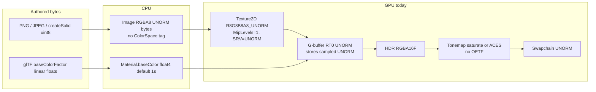
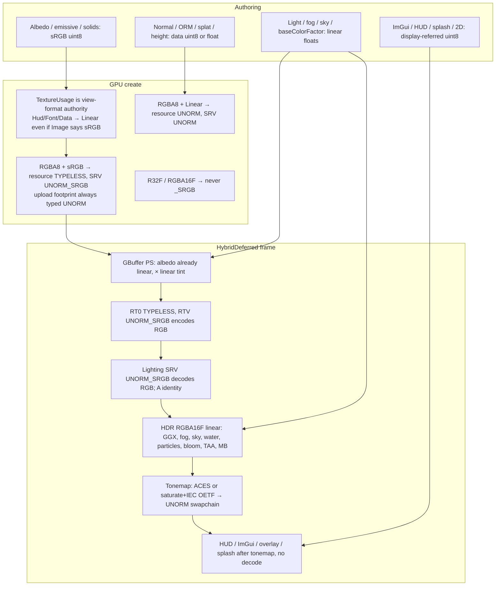
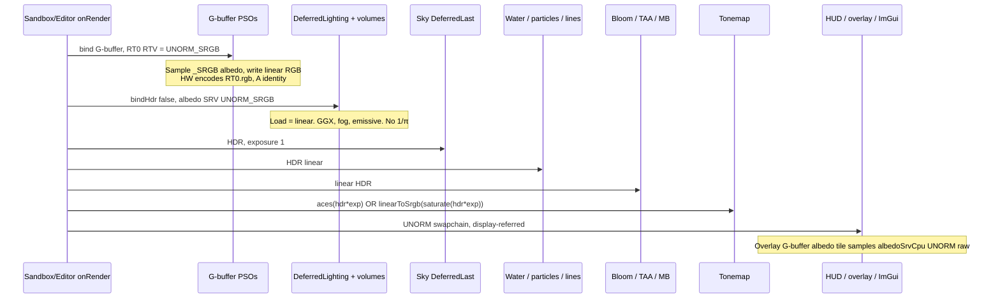

# Linear / sRGB color management for DarkEngine6

> **Implemented** by execute-plan 5124c804 PRs 1–4. Body below is the approved RFC (rev 4); present-tense “today” describes the pre-PR1 tip.

| Field | Value |
|-------|--------|
| **Title** | Correct linear Rec.709 working space + sRGB authoring/display pipeline |
| **Author** | TBD |
| **Date** | 2026-09-17 |
| **Status** | Draft (rev 4 — replaces sketch rev 1; supersedes deferred K4/K9/K10) |
| **Priority** | P0 — first item on [DESIGN-pbr-roadmap.md](./DESIGN-pbr-roadmap.md) |
| **Area** | `Math/Color.h`, `Assets/Image.*`, `Assets/Material.*`, `Render/Texture2D.*`, `Render/GpuResourceCache.*`, `Render/SceneBuffers.*`, `Render/ShaderCompile.*`, G-buffer / forward / tonemap shaders, Sandbox / Editor 3D hosts |
| **Audience** | Engine, Sandbox, Editor owners who already know this tree |
| **Depends on** | Hybrid deferred HDR path (landed). Does **not** depend on IBL, PBR maps, or auto-exposure. |
| **Supersedes** | Deferred **K4** (RT0 UNORM), **K9** (no color-space fix), **K10** (ACES as a curve on gamma-ish HDR). In-tree `DESIGN-color-management.md` rev 1 (IEC 60966 sketch). |
| **Does not** | Add `1/π` to Lambert/GGX diffuse, retune `Environment` candela, or ship HDR10 / Rec.2020. Local-lights **L21** “when linear lands, add 1/π” is **re-deferred to IBL** (C14), not done here. |

---

## Overview

DarkEngine6 lights, blooms, and ACES-tonemaps in a **gamma-ish 8-bit UNORM working space**. `Texture2D::createFromImage` uploads every 8-bit image as `DXGI_FORMAT_R8G8B8A8_UNORM` with no color-space parameter (`Render/Texture2D.cpp`). G-buffer shaders (`content/shaders/BasicMeshGBuffer.hlsl`, `SkinnedMeshGBuffer.hlsl`, `TerrainGBuffer.hlsl`) sample that as raw UNORM and write it to RT0, which `SceneBuffers::create` also allocates as `R8G8B8A8_UNORM`. HDR scene color is `R16G16B16A16_FLOAT` (linear-capable) but is fed gamma-encoded albedo. `content/shaders/Tonemap.hlsl` then either `saturate(hdr)` with **no exposure and no OETF**, or Narkowicz ACES (`aces(hdr * exposure)`) — a curve whose output is already approximately display-referred sRGB — into a **non-sRGB** swapchain (`Renderer.cpp` `DXGI_FORMAT_R8G8B8A8_UNORM`, RTV created with `nullptr` desc).

The result: BRDF energy, IBL, bloom thresholds, and auto-exposure Rec.709 luma (`DESIGN-auto-exposure.md`) are all poisoned. Mid-grey albedo 188/255 is treated as 0.737 linear instead of **0.503**. PBR maps RFC (`DESIGN-pbr-material-maps.md`) already assumes `srgbTex.Sample` for albedo and cannot land until this pipeline exists.

This RFC freezes one working space and one display contract:

- **Working space:** linear Rec.709 / sRGB primaries, scene-referred, unitless radiance-like (same primaries as today’s GGX path in `PbrLighting.hlsli`).
- **Authored color (albedo, emissive maps, solid-color Images):** sRGB 8-bit bytes in `Image` pixels. Decode at sample via a hardware `_SRGB` SRV. **Never** pre-linearize into 8-bit.
- **Data maps (normal, ORM, splat weights, height, HUD/UI fonts):** identity transfer, `*_UNORM` (or float) views.
- **G-buffer RT0:** `R8G8B8A8_TYPELESS` resource, **RTV + lighting SRV = `R8G8B8A8_UNORM_SRGB`**, so hardware encodes linear→sRGB on write and decodes on lighting sample. Attrib / velocity / HDR stay as they are.
- **Swapchain:** stays `R8G8B8A8_UNORM` (not `_SRGB` RTV) so ImGui, debug overlay, loading screen, HUD, and 2D paths can write display-referred bytes.
- **Tonemap:** Narkowicz ACES writes display-referred sRGB **with no extra IEC OETF**. Saturate/debug applies IEC `linearToSrgb` after `saturate(hdr * exposure)`.
- **No C++ exceptions.** Invalid format combos return `false` and `DE_LOG_ERROR(LogCategory::Render, ...)`.

The existing draft’s spine was directionally correct. It was not implementable: wrong IEC number, unspecified G-buffer storage, double-encode risk with Narkowicz, no per-class table, and a TYPELESS footgun. This document is the replacement.

---

## Background & Motivation

### What the tip actually does

Verified against the tree at time of writing.



| Piece | Location | Fact |
|-------|----------|------|
| 8-bit upload | `Texture2D::createFromImage` | `DXGI_FORMAT_R8G8B8A8_UNORM` when `ImageFormat::RGBA8`; `R32_FLOAT` when `R32F`. No color-space argument. `MipLevels = 1`. |
| Intern | `GpuResourceCache::ensureTexture` | Calls `createFromImage` with no usage hint. One GPU texture per `AssetID`. |
| Material albedo | `Assets/Material.h` | `AssetRef<Image>` + `float m_baseColor[4]{1,1,1,1}`. `createSolid(uint8)` stores **sRGB bytes** in a 1×1 Image and leaves tint at 1s. `createFromAlbedoImage` takes a float tint (glTF-shaped, but never documented as linear vs sRGB). |
| glTF solids | `Assets/Model.cpp` ~75–88 | If no albedo image, packs `baseColorFactor` as `uint8(factor*255)` into a solid Image and sets tint to 1. Factor is **linear** per glTF; those bytes are **not** sRGB-encoded. Accidental-ish today only because the SRV does not decode. |
| G-buffer sample | `BasicMeshGBuffer.hlsl` `PSMain` | `gAlbedo.Sample(...) * color` written to `SV_TARGET0`. Same in skinned + terrain splat. |
| G-buffer RT0/RT1 | `SceneBuffers.cpp` ~175–189 | Both `R8G8B8A8_UNORM`. RTV via `CreateRenderTargetView(..., nullptr)`. Lighting heap SRV also UNORM (`packLightingHeap` ~292–298). Clear `kAlbedoClear = {0,0,0,0}`. |
| G-buffer PSO | `MeshPipeline.cpp` ~159–163, `TerrainPipeline.cpp` ~145–149, `SkinnedMeshPipeline.cpp` ~174–176 | `RTVFormats[0/1] = R8G8B8A8_UNORM`, velocity `R16G16_FLOAT`. |
| HDR | `SceneBuffers.cpp` ~148 | `R16G16B16A16_FLOAT`. Bloom / TAA / MB / local-light volumes / deferred lighting / sky DeferredLast / water / particles all target this when `ScenePath::HybridDeferred`. |
| Swapchain | `Renderer.cpp` ~135, `createRenderTargets` ~238 | `R8G8B8A8_UNORM`, flip-discard, RTV `nullptr` (non-sRGB). `sceneColorFormat()` is RGBA16F if scene buffers exist, else UNORM. |
| Tonemap | `Tonemap.hlsl` `tonemapColor` | `mode < 0.5`: `saturate(hdr)` — **ignores `exposure`**. `mode >= 0.5`: `aces(hdr * exposure)` Narkowicz. Writes `float4(outRgb, 1)` to UNORM. PSO `RTVFormats[0] = UNORM` (`TonemapPipeline.cpp` ~96). |
| ImGui | `Ui/ImGuiHost.cpp` ~173 | `RTVFormat = R8G8B8A8_UNORM`. |
| Overlay / splash / 2D | `DebugOverlay.cpp`, `LoadingScreen.cpp` ~277, `SpritePipeline.cpp` ~122, `Sandbox2D` | UNORM swapchain, display-referred. `DESIGN-loading-screen.md` explicitly forbids an `_SRGB` splash view. |
| BRDF | `PbrLighting.hlsli` / `Render/PbrLighting.h` | Frostbite V-form GGX. Diffuse is `albedo*(1-metallic)*NdotL` with **no `1/π`** (“engine units”, local-lights L4/L21). |
| Sun / fog / sky | `Sky/Environment.cpp` | Analytic floats, Rec.709 luma already used for overcast (`0.2126/0.7152/0.0722`). Sun disc `2.8 * limb * edge` exceeds 1. These are **already scene-referred knobs**, not sRGB bytes. |
| Local lights | `LocalLightComponent::color` × `intensity` (candela) packed in `LocalLightGather.cpp` | RGB is a linear multiplier on candela. |
| Water body | `WaterPipeline.cpp` ~370 | `deepColor = (0.03, 0.12, 0.18)`, `shallowColor = (0.12, 0.38, 0.36)` — treated as linear HDR albedo-like. No albedo texture. |
| Auto-exposure RFC | `DESIGN-auto-exposure.md` | Meters `dot(hdr, float3(0.2126, 0.7152, 0.0722))` and targets 0.18 linear mid-grey. **Requires this RFC.** |
| PBR maps RFC | `DESIGN-pbr-material-maps.md` | `float3 albedo = srgbTex.Sample(...).rgb * baseColor.rgb`. **Requires this RFC.** |

Related RFC conflicts this document **supersedes** (C0):

- `DESIGN-deferred-renderer.md` **K4** froze RT0 as `R8G8B8A8_UNORM` (not `_SRGB`) so an sRGB RT0 would not double-encode today’s UNORM textures. **C2 replaces K4:** once source SRVs decode, RT0 *must* be `_SRGB` views on a TYPELESS resource. An engineer with both RFCs open follows **this document**, not K4.
- **K9** (“do not fix color space in the deferred migration”) and the K10 reading of Narkowicz as a display curve on gamma-ish HDR are closed. Working space is linear Rec.709; ACES is RRT+ODT on linear HDR (C1/C3).
- `DESIGN-local-lights.md` **L21** kept GGX in the UNORM-ish space and said “when the sRGB/linear follow-up lands, add `1/π` and retune Environment / candela.” This RFC **is** that follow-up for color space only. **Do not add `1/π` here** (C14). Strike L21’s “when linear lands” sentence in a one-line sibling edit: it now points at this RFC, then IBL.
- `DESIGN-ibl.md` currently depends on color-management but never mentions `1/π`. **Required amendment** (same PR5 docs pass): IBL gains an explicit decision to multiply Lambert/GGX diffuse by `1/π` and retune sun/ambient/candela in IBL-stack **PR3** (before bind), and to flip `PbrLighting_DiffuseHasNoInvPi`.
- `DESIGN-pbr-roadmap.md` item 1: this RFC is P0 because wrong color space poisons every later BRDF/IBL constant.
- In-tree `Render/DESIGN-color-management.md` rev 1 still says IEC **60966** and is replaced by this text in PR5.

### Pain points

1. **Albedo is gamma in the BRDF.** A dielectric authored as sRGB 188 is lit as 0.737. Filament/Frostbite references assume 0.503. Metals and dark wood crush the wrong way.
2. **G-buffer 8-bit linear would make this worse** if we decoded at sample and stored linear in UNORM RT0 — PBR live in the low end; 8-bit linear quantizes them to ~4–5 useful bits.
3. **ACES is applied to gamma-ish HDR.** Narkowicz was fit on linear Rec.709. Using it as a “display curve on gamma” (deferred K10) was an explicit stopgap.
4. **Saturate tonemap ignores exposure** (`Tonemap.hlsl` line 52–53) and dumps linear-ish values into UNORM, so lighting-off / debug looks like a crushed linear dump once inputs actually become linear.
5. **Narkowicz already includes an ODT.** A naive “tonemap applies OETF” (draft rev 1) would double-encode ACES output.
6. **TYPELESS vs typed UNORM.** Creating an `_SRGB` SRV on a resource created as `R8G8B8A8_UNORM` is illegal on the D3D12 spec and fails the debug layer on current Windows. Draft rev 1’s GPU table (`resource UNORM, SRV UNORM_SRGB`) is a ship-blocker.
7. **glTF solid bake is the wrong encoding** once `_SRGB` SRVs exist (`Model.cpp` `uint8(linearFactor*255)`). Must be frozen to white 1×1 + linear tint, not “either convention.”
8. **UI and 3D share a swapchain.** An `_SRGB` swapchain RTV would hardware-encode ImGui, loading screen, HealthHud, and debug tiles.

---

## Goals & Non-Goals

### Goals (v1)

- One working space for HybridDeferred lighting, bloom, TAA, motion blur, fog, water, particles-on-HDR, and ACES: **linear Rec.709, scene-referred**.
- Per-class contract table (this document) covering every sampled texture, every render target, and every CPU color that reaches a shader.
- CPU `srgbToLinear` / `linearToSrgb` matching **IEC 61966-2-1** (not 60966) piecewise, plus `Color.hlsli` with the same numbers.
- Hardware `_SRGB` SRV decode for 8-bit **color** textures; identity for data.
- G-buffer RT0 stores albedo in sRGB via hardware encode; lighting samples linear.
- Tonemap OETF contract frozen (ACES: no extra encode; saturate: IEC encode + honor exposure).
- Swapchain stays UNORM; overlays stay display-referred.
- `-forward` (SwapChainForward) lights in the same linear space and **encodes in the forward PS** (`ENCODE_SRGB=1` permutation).
- Debug A/B: linear albedo vs raw UNORM; optional legacy UNORM sampling.
- Unit tests named below. No exceptions; `bool` + `DE_LOG_ERROR(LogCategory::Render, ...)` + `DE_ASSERT`.

### Non-goals (v1)

- Full ACES RRT + separate ODT, ACEScg, Rec.2020, HDR10 / scRGB swapchain.
- Per-texture ICC profiles, WIC color-context conversion, OpenColorIO.
- Changing HDR away from `R16G16B16A16_FLOAT`.
- Mip generation (today `MipLevels = 1`; rule documented, not implemented).
- Block compression (BC7/BC5). Rule documented for the day we add it.
- `1/π` energy + `Environment` / candela retune — **explicitly deferred to [DESIGN-ibl.md](./DESIGN-ibl.md)** (C14).
- Retuning Sandbox art (checker terrain, lantern 220/150/60, water body colors) beyond the intentional look change.
- Lit particles, deferred decals, clustered lights, MSAA.
- Vertex colors (no `COLOR_0` in `MeshData` / `GltfLoader` today).
- A new renderer subsystem, bindless material heap, or `Pipeline.h` revival.

---

## Proposed Design

### Working-space pipeline



No new pass. This is upload/create + G-buffer RT0 views + tonemap / forward encode + a small Color helper.

### DX12 TYPELESS rules (implementation footgun)

D3D12 format casting is **not** “any UNORM view on any UNORM resource.”

| Resource `desc.Format` | Legal RTV | Legal SRV | Illegal | Notes |
|------------------------|-----------|-----------|---------|-------|
| `R8G8B8A8_UNORM` | `UNORM` (or `nullptr` desc) | `UNORM` | `UNORM_SRGB` | Debug layer: format 0x1D invalid for resource 0x1C. **Draft rev 1 table was this. Do not ship it.** |
| `R8G8B8A8_UNORM_SRGB` | `UNORM_SRGB` | `UNORM_SRGB` | `UNORM` | Cannot create a raw (non-decoding) SRV for A/B debug. |
| `R8G8B8A8_TYPELESS` | `UNORM` **or** `UNORM_SRGB` (explicit desc, never `nullptr`) | same family | `R16G16B16A16_FLOAT`, `R32_FLOAT` | **v1 choice for every 8-bit sRGB color texture and for G-buffer RT0.** |
| `R8G8B8A8_UNORM` | `UNORM` | `UNORM` | `_SRGB` | **v1 choice for data maps** (normal, ORM, splat, HUD). No TYPELESS needed. |
| `R16G16B16A16_FLOAT` | FLOAT | FLOAT | any `_SRGB` | HDR, TAA history, bloom, post. |
| `R32_FLOAT` / `R32_TYPELESS` | n/a as color | `R32_FLOAT` | `_SRGB` | Height maps. Depth stays `R32_TYPELESS` + `D32_FLOAT` DSV + `R32_FLOAT` SRV. |

Additional constraints:

- `CreateRenderTargetView(resource, nullptr, ...)` uses the **resource** format. Illegal on TYPELESS. G-buffer RT0 and every sRGB texture RTV (if any) must pass an explicit `D3D12_RENDER_TARGET_VIEW_DESC`.
- `D3D12_CLEAR_VALUE.Format` cannot be TYPELESS. For RT0 it is `R8G8B8A8_UNORM_SRGB`. `ClearRenderTargetView` colors are **linear**; the hardware encodes. `kAlbedoClear = {0,0,0,0}` is invariant.
- PSO `RTVFormats[0]` must equal the bound RTV format (`UNORM_SRGB` for G-buffer RT0). Mismatch = debug-layer error.
- Hardware `_SRGB` **does not convert alpha**. RT0.a (emissive) and albedo.a (mask/clip) are identity UNORM. This is required, not a bug.
- sRGB RTV blending converts src/dst RGB to linear, blends, encodes. G-buffer v1 is opaque (no blend). Future deferred decals inherit correct linear blend for free; do not disable it.

**Upload footprints (TYPELESS ship-blocker).** Today `Texture2D::createFromRaw` (`Render/Texture2D.cpp` ~112–242) sets `texDesc.Format = format`, calls `GetCopyableFootprints(&texDesc, ...)`, and creates the SRV with that same format. `D3D12_PLACED_SUBRESOURCE_FOOTPRINT.Format` and `CreateShaderResourceView` **cannot** be TYPELESS; a typeless footprint fails the debug layer on `CopyTextureRegion`.

Frozen split for RGBA8:

| Role | sRGB color (albedo / emissive) | Linear data / HUD |
|------|--------------------------------|-------------------|
| `CreateCommittedResource` | `R8G8B8A8_TYPELESS` | `R8G8B8A8_UNORM` |
| `GetCopyableFootprints` desc + `footprint.Format` | **`R8G8B8A8_UNORM`** (typed, same bit layout) | `R8G8B8A8_UNORM` |
| Sampling SRV | `R8G8B8A8_UNORM_SRGB` | `R8G8B8A8_UNORM` |
| Raw / debug SRV | `R8G8B8A8_UNORM` | same as sampling |

`createFromRaw(resourceFormat, srvFormat, footprintFormat)`: for both sRGB and Linear RGBA8, `footprintFormat = R8G8B8A8_UNORM`. Build a *copy* of `texDesc` with `Format = footprintFormat` for `GetCopyableFootprints`; the committed resource keeps TYPELESS (color) or UNORM (data). Never pass TYPELESS to `CreateShaderResourceView`. `resolveTextureFormats` returns `srvFmt` typed; a unit test asserts `srvFmt != TYPELESS` and `footprintFmt != TYPELESS`.

### G-buffer RT0 storage (C2)

After the G-buffer PS has **linear** albedo in the SV_TARGET0 register:

| Option | Storage | Precision at albedo 0.05 | Cost | Verdict |
|--------|---------|--------------------------|------|---------|
| **A. UNORM-linear** | keep `R8G8B8A8_UNORM`, write linear | ~1/255 ≈ 0.004 step; dark dielectrics band | 0 | Rejected for v1 as default. Allowed only as `legacyUnormAlbedo` debug, not a product path. |
| **B. sRGB views (preferred)** | resource `TYPELESS`, RTV+SRV `UNORM_SRGB` | ~sRGB 8-bit, matches authored PNG | 0 extra bytes; view-format plumbing | **v1.** |
| **C. RGBA16F albedo** | new RT0 format | excellent | +4 B/px vs 8-bit ≈ 16 MB at 2560×1600, plus bandwidth on every G-buffer write and lighting read | Rejected for v1. Revisit if a profiler shows RT0 banding after B. |

**Frozen v1 (option B):**

| Target | Resource format | RTV | Lighting / debug SRV | ClearValue.Format | PSO `RTVFormats` |
|--------|-----------------|-----|----------------------|-------------------|------------------|
| RT0 albedo + emissive A | `R8G8B8A8_TYPELESS` | `R8G8B8A8_UNORM_SRGB` | lighting heap slot 0: `UNORM_SRGB`; `albedoSrvCpu()` / overlay: **`UNORM` (raw)**; `albedoRawSrvCpu` is that same FLAG_NONE UNORM handle | `R8G8B8A8_UNORM_SRGB` | `[0] = UNORM_SRGB` |
| RT1 attrib (oct, rough, metal) | `R8G8B8A8_UNORM` | `UNORM` (`nullptr` OK) | `UNORM` | `UNORM` | `[1] = UNORM` |
| RT2 velocity | `R16G16_FLOAT` | FLOAT | FLOAT | FLOAT | `[2] = R16G16_FLOAT` |
| HDR / post / history / bloom | `R16G16B16A16_FLOAT` | FLOAT | FLOAT | FLOAT | FLOAT |
| Depth | `R32_TYPELESS` | n/a (DSV `D32_FLOAT`) | `R32_FLOAT` | `D32_FLOAT` | `DSVFormat = D32_FLOAT` |

`SceneBuffers::createColorTarget` today uses one `format` for resource, clear, and implicit views. Split it:

```cpp
bool createColorTarget(ID3D12Device* device, uint32_t width, uint32_t height,
                       DXGI_FORMAT resourceFormat, DXGI_FORMAT viewFormat,
                       const float clearColor[4], const wchar_t* name,
                       ComPtr<ID3D12Resource>& out, D3D12_RESOURCE_STATES& state);
```

`viewFormat` is written into `D3D12_CLEAR_VALUE.Format` and into the RTV desc. `nullptr` RTV desc is only legal when `resourceFormat == viewFormat` and neither is TYPELESS (HDR, attrib, velocity).

`packLightingHeap` must create **lighting heap slot 0** as `R8G8B8A8_UNORM_SRGB` (decoded linear for GGX). Freeze the FLAG_NONE handles:

| Handle | Format | Callers |
|--------|--------|---------|
| `SceneBuffers::albedoSrvCpu()` / `Renderer::albedoSrvCpu()` | **`UNORM` (raw encoded bytes)** | Sandbox ~2836 and Editor ~478 G-buffer tiles via `DebugOverlayColor.hlsl` (samples RGB, writes UNORM swapchain, **no** OETF). Overlay is a **byte dump**, not a color-managed preview — with a raw SRV it still looks like authored albedo. |
| `albedoRawSrvCpu()` | same UNORM object (alias OK) | `showAlbedoRaw` copies this into lighting slot 0 (`CopyDescriptors`, same pattern as `setShadowSrv`) |
| Lighting heap slot 0 (default) | `UNORM_SRGB` | Deferred lighting / volumes |

Do **not** grow `kLightingCount` (stays 5). Do **not** point `albedoSrvCpu()` at the `_SRGB` view — that would make the existing overlay tile dump linear (too dark).

G-buffer writers already output linear RGB once source SRVs decode. They do **not** call `linearToSrgb` in the PS — the RTV does it. `o.albedo = float4(albedo.rgb, emissive)` stays. `DeferredLighting.hlsl` `gAlbedo.Load` on an `_SRGB` SRV returns linear RGB; `Load` **does** apply the sRGB conversion. `lighting < 0.5` (F2/F6) therefore already shows linear albedo in HDR, which tonemap then encodes for display.

### Tonemap OETF contract (C3)

Narkowicz (`Tonemap.hlsl` `aces`):

```
saturate((x * (2.51 x + 0.03)) / (x * (2.43 x + 0.59) + 0.14))
```

This is a fit of **ACES RRT + ODT for sRGB / Rec.709 dim surround**. Input is linear Rec.709 (scene-referred, exposure applied). Output is already approximately **display-referred sRGB** (includes the ~2.2 ODT). Applying IEC 61966-2-1 after it **double-encodes** (the draft-rev-1 bug).

**Frozen v1:**

| `TonemapSettings::mode` | Debug flag | Shader | Swapchain bytes |
|-------------------------|------------|--------|-----------------|
| `0` saturate / debug | `debugState.aces == false` (current default) | `linearToSrgb(saturate(hdr * exposure))` | IEC display-referred |
| `1` ACES | `debugState.aces == true` | `aces(hdr * exposure)` **no extra OETF** | Narkowicz display-referred |

Also fix the current saturate bug: **mode 0 must multiply exposure.** Today `return saturate(hdr);` ignores it (`Tonemap.hlsl` 51–54). Sandbox currently pre-exposes the sky when ACES is off (`SandboxApp.cpp` `skyExposure = useAcesTonemap ? 1 : m_env.exposure()` and `post.exposure = aces ? m_env.exposure() : 1`). That split exists because saturate ignored exposure.

**After this RFC, exposure is applied once, at tonemap, for both modes on Sandbox HybridDeferred.** `Sky.hlsl` `exposure` cbuffer is **1** on that path (remove the multiply inside `EvaluateSky` / equivalent). `Environment::exposure()` feeds `TonemapSettings::exposure` always. **Editor 3D has no `Environment`** (`EditorRender3D.cpp` ~457–461 already sets `ts.exposure = 1.0f` and `aces && lighting`); leave it at 1. `-forward` has no tonemap: keep sky exposure in the forward sky PS, then apply `ENCODE_SRGB`.

Lighting-off (F2/F6): still `mode = 0` regardless of the ACES checkbox (deferred K12 / `useAcesTonemap` already requires `debugState().lighting`). With IEC encode, unlit albedo previews as authored sRGB instead of a linear dump.

DoF / fade (`blur`, `fade`) stay in linear HDR before `tonemapColor`.

### `-forward` encode

`ScenePath::SwapChainForward` writes Lambert / Blinn / sky / water / particles **directly** to the UNORM swapchain (`Renderer::sceneColorFormat()` is UNORM). If we sRGB-decode albedo and skip OETF, the rollback path goes black.

**Frozen:** compile permutations with `ENCODE_SRGB=1` iff `RTVFormats[0] == DXGI_FORMAT_R8G8B8A8_UNORM` **and** the pass is scene-referred (mesh forward, terrain forward, sky `ForwardFirst`, water-on-UNORM, particles-on-UNORM). Apply `linearToSrgb` to **every** RGB return, including the lighting-off early-out (`BasicMesh.hlsl` / `SkinnedMesh.hlsl` / `Terrain.hlsl` `if (lighting < 0.5f) return albedo;` must encode or `-forward` unlit dumps linear — the same saturate bug C3 fixes on deferred). Particle/Water: encode `.rgb` only, leave alpha.

HDR PSOs (`ForwardTransparent` on HybridDeferred, sky `DeferredLast`, water/particles on RGBA16F) compile `ENCODE_SRGB=0` and write linear.

There is **no** `D3D_SHADER_MACRO` path today: `compileShaderFromFile` / `compileShaderFromContent` (`Render/ShaderCompile.h` ~24–27, `ShaderCompile.cpp` ~100–104) pass `pDefines = nullptr`. PR4 adds `const D3D_SHADER_MACRO* defines = nullptr` to both helpers (`bool` + `DE_LOG_ERROR`, no exceptions) and threads it from each `*Pipeline::create`.

`MeshPass::ForwardUnorm` already hardcodes `RTVFormats[0] = R8G8B8A8_UNORM` (`meshPassColorFormat` in `MeshPipeline.h` ~22–26); skinned opaque forward is also hardcoded UNORM (`SkinnedMeshPipeline.cpp` ~182). On those PSOs `ENCODE_SRGB=1` is **unconditional**. Water/particles take `sceneColorFormat()` at `create` — one define per process, no in-process dual permutation.

**`-forward` OETF is per-draw; UNORM alpha blend stays gamma.** The RTV is non-sRGB, so after the PS encodes, `SRC_ALPHA` / `INV_SRC_ALPHA` blends in display-referred space. That matches today’s accidental gamma path and is **acceptable for the rollback path only**, not a product sRGB RTV. HybridDeferred transparents write linear HDR and blend in linear (correct).

`SpritePipeline`, `LoadingScreen`, `DebugOverlay`, `TonemapPipeline` (after the curve), ImGui: **already display-referred — do not encode, do not decode.**

`LinePipeline`: does not convert. 3D HDR lines (`m_linePipeline3D`, PathChase) pass **linear** `color`. 2D UNORM lines pass **display-referred** `color`. Callers already own two PSOs (deferred K22).

### CPU vs GPU decode

Keep 8-bit `Image` pixels in **authored space**. Decoding to linear 8-bit on upload is precision suicide (mid-grey 188 → 55, then an `_SRGB` SRV would decode 55 to ~0.038).

| Path | Where decode happens |
|------|----------------------|
| 8-bit albedo / emissive / solids | Hardware `_SRGB` SRV at sample / `Load` |
| CPU constants from sRGB bytes (`setBaseColorFromSrgb8`, grey-card, tests) | `Dark::Color::srgbToLinear` into float |
| glTF `baseColorFactor` | Already linear; store in `Material::m_baseColor` as-is |
| Lights, fog, sky, water body, Environment | Already linear floats; **do not** sRGB-decode |
| HUD / UI / splash / 2D sprites | Identity. Bytes are display-referred and written to UNORM. |

### Mips (v1: none)

`Texture2D::createFromRaw` sets `MipLevels = 1` and SRV `MipLevels = 1`. **v1 keeps this.**

When mips land (follow-up, not a PR in this RFC):

- Filter in linear. Either generate from an `_SRGB` resource (driver linearizes) or explicit linearize → box/gauss → encode.
- Never `GenerateMips` on a typed UNORM color texture without an sRGB view; that averages gamma and darkens.

### Compressed formats (out of v1)

No BC1/3/5/7 in the tree today. When added:

| Usage | Format |
|-------|--------|
| Albedo / emissive color | `BC7_UNORM_SRGB` (resource `BC7_TYPELESS` if a raw view is needed) |
| Normal | `BC5_UNORM` (RG) or `BC7_UNORM` (not `_SRGB`) |
| ORM / masks / splat | `BC7_UNORM` or `BC4/BC5` (not `_SRGB`) |
| HDR IBL | stay FLOAT; never `_SRGB` |

### Look change (intentional)

sRGB 188/255 (`0.7372549019607843`) becomes linear **`0.5028864580325687`**. sRGB 0.5 becomes linear **`0.21404114048223255`**. 18% grey card is linear 0.18 ≈ sRGB **0.461** (byte 118), not 188.

Scenes go darker. Bloom extract (`Bloom.hlsl` threshold 1.0, Rec.709 luma) will pick up fewer mid-grey surfaces and more true HDR (sun disc). BRDFs start to match Filament-style spreadsheets for the same L. **Do not retune Environment or candela in this RFC** — that would mix two look changes and kill A/B. Optional `DebugRenderState::legacyUnormAlbedo` binds the UNORM SRV of color textures so artists can toggle old sampling.

Editor ground (`EditorAppInit.cpp`): white 1×1 × `setBaseColor(0.45, 0.48, 0.52)`. After this RFC those floats are **true linear** (a light grey, sRGB-equivalent ~0.70). Leave the numbers; they were never sRGB bytes. Document `setBaseColor` as linear.

Sandbox lantern `createSolid(220, 150, 60)` stays sRGB bytes + `_SRGB` SRV.

### `1/π` energy (C14) — deferred

Local-lights RFC:

> When the sRGB/linear follow-up lands, add `1/π` and retune `Environment` / candela defaults together.

**This RFC does not add `1/π`.** Diffuse stays `albedo*(1-metallic)*NdotL` (“engine units, Frostbite shape”) in both `PbrLighting.hlsli` and `Render/PbrLighting.h`. `PbrLightingTests.RoughDielectricMatchesLambertWithin15Percent` remains valid.

Rationale: this cut is a pure color-space A/B. Adding π here would darken the frame a second time (~3× on the directional sun, as L21 already notes) and force an Environment retune before IBL exists.

**Ownership (L21 currently has none):** `DESIGN-ibl.md` depends on this RFC and never mentions `1/π`, Environment, or candela. Required sibling edits (PR5 docs, not this color-space code):

1. **IBL RFC** gains an explicit decision: *on a linear working space, multiply Lambert/GGX diffuse by `1/π` and retune sun / ambient / candela in IBL-stack **PR3** (before bind); flip `PbrLighting_DiffuseHasNoInvPi`.*
2. **Local-lights L21** strikes “when the sRGB/linear follow-up lands, add `1/π`…” and points here (color space) then IBL (π + retune).

A unit test `PbrLighting_DiffuseHasNoInvPi` documents current energy: with `n=l=v`, roughness 1, metallic 0, `F0=0.04`, `lightColor=1`, `pbrEvaluate ≈ albedo*0.96 + small spec`, **not** `albedo/π`. IBL RFC flips that test.

---

## API / Interface Changes

### `Math/Color.h` — transfer functions

`Dark::Math::Color` is already an axis enum (`R,G,B,A` in `Math/MathDefines.h`). Do **not** add a `class Color` under `Dark::Math`. New file, new namespace, foundation layer (`DE_FOUNDATION_FOLDERS` already globs `Math/`).

**Header-only** (no `Math/Color.cpp` in v1), same style as `Math/MathHelper.h`. No DXGI, no exceptions, no `throw`. Include `<cmath>` itself for `powf` (do not rely on MathHelper’s includes). Inline the 3-component helpers — declaring them without bodies is a linker error.

`TextureUsage` (Albedo/Orm/Hud/Font) is GPU/asset taxonomy, not math. v1 keeps it in `Dark::Color` anyway: one header, no DXGI, `inferColorSpaceForUsage` next to the transfer functions. A later split to `Assets/ColorSpace.h` is allowed; do not do it in PR1.

```cpp
#pragma once
#include "Math/MathHelper.h"
#include <cmath>
#include <cstdint>

namespace Dark::Color
{
    enum class ColorSpace : uint8_t { Unknown = 0, sRGB, Linear };

    enum class TextureUsage : uint8_t
    {
        Albedo = 0,
        Emissive,
        Normal,
        Orm,
        Data,     // splat weights, masks, generic UNORM
        Height,   // R32F
        Hud,      // display-referred UI / splash / 2D / fonts
        Font,
    };

    // IEC 61966-2-1. c is a single channel in [0,1] (clamped).
    inline float srgbToLinear(float c)
    {
        c = Math::Clamp(c, 0.0f, 1.0f);
        return (c <= 0.04045f) ? (c / 12.92f)
                               : powf((c + 0.055f) / 1.055f, 2.4f);
    }
    inline float linearToSrgb(float c)
    {
        c = Math::Clamp(c, 0.0f, 1.0f);
        return (c <= 0.0031308f) ? (12.92f * c)
                                 : (1.055f * powf(c, 1.0f / 2.4f) - 0.055f);
    }

    inline float srgb8ToLinear(uint8_t u) { return srgbToLinear(static_cast<float>(u) / 255.0f); }
    inline uint8_t linearToSrgb8(float c)
    {
        const float s = linearToSrgb(c);
        return static_cast<uint8_t>(s * 255.0f + 0.5f);
    }

    inline void srgbToLinear3(const float srgb[3], float linear[3])
    {
        linear[0] = srgbToLinear(srgb[0]);
        linear[1] = srgbToLinear(srgb[1]);
        linear[2] = srgbToLinear(srgb[2]);
    }
    inline void linearToSrgb3(const float linear[3], float srgb[3])
    {
        srgb[0] = linearToSrgb(linear[0]);
        srgb[1] = linearToSrgb(linear[1]);
        srgb[2] = linearToSrgb(linear[2]);
    }
    inline void srgb8ToLinear3(uint8_t r, uint8_t g, uint8_t b, float linear[3])
    {
        linear[0] = srgb8ToLinear(r);
        linear[1] = srgb8ToLinear(g);
        linear[2] = srgb8ToLinear(b);
    }

    inline ColorSpace inferColorSpaceForUsage(TextureUsage usage)
    {
        switch (usage)
        {
        case TextureUsage::Albedo:
        case TextureUsage::Emissive:
            return ColorSpace::sRGB;
        default:
            return ColorSpace::Linear;
        }
    }
}
```

`srgbToLinear(0.5f)` must equal **`0.21404114048223255`** within 1e-6 (exact `pow` of the piecewise). Do not use gamma 2.2 as a stand-in in v1.

### `content/shaders/Color.hlsli`

Same piecewise, same thresholds. Used by tonemap (saturate path), forward `ENCODE_SRGB`, and debug. G-buffer **does not** call these for albedo — the view does.

```hlsl
#ifndef DE_COLOR_HLSLI
#define DE_COLOR_HLSLI
float srgbToLinear(float c)
{
    c = saturate(c);
    return (c <= 0.04045f) ? (c / 12.92f) : pow((c + 0.055f) / 1.055f, 2.4f);
}
float linearToSrgb(float c)
{
    c = saturate(c);
    return (c <= 0.0031308f) ? (12.92f * c) : (1.055f * pow(c, 1.0f / 2.4f) - 0.055f);
}
float3 srgbToLinear(float3 c) { return float3(srgbToLinear(c.r), srgbToLinear(c.g), srgbToLinear(c.b)); }
float3 linearToSrgb(float3 c) { return float3(linearToSrgb(c.r), linearToSrgb(c.g), linearToSrgb(c.b)); }
#endif
```

### `Assets/Image` tag

```cpp
Color::ColorSpace colorSpace() const { return m_colorSpace; }
void setColorSpace(Color::ColorSpace cs) { m_colorSpace = cs; }
bool colorSpaceWasDefaulted() const { return m_colorSpaceDefaulted; }
```

- `createSolidColor`: **leave `Unknown` + defaulted.** Pixels are still authored 0–255 sRGB bytes; the tag is *not* sRGB, so a later `Texture2D::createSolidColor(..., Hud)` is not stuck with an `_SRGB` view (Issue 1). `Material::createSolid` calls `setColorSpace(sRGB)` on the interned Image because that Image is albedo.
- `createFromR32Float`: set `Linear`. Not defaulted.
- `createSoftCircle` / `createSoftStreak`: set `Linear` (white RGB is 1 either way; A is a mask). Not defaulted. Particle sprites go through `Material::createFromAlbedoImage` → `ensureTexture(Albedo)`; the Linear tag is what keeps the SRV UNORM.
- `createFromFile` / `createFromMemory` / `createFromRGBA`: leave `Unknown`, `m_colorSpaceDefaulted = true` until GPU create infers. WIC already converts to `GUID_WICPixelFormat32bppRGBA` **without** applying an ICC profile (`Image.cpp` `DecodeWicFrame`) — PNG bytes are treated as sRGB when usage says Albedo.
- `setColorSpace` after load is CPU documentation. **GPU view format follows `TextureUsage`**, not this tag, when they disagree (Hud/Font/Data always Linear views).

No `ImageCreateInfo` mega-struct in v1. Image stays a CPU pixel blob plus a tag.

### `Texture2D` create-time hint

```cpp
bool createFromImage(Renderer& renderer, const class Image& image, Color::TextureUsage usage);
bool createFromFile(Renderer& renderer, const std::filesystem::path& path, Color::TextureUsage usage);
bool createFromMemory(... , Color::TextureUsage usage);
bool createSolidColor(..., Color::TextureUsage usage = Color::TextureUsage::Albedo);
bool createSoftCircle(..., Color::TextureUsage usage = Color::TextureUsage::Data);
bool createFromRGBA(..., Color::TextureUsage usage);
bool createFromR32Float(...); // always Linear; reject sRGB
```

**Linear always wins; Hud/Data never decode.** Frozen resolution:

1. `gpuSpace = inferColorSpaceForUsage(usage)`.
2. If `infer(usage) == Linear` (`Hud`/`Font`/`Data`/`Normal`/`Orm`/`Height`), **force Linear** even if the Image is tagged sRGB. This is how colored 2D solids stay display-referred.
3. Else (`Albedo`/`Emissive`): if `Image::colorSpace() == Linear`, keep Linear (particle soft-circle masks interned as Materials). If Unknown, default sRGB (INFO once). If sRGB, sRGB.
4. `Texture2D::createSolidColor` **applies that `gpuSpace` and overwrites the (local) Image tag** before upload. `createFromFile` / `createFromMemory` / `createFromRGBA` pass `usage` through to `createFromImage`.
5. Map `gpuSpace` to DXGI. On conflict (`sRGB` requested on `R32F` / `RGBA16F`): `DE_LOG_ERROR` + `return false`. WARN once if an sRGB Image tag was overridden by Hud/Data usage.

This is the rule that makes colored 2D uploads legal. **Must pass `TextureUsage::Hud`:** coins (`Sandbox2DApp.cpp` / `EditorApp.cpp` `(236,196,64)` / spawn `(48,196,168)`), **2D checkers** (`Sandbox2DApp.cpp` `createChecker` platforms/hills; `EditorInternals.cpp` `createChecker` → `m_texPlatform`), MainMenu white + rasterized labels (`Ui/MainMenu.cpp`), HealthHud / CrosshairHud white, LoadingScreen, SpriteSheet. White 1×1 is sRGB-invariant so a mistaken Albedo usage would still look fine — **2D platforms/hills are not**; do not copy terrain’s Albedo argument onto those helpers. Terrain `CreateChecker` stays Albedo.

`Texture2D` descriptor heaps:

| Heap | `NumDescriptors` | Slot 0 | Raw UNORM |
|------|------------------|--------|-----------|
| FLAG_NONE (`cpuHandle` source) | **2** if TYPELESS color, else 1 | sampling view (`_SRGB` if color, UNORM if data) = `cpuHandle()` | slot 1 = `cpuHandleRaw()` (equals slot 0 for data) |
| SHADER_VISIBLE (`bind()` / `gpuHandle()`) | **1** | **same view as `cpuHandle()`** | CPU-only; HUD/`bind()` never sees the raw alias |

3D materials never `bind()` albedo (`GpuMaterial` copies CPU handles into a packed heap). HUD / some 2D still call `Texture2D::bind()`; after PR3 that shader-visible descriptor is UNORM for Hud and `_SRGB` for Albedo.

`createFromRaw(resourceFormat, srvFormat, footprintFormat)` — see TYPELESS upload table. `MipLevels` stays 1.

Helper (Render, not Math — uses DXGI):

```cpp
bool resolveTextureFormats(Color::ColorSpace space, ImageFormat imgFmt,
                           DXGI_FORMAT& resourceFmt, DXGI_FORMAT& srvFmt, DXGI_FORMAT& footprintFmt);
// RGBA8 + sRGB  → TYPELESS, UNORM_SRGB, UNORM   (srv and footprint never TYPELESS)
// RGBA8 + Linear → UNORM, UNORM, UNORM
// R32F  + Linear → R32_FLOAT, R32_FLOAT, R32_FLOAT
// R32F  + sRGB   → false
```

### `GpuResourceCache`

```cpp
bool ensureTexture(const AssetRef<Image>& image, Color::TextureUsage usage);
void setAlbedoSamplingRaw(bool raw); // process-global debug; persists like setShadowSrv
```

`ensureMaterial` passes `TextureUsage::Albedo` for the albedo image. When PBR maps RFC adds normal/ORM/emissive, those calls pass `Normal` / `Orm` / `Emissive`. First `ensureTexture` for an `AssetID` wins; a second call with a conflicting usage logs and keeps the existing GPU object (images are not dual-use today).

`loadAndUploadTexture` (`GpuUpload.cpp`, SpriteSheet / 2D) passes `TextureUsage::Hud`.

**`legacyUnormAlbedo` is process-global debug state, not per-draw, and it must persist like `setShadowSrv`.** Today `setShadowSrv` (`GpuResourceCache.cpp` ~247–258) stores `m_shadowCpu` and `ensureMaterial` re-applies `copyShadow` after every later `pack` (~107–108). `registerPackedHeap` does the same for late-registered heaps (~29–30). Without an equivalent remembered flag, a newly interned material (Sandbox lantern, Editor spawn) would sample `_SRGB` while the rest of the scene samples raw UNORM until the checkbox is toggled again.

```cpp
// GpuResourceCache — remember + patch, same lifetime as m_shadowCpu. Does not touch SceneBuffers.
bool m_albedoSamplingRaw = false;
void setAlbedoSamplingRaw(bool raw);
```

- `setAlbedoSamplingRaw(raw)` **stores `m_albedoSamplingRaw = raw`**, then iterates `m_materials` and `CopyDescriptors` slot `GpuMaterial::kAlbedoSlot` (0) from that material’s albedo `cpuHandleRaw()` vs `cpuHandle()`.
- `GpuMaterial::pack` in `ensureMaterial` still copies the **default** `cpuHandle()` (`_SRGB` after PR3). **Immediately after pack**, if `m_albedoSamplingRaw`, `CopyDescriptors` slot 0 from `cpuHandleRaw()` (same site as `if (m_shadowCpu.ptr != 0) copyShadow(...)`).
- Do **not** blindly write slot 0 of every `m_packedHeaps` entry: terrain heaps have four layer slots (`TerrainMaterial.cpp` ~103–106).
- Host/DevTools also calls `TerrainMaterial::setLayerSamplingRaw(ID3D12Device* device, bool raw)` (or `Renderer&`; needs a device the same way `copyShadow` / `packSrvHeap` do). That `CopyDescriptors` slots 0–3 from `m_layerTex[i]`; splat slot 4 stays UNORM. If terrain is `createDefault` / `create`’d again while the flag is on, the **host re-calls** `setLayerSamplingRaw` (terrain does not read `DebugRenderState`).
- Log once per edge. Not free per-draw.

Particle sprites: `ParticleMaterials.cpp` intern a **Material** (`createSoftCircle`/`createSoftStreak` → `createFromAlbedoImage` → `ensureMaterial` → `ensureTexture(Albedo)`). There is **no** `TextureUsage::Data` call site. Correctness is the Image Linear tag (C7 step 3: Linear tag on an Albedo slot stays UNORM). White RGB is also sRGB-invariant. Blood splats (`BloodSplatPool.cpp` `createFromRGBA`) really are Albedo.

### `Material` tint = linear multiplier

Frozen glTF `baseColorFactor` convention:

| API | Space |
|-----|--------|
| `setBaseColor(float r,g,b,a)` | **Linear.** Written to G-buffer CB `color.rgb` as-is (`MaterialSurface.cpp`). |
| `setBaseColorFromSrgb8(uint8_t r,g,b,a)` | Converts via `srgb8ToLinear`, then `setBaseColor`. Alpha is `a/255` (not decoded). |
| `createFromAlbedoImage(..., float r,g,b,a)` | Tint is linear. |
| `createSolid(assets, uint8 r,g,b,a)` | Image pixels = sRGB bytes; `setColorSpace(sRGB)` on the interned Image; **tint stays (1,1,1,1)**. Do not pre-linearize pixels. Do not put linear floats into the 1×1. (`Image::createSolidColor` itself leaves Unknown; Material stamps sRGB because this Image is albedo.) |

**glTF without a baseColor texture** (`Assets/Model.cpp` ~75–88) — **one convention, not either:**

```cpp
// BEFORE (wrong once _SRGB SRVs exist):
albedo = loadSolidImage(uint8(factor*255), ...);
tint   = (1,1,1,1);

// AFTER:
albedo = loadSolidImage(255, 255, 255, 255); // sRGB white 1×1
tint   = src.baseColor;                      // linear factor from cgltf
```

With a baseColor texture: tag the Image sRGB (usage Albedo); tint = linear `base_color_factor` (already what cgltf gives). Alpha mode / mask cutoff still uses albedo.a (identity).

### Shader contract (G-buffer / forward)

```hlsl
float4 sampled = gAlbedo.Sample(gSamp, uv); // RGB linear if _SRGB SRV
float3 albedo  = sampled.rgb * color.rgb;   // color.rgb is linear tint
// G-buffer PSOs compile ENCODE_SRGB=0 (RTV encodes). Forward UNORM compiles 1.
#if ENCODE_SRGB
    if (lighting < 0.5f)
        return float4(linearToSrgb(albedo), sampled.a); // lighting-off must encode too
    return float4(linearToSrgb(lit), sampled.a);        // alpha not encoded
#else
    return float4(lit, emissiveOrAlpha);
#endif
```

Terrain splat: sample layers as albedo (sRGB views), splat map as data (UNORM). Mix in linear:

```hlsl
float4 albedo =
      splat.r * gLayer0.Sample(...)  // already linear RGB
    + splat.g * gLayer1.Sample(...)
    + splat.b * gLayer2.Sample(...)
    + splat.a * gLayer3.Sample(...);
albedo *= color; // linear
```

Mixing sRGB-encoded layers in gamma (today) is wrong; mixing after decode is the reason terrain checkers will shift. Intentional.

---

## Data Model Changes

No serialization format version bump for scene JSON. Lights already store float RGB. Materials in glTF already store linear factors. CPU Images are not persisted as engine-specific blobs.

`materialRecipeKey` already includes `baseColor` floats; linear values keep the key stable for existing textured assets with tint 1. Solid-from-glTF keys change when we stop baking factor into the Image id (white 1×1 intern key vs per-color key) — acceptable; intern keys are process-local.

---

## Per-class texture / color contract

**Legend**

- **CPU bytes:** what `Image::pixels()` / the C++ field holds.
- **Resource / SRV:** DXGI at `Texture2D` or `SceneBuffers` create.
- **RGB decode:** hardware `_SRGB` yes/no.
- **Alpha:** always identity for `_SRGB` views.

### Sampled textures

| Class | CPU bytes | Resource | SRV | RGB decode | Alpha | Call sites / notes |
|-------|-----------|----------|-----|------------|-------|--------------------|
| Material albedo / baseColor texture | sRGB uint8 | `R8G8B8A8_TYPELESS` | `UNORM_SRGB` | yes | identity (mask/clip) | `GpuResourceCache::ensureMaterial` → `TextureUsage::Albedo`. glTF `base_color_texture`. |
| Solid Image used as **3D albedo** | sRGB uint8 1×1 | TYPELESS | `UNORM_SRGB` | yes | identity | `Material::createSolid` / `internSolidMaterial` / lantern `SandboxApp.cpp` ~1422. Material stamps Image `sRGB`. **Do not pre-linearize.** |
| Solid Image used as **2D/HUD** | display-referred uint8 1×1 | `UNORM` | `UNORM` | no | identity | `Texture2D::createSolidColor(..., Hud)` **overwrites** the local Image tag via `infer(Hud)`. See must-pass-Hud list below. Colored coins would go dark if usage defaulted to Albedo. |
| **2D procedural checkers / MainMenu labels** | display-referred uint8 | `UNORM` | `UNORM` | no | 255 / coverage | Same checker helper shape as terrain, **opposite usage.** `Sandbox2DApp.cpp` `createChecker` → `m_texPlatform` `(118,86,52)/(92,66,40)`, `m_texHillFar`, `m_texHillMid` (`createFromRGBA`, `drawSprite` on UNORM ~1381–1396). `EditorInternals.cpp` `createChecker` → `EditorApp.cpp` `m_texPlatform`. `Ui/MainMenu.cpp` `m_white.createSolidColor` + `lab.texture.createFromRGBA` (rasterized labels). All **`TextureUsage::Hud`**. |
| Terrain splat **layers** | sRGB uint8 (procedural checkers today) | TYPELESS | `UNORM_SRGB` | yes | unused (255) | `TerrainMaterial.cpp` `CreateChecker` — pass `TextureUsage::Albedo`. **Not Hud.** |
| Terrain **splat weights** | UNORM weights uint8 | `R8G8B8A8_UNORM` | `UNORM` | no | used as 4th weight | `TerrainMaterial::createDefault` splat upload — `TextureUsage::Data`. |
| Normal map (PBR maps RFC) | UNORM XYZ | `UNORM` | `UNORM` | no | unused | Future `TextureUsage::Normal`. BC5 later. |
| ORM (AO/Rough/Metal) | UNORM | `UNORM` | `UNORM` | no | unused | Future `TextureUsage::Orm`. |
| Emissive **map** | sRGB uint8 | TYPELESS | `UNORM_SRGB` | yes | unused | glTF emissive texture is sRGB. Factor is linear and can exceed 1 — that multiply is in float CB, not in the 8-bit map. 8-bit `_SRGB` is OK for the texture. |
| Height | `ImageFormat::R32F` | `R32_FLOAT` | `R32_FLOAT` | no | n/a | `Texture2D::createFromR32Float`. Fog / water `gHeightMap`. |
| Particle soft circle / streak | RGB 255 + mask A | `UNORM` (Image Linear tag) | `UNORM` | no | mask, identity | Interned as a **Material** (`ParticleMaterials.cpp` → `ensureMaterial` → `ensureTexture(Albedo)`). **No `TextureUsage::Data` call site.** Linear Image tag (plus usage-conflict → UNORM) is the contract. White RGB is sRGB-invariant. Drawn into **HDR**. Vertex `COLOR0` is **linear**. |
| Blood splat texture | sRGB uint8 | TYPELESS | `UNORM_SRGB` | yes | blend | `BloodSplatPool.cpp` `createFromRGBA` — `TextureUsage::Albedo`. Forward on HDR. |
| Sprite sheet (Sandbox2D / 2D Editor) | display-referred uint8 | `UNORM` | `UNORM` | no | blend | `SpriteSheet.cpp`, `GpuUpload::loadAndUploadTexture` → `Hud`. Written to UNORM swapchain. |
| HUD white 1×1 (HealthHud, CrosshairHud, MainMenu) | 255,255,255,255 | `UNORM` | `UNORM` | no | 1 | `createSolidColor(..., TextureUsage::Hud)`. Tint from `UiPalette` is display-referred (`uiRgb8` = `c/255`). |
| Loading logo / font | display-referred uint8 | `UNORM` | `UNORM` | no | font in `.r` | `LoadingScreen.cpp`. `DESIGN-loading-screen.md`: do **not** create `_SRGB`. Font is mono coverage. |
| ImGui fonts / atlas | display-referred | ImGui DX12 backend UNORM | UNORM | no | coverage | `ImGuiHost.cpp` `RTVFormat = UNORM`. |
| IBL cubemaps / HDRI (IBL RFC) | float linear | `R16G16B16A16_FLOAT` | FLOAT | never `_SRGB` | n/a | Equirect Radiance `.hdr` only. |

### Render targets

| Target | Resource | RTV | SRV | Working contents |
|--------|----------|-----|-----|------------------|
| G-buffer RT0 | `R8G8B8A8_TYPELESS` | `UNORM_SRGB` | lighting slot 0 `UNORM_SRGB`; `albedoSrvCpu()` **UNORM raw** (overlay dump) | RGB: sRGB-encoded linear albedo. A: linear emissive (identity). |
| G-buffer RT1 attrib | `R8G8B8A8_UNORM` | UNORM | UNORM | oct normal, roughness, metallic |
| Velocity | `R16G16_FLOAT` | FLOAT | FLOAT | UV motion |
| HDR / bloom / TAA history / post | `R16G16B16A16_FLOAT` | FLOAT | FLOAT | linear Rec.709 |
| Shadow maps | `R32_TYPELESS` | DSV `D32_FLOAT` | `R32_FLOAT` | depth, not color |
| Swapchain | `R8G8B8A8_UNORM` | UNORM (`nullptr`) | n/a | display-referred sRGB bytes after tonemap / 2D / UI |
| LoadingScreen / DebugOverlay / Sprite HUD | n/a (swapchain) | UNORM | — | display-referred |

### CPU colors (no texture)

| Source | Space | Notes |
|--------|--------|-------|
| `Material::baseColor` | **Linear** multiplier | glTF `baseColorFactor`. `setBaseColorFromSrgb8` for byte literals. |
| `Material::emissive` scalar | Linear | Written to RT0.a; lighting `* emissiveGain`. |
| Vertex colors | n/a in v1 | No `COLOR_0` in `MeshData` / `GltfLoader`. When added: glTF vertex color is linear; multiply in shader. |
| `LocalLightComponent::color` | Linear | × candela in `LocalLightGather::packGpu`. Author lantern RGB as linear; helper from sRGB bytes if a UI color picker is in 0–255. |
| `AmbientLightComponent::color` | Linear | Unused by the sun path today; same rule if it ever drives ambient. |
| `Environment::{light,sun,moon,ambient,fog,skyZenith,skyHorizon}` | Linear scene-referred | Analytic; Rec.709 luma already. **Do not sRGB-decode.** Sun disc > 1 is HDR. |
| Fog in-scatter | Linear | `Fog.hlsli` `FogAlbedo` uses Rec.709 luma. |
| Water `deepColor` / `shallowColor` | Linear | `WaterPipeline.cpp` `(0.03,0.12,0.18)` / `(0.12,0.38,0.36)`. |
| Particle vertex `COLOR0` | Linear | `Particle.hlsl` `tex * input.color` into HDR. |
| Line CB `color` | Matches the target | HDR lines: linear. 2D UNORM lines: display-referred. |
| `UiPalette` / `uiRgb8` | Display-referred | `c/255` into UNORM HUD. **Do not** run `srgbToLinear`. |
| ImGui `ImVec4` | Display-referred | Post-tonemap. |
| Editor `setBaseColor(0.45, 0.48, 0.52)` | Linear (API contract) | Looks lighter than a 0.45 sRGB grey. Leave values. |
| Debug overlay sampled color | Byte dump | `DebugOverlayColor.hlsl` writes sampled RGB to UNORM with no encode. G-buffer albedo tile uses `Renderer::albedoSrvCpu()` = **raw UNORM** (authored-looking). HDR tiles look dark; acceptable. `showAlbedoRaw` only swaps lighting-heap slot 0, not the overlay handle. |

### Forward transparent / particles / water (HDR)

Must sample/decode like albedo (if they have a color texture) and **write linear** into `R16G16B16A16_FLOAT`.

| Pass | Texture | Write |
|------|---------|--------|
| `MeshPass::ForwardTransparent` | albedo `_SRGB` SRV, linear tint | linear HDR, `ENCODE_SRGB=0` |
| `ParticlePipeline` HybridDeferred | mask Linear / blood Albedo | linear HDR |
| `Water.hlsl` | no albedo tex; body colors linear; height `R32F` | linear HDR + alpha |
| Sky `DeferredLast` | none (analytic) | linear HDR, **exposure = 1** (moved to tonemap) |
| Blood splats | albedo `_SRGB` | linear HDR, alpha blend |

---

## Frame integration



`SceneRenderer::applyPost` order unchanged (bloom → TAA → MB → tonemap). Bloom luma is Rec.709 on **linear** HDR after this RFC (correct). Threshold 1.0 will extract less grey; do not retune here.

---

## Debug

Add to `DebugRenderState` (`Render/DebugRenderState.h`):

```cpp
bool aces              = false; // existing
bool showAlbedoLinear  = false; // lighting-off, G-buffer albedo after decode (default lighting=false path once SRV is _SRGB)
bool showAlbedoRaw     = false; // lighting samples UNORM G-buffer SRV (encoded bytes as if linear)
bool legacyUnormAlbedo = false; // bind Texture2D UNORM SRV at G-buffer time (old sampling A/B)
```

Host behavior:

- `showAlbedoLinear`: force `lighting = 0` on the directional pass (existing F2/F6 path). Tonemap mode 0 so IEC encode shows authored color.
- `showAlbedoRaw`: `CopyDescriptors` lighting heap slot 0 from `albedoRawSrvCpu()` / `albedoSrvCpu()` (UNORM). Does **not** change the overlay tile (already raw). Do not also set `legacyUnormAlbedo` (that one is source textures, this one is RT0).
- `legacyUnormAlbedo`: host DevTools → `GpuResourceCache::setAlbedoSamplingRaw(true)` (stores `m_albedoSamplingRaw`, patches existing `m_materials`) plus `TerrainMaterial::setLayerSamplingRaw(device, true)`. Later `ensureMaterial` re-applies raw slot 0 after pack, same as `copyShadow` after `m_shadowCpu`. If terrain is recreated, host re-calls `setLayerSamplingRaw`. Log once per edge.

Optional Sandbox grey card (same PR as debug flags, behind a DevTools checkbox, default off): a 1 m quad, `createSolidColor(118,118,118)` (≈18% linear 0.18), roughness 1, metallic 0, unlit or lit. Visual meter for exposure later.

Do **not** spam per-draw logs. Defaulted colorSpace logs once per `Texture2D` create.

---

## Alternatives Considered

### 1. Hardware `_SRGB` SRV vs shader `srgbToLinear`

| | HW `_SRGB` SRV | Shader decode |
|--|----------------|---------------|
| Cost | Free on sample (format conversion in texture unit) | Extra ALU every G-buffer pixel, every splat layer |
| Mips | Driver linearizes if generated with sRGB view | Easy to forget; gamma mips if someone `GenerateMips` on UNORM |
| BC7 | `BC7_UNORM_SRGB` just works | Would decode after UNORM decompress — wrong for sRGB BC |
| Alpha | Not converted (what we want for mask/emissive) | Easy to accidentally decode `.rgba` |
| Dual view A/B | Needs TYPELESS | Always have raw bits |

**Pick: HW `_SRGB`.** Shader helpers exist for CPU constants, forward OETF, and tests — not for albedo sample.

### 2. Swapchain UNORM + shader encode vs `_SRGB` RTV

| | UNORM RTV + shader/tonemap encode (v1) | `_SRGB` swapchain RTV |
|--|----------------------------------------|------------------------|
| ImGui / splash / HUD | Write bytes, get bytes | HW would encode UI (too dark) unless we rebind a UNORM RTV after tonemap |
| Double-encode | Tonemap must not encode Narkowicz; documented | ACES into sRGB RTV double-encodes unless we write linear and skip Narkowicz ODT |
| `-forward` | Forward PS `ENCODE_SRGB` | Could write linear and let HW encode — but UI still shares the chain |
| Flip-discard | Current `Renderer.cpp` path | Legal as UNORM swapchain + sRGB RTV on DXGI 1.1+, extra RTV permutation |

**Pick: UNORM swapchain + encode in tonemap / forward PS.** Matches ImGui (`RTVFormat = UNORM`), loading screen, and deferred K14 overlay rules. `-forward` then blends transparents in gamma (C12); acceptable for rollback only. Revisit only if we split a post-tonemap UNORM RTV from a 3D sRGB RTV on the same buffer.

### 3. G-buffer albedo UNORM-linear vs `_SRGB` views vs 16F

Covered in [G-buffer RT0 storage](#g-buffer-rt0-storage-c2). **Pick: TYPELESS + `_SRGB` views.** UNORM-linear is the debug fallback. 16F is a cost follow-up.

### 4. Narkowicz (ODT baked) vs true RRT-then-OETF vs AgX vs gamma-only

| Operator | Input | Output | v1 |
|----------|-------|--------|----|
| Narkowicz ACES (current `aces()`) | linear Rec.709 × exposure | approx sRGB display | **Product ACES mode.** No extra IEC. |
| ACES RRT (linear) + IEC OETF | linear | sRGB | Better match to ACESclip; not in tree; non-goal. |
| AgX | linear | sRGB-ish | Not in tree; follow-up if we hate Narkowicz highlights. |
| IEC OETF only (no filmic) | linear | sRGB | **Saturate/debug mode.** Honest; clips HDR. |
| Gamma 2.2 | linear | approx sRGB | Rejected. We already have the piecewise; auto-exposure RFC wants IEC-consistent luma. |

**Pick: Narkowicz as-is for mode 1; IEC 61966-2-1 for mode 0.** Do not invent a third curve in this RFC.

### 5. Pre-linearize CPU pixels vs decode at sample

Pre-linearize 8-bit: mid-grey 188 → 55, banding, and an `_SRGB` SRV would decode again. Decode at sample: authored PNG round-trips, HW is free. **Pick: decode at sample.** CPU helpers are for float constants only.

### 6. Include `1/π` in this RFC vs defer to IBL

Including it darkens the sun ~3× on the same day albedo goes to linear, and requires Environment/candela retune without IBL to compare against. **Pick: defer to IBL with an explicit IBL-RFC amendment** (C14). Test-locks current energy. Do not leave π as an orphan on L21.

### 7. Default `TextureUsage::Albedo` vs required argument

A default of Albedo would sRGB-decode splat weights, height-as-RGBA, and HUD. **Pick: required `usage` on `createFromImage` / `ensureTexture`.** `createSolidColor` defaults Albedo (3D materials); HUD/2D call sites **must pass Hud** (coins, **2D checkers**, MainMenu text). `createSoftCircle` defaults Data only for the rare direct `Texture2D` path; particle sprites go through Materials (Albedo usage + Linear Image tag). `createFromR32Float` is always Linear. Terrain `CreateChecker` is Albedo.

---

## Security & Privacy Considerations

This is a renderer color-space contract, not a network or persistence feature.

- **No ICC / no untrusted profiles.** `Image.cpp` `DecodeWicFrame` always converts to `GUID_WICPixelFormat32bppRGBA` with `WICBitmapDitherTypeNone` and a null palette. We do not call `IWICColorContext`. A crafted ICC in a PNG cannot redirect sampling; bytes are 8-bit RGBA and then tagged by *our* `ColorSpace` / `TextureUsage`.
- **No new parser.** Same WIC path. Format enum is a closed `ColorSpace` / `TextureUsage` / DXGI table; invalid combos fail `bool` + log, they do not interpret attacker-controlled format IDs beyond what WIC already decoded.
- **Image size.** `Image::setPixels` does not currently impose a max dimension (the draft’s “already bounded” claim is **not** true at tip). This RFC does **not** add a limit; it also does not add a path that makes huge images worse. A max-dimension clamp belongs in an Image-loader hardening follow-up, not here.
- **No extra attack surface** beyond two small enums and DXGI view formats the debug layer already validates.

---

## Observability

| Signal | When | Volume |
|--------|------|--------|
| `DE_LOG_INFO(LogCategory::Render, "Texture2D: colorSpace defaulted to sRGB (usage=Albedo) {}x{}")` | `Image::colorSpace()==Unknown` at GPU create | Once per texture create |
| `DE_LOG_ERROR(LogCategory::Render, "Texture2D: sRGB view illegal for format ...")` | Invalid combo | Once; `create` returns false |
| `DE_LOG_INFO(LogCategory::Render, "SceneBuffers: G-buffer RT0 UNORM_SRGB")` | `SceneBuffers::create` | Once per resize |
| `legacyUnormAlbedo` toggle | Host DevTools | Once per edge |
| Frame spam | — | **Forbidden** |

No new metric series. PIX names stay `DE.GBuffer.Albedo` etc.

---

## Risks

| Risk | Severity | Mitigation |
|------|----------|------------|
| TYPELESS omitted; `_SRGB` SRV on UNORM resource | **High** (debug-layer fail / some IHVs) | Frozen resource/view table. Negative test. |
| TYPELESS passed to `GetCopyableFootprints` / `CreateSRV` | **High** (debug-layer fail on PR2) | Footprint always typed UNORM; `srvFmt` never TYPELESS. |
| ACES + IEC OETF double-encode | **High** (crushed look) | C3: no extra OETF on mode 1. |
| Saturate path dumps linear to UNORM | **High** after albedo decode | Mode 0 = IEC encode; honor exposure; sky exposure moves to tonemap. |
| glTF solid `uint8(linear*255)` + `_SRGB` SRV | **High** (factor 0.214 → byte 55 → linear 0.038) | Frozen white 1×1 + linear tint in `Model.cpp`. Test. |
| HUD/splash `_SRGB` by default usage | **Medium** (dark logos / coins / 2D hills) | Linear always wins; must-pass-Hud includes 2D checkers + MainMenu; PR2 grep audit. |
| `legacyUnormAlbedo` misses later `ensureMaterial` | **Medium** (A/B lies) | `m_albedoSamplingRaw` persisted like `m_shadowCpu`; re-apply after pack. |
| G-buffer `CreateRenderTargetView(nullptr)` on TYPELESS | **High** | Explicit RTV desc; `createColorTarget` split. |
| PSO `RTVFormats[0]` left UNORM | **High** | Mesh/Terrain/Skinned G-buffer PSOs listed in PR3. |
| Look darker; “gamma is broken” reports | **Medium** | Document; `legacyUnormAlbedo`; grey card; do not retune sun in the same PR. |
| Terrain splat mixed in linear vs old gamma mix | **Low** | Intentional; checkers shift. |
| Bloom threshold 1.0 extracts less | **Low** | Accept; auto-exposure RFC + IBL retune later. |
| `-forward` without `ENCODE_SRGB` / lighting-off dump | **Medium** | `ShaderCompile` macros; encode every RGB return including lighting-off. |
| PR3 on `main` without saturate OETF | **High** (linear dump) | PR3+PR4 one stacked merge; saturate IEC+exposure lives in PR3. |
| sRGB RTV clear color interpreted as linear | **Low** | Clear is 0. Document for any non-zero albedo clear. |
| Future G-buffer blend / decals | **Low** | HW sRGB blend is linear; actually what we want. |

---

## Rollout Plan

Feature flag is `DebugRenderState::legacyUnormAlbedo` (default **false** after PR3). There is no AppConfig bit. **`-forward` is pass-structure rollback, not a color-space rollback:** after this RFC it is still linear albedo + `ENCODE_SRGB`. The Sandbox help string today says “`-forward` for UNORM forward” (`SandboxApp.cpp` ~355); changelog + that string must say **linear albedo, tick `legacyUnormAlbedo` to restore old sampling.** To restore old G-buffer storage: revert PR3 (RT0 views) — do not keep a runtime dual-PSO for RT0.

Look-change communication: PR3 title and changelog must say **“Sandbox/Editor 3D will look darker; mid-grey is now linear 0.50 for sRGB 188.”** Do not mix Environment retune into that PR.

**Merge policy:** PR3 and PR4 are independently *reviewable* as two commits but **not independently mergable to `main`.** One stacked merge, one CI run, one soak. PR3 includes the 10-line `Tonemap.hlsl` saturate IEC+exposure change so a mistaken PR3-only cherry-pick is not a linear dump. Forward `ENCODE_SRGB`, `ShaderCompile` macros, and Sandbox sky-exposure move stay in PR4.

Rollback of PR4 (forward encode / sky exposure): HybridDeferred still has saturate OETF from PR3; `-forward` would dump linear until PR4 is restored.

---

## Open Questions

None that block implementation. Defaults below are frozen; change them with a one-line RFC amendment if soak disagrees.

| Topic | Frozen default | Why it is not a question |
|-------|----------------|--------------------------|
| G-buffer RT0 | TYPELESS + `_SRGB` views | Precision vs cost settled in C2. |
| ACES OETF | No extra encode | Narkowicz is RRT+ODT. |
| Saturate OETF | IEC 61966-2-1, not gamma 2.2 | Matches CPU tests and auto-exposure. |
| `1/π` | Defer to IBL RFC **with written IBL decision + L21 strike** | Pure color-space A/B; π must have an owner. |
| Swapchain | UNORM, not `_SRGB` RTV | ImGui / splash. |
| Solid Images | sRGB bytes, not pre-linearized; GPU usage stamps the view | Precision + HUD coins. |
| `setBaseColor` | Linear | glTF. |
| Mips / BC | Out of v1 | Not in tree. |

If soak shows Narkowicz highlights unusable on linear HDR, the binary follow-up is “replace mode 1 with AgX” — not “add IEC after Narkowicz.”

---

## Acceptance tests

### Unit (CPU) — `UnitTests/Math/ColorTests.cpp`, plus existing suites

| Test | Input | Expected |
|------|-------|----------|
| `Color_SrgbToLinear_BlackWhite` | 0, 1 | 0, 1 exactly |
| `Color_SrgbToLinear_Threshold` | 0.04045 | `0.04045/12.92` (the piecewise breakpoint) |
| `Color_SrgbToLinear_MidGray` | 0.5 | **`0.21404114048223255`** ± 1e-6 |
| `Color_SrgbToLinear_188` | `188/255` | **`0.5028864580325687`** ± 1e-6 |
| `Color_LinearToSrgb_MidGray` | `0.21404114048223255` | 0.5 ± 1e-5 |
| `Color_RoundTrip` | 32 evenly spaced `[0,1]` | max `\|x - srgbToLinear(linearToSrgb(x))\|` < `2/255` |
| `Color_Srgb8RoundTrip` | all 256 bytes | `linearToSrgb8(srgb8ToLinear(u))` off-by-at-most-1. Exact equality is **not** required: `powf` vs HLSL `pow` can disagree near the 0.04045 knee. Mid-grey and 188 tests are the oracles. |
| `Color_InferUsage` | Albedo, Emissive → sRGB; Normal, Orm, Data, Height, Hud, Font → Linear | enum match |
| `Color_AlphaNotInferredAsSrgb` | document-only: `_SRGB` does not decode A; `srgbToLinear` is never called on alpha in helpers that take RGBA | `srgb8ToLinear3` writes 3 floats; A is `u/255` |
| `Material_Solid_SrgbBytesWhiteTint` | `createSolid(188,188,188,255)` | Image pixels `{188,188,188,255}`, `colorSpace==sRGB` (stamped by Material, not by `Image::createSolidColor`), `baseColor == {1,1,1,1}` |
| `Texture2D_CreateSolidHud_LinearView` | `infer(Hud)==Linear` | UNORM/UNORM |
| `Texture2D_CallSites_UsageAudit` | PR2 grep `Texture2D::createFromRGBA` / `createSolidColor` / `createFromFile` / `createFromImage` | Hud unless 3D albedo/blood/terrain layers (Albedo) or splat (Data). Includes Sandbox2D/Editor checkers + MainMenu text. |
| `Material_SetBaseColorFromSrgb8_188` | `setBaseColorFromSrgb8(188,188,188,255)` | `baseColor.rgb ≈ 0.502886` each, `a == 1` |
| `Model_GltfSolid_WhiteImageLinearTint` | fixture material with `baseColorFactor = (0.5, 0.25, 0.125, 1)` and **no** texture | albedo Image is white 1×1 sRGB; `Material::baseColor` equals the factor (linear). Must **not** be pixels `{127,63,31,...}` |
| `TextureFormats_SrgbRgba8` | `resolveTextureFormats(sRGB, RGBA8)` | resource `TYPELESS`, srv `UNORM_SRGB`, footprint `UNORM`, `true`. `srvFmt` and `footprintFmt` are **not** TYPELESS. |
| `TextureFormats_LinearRgba8` | Linear, RGBA8 | UNORM / UNORM / UNORM, `true` |
| `TextureFormats_SrgbR32F_Fails` | sRGB, R32F | `false` (no throw) |
| `PbrLighting_DiffuseHasNoInvPi` | `n=l=v`, rough 1, metal 0, albedo 1, light 1 | result ≈ `0.96 + small spec`, **not** `1/π` |

`PbrLighting.RoughDielectricMatchesLambertWithin15Percent` stays; it documents engine-unit diffuse.

### Visual / golden (Sandbox HybridDeferred, ACES off unless noted)

**Grey-sphere oracle (exact lighting setup):**

- Mesh: unit sphere, `Material::createSolid(188,188,188)`, roughness **1**, metallic **0**, emissive **0**, opaque.
- Camera on `+Z` looking at origin; directional `lightDirWS = (0,0,1)` (toward the camera, `N·L = 1` at the facing point); `lightColor = (1,1,1)`; **ambient 0**; fog 0; shadows off; local lights off; bloom off; TAA off; exposure **1**.
- No `1/π` (current `pbrEvaluate`).
- CPU oracle: `albedo = 0.5028864580325687`; `pbrEvaluate(n, v, l, albedo, 1, 0, 1)` with `n=v=l=(0,0,1)`; Rec.709 luma `dot(rgb, 0.2126, 0.7152, 0.0722)`.
- Facing pixel HDR luma within **5%** of that oracle (G-buffer 188 round-trips exactly through sRGB 8-bit; remaining error is octahedral normal + raster).
- Screenshot pair: `legacyUnormAlbedo` on vs off on a colorful albedo (glTF or terrain checkers) **must differ**.

Other visual:

- Lighting-off + saturate tonemap: 188 solid reads back ~188/255 on the swapchain (IEC encode of decoded linear).
- ACES on: 188 solid is **not** IEC(aces(linear)) double-encoded; it should match `aces(0.5029)` written as UNORM, not `linearToSrgb(aces(0.5029))`.
- HUD / loading screen / ImGui: pixel-match vs pre-RFC (display-referred, no decode).
- Sandbox2D coin `(236,196,64)`, platforms/hills checkers, Editor 2D coin/spawn/platform, MainMenu labels: not a linear dump (Hud UNORM).
- `-forward` 188 solid: not a linear dump (forward `ENCODE_SRGB`, including lighting-off).
- `-forward` help string: documents linear albedo; `legacyUnormAlbedo` is the sampling rollback.

### Negative

| Case | Expected |
|------|----------|
| `resolveTextureFormats(sRGB, R32F)` / create `_SRGB` SRV on `R16G16B16A16_FLOAT` | `false`, `DE_LOG_ERROR(LogCategory::Render, ...)`, no throw, no `try/catch` |
| `CreateShaderResourceView` / footprint with TYPELESS | Must not be in our create path; `resolveTextureFormats` asserts typed srv+footprint. Manual debug-layer soak in PR2. |
| `CreateShaderResourceView` UNORM_SRGB on a resource created as UNORM | Must not be in our create path; unit test of `resolveTextureFormats` is the proxy. Manual debug-layer soak in PR3. |
| Missing `colorSpace` tag | GPU `TextureUsage` infers; never throws; one INFO log |
| `ensureTexture` second usage mismatch | Log, keep first GPU object, return true if that object is valid |
| `legacyUnormAlbedo` with data textures | No-op (raw handle == sampling handle) |

---

## Key Decisions

| ID | Decision | Rationale |
|----|----------|-----------|
| **C0** | This RFC **supersedes** deferred **K4** (RT0 UNORM), **K9** (no color-space fix), and the **K10** reading of ACES as a curve on gamma-ish HDR. L21’s “when linear lands, add 1/π” is **re-deferred to IBL** (C14), not done here. In-tree color-management rev 1 (IEC 60966) is replaced in PR5. | K4 vs C2 is a hard conflict if both RFCs stay live without a winner. |
| **C1** | Working space = **linear Rec.709 / sRGB primaries**, scene-referred, unitless. | Same primaries as `PbrLighting.hlsli` / auto-exposure luma. No ACEScg in v1. |
| **C2** | G-buffer RT0 resource **`R8G8B8A8_TYPELESS`**, RTV+lighting SRV **`R8G8B8A8_UNORM_SRGB`**. `albedoSrvCpu()` stays **UNORM raw** for overlay. Attrib UNORM, HDR FLOAT. | 8-bit linear storage bands dark PBR; overlay is a byte dump (`DebugOverlayColor.hlsl`). TYPELESS is required for `_SRGB` views. Alpha / emissive identity. **Supersedes K4.** |
| **C3** | Tonemap: **ACES = Narkowicz, no extra OETF.** Saturate = **`linearToSrgb(saturate(hdr * exposure))`**. Sandbox HybridDeferred: exposure always at tonemap, sky multiply removed. Editor stays `exposure = 1` (no `m_env`). | Narkowicz is RRT+ODT for sRGB. Saturate currently ignores exposure (`Tonemap.hlsl`). **Supersedes K9/K10.** |
| **C4** | Swapchain stays **`R8G8B8A8_UNORM`**, RTV non-sRGB. | ImGui, splash, HUD, debug overlay, 2D. An `_SRGB` RTV would encode UI. |
| **C5** | Albedo / emissive **8-bit color**: CPU sRGB bytes, GPU TYPELESS + `_SRGB` SRV. Data maps UNORM. Upload **footprint always typed UNORM**. | HW decode is free; do not pre-linearize 8-bit. TYPELESS footprints fail `CopyTextureRegion`. |
| **C6** | `Material::baseColor` is a **linear** multiplier (glTF). Solids: **sRGB bytes + white tint**. glTF no-texture: **white 1×1 + linear factor** (not `uint8(factor*255)`). | One convention. `Model.cpp` today would break under C5. |
| **C7** | CPU helpers in **`Math/Color.h`**, namespace **`Dark::Color`**, header-only with inlined `*3` helpers and `<cmath>`. `TextureUsage` lives there in v1 (not Assets) to keep one DXGI-free header. **Linear always wins:** Hud/Data usage never `_SRGB`; an explicit Linear Image tag on an Albedo slot (particle masks) stays UNORM. `Image::createSolidColor` leaves Unknown; `Texture2D::createSolidColor` applies `infer(usage)` and overwrites the local tag. | Avoids `Dark::Math::Color` axis-enum clash. Fixes HUD coins vs sRGB Image tag without breaking particle Materials. |
| **C8** | Invalid DXGI combo → **`false` + `DE_LOG_ERROR(LogCategory::Render)`**, no exceptions. | `Agents.md`. |
| **C9** | **Mips stay 1** in v1. Future: filter in linear. | Tip `MipLevels = 1`. |
| **C10** | **BC out of v1.** Future albedo `BC7_UNORM_SRGB`, normals BC5/UNORM. | No compressed textures in tree. |
| **C11** | Look darkening is **intentional**. `legacyUnormAlbedo` for A/B via **`GpuResourceCache::setAlbedoSamplingRaw`**, which **stores `m_albedoSamplingRaw`** (same lifetime as `m_shadowCpu`) and re-applies after later `ensureMaterial` pack. Terrain: `setLayerSamplingRaw(ID3D12Device*, bool)`; host re-calls after `createDefault`. Not per-draw. No Environment retune in this RFC. | Isolates color-space A/B. Without persist, new lanterns/spawns would lie about the A/B flag. |
| **C12** | **`-forward`**: same linear lighting, **`ENCODE_SRGB=1`** via `D3D_SHADER_MACRO` when PSO target is UNORM. Encode **every** RGB return including lighting-off. HDR PSOs encode 0. Sprite/HUD/splash never encode. Opaque forward color format is already UNORM, so the define is unconditional there. **OETF is per-draw; UNORM alpha blend stays gamma** (rollback only). | `ShaderCompile` today passes `pDefines = nullptr`. Rollback path must not dump linear. |
| **C13** | UI / ImGui / debug overlay / loading screen / crosshair / HealthHud / MainMenu / Sandbox2D **and Editor 2D checkers** = **display-referred**, `TextureUsage::Hud`, no `_SRGB`. Overlay G-buffer albedo = raw UNORM. 3D terrain `CreateChecker` stays Albedo. | Post-tonemap UNORM. Same procedural-checker bytes, opposite usage. Loading-screen RFC already forbade `_SRGB`. |
| **C14** | **Do not add `1/π`.** π + candela retune is IBL-stack **PR3** ([DESIGN-ibl.md](./DESIGN-ibl.md) rev 2), *before* bind (PR4) — not the bind PR. Strike L21’s “when linear lands” sentence. Lock with `PbrLighting_DiffuseHasNoInvPi`. | Two look changes in one PR would make soak unreadable. π is IBL-stack PR3, not the IBL bind PR. |
| **C15** | IEC number is **61966-2-1** (draft rev 1 said 60966). Piecewise, not γ2.2. | Spec-correct; mid-grey 0.5 → 0.21404114048223255. |
| **C16** | Lights, fog, sky, water body, Environment floats are **already linear**. Do not sRGB-decode them. | Analytic / candela; luma already Rec.709. |
| **C17** | Particle vertex colors **linear**. Particle sprites are interned **Materials** (`ensureTexture(Albedo)`); Image Linear tag keeps UNORM. Blood color textures Albedo. | No `TextureUsage::Data` call site in `ParticleMaterials.cpp`. |
| **C18** | Debug: `showAlbedoLinear`, `showAlbedoRaw` (lighting heap only), `legacyUnormAlbedo` (cache+terrain rebind). Optional 18% grey card. Shader-visible `gpuHandle()` matches `cpuHandle()`; raw view is CPU-only. | Lighting-off is not a color picker under ACES. |
| **C19** | **PR3+PR4 are one stacked merge** (two commits, one CI, one soak). PR3 includes saturate IEC+exposure. Do not land linear albedo + raw saturate on `main`. | Independently reviewable ≠ independently mergable. |

---

## PR Plan

Independently **reviewable** slices. PR3+PR4 are **not** independently mergable to `main` (C19). Do not mix Environment art retune or `1/π` into any of these.

### PR 1 — CPU / HLSL transfer helpers + tests

- **Title:** `Color: IEC 61966-2-1 srgbToLinear / linearToSrgb helpers`
- **Files:** `Math/Color.h` (new, header-only), `content/shaders/Color.hlsli` (new), `UnitTests/Math/ColorTests.cpp` (new). CMake globs pick them up. **No `Math/Color.cpp`.**
- **Depends on:** nothing.
- **Description:** `Dark::Color` piecewise transfer (inlined scalars **and** `*3` helpers), `<cmath>`, `ColorSpace` / `TextureUsage`, `inferColorSpaceForUsage`. HLSL copy for later PRs (unused by existing PSOs). Tests: black/white, threshold 0.04045, mid-grey 0.21404114048223255, 188, float round-trip `< 2/255`, u8 off-by-at-most-1, infer. **No look change.** No DXGI.

### PR 2 — Image tag + Texture2D TYPELESS plumbing (still bind UNORM)

- **Title:** `Render: ColorSpace tag and TYPELESS texture views (no sampling flip)`
- **Files:** `Assets/Image.h/.cpp`, `Render/Texture2D.h/.cpp` (`createFromRaw(resource, srv, footprint)`), `Render/GpuResourceCache.h/.cpp`, `Render/GpuUpload.*`, `Render/GpuMaterial.cpp` (copy `cpuHandle()` unchanged until PR3), plus **every** `createFromImage` / `createSolidColor` / `createFromRGBA` / `createFromFile` call site with explicit `TextureUsage`.
- **Must-pass-Hud (display-referred, UNORM):** `Sandbox2DApp.cpp` `createChecker` → `m_texPlatform` / `m_texHillFar` / `m_texHillMid`, `m_texCoin`, `m_texWhite`; `EditorInternals.cpp` `createChecker` → `EditorApp.cpp` `m_texPlatform`; `EditorApp.cpp` `m_texCoin` / `m_texSpawn`; `HealthHud.cpp` / `CrosshairHud.cpp` white; `Ui/MainMenu.cpp` `m_white` + `lab.texture.createFromRGBA`; `LoadingScreen.cpp` logos/font; `SpriteSheet.cpp`.
- **Must-pass-Albedo (or Data):** `TerrainMaterial.cpp` `CreateChecker` **Albedo** (not Hud — same helper, 3D lighting); splat `Data`; `BloodSplatPool.cpp` Albedo. Particles stay Material/`ensureTexture(Albedo)` with Linear Image tag.
- **Depends on:** PR 1.
- **Description:** RGBA8 sRGB resources become TYPELESS with both UNORM and UNORM_SRGB SRVs (FLAG_NONE `NumDescriptors=2`; shader-visible `NumDescriptors=1` matches `cpuHandle()`). Upload footprint is typed UNORM. **Default bind stays UNORM** (`cpuHandle()` returns UNORM until PR3) so this PR is soakable without a look change. `Image::createSolidColor` leaves Unknown; `Texture2D::createSolidColor` applies `infer(usage)` and overwrites the local tag; `Material::createSolid` stamps sRGB. `setBaseColorFromSrgb8` added. **PR2 acceptance:** grep `Texture2D::{createFromRGBA,createSolidColor,createFromFile,createFromImage}` call sites; each is Hud unless the row is 3D albedo / blood / terrain layers (Albedo) or splat (Data). Helpers (`Sandbox2DApp::createChecker`, `EditorInternals::createChecker`) take/pass `TextureUsage::Hud`.

### PR 3 — Flip sampling + G-buffer RT0 sRGB views + saturate OETF

- **Title:** `Render: linear albedo sampling, sRGB G-buffer RT0, saturate IEC encode`
- **Files:** `Texture2D` (`cpuHandle()` → `_SRGB` for color), `GpuMaterial`, `TerrainMaterial` (`setLayerSamplingRaw(ID3D12Device*, bool)`), `GpuResourceCache` (`m_albedoSamplingRaw`, `setAlbedoSamplingRaw`, re-apply after `ensureMaterial` pack like `m_shadowCpu`), `SceneBuffers.cpp/.h` (`createColorTarget` split, RT0 TYPELESS, lighting SRV `_SRGB`, `albedoSrvCpu()` stays UNORM raw), `MeshPipeline.cpp`, `TerrainPipeline.cpp`, `SkinnedMeshPipeline.cpp` (`RTVFormats[0] = UNORM_SRGB`), `Renderer.cpp` G-buffer clear (still zeros), `content/shaders/Tonemap.hlsl` (**saturate → `linearToSrgb(saturate(hdr * exposure))` only**; ACES untouched), `Assets/Model.cpp` glTF solid convention, `Assets/Material.cpp`, `UnitTests/Assets/MaterialTests.cpp`, `UnitTests/Assets/GltfLoaderTests.cpp` / `CpuModelTests.cpp` as needed, `DebugRenderState` `legacyUnormAlbedo`.
- **Depends on:** PR 2. **Must stack with PR4** (C19).
- **Description:** **Look change.** Albedo samples linear. G-buffer stores sRGB-encoded linear. Lighting `Load` decodes. Overlay tiles keep looking authored (raw SRV). glTF no-texture uses white 1×1 + linear tint. `legacyUnormAlbedo` rebinds packed heaps. Saturate path encodes so lighting-off is not a linear dump (sky still pre-exposes until PR4; `post.exposure` stays 1 when ACES off, so no double sky exposure). Changelog must mention darkening.

### PR 4 — Forward `ENCODE_SRGB`, ShaderCompile macros, sky exposure, debug

- **Title:** `Render: forward ENCODE_SRGB and HybridDeferred sky exposure at tonemap`
- **Files:** `Render/ShaderCompile.h/.cpp` (`const D3D_SHADER_MACRO* defines = nullptr`), `content/shaders/Color.hlsli` include from `BasicMesh.hlsl` / `SkinnedMesh.hlsl` / `Terrain.hlsl` / `Sky.hlsl` / `Water.hlsl` / `Particle.hlsl` with `ENCODE_SRGB` at PSO create (`MeshPipeline`, `TerrainPipeline`, `SkyPipeline`, `WaterPipeline`, `ParticlePipeline`, `SkinnedMeshPipeline`), `SandboxApp.cpp` (sky exposure = 1 on HybridDeferred; `post.exposure = m_env.exposure()` for **both** ACES on and off; help string), **not** Editor `m_env` — Editor stays `ts.exposure = 1.0f`, `DebugRenderState` `showAlbedoLinear` / `showAlbedoRaw`, lighting-heap raw copy, optional Sandbox grey-card quad, `UnitTests/Render/PbrLightingTests.cpp` `DiffuseHasNoInvPi`, DevTools checkboxes.
- **Depends on:** PR 3. **Stacked merge with PR3.**
- **Description:** Freeze C12. Forward UNORM PSOs encode every RGB return including lighting-off; HDR PSOs do not. HUD/splash untouched. Sandbox sky exposure lives at tonemap. Editor unchanged (no Environment).

### PR 5 — Soak + RFC copy + sibling amendments

- **Title:** `Docs: color-management RFC replace; IBL π owner; K4/K9/L21 notes`
- **Files:** replace in-tree `Render/DESIGN-color-management.md` with this text; one-line struck-through notes on K4/K9/K10 in `DESIGN-deferred-renderer.md`; L21 strike + pointer in `DESIGN-local-lights.md`; IBL RFC explicit `1/π` + candela-retune decision; `Sandbox/DevToolsPanel.cpp`, `Sandbox/SandboxApp.cpp` (grey card / help string if not in PR4).
- **Depends on:** PR 4.
- **Description:** Checkboxes wired, `-forward` smoke (linear + encode, not old gamma), Editor F3 2D still display-referred, loading screen pixel-match, debug layer silent on TYPELESS views/footprints. No engine API change beyond docs.

---

## References

- IEC 61966-2-1:1999 — sRGB default RGB colour space (piecewise OETF / EOTF). **Not** 60966.
- Krzysztof Narkowicz, “ACES Filmic Tone Mapping Curve” (2015) — fit of ACES RRT+ODT for sRGB; input linear Rec.709.
- Filament / Frostbite PBR notes — V-form GGX; linear working space; `1/π` deferred here (C14).
- glTF 2.0 — `baseColorTexture` sRGB, `baseColorFactor` linear, emissive texture sRGB, emissive factor linear, ORM/normal linear.
- D3D12 format casting — `_SRGB` views require TYPELESS (or the `_SRGB` resource format), never a typed `UNORM` resource.
- Tip RFCs: `Render/DESIGN-deferred-renderer.md` (K4, K9, K10 — **superseded**), `Render/DESIGN-local-lights.md` (L4, L21, π paragraph — π re-deferred to IBL), `Render/DESIGN-pbr-roadmap.md` item 1, `Render/DESIGN-pbr-material-maps.md`, `Render/DESIGN-auto-exposure.md`, `Render/DESIGN-ibl.md` (must gain π decision), `Render/DESIGN-loading-screen.md` (no `_SRGB` splash).
- Tip code: `Render/Texture2D.cpp`, `Render/SceneBuffers.cpp`, `Render/Renderer.cpp`, `Render/MeshPipeline.cpp`, `Render/ShaderCompile.cpp` (`pDefines = nullptr`), `Render/PackedSrvHeap.cpp` (`copyShadow`), `Render/GpuResourceCache.cpp` (`m_shadowCpu` persist after pack), `content/shaders/Tonemap.hlsl`, `content/shaders/PbrLighting.hlsli`, `content/shaders/*GBuffer*.hlsl`, `Assets/Image.cpp`, `Assets/Material.cpp`, `Assets/Model.cpp`, `Particles/ParticleMaterials.cpp`, `Ui/ImGuiHost.cpp`, `Ui/MainMenu.cpp`, `Sky/Environment.cpp`, `Sandbox2D/Sandbox2DApp.cpp`, `Editor/EditorApp.cpp`, `Editor/EditorInternals.cpp`, `Editor/EditorRender3D.cpp`.
