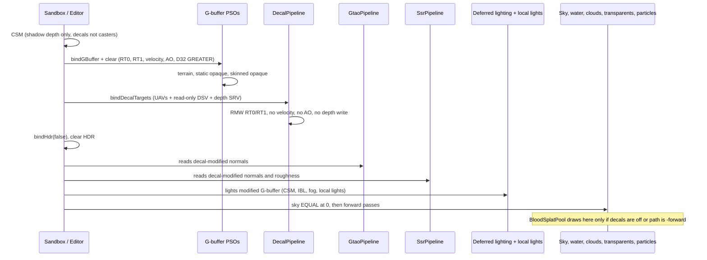

# Deferred decals

| Field | Value |
|-------|--------|
| **Title** | Deferred decals: one oriented-box pass for footmarks, blood, impacts, and burns |
| **Author** | DarkEngine6 |
| **Date** | 2026-10-03 |
| **Status** | Accepted |
| **Priority** | P1 — replaces forward blood drapes; unblocks persistent hit marks on the G-buffer |
| **Area** | `Render/Decal*`, `Render/SceneBuffers`, `Render/SceneRenderer`, `content/shaders/Decal.hlsl`, Sandbox spawn sites, Editor frame insert |
| **Audience** | Engine, Sandbox, and Editor owners who already know HybridDeferred |
| **Depends on** | Landed HybridDeferred G-buffer, reverse-Z (`D32_FLOAT`, clear 0), linear Rec.709, PBR G-buffer packing, GTAO, SSR, classic local-light volumes |
| **Supersedes** | The deferred-decal follow-up left open by `Render/DESIGN-deferred-renderer.md` **K6** / **K18** and the “Deferred blood decals” row in that RFC. Those rows are stale: local lights shipped **without** stencil, and the lighting root signature is no longer the 2-RT sketch in K3. |
| **Does not** | A second renderer. Stencil. A depth copy. A frame-queue compute pass (`TerrainErosion.hlsl` stays the offline `cs_5_0` bake). Clustering / tiling. Decals on transparents. Editor-placed decal actors. A mesh-decal fallback. Growing `kLightingCount`. New C++ exceptions. Changing `DeferredLighting.hlsl`. |

---

## Overview

DarkEngine6 has no deferred decal pass. Blood on the ground is a forward height-draped particle mesh (`Particles/BloodSplatPool`, 10 slots, 6×6 grid, CPU `HeightMap` drape, `ParticlePipeline`). Footsteps, bullet holes, and scorch marks do not exist as geometry. The G-buffer already stores the receivers those marks need — terrain, static meshes, and skinned characters — but nothing writes it after the opaque draws.

This design adds **one** decal system. A decal is an oriented box (OBB) plus a definition. The GPU rasterizes the box, reconstructs the world position from the existing reverse-Z depth SRV, clips to the box, and read-modify-writes G-buffer albedo and attributes. Footmarks, blood, impacts, and burns differ by definition data (textures, channel mask, weights, lifetime), not by code path. The pass is its own root signature and PSO. It does not take a slot on the lighting heap (that signature is already 63 of 64 DWORDs).

Normals are octahedral world-space in RT1 and cannot be hardware-blended. Albedo RGB and emissive luminance (RT0.a) need **different** weights on a burn (the char stays, the glow dies). Hardware sRGB blend cannot express that and cannot run on the same resource as a UAV. v1 therefore RMW both targets as `R32_UINT` rasterizer-ordered views, decoding and encoding albedo with the IEC curve already in `content/shaders/Color.hlsli` and `Math/Color.h`. That RMW does not change the lighting equation. `DeferredLighting.hlsl` adds `albedo.rgb * emissive * emissiveGain`, and both hosts set `emissiveGain` to 4. RT0.a is UNORM8, so the stored emissive byte saturates at 1. A hot burn is a bright albedo with that byte at 1, not an authored 2.5. Depth stays `D32_FLOAT` with no stencil: the box is depth-tested against the existing read-only DSV and clipped in the shader. Sky (`IsSkyDepth`, `d <= 0`) is never unprojected and never written.

---

## Background and motivation

Verified against the tree on 2026-10-02. Where `Render/DESIGN-deferred-renderer.md` disagrees with the code, the code wins.

| Piece | Location | Live fact |
|-------|----------|-----------|
| No decal pass | repo grep | `Decal` appears in design prose and `tiny_obj_loader.h` comments only. No decal type, PSO, or shader. |
| Blood drape | `Particles/BloodSplatPool.h` | `kCapacity = 10`, `kGrid = 6`, `kVertsPerSplat = 150`. `spawn(x, z, HeightMap)` drapes on the CPU with a 0.16 m Y bias. Drawn through `ParticlePipeline`. |
| Blood call sites | `Sandbox/SandboxApp.cpp` | Pool member `m_bloodSplats`. `create` ~2669, `draw` in `onRender` ~3599 (after particles), `destroy` ~3807. `spawn` on hunter **death** only: `onWeaponHit` ~1534 and `resolveJumpAttackAndFx` ~1794. Living hits call `spawnHunterBlood` (~2228), which is `m_blood.emitBurst(12)` — a forward particle spray, not the splat. |
| Footsteps | `SandboxApp::updatePossessed` ~1323; `AI/AiSystem.cpp` ~1304 | Audio cadence only (`m_footstepAcc`, hunter cue `"step"` / ground cue). No mark. |
| Impacts | `Weapons/ProjectileWeapon::applyHit` | Spark `ParticleEmitter` burst plus `emitHit`. `SandboxApp::onWeaponHit` returns immediately when `!hit.hitTarget`, so **terrain hits never spawn a mark**. `weaponRaycastClosest` (`Weapons/Weapon.cpp` ~92) sets `hitTarget = false` for ground. |
| Scene path | `Render/ScenePath.h`, `Core/Application.cpp` | `SwapChainForward` (`-forward`) or `HybridDeferred`. Live path is `Renderer::scenePath()` after `enableSceneBuffers`. |
| G-buffer | `Render/SceneBuffers.h`, `content/shaders/GBuffer.hlsli` | RT0 `R8G8B8A8_TYPELESS`, RTV `UNORM_SRGB`, lighting SRV `UNORM_SRGB` (raw UNORM SRV exists for the overlay). RGB = albedo, A = emissive luminance (not opacity). RT1 `R8G8B8A8_UNORM` resource today: RG octahedral **world** normal, B roughness, A metallic. Clear `{0.5, 0.5, 1, 0}` = +Z, rough 1, metal 0. Velocity `R16G16_FLOAT` (UV motion). Authored AO `R8_UNORM` (MRT3), clear 1. |
| Lighting heap | `SceneBuffers::kLightingCount = 10` | Slots 0 albedo, 1 attrib, 2 depth, 3 shadow, 4 height, 5 AO, 6–8 IBL, 9 SSR. |
| Lighting RS | `DeferredLightingPipeline.h` | `LightingConstants` is 56 floats. `static_assert(56 + 1 + 2 + 1 + 1 + 1 + 1 <= 64)`. **63 / 64 DWORDs.** Do not add a decal SRV or constant. |
| Depth | `Renderer::createDepthResources`, `DepthState.h`, `content/shaders/Depth.hlsli` | Resource `R32_TYPELESS`, DSV `D32_FLOAT`, SRV `R32_FLOAT`. Clear `kDepthClear = 0`. Opaque `sceneDepthFunc()` = `GREATER`. Transparents `GREATER_EQUAL`. Sky `EQUAL` at clip Z 0. A second DSV is `D3D12_DSV_FLAG_READ_ONLY_DEPTH`. `IsSkyDepth` is `d <= 0`. `ClampDepthForReconstruct` floors at `1e-7`. `ReconstructWorldPos` is in `GBuffer.hlsli`. |
| No depth copy | `Gtao.hlsl`, `Ssr.hlsl`, `DeferredLighting.hlsl`, `bindHdr` | GTAO, SSR, lighting, and clouds sample that same depth SRV. There is no `DE.DepthCopy` texture. |
| Read-only depth + SRV | `Renderer::bindHdrDepthRead` | State `DEPTH_READ \| PIXEL_SHADER_RESOURCE`, read-only DSV. Used by clouds and water-with-depth. |
| Frame order | `SandboxApp::onRender` ~3148–3620, `Editor/EditorRender3D.cpp` ~123–495 | CSM (own depth) → `bindGBuffer` / `clearGBuffer` → terrain + opaque static + opaque skinned → `bindHdr(false)` (G-buffer + depth to SRV, HDR bound, no DSV) → `clearHdr` → `applyGtao` → `applySsr` → `lighting.draw` → local-light volumes → `bindHdr(true)` → sky `EQUAL` → `captureSsrSceneColor` → water → `bindHdrDepthRead` → clouds → camouflage → translucent models → particles → blood splats → post (meter → bloom → TAA → motion blur → tonemap). Hosts still sequence the frame. `SceneRenderer` owns pipeline lifetime. |
| Who reads normals | `Gtao.hlsl` `ViewNormalFromAttrib` / `DecodeOct`; `Ssr.hlsl` `DecodeOct(attrib.rg)` | Both run **before** lighting and both read RT1. A dent that should occlude or reflect must be in RT1 before `applyGtao`. |
| Local-light volumes | `LocalLightVolumePipeline`, `LocalLightGpuList` | The pattern to copy: unit mesh, instanced world matrices in an UPLOAD structured buffer (root SRV, 2-frame ring), back-face cull (`CULL_FRONT`, `FrontCounterClockwise = TRUE`), fullscreen fallback when the camera is inside, own RS, `bool create`, no exceptions. They bind the **lighting** heap because they light. Decals must not. `kMaxLocalLights = 256`. |
| Terrain | `TerrainGBuffer.hlsl` | Geomipmap splat, not a `Dark::Material`. Tangents are built in the terrain shader (`cross(nG, Z)`). They are **not** in the G-buffer. Decals cannot ask the receiver for a tangent. |
| Transparents | water, particles, camouflage, skinned/mesh transparent PSOs | Forward, after lighting. Not in the G-buffer. |
| Color | `DESIGN-color-management.md`, `Color.hlsli` | Linear Rec.709 working space. Albedo/emissive textures are sRGB (`TextureUsage::Albedo`). Data maps (normal, ORM) are UNORM. Hardware sRGB RTV blend is linear on RGB and **does not** convert alpha. The RFC’s sentence “future deferred decals inherit correct linear blend” assumed an albedo lerp. It does not cover octahedral RMW or a second emissive weight. `srgbToLinear` / `linearToSrgb` in `Color.hlsli` match `Math/Color.h` (IEC 61966-2-1). |
| Matrices | `LocalLightGather.h` comment; `SkeletonDebug.cpp` | Row-vector, HLSL `#pragma pack_matrix(row_major)`, `mul(v, M)`. Volume world is `S * R * T`. Bone debug world is `pose.jointWorld[j] * entityWorld`. `AnimPose::jointWorld` is model space (`Animation/Pose.h`). `AnimGraphComponent::graph.player().pose()` is the live pose. |
| Debug toggles | `DebugRenderState`, `Sandbox/DevToolsPanel.cpp`, `Editor/EditorUi.cpp` | Checkboxes logged with `DE_LOG_INFO` on the edge. Overlay tiles go through `DebugOverlay` (depth, albedo, attrib, velocity, AO, SSR). Lighting is not where debug views are added (no DWORD left). |
| Editor authoring | `Scene/SceneTypes.h` `SceneObjectType` | Cubes, lights, models, water, cloud volumes, pawns. No decal type. Lights are entities with `TransformComponent` + `LocalLightComponent`, drawn as gizmos, not as G-buffer meshes. |
| Exceptions | `Agents.md` | No `try` / `catch` / `throw`, no `std::exception`. `bool` + `DE_LOG_ERROR(LogCategory::Render, ...)` + `DE_ASSERT`. |
| Build | CMake globs | New `Render/*.cpp` and `UnitTests/**/*.cpp` are picked up by `cmake/DarkEngineTargets.cmake` `CONFIGURE_DEPENDS` globs. Shaders live in `content/shaders/` and are copied as content, not compiled by MSVC. |

Pain: the drape disagrees with the geomipmap that was actually drawn (CPU `heightAtWorld` vs the LOD mesh), z-fights unless biased (the reverse-Z RFC called this out), cannot hit a character or a prop, and caps at 10. Footsteps at Sandbox cadence would overflow it in a few seconds. A stencil plane (`D24S8` or `D32_FLOAT_S8X24`) would reopen K6: every DSV, SRV, clear, and PSO depth format, plus CSM compare which is a different resource but the same helper style. Local lights already proved volumes work without stencil.

---

## Goals and non-goals

### Goals

- One CPU record, one shader, four kinds. Six `DecalDef` rows: footmark, blood hit, blood death, bullet hole, melee slash, burn.
- Project onto whatever opaque the G-buffer drew: terrain (no mesh tangents), static meshes, skinned meshes.
- Modify albedo, normal, roughness, metallic, and emissive with per-channel weights. Do not touch velocity or authored AO.
- Run after opaque G-buffer draws and **before** GTAO, SSR, and deferred lighting, so dents occlude and reflect and then get lit, shadowed, and fogged with the surface.
- Hard cap, recycle, fade, frustum cull. Sandbox and Editor play spawn steps, blood, and weapon impacts on the events those hosts already fire. Burns stay the Sandbox “Drop burn” spawn.
- `-forward` keeps today’s blood drape. Deferred can toggle the pass off and fall back to that drape.
- CPU tests with no device. A shader-compile test. A manual QA list.

### Non-goals

- Decals on water, particles, camouflage, translucent model passes, sky, fog volumes, or cloud volumes. Those draws are forward and are not in the G-buffer. v1 does not build a forward decal.
- Editor scene-file decals (`SceneObjectType`, gizmo, undo, save/load). That is authoring. Editor **play** spawns the same gameplay decals as Sandbox where the play loop already has the event. It does not grow a `BloodSplatPool`, and it does not gain a “Drop burn” button.
- Baked / mesh decals so a mark survives off-screen or a destroyed skinned mesh. Deferred instances reappear when the receiver is drawn again, while the instance is alive. When it expires, the entity is destroyed, or a bone/entity attachment is freed on revive or a teleport, it is gone. A second system is not started. Hunter death is not entity destruction (`AiSystem::tickHealthAndRespawn`).
- Clustering, tiling, bindless arrays, compute binning.
- Stencil, a depth-copy texture, MSAA, or writing scene depth (decals must not move the sky `EQUAL` test or CSM).
- Casting shadows from a hole. Decals do not enter the CSM pass. They are lit by the existing lighting shader, so they **receive** CSM, IBL, and local lights.
- Particle-collision blood (a drop that lands and becomes a decal). The airborne `m_blood` burst stays a particle.
- A flamethrower. Burns are a definition plus `spawn`. Sandbox Dev Tools can drop one. No new combat caller until gameplay has a source.
- Content JSON / glTF decal materials. v1 definitions are procedural textures in code, same idea as `createSplatTexture`.
- Changing `DeferredLighting.hlsl`, `kLightingCount`, or the lighting root signature.

---

## Key decisions

| ID | Decision | Why |
|----|----------|-----|
| **D1** | **Volume is an oriented box.** Unit cube in `[-1,1]³`, world matrix `S * R * T` (row-vector, same comment as `LocalLightGather.h`). Local **+Y is the projection axis** (thickness). UV is local XZ mapped `[-1,1] → [0,1]`. | One convex hull matches local-light volumes. A projector frustum cannot sit on a floor and a wall with the same math. Y-up thickness matches `Box3f` (axis 1 = up). |
| **D2** | **CPU record is a fixed pool of 256**, not an ECS component per splat. Definition (kind) + instance (xform, attachment, age, serial). | Footsteps are not entities. `BloodSplatPool` is already a pool; ECS spawn of 100 short-lived actors fights `World`. Local lights are entities because authors place them. Decals are not. |
| **D3** | **Channel mask is data.** Bits: Albedo, Normal, Roughness, Metallic, Emissive. One shader. Missing bits force that weight to 0. | Four kinds must not become four PSOs with copied clip code. |
| **D4** | **Albedo and attrib are RMW’d as `R32_UINT` rasterizer-ordered UAVs. No hardware blend.** Albedo RGB is decoded/encoded with `Color.hlsli` `srgbToLinear` / `linearToSrgb`. Emissive (high byte) is linear UNORM, not run through the curve, and is never authored above 1. A channel with weight 0 **copies the original byte** — no sRGB or oct round-trip. Draw order is ascending serial (oldest first) across the whole pass, not by kind. `buildVisible` bakes each kind’s fade into `albedoWeight` and `emissiveWeight`. The shader does not multiply a second lifetime fade. | RT1 octahedral cannot be blended as UNORM. A burn’s emissive weight dies before its albedo weight; one blend factor cannot do both (`SrcBlendAlpha` and the alpha source are the same channel). RT0 cannot be an sRGB UAV. IEC in `Color.hlsli` is the project curve, so this is not a second transfer function. Lighting still does `albedo.rgb * emissive * emissiveGain` (`DeferredLighting.hlsl`, gain 4). RMW supplies the two weights. It does not invent a glow that product cannot make. See Alternatives. |
| **D5** | **No stencil. No depth copy.** Outside the box: draw **back faces**, `DepthFunc = GREATER` (`sceneDepthFunc()`), `DepthWriteMask = ZERO`, read-only DSV, depth SRV in the same pass (`DEPTH_READ \| PIXEL_SHADER_RESOURCE`, the `bindHdrDepthRead` state). Inside the box: one `DrawInstanced` of a fullscreen triangle whose VS forwards `SV_InstanceID`, depth off, shader clip only. Sky: `IsSkyDepth` then `discard` **before** `ReconstructWorldPos`. Grazing: fade/reject on `abs(dot(geomN, axisY))`. | Scene depth is `D32_FLOAT` clear 0. K6 still holds: D24 hurts reconstruction, and `D32_FLOAT_S8X24` retypes every depth view for a test the shader already does. GTAO/SSR do not own a copy to reuse. Writing depth would fight sky `EQUAL` and coplanar policy. Reverse-Z coplanar decals were a reason to leave forward drapes; this pass never draws a surface-coincident mesh. |
| **D6** | **Own root signature, own shader-visible heap, ≤ 16 DWORDs.** Do not bind or extend the lighting heap. | Lighting is 63/64. Local lights already show a second RS. Textures cannot be root descriptors; the decal heap holds depth SRV, two textures, two UAVs. Instance data is a root SRV (buffer). |
| **D7** | **Order: after opaque G-buffer, before `bindHdr(false)` / GTAO / SSR / lighting.** Velocity and authored AO are not bound and not written. | GTAO and SSR `DecodeOct` the normal they shade. Lighting then lights the modified buffers and applies fog. TAA keeps the surface velocity already in the G-buffer. Authored AO stays MRT3; footprint darkening is albedo plus GTAO on the dent. |
| **D8** | **Cap 256. Expected Sandbox live count ~80–170** (steps + combat). **12 triangles per box.** Outside draws walk ascending serial and break only when the texture pair changes (worst case 256 draws, 3072 tris at the cap). Inside boxes are one extra `DrawInstanced`. **No clustering in v1.** | The rasterizer already limits pixels. Overlap on a footprint is 1–3. A tile bin is a second system. The triangle count is not the risk; overdraw and the ROV RMW are. Revisit only if a PIX or RenderDoc capture of the `DE.Decals` marker is over 1 ms. Same gate at 1080p and at 4K. 4K is not a separate budget. No timestamp query heap in v1. |
| **D9** | **`-forward` and Sandbox keep `BloodSplatPool`.** HybridDeferred Sandbox draws the pool only when `decalsEnabled` is false. When the flag is on, death stains and new combat marks go through `DecalPool` and the pool is not drawn. The airborne `m_blood` burst stays. Editor play has no pool. | Forward has no G-buffer. Deleting the pool would remove Sandbox blood on the rollback path. Drawing both on deferred double-paints. Editor never had the drape, so turning decals off there does not invent one. |
| **D10** | **Attachment: World, Entity, or Bone.** Bone matrix is `localOffset * pose.jointWorld[bone] * entityWorld`. Free a Bone or Entity instance when the entity is destroyed, when `Health::alive()` goes from false to true, or when the entity translation jumps by more than the decal’s largest half-extent. A corpse with `world.alive` still true and `Health::dead()` keeps its blood. Missing pose still frees. Off-screen receivers simply are not in the G-buffer this frame; the instance remains and reprojects when they return. No mesh fallback. | World-fixed bullet holes in terrain must survive camera turns. Blood on a hunter must move with a bone or it slides off. `tickHealthAndRespawn` does not destroy the hunter: it keeps the corpse while `deadFor < 8`, then moves that same entity and calls `health.revive()`. `world.alive` alone would ride the teleport. `AnimPose::kMaxBones = 64` and `jointWorld` already exist for debug draw. |
| **D11** | **Editor placement is a non-goal. Editor play spawn is in v1.** Both hosts call `SceneRenderer::drawDecals`. Play mode spawns footprints, blood, and impacts on the events Editor play already fires. `SceneObjectType`, a gizmo, undo, and the serializer stay out. | Editor already places models and lights as scene objects. A placed decal actor is a different tool. `updatePlay`, `onPlayHunterCueThunk`, `onPlayWeaponHit`, and `resolvePlayHits` are real call sites. There is no Editor flamethrower and no `BloodSplatPool`. |
| **D12** | **Default off through the opt-in UAV PR. The gameplay-swap PR turns the checkbox on for HybridDeferred only.** Rollback is the Dev Tools / Editor checkbox (same pattern as local lights and GTAO), plus `-forward`. | The first real UAV frame is “Drop burn” with the checkbox off (PR 5). Blood leaving `BloodSplatPool` is the next PR (PR 6), after that frame has been checked. Unchecking restores the drape without a rebuild. |
| **D13** | **First graphics-queue UAV in the frame, ROV required.** The device stays `D3D_FEATURE_LEVEL_11_0` (`Renderer.cpp`). If `D3D12_FEATURE_D3D12_OPTIONS.ROVsSupported` is false, `DecalPipeline::create` logs a warning and the pass stays off (`isValid() == false`). HybridDeferred stays up. No racy UAV fallback. No frame-queue compute PSO. | `DESIGN-ssao.md` rejected a frame compute UAV because GTAO fits RTVs. Octahedral RMW does not. `R32_UINT` loads are a required typed-UAV format; `R8G8B8A8_UNORM` UAV loads are optional (`TypedUAVLoadAdditionalFormats`) and are not used. `ROVsSupported` is not implied by feature level 11_0. Do not bump the device to 12_1 to “get ROVs.” `TerrainErosion.hlsl` is already a bake-only `cs_5_0` on a private direct list. Overlapping boxes need ROV so the newest serial wins inside a draw. |
| **D14** | **Procedural definitions, one library, one shader, locked recipes.** Six rows, not four PSOs. Blood albedo reuses the current 64² blob (RGB bytes 150, 6, 10, `TextureUsage::Albedo`) times tint `(1, 1, 1)`. Foot, both impacts, and burn albedo RGB bytes are 255 so tint is the linear color. Burn alpha is 255. `WeaponKind` selects **ImpactBullet** or **ImpactSlash**: different alpha, different normal height, different tint, different default half-extents. Same channel mask, same PSO. Normal maps are `TextureUsage::Normal` (UNORM, not sRGB). Weight 0 uses a 1×1 `(128,128,255)`. A zero derivative on the 64² path bakes the same bytes with `uint8_t((n * 0.5 + 0.5) * 255.0 + 0.5)` per channel. Living-hit blood normal weight is **0.35**. Death blood normal weight is **0**. | No art pipeline. The blood alpha mask already exists in `BloodSplatPool.cpp` `createSplatTexture`. A slash is data, not a second pass and not later art. Two implementers must produce the same GTAO shape. Baking a tint into the albedo texels squares it. |

---

## Proposed design

### Frame order



`SceneRenderer::drawDecals` is called by `SandboxApp::onRender` and `Editor/EditorRender3D.cpp` **after** the last opaque G-buffer draw and **before** `bindHdr(false)`. It no-ops when `scenePath != HybridDeferred`, `!hasGBuffer()`, `!decalsEnabled`, `!pipeline.isValid()`, or the visible list is empty. An empty enabled list does **not** transition the G-buffer (look and barriers stay identical to today).

Transparents, water, and particles stay after lighting. They composite over the lit HDR buffer, so a decal never changes them. That is acceptable: a footprint under water is hidden by the water shading, and a blood particle is the spray, not the stain.

### Depth and clip

Reverse-Z: larger depth is closer, clear/sky is 0, opaque test is `GREATER`.

Draw the cube’s **back faces** (same winding policy as `LocalLightVolumePipeline`: `CULL_FRONT`, `FrontCounterClockwise = TRUE`). Depth test `GREATER`, write mask zero, read-only DSV:

- Scene closer than the back face (`sceneDepth > backDepth`) passes. The surface may be inside the volume.
- Scene farther than the back face fails. Pixels behind the box, including sky (`0 > backDepth` is false for any finite back face), do not run.
- Scene in front of the volume still passes the test. The shader rejects it.

Shader, in order:

1. Load depth. If `IsSkyDepth(depth)` `discard`. Do not call `ReconstructWorldPos` on raw 0.
2. Reconstruct with `ClampDepthForReconstruct` and the **same** `invViewProj` that lighting uses (`Camera3D` view-proj that wrote the depth, jitter included). Do not pair an unjittered matrix with jittered depth (`DESIGN-ssao.md` S11).
3. `local = mul(float4(worldPos, 1), decalFromWorld)`. Discard if `abs(local.x) > 1` or `abs(local.z) > 1` or `local.y < clipLocalYMin` or `local.y > clipLocalYMax`. X and Z stay the symmetric unit box. Y is per definition: footmarks use `-1 .. +0.25`, every other kind uses `-1 .. +1`.
4. Geometric normal = `DecodeOct` of the **current** attrib bytes (the ROV load, so an older decal in this draw is visible).
5. Angle weight: `nd = abs(dot(geomN, axisY))`. If `nd < angleFadeStart` (default **0.20**, about 78°), `discard`. Else `angleFade = saturate((nd - start) / range)` with default range **0.25**.
6. Thickness edge: `edge = saturate((1 - abs(local.y)) / 0.15)` on a symmetric slab, so the box does not stamp a hard line at `local.y = ±1`. Footmarks discard at `local.y = +0.25` before that fade can run on the air side. The 2 cm above-plane limit is a hard cut on purpose: a fade band there would reach the sole. The underground side still fades toward `local.y = -1`.
7. UV = `(local.xz * float2(0.5, -0.5) + 0.5) * uvScaleBias.xy + uvScaleBias.zw`. v1 scale is `(1, 1)` and bias is `(0, 0)`. The flip makes the texture’s +V match local −Z; lock it in the basis test.
8. Spatial mask = albedo texture alpha (the procedural blob) times `angleFade * edge`. Channel weights on the GPU instance already include the lifetime fade. Do not multiply `instanceFade`. There is no fade field in `DecalGpuInstance`.

`[earlydepthstencil]` on the pixel shader. Depth write is off, so early reject of pixels behind the box is legal. `discard` still skips UAV stores for pixels that passed the back-face test but sit outside the OBB.

**Camera inside the OBB** (the same clip as step 3, including the footmark Y limit): back faces are clipped by the near plane and the box disappears. Same bug local lights fixed with a fullscreen PSO. Those instances are a second list, drawn **after** every outside batch as **one** `DrawInstanced` of a fullscreen triangle (`vertex count 3`, `instance count = inside count`). The VS is not `LocalLightVolume.hlsl` `VSFullscreen`. That shader writes `o.iid = 0` and the light is selected with `LocalLightPassConstants::baseIndex`. The decal VS forwards `SV_InstanceID`. The root SRV for that draw is the inside array, so instance 0 is `inside[0]` and instance N is not instance 0. `DepthEnable = FALSE`, `DSVFormat = UNKNOWN`, `OMSetRenderTargets` with no DSV. The sky discard in step 1 is what protects sky on this path. UAV barrier between outside batches, one between the last outside batch and this draw, and one more before leaving the pass. Inside count is not the 256; it is “how many boxes contain the camera,” expected 0 or 1. A default footmark (8 cm thick, 2 cm of air) does not contain an eye. QA for this path uses a box that contains the camera.

**Grazing** is the angle test above, not a view-angle test. A wall impact whose axis matches the wall normal stays sharp. A world-up footprint on a cliff fades out instead of stretching. Receivers do not provide tangents; the test uses the G-buffer normal only.

### Tangent basis

Built in the shader from the decal orientation and the reconstructed geometric normal. Terrain has none stored. Skinned meshes’ tangents were consumed in `SkinnedMeshGBuffer.hlsl` and are not in RT1.

```hlsl
// axisX/Y/Z = rows of the decal rotation (world axes of local X/Y/Z).
float3 N = normalize(geomN);
float3 T = axisX - N * dot(N, axisX);
if (dot(T, T) < 1e-6)
    T = axisZ - N * dot(N, axisZ);
T = normalize(T);
float3 B = cross(N, T);
if (dot(B, axisZ) < 0.0)
    B = -B;

float3 ts = gNormal.SampleLevel(gSamp, uv, 0).xyz * 2.0 - 1.0;
ts.xy *= normalScale;
float3 decalN = normalize(ts.x * T + ts.y * B + ts.z * N);
```

This is the Gram-Schmidt in `NormalMap.hlsli` `ApplyNormalMap`, with the decal axes standing in for the mesh tangent. If the spawner aligned +Y to the hit normal, T and B already lie in the plane and the projection is a no-op. If a footprint is world-up on a slope, the basis bends onto the slope so the dent follows the ground.

Normal blend (only if the Normal bit is set and `normalWeight > 0`):

```hlsl
float w = saturate(normalWeight * spatial);
float3 n = normalize(lerp(geomN, decalN, w));
```

Store: if `w == 0`, copy the original RG bytes. Do not `EncodeOct` a decoded normal and write it back. If `w > 0`, `EncodeOct(n)` and quantize RG to UNORM8. Roughness and metallic: `lerp(dst, target, weight)` in UNORM space, and copy the original byte when that weight is 0. Shader names stay `EncodeOct` / `DecodeOct` in `GBuffer.hlsli`. The CPU helpers are `encodeOct` / `decodeOct` in `Render/Octahedral.h` (camelCase, not the HLSL spelling).

### Albedo and emissive RMW

Resource stays `R8G8B8A8_TYPELESS`. G-buffer RTV remains `R8G8B8A8_UNORM_SRGB`. Lighting SRV remains `UNORM_SRGB`. The decal view is `R32_UINT` (low byte R, then G, B, A — DXGI little-endian RGBA8).

```hlsl
uint raw = gAlbedo[pix];
float wA = (mask & ALBEDO) ? albedoWeight * spatial : 0.0;
float wE = (mask & EMISSIVE) ? emissiveWeight * spatial : 0.0;
if (wA > 0.0 || wE > 0.0)
{
    float3 dstLin = srgbToLinear(unpackRgb(raw)); // Color.hlsli
    float  dstE   = unpackA(raw);                 // byte/255, already linear
    float3 srcLin = albedoTex.rgb * tint;         // hardware sRGB decode, then tint
    float3 outLin = lerp(dstLin, srcLin, saturate(wA));
    float  outE   = lerp(dstE, emissiveTarget, saturate(wE));
    gAlbedo[pix] = packBytes(
        wA > 0.0 ? linearToSrgb8(outLin) : rgbBytes(raw),
        wE > 0.0 ? unorm8(outE) : aByte(raw));
}
```

`linearToSrgb8` matches `Math/Color.h`: `uint(linearToSrgb(c) * 255.0 + 0.5)`. A zero weight never re-encodes, so a roughness-only burn cannot churn albedo bits, and an albedo decal cannot churn emissive bits.

Foot, impact, and burn albedo **RGB bytes are 255, 255, 255**. On a `TextureUsage::Albedo` view the hardware sRGB decode of 255 is 1, so `srcLin` is `tint`. Do not also bake the tint into those texels. A burn map that stores hot `(0.85, 0.22, 0.04)` and then multiplies `tint` squares R (`0.85 * 0.85`) and the cold phase is no longer `(0.03, 0.02, 0.015)`. Blood stays the existing 64² blob, RGB bytes 150, 6, 10, times tint `(1, 1, 1)`. Its alpha stays the mask from `createSplatTexture`.

Stacking is ordered because the draw is oldest-serial-first and the UAV is a `RasterizerOrderedTexture2D<uint>`. Newer decals `lerp` from the value older decals just wrote, not from a stale copy.

### What each kind writes

| Kind | Mask | Albedo | Normal | Roughness | Metal | Emissive | Default half-extents (m) X, Y, Z | Local Y clip | Life | Fade |
|------|------|--------|--------|-----------|-------|----------|-----------------------------------|--------------|------|------|
| Footmark | Albedo, Normal | RGB texels 255. Linear tint `(0.25, 0.22, 0.18)`, weight 0.45 | Soft dent, scale 0.65, weight 0.85 | — | — | — | 0.14, **0.08**, 0.26 | **-1 .. +0.25** | 8 s | Smoothstep |
| Blood, hit | Albedo, Normal | Existing blob × tint (1,1,1), weight 0.85 | Bump, scale 0.4, weight **0.35** | — | — | — | 0.10, **0.10**, 0.10 | -1 .. +1 | 12 s | Smoothstep |
| Blood, death | Albedo | Same blob, weight 1 | weight 0 (today’s drape has no normal) | — | — | — | 1.8, **0.12**, 1.8 | -1 .. +1 | 20 s | Hold 0.70 then linear |
| ImpactBullet | Albedo, Normal, Roughness | RGB 255. Disk alpha. Tint `(0.04, 0.035, 0.03)`, weight 0.9 | Round pit and rim, scale 1, weight 1 | target 0.85, weight 0.5 | — | — | 0.06, 0.04, 0.06 | -1 .. +1 | 45 s | Hold 0.85 then linear |
| ImpactSlash | Albedo, Normal, Roughness | RGB 255. Long ellipse alpha. Tint `(0.09, 0.07, 0.05)`, weight 0.9 | Groove along local X, scale 1, weight 1 | target 0.72, weight 0.45 | — | — | **0.22, 0.05, 0.07** | -1 .. +1 | 30 s | Hold 0.75 then linear |
| Burn | Albedo, Roughness, Emissive | RGB texels 255, alpha 255. Tint moves from hot `(0.85, 0.22, 0.04)` to cold `(0.03, 0.02, 0.015)`, weight 0.85 | weight 0 | target **0.95**, weight 0.8 | weight 0 | target **1** (UNORM8), weight 1 while hot | 0.35, 0.08, 0.35 | -1 .. +1 | 15 s | Albedo weight: hold 0.55 then linear. Emissive weight: 1 until 25% of life, then linear to 0. Albedo target follows the emissive curve from hot to cold. |

Y half-extent is the thickness below and, where the clip allows, above the center. Footmark half Y stays **0.08 m** so geomipmap LOD error versus `heightAtWorld` is inside the underground half (`local.y` down to -1 is 8 cm of ground). The above-plane limit is definition data: `clipLocalYMax = 0.02 / 0.08 = 0.25`, so the shader discards more than **2 cm** of air. A standing sole sits in the old centered 8 cm of air. Angle fade will not save it, because a boot normal is also mostly up and the skinned G-buffer is already written before this pass. Do not claim the ankle is outside an 8 cm centered slab. Do not raise footmark Y past 0.10 m without a new test. Blood, impact, and burn keep the symmetric slab (`clipLocalYMin/Max = ±1`). Bone blood needs that full slab. The footmark clip does not apply to it.

`WeaponHit::point` / `normal` are the hittable box or the terrain ray, not the skinned triangles. Sandbox boxes are hunter `{0.4, 0.7, 0.4}` and wolf `{0.45, 0.45, 0.70}`. Bone and Entity combat spawns (living-hit blood, body impacts) move `position` by **0.08 m along `-normalize(hit.normal)`** before the OBB is built. World spawns are not biased: terrain rays and death stains already sit on the drawn surface. Blood-hit half Y is **0.10 m**, so with the 8 cm bias the volume runs from 2 cm outside the hit plane to 18 cm inside it. A point 6 cm inside the hit plane is inside the OBB (`|0.08 - 0.06| = 0.02 <= 0.10`). A point 6 cm outside it is not (`0.08 + 0.06 = 0.14 > 0.10`).

Blood death size covers today’s radius `1.6 + hash * 0.9` (`BloodSplatPool::spawn`). Yaw is the same hash, baked into `R` at spawn.

`buildVisible` bakes fades into the GPU weights. The shader multiplies only the spatial mask.

- Linear: `1 - u`
- Smoothstep: `1 - (u*u*(3-2*u))`
- HoldThenLinear: `1` while `u < hold`, else `1 - (u - hold) / (1 - hold)`

`u = saturate(age / lifetime)`. Age `>=` lifetime frees the slot on the CPU; the GPU never sees it.

Burn, in `buildVisible` only:

- `emissiveFade(u)` is 1 while `u < 0.25`, else `1 - (u - 0.25) / 0.75`.
- `albedoFade(u)` is 1 while `u < 0.55`, else `1 - (u - 0.55) / 0.45`.
- `tint = lerp(cold, hot, emissiveFade(u))` with hot `(0.85, 0.22, 0.04)` and cold `(0.03, 0.02, 0.015)`, both linear. The burn albedo texture stays RGB 255. Tint is the only color.
- `albedoWeight = 0.85 * albedoFade(u)`. `emissiveTarget = 1`. `emissiveWeight = emissiveFade(u)`. Roughness weight is `0.8 * albedoFade(u)` so the char leaves with the mark. There is no third authored curve.
- Do not store 2.5. `unorm8(2.5)` is 1, and a near-black albedo times that byte times `emissiveGain` 4 is not a hot scorch.
- Burn alpha is **255** on every texel (a 1×1 map is enough). Foot and both impact defs also use RGB 255. Tint is the linear color. Do not bake either impact tint into the texels.
- Living-hit blood normal weight **0.35** and death normal weight **0** are the v1 values. They are not a guess and they are not retuned in this stack.
- Footprints are one World box on the body XZ when the step cue fires. v1 does not add left/right foot sockets. `AnimPose` is not a socket rig. The closest-bone scan below is for combat blood, not for steps.

Lit result, the equation in `DeferredLighting.hlsl` (`+ albedo.rgb * emissive * emissiveGain`, gain 4 in `SandboxApp.cpp` and `EditorRender3D.cpp`). The CPU check is the **full-mask** case, not a texture fetch. Burn RGB 255 decodes to 1, so the lerp target is the tint. Alpha 255 makes the albedo mask 1. A head-on center texel has `angleFade = 1` and `edge = 1`, so `spatial = 1`. Destination albedo 0.2, destination emissive 0, hot weights 0.85 and 1: stored albedo R is `lerp(0.2, 0.85, 0.85) = 0.7525`, stored emissive is 1, so the emissive term on R is `0.7525 * 1 * 4 ≈ 3.01`. Cold (`emissiveFade = 0`): emissive weight is 0 so the glow term is 0, and the albedo target is the cold tint. The non-goal stands: do not change `DeferredLighting.hlsl`.

### Procedural normals

64² unless the kind’s normal weight is 0, in which case the map is 1×1 `(128, 128, 255)`. `TextureUsage::Normal`. UV of a texel center is `(texel + 0.5) / 64 * 2 - 1` in `[-1, 1]`. Height is the function below. Central difference with `du = dv = 2/64`. Samples outside the shape read as height 0.

```text
n = normalize((-dh/du, -dh/dv, 1))
// Per channel. Same rounding shape as Math::linearToSrgb8: the multiply is inside the cast.
byte = uint8_t((n * 0.5 + 0.5) * 255.0 + 0.5)
```

`n.z` stays positive. Do not store a negative Z, and do not read a pit as byte Z = 0. A zero derivative (`dh/du = dh/dv = 0`) is `n = (0, 0, 1)` and bakes `(128, 128, 255)`. The basis then returns `geomN`. The cast must cover the scale. `(uint)(n * 0.5 + 0.5) * 255 + 0.5` truncates each component to 0 or 1 first and bakes a flat sample as `(0, 0, 255)`, which decodes near `(-1, -1, 1)`.

| Map | Height |
|-----|--------|
| Burn, and any weight-0 normal | Flat. Bytes `(128, 128, 255)`. No 64² map. |
| Blood bump | `r = length(uv)`. `r >= 1` → 0, else `h = (1 - r)^2 * 0.35`. |
| Foot dent | `rx = u / 0.85`, `ry = v / 0.45`, `r = length(rx, ry)`. `r >= 1` → 0, else `h = -(1 - r*r)^2 * 0.55`. |
| ImpactBullet normal | `r = length(uv)`. `r < 0.45` → `h = -0.9 * (1 - r/0.45)^2`. `0.45 <= r < 0.75` → `h = 0.25 * (1 - abs(r - 0.60) / 0.15)`. Else 0. |
| ImpactBullet alpha | Same `r`. Byte 255 when `r < 0.70`, else 0. RGB bytes 255. |
| ImpactSlash normal | `rx = u / 0.92`, `ry = v / 0.22`, `r = length(rx, ry)`. `r >= 1` → 0, else `h = -0.55 * (1 - r*r)^2`. A groove along local X. No circular rim. |
| ImpactSlash alpha | Same ellipse. Byte 255 when `r < 1`, else 0. RGB bytes 255. |

The bullet center is an even pit, so the derivative is ~0 and `n ≈ (0, 0, 1)`. A texel near `r = 0.3` is still in the pit. Height rises toward the rim, so `n.xy` points inward (`dot(n.xy, uv) < 0`). The slash center is an even groove, so `n.z > 0.8` there, and a sample inside the ellipse off the long axis has inward `xy`. Foot center `n.z > 0.8`.

`WeaponKind::Projectile` selects ImpactBullet. `WeaponKind::Melee` selects ImpactSlash. `DecalSpawnDesc::halfExtents` of 0 uses that row’s defaults. A non-zero half-extent overrides the box only. It does not swap the texture. Both rows use channel mask Albedo + Normal + Roughness. One PSO. A batch breaks when the texture pair changes, so a slash drawn after a bullet is a later batch, not a second shader.

### GPU resources and barriers

| Resource | Today | v1 change |
|----------|-------|-----------|
| Albedo | `TYPELESS`, flag `ALLOW_RENDER_TARGET`, RTV `UNORM_SRGB` | Add `ALLOW_UNORDERED_ACCESS`. RTV and lighting SRV unchanged. The `R32_UINT` UAV is created by `DecalPipeline`, not by `SceneBuffers::create`. |
| Attrib | resource `R8G8B8A8_UNORM`, RTV/SRV UNORM | Resource becomes `R8G8B8A8_TYPELESS` so an `R32_UINT` UAV is legal. RTV and SRV stay `R8G8B8A8_UNORM` (explicit desc, already how albedo works). Add `ALLOW_UNORDERED_ACCESS`. Clear value format stays UNORM `{0.5, 0.5, 1, 0}`. G-buffer PSO `RTVFormats[1]` stays UNORM (`MeshPipeline`, `SkinnedMeshPipeline`, `TerrainPipeline`). |
| Velocity, AO, HDR | unchanged | Not bound in the decal pass. |
| Depth | `R32_TYPELESS` / DSV `D32_FLOAT` / SRV `R32_FLOAT` | No format change. |

`SceneBuffers::createColorTarget` hard-codes `ALLOW_RENDER_TARGET` only. Add a flag argument (default today’s flag) so HDR, velocity, and AO do not become UAVs.

`SceneBuffers::create` does **not** create the UAV descriptors and does **not** fail because a view is missing. `ID3D12Device::CreateUnorderedAccessView` returns void (`Texture2D.cpp` `CreateTexUav` already calls it that way). There is no HRESULT to turn into `return false`. A format mistake is a debug-layer message in QA, not a bool.

`DecalPipeline` owns a FLAG_NONE heap and creates the two `R32_UINT` UAV descriptors against the live albedo and attrib resources. Recreate them when those `ID3D12Resource*` pointers change on resize. If `ROVsSupported` is false, log `DE_LOG_WARN`, leave `isValid() == false`, and do not touch `m_scenePath`. The G-buffer RTVs stay. HybridDeferred stays. The device is created at `D3D_FEATURE_LEVEL_11_0`. State that next to the options check. Do not raise it to 12_1.

If `CreateCommittedResource` itself fails because of `ALLOW_UNORDERED_ACCESS`, that is the existing `SceneBuffers::create` failure: the texture does not exist, and `Renderer::enableSceneBuffers` already resets the buffers and demotes to `SwapChainForward`. Do not add a second failure path for the view. Resize that fails to recreate scene buffers already returns false with no forward fallback. This design does not add a decal-only failure to that path.

`Renderer::bindDecalTargets()`:

1. `transitionAlbedo` → `D3D12_RESOURCE_STATE_UNORDERED_ACCESS`
2. `transitionAttrib` → `UNORDERED_ACCESS`
3. `transitionVelocity` and `transitionAo` → `PIXEL_SHADER_RESOURCE` (GTAO wants them next; they are not sampled here)
4. `transitionDepth` → `DEPTH_READ | PIXEL_SHADER_RESOURCE`
5. `OMSetRenderTargets(0, nullptr, FALSE, &readOnlyDsv)` for the outside PSO. The inside PSO binds **no** DSV (`OMSetRenderTargets(0, nullptr, FALSE, nullptr)`) and the depth state may stay the combined SRV state because the PSO has `DepthEnable = FALSE` and `DSVFormat = UNKNOWN`. Do not bind the writable DSV.

After the draws: UAV barrier on both resources, then the existing `bindHdr(false)` transitions them to `PIXEL_SHADER_RESOURCE` using the states `SceneBuffers` already tracks. `bindHdr(false)` must not assume the previous state was `RENDER_TARGET`; it already transitions from the tracked state. Do not special-case it.

Decal shader-visible heap (pipeline-owned, resized with the swap chain only for the UAV copies):

| Slot | View |
|------|------|
| t0 | depth SRV (copy of `Renderer::depthSrvCpu()` each draw; the CPU handle is stable across a frame, recreated on resize) |
| t1 | albedo texture of this batch |
| t2 | normal texture of this batch |
| u0 | albedo UAV |
| u1 | attrib UAV |

Root signature:

```text
[0] CBV b0             2 DWORDs   SHADER_VISIBILITY_ALL    DecalPassConstants
[1] table t0           1          SHADER_VISIBILITY_PIXEL  depth
[2] table t1–t2        1          SHADER_VISIBILITY_PIXEL  albedo + normal
[3] table u0–u1        1          SHADER_VISIBILITY_PIXEL  ROV UAVs
[4] root SRV t3        2          SHADER_VISIBILITY_ALL    StructuredBuffer<DecalGpuInstance>
static s0 linear clamp
Total 7 DWORDs. static_assert in the header, same style as LocalLightVolumePipeline.h.
```

The box VS reads `viewProj` from the CBV and `worldFromDecal` from the structured buffer. `DeferredLightingPipeline` marks its constants `SHADER_VISIBILITY_PIXEL`. Copying that visibility blinds this VS. Local lights mark the constants and the instance SRV `SHADER_VISIBILITY_ALL` because the VS reads them. Do the same here. Texture and UAV tables stay pixel-only.

`DecalPassConstants` (one CBV, 256-byte-aligned UPLOAD, uploaded once per `drawDecals`). `ReconstructWorldPos` uses `invViewProj` only. The shader takes width and height from `GetDimensions` and `SV_POSITION`, the same way lighting does, so a viewport and a near plane are not in the constant buffer. The CPU inside test uses the camera position on the CPU. Angle fade and the Y clip are per instance.

```cpp
struct DecalPassConstants
{
    float invViewProj[16]; // inverse of the view-proj that wrote depth (jitter included)
    float viewProj[16];    // same matrix, for the box VS
};
static_assert(sizeof(DecalPassConstants) == 32 * sizeof(float), "decal pass CB");
```

**Batches:** walk alive visible instances in **ascending serial** (oldest first). Break a draw only when the albedo/normal texture pair changes. Do not sort by `DecalKind`. Do not sort by camera distance (that shimmers). A newer footmark on older blood is later in the list, which is the Sandbox case of walking through a death stain. ROV orders instances only inside one draw. A UAV barrier between draws makes the next batch load what the previous batch stored. Worst case is 256 outside draws. That is already the cheap case in D8. Emissive-vs-not is not a batch key. Emissive is a weight. The inside `DrawInstanced` is after every outside batch, with the root SRV aimed at the inside array (base 0).

`SetDescriptorHeaps` binds the decal heap for the call only. `applyGtao` / lighting bind their own heaps afterward. `drawDecals` does not restore the previous heap.

PSO (outside):

- `NumRenderTargets = 0`, all `RTVFormats` `UNKNOWN`
- `DSVFormat = D32_FLOAT`
- Depth enable, write zero, func `GREATER`, stencil off
- Cull front, front CCW
- No blend (no RT)
- VS: cube `POSITION` only, instance id
- PS: `ps_5_0`, `[earlydepthstencil]`, ROV stores

PSO (inside): depth disable, `DSVFormat = UNKNOWN`, cull none, fullscreen VS, same PS and RS.

Cube mesh: add `MeshGen::CreateUnitCube(MeshData&)`. 8 vertices, 36 indices, positions in `[-1,1]`, CCW from the outside. There is no solid box in `MeshGen` today (`CreateBoxOutline` is a line mesh). Do not reuse the local-light icosahedron.

### Instance GPU record

224 bytes, 16-byte aligned. Uploaded through a 2-frame `UPLOAD` ring copied from `LocalLightGpuList` (root VA, no descriptor). Spawn serial stays on the CPU; the GPU struct does not carry it. Draw order is the serial order.

The C++ fields are the upload. The HLSL struct is the same bytes. Do not declare an HLSL `float3`: it is 16-byte aligned and will not match `float axisY[3]`. `static_assert` the byte offset of `channelMask` (212) on the CPU. The shader has no `static_assert`; the offset comment is the contract.

```cpp
struct DecalGpuInstance
{
    float worldFromDecal[16]; // S * R * T, local [-1,1] -> world
    float decalFromWorld[16]; // Matrix4f::Inverse of the above
    float tint[3];            // linear. Burn: lerp(cold, hot, emissiveFade)
    float albedoWeight;       // definition weight * albedoFade(u)
    float normalScale;
    float normalWeight;
    float roughnessTarget;
    float roughnessWeight;
    float metallicTarget;
    float metallicWeight;
    float emissiveTarget;     // linear luminance, authored in [0,1]
    float emissiveWeight;     // definition weight * emissiveFade(u)
    float uvScaleBias[4];     // scale.xy, bias.xy; v1 = (1,1,0,0)
    float axisY[3];           // world projection axis. Three floats, not an HLSL float3.
    float angleFadeStart;     // default 0.20
    float angleFadeRange;     // default 0.25
    uint32_t channelMask;     // byte offset 212
    float clipLocalYMin;      // -1
    float clipLocalYMax;      // footmark 0.25; every other kind +1
};
static_assert(sizeof(DecalGpuInstance) == 56 * sizeof(float), "decal instance");
static_assert(offsetof(DecalGpuInstance, channelMask) == 212, "decal channelMask");
```

```hlsl
struct DecalGpuInstance
{
    float4 world0, world1, world2, world3;
    float4 inv0, inv1, inv2, inv3;
    float4 tintAlbedo;    // tint.xyz, albedoWeight
    float4 normalRough;   // scale, weight, roughTarget, roughWeight
    float4 metalEmis;     // metalTarget, metalWeight, emisTarget, emisWeight
    float4 uvScaleBias;
    float4 axisYAngle;    // axisY.xyz, angleFadeStart
    float  angleFadeRange; // byte offset 208
    uint   channelMask;    // byte offset 212
    float  clipLocalYMin;
    float  clipLocalYMax;
};
```

Memory: `256 * 224 * 2 ≈ 112 KB` of upload. Procedural textures: one 64² blood albedo (the blob), 64² white-RGB foot, bullet, and slash albedos (tint carries the color; bullet alpha is the disk, slash alpha is the ellipse), a 1×1 burn albedo `(255, 255, 255, 255)`, and four 64² normal maps (foot dent, blood bump, bullet pit, slash groove). Death blood and burn share the 1×1 flat normal. **No extra full-resolution target.** The G-buffer is modified in place.

### CPU pool and spawn API

```cpp
enum class DecalKind : uint8_t { Footmark = 0, Blood, Impact, Burn, Count };

enum class DecalSpace : uint8_t { World = 0, Entity, Bone };

enum class DecalFade : uint8_t { Linear = 0, Smoothstep, HoldThenLinear };

enum DecalChannel : uint32_t
{
    DecalChannel_Albedo    = 1u << 0,
    DecalChannel_Normal    = 1u << 1,
    DecalChannel_Roughness = 1u << 2,
    DecalChannel_Metallic  = 1u << 3,
    DecalChannel_Emissive  = 1u << 4,
};

struct DecalId
{
    uint32_t index = 0;
    uint32_t serial = 0; // 0 means invalid
};

struct DecalSpawnDesc
{
    DecalKind   kind = DecalKind::Impact;
    Math::Vector3f position{};
    Math::Vector3f axisY{ 0.0f, 1.0f, 0.0f }; // projection axis; normalized by spawn
    Math::Vector3f axisX{ 1.0f, 0.0f, 0.0f }; // tangent hint; orthonormalized against axisY
    Math::Vector3f halfExtents{ 0.0f, 0.0f, 0.0f }; // 0 = definition default. Y is thickness.
    DecalSpace  space = DecalSpace::World;
    Entity      entity{};
    int         bone = -1;          // -1 and space Bone: pick closest joint. Ignored for World.
    float       lifetimeScale = 1.0f;
    WeaponKind  weapon = WeaponKind::Melee; // Projectile -> ImpactBullet, Melee -> ImpactSlash
};

class DecalPool
{
public:
    static constexpr uint32_t kCapacity = 256;

    void reset();
    // False only if `desc.kind` is out of range or axisY is degenerate (logged).
    // At capacity, recycles the oldest serial and returns true. Warns once.
    bool spawn(const DecalSpawnDesc& desc, DecalId* outId);
    void clear();
    void tick(World& world, float dt);

    // Oldest serial first. Frustum-culls with Frustum3f::Intersects(Box3f).
    // Splits camera-inside boxes into `inside` (not frustum-culled; they cover the screen).
    uint32_t buildVisible(const Frustum3f& frustum, const Math::Vector3f& cameraPos,
                          DecalGpuInstance* outside, uint32_t outsideCap, uint32_t* outsideCount,
                          DecalGpuInstance* inside, uint32_t insideCap, uint32_t* insideCount) const;

    uint32_t aliveCount() const;
    uint32_t recycleCount() const; // times a non-expired slot was overwritten
};
```

`DecalSystem` (owned by `SceneRenderer`, next to `m_gtao`) holds the pool, the library, the pipeline, and the GPU ring. Hosts do not own the GPU types.

```cpp
// SceneRenderer
void tickDecals(World& world, float dt);
bool spawnDecal(const DecalSpawnDesc& desc, DecalId* outId = nullptr);
void drawDecals(ID3D12GraphicsCommandList* cmd, Renderer& renderer, const Camera3D& camera, const Math::Matrix4f& viewProj);

// After draw, for Dev Tools. Not a PerfCounters product.
struct DecalFrameStats
{
    uint32_t alive = 0;
    uint32_t drawn = 0;
    uint32_t culled = 0;
    uint32_t inside = 0;
    uint32_t triangles = 0;
    uint32_t recycleCount = 0;
};
DecalFrameStats decalStats() const;
```

`spawn` orthonormalizes axes (`axisY` normalized, `axisX` projected off Y, `axisZ = cross(X, Y)`). Rotation rows are `axisX, axisY, axisZ`. Scale diagonal is the half-extents. Translation is `position`. That is `S * R * T`.

`tick`:

- `age += dt`. Expire at `lifetime`.
- `World`: matrix stays the spawn matrix. Revive and translation jumps do not free it. The death stain is World.
- `Entity` and `Bone` share the lifetime rules below. Bone also needs `AnimGraphComponent` and `pose().boneCount > bone`. Missing graph or a bone index out of range **frees**. World matrix is `localOffset * pose.jointWorld[bone] * entityWorld` (the `SkeletonDebug.cpp` multiply). Entity matrix is `localOffset * makeWorldMatrix(transform)`. Do not freeze the last matrix.
- Free a Bone or Entity instance when any of these is true:
  - `!world.alive(entity)` or the transform is gone (destroyed).
  - A `HealthComponent` was dead (`Health::alive()` false, `hp() <= 0`) on the previous tick and is alive now. That is `health.revive()` in `AiSystem::tickHealthAndRespawn`.
  - The entity translation moved, in one tick, by more than the decal’s largest half-extent. The same function writes the new position and then revives, so either predicate catches the respawn. A small corpse motion does not.
- The first tick records `healthWasAlive` and `lastEntityPos` and does not treat that sample as a jump or a revive.
- A corpse stays. `tickHealthAndRespawn` keeps the entity while `deadFor < 8`. `world.alive` stays true, `Health::dead()` stays true, and the bone index stays in range. Bone blood stays on that corpse for those 8 seconds. It does not ride the teleport onto the revived body. Do not describe hunter death as entity destruction.
- Closest bone at spawn: scan `jointWorld[j] * entityWorld` translations, take the minimum distance. If the winner is farther than **0.75 m**, fall back to `DecalSpace::Entity`. v1 has no socket list (`AnimPose` is not a socket rig). Footprints do not use this scan. They are one World box on the body XZ. Left and right foot sockets are not in v1.

Serial: `DecalId::serial == 0` is invalid and is never assigned. `m_nextSerial` starts at 1. Spawn and recycle both call the same allocator: the new serial is `m_nextSerial++`, and it is greater than every serial still live. When `m_nextSerial == 0xFFFFFFFFu`, compact before assigning. Sort the live instances by their current serial, rewrite those serials to `1..n` in that same order (oldest stays smallest), set `m_nextSerial = n + 1`, then give the new instance the next serial. Log once (`"DecalPool: serial counter wrapped, compacted"`). After a wrap the new serial is still greater than every survivor.

Recycle: free list of expired slots first. If none, overwrite the smallest serial that is still alive, assign a **new** serial from the allocator (do not keep the low serial), increment `recycleCount`, `DE_LOG_WARN` once (`"DecalPool: capacity 256, recycling oldest"`). A recycled slot that kept its old serial would draw underneath the rest of the pass.

Cull: build a `Math::Box3f` (center, axes, extents) and `Frustum3f::Intersects`. The frustum helper already takes an OBB. Use `Camera3D::GetCullViewProj()` for the frustum (finite cull), and `GetViewProj()` for the shader matrix (the matrix that wrote depth). Those are different on purpose (reverse-Z RFC: infinite raster, finite cull).

### Gameplay spawn

One box per step. Not a left foot and a right foot.

| Event | Sandbox | Editor play twin | Decal |
|-------|---------|------------------|-------|
| Player step | `SandboxApp::updatePossessed`, when `m_footstepAcc` wraps and the motor is grounded. **Not** when swimming (`"swim_step"`). | `EditorApp::updatePlay`. `m_playFootstepAcc` wraps only in `PlayerMoveState::Grounded` or `Crouch`. There is no swim-step cue in that block. Do not add one. | `Footmark`, `World`. One box. Position = body XZ at `groundContactAt` / terrain height. `axisY` = world up. `axisX` = flattened facing. |
| Hunter / wolf step | `setHunterCue` lambda in `SandboxApp.cpp`. Spawn **before** `playSoundCue`. That call returns on success, so a spawn after it never runs. | `EditorApp::onPlayHunterCueThunk`. The thunk’s body is `playSoundCue`. Spawn **before** that call. | `Footmark`, `World`. Only when `cue` is `"step"` or equals `groundContactAt` at that hunter’s XZ (the `AiSystem` rule: `ground.cue` if set, else `"step"`). Not a denylist of grunt / pounce / pound / growl. Do **not** call `Render` from `AiSystem`. |
| Living hit blood | `onWeaponHit` and `resolveJumpAttackAndFx`, next to `spawnHunterBlood`. Keep that particle burst. | `onPlayWeaponHit` after `m_combat.resolve` applies, and `resolvePlayHits` for each event. Editor play has **no** `spawnHunterBlood`. Do not add the particle burst. | `Blood`, `Bone` if the victim has an `AnimGraphComponent`, else `Entity`. Half Y **0.10 m**. Normal weight **0.35**. `axisY` = hit normal. Shell bias 0.08 m along `-hit.normal`. |
| Death blood | Those same two Sandbox sites, **instead of** `m_bloodSplats.spawn`, when `deferredDecals()`. | The killed branches that already exist: `onPlayWeaponHit` when `r.killed`, and `resolvePlayHits` when `Health::alive()` is false, both of which call `m_ai.onHunterKilled`. | `Blood`, `World`, normal weight **0**, large half-extents. `axisY` = terrain normal (finite difference on `HeightMap`, or the hit normal if its Y > 0.4). Yaw hash can stay. |
| Bullet / slash | `onWeaponHit`. Today it returns when `!hit.hitTarget`. | `onPlayWeaponHit`. Today it returns when `!hit.hitTarget` or the entity is invalid. | Split both hosts the same way. **Damage stays gated on `hitTarget`.** A mark spawns for every hit with a finite point, including terrain, using `WeaponHit::weapon` (`Melee` or `Projectile`). Terrain: `World`, no shell bias, `axisY = hit.normal`. Victim with a pose: `Bone`, plus the 0.08 m shell bias. Victim with only a transform: `Entity`, same bias. |
| Burn | Dev Tools “Drop burn”. No combat caller. | **No twin.** Editor play has no flamethrower and no drop-burn button. Do not add one. | `Burn`, `World`. Sandbox only. |

Slash `axisX` is a tangent in the surface: `cross(hit.normal, world up)`, and if that is degenerate `cross(hit.normal, hit.direction)`. The long ellipse follows that axis. A bullet is round, so any orthonormal tangent is enough. `halfExtents` of 0 keeps the definition defaults (bullet `0.06, 0.04, 0.06`, slash `0.22, 0.05, 0.07`). A caller may still pass a non-zero box. That does not change which texture is bound.

`spawnHunterBlood` is unchanged in Sandbox. Editor play does not gain it. Impact spark `ProjectileWeapon::m_impact.emitBurst` is unchanged.

When the flag is off or the path is `-forward`, Sandbox keeps the two `m_bloodSplats.spawn` calls and does not call `spawnDecal`. Editor play has no `BloodSplatPool`. Unchecking Decals stops Editor spawns and does not create a drape. One predicate, on both hosts:

```cpp
bool SandboxApp::deferredDecals() const
{
    return renderer().scenePath() == ScenePath::HybridDeferred
        && renderer().debugState().decalsEnabled
        && m_scene.decalsReady();
}
```

Sandbox `onRender` draws `m_bloodSplats` only when `!deferredDecals()`. The pool is still `create`d so `-forward` and the checkbox work without a reload. `Particles/BloodSplatPool.*` and `UnitTests/Particles/BloodSplatTests.cpp` stay. Editor play does not construct that pool.

```cpp
bool EditorApp::deferredDecals() const
{
    return renderer().scenePath() == ScenePath::HybridDeferred
        && renderer().debugState().decalsEnabled
        && m_scene.decalsReady();
}
```

`tickDecals` runs from Sandbox’s host update and from `EditorApp::onUpdate` (`EditorUi.cpp`), after `updatePlay` / `updatePawnAnims` when play is active, so attachment uses the pose that will be drawn. It also runs when the editor is not in play, so a world stain spawned in play still ages out.

### Receivers

| Receiver | How it gets a mark | When it moves | When it is gone |
|----------|--------------------|---------------|-----------------|
| Terrain geomipmap | World box on the surface. The shader hits the triangles that wrote depth, not the CPU heightmap. | Terrain does not move. Streaming a tile out removes the pixels; the instance remains and shows up when the tile draws again. | Instance expiry only. |
| Static mesh | World, or Entity if it has a transform (a pushed crate). | Entity space follows `TransformComponent`. | Destroyed entity, revive, or a translation jump frees Entity-space instances. World-space holes stay. |
| Skinned character | Bone, or Entity if no pose. The hit point is the collision box, so combat spawns are biased 8 cm along `-normal`. | Reprojected every frame from the current pose onto whatever is inside the box (the body, and anything else that occupies the same volume — keep the box small). | Destroyed entity, `Health` dead→alive, a translation jump larger than the decal, missing `AnimGraph`, or bone index out of range frees it. A corpse (`deadFor < 8`, entity still alive) keeps it. Off-screen: no pixels, instance kept. |
| Water / particles / sky | Not receivers. | — | — |

v1 accepts the screen-space nature of a deferred decal. A hunter who walks off camera and back still has blood if the instance is alive, because the box follows the bone and the mesh draws again. A hunter who dies is not destroyed. Bone blood stays for the 8 s the corpse exists, then frees when that entity is moved and revived. The world-fixed death stain on the ground remains. That split is intentional.

No persistence across the instance lifetime. No decal texture atlas baked onto the mesh.

### Debug views

`DebugRenderState`:

```cpp
bool decalsEnabled = false; // struct default stays false. PR 6 sets the HybridDeferred host checkbox on. PR 5 adds the checkbox and leaves it off.
int  decalsDebug   = 0;     // 0 off, 1 wire volumes
```

PR 6 sets the host checkbox initial state to on when `scenePath == HybridDeferred`. The struct default stays false so a test that default-constructs `DebugRenderState` does not need a GPU. `drawDecals` also requires `debugState().decalsEnabled`. Document the AND, same as `ssaoEnabled && GtaoSettings.enabled`.

`decalsDebug == 1`: draw 12 edges per **alive** box with the existing 3D line PSO. Not inside `bindDecalTargets`. `LinePipeline::create` sets `NumRenderTargets = 1`, `RTVFormats[0]` to the color format it was created with (`R16G16B16A16_FLOAT` when scene buffers exist), and `DSVFormat = D32_FLOAT` even when the depth test is off. The decal pass binds zero render targets, so that PSO does not match. Drawing the lines into HDR before `m_lighting.draw` also fails: `DeferredLighting.hlsl` replaces every non-sky pixel.

Draw them in the window that already survives. Sandbox: next to `drawSkeletonOverlay` (`SandboxApp.cpp`, after transparents, before particles). Editor: next to `drawLightGizmos` (`EditorRender3D.cpp`, after sky, still on the HDR target). Both sites already have an HDR RTV and a D32 DSV (`bindHdr(true)` or `bindHdrDepthRead`). Do not rebind the G-buffer. Depth func on that PSO is `sceneDepthFuncGreaterEqual()` and the write mask is zero, so edges behind the surface hide and edges in front show. Colors: foot `(0.45, 0.32, 0.18)`, blood `(0.7, 0.05, 0.05)`, impact `(0.75, 0.75, 0.8)`, burn `(1.0, 0.35, 0.05)`. This is a line mesh, not a `DebugOverlay` tile, and it costs zero lighting DWORDs. `DebugOverlay::kDrawsPerFrame` stays 12.

Dev Tools (Sandbox `drawDevTools`, Rendering header) and Editor View menu (`EditorUi.cpp`, next to the SSAO items):

- Checkbox “Decals”, logs `DE_LOG_INFO` on the edge.
- Checkbox “Decal volumes”.
- Readout: `alive`, `drawn`, `culled`, `inside`, `recycleCount`.
- Button “Drop burn” (Sandbox only): spawn one burn in front of the camera.

Disabling the pass is the checkbox, not a shader permutation inside lighting.

### Why the box thickness and the reverse-Z test are enough

A footprint’s back face sits 8 cm under the surface (`local.y = -1` at half Y 0.08 m). The above-plane clip stops the volume 2 cm into the air, so the sole is not in the box. At Sandbox’s lens the reverse-Z step at 2–20 m is far smaller than 8 cm (`DESIGN-reverse-z.md` is why coplanar **meshes** failed; an 8 cm underground slab is not coplanar). The shader clips to that window, so a deep surface behind a hill fails either the `GREATER` test or the local-Y test. Sky fails `GREATER` on the outside path and `IsSkyDepth` on the inside path. Symmetric blood and impact slabs are thicker on purpose and are not footmarks.

---

## API and interface changes

New (engine, `Dark::`):

- `Render/DecalTypes.h` — enums, `DecalSpawnDesc`, `DecalGpuInstance`, `DecalFrameStats`, channel bits, `static_assert`s
- `Render/DecalBasis.h` / `.cpp` — pure functions (clip, fade, angle, basis, pack, blend, normal height). No D3D.
- `Render/DecalPool.h` / `.cpp`
- `Render/DecalLibrary.h` / `.cpp` — procedural textures + the six `DecalDef` rows (foot, blood hit, blood death, bullet, slash, burn). `bool create(Renderer&)`, `void destroy(Renderer&)`. One shader.
- `Render/DecalGpuList.h` / `.cpp` — 2-frame upload ring
- `Render/DecalPipeline.h` / `.cpp` — RS, two PSOs, FLAG_NONE heap, the two `R32_UINT` UAVs, `bool create(ID3D12Device*)`, `drawOutside`, `drawInside`
- `content/shaders/Decal.hlsl`
- `MeshGen::CreateUnitCube`

Touched:

- `Render/SceneBuffers.h` / `.cpp` — `ALLOW_UNORDERED_ACCESS` on albedo and attrib, attrib resource `TYPELESS`, `createColorTarget` flags. No UAV descriptors here.
- `Render/Renderer.h` / `.cpp` — `bindDecalTargets()` (transitions and OM only; the UAV descriptors live on `DecalPipeline`)
- `Render/SceneRenderer.h` / `.cpp` — own `DecalSystem`, `tickDecals` / `spawnDecal` / `drawDecals` / `decalsReady` / `decalStats`
- `Render/DebugRenderState.h` — `decalsEnabled`, `decalsDebug`
- `Sandbox/SandboxApp.cpp` / `.h` — spawn sites, `deferredDecals()`, skip pool draw, tick before render
- `Sandbox/DevToolsPanel.cpp` — checkboxes, stats, drop-burn
- `Editor/EditorRender3D.cpp` — `drawDecals` in the same slot. This file does not spawn.
- `Editor/EditorPlay.cpp`, `Editor/EditorApp.h` — play-mode footprints, hunter steps, blood, death stains, bullet and slash. No `BloodSplatPool`.
- `Editor/EditorUi.cpp` — two menu items, and `tickDecals` from `onUpdate`
- `UnitTests/Render/DecalTests.cpp` — new
- `UnitTests/Render/ShaderCompileTests.cpp` — compile `Decal.hlsl` VS + PS (same `resolveContentPath` skip as `Gtao.hlsl`)
- `Render/DESIGN-deferred-renderer.md` — docs PR only: one line under K18 pointing at `DESIGN-deferred-decals.md`

Not touched: `DeferredLighting.hlsl`, `DeferredLightingPipeline.*`, `Gtao.hlsl`, `Ssr.hlsl`, `kLightingCount`, shadow PSOs, `BloodSplatPool` implementation (call sites only).

`tickDecals` runs in the host update, not inside `onRender`, so attachment uses the pose that will be drawn. Sandbox already updates anim graphs before `onRender`. Editor calls it from `onUpdate` after `updatePawnAnims` while play is active, and also while not playing so world stains expire. Do not call it from inside the draw.

Failure policy: `DecalPipeline::create` returns false and logs `LogCategory::Render`. `SceneRenderer::init` logs a warning and continues (blood drape still works, `m_scenePath` stays HybridDeferred). `spawn` on a dead pipeline returns false. A missing ROV is that path, not a scene-buffer failure. `CreateUnorderedAccessView` is not a status return. No exceptions.

---

## Data model changes

No scene-file schema. No ECS component. Runtime only:

- `DecalDef` (6 rows, static after `DecalLibrary::create`): includes `clipLocalYMin`, `clipLocalYMax`, the two burn colors, bullet vs slash alpha and height, default half-extents, and `abovePlaneMeters` for the footmark (0.02)
- `DecalInstance` (256 slots): kind, space, entity, bone index (`uint16_t`, `0xFFFF` = none), `localOffset`, cached world matrix, half-extents, age, lifetime, fade hold, serial, alive, `healthWasAlive`, `hasLastPos`, `lastEntityPos`
- GPU mirror: `DecalGpuInstance` uploaded each frame for the visible subset

Migration: none. Old saves do not contain decals. `BloodSplatPool` slots are not imported; a decal does not survive a second of rewind because there is no rewind.

Attrib’s resource format change is not a content migration. It is an internal texture. The UNORM bit layout of RT1 stays what `GBuffer.hlsli` `EncodeOct` writes today. CPU tests call `encodeOct` / `decodeOct`.

---

## Shader sketch (projection, basis, blend)

Not a full shader. The real file includes `GBuffer.hlsli`, `Color.hlsli`, and `Depth.hlsli`.

```hlsl
#pragma pack_matrix(row_major)
RasterizerOrderedTexture2D<uint> gAlbedoUav : register(u0);
RasterizerOrderedTexture2D<uint> gAttribUav : register(u1);
Texture2D gDepth  : register(t0);
Texture2D gAlbedo : register(t1);
Texture2D gNormal : register(t2);
StructuredBuffer<DecalGpuInstance> gInst : register(t3);

[earlydepthstencil]
void PSMain(float4 svPos : SV_POSITION, nointerpolation uint iid : INSTANCEID)
{
    int2 pix = int2(svPos.xy);
    float d = gDepth.Load(int3(pix, 0)).r;
    if (IsSkyDepth(d))
        discard;

    DecalGpuInstance inst = gInst[iid];
    uint w, h;
    gDepth.GetDimensions(w, h);
    float ndcX = (svPos.x / float(w)) * 2.0 - 1.0;
    float ndcY = 1.0 - (svPos.y / float(h)) * 2.0;
    float3 worldPos = ReconstructWorldPos(ndcX, ndcY, d, invViewProj);
    float3 local = mul(float4(worldPos, 1), float4x4(inst.inv0, inst.inv1, inst.inv2, inst.inv3)).xyz;
    if (abs(local.x) > 1.0 || abs(local.z) > 1.0 || local.y < inst.clipLocalYMin || local.y > inst.clipLocalYMax)
        discard;

    uint attrib = gAttribUav[pix];
    float3 geomN = DecodeOct(unpackRg(attrib));
    float nd = abs(dot(geomN, inst.axisYAngle.xyz));
    if (nd < inst.axisYAngle.w)
        discard;
    float2 uv = (local.xz * float2(0.5, -0.5) + 0.5) * inst.uvScaleBias.xy + inst.uvScaleBias.zw;
    // basis, mask, weights: D4 / the tangent section
    // weights already include the lifetime fade; multiply spatial only
    // store albedo and/or attrib only when a written channel has weight > 0
}
```

VS (outside). The pass CBV and this SRV are `SHADER_VISIBILITY_ALL`.

```hlsl
PSIn VSMain(float3 pos : POSITION, uint iid : SV_InstanceID)
{
    DecalGpuInstance inst = gInst[iid];
    float3 world = mul(float4(pos, 1), float4x4(inst.world0, inst.world1, inst.world2, inst.world3)).xyz;
    o.position = mul(float4(world, 1), viewProj);
    o.iid = iid;
}
```

VS (inside). One draw, instance count = inside count. Do not copy the local-light shader that hardcodes `iid = 0`.

```hlsl
PSIn VSFullscreen(uint id : SV_VertexID, uint iid : SV_InstanceID)
{
    PSIn o;
    float2 pos = float2((id << 1) & 2, id & 2) * 2.0 - 1.0;
    o.position = float4(pos, 0, 1);
    o.iid = iid;
    return o;
}
```

`viewProj` and `invViewProj` are the whole `DecalPassConstants` (32 floats, still one CBV, still 2 root DWORDs). The inside draw binds the structured buffer at the inside array, so `SV_InstanceID` indexes that list.

---

## Alternatives considered

| Option | Verdict |
|--------|---------|
| **Keep the forward height drape and add three more mesh drapes** (foot, impact, burn) | Rejected as the product. It is the fallback **on `-forward` and when the checkbox is off**, for blood only. A drape needs a heightmap, misses characters and props, fights geomipmap LOD, and reintroduces the coplanar bias reverse-Z was meant to retire. Four drapes would be four special cases. The prompt forbids that. |
| **Stencil volume** (`D32_FLOAT_S8X24` or `D24S8`, mark then shade) | Rejected for v1. K6 kept `D32_FLOAT` and no stencil. D24 at a 0.18–2000 m lens is the wrong precision trade (`DESIGN-reverse-z.md`). `D32_FLOAT_S8X24` keeps the float depth but changes the resource from `R32_TYPELESS` to `R32G8X24_TYPELESS`, every DSV, the `R32_FLOAT` SRV (it becomes `R32_FLOAT_X8X24_TYPELESS`), and every PSO `DSVFormat`. Local lights shipped without that. The shader clip rejects the same pixels the stencil test would. Revisit only if a capture shows the back-face `GREATER` test plus discard is the hotspot. |
| **Depth-copy box** (copy scene depth, sample the copy, test against the live DSV) | Rejected. There is no copy. GTAO and SSR sample the live SRV after `bindHdr(false)`. A full-res `R32_FLOAT` copy is ~8 MB at 1080p and ~33 MB at 4K per frame, plus a copy barrier, to allow a pattern `bindHdrDepthRead` already allows: read-only DSV **and** `R32_FLOAT` SRV on the typeless depth. We do not write depth, so a copy is not required for “sample while testing.” |
| **Hardware sRGB blend on RT0, UAV only on RT1** | Rejected. It is the color-management RFC’s hope, and it is right for a pure albedo lerp. A burn needs `lerp(dstEmissive, 1, emissiveWeight)` with `emissiveWeight` independent of the albedo weight. With a one-channel alpha output, `INV_SRC_ALPHA` consumes that output, so the weight and the target cannot both be per-pixel. Binding RT0 as an RTV also forbids a UAV on RT0. One RMW path keeps albedo, emissive, and attrib in lockstep under ROV. RMW does not change lighting. `DeferredLighting.hlsl` is `albedo.rgb * emissive * emissiveGain` with gain 4, and RT0.a saturates at 1. The hot phase therefore keeps a bright albedo. A near-black albedo with a saturated emissive byte is not a glow. |
| **Copy attrib to a scratch RT, sample the copy, hardware-replace** | Rejected. Every decal would lerp from the **pre-pass** G-buffer. A later partial-weight decal would wipe an earlier dent even at weight 0.2. A copy per decal is a full-res copy × N. |
| **Clustered / tiled decal evaluate** (one fullscreen pass, loop the tile list, single RT write) | Rejected for v1, kept as the escape hatch. It also solves RMW (one read, loop, one write) and would avoid ROVs. It is a binning system the engine does not have. Vertex cost of 256 boxes is 3072 triangles; the rasterizer is the bin. The cost that would force a revisit is overdraw and the ROV RMW, not the triangle count. Do it if ROVs are missing on a GPU we must support (D13 already turns the feature off) or if a capture of the `DE.Decals` marker exceeds 1 ms at 1080p or at 4K. Same gate. 4K is not a separate budget. |
| **Compute UAV pass over the whole screen** | Rejected as a frame pass. There is no frame-queue compute PSO. `content/shaders/TerrainErosion.hlsl` is the first `cs_5_0` in the tree, compiled by `ShaderCompileTests`, and it dispatches on a private direct list for the offline bake. It is not this pass. A fullscreen compute pass would touch every pixel, not the box. IBL and GTAO both refused to be the first frame-queue compute PSO. |
| **Mesh decals parented to the skinned mesh** (sticky when off-screen) | Rejected for v1. Non-goal. It is a second projector, a UV atlas, and a skinning path. Deferred reprojection is the product. |

---

## Security and privacy

This is a local renderer. Decals are in-process records and procedural 64² textures. There is no network payload, no auth, and no untrusted shader compile in v1 (`Decal.hlsl` ships with the content tree, same as `Gtao.hlsl`). The cap (256) bounds CPU and upload memory. Spawn does not open files. A future content texture must go through `Texture2D` and `TextureUsage` like every other map; that is an asset-pipeline question, not an account question. Do not log world positions every spawn (the recycle warning is once, not per footstep).

---

## Observability

- `DE_LOG_INFO(LogCategory::Render, ...)` once from `DecalPipeline::create`: ready, ROV yes, cap 256.
- `DE_LOG_WARN` once if ROVs are unsupported (pass disabled, HybridDeferred stays), once on the first capacity recycle, and once if the serial counter wraps and compacts.
- `DE_LOG_ERROR` and `return false` on device / shader / heap failure inside `DecalPipeline::create`. No throw. That failure does not fail `SceneBuffers::create`.
- `DecalFrameStats` in Dev Tools: alive, drawn, culled, inside, triangles, recycle count. CPU counts only. Not `Debug/PerfCounters`, not a GPU time, not a telemetry counter.
- Bracket `drawDecals` with `ID3D12GraphicsCommandList::BeginEvent` / `EndEvent`. Metadata is `WINPIX_EVENT_ANSI_VERSION` (1). The blob is a little-endian `UINT64` color, then the ANSI bytes of `DE.Decals` including the NUL, and `Size` is a multiple of 8 (`"DE.Decals"` is 10 bytes, so the blob is 8 + 16 = 24). Do not link `WinPixEventRuntime`. RenderDoc labels that region from metadata 1. There is no `D3D12_QUERY_HEAP_TYPE_TIMESTAMP` in the engine and v1 does not add one.
- The 1 ms revisit is a human reading of the `DE.Decals` region in that capture, at 1080p or at 4K. Same gate. Dev Tools cannot show it. The triangle count (3072 at the cap) is not the number being gated. Overdraw and the ROV RMW are.
- Checkbox edges log like the other Rendering toggles.
- No new lighting debug mode.

---

## Rollout

1. PRs 1–4 ship the pass **default off**. HybridDeferred frames that do not tick the checkbox are barrier-identical (empty list does not call `bindDecalTargets`). PR 2 only changes resource flags. It does not create a UAV view and it does not fail `SceneBuffers::create` for one.
2. PR 5 is the first real UAV frame, and it stays **opt-in**. The checkbox starts off. “Drop burn” is the only new spawn. A human checks Decals to run `bindDecalTargets` and reads the debug layer there. `BloodSplatPool` still draws. Do not swap the drape in this PR.
3. PR 6 turns `decalsEnabled` **on** for HybridDeferred hosts and moves Sandbox and Editor play spawn. Unchecking “Decals” restores Sandbox `BloodSplatPool` draws on the next frame. The Sandbox pool object is still created, so the checkbox and `-forward` do not need a reload. Editor play has no pool, so unchecking there only stops new decals. Unchecking stops **new** `spawnDecal` calls and `drawDecals` returns before any UAV. Existing instances stay in the pool and are not drawn. Ticking still expires them. The Sandbox drape takes new deaths immediately.
4. `-forward` never calls `drawDecals` (`!hasGBuffer()` / wrong path) and never stops the drape.
5. Rollback of a bad GPU build is: uncheck Decals, or launch `-forward`. No content migration to undo.
6. Do not delete `BloodSplatPool` in this stack. Delete it only when `-forward` itself is retired.

Feature “flag” is `DebugRenderState::decalsEnabled`, not a new CLI switch and not a compile-time `#if`. That matches local lights, clouds, and GTAO.

---

## Risks

| Risk | Severity | Mitigation |
|------|----------|------------|
| ROVs unsupported on the user’s GPU | High (feature absent) | Check `ROVsSupported` in `DecalPipeline::create`. Device stays feature level 11_0. Pass stays off. HybridDeferred stays up. Drape remains. Do not store unordered UAV races. Do not fail `SceneBuffers::create` from the view. `CreateUnorderedAccessView` returns void. |
| UAV state vs G-buffer RTV (debug-layer bar on a wrong state) | High | `SceneBuffers` tracks state. `bindDecalTargets` is the only UAV transition. Empty list does not transition. QA with the debug layer on resize and on toggle, in the opt-in PR, before the drape swap. |
| sRGB RMW not bit-identical to a hardware blend | Medium | Use `Color.hlsli`, which matches `Math::srgbToLinear`. CPU test round-trips bytes 150, 6, 10 within 1. Weight 0 copies bytes. |
| 8-bit stacking bands on overlapping blood | Medium | Weights fade. Cap 256. Death stain is one large decal, not ten stacked drapes. Accept banding rather than a 16-bit G-buffer. |
| Footmark box also stamps boots | Medium | Half Y stays 0.08 m for the underground slab. `clipLocalYMax` is 0.25 (2 cm of air). A point 5 cm above the center is rejected for Footmark and accepted for Blood. Do not grow Y to “be safe.” |
| Combat hit is the collision box, not the mesh | Medium | Bias Bone/Entity combat position 0.08 m along `-hit.normal`. Blood-hit half Y is 0.10 m. A point 6 cm inside the hit plane is inside; a point 6 cm outside is not. World and terrain spawns are not biased. |
| Bone blood rides the revive teleport | Medium | Free on `Health` dead→alive and on a translation jump larger than the largest half-extent. The corpse keeps the stain while `deadFor < 8`. The world death stain is not attached. |
| Thin box misses a geomipmap vertex | Medium | 0.08–0.12 m thickness. Projection uses the drawn depth, not `heightAtWorld`, so LOD cracks are inside the slab instead of z-fighting a drape. |
| Wrong bone, blood slides | Medium | Closest `jointWorld` within 0.75 m, else entity transform. QA on a hunter hit. |
| TAA ghosts a decal’s first frames | Low | Accepted. Velocity is the surface’s, which is correct for a static stain and slightly wrong for the appear pop. Do not write velocity. |
| Camera inside a box sees no mark, or every inside box is instance 0 | Medium if the inside path is skipped or the VS hardcodes `iid` | One `DrawInstanced`, VS forwards `SV_InstanceID`, root SRV is the inside array. CPU test: `inside[1]` is not `inside[0]`. QA puts the camera inside an inflated box. A default 0.08 m slab at the feet does not take this path. |
| Double blood | Medium | `deferredDecals()` gates both spawn and `m_bloodSplats.draw`. |
| Lighting RS regression | High if someone “just adds a slot” | D6. Test `kLightingCount == 10` and the existing lighting `static_assert` stays. |
| Attrib `TYPELESS` breaks the G-buffer PSO | Medium | RTV format stays `R8G8B8A8_UNORM`, clear format stays UNORM, SRV stays UNORM. Only the resource format and flags change. |
| Decal on a culled / off-screen body “disappears” | Low (product) | D10. Documented non-goal. It returns with the mesh. |
| CSM / sky regression | Low | Pass does not write depth and does not run in the shadow loop or after sky. |
| `DE.Decals` region over 1 ms | Low until a capture says otherwise | Measurement gate, not an open product question. Read the named marker in PIX or RenderDoc. Same number at 1080p and at 4K. No timestamp query heap. Revisit tiling only if that capture is over 1 ms. |

---

## Acceptance tests

CPU, no device (`UnitTests/Render/DecalTests.cpp`). Functions under test live in `DecalBasis` and `DecalPool`.

| Test | Expected |
|------|----------|
| `Decal_Clip_Inside` | local `(0.9, 0.1, -0.9)` is inside the symmetric `[-1,1]³` clip |
| `Decal_Clip_Outside` | local `(1.01, 0, 0)` is outside |
| `Decal_Clip_FootmarkAbove` | Footmark center, half Y 0.08, clip max 0.25: a point 5 cm above the center is rejected. Blood-hit center, half Y 0.10, clip `±1`: the same point is accepted |
| `Decal_Fade_Linear_End` | `u = 1` → 0; `u = 0` → 1 |
| `Decal_Fade_Smoothstep_Mid` | `u = 0.5` → 0.5 |
| `Decal_Fade_Hold_Mid` | hold 0.70, `u = 0.5` → 1; `u = 1` → 0 |
| `Decal_Angle_GrazingReject` | `nd = 0.19` against start 0.20 → reject |
| `Decal_Angle_FadePartial` | `nd = 0.30`, start 0.20, range 0.25 → fade `0.4` |
| `Decal_Basis_Perpendicular` | T · N = 0, B · N = 0, T · B = 0, right-handed with N |
| `Decal_Basis_FlatNormal_IsGeomN` | tangent-space `(0,0,1)` returns `geomN` |
| `Decal_Basis_SlopeBends` | geomN not equal to axisY; result still unit and not equal to axisY |
| `Decal_PackAttrib_Clear` | `(0.5, 0.5, 1, 0)` → `0x00FF8080` (A in the high byte) |
| `Decal_Pack_ZeroWeightCopiesBytes` | blend with all weights 0 returns the input `uint` unchanged |
| `Decal_Albedo_SrgbRoundTrip` | bytes `(150, 6, 10)` through `srgb8ToLinear` / `linearToSrgb8` land within 1 |
| `Decal_ChannelMask_SkipsRough` | mask without Roughness leaves the B byte unchanged while albedo changes |
| `Decal_Pool_RecycleOldest` | spawn `kCapacity + 1`; alive stays 256; the serial-1 instance is gone; `recycleCount >= 1` |
| `Decal_Recycle_NewSerial` | after that recycle, the new id’s serial is greater than every survivor and is not 0 |
| `Decal_Serial_Wrap` | when `m_nextSerial` is `0xFFFFFFFF`, compact; survivors keep relative order as `1..n`; the new serial is `n+1` and is not 0 |
| `Decal_DrawOrder_FootAfterBlood` | spawn blood, then a footmark; the outside list (ascending serial) has the footmark later, not grouped by kind |
| `Decal_Pool_Expire` | `tick` past lifetime → not alive |
| `Decal_Pool_DeadEntityFrees` | Entity-space instance, destroy the entity (`!world.alive`), `tick` → freed |
| `Decal_Pool_CorpseKeeps` | entity still alive, `Health::dead()`, translation moves less than the largest half-extent, `tick` → still alive |
| `Decal_Pool_ReviveFrees` | same instance, `Health::revive()`, `tick` → freed |
| `Decal_Pool_JumpFrees` | entity still dead, translation jumps farther than the largest half-extent, `tick` → freed. A World instance is not freed by either event |
| `Decal_HitBias_Shell` | position = hit point − normal * 0.08, half Y 0.10. A point 6 cm inside the hit plane is inside the OBB. A point 6 cm outside is not |
| `Decal_InsideCamera` | camera at the box center is in the inside list, not the outside list |
| `Decal_Inside_Index` | two boxes contain the camera; `inside[1]` is not a copy of `inside[0]` |
| `Decal_Burn_Weights` | Full-mask case, not a texture fetch. Burn RGB 255, alpha 255, head-on center so `spatial = 1`. `u = 0`: albedo weight 0.85, emissive weight 1, tint is hot `(0.85, 0.22, 0.04)`, emissive target 1. `u = 1`: both weights 0, tint is cold `(0.03, 0.02, 0.015)`. Hot lighting term on R, destination albedo 0.2 and emissive 0, is `lerp(0.2, 0.85, 0.85) * 1 * 4 ≈ 3.01`. Cold emissive weight 0 → glow term 0 |
| `Decal_Normal_FlatTexel` | The weight-0 1×1 constant is `(128, 128, 255)`. This does not run the 64² baker |
| `Decal_Normal_FlatBake` | Flat height (`h = 0`) through the 64² central-difference path. Zero derivative quantizes with `uint8_t((n * 0.5 + 0.5) * 255.0 + 0.5)` per channel to `(128, 128, 255)` on every texel |
| `Decal_Normal_FootCenter` | foot-dent center `n.z > 0.8` and `n` is unit |
| `Decal_Normal_ImpactCenter` | bullet-pit center `n.z > 0.95` |
| `Decal_Normal_ImpactInward` | bullet sample near `r = 0.3` has `dot(n.xy, uv) < 0` |
| `Decal_Impact_TwoDefs` | `WeaponKind::Projectile` selects ImpactBullet: default half X 0.06, tint `(0.04, 0.035, 0.03)`, disk alpha 255 at `r = 0` and 0 at `r = 0.95`. `WeaponKind::Melee` selects ImpactSlash: default half X 0.22, half Z 0.07, tint `(0.09, 0.07, 0.05)`, ellipse alpha 255 at `uv (0.5, 0)` and 0 at `uv (0, 0.8)`. Both masks are Albedo + Normal + Roughness. A non-zero `halfExtents` does not change the def id |
| `Decal_Normal_SlashCenter` | slash groove center `n.z > 0.8`. A sample inside the ellipse off the long axis has inward `xy`. A sample outside the ellipse is the flat normal |
| `Decal_LightingCount_Unchanged` | `SceneBuffers::kLightingCount == 10` |
| `ShaderCompile.Decal` | `Decal.hlsl` `VSMain`, `VSFullscreen`, `PSMain` compile (`ps_5_0` / `vs_5_0`). `VSFullscreen` forwards `SV_InstanceID` |

GPU / visual, manual (no device harness in UnitTests today; do not pretend otherwise):

| Check | Expected |
|-------|----------|
| `Decal_Disabled_NoBarrier` | Flag off: debug layer clean, picture matches a build without the pass, blood drape still appears on hunter death |
| `Decal_Albedo_Darkens` | One footmark on flat terrain darkens albedo in the G-buffer tile and in the lit view |
| `Decal_Normal_AffectsGtao` | With GTAO on, the dent darkens contact more than albedo-only (toggle is visual) |
| `Decal_Sky_Untouched` | A box aimed at the sky does not color the sky and does not break the sky `EQUAL` clear |
| `Decal_Forward_NoDraw` | `-forward`: no decal PSO, drape still draws, no debug-layer UAV |
| `Decal_Burn_GlowThenCold` | First seconds: RT0 RGB is the hot tint (albedo texels are RGB 255, alpha 255) and RT0.a is 1, so a head-on center follows `albedo.rgb * 1 * 4` (the full-mask 3.01 R example against a 0.2 surface). After the emissive fraction: the tint has moved toward the cold char and the glow term is gone because the emissive weight is 0. Do not expect a stored 2.5, and do not expect the hot color baked into the texture |
| `Decal_Character_Follows` | Bone blood stays on the hunter for a short walk. Killing the hunter keeps it on the corpse. When that entity is moved and revived, the bone stain is gone and the world death stain remains |
| `Decal_Offscreen_Returns` | Look away and back before expiry: the world-fixed hole is there again |

---

## Manual QA checklist

1. HybridDeferred, Decals on: shoot the ground. A hole appears on terrain, receives CSM, and is in the albedo and attrib overlay tiles. Sky is unchanged.
2. Kill a hunter: one large blood stain on the ground, no second drape under it. The red particle spray still plays.
3. Hit a living hunter: a small stain moves with the body (the spawn is biased into the collision box, so it has to land on the mesh). Killing the hunter keeps that bone stain on the corpse for the 8 s `deadFor` window. When the same entity is teleported and `health.revive()`d, the bone stain is gone. The world death stain stays. Death is not entity destruction.
4. Walk: footprints fade over ~8 s and do not darken the sole or the toe. Stepping in swim water does not leave footprints. Standing on a slope does not smear a long streak up the hill (angle fade).
5. Uncheck Decals: new deaths use the old drape; the deferred pass does not bind (debug layer). Check again: new deaths use the deferred stain.
6. `-forward`: the process starts, the drape works, and there are no decal warnings beyond the unused pipeline if it was created. `SceneRenderer` still `create`s the pipeline on forward (so the checkbox is meaningful after a path change) but `drawDecals` returns immediately. If `create` fails, the game still runs.
7. Toggle the flag and resize the window: no device-removed, no “resource state” debug-layer error.
8. Decal volumes on: boxes match the stains, colors match kind, no box at the origin when nothing has spawned.
9. GTAO on vs off over a footprint: the crease changes; albedo darkening remains when GTAO is off.
10. Inside path: spawn a burn whose box contains the eye (inflate Y, for example a 2 m half-extent, or a debug spawn that contains the camera). The default 0.08 m slab at the feet does not enter the inside list. The scorch is visible on the ground. The sky is not scorched. A second box that also contains the camera must not draw as a copy of the first (the fullscreen VS forwards `SV_InstanceID`).
11. Editor play: a grounded step leaves one footprint (not a pair). A melee hit leaves the long slash. A projectile hit leaves the round hole, including a shot into terrain that does not deal damage. Killing a hunter leaves the world stain and no drape, because Editor play has no `BloodSplatPool`. There is no Drop burn control in the editor.

---

## Open questions

None remain.

### Resolved

- **Footprints.** One World box on the body XZ when the step cue fires. No left/right sockets in v1.
- **Impacts.** Two definitions, one shader. `WeaponKind::Projectile` is ImpactBullet (disk alpha, round pit, tint `(0.04, 0.035, 0.03)`, half-extents `0.06, 0.04, 0.06`). `WeaponKind::Melee` is ImpactSlash (ellipse alpha, groove, tint `(0.09, 0.07, 0.05)`, half-extents `0.22, 0.05, 0.07`). A caller may still override half-extents. The slash is not later art.
- **Editor play.** Spawns footprints, living-hit blood, death stains, and impacts on the events Editor play already fires (`updatePlay`, `onPlayHunterCueThunk`, `onPlayWeaponHit`, `resolvePlayHits`). No `BloodSplatPool`, no `spawnHunterBlood`, no Drop burn button, no placed decal actor.
- **Blood normals.** Living-hit weight stays 0.35. Death stains stay weight 0.
- **Tile binning.** Not a product question. The 1 ms figure is the `DE.Decals` capture gate in Observability, D8, and Risks.

---

## References

- `Render/DESIGN-deferred-renderer.md` — K6 (no stencil), K18 (blood stays forward). Stale on decals; this document is the follow-up.
- `Render/DESIGN-reverse-z.md` — `D32_FLOAT`, clear 0, `GREATER` / `GREATER_EQUAL` / sky `EQUAL`, coplanar drape motivation. Reconstruction must clamp.
- `Render/DESIGN-color-management.md` — RT0 `TYPELESS` + `UNORM_SRGB`, linear blend note, alpha is not sRGB-converted. IEC helpers: `content/shaders/Color.hlsli`, `Math/Color.h`.
- `Render/DESIGN-pbr-material-maps.md` — RT1 octahedral, roughness, metallic; authored AO is its own MRT.
- `Render/DESIGN-ssao.md` — GTAO reads attrib before lighting; do not grow the lighting heap; graphics queue; host insert shape this RFC copies.
- `Render/DESIGN-local-lights.md` — classic volumes, own RS at the DWORD cap, back-face + inside fullscreen. Stencil was not required.
- `content/shaders/GBuffer.hlsli` — `EncodeOct`, `DecodeOct`, `ReconstructWorldPos`, `IsSkyDepth`.
- `content/shaders/Depth.hlsli` — `kReconstructMinDepth`, `IsSkyDepth`.
- `Render/DepthState.h` — `sceneDepthFunc`, `kDepthClear`.
- `Particles/BloodSplatPool.cpp` — the drape and the 64² blood blob to lift.
- `Animation/Pose.h`, `Animation/SkeletonDebug.cpp` — `jointWorld * entityWorld`.
- `Weapons/Weapon.h` — `WeaponHit::point`, `normal`, `hitTarget`, `weapon`.

---

## PR Plan

Seven PRs. Each compiles. No C++ exceptions, no `std::exception`, no try/catch. Do not mix the Sandbox behavior swap into the GPU-insert PR, and do not mix it into the first PR that actually executes a UAV. The design doc is **not** copied into the repo until PR 7 (status Accepted). Earlier PRs do not add `Render/DESIGN-deferred-decals.md`.

### PR 1: CPU decal math and pool

- **Files/components affected:** `Render/DecalTypes.h`, `Render/DecalBasis.h`, `Render/DecalBasis.cpp`, `Render/DecalPool.h`, `Render/DecalPool.cpp`, `UnitTests/Render/DecalTests.cpp`
- **Dependencies:** None
- **Description:** Add the kind/space/fade/channel types, the pure clip (including the footmark Y window), fade, angle, tangent-basis, normal height fields, `R32_UINT` pack, channel-masked blend, and the burn weight bake, plus a 256-slot pool (spawn, expire, destroy/revive/jump free, corpse keep, monotonic serial, wrap compact, oldest recycle, serial-ordered visible list, inside-vs-outside classify, frustum cull via `Box3f`, combat shell bias). No D3D, no shader, no host calls. The CPU acceptance tests land here, including `Decal_DrawOrder_FootAfterBlood`, `Decal_Recycle_NewSerial`, `Decal_Serial_Wrap`, `Decal_Clip_FootmarkAbove`, `Decal_HitBias_Shell`, `Decal_Pool_ReviveFrees`, `Decal_Pool_JumpFrees`, `Decal_Inside_Index`, `Decal_Burn_Weights`, the normal-recipe tests including `Decal_Normal_FlatBake`, `Decal_Impact_TwoDefs`, `Decal_Normal_SlashCenter`, and `Decal_LightingCount_Unchanged` against `SceneBuffers::kLightingCount`. Look of the running app does not change.

### PR 2: G-buffer UAV flags, no views

- **Files/components affected:** `Render/SceneBuffers.h`, `Render/SceneBuffers.cpp`
- **Dependencies:** None
- **Description:** Add `ALLOW_UNORDERED_ACCESS` to albedo and attrib only. Change the attrib **resource** to `R8G8B8A8_TYPELESS` while keeping the RTV, SRV, and clear format `R8G8B8A8_UNORM`. Extend `createColorTarget` with an explicit flag argument so HDR, velocity, and AO stay render-target-only. Do not create UAV descriptors. Do not add `bindDecalTargets`. Do not fail `SceneBuffers::create` because a view is missing. `CreateUnorderedAccessView` returns void and is not called here. If `CreateCommittedResource` fails, that is the existing missing-texture path. G-buffer draws, lighting, GTAO, and SSR keep their current views. Look is unchanged.

### PR 3: Decal pipeline, not inserted

- **Files/components affected:** `Render/DecalLibrary.h`, `Render/DecalLibrary.cpp`, `Render/DecalGpuList.h`, `Render/DecalGpuList.cpp`, `Render/DecalPipeline.h`, `Render/DecalPipeline.cpp`, `Render/MeshGen.h`, `Render/MeshGen.cpp`, `Render/Renderer.h`, `Render/Renderer.cpp`, `Render/SceneRenderer.h`, `Render/SceneRenderer.cpp`, `content/shaders/Decal.hlsl`, `UnitTests/Render/ShaderCompileTests.cpp`
- **Dependencies:** PR 1, PR 2
- **Description:** Procedural definitions (blood blob lifted from `createSplatTexture` times tint `(1, 1, 1)`; foot albedo RGB 255 with tint `(0.25, 0.22, 0.18)`; ImpactBullet disk alpha and pit, tint `(0.04, 0.035, 0.03)`, half-extents `0.06, 0.04, 0.06`; ImpactSlash ellipse alpha and groove, tint `(0.09, 0.07, 0.05)`, half-extents `0.22, 0.05, 0.07`; burn albedo 1×1 RGBA `(255, 255, 255, 255)` so tint is the linear color; foot dent, bullet pit, slash groove, 1×1 flat normal). One PSO for both impacts, unit cube, upload ring, root signature (7 DWORDs, `SHADER_VISIBILITY_ALL` on the CBV and the instance SRV, pixel-only on the texture and UAV tables, header `static_assert`), the two `R32_UINT` UAV descriptors in the pipeline’s FLAG_NONE heap, recreated when the scene-buffer resource pointers change, outside and inside PSOs, and the ROV shader including `VSFullscreen` that forwards `SV_InstanceID`. `Renderer::bindDecalTargets` exists and is not called. `SceneRenderer::init` creates the pipeline and logs a warning on failure without aborting the host and without changing `m_scenePath`. `drawDecals` returns immediately. The draw path, once a later PR lets it run, brackets the UAV work with the `DE.Decals` marker and does not emit that marker on the early return. `ROVsSupported == false` at feature level 11_0 leaves `isValid()` false. Shader-compile test covers `VSMain`, `VSFullscreen`, and `PSMain`.

### PR 4: Insert the pass, default off

- **Files/components affected:** `Render/SceneRenderer.cpp`, `Render/DebugRenderState.h`, `Sandbox/SandboxApp.cpp`, `Editor/EditorRender3D.cpp`
- **Dependencies:** PR 3
- **Description:** Call `drawDecals` after the last opaque G-buffer draw and before `bindHdr(false)` in Sandbox and Editor. `decalsEnabled` defaults false, so the call returns before `bindDecalTargets` and the frame’s barriers match today. No gameplay spawn and no “Drop burn.” `BloodSplatPool` still draws. This PR is the bind-order review. It is not a UAV frame and it is not the blood swap.

### PR 5: Opt-in UAV, Drop burn, debug views

- **Files/components affected:** `Sandbox/SandboxApp.cpp`, `Sandbox/DevToolsPanel.cpp`, `Editor/EditorRender3D.cpp`, `Editor/EditorUi.cpp`, `Render/DebugRenderState.h`, `Render/SceneRenderer.h`, `Render/SceneRenderer.cpp`
- **Dependencies:** PR 4
- **Description:** Add the Decals checkbox, the volume checkbox, and the CPU stat readout. Host initial state stays **off**. Sandbox gets “Drop burn” and nothing else: no footmarks, no combat blood, no impact marks, and `m_bloodSplats` still draws on hunter death. Wire volumes draw with `LinePipeline` beside `drawSkeletonOverlay` and beside editor `drawLightGizmos`, after lighting and sky, not inside `bindDecalTargets`. A human checks Decals to execute `bindDecalTargets` and reads the debug layer (toggle and resize) on this PR. Unchecking returns before any UAV. `-forward` never draws the pass. No new `SceneObjectType`.

### PR 6: Gameplay spawn, default on, drape swap

- **Files/components affected:** `Sandbox/SandboxApp.h`, `Sandbox/SandboxApp.cpp`, `Editor/EditorApp.h`, `Editor/EditorPlay.cpp`, `Editor/EditorUi.cpp`, `Render/DebugRenderState.h`
- **Dependencies:** PR 5
- **Description:** Add `deferredDecals()` on Sandbox and Editor. Sandbox spawn rows: one footprint per grounded step in `updatePossessed` (not swim, not left/right sockets), the hunter cue lambda **before** `playSoundCue` and only for `"step"` or that hunter’s ground-contact cue, living-hit bone blood beside `spawnHunterBlood` with normal weight 0.35 and the 0.08 m shell bias, death stain instead of `m_bloodSplats.spawn` with normal weight 0, and `WeaponKind` selecting ImpactBullet or ImpactSlash including terrain hits while damage stays `hitTarget`-gated. Editor twins, and only those: the `m_playFootstepAcc` block in `updatePlay`, `onPlayHunterCueThunk` before `playSoundCue`, `onPlayWeaponHit`, and `resolvePlayHits`. Editor does not gain `BloodSplatPool`, `spawnHunterBlood`, or Drop burn. Tick frees bone and entity decals on destroy, on `Health` dead→alive, and on a translation jump, and keeps them on the 8 s corpse. Draw Sandbox `m_bloodSplats` only when deferred decals are off. Tick the pool from both host updates (`EditorUi.cpp` `onUpdate` included). HybridDeferred hosts start with the checkbox on. `-forward` never draws the pass and never stops the Sandbox drape. Do not add a `SceneObjectType`.

### PR 7: Accepted design doc

- **Files/components affected:** `Render/DESIGN-deferred-decals.md`, `Render/DESIGN-deferred-renderer.md`
- **Dependencies:** PR 6
- **Description:** Copy this design into `Render/DESIGN-deferred-decals.md` with status Accepted and the date it lands. In `DESIGN-deferred-renderer.md` K18, add one sentence that blood-on-deferred is superseded by that document and that `-forward` still uses `BloodSplatPool`. Do not rewrite the old RFC.
