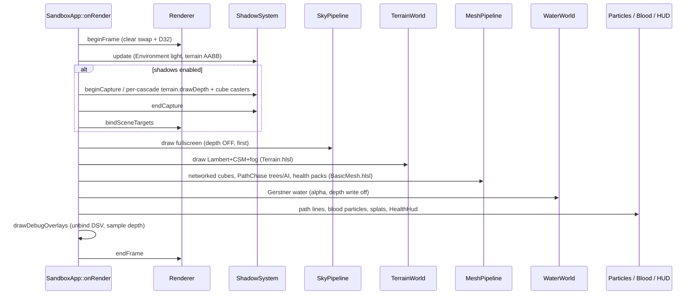
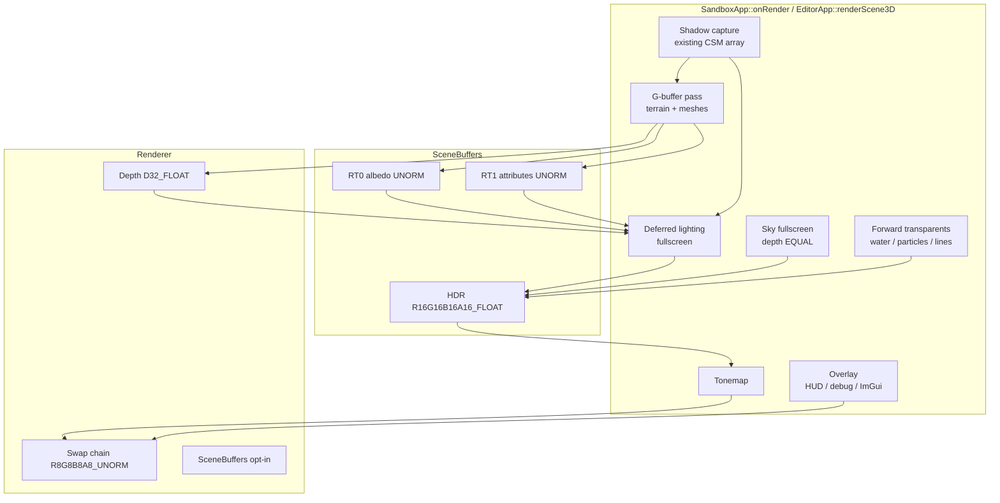
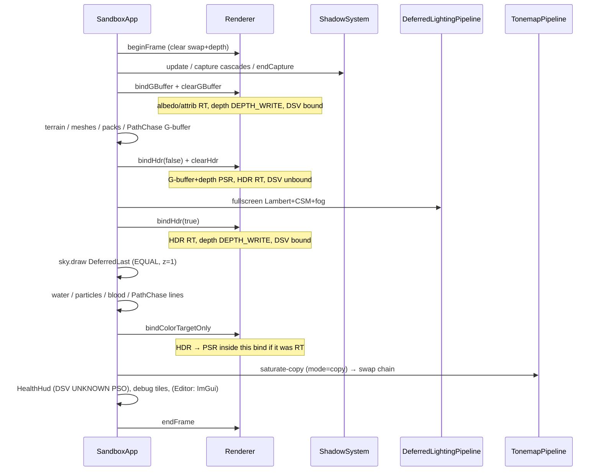
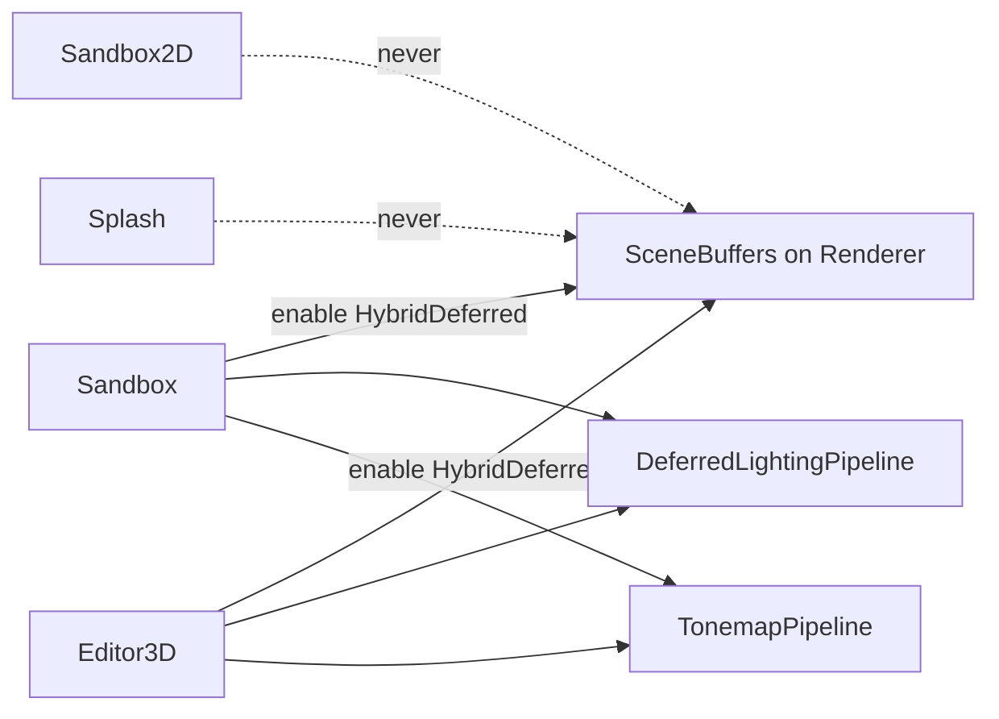

# Hybrid Deferred Renderer for DarkEngine6

| Field | Value |
|-------|--------|
| **Title** | Hybrid deferred renderer (G-buffer + HDR lighting + forward transparents) |
| **Author** | TBD |
| **Date** | 2026-09-01 |
| **Status** | Draft (rev 4) |
| **Area** | `Render/` + `content/shaders/` + Sandbox / Editor 3D hosts |
| **Audience** | Engine, Sandbox, Editor owners who already know this tree |
| **Scope** | Migrate the 3D path from classic forward (1 directional light, swap-chain RT) to a hybrid deferred frame. **No production implementation in this document.** |

---

## Overview

DarkEngine6 is a classic forward renderer. `Renderer::beginFrame` binds the flip-model swap chain (`DXGI_FORMAT_R8G8B8A8_UNORM`) plus a `D32_FLOAT` depth buffer and every 3D color PSO (`MeshPipeline`, `TerrainPipeline`, `SkyPipeline`, `WaterPipeline`, `ParticlePipeline`, `LinePipeline`) is `NumRenderTargets = 1` with that same UNORM format. Lighting is a duplicated Lambert + CSM PCF 3×3 in `BasicMesh.hlsl` and `Terrain.hlsl`, driven by a single `Sky::Environment` directional light. Exponential fog is terrain-only. The sky is a fullscreen triangle with **depth disabled**, drawn **first**. Water, particles, blood splats, HUD, debug lines, ImGui, and all 2D paths are unlit or self-lit forward.

This document migrates **3D only** to a hybrid deferred frame:

1. Unchanged CSM capture into the existing `Texture2DArray`.
2. Opaque geometry (terrain, meshes, health packs, trees, AI, Editor ground/props) writes a 2-target G-buffer. World position is **not** stored; the lighting pass reconstructs it from `D32_FLOAT` depth + `invViewProj`.
3. A fullscreen lighting pass evaluates Lambert + CSM + ambient + fog into an offscreen HDR color target.
4. Sky is drawn **last among opaques**, depth-tested so it only fills pixels where depth is still 1.0.
5. Water, particles, blood splats, and world-space debug lines stay **forward** on the HDR target (depth test on, depth write off).
6. A tonemap/copy pass writes the swap chain. HUD, debug tiles, ImGui, loading screen, and all 2D paths stay on the swap chain and never see the G-buffer.

Honest motivation: deferred does **not** win on today’s 1-light, low-mesh Sandbox. It is scaffolding for many lights, one lighting shader, fog on meshes, SSAO/SSR, and deferred decals. The first cut is deliberately small: one directional light, no PBR maps, no MSAA, no stencil, no frame graph.

2D (`Sandbox2DApp::onRender`, `EditorApp::renderScene2D`), the boot splash (`LoadingScreen`), and VisualDebugger stay on the UNORM swap chain and never enable `SceneBuffers`. **Caveat:** Editor F3 shares one `m_linePipeline` between 2D and 3D today (`EditorApp.cpp` ~636 / ~1843 / ~1955). After HDR, that PSO cannot be shared — see K22. Sandbox2D’s own `m_linePipe` is 2D-only and stays UNORM.

---

## Background & Motivation

### What the 3D frame actually does today

`Renderer` (`Render/Renderer.h`, `Render/Renderer.cpp`) is the device, queue, flip-discard swap chain (2 buffers), RTV heap of size `kFrameCount`, one `D32_FLOAT` depth texture (`R32_TYPELESS` resource, `D32_FLOAT` DSV, `R32_FLOAT` SRV), and the recording command list. There is **no** offscreen color, **no** MRT, **no** stencil (`StencilEnable = FALSE` on every PSO), **no** HDR, **no** post stack.

`beginFrame()`:

1. Resets the allocator / list, sets viewport/scissor.
2. Transitions the current back buffer `PRESENT → RENDER_TARGET` and depth to `DEPTH_WRITE`.
3. `OMSetRenderTargets(1, swapRtv, DSV)`.
4. Clears the swap chain to `m_clearColor` and depth to **1.0**.

Hosts then hijack the list. After shadow capture they call `Renderer::bindSceneTargets()` to put the swap chain + DSV back. `endFrame()` transitions the back buffer `RENDER_TARGET → PRESENT`. `Application::run` calls `onRender()` then `present()`. Resize (`Application.cpp` ~556) is `Renderer::resize`, which recreates **only** swap-chain RTVs + the depth buffer.

Default window is `AppConfig` **2560×1600** (`Core/Application.h`). Sample count is 1. Feature level is 11_0.

#### Sandbox 3D (`Sandbox/SandboxApp.cpp` `onRender`, ~1344)



Concrete facts:

| Piece | Location | Fact |
|-------|----------|------|
| Single directional light | `Sky/Environment.h` `lightDir()` / `lightColor()` / `ambientColor()` | Sun/moon blend; Sandbox passes this into mesh/terrain CBs |
| Lambert, duplicated | `content/shaders/BasicMesh.hlsl`, `Terrain.hlsl` | `ndotl * lightColor * albedo * shadow + ambient` |
| CSM 3 cascades | `Render/ShadowSystem.*`, `content/shaders/Shadow.hlsli` | `Texture2DArray` `R32_TYPELESS`/`D32_FLOAT`, PCF 3×3, `b1` + comparison `s1` |
| Fog | `Terrain.hlsl` only | `1 - exp(-fogDensity * dist)`, `Environment::fogColor/fogDensity`. Meshes unfogged |
| Sky first, depth off | `SkyPipeline::create` `DepthEnable = FALSE`; `Sky.hlsl` `z = 0` | Must draw before geometry or it would z-fight / occlude |
| Materials | `Render/Material.h` | Albedo `Texture2D` (`R8G8B8A8_UNORM`, **not sRGB**) + tint. 2-slot shader-visible heap: t0 albedo, t1 shadow. No metallic/roughness/normal/emissive |
| Terrain materials | `Terrain/TerrainMaterial.h` | 6-slot heap: 4 layers + splat + shadow |
| Water | `Water.hlsl` | Own Blinn-Phong + Fresnel + analytic `SkyColor`. `specPower < 0` is the lighting-off path |
| Particles / blood | `Particle.hlsl`, `BloodSplatPool` | Unlit. Alpha or additive. Depth write off, `LESS_EQUAL` |
| PathChase trees/AI | `Sandbox/PathChase.cpp` `drawMeshes` | **Forces `cb.lighting = 0`** — currently unlit on purpose |
| HUD | `Render/HealthHud.cpp` | `SpritePipeline` with **depth disabled**, screen-space ortho, swap-chain UNORM |
| Debug tiles | `SandboxApp::drawDebugOverlays` | `bindColorTargetOnly()` so DSV is unbound; `transitionDepth(PIXEL_SHADER_RESOURCE)`; `DebugOverlay` PSO has `DSVFormat = UNKNOWN` |
| Fill / lighting / shadows | `DebugRenderState` | Sandbox: **F1** fill, **F2** lighting, **F7** shadows, **F8** cascade tiles, **F9** depth. Editor: **F1** fill, **F6** lighting, **F7** shadows (F2 is particle UI, F5 save) |
| Exposure | `Environment::exposure()` | `Lerp(0.55, 1.05, dayF) * (1 - 0.15*cover)`, multiplied **inside** `Sky.hlsl` only. Mesh/terrain ignore it |
| Camera | `Camera3D` + `Matrix4f::PerspectiveFovLHMatrix` | LH, row-vector, D3D-style, **z in [0,1]**, not reversed-Z. Sandbox lens: fovY 60°, **near 0.18, far 2000**. Editor: near 0.05, far 500 |
| Swap chain | `Renderer::initD3D12` | `R8G8B8A8_UNORM`, flip-discard, `ALLOW_MODE_SWITCH`, no tearing, no MSAA |
| Depth | `Renderer::createDepthResources` | One texture, no stencil. Debug overlay already has an SRV |

#### Editor 3D (`Editor/EditorApp.cpp` `renderScene3D`, ~1881)

Same shadow capture + `bindSceneTargets`, then ground mesh, grid `LinePipeline`, props via `MeshPipeline`, then particle emitters. **No sky, no terrain, no water, no Environment.** Light is a hardcoded `Vector3f(0.35, 0.85, -0.35)`. ImGui draws after the scene, still on the swap chain (`Ui/ImGuiHost.cpp` `RTVFormat = R8G8B8A8_UNORM`).

#### 2D / splash (must not change)

| Host | Path | PSO format |
|------|------|------------|
| `Sandbox2DApp::onRender` | `SpritePipeline` → swap chain | `R8G8B8A8_UNORM`, `D32_FLOAT` |
| `EditorApp::renderScene2D` | sprites + 2D grid lines | same |
| `LoadingScreen` | fullscreen triangle, depth off | `R8G8B8A8_UNORM`, `DSVFormat = UNKNOWN` |
| VisualDebugger | ImGui only | swap chain UNORM |

`Pipeline` (`Render/Pipeline.h`) is a **stub** (`Pipeline.cpp` logs “not yet implemented”). Do not revive it. Real work stays in the per-pass `*Pipeline` classes.

### Pain points

1. **Lighting is copy-pasted** in two pixel shaders and will be copied again for every new opaque (trees already skipped lighting instead of sharing a function).
2. **Fog is terrain-only.** Cubes, hunters, and health packs pop against fogged hills.
3. **Sky-first + depth-off** wastes the sky over every opaque pixel and forbids any later depth-aware sky/fog composition.
4. **One light, evaluated per object**, with CSM PCF in every forward PS. Adding point lights means N× overdraw and N copies of `Shadow.hlsli`.
5. **No HDR target.** Sky already produces values > 1 (sun disc `2.8 * limb * edge`); the UNORM swap chain saturates them. There is nowhere to put bloom, SSAO, or a real tonemapper.
6. **No G-buffer.** SSAO, SSR, deferred decals (blood is a forward mesh-drape today) have no attributes to read.
7. **sRGB is wrong engine-wide.** `Texture2D::createFromRGBA` creates `R8G8B8A8_UNORM` SRVs. Lambert runs in that working space. This RFC does **not** fix color management; it must not make it worse (see K9).

### Why now, and why hybrid (not full deferred)

The Sandbox already has opaque terrain + meshes, a separate transparent water pass, unlit FX, a HUD, and a debug depth sampler that unbinds the DSV. That **is** a hybrid frame; lighting is just in the wrong shader stage.

Full deferred including water is a bad fit (alpha, Gerstner, Fresnel). Deferred+MSAA is a bad fit (the engine is 1× and will stay 1×; TAA is the future AA). A frame graph is a bad fit (one graphics queue, one list, hosts already own pass order).

---

## Goals & Non-Goals

### Goals (v1)

- Offscreen **HDR color** consumed by a **tonemap/copy** onto the existing UNORM swap chain.
- **G-buffer v1** for 3D opaques: albedo + octahedral world normal + roughness/metallic placeholders + existing `D32_FLOAT` depth.
- **One** fullscreen lighting shader: directional Lambert + existing CSM (`Shadow.hlsli`) + ambient + exponential fog. Meshes get fog.
- **Sky after lighting**, depth-tested against clear (= 1.0) pixels.
- **Forward transparents** (water, particles, blood splats, world lines) on HDR, depth test on, depth write off.
- Overlay (HealthHud, `DebugOverlay` tiles, ImGui) on the swap chain after tonemap.
- **F1 / F2 (Sandbox) / F6 (Editor) / F7 / F8 / F9** keep their meanings.
- Sandbox 3D and Editor 3D share `SceneBuffers` + lighting + tonemap. Editor still has no sky/terrain/water.
- **LoadingScreen, Sandbox2D, VisualDebugger** keep today’s UNORM PSOs and `beginFrame` bind. Editor 2D stays UNORM **except** it must own a second Line PSO for 3D HDR (K22).
- Runtime rollback: `AppConfig` / CLI **`-forward`** keeps today’s swap-chain forward path.
- No C++ exceptions. Failures are `bool` + `DE_LOG_ERROR(LogCategory::Render, ...)`.
- Three independently mergeable PRs (HDR-forward → deferred+sky-last → soak). `HdrForward` is PR1 scaffolding only (K24).

### Non-goals (v1)

- MSAA, TAA, temporal upsample, motion vectors.
- Stencil / `D24_UNORM_S8_UINT` (see K6).
- Emissive, AO maps, specular-color buffer, world-position buffer, velocity.
- PBR BRDF and material maps (normal / roughness / metallic textures). Roughness is written **1**, metallic **0**.
- Clustered / tiled point lights, light culling, shadow maps per point light.
- SSAO, SSR, bloom, auto-exposure, color grading.
- Deferred decals (blood stays forward `BloodSplatPool`).
- A frame graph, render-graph compiler, or async compute.
- Changing `Texture2D` to `_SRGB` / a linear working space (follow-up).
- Lit particles or fogged water.
- Changing 2D, splash, or VisualDebugger.
- Reversed-Z. Reconstruction uses the current `PerspectiveFovLHMatrix` (z 0..1).
- Compute shaders in v1 (lighting is a fullscreen triangle, same topology as `SkyPipeline` / `DebugOverlay`).

---

## Key Decisions

These are the proposed defaults. Remaining ties are in [Open Questions](#open-questions).

| ID | Decision | Rationale |
|----|----------|-----------|
| **K1** | **`Renderer` owns optional `SceneBuffers`.** No `DeferredRenderer` class, no frame graph. Hosts still sequence the frame (`SandboxApp::onRender`, `EditorApp::renderScene3D`). New PSO objects: `DeferredLightingPipeline`, `TonemapPipeline`. | Matches `ShadowSystem` (resources) + `SkyPipeline` (fullscreen PSO). `Renderer` already owns depth, resize, `bindSceneTargets`. A second renderer would duplicate device/resize/fence. `Render/Pipeline.h` is a stub — do not revive it. |
| **K2** | **`ScenePath` is opt-in per process.** Default `SwapChainForward`. 3D hosts call `renderer().enableSceneBuffers(config().scenePath)` in `onInit`. **`config().scenePath` is a request; the live path is `renderer().scenePath()`.** After enable (success or fail), every PSO `create` / `SkyPass` / `sceneColorFormat()` branches on the renderer, not the config. 2D/splash/debugger never call enable. | LoadingScreen and Sandbox2D rely on `beginFrame` binding the swap chain. Create **only the live 3D path** (K24). Exception: Editor dual Line PSOs (K22). Enable failure leaves the renderer on `SwapChainForward` while config may still say HybridDeferred. |
| **K3** | **G-buffer is 2 color targets + existing depth. No world-position RT.** | 12 B/px with depth. Position is `invViewProj` × `(ndc.xy, depth, 1)`. `Matrix4f::Inverse()` already exists. |
| **K4** | **RT0 = `R8G8B8A8_UNORM` (not `_SRGB`).** RGB = albedo × tint (same working space as today’s `Texture2D`). A unused (write 1). | `Texture2D` SRVs are UNORM. An `_SRGB` RT0 would hardware-encode values that are already gamma, double-sRGB, and mismatch the current look. Linear/sRGB is a follow-up with texture format changes. |
| **K5** | **RT1 = `R8G8B8A8_UNORM`.** RG = octahedral **world** normal, B = roughness (**1** until maps exist), A = metallic (**0**). | Cheap, enough for SSAO later. View-space normals would break if we ever sample last-frame data; world space matches CSM which already transforms world positions. |
| **K6** | **Keep `D32_FLOAT`. No stencil in v1.** Sky uses `DepthFunc = EQUAL` with clip `z = w` (NDC z = 1). | Scene near/far is 0.18/2000 (Sandbox). D24 would hurt reconstruction. Shadow maps stay D32. Debug overlay already samples `R32_FLOAT`. Stencil is reserved for deferred decals / volume lights later. |
| **K7** | **HDR color = `R16G16B16A16_FLOAT`.** One texture, full resolution, `ALLOW_RENDER_TARGET`. | Water/particles use source-alpha blend (need a shader alpha even if dest alpha is unused). Sky sun disc exceeds 1.0; R11G11B10 has no alpha and weaker precision near 1. 8 B/px is acceptable (see Bandwidth). Revisit R11G11B10 if a profiler says so. |
| **K8** | **MSAA stays 1×.** No G-buffer MSAA, no mix of MSAA HDR + non-MSAA G-buffer. | Deferred+MSAA is a different RFC. TAA is the intended AA follow-up. |
| **K9** | **Do not “fix” color space in this migration.** Lighting v1 is the current Lambert in the current UNORM working space. Any tonemap curve is a **display operator on that gamma-ish buffer**, not linear scene-referred ACES. | Avoids coupling a look-breaking sRGB conversion to a pass-structure change. |
| **K10** | **PR1 tonemap is saturate-copy (`mode=copy`).** Sky keeps multiplying `Environment::exposure()` so the frame matches today’s UNORM clip. Narkowicz ACES is compiled in behind `mode` but is **off** until a soak flip. Lighting-off (F2/F6) always copies albedo (no curve). When ACES is turned on, exposure moves to the tonemap pass and is removed from `Sky.hlsl`. | `aces(1)≈0.80` would darken Editor 3D (exposure 1, no sky) if it were the PR1 default. Copy preserves look; HDR still stores values > 1 for a later curve. |
| **K11** | **F1 fill variants live on the G-buffer (and remaining forward) PSOs**, via existing `createFillVariantPsos`. The lighting/sky/tonemap passes are always solid fullscreen triangles. | Wire/point then produce a sparse G-buffer; lighting shades those fragments. Matches “see the mesh as wires” better than wireframing the lighting triangle. |
| **K12** | **F2/F6 lighting is a flag on the lighting pass**, not a branch in every G-buffer shader. G-buffer always writes albedo+normal. Lighting-off: `out = albedo.rgb` (no CSM, no fog, no ACES). Water still uses `specPower = -1` as today. | One place to toggle. Fog-off with lighting-off matches `TerrainWorld::draw` (`if (!lighting) cb.fogDensity = 0`). |
| **K13** | **F7 shadows stay on `ShadowSystem::setDebugEnabled`.** Lighting always includes `Shadow.hlsli`; strength 0 → 1.0 as today. Skip capture when disabled. | No lighting-shader special case. F8 cascade tiles unchanged (sample the array). |
| **K14** | **F9 depth viz samples `Renderer::depthResource()` after tonemap**, still via `bindColorTargetOnly` + `transitionDepth(PIXEL_SHADER_RESOURCE)`. HealthHud also draws with DSV unbound; `SpritePipeline::create(..., enableDepth=false)` must set **`DSVFormat = UNKNOWN`** (today it still sets `D32_FLOAT` in `SpritePipeline.cpp` ~123). | Overlay must run when depth is **not** bound as DSV. LoadingScreen already uses UNKNOWN + `bindColorTargetOnly`. Do not rebind DSV just for HUD. |
| **K15** | **Editor 3D uses the same `SceneBuffers` + lighting + tonemap.** Lighting CB: hardcoded light, ambient `float3(0.22,0.22,0.22)`, fog 0, no sky pass (`clearHdr` uses `clearColor()`). Editor 2D never *draws* G-buffer/HDR. **F3 must not recreate `SceneBuffers` or 3D G-buffer/HDR PSOs.** Dual Line PSOs (K22) are required because 2D still needs UNORM lines. | Avoid a second lighting implementation. Editor has no `Environment`. “2D unchanged” is false for `m_linePipeline`. |
| **K16** | **`Material` / `TerrainMaterial` heaps stay as they are** (albedo+shadow / 6 slots). G-buffer shaders sample **t0..t4 only** and ignore the shadow slot. `setShadowSrv` remains for `-forward`. | Avoids a material-system rewrite. Lighting binds shadow from `SceneBuffers`’ packed table, not per-material. |
| **K17** | **PathChase trees/AI become lit** on the deferred path (stop forcing `cb.lighting = 0`). Forward path keeps today’s unlit look. | The zero-light was a shortcut, not a product requirement. Deferred’s point is unified lighting. |
| **K18** | **Blood splats stay forward in v1.** Deferred decals into RT0 before lighting are a follow-up. | `BloodSplatPool` is a height-draped particle mesh with alpha; a decal path needs stencil or a G-buffer blend that we are not taking yet. |
| **K19** | **`beginFrame` still binds and clears the swap chain + depth**, even when `SceneBuffers` exist. 3D hosts rebind immediately (already the shadow-capture pattern). Keep the name **`bindSceneTargets()`** for swap+DSV. Do **not** add a `bindSwapChain()` alias. | Splash and 2D keep working. Every call site already says `bindSceneTargets`. |
| **K20** | **No exceptions, no `Pipeline` revival, no shared “uber PSO factory.”** Each pass is a `*Pipeline` with `bool create(...)`. | `Agents.md`. Existing pattern in `MeshPipeline::create`. |
| **K21** | **`SkyPipeline` has a pass enum, not a format-only `create`.** `SkyPass::ForwardFirst` = today’s shader+PSO (depth off, VS `z=0`, draw first). `SkyPass::DeferredLast` = HDR, `DepthEnable=TRUE`, `DepthWriteMask=ZERO`, `DepthFunc=EQUAL`, VS `z=w` (NDC z=1), draw after lighting. Hosts compile **one** variant (K2). | HdrForward/PR1 and `-forward` keep ForwardFirst. HybridDeferred compiles DeferredLast only. A `colorFormat` argument cannot select depth state or VS. |
| **K22** | **Editor owns two Line PSOs.** `m_linePipeline` stays `R8G8B8A8_UNORM` for 2D grid/outlines. `m_linePipeline3D` is created with `Renderer::sceneColorFormat()` for 3D grid. `renderScene2D` always binds UNORM; `renderScene3D` binds 3D. PathChase’s `m_lines` is 3D-only — one PSO at `sceneColorFormat()`. Sandbox2D `m_linePipe` stays UNORM and is never HDR. `LinePipeline::create(device, DXGI_FORMAT colorFormat = R8G8B8A8_UNORM)`. | Single `m_linePipeline` is created once at `EditorApp.cpp` ~636 and used in both `renderScene2D` ~1843 and `renderScene3D` ~1955. HDR PSO into the UNORM swap chain is a debug-layer mismatch. |
| **K23** | **FX wrappers query `Renderer::sceneColorFormat()`, they do not keep hard-coded UNORM.** `ParticlePipeline::create` **appends** `DXGI_FORMAT colorFormat = DXGI_FORMAT_R8G8B8A8_UNORM` as the **last** parameter (today `create(device, additive, depthBias = 0, slope = 0)` — `ParticlePipeline.h` ~29). BloodSplatPool becomes `create(device, false, -4, -3.0f, renderer.sceneColorFormat())` so `-4` cannot be parsed as a format. `ParticleRenderer::create` / `BloodSplatPool::create` / `PathChase::init` pass `sceneColorFormat()`. HealthHud/Sprite stay UNORM and run after tonemap. | Hosts never call `ParticlePipeline::create` themselves. Inserting format before bias would make missed call sites treat `-4` as `DXGI_FORMAT`. |
| **K24** | **`ScenePath::HdrForward` is PR1-only scaffolding.** After PR2 the supported product paths are `SwapChainForward` (`-forward`) and `HybridDeferred`. Hosts do not offer HdrForward as a runtime toggle. The enum value may remain until PR3 deletes it. | HybridDeferred lighting+sky-last is one path. Keeping HdrForward live after PR2 means a third PSO set (`ForwardHdr` + ForwardFirst sky). |
| **K25** | **Bind/clear helpers always promote resources to the state they need.** Hosts do not call `transitionSceneColor` in the hot frame. `transitionDepth` remains for F9. Lighting is illegal unless albedo+attrib+depth are `PIXEL_SHADER_RESOURCE` and DSV is unbound — `bindHdr(false)` establishes that. All helpers use `Renderer::commandList()` (the one `beginFrame` opened). | Sequence diagram, bind comments, and `onRender` sketch disagreed. One owner. |
| **K26** | **`Material::applySurface(float color[4]) const`** is the shared helper. Existing `applySurface(MeshFrameConstants&)` calls it. G-buffer draws call it on `MeshGBufferConstants::color`. | Today `applySurface` only takes `MeshFrameConstants` (`Material.h` ~47). |
| **K27** | **Lighting `discard`s (does not write) when `depth >= 1 - eps`.** HDR dest stays `clearHdr`. Sandbox `DeferredLast` sky still covers those pixels (it does not read dest). Editor has no sky — background remains `clearColor()` (`EditorApp::applySceneMode` 3D `(0.05, 0.05, 0.07)`). No Editor branch in the lighting shader. | Write-0 would paint Editor’s backdrop black. Write-0 is also unnecessary for Sandbox. |
| **K28** | **`parseAppCommandLine` sets `cliForward = true` only** (same pattern as `-no-splash` → `cliNoSplash`). It does **not** assign `scenePath`. 3D `main.cpp` (Sandbox/Editor) after parse calls `applyDeferredScenePath(cfg, HdrForward /*PR1*/ / HybridDeferred /*PR2*/)` which sets `scenePath = cliForward ? SwapChainForward : whenEnabled`. Sandbox2D never calls it. | Two writers of `scenePath` would no-op `-forward` if parse forgot `cliForward` and main overwrote the path. |
| **K29** | **`beginFrame` failure: host `requestQuit()` and does not `endFrame`.** `Renderer` tracks `m_frameSubmitted` (set by successful `endFrame`). `present()` if not submitted: log, return **false** (gameplay loop already stops). `Application::run` also `break`s if `!m_running` **before** `present()`. | Today `onRender` then always `present()` (`Application.cpp` ~589–597). `return;` from `onRender` still presents. Splash already treats `beginFrame` failure as fatal (~417). |
| **K30** | **Mesh/Terrain `create(device, MeshPass)` from PR1.** `ForwardUnorm` / `ForwardHdr` select RT format + today’s Lambert shader/root. PR2 adds `GBuffer` (different shader, root, `NumRenderTargets=2`). No parallel `create(device, DXGI_FORMAT)` on mesh/terrain. Water/Line/Particle stay format-only; Particle appends `colorFormat` **last**. | Avoids a PR1 signature that PR2 immediately replaces. |

---

## Proposed Design

### Architecture



`ShadowSystem` is unchanged: depth-only PSO, `NumRenderTargets = 0`, `DSVFormat = D32_FLOAT`, hosts still `beginCapture` → per cascade → `endCapture` → rebind.

### ScenePath

```cpp
enum class ScenePath : uint8_t
{
    SwapChainForward = 0, // today: color = swap chain UNORM
    HdrForward,           // PR1 only: color = HDR, Lambert still in mesh/terrain PS
    HybridDeferred,       // PR2+: G-buffer opaques + fullscreen lighting + sky last
};
```

`Renderer::enableSceneBuffers(ScenePath path)` creates `SceneBuffers` when `path != SwapChainForward`. PR1 allocates **HDR only**. PR2 grows the same object with RT0/RT1 + lighting heap (still one `enable` call; HybridDeferred creates all three textures).

Init failure: log, return false, leave path at `SwapChainForward`. The host then creates UNORM PSOs (it has not compiled HDR/G-buffer yet). Do **not** bind G-buffer/HDR PSOs against the swap chain.

CLI (K28): `parseAppCommandLine` grows `-forward` → **`cliForward = true` only** (mirrors `-no-splash`). It does not write `scenePath`. After parse, 3D mains call:

```cpp
// Core/Application.h — next to parseAppCommandLine
void applyDeferredScenePath(AppConfig& cfg, ScenePath whenEnabled);
// cfg.scenePath = cfg.cliForward ? SwapChainForward : whenEnabled;
```

PR1: `applyDeferredScenePath(cfg, ScenePath::HdrForward);`  
PR2: `applyDeferredScenePath(cfg, ScenePath::HybridDeferred);`  
Sandbox2D / VisualDebugger: never call it (`scenePath` stays `SwapChainForward`). `HdrForward` is not a host default after PR2 (K24).

Then `onInit` requests `enableSceneBuffers(config().scenePath)` but compiles PSOs from **`renderer().scenePath()`** (K2).

`DXGI_FORMAT Renderer::sceneColorFormat() const` returns `R16G16B16A16_FLOAT` if `hasSceneBuffers()`, else `R8G8B8A8_UNORM`. Wrappers use this (K23).

### Who owns what

| Object | Owner | Lifetime |
|--------|-------|----------|
| Device, queue, swap chain, depth, fence, `beginFrame`/`endFrame`/`present` | `Renderer` | process |
| HDR + G-buffer textures, their RTV heap, packed lighting SRV heap | `Renderer::m_sceneBuffers` (`Render/SceneBuffers.h`) | from `enableSceneBuffers` to dtor; recreated in `Renderer::resize` |
| CSM array + caster PSO + receiver CBV | `ShadowSystem` (host member, as today) | host |
| Mesh/Terrain/Sky/Water PSOs | host members, as today | host `onInit` |
| Line PSOs | Editor: UNORM `m_linePipeline` + HDR `m_linePipeline3D`. PathChase: one `m_lines` at `sceneColorFormat()`. Sandbox2D: UNORM | host `onInit`; F3 does not recreate |
| ParticleRenderer / BloodSplatPool PSOs | those classes, format from `Renderer::sceneColorFormat()` | host `onInit` via `create(Renderer&)` |
| `TonemapPipeline` | host members (Sandbox + Editor) | `onInit` if `hasSceneBuffers()` (HdrForward + HybridDeferred) |
| `DeferredLightingPipeline` | host members (Sandbox + Editor) | `onInit` only if live path is `HybridDeferred` |
| Frame order | host `onRender` | per frame |

`SceneBuffers` is **not** a second `Renderer`. It does not record command lists. It exposes bind/clear/SRV helpers.

Why not a `DeferredRenderer` that owns the 3D frame: Sandbox and Editor **disagree** on what they draw (sky/terrain/water vs ground/grid/ImGui). A god class would grow every Sandbox-only pass. Why not a frame graph: one list, ~8 passes, no async compute, no reuse across hosts worth the abstraction.

### SceneBuffers resource table

Created at the **current** `Renderer::width/height`. Sample count 1. `D3D12_HEAP_TYPE_DEFAULT`.

| Resource | Format | Flags | Clear | Initial state after create |
|----------|--------|-------|-------|----------------------------|
| `m_albedo` (RT0) | `R8G8B8A8_UNORM` | `ALLOW_RENDER_TARGET` | `{0,0,0,1}` | `RENDER_TARGET` |
| `m_attrib` (RT1) | `R8G8B8A8_UNORM` | `ALLOW_RENDER_TARGET` | `{0.5, 0.5, 1, 0}` (dummy oct normal of +Z, roughness 1, metallic 0) | `RENDER_TARGET` |
| `m_hdr` | `R16G16B16A16_FLOAT` | `ALLOW_RENDER_TARGET` | `{0,0,0,1}` | `RENDER_TARGET` |
| Depth | existing `Renderer` `D32_FLOAT` | already `ALLOW_DEPTH_STENCIL` | 1.0 / stencil 0 | `DEPTH_WRITE` (beginFrame) |

No UAV in v1. No mip chain. Full resolution only (SSAO follow-up may add a half-res target **then**, not now). PR1 creates **only** `m_hdr`. PR2 adds RT0/RT1.

**RTV heap:** `SceneBuffers` owns a **non-shader-visible** RTV heap. PR1: 1 descriptor `(Hdr)`. PR2: 3 descriptors `(Hdr, Albedo, Attrib)`. Do **not** expand `Renderer::m_rtvHeap` (that heap is `kFrameCount` swap-chain slots; `beginFrame` indexes it by `m_frameIndex`). Mixing would break `bindSceneTargets`.

**CPU HDR SRV:** `SceneBuffers` owns a **non-shader-visible** 1-descriptor CBV_SRV_UAV heap `m_hdrSrvHeap`. Format `R16G16B16A16_FLOAT`, `TEXTURE2D`, mip 1. `Renderer::hdrSrvCpu()` returns that handle. Created with the HDR resource (PR1). Tonemap copies it into its own shader-visible slot the same way `DebugOverlay::draw` copies `depthSrvCpu()` — **not** a fifth slot on the lighting heap.

**Lighting SRV heap (PR2):** shader-visible CBV_SRV_UAV heap of 4 descriptors, packed once on create/resize and whenever the shadow CPU handle is set:

| Slot | Source |
|------|--------|
| 0 | albedo SRV (`R8G8B8A8_UNORM`) |
| 1 | attrib SRV (`R8G8B8A8_UNORM`) |
| 2 | depth SRV — **copy** of `Renderer::depthSrvCpu()` (`R32_FLOAT`) |
| 3 | shadow array — `ShadowSystem::writeSrv` / `srvCpu()` (`R32_FLOAT` TEXTURE2DARRAY) |

Point-clamp on 0–2 is a static sampler on the lighting root signature; comparison `s1` matches mesh/terrain. Do not sample HDR from this heap.

`setShadowSrv(device, cpu)` is called from the host after `ShadowSystem::create`, analogous to `Material::setShadowSrv`.

PIX names: `L"DE.GBuffer.Albedo"`, `L"DE.GBuffer.Attrib"`, `L"DE.HdrColor"`.

### Bind / barrier API on Renderer

Keep `bindSceneTargets` / `bindColorTargetOnly` meaning **swap chain**. Do not add `bindSwapChain()`. All new bind/clear helpers use `m_commandList` (the list `beginFrame` opened). They **always** transition tracked scene resources to the state the bind needs (K25).

```cpp
class Renderer
{
public:
    bool enableSceneBuffers(ScenePath path);
    ScenePath scenePath() const;
    bool hasSceneBuffers() const;
    DXGI_FORMAT sceneColorFormat() const; // HDR16 if buffers, else UNORM

    // Promote albedo+attrib → RENDER_TARGET, depth → DEPTH_WRITE.
    // OMSet RT0+RT1 + DSV, viewport. Does not clear.
    void bindGBuffer();

    // bindDepth=false (lighting, PR2): albedo+attrib → PSR, HDR → RENDER_TARGET,
    // depth → PSR, OMSet HDR **without** DSV. Illegal if G-buffer textures
    // do not exist (PR1 HDR-only).
    // bindDepth=true  (PR1 whole 3D frame; PR2 sky / transparents): HDR →
    // RENDER_TARGET, depth → DEPTH_WRITE, OMSet HDR + DSV. G-buffer, if any,
    // stays PSR. PR1 SceneBuffers have no RT0/RT1 — those transitions no-op.
    void bindHdr(bool bindDepth);

    void clearGBuffer(); // Clear RT0, RT1. Caller already bindGBuffer()'d.
    void clearHdr();     // Clear HDR. Caller already bindHdr()'d.

    D3D12_CPU_DESCRIPTOR_HANDLE hdrSrvCpu() const;       // CPU-only HDR SRV
    D3D12_GPU_DESCRIPTOR_HANDLE lightingTableGpu() const; // 4-slot table (PR2)
    ID3D12DescriptorHeap*       lightingHeap() const;

    // existing, unchanged names:
    void bindSceneTargets();     // swap RTV + DSV
    void bindColorTargetOnly();  // swap RTV, no DSV (tonemap dest, overlay)
    void transitionDepth(ID3D12GraphicsCommandList* cmd, D3D12_RESOURCE_STATES after);
    D3D12_CPU_DESCRIPTOR_HANDLE depthSrvCpu() const;
};
```

**Lighting preconditions** (debug-assert in `_DEBUG`): albedo and attrib are `PIXEL_SHADER_RESOURCE`, depth is `PIXEL_SHADER_RESOURCE`, DSV is unbound. `bindHdr(false)` is what makes that true. Drawing the lighting triangle without that bind is illegal.

`transitionSceneColor` is **not** part of the host frame. Keep it private on `SceneBuffers` if the bind helpers need a shared implementation.

**Resize (does not match today’s `Application::run`):** `Core/Application.cpp` ~555–556 calls `m_renderer.resize(...)` and **ignores the `bool`**. Hosts call `beginFrame()` and ignore the `bool` (`SandboxApp::onRender` ~1346, `EditorApp::onRender` ~1773). Only the splash pump treats `beginFrame` failure as fatal (~417). This work **must** make resize failure fatal in `Application::run`:

```cpp
if (m_window.takeSizeChanged())
{
    if (!m_renderer.resize(m_window.width(), m_window.height()))
    {
        DE_LOG_ERROR(LogCategory::Render, "resize failed; stopping");
        break;
    }
}
```

`Renderer::resize`: after swap-chain RTVs + depth succeed, if `hasSceneBuffers()` recreate them at the new size (`waitForGpu` already happens). If SceneBuffers recreate fails: log, destroy the stale scene textures (`hasSceneBuffers()==false`), return **false**. Do **not** silently force `SwapChainForward` — hosts already compiled HDR/G-buffer PSOs and cannot hot-switch them. Init-time `enableSceneBuffers` failure is different: no HDR PSOs exist yet, so staying on `SwapChainForward` is valid.

`beginFrame` **does not** clear G-buffer/HDR. Hosts call `clearGBuffer` / `clearHdr` after bind. Depth clear stays in `beginFrame` (shadow capture does not touch scene depth).

**`beginFrame` / `present` (K29), not existing behavior:** gameplay `Application::run` always `onRender()` then `present()` (~589–597). A host `return` after failed `beginFrame` still presents. PR1:

1. `Renderer` `m_frameSubmitted` — `beginFrame` clears it; successful `endFrame` sets it.
2. `present()` if `!m_frameSubmitted`: `DE_LOG_ERROR(LogCategory::Render, "Present: no frame submitted")`, return false. The loop already stops on false.
3. Hosts:

```cpp
if (!renderer().beginFrame())
{
    requestQuit();
    return;
}
```

4. `Application::run` after `onRender()`:

```cpp
if (!m_running)
    break;
if (!m_renderer.present())
{
    DE_LOG_ERROR(LogCategory::Render, "Present failed; stopping");
    break;
}
```

Do not treat `return;` from `onRender` as sufficient by itself.

### Hybrid frame (Sandbox)



`bindColorTargetOnly` today only rebinds the swap RTV. Extend it: if HDR’s tracked state is `RENDER_TARGET`, transition HDR → `PIXEL_SHADER_RESOURCE` first, then bind the swap RTV with no DSV. F9 then `transitionDepth(PSR)` (no-op if lighting already did) and draws tiles.

Editor 3D is the same minus sky/terrain/water, plus `m_linePipeline3D` on HDR, plus ImGui after tonemap.

### Resource-state machine (per frame, HybridDeferred)

| After pass | Albedo | Attrib | HDR | Depth |
|------------|--------|--------|-----|-------|
| `beginFrame` | RT (untouched) | RT | RT | `DEPTH_WRITE` (cleared) |
| Shadow capture | — | — | — | unchanged (scene depth not bound) |
| G-buffer | `RENDER_TARGET` (cleared+written) | `RENDER_TARGET` | — | `DEPTH_WRITE` |
| Lighting | `PIXEL_SHADER_RESOURCE` | `PIXEL_SHADER_RESOURCE` | `RENDER_TARGET` | `PIXEL_SHADER_RESOURCE` |
| Sky + transparents | PSR (idle) | PSR | `RENDER_TARGET` | `DEPTH_WRITE` (read; write mask ZERO on those PSOs) |
| Tonemap | PSR | PSR | `PIXEL_SHADER_RESOURCE` | `DEPTH_WRITE` or PSR |
| F9 overlay | — | — | — | `PIXEL_SHADER_RESOURCE` |
| `endFrame` | (don’t care) | (don’t care) | (don’t care) | (don’t care; not used in present) |

**Cannot** bind the depth texture as DSV and SRV in the same draw. Lighting **must** unbind DSV (`bindHdr(false)`). Sky **must** rebind DSV after a `DEPTH_WRITE` barrier.

`DebugOverlay` currently documents this hazard (`SandboxApp.cpp` ~1483: “Unbind the DSV so we can sample the scene depth”). The lighting pass is the same pattern.

State transitions in the table are **produced by the bind helpers**, not by host `ResourceBarrier` calls:

| Helper | Albedo / attrib | HDR | Depth | OM |
|--------|-----------------|-----|-------|----|
| `bindGBuffer()` | → `RENDER_TARGET` | unchanged | → `DEPTH_WRITE` | RT0+RT1+DSV |
| `bindHdr(false)` | → `PIXEL_SHADER_RESOURCE` | → `RENDER_TARGET` | → `PIXEL_SHADER_RESOURCE` | HDR, no DSV |
| `bindHdr(true)` | unchanged (stay PSR) | → `RENDER_TARGET` | → `DEPTH_WRITE` | HDR+DSV |
| `bindColorTargetOnly()` | unchanged | → `PIXEL_SHADER_RESOURCE` if it was RT | unchanged | swap RTV, no DSV |
| `beginFrame` | unchanged | unchanged | → `DEPTH_WRITE` if needed | swap+DSV (then host rebinds) |

`clearGBuffer` / `clearHdr` never barrier; they require the matching bind first.

### G-buffer v1 layout

Do **not** store world position.

| Target | Format | RGB / channels |
|--------|--------|----------------|
| RT0 | `R8G8B8A8_UNORM` | RGB = `albedoTex * tint` (terrain: splat-blended layers × `color`). A = 1 |
| RT1 | `R8G8B8A8_UNORM` | RG = octahedral world normal, B = 1 (roughness), A = 0 (metallic) |
| DSV | existing `D32_FLOAT` | hardware depth; lighting reconstructs world pos |

Octahedral encode/decode lives in `content/shaders/GBuffer.hlsli` (and a CPU copy in `Render/Octahedral.h` for tests):

```hlsl
float2 OctWrap(float2 v)
{
    return (1.0f - abs(v.yx)) * float2(v.x >= 0.0f ? 1.0f : -1.0f, v.y >= 0.0f ? 1.0f : -1.0f);
}

float2 EncodeOct(float3 n)
{
    n /= max(abs(n.x) + abs(n.y) + abs(n.z), 1e-6f);
    if (n.z < 0.0f)
        n.xy = OctWrap(n.xy);
    return n.xy * 0.5f + 0.5f;
}

float3 DecodeOct(float2 f)
{
    f = f * 2.0f - 1.0f;
    float3 n = float3(f.x, f.y, 1.0f - abs(f.x) - abs(f.y));
    if (n.z < 0.0f)
        n.xy = OctWrap(n.xy);
    return normalize(n);
}
```

8-bit octahedral is ~1° error — fine for Lambert and future SSAO. G-buffer PS must `normalize(normalWS)` before encode.

#### Position reconstruction and G-buffer fetch

`Matrix4f::PerspectiveFovLHMatrix` (`Math/Matrix4f.cpp` ~405):

```
m33 = zf / (zf - zn)
m34 = 1
m43 = -zn * zf / (zf - zn)
m44 = 0
```

Clip `z/w` is in **[0, 1]**. Row-vector, `#pragma pack_matrix(row_major)`.

Screen / clip convention **must match** `Camera3D::ScreenPointToRay` (`Render/Camera3D.cpp` ~211–227): origin top-left, Y down → NDC Y-up.

```
ndcX = (screenX / viewportW) * 2 - 1
ndcY = 1 - (screenY / viewportH) * 2
world = (invViewProj * float4(ndcX, ndcY, depth, 1)).xyz / w
```

`SV_Position.xy` in the lighting PS is the same space as `screenX/screenY` (D3D pixel coords, Y down, pixel-center `.5`). Do **not** reuse `Sky.hlsl`’s interpolated `clipXY` for fetches: that path never samples a texture. `DebugOverlay.hlsli` uses `uv * float2(2,-2)+float2(-1,1)` for a **display** blit, not for reconstruction.

Fetch G-buffer and depth with **`Texture2D.Load`**, not `Sample`. Point-clamp would be almost right but Load is the 1:1 texel mapping and ignores the sampler.

Full lighting VS/PS (`content/shaders/DeferredLighting.hlsl`):

```hlsl
#pragma pack_matrix(row_major)
#include "GBuffer.hlsli"
#define SHADOW_T t3
#include "Shadow.hlsli"

cbuffer LightingConstants : register(b0)
{
    float4x4 invViewProj;
    float3   cameraPos;
    float    fogDensity;
    float3   lightDirWS;
    float    lighting;     // 1 = Lambert+CSM+fog, 0 = albedo copy
    float3   lightColor;
    float    _pad0;
    float3   ambientColor;
    float    _pad1;
    float3   fogColor;
    float    _pad2;
};

Texture2D gAlbedo : register(t0);
Texture2D gAttrib : register(t1);
Texture2D gDepth  : register(t2);

struct PSInput
{
    float4 position : SV_POSITION;
};

PSInput VSMain(uint id : SV_VertexID)
{
    // Same bit trick as Sky.hlsl / DebugOverlay.hlsli: covers the screen.
    float2 pos = float2((id << 1) & 2, id & 2) * 2.0f - 1.0f;
    PSInput o;
    o.position = float4(pos, 0.0f, 1.0f);
    return o;
}

float3 ReconstructWorldPos(float ndcX, float ndcY, float depth)
{
    float4 clip = float4(ndcX, ndcY, depth, 1.0f);
    float4 w = mul(clip, invViewProj);
    return w.xyz / max(w.w, 1e-6f);
}

float4 PSMain(PSInput input) : SV_TARGET
{
    int2 texel = int2(input.position.xy);
    float  depth  = gDepth.Load(int3(texel, 0)).r;
    float4 albedo = gAlbedo.Load(int3(texel, 0));
    float4 attrib = gAttrib.Load(int3(texel, 0));

    // Cleared D32 is exactly 1.0. Do not write — keep clearHdr (K27).
    // Sandbox DeferredLast sky fills these pixels without reading dest.
    // Editor has no sky; backdrop stays clearColor.
    if (depth >= 1.0f - 1e-6f)
        discard;

    if (lighting < 0.5f)
        return float4(albedo.rgb, 1);

    uint w, h;
    gDepth.GetDimensions(w, h);
    float ndcX = (input.position.x / float(w)) * 2.0f - 1.0f;
    float ndcY = 1.0f - (input.position.y / float(h)) * 2.0f;
    float3 worldPos = ReconstructWorldPos(ndcX, ndcY, depth);

    float3 n = DecodeOct(attrib.rg);
    float3 l = normalize(lightDirWS);
    float  ndotl = saturate(dot(n, l));
    float  recvOffset = 0.06f + 0.28f * (1.0f - ndotl) * (1.0f - ndotl);
    float  shadow = ComputeShadow(worldPos + n * recvOffset, cameraPos);
    float3 lit = ambientColor * albedo.rgb + ndotl * lightColor * albedo.rgb * shadow;
    float  dist = length(worldPos - cameraPos);
    float  fog  = 1.0f - exp(-fogDensity * dist);
    lit = lerp(lit, fogColor, saturate(fog));
    return float4(lit, 1);
}
```

Host uploads `invViewProj = camera.GetViewProj().Inverse()` (row-major memcpy, same as `copyMatrix` today). CPU unit test: for a few pixels, build `ndcX/ndcY` with the `ScreenPointToRay` formulas, set `clip.z` to a known depth, and check `ReconstructWorldPos` against `(invVP * float4(ndcX,ndcY,depth,1)).xyz/w`. Do **not** invent a second inverse. `ScreenPointToRay` itself interpolates z=0 and z=1; the test uses the same NDC mapping with `clip.z = sampledDepth`.

#### What stays out of the G-buffer

Water, particles, blood splats, debug lines, HealthHud, LoadingScreen, ImGui, 2D sprites, shadow casters (depth-only). Sky is not a G-buffer pass.

### Pass-by-pass

#### 0. Shadow capture — unchanged

`ShadowPipeline` (`NumRenderTargets = 0`, `D32_FLOAT`, slope bias 2.5, depth bias 4000). Casters: terrain `drawDepth`, networked cubes, Editor ground+props. **Not** water, particles, HUD.

After `endCapture`, do **not** `bindSceneTargets` (that is the swap chain). Bind G-buffer instead. Forward path (`-forward`) still calls `bindSceneTargets` as today.

#### 1. G-buffer (opaques)

**Mesh G-buffer root signature** (replaces lighting constants on the deferred path):

| Slot | Type | Contents |
|------|------|----------|
| 0 | 32-bit constants b0 | `worldViewProj[16]`, `world[16]`, `color[4]` = 36 dwords |
| 1 | SRV table t0 | albedo only (`NumDescriptors = 1`) |
| — | static s0 | linear wrap (same as today) |

No shadow CBV, no comparison sampler, no `lightDirWS`. That is the point of the split.

`Material::bind` currently `SetDescriptorHeaps` of a **2-slot** heap. A 1-slot table with `BaseShaderRegister = 0` still works: the extra shadow descriptor is unused. **Do not** require a heap rebuild in v1 (K16). Optionally later shrink `MeshPipeline::kSrvCount` on the deferred path.

**Terrain G-buffer:** keep the 6-slot table (layers + splat + unused shadow) and the tiling constants. Drop light/fog/camera from `TerrainFrameConstants` on this path, or leave the struct and ignore the extra fields in the PS (simpler C++ — prefer **a dedicated `TerrainGBufferConstants`** so we do not keep uploading dead light data).

Pixel output:

```hlsl
struct GBufferOut
{
    float4 albedo : SV_TARGET0;
    float4 attrib : SV_TARGET1;
};

GBufferOut PSMain(PSInput input)
{
    GBufferOut o;
    float4 albedo = /* existing sample * tint / splat */;
    float3 n = normalize(input.normalWS);
    o.albedo = float4(albedo.rgb, 1.0f);
    o.attrib = float4(EncodeOct(n), 1.0f, 0.0f);
    return o;
}
```

Depth: `DepthEnable = TRUE`, `DepthWriteMask = ALL`, `DepthFunc = LESS`, `DSVFormat = D32_FLOAT`, `NumRenderTargets = 2`, `RTVFormats = { UNORM, UNORM }`, `SampleDesc = {1,0}`. Rasterizer: same CCW back-cull as today. `createFillVariantPsos` for F1.

**VS** can drop `worldPos` interpolator (lighting reconstructs). Keep `normalWS`.

Files: `content/shaders/BasicMeshGBuffer.hlsl`, `content/shaders/TerrainGBuffer.hlsl`, include `GBuffer.hlsli`. Do **not** delete `BasicMesh.hlsl` / `Terrain.hlsl` until `-forward` is removed (they remain the `SwapChainForward` / `HdrForward` shaders).

`MeshPipeline::create` / `TerrainPipeline::create` take a **pass enum from PR1** (K30), not a raw `DXGI_FORMAT`:

```cpp
enum class MeshPass : uint8_t { ForwardUnorm, ForwardHdr, GBuffer };
enum class TerrainPass : uint8_t { ForwardUnorm, ForwardHdr, GBuffer };

bool MeshPipeline::create(ID3D12Device* device, MeshPass pass);
bool TerrainPipeline::create(ID3D12Device* device, TerrainPass pass);
```

| Pass | PR | RT | Shader / root |
|------|----|----|----------------|
| `ForwardUnorm` | `-forward` | 1× UNORM | today’s Lambert + shadow |
| `ForwardHdr` | PR1 HdrForward | 1× HDR16 | same Lambert shader/root, format only |
| `GBuffer` | PR2 HybridDeferred | 2× UNORM | G-buffer shader, 36-dword CB, no shadow |

Hosts create **one** value, from `renderer().scenePath()` (K2): `SwapChainForward → ForwardUnorm`, `HdrForward → ForwardHdr`, `HybridDeferred → GBuffer`. Water/Line/Particle stay `create(..., DXGI_FORMAT)` — they have no G-buffer variant.

#### 2. Deferred lighting

New `Render/DeferredLightingPipeline` + `content/shaders/DeferredLighting.hlsl`. Topology: `SV_VertexID` triangle, like `SkyPipeline`.

Root signature:

| Slot | Type | Contents |
|------|------|----------|
| 0 | 32-bit constants b0 | `LightingConstants` (36 dwords, see below) |
| 1 | SRV table t0–t3 | albedo, attrib, depth, shadow array |
| 2 | CBV b1 | existing `ShadowConstants` (`ShadowSystem::bindReceiverCbv`) |
| s0 | static | unused for Load path; keep point-clamp for any debug Sample |
| s1 | static | comparison linear, border white, `LESS_EQUAL` (copy of mesh/terrain `s1`) |

```cpp
struct LightingConstants
{
    float invViewProj[16];
    float cameraPos[3];
    float fogDensity;
    float lightDirWS[3];
    float lighting; // 1 = Lambert+CSM+fog, 0 = albedo copy
    float lightColor[3];
    float pad0;
    float ambientColor[3];
    float pad1;
    float fogColor[3];
    float pad2;
};
static_assert(sizeof(LightingConstants) == 36 * sizeof(float), "lighting root constants");
```

**Do not put `exposure` here.** Tonemap owns it (and PR1 copy does not use it). Resolution comes from `gDepth.GetDimensions`.

Receiver bias: **apply the terrain offset for all deferred receivers** (`0.06 + 0.28*(1-ndotl)²` using the decoded world normal), matching `Terrain.hlsl` ~82. If cubes swim, add a material id in RT0.a later (Q3).

Lighting-off (`lighting < 0.5`): `return float4(albedo.rgb, 1)` — no shadow, no fog.

Sky pixel (`depth >= 1 - eps`): **`discard`** (K27). Dest stays `clearHdr`. Still requires sky-last in the **same** PR as lighting (PR2): a sky-first draw would be overwritten by later G-buffer/lighting, not by this discard. Do not special-case Editor in the shader.

Fog: `1 - exp(-fogDensity * distance(worldPos, cameraPos))`, lerp to `fogColor`. Editor sets `fogDensity = 0`.

Ambient: Sandbox uses `Environment::ambientColor()` (already a vec3). Mesh forward today uses a **scalar** `ambientScale = 0.22` times albedo. **Deferred uses the Environment vec3** for Sandbox (unifies with terrain) and `float3(0.22,0.22,0.22)` for Editor to match `MeshFrameConstants.ambientScale`. Visual change for Sandbox cubes: they pick up sky-colored ambient. Intended.

PSO: 1 RT `R16G16B16A16_FLOAT`, depth **disabled** (`DSVFormat = UNKNOWN`) because depth is an SRV. Blend off.

#### 3. Sky

`SkyPipeline::create` today hardcodes UNORM, `DepthEnable = FALSE`, `DSVFormat = D32_FLOAT` (`SkyPipeline.cpp` ~89–97). `Sky.hlsl` writes `float4(pos, 0, 1)`. A `colorFormat` argument is **not** enough (K21).

```cpp
enum class SkyPass : uint8_t { ForwardFirst, DeferredLast };

bool SkyPipeline::create(ID3D12Device* device, SkyPass pass, DXGI_FORMAT colorFormat);
```

| | `ForwardFirst` (PR1 / `-forward`) | `DeferredLast` (HybridDeferred) |
|--|-----------------------------------|----------------------------------|
| VS clip z | `float4(pos, 0, 1)` (NDC z = 0) | `float4(pos, 1, 1)` (NDC z = 1) |
| DepthEnable | FALSE | TRUE |
| DepthWriteMask | ZERO | ZERO |
| DepthFunc | unused | EQUAL |
| Draw order | **first**, after shadows | **after lighting**, before water |
| RT format | UNORM or HDR16 | HDR16 |

Hosts compile **one** variant. Two HLSL entry points or a `#define SKY_DEFERRED_LAST` compile flag is fine; do not share one PSO.

EQUAL against a D32 clear of 1.0 is exact. Geometry at `farZ` can write ~1.0; Sandbox far is 2000 m and terrain is ~256 m across — flicker is unlikely. Stick with EQUAL in v1.

PR1: `SkyPass::ForwardFirst`, `colorFormat = sceneColorFormat()`, **keep** `* exposure` in `EvaluateSky` (K10 copy tonemap). PR2: switch Sandbox to `DeferredLast` and still keep sky exposure until ACES is flipped on. Editor: skip the pass. `clearHdr` uses `Renderer::clearColor()`.

#### 4. Forward transparents → HDR

| Pass | Who calls `create` today | PSO change |
|------|--------------------------|------------|
| Water | `WaterPipeline::create(device)` from Sandbox `onInit` | `create(device, sceneColorFormat())`; blend/depth unchanged |
| Particles | **`ParticleRenderer::create(Renderer&)`** → `m_pipeAdditive.create(device, true)` + `m_pipeAlpha.create(device, false)` (`ParticleRenderer.cpp` ~36) | Append format **last**: `create(device, additive, depthBias = 0, slope = 0, colorFormat = UNORM)`. Wrappers pass `renderer.sceneColorFormat()`. Existing positional `(device, true)` stays valid until updated. |
| Blood splats | **`BloodSplatPool::create(Renderer&)`** → `m_pipe.create(device, false, -4, -3.0f)` (`BloodSplatPool.cpp` ~165) | `create(device, false, -4, -3.0f, renderer.sceneColorFormat())` |
| PathChase lines | **`PathChase::init(Renderer&)`** → `m_lines.create(renderer.device())` (`PathChase.cpp` ~103) | `m_lines.create(device, renderer.sceneColorFormat())`. 3D-only, one PSO |
| Editor 3D grid | `m_linePipeline.create(device)` shared with 2D | **Second** `m_linePipeline3D.create(device, sceneColorFormat())` (K22) |
| Editor 2D grid | same `m_linePipeline` | stays UNORM; `create(device)` default |
| Sandbox2D lines | `m_linePipe` | unchanged UNORM |
| HealthHud | `SpritePipeline::create(device, false)` | UNORM; **`DSVFormat = UNKNOWN` when `enableDepth==false`** (K14) |
| DebugOverlay / ImGui / LoadingScreen | — | unchanged UNORM |

Water lighting-off still `specPower = -1`. No fog on transparents in v1. World-space lines draw on HDR so they occlude against G-buffer depth.

#### 5. Tonemap / copy → swap chain

New `Render/TonemapPipeline` + `content/shaders/Tonemap.hlsl`. Fullscreen triangle, depth off, `RTVFormats[0] = R8G8B8A8_UNORM`, `DSVFormat = UNKNOWN`.

Root: 4 dwords (`exposure`, `mode`, pad, pad) + SRV table t0 (HDR). Point clamp sampler. `mode = 0` is saturate-copy (PR1 default). `mode = 1` is Narkowicz ACES on the **current gamma-ish working space** — a display curve, not correct linear ACES (K9/K10). Lighting-off uses `mode = 0` regardless.

```hlsl
// Narkowicz 2015 — compiled in, not the PR1 default.
float3 aces(float3 x)
{
    const float a = 2.51f, b = 0.03f, c = 2.43f, d = 0.59f, e = 0.14f;
    return saturate((x * (a * x + b)) / (x * (c * x + d) + e));
}

float4 PSMain(PSInput input) : SV_TARGET
{
    float3 hdr = gHdr.Load(int3(int2(input.position.xy), 0)).rgb;
    if (mode < 0.5f)
        return float4(saturate(hdr), 1);
    return float4(aces(hdr * exposure), 1);
}
```

PR1: `mode=copy`, `exposure` ignored, sky still multiplies exposure in `Sky.hlsl`. Values > 1 survive in HDR and clip at the copy — same as today’s UNORM swap chain.

Host: `bindColorTargetOnly()` (also promotes HDR → PSR). Tonemap copies `hdrSrvCpu()` into its own 1-slot shader-visible heap (`DebugOverlay::draw` pattern). Do **not** steal the 4-slot lighting heap.

#### 6. Overlay

HealthHud, F8/F9 tiles, Editor ImGui: swap chain, after tonemap, DSV unbound.

- HealthHud: `SpritePipeline` with `enableDepth=false` must use `DSVFormat = UNKNOWN` so a null DSV is legal (K14). Today `SpritePipeline.cpp` ~123 always sets `D32_FLOAT`.
- F9: `transitionDepth(PSR)` then `DebugOverlay::draw2D` (already `DSV UNKNOWN`). Do not rebind DSV (`endFrame` does not need it).
- Do **not** rebind swap+DSV after tonemap just for HUD — F9 would have to unbind again.

Optional follow-up: F8-style tiles for RT0/RT1. Not v1.

### Debug flags after the split

| Control | Sandbox | Editor | Deferred behavior |
|---------|---------|--------|-------------------|
| F1 fill | yes | yes | G-buffer + remaining forward PSOs use `createFillVariantPsos`. Lighting/sky/tonemap stay solid |
| F2 lighting | yes | **no** (particle UI) | `LightingConstants.lighting` + water `specPower` |
| F6 lighting | **no** (net join) | yes | same flag |
| F7 shadows | yes | yes | `ShadowSystem::setDebugEnabled` / strength 0 |
| F8 cascades | yes | no | unchanged, after tonemap |
| F9 depth | yes | no | unchanged, after tonemap; depth may be PSR from lighting — `transitionDepth` is already a no-op if in the right state |

`DebugRenderState` does not grow fields in v1. Tonemap `mode=copy` whenever lighting is off **or** ACES has not been flipped on (K10).

### Editor vs Sandbox sharing



Both hosts:

1. `onInit`: `renderer().enableSceneBuffers(config().scenePath)` if this process is a 3D host. Editor enables even though it can F3 into 2D (buffers stay allocated). `-forward` already mapped `config().scenePath` to `SwapChainForward` (K28) — do not also `if (!cliForward)` here.
2. Create mesh/terrain/sky/water PSOs from **`renderer().scenePath()`** (K2), not `config().scenePath`. Enable failure → live path is `SwapChainForward` → `MeshPass::ForwardUnorm`, `SkyPass::ForwardFirst`, `sceneColorFormat()==UNORM`.
3. `ParticleRenderer::create(renderer)` / `BloodSplatPool::create(renderer)` / `PathChase::init(renderer, …)` pick `renderer.sceneColorFormat()` internally.
4. Editor: `m_linePipeline.create(device)` UNORM for 2D; `m_linePipeline3D` only if `renderer().hasSceneBuffers()` (else 3D reuses UNORM). F3 does **not** recreate SceneBuffers or 3D PSOs (K15/K22).
5. `TonemapPipeline::create` if `renderer().hasSceneBuffers()` (**HdrForward and HybridDeferred** — PR1 copy pass). `DeferredLightingPipeline::create` only if live path is `HybridDeferred` (PR2). `-forward` / `SwapChainForward` creates neither.
6. `setShadowSrv(device, m_shadows.srvCpu())`.

Sandbox fills lighting CB from `m_env`. Editor fills from hardcoded light, fog 0, ambient 0.22. Editor skips sky.

`renderScene2D` always binds `m_linePipeline` (UNORM) and the swap chain. `renderScene3D` binds `m_linePipeline3D` after `bindHdr(true)`.

### PSO / root-signature change matrix

| Pipeline | SwapChainForward | HdrForward (PR1 only) | HybridDeferred |
|----------|------------------|-----------------------|----------------|
| Mesh | 1 RT UNORM, Lambert CB + shadow | 1 RT HDR16, same CB | 2 RT UNORM G-buffer, 36-dword CB, no shadow |
| Terrain | 1 RT UNORM, Lambert+fog+shadow | 1 RT HDR16, same | 2 RT UNORM G-buffer, no light/fog/shadow in PS |
| Sky | `ForwardFirst`, UNORM | `ForwardFirst`, HDR16, still first | `DeferredLast`, HDR16, EQUAL, **after lighting** |
| Water | 1 RT UNORM, alpha | 1 RT HDR16, alpha | HDR16, after sky |
| `ParticleRenderer` (×2 inner PSOs) | UNORM | HDR16 via `sceneColorFormat()` | HDR16 |
| `BloodSplatPool` | UNORM | HDR16 via `sceneColorFormat()` | HDR16 |
| PathChase `m_lines` | UNORM | HDR16 | HDR16 |
| Editor `m_linePipeline` (2D) | UNORM | **UNORM** | **UNORM** |
| Editor `m_linePipeline3D` | not created (reuse 2D) | HDR16 | HDR16 |
| Sandbox2D `m_linePipe` | UNORM | n/a | n/a |
| Sprite / HealthHud | UNORM, D32 DSV | UNORM, **DSV UNKNOWN** if depth off | same |
| DebugOverlay | UNORM, DSV unknown | unchanged | unchanged |
| LoadingScreen | UNORM | unchanged | unchanged |
| ImGui | UNORM | unchanged | unchanged |
| Shadow | 0 RT, D32 | unchanged | unchanged |
| DeferredLighting | — | — | 1 RT HDR16, depth off, DSV UNKNOWN |
| Tonemap | — | 1 RT UNORM, depth off, `mode=copy` | same |

`PsoUtil::createFillVariantPsos` is reused as-is (it clones the solid desc). G-buffer wire/point just inherit the 2 RT formats.

### Feature flag / rollback

1. **CLI `-forward`:** `parseAppCommandLine` sets **`cliForward = true` only** (K28). 3D `main.cpp` then `applyDeferredScenePath`. Unit test: `-forward` ⇒ `cliForward==true` and after map `scenePath==SwapChainForward`.
2. **`enableSceneBuffers` failure at init:** renderer live path stays `SwapChainForward`; log. Hosts compile from **`renderer().scenePath()`**, so they get UNORM/ForwardUnorm even if config still says HybridDeferred. Never bind HDR/G-buffer PSOs to the swap chain.
3. **`resize` failure after HDR PSOs exist:** `Application::run` stops (see Bind API). Do not hot-switch to forward; the PSO set would be wrong.
4. **2D/splash/debugger:** never call `enableSceneBuffers`. Editor 2D still needs the UNORM Line PSO (K22). `beginFrame` contract unchanged (K19).
5. **No preprocessor `#ifdef DEFERRED`.** Runtime path only.
6. Removing `-forward` and `HdrForward` is PR3 after deferred has soaked.

### Bandwidth & VRAM

Pixel counts: 1080p = 2,073,600; 1440p = 3,686,400; **default 2560×1600 = 4,096,000**.

**Extra VRAM** (G-buffer RT0+RT1 + HDR; depth already exists):

| Buffer | B/px | 1080p | 1440p | 2560×1600 |
|--------|------|-------|-------|-----------|
| RT0 albedo UNORM | 4 | 7.9 MB | 14.1 MB | 15.6 MB |
| RT1 attrib UNORM | 4 | 7.9 MB | 14.1 MB | 15.6 MB |
| HDR RGBA16F | 8 | 15.8 MB | 28.1 MB | 31.3 MB |
| **Total extra** | **16** | **~32 MB** | **~56 MB** | **~63 MB** |

(Exact: width×height×bytes, no extra alignment. D3D12 may round; budget **~80 MB** at default size.)

CSM is unchanged: 2048² × 3 cascades × 2 buffered frames × 4 B ≈ **96 MB** already, larger than the G-buffer.

**Traffic per full-res pixel, 1× G-buffer overdraw, 3×3 PCF:**

| Step | Read | Write |
|------|------|-------|
| G-buffer | albedo textures (existing) | 8 B color + 4 B depth |
| Lighting | 8 B G-buffer + 4 B depth + 9×4 B shadow ≈ 48 B | 8 B HDR |
| Tonemap | 8 B HDR | 4 B swap |

At 2560×1600 that is on the order of **0.3 GB/frame** of G-buffer/lighting traffic — noise on any FL11 GPU that already does 9-tap PCF on a 2048 array. Forward today already pays PCF **per opaque draw**; deferred pays it **once**. Overdraw on terrain LODs is the case where deferred starts to win even with one light.

R11G11B10 HDR would save 4 B/px (~16 MB at default) and cut tonemap/lighting write bandwidth. Not worth the alpha/precision hassle in v1 (K7).

---

## API / Interface Changes

### `AppConfig` (`Core/Application.h`)

```cpp
ScenePath scenePath  = ScenePath::SwapChainForward; // request; live path is Renderer::scenePath()
bool      cliForward = false;                       // parseAppCommandLine("-forward")
```

```cpp
// Sandbox/main.cpp and Editor/main.cpp, after parseAppCommandLine:
applyDeferredScenePath(cfg, ScenePath::HdrForward);      // PR1
applyDeferredScenePath(cfg, ScenePath::HybridDeferred);  // PR2 replaces the line above
```

`parseAppCommandLine` does **not** assign `scenePath`. Sandbox2D does not call `applyDeferredScenePath`.

### `Renderer` / `SceneBuffers`

See bind API above. `enableSceneBuffers` is idempotent: same path and size is a no-op; changing path at runtime is **not** required in v1. Resize keeps the path.

### Host `onRender` sketch (Sandbox, HybridDeferred)

Helpers own barriers. No `transitionSceneColor` in the host.

```cpp
void SandboxApp::onRender()
{
    if (!renderer().beginFrame())
    {
        requestQuit();
        return;
    }
    auto* cmd = renderer().commandList();
    // Shadow capture unchanged. Then:

    if (renderer().scenePath() == ScenePath::HybridDeferred)
    {
        renderer().bindGBuffer();
        renderer().clearGBuffer();
        m_terrain.drawGBuffer(cmd, m_terrainPipeline, m_terrainMaterial, m_viewCamera, &frustum,
                              &renderer().debugState());
        drawMeshesGBuffer(cmd, viewProj);
        m_chase.drawMeshesGBuffer(cmd, m_meshPipeline, m_viewCamera, m_cubeMesh, fill);
        drawHealthPacksGBuffer(cmd, viewProj);

        renderer().bindHdr(false);
        renderer().clearHdr();
        m_lighting.draw(cmd, lightingConstantsFrom(m_env, m_viewCamera), m_shadows);

        renderer().bindHdr(true);
        m_skyPipeline.draw(cmd, m_viewCamera, m_env); // DeferredLast PSO
        m_water.draw(cmd, m_waterPipeline, m_viewCamera, &frustum, &m_env, &renderer().debugState());
        m_particles.draw(cmd, m_viewCamera, m_blood, false);
        m_bloodSplats.draw(cmd, m_viewCamera);
        m_chase.drawPaths(cmd, renderer(), viewProj);

        renderer().bindColorTargetOnly();
        m_tonemap.draw(cmd, renderer(), /*mode=*/0, /*exposure=*/1.0f);
        m_healthHud.draw(cmd, renderer().width(), renderer().height(), m_playerHealth.ratio());
        drawDebugOverlays(cmd);
    }
    else
    {
        // existing forward body (bindSceneTargets after shadows)
    }
    renderer().endFrame();
}
```

### Editor `onRender` (tonemap vs ImGui vs 2D)

Today (`EditorApp.cpp` ~1771): `beginFrame` → ImGui `beginFrame` → `renderScene2D` **or** `renderScene3D` → ImGui `render` → `endFrame`. Tonemap must run after 3D color and **before** ImGui GPU draw, and must **not** run on 2D.

Put HDR binds + tonemap **inside `renderScene3D`**, not after the 2D/3D branch.

```cpp
void EditorApp::onRender()
{
    if (!renderer().beginFrame())
    {
        requestQuit();
        return;
    }
    auto* cmd = renderer().commandList();
    if (m_imgui.isReady())
        m_imgui.beginFrame();

    if (m_sceneMode == SceneMode::Scene2D)
        renderScene2D(cmd);   // swap chain UNORM; no bindHdr, no tonemap
    else
        renderScene3D(cmd);   // shadows → G-buffer/HDR → lighting → lines/particles
                              // → bindColorTargetOnly + tonemap (3D only)

    if (m_imgui.isReady())
    {
        drawEditorUi();
        m_imgui.render(renderer()); // always swap-chain UNORM, after tonemap
    }
    renderer().endFrame();
}
```

`renderScene2D` never calls `bindHdr` / `m_tonemap`. `renderScene3D` on `-forward` uses `bindSceneTargets` as today (no tonemap). ImGui `RTVFormat` stays `R8G8B8A8_UNORM`.

### G-buffer mesh constants and draw splits

```cpp
struct MeshGBufferConstants
{
    float worldViewProj[16];
    float world[16];
    float color[4];
};
static_assert(sizeof(MeshGBufferConstants) == 36 * sizeof(float), "gbuffer mesh CB");
```

```cpp
// Material.h — K26
void applySurface(float color[4]) const;
void applySurface(MeshFrameConstants& constants) const; // memcpy via applySurface(constants.color)
```

`PathChase::drawMeshes` today takes `MeshFrameConstants&`, binds `kRootShadowCbv`, and forces `cb.lighting = 0` (`PathChase.cpp` ~404–412). `SandboxApp::drawHealthPacks` does the same (`SandboxApp.cpp` ~827–833). G-buffer root has no shadow CBV and a 36-float CB.

Split, do not overload:

```cpp
// PathChase.h
void drawMeshes(... MeshFrameConstants& baseCb ...);           // forward; keep lighting=0
void drawMeshesGBuffer(ID3D12GraphicsCommandList* cmd, MeshPipeline& meshPipe,
                       const Camera3D& camera, Geometry::Mesh& cubeMesh, DebugFill fill);
```

`drawMeshesGBuffer` builds `MeshGBufferConstants`, calls `mat->applySurface(cb.color)`, does **not** call `bindReceiverCbv`. Trees/AI are lit by the fullscreen pass (K17). Forward `drawMeshes` is unchanged.

```cpp
// SandboxApp.h
void drawHealthPacks(..., MeshFrameConstants& cb);             // forward
void drawHealthPacksGBuffer(ID3D12GraphicsCommandList* cmd, const Matrix4f& viewProj);
```

Editor `renderScene3D`’s `drawMesh` lambda similarly grows a G-buffer variant that skips the lighting CB and shadow CBV.

---

## Data Model Changes

No ECS component changes. `DirectionalLightComponent` already exists in `ECS/Components.h` and is **unused** by Sandbox (light comes from `Environment`). This RFC does **not** start reading it; Sandbox stays on `m_env`, Editor stays hardcoded. A later lights pass can bind an array of point lights without an ECS migration.

No scene JSON changes. No asset format changes: materials remain albedo + tint.

`AppConfig` / CLI only, as above. No save-version bump.

---

## Alternatives Considered

### Alt 1 — Full forward, many lights later (clustered forward)

Keep drawing into the swap chain / HDR; add a light list and evaluate in `BasicMesh`/`Terrain` pixel shaders (or a single forward+ clustered shader).

| Pros | Cons |
|------|------|
| No G-buffer bandwidth | Lighting still duplicated per shader (mesh, terrain, future foliage) |
| MSAA stays easy | Fog/SSAO/decals still awkward |
| Smaller first PR | Transparent + opaque lighting stay divergent anyway — we already need a hybrid split |

**Verdict:** fine for the current 1-light scene, but the stated reasons to move (unified lighting, SSAO, decals, many lights) all want a G-buffer. Rejected as the v1 target; `-forward` **is** this alternative, kept as rollback.

### Alt 2 — A `DeferredRenderer` / frame-graph owns the 3D frame

Hosts register “opaque draws” and the engine runs the graph.

| Pros | Cons |
|------|------|
| Sandbox/Editor cannot forget a barrier | Large new abstraction; one graphics list; two hosts with different passes |
| Pretty mermaid | Fights the existing “host owns `onRender`” pattern (`Network/DESIGN.md` K15: engine never draws) |
| | Splash/2D still need the old `Renderer` |

**Verdict:** rejected for v1. Revisit if we grow compute post and a third 3D host.

### Alt 3 — Store world position in the G-buffer

`R16G16B16A16_FLOAT` position RT.

| Pros | Cons |
|------|------|
| Trivial lighting | +8 B/px (~31 MB at default) and a fat write |
| | Precision at 2000 m with 16F is worse than reconstructing from D32 + invViewProj |
| | We already have depth |

**Verdict:** rejected.

### Alt 4 — `R11G11B10_FLOAT` HDR

| Pros | Cons |
|------|------|
| 4 B/px, enough range for Lambert | No alpha; blend-state documentation footgun |
| | Sun disc / future bloom want more mantissa |
| | Format change later is another PSO sweep |

**Verdict:** rejected for v1 (K7). First optimization knob if PIX says HDR bandwidth matters.

### Alt 5 — `D24_UNORM_S8_UINT` now for sky stencil

Mark stencil = 1 on opaques; sky draws where stencil = 0.

| Pros | Cons |
|------|------|
| Robust sky vs far-plane EQUAL | Changes `createDepthResources`, debug SRV (`R24_UNORM_X8` or typeless), every PSO `DSVFormat` |
| Needed later for decals | D24 reconstruction at 2000 m is the wrong trade for a problem EQUAL+D32 does not have yet |

**Verdict:** deferred to a stencil RFC with decals.

### Why the proposed design

It is the smallest split that (a) does not break splash/Sandbox2D, (b) matches existing `*Pipeline` + host `onRender` ownership, (c) puts lighting in one shader, (d) leaves a `-forward` escape hatch, (e) can ship as **three** reviewable PRs whose lighting/sky contract is consistent (HDR-forward → deferred+sky-last → soak).

---

## Security & Privacy Considerations

| Topic | Notes |
|-------|--------|
| GPU resources | New committed textures ~63 MB at default size. Init `enableSceneBuffers` failure → stay `SwapChainForward` (UNORM PSOs not built yet). Resize recreate failure → `Application::run` stops. No CPU mapping of HDR/G-buffer in v1 |
| Shader compile | Same `compileShaderFromContent` as today; content-root path rules unchanged. No new JSON |
| PII | None. Debug tiles may show depth; already exist (F9) |
| Network | No interaction. `NetworkSystem` still must not call `Renderer` (`Network/DESIGN.md` K26) |
| Auth | N/A |

Threat model is “OOM / device-removed on resize,” not an attacker.

---

## Observability

All GPU/init logs: `DE_LOG_INFO/WARN/ERROR(LogCategory::Render, ...)`.

```
DE_LOG_INFO(LogCategory::Render, "SceneBuffers: {}x{} path={} (albedo+attrib+hdr)", w, h, toString(path));
DE_LOG_ERROR(LogCategory::Render, "SceneBuffers: CreateCommittedResource HDR failed (HRESULT 0x{:08X})", hr);
DE_LOG_INFO(LogCategory::Render, "DeferredLightingPipeline: ready");
DE_LOG_INFO(LogCategory::Render, "TonemapPipeline: ready (mode=copy)");
```

PIX: named allocs as above; optional `PIXBeginEvent` around G-buffer / lighting / sky / transparents / tonemap if the engine already has a PIX wrapper — **do not add a PIX dependency** just for this. `FrameStats` (`drawCalls`, `triangles`) still counted by hosts; lighting+sky+tonemap add 3 draw calls.

No in-process alerting. Regression signal: `enableSceneBuffers` false in Sandbox onInit on a FL11 GPU.

Unit tests (CPU, no device — same as `DebugRenderStateTests` / `ShadowCascadeTests`):

- Octahedral encode/decode round-trip, including z < 0.
- `ReconstructWorldPos` vs `Camera3D::ScreenPointToRay` NDC mapping: `ndcX = (x/w)*2-1`, `ndcY = 1-(y/h)*2`, `clip.z = sampledDepth`, `invViewProj * clip`. Near / mid / far. Not a second inverse.
- `LightingConstants` / `MeshGBufferConstants` size `static_assert` in headers; a test file that includes them is enough.
- CLI `-forward` sets `cliForward==true` and does **not** write `scenePath`. After `applyDeferredScenePath(cfg, HybridDeferred)`, `scenePath==SwapChainForward`. Extend `UnitTests/Core/ParseAppCommandLineTests.cpp`.

---

## Rollout Plan

See [PR Plan](#pr-plan) for files and merge tests. Product sequence:

1. **PR1** — `HdrForward` from Sandbox/Editor 3D `onInit`; `-forward` skips it. Tonemap is saturate-copy. Sky still first. Editor gets a second Line PSO. FX wrappers take `sceneColorFormat()`.
2. **PR2** — 3D hosts flip to `HybridDeferred`: G-buffer, fullscreen lighting, **sky last**. Fog-on-meshes and lit PathChase are known look changes. `HdrForward` is no longer a host default (K24).
3. **PR3** — soak: optional ACES `mode` flip, `-forward` docs, delete `HdrForward` if unused, optional G-buffer debug tiles.
4. Splash / Sandbox2D / VisualDebugger never enable buffers.
5. **Rollback:** `-forward`. No asset migration. Resize failure quits (cannot hot-switch PSOs).

Staged look changes to warn artists/QA:

| Stage | Visible delta |
|-------|----------------|
| PR1 HDR + copy | Should match today. Values > 1 still clip at tonemap, same as UNORM. Editor 3D contrast **unchanged** (no ACES). |
| PR2 deferred + sky last | Cubes/hunters/packs **fog**; cubes get Environment ambient (vec3); PathChase trees/AI **become lit** (K17). Sky no longer shades over opaques. F1 wireframe shows sky in the gaps (debug-only). **Editor 3D background stays `clearColor` (0.05, 0.05, 0.07)** — lighting `discard`s depth==1, does not write black. |
| PR3 ACES (optional) | Display curve on the gamma-ish buffer: `aces(1)≈0.80` darkens Editor 3D and Sandbox noon. Sky exposure moves to tonemap. **Not** correct linear color management (K9). |

---

## Risks

| Risk | Severity | Mitigation |
|------|----------|------------|
| sRGB vs UNORM RT0 double-encode | **High** | K4: RT0 UNORM. Do not create `_SRGB` RTVs while `Texture2D` is UNORM |
| Position reconstruction mismatch (Y flip, row vs column, z 0-1 vs -1-1) | **High** | Full lighting PS specified: `Load` + `ScreenPointToRay` NDC. CPU test uses that mapping with `clip.z = sampledDepth` |
| Lighting samples depth while DSV still bound | **High** | `bindHdr(false)` promotes depth to PSR and unbinds DSV. Debug layer on in `_DEBUG` |
| Lighting write-0 blacks Editor backdrop | **High** | K27: `discard` on depth==1; `clearHdr` survives. Merge test includes Editor clearColor |
| Sky EQUAL misses / writes over far geometry | Medium | D32 clear is exact 1.0. If far-plane flicker, tiny z bias in a follow-up, not stencil in v1 |
| Terrain shadow acne without the 0.06–0.34 m normal offset | Medium | Apply that offset in the lighting shader using decoded world normal (documented in lighting pass) |
| ACES on a gamma-ish buffer darkens Editor 3D | Medium | PR1 default is copy (K10). ACES is a later soak flip, documented as a display curve not linear ACES |
| PSO format mismatch if host forgets to bind HDR | Medium | Debug layer. `beginFrame` still binds swap chain (K19) so UNORM PSOs keep working on `-forward` |
| Editor F3 draws HDR Line PSO into UNORM swap chain | **High** | Dual Line PSOs (K22). 2D always binds UNORM |
| FX wrappers keep compiling UNORM into HDR | **High** | K23: `ParticleRenderer` / `BloodSplatPool` / `PathChase` query `sceneColorFormat()` |
| `Material` 2-slot heap vs G-buffer 1-slot table | Low | Table of 1 from a heap of 2 is legal. Do not rebuild heaps |
| Editor F3 2D/3D toggle with live SceneBuffers | Low | Leave buffers allocated; do not recreate 3D PSOs; 2D uses UNORM Line |
| Resize OOM / SceneBuffers recreate fails | Medium | `Application::run` treats `resize()==false` as fatal (PR1). Do not claim that happens today. No mid-run path switch |
| `-forward` no-ops because parse and main both write `scenePath` | **High** | K28: parse sets `cliForward` only; `applyDeferredScenePath` is the single mapper |
| `beginFrame` fail still `Present`s | **High** | K29: `m_frameSubmitted`, `present()` false if none, `requestQuit`, skip present if `!m_running` |
| PSO compile uses config path after enable failed | Medium | K2: live path is `renderer().scenePath()` |
| Extra `D3DCompile` at boot | Low | Splash already covers compile. Create **one** `MeshPass` |
| Forward water on HDR after tonemap-worthy sky | Low | Water stays self-lit; may not match deferred Lambert. Accept in v1 (non-goal: lit water) |
| `PathChase` lighting=0 forgotten on forward path | Low | Only change it under HybridDeferred (K17) |
| ImGui / HealthHud drawn into HDR by mistake | Medium | Those PSOs stay UNORM; debug layer catches it. Host order: tonemap then overlay |
| Root-constant 64-dword cap | Low | G-buffer mesh 36, lighting 36, water already 64. Do not cram shadow matrices into lighting root constants (keep `b1` CBV) |
| HealthHud D32 PSO with null DSV after tonemap | Medium | `SpritePipeline` `enableDepth=false` → `DSVFormat=UNKNOWN` (K14) |

---

## Open Questions

| # | Question | Default if unanswered | Why it can wait |
|---|---------|----------------------|-----------------|
| Q1 | Ship ACES in PR1? | **Resolved: no.** PR1 `mode=copy`. ACES stays in the shader for a PR3 soak flip (K10). | — |
| Q2 | Should Editor 3D draw a sky pass (Environment) as part of this work? | **No.** Clear HDR to `clearColor`. Sky stays Sandbox-only | Product; Editor never had a sky |
| Q3 | Terrain vs mesh shadow normal-offset (material id in RT0.a)? | **One offset for all deferred receivers** (terrain’s 0.06+0.28*(1-ndotl)²). Revisit if cubes detach | Needs a screenshot A/B |
| Q4 | Keep `-forward` after deferred soaks? | **Yes through the follow-up list; delete in PR3 if soaked** | Support cost vs safety |
| Q5 | Fog water/particles? | **No in v1** | Needs a shared fog include in forward PS |
| Q6 | Read `DirectionalLightComponent` instead of `Environment` / hardcoded Editor light? | **No in v1** | ECS light is unused; Sandbox weather drives the sun |

---

## References

- `Render/Renderer.h` / `Renderer.cpp` — swap chain `R8G8B8A8_UNORM`, `createDepthResources` (`R32_TYPELESS` / `D32_FLOAT` / `R32_FLOAT` SRV), `beginFrame` clear, `bindSceneTargets`, `bindColorTargetOnly`, `transitionDepth`, `resize`
- `Render/MeshPipeline.*`, `content/shaders/BasicMesh.hlsl` — 48-float CB, 2-slot albedo+shadow, Lambert, `NumRenderTargets = 1`
- `Render/TerrainPipeline.*`, `content/shaders/Terrain.hlsl`, `Terrain/Terrain.cpp` — fog, splat, 6-slot heap, lighting flag zeros fog
- `Render/SkyPipeline.*`, `content/shaders/Sky.hlsl` — depth off, z=0, `exposure` multiply, fullscreen `SV_VertexID`
- `Render/WaterPipeline.*`, `content/shaders/Water.hlsl` — alpha blend, depth write zero, `specPower < 0` unlit
- `Render/ParticlePipeline.cpp`, `Particles/BloodSplatPool.h`, `Particles/ParticleRenderer.h`
- `Render/ShadowSystem.*`, `Render/ShadowCascades.h`, `content/shaders/Shadow.hlsli` — CSM, `ShadowConstants` `b1`
- `Render/Material.*` — `packSrvHeap` `MeshPipeline::kSrvCount`, `setShadowSrv`
- `Render/DebugOverlay.*`, `Sandbox/SandboxApp.cpp` `drawDebugOverlays` — DSV unbound to sample depth
- `Render/DebugRenderState.h` — `fill`, `lighting`, `shadows`
- `Render/HealthHud.cpp` — `SpritePipeline` depth-off, swap-chain HUD
- `Render/PsoUtil.*` — solid/wire/point
- `Render/DESIGN-loading-screen.md` — splash must keep `beginFrame` + UNORM swap chain; `bindColorTargetOnly`
- `Sky/Environment.h` / `Environment.cpp` — `lightDir/Color`, `ambientColor`, `fogColor/Density`, `exposure`
- `Render/Camera3D.cpp` `WorldToScreen` / `ScreenPointToRay` — NDC Y-up, screen Y-down; lighting reconstruction must match
- `Math/Matrix4f.cpp` `PerspectiveFovLHMatrix` — LH, z 0..1; `Inverse()`
- `Sandbox/SandboxApp.cpp` `onRender` / `registerDefaultActions` / `drawHealthPacks` — F1/F2/F7/F8/F9; health packs use `MeshFrameConstants` + `bindReceiverCbv`
- `Sandbox/main.cpp`, `Editor/main.cpp` — `parseAppCommandLine` then construct app; PR1 adds `applyDeferredScenePath`
- `Core/Application.cpp` `parseAppCommandLine` — today only `cliNoSplash` / `cliSplash` (~233–236); `ParseAppCommandLineTests.cpp` exists
- `Editor/EditorApp.cpp` `applySceneMode` — 3D clear `(0.05, 0.05, 0.07)` (~368); `onRender` ~1771 ImGui then 2D or 3D then ImGui render
- `Sandbox/PathChase.cpp` `init` / `drawMeshes` — own `LinePipeline`; `cb.lighting = 0`
- `Particles/ParticleRenderer.cpp` ~36, `Particles/BloodSplatPool.cpp` ~165 — UNORM `ParticlePipeline::create` today
- `Editor/EditorApp.cpp` — `m_linePipeline.create` ~636 used in 2D ~1843 and 3D ~1955; F1/F6/F7; ImGui after scene; no sky
- `Core/Application.cpp` ~555–556 — `resize` return ignored; ~417 splash-only `beginFrame` fatal; hosts ignore `beginFrame` bool
- `Ui/ImGuiHost.cpp` — `RTVFormat = R8G8B8A8_UNORM`
- `Core/Application.h` — default 2560×1600, `kFrameCount` via Renderer
- `Agents.md`, `.grok/rules/no-exceptions.md`
- `Network/DESIGN.md` K26 — `NetworkSystem` never calls `Renderer`

---

## PR Plan

Each PR is independently reviewable and mergeable. Lighting + sky-last stay in **one** PR (PR2): a sky-first HybridDeferred frame has nothing to fill discarded depth==1 pixels in Sandbox.

### PR 1 — Offscreen HDR + saturate-copy tonemap (still forward)

- **Title:** `Render: HDR scene color and tonemap copy (forward)`
- **Files / components:**
  - `Render/SceneBuffers.h/.cpp` — HDR resource, RTV slot, **CPU HDR SRV heap** (`hdrSrvCpu`)
  - `Render/Renderer.h/.cpp` — `ScenePath`, `enableSceneBuffers`, `sceneColorFormat()`, `bindHdr`, `clearHdr`, `hasSceneBuffers`, `m_frameSubmitted`; resize recreates HDR; `bindColorTargetOnly` promotes HDR → PSR; `present()` false if no frame submitted
  - `Render/TonemapPipeline.h/.cpp`, `content/shaders/Tonemap.hlsl` — `mode=copy` default; ACES compiled in but unused
  - `MeshPipeline` / `TerrainPipeline` — `create(device, MeshPass/TerrainPass)` with `ForwardUnorm` and `ForwardHdr` (K30). **No** `create(device, DXGI_FORMAT)` on these two.
  - `WaterPipeline` — `create(device, colorFormat)`
  - `SkyPipeline` — `create(device, SkyPass::ForwardFirst, colorFormat)` (depth-off, z=0, **still first**; do not invent DeferredLast yet)
  - `ParticlePipeline::create(device, additive, depthBias, slope, colorFormat = UNORM)` format **last**; **`ParticleRenderer::create`**, **`BloodSplatPool::create`** pass `renderer.sceneColorFormat()`
  - `LinePipeline::create(device, colorFormat)`; **`PathChase::init`** uses `sceneColorFormat()`; **Editor** `m_linePipeline` UNORM + `m_linePipeline3D` HDR (K22)
  - `SpritePipeline` — `DSVFormat=UNKNOWN` when `enableDepth==false` (HealthHud)
  - `Core/Application.h/.cpp` — `cliForward`, `applyDeferredScenePath`, `-forward`; **`resize()==false` stops the loop**; **`!m_running` skips `present`**
  - `Sandbox/main.cpp`, `Editor/main.cpp` — `applyDeferredScenePath(cfg, HdrForward)` after parse
  - `Sandbox/SandboxApp.cpp`, `Editor/EditorApp.cpp` — `enableSceneBuffers(config().scenePath)` then PSO create from **`renderer().scenePath()`**; after shadows `bindHdr(true)`; tonemap **inside** Editor `renderScene3D`; 2D never tonemaps; `beginFrame` failure → `requestQuit()`
  - `UnitTests/Core/ParseAppCommandLineTests.cpp` — `-forward` ⇒ `cliForward`
  - `Material.h` — `applySurface(float color[4])` can land here (used more in PR2)
- **Depends on:** none
- **Host behavior:** 3D default `HdrForward` unless `-forward`. Sky first, Lambert still in mesh/terrain PS (`ForwardHdr`). Create **`TonemapPipeline` whenever `hasSceneBuffers()`**; do **not** wait for HybridDeferred. Editor 2D binds UNORM Line. Splash/Sandbox2D/debugger unchanged.
- **Merge test:** `-forward` pixel-matches previous main (`cliForward` mapped to `SwapChainForward`, UNORM PSOs). Without `-forward`, Sandbox/Editor 3D match previous main aside from storing HDR (copy clips like UNORM). Editor F3 2D grid still draws; ImGui after 3D tonemap. F8/F9/HUD work. Debug layer silent on Line/Particle format. Failed `beginFrame` does not call `Present`.

### PR 2 — G-buffer + deferred lighting + sky last

- **Title:** `Render: G-buffer opaques, deferred Lambert+CSM+fog, depth-tested sky`
- **Files / components:**
  - `SceneBuffers` grows RT0/RT1 + 4-slot lighting heap; `Renderer::bindGBuffer` / `clearGBuffer` (helpers own barriers, K25)
  - `content/shaders/GBuffer.hlsli`, `BasicMeshGBuffer.hlsl`, `TerrainGBuffer.hlsl`, `DeferredLighting.hlsl` (`Load` + `ScreenPointToRay` NDC; **`discard` on depth==1**, K27)
  - `Render/Octahedral.h`, `Render/DeferredLightingPipeline.h/.cpp`
  - `MeshPass::GBuffer` / `TerrainPass::GBuffer`; `TerrainWorld::drawGBuffer`
  - `SkyPipeline::create(..., SkyPass::DeferredLast, HDR)` — EQUAL, z=w; Sandbox moves `m_skyPipeline.draw` to **after lighting, before water**
  - `PathChase::drawMeshesGBuffer` (no shadow CBV; trees/AI lit); `SandboxApp::drawHealthPacksGBuffer`; Editor G-buffer `drawMesh`
  - `Sandbox/main.cpp`, `Editor/main.cpp` — `applyDeferredScenePath(cfg, HybridDeferred)`
  - `Sandbox/SandboxApp.cpp`, `Editor/EditorApp.cpp` — HybridDeferred sketches; PSO create still from `renderer().scenePath()`
  - `UnitTests/Render/OctahedralTests.cpp`, `ReconstructPositionTests.cpp` (vs `ScreenPointToRay` NDC)
- **Depends on:** PR 1
- **Host behavior:** 3D default becomes `HybridDeferred`. `-forward` keeps ForwardUnorm + ForwardFirst sky. Lighting **discards** depth==1 (Editor backdrop stays `clearColor`; Sandbox sky fills). Editor still has no sky.
- **Merge test:** `-forward` still matches PR1. Deferred: meshes fog, PathChase lit, sky visible in depth=1 pixels only (horizon, not through the cube). **Editor 3D background stays (0.05, 0.05, 0.07), not black.** F2/F6 lighting-off shows albedo then copy-tonemap; Editor unlit still has `clearColor` gaps. F1 wireframe shows sky in Sandbox gaps. F9 still samples depth after tonemap. Debug layer: no DSV+SRV on depth during lighting.

### PR 3 — Soak / `-forward` cleanup

- **Title:** `Render: deferred soak, optional ACES, drop HdrForward`
- **Files / components:** help strings; optional `DebugOverlay` tiles for RT0/RT1 (Editor menu or a free F-key — **not** F5/F6); delete `ScenePath::HdrForward` if unused; optional ACES `mode=1` + move exposure off `Sky.hlsl` (look change, K10); drop `-forward` only if soaked.
- **Depends on:** PR 2
- **Merge test:** `-forward` vs deferred still boots. ACES, if flipped, is a documented look change (Editor 3D darkens ~20% at albedo 1). Debug tiles are optional and must not block.

### Follow-ups (explicitly not v1)

| Follow-up | What | Needs from v1 |
|-----------|------|----------------|
| SSAO | Half-res compute or fullscreen, G-buffer normal+depth | RT1 + depth SRV |
| Deferred blood decals | Blend into RT0 before lighting; likely stencil | K6 revisit D24S8 |
| Tiled/clustered point lights | Light list + cull, lighting shader loop | One lighting PSO to extend |
| PBR maps | Roughness/metallic/normal textures, BRDF in lighting | RT1 already has slots; `Material` rewrite |
| Linear / sRGB | `Texture2D` `_SRGB` SRVs, RT0 `_SRGB`, light in linear | Separate look-change RFC (K9) |
| TAA | Velocity RT, history | Not G-buffer v1 |
| Fog on water/FX | Shared fog include in forward PS | Lighting already has the formula |
| Drop `-forward` + delete `BasicMesh.hlsl` Lambert | Cleanup | After soak |
| R11G11B10 HDR | Bandwidth trim | K7 |

Do **not** start SSAO in the same PR as G-buffer. Do **not** land lighting with sky-first. The G-buffer’s job in v1 is to make lighting singular and fog correct.
