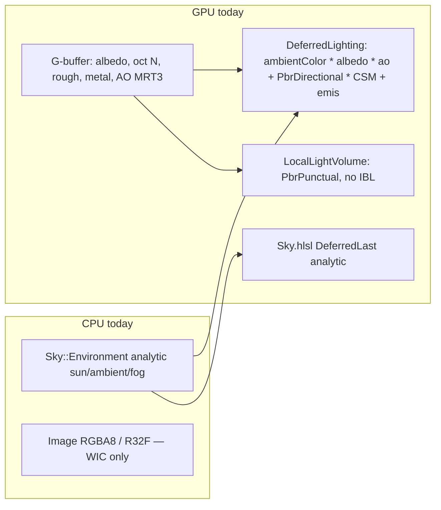
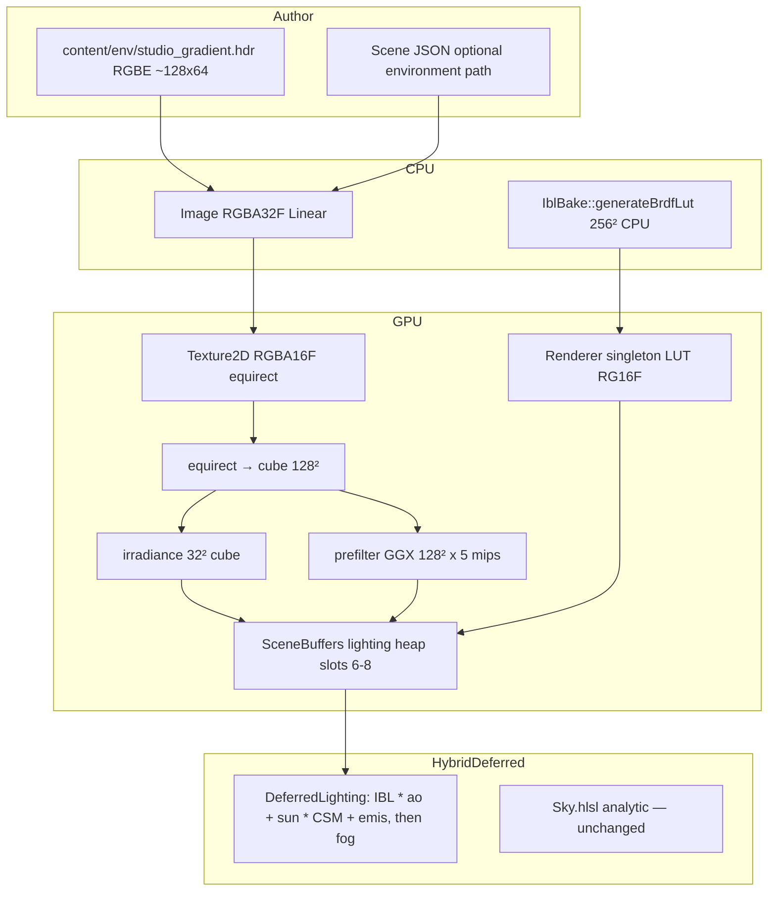
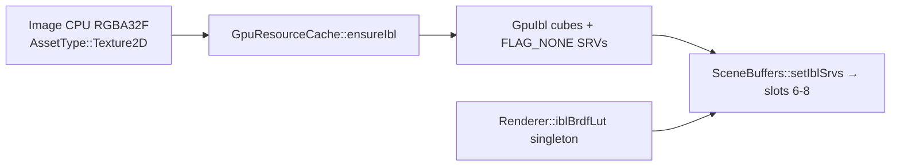
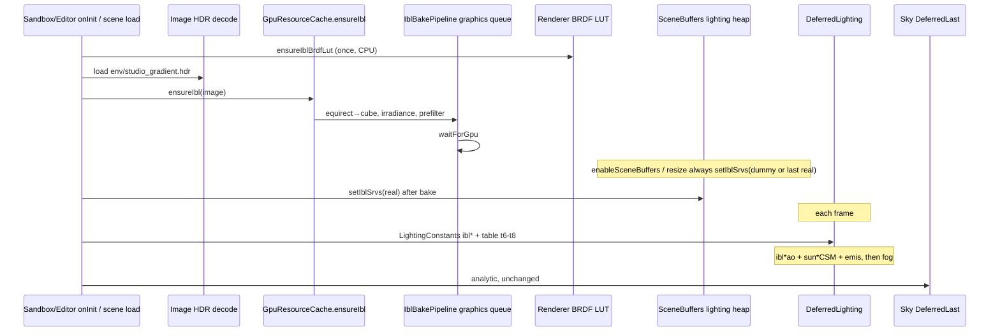

# Image-based lighting (split-sum IBL)

> **Replacement RFC.** Overwrites in-tree `Render/DESIGN-ibl.md` draft rev 1 (2026-09-17), which was not implementable (Asset-on-Renderer, EXR, compute, 64-sample irradiance, Filament multi-scatter energy, local-light IBL, no bind/heap/DWORD inventory, π mixed into the IBL wire-up). Spine kept: Karis split-sum, 32² / 128²×5 / 256² LUT, RGBA16F, graphics-queue bake, analytic sky stays.

| Field | Value |
|-------|--------|
| **Title** | Authored equirect HDRI as deferred ambient (Karis split-sum) |
| **Author** | TBD |
| **Date** | 2026-09-18 |
| **Status** | Draft (rev 2 — replaces sketch rev 1) |
| **Priority** | P0 — [DESIGN-pbr-roadmap.md](./DESIGN-pbr-roadmap.md) item 2 |
| **Area** | `Assets/Image.*`, `Render/Texture2D.*`, `Render/GpuIbl.*`, `Render/GpuResourceCache.*`, `Render/IblBake.*`, `Render/IblBakePipeline.*`, `Render/SceneBuffers.*`, `Render/DeferredLightingPipeline.*`, `content/shaders/DeferredLighting.hlsl`, `PbrLighting.hlsli`, `Ibl.hlsli`, `Sky/Environment.*`, Sandbox / Editor 3D hosts, `Scene/SceneFile.*`, UnitTests |
| **Audience** | Engine, Sandbox, Editor owners who already know this tree |
| **Depends on** | [DESIGN-color-management.md](./DESIGN-color-management.md) (**landed** — linear Rec.709, HDR `R16G16B16A16_FLOAT`). [DESIGN-pbr-material-maps.md](./DESIGN-pbr-material-maps.md) (**landed** — G-buffer AO MRT3, roughness/metallic in RT1). Does **not** depend on SSAO, auto-exposure, or SSR. |
| **Supersedes** | In-tree `DESIGN-ibl.md` rev 1. Color-management **C14** π-ownership (this stack’s **PR3**, *before* IBL is bound). Local-lights **L21** π sentence (same). |
| **Does not** | Convolve `Environment::evaluateSky` (v1.5). EXR / TinyEXR. Compute PSOs. `class EnvironmentMap : public Asset`. Filament multi-scatter energy. IBL in `LocalLightVolume.hlsl` / `-forward` / water / particles / sky / fog. Bindless. HDR10. |

---

## Overview

DarkEngine6’s HybridDeferred directional pass still fills the hemisphere with a **flat** `ambientColor * albedo * ao` (`content/shaders/DeferredLighting.hlsl`). Metals therefore have no environment specular; dielectrics have no directional skylight. Analytic `Sky::Environment` already drives the sun, CSM, fog, and the `Sky.hlsl` backdrop. Color management has landed (linear Rec.709). PBR maps have landed (authored AO in lighting-heap slot 5, roughness/metallic in RT1). The engine still has **no cubemaps, no Radiance `.hdr` loader, no float RGB Image format beyond `R32F` height, no compute PSOs, and no `AssetType` for environment maps**.

This RFC freezes **product model A**: one authored equirect HDRI is baked once into Karis 2014 split-sum IBL (irradiance cube + GGX prefiltered cube + BRDF LUT) and **replaces the deferred ambient term only**. Analytic sun + CSM stay. Analytic sky backdrop stays. Known mismatch: chrome reflects the HDRI, the backdrop is `Sky.hlsl`. Double-sun risk if the HDRI contains a blown disc — default content is a **sun-soft generated gradient**, not a 4K outdoor HDRI.

π energy (color-management C14) is a **separate PR in this stack, landed before IBL is bound**, so the IBL look change is readable. No C++ exceptions: `bool` + `DE_LOG_ERROR(LogCategory::Render, ...)` + `DE_ASSERT`.

---

## Background & Motivation

### What the tip actually does

Verified against the tree at time of writing.



| Piece | Location | Fact |
|-------|----------|------|
| Deferred ambient | `content/shaders/DeferredLighting.hlsl` ~107–109 | `lit = ambientColor * albedo.rgb * ao + PbrDirectional(...) * shadow + albedo * emissive * emissiveGain`. Then `FogIntegrate` / `ApplyLitFog`. |
| Lighting CB | `Render/DeferredLightingPipeline.h` `LightingConstants` | **46 floats**. `static_assert`. Last field `padFog`. |
| Lighting RS | `DeferredLightingPipeline.cpp` `create` | 5 params: 32-bit constants b0, table **t0–t3** (`NumDescriptors=4`), shadow CBV **b1**, height table **t4**, AO table **t5**. Static samplers **s0 point clamp, s1 comparison, s2 linear clamp** (`MaxLOD = FLOAT32_MAX`). |
| RS DWORD budget | same | `46 + 1 + 2 + 1 + 1 = 51` / 64. Headroom exists. |
| Lighting heap | `Render/SceneBuffers.h` | `kLightingCount = 6`: albedo 0, attrib 1, depth 2, shadow 3, height 4, AO 5. **SHADER_VISIBLE**. Height/AO GPU handles are **offsets into this heap**. `setShadowSrv` / `setHeightSrv` `CopyDescriptors` into it. |
| One CBV_SRV heap | `DeferredLightingPipeline::draw` | `SetDescriptorHeaps(1, { lightingHeap })`. D3D12 allows **one** CBV_SRV_UAV heap. A second IBL heap **cannot** be bound. |
| AO | `DeferredLighting.hlsl` `gAo t5`; `TerrainGBuffer.hlsl` `o.ao = 1` | Authored AO multiplies **ambient only**. Maps RFC M3 / M18: punctual must not multiply AO. |
| Local lights | `LocalLightVolume.hlsl` | `PbrPunctual` + windowed attenuation. RS binds AO at **t3** (`LocalLightVolumePipeline.cpp` `aoRange.BaseShaderRegister = 3`) but the **shader does not declare `gAo`** — unused bind, legal. **No IBL.** |
| GGX | `PbrLighting.hlsli` / `Render/PbrLighting.h` | Frostbite V form. `Fd = diffuseCol` **no `1/π`**. `DE_PBR_PI` exists; `Math::InvPi` exists on CPU. |
| π lock | `UnitTests/Render/PbrLightingTests.cpp` `DiffuseHasNoInvPi` | `n=l=v`, rough 1, metal 0 → `pbr.x > 0.7` and `> 1/π + 0.2`. |
| Forward Lambert | `BasicMesh.hlsl` ~80–81, `SkinnedMesh.hlsl` ~107–108, `Terrain.hlsl` ~94–95 | `ambientScale * albedo` + `ndotl * lightColor * albedo * shadow`. **No IBL. No π.** |
| Water | `Water.hlsl` `SkyColor` ~149–152 | `lerp(skyHorizon, skyZenith, saturate(dir.y*0.5+0.5))`. Body wrap `0.18 + 0.55*ndotl` (art, not Lambert). Local 8-light `PbrPunctual` loop. |
| Sky | `Sky.hlsl` | Analytic Rayleigh/Mie; comment requires visual match with `Environment::evaluateSky`. |
| Fog | `Fog.hlsli` `FogAmbientTerm` | `FogAlbedo * (0.70 + 1.7 * saturate(ambientColor))`. Uses `Environment` ambient, not IBL. |
| Environment | `Sky/Environment.cpp` ~117–119, ~208 | **+Y up, +X east, +Z north.** `m_ambientColor = (zenith*0.55 + horizon*0.45) * amb`. Sun disc in `evaluateSky` exceeds 1. |
| RotationY | `Math/Matrix4f.cpp` ~89–107 | Row-vector: `x' = x cos + z sin`, `z' = -x sin + z cos`. **+90° takes +X → −Z.** Rev 1’s “+X maps to +Z” is **wrong for this tree**. |
| Image | `Assets/Image.h` | `ImageFormat::RGBA8` or `R32F`. `createFromFile` is **WIC → 32bppRGBA** (`Image.cpp` `DecodeWicFrame`). WIC cannot load Radiance `.hdr`. `bytesPerPixel()` always returns 4. **No max dimension.** |
| Texture2D | `Render/Texture2D.cpp` | `MipLevels = 1`. SRV `TEXTURE2D`. `resolveTextureFormats` knows RGBA8 and R32F only. Upload uses a **private** command list + `Renderer::waitForGpu()`. No cubemap path. |
| TextureUsage | `Math/Color.h` | Albedo, Emissive, Normal, Orm, Data, Height, Hud, Font. **No Ibl.** Linear always wins. |
| AssetType | `Assets/AssetHandle.h` | Mesh, Texture2D, Material, Shader, Audio, Scene, Model, AnimationSet, AnimGraph, HsmGraph. **No EnvironmentMap.** |
| Cache | `Render/GpuResourceCache.h` | `ensureTexture` / `ensureMaterial` / `ensureModel`. Intern by `AssetID`. First `TextureUsage` wins. |
| Packed heap | `Render/PackedSrvHeap.h` | Generic. GpuMaterial 5 slots. Terrain 6. |
| Compute | engine `content/shaders/` | **Zero** `cs_5_0` / compute PSOs. Bloom / TAA / lighting are graphics. |
| Cubemaps | engine Render/ | **Zero** `TEXTURECUBE` / `DepthOrArraySize = 6` color targets. |
| Editor ambient | `Editor/EditorSpawn.cpp` `gatherEditorLighting` ~400–418 | Hardcoded `(0.22,0.22,0.22)` then last enabled `AmbientLightComponent` (`color * intensity`). |
| Sandbox env | `Sandbox/SandboxApp.h` `m_env` | Analytic `Sky::Environment` only. Lighting fill `SandboxApp.cpp` ~2581–2583 copies `m_env.ambientColor()`. |
| Scene JSON | `Scene/SceneTypes.h` `SceneFileData` | `version = 2`, `name`, `mode`, `objects`. **No environment field.** `SceneFile.cpp` `root.value("version", 1)`. |
| Local candela | `ECS/Components.h` `LocalLightComponent::intensity` | Struct default **600** (point). Spot spawn is **800** / range 16 (`EditorInternals.cpp` ~147–149, `SceneFile.cpp` `applyTypeLightDefaults` ~39–43). `SceneObjectData::lightIntensity` 600 until that helper runs. |
| Fog sun | `Fog.hlsli` `FogSunTerm` | `saturate(p.lightColor)` × albedo × phase. Uses `Environment::lightColor()` via lighting/sky CBs. Noon already ~1 (saturate hides a scale); twilight/moon is small and **would** ×π if storage were scaled. |
| Sky sun | `SkyPipeline.cpp` / `Sky.hlsl` | Copies `env.sunColor()` / `moonColor()` / `lightColor()` into the sky CB. `base += sunColor * (0.12 * ray + 0.35 * mieS)` — **no** saturate on `sunColor`. `evaluateSky` uses `m_sunColor` the same way. |
| Loading | `Core/Application.cpp` ~543–546 | Splash **host phase** calls `onInit()` then dwells. `LoadingScreen` has **no per-step progress callback** — phases Engine / Host / FadeOut only. |
| waitForGpu | `Render/Renderer.h` ~59 | “Drain the graphics queue (resource uploads, teardown).” Already used by `Texture2D::createFromRaw`. |
| Debug | `Render/DebugRenderState.h` | lighting, localLights, bloom, shadows, aces, motionBlur, taa, albedo A/B. **No iblEnabled / iblDebug.** |
| Content | `content/` | No `content/env/`. No `.hdr` files. |

Related RFC pointers this document **closes**:

- Color-management **C14** deferred `1/π` here. Rev 1 put π in “the same IBL PR” as the IBL term. **Wrong.** π is **PR3 of this stack**, bound-IBL is **PR4**. Two look changes stay separable.
- Local-lights **L21** already points at this RFC for π. Sibling one-liner in PR6: π = IBL-stack PR3, not “same PR as cubes.”
- Maps RFC: IBL consumes AO (lighting slot 5) and RT1 roughness/metallic. Maps do not add π. Terrain writes `o.ao = 1`.
- SSAO RFC: later multiplies the **same** IBL/ambient path. Not this cut.
- Reflections RFC: SSR composited with IBL specular later. Misses fall back to this prefiltered cube.

### Pain points

1. **Flat ambient.** Chrome is a grey ball. Dielectrics have no sky-colored fill once the sun is shadowed.
2. **No HDR loader.** WIC is 8-bit. Shipping a PNG “HDRI” would clip.
3. **No cubes.** First cubemap in the engine — RTV-as-array-slice, `TEXTURECUBE` SRV, and mips are all new.
4. **Energy.** Lambert without `1/π` cannot sit next to a cosine-weighted irradiance integral. Color-management left that on purpose.
5. **Two suns.** An outdoor HDRI plus analytic `Sky.hlsl` + CSM is a product bug unless v1 freezes HDRI-as-ambient-only and ships a sun-soft default.
6. **Rev 1 was not implementable.** `EnvironmentMap : public Asset` with `ensureBaked(Renderer&)` puts Renderer on an Asset. EXR needs TinyEXR. Compute does not exist. 64 irradiance samples at 32² is noise. “Matching Filament” for energy is a multi-scatter term we are not shipping. Local-light “optional specular IBL” would add a cube table to a RS already at **63/64 DWORDs**.

---

## Goals & Non-Goals

### Goals (v1)

- Load one Radiance `.hdr` equirect (RGBE) per process / scene, intern as a CPU `Image` (`RGBA32F`, Linear).
- Bake once on the **graphics** queue into irradiance 32² cube + prefiltered 128² cube with **5 mips** + a **renderer-singleton** BRDF LUT 256² `RG16F`. Cubes `R16G16B16A16_FLOAT`.
- HybridDeferred directional pass: `lit = ibl * ao + PbrDirectional * shadow + emissive` when IBL is ready **and** enabled; else legacy `ambientColor * albedo * ao + ...`.
- Authored G-buffer AO multiplies **both** IBL diffuse and IBL specular.
- Runtime **intensity** + **Y-rotation** knobs. Time-of-day may keep running; cubes **do not rebake** with it.
- Feature flag `iblEnabled`: default **off** until PR5 content exists; then default **on** for HybridDeferred when bake succeeded. Off / fail → legacy ambient. No throw.
- Debug `iblDebug = 0/1/2/3` (off / irradiance / prefiltered lod0 / LUT). ImGui in Editor and Sandbox DevTools.
- Named CPU unit tests. Chrome-ball is a **soak checklist**, not a gtest (no screenshot harness).
- No C++ exceptions.

### Non-goals (v1)

- Real-time convolution of `Environment::evaluateSky` (product **model B**, v1.5 — see Alternatives).
- EXR / TinyEXR / WIC HDR.
- Compute PSOs / first compute pipeline.
- `class EnvironmentMap : public Asset`. `ensureBaked` on an Asset.
- Filament multi-scatter energy compensation (`r * F_avg` / `energyCompensation`). Karis split-sum only.
- Multiple HDRIs blended. SH / irradiance SH. Parallax probes (reflections RFC).
- IBL on local lights, `-forward`, water, particles, sky backdrop, fog in-scatter.
- `R11G11B10_FLOAT` cubes (later soak).
- Checking in a 4K Poly Haven file.
- Bindless / texture arrays.
- SSAO, auto-exposure, SSR.

---

## Proposed Design

### End-to-end flow



### Frozen product model A (I0)

| Term | Source in v1 |
|------|----------------|
| Deferred **ambient / IBL** | Authored HDRI split-sum, if ready+enabled |
| Directional sun / moon | `Sky::Environment` (Sandbox) / `DirectionalLightComponent` (Editor) + CSM |
| Sky **backdrop** | `Sky.hlsl` analytic (`DeferredLast`) |
| Fog in-scatter ambient | `Environment::ambientColor()` as today |
| Local lights | Punctual GGX, **unchanged** |
| Time-of-day | May animate; **does not rebake** cubes |

**Known mismatch (document, do not “fix” in v1):** a chrome ball reflects the HDRI; the pixels around it are analytic sky. **Double-sun:** if the HDRI contains a bright disc, the ball shows a second sun that does not match CSM. Default content **must not** contain a blown disc.

**Intensity + Y-rotation are mandatory knobs.** They live on host `IblSettings`, not on `Sky::Environment`.

### Layering (I3) — do not put Renderer on an Asset



| Layer | Type | Rule |
|-------|------|------|
| CPU pixels | `Image` with `ImageFormat::RGBA32F` | Radiance `.hdr` RGBE decode. Linear tag, not defaulted. **No new `AssetType`.** |
| GPU cubes | `GpuIbl` interned in `GpuResourceCache` by Image `AssetID` | Same split as `Image` / `Texture2D` / `GpuMaterial`. |
| BRDF LUT | Renderer singleton | Generated **once** on first HybridDeferred init (CPU). **Not** per-environment. |
| Rejected | `class EnvironmentMap : public Asset` with `ensureBaked(Renderer&)` | Assets must not know `Renderer`. Rev 1 API is dead. |

`GpuResourceCache::ensureIbl(const AssetRef<Image>&)` bakes if missing / id mismatch via `GpuIbl::bake(m_renderer, ...)`. `m_renderer` is already a `Renderer*` (`GpuResourceCache.h`). Null renderer / null device → `false`. Missing / invalid Image → `false`, log, no throw. Do not invent a dummy `Renderer&`.

### Formats / sizes / samples (I2, I5)

| Resource | Size | Mips | Format | Samples |
|----------|------|------|--------|---------|
| Equirect CPU | authored, **cap 4096×2048** | n/a | `ImageFormat::RGBA32F` (A=1) | n/a |
| Equirect GPU (bake src) | same, converted F32→F16 | 1 | `R16G16B16A16_FLOAT` `TEXTURE2D` | n/a |
| Equirect→cube | **128²**, 6 faces | 1 | RGBA16F cube | bilinear sample of equirect |
| Irradiance | **32²**, 6 faces | 1 | RGBA16F cube | **1024** cosine-weighted (rev 1’s 64 is rejected) |
| Prefiltered specular | **128²**, 6 faces | **5** (`lod = roughness * 4`) | RGBA16F cube | **128** GGX importance (Karis, not VNDF) |
| BRDF LUT | **256²** | 1 | `R16G16_FLOAT` | **1024** CPU Hammersley |

`R11G11B10_FLOAT` is a later soak, **not v1**. Never `_SRGB` (color-management IBL row; strike `.exr` in PR6).

Mip 0 of prefilter = roughness 0; mip 4 = roughness 1. `iblMaxRoughnessMip = 4.0f`.

### Bake (I4) — graphics queue, no compute

The engine has **zero** compute PSOs. v1 bake:

1. CPU: decode `.hdr` → `Image` RGBA32F.
2. CPU: `IblBake::generateBrdfLut` → 256² RG float → upload `RG16F` Texture2D on the Renderer singleton (once).
3. GPU: upload equirect as `Texture2D` RGBA16F (`TextureUsage::Ibl`, Linear, `MipLevels=1`).
4. GPU: graphics PSO **equirect→cube**: 6 fullscreen draws, each bound to cube face RTV (`D3D12_RTV_DIMENSION_TEXTURE2DARRAY`, `FirstArraySlice = face`, `MipSlice = 0`).
5. GPU: graphics PSO **irradiance**: 6 draws, 32², 1024 cosine samples of the 128 cube.
6. GPU: graphics PSO **prefilter**: 6 faces × 5 mips, roughness = `mip / 4`, 128 GGX samples of the 128 cube **at lod 0** (no filtered cubemap fetch during bake in v1).
7. `Renderer::waitForGpu()`. Synchronous hitch is accepted.

`IblBakePipeline` owns those three PSOs + a **private** command allocator/list (same pattern as `Texture2D::createFromRaw`, **not** the frame list and **not** the lighting heap). Cube resources are created with `D3D12_RESOURCE_FLAG_ALLOW_RENDER_TARGET`, baked, then transitioned to `PIXEL_SHADER_RESOURCE` for the rest of process life.

**Bake descriptor / RTV layout (frozen — first cubemap path in the engine):**

| Resource | Owner | Layout |
|----------|-------|--------|
| RTV heap | `IblBakePipeline` | `FLAG_NONE`, **30** CPU descriptors (`6 faces × 5 mips`). `create()` **allocates the heap only** — cubes do not exist yet, so **no** `CreateRenderTargetView` at pipeline create. `GpuIbl::bake` calls `CreateRenderTargetView` **once per destination resource** after that cube is allocated (index `mip * 6 + face`). Equirect→cube: mip-0 RTVs on the **128** cube (slots 0–5). Irradiance: rewrite slots 0–5 onto the **32** cube (128 is an SRV by then). Prefilter: all 30 slots on the prefilter cube. **Not** per draw (do not CreateRTV inside the face loop). RTV desc: `D3D12_RTV_DIMENSION_TEXTURE2DARRAY`, `FirstArraySlice = face`, `ArraySize = 1`, `MipSlice = mip`. There is no `TEXTURECUBE` RTV. |
| Bake SRV heap | `IblBakePipeline` | `SHADER_VISIBLE`, **2** descriptors. Slot 0 = current source (equirect `TEXTURE2D` then 128 `TEXTURECUBE`). Slot 1 unused spare (or the 128 cube while slot 0 is still the equirect). `CopyDescriptors` from FLAG_NONE sources before the pass. |
| Root signature | `IblBakePipeline` | Param 0: 32-bit constants **4** DWORDs (`faceIndex`, `roughness`, `sampleCount`, pad). Param 1: one SRV table, `t0`, `NumDescriptors = 1`. Static sampler **s0** linear clamp (`MaxLOD = FLOAT32_MAX`). DWORD sum **4+1=5**. |
| `SetDescriptorHeaps` | bake `draw` | **`SetDescriptorHeaps(1, { bakeSrvHeap })`**. Never the frame lighting heap. Then `OMSetRenderTargets(1, rtv[mip*6+face])`, `DrawInstanced(3,1,0,0)`. |
| Submit | bake `flush` | `ExecuteCommandLists` + `Renderer::waitForGpu()` exactly as `Texture2D::createFromRaw`. |
| Product SRVs | `GpuIbl` | After transitions, FLAG_NONE **`TEXTURECUBE`** SRVs (`irradianceCpu` / `prefilterCpu`) for `CopyDescriptors` into lighting slots 6–7. |
| Transient equirect | bake locals | GPU `Texture2D` RGBA16F released when `bake` returns. Cap 4096×2048 RGBA16F ≈ 64 MB. Do not intern it in `GpuResourceCache`. |

Fullscreen VS is the same bit-trick triangle as `DeferredLighting.hlsl` (`clipXY` in NDC, Y up). Face direction is reconstructed **in the PS** from `faceIndex` + `clipXY` — not a `LookAtLH` vertex matrix (see Coordinates).

**CPU LUT is required** so unit tests do not need D3D. Optional CPU irradiance (tiny N, e.g. 8² × 64 samples) is allowed for `Ibl_Irradiance_UniformWhite_EqualsPi`. Product path is GPU.

**Loading-screen hook:** `Application::run` host phase already calls `onInit()` while splash is up (`Application.cpp` ~543–546). There is **no** per-step progress API. Frozen: bake inside Sandbox/Editor `onInit` (and on Editor scene load). Log `Ibl: baked '{}' ({}x{}) in {} ms`. If splash is disabled, accept the hitch. Do **not** add a progress callback in this RFC.

Null device / null renderer / failed PSO → `false`, `DE_LOG_ERROR`, leave `GpuIbl::isReady()==false`.

### Energy / 1/π (I8) — separate PR, then IBL

Color-management C14 deferred π here. **π is PR3 of this stack. IBL bind is PR4.** Do not land cubes on engine-unit diffuse.

**Punctual / directional (PR3):**

```hlsl
// PbrLighting.hlsli — AFTER PR3
float3 Fd = diffuseCol * (1.0f / DE_PBR_PI);
return (Fd * (1.0f - F) + Fr) * NdotL * lightColor;
```

Same in `Render/PbrLighting.h` (`Math::InvPi`). Host helper (same header, no exceptions):

```cpp
inline Math::Vector3f pbrSunLightColor(const Math::Vector3f& linearRgb)
{
    return linearRgb * Math::Pi; // Sandbox PBR/Lambert fills only. Never Environment storage, never Editor, never fog/water/sky.
}
```

Forward Lambert (`BasicMesh.hlsl`, `SkinnedMesh.hlsl`) — host already passed a π-scaled `lightColor` (Sandbox helper or Editor `color * intensity`):

```hlsl
float3 diffuse = ndotl * lightColor * albedo.rgb * shadow * (1.0f / DE_PBR_PI);
```

**Terrain is different.** `TerrainFrameConstants` is **60** DWORDs; RS is `60 + 1 + 2 = 63` / 64 (`TerrainPipeline.h`). **Cannot** add `pbrLightColor[3]`. `Terrain.hlsl` uses one `lightColor` for Lambert **and** `FogIntegrate`. Frozen: host fill stays **native** `env->lightColor()` (`Terrain/Terrain.cpp` ~271–273); Lambert applies π in the shader line; fog keeps the same native float3.

```hlsl
// Terrain.hlsl — cannot grow the CB. *π here only; FogParams.lightColor stays native.
float3 diffuse = ndotl * (lightColor * DE_PBR_PI) * albedo.rgb * shadow * (1.0f / DE_PBR_PI);
```

Water **wrap** `body * (0.18 + 0.55*ndotl)` is art, **not** Lambert — leave it. Water directional spec is `PbrDirectional(..., albedo=0, lightColor=0.85)` (`Water.hlsl` ~188) — **hardcoded 0.85, not `Environment::lightColor()`**. Do **not** retune 0.85. Water’s 8-light `PbrPunctual` loop **does** pick up `/π` and the new candela defaults.

**Irradiance cube units (frozen): convolution does NOT include 1/π.** The cube stores true irradiance \(E(n) = \int L_i(\omega)\,(n\cdot\omega)\,d\omega\). Cosine-weighted hemisphere, pdf \(= (n\cdot\omega)/\pi\):

```hlsl
// IblBakeIrradiance.hlsl (per sample)
float3 L = cosineSampleHemisphere(xi, n);
float3 Li = gSrcCube.SampleLevel(gLinear, L, 0).rgb;
E += Li;                 // pdf cancels NdotL / (NdotL/π) → ×π, applied once:
// after loop:
E *= DE_PBR_PI / float(sampleCount);
```

Uniform white \(L_i = 1\) ⇒ \(E = \pi\). Shader (PR4):

```hlsl
float3 irr = gIblIrradiance.Sample(gIblSamp, nRot).rgb;          // true E
float3 Fd  = albedo * (1.0f - metallic) * (1.0f / DE_PBR_PI);
float3 iblDiff = Fd * irr * ao;
```

A white Lambert under a white env of radiance 1 returns albedo. Debug view 1 shows true irradiance (not already-divided).

**Specular is Karis split-sum, not Filament multi-scatter:**

```hlsl
float lod = roughness * iblMaxRoughnessMip;
float3 pre = gIblPrefilter.SampleLevel(gIblSamp, rRot, lod).rgb;
float2 dfg = gIblBrdfLut.Sample(gIblSamp, float2(NdotV, roughness)).rg;
float3 iblSpec = pre * (F0 * dfg.x + dfg.y) * ao;   // no energyCompensation
```

Do **not** claim “matching Filament” for the energy term. Filament’s multi-scatter `1 + F0 * (1 / dfg.x - 1)` is an explicit **non-goal / follow-up**.

**Retune in PR3 (π on PBR/Lambert inputs, never on Environment storage, never on FogIntegrate’s float3):**

Do **not** mutate `Environment::m_sunColor` / `m_moonColor` / `m_lightColor`. Sky.hlsl has **no** saturate on `sunColor` (`base += sunColor * (0.12 * ray + 0.35 * mieS)`); `evaluateSky` uses the same stored color; `FogSunTerm` saturates `lightColor` (noon hides a scale, twilight/moon would not). ×π in `evaluate()` would triple the analytic corona and break I0. **PR3 must not edit** `Sky/Environment.cpp` color storage, `SkyPipeline.cpp`, `Sky.hlsl`, `Fog.hlsli`, or `WaterPipeline.cpp` `lightColor`.

`DeferredLighting.hlsl` copies **one** `LightingConstants.lightColor` into both `PbrDirectional` and `FogParams` today (~62 and ~108). Filling that field with ×π would scale twilight `FogSunTerm`. Frozen **option (a)** for deferred: extra `pbrLightColor[3]`. `lightColor` stays **native** for fog; `pbrLightColor = π * native` for `PbrDirectional`. (Option (b) — `*π` only in the deferred shader — would double-apply on Editor, where intensity is already π.)

**One π multiply, never two:**

| Path | How π lands | Fog / sky float3 |
|------|-------------|------------------|
| Sandbox HybridDeferred | `lc.lightColor = env.lightColor()` **native**; `lc.pbrLightColor = pbrSunLightColor(env.lightColor())` | Fog reads `lightColor` (native). |
| Sandbox `-forward` mesh | `MeshFrameConstants.lightColor = pbrSunLightColor(env.lightColor())` (no fog in `BasicMesh.hlsl`) | n/a |
| Sandbox `-forward` terrain | `Terrain.cpp` fill **native** `env->lightColor()`. `Terrain.hlsl` Lambert does `lightColor * DE_PBR_PI`. **Cannot** add a second float3 (RS 63/64). | `FogIntegrate` reads the same native `lightColor`. |
| Editor HybridDeferred + `-forward` | `DirectionalLightComponent::intensity` default **π**; `gatherEditorLighting` **unchanged** (`color * intensity`); fills copy gather `sunColor` into `pbrLightColor` / mesh `lightColor`. **No** `pbrSunLightColor` on Editor. Unauthored spawn `EditorSpawn.cpp` ~212: `1.0f` → `Math::Pi` (the component default alone is overwritten). | Editor `fogDensity = 0` (`EditorRender3D.cpp` ~389). Do not also ×π. |
| Water | **Do not** scale `WaterPipeline.cpp` `lightColor` (fog-only; wrap / 0.85 stay). | native |
| Sky | `SkyPipeline` still reads Environment storage. | native |

Invariant (comment + CPU test `PbrLighting_EditorSunMatchesSandboxPi`): `color * intensity(π)` equals `pbrSunLightColor(color)` for the same linear rgb — **never both** on one fill.

| Knob | Change | Why |
|------|--------|-----|
| Sandbox deferred `pbrLightColor` | `pbrSunLightColor(env.lightColor())` | Look-preserving sun after `Fd / π`. |
| Sandbox deferred / terrain / water `lightColor` | **Native** `env.lightColor()` | `FogIntegrate` / `FogSunTerm` must not see ×π. |
| Sandbox `-forward` mesh `lightColor` | `pbrSunLightColor(env.lightColor())` | No fog in that shader. |
| `Environment` stored sun/moon/light/ambient | **Unchanged** | Sky + `evaluateSky` + fog. |
| Point candela | **600 → 1885** | Preserve lantern vs sun. JSON 600 stays. |
| Spot spawn | **800 → 2513**; range 16 | `EditorInternals.cpp`, `applyTypeLightDefaults`. JSON 800 stays. |
| Editor `DirectionalLightComponent::intensity` default **and** `EditorSpawn.cpp` unauthored fallback | **1 → π** | `gatherEditorLighting` already `color * intensity`. Saved intensity 1 goes darker. |
| Forward `ambientScale` 0.22 | **Unchanged** | No IBL. |
| Water wrap / spec 0.85 / `WaterPipeline` `lightColor` | **Unchanged** | Fog-only env color; spec is hardcoded. |

**`-forward` sun:** Sandbox meshes = helper ×π at fill; Sandbox terrain = native fill + shader ×π on Lambert only; Editor = intensity π, no helper. `ambientScale` unchanged. No IBL.

Flip `PbrLighting.DiffuseHasNoInvPi` → `PbrLighting.DiffuseHasInvPi` (`pbr.x` near `1/π`, **not** `> 0.7`). `RoughDielectricMatchesLambertWithin15Percent` compares against `albedo * light * NdotL / π`.

### Bind layout (I6) — one lighting heap

D3D12: **one** CBV_SRV_UAV heap. Height and AO are already offsets into `SceneBuffers`’ lighting heap. IBL **cannot** be a second heap.

**Frozen: grow `kLightingCount` 6 → 9.** `setIblSrvs` copies three FLAG_NONE CPU handles, same pattern as `setShadowSrv`.

```
kLightingAlbedo      = 0
kLightingAttrib      = 1
kLightingDepth       = 2
kLightingShadow      = 3
kLightingHeight      = 4
kLightingAo          = 5
kLightingIblIrradiance = 6   // NEW  t6 TextureCube
kLightingIblPrefilter  = 7   // NEW  t7 TextureCube
kLightingIblBrdfLut    = 8   // NEW  t8 Texture2D
kLightingCount         = 9
```

Root signature (`DeferredLightingPipeline`):

| Param | Index | Cost | Contents |
|-------|-------|------|----------|
| 32-bit constants b0 | `kRootConstants = 0` | **56** | `LightingConstants` (46 + 2 pad + `pbrLightColor[3]` + 5 IBL) |
| table t0–t3 | `kRootSrvTable = 1` | 1 | albedo/attrib/depth/shadow |
| CBV b1 | `kRootShadowCbv = 2` | 2 | CSM receiver |
| table t4 | `kRootHeightSrv = 3` | 1 | height |
| table t5 | `kRootAoSrv = 4` | 1 | AO |
| table t6–t8 | **`kRootIblSrv = 5`** | 1 | 3 SRVs, `BaseShaderRegister = 6`, `NumDescriptors = 3` |

Static samplers unchanged (s0/s1/s2). IBL reuses **s2** (linear clamp, `MaxLOD = FLOAT32_MAX` — mips work). Cube SRVs are `TEXTURECUBE`.

**DWORD sum: `56 + 1 + 2 + 1 + 1 + 1 = 62` / 64.** Legal. `static_assert` the sum, not only `sizeof`. PR3 lands 2 pad floats + `pbrLightColor[3]` (46→**51**, RS `51+1+2+1+1=56`); PR4 lands the five IBL floats (51→**56**, +1 table → **62**).

**Packing hole:** tip register 11 is `heightWorldSizeZ` + `_padFog` + two empty slots (`DeferredLighting.hlsl` ~30–34). A HLSL `float3` that does not fit those two slots is **pushed to register 12**. C++ `float pbrLightColor[3]` right after `padFog` would land at indices 46–48; HLSL would read 48–50. Frozen: **two explicit pad floats** so `pbrLightColor` starts at float **48**; `float3 pbrLightColor; float iblIntensity;` share register 12. Do **not** use a bare `float3` immediately after `_padFog`. (Three HLSL scalars would keep 54; v1 picks the pad so the shader keeps a `float3`.)

`iblTableGpu()` = `lightingGpu + 6 * incr`. `draw()` always binds `kRootIblSrv` (the table offset exists as soon as the lighting heap is created).

**Dummy IBL SRVs — install at SceneBuffers create/resize, like fog height.** `packLightingHeap` today only copies shadow/height/AO when the remembered CPU handle `ptr != 0` (`SceneBuffers.cpp` ~358–363). Resize recreates the lighting heap (`Renderer.cpp` ~344–354) and re-applies height via `m_fogHeightDummy`. If IBL remembered handles start at 0, PR4’s extra table is unbound and the debug layer fires.

Frozen (mirror `m_fogHeightDummy`):

- `Renderer` owns `m_iblDummyCube` (black **2×2** RGBA16F cube, 6 faces, 1 mip) and `m_iblDummyLut` (black **1×1** `RG16F`) created at device init / first `enableSceneBuffers` (same site as the height dummy, `Renderer.cpp` ~647–654). FLAG_NONE CPU handles.
- `enableSceneBuffers` **and** resize always `setIblSrvs(last real if ready, else dummy cube / dummy cube / dummy lut)`.
- `SceneBuffers::setIblSrvs` remembers three handles like `m_shadowCpu` and `packLightingHeap` copies slots 6–8 whenever those handles are non-zero (**they are after init**).
- Host bake success patches via `setIblSrvs(gpuIbl.irradianceCpu(), gpuIbl.prefilterCpu(), renderer.iblBrdfLutCpu())` like `setShadowSrv`.
- Shader still early-outs the IBL **term** on `iblEnabled < 0.5`; debug views still sample the bound SRVs (black if dummy).

### LightingConstants (C++ / HLSL side by side)

Append-only after `padFog`. Do **not** insert in the middle. Do **not** place a HLSL `float3` in the two leftover slots of register 11.

Packed layout (float index = root-constant DWORD; register = HLSL 16-byte row):

| Float idx | Register | C++ / HLSL field |
|-----------|----------|------------------|
| 0–15 | 0–3 | `invViewProj` |
| 16–19 | 4 | `cameraPos` + `fogDensity` |
| 20–23 | 5 | `lightDirWS` + `lighting` |
| 24–27 | 6 | `lightColor` + `emissiveGain` (**native** RGB; fog) |
| 28–31 | 7 | `ambientColor` + `heightFogDensity` |
| 32–35 | 8 | `fogColor` + `heightFogFalloff` |
| 36–39 | 9 | `heightFogHeight`, `volumetricFogDensity`, `waterLevel`, `volumetricHeight` |
| 40–43 | 10 | `heightOriginX/Z`, `heightCellSize`, `heightWorldSizeX` |
| 44–47 | 11 | `heightWorldSizeZ`, `padFog`, **`padPbr0`, `padPbr1`** (fill .zw so the next `float3` does not straddle) |
| 48–51 | 12 | **`pbrLightColor` (.xyz) + `iblIntensity` (.w)** |
| 52–55 | 13 | `iblRotationRadY`, `iblMaxRoughnessMip`, `iblEnabled`, `iblDebug` |

```cpp
// Render/DeferredLightingPipeline.h — need <cstddef> for offsetof
struct LightingConstants
{
    float invViewProj[16];
    float cameraPos[3];
    float fogDensity;
    float lightDirWS[3];
    float lighting;
    float lightColor[3];
    float emissiveGain;
    float ambientColor[3];
    float heightFogDensity;
    float fogColor[3];
    float heightFogFalloff;
    float heightFogHeight;
    float volumetricFogDensity;
    float waterLevel;
    float volumetricHeight;
    float heightOriginX;
    float heightOriginZ;
    float heightCellSize;
    float heightWorldSizeX;
    float heightWorldSizeZ;
    float padFog;
    float padPbr0; // PR3 — occupy register 11.z
    float padPbr1; // PR3 — occupy register 11.w
    float pbrLightColor[3]; // PR3 — starts at float 48 = register 12.xyz
    float iblIntensity;        // PR4 — register 12.w
    float iblRotationRadY;
    float iblMaxRoughnessMip;
    float iblEnabled;
    float iblDebug;
};
static_assert(sizeof(LightingConstants) == 56 * sizeof(float), "lighting root constants");
static_assert(offsetof(LightingConstants, pbrLightColor) == 48 * sizeof(float), "float3 must start on a 16-byte boundary");
static_assert(offsetof(LightingConstants, iblIntensity) == 51 * sizeof(float), "iblIntensity shares register 12.w");
static_assert(56 + 1 + 2 + 1 + 1 + 1 <= 64, "deferred lighting RS DWORD budget");
```

```hlsl
// DeferredLighting.hlsl cbuffer LightingConstants : register(b0)
// existing 46 floats through _padFog (register 11.y), then:
float  _padPbr0;       // 11.z
float  _padPbr1;       // 11.w
float3 pbrLightColor;  // 12.xyz — π-scaled; PbrDirectional only
float  iblIntensity;   // 12.w
float  iblRotationRadY;
float  iblMaxRoughnessMip;
float  iblEnabled;
float  iblDebug;

TextureCube  gIblIrradiance : register(t6);
TextureCube  gIblPrefilter  : register(t7);
Texture2D    gIblBrdfLut    : register(t8);
// gHeightSamp is already s2 — reuse as gIblSamp
```

### Shading contract (I7)

After sun+CSM, **before** fog (match tip: light then `ApplyLitFog`).

```hlsl
float3 n = DecodeOct(attrib.rg);
float  roughness = attrib.b;
float  metallic  = attrib.a;
float  ao        = gAo.Load(int3(texel, 0)).r;
float3 v = normalize(cameraPos - worldPos);
float3 F0 = lerp(float3(0.04, 0.04, 0.04), albedo.rgb, metallic);

float3 nRot = IblRotateY(n, iblRotationRadY);
float3 r    = reflect(-v, n);
float3 rRot = IblRotateY(r, iblRotationRadY);

// Function scope — debug views must compile when iblEnabled is 0 (dummy SRVs are bound).
float3 irr = 0.xxx;
float3 pre = 0.xxx;
float2 dfg = 0.xx;
float3 ibl = 0.xxx;

irr = gIblIrradiance.Sample(gHeightSamp, nRot).rgb;
pre = gIblPrefilter.SampleLevel(gHeightSamp, rRot, saturate(roughness) * iblMaxRoughnessMip).rgb;
float NdotV = max(saturate(dot(n, v)), 1e-4f);
dfg = gIblBrdfLut.Sample(gHeightSamp, float2(NdotV, saturate(roughness))).rg;

if (iblEnabled >= 0.5f)
{
    float3 Fd   = albedo.rgb * (1.0f - metallic) * (1.0f / DE_PBR_PI);
    float3 spec = pre * (F0 * dfg.x + dfg.y);
    ibl = (Fd * irr + spec) * ao * iblIntensity; // AO on both lobes
}

float3 lit;
if (iblEnabled >= 0.5f)
    lit = ibl
        + PbrDirectional(n, v, albedo.rgb, roughness, metallic, lightDirWS, pbrLightColor) * shadow
        + albedo.rgb * emissive * emissiveGain;
else
    lit = ambientColor * albedo.rgb * ao
        + PbrDirectional(n, v, albedo.rgb, roughness, metallic, lightDirWS, pbrLightColor) * shadow
        + albedo.rgb * emissive * emissiveGain;

// Debug is gated on iblDebug only, not iblEnabled. Dummy cubes → black. Skip fog.
if (iblDebug >= 0.5f && iblDebug < 1.5f)
    return float4(irr, 1); // irradiance along nRot
if (iblDebug >= 1.5f && iblDebug < 2.5f)
    return float4(gIblPrefilter.SampleLevel(gHeightSamp, nRot, 0).rgb, 1);
    // lod0 along **nRot** (the cube itself), not rRot — not a reflection preview
if (iblDebug >= 2.5f)
    return float4(dfg.x, dfg.y, 0, 1);

FogResult fog = FogIntegrate(...);
return float4(ApplyLitFog(lit, fog), 1);
```

Optional: skip the three IBL samples when `iblEnabled < 0.5 && iblDebug < 0.5` for perf; debug **must** still sample when `iblDebug >= 0.5` even if IBL is off. Dummy SRVs keep the debug layer quiet either way.

`IblRotateY` is the **shader form of `Matrix4f::RotationY`** (row-vector):

```hlsl
float3 IblRotateY(float3 d, float rad)
{
    float s, c;
    sincos(rad, s, c);
    return float3(d.x * c + d.z * s, d.y, -d.x * s + d.z * c);
}
```

`MakeFogParams()` keeps `p.lightColor = lightColor` (native). Do **not** copy `pbrLightColor` into fog.

Local lights: **do not** sample IBL. Do **not** grow `LocalLightVolume` RS (already 63/64). Delete rev 1’s “optional specular only deferred” on local lights.

### Coordinates (I9)

Engine world: **+Y up, +X east, +Z north** (`Environment.cpp` ~117–119). D3D12 cube faces: +X, −X, +Y, −Y, +Z, −Z in array order 0–5.

**Equirect (Radiance, freeze):**

```
phi   = atan2(dir.x, dir.z)     // 0 = +Z north, +π/2 = +X east
theta = acos(clamp(dir.y, -1, 1))  // 0 = +Y
uv.x  = phi * (1/(2π)) + 0.5
uv.y  = theta * (1/π)            // image top = +Y
```

**Y-rotation:** `IblRotateY` / `Matrix4f::RotationY`. **`Ibl_RotationMatrix_Y90`:** +90° takes **+X → −Z** (rev 1 said +Z; that is not this matrix). Document in the test comment.

Cube-face look / up (D3D12 array order 0–5). These are **PS direction axes**, not a VS `LookAtLH` matrix. Engine is LH; `right = cross(up, look)`, `dir = look + clipX * right + clipY * up` with `clipXY` in NDC (Y up) from the fullscreen VS (same bit trick as `DeferredLighting.hlsl` — pass `clipXY`, do **not** reconstruct from `SV_POSITION.xy`, which is Y-down in pixels).

| Face | Index | Look | Up | `CubeFaceDir(clipXY, face)` |
|------|-------|------|-----|------------------------------|
| +X | 0 | +X | +Y | `( 1,  clipY, -clipX )` |
| −X | 1 | −X | +Y | `(-1,  clipY,  clipX )` |
| +Y | 2 | +Y | −Z | `( clipX,  1, -clipY )` |
| −Y | 3 | −Y | +Z | `( clipX, -1,  clipY )` |
| +Z | 4 | +Z | +Y | `( clipX,  clipY,  1 )` |
| −Z | 5 | −Z | +Y | `(-clipX, clipY, -1 )` |

```hlsl
// content/shaders/IblSampling.hlsli — also CPU in Render/IblSampling.h
float3 CubeFaceDir(float2 clipXY, uint face)
{
    float3 dir;
    if      (face == 0) dir = float3( 1.0f, clipXY.y, -clipXY.x);
    else if (face == 1) dir = float3(-1.0f, clipXY.y,  clipXY.x);
    else if (face == 2) dir = float3( clipXY.x,  1.0f, -clipXY.y);
    else if (face == 3) dir = float3( clipXY.x, -1.0f,  clipXY.y);
    else if (face == 4) dir = float3( clipXY.x,  clipXY.y,  1.0f);
    else                dir = float3(-clipXY.x, clipXY.y, -1.0f);
    return normalize(dir);
}
```

Face-center (`clipXY = 0`) is world **+X / −X / +Y / −Y / +Z / −Z**. Equirect→cube samples `gEquirect` at `dirToEquirectUv(CubeFaceDir(clipXY, face))`. Filament/GL often use **−Y** as up for ±X/±Z; **this RFC uses +Y** as in the table. The pair is only correct if the PS matches; the wrong pair mirrors the HDRI.

CPU golden tests (unique-color procedural equirect, no D3D): `sampleEquirect(CubeFaceDir(0, face=4)) == sampleEquirect(0,0,1)` (face **+Z** center); `sampleEquirect(CubeFaceDir(0, face=2)) == sampleEquirect(0,1,0)` (face **+Y** center).

### CPU Image / HDR load (PR1)

```cpp
enum class ImageFormat : uint8_t { RGBA8 = 0, R32F = 1, RGBA32F = 2 };

uint32_t Image::bytesPerPixel() const; // RGBA8=4, R32F=4, RGBA32F=16  — fix the always-4 bug
bool Image::createFromHdrFile(const std::filesystem::path& path);
bool Image::createFromHdrMemory(const void* bytes, size_t byteCount);
bool Image::createFromRgba32f(const float* rgba, uint32_t w, uint32_t h, uint32_t rowPitchBytes);
```

`createFromFile`: if extension is `.hdr` (case-insensitive), RGBE path; else WIC. `AssetManager::loadImage` therefore loads `.hdr` with no new intern type.

Radiance RGBE only (`FORMAT=32-bit_rle_rgbe` / `32-bit_rle_xyze` rejected if not RGBE). Support new-style RLE (`0x02 0x02`) and uncompressed. `#?RADIANCE` / `#?RGBE` magic. Resolution `-Y height +X width` (common). Other orientation tokens: load pixels, **do not** silently flip unless the token is the standard `-Y +X`; unknown layout → `false` + log.

**Caps (untrusted files):** width ≤ **4096**, height ≤ **2048**, file size ≤ **32 MB**, decode output bytes ≤ `4096*2048*16`. Failure → `false`, `DE_LOG_ERROR`, no throw, no giant alloc.

`setColorSpace(Linear)` on success, not defaulted. Never `_SRGB`.

`TextureUsage::Ibl` added to `Math/Color.h`; `inferColorSpaceForUsage` → Linear.

`resolveTextureFormats(Linear, RGBA32F)` → resource/srv/footprint `R16G16B16A16_FLOAT`. Upload converts F32→F16 (small IEEE helper in `Render/`, not a new library). `sRGB + RGBA32F` → `false`.

`createFromRaw` stays `MipLevels = 1` for 2D. Cubes are **not** `Texture2D`; they are `GpuIbl` resources.

### GpuIbl / cache

```cpp
struct IblBakeSettings
{
    uint32_t equirectToCubeSize = 128;
    uint32_t irradianceSize     = 32;
    uint32_t prefilterSize      = 128;
    uint32_t prefilterMips      = 5;
    uint32_t brdfLutSize        = 256;
    uint32_t sampleCountIrr     = 1024;
    uint32_t sampleCountPref    = 128;
    uint32_t sampleCountLut     = 1024;
};

class GpuIbl
{
public:
    // Pointer, not reference: UnitTests never construct a D3D Renderer (needs a Window).
    // Fail on !renderer || !renderer->device() — same real path as Texture2D::createFromRaw.
    bool bake(Renderer* renderer, const Image& equirect, const IblBakeSettings& = {});
    bool isReady() const;
    D3D12_CPU_DESCRIPTOR_HANDLE irradianceCpu() const; // FLAG_NONE TEXTURECUBE
    D3D12_CPU_DESCRIPTOR_HANDLE prefilterCpu() const;
    // LUT is NOT on GpuIbl
};

class GpuResourceCache
{
    bool ensureIbl(const AssetRef<Image>& hdrEquirect);
    GpuIbl* ibl(AssetID imageId) const;
    const Texture2D* defaultIblLut() const; // no — LUT is Renderer
    D3D12_CPU_DESCRIPTOR_HANDLE blackCubeCpu() const;
};
```

`Renderer` owns:

- `Texture2D m_iblBrdfLut` (RG16F, 256²) + `bool ensureIblBrdfLut()`.
- `m_iblDummyCube` (black 2×2 RGBA16F cube, 6 faces) + `m_iblDummyLut` (black 1×1 `RG16F`), created at the same site as `m_fogHeightDummy` (`enableSceneBuffers` / first HybridDeferred init).
- `enableSceneBuffers` and **resize** always `setIblSrvs(ready ? real : dummy)`. Host bake patches like `setShadowSrv`.
- `SceneBuffers::setIblSrvs(irr, pref, lut)` remembered like `m_shadowCpu` and re-copied in `packLightingHeap`.

### Host IblSettings (I10, I19)

**Not on `Sky::Environment`.** Environment stays celestial / weather.

```cpp
struct IblSettings
{
    std::string virtualPath = "env/studio_gradient.hdr";
    float intensity         = 1.0f;
    float rotationRadY      = 0.0f;
    bool  enabled           = false; // PR4 default; PR5 flips true when bake OK
};
```

Sandbox: `SandboxApp` member `m_ibl` next to `m_env`. Editor: `EditorApp` member, filled from scene JSON on load.

**AmbientLight when IBL ready+enabled: ignored for the deferred surface ambient term.** It does **not** become IBL intensity/tint. Intensity/rotation are `IblSettings`. AmbientLight still feeds:

- IBL-off fallback `LightingConstants.ambientColor`
- Fog (`ambientColor` in the same CB — still Environment/Editor ambient, not IBL)
- `-forward` `ambientScale`

### Scene JSON

No version bump (`SceneFileData::version` stays 2). Optional keys on the **root object** (next to `name` / `mode`):

```json
{
  "version": 2,
  "name": "untitled",
  "mode": "3d",
  "environment": "env/studio_gradient.hdr",
  "iblIntensity": 1.0,
  "iblRotationRadY": 0.0,
  "objects": [ ]
}
```

`iblRotationRadY` is **radians** (same unit as `LightingConstants.iblRotationRadY` / `IblSettings.rotationRadY`). ImGui sliders are **degrees** and convert on write. Do not store degrees in JSON — a round-trip that wrote 90 meaning degrees would yaw 57× too far.

Missing `environment` → engine default virtual path. Empty string → IBL off (legacy ambient). Unknown path → log, bake false, legacy ambient. 2D scenes ignore the keys.

### Downstream inventory (I10)

| Path | v1 rule |
|------|---------|
| HybridDeferred meshes + terrain G-buffer | **IBL.** Terrain already writes G-buffer (`o.ao = 1`, rough 1, metal 0). |
| Local lights `LocalLightVolume.hlsl` | **Unchanged punctual.** No IBL table (RS 63/64). AO bind stays unused. |
| `-forward` / `BasicMesh.hlsl` / `SkinnedMesh.hlsl` | **No-op IBL.** Keep `ambientScale` 0.22. Sandbox fill `pbrSunLightColor`; Editor fill = gather (`color * intensity`, default π). **No helper on Editor.** |
| `-forward` terrain `Terrain.hlsl` / `Terrain.cpp` | **No-op IBL.** Fill **native** `env->lightColor()` in `Terrain.cpp`. Lambert `* DE_PBR_PI` in the shader (CB cannot grow; RS 63/64). FogIntegrate native. |
| Water | Keep analytic `SkyColor`. Prefiltered cube is **follow-up**. Wrap `0.18+0.55*ndotl` **untouched**. Directional spec `PbrDirectional(albedo=0, light=0.85)` — **no π retune of 0.85**. **Do not** scale `WaterPipeline.cpp` `lightColor`. 8-light `PbrPunctual` loop follows candela `/π` (1885/2513). |
| Particles | **Skip.** |
| Fog | `FogParams.lightColor` is `LightingConstants.lightColor` / terrain `lightColor` — **native Environment**, not `pbrLightColor`. Do not sample IBL. **PR3 must not change `Fog.hlsli`.** The “unscaled” claim is this split, not a wish. |
| Sky pass | Analytic, **unchanged**. **PR3 must not change `Sky.hlsl` / `SkyPipeline.cpp` / `Environment` stored colors.** |
| Editor `gatherEditorLighting` / `AmbientLight` | `gatherEditorLighting` **unchanged**. Intensity default π + spawn fallback π. Fills copy gather; **no** `pbrSunLightColor`. When IBL ready+enabled, IBL replaces deferred ambient; AmbientLight ignored for that term. |
| Scene JSON | Optional `environment` virtual path; else engine default. |
| Sandbox `m_env` | Stays analytic sky. `IblSettings m_ibl` is a **separate** host member. |
| Bloom / TAA / MB / tonemap | Unchanged; they see HDR after lighting. HDRI peaks can bloom — default content is dim. |
| Overlay G-buffer tiles | Unchanged. IBL debug is the lighting PS `iblDebug`, not a new overlay tile. |
| Network | No GPU IBL on the wire. |

### Content (I11, I12)

Do **not** check in a 4K Poly Haven file.

Ship **`content/env/studio_gradient.hdr`**: generated Radiance RGBE, **128×64**, zenith `(0.12, 0.16, 0.22)`, horizon `(0.35, 0.38, 0.42)`, **no sun disc**, peak radiance **< 2**, CC0 / engine-generated. File is a few tens of KB.

Unit tests **generate a 16×8 (or 32×16) procedural equirect in memory** — no content-file fixture, no 4K.

Engine default virtual path: `env/studio_gradient.hdr`. If the file is missing at runtime: log, `enabled` effective false, legacy ambient. Optional in-memory generate of the same gradient as a last-resort bake source is allowed in PR5 (log once); tests always use in-memory.

`iblEnabled` default **off** in PR4. PR5: default **on** for HybridDeferred when bake succeeded. Off/fail → legacy ambient.

### Debug (I13)

`DebugRenderState`:

```cpp
bool  iblEnabled = false; // PR4; PR5 default true
int   iblDebug   = 0;     // 0 off, 1 irradiance, 2 prefiltered lod0, 3 LUT
```

Host `IblSettings.enabled` is AND-ed with `debugState.iblEnabled` and `GpuIbl::isReady()`. ImGui (Sandbox DevTools + Editor 3D): checkbox, intensity slider `[0, 4]`, rotation slider in **degrees** (stored **radians**; JSON `iblRotationRadY` is radians), debug combo, path text. Log once per edge. No per-draw logs. Debug views sample bound SRVs even when `iblEnabled` is off (dummy → black).

### Algorithms (cite, do not invent)

- **Karis, “Real Shading in Unreal Engine 4”, SIGGRAPH 2013** — split-sum, Hammersley, GGX importance sample, DFG LUT. **v1.**
- **Filament IBL chapter** — useful for cube sizes and LUT layout; **multi-scatter energy compensation is not v1.**
- Irradiance: cosine-weighted hemisphere, 1024 samples.
- Prefilter: Karis GGX (not VNDF), `v = n`, weight by `NdotL`, 128 samples.
- LUT: inputs \((N\cdot V, roughness)\) → \((scale, bias)\) for `F0 * scale + bias`.

Shared Hammersley / GGX sample in `Render/IblSampling.h` + `content/shaders/IblSampling.hlsli` (same numbers).

---

## API / Interface Changes

Covered above: `Image` RGBA32F + HDR load, `TextureUsage::Ibl`, `resolveTextureFormats` RGBA32F, `GpuIbl::bake(Renderer*)` (CreateRTV here), `GpuResourceCache::ensureIbl`, `IblBakeSettings` / CPU LUT, `IblBakePipeline` (30-slot RTV **heap** at create, views in bake), `LightingConstants` **56** floats (2 pad + `pbrLightColor` + IBL), `SceneBuffers` lighting 9 + `setIblSrvs`, `DeferredLightingPipeline::kRootIblSrv`, `IblSettings` on hosts, `DebugRenderState` flags, scene JSON `iblRotationRadY`, `PbrEvaluate` `/π` + `pbrSunLightColor` (Sandbox only) in PR3.

No `EnvironmentMap` class. No `AssetType` addition.

---

## Data Model Changes

- CPU `Image` grows a format; Images are not a persistence format.
- Scene JSON optional `environment` string, `iblIntensity`, **`iblRotationRadY` (radians)**; **version stays 2**.
- No glTF extension. No network payload.

---

## Frame integration



Per frame (HybridDeferred), after G-buffer, `bindHdr(false)`:

1. Fill `LightingConstants` including IBL fields.
2. `setIblSrvs` if the interned GpuIbl changed (usually no-op after first copy). Dummies already installed at `enableSceneBuffers` / resize.
3. `m_lighting.draw(...)` binds `kRootIblSrv`.
4. Local volumes as today.
5. Sky / water / particles as today.

---

## Alternatives Considered

### 1. Product model B — convolve `Environment::evaluateSky`

| | A. Authored HDRI (v1) | B. Analytic sky convolution |
|--|------------------------|-----------------------------|
| Backdrop vs reflection | **Mismatch** (documented) | Match |
| Double-sun | Risk if HDRI has a disc | None |
| Time-of-day | Cubes stale | Must rebake or accept stale |
| Content | One small `.hdr` | No file |
| Cost | Bake once | Bake every time-of-day change or hitch |

**Pick A for v1.** B is v1.5 / follow-up: CPU or graphics-queue bake of `evaluateSky` into the same `GpuIbl` slots, still no compute. Do not ship A+B together (two suns + two ambients).

### 2. `EnvironmentMap : public Asset` vs Image + GpuIbl

Rev 1 put `ensureBaked(Renderer&)` on an Asset. Assets cannot own GPU lifetime or a Renderer pointer (GpuMaterial already split this way). **Pick Image + GpuIbl intern.** Bake takes `Renderer*` so the null-renderer test is real.

### 3. Compute convolution vs graphics PS

Compute is the textbook path and would be the engine’s **first** compute PSO (root sig, UAV barrier, FL 11_0). **Pick graphics PS + RTV cube faces.** Hitch is the cost.

### 4. Bake 1/π into irradiance vs shader multiply

Baking `/π` makes debug view 1 look like “Lambert white.” Storing true \(E\) matches Karis/Filament docs and the uniform-white = π unit test. **Pick shader multiply** (I8).

### 5. Filament multi-scatter vs Karis

Multi-scatter restores energy at high roughness (white furnace). Extra LUT.A / shader term. **Non-goal.** Dielectrics go slightly dark at roughness 1 — accepted.

### 6. Second descriptor heap vs lighting-heap slots 6–8

Second CBV_SRV heap is illegal with the lighting heap already bound. **Pick grow lighting heap.**

### 7. IBL on local lights / water / forward

Local-light RS is **63/64**. Water is a sealed forward shader. `-forward` is Lambert rollback. **Skip.** Prefiltered cube on water is a follow-up.

### 8. AmbientLight as IBL intensity vs ignored

Using the entity as intensity/tint surprises Editor users who already have a 0.22 ambient fill. **Pick ignored for the IBL surface term**; knobs are `IblSettings`.

---

## Security & Privacy Considerations

This is a **local game engine**, not a web service. No network fetch of HDRIs. No auth.

- **Untrusted `.hdr`:** dimension cap 4096×2048, file 32 MB, decode-bytes cap. RLE that claims a huge scanline → `false` + log, no unbounded alloc.
- **No EXR / TinyEXR** — one less parser.
- **WIC path unchanged** for non-`.hdr`.
- **Fail closed:** missing file / bake fail / null renderer → legacy ambient, `iblEnabled` effective 0, black dummy SRVs. **No exceptions.**
- **No GPU heaps on the network.**

---

## Observability

| Signal | When | Volume |
|--------|------|--------|
| `DE_LOG_INFO(LogCategory::Render, "Ibl: baked '{}' ({}x{}) in {} ms")` | successful bake | Once per intern |
| `DE_LOG_ERROR(LogCategory::Render, "Ibl: failed to load '{}' — using ambient")` | missing / parse fail | Once |
| `DE_LOG_ERROR(LogCategory::Render, "Ibl: bake failed (null renderer / PSO)")` | GPU fail | Once; `isReady()==false` |
| `DE_LOG_INFO(LogCategory::Render, "Ibl: enabled={} debug={}")` | ImGui edge | Once per edge |
| `DE_LOG_INFO(LogCategory::Render, "PbrLighting: diffuse includes 1/π")` | n/a (test lock) | — |
| Frame spam | — | **Forbidden** |

PIX: cube resources named `DE.Ibl.Irradiance`, `DE.Ibl.Prefilter`, `DE.Ibl.BrdfLut`.

No new metric series.

---

## Risks

| Risk | Severity | Mitigation |
|------|----------|------------|
| Second CBV_SRV heap for IBL | **High** (bind fail / debug layer) | Lighting heap slots 6–8. Test `kLightingCount==9`. |
| RS DWORD overflow | **High** | 56+1+2+1+1+1=62. Terrain stays 60+1+2=63 (no extra float3). `static_assert`. |
| π + IBL in one PR | **High** (unreadable soak) | PR3 then PR4. |
| Double-sun HDRI | **High** (product) | Default gradient, no disc. Document mismatch. Intensity knob. |
| 64-sample irradiance noise | **Medium** | Frozen 1024. |
| Bake hitch | **Medium** | Host-phase `onInit`; log ms; accept. |
| TYPELESS / `_SRGB` on HDR | **High** | RGBA16F never `_SRGB`. Test `resolveTextureFormats`. |
| Unbound t6–t8 | **High** (debug layer) | Dummy cube+LUT created with `m_fogHeightDummy`; `enableSceneBuffers` / resize always `setIblSrvs`. |
| Bake binds lighting heap / no RTV heap | **High** | `IblBakePipeline` owns 30-slot RTV **heap** + 2-slot bake SRV heap; CreateRTV in `GpuIbl::bake`; `SetDescriptorHeaps` to bake heap only. |
| Cube face Y-flip / mirrored HDRI | **High** | Frozen `CubeFaceDir` + CPU golden +Z/+Y centers. Not `LookAtLH` VS. |
| `RotationY` test expects +X→+Z | **Medium** (wrong) | Freeze +X→−Z matching `Matrix4f`. |
| Environment sun×π blows Sky.hlsl | **High** | π only on lighting/`-forward` `lightColor` fill and DirectionalLight intensity. **Do not** mutate `m_sunColor`. |
| Ambient * π blows fog | **Medium** | Do **not** scale `m_ambientColor`. Spot 800 also ×π (2513). |
| Scaled `lightColor` in FogSunTerm | **High** | Deferred: native `lightColor` + `pbrLightColor`. Terrain: native fill, Lambert `*π` in-shader. WaterPipeline unscaled. |
| Local-light IBL | **High** (63+ would fail serialize) | Explicit non-goal. |
| Forward still no `/π` after PR3 | **Medium** | Inventory BasicMesh/Skinned/Terrain in PR3. |
| Missing `.hdr` throws | **High** | `bool` + log. Test `Ibl_LoadMissing_ReturnsFalse`. |
| 4K fixture in tests | **Low** | In-memory 16×8. |
| Chrome-ball as gtest | **Low** | Soak checklist only. |
| Water still analytic vs chrome | **Low** | Documented follow-up. |

---

## Rollout Plan

No AppConfig bit. Runtime flag is `DebugRenderState::iblEnabled` AND `GpuIbl::isReady()` AND HybridDeferred.

| PR | Look change | Mergable alone? |
|----|-------------|-----------------|
| 1 HDR load | No | Yes |
| 2 LUT + cubes bake (unbound) | No | Yes |
| 3 `1/π` + retune | **Yes** (sun preserved via `pbrLightColor` / Editor intensity π / terrain shader ×π; fog/sky native; IBL-off ambient darker; old JSON 600/800 darker; new 1885/2513) | Yes — **must land before PR4** |
| 4 Bind IBL, flag default off | Only when enabled | Depends on PR2+PR3 |
| 5 Content + knobs, default on | Product IBL on | Depends on PR4 |
| 6 Docs | No | Anytime after review |

Rollback: uncheck `iblEnabled` or revert PR4; PR3 π stays (intentional energy fix). Reverting PR3 without reverting PR4 would double-darken IBL — do not.

Changelog PR3: “Lambert/GGX diffuse now includes 1/π; deferred `pbrLightColor` is ×π (Sandbox helper) while `lightColor` stays native for fog; Editor sun is intensity π (`gatherEditorLighting` unchanged, spawn fallback π) — never helper+intensity; terrain Lambert ×π in-shader; Sky/fog/water env color unchanged; new point 1885 / spot 2513; IBL-off ambient darker; saved JSON 600/800 and intensity-1 editor suns go darker.” Changelog PR5: “HybridDeferred uses IBL from `content/env/studio_gradient.hdr`; analytic sky backdrop unchanged.”

---

## Open Questions

None that block implementation. I0–I15 were accepted in consultation; I16–I27 freeze tree facts. Change with a one-line RFC amendment if soak disagrees.

| Topic | Frozen default | Why it is not a question |
|-------|----------------|--------------------------|
| Product model | A (HDRI ambient only) | User-locked. B is Alternatives. |
| Split-sum | Karis 2014, no Filament multi-scatter | Energy term cited honestly. |
| π | PR3 before bind; **one multiply**: `pbrLightColor` / Editor intensity / terrain Lambert shader. Native `lightColor` for fog. Never Environment storage. | C14 + FogSunTerm + Editor π². |
| Irradiance units | True \(E\), shader `/π` | Uniform-white test. |
| Heap | Lighting slots 6–8 | One CBV_SRV heap. |
| AmbientLight | Ignored for IBL surface term | Knobs on `IblSettings`. |
| Default HDRI | Generated 128×64 gradient, no sun | I11. |
| RotationY +90° | +X → −Z | `Matrix4f::RotationY`. |

---

## Acceptance tests

### Unit (CPU)

| Test | Expected |
|------|----------|
| `Image_Hdr_RgbE_1x1` | In-memory RGBE 1×1 with known mantissa/exponent → RGBA32F linear within 1e-3. `colorSpace==Linear`. |
| `Image_Hdr_LoadMissing_ReturnsFalse` | Missing path → `false`, no throw. |
| `Image_Hdr_RejectsOversize` | Header `-Y 8192 +X 8192` or file > 32 MB → `false`, no giant alloc. |
| `Image_Hdr_RejectsExrExtension` | `.exr` bytes → not decoded as HDR; `createFromFile` WIC fails → `false`. |
| `Image_BytesPerPixel_Rgba32f` | `RGBA32F` → 16. `RGBA8`/`R32F` still 4. |
| `TextureFormats_LinearRgba32f` | `resolveTextureFormats(Linear, RGBA32F)` → RGBA16F / RGBA16F / RGBA16F, `true`. |
| `TextureFormats_SrgbRgba32f_Fails` | `false`, no throw. |
| `Ibl_BrdfLut_Rough0_Edge` | LUT(`NdotV≈1`, `r≈0`).g near 0, .r near 1 (tol 0.05). CPU generator. |
| `Ibl_BrdfLut_Rough1` | All finite, channels in `[0, 1.05]`. |
| `Ibl_PrefilterMipCount` | `settings.prefilterMips == 5`, `maxRoughnessMip == 4`. |
| `Ibl_RotationMatrix_Y90` | `IblRotateY(+X, +π/2) == −Z` within 1e-5. Comment: matches `Matrix4f::RotationY`; **not** +Z. |
| `Ibl_EquirectUv_PosZ` | dir `(0,0,1)` → `uv.x ≈ 0.5`, `uv.y ≈ 0.5`. dir `(0,1,0)` → `uv.y ≈ 0`. |
| `Ibl_CubeFaceDir_PosZCenter` | `CubeFaceDir((0,0), face=4)` == `(0,0,1)`. Unique-color CPU equirect: `sampleEquirect(that dir) == sampleEquirect(0,0,1)`. D3D array slice 4. |
| `Ibl_CubeFaceDir_PosYCenter` | `CubeFaceDir((0,0), face=2)` == `(0,1,0)`. Same fixture: matches `sampleEquirect(0,1,0)`. Comment: +Y up for ±X/±Z, **not** Filament −Y. |
| `Ibl_Irradiance_UniformWhite_EqualsPi` | CPU convolve Li=1, N=+Y, ≥64 cosine samples → `E ≈ π` within 10%. |
| `Ibl_DiffuseEnergy_WhiteLambert` | `(albedo/π) * E` with E from previous ≈ albedo within 10%. |
| `Ibl_LoadMissing_ReturnsFalse` | `ensureIbl` empty ref / missing file → `false`, no throw. |
| `Ibl_Bake_NullRenderer_ReturnsFalse` | `GpuIbl::bake(nullptr, image)` → `false`, `isReady()==false`, no throw. Also `!renderer->device()`. Pointer API; do not fake a `Renderer&`. |
| `PbrLighting_DiffuseHasInvPi` | **Replaces** `DiffuseHasNoInvPi`. `n=l=v`, rough 1, metal 0, albedo 1, light 1 → `pbr.x` near `1/π` (±0.08), **not** `> 0.7`. |
| `PbrLighting_RoughDielectricMatchesLambertWithin15Percent` | Lambert oracle is `albedo * light * NdotL / π`. |
| `SceneBuffers_LightingCount_Ibl` | `kLightingCount==9`, `kLightingIblIrradiance==6`, `kLightingIblBrdfLut==8`. |
| `LightingConstants_Size` | PR3: `sizeof == 51 * 4`, `offsetof(pbrLightColor)==48*4`. PR4: `sizeof == 56 * 4`, `offsetof(iblIntensity)==51*4`, RS sum `<= 64`. Updates `UnitTests/Render/FogTests.cpp` (today `EXPECT_EQ(..., 46u * sizeof(float))`). |
| `PbrLighting_EditorSunMatchesSandboxPi` | `pbrSunLightColor(rgb)` equals `rgb * π`. Comment: Editor fill is `color * intensity(π)`, never also the helper. |
| `IblSampling_Hammersley_First` | `hammersley(0, 1024) == (0, 0)` (or documented radical-inverse 0). |
| `Color_InferUsage_Ibl` | `TextureUsage::Ibl` → Linear. |

### Visual / soak (not gtest)

- **Chrome ball:** unit sphere, metallic 1, roughness 0, HybridDeferred, IBL on, default gradient. Ball shows environment; **not** flat `ambientColor`. Toggle IBL off → grey fill.
- **Rough dielectric:** roughness 1, metallic 0 — irradiance-colored fill, no sharp mirror.
- **AO:** a glTF with dark AO darkens IBL (diffuse **and** specular) in creases; sun term unaffected.
- **Rotation:** slider 90° yaws the reflection; matches `Ibl_RotationMatrix_Y90`.
- **Intensity 0:** IBL contribution ≈ 0; sun/CSM remain.
- **Debug 1/2/3:** irradiance / prefilter lod0 / LUT visible on the G-buffer mesh silhouette.
- **Analytic sky:** backdrop still `Sky.hlsl`; time-of-day still moves the sun disc; cubes do not change.
- **Double-sun:** default content has **no** second disc on chrome.
- **`-forward`:** no IBL; Lambert `/π` after PR3. Sandbox mesh sun = helper; Sandbox terrain = native fill + shader ×π; Editor = intensity π, no helper. AmbientScale 0.22 unchanged. Saved Editor intensity 1 goes darker.
- **Fail closed:** rename the `.hdr` → log, ambient fallback, no crash.
- **Editor AmbientLight:** with IBL on, sliding AmbientLight intensity does **not** change deferred fill; IBL intensity slider does.

### Negative

| Case | Expected |
|------|----------|
| Bake null renderer / device lost | `false`, log, no throw |
| Unsupported file (PNG named `.hdr`, truncated RGBE) | `false`, log |
| `iblEnabled` on, bake not ready | shader uses legacy ambient; dummy SRVs bound |
| try/catch/throw in the diff | **forbidden** (`Agents.md`) |

---

## Key Decisions

| ID | Decision | Rationale |
|----|----------|-----------|
| **I0** | Product **model A**: authored HDRI **replaces deferred ambient only**. Analytic sun+CSM and `Sky.hlsl` stay. Document chrome-vs-backdrop mismatch and double-sun risk. Default content is sun-soft. | User-locked. Model B (`evaluateSky` convolve) is v1.5. |
| **I1** | Karis 2014 split-sum. Filament multi-scatter energy is a **non-goal**. Do not claim “matching Filament” for energy. | Honest citation. Extra LUT.A out of v1. |
| **I2** | Irradiance 32², prefilter 128² **5 mips**, LUT 256² `RG16F`, cubes **RGBA16F**. `R11G11B10` later. | Rev 1 sizes kept; format frozen. |
| **I3** | CPU `Image` RGBA32F; GPU `GpuIbl` in `GpuResourceCache`; BRDF LUT **renderer singleton**. **`EnvironmentMap : public Asset` rejected.** | Same split as Material/GpuMaterial. Assets must not see Renderer. |
| **I4** | Graphics-queue PS convolution + `waitForGpu`. CPU LUT required. **No compute.** Hitch OK. Bake owns a **30-slot FLAG_NONE RTV heap** (allocated empty at `IblBakePipeline::create()`; `CreateRenderTargetView` in `GpuIbl::bake` once cubes exist) and a **2-slot SHADER_VISIBLE SRV heap**. RS = 4 constants + 1 SRV table + static linear sampler. `SetDescriptorHeaps` to the **bake** heap, never lighting. | Cubes are allocated in `bake`, not pipeline `create()`. |
| **I5** | Irradiance **1024** samples, prefilter **128**, LUT **1024**. Rev 1’s 64 is too noisy at 32². | Frozen numbers. |
| **I6** | t6/t7/t8, reuse s2. `LightingConstants` = **56** floats (46 + `padPbr0/1` + `pbrLightColor[3]` + 5 IBL). `pbrLightColor` at float **48** (register 12). RS **62/64**. | A HLSL `float3` after `_padFog` would skip two slots and mis-bind. |
| **I7** | `lit = ibl * ao + PbrDirectional * shadow + emis` when ready+enabled; else legacy ambient. AO on **both** IBL lobes. Local lights **unchanged**. After sun, before fog. `irr`/`pre`/`dfg` at **function scope**; `iblDebug` samples bound SRVs even when `iblEnabled` is 0. Debug 2 is prefilter lod0 along **nRot** (cube itself), not `rRot`. | Maps M3/M18. Local-light RS cannot grow. Contract shader must compile. |
| **I8** | π is **PR3**, before IBL bind. `Fd *= 1/π`. True E in the irradiance cube. **Do not** mutate Environment storage. **One multiply:** Sandbox deferred `pbrLightColor = pbrSunLightColor(env)` and native `lightColor` for fog; Sandbox mesh fill uses the helper; Sandbox terrain fill native + Lambert `*π` in-shader (CB 63/64). Editor: intensity default **and spawn fallback** π, `gatherEditorLighting` unchanged, **no** helper on Editor fills. Point 1885, spot 2513. Do not scale `WaterPipeline` `lightColor`. Sky/Fog.hlsli unchanged. | Fill-site ×π on the fog float3 scales twilight `FogSunTerm`. Editor intensity π **and** helper is π². |
| **I9** | +Y up, +X east, +Z north. Equirect `atan2(x,z)` / `acos(y)`. Y-rotation = `Matrix4f::RotationY` (**+X → −Z** at +90°). Cube faces: frozen `CubeFaceDir(clipXY, face)` PS reconstruction (LH, +Y up for ±X/±Z), **not** a `LookAtLH` VS. CPU golden +Z/+Y centers. | Tip sky + matrix. Rev 1 test expected +Z — wrong. Face cameras without a PS dir would mirror the HDRI. |
| **I10** | Downstream table frozen (this RFC). AmbientLight **ignored** for IBL surface term. `IblSettings` on host, **not** on `Environment`. | User inventory + I19. |
| **I11** | No 4K Poly Haven. Ship `content/env/studio_gradient.hdr` ~128×64 generated, no sun disc. Tests use in-memory tiny equirect. | Hitch + repo size + double-sun. |
| **I12** | `iblEnabled` default **off** until PR5; then on when bake OK. Fail → ambient. No exceptions. | Soak flag. |
| **I13** | `iblDebug` 0/1/2/3. ImGui Editor + Sandbox. | User-locked. |
| **I14** | Named CPU tests. Chrome-ball is soak, not gtest. `bake(Renderer*)` null / no device → false. | No screenshot harness. `Renderer&` cannot be null. |
| **I15** | Local engine: HDR size caps, fail closed, no network, no exceptions. | Honest threat model. |
| **I16** | **Lighting heap 6→9** (slots 6–8). Not a second CBV_SRV heap. Dummy black 2×2 cube + 1×1 LUT owned by Renderer like `m_fogHeightDummy`; `enableSceneBuffers` **and resize** always `setIblSrvs(dummy or last real)`. `packLightingHeap` copies 6–8 whenever remembered handles are non-zero (they are after init). | `draw()` already binds one heap. Resize recreates it. |
| **I17** | Cosine irradiance stores \(E\); shader `Fd * irr` with `Fd` already `/π`. | Uniform-white = π test. |
| **I18** | AmbientLight does **not** become IBL intensity/tint. | Separate knobs. |
| **I19** | `SandboxApp::m_ibl` / Editor `IblSettings` beside `m_env`. Cubes do not rebake with time-of-day. | Environment stays celestial. |
| **I20** | Forward Lambert `/π` in PR3. Sandbox mesh sun = helper ×π at fill; Sandbox terrain = native fill + shader ×π on Lambert (no CB grow); Editor = intensity π, no helper. `ambientScale` unchanged. Water wrap, 0.85, and `WaterPipeline` `lightColor` untouched. | Terrain RS 63/64. Fog must see native `lightColor`. |
| **I21** | Scene JSON optional `environment` / `iblIntensity` / **`iblRotationRadY` (radians)**; **version stays 2**. ImGui is degrees only. | Compatible. Degrees in JSON would yaw 57× at “90”. |
| **I22** | First engine cubemaps: bake RTV **heap** 30 slots at `create()`; `CreateRenderTargetView` in `GpuIbl::bake` once cubes exist (128 mip0, then 32 mip0 rewrite, then prefilter 30). Product SRV `TEXTURECUBE`. Face dir = `CubeFaceDir` in the PS. | RTVs need the resource. Pipeline `create()` is too early. |
| **I23** | No IBL in fog, sky, particles, water v1, `-forward`. | Inventory. |
| **I24** | `Image::bytesPerPixel` must stop returning 4 for every format. | Tip bug, required by RGBA32F. |

---

## PR Plan

Independently **reviewable** slices. PR3 is a look change **without** IBL. PR4 is not useful on engine-unit diffuse — land PR3 first (I8). PR4 flag stays **off** so PR4 is soakable. PR5 flips default on.

### PR 1 — HDR `.hdr` load + float image/GPU upload + tests

- **Title:** `Image: Radiance RGBE .hdr load and RGBA32F GPU upload`
- **Files:** `Assets/Image.h/.cpp` (`ImageFormat::RGBA32F`, `bytesPerPixel`, `createFromHdrFile` / `Memory` / `createFromRgba32f`), `Assets/AssetManager.cpp` (`.hdr` via `createFromFile` branch), `Math/Color.h` (`TextureUsage::Ibl`), `Render/Texture2D.h/.cpp` (`resolveTextureFormats` RGBA32F → RGBA16F, F32→F16 upload), `UnitTests/Assets/ImageHdrTests.cpp` (new), `UnitTests/Render/TextureFormatTests.cpp`.
- **Depends on:** nothing (color-management already on tip).
- **Description:** RGBE parser with size caps. WIC path unchanged for non-`.hdr`. Linear tag. **No look change.** No cubes, no IBL bind, no exceptions.

### PR 2 — BRDF LUT (CPU) + cube resources + PS bake (unbound)

- **Title:** `Render: IBL split-sum bake (LUT, cubes) not yet bound`
- **Files:** `Render/IblSampling.h`, `content/shaders/IblSampling.hlsli` (`CubeFaceDir`, Hammersley), `Render/IblBake.h/.cpp` (CPU LUT + optional CPU irradiance), `Render/IblBakePipeline.h/.cpp` (3 graphics PSOs; **30-slot FLAG_NONE RTV heap allocated empty at `create()`**; **2-slot SHADER_VISIBLE bake SRV heap**; RS 4 constants + 1 SRV table; `SetDescriptorHeaps` to bake heap), `Render/GpuIbl.h/.cpp` (`bake(Renderer*)` **CreateRTV onto cubes here**), `Render/GpuResourceCache.h/.cpp` (`ensureIbl`), `Renderer` LUT singleton + **dummy 2×2 cube + 1×1 LUT** (same site as `m_fogHeightDummy`), `content/shaders/IblEquirectToCube.hlsl`, `IblIrradiance.hlsl`, `IblPrefilter.hlsl`, `UnitTests/Render/IblBakeTests.cpp` (new).
- **Depends on:** PR1.
- **Description:** Bake on graphics queue + `waitForGpu`. `CreateRenderTargetView` runs in `GpuIbl::bake` once the 128 / 32 / prefilter cubes exist (not at pipeline `create()`). CPU LUT tests (`Rough0_Edge`, `Rough1`). `Ibl_Bake_NullRenderer_ReturnsFalse` (`bake(nullptr, ...)`). `Ibl_RotationMatrix_Y90`, `Ibl_EquirectUv_PosZ`, `Ibl_CubeFaceDir_PosZCenter`, `Ibl_CubeFaceDir_PosYCenter`, `Ibl_Irradiance_UniformWhite_EqualsPi`. **No look change.**

### PR 3 — `1/π` on Lambert/GGX diffuse + Environment/candela retune

- **Title:** `PBR: Lambert/GGX diffuse includes 1/π; retune lighting lightColor and candela`
- **Files:** `content/shaders/PbrLighting.hlsli`, `Render/PbrLighting.h` (`Fd *= InvPi`, helper `pbrSunLightColor`), `content/shaders/BasicMesh.hlsl`, `SkinnedMesh.hlsl` (Lambert `/π`), `content/shaders/Terrain.hlsl` (Lambert `/π` **and** `* DE_PBR_PI` on the Lambert line), `content/shaders/DeferredLighting.hlsl` + `DeferredLightingPipeline.h` (`padPbr0/1` + `pbrLightColor[3]`, **51** floats, `PbrDirectional(..., pbrLightColor)`, `FogParams.lightColor` stays `lightColor`), `UnitTests/Render/FogTests.cpp` (size 46→51), `Sandbox/SandboxApp.cpp` (deferred: native `lightColor` + helper `pbrLightColor`; mesh forward: helper; **not** terrain fill), `Terrain/Terrain.cpp` (**native** `env->lightColor()`, no helper), `Editor/EditorRender3D.cpp` (copy gather into `pbrLightColor` / mesh `lightColor`; **no** helper), `Editor/EditorSpawn.cpp` unauthored directional intensity `1.0f` → `Math::Pi`, `gatherEditorLighting` **unchanged**, `ECS/Components.h` point 1885 + DirectionalLight intensity π, `Scene/SceneTypes.h` / `SceneFile.cpp` `applyTypeLightDefaults` (spot **2513** / point 1885), `Editor/EditorInternals.cpp` (same split), `UnitTests/Render/PbrLightingTests.cpp` (`DiffuseHasInvPi`, Lambert oracle `/π`, `EditorSunMatchesSandboxPi`). **Must not** edit `Sky/Environment.cpp` stored colors, `SkyPipeline.cpp`, `Sky.hlsl`, `Fog.hlsli`, `WaterPipeline.cpp` `lightColor`, or water `0.85` / wrap.
- **Depends on:** nothing from PR1/PR2 (can stack after either). **Must land before PR4.**
- **Description:** **Look change. No IBL term.** One π multiply: Sandbox helper on PBR/Lambert fills that do **not** feed fog; Editor intensity π only; terrain shader-side ×π because the CB cannot grow. Fog/Sky see native `lightColor`. New point 1885 / spot 2513. Flip `DiffuseHasNoInvPi`.

### PR 4 — Bind IBL into DeferredLighting (flag default off)

- **Title:** `Render: bind split-sum IBL in deferred lighting (default off)`
- **Files:** `Render/DeferredLightingPipeline.h/.cpp` (**56**-float CB, `kRootIblSrv`, 6 params), `content/shaders/DeferredLighting.hlsl` (function-scope `irr`/`pre`/`dfg`; debug independent of `iblEnabled`; `PbrDirectional` uses `pbrLightColor`; `_padPbr0/1` then `float3`+`iblIntensity` on register 12), `content/shaders/Ibl.hlsli` (rotate, evaluate), `Render/SceneBuffers.h/.cpp` (`kLightingCount=9`, `setIblSrvs`, `iblTableGpu`, `packLightingHeap` copies slots 6–8, `reset`), `Render/Renderer.cpp` (`enableSceneBuffers` / **resize** always `setIblSrvs(dummy or last real)`), `Render/DebugRenderState.h` (`iblEnabled` default **false**, `iblDebug`), Sandbox + Editor lighting fill (`IblSettings` fields, still default off), `UnitTests` constants/heap size.
- **Depends on:** PR2 (resources) **and PR3** (π). Independently reviewable. **Not useful without PR3.**
- **Description:** **Look change only when enabled.** Fail closed to ambient. AO on both IBL lobes. Local lights untouched. Dummy SRVs installed at create/resize so t6–t8 are never unbound.

### PR 5 — Default content + Editor/Sandbox knobs + debug views

- **Title:** `Content: default IBL HDRI, host knobs, debug views, default-on`
- **Files:** `content/env/studio_gradient.hdr` (new, generated 128×64), generator helper or checked-in tiny RGBE, `Sandbox/SandboxApp.h/.cpp` (`m_ibl`, onInit `ensureIbl`), `Sandbox/DevToolsPanel.cpp`, `Editor/` load/save `environment` / `iblIntensity` / **`iblRotationRadY`** (`Scene/SceneTypes.h`, `Scene/SceneFile.cpp`), Editor ImGui sliders (degrees UI, radians storage), `DebugRenderState::iblEnabled` default **true**, engine default path `env/studio_gradient.hdr`.
- **Depends on:** PR4.
- **Description:** Default-on HybridDeferred when bake OK. Missing file → ambient, log. Intensity/rotation/debug ImGui. Scene JSON optional keys, version stays 2, rotation **radians**. **Look change** for HybridDeferred (IBL fill + chrome). Analytic sky unchanged.

### PR 6 — Docs: overwrite DESIGN-ibl.md + sibling one-liners

- **Title:** `docs: DESIGN-ibl replacement RFC rev 2`
- **Files:** overwrite `Render/DESIGN-ibl.md` with this text; one-liners in `DESIGN-pbr-roadmap.md` (item 2 = rev 2), `DESIGN-color-management.md` C14 (“π is IBL-stack PR3, not the bind PR”), `DESIGN-local-lights.md` L21 / π paragraph (same), `DESIGN-pbr-material-maps.md` (IBL consumes AO/rough; π not maps), color-management IBL row strike **`.exr`**.
- **Depends on:** none (can land as Accepted draft once this text is consensus). Body is this document.
- **Description:** No code.
