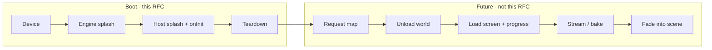

# Loading Screen System (Boot Splash)

| Field | Value |
|-------|--------|
| **Title** | Loading Screen System for DarkEngine6 |
| **Author** | TBD |
| **Date** | 2026-08-25 |
| **Status** | Draft (rev 4) |
| **Area** | `Render/` + `Core/Application` boot path |
| **Audience** | Engine, Sandbox, Sandbox2D, Editor owners |

---

## Overview

DarkEngine6 currently creates a visible Win32 window, initializes D3D12, then blocks inside host `onInit()` with **no present loop and no message pump**. That gap is a black/cleared HWND that the OS can mark as hung, and it is the entire first-run experience. This document proposes a **boot splash system** (not a world-streaming load screen): a dedicated, scene-independent D3D12 presenter that starts as soon as the device and swap chain exist, plays a two-phase sequence (engine splash → host splash), overlays version text, and keeps presenting animated frames while the rest of the engine and the host initialize.

Control flow is a **nested pump**, not a job scheduler: engine-dwell presents → **one** `onInit()` call (hosts re-enter `pumpBootFrame()` at checkpoints) → host-dwell presents → fade → teardown. Config and textures load **after** the first present. Skip keys zero remaining dwell; they never destroy GPU objects while `onInit` is still running.

The system is config-driven (`content/loading/*.json`), owned by a small `Render/LoadingScreen` subsystem, driven by `Application` (so Sandbox / Sandbox2D / Editor / VisualDebugger do not fork splash code), and torn down before the first gameplay frame. It is explicitly **not** a level loader; a later world-load screen can reuse the presenter, not the boot state machine.

---

## Background & Motivation

### Current boot path (what actually happens)

Construction and first present today (`Core/Application.cpp`, `Core/Window.cpp`, `Render/Renderer.cpp`):

```mermaid
sequenceDiagram
    participant WM as WinMain
    participant App as Application ctor
    participant Wnd as Window
    participant R as Renderer
    participant Host as Host::onInit
    participant Loop as Application::run

    WM->>App: SandboxApp{cfg}
    App->>Wnd: Window(title, w, h) WS_VISIBLE
    Note over Wnd: HWND is on-screen now
    App->>R: Renderer(window) → initD3D12()
    Note over R: device, queue, flip swapchain,<br/>RTVs, depth, fence
    App->>App: AudioSystem::create()
    App->>App: DE_LOG_INFO "DarkEngine6 v0.1"
    WM->>Loop: app.run()
    Loop->>Host: onInit()  (blocking, no PeekMessage, no Present)
    Note over Host: mount content, D3DCompile every PSO,<br/>terrain/water GPU upload, textures, audio
    Host-->>Loop: return
    Loop->>Loop: applyNetConfig / applyDebugConfig
    loop each frame
        Loop->>Wnd: pollEvents()
        Loop->>Host: onUpdate / onRender
        Loop->>R: present()
    end
```

Concrete facts from the tree:

| Step | Code | Notes |
|------|------|--------|
| Window is **visible immediately** | `Window::Window` uses `style \| WS_VISIBLE` (`Core/Window.cpp`) | User sees an empty client area before D3D ever presents |
| D3D12 comes up in the `Renderer` constructor | `Renderer::Renderer` → `initD3D12` | Swap chain is `DXGI_FORMAT_R8G8B8A8_UNORM`, flip-discard, 2 buffers, `DXGI_SCALING_STRETCH` |
| Init **throws** on failure | `ThrowIfFailed` / `throw std::runtime_error` in `Render/Renderer.cpp` | Violates `Agents.md`. Process dies; no splash, no `initOk()`, WinMain always `return 0` |
| First `Present` is **after** `onInit` | `Application::run` | `pollEvents` / `beginFrame` / `present` never run during host init |
| `AppConfig.vsync` is unused | `Core/Application.h` | `Renderer::present()` hardcodes `Present(1, 0)`. `m_swapChainFlags` is only `DXGI_SWAP_CHAIN_FLAG_ALLOW_MODE_SWITCH` — no tearing |
| Version is a log string | `"DarkEngine6 v0.1 — starting up (D3D12)"` | No CMake `PROJECT_VERSION`, no git hash, no on-screen version |
| Content is not mounted until `onInit` | duplicated `mountContentRoots` in Sandbox / Sandbox2D / Editor | Shader compile can still find files via `resolveContentPath` (`Render/ShaderCompile.cpp`) without mounts. That helper also accepts **absolute** paths — splash must not use it raw (see K16) |
| Texture upload **stalls the graphics queue** | `Texture2D::createFromRGBA` → `queue()->ExecuteCommandLists` + `renderer.waitForGpu()` | Cannot overlap with an open frame command list |
| No engine font renderer | ImGui exists only in Editor / VisualDebugger (`Ui/ImGuiHost.cpp`) | Splash cannot depend on ImGui |
| Occluded `Present` | `ThrowIfFailed` uses `FAILED(hr)` | `DXGI_STATUS_OCCLUDED` (0x087A0001) is **success-severity**; `FAILED` is false, so it does **not** throw. Real fatals are `DXGI_ERROR_DEVICE_REMOVED` / `DEVICE_RESET` / `INVALID_CALL` |
| Minimize | `WM_SIZE` ignores `SIZE_MINIMIZED` (`Core/Window.cpp`) | `resize(0,0)` is not called. Flip-model Present on a minimized HWND is usually OK |

### How expensive is the freeze?

`SandboxApp::onInit` (`Sandbox/SandboxApp.cpp`) does, in order, on the **main thread with no presents**:

1. Mount `content/` (several candidate roots).
2. Bind input actions.
3. Load WAV / **start music** (`audio().setMusic`) — before any pipeline create.
4. `D3DCompile` + PSO create for mesh, terrain, water, sky, shadows, debug overlay — each via `compileShaderFromContent` (runtime HLSL, **no PSO disk cache**).
5. Generate 129×129 FBM heightmaps, splat, terrain + water GPU meshes.
6. `Texture2D` load of `textures/dark_engine_cube.png` through `AssetManager` / `TextureCache`.
7. ECS camera + cube, network callbacks.

Cold first run (shader compiler + large procedural terrain) is seconds. Subsequent runs are faster only because the OS file cache is warm — **there is no PSO cache**, so HLSL still compiles every process start. That is a first-class splash concern: the spinner must outlive shader compile.

Sandbox2D and Editor are shorter but still compile PSOs and upload meshes/textures before frame 1. VisualDebugger is ImGui-only and should usually skip branding.

### Pain points

1. **Hung-window risk.** `onInit` does not call `Window::pollEvents()`. Windows will ghost the HWND (“Not Responding”) if init exceeds a few seconds.
2. **No liveness signal.** Even if we eventually present, the user cannot tell the process is alive during PSO compile.
3. **Branding is a log line.** There is no engine splash, no host splash, no version on screen, no copyright.
4. **Hosts duplicate boot glue.** `mountContentRoots` is copy-pasted three times (and disagrees with `resolveContentPath`’s longer root list). Splash must not be copy-pasted four times.
5. **Renderer error path is an exception.** Splash cannot be the failure UI if `initD3D12` throws before `run()`.

---

## Goals & Non-Goals

### Goals

- Show an **engine splash** (DarkEngine6) for a configurable minimum wall-clock duration as soon as D3D12 can Present (clear, then spinner).
- Then show a **host splash** (Sandbox / Sandbox2D / Editor; VisualDebugger opt-in) with host name + version.
- Overlay **version information** (engine + host) on both phases.
- **Animate** every presented frame so the process is visibly alive.
- Drive look and timing from a **JSON config** plus textures, resolved with a **splash-only path helper** that refuses absolute paths and `..` (K16).
- Keep the **Win32 message pump and DXGI present** running during host init so the OS does not mark the app hung.
- **Fallback** if config/texture/shader is missing: solid clear color + version text + spinner — never a black hang.
- **Tear down** splash GPU resources only after `onInit` has returned, before the first gameplay frame.
- **Disable** for CI / automated tests / `-no-splash`.
- Hosts **register** identity; they do not fork splash rendering.

### Non-Goals (v1)

- World / level / streaming load screens (see [Relationship to future level loading](#architecture-boot-splash-vs-world-loading)).
- A general UI framework, Dear ImGui in the engine library, or TrueType text layout.
- HDR10 / wide-color splash (swapchain is 8-bit UNORM today).
- Uncapped tearing (`DXGI_SWAP_CHAIN_FLAG_ALLOW_TEARING` / `DXGI_PRESENT_ALLOW_TEARING`). `Present(0, 0)` is valid without it; it is not tearing.
- Video playback, particle splash, 3D logo scene.
- Localizing every string in v1 (config should still be UTF-8 and *ready* for later locale files).
- Background GPU work on a copy queue (called out as v1.1).
- Compile-on-worker / job-graph `onInit` (v1.1).
- Status verbs (`"Compiling shaders…"`) — spinner-only in v1 (K17).
- Shipping final marketing art (PR 4 ships a simple DE6 wordmark + host stubs; replace PNGs without a code PR).
- Fixing the engine-wide sRGB-vs-UNORM issue (textures are `R8G8B8A8_UNORM`; splash matches current lighting, does not invent a color space).

---

## Key Decisions

These are the proposed defaults. Remaining product questions are listed at the end.

| ID | Decision | Rationale |
|----|----------|-----------|
| **K1** | Boot splash is a **Render** subsystem (`LoadingScreen`) driven by **`Application`**, not by each host | One presenter, one pump, host-only data |
| **K2** | **Two-phase** sequence: engine splash → host splash. Collapse by setting host `minSeconds: 0` + empty image | Requested product; pump-only (no art) is the fallback, not the product (see Alt 4) |
| **K3** | **Minimum dwell** is wall-clock (`Window::getTime` / `steady_clock`), not frame count. Product defaults: **2.0 s engine + 1.5 s host**. JSON-overridable, clamped `[0, 30]` | Vsync vs `Present(0,0)` would otherwise change brand time; user-confirmed dwell |
| **K4** | Skip **zeros remaining dwell of the current phase**. It does **not** abort `onInit` and does **not** teardown GPU objects. Release: engine `minSeconds` is unskippable (JSON cannot override). `_DEBUG`: skip allowed for both phases (JSON cannot disable). `-no-splash` / `enabled: false` is the only path with **no** presenter | Branding vs iteration vs GPU lifetime |
| **K5** | **Nested pump only.** Engine-dwell loop → **one** `onInit()` → hosts call `pumpBootFrame()` → host-dwell loop → fade → teardown. No BootSlice scheduler, no 8–12 ms bound on `D3DCompile` | Job graph is out of scope; an outer slice that `beginFrame`s then calls `onInit` races `waitForGpu` uploads |
| **K6** | Dedicated splash PSO: **fullscreen triangle**, **depth off**, **no mesh**, modeled on `DebugOverlay` (`SV_VertexID`, `DrawInstanced(3,1,0,0)`) | Independent of ECS, Camera2D/3D, SpritePipeline |
| **K7** | **First Present as soon as `Renderer::isValid()`, before WIC.** Recommended: clear-only Present (no PSO) → `create()` (embedded compile) → engine dwell. Cheap **JSON-only** parse is allowed **before** `shouldShowSplash` (CPU, no GPU). Textures/disk PSO load **after** a Present, command list closed | Honors “start as soon as DirectX is active”; JSON `enabled`/`minSeconds` must be known before the dwell clock; `initD3D12` + debug layer + audio ctor still happen first |
| **K8** | Config is **JSON** (`content/loading/engine.json` + `<hostId>.json`). Parse with `nlohmann::json::parse(text, nullptr, false)`. Read with `contains` + `is_number` / `is_array` / `is_string` / `is_boolean` + `get_ptr` only — **never** `.get<T>()`, `.at()`, `value()`, or `operator[]` on a missing key | SceneFile’s `parse(..., false)` is safe; SceneFile’s `j[0].get<float>()` **and** nlohmann `value()` both **throw** on type mismatch (`"minSeconds": "fast"`) |
| **K9** | Version comes from a generated `Core/Version.h` (CMake project version + optional git hash) plus `AppConfig.hostName` / `hostVersion`. **`versionText.showGit` defaults true** (on-screen hash); JSON can set `false` | Replaces the hardcoded `"v0.1"` log string; hash is useful for bug reports |
| **K10** | **No audio by default** during splash. Optional sting is config, off. Hosts **must not** call `setMusic` / looping cues until `onSplashFinished()` (called after teardown **and** after `-no-splash` `onInit`; never on abort) | Sandbox currently `setMusic`s at the top of `onInit` — that would overlap the logo; skipping the hook would mute CI |
| **K11** | Splash **owns** its textures/PSOs; do **not** intern through `TextureCache` | Cache keeps entries until `collectUnused()`; we need deterministic teardown |
| **K12** | If `Renderer` init fails: **log + `initOk()==false` + WinMain returns 1**. No splash. Convert `Renderer` off exceptions in the same program of work. `present()` returns true for any `SUCCEEDED` (including `DXGI_STATUS_OCCLUDED`); false for `FAILED` (log `GetDeviceRemovedReason()` on removed) | Splash cannot exist without a device; occluded is not a throw today |
| **K13** | VisualDebugger **skips** splash by default (`AppConfig.showSplash = false`). Its `WinMain` **does** parse `-no-splash` / `-splash` | Tool, not a game; today it does not call `parseNetCommandLine` |
| **K14** | This is **boot splash only**. A future presenter can be extracted; no progress-bar semantics we cannot measure | Remaining-work is unknown |
| **K15** | **One content-root enumerator** (`Core/ContentRoots`) matching `resolveContentPath`’s list (exe/cwd + two- *and* three-level VS walks). `Application` mounts it **before** splash. Hosts may mount extras in `onInit` | Host copies omit two-level walks; splash JSON vs later `loadWav` would disagree |
| **K16** | Splash assets use a **restricted resolver**: refuse `is_absolute()`, refuse `..` segments, require weakly-canonical result inside a known content root. Log warn + fallback. Do not call `resolveContentPath` on JSON `image` strings | `resolveContentPath` accepts absolute paths today |
| **K17** | v1 is **spinner-only**. No `setStatus`, no status verbs | One-line font is for version + copyright; host strings are extra PR5 work |

### Flag / skip resolution (K4 detail)

**Whether splash runs** (first match wins):

1. Env `DE_NO_SPLASH` (any non-empty value) → off
2. CLI `-no-splash` → off
3. CLI `-splash` → on (even VisualDebugger / Editor Debug)
4. `AppConfig.showSplash == false` → off
5. JSON `enabled == false` (after **CPU-only** overlay merge via `tryLoadConfig`, before any Present) → off
6. else on

**Skip key** (Escape, left click, gamepad Start) while focused:

- Sets `remainingDwell[currentPhase] = 0`. Debounce 0.3 s after phase start.
- **Never** sets `m_running = false`. **Never** calls `shutdown`.
- Release + `Engine` phase: ignore skip (engine `minSeconds` forced).
- `_DEBUG`: always honor skip for the current phase (JSON `skipOnKey` cannot turn this off).
- Release + `Host` phase: honor skip (C++ default `skipOnKey = true`; omit the key from `engine.json` so JSON cannot fight this).

**Quit** (distinct from skip): `WM_CLOSE` / Alt-F4 / `shouldClose`. Teardown splash, **do not** `applyNetConfig` / `applyDebugConfig`, call `onShutdown` if `onInit` ran (including early-return), return from `run()`. During splash, Escape is skip, not quit (Sandbox binds Escape to quit only in the game loop).

**Editor configurability** uses this same order — **no Editor-only flag.** Defaults: Release Editor `showSplash = true` (PR 6); `_DEBUG` Editor `showSplash = false` (PR 5 `Editor/main.cpp`). Override examples:

| Want | How |
|------|-----|
| Release Editor, no splash | `-no-splash`, or `DE_NO_SPLASH`, or `enabled: false` in JSON, or `cfg.showSplash = false` in `Editor/main.cpp` |
| Debug Editor, force splash | `-splash` (beats `AppConfig.showSplash == false`) |

---

## Proposed Design

### Placement

```
Render/LoadingScreen.h / .cpp     presenter + animation + GPU resources
Render/LoadingScreenConfig.h/.cpp JSON schema + deep merge + restricted path resolve
content/shaders/LoadingScreen.hlsl  textured/animated path (disk; optional)
content/loading/engine.json         engine defaults (no host.image)
content/loading/<hostId>.json       host override
content/textures/loading/           logos (placeholders)
Core/Version.h.in → generated Version.h
Core/ContentRoots.h / .cpp          unified mount list (K15)
Core/Application.h/.cpp             nested boot pump, CLI, host registration
```

CMake already `GLOB_RECURSE`s `Render/*.cpp` into `DarkEngine` (`CMakeLists.txt` `DE_ENGINE_FOLDERS`). New files appear in the VS project on the next configure. HLSL under `content/shaders/` is already globbed as `HEADER_FILE_ONLY`. JSON/PNG ride along with existing `cmake/CopyContent.cmake` POST_BUILD copies for Sandbox, Sandbox2D, and Editor (VisualDebugger has **no** CopyContent today — fine while splash stays off).

`LoadingScreen` is a member of `Application` (next to `Renderer`), **not** of `Renderer`. Reasons:

- Lifetime: created after `Renderer` is ready, destroyed after `onInit` returns, must not pin `Renderer` internals.
- Resize / present / input policy lives in `Application::run` already.
- Host identity (`AppConfig`) is an Application concern.

`Renderer` still owns device, queue, swap chain, `beginFrame` / `endFrame` / `present`. Splash only records into the open command list.

### Boot state machine

v1 is **nested present**, not an outer job scheduler. `onInit` is called **once**. There is no `BootSlice`.

```mermaid
stateDiagram-v2
    [*] --> DeviceInit: Application ctor
    DeviceInit --> FatalExit: Renderer init failed
    DeviceInit --> ClearPresent: isValid — optional clear-only Present
    ClearPresent --> SplashCreate: compile embedded PSO
    SplashCreate --> EngineSplash: PSO ready (or clear-only fallback)
    EngineSplash --> EngineSplash: pumpSplashFrame while remainingDwell() > 0; WIC after Present
    EngineSplash --> HostSplash: remainingDwell() == 0 (min elapsed or skip)
    EngineSplash --> Skipped: splash disabled (flags / JSON)
    HostSplash --> HostOnInit: enter onInit once
    HostOnInit --> HostOnInit: pumpBootFrame nested presents
    HostOnInit --> HostDwell: onInit returned
    HostDwell --> HostDwell: pumpSplashFrame while remainingDwell() > 0
    HostDwell --> FadeOut: onInit returned AND remainingDwell() == 0
    HostOnInit --> FadeOut: forbidden
    note right of HostOnInit: skip key only zeros remaining dwell
    FadeOut --> Teardown
    Skipped --> HostInitBlocking: onInit as today
    HostInitBlocking --> Gameplay
    Teardown --> Gameplay: first host onRender
    HostOnInit --> Aborted: shouldClose during onInit
    HostDwell --> Aborted: shouldClose
    EngineSplash --> Aborted: shouldClose
    Aborted --> TeardownQuit: no applyNet / applyDebug
    TeardownQuit --> [*]
    FatalExit --> [*]
    Gameplay --> [*]
```



Phases:

1. **DeviceInit** — existing `Window` + `Renderer` construction. Debug layer (Debug) and `AudioSystem::create()` still run in the ctor before `run()`. No splash possible yet.
2. **JSON config (CPU)** — `tryLoadConfig()` (no WIC, no GPU). Supplies `enabled` and `minSeconds` for `shouldShowSplash` and the dwell clock. Not a Present.
3. **ClearPresent (recommended)** — `setClearColor` to splash `background` (C++ default `0.05, 0.05, 0.07` until JSON applied), `beginFrame` / `endFrame` / `present` with **no** splash PSO. First pixels as soon as `isValid()`, **before** `D3DCompile`.
4. **SplashCreate** — `create()`: compile embedded color/spinner HLSL, root signature + PSO, 1×1 textures. If compile fails, stay on clear-only frames.
5. **EngineSplash** — `setPhase(Engine)` starts the engine clock. `pumpSplashFrame()` while `remainingDwell() > 0`. **After each Present** (command list closed): `tryLoadAssets()` (WIC, optional disk shader). Missing art → keep procedural frame. **Do not** wait for a texture before leaving this phase. Skip / JSON `minSeconds` are picked up because `remainingDwell()` is re-evaluated every iteration.
6. **HostSplash / HostOnInit** — `setPhase(Host)` **starts the host clock**, then **one** `onInit()` call. Hosts yield with `pumpBootFrame()`. Skip key zeros remaining dwell only. Time spent in `onInit` **counts** toward host `minSeconds`.
7. **HostDwell** — after `onInit` returns, keep presenting while `remainingDwell() > 0`. If `onInit` already outran `minSeconds` (or skip ran), this loop is a no-op — **no extra** host dwell after a long init.
8. **FadeOut** — **only if** `onInit` has returned **and** `remainingDwell() == 0`. 0.15–0.3 s opacity lerp (skipped if reduced-motion).
9. **Teardown** — `waitForGpu()`, release PSO/textures/font atlas. If still running: `onSplashFinished()` then the game loop. On abort: `onShutdown` if `onInit` ran, **no** `onSplashFinished`, **no** net/debug.

**v1 cannot bound a single `D3DCompile` (or WIC decode) to 8–12 ms.** Yields happen *between* existing host steps. A cold compile can still exceed the Windows ghosting threshold; that is accepted (better than today’s entire `onInit`).

### Canonical `run()` sequence (the only control flow)

Dwell uses **one** predicate, re-evaluated every iteration: `remainingDwell() = max(0, minSeconds - (now - phaseStart))`. `skipCurrentPhaseDwell()` zeros it. `setPhase` records `phaseStart = now`. Do **not** capture `engineEnd` / `hostEnd` once.

```cpp
void Application::run()
{
    if (!m_renderer.isValid())
        return;

    mountDefaultContentRoots();                 // K15, CPU
    m_loading.tryLoadConfig(m_config);          // JSON only (K8/K16); no WIC. Feeds enabled + minSeconds.
    const bool splash = shouldShowSplash();     // K4: env / CLI / AppConfig / JSON enabled
    bool onInitRan = false;
    bool splashCreated = false;

    if (splash)
    {
        presentClearOnly();                     // K7: first Present, no PSO, no WIC
        splashCreated = m_loading.create(m_renderer); // embedded PSO + 1×1; compile is the second-Present path

        m_loading.setPhase(LoadingPhase::Engine); // starts engine clock (JSON minSeconds already applied)
        while (m_running && !m_window.shouldClose() && m_loading.remainingDwell() > 0)
        {
            if (!pumpSplashFrame())             // sets m_running = false on present failure
                break;
            m_loading.tryLoadAssets(m_renderer); // WIC / disk shader; never a phase gate
        }

        if (!m_running || m_window.shouldClose())
        {
            if (splashCreated)
                m_loading.shutdown(m_renderer);
            return;                             // no onInit, no onSplashFinished, no net
        }

        m_loading.setPhase(LoadingPhase::Host); // starts host clock BEFORE onInit
        onInitRan = true;
        onInit();                               // hosts call pumpBootFrame() — time counts toward host min

        while (m_running && !m_window.shouldClose() && m_loading.remainingDwell() > 0)
        {
            if (!pumpSplashFrame())
                break;
        }

        if (m_running && !m_window.shouldClose())
            runFadeLoop();                      // onInit returned and remainingDwell() == 0

        if (splashCreated)
            m_loading.shutdown(m_renderer);
    }
    else
    {
        onInitRan = true;
        onInit();                               // blocking, as today
    }

    if (!m_running || m_window.shouldClose())
    {
        if (onInitRan)
            onShutdown();
        return;                                 // no applyNetConfig / applyDebugConfig, no onSplashFinished
    }

    onSplashFinished();                         // after splash shutdown, and after the no-splash onInit path

    applyNetConfig();
    applyDebugConfig();

    // existing game loop ...
    onShutdown();
}
```

`tryLoadConfig` is CPU-only and runs **before** `shouldShowSplash` so JSON `enabled: false` is a real rollback after PR 6. `tryLoadAssets` is called **only after** `present`, command list closed. Engine→Host does **not** wait for “texture ready.” Host `minSeconds` runs concurrently with `onInit`; a 10 s init and 1.5 s min → zero extra dwell after `onInit` returns.

### `pumpSplashFrame` / `pumpBootFrame` (one implementation)

Matches the game-loop **input prefix** (`Core/Application.cpp` 264–268):

```cpp
bool Application::pumpSplashFrame()
{
    if (m_bootPresenting)
        return m_running && !m_window.shouldClose(); // re-entrancy guard: never beginFrame twice

    m_bootPresenting = true;

    m_input.beginFrame();
    m_window.pollEvents();
    if (m_window.takeSizeChanged())
        m_renderer.resize(m_window.width(), m_window.height());
    m_input.updateDevices();                // XInput Start is sampled here
    m_audio.tick();

    if (m_window.shouldClose())
    {
        m_running = false;
        m_bootPresenting = false;
        return false;
    }

    if (m_window.isFocused() && skipPressed())   // Escape / LMB / Start; not Back/Alt-F4
        m_loading.skipCurrentPhaseDwell();  // remainingDwell() → 0; no-op in Release engine phase

    if (m_window.isMinimized())
    {
        // Do not busy-spin during engine dwell: PeekMessage already ran.
        MsgWaitForMultipleObjects(0, nullptr, FALSE, 16, QS_ALLINPUT);
        m_bootPresenting = false;
        return m_running;
    }

    const float savedClear[4] = {
        m_renderer.clearColor()[0], m_renderer.clearColor()[1],
        m_renderer.clearColor()[2], m_renderer.clearColor()[3]
    };
    const float* bg = m_loading.config().background;
    m_renderer.setClearColor(bg[0], bg[1], bg[2], bg[3]); // beginFrame clears; draw does not re-clear

    if (!m_renderer.beginFrame())
    {
        m_running = false;                  // DEVICE_REMOVED / invalid: abort run(), do not enter onInit
        m_bootPresenting = false;
        return false;
    }
    m_loading.draw(m_renderer, makeDrawState());
    if (!m_renderer.endFrame() || !m_renderer.present())
    {
        m_running = false;
        m_bootPresenting = false;
        return false;
    }
    m_renderer.setClearColor(savedClear[0], savedClear[1], savedClear[2], savedClear[3]);

    m_bootPresenting = false;
    return true;
}

bool Application::pumpBootFrame()
{
    if (!splashActive())
        return m_running && !m_window.shouldClose();
    return pumpSplashFrame();
}
```

`m_bootPresenting` makes a nested `pumpBootFrame()` from inside `draw` (or a mistaken double call) a no-op besides returning the quit flag.

Host checkpoints:

```cpp
if (!pumpBootFrame())
    return;
```

If the user closed the window **or** `pumpSplashFrame` failed (device removed), `onInit` should return promptly (`if (!pumpBootFrame()) return;`); `run()` then skips net/debug and `onSplashFinished`, and calls `onShutdown` if `onInit` ran.

### Chicken-and-egg: the tiny asset set

To present *anything* we need, in order:

| Resource | Source | Depends on | When |
|----------|--------|------------|------|
| HWND | `Window` | — | ctor |
| `ID3D12Device` + queue + swap chain + RTV | `Renderer::initD3D12` | HWND | ctor (debug layer already on in `_DEBUG`) |
| Audio device | `AudioSystem::create` | — | ctor, after D3D; small; acceptable |
| Config JSON (CPU) | `tryLoadConfig` + K16 | disk | **before** `shouldShowSplash` / first Present; no WIC |
| Clear Present | `beginFrame`/`present` | device | **first** Present in `run()` (no PSO) |
| Spinner PSO | embedded HLSL → `D3DCompile` | device | **second** Present |
| Logo texture | `Texture2D::createFromFile` | WIC + `waitForGpu` | after Present; swap in when resident |
| Disk shader | `content/shaders/LoadingScreen.hlsl` | `waitForGpu` before dropping embedded PSO | optional, after Present |

K15 mounts the unified root list at the start of `run()` so `tryLoadConfig` (and later sting WAVs) agree with shaders. First Present still does not wait on WIC.

**Never stall waiting for art.** Missing JSON/PNG → procedural frame. Slow WIC → hitch *between* frames (logo cap 1024², see below), not a phase gate.

### Presenter GPU contract (PR 3 frozen, PR 4 uses it)

This layout is **v1 ABI** for the splash PSO. PR 3 ships it with 1×1 white textures; PR 4 fills real logos/font without changing root counts.

#### Root signature

| Slot | Type | Visibility | Binding |
|------|------|------------|---------|
| 0 | 32-bit constants, **16 floats** (64 bytes) | ALL | `b0` |
| 1 | descriptor table, **2 SRVs** | PIXEL | `t0` logo, `t1` font |
| static sampler 0 | `MIN_MAG_MIP_LINEAR`, **CLAMP** U/V/W | PIXEL | `s0` |

```cpp
struct LoadingScreenConstants
{
    float timeSec;
    float fade;            // 1 = opaque splash
    float phase;           // 0 engine, 1 host, 2 fade
    float reducedMotion;   // 0/1
    float background[4];
    float spinnerColor[3]; // RGB; alpha unused (`spinnerOpacity` is enough)
    float pass;            // 0 = logo/spinner fullscreen, 1 = font
    float resolution[2];   // back-buffer pixels (letterbox)
    float logoAspect;      // texel width/height; 1 if 1×1 fallback
    float spinnerOpacity;
};
static_assert(sizeof(LoadingScreenConstants) == 16 * sizeof(float));
```

Same PSO, two draws: set `pass = 0` then `pass = 1`. Shader:

```hlsl
if (pass > 0.5)
{
    float g = gFont.Sample(gSamp, input.uv).r;
    return float4(1, 1, 1, g * fade); // premultiplied-style alpha via blend
}
// else: letterboxed gLogo + spinner, color.a = 1
```

#### Descriptor heap

`Texture2D` owns a **per-texture** shader-visible CBV_SRV_UAV heap (`Texture2D.cpp` 306–318). D3D12 allows **one** such heap bound at a time, so splash **must not** call `Texture2D::bind` for logo and font in one draw.

`LoadingScreen` owns one shader-visible heap, **4 descriptors** (`kSrvPerFrame = 2` × `Renderer::kFrameCount = 2`): slot 0 logo, slot 1 font, copied with `CopyDescriptorsSimple` each draw (same pattern as `DebugOverlay.cpp` 203–221). Bind that heap only.

#### PSO

| State | Value |
|-------|--------|
| Input layout | empty (no IA) |
| Topology | `TRIANGLE` |
| RTV | `DXGI_FORMAT_R8G8B8A8_UNORM` |
| DSV | `DXGI_FORMAT_UNKNOWN` |
| Depth | `DepthEnable = FALSE`, stencil off |
| Blend | **ON**, `SRC_ALPHA` / `INV_SRC_ALPHA` (font glyphs); fullscreen pass outputs `a = 1` |
| Rasterizer | solid, cull none, depth clip on |
| Sampler | see static sampler (LINEAR CLAMP) — not DebugOverlay’s POINT |

`draw()` **must** call `renderer.bindColorTargetOnly()` before setting PSO. `beginFrame` binds RTV **and** DSV (`Renderer.cpp` 344–351). Binding a D32 DSV with `DSVFormat = UNKNOWN` trips the debug layer (DebugOverlay has this hazard; splash must not copy it).

Two draws, **same PSO**, distinguished by `pass`:

1. `pass = 0`: fullscreen `DrawInstanced(3, 1, 0, 0)` — background + letterboxed logo (`t0`) + procedural spinner. Shader `lerp(bg, logo, logo.a)` then add spinner. Output alpha 1.
2. `pass = 1`: set viewport/scissor to the text rectangle (DPI-scaled, like `DebugOverlay::draw2D`), `DrawInstanced(3, 1, 0, 0)`, sample `t1`. Glyph in `.r` (white RGB × R as alpha). Do **not** run logo/spinner in this pass.

#### Font texture

- **RGBA8 UNORM** via `Texture2D::createFromRGBA` (there is no R8 upload path).
- CPU blit of ASCII 0x20–0x7E plus explicit UTF-8 `©` (`C2 A9`) and `·` (`C2 B7`) into a 1-line atlas when the version string is first known (once per process, rebuild on phase if the line changes).
- Do not claim an R8 texture.

#### 1×1 fallbacks

`create()` makes two 1×1 white `Texture2D`s (logo + font) so draw is valid before art exists.

#### Disk PSO hot-swap

If `LoadingScreen.hlsl` compiles after first Present: `renderer.waitForGpu()`, then release the embedded PSO, store the disk PSO. Never destroy a PSO still referenced by an in-flight frame.

#### PIX names

`L"LoadingScreen.RS"`, `L"LoadingScreen.PSO"`, `L"LoadingScreen.Heap"`, `L"LoadingScreen.Logo"`, `L"LoadingScreen.Font"`.

### Animation

v1 animation is **GPU-side**, absolute seconds from `Window::getTime()` (`steady_clock` since process start). **Do not** use game-loop `dt` (that path resets `dt` to `1/60` if `dt > 0.25`).

```hlsl
if (pass > 0.5)
{
    float g = gFont.Sample(gSamp, uv).r;
    return float4(1, 1, 1, g * fade);
}
float spin = frac(timeSec * 0.4); // 2.5 s/rev ≥ 1.5 s accessibility floor
float ring = saturate(1.0 - abs(length(uv - 0.5) - 0.08) / 0.012);
float arc  = step(frac(atan2(uv.y - 0.5, uv.x - 0.5) / 6.2832 + spin), 0.65);
float2 logoUv = letterbox(uv, resolution, logoAspect);
float4 logo = gLogo.Sample(gSamp, logoUv);
float4 color = lerp(background, logo, logo.a * fade);
color.rgb += spinnerColor * ring * arc * spinnerOpacity * (1.0 - reducedMotion);
color.a = 1.0;
```

- Period ≥ 1.5 s/rev; **no strobing**, no full-screen flashes, no 3–30 Hz duty cycle.
- Phase change is a **crossfade**, not a strobe.
- `reducedMotion` replaces the ring with a static bar or a slow opacity breathe (0.7–1.0, 2 s).
- Do **not** animate by swapping CPU textures every frame.
- `animation: "uvScroll"` is allowed later; v1 ships `"ring"` | `"none"`.

### How `onInit` yields without a rewrite

Full job-graph refactor of Sandbox terrain init is out of scope. Hosts insert `if (!pumpBootFrame()) return;` after each existing heavy step:

- after each `*Pipeline::create` / `ShadowSystem::create`
- after `m_terrain.createGpu` / `m_water.createGpu`
- after `Material::createFromAlbedoPath`
- **Editor: all yields end before `m_imgui.init`** (K below)

If a host forgets to yield, the engine still presents during engine dwell and host dwell; the freeze is only *inside* one `D3DCompile` / WIC / FBM call.

**Do not** run `onInit` on a worker thread in v1. It calls `renderer().device()`, `Texture2D::createFromRGBA` (graphics queue + `waitForGpu`), `Mesh::Create`, ImGui init (Editor), Box2D world create. `TextureCache` has `m_gpuMutex` because “Renderer uploads are not thread-safe.”

### Host audio checklist (K10)

These must move to **`onSplashFinished()`**, which `Application::run` calls **after splash `shutdown` and after the `-no-splash` `onInit` path**, and **never** on abort (`shouldClose` / device lost). Do not start loops at the end of `onInit` (`splashActive()` is still true). Do not rely on first-`onUpdate` as the music path.

| Host | Today | Required change (PR 5) |
|------|--------|-------------------------|
| Sandbox | `audio().setMusic(m_music, 0.10f)` immediately after load, before pipelines (`SandboxApp.cpp` 623–632) | Keep `loadWav` / `loadOrBlip` in `onInit`; **`setMusic` only in `onSplashFinished()`** |
| Sandbox2D | SFX only in `onInit`; no loop | No change unless a loop is added |
| Editor | SFX only | No change |
| Optional sting | off | If enabled, mount roots (K15) and `loadWav` via restricted path; one-shot, not a loop |

`audio().tick()` **does** run in `pumpSplashFrame` so a sting would not starve; music must not be set.

### Editor ImGui (boot v1)

Heap fighting (two `SetDescriptorHeaps` on the **same** open list) is **not** a boot-v1 issue: Editor ImGui draws in `onRender`, which is not called during splash.

The real hazard: `ImGuiHost::init` installs `window.setMessageHook` (`Ui/ImGuiHost.cpp`) so `ImGui_ImplWin32_WndProcHandler` can swallow `WM_LBUTTONDOWN` **before** `Input` sees it (`Core/Window.cpp` 152–156). Yield **after** `m_imgui.init` (`Editor/EditorApp.cpp` 659) breaks **click-to-skip**.

**Hard rule:** Editor `pumpBootFrame` checkpoints **end before** `m_imgui.init`. After ImGui exists, do not rely on click-skip (keyboard/Start still work if we yielded before the hook). VisualDebugger skips splash (K13). A future world-load presenter that draws over an ImGui frame must own heap ordering separately.

### GPU recording contract during splash

`Texture2D::createFromRGBA` and `Mesh::Create` submit on the **direct queue** and `waitForGpu()`. That is incompatible with an open `beginFrame` command list.

- `LoadingScreen::draw` only between `beginFrame` and `endFrame`.
- WIC decode + texture create + PSO create + mesh upload **outside** that window (after `present`, or before `beginFrame`). Host `onInit` work runs in `onInit` *between* `pumpBootFrame` presents — never inside `draw`.
- Splash draw uses already-resident SRVs copied into the splash heap.

### Resize, occlusion, Alt-Tab, minimize

| Event | Today | Splash behavior |
|-------|--------|-----------------|
| `WM_SIZE` | `takeSizeChanged` → `resize` in game loop only | Same in `pumpSplashFrame` |
| Minimize (`SIZE_MINIMIZED`) | ignored for resize; **no** `Window::isMinimized()` today | PR 5 adds `Window::isMinimized()` (track `WM_SIZE`, including `SIZE_MINIMIZED`). Keep `PeekMessage`; **do not** busy-loop Present. `MsgWaitForMultipleObjects(0, nullptr, FALSE, 16, QS_ALLINPUT)` so engine dwell does not peg a core. Wall-clock dwell still elapses |
| Alt-Tab / `WM_KILLFOCUS` | `Input::onFocusLost` only; **no** `isFocused()` query | PR 5 adds `Window::isFocused()` (`WM_SETFOCUS` / `WM_KILLFOCUS`). Skip keys only when `isFocused()` |
| Occluded `Present` | `FAILED(DXGI_STATUS_OCCLUDED)` is **false** — does **not** throw | `present()` returns **true** on `SUCCEEDED` (including OCCLUDED). `FAILED` → log; on `DEVICE_REMOVED` log `GetDeviceRemovedReason()` and `initOk` path |
| `DXGI_ERROR_WAS_STILL_DRAWING` | only with `DXGI_PRESENT_DO_NOT_WAIT` | This swap chain does not use that flag. Do not special-case it in v1 |
| DPI change | `WM_DPICHANGED` resizes HWND | Swap chain resize follows; logos letterbox via `resolution` + `logoAspect` |
| `DXGI_MWA_NO_ALT_ENTER` | already set | Keep |

Letterboxing: shader uses `resolution` and `logoAspect` so a 16:9 logo on a 32:9 window is not stretched. `DXGI_SCALING_STRETCH` stretches the back buffer to the window; we already size the swap chain to the client area.

### Swap chain / color

- Format stays `R8G8B8A8_UNORM`.
- Do not create an `_SRGB` view just for splash.
- HDR: not applicable until the swap chain is.
- Vsync: `Renderer` takes `bool vsync` in the ctor (or `setVsync` immediately after construct — ctor currently runs as `m_renderer(m_window)` **before** `m_config` is stored). `present(interval)` with `interval = vsync ? 1 : 0`. **No tearing flag.** Splash dwell still uses wall clock (K3).

### Memory / teardown

After fade (or abort), **only after `onInit` has returned**:

1. `renderer.waitForGpu()` (in-flight frames still sample splash SRVs).
2. Reset PSO, root signature, heap, logo textures, font atlas.
3. Host clear color: `pumpSplashFrame` restores `Renderer::clearColor()` after each Present, so a host `setClearColor` during `onInit` (Sandbox2D sky-blue `0.38, 0.62, 0.86`) is already in place at teardown. Do not leave splash `background` as the gameplay clear.
4. `LoadingScreen` becomes a no-op `draw`. `splashActive()` false.

Expected splash GPU budget: two logos ≤ **1024²** RGBA (~8 MB worst) + one ~256×32 font atlas + one PSO. v1 **rejects** images with width or height > 1024 (warn + 1×1 fallback). Decode is still main-thread WIC with no `PeekMessage` inside `LoadImageRGBA`; the cap keeps that hitch bounded.

### Error paths

| Failure | Behavior |
|---------|----------|
| Window has no HWND | `Renderer::isValid()==false`, log, WinMain returns 1, no splash |
| `D3D12CreateDevice` fails (and WARP fails) | same |
| Embedded shader compile fails | clear-color frames only + log; still pump |
| Disk shader compile fails | keep embedded PSO |
| JSON missing / `is_discarded()` / bad types | built-in `LoadingScreenConfig{}` defaults; no throw |
| Logo file missing / too large / path escape | 1×1 white; shader shows bg + spinner |
| `onInit` returns early after `DE_LOG_FATAL` | host dwell + fade + enter loop anyway (host is broken as today) |
| `shouldClose` during splash | `pumpSplashFrame` sets `m_running = false`; teardown, no net/debug, no `onSplashFinished`, `onShutdown` if `onInit` ran |
| `DEVICE_REMOVED` / `beginFrame`/`present` false | `pumpSplashFrame` sets `m_running = false` and returns false. Engine-dwell failure: **no** `onInit`. After `onInit`: teardown + `onShutdown`, no net, no `onSplashFinished` |
| Exception — **forbidden** | none. `scripts/check-no-exceptions.ps1` must stay green |

---

## API / Interface Changes

### `AppConfig` (`Core/Application.h`)

```cpp
struct AppConfig
{
    const char* title  = "DarkEngine6";
    uint32_t    width  = 2560;
    uint32_t    height = 1600;
    bool        vsync  = true;

    bool        showSplash     = false;  // product on for games in PR 6; PR 5 ships off
    const char* hostId         = "app";  // "sandbox" | "sandbox2d" | "editor" | "debugger"
    const char* hostName       = nullptr;
    const char* hostVersion    = nullptr;
    const char* loadingConfig  = nullptr; // extra JSON overlay, virtual path only

    // ... existing net/debug fields ...
};
```

`showSplash` **code default is false** so PR 5 can land the pump without surprising Debug users. PR 6 sets `true` in Sandbox / Sandbox2D / Editor Release `WinMain`. VisualDebugger and Editor `_DEBUG` stay false.

CLI via a sibling `parseAppCommandLine` (keep `parseNetCommandLine` tests valid). **All four WinMains** call it, including VisualDebugger (today it only parses `-join` locally).

| Flag | Effect |
|------|--------|
| `-no-splash` | force off |
| `-splash` | force on |

Env `DE_NO_SPLASH` also disables (CI).

### `Application`

```cpp
class Application
{
public:
    bool initOk() const;          // window HWND + renderer device
    bool pumpBootFrame();         // host onInit checkpoints; false if quitting
    bool splashActive() const;

    const AppConfig& config() const { return m_config; }
protected:
    virtual void onSplashFinished() {} // Sandbox: setMusic here; invoked only if still running
};
```

Constructor: if `Renderer` fails, set a flag, log `DE_LOG_FATAL(LogCategory::Render, ...)`, do **not** throw. `run()` returns immediately. WinMains:

```cpp
SandboxApp app{cfg};
if (!app.initOk())
{
    DE_LOG_FATAL("Failed to start");
    return 1;
}
app.run();
return 0;
```

### `Renderer` (prerequisite)

```cpp
explicit Renderer(Window& window, bool vsync = true); // no throw
bool isValid() const;
bool present();                    // true if SUCCEEDED(hr) including OCCLUDED
bool beginFrame();                 // clears to setClearColor
bool endFrame();
void setVsync(bool vsync);         // if ctor cannot see AppConfig yet
void setClearColor(float r, float g, float b, float a = 1.0f);
const float* clearColor() const;   // 4 floats; needed so pump can restore host clear
void bindColorTargetOnly();        // already exists; does not clear
```

No public RTV handle and no `Renderer::clear()`. Splash must not `ClearRenderTargetView` from `draw()`.

Delete `ThrowIfFailed` from `Render/Renderer.cpp`. Map every current `throw` to log + `m_valid = false` / return false.

If `FAILED(presentHr)` and device removed: `DE_LOG_ERROR(LogCategory::Render, "Present: device removed ({})", (unsigned)m_device->GetDeviceRemovedReason())`.

`Present(vsync ? 1 : 0, 0)` — **no** `ALLOW_TEARING`.

### `Window` (PR 5)

`Core/Window.h` has neither focus nor minimize queries today (`WM_SIZE` ignores `SIZE_MINIMIZED`; focus only feeds `Input::onFocusLost`).

```cpp
bool isMinimized() const; // track WM_SIZE: SIZE_MINIMIZED vs RESTORED/MAXIMIZED
bool isFocused() const;   // track WM_SETFOCUS / WM_KILLFOCUS
```

`pumpSplashFrame` uses these (not ad-hoc `IsIconic` / `GetForegroundWindow` in Application). `MsgWaitForMultipleObjects(0, nullptr, FALSE, 16, QS_ALLINPUT)` stays valid with `nCount = 0`.

### `LoadingScreen`

```cpp
enum class LoadingPhase : uint8_t { Engine, Host, FadeOut, Done };

struct LoadingDrawState
{
    LoadingPhase phase         = LoadingPhase::Engine;
    float        timeSec       = 0.0f;
    float        fade          = 1.0f;
    bool         reducedMotion = false;
    const char*  versionLine   = "";
};

class LoadingScreen
{
public:
    bool create(Renderer& renderer);  // embedded PSO + 1×1 textures; no disk
    bool tryLoadConfig(const AppConfig& cfg); // JSON only, CPU; before shouldShowSplash
    void tryLoadAssets(Renderer& renderer);   // WIC / disk PSO; after Present
    void setPhase(LoadingPhase phase);        // records phaseStart = now
    void skipCurrentPhaseDwell();             // remainingDwell → 0; Application enforces Release-engine
    float remainingDwell() const;             // max(0, minSeconds - (now - phaseStart)) for current phase
    void draw(Renderer& renderer, const LoadingDrawState& state);
    void shutdown(Renderer& renderer);
    bool isReady() const;                     // PSO valid (else clear-only)
    const LoadingScreenConfig& config() const;
};
```

No `setStatus`. `tryLoadConfig` is the only JSON read that may run before the first Present (CPU). `tryLoadAssets` never runs before a Present.

`remainingDwell()`: `setPhase(Engine)` / `setPhase(Host)` starts that phase’s clock. Host clock starts **before** `onInit()`. Skip zeros remaining. JSON `minSeconds` from `tryLoadConfig` is already in `config()` when the clock starts; a later overlay is not required.

`draw`:

1. `renderer.bindColorTargetOnly()` (no clear — `beginFrame` already cleared to splash `background` because `pumpSplashFrame` called `setClearColor` first).
2. Fullscreen triangle, `pass = 0` (bg + logo + spinner).
3. Version/legal viewport triangle, `pass = 1` (font atlas).

Does **not** call `present`. Does **not** `ClearRenderTargetView` (no public RTV). After present, `pumpSplashFrame` restores the previous clear color so Sandbox2D’s sky-blue from `onInit` survives teardown.

### Host registration (no forks)

```cpp
// Sandbox/main.cpp
cfg.title     = "DarkEngine6 Sandbox";
cfg.hostId    = "sandbox";
cfg.hostName  = "Sandbox";
cfg.hostVersion = Dark::kEngineVersion;
// PR 6: cfg.showSplash = true;  PR 5: leave false, test with -splash
```

```cpp
// Editor/main.cpp
cfg.hostId = "editor";
#if defined(_DEBUG)
cfg.showSplash = false;   // PR 5; -splash still forces on
#else
// PR 6: cfg.showSplash = true;  PR 5: leave false
#endif
```

```cpp
// VisualDebugger/main.cpp
cfg.showSplash = false;
cfg.hostId     = "debugger";
Dark::parseAppCommandLine(lpCmdLine, cfg); // so -splash works
```

---

## Data Model Changes

### JSON schema (`content/loading/engine.json`)

Top-level schema version and the on-screen version **block** must not share the key `version`.

```json
{
  "schemaVersion": 1,
  "enabled": true,
  "skipOnKey": true,
  "reducedMotion": false,
  "background": [0.05, 0.05, 0.07, 1.0],
  "spinnerColor": [0.25, 0.65, 0.95, 1.0],
  "animation": "ring",
  "engine": {
    "image": "textures/loading/engine_logo.png",
    "minSeconds": 2.0,
    "title": "DarkEngine6"
  },
  "host": {
    "image": "",
    "minSeconds": 1.5,
    "title": null
  },
  "legal": {
    "showCopyright": true,
    "copyright": "© 2026 Travis Johnston",
    "showThirdParty": false
  },
  "versionText": {
    "showEngine": true,
    "showHost": true,
    "showGit": true,
    "anchor": "bottom-left"
  }
}
```

`host.image` is **empty** in `engine.json`. Per-host art lives only in `content/loading/<hostId>.json` so Editor does not show a Sandbox logo.

### Overlay merge

Layers, later wins **per field**:

1. C++ `LoadingScreenConfig{}` defaults
2. `content/loading/engine.json`
3. `content/loading/<hostId>.json`
4. `AppConfig.loadingConfig` if set

Rules:

- **Deep merge objects.** `"host": { "image": "textures/loading/editor_logo.png" }` overwrites `host.image` only; `host.minSeconds` / `host.title` stay.
- **Replace scalars and arrays** (`background`, `spinnerColor`, `minSeconds`, `enabled`, strings).
- **Unknown keys ignored.**
- **Missing file = skip that layer** (warn once).
- `schemaVersion` missing → treat as 1. `schemaVersion > 1` → warn, still parse known fields.
- `minSeconds` clamped to `[0, 30]`. Invalid type → keep previous layer’s value (C++ default if none).
- Cap JSON file size **1 MB** before parse.

### Non-throwing JSON reads (K8)

Do **not** copy `SceneFile.cpp` `j[0].get<float>()` and do **not** use `json::value()`. nlohmann `value(key, default)` throws `type_error.302` when the key exists but the type does not match — exactly `"minSeconds": "fast"` and `"background": "red"`. Helpers:

```cpp
bool readFloat(const json& j, const char* key, float& out);          // contains + is_number; get_ptr float or integer (accept 2 and 2.0)
bool readVec4(const json& j, const char* key, float out[4]);         // is_array, size>=3, each is_number via get_ptr
bool readBool(const json& j, const char* key, bool& out);            // contains + is_boolean
bool readString(const json& j, const char* key, std::string& out);   // contains + is_string
```

Never `.get<T>()`, `.at()`, `value()`, or `obj[key]` when `!contains`. UnitTests: `"minSeconds": "fast"` and `"background": "red"` → defaults, no abort.

### Restricted path resolver (K16)

```cpp
bool resolveSplashAsset(const std::string& virtualPath, std::filesystem::path& out);
```

- Empty → fail (caller uses fallback).
- `path.is_absolute()` → warn, fail.
- Any segment `== ".."` → warn, fail.
- Join with each `ContentRoots` entry; `weakly_canonical`; require the result is inside that root (prefix check after canonical).
- Not found → fail.

Used for JSON `engine.image`, `host.image`, optional disk shader, optional sting WAV. **Not** `resolveContentPath` (which uses absolute paths as-is).

### Version string source

CMake (`CMakeLists.txt`):

```cmake
project(DarkEngine6 VERSION 0.1.0 LANGUAGES C CXX)
# optional git rev-parse --short HEAD
configure_file(Core/Version.h.in ${CMAKE_BINARY_DIR}/generated/Core/Version.h @ONLY)
```

On-screen line (example): `DarkEngine6 0.1.0 (a1b2c3d)  ·  Sandbox`

`Application` ctor log uses the same macros instead of `"v0.1"`. If git is unavailable, `DE_ENGINE_GIT` is `""` and `showGit` no-ops (line omits the parenthetical). **`versionText.showGit` defaults true**; set `"showGit": false` in JSON to hide the hash on a public splash without a code change.

### Content layout

```
content/loading/engine.json
content/loading/sandbox.json
content/loading/sandbox2d.json
content/loading/editor.json
content/textures/loading/engine_logo.png
content/textures/loading/sandbox_logo.png
content/textures/loading/sandbox2d_logo.png
content/textures/loading/editor_logo.png
content/shaders/LoadingScreen.hlsl
```

**Placeholder art (PR 4):** ship a simple DarkEngine6 wordmark PNG as `content/textures/loading/engine_logo.png`, plus per-host stub PNGs (`sandbox_logo.png`, `sandbox2d_logo.png`, `editor_logo.png`). These are repo content, not generated at runtime. Replacing a PNG does not require a code PR (`CopyContent` POST_BUILD). Missing files still fall back to spinner + version text.

---

## What else to think about (loading-screen design space)

The requested two-phase splash is a **product slice**. The rest of the space, grounded in this engine:

### Product / UX

**Two-phase vs single vs skippable.** Two-phase (K2) is what was asked. Host `minSeconds: 0` + empty `image` collapses to engine-only. Skip policy is K4 (dwell remaining, not teardown).

**Minimum dwell vs dismiss-when-ready.** Faster than min → wait (branding). Slower (`onInit`) → spinner continues until `onInit` **and** remaining dwell are done. Never dismiss engine phase early in Release. Never teardown early.

**Branding / legal.** LICENSE is MIT, copyright Travis Johnston 2026. One-line copyright on splash. Third-party notices (Box2D, ImGui, nlohmann, Windows SDK) belong in an About box. No EULA click in boot v1. `legal.showThirdParty` exists for a later one-liner.

**Accessibility.** Light-on-dark; spinner ≥ 1.5 s/rev; no strobe on phase change; reduced-motion in JSON; do not encode ready as green-only; v1 English; `©` in the atlas; Narrator sees `AppConfig.title` (set before splash).

**Progress vs indeterminate.** v1 = **indeterminate spinner only** (K17). A 0–100 bar is v2 after boot jobs are enumerated. Status verbs are a follow-up, not a v1 host obligation.

**First-run vs subsequent-run.** Cold `D3DCompile` every pipeline. A **PSO disk cache** would shrink splash more than any art tweak (follow-up RFC). Min dwell covers the fast path so the logo is not a 2-frame blink.

**Editor vs game vs debugger.**

| Host | Default splash (after PR 6) | Skip | Notes |
|------|-----------------------------|------|--------|
| Sandbox | on (Release) | Release: engine unskippable; host skippable | Game-like |
| Sandbox2D | on | same | Host JSON |
| Editor | on in Release (PR 6), **off in `_DEBUG`** (PR 5 `main.cpp`) | Release host skippable | Yields **before** `m_imgui.init`. **Configurable via the same K4 order** — no Editor-only flag. Release: `-no-splash` / `DE_NO_SPLASH` / JSON `enabled: false` / `cfg.showSplash = false`. Debug: `-splash` forces on |
| VisualDebugger | **off** | n/a unless `-splash` | K13; no CopyContent |
| Future headless | n/a | n/a | `Application` always has Window+Renderer today (`Network/DESIGN.md` **K26**, dedicated/headless stays out of v1) |

**Command line / CI.** `-no-splash`, `-splash`, `DE_NO_SPLASH=1`. Screenshot tests disable splash.

### Technical / engine

**Dedicated pipeline vs scene renderer.** SpritePipeline needs a mesh, enables depth, is created in host `onInit`. DebugOverlay topology is the template; splash still **unbinds DSV** (`bindColorTargetOnly`) to avoid the UNKNOWN-vs-D32 debug-layer bug.

**Config location.** C++ defaults always work. JSON overlay in `content/loading/`. No `%APPDATA%` in v1.

**Fallback.** Solid color + spinner + version. If PSO fails, `beginFrame` still clears (Alt 4 degenerate). If `beginFrame` fails, D3D-dead → exit.

**Threading.** v1 nested main-thread presents (K5). v1.1: worker for WIC and `D3DCompile` (CPU), marshal to main. Never `waitForGpu` on a worker.

**Texture formats.** WIC → RGBA8. Prefer PNG with alpha. **v1 logo cap 1024** on a side (not 4096).

**Audio.** XAudio2 is up in the ctor. Default silence (K10). Sting needs K15 mounts + K16 path. Do not loop music under the logo.

**Timebase.** `Window::getTime()`. Not game-loop `dt`.

**Multi-monitor / DPI / windowed.** DPI-aware V2, physical client pixels. No exclusive fullscreen.

**Debug overlays / PIX.** Splash before `DebugOverlay::create` and before ImGui. Name objects.

**Tests.** CPU: JSON deep merge, clamp, `"minSeconds":"fast"` / `"background":"red"`, path escape (`C:\Windows\...`, `../`), CLI flags, version formatting. No D3D12 in UnitTests.

### Architecture: boot splash vs world loading



| | Boot splash | Level load |
|--|-------------|------------|
| When | Once per process | Every map change |
| Known work | Partially (onInit steps) | Can be a list of files |
| Can skip | Branding policy (dwell only) | Usually yes after first time |
| Needs gameplay renderer | No | Often yes (blurred last frame) |
| Network | Must finish before `-join` applies | Must handle in-flight replication |

Reuse later: `LoadingScreen::draw` as a **presenter**. Do not reuse the two-phase engine/host state machine. Heap-vs-ImGui matters for that future presenter, not boot v1.

---

## Alternatives Considered

### Alternative 1 — Win32 / GDI splash *before* D3D12

A layered `WS_EX_LAYERED` window or `UpdateLayeredWindow` bitmap shown from `WinMain` before `Application` construction.

| Pros | Cons |
|------|------|
| First pixels before device create (covers D3D12 init too, including debug layer attach) | User asked to start **when DirectX is active** and can load textures |
| No PSO compile, no DXGI occlusion issues | Second HWND to DPI-sync, destroy, and not leak |
| Works even if D3D12 fails (could show “no GPU”) | GDI color management ≠ swap chain; pop when switching to D3D |
| | Cannot share the game window; looks like a stub launcher |

**Verdict:** useful as a **last-resort error UI** if we later want “D3D12 failed” with a bitmap, not as the main path. Rejected for v1 splash.

### Alternative 2 — Reuse `SpritePipeline` + quad mesh + ImGui text

Wait until (or pull forward) sprite PSO + `CreateQuadXY` + Dear ImGui.

| Pros | Cons |
|------|------|
| Less new HLSL | Sprite PSO is created in host `onInit` — the delay we need to hide |
| ImGui already draws version-quality text in Editor | ImGui is **not** linked into `DarkEngine` or Sandbox |
| | SpritePipeline **depth-tests**; needs a dummy depth fill or a second PSO |
| | Pulling ImGui into the engine library is a large dependency for a logo |

**Verdict:** rejected. DebugOverlay’s fullscreen triangle is the native pattern (with DSV unbound). Bitmap font is enough for one version line.

### Alternative 3 — Background thread `onInit` + lock-free present

Main thread only presents splash; a worker runs the current `onInit` body.

| Pros | Cons |
|------|------|
| Spinner never hitching on FBM / WIC | `Texture2D`, `Mesh::Create`, PSO create, ImGui, Box2D all assume main/device thread |
| | `waitForGpu` on worker vs present on main is a race on the same queue |
| | Editor ImGui Win32 hooks must be on the window thread |
| | High defect risk for a branding feature |

**Verdict:** deferred. v1 is nested `pumpBootFrame()` (K5).

### Alternative 4 — Pump-only (PeekMessage + Present clear, no branding)

During `onInit`, pump messages and Present a clear color (or the embedded spinner) with **no** JSON, logos, min-dwell, or font.

| Pros | Cons |
|------|------|
| Smallest fix for pain #1 (hung HWND) | No engine/host branding, no version — fails the requested product |
| No art pipeline, no skip policy, no merge rules | Still needs the nested-pump contract vs `waitForGpu` |
| | Users still see a blank/clear window for seconds |

**Verdict:** **rejected as the product**, **reused as the degenerate fallback** when JSON/PSO/art fail (clear-only or embedded spinner, K7). That fallback *is* Alt 4. Two-phase branding is a choice on top of it, not a necessity for liveness.

### Why the proposed design

Nested pump + dedicated PSO + delayed art load matches engine shapes (bool returns, exception-free JSON reads, DebugOverlay topology, CMake globs, `LogCategory::Render`), covers the D3D-is-ready requirement, and degrades to Alt 4 if art is missing.

---

## Security & Privacy Considerations

| Topic | Notes |
|-------|--------|
| Config / texture paths | **K16** splash resolver only. JSON `C:\Windows\...` or `../x` → warn + fallback. Do not wait for a SceneFile policy change |
| JSON parser | `parse(..., false)`; 1 MB cap; type-checked reads (K8). No `.get<T>()`, `.at()`, or `value()` |
| Image decode | Shipped content; still **1024** dimension cap |
| PII | Version / git hash on screen is not PII. Do not show user name or machine name |
| Network | Splash completes before `applyNetConfig()`. Abort skips net entirely |
| Auth | N/A |
| Screenshots | Logos may be copyrighted; content-licensing, not engine |

Threat model is “malformed content next to the exe,” not a remote attacker.

---

## Observability

Logging (`Core/Log.h`), **`LogCategory::Render`** for GPU/config, **`LogCategory::Core`** for boot phases:

```
DE_LOG_INFO(LogCategory::Core, "LoadingScreen: first present (clear)");
DE_LOG_INFO(LogCategory::Core, "LoadingScreen: engine phase ({:.2f}s min)", cfg.engine.minSeconds);
DE_LOG_INFO(LogCategory::Render, "LoadingScreen: logo '{}' {}x{}", path, w, h);
DE_LOG_WARN(LogCategory::Render, "LoadingScreen: rejected path '{}'", path);
DE_LOG_INFO(LogCategory::Core, "LoadingScreen: host phase '{}'", hostId);
DE_LOG_INFO(LogCategory::Core, "LoadingScreen: teardown");
```

Metrics (v1 logs are enough):

- Time to first present (ms from `Renderer` ready).
- Time to engine-phase end / `onInit` return / host-phase end.
- Whether fallback PSO / fallback texture was used (bool).

Alerting: none in-process. **First present > 2 s** after `isValid()` is a regression if we skipped the optional clear and stalled on compile — log a warning. With K7 clear-first, spinner-PSO delay should not block first pixels.

PIX: named objects as above. Do not spam per-frame logs.

---

## Rollout Plan

1. **PR1** — Renderer bool init; no user-visible splash.
2. **PR5 pump ships with `showSplash` default false.** Enable with `-splash` for bring-up. VisualDebugger and Editor Debug hard-off in `main.cpp` in that PR.
3. **PR6** flips Sandbox / Sandbox2D / Editor Release to `showSplash = true`, plus fade + host JSON.
4. **`-no-splash` / `DE_NO_SPLASH`** from the first Application-wiring PR (PR 5).
5. **Art:** placeholders; replace PNGs without a code PR.
6. **Rollback:** leave `showSplash` false or JSON `enabled: false`. No save-format migration.

---

## Risks

| Risk | Severity | Mitigation |
|------|----------|------------|
| Host `onInit` does not call `pumpBootFrame` → mid-init freeze remains | Medium | Engine still presents before/after `onInit`; add yields in PR 5 |
| `Texture2D` upload during an open frame list | High | Nested pump: host work only between presents; `m_bootPresenting` guard |
| Skip teardown while `onInit` running | High | K4: skip = dwell 0; FadeOut/teardown only after `onInit` returns |
| Config/WIC before first Present | High | K7: cheap JSON `tryLoadConfig` is CPU-only before splash decision; WIC `tryLoadAssets` only after Present |
| Editor click-skip swallowed by ImGui hook | Medium | Yields **before** `m_imgui.init`; Editor Debug splash off in PR 5 |
| `nlohmann` `.get<T>()` / `value()` throws | High | K8 helpers (`contains` + `is_*` + `get_ptr` only) + UnitTests with bad types |
| JSON `image` absolute / `..` | Medium | K16 resolver; tests |
| Minimized engine dwell pegs a core | Medium | `MsgWaitForMultipleObjects` when minimized; do not skip PeekMessage |
| `setMusic` at start of Sandbox `onInit` | Medium | PR 5 host checklist + `onSplashFinished` |
| Cold `D3DCompile` / WIC still > hang threshold | Medium | Accept in v1; 1024 logo cap; v1.1 compile-on-worker |
| Logo stretch on ultrawide | Low | `resolution` + `logoAspect` letterbox |
| Splash VRAM leak | Low | `shutdown` after `onInit`; not in `TextureCache` |
| Version header stale git hash | Low | `configure_file` at CMake configure; reconfigure after commit |
| Disk PSO hot-swap with in-flight frames | Medium | `waitForGpu` before releasing embedded PSO |

---

## Open Questions

All product questions for this RFC are **resolved**. Implications are encoded in K3, K4, K9, the Editor table, JSON defaults, and PR 4 art.

| # | Question | Decision | Implication |
|---|----------|----------|-------------|
| 1 | Exact min dwell? | **2.0 s engine + 1.5 s host** (wall clock) | C++ and `engine.json` defaults. JSON-overridable, clamped `[0, 30]`. Debug users skip or `-no-splash`. |
| 2 | Editor Release splash? | **On in Release, off in Debug, configurable** | PR 6: Editor Release `showSplash = true`. PR 5: `_DEBUG` `showSplash = false`. Same K4 order as other hosts — **no Editor-only flag**. Release off: `-no-splash` / `DE_NO_SPLASH` / JSON `enabled: false` / `cfg.showSplash = false`. Debug on: `-splash`. |
| 3 | Git hash on public splash? | **Yes, default on** | `versionText.showGit` defaults `true`. JSON `"showGit": false` hides it. Empty `DE_ENGINE_GIT` omits the parenthetical. |
| 4 | PSO disk cache? | **Follow-up RFC after splash ships** | Does not block this design. Listed under PR Plan out-of-scope. Would shrink cold-start more than any art tweak. |
| 5 | Placeholder art owner? | **Ship a simple DE6 wordmark in-repo** | PR 4 lands `content/textures/loading/engine_logo.png` plus per-host stubs. Replaceable without a code PR. Missing file → spinner + version text. |

Earlier decisions (still in force):

- **Skip in Debug Sandbox:** yes, both phases (`_DEBUG` force-allow). Release engine unskippable.
- **`mountContentRoots` in Application / PR 2:** yes (K15), using ShaderCompile’s root list.
- **Status verbs in v1:** no (K17).

---

## References

- `Core/Application.h`, `Core/Application.cpp` — ctor order, `run()`, `AppConfig`, CLI parse, input prefix (`beginFrame` / `pollEvents` / `resize` / `updateDevices`)
- `Core/Window.cpp` — `WS_VISIBLE`, DPI, `pollEvents`, `getTime` (`steady_clock`), `SIZE_MINIMIZED` (no flag today), message hook; PR 5 adds `isMinimized` / `isFocused`
- `Render/Renderer.cpp` — `initD3D12`, `Present(1,0)`, `ThrowIfFailed` (`FAILED` only), `beginFrame` binds RTV+DSV and is the only `ClearRenderTargetView`, resize; no public RTV
- `Render/DebugOverlay.cpp` / `content/shaders/DebugOverlay.hlsli` — fullscreen `SV_VertexID` triangle, heap copy; DSV UNKNOWN hazard
- `Render/SpritePipeline.cpp` / `content/shaders/Sprite.hlsl` — textured quad (not used for splash)
- `Render/Texture2D.cpp` — WIC decode (no PeekMessage), UNORM upload, per-texture SRV heap, `waitForGpu`
- `Render/ShaderCompile.cpp` — `resolveContentPath` (absolute allowed), `D3DCompile`
- `Assets/TextureCache.h` — GPU upload mutex; do not intern splash
- `Scene/SceneFile.cpp` — `parse(..., false)` **and** throwing `.get<float>()`; nlohmann `value()` also throws on type mismatch (do not copy either)
- `Sandbox/SandboxApp.cpp` `onInit` — real cost; `setMusic` before pipelines
- `Sandbox2D/Sandbox2DApp.cpp`, `Editor/EditorApp.cpp`, `VisualDebugger/DebuggerApp.cpp` — host inits; VisualDebugger `WinMain` does not call `parseNetCommandLine`
- `Ui/ImGuiHost.cpp` — Win32 message hook swallows clicks
- `CMakeLists.txt` — globs, content copy (not VisualDebugger), no `project(VERSION)` today
- `Agents.md`, `.grok/rules/no-exceptions.md`, `scripts/check-no-exceptions.ps1`
- `LICENSE` — MIT, Copyright (c) 2026 Travis Johnston
- `Network/DESIGN.md` — **K26** headless/`Application` always has Window+Renderer; net tick after `onInit` (do not apply net if boot aborted)

---

## PR Plan

Incremental, each PR reviewable and independently mergeable.

### PR 1 — Renderer: no-throw init, `isValid`, vsync interval, device-removed

- **Title:** `Render: bool-return D3D12 init and Present (no exceptions)`
- **Files / components:** `Render/Renderer.h`, `Render/Renderer.cpp`; `Core/Application.h`, `Core/Application.cpp` (`initOk`, pass `vsync` into `Renderer` ctor or `setVsync` after construct); `Sandbox/main.cpp`, `Sandbox2D/main.cpp`, `Editor/main.cpp`, `VisualDebugger/main.cpp` (check `initOk`, return 1); `scripts/check-no-exceptions.ps1` should pass on `Render/`
- **Depends on:** none
- **Description:** Remove `ThrowIfFailed` / `std::runtime_error` from `Renderer`. Constructor sets `m_valid`; `beginFrame` / `endFrame` / `present` return `bool`. `present()`: `true` if `SUCCEEDED(hr)` **including** `DXGI_STATUS_OCCLUDED`; `false` if `FAILED` (log `GetDeviceRemovedReason()` when removed). Honor `AppConfig.vsync` as `Present(interval, 0)` with interval 0 or 1. **Do not** add `ALLOW_TEARING`. Default interval remains 1. Add `clearColor()` getter (no public RTV, no `clear()`). Application ctor no longer assumes a live device.

### PR 2 — Version header + unified content roots

- **Title:** `Core: engine version macros and shared content-root mount`
- **Files / components:** `CMakeLists.txt`, `Core/Version.h.in`, generated include dir; `Core/Application.cpp` log line; `Core/ContentRoots.h/.cpp` (**ShaderCompile’s** root list: exe/cwd `content`, two-level and three-level VS walks); replace copies in `Sandbox/SandboxApp.cpp`, `Sandbox2D/Sandbox2DApp.cpp`, `Editor/EditorApp.cpp`; optionally reuse from `resolveContentPath`
- **Depends on:** none (parallel with PR1)
- **Description:** `project(DarkEngine6 VERSION 0.1.0)`, optional git short hash, `configure_file`. Replace `"DarkEngine6 v0.1"` log. One enumerator used by splash, shaders, and `AssetManager::mountDirectory`. `Application` can mount before splash in PR 5. Unit test: path join / candidate list vs a temp dir.

### PR 3 — LoadingScreen presenter (fallback path only)

- **Title:** `Render: LoadingScreen fullscreen-triangle presenter`
- **Files / components:** `Render/LoadingScreen.h/.cpp`, `content/shaders/LoadingScreen.hlsl`
- **Depends on:** PR1
- **Description:** Frozen GPU contract (16-float constants **including `pass`**, 2-SRV table, LINEAR CLAMP, blend on, `bindColorTargetOnly`, DSV UNKNOWN, 4-descriptor heap, two draws **same PSO**). Embedded HLSL branches on `pass > 0.5` for font vs logo/spinner. 1×1 textures. `create` / `draw` / `shutdown`. `draw` does **not** re-clear. **Not wired to Application.** Names objects for PIX. Disk-shader hot-swap path may be stubbed (`waitForGpu` before PSO replace).

### PR 4 — Config schema + textures + bitmap version line

- **Title:** `Render: loading-screen JSON config, logos, version blit`
- **Files / components:** `Render/LoadingScreenConfig.h/.cpp`; `content/loading/engine.json` (empty `host.image`); host JSON stubs; placeholder PNGs; `UnitTests/Render/LoadingScreenConfigTests.cpp`
- **Depends on:** PR2, PR3
- **Description:** Deep-merge overlay. `schemaVersion` / `versionText` (`showGit` default true). K8 readers (`contains` + `is_*` + `get_ptr`; **no** `.get<T>()`, `.at()`, `value()`). K16 path resolver. Logo cap 1024. RGBA8 font atlas (ASCII + `©` + `·`). **Placeholders:** simple DE6 wordmark `engine_logo.png` plus per-host stub PNGs under `content/textures/loading/` (replaceable without a code PR). Tests: clamp `minSeconds`; discarded JSON; `"minSeconds":"fast"` / `"background":"red"`; overlay of `host.image` without wiping `minSeconds`; `C:\...` and `../` rejected.

### PR 5 — Nested boot pump, CLI, yields, music deferral (splash default **off**)

- **Title:** `Core: nested boot splash pump with -no-splash (default off)`
- **Files / components:** `Core/Application.h/.cpp`; `Core/Window.h/.cpp` (`isMinimized` / `isFocused`); `parseAppCommandLine` + tests (do not break `-host`/`-join`); **all four** `main.cpp` (`hostId`, `showSplash = false`; Editor Debug / VisualDebugger already false; **VisualDebugger parses app flags**); Sandbox/Sandbox2D/Editor `onInit` yields; Sandbox `setMusic` → `onSplashFinished`; Editor yields **only before** `m_imgui.init`
- **Depends on:** PR1, PR3, PR4
- **Description:** Canonical `run()`: `tryLoadConfig` (JSON) → `shouldShowSplash` → clear Present → `create()` → `remainingDwell()` loops → `setPhase(Host)` **before** `onInit` → teardown → `onSplashFinished` if still running. `pumpSplashFrame` sets `m_running = false` on present failure, restores host `clearColor` after Present, uses `Window::isFocused` / `isMinimized`. Skip vs quit. Abort skips net and `onSplashFinished`. Mount K15 roots before config parse. `showSplash` remains **false**; bring-up with `-splash`. No captured end timestamps.

### PR 6 — Enable product splash, host JSON, fade, reduced motion

- **Title:** `Splash: enable for game hosts, fade-out, host JSON, README`
- **Files / components:** Sandbox/Sandbox2D/Editor Release `showSplash = true`; `content/loading/sandbox.json` (etc.); fade-out / reduced-motion in presenter; `README.md` boot flags
- **Depends on:** PR5
- **Description:** Flip defaults on for Sandbox, Sandbox2D, and **Editor Release** (`showSplash = true`). Editor `_DEBUG` stays false (PR 5); `-splash` / `-no-splash` / JSON `enabled` remain the configurability (no Editor-only flag). Crossfade engine→host and fade-out to gameplay. `animation: "none"` / `reducedMotion`. Placeholder PNGs already in-repo from PR 4.

**Out of scope / follow-up RFCs:** **PSO disk cache** (after splash ships; does not block this RFC); compile-on-worker; world-load presenter; About/credits dialog; sRGB swap chain; exclusive fullscreen; tearing; status verbs; GDI pre-D3D error bitmap.

---

*End of design document.*
