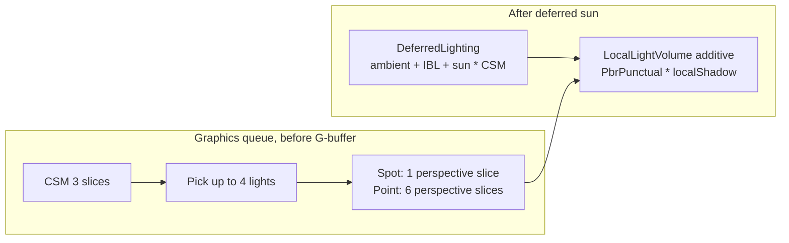
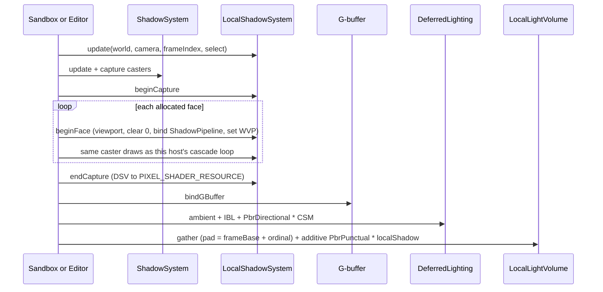

# Local-light shadows (point and spot)

| Field | Value |
|-------|--------|
| **Title** | Local-light shadows for point and spot lights |
| **Author** | Travis Johnston |
| **Date** | 2026-10-04 |
| **Status** | Approved |
| **Area** | `Render/LocalShadow*`, `Render/LocalLight*`, `Render/ShadowPipeline`, `Render/FoliagePipeline`, `content/shaders/LocalLightVolume.hlsl`, `Scene/SceneFile`, Sandbox, Editor |
| **Audience** | Engine, Sandbox, and Editor owners who already know HybridDeferred |
| **Supersedes** | The 2026-09-17 draft that previously lived in this file (spots only, `D16_UNORM` atlas). That draft is not the contract. |

---

## Overview

Point and spot lights already add a deferred GGX term in `content/shaders/LocalLightVolume.hlsl`. The pass is additive (`D3D12_BLEND_ONE` / `D3D12_BLEND_ONE` in `LocalLightVolumePipeline::create`). Ambient, IBL, and the sun are already in the HDR target from `DeferredLighting.hlsl`. A local shadow must scale only the term this pass adds.

The sun already does that. `DeferredLighting.hlsl` multiplies `PbrDirectional` by `ComputeShadow` and leaves `diffTerm` (ambient or IBL diffuse) and the IBL/SSR specular term alone. Local lights will do the same with `PbrPunctual`: multiply that light’s contribution by its own visibility, and do not write a hole through anything else.

v1 stores those visibility maps as one double-buffered `Texture2DArray` of `D32_FLOAT` reverse-Z slices. A spot is one perspective slice. A point is six perspective slices, one per cube face, not a dual-paraboloid and not a forward-Z map. Sampling uses the same `SampleCmp` `GREATER_EQUAL` path as `content/shaders/Shadow.hlsli`. Casters are the casters the host already draws into the cascades, including alpha-tested foliage and excluding grass.

`LocalLightComponent::castShadow` already exists and is ignored (`ECS/Components.h`, comment “reserved, ignored”). v1 turns that flag on. Absent JSON stays unshadowed. Scene `version` does not change. Sandbox opts in the player flashlight and the first lantern `spawnHybridLocalLights` actually spawns. The other seven lanterns and the muzzle stay off. Editor play opts in `spawnPlayerFlashlight` only.

---

## Background & Motivation

### What ships today

HybridDeferred resolves the sun in one fullscreen pass, then adds each local light.

The sun term, and only the sun term, is shadowed:

```149:167:content/shaders/DeferredLighting.hlsl
    float3 l          = normalize(lightDirWS);
    float  ndotl      = saturate(dot(n, l));
    float  recvOffset = 0.06f + 0.28f * (1.0f - ndotl) * (1.0f - ndotl);
    float  shadow     = ComputeShadow(worldPos + n * recvOffset, cameraPos);

    float3 lit = diffTerm + spec
        + PbrDirectional(n, v, albedo.rgb, roughness, metallic, lightDirWS, pbrLightColor) * shadow
        + albedo.rgb * emissive * emissiveGain;
    // ...
    FogResult fog = FogIntegrate(cameraPos, worldPos, MakeFogParams(), gHeightMap, gHeightSamp, shadow);
    return float4(ApplyLitFog(lit, fog), 1);
```

`ComputeShadow` (`content/shaders/Shadow.hlsli`) is a 3×3 `SampleCmpLevelZero` of a `Texture2DArray`. Reverse-Z `GREATER_EQUAL` is lit when `receiverZ >= storedZ`. The receiver adds `shadowParams.x * cascadeInvZ` (default `0.05` m from `ShadowSettings::depthBias` in `Render/ShadowCascades.h`) before the compare. Out of the cascade, or strength 0, returns 1.

Cascades are `R32_TYPELESS` / DSV `D32_FLOAT` / SRV `R32_FLOAT`, cleared to `kDepthClear` (0). Depth test is `shadowDepthFunc()` (`GREATER`). The comparison sampler is `D3D12_FILTER_COMPARISON_MIN_MAG_LINEAR_MIP_POINT`, `shadowCmpFunc()` (`GREATER_EQUAL`), border opaque white (`DeferredLightingPipeline.cpp`). Rasterizer bias on the model, skinned, and foliage depth PSOs is `DepthBias = -4000`, `SlopeScaledDepthBias = -2.5`, `DepthBiasClamp = 0` (`Render/ShadowPipeline.cpp`, `Render/SkinnedMeshPipeline.cpp`, `Render/FoliagePipeline.cpp`). Negative bias on reverse-Z stores the caster farther (closer to 0), which is the same direction as the positive receiver bias.

Local lights do not sample that array. `PSMain` in `LocalLightVolume.hlsl` evaluates `PbrPunctual`, windowed distance attenuation, and spot-angle attenuation, then:

```186:191:content/shaders/LocalLightVolume.hlsl
    FogParams fp  = MakeFogParams();
    FogResult fog = FogIntegrate(cameraPos, worldPos, fp, gHeightMap, gHeightSamp, 1.0f);
    lit *= fog.transmittance;
    lit += LocalLightFogScatter(cameraPos, worldPos, light, fp);
    return float4(lit, 0.0f);
```

`LocalLightVolume.hlsl` passes the literal `1.0f` into `FogIntegrate`. `FOG_SAMPLE_CSM` is not set, so that scalar only reaches `FogLightTerm` → `FogSunTerm` and therefore only `inScatter`. Transmittance does not depend on it. This pixel shader discards `inScatter`. It uses transmittance, then adds its own 8-step `LocalLightFogScatter` (scale `0.0015`, attenuation clamped at `1.5`). The sun’s `ComputeShadow` is what `DeferredLighting.hlsl` passes; do not thread the local shadow into `FogIntegrate`. The volume pass also does not sample `gAo`. The AO table is bound (`LocalLightVolumePipeline::kRootAoSrv`) and unused by the shader.

`GpuLocalLight` is 64 bytes. The last field, `pad`, is written as `0` in `packGpu` and never read.

`castShadow` on the component is not serialized. `Scene/SceneFile.cpp` writes `intensity`, `range`, `inner`, `outer`, `sourceRadius`, `enabled` inside `light`. `content/scenes/level.json` has a directional light and no point or spot. Sandbox spawns a flashlight spot, a disabled muzzle point, and up to eight lantern points in `SandboxApp::spawnHybridLocalLights`. Editor play spawns the same flashlight numbers through `spawnPlayerFlashlight` in `Character/ShieldView.cpp`. None of them set `castShadow`, so it stays false.

### Why the September 2026 draft is not enough

The 2026-09-17 draft of this file stops at spots, uses a 2D atlas, and starts from `D16_UNORM`. `Render/DESIGN-reverse-z.md` already says the comparison must stay `GREATER_EQUAL` on `D32_FLOAT` so spot shadows can share it. A 2D atlas also bleeds hardware PCF across slot borders. Points are part of the product: lanterns are points, and a spot-only result does not match the sun on those fixtures.

### Pain

- A lantern or flashlight lights through trunks, the player, and birch cards. The sun does not.
- Two shadow models would show up immediately next to a cascade: different depth direction, different acne, foliage cards that the sun already clips.
- The local-light root signature has one DWORD left (see below). The terrain G-buffer CB is frozen at 63 floats (`Render/TerrainPipeline.h`) and the terrain heap at 14 slots (`TerrainPipeline::kSrvCount`). The foliage G-buffer root is 63 of 64 DWORDs (`FoliagePipeline.cpp`). Stuffing shadow data into any of those is not a path.

---

## Goals & Non-Goals

### Goals

- A point or spot with `castShadow` darkens only its own additive GGX term, using the same G-buffer (albedo, octahedral normal, roughness, metallic, depth) and the same `PbrPunctual` evaluation as today.
- Unshadowed lights stay on today’s equation. `pad < 0` forces visibility 1 and does not sample.
- Depth is `D32_FLOAT` reverse-Z. Clear 0. Test `GREATER`. Compare `GREATER_EQUAL`. No forward-Z shadow map. No CPU transpose. Matrices stay row-major; shaders keep `mul(vector, matrix)`.
- Casters match the host’s cascade set: terrain, opaque meshes, opaque and skinned models, foliage trees / flowers / rocks with the existing alpha clip. Grass stays out.
- Sandbox and the Editor (edit view and play, which share `EditorApp::renderScene3D`) both capture and both sample. Sandbox’s flashlight, the first Sandbox lantern, and Editor play’s flashlight opt in together.
- A debug tile of each live slice sits next to the cascade tiles so a wrong face or a wrong compare is obvious.
- Graphics queue only. Shaders compile once at PSO create from `content/shaders`. The exe-dir content copy (`CMakeLists.txt` post-build copy next to Sandbox.exe / Editor.exe / UnitTests.exe) wins over the source tree, same as every other shader.

### Non-goals

- PCSS, VSM, ESM, ray-marched shadows, contact hardening, or treating `sourceRadius` as an area light. `sourceRadius` stays inside `applySourceRadius` only.
- Cached static shadow maps. v1 redraws the selected set every frame.
- Shadowing water. `Water.cpp` keeps the current unshadowed `waterIndex` list. Do not change water shading, fog densities, the `0.0015` scatter scale, exposure, or bloom.
- Enabling `FOG_SAMPLE_CSM` inside `LocalLightVolume.hlsl`. That would pull the sun’s cascade into a pass that does not bind `Shadow.hlsli`, and it would change fog.
- Sampling `gAo` from the volume pass. Local lights do not use AO today. This work does not add it.
- A clip pixel shader for non-foliage masked models. `ShadowDepth.hlsl` and `SkinnedShadowDepth.hlsl` have no pixel shader, so those casters stamp solid, matching the sun. An alpha-clip pixel shader for those parts is out of scope because it would also change cascade shadows. Foliage is the path that already clips.
- Grass as a caster. See Key Decisions.
- Growing `TerrainGBufferConstants` (63 floats), the 14-slot terrain heap, or the foliage G-buffer root signature.
- A second lighting model, a multiply blend over the HDR target, or a screen-space shadow mask applied before the sun.

---

## Proposed Design

### Budget (v1, frozen)

| Knob | Value | Why |
|------|--------|-----|
| Resolution | **1024×1024** every slice | One size. Spot and cube faces share the array, the sampler, and the texel math. Stays 1024 until a PIX capture shows the local-shadow passes dominating the frame. `mapSize` can drop to 512 later without a shader change. Not a scene-file field. |
| Format | `R32_TYPELESS`, DSV `D32_FLOAT`, SRV `R32_FLOAT` | Same as `ShadowSystem::createResources`. |
| Clear / test / compare | 0 / `GREATER` / `GREATER_EQUAL` | `kDepthClear`, `shadowDepthFunc()`, `shadowCmpFunc()`. |
| Frames in flight | **2** | `ShadowSystem::kBufferedFrames`, `Renderer` frame index. |
| Slices per frame | **12** | Worst case below. |
| Array depth | **24** | 12 × 2. |
| Memory | **96 MiB** | `24 * 1024 * 1024 * 4`. Same order as CSM (`6 * 2048 * 2048 * 4` at the default 2048 map and 3 cascades). |
| Lights per frame | **4** | Hard cap, score-ordered. |
| Spot cost | **1 slice** | One perspective projection of the outer cone. |
| Point cost | **6 slices** | Cube faces. Not tetrahedron, not dual paraboloid. |
| What fits | 4 spots (4 slices), or 1 point + 3 spots (9), or 2 points (12). A 3rd point does not fit and stays unshadowed. The Sandbox demo is 1 spot + 1 point (7 slices). | Greedy pack. No eviction. The light still illuminates. |
| Update | **Redraw every selected light every frame** into the current frame’s slices. | Flashlight and skinned hunters move. A cache needs a dirty set for every caster inside the volume. Not v1. |
| Filter | **3×3 `SampleCmpLevelZero`**, hardware comparison linear | Copy of `SampleCascadePCF`. |

A dropped light is not a failed frame. `create()` failure is the same: every light stays unshadowed, the volume pass still runs.

Texel size, for scale against the sun. Spot half-angle is `outerConeDeg` (the volume radius is `tan(outer) * range` in `makeSpotVolumeWorld`). Flashlight outer is 22°, range 22 m. At 10 m from the light a 1024 map is about `2 * 10 * tan(22°) / 1024 ≈ 8 mm`. A lantern point (range 6 m, 90° face) at the far plane is `2 * 6 / 1024 ≈ 12 mm`. Cascade 0 is 2048 across a much larger sphere, so these maps are finer than the sun at the distances local lights actually cover.

### Why an array of perspective faces



Dual paraboloid stores a non-linear distance that is not `PerspectiveFovLHReverseMatrix`. Rasterizer slope bias and `SampleCmp` then mean something else, and the result will not sit next to a cascade. A tetrahedron has the same problem with a custom projection. A hardware `TextureCube` can come later; v1 uses six array slices so each face is the same math as a spot and the debug overlay can show a wrong face as its own tile.

Spots are not packed into a 2D atlas. `SampleCmp` with a linear comparison filter reads neighboring texels. An atlas bleeds across slots unless every sample is inset. Array slices do not.

### Slice layout

Frame `f = frameIndex % 2` owns slices `[f * 12, f * 12 + 12)`. Allocation is first-fit in score order inside that window. A point takes six consecutive slices in this order, which matches the D3D cubemap face order so a later cube swap is mechanical:

| Face | Axis | Up |
|------|------|----|
| 0 +X | `(+1, 0, 0)` | `(0, +1, 0)` |
| 1 −X | `(−1, 0, 0)` | `(0, +1, 0)` |
| 2 +Y | `(0, +1, 0)` | `(0, 0, −1)` |
| 3 −Y | `(0, −1, 0)` | `(0, 0, +1)` |
| 4 +Z | `(0, 0, +1)` | `(0, +1, 0)` |
| 5 −Z | `(0, 0, −1)` | `(0, +1, 0)` |

The +Y / −Y up vectors are the cubemap convention. Getting them wrong turns the top and bottom tiles upside down in the overlay. That is the point of the overlay.

### Who is selected

A light is eligible when `enabled`, `intensity > 0`, `range > 0.05` m, `castShadow` is true, the transform is finite, and the light’s sphere intersects the camera frustum (`gatherLocalLights` already tests `Sphere3f(pos, range)` against `Camera3D::GetCullViewProj()`). Range is clamped with the same `maxRange` (80 m) the gather uses.

Score matches the gather, plus a hold bonus:

```text
score = intensity / (distanceToCamera^2 + 1)
if entity won a slot last frame: score *= 1.10
```

The hysteresis key is the packed `Entity` id (`ECS/Entity.h`: index plus generation). A recycled slot does not keep the bonus.

Sort descending. Greedy: a spot needs 1 slice and 1 light slot; a point needs 6 and 1. Stop at 4 lights or 12 slices. The allocator does not evict and does not backtrack. If a point needs 6 slices and only 4 remain, that point stays unshadowed (visibility 1, `pad = -1`) and a later spot may still use the leftover slices. Anything else left over also gets `pad = -1` and still lights.

`LocalShadowSystem::update` freezes that set once per frame, before capture and before either gather. `frameIndex` must be `Renderer::frameIndex()`, the same contract `ShadowSystem::update` documents, so the half the in-flight GPU is reading is not overwritten. `update`, both gathers, and the record upload all use that index. `recordFor(Entity)` is a 4-wide lookup. It returns −1 if `update` has not run, the system is invalid, or shadows are disabled. When it hits, it returns `(frameIndex % 2) * 4 + ordinal`, not the ordinal alone. See Record layout.

### Projection

CPU only. No transpose. `Matrix4f` multiply is row-major (`operator*` in `Math/Matrix4f.cpp`): `view * proj` applies view first, then proj, for a row vector. Shaders already consume cascade matrices that way (`mul(float4(worldPos, 1), cascadeViewProj)` in `Shadow.hlsli`). Local faces use the same product.

Spot axis is the gather’s axis: `rotation.Rotate(Z_AXIS)`, normalized. Up is world Y unless `abs(dir.y) > 0.9`, then world X. That is the same test as `makeSpotVolumeWorld`.

```text
zn     = 0.05 m          // not sourceRadius
zf     = clamped range   // finite; not PerspectiveFovLHReverseInfMatrix
fovY   = 2 * outerConeRadians
aspect = 1
outer  = min(outer, HalfPi - 0.01)   // same clamp as the gather
view   = LookAtLHMatrix(pos, pos + dir, up)
proj   = PerspectiveFovLHReverseMatrix(fovY, 1, zn, zf)
VP     = view * proj
```

`outerConeDeg` is the half-angle from the axis (attenuation uses `cos`, the cone mesh uses `tan`). `fovY = 2 * outer` frames that cone exactly. The inner cone does not change the map.

Point faces use `fovY = π/2`, aspect 1, the same `zn` / `zf`, and `LookAtLHMatrix(pos, pos + axis, up)` per face. `zn` stays 0.05 m so a large `sourceRadius` cannot eat casters. `placePlayerFlashlight` puts the light 0.2 m in front of the camera, so the camera origin is behind the near plane and does not fill the map.

`Frustum3f` already extracts reverse-Z planes (`near = w − z`, `far = z`, `Render/Frustum3f.cpp`). Each face’s `view * proj` is a valid caster frustum. Terrain chunks and models are culled with that frustum, the same way cascades do `Frustum3f(cascade.viewProj)`.

Reject the face (and therefore the light, if the spot face fails) when `zf <= zn` or any matrix entry is non-finite. Log once, leave the light unshadowed. No exceptions.

### Capture

Same command list as CSM, graphics queue, after `ShadowSystem::endCapture` and before `Renderer::bindGBuffer`. `bindGBuffer` resets the viewport (`Renderer.cpp`). Capture must not run after that.



`beginFace` mirrors `ShadowSystem::beginCascade`: viewport `1024²`, scissor the same, `OMSetRenderTargets` of that slice’s DSV, `ClearDepthStencilView` to 0, bind the **existing** `ShadowPipeline`, `setWvp(face.viewProj)`. Terrain depth draws in world space and expects that WVP to be the light matrix alone (`TerrainWorld::drawDepth` does not multiply a world matrix). Mesh and model draws then overwrite WVP with `world * face.viewProj`, as `drawShadowCaster` does for cascades.

`endCapture` transitions only this frame’s 12 slices from `DEPTH_WRITE` to `PIXEL_SHADER_RESOURCE`, per subresource, matching `ShadowSystem::endCapture`. The other frame’s slices stay in `PIXEL_SHADER_RESOURCE` for the in-flight reader. The resource is created in `DEPTH_WRITE`. First use of a frame may skip the barrier the way CSM does, but must still clear and draw.

A skipped capture still calls `endCapture`. CSM already does this: both hosts use `else if (m_shadows.isValid()) endCapture` when `enabled()` is false. The local array is created in `DEPTH_WRITE`, and `beginCapture` only skips its barrier while that tracked state holds. Leaving the skip path without the SRV transition means the second-row `drawArray` samples a depth-write subresource. On debug-off, on zero eligible lights, and on `select == false`, the host still calls `update` (so `frameIndex` is latched) and then `endCapture`, and does not call `beginCapture`. `endCapture` uses the frame `update` just latched. Skipping the `update` call leaves that latch on the previous frame, so the barrier hits the wrong 12 slices and this frame’s slices stay `DEPTH_WRITE`. Clear is optional on the skip path. Do not draw the local tile row until that `endCapture` has been recorded.

PIX / NVTX: a `Local Shadows` range around the capture (`ProfileColor::Shadows` is fine; do not add a new color unless the existing one is ambiguous next to CSM) and `Local Shadow Face %d` inside it.

### Casters

Each host already has a cascade body:

- Sandbox (`SandboxApp::onRender`, the loop under `m_shadows.beginCascade`): terrain `drawDepth`, `MeshComponent` with `castShadow` (skip if the entity also has `ModelComponent`, skip dead `HealthComponent`), `ModelComponent` with `castShadow` (skinned pose or static), then foliage `drawDepth`. The comment there is the rule: opaque casters only. Water, particles, blood, and lines stay out.
- Editor (`EditorApp::renderScene3D`): terrain or, when there is no terrain, `m_groundMesh`; `EditorObjectComponent` meshes via `meshForType` (skip an entity that also has `LocalLightComponent`); `ModelComponent`; foliage. Play mode uses this same function. The play camera is `m_camera`.

Do not invent a third caster list. Factor each host’s cascade body into a lambda both the cascade loop and the local-face loop call. Sandbox keeps camouflage (`camouflageHides` skips the possessed body). The Editor keeps the ground mesh. Local shadows then cannot drift from that host’s sun casters.

Shared draw helpers, so the lambda does not pretend a face is a cascade:

- `drawModelDepth` / `drawSkinnedModelDepth` (`Render/ModelDraw.cpp`) today take `ShadowSystem` and a cascade index only to read `pipeline()` and `cascade(i).viewProj`. Add an overload that takes `const ShadowPipeline&` and `const Matrix4f& lightViewProj`. The cascade overloads forward. Same PSOs, same bias, same “rebind `ShadowPipeline` before a static part” rule.
- Skinned parts stay on `SkinnedMeshPipeline` created with `SkinnedMeshPass::Shadow` (`shaders/SkinnedShadowDepth.hlsl`, no pixel shader, bias −4000 / −2.5).
- Foliage stays on `FoliagePipeline::drawDepth`.

**Grass.** `prepare` still runs for a depth view and may upload grass indices. The kind loop in `FoliagePipeline::drawDepth` then `continue`s only for `FoliageKind::Grass`, before any draw and before the clip shader. Flowers are not in that `continue`. Trees and flowers use `m_depthPsoTwoSided`; rocks use the back-face `m_depthPso`. Mask parts (birch leaves, dandelions) clip in `FoliageDepth.hlsl` when `alphaModeMask > 0.5`, against `alphaCutoff`. `DepthClipEnable` is `TRUE`. Local faces call this path and inherit all of it. Grass does not cast local shadows. That is a decision, not an accident: the sun also skips grass, grass is non-colliding cover, and a 6 m point light would otherwise draw the tuft set six times. A later change that removes the grass `continue` applies to CSM and local lights together, because they share `drawDepth`. This design does not remove it.

**Foliage view cap.** `kViewsPerFrame` is `kMaxShadowCascades + 1` (3 cascades + the G-buffer). The comment in `FoliagePipeline.cpp` says another view in the same frame would overwrite an index list the GPU has not read. `allocView` logs once and returns false, and that draw has **no foliage casters**. Twelve extra face draws would trip it.

v1 does not allocate a foliage view per face. It allocates **one view per shadowed light**:

- Spot: cull with `Frustum3f(spotViewProj)`, one `drawDepth`.
- Point: cull once with `Sphere3f(pos, range)` (add that overload; `prepare` today only takes a frustum), then replay the same index view for all six faces while only `lightWVP` changes. `DepthClipEnable` is already true, so instances outside a face are clipped. Extra vertex work is the foliage inside a few metres, not the whole map.

`kViewsPerFrame` becomes `1 + kMaxShadowCascades + kMaxShadowedLocalLights` = **8**. Index upload capacity goes from 8 MiB to 16 MiB (`kIndexViewStride` is 1 MiB: `kMaxFoliageDraw` 65536 × 4 kinds × 4 bytes, times 8 views × 2 frames). The world buffer is per frame slot, not per view, and does not grow. `static_assert` the view cap against the light cap so the next person who raises the light cap cannot miss it.

### Shader: multiply this light only

New include `content/shaders/LocalShadow.hlsli`, included only from `LocalLightVolume.hlsl`. Do not include `Shadow.hlsli` there. That file’s `cbuffer` is the cascade buffer at `b1`, and this pass has no room for it.

`GpuLocalLight.pad` is the index into one structured buffer of **8** records (4 lights × 2 frames). `packGpu` writes **−1**, not 0, when `recordFor` misses. When it hits, `packGpu` writes the exact float `recordFor` returned: `(frameIndex % 2) * 4 + ordinal` (0..3 on frame 0, 4..7 on frame 1). The shader indexes `gLocalShadowRecords[(uint)light.pad]`. It does not add a second base.

Surface term, replacing the unshadowed tail of `PSMain`:

```hlsl
float3 lit = PbrPunctual(n, v, albedo.rgb, roughness, metallic, toLight, light.color, light.sourceRadius);
lit *= windowedDistanceAttenuation(d * d, light.invRange2);
if (light.type >= 0.5f)
    lit *= spotAngleAttenuation(cosTheta, light.innerCos, light.outerCos);

float shadow = SampleLocalShadow(light, worldPos, n); // exactly 1 when pad < 0
lit *= shadow;

FogParams fp  = MakeFogParams();
FogResult fog = FogIntegrate(cameraPos, worldPos, fp, gHeightMap, gHeightSamp, 1.0f);
lit *= fog.transmittance;
lit += LocalLightFogScatter(cameraPos, worldPos, light, fp);
```

`FogIntegrate` stays called with shadow `1`. In this shader that argument only affects `inScatter`, which is discarded. Transmittance does not depend on it when `FOG_SAMPLE_CSM` is 0. Do not retune fog.

`LocalLightFogScatter` is this light’s own in-scatter, the analogue of `FogSunTerm` being multiplied by the sun shadow. Each of the 8 samples multiplies by a **single tap** (no 3×3, no normal offset), the same split as `ComputeShadowVolumetric` versus `ComputeShadow`. Out of the map, or `pad < 0`, the tap is 1. The `0.0015` scale, the step count, and the `min(att, 1.5)` clamp stay as written.

Unshadowed path: `SampleLocalShadow` returns the literal `1.0` before any texture op. `lit *= 1` does not change `PbrPunctual`, attenuation, transmittance, or the scatter scale. Lights with `castShadow == false`, lights that lost the budget, and a missing shadow system all take this path.

### Sample math

Spot, and each point face, project like `ShadowCoord`:

```hlsl
float4 clip = mul(float4(shadowPos, 1.0f), face.viewProj);
if (clip.w <= zn * 0.5f)
    return 1.0f; // behind the face: fail open
float3 uvz = clip.xyz / max(abs(clip.w), 1e-5f);
uvz.xy = uvz.xy * float2(0.5f, -0.5f) + 0.5f;
```

`clip.w` is view-space Z. `PerspectiveFovLHReverseMatrix` stores `m34 = 1`, `m44 = 0`, so after a rigid view, `clip.w = viewZ`. Near is 1, far is 0 (`UnitTests/Math/Matrix4fReverseZTests.cpp`).

Receiver bias, in metres, converted with the perspective derivative. For this projection `ndcZ = m33 + m43 / viewZ` with `m43 = zn * zf / (zf − zn) > 0`. Moving the receiver toward the light by `depthBias` metres (0.05, the cascade default) increases NDC Z by `depthBias * m43 / viewZ²`. Adding that before `GREATER_EQUAL` is “more lit”, which is what `Shadow.hlsli` does for ortho with `bias / zRange`.

```hlsl
float viewZ = max(clip.w, zn);
float m43   = zn * zf / max(zf - zn, 1e-4f);
float dz    = depthBias * m43 / max(viewZ * viewZ, 1e-4f);
dz          = min(dz, 4.0f / mapSize); // never more than ~4 texels of constant bias
uvz.z       = min(uvz.z + dz, 1.0f);
```

The clamp is the close-range guard the sun does not need. At 0.2 m, `0.05 / viewZ²` is a large NDC push and would peter-pan a flashlight. Four texels at 1024 is `4/1024 ≈ 0.0039` NDC.

Normal offset is **not** the sun’s `0.06 + 0.28 * (1 − ndotl)²` metres. That offset is 6–34 cm because cascade texels are large. On a 6 m lantern it floats the shadow. Local offset is in texels, evaluated at the receiver’s view Z, then the position is reprojected (one extra `mul`):

```hlsl
float ndotl      = saturate(dot(n, normalize(light.pos - worldPos)));
float texelWorld = (2.0f * viewZ * tanHalfFov) / mapSize;
float recvOffset = texelWorld * (1.0f + 3.0f * (1.0f - ndotl) * (1.0f - ndotl));
shadowPos        = worldPos + n * recvOffset;
```

`tanHalfFov` is `tan(outerCone)` for a spot and `1` for a cube face (`tan(45°)`). `ndotl` uses the direction to the **light**, not the sun and not the face axis. Grazing receivers lift a few texels. Head-on receivers lift one.

If the center UV or Z is outside `[0, 1]`, return 1 for that sample (fail open). Do not search another face. A point picks one face up front:

```hlsl
float3 d  = worldPos - light.pos;
float3 ad = abs(d);
int face;
if (ad.x >= ad.y && ad.x >= ad.z) face = d.x >= 0 ? 0 : 1;
else if (ad.y >= ad.z)            face = d.y >= 0 ? 2 : 3;
else                              face = d.z >= 0 ? 4 : 5;
```

PCF is the cascade loop: `texel = 1/mapSize`, 3×3, `SampleCmpLevelZero` on `gLocalShadow` at `.z = face.slice` (the slice already includes the frame base). The static sampler matches the deferred one: comparison linear, `GREATER_EQUAL`, border, opaque white. Taps that fall off a slice hit the border. That is what cascades do. The center-outside test is what keeps a cone rim from going black.

Rasterizer bias is not retuned. Every local-light depth draw uses the PSOs that already set `DepthBias -4000`, `SlopeScaledDepthBias -2.5`, clamp 0 (`ShadowPipeline.cpp`, the skinned shadow pass, `FoliagePipeline.cpp` depth PSOs). Do not add a second depth PSO with different bias. The `4/mapSize` clamp limits only the receiver’s constant NDC add (`dz`). It does not limit `SlopeScaledDepthBias * MaxDepthSlope`. Cube faces use `PerspectiveFovLHReverseMatrix(π/2, …)`, so `MaxDepthSlope` is larger than on the sun’s ortho cascades. If a 90° face peter-pans, measure it on the debug row before touching those PSO fields. Changing them moves CSM as well. v1 has no separate local slope knob, and that is deliberate.

### Root signature: the last DWORD

`LocalLightPassConstants` is 56 floats. The root signature is 56 (constants) + 1 (G-buffer table t0–t2) + 2 (lights SRV) + 2 (volume world SRV) + 1 (height table) + 1 (AO table) = **63**. The header asserts `<= 64`. One DWORD remains.

A root CBV or root SRV is two DWORDs and does not fit. A descriptor table is one. Static samplers are free.

Add `kRootShadowTable = 6`. Do not renumber `kRootAoSrv` (pinned at 5 by `UnitTests/Render/SceneBuffersTests.cpp`). Do not drop the AO table; it is unused by the shader but the slot stays. Do not grow the 56-float constant block. Debug mode reuses `_padFog` (renamed `localShadowDebug` in both the C++ struct and the HLSL). `sizeof` stays `56 * sizeof(float)`.

The new table holds two contiguous descriptors:

| Heap slot | Register | Resource |
|-----------|----------|----------|
| lighting heap 10 | `t7` `gLocalShadow` | `Texture2DArray` |
| lighting heap 11 | `t8` `gLocalShadowRecords` | structured buffer of records |

`kLightingCount` goes from 10 to 12. New constants: `kLightingLocalShadow = 10`, `kLightingLocalShadowRecords = 11`. `kLightingSsr` stays 9. Deferred lighting’s tables are fixed ranges (G-buffer 4 descriptors, height, AO, IBL 3, SSR 1), not one table of `kLightingCount`, so appending slots does not retarget the sun. It does retire the tests that freeze “count is 10” and “slot 9 is the last descriptor.” PR 2 updates all of them. Do not “fix” a red test by refusing to append.

Why the lighting heap, and not a heap on `LocalShadowSystem`: the volume pass already binds `renderer.lightingHeap()` as its only shader-visible CBV/SRV/UAV heap (`LocalLightVolumePipeline::bindCommon`). D3D12 allows one of those heaps at a time. A private shader-visible heap cannot be bound next to it. The last DWORD stays a descriptor table. It is not spent on a root SRV.

The copy is not once at `LocalShadowSystem::create`. `SceneBuffers::create` allocates `NumDescriptors = kLightingCount` and `packLightingHeap` recopies only the slots it knows about. `Renderer::resize` recreates `SceneBuffers` (`Renderer.cpp`, “SceneBuffers resize failed”). A one-shot copy into the old heap leaves slots 10 and 11 undefined after that resize, and a `pad >= 0` sample is then an invalid descriptor. `create` can also run before the lighting heap exists. Sandbox publishes the cascade SRV later, through `setShadowSrv`, which stores `m_shadowCpu`; `packLightingHeap` copies `kLightingShadow` on every create.

Follow that pattern, through the same host entry `Renderer::setShadowSrv` already uses. `SceneBuffers` does not keep an `ID3D12Device*`. `setShadowSrv(ID3D12Device*, …)` takes the device because `CopyDescriptorsSimple` needs it, and `Renderer::m_sceneBuffers` is private, so Sandbox and the Editor cannot call `SceneBuffers` themselves. `Renderer::setShadowSrv` forwards `m_device`. Local shadows use the same shape: `Renderer::setLocalShadowSrvs(arrayCpu, recordsCpu)` forwards into `SceneBuffers::setLocalShadowSrvs(ID3D12Device*, array, records)`. That stores both CPU handles, then copies each one whose `ptr != 0` if the heap already exists. `packLightingHeap` copies slots 10 and 11 at the end of every heap build, including resize.

The host calls `renderer().setLocalShadowSrvs` once, immediately after each existing `renderer().setShadowSrv(m_shadows.srvCpu())`. Those two sites are `Sandbox/SandboxApp.cpp` (after `pumpBootFrame`) and `Editor/EditorAppInit.cpp` (init). `Editor/EditorRender3D.cpp` is the tile row, not the publish. Do not also push these handles through `GpuResourceCache::setShadowSrv`, `SkyPipeline::setShadowSrv`, or `WaterPipeline::setShadowSrv`. Those copies are the cascade map. Call `renderer().setLocalShadowSrvs` even when `LocalShadowSystem::create` returned false, passing `cpuSrvs()`. The record SRV describes the whole 8-element buffer. It is not recreated per frame and it is not a root VA. Frame selection is the `pad` base, not a second descriptor.

Slot 3 (`kLightingShadow`) stays the cascade array. This pass does not sample it.

The dummy is a 1×1 `R32_FLOAT` whose texel is **0**, created even when the 96 MiB array fails. `GREATER_EQUAL` against 0 is lit for every receiver in `[0, 1]`, so a stray sample fails open. `create` returns false on that array failure, and on a null device, and does not throw. On the array failure it still leaves `cpuSrvs().arraySrv` as the dummy when the dummy itself was created, and `cpuSrvs().recordsSrv` as the record buffer when that upload existed. A handle that could not be created stays `ptr == 0`. The host still publishes both handles. `SceneBuffers` stores a null handle and does not copy it, matching `setShadowSrv` (`shadowCpu.ptr == 0` returns after the store). Skipping the publish because `create` returned false leaves slots 10 and 11 undefined, including after the next resize. Gather still writes `pad = -1` when the system is invalid, so the shader is not supposed to sample.

### Record layout

```cpp
struct GpuLocalShadowFace
{
    float viewProj[16]; // row-major, mul(world, viewProj), no transpose
    float zn;
    float zf;
    float tanHalfFov;
    float slice;        // includes the frame base
};
static_assert(sizeof(GpuLocalShadowFace) == 20 * sizeof(float), "local shadow face");

struct GpuLocalShadowRecord
{
    float faceCount;    // 1 spot, 6 point
    float mapSize;      // 1024
    float depthBias;    // metres, default 0.05
    float strength;     // 1 when allocated; the shader does lerp(1, s, strength)
    GpuLocalShadowFace faces[6];
};
static_assert(sizeof(GpuLocalShadowRecord) == 124 * sizeof(float), "local shadow record");
```

Eight records, not four views of a buffer whose SRV starts at element 0. `4 * 2 * 496` bytes is about 4 KB, one `GENERIC_READ` upload buffer. `update` writes only the current half: elements `[(frameIndex % 2) * 4, (frameIndex % 2) * 4 + 4)`. The other half stays for the in-flight reader. A descriptor created once at element 0 sees both halves; `pad` selects the half. This is not `LocalLightGpuList::lightsGpuVa()`, which offsets a root SRV by `m_slot * kLightStride` at record time. A descriptor table cannot do that, and this signature has no DWORD left for a root SRV.

The HLSL struct must match field for field. A CPU unit test `static_assert`s the size; it cannot see the shader, so the shader struct is copied in a comment next to the assert and reviewed as one change. `face.slice` still includes the texture frame base (`frame * 12 + sliceInFrame`). The record index and the slice base are the same frame, both taken from `Renderer::frameIndex()`.

### The double gather

`LocalLightVolumePipeline::draw` gathers and uploads. Later, `SandboxApp::onRender` gathers **again** and uploads the same `LocalLightGpuList` slot (`renderer().frameIndex()`). The command list reads that memory at execution time, so the **second** upload is what the volume shader sees.

Any shadow index written only inside the pipeline is wiped. `packGpu` is the only writer of `pad`, and both gathers call it. `LocalLightCullInput` gains:

```cpp
const LocalShadowSystem* localShadows = nullptr; // null → every pad is -1
```

`LocalLightVolumePipeline::draw` and the Sandbox water gather both pass the same system. Editor only gathers inside the pipeline; it still passes the pointer. Water does not read `pad`. Water shading does not change.

A unit test runs `update` with an explicit `frameIndex`, then `gatherLocalLights` twice with the same input, and expects the same `pad` values. A light that lost the slice budget is −1. The winner is `0` when `frameIndex % 2 == 0` and `4` when `frameIndex % 2 == 1`. A second `update` with the other frame does not require a new SRV.

### Debug view

Primary: `DebugOverlay::drawArray`, which Sandbox already uses for cascades when “Shadow map tiles” is on (`m_showShadowMaps`). Draw the live local slices on a **second row**, same call shape as the cascades: `contrast = 1.25`, `invert = true`. Invert makes reverse-Z near bright, which is how the cascade tiles already look. A forward-Z map, or a `LESS` compare stored into this buffer, looks inverted next to those tiles. A wrong cube up-vector looks upside down. An empty slice (clear 0, inverted to white) means the face did not draw.

The Editor has no shadow-map tiles today. F7 (`debug_shadow_enable` in `Editor/EditorSceneFile.cpp`) only calls `m_shadows.setDebugEnabled`, and `EditorInternals.h` defines `m_shadows` as `m_scene.shadows()`. That is the cascade flag. Add the same second row in the Editor, gated by a `DebugRenderState` flag both hosts set, so the overlay cannot exist only in Sandbox.

Secondary, in the volume shader, using `localShadowDebug` (the old `_padFog`):

| Value | Output (still additive, alpha 0) |
|-------|----------------------------------|
| 0 | Normal lighting. |
| 1 | `float4(shadow, shadow, shadow, 0)` **added** over the HDR target, for lights that have a record. The blend stays `ONE`/`ONE`. This is not a replacement of the sun image. A fully lit pixel gets brighter; a fully shadowed pixel adds nothing. Unshadowed lights draw normally, so a dropped light is obvious. Do not read mode 1 as a broken compare. The tile row is the compare oracle. |
| 2 | Face id as a color (`+X` red, `−X` dark red, `+Y` green, `−Y` dark green, `+Z` blue, `−Z` dark blue), times `shadow`, times the light’s attenuation, also **added**. A wrong dominant axis tints the wrong wall. |

The host field is `DebugRenderState::localShadowDebug` (`int`, default 0), next to `iblDebug` and `ssrDebug`. The volume pass copies it into the old `_padFog` slot. Sandbox gets an ImGui combo (Off / Shadow factor / Face id) beside the “Shadow map tiles” checkbox in `DevToolsPanel.cpp`. The Editor gets the same combo in the debug menu that already has “Local Lights” (`EditorUi.cpp`). No new key. Default 0. This does not change fog numbers; the constant was padding. Modes 1 and 2 add over the image. They do not replace it.

### Host gate

The two debug flags stay separate. `ShadowSystem::m_debugEnabled` defaults true (`ShadowSystem.h`). `ShadowSystem::update` is what forces cascade strength to 0 when that flag is false. `LocalShadowSystem` has its own flag, also default true. `LocalShadowSystem::update` reads only that flag. It does not take a `ShadowSystem` and it does not read `ShadowSystem::debugEnabled()`. Clearing the local flag does not change CSM strength. Do not clear either flag to express `select`.

When the local flag is false, `update` still latches `frameIndex` and writes no records (`recordFor` is −1, `faceCountThisFrame()` is 0). The host does not call `beginCapture`. It still calls `endCapture` so this frame’s slices leave `DEPTH_WRITE`. See Capture.

Editor F7 (`debug_shadow_enable` in `Editor/EditorSceneFile.cpp`) flips `DebugRenderState::shadows` (default true) and today calls only `m_shadows.setDebugEnabled`. `m_shadows` is `m_scene.shadows()`. PR 6 adds the local call with the same value:

```cpp
renderer().debugState().shadows = !renderer().debugState().shadows;
const bool on = renderer().debugState().shadows;
m_shadows.setDebugEnabled(on);
m_scene.localShadows().setDebugEnabled(on);
```

Sandbox’s “Shadows” checkbox (`DevToolsPanel.cpp`, `SandboxApp::drawDevTools`) writes `dbg.shadows` and nothing reads it, so CSM in Sandbox stays on. The `m_shadows` macro lives in `SandboxApp.cpp` and is not visible in `DevToolsPanel.cpp`. The checkbox handler calls both on `m_scene`:

```cpp
dbg.shadows = shadows;
m_scene.shadows().setDebugEnabled(shadows);
m_scene.localShadows().setDebugEnabled(shadows);
```

One UI value, two flags. Both defaults are already true, so the default image does not change. Turning the control off then disables CSM in Sandbox, which it does not do today, and stops local allocation in both hosts.

The other skip is not that bit. `update` does not take a `Renderer`, so it cannot see `scenePath()`. The host passes `bool select`:

```cpp
const bool select = renderer().scenePath() == ScenePath::HybridDeferred
    && renderer().debugState().localLights
    && renderer().debugState().lightingActive();
localShadows.update(world, camera, cameraFrustum, renderer().frameIndex(), select);
```

`select == false` still latches `frameIndex` and writes no records. `faceCountThisFrame()` is 0 and `recordFor` is −1. It does not run the scorer. `select == true` with this system’s `debugEnabled() == false` does the same latch-and-write-nothing inside `update`. That is the local flag, not the cascade flag. The host calls `beginCapture` only when `faceCountThisFrame() > 0`. Otherwise, if `isValid()`, it calls `endCapture` only. `spawnHybridLocalLights` returns immediately unless the path is HybridDeferred, and both hosts call `m_localLightVolumes.draw` only on the deferred branch, so an unselected frame is not sampled. Forward shaders do not bind `t7`/`t8`. CSM still runs on the forward path.

`select` is false rather than “always select and only skip `beginCapture`.” A selected frame writes `pad >= 0`. If that frame did not draw, a stray volume pass would `SampleCmp` uncleared slices instead of taking the `pad < 0` fail-open path. The volume pass is deferred-only today. The unshadowed path stays `pad < 0` whenever capture did not run.

### Where the opt-in is set

| Light | `castShadow` |
|-------|----------------|
| Component default, editor `fillDefaultLocalLight`, particle-emitter lights, Sandbox muzzle, the other seven Sandbox lanterns | **false** |
| Sandbox flashlight (`spawnHybridLocalLights`) | **true** |
| First Sandbox lantern the loop actually spawns (`spawnHybridLocalLights`, the `spots[]` walk) | **true** |
| Editor-play flashlight (`spawnPlayerFlashlight`) | **true** |
| Scene JSON, field absent | **false** |
| Scene JSON `"castShadow": true` on a point or spot | **true** |

The first lantern is the first `LanternLight` the loop emplaces. The walk starts at `{ 6.2, 0, 5.0 }` and skips a site under water, so the opted-in light is whichever site spawns first, not a fixed index if that site is skipped. The other lanterns that spawn stay false. Eight lanterns with the flag on would fight over the two point slots. One point is the v1 demo.

That lantern is a point, so it takes 6 slices. The flashlight is a spot, so it takes 1. Together they use 7 of 12 slices and one of the two point slots, and they fit. The flashlight sits at distance 0, so it wins its slot whenever it is enabled. The lantern is the only shadowed point in the default Sandbox spawn.

---

## API / Interface Changes

```cpp
struct LocalShadowSettings
{
    uint32_t mapSize            = 1024;
    uint32_t slicesPerFrame     = 12;
    uint32_t maxShadowedLights  = 4;
    float    depthBias          = 0.05f; // metres, same default as ShadowSettings
    float    nearPlane          = 0.05f;
};

struct LocalShadowFaceDraw
{
    Math::Matrix4f viewProj;
    Frustum3f      frustum;
    int            lightOrdinal = 0; // 0..3
    int            faceInLight  = 0; // 0 for a spot, 0..5 for a point
    bool           firstFace    = false; // foliage allocates its view here
    Entity         light        = {};
};

class LocalShadowSystem
{
public:
    bool create(ID3D12Device* device, const LocalShadowSettings& settings = {});
    // select == false still latches frameIndex and writes no records (recordFor stays -1).
    // This system's own debugEnabled() == false does the same. It does not read ShadowSystem.
    // Callers do not clear either flag to express select.
    void update(World& world, const Camera3D& camera, const Frustum3f& cameraFrustum, uint32_t frameIndex, bool select);
    void beginCapture(ID3D12GraphicsCommandList* cmd);
    void beginFace(ID3D12GraphicsCommandList* cmd, int faceOrdinal);
    void endCapture(ID3D12GraphicsCommandList* cmd);

    // (frameIndex % 2) * 4 + ordinal, or -1 if unshadowed.
    // frameIndex is the value update latched. It must be Renderer::frameIndex().
    int  recordFor(Entity e) const;
    int  faceCountThisFrame() const;
    const LocalShadowFaceDraw& face(int i) const;

    // CPU handles only. arraySrv is the 1x1 dummy when the real array failed.
    // The host publishes them through Renderer::setLocalShadowSrvs, including when create() returned false.
    struct CpuSrvs
    {
        D3D12_CPU_DESCRIPTOR_HANDLE arraySrv   = {};
        D3D12_CPU_DESCRIPTOR_HANDLE recordsSrv = {};
    };
    CpuSrvs cpuSrvs() const;
    D3D12_CPU_DESCRIPTOR_HANDLE srvCpu() const; // array, for the debug overlay (dummy when down)
    float debugSlice(int faceOrdinal) const;

    bool isValid() const;
    // Own flag, default true, matching ShadowSystem::m_debugEnabled.
    // update reads only this. Clearing it does not change cascade strength.
    bool debugEnabled() const;
    void setDebugEnabled(bool enabled);
};
```

`create` returns false on a null device or a failed `HRESULT`. It logs with `DE_LOG_ERROR(LogCategory::Render, ...)` and does not throw. Callers skip capture. They still publish `cpuSrvs()`. `SceneRenderer` owns the system next to `ShadowSystem` and exposes it the same way (`shadows()` / a new `localShadows()`). The debug flag’s member initializer is `true`. A fresh system with `select == true` still allocates. Hosts are what copy `DebugRenderState::shadows` into both `shadows().setDebugEnabled` and `localShadows().setDebugEnabled`. `update` never looks at the other system.

`Renderer` and `SceneBuffers` gain:

```cpp
void Renderer::setLocalShadowSrvs(D3D12_CPU_DESCRIPTOR_HANDLE arrayCpu, D3D12_CPU_DESCRIPTOR_HANDLE recordsCpu);
void SceneBuffers::setLocalShadowSrvs(ID3D12Device* device, D3D12_CPU_DESCRIPTOR_HANDLE arraySrv, D3D12_CPU_DESCRIPTOR_HANDLE recordsSrv);
```

`Renderer::setLocalShadowSrvs` is the host entry. It forwards `m_device` the way `Renderer::setShadowSrv` does (`m_sceneBuffers->setShadowSrv(m_device.Get(), shadowCpu)`). `SceneBuffers` does not keep a device. Its method stores both handles the way `setShadowSrv` stores `m_shadowCpu`, then `CopyDescriptorsSimple` into slots 10 and 11 when `device` and the heap are non-null and that handle’s `ptr != 0`. `packLightingHeap` copies those two stored handles at the end of every heap build, including the recreate inside `Renderer::resize`. A null stored handle is not copied. The host calls `renderer().setLocalShadowSrvs(localShadows().cpuSrvs().arraySrv, localShadows().cpuSrvs().recordsSrv)` immediately after `renderer().setShadowSrv` in `Sandbox/SandboxApp.cpp` and `Editor/EditorAppInit.cpp`, whether or not `create` returned true.

`LocalLightCullInput::localShadows` is the pointer above. `LocalLightVolumePipeline::draw` takes the system (pointer, may be null) and copies it into the cull input.

`drawModelDepth` / `drawSkinnedModelDepth` gain the view-proj overload described above. Existing signatures stay and forward, so cascade call sites do not have to change in the same patch if the overload lands first.

Foliage:

```cpp
bool beginDepthView(/* same args as drawDepth, plus an optional Sphere3f* that wins over the frustum when non-null */);
void drawPreparedDepth(ID3D12GraphicsCommandList* cmd, const Math::Matrix4f& lightViewProj);
```

`drawDepth` remains begin + draw for the three cascades. A point’s six faces call `beginDepthView` once (`firstFace`) and `drawPreparedDepth` six times.

CPU helpers, unit-tested without a device:

```cpp
Math::Matrix4f buildSpotShadowViewProj(const Math::Vector3f& pos, const Math::Vector3f& dirTowardBase,
                                       float range, float outerConeDeg, float zn);
Math::Matrix4f buildPointFaceViewProj(const Math::Vector3f& pos, int face, float range, float zn);
int            selectPointShadowFace(const Math::Vector3f& fromLight); // 0..5, same branches as the shader
float          localShadowNdcBias(float depthBiasM, float zn, float zf, float viewZ, float mapSize);
```

`localShadowNdcBias` is the `dz` function above, including the `4/mapSize` clamp, so the shader and the test cannot drift.

## Data Model Changes

No scene version bump. `SceneFileData::version` stays whatever the file already has (tests use 1 and 2). Old files load.

`SceneObjectData` gains `bool lightCastShadow = false`.

Save, only when the object is a point or a spot (do not write it onto the directional light in `level.json`). Write the key for both `true` and `false`. A re-save of an old point or spot adds `"castShadow": false`. Absence is the load default for files this writer did not produce, not a reason to omit a false flag:

```json
"light": {
  "intensity": 800.0,
  "range": 16.0,
  "inner": 12.0,
  "outer": 25.0,
  "sourceRadius": 0.05,
  "enabled": true,
  "castShadow": true
}
```

Load does not call `json::value` for this key. `SceneFile.cpp` uses `value()` for the other light fields, and nlohmann’s `value()` throws `type_error.306` (`cannot use value() with …`, `third_party/nlohmann/json.hpp`) when the key is present and not a bool (`1`, `"true"`). This path must not add `try` / `catch`. Read it only like this:

```cpp
if (light.contains("castShadow") && light["castShadow"].is_boolean())
    o.lightCastShadow = light["castShadow"].get<bool>();
```

A missing key leaves `false`. A present non-bool leaves `false` and the rest of the scene still loads. Directional and ambient objects ignore the key even when it is a bool; it is not written back onto them. The read runs only for a point or a spot. Intensity values already stored in the files stay in candela; this change does not rescale them.

`LocalLightComponent::castShadow` keeps its default `false`. The comment changes from “reserved, ignored” to the real meaning. Editor selection UI (`EditorUi.cpp`, the `LocalLightComponent` block, including the emitter’s “Nearby illumination” block) gets a “Cast shadow” checkbox.

The editor does not copy the light by struct assignment. Two explicit lists have to grow, and they are not the same function:

- Save, component → `SceneObjectData`: `Editor/EditorSceneFile.cpp`, the `LocalLightComponent` block (`lightIntensity` through `lightEnabled`). Add `d.lightCastShadow = light->castShadow`. Do not add it to the directional or ambient blocks.
- Spawn, `SceneObjectData` → component: `Editor/EditorSpawn.cpp`, not `EditorSceneFile.cpp`. The point/spot site calls `fillDefaultLocalLight` and then copies intensity, range, cones, `sourceRadius`, and `enabled` (`EditorSpawn.cpp` around the `lightType` branch). The particle-emitter site does the same after `fillDefaultLocalLight(light, PointLight)` and does not copy cones. `fillDefaultLocalLight` assigns `LocalLightComponent{}`, so the default stays false and it never reads an authored flag.

Both sites call one helper, `copyAuthoredLocalLight(LocalLightComponent&, const SceneObjectData&)`, declared in a new `Editor/LocalLightAuthoring.h`. That header includes only `ECS/Components.h` and `Scene/SceneTypes.h`. It does not include `EditorApp.h` (`EditorInternals.h` does, so the helper cannot live there and still be unit-tested). The helper copies the shared authored fields and `light.castShadow = authored.lightCastShadow`. The light site still owns cone degrees. The emitter site still overwrites color after the helper. `UnitTests` already has the repo root on the include path through `DarkEngine`, so `UnitTests/Editor/LocalLightAuthoringTests.cpp` includes the header, fills a `SceneObjectData` with `lightCastShadow = true`, runs the helper, and expects `LocalLightComponent::castShadow`. That is the assertion that a loaded point or spot actually receives the flag. The SceneFile round-trip stays beside it. A JSON test that only hits `saveSceneToJson` / `loadSceneFromJson` does not cover this drop.

`GpuLocalLight` does not grow. Only `pad` changes meaning. `static_assert(sizeof(GpuLocalLight) == 64)` stays.

---

## Alternatives Considered

### 1. Spot atlas on `D16_UNORM`, points later

This is the 2026-09-17 draft this file replaces. It keeps the first PR small and the memory under a 2048 atlas. It loses. `D16` does not match `shadowDepthFunc()` / `shadowCmpFunc()`, the −4000 float depth bias is specified for `D32_FLOAT`, and a 2D atlas bleeds PCF. The reverse-Z RFC already called this out. Points are lanterns in `spawnHybridLocalLights`; shipping spots only leaves the fixtures that need shadows most on the old path.

### 2. Dual paraboloid or tetrahedron for points

Two or four draws instead of six, less than 96 MiB if the spot array stays separate. The depth is not `PerspectiveFovLHReverseMatrix`, so the receiver bias, the rasterizer slope, and `Frustum3f` (which assumes reverse-Z `near = w − z`, `far = z`) do not apply. Seams on a paraboloid are worse than a cube-face diagonal, and the debug tile is harder to read. Rejected for v1. Six ordinary perspective faces are the design that can share the spot shader.

### 3. One `TextureCube` per point plus `SampleCmp`

Hardware face selection and one resource. Cube `SampleCmp` still needs a reverse-Z face projection, and a wrong face is not a separate tile unless we also keep the array. Edge PCF does not cross faces either way. The array is the v1 because it is the cascade resource with a different slice count. A cube can replace the six slices later without changing the lighting equation.

### 4. Per-light textures, or a screen mask before the sun

Per-light SRVs do not fit the volume pass: many lights draw under one root signature, and there is one DWORD left. A screen mask multiplied into the HDR target would scale ambient, IBL, and the sun. The additive volume pass is already the isolation boundary. Use it.

### 5. Persistent static maps

Right for a lamp that never moves and a level with no skinned caster inside the radius. Wrong for the flashlight (`placePlayerFlashlight` every frame) and for hunters walking through a lantern. Double-buffering means a cached slice still has to be copied to the frame the GPU is not reading, or the cache has to be single-buffered with a fence. That is a follow-up once v1’s compare is known-good. v1 redraws at most 12 slices.

### 6. Copy the sun’s 0.06–0.34 m normal offset

Same constants would guarantee the same acne recipe and a worse peter-pan on a 6 m light. The sun’s offset exists because a cascade texel is centimetres to metres. Local texel size at these ranges is about a centimetre. The design keeps the sun’s **rasterizer** bias and the sun’s **0.05 m** receiver bias (clamped), and scales the normal offset by the local texel.

---

## Security & Privacy Considerations

This is local rendering of a scene the process already loaded. No network surface, no new privilege, no credentials.

Scene JSON is local content. `castShadow` is a bool. Load it only when `light.contains("castShadow") && light["castShadow"].is_boolean()`. A missing key or a present non-bool (`1`, `"true"`) leaves the flag false and the rest of the scene still loads. Do not call nlohmann `value()` for this key: that helper throws `type_error` on a type mismatch, and this path must not add `try` / `catch` to swallow it. The other light fields already use `value()`; this design does not wrap those calls. Non-finite light positions or matrices skip allocation (`recordFor` stays −1) and log once; they must not be uploaded as a view-proj. That is the NaN guard. `DE_ASSERT` is appropriate in debug if a face index is outside 0..5. Release builds skip the face. No `try` / `catch` / `throw`, and no `std::exception` types, anywhere on this path.

Do not log light positions every frame. Log the selection when the set of entity ids changes, at info, one line.

The shadow map is depth of the loaded scene. It is not written to disk. The debug overlay is a local developer toggle.

---

## Observability

The engine’s tools are `DE_LOG_*` and the PIX / NVTX markers in `Render/Profile.h`. No new metric backend.

| Event | Where |
|-------|--------|
| Create succeeded | `DE_LOG_INFO`, map size, slice count, byte size (96 MiB at the default). |
| Create failed | `DE_LOG_ERROR` with the `HRESULT`, same `FailedHr` pattern as `ShadowSystem`. |
| Eligible lights exceeded the cap | `DE_LOG_WARN` at most once a second, same throttle style as `warnOverflow` in `LocalLightGather.cpp`. Include kept vs skipped counts. |
| Selection changed | `DE_LOG_INFO` once: entity, spot or point, slice range. |
| Foliage view cap hit | Existing `DE_LOG_ERROR` in `allocView`. Raising the cap is what stops this; if it fires, foliage is missing from that face and the log is the signal. |
| GPU time | `Local Shadows` and per-face ranges, graphics queue, so a 6-face point that costs as much as two cascades is visible in PIX / Nsight next to `Shadow Cascade`. |

There is no alert. A broken compare is a picture: the second row of shadow tiles, and debug mode 2’s face colors.

---

## Rollout Plan

Default `castShadow` is false, so landing the sampler does not change any current scene, lantern, or muzzle flash. PR 6 is the first image change.

1. CPU allocation, matrices, and JSON land with no GPU draws. Images unchanged.
2. The array is allocated and cleared. Still invisible, except the debug tiles (empty white when inverted, because clear is 0).
3. Casters draw. Tiles show depth. The volume pass does not sample yet.
4. The shader samples. Only lights with the flag change. None have it until the host PR.
5. Both flashlights and the first Sandbox lantern set the flag in the same PR. That is the first intentional image change. Editor play and Sandbox change together. The other seven lanterns and the muzzle stay off.

Rollback: stop calling `beginCapture`, or leave `castShadow` false. The volume equation with `pad == -1` is the current equation. The 96 MiB array can stay allocated; it is not read. No content migration to undo. `level.json` gains nothing unless an author saves a point or spot with the new key.

No feature-flag service. The kill switch is `DebugRenderState::shadows`. Editor F7 and the Sandbox checkbox each write that value into both `shadows().setDebugEnabled` and `localShadows().setDebugEnabled`. Clearing only the local flag leaves the sun on.

---

## Resolved decisions

These four are closed.

1. **Resolution.** Shadow map resolution stays 1024 until a PIX capture shows the local-shadow passes dominating the frame. `LocalShadowSettings::mapSize` can drop to 512 later without a shader change (`mapSize` is in the record). Default stays 1024. This is not a scene-file field.
2. **No eviction.** The allocator does not evict. If a point needs 6 slices and only 4 remain, that point stays unshadowed (visibility 1) and a later spot may still use the leftover slices. No backtracking in v1.
3. **Masked models that are not foliage.** They cast solid shadows, matching `ShadowDepth.hlsl` and the sun. An alpha-clip pixel shader for those parts is out of scope because it would also change cascade shadows.
4. **Sandbox opt-in.** Both player flashlights and one lantern. In `spawnHybridLocalLights`, set `castShadow` on the flashlight and on the first lantern the loop actually spawns. The other seven stay unshadowed. The muzzle, particle lights, and `fillDefaultLocalLight` stay false. Editor play’s flashlight still opts in. A lantern is a point, so it uses 6 slices. The flashlight is a spot. They fit together under the 2-point cap.

---

## Risks

| Severity | Risk | Mitigation |
|----------|------|------------|
| High | Sandbox’s second `gatherLocalLights` overwrites `pad` before the GPU runs. A wiped `pad`, or a `pad` that is only the ordinal, samples record 0. Frame 1’s matrices sit in records 4..7 and would never be read, then frame 2 would overwrite the half the GPU may still be using. | `packGpu` writes `(frameIndex % 2) * 4 + ordinal` from `recordFor`. `update`, both gathers, and the upload use `Renderer::frameIndex()`. Both gathers pass the same `LocalShadowSystem*`. Test even frame → `0`, odd frame → `4`. Default −1. |
| High | `kViewsPerFrame == 4`. Extra `drawDepth` calls drop foliage casters after one error log. | One foliage view per shadowed light, cap raised to 8, `static_assert` against the light cap. |
| Medium | 96 MiB on top of the cascade array. | Hard cap of 12 slices × 2 frames. `mapSize` is a create-time setting. |
| Medium | Six full caster passes for one point, on top of three cascades. | At most two points. Per-face frustum cull for terrain and models. Foliage culled once per light. PIX ranges make the cost obvious. |
| Medium | Copying the sun’s 6–34 cm normal offset peter-pans flashlight shadows. | Texel-sized normal offset. 0.05 m bias clamped to 4 texels of NDC. |
| Medium | Shared `SlopeScaledDepthBias -2.5` can detach shadows on a 90° face. Cube faces use `PerspectiveFovLHReverseMatrix(π/2, …)`, so `MaxDepthSlope` is larger than on the sun’s ortho cascades. The `4/mapSize` clamp limits only the receiver’s constant NDC add. It does not limit `SlopeScaledDepthBias * MaxDepthSlope`. | Measure on the debug tile row before any depth-PSO change. A retune of the shared bias moves CSM. v1 has no separate local slope knob and no second depth PSO. |
| Medium | Cube-face PCF does not cross the diagonal. A one-texel seam. | Fail open when UV is outside the face. Debug mode 2 shows the face. Do not widen FOV past 90°; that breaks the dominant-axis pick. |
| Low | Editor and Sandbox caster sets differ (ground mesh, camouflage, health). | Each host reuses its own cascade lambda. No third list. |
| Low | Flashlight self-shadow from the player mesh. The light sits 0.2 m ahead of the camera; `zn` is 0.05 m. | Accepted. The flag can be turned off without a shader change if the view model fills the map. |
| Low | Sandbox “Shadows” checkbox currently does not disable CSM. Wiring it changes Sandbox behaviour. F7 today sets only `ShadowSystem::m_debugEnabled`, so a local flag that nothing writes stays at its default and ignores the toggle. | PR 6 writes `DebugRenderState::shadows` into both `setDebugEnabled` calls. The flags stay separate. Both default true. Clearing the local flag does not force cascade strength to 0. |

---

## References

- `content/shaders/DeferredLighting.hlsl` — sun term times `ComputeShadow`; ambient and IBL are not.
- `content/shaders/PbrLighting.hlsli` — `PbrPunctual`, `windowedDistanceAttenuation`, `spotAngleAttenuation`.
- `content/shaders/LocalLightVolume.hlsl` — additive local term, fog transmittance, `LocalLightFogScatter`.
- `content/shaders/Shadow.hlsli` — `ShadowCoord`, 3×3 PCF, reverse-Z bias sign.
- `content/shaders/Fog.hlsli` — with `FOG_SAMPLE_CSM` unset, `FogIntegrate`’s shadow scalar only scales `inScatter` through `FogSunTerm`. The volume shader passes `1` and discards `inScatter`. Deferred lighting is what passes the sun’s `ComputeShadow`.
- `content/shaders/FoliageDepth.hlsl`, `Render/FoliagePipeline.cpp` `drawDepth` — mask clip, grass skip, view cap.
- `content/shaders/ShadowDepth.hlsl`, `content/shaders/SkinnedShadowDepth.hlsl` — no pixel shader.
- `Render/ShadowSystem.cpp`, `Render/ShadowCascades.h`, `Render/ShadowPipeline.cpp` — `D32` array, clear 0, bias −4000 / −2.5, receiver 0.05 m.
- `Render/DepthState.h` — `kDepthClear`, `shadowDepthFunc`, `shadowCmpFunc`.
- `Render/LocalLightVolumePipeline.cpp` — root signature, 63 DWORDs, additive blend, in-pipeline gather.
- `Render/LocalLightGather.cpp` — `GpuLocalLight.pad = 0`, fullscreen scissor path, score.
- `Render/SceneBuffers.h`, `Render/SceneBuffers.cpp` `packLightingHeap` — lighting heap slots 0–9 today. Slot 3 is the CSM SRV. Slot 9 is SSR. This design appends slots 10 and 11 and republishes them from stored CPU handles on every create, including resize. Tests that freeze count 10 are listed in PR 2.
- `Render/Frustum3f.cpp` — reverse-Z plane extraction.
- `Math/Matrix4f.cpp` — `LookAtLHMatrix`, `PerspectiveFovLHReverseMatrix`, row-vector `operator*`.
- `ECS/Components.h` — `LocalLightComponent::castShadow`.
- `Scene/SceneFile.cpp`, `UnitTests/Scene/SceneFileTests.cpp` `V2LocalLightRoundTrip`.
- `Sandbox/SandboxApp.cpp` `onRender` caster loop and the second gather; `Editor/EditorRender3D.cpp` `renderScene3D`.
- `Character/ShieldView.cpp` — `spawnPlayerFlashlight`, `placePlayerFlashlight`.
- `Render/DESIGN-reverse-z.md` — accepted reverse-Z contract. Spot shadows were called out as the reason to keep one compare.
- This file before 2026-10-04 — superseded spots-only draft. Its text remains in git history.
- `Render/TerrainPipeline.h` — 63-float terrain G-buffer CB, 14-slot heap. Not used here.
- `Render/FoliagePipeline.cpp` — foliage G-buffer root, 63 of 64 DWORDs. Not used here.

---

## Key Decisions

1. **One `D32_FLOAT` reverse-Z `Texture2DArray`, not a `D16` atlas and not a forward-Z map.** Same clear, test, compare, and sampler as CSM, so a local shadow can sit next to a cascade. Spots and point faces share it. 1024², 12 slices per frame, 2 frames, 96 MiB, at most 4 lights. A spot costs 1 slice. A point costs 6. A light that does not fit still lights, with visibility 1.

2. **Points are six perspective cube faces.** Dominant-axis face pick, D3D face order and up vectors, `PerspectiveFovLHReverseMatrix(π/2, …)`. Dual paraboloid and tetrahedron do not use the engine’s reverse-Z projection, frustum, or bias, so they are out. `view * proj`, row vectors, `mul(vector, matrix)`, no CPU transpose.

3. **The shadow multiplies only `PbrPunctual` (and that light’s own fog scatter).** Additive blend already isolates the light from ambient, IBL, and the sun. `FogIntegrate` stays at shadow 1 with `FOG_SAMPLE_CSM` off. Scatter samples take a single tap. Fog numbers, water, and exposure do not change. Unshadowed `pad < 0` does not sample.

4. **Bias matches the sun where the sun’s constants still mean the right thing.** Rasterizer `DepthBias -4000` and clamp 0 stay on the existing depth PSOs. There is no second depth PSO. `SlopeScaledDepthBias -2.5` is the same register, but a cube face’s `MaxDepthSlope` is larger than an ortho cascade’s, and the 4-texel clamp does not limit `SlopeScaledDepthBias * MaxDepthSlope`. Receiver bias is 0.05 m, converted with the perspective derivative and clamped to 4 texels of constant NDC. Normal offset is texel-sized, not the sun’s 6–34 cm, so a flashlight does not peter-pan. If a 90° face detaches, measure it on the debug row before changing the shared PSO. A retune moves CSM.

5. **Same casters as that host’s cascades. Grass stays excluded.** `prepare` still runs. The depth kind loop then `continue`s only for `FoliageKind::Grass`. Flowers are not in that `continue`. Trees and flowers use the two-sided depth PSO and still clip when `alphaModeMask` is set. Rocks use the back-face depth PSO. One foliage index view per shadowed light, not per face, and `kViewsPerFrame` rises from 4 to 8 so the extra views cannot fail `allocView`. Non-foliage masked models stay solid, matching `ShadowDepth.hlsl`.

6. **`castShadow` is the existing bool, default false, optional in JSON, scene version unchanged.** Sandbox opts in the flashlight and the first lantern `spawnHybridLocalLights` spawns. The other seven lanterns, the muzzle, particle lights, and `fillDefaultLocalLight` stay false. Editor play’s flashlight opts in with them. The lantern is one point (6 slices) and the flashlight is one spot (1 slice), so they fit under the 2-point cap. The editor checkbox writes the same field. Save copies it in `EditorSceneFile.cpp`. Both `EditorSpawn.cpp` sites copy it back through `copyAuthoredLocalLight`. A non-bool JSON value is ignored. Load does not call `value()` for this key.

7. **The last root DWORD is one descriptor table (t7 array, t8 records) in two new lighting-heap slots.** The constant block stays 56 floats. Terrain and foliage roots are not touched. A second shader-visible heap cannot be bound beside `lightingHeap()`, and the last DWORD is not a root SRV. `pad` is `(frameIndex % 2) * 4 + ordinal` into one 8-record SRV. A descriptor table cannot offset a GPU virtual address the way `LocalLightGpuList::lightsGpuVa()` does. Hosts publish through `Renderer::setLocalShadowSrvs`, which forwards `m_device` into `SceneBuffers::setLocalShadowSrvs(ID3D12Device*, …)`. The two call sites are the existing `renderer().setShadowSrv` lines in `SandboxApp.cpp` and `EditorAppInit.cpp`, including when `create` returned false and the array handle is the 1×1 dummy. `packLightingHeap` recopies slots 10 and 11 on every heap build, including resize. `pad` is still written only in `packGpu`, which is what makes Sandbox’s double upload safe.

8. **Redraw every frame. No static cache.** The lights that matter move, and skinned casters move. Debug tiles on a second row, plus `DebugRenderState::localShadowDebug` (int, default 0) copied into the old padding float, make a wrong face or a wrong compare obvious. Modes 1 and 2 add over the HDR target. The tile row is the compare oracle. `LocalShadowSystem`’s debug flag defaults true and is not `ShadowSystem::m_debugEnabled`. Editor F7 and the Sandbox checkbox write `DebugRenderState::shadows` into both `setDebugEnabled` calls. `update` reads only its own flag. Clearing that flag does not force CSM strength to 0. The host passes `update(..., select)` with `select` true only for HybridDeferred while `localLights` and `lightingActive()` are on. `select == false` latches `frameIndex` and writes no records. It does not clear either debug flag. `beginCapture` runs only when `faceCountThisFrame() > 0`. A skipped capture still calls `endCapture`.

---

## PR Plan

### PR 1 — CPU selection, projection, and the `castShadow` field

- **Title:** Local shadow math, allocator, and optional castShadow JSON
- **Files / components:** `Render/LocalShadowMath.h/.cpp` (new), `Render/LocalShadowSystem.h` (records and `update` / `recordFor` only, no device resources yet), `ECS/Components.h` (comment only), `Scene/SceneTypes.h`, `Scene/SceneFile.cpp`, `Editor/EditorUi.cpp`, `Editor/EditorSceneFile.cpp` (component → `SceneObjectData` list), `Editor/EditorSpawn.cpp` (both the point/spot site and the emitter site), `Editor/LocalLightAuthoring.h` (new), `UnitTests/Render/LocalShadowMathTests.cpp`, `UnitTests/Scene/SceneFileTests.cpp`, `UnitTests/Editor/LocalLightAuthoringTests.cpp`
- **Depends on:** none
- **Description:** `buildSpotShadowViewProj`, `buildPointFaceViewProj`, `selectPointShadowFace`, and `localShadowNdcBias`, with tests: a +Z spot maps an on-axis point to NDC xy near 0 and reverse-Z `ndcZ` in `(0, 1)`; each cube face centers the point at `pos + axis`; +Y uses up `(0,0,−1)`; bias is positive, finite, and clamped at `4/mapSize`. Allocator tests: 4 spots fit; a 5th does not; 2 points fill 12 slices; a 3rd point stays at −1 and a later spot can still take a leftover slice; 10% hysteresis keeps a holder across a small score change; non-finite position skips. `update(..., frameIndex, select)` with `select == true` and the default `debugEnabled() == true`: `recordFor` returns `(frameIndex % 2) * 4 + ordinal`. With `select == false`: the same `frameIndex` is latched, `faceCountThisFrame()` is 0, and `recordFor` stays −1. Next to that, `setDebugEnabled(false)` then `update` with `select == true`: the frame is still latched, `recordFor` stays −1, and `faceCountThisFrame()` is 0. The flag defaults true, so the false case is an explicit call, not the constructor. That call does not touch a `ShadowSystem`. JSON: missing `castShadow` loads false and the scene version is unchanged; present true round-trips on point and spot; a directional light does not gain the key on save; a present non-bool (`1` or `"true"`) leaves the flag false and does not fail the load. The load uses `contains` + `is_boolean`, not `value()`. Editor checkbox writes the component. `EditorSceneFile.cpp` copies `castShadow` onto `lightCastShadow` for a `LocalLightComponent` only. Both `EditorSpawn.cpp` sites call `copyAuthoredLocalLight`. The new test fills `SceneObjectData::lightCastShadow` and expects `LocalLightComponent::castShadow`. No GPU resources and no image change.

### PR 2 — Array, clear, and debug tiles

- **Title:** Allocate the local shadow array and show empty slices
- **Files / components:** `Render/LocalShadowSystem.cpp`, `Render/SceneRenderer.h/.cpp`, `Render/Renderer.h/.cpp` (`setLocalShadowSrvs` forwards `m_device`), `Render/SceneBuffers.h/.cpp` (`setLocalShadowSrvs(ID3D12Device*, …)`, `packLightingHeap`, resize), `Sandbox/SandboxApp.cpp` (publish beside `renderer().setShadowSrv` after `pumpBootFrame`, and the tile row), `Editor/EditorAppInit.cpp` (publish beside `renderer().setShadowSrv` during init), `Editor/EditorRender3D.cpp` (tile row only), `UnitTests/Render/SceneBuffersTests.cpp`, `UnitTests/Render/GtaoTests.cpp`, `UnitTests/Render/DecalTests.cpp`, `UnitTests/Render/SsrTests.cpp`
- **Depends on:** PR 1
- **Description:** `create()` builds the 24-slice `D32_FLOAT` array, per-slice DSVs, the 8-record upload buffer, and the 1×1 `R32_FLOAT` dummy (texel 0). It does not copy into the lighting heap itself. On array failure `create` returns false and `cpuSrvs().arraySrv` is still that dummy when the dummy was created. `Renderer::setLocalShadowSrvs` forwards `m_device` into `SceneBuffers::setLocalShadowSrvs(ID3D12Device*, array, records)`, which stores both handles and copies each non-null one. Both hosts call it beside the existing `renderer().setShadowSrv` line, including when `create` returned false: `SandboxApp.cpp` after `pumpBootFrame`, and `EditorAppInit.cpp` during init. Do not publish these handles into the terrain, sky, or water shadow slots. `packLightingHeap` copies slots `kLightingLocalShadow` (10) and `kLightingLocalShadowRecords` (11) on every heap build, including the `SceneBuffers` recreate in `Renderer::resize`. When the real array failed, that path recopies the dummy, not an undefined slot. `kLightingSsr` stays 9. `kLightingCount` becomes 12. `kRootAoSrv` stays 5. Update the tests that freeze the old heap: `SceneBuffersTests.cpp` (`kLightingCount == 10`); `GtaoTests.cpp` `LightingCount_Unchanged` and the second `EXPECT_EQ(kLightingCount, 10u)` in `Create_NoDevice_False` (`kLightingAo` stays 5); `DecalTests.cpp` `Decal_LightingCount_Unchanged` / `StaysTen`; `SsrTests.cpp` `LightingCount_IsTen`. Replace `kLightingSsr + 1u == kLightingCount` with “SSR stays 9, count is 12, slots 10 and 11 are the local-shadow table.” `Dummy_ConfZero` already compares `NumDescriptors` to `kLightingCount`; leave that equality and do not add a literal 10. Do not “fix” a red test by refusing to append slots. `beginCapture` / `beginFace` / `endCapture` clear the current frame’s slices to 0 and transition them for reading. A skipped capture still calls `endCapture` (clear optional) so those slices are not left in `DEPTH_WRITE`. Do not record the second-row `drawArray` until that call is on the command list. No casters yet. Debug overlay draws the second row (`drawArray`, contrast 1.25, invert true) in both hosts. Log the 96 MiB on success. Still no lighting change.

### PR 3 — Spot casters

- **Title:** Draw cascade casters into spot shadow slices
- **Files / components:** `Render/ModelDraw.h/.cpp`, `Render/FoliagePipeline.h/.cpp`, `Sandbox/SandboxApp.cpp`, `Editor/EditorRender3D.cpp`, `Render/LocalShadowSystem.cpp`
- **Depends on:** PR 2
- **Description:** View-proj overloads for model and skinned depth. Foliage `beginDepthView` / `drawPreparedDepth`, sphere cull, `kViewsPerFrame` 8 with the static assert. Each host’s cascade body becomes the lambda the face loop calls. The host always calls `update(..., renderer().frameIndex(), select)`. `select` is true only when `scenePath()` is HybridDeferred and `debugState().localLights` and `debugState().lightingActive()` are both true. `select == false` latches `frameIndex`, writes no records, and leaves `recordFor` at −1. `LocalShadowSystem::debugEnabled() == false` does that same latch inside `update`. The flag defaults true, is not `ShadowSystem::m_debugEnabled`, and is not how the host expresses `select`. Hosts write it in PR 6. The host calls `beginCapture` only when `faceCountThisFrame() > 0`. Otherwise, if the system `isValid()`, it calls `endCapture` and does not call `beginCapture`. The second-row tiles are drawn only after that `endCapture`. This PR only allocates and draws **spots** (one face). Points with the flag still get `pad = -1` and no slices, so the face loop stays one draw per light while the foliage path is proven. Tiles show terrain, models, and clipped birch / dandelion. Grass is absent because the kind loop `continue`s after `prepare`, same as the cascades. Flowers are not skipped. The volume shader still does not sample.

### PR 4 — Point faces

- **Title:** Draw six reverse-Z faces for a shadowed point light
- **Files / components:** `Render/LocalShadowSystem.cpp`, host face loops if the spot path assumed one face, unit tests extended if the allocator was spot-only in a test double
- **Depends on:** PR 3
- **Description:** A selected point takes six consecutive slices, clears and draws each with that face’s view-proj and frustum. Foliage begins a view on `firstFace` and replays it. Debug row shows six tiles; +Y / −Y are the ones that catch a bad up vector. Still no lighting sample. Cap remains 2 points or 4 lights.

### PR 5 — Sample in the volume shader

- **Title:** Multiply PbrPunctual by the local shadow
- **Files / components:** `content/shaders/LocalShadow.hlsli` (new), `content/shaders/LocalLightVolume.hlsl`, `Render/LocalLightVolumePipeline.h/.cpp`, `Render/LocalLightGather.h/.cpp`, `Render/SceneRenderer.h/.cpp` (`drawLocalLights` passes `m_localShadows`; hosts call the pipeline directly today, and this method still has to compile), `Sandbox/SandboxApp.cpp` (the water gather passes the pointer), `UnitTests/Render/LocalLightGatherTests.cpp`, `UnitTests/Render/ShaderCompileTests.cpp` if the new include needs a compile entry
- **Depends on:** PR 4
- **Description:** Root parameter 6, static comparison sampler s1. Do not renumber `kRootAoSrv`. `pad` is the index `recordFor` returned, into the one 8-record SRV. The shader does not add a second base. `SampleLocalShadow` is 3×3. Scatter is a single tap. `FogIntegrate` is still passed 1. Both gathers pass `LocalShadowSystem*`. Test: two gathers, same pads; a null system yields −1; an over-budget light yields −1; the winner is `0` when `frameIndex % 2 == 0` and `4` when `frameIndex % 2 == 1`. A second `update` on the other frame does not allocate a new SRV. Unshadowed lights do not sample. No flashlight flag yet, so default scenes still look the same. Shader compile is at PSO create from the exe-dir content copy.

### PR 6 — Host opt-in, shared shadow toggle, shader debug

- **Title:** Flashlight and first-lantern shadows in Sandbox, flashlight in Editor play
- **Files / components:** `Sandbox/SandboxApp.cpp`, `Sandbox/DevToolsPanel.cpp`, `Character/ShieldView.cpp`, `Editor/EditorSceneFile.cpp`, `Editor/EditorUi.cpp`, `Render/DebugRenderState.h`, `content/shaders/LocalLightVolume.hlsl` (debug modes), `Render/LocalLightVolumePipeline.cpp` (copy `localShadowDebug`)
- **Depends on:** PR 5
- **Description:** `spawnHybridLocalLights` sets `castShadow` on the flashlight and on the first lantern the loop actually spawns. `spawnPlayerFlashlight` sets it on the Editor-play flashlight. The muzzle, the other seven lanterns, particle lights, and `fillDefaultLocalLight` stay false. The lantern is a point (6 slices). The flashlight is a spot (1 slice). Together they use 7 of 12 slices and one of the two point slots. Sandbox’s Shadows checkbox and Editor F7 (`Editor/EditorSceneFile.cpp`, `debug_shadow_enable`) each write `DebugRenderState::shadows` into both `shadows().setDebugEnabled` and `localShadows().setDebugEnabled`. The flags stay separate. `LocalShadowSystem::update` keeps reading only its own flag, which defaults true, matching `ShadowSystem`. Clearing the local flag does not force CSM strength to 0. Only the cascade `setDebugEnabled` does that. Both defaults are already true, so the default image of CSM does not change; turning the checkbox off then disables CSM in Sandbox, which it does not do today, and stops local allocation. `DevToolsPanel.cpp` calls `m_scene.shadows()` and `m_scene.localShadows()` because the `m_shadows` macro is only in `SandboxApp.cpp`. The Editor handler keeps `m_shadows.setDebugEnabled` and adds `m_scene.localShadows().setDebugEnabled` with the same value. `DebugRenderState::localShadowDebug` is an `int`, default 0, next to `iblDebug` and `ssrDebug`. The volume pass copies it into the old `_padFog` slot (renamed `localShadowDebug`; the constant block stays 56 floats). Sandbox’s combo (Off / Shadow factor / Face id) sits beside “Shadow map tiles” in `DevToolsPanel.cpp`. The Editor combo sits in the debug menu that already has “Local Lights” (`EditorUi.cpp`). No new key. Modes 1 and 2 add over the HDR target because the blend stays `ONE`/`ONE`. They do not replace the sun. The tile row is the compare oracle. The `select` gate and `endCapture` skip from PR 3 stay in force. Do not implement that gate by clearing `debugEnabled()`. PIX ranges are confirmed in the capture path. This is the first PR that changes the picture, and it changes Sandbox and Editor play together.
