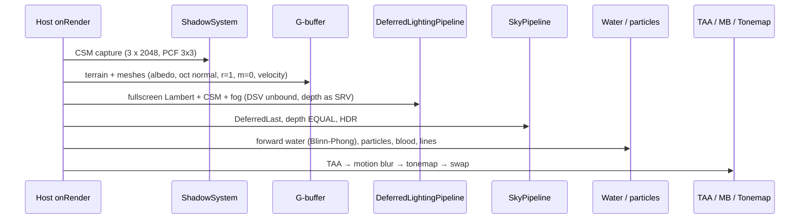
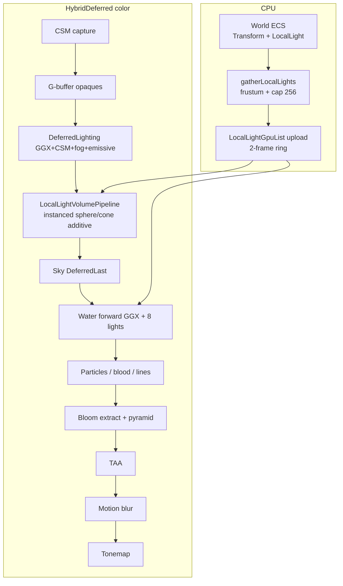
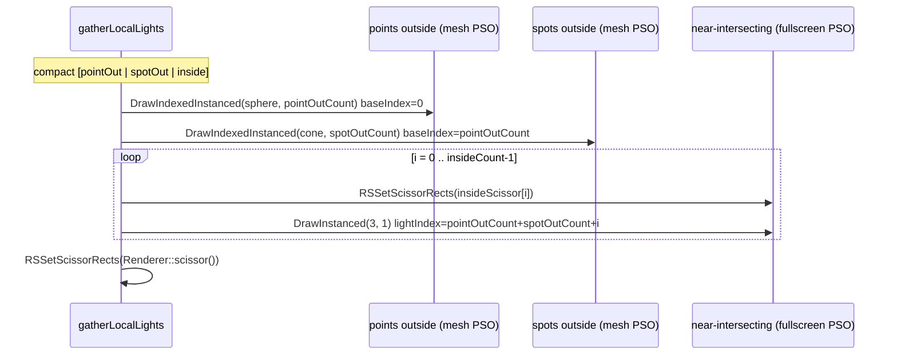

# Deferred Local Lights, GGX, and Bloom for DarkEngine6

| Field | Value |
|-------|--------|
| **Title** | Classic deferred light volumes (point/spot) + GGX + HDR bloom |
| **Author** | TBD |
| **Date** | 2026-09-05 |
| **Status** | Draft (rev 3) |
| **Area** | `Render/` + `content/shaders/` + `ECS/` + `Scene/` + Editor 3D + Sandbox 3D |
| **Audience** | Engine, Sandbox, Editor owners who already know this tree |
| **Prior art** | `Render/DESIGN-deferred-renderer.md` (hybrid deferred — **implemented**) |
| **Default 3D path** | `ScenePath::HybridDeferred`. CLI `-forward` keeps swap-chain Lambert. |

---

## Overview

DarkEngine6’s 3D path is already a hybrid deferred frame: opaques write a 2-target G-buffer, a fullscreen pass evaluates **one** directional Lambert + CSM + exponential fog into `R16G16B16A16_FLOAT`, sky is depth-tested last among opaques, water/particles stay forward on HDR, then optional TAA / motion blur and a saturate-or-ACES tonemap onto the UNORM swap chain. That frame cannot yet express lanterns, flashlights, muzzle flashes, or glowing props: there is no local-light list, the G-buffer roughness/metallic channels are placeholders, water is a self-contained Blinn-Phong shader, and there is no bloom extract.

This document adds **classic deferred light volumes** (sphere for point, cone for spot), rasterized after the directional pass with **additive GGX** into the existing HDR target. Lights live in ECS, persist in scene JSON, and are gathered CPU-side each frame into a GPU structured buffer. Shading becomes Frostbite-style punctual GGX (metallic-roughness) for the deferred directional pass, the volume pass, and forward water’s local-light loop. Existing assets keep looking mostly diffuse because G-buffer roughness stays **1** and metallic stays **0**. HDR overbright (sun disc, emissive fixtures, intense local lights) is extracted into a Karis downsample pyramid and added back before tonemap.

Scale target is **64–256 overlapping lights** in a typical 2560×1600 Sandbox camera. The technique is **not** tiled/clustered; fill-rate is the real budget and is mitigated with tight volume meshes, CPU frustum cull, a hard radius cap, camera-inside fullscreen+scissor, and instanced draws. **No local-light shadows in v1.** CSM for sun/moon is unchanged.

---

## Background & Motivation

### What the 3D frame actually does today

Verified against `Sandbox/SandboxApp.cpp` `onRender` (~1473–1724) and `Editor/EditorApp.cpp` `renderScene3D` (~1960–2205).



| Piece | Location | Fact |
|-------|----------|------|
| One directional light | Sandbox: `Sky::Environment` (`Sky/Environment.h`) `lightDir/Color/ambient/fog`. Editor: hardcoded `Vector3f(0.35, 0.85, -0.35)`, ambient `0.22`, fog 0 | `DirectionalLightComponent` in `ECS/Components.h` exists and is **unused** |
| Deferred Lambert | `content/shaders/DeferredLighting.hlsl` | Reconstructs world pos from `D32_FLOAT` + `invViewProj`. `lighting < 0.5` copies albedo. Sky pixels `discard` when `depth >= 1-eps` |
| G-buffer | `content/shaders/GBuffer.hlsli`, `BasicMeshGBuffer.hlsl`, `TerrainGBuffer.hlsl` | RT0 `R8G8B8A8_UNORM` albedo (A written **1**, unused). RT1 `R8G8B8A8_UNORM` oct world normal, B=roughness **1**, A=metallic **0**. Velocity `R16G16_FLOAT`. Depth is `Renderer`’s existing `D32_FLOAT` (no stencil) |
| HDR | `SceneBuffers` `R16G16B16A16_FLOAT` | Bind helper `Renderer::bindHdr(false)` = lighting (DSV unbound, depth SRV). `bindHdr(true)` = sky/water/particles (DSV bound, depth write on for opaques / off for FX) |
| CSM | `Render/ShadowSystem.*`, `content/shaders/Shadow.hlsli` | 3 cascades, 2048, 3×3 PCF. No local-light maps |
| Water | `content/shaders/Water.hlsl`, `Render/WaterPipeline.*` | Forward transparent, **not** in the G-buffer. Own Blinn-Phong + Fresnel + analytic sky. Root constants **exactly 64 dwords** (D3D12 limit). `specPower < 0` is lighting-off |
| Tonemap | `content/shaders/Tonemap.hlsl` | Saturate-copy or Narkowicz ACES. Optional CoC DoF. **No bloom extract** |
| Post | `TaaPipeline`, `MotionBlurPipeline` | After transparents, write `SceneBuffers::post()`, then tonemap `usePostHdr` |
| Working target | `AppConfig` 2560×1600, 1× MSAA, FL 11_0 | Sandbox lens fovY 60°, near 0.18, far 2000. Editor near 0.05, far 500. LH, z in [0,1], not reversed-Z |
| Debug | `DebugRenderState` | Sandbox: lighting/shadows via DevTools (M). Editor: **F6** lighting, **F7** shadows, **F1** fill. `debugState.lighting` is the directional+ambient master switch |
| Scene JSON | `Scene/SceneFile.*`, `Scene/SceneTypes.h` | Version 1. Types: cube, sphere, particle_emitter, platform, coin, spawn. No lights |
| ECS | `ECS/World.h` sparse-set pools | `TransformComponent` + unused `DirectionalLightComponent`. `World::each<T>` is the gather primitive |
| Mesh volumes | `Render/MeshGen.h` | `CreateSphere`, `CreateCone` (Y-up, apex at +Y, centered), `CreateIcosahedron` |
| Instancing | `Mesh::draw` | `DrawIndexedInstanced(..., 1, ...)` only — no instance count API |
| 2D / splash | Sandbox2D, Editor 2D, LoadingScreen, VisualDebugger | UNORM swap chain, never `SceneBuffers`. Stay unlit |

`Render/DESIGN-deferred-renderer.md` **K6** kept `D32_FLOAT` and reserved stencil “for deferred decals / volume lights later.” **K9** left lighting in the current UNORM working space (not linear scene-referred). Bloom, PBR, and clustered lights were explicit non-goals of that RFC. This document is that follow-up, except it chooses **classic volumes** over clustered (user-locked).

### Pain points

1. **One light.** Lanterns, flashlights, muzzle flashes, and emissive props cannot exist as lighting — only as unlit meshes / particles.
2. **Lambert only.** Roughness/metallic are already in the G-buffer and ignored. Adding specular maps later would still need a BRDF.
3. **Water is a sealed forward shader.** Light volumes shade G-buffer pixels; the water surface is never in that G-buffer, so a volume pass cannot light it.
4. **HDR is unused as HDR.** Sky already writes sun disc `> 1`; local lights will too. Tonemap saturates or ACES-curves them, but there is no glow.
5. **`DirectionalLightComponent` is a lie.** Scene authors have no light type, no inspector, no JSON.
6. **Editor 3D has no inspector** for selected 3D objects (the ImGui “2D Level” panel is 2D-only). Lights need one.

### Why volumes (not clustered) at 64–256 lights

User-locked. Classic volumes are the smallest delta from the current host-owned pass list: one new PSO family, one structured buffer, two instanced draws. Clustered/tiled would add a compute cull pass the engine does not have (deferred RFC forbade compute in v1; this RFC still does not require it). The honest cost is **fill-rate**: 256 overlapping lights at 2560×1600 is tens of millions of GGX pixel-shader invocations. Mitigations are in [Fill-rate](#fill-rate-budget-and-mitigations); we do **not** switch technique if the first scene is heavy.

---

## Goals & Non-Goals

### Goals (v1)

- ECS **point** and **spot** lights (`LocalLightComponent` + `TransformComponent`), spawned/destroyed/animated at runtime, persisted in scene JSON.
- Classic deferred **light volumes** after the directional pass: sphere / cone, sample G-buffer, **additive** GGX into HDR.
- **PBR punctual units**: candela, windowed inverse-square, Frostbite/Filament GGX. Directional deferred and water local-light shading become the same BRDF.
- G-buffer roughness/metallic stay channels with defaults **1 / 0**. Optional per-material constants later; **no** roughness/metallic/normal texture maps.
- **Emissive** G-buffer channel so a fixture mesh blooms, plus a sibling analytic light that actually lights the room.
- **Bloom** extract / downsample / upsample, sun and local overbright both bloom, debug toggle.
- **Water receives local lights** via a forward loop of the first 8 lights of the camera-score-capped list (water stays out of the G-buffer).
- Editor: create / move / inspect / save / load point and spot. Sandbox: flashlight (spot on camera), muzzle flash, demo lanterns.
- Both **Editor 3D** and **Sandbox 3D**. Feature flags for local lights and bloom. F6 (Editor) / lighting checkbox (Sandbox) keep meaning **directional+ambient**; local lights have their own toggle.
- No C++ exceptions. Init failures are `bool` + `DE_LOG_ERROR(LogCategory::Render, ...)`.
- Unit tests for attenuation, spot cone, ECS gather, GGX energy on CPU, scene JSON round-trip.

### Non-goals (v1)

- Tiled, clustered, or compute light culling.
- Local-light shadow maps (cube or spot). CSM sun/moon unchanged.
- Area lights / LTC.
- Indoor sun-suppress / stencil interior volumes. **Outdoor only**; sun CSM always on.
- Full PBR material textures (normal / roughness / metallic / AO maps).
- Writing lights into the G-buffer (G-buffer stays surface attributes).
- Lit particles, fogged water, deferred decals.
- MSAA, reversed-Z, sRGB / linear working-space fix (still K9 of the deferred RFC).
- Replicating lights over `NetworkSystem` (same as particle emitters today).
- 2D paths, LoadingScreen, VisualDebugger.
- Changing `DirectionalLightComponent` to drive the sun (Sandbox stays on `Environment`).
- A `DeferredRenderer` / frame graph. Hosts still own `onRender`.
- Editing `build/_deps/`.

### `-forward` (SwapChainForward)

**Local lights and bloom are HybridDeferred-only in v1.** `-forward` keeps today’s 1-directional Lambert in `BasicMesh.hlsl` / `Terrain.hlsl` and Blinn-Phong water. Placed lights still exist in ECS/JSON (Editor can author them) but they do not shade the UNORM path.

Rationale: duplicating GGX + a light-list SRV into three forward shaders is a third lighting implementation; the rollback path is already “old look.” A capped 8-light forward loop is a follow-up, not a v1 gate.

---

## Key Decisions

| ID | Decision | Rationale |
|----|----------|-----------|
| **L1** | **Classic light volumes**, not clustered/tiled. G-buffer stays surface attributes. | User-locked. Smallest delta from current host pass list. |
| **L2** | **Point + spot only.** Shared `LocalLightComponent` + `LocalLightType` enum. Direction/position from `TransformComponent`. | One gather, one GPU struct, two volume meshes. No area/LTC. |
| **L3** | **No local-light shadows in v1.** `castShadow` field reserved, ignored. CSM unchanged. | Cube/spot maps are a separate resource/pass RFC. |
| **L4** | **Frostbite/Filament GGX with the V form.** `spec = D * V * F` where `V_SmithGGXCorrelated` **already includes** `1/(4 NdotV NdotL)`. Do **not** divide by `4 NdotV NdotL` again. Diffuse is `albedo*(1-metallic)*NdotL` (no 1/π, L21). Shared `PbrLighting.hlsli` + CPU `Render/PbrLighting.h`. | Filament and Frostbite both fold the specular denominator into V. Writing both terms double-counts and blows highlights. CPU tests cannot exist until this is frozen. |
| **L5** | **Light intensity is candela** (lm/sr). GPU stores `color * intensity` as the punctual I. Directional sun stays `Environment::lightColor()` (unitless) — do not force the sun into candela in v1. | Matches “physically based light units” without retuning the sky model. |
| **L6** | **Range attenuation** is Frostbite’s smooth window × `1/(d²+ε)`, hard 0 at `range`. Default range 8 m, **clamp 80 m**. | Infinite inverse-square plus a window is what artists expect; the clamp is the fill-rate valve. |
| **L7** | **Fog: directional pass keeps today’s exp fog (color lerp). Local lights multiply by `(1-fog)` and do not add `fogColor`.** Sky unfogged. Water unfogged (existing). | Lights in fog should dim, not punch a second fog term or glow through the horizon. Applying fog only on directional would leave lanterns as unfogged orbs. |
| **L8** | **Pass order (HybridDeferred):** CSM → G-buffer → directional GGX+CSM+fog+emissive → **additive local volumes** → sky → water (forward GGX + N local) → particles/lines → **bloom** → TAA → motion blur → tonemap. | User-requested order. Bloom before TAA so TAA stabilizes glow. Water after volumes because water is not in the G-buffer. |
| **L9** | **Volume coverage + analytic test.** Depth **disabled** on the volume PSO (depth stays SRV, same as today’s lighting pass). Source of truth is sphere/cone test in the PS. Hardware GREATER/LESS + stencil is v1.1. | Avoids `DEPTH_READ \| PIXEL_SHADER_RESOURCE` and extra z-test PSO permutations. Near-plane-intersecting lights use fullscreen+scissor (L10) because a clipped mesh would hole the volume. |
| **L10** | **Two instanced draws of camera-outside lights** (points, then spots) plus **per-light fullscreen+scissor** for near-plane-intersecting volumes. Gather emits **disjoint** index ranges so an inside light is never also instanced (no double lighting). | `RSSetScissorRects` is per-draw. Near-plane clip holes the mesh even when the camera origin is outside the analytic volume (Sandbox near **0.18 m**). |
| **L11** | **Bounding volume meshes**, not inscribed. Icosphere subdiv 1 and 16-slice +Z cone are inflated so the **inscribed** analytic unit sphere/cone sits inside the mesh; extra pixels `discard` in the PS. Instance scale is still the analytic `range` / `tan(outer)*range`. | `CreateIcosahedron` vertices lie on the circumscribed sphere; faces sit inside `range` and leave silhouette holes if used as coverage. |
| **L12** | **Spot axis = `rotation.Rotate(Vector3f(0,0,1))`** (toward the cone base, matching LH `Camera3D::GetLook`). Inner/outer in **degrees** on the component, cosines on gather. Analytic cone: `l = normalize(lightPos - worldPos)` (surface-to-light); **`cosTheta = dot(-l, dir)`**; discard if `cosTheta < outerCos`. Same `cosTheta` feeds `spotAngleAttenuation`. | `dot(l, dir)` is inverted: a surface on +Z in front of the light gives `l = -Z`, `dot = -1`, and the whole beam discards. Karis/UE `cosTheta` is light-to-surface vs the spot axis. |
| **L13** | **Water v1 = forward loop of 8 score-capped lights.** **Move `WaterFrameConstants` off root constants onto a 2-frame UPLOAD CBV** (same pattern as `ShadowSystem`). Root signature becomes CBV b0 (2 DWORDs) + root SRV t0 `gLights` (2 DWORDs) = **4 DWORDs**. `lightCount` + `waterIndex[8]` live **in that CBV**, not a second root-constant table. Do **not** append to the existing 64-DWORD slot 0 — `D3D12SerializeRootSignature` would fail (64+2+9 = 75). Roughness **0.15**, F0 = `fresnelF0`. `specPower < 0` stays lighting-off. | Today `WaterPipeline` is already at the 64-DWORD root-constant cap (`WaterPipeline.h` / `.cpp`). A root SRV is 2 DWORDs; there are **no** unused pads. CBV-move is the shrink. |
| **L14** | **Emissive = G-buffer RT0.a, explicit 0 unless set.** Every G-buffer writer writes 0 by default (shaders, hosts, clear value). Directional pass: `lit += albedo.rgb * albedo.a * kEmissiveGain` (gain 4). | Today shaders hardcode `a=1` and several hosts pass `color[3]=1` / `unpackRgba8` alpha 255. Changing only `Material::applySurface` would bloom PathChase, health packs, and networked cubes. |
| **L15** | **Bloom is HybridDeferred-only.** Karis **½-res extract + 5 downsample mips = 6 HDR targets**, tent upsample, composite onto HDR **after transparents, before TAA**. Threshold 1.0, soft knee. Toggle `DebugRenderState::bloom`. | Sun disc already exceeds 1. Leave HDR as **RT** after composite so `TaaPipeline::draw` → `bindPostHdr` can promote it to SRV. Do not use `SceneBuffers::post()`. |
| **L16** | **`-forward`: no local lights, no bloom.** Honest non-goal. ECS/JSON still round-trip so the Editor can author on either path. | Avoid a third lighting implementation in `BasicMesh`/`Terrain`. |
| **L17** | **Outdoor only.** No indoor sun-suppress. CSM always evaluated in the directional pass. | User-locked. |
| **L18** | **Cap `kMaxLocalLights = 256`** packed per view. If more enabled+in-frustum, keep the 256 with largest `intensity / (d²+1)` at the camera. Log a throttled WARN. | Matches the scale target. Overflow is artist-visible, not silent. |
| **L19** | **`Renderer` does not own lights.** New `LocalLightVolumePipeline` (PSO) + `LocalLightGpuList` (upload) as host members, same pattern as `DeferredLightingPipeline` / `ShadowSystem`. Gather is a free function over `World`. | Deferred RFC K1: no second renderer. Hosts disagree on flashlight vs gizmos. |
| **L20** | **No exceptions.** `create` returns `bool`. Failed bloom or volume PSO: log, leave `isValid()==false`, skip the pass. Do not fall back to throwing MeshGen. | `Agents.md`. |
| **L21** | **Color space stays K9.** GGX runs in the current UNORM-ish working space. Physically based *units* and *shapes*; not a linear-sRGB migration. | Coupling PBR to a look-breaking sRGB change would make this unshippable. Follow-up can keep `PbrLighting.hlsli` and only change inputs. |
| **L22** | **Do not start reading `DirectionalLightComponent`.** Sun/moon stay `Environment` (Sandbox) / hardcoded (Editor). | Same as deferred RFC Q6. Local lights are a new component. |
| **L23** | **Lights are not networked in v1.** Not a `NetPrefab`. Same as particle emitters. | Snapshot payload has no light fields; don’t sneak them into `colorRgba8`. |
| **L24** | **Stencil stays off. Depth format stays `D32_FLOAT`.** | Avoids a DSV-format ripple through every PSO (mesh, terrain, water, sky, particles, lines, shadows). Stencil mark is the v1.1 fill-rate tool. |
| **L25** | **One `CBV_SRV_UAV` heap per draw.** Volume pass: `lightingHeap()` table for albedo/attrib/depth **plus root SRVs** for `gLights` / `gVolumeWorld`. Volume slot 0 constants **and both root SRVs** use `D3D12_SHADER_VISIBILITY_ALL` (`viewProj`/`baseIndex` are VS; `invViewProj`/`lightIndex` are PS). Water: **no texture heap** — CBV + one root SRV (L13). Never two heaps. | Lighting’s constants are PIXEL-only; copying that for volumes would leave the mesh VS with identity WVP. Water has no descriptor heap today. |

---

## Proposed Design

### Architecture



Hosts still sequence the frame. New objects:

| Object | Owner | Lifetime |
|--------|-------|----------|
| `LocalLightComponent` pool | `World` | entity |
| `gatherLocalLights` | `Render/LocalLightGather.h` (CPU, no D3D) | per view |
| `LocalLightGpuList` | host (`SandboxApp`, `EditorApp`) | process; resize-stable 256×64 B × 2 frames |
| `LocalLightVolumePipeline` | host | `onInit` if `scenePath()==HybridDeferred` |
| Volume `Mesh` sphere + cone | host | `onInit` |
| `BloomPipeline` + pyramid textures | host, or `SceneBuffers` extra mips | created with `enableSceneBuffers` / `BloomPipeline::create(device, w, h)` and recreated on resize |
| `PbrLighting.hlsli` / `PbrLighting.h` | shaders + CPU tests | compile time |

### Frame bind points (HybridDeferred)

Matches current helpers; **one new bind is not required** if volumes keep DSV unbound.

| Step | Bind | Notes |
|------|------|-------|
| G-buffer | `bindGBuffer()` | albedo + attrib + velocity + DSV |
| Directional lighting | `bindHdr(false)` | HDR RT, DSV **null**, depth+G-buffer SRV. **Unchanged.** Add emissive and GGX inside `DeferredLighting.hlsl` |
| Local volumes | stay on HDR, DSV still null | Same resource states as lighting. Additive blend PSO. **Hard insertion:** after `m_lighting.draw`, **before** `bindHdr(true)` in `SandboxApp::onRender` (~1597–1600) and `EditorApp::renderScene3D` (~2117–2118). `clearHdr` already ran **once** before directional lighting — do **not** add a second clear. Restore `RSSetScissorRects` to `Renderer::scissor()` at the end of the volume pass (inside-loop scissors). `bindHdr(true)` also restores the full scissor; keep the explicit restore so the loop is safe if moved. |
| Sky / water / FX | `bindHdr(true)` | DSV back, depth write off for transparents. Water: **CBV + root SRV** (L13), no extra heap. |
| Bloom | HDR → SRV for extract; pyramid RTVs; HDR → RT for additive composite; **leave HDR as RT** | Unbind DSV. `TaaPipeline::draw` calls `bindPostHdr()`, which transitions HDR to SRV. |
| TAA / MB / tonemap | existing | Bloom output is the HDR that TAA reads |

**Do not** add a second `clearHdr` between directional and volumes.

### CPU gather

Gather is a **draw planner**, not only a packed light array. It must feed the volume VS (row-vector world matrices), the two instanced draws, the inside fullscreen path, and water’s 8-light loop **without double-lighting**.

```cpp
// Render/LocalLightGather.h
static constexpr uint32_t kMaxLocalLights       = 256;
static constexpr uint32_t kWaterLocalLightMax   = 8;

enum class LocalLightType : uint8_t { Point = 0, Spot = 1 };

struct GpuLocalLight
{
    float pos[3];
    float range;
    float color[3];     // linear rgb * candela
    float invRange2;    // 1 / max(range^2, eps)
    float dir[3];       // world axis, unit (spot); (0,0,0) for point
    float type;         // 0 point, 1 spot
    float innerCos;
    float outerCos;
    float sourceRadius;
    float pad;
};
static_assert(sizeof(GpuLocalLight) == 64, "GpuLocalLight stride");

struct LocalLightCullInput
{
    const Frustum3f* frustum = nullptr; // required
    Math::Vector3f   cameraPos{};
    Math::Vector3f   cameraLook{};      // unit, for near-plane test
    float            nearZ    = 0.18f;
    uint32_t         maxOut   = kMaxLocalLights;
    float            maxRange = 80.0f;
    uint32_t         viewportW = 2560;
    uint32_t         viewportH = 1600;
    const Math::Matrix4f* viewProj = nullptr; // for scissor; required for inside path
};

struct LocalLightDrawLists
{
    GpuLocalLight  lights[kMaxLocalLights];
    Math::Matrix4f volumeWorld[kMaxLocalLights]; // row-vector, same as makeWorldMatrix: S * R * T
    D3D12_RECT     insideScissor[kMaxLocalLights]; // densely packed 0..insideCount-1
    uint32_t       count        = 0; // GPU buffer length: [pointOut | spotOut | inside]
    uint32_t       pointOutCount = 0; // lights[0 .. pointOutCount)
    uint32_t       spotOutCount  = 0; // lights[pointOutCount .. pointOutCount+spotOutCount)
    uint32_t       insideCount   = 0; // lights[pointOut+spotOut .. count); insideScissor[i] ↔ lights[pointOut+spotOut+i]
    uint32_t       waterIndex[kWaterLocalLightMax]; // compacted GPU indices (not pre-compact slots)
    uint32_t       waterCount   = 0;
};

// Fills out. Never throws. Returns false only if frustum/viewProj missing.
bool gatherLocalLights(World& world, const LocalLightCullInput& in, LocalLightDrawLists& out);
```

Algorithm:

1. `world.each<LocalLightComponent>(...)`.
2. Skip `!enabled`. Skip if no `TransformComponent`.
3. `range = min(comp.range, in.maxRange)`, skip if `range <= 0` or `intensity <= 0`.
4. Point: sphere `(position, range)` vs `frustum->Intersects(Sphere3f)`.
5. Spot: **v1 conservative sphere** `(position, range)` (over-accepts). `dir = rotation.Rotate(Z_AXIS)`.
6. Score `intensity / (distanceToCamera² + 1)`. Keep top `maxOut` (partial_sort). Overflow → throttled WARN.
7. Pack `color*intensity`, `cos(innerDeg)`, `cos(outerDeg)`. Inner clamped `<= outer`. Degenerate outer (`<= 0`) → treat as point.
8. **Near-plane / coverage-fail (“inside”) test** — **not** “camera origin inside the cone.” A volume takes the fullscreen+scissor path when the bounding sphere reaches the near plane:

   `distance(cameraPos, center) - radius < nearZ`

   with `center = position`, `radius = range` (same conservative sphere as cull). This covers (a) camera origin inside the sphere, (b) near plane clipping a mesh whose origin is still outside, (c) flashlight: apex is `look*0.2` with `near=0.18` and `range=22`, so **the flashlight always takes the scissor path** (intended; a 22 m cone mesh would clip).
9. Compact GPU order **disjoint** regions so inside lights are **not** in the instanced draws:
   - `[0, pointOutCount)` — points that failed the near test (mesh path)
   - `[pointOutCount, pointOutCount+spotOutCount)` — spots that failed the near test
   - `[pointOutCount+spotOutCount, count)` — inside/near-intersecting, any type
10. `volumeWorld[i]` — **row-vector**, matching `EditorApp` / `SandboxApp` `makeWorldMatrix` (`S * R * T`):
    - Point: `Scale(range,range,range) * Translation(pos)` (identity R).
    - Spot: `Scale(tan(outer)*range, tan(outer)*range, range) * FromLookRotation(dir, up).ToMatrix4() * Translation(pos)` with `up = abs(dir.y) > 0.9 ? X : Y`. **`FromLookRotation` lands in PR 2** (gather is the first caller).
    - HLSL: `mul(float4(pos,1), gVolumeWorld[iid])` under `#pragma pack_matrix(row_major)`.
11. **`waterIndex` is a permutation into the compacted array.** Record the 8 highest-score lights from the pre-compact list, then **remap** those identities to their post-compact slots in `lights[]`. Do **not** store “first 8 packed slots” after compact (compact shuffles score order into pointOut/spotOut/inside). `waterIndex[i] < count`. Flashlight ranks high. A bright distant light can beat a dim shore lantern — **accepted** (L13).
12. **`insideScissor` is densely packed.** After compact, for `i` in `[0, insideCount)`: GPU index `lightIndex = pointOutCount + spotOutCount + i`, scissor `insideScissor[i]` (not `insideScissor[lightIndex]`). Empty rect → omit from `insideCount` (do not leave holes).

`Frustum3f::Intersects(const Sphere3f&)` already exists (`Render/Frustum3f.h`).

**Projected AABB → `D3D12_RECT`:** take the light’s world AABB (point: cube of side `2*range`; spot: AABB of the 8 cone-frustum corners: apex + 4 base corners, plus the conservative sphere AABB if cheaper). Transform corners by `viewProj`. For each corner: if `w <= 0` (behind camera), treat as covering that NDC edge (set x or y to −1 or +1 depending on the clipped side) rather than dropping the light. NDC `x' = clip.x/w`, `y' = clip.y/w`. Pixel: `x = (x'*0.5+0.5)*viewportW`, `y = (1-(y'*0.5+0.5))*viewportH` (D3D top-left). Clamp to `[0, viewportW]` / `[0, viewportH]`. If `left >= right` or `top >= bottom`, skip. Optional: skip if area `< 16` px.

CPU unit tests: near-plane classification (camera inside sphere → inside; camera 100 m away → outside; sphere overlapping near with origin outside → inside); `waterIndex` values are compacted indices of the 8 highest scores; `insideScissor[i]` pairs with `lights[pointOut+spotOut+i]`; spot `volumeWorld` maps unit `(0,0,1)` to `pos+dir*range`; **spot `cosTheta` on +Z inside range is ≈ 1, not −1** (`dot(-l, dir)`).

### GPU light list

`LocalLightGpuList` (L25): **no shader-visible descriptor heap**. Structured buffers are bound as **root SRVs** (GPU virtual address).

Match **`ShadowSystem`’s CBV ring**, not DEFAULT+copy:

- One `D3D12_HEAP_TYPE_UPLOAD` buffer for lights (`kMaxLocalLights * 64 * kFrameCount` bytes) and one for `volumeWorld` (`kMaxLocalLights * 64 * kFrameCount`). Created in `GENERIC_READ` (UPLOAD initial state). Persistent `Map(0, nullptr)` like `ShadowSystem::m_cbUpload` (`ShadowSystem.cpp` ~139–141).
- Each frame: `slot = frameIndex % kFrameCount`, `memcpy` into `mapped + slot * stride`. Do not write the in-flight slot.
- Bind `GetGPUVirtualAddress() + slot * stride` as the root SRV. UPLOAD `GENERIC_READ` is legal for buffer SRVs — **no** `CopyBufferRegion`, **no** resource barrier.
- Do **not** use DEFAULT + staging copy. That path needs an explicit `COPY_DEST → PIXEL_SHADER_RESOURCE | NON_PIXEL_SHADER_RESOURCE` barrier on both buffers (VS reads `gVolumeWorld`, PS reads `gLights`); this tree has no such structured-buffer copy today, and omitting the barrier fails the debug layer.

Volume draw: `SetDescriptorHeaps(1, lightingHeap)` then `SetGraphicsRootShaderResourceView` with the slot VAs.

Water draw: **no** `SetDescriptorHeaps`. Bind the same lights VA as a root SRV next to the water CBV.

Dummy: 64-byte persistently-mapped UPLOAD zero. When `count==0` or init failed, water binds the dummy VA and `lightCount=0`.

Init failure → `isValid()==false` → skip volume draws; water uses the dummy VA.

### Volume generation and instancing

```cpp
// Mesh.h
void draw(ID3D12GraphicsCommandList* cmd, bool pointList = false) const;
void drawInstanced(ID3D12GraphicsCommandList* cmd, uint32_t instanceCount) const;
```

`drawInstanced` is `DrawIndexedInstanced(m_indexCount, instanceCount, 0, 0, 0)`.

**No tan(outer) reconstruction in the VS.** The only instance transform is `gVolumeWorld`:

```hlsl
StructuredBuffer<float4x4> gVolumeWorld : register(t5);

float4 VSMain(float3 pos : POSITION, uint iid : SV_InstanceID) : SV_POSITION
{
    float3 world = mul(float4(pos, 1.0f), gVolumeWorld[iid + baseIndex]).xyz;
    return mul(float4(world, 1.0f), viewProj);
}
```

Fullscreen PSO VS is the existing `SV_VertexID` triangle (`DeferredLighting.hlsl` / sky); PS still indexes `gLights[lightIndex]`.

**Bounding meshes (L11).** `CreateIcosahedron(radius)` places vertices on the **circumscribed** sphere; faces sit inside. After generating a unit icosphere (subdiv 1, 80 tris), scale by `1 / minFacePlaneDistance` so the **inscribed** sphere has radius 1. `CreateSpotVolumeCone`: apex origin, +Z, analytic unit height 1 / base radius 1, then inflate:

- Base XY: `1 / cos(π / slices)` (circumradius → inradius of the 16-gon), slices = 16 → ≈ 1.020.
- Height: inflate by the same factor so side faces contain the analytic cone (unit test is the gate, not the exact formula).

Instance scale stays analytic (`range`, `tan(outer)*range`). Extra rasterized pixels hit the PS and `discard` on the analytic test.

Unit test (`MeshGenTests`): ≥256 directions on the unit sphere (and inside the unit cone, `dot(dir, Z) >= cos(atan(1))`) must intersect the mesh at `t >= 1 - 1e-3`. Directions outside the analytic cone may miss. Winding: CCW outward under **`FrontCounterClockwise = TRUE`** — `MeshPipeline.cpp` ~134, `TerrainPipeline`, `WaterPipeline`, and `ShadowPipeline` all set this explicitly (not the D3D default `FALSE`). Side-face normals must have positive dot with `(vertex - origin)`.

Icosphere subdiv 1 is enough; a 24-stack UV sphere is wasteful. Do **not** reuse centered Y-up `CreateCone`.

### Volume PSO

`Render/LocalLightVolumePipeline` + `content/shaders/LocalLightVolume.hlsl`.

**Two PSOs** (same root signature, same PS):

| PSO | VS | IA | Cull | Use |
|-----|----|----|------|-----|
| `m_psoMesh` | `VSMain` mesh | `POSITION` (or full `MeshVertex`, ignore N/UV) | BACK, `FrontCounterClockwise = TRUE` | instanced sphere / cone |
| `m_psoFullscreen` | `VSFullscreen` (`SV_VertexID` triangle, clip z = 0) | none | NONE | near-intersecting lights |

Root signature (L25) — **one heap**. Slot 0 and both root SRVs are **`D3D12_SHADER_VISIBILITY_ALL`** (do not copy `DeferredLightingPipeline`’s PIXEL-only constants — the mesh VS needs `viewProj` / `baseIndex` / `gVolumeWorld`).

| Slot | Type | Visibility | Contents |
|------|------|------------|----------|
| 0 | 32-bit constants b0 | **ALL** | `LocalLightPassConstants` (see below) |
| 1 | descriptor table t0–t2 | PIXEL | **`Renderer::lightingHeap()`** first three slots (`kLightingAlbedo/Attrib/Depth`). Range **3**. `SetDescriptorHeaps(1, lightingHeap)` |
| 2 | **root SRV** t4 | **ALL** | `gLights` GPU VA |
| 3 | **root SRV** t5 | **ALL** | `gVolumeWorld` GPU VA |

```cpp
struct LocalLightPassConstants
{
    float invViewProj[16];
    float viewProj[16];     // mesh VS
    float cameraPos[3];
    float fogDensity;
    float fogColor[3];
    float lighting;         // CPU skips draws if < 0.5; shader may also discard
    uint32_t baseIndex;     // instanced: start in gLights / gVolumeWorld
    uint32_t lightIndex;    // fullscreen: which light
    float viewportW;
    float viewportH;
};
// 16+16+3+1+3+1+1+1+1+1 = 44 dwords < 64
static_assert(sizeof(LocalLightPassConstants) == 44 * sizeof(float), "local light root constants");
```

Blend / depth (both PSOs):

- RT: `R16G16B16A16_FLOAT`
- Blend: **additive** `SRC=ONE, DEST=ONE, OP=ADD` RGB. Alpha: `ZERO, ONE` (preserve dest)
- DepthEnable = FALSE, StencilEnable = FALSE, `DSVFormat = UNKNOWN`
- Fill solid only (ignore F1 — volumes are not debug geometry)

Pixel shader (shared):

1. `Load` depth at `SV_POSITION.xy`. `discard` if `depth >= 1 - eps` (sky / background).
2. Reconstruct world pos — **same** `ReconstructWorldPos` currently in `DeferredLighting.hlsl`; PR 1 moves it to `GBuffer.hlsli`.
3. Load albedo + attrib. Decode oct normal. `roughness = attrib.b`, `metallic = attrib.a`.
4. Frozen spot vectors (L12), same in HLSL and `PbrLighting.h`:
   ```
   float3 toLight = lightPos - worldPos;          // surface-to-light
   float  d       = length(toLight);
   float3 l       = toLight / max(d, 1e-4);       // NdotL, attenuation, source-radius
   float  cosTheta = dot(-l, dir);                // light-to-surface vs axis toward base
   ```
   Point: `discard` if `d > range`. Spot: `discard` if `cosTheta < outerCos`. **Not** `dot(l, dir)` — that is −1 on the beam axis and discards every in-front pixel.
5. `PbrPunctual(...)` × windowed attenuation × `spotAngleAttenuation(cosTheta, innerCos, outerCos)`. Source-radius uses `toLight`.
6. Multiply by `(1 - fog)` with `fog = saturate(1 - exp(-fogDensity * distToCam))`. Do not add `fogColor`.
7. If `lighting < 0.5`: CPU skips the whole pass (F6 / DevTools). Local lights are not an albedo copy.
8. Output `float4(lit, 0)`.

**Independent local-light toggle** (`debugState.localLights`): CPU skips gather/draw. Does **not** change the directional pass.



v1: **one fullscreen draw per inside light** (flashlight always; plus lanterns you stand in). After the loop, restore the renderer scissor even though the next `bindHdr(true)` also does.

### Directional pass changes (`DeferredLighting.hlsl`)

Keep root signature, shadow CBV, discard-on-sky, lighting-off albedo copy.

When `lighting >= 0.5`:

```
n = DecodeOct(attrib.rg)
roughness = attrib.b
metallic  = attrib.a
emissive  = albedo.a
lit = ambient * albedo.rgb
    + PbrDirectional(n, v, albedo.rgb, roughness, metallic, lightDir, lightColor) * shadow
    + albedo.rgb * emissive * kEmissiveGain
fog as today
```

`PbrDirectional` is the same GGX with a directional `l` (no distance attenuation, no source radius, or a large sun angular radius later — **v1: punctual sun**, roughness 1 hides the missing disc).

Receiver bias / CSM path **unchanged**.

G-buffer writers (`BasicMeshGBuffer.hlsl`, `TerrainGBuffer.hlsl`):

```
o.albedo = float4(albedo.rgb, emissive); // emissive from color.a, terrain writes 0
o.attrib = float4(EncodeOct(n), roughness, metallic); // still 1, 0 unless constants added
```

`MeshGBufferConstants.color[3]` is emissive. **Default 0 at every writer** — `Material::applySurface` is not sufficient:

| Site | Today | PR 1 change |
|------|-------|-------------|
| `BasicMeshGBuffer.hlsl` | `float4(albedo.rgb, 1.0f)` | `float4(albedo.rgb, color.a)` |
| `TerrainGBuffer.hlsl` | `float4(albedo.rgb, 1.0f)` | `float4(albedo.rgb, 0)` (ignore `color.a`) |
| `SceneBuffers::kAlbedoClear` | `{0,0,0,1}` | `{0,0,0,0}` |
| `Material::applySurface` / `m_baseColor[3]` | `setBaseColor(..., a=1)` | write **0** into G-buffer a (tint RGB only) |
| `EditorApp` `drawMesh` G-buffer | `gcb.color[3] = 1.0f` | `0` unless `MeshComponent::emissive` |
| `SandboxApp` G-buffer cubes | `gcb.color[3]=1` then `unpackRgba8` (alpha 255) | unpack RGB only; set `a = MeshComponent::emissive` (0) |
| `PathChase::drawMeshesGBuffer` | `cb.color[3] = 1.0f` | `0` |
| `SandboxApp::drawHealthPacksGBuffer` | `cb.color[3] = 1.0f` | `0` |

Helper (Sandbox/Editor, not necessarily shared): after any `unpackRgba8` into a **G-buffer** CB, set `color[3] = emissive` (usually 0). Do not use packed alpha as emissive. Forward `MeshFrameConstants.color[3]` may stay 1 (albedo alpha / unused).

PR 1 grep checklist: `color[3] = 1` in G-buffer fills (`BasicMeshGBuffer`, `TerrainGBuffer`, `drawMeshesGBuffer`, `drawHealthPacksGBuffer`, Editor `drawMesh`, `unpackRgba8` call sites that feed `MeshGBufferConstants`).

### Fill-rate budget and mitigations

Working target **2560×1600 = 4.096e6 pixels**.

| Scenario | Coverage assumption | PS invocations | Severity |
|----------|---------------------|----------------|----------|
| 64 lights × 5% screen | 0.05 × 4.1e6 × 64 | ~13 M | Comfortable |
| 256 lights × 5% | ×256 | ~52 M | Heavy but OK on desktop if early-out |
| 16 lights × full screen (no scissor / no near test) | 16 × 4.1e6 | ~66 M | **Bad** — this is why L10 exists |
| 256 lights × 25% (large radii, no clamp) | ~262 M | **Unacceptable** | L6 80 m clamp + scissor/inside path |
| Water 8-light loop, 50% of 2560×1600 wet | 0.5 × 4.1e6 × 8 | ~16 M **on top of** volumes | Medium — Gerstner water is already heavy; 8 is the cap |

Depth is **disabled** (L9). Back-face cull only **limits raster to the front-face projection**; it is not HW z-reject, and the analytic `discard` runs after the PS launches. Do not claim “one shaded hit per silhouette pixel” in the z-tested sense.

The flashlight is **not** the expensive inside path unless we used a camera-origin test: its apex sits in front of the eye, so a naive “origin in cone” test would instance a near-clipped cone (holes). The **near-plane intersection** test (Issue 4 / gather step 8) puts the flashlight on fullscreen+scissor of the **cone AABB** (tens of percent of the screen, not 100%). The full-screen-without-scissor case is standing inside a large lantern / muzzle sphere.

Mitigations (all v1, no technique change):

1. Bounding but still tight icosphere / capped cone (L11) — silhouette ≈ projected sphere, not a cube.
2. Back-face cull — raster = front-face projection only; **no HW z-reject in v1**.
3. CPU frustum cull + score cap 256 (L18).
4. `maxRange` 80 m; Editor slider clamped; gather enforces.
5. Near-intersecting volumes → fullscreen + **scissor of projected AABB**, not a sphere mesh (L10).
6. Skip lights whose projected AABB area `< 16 px` (optional cheap reject in gather).
7. Two instanced draws, not 256.
8. Analytic discard still runs; keep it cheap (no shadow tap in the volume PS).
9. Debug overlay: count packed lights, count inside lights, estimate screen-area sum. DevTools.

**Not in v1:** stencil mark, clustered, half-res lighting, compute tile lists.

If a profiler later shows volume PS as the frame: first lever is lower `maxRange` and fewer overlapping large radii, not a rewrite.

### GGX BRDF (shared)

`content/shaders/PbrLighting.hlsli` and `Render/PbrLighting.h` (CPU, for tests). No exceptions; pure functions.

Formulation — **Filament / Frostbite V form** (frozen, L4). Comments in `PbrLighting.hlsli` and `PbrLighting.h` must state this:

```
F0         = lerp(0.04, albedo, metallic)
diffuseCol = albedo * (1 - metallic)
a          = roughness * roughness
D          = NDF_GGX(NdotH, a)
V          = V_SmithGGXCorrelated(NdotV, NdotL, a)  // INCLUDES 1/(4 NdotV NdotL)
F          = F0 + (1-F0) * pow(1-VdotH, 5)
Fr         = D * V * F                               // do NOT divide by 4 NdotV NdotL again
Fd         = diffuseCol                              // NO 1/π (engine units, L21)
return (Fd * (1-F) + Fr) * NdotL * lightColor
```

`V_SmithGGXCorrelated` is Filament’s visibility (G / (4 n·v n·l)). Implementing `D*G*F/(4 n·v n·l)` **and** this V **double-counts** the denominator and blows highlights. CPU energy tests compare this exact expression.

Energy: metallic 1 → no diffuse. `Fd *= (1-F)` using Schlick F at VdotH (cheap; not Disney multi-scatter). Roughness 1, metallic 0, `F0=0.04`: specular lobe is extremely broad and dim; with no-π diffuse the directional sun stays within ~15% of today’s `ndotl * lightColor * albedo`.

**Look-preservation choice (L21 + existing assets):**

Today: `ndotl * lightColor * albedo` (no π). A strict π-based PBR directional sun would go ~3× darker.

**v1 directional and punctual diffuse is `diffuseCol * NdotL` (no 1/π), specular is the full GGX term without an extra π.** Document this as “engine units, Frostbite shape.” When the sRGB/linear follow-up lands, add `1/π` and retune `Environment` / candela defaults together.

Punctual attenuation (CPU + HLSL):

```
float windowedDistanceAttenuation(float d2, float invRange2)
{
    float s = saturate(1.0f - d2 * invRange2); // (1 - (d/range)^2)
    s *= s;                                    // square
    return s / max(d2, 1e-4f);
}
```

Spot angular (Karis / UE inner-outer). `cosTheta` is **`dot(-l, dir)`** with `l = normalize(lightPos - worldPos)` (L12). A point on the beam axis must yield `cosTheta ≈ 1`.

```
float spotAngleAttenuation(float cosTheta, float innerCos, float outerCos)
{
    float inv = 1.0f / max(innerCos - outerCos, 1e-4f);
    return square(saturate((cosTheta - outerCos) * inv));
}
```

Source radius (Frostbite sphere-light for punctual spec). `L` is **surface-to-light** (`lightPos - worldPos`), same vector as the NdotL path:

```
float3 L = lightPos - worldPos;          // surface-to-light, not light-world
float3 r = reflect(-v, n);
float3 centerToRay = L - r * dot(L, r);
float3 closest = L - centerToRay * saturate(sourceRadius / max(length(centerToRay), 1e-4));
// renormalize l from closest; optionally fade spec by sphere
```

If `sourceRadius == 0`, skip (pure punctual). Default 5 cm so tiny highlights don’t alias.

### Bloom

New `BloomPipeline` + `content/shaders/Bloom.hlsl` (or one file with multiple entry points: `PSExtract`, `PSDownsample`, `PSUpsample`, `PSComposite`).

Resources (owned by `BloomPipeline`, recreated in `create(device, w, h)` when size changes — hosts call from `onRender` if `renderer().width/height` changed, same pattern as TAA history flags). **6 HDR targets**, not 5:

| Target | Size | Format |
|--------|------|--------|
| extract | `w/2 × h/2` (min 1) | `R16G16B16A16_FLOAT` |
| down[0] | extract / 2 | same |
| down[1] | extract / 4 | same |
| down[2] | extract / 8 | same |
| down[3] | extract / 16 | same |
| down[4] | extract / 32 | same |

Upsample in-place on `down[]` back toward extract. Memory at 2560×1600: extract 1280×800×8 ≈ 7.8 MB + 3.9 + 2.0 + 0.5 + 0.12 + 0.03 ≈ **14.4 MB**. Fine next to existing HDR+G-buffer (~31 MB HDR + 16 MB G-buffer + 8 MB velocity + 31 MB post + 31 MB history).

Algorithm (Karis / Call of Duty):

1. **Extract** at ½ res: sample 4 bilinear HDR taps, Karis luma-weighted average, soft-knee threshold:
   `knee = 0.5`, `t = 1.0`. `soft = saturate((luma - t + knee) / (2*knee)); contrib = max(luma - t, 0) + knee*soft*soft` then `color * (contrib / max(luma, 1e-4))`.
2. **Downsample** extract → `down[0..4]` (5 mips, 6 targets with extract): 4-tap bilinear is enough in v1.
3. **Upsample** tent (9-tap) additive into the next larger mip.
4. **Composite**: `hdr += upsample[0] * bloomStrength` (default 0.04–0.08). Additive onto the **full-res HDR**.

PSO: fullscreen triangle, depth off, extract/down = replace blend, upsample/composite = additive.

Debug: `debugState.bloom` default **true** on HybridDeferred. DevTools checkbox. When false, skip the whole chain (HDR unchanged). Lighting-off (albedo copy) should still skip bloom if we want a raw G-buffer look — **v1: bloom respects `debugState.bloom` only**, not `lighting`. Aces/tonemap still run after.

Sun disc (Sky.hlsl values ~2.8) and local lights with candela in the thousands both exceed threshold 1. Emissive fixtures with `a=1` add `albedo * 4` → blooms.

Do **not** reuse `SceneBuffers::post()` — TAA/MB own it.

**Resource transitions** (`BloomPipeline::draw` owns these; hosts do not call `transitionHdr` themselves, matching deferred K25):

1. Entry: HDR is `RENDER_TARGET` (last writer: water/particles via `bindHdr(true)`). DSV may be bound — unbind (`OMSetRenderTargets` extract RTV, DSV null), matching `bindHdrColorTarget`.
2. `transitionHdr(PIXEL_SHADER_RESOURCE)`. Draw extract (replace blend) into `extract`.
3. Downsample `extract → down[0] → … → down[4]` (replace). Upsample tent additive `down[4] → … → extract`.
4. `transitionHdr(RENDER_TARGET)`. Composite additive `extract * strength` onto HDR.
5. **Leave HDR as `RENDER_TARGET`.** `TaaPipeline::draw` → `Renderer::bindPostHdr()` does `transitionHdr(PIXEL_SHADER_RESOURCE)` + bind `post` as RT. If TAA is off, motion blur / tonemap already know how to promote HDR.

Resize: if `create` fails, `isValid()==false`, skip bloom, log once. HDR remains RT, TAA still works.

### Water local lights

Water cannot use volumes (transparent, Gerstner-displaced, not in G-buffer).

**v1 (L13):** forward loop of 8. `waterIndex[]` are **compacted GPU indices** of the 8 highest camera-scores (gather step 11). Not closest-to-surface, not `gLights[0..7]`.

**Root signature is a CBV-move, not an append.** Today slot 0 is 64 root-constant DWORDs — the D3D12 cap. A root SRV is 2 DWORDs; `lightCount`+`waterIndex[8]` is 9 more. 64+2+9 = 75 will not serialize.

PR 4:

1. `WaterFrameConstants` stays the CPU/HLSL layout (64 floats) and **gains** `uint lightCount; uint waterIndex[8];` at the end (HLSL cbuffer; CBV size aligned to 256 bytes).
2. `WaterPipeline` owns a 2-frame **UPLOAD** CBV ring (`ShadowSystem::m_cbUpload`: `GENERIC_READ`, persistent `Map`, `SetGraphicsRootConstantBufferView`). `setConstants` memcpy’s the struct into `slot = frameIndex % 2` instead of `SetGraphicsRoot32BitConstants`.
3. New root signature (VISIBILITY_ALL), **4 DWORDs total**:

| Slot | Type | Visibility | DWORDs | Contents |
|------|------|------------|--------|----------|
| 0 | CBV b0 | ALL | 2 | `WaterFrameConstants` + `lightCount` + `waterIndex[8]` |
| 1 | root SRV t0 | ALL | 2 | `gLights` GPU VA (same UPLOAD ring as volumes; dummy VA if count=0) |

4. Drop the old 64-DWORD root-constant slot entirely. `-forward` uses the same PSO: `lightCount=0`, dummy VA.

Shader: `[unroll] for (i = 0; i < 8; ++i) if (i < lightCount) accumulate(gLights[waterIndex[i]]);` using **`dot(-l, dir)`** for spots (L12).

HLSL: after body/Fresnel, if `specPower >= 0` and `lightCount > 0`, loop the 8, evaluate `PbrPunctual` with F0 = `fresnelF0` (0.04) and **roughness = 0.15** (frozen). Do **not** derive roughness from `specPower` (`1 - 96/256 = 0.625` would dull today’s tight highlight). Add onto `color` **before** alpha. Water stays src-alpha blended.

Directional water: replace Blinn-Phong `pow(ndoth, specPower)` with the same GGX directional (roughness 0.15). Lighting-off (`specPower < 0`) unchanged (body only). **Accepted look shift** vs current Blinn (see Risks).

Editor has no water — Sandbox only.

### Emissive props

Two entities (or one entity with both components):

1. **Mesh** with `MeshComponent.emissive ∈ [0,1]` written to RT0.a. Visible fixture, blooms in the directional pass.
2. **LocalLight** sibling, `emissiveMesh = meshEntity` (optional link for Editor “select light → highlight mesh”). The light is what illuminates the room.

v1 does **not** auto-spawn the light from the mesh. Editor “Create Glow Prop” can spawn both at once as a convenience.

`LocalLightComponent.emissiveMesh` is documentation/UX, not a gather input.

### Editor UX

3D Create menu (next to Cube / Sphere / Particle Emitter):

| Item | Shortcut | Type |
|------|----------|------|
| Point Light | **Digit4 then P** (`"4+P"`) | `SceneObjectType::PointLight` |
| Spot Light | **Digit5 then P** (`"5+P"`) | `SceneObjectType::SpotLight` |
| Glow Prop | menu only | sphere **mesh entity** + sibling point light, emissive=1 |

Do **not** bind F4/F5. **F5 is Save.** Existing Create menu already uses `"1+P"` / `"2+P"` / `"3+P"` (`EditorApp.cpp` ~1655). Add `type_point_light` / `type_spot_light` on `Key::Digit4` / `Key::Digit5`, then `place` on P.

`cyclePlaceType` 3D array becomes 5 entries (`Cube, Sphere, ParticleEmitter, PointLight, SpotLight`). The loop bound `n` is **hardcoded 3** today (`EditorApp.cpp` ~1044) — change to `_countof(types3D)`.

`isScene3DType` includes both light types (hierarchy, pick, save). That flag today also drives G-buffer draw and shadow capture — **those loops must skip lights** (see below).

`spawnObject` for lights:

- Emplace `TransformComponent` + `LocalLightComponent` only. **Do not** `emplace<MeshComponent>`.
- `meshForType(PointLight/SpotLight)` returns **`nullptr`**.
- Skip shadow capture and G-buffer `drawMesh` when `meshForType` is null **or** `world().has<LocalLightComponent>(e)` (belt: even if a MeshComponent is added by mistake).
- Pick: widget sphere `max(0.35, range*0.05)`, not the full range.
- Defaults: point `intensity=600 cd`, `range=8`, `color=(1,0.92,0.75)`; spot `intensity=800 cd`, `range=16`, `inner=12°`, **`outer=25°`** (same as `LocalLightComponent::outerConeDeg`; do not use 28). Rotation identity (axis +Z).
- Y placement: do **not** snap to `0.5*scale`. Place at hit.y + 1.5 m.
- **Not replicated.** `isReplicatedProp` stays false for light types. Glow Prop’s **sphere mesh must not** `registerEntity` — `isReplicatedProp` includes `Sphere` (`EditorApp.cpp` ~137). Spawn the fixture with a path that skips `network().registerEntity` (same as particle emitters). Clients would otherwise see an unlit sphere and no light (L23).

`saveScene()` today **hardcodes `data.version = 1`** and copies transform/color/particle only (`EditorApp.cpp` ~1338). PR 6 must set **`data.version = 2`**, copy `hasLight` fields from `LocalLightComponent`, and copy `MeshComponent::emissive` onto `SceneObjectData::emissive`. `loadScene` / `spawnObject` must emplace the light component from JSON.

**Gizmo (HDR, after grid, depth test on, depth write off):**

- Point: wire icosphere scaled by `range`, tint = light color. Reuse `LineMesh` or `MeshPipeline` wire PSO with lighting-off constants… wire G-buffer would pollute attrib. **Draw with `LinePipeline3D` or a dedicated unlit HDR mesh PSO.** Simplest: `MeshPipeline` is G-buffer-only on HybridDeferred — **do not** draw lights into the G-buffer.
- Use `LinePipeline` (already HDR in 3D via `m_linePipeline3D`) and a CPU line icosphere / cone outline generated once (`CreateGridLines`-style helper `CreateSphereOutline` / `CreateConeOutline` in MeshGen, or rasterize the volume mesh with a new unlit additive HDR PSO).
- **v1 gizmo PSO:** tiny `UnlitHdrPipeline` (or reuse particle non-additive with a solid color) is overkill. Prefer **LineMesh outlines** on `m_linePipeline3D`. Generate 32-segment circle lat/long for the sphere and 16-segment cone + base ring.

**Inspector:** new ImGui window “Inspector” when a 3D object is selected (not only 2D). For lights:

- Enabled
- Color (`ColorEdit3`, HDR flag off — intensity separate)
- Intensity (cd), drag 0–50000
- Range (m), 0.25–80
- Spot: inner/outer degrees, linked so inner ≤ outer
- Source radius
- Transform position + (spot) rotation Euler

Move: existing ground-drag for XZ; Inspector edits Y. Spot rotation: drag Euler or “aim at camera” button.

Save/load: see Data Model.

Pick: ray vs sphere of radius `max(0.35, range*0.05)` so a large volume is not an unhittable magnet — **pick the widget, not the whole range sphere.**

### Sandbox runtime

On init (HybridDeferred only, after world exists):

1. **Flashlight** entity: `LocalLightComponent` spot, `intensity=500`, `range=22`, `inner=10°`, `outer=22°` (product value, not the component default of 25), `color=(1,0.97,0.9)`. Each `onUpdate`: copy `m_viewCamera.GetPosition() + GetLook()*0.2 + GetRight()*0.15 + GetUp()*-0.1` and `rotation` from `Quaternion::FromLookRotation(look, up)` (helper from PR 2). Toggle **L** (F is attack). Default **on**. Near-plane gather puts this light on the fullscreen+scissor path.
2. **Muzzle:** on attack (`updateCombat`), spawn or reuse a point light at the pawn, `intensity=12000`, `range=6`, lifetime 0.05 s, then `enabled=false`. Do not destroy/recreate every shot if we can pulse `intensity`.
3. **Demo lanterns:** 4–8 point lights along the PathChase path or near health packs, warm 400 cd / 6 m, plus a dim mesh cube with `emissive=1` as the fixture. **Replace and delete PR 3 `m_soakLights`.**
4. **Health pack glow (optional, small):** one point light parented to each pack, 200 cd / 3 m, color green.

Debug: DevTools “Local lights” / “Bloom” checkboxes. Restore **F2** as `debugState.lighting` toggle (deferred RFC promised it; current Sandbox only has the DevTools checkbox). Do not steal F6 (unused in Sandbox) or F7 (shadows — still not bound in Sandbox; add F7 shadows if missing, out of scope unless we touch the same `registerDefaultActions`).

**Scope for F-keys in this RFC:**

| Key | Sandbox | Editor |
|-----|---------|--------|
| F1 | (unchanged fill if wired; else DevTools) | fill |
| F2 | **restore** directional lighting | particle UI (unchanged) |
| F6 | unused | directional lighting |
| F7 | shadows if already intended; else DevTools | shadows |
| L | flashlight | — |
| DevTools | local lights, bloom, ACES, TAA, MB | View menu + Inspector |

### Feature flags

```cpp
// DebugRenderState.h
bool lighting    = true;  // directional + ambient + fog (existing)
bool localLights = true;  // new
bool bloom       = true;  // new
bool shadows     = true;
bool aces        = false;
bool motionBlur  = true;
bool taa         = true;
```

When `lighting==false`: directional pass copies albedo (existing), **skip local volume draws**, water `specPower=-1` (existing). Bloom may still run on albedo — cheap enough; leave it to `bloom` flag.

When `localLights==false`: skip gather upload + volume draws; water `lightCount=0`. Directional still on.

---

## API / Interface Changes

### ECS (`ECS/Components.h`)

```cpp
enum class LocalLightType : uint8_t
{
    Point = 0,
    Spot  = 1,
};

struct LocalLightComponent
{
    static constexpr const char* kTypeName = "LocalLight";

    LocalLightType type         = LocalLightType::Point;
    Math::Vector3f color        = { 1.0f, 1.0f, 1.0f }; // linear chromaticity
    float          intensity    = 600.0f;               // candela
    float          range        = 8.0f;                 // metres
    float          innerConeDeg = 12.0f;                // spot
    float          outerConeDeg = 25.0f;                // spot (frozen default; flashlight uses 22 at spawn)
    float          sourceRadius = 0.05f;                // metres
    bool           enabled      = true;
    bool           castShadow   = false;                // reserved, ignored v1
    Entity         emissiveMesh{};                      // optional, not required
};

struct MeshComponent
{
    // existing fields...
    float emissive = 0.0f; // 0..1 → G-buffer RT0.a
};
```

`DirectionalLightComponent` **unchanged and unread**.

### Quaternion

```cpp
// Math/Quaternion.h
static Quaternion FromLookRotation(const Vector3f& forward, const Vector3f& up);
```

**Lands in PR 2** — gather is the first user (`volumeWorld` for spots). PR 6 “aim at camera” and PR 7 flashlight only call it. Implemented via `FromMatrix3` of an orthonormal basis. No throw on parallel up; fall back to X or Z. Unit test: `FromLookRotation(Z, Y)` maps `(0,0,1)` to +Z.

### Mesh

```cpp
void drawInstanced(ID3D12GraphicsCommandList* cmd, uint32_t instanceCount) const;
```

### MeshGen

```cpp
bool CreateSpotVolumeCone(MeshData& mesh, int slices = 16, bool capBase = true);
bool CreateIcosahedronBounding(MeshData& mesh, float radius = 1.0f, int subdivisions = 1);
bool CreateSphereOutline(LineMeshData& data, int rings = 3, int segments = 32);
bool CreateConeOutline(LineMeshData& data, int segments = 16);
```

`CreateSpotVolumeCone`: apex origin, +Z, unit analytic cone then **inflate** (L11). `CreateIcosahedronBounding`: subdiv-1 icosphere scaled so the inscribed sphere has `radius` (do not use raw `CreateIcosahedron` as coverage).

### Renderer / SceneBuffers

No new G-buffer targets. Optional: `Renderer::bindHdr(false)` is reused for volumes.

Bloom does **not** live in `SceneBuffers` (keeps SceneBuffers from growing another 6 RTVs). `BloomPipeline` owns its RTV heap.

### Pipelines

```cpp
class LocalLightVolumePipeline
{
public:
    bool create(ID3D12Device* device);
    // Mesh PSO. Binds lightingHeap + root SRVs from gpuList. instanceCount==0 is a no-op.
    void drawInstanced(ID3D12GraphicsCommandList* cmd, Renderer& renderer,
                       const LocalLightGpuList& gpuList, const Mesh& volume,
                       uint32_t instanceCount, uint32_t baseIndex,
                       const LocalLightPassConstants& cb) const;
    // Fullscreen PSO + RSSetScissorRects. Caller restores renderer.scissor() after the inside loop.
    void drawFullscreenScissor(ID3D12GraphicsCommandList* cmd, Renderer& renderer,
                               const LocalLightGpuList& gpuList, const D3D12_RECT& scissor,
                               uint32_t lightIndex, const LocalLightPassConstants& cb) const;
    bool isValid() const;
};

class BloomPipeline
{
public:
    bool create(ID3D12Device* device, uint32_t width, uint32_t height);
    bool resize(ID3D12Device* device, uint32_t width, uint32_t height);
    void draw(ID3D12GraphicsCommandList* cmd, Renderer& renderer, float strength) const;
    bool isValid() const;
};
```

`WaterPipeline::create` **replaces** the 64-DWORD root-constant slot with a CBV + root SRV (L13). Breaking PSO recreate, one create at init. `setConstants` writes the UPLOAD CBV ring (`frameIndex % 2`). `-forward` binds dummy VA and `lightCount=0`.

Also add to `PbrLighting.h`:

```cpp
// l = normalize(lightPos - worldPos);  cosTheta = dot(-l, spotDirTowardBase)
float spotCosTheta(const Math::Vector3f& lightPos, const Math::Vector3f& worldPos,
                   const Math::Vector3f& spotDirTowardBase);
```

`DeferredLighting.hlsl` is a shader change only; root layout stays 36 dwords unless we add `emissiveGain` — pack it in `_pad0` (currently unused float after `lightColor`).

```cpp
// LightingConstants — keep size 36 floats
float lightColor[3];
float emissiveGain; // was pad0, default 4
```

### Scene types

See Data Model.

### DebugRenderState

`localLights`, `bloom` as above. Unit test `DebugRenderStateTests` updated.

---

## Data Model Changes

### Scene JSON

Bump **`SceneFileData.version` to 2**. v1 files still load (unknown types skipped already at `SceneFile.cpp` ~244–247; we must **not** skip known new types, and v1 has none).

```cpp
enum class SceneObjectType : uint8_t
{
    Cube = 0,
    Sphere,
    ParticleEmitter,
    Platform,
    Coin,
    Spawn,
    PointLight,   // new
    SpotLight,    // new
    Count
};
```

`isScene3DType` includes both lights (hierarchy / JSON). `toString`: `"point_light"`, `"spot_light"`. G-buffer, shadow, and `meshForType` **must not** treat lights as cubes — see Editor UX.

```cpp
struct SceneObjectData
{
    // existing...
    bool  hasLight = false;
    float lightIntensity = 600.0f;
    float lightRange = 8.0f;
    float lightInnerDeg = 12.0f;
    float lightOuterDeg = 25.0f;
    float lightSourceRadius = 0.05f;
    bool  lightEnabled = true;
    float emissive = 0.0f; // for glow meshes
};
```

JSON object extra (only when type is a light):

```json
{
  "type": "point_light",
  "position": [4.0, 1.5, -2.0],
  "rotation": [1, 0, 0, 0],
  "scale": [1, 1, 1],
  "color": [1.0, 0.92, 0.75, 1.0],
  "light": {
    "intensity": 600,
    "range": 8,
    "inner": 12,
    "outer": 25,
    "sourceRadius": 0.05,
    "enabled": true
  }
}
```

`color[0..2]` is the light chromaticity (and gizmo tint). `color[3]` unused for lights.

Glow mesh: a cube/sphere with `"emissive": 1.0` on the object. Optional; default 0.

Unknown `light` keys ignored. Missing `light` on a light type → component defaults.

Migration: no rewrite of `content/scenes/level.json` (still empty objects). Tests cover v1 load + v2 round-trip.

### Runtime Editor objects

`SceneObject` does not need extra fields; `LocalLightComponent` is on the entity. `findObject` + `world().get<LocalLightComponent>` is enough. Particle emitters keep `emitterIndex`; lights do not need a parallel vector.

### Assets

No new texture/material formats. `Material::applySurface` must not write `color[3]=1` into the G-buffer emissive slot.

---

## Alternatives Considered

### Alt 1 — Tiled / clustered deferred

GPU tiles or clusters, one fullscreen pass looping visible lights per tile.

| Pros | Cons |
|------|------|
| Fill-rate stable at 256 overlapping | Compute or a heavy CPU bin; engine has **zero** compute passes |
| Better for full-screen flood lights | User-locked **against** this |
| Natural path to shadows later | Larger than the current host-owned draw list |

**Verdict:** rejected for v1. Revisit if fill-rate mitigations fail at the stated scale.

### Alt 2 — Forward+ / loop N lights in every opaque shader

Skip volumes; bind the light list to mesh/terrain G-buffer… but G-buffer doesn’t light. Would mean moving lighting back into forward shaders or a fullscreen loop over all lights without coverage meshes (each light is full screen).

| Pros | Cons |
|------|------|
| Trivial camera-inside | 256 × 4.1 M pixels always — worse than volumes |
| Water and opaques share the loop | Defeats the G-buffer |

**Verdict:** used **only for water** (N=8) and rejected for opaques.

### Alt 3 — Half-res light accumulation buffer for water (and maybe volumes)

Downsample G-buffer, run volumes at ½ res, bilinear upsample, water samples it.

| Pros | Cons |
|------|------|
| ~4× cheaper fill | Soft edges, leaking; extra target; TAA/velocity mismatch |
| Water gets the same buffer | Still need a full-res path for crisp lanterns on meshes |

**Verdict:** rejected for v1. Viable v1.1 if 256 lights at 1600p is hot.

### Alt 4 — Hardware depth GREATER + stencil, `DEPTH_READ \| PIXEL_SHADER_RESOURCE`

Classic GPU Gems volume.

| Pros | Cons |
|------|------|
| HW z-reject for occluded volumes | Camera-inside needs a second PSO (LESS + cull front) |
| Stencil can reject “in front of the volume” | Depth format change to `D32_FLOAT_S8X24_UINT` ripples every PSO, **or** we skip stencil and accept over-light in front of the volume (wrong) |
| | Analytic test already correct and simpler |

**Verdict:** deferred to v1.1 (L9 / L24). Combined depth state is documented so we don’t paint ourselves into a corner: `Renderer::transitionDepth` must accept combined bits when we do it.

### Alt 5 — Local lights deferred-only vs capped forward loop

See L16. Forward loop would make `-forward` look like the product path and force GGX into `BasicMesh.hlsl` / `Terrain.hlsl` plus a light SRV on those roots (today: albedo + shadow).

**Verdict:** deferred-only for v1. Authoring still works.

### Alt 6 — Fullscreen + scissor for every light (no coverage mesh)

v1 already uses this for near-plane-intersecting volumes. Applying it to **all** lights drops L10’s two instanced draws.

| Pros | Cons |
|------|------|
| One PSO, no MeshGen inflate, no camera-inside permutation | 64 lights × scissored fullscreen is worse fill than a 5% silhouette mesh |
| Matches the flashlight path | Invites “simplifying” PR 3 by deleting instancing |

**Verdict:** rejected as the default path. Keep instanced bounding meshes for outside lights.

---

## Security & Privacy Considerations

- No network payload change (L23). Lights are local Editor/Sandbox state; they cannot be injected by a peer snapshot.
- Scene JSON is trusted local files (`nlohmann::json` parse with `json::parse(..., false)` already rejects exceptions). Cap `intensity` / `range` on load (range ≤ 80, intensity ≥ 0) so a hand-edited JSON cannot set `range=1e12` and lock the GPU.
- No shaders compiled from scene files. No user-supplied HLSL.
- Editor LAN remains “LAN only — no authentication” (`EditorApp.cpp` ~1255); lights are not replicated, so this RFC does not widen that surface.

---

## Observability

Logging (`Core/Log.h`, category **Render** unless noted):

| Event | Level |
|-------|-------|
| `LocalLightVolumePipeline: ready` | INFO |
| `BloomPipeline: ready %ux%u (%u mips)` | INFO |
| Volume/bloom `create` HRESULT failure | ERROR, return false |
| Gather overflow (throttled 1 Hz) `local lights culled %u → %u` | WARN |
| Flashlight toggle | INFO (Sandbox, no category / Core) |

DevTools / Editor View:

- Packed light count, inside-count, gather microseconds (optional `QueryPerformanceCounter` around gather — only if cheap).
- `FrameStats` already has drawCalls/triangles. Add `uint32_t localLights = 0` to `FrameStats` **or** keep a host counter in DevTools. Prefer **not** growing `FrameStats` unless we need it; Editor/Sandbox can store `m_lastLocalLightCount`.

No crash dump / telemetry.

Debug tiles: existing F11 G-buffer. Optional bloom mip debug tile is a non-goal; a DevTools “Bloom” checkbox is enough.

---

## Rollout Plan

1. **Default on** for HybridDeferred (the product path). No CLI flag besides existing `-forward` (which opts out of the whole deferred frame).
2. Runtime toggles: `debugState.localLights`, `debugState.bloom`. First-bisect step if a scene is dark/bright/slow.
3. Init failure is per-pass skip, not a process abort (unlike `DeferredLightingPipeline` today, which `DE_LOG_FATAL`s in Sandbox/Editor `onInit` if create fails). **Volumes and bloom must not FATAL** — directional lighting still works.
4. Look change: directional GGX with roughness 1 should be close to Lambert. If Sandbox outdoor is noticeably darker/brighter, the no-π diffuse (L21) is the knob; do not sneak `/π` in a “bugfix.”
5. Rollback: `-forward` or `localLights=false` + `bloom=false`. There is no saved INI for these (Sandbox `sandbox_imgui.ini` is ImGui only).

Staged PRs below are independently mergeable; each leaves the tree building and tests green.

---

## Risks

| Risk | Severity | Mitigation |
|------|----------|------------|
| Volume fill-rate at 256 overlapping / camera-inside | **High** | L6/L10/L11/L18. DevTools count. Lower range before rewriting. |
| GGX look shift vs Lambert (darker outdoor) | Medium | No-π diffuse (L21). Roughness 1 / metallic 0. Compare screenshots in PR1. |
| Water GGX look shift vs Blinn `specPower=96` | Medium | Frozen roughness **0.15** (L13). Lighting-off path unchanged. Do not map 96/256. Screenshot Sandbox lake in PR 4. |
| RT0.a default change (1 → 0) forgotten at a draw site | Medium | PR 1 file list + grep checklist (PathChase, health packs, `unpackRgba8`, Editor `drawMesh`, `kAlbedoClear`). Visual: unexpected bloom. |
| Water root signature over 64 DWORDs | **High** if someone appends | L13: CBV-move. Never keep “slot 0 still 64” plus a root SRV. `-forward` uses the same CBV PSO with `lightCount=0`. |
| Editor lights drawn as G-buffer cubes / CSM casters | Medium | `meshForType` nullptr; no `MeshComponent`; skip draw/shadow when type is light. Glow Prop mesh not `registerEntity`. |
| Combined TAA + bloom ghosting | Low | Bloom before TAA (L8). Strength default conservative (0.06). |
| Editor pick hits huge range spheres | Low | Pick widget radius, not `range`. |
| D3D12 debug layer: additive PSO + unbound DSV | Low | Same as current lighting pass (`DSVFormat=UNKNOWN`). |
| Color space: GGX in gamma | Accepted | L21 / deferred K9. Do not “fix” here. |

---

## Open Questions

Resolved defaults; reopen only with new data.

| ID | Question | Default |
|----|----------|---------|
| Q1 | Hardware depth/stencil for volumes in v1? | **No** (L9). |
| Q2 | Forward capped loop on `-forward`? | **No** (L16). |
| Q3 | Water half-res light buffer? | **No**, first 8 of the score-capped list (L13). |
| Q4 | Sun in candela? | **No**, keep `Environment::lightColor()`. |
| Q5 | Diffuse `/π`? | **No** in v1 (look preservation). |
| Q6 | Network lights? | **No**. |
| Q7 | Bloom after TAA instead of before? | **Before TAA** (L8). Revisit if glow trails. |
| Q8 | Restore Sandbox F2 lighting? | **Yes.** |
| Q9 | `DirectionalLightComponent`? | Still unused (L22). |
| Q10 | Max overlapping 256 vs 64? | Pack cap **256**, artist-facing guidance **64** typical. |

---

## References

- `Render/DESIGN-deferred-renderer.md` — hybrid deferred (implemented). K1, K6, K7, K9, K12, K25, K27.
- `content/shaders/DeferredLighting.hlsl`, `GBuffer.hlsli`, `Water.hlsl`, `Tonemap.hlsl`, `Shadow.hlsli`
- `Render/DeferredLightingPipeline.*`, `SceneBuffers.*`, `Renderer.*`, `MeshGen.*`, `Frustum3f.*`, `TonemapPipeline.*`, `TaaPipeline.*`, `WaterPipeline.*`
- `ECS/Components.h`, `ECS/World.h`
- `Scene/SceneTypes.h`, `Scene/SceneFile.cpp`
- `Sandbox/SandboxApp.cpp` `onRender`; `Editor/EditorApp.cpp` `renderScene3D`
- Lagarde & de Rousiers, *Moving Frostbite to PBR* (punctual attenuation, sphere lights, GGX)
- Karis, *Real Shading in Unreal Engine 4* (spot falloff, threshold extract)
- Filament PBR document (Smith-GGX correlated)
- GPU Gems 2 ch. 9 (deferred light volumes — prior art, not v1 implementation)

---

## PR Plan

Incremental, each PR independently reviewable and mergeable. No PR requires clustered lights or shadow maps. Tests green at every step. CMake globs pick up new files.

Sequencing stays **GGX → ECS/JSON → volumes → water → bloom → Editor → Sandbox**.

### PR 1 — Shared GGX + directional deferred + G-buffer emissive channel

- **Title:** PBR shading core: Frostbite GGX in deferred directional, emissive in RT0.a
- **Files:**
  - `content/shaders/PbrLighting.hlsli`, `content/shaders/DeferredLighting.hlsl`, `content/shaders/GBuffer.hlsli` (move `ReconstructWorldPos` here), `content/shaders/BasicMeshGBuffer.hlsl`, `content/shaders/TerrainGBuffer.hlsl`
  - `Render/PbrLighting.h` (+ `.cpp` if needed), `Render/DeferredLightingPipeline.h` (`emissiveGain` in former `_pad0`)
  - `Render/Material.cpp` (`applySurface` RGB only; a=0)
  - `Render/SceneBuffers.h` (`kAlbedoClear[3] = 0`)
  - `ECS/Components.h` (`MeshComponent::emissive`)
  - `Sandbox/SandboxApp.cpp` (G-buffer cube `color[3]`; **`unpackRgba8` must not copy alpha into `MeshGBufferConstants.color[3]`**)
  - `Sandbox/PathChase.cpp` (`drawMeshesGBuffer` `cb.color[3] = 0`)
  - `SandboxApp::drawHealthPacksGBuffer` (`cb.color[3] = 0`)
  - `Editor/EditorApp.cpp` (`drawMesh` G-buffer `gcb.color[3] = 0`)
  - `UnitTests/Render/PbrLightingTests.cpp`
- **Depends on:** none
- **Changes:** Frozen V-form GGX (no extra 4 n·v n·l). Windowed attenuation + spot falloff on CPU/HLSL. `spotCosTheta`: `l = normalize(lightPos-worldPos)`, `cosTheta = dot(-l, dir)` — on-axis test ≈ 1, not −1. Directional deferred uses GGX; lighting-off unchanged. RT0.a = emissive, **explicit 0** at every writer listed above; directional adds `albedo * a * 4`. Grep checklist: `color[3] = 1` in G-buffer fills. Tests: attenuation, cone, energy at r=1/m=0 vs Lambert-no-π. **No local lights yet.** Visual: Sandbox outdoor matches Lambert within a small delta.

### PR 2 — ECS `LocalLightComponent` + scene JSON v2 + gather

- **Title:** Local light ECS component, scene JSON, CPU gather/cull
- **Files:** `ECS/Components.h`, `Scene/SceneTypes.h`, `Scene/SceneFile.cpp`, `Render/LocalLightGather.h` / `.cpp`, `Math/Quaternion.h` / `.cpp` (`FromLookRotation` — gather is the first user), `UnitTests/Scene/SceneFileTests.cpp`, `UnitTests/Render/LocalLightGatherTests.cpp`, `UnitTests/Math/` (FromLookRotation + spot `cosTheta ≈ 1` on +Z)
- **Depends on:** none strictly. PR 1’s CPU PBR helpers are useful for score tests but **do not block**.
- **Changes:** Component (`outerConeDeg = 25`). JSON round-trip v1+v2. `FromLookRotation` here (not deferred to PR 6). `gatherLocalLights` fills `LocalLightDrawLists`: frustum cull, cap 256, score sort, **disjoint** point-out / spot-out / inside, row-vector `volumeWorld` via `FromLookRotation`, `waterIndex[]` **remapped to compacted slots**, densely packed `insideScissor[0..insideCount)`. Overflow WARN. **No GPU, no Editor menu.** Tests: near-plane classification; no inside/outside overlap; waterIndex are compacted indices of the top 8 scores; `insideScissor[i]` ↔ `lights[pointOut+spotOut+i]`; spot matrix maps +Z; `spotCosTheta` on-axis ≈ 1.

### PR 3 — Volume meshes, GPU list, additive volume pass

- **Title:** Deferred point/spot light volumes (instanced, additive GGX)
- **Files:** `Render/Mesh.h` / `.cpp` (`drawInstanced`), `Render/MeshGen.h` / `.cpp` (`CreateSpotVolumeCone`, `CreateIcosahedronBounding`), `Render/LocalLightVolumePipeline.*`, `Render/LocalLightGpuList.*` (2-frame **UPLOAD** ring, persistent Map, root SRV VAs — **no** DEFAULT+copy, **no** extra heap), `content/shaders/LocalLightVolume.hlsl`, `Sandbox/SandboxApp.*`, `Editor/EditorApp.*` (create pipeline, gather, draw **after `m_lighting.draw` / before `bindHdr(true)`**; do not add a second `clearHdr`), `UnitTests/Geometry/MeshGenTests.cpp` (bounding coverage), `Render/DebugRenderState.h` (`localLights`)
- **Depends on:** PR 1, PR 2
- **Changes:** HybridDeferred-only. Mesh PSO + fullscreen PSO. Root constants + root SRVs **VISIBILITY_ALL**. Spot PS uses `cosTheta = dot(-l, dir)`. Two instanced draws of **outside** lights + per-inside fullscreen+scissor with `insideScissor[i]` / `lightIndex = pointOut+spotOut+i`; restore `Renderer::scissor()`. Additive onto HDR. Skip if `!localLights` or `!lighting`. Init failure skips pass (no FATAL). **Soak lights:** Sandbox `onInit` may spawn 1–2 hardcoded point lights into `m_soakLights`. **PR 7 deletes `m_soakLights`**. Editor place UI is **PR 6**.

### PR 4 — Water samples the local-light list

- **Title:** Forward water GGX + 8 score-capped local lights
- **Files:** `Render/WaterPipeline.*` (UPLOAD CBV ring; drop 64-DWORD root constants), `content/shaders/Water.hlsl`, `Water/Water.cpp` (`draw` takes lights GPU VA + writes `lightCount`/`waterIndex` into the CBV), `Sandbox/SandboxApp.cpp`, `UnitTests/Render/LocalLightGatherTests.cpp` (or `WaterLightPickTests.cpp`: compacted indices of the top 8 scores)
- **Depends on:** PR 3 (GPU list + gather waterIndex)
- **Changes:** **CBV-move** of `WaterFrameConstants` (drop 64-DWORD root constants). CBV + root SRV = 4 DWORDs. `lightCount`/`waterIndex[8]` in the CBV. Directional water → GGX roughness **0.15**. Loop 8 via compacted indices. Dummy VA + `lightCount=0` on `-forward`. Lighting-off unchanged. Editor unchanged (no water).

### PR 5 — Bloom extract / downsample / composite

- **Title:** HDR bloom (Karis extract, mip pyramid, pre-TAA)
- **Files:** `Render/BloomPipeline.*`, `content/shaders/Bloom.hlsl`, `Render/DebugRenderState.h` (`bloom`), `Sandbox/SandboxApp.cpp` / `Editor/EditorApp.cpp` (draw after FX, **before TAA**), `Sandbox/DevToolsPanel.cpp`, Editor View menu
- **Depends on:** HybridDeferred HDR (already landed). **Merge after PR 3** so local overbright exists to bloom, but the pass does not call volume APIs.
- **Changes:** 6 HDR targets (½-res extract + `down[0..4]`). `draw` transitions HDR SRV → extract/down/up → HDR RT composite → **leave HDR as RT** so `bindPostHdr` can promote it. Never write `SceneBuffers::post()`. Skip if `!isValid()` or `!bloom`. Strength ~0.06.

### PR 6 — Editor: place, gizmo, inspector, save/load

- **Title:** Editor local lights (create, gizmos, inspector, scene IO)
- **Files:** `Editor/EditorApp.cpp` / `.h` (`saveScene` **version 2**, `loadScene`, `spawnObject`, `placeAtCursor`, `meshForType` nullptr, shadow/G-buffer skip, `cyclePlaceType` `n` not hardcoded 3, Create menu, Digit4/Digit5 + P, pick, Inspector, `isReplicatedProp` / Glow Prop no `registerEntity`), `Render/MeshGen.*` outlines
- **Depends on:** PR 2 (JSON+ECS), PR 3 (live lighting)
- **Changes:** Point/spot place via **Digit4/Digit5 then P** (not F5). Line gizmos on `m_linePipeline3D`. Inspector. Glow Prop = unreplicated sphere + sibling light. 2D path untouched.

### PR 7 — Sandbox flashlight, muzzle, demo lanterns, F2 restore

- **Title:** Sandbox flashlight / muzzle / lanterns + debug toggles
- **Files:** `Sandbox/SandboxApp.*` (**delete `m_soakLights` from PR 3**), `Sandbox/DevToolsPanel.cpp`, `Render/DebugRenderStateTests.cpp`
- **Depends on:** PR 3, PR 4 (flashlight on water), PR 5 (muzzle bloom)
- **Changes:** L toggles flashlight parented to camera (`FromLookRotation`). Attack pulses a point light. Demo lanterns + emissive fixtures. Restore F2 → `debugState.lighting`. DevTools local lights + bloom. Document in the existing input log line.

**Follow-ups (not this project):** local-light shadows, clustered fallback, indoor sun-suppress, forward 8-light loop, stencil volumes, PBR textures, linear/sRGB, `/π` + sun candela retune.
