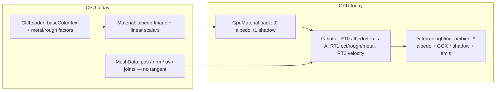
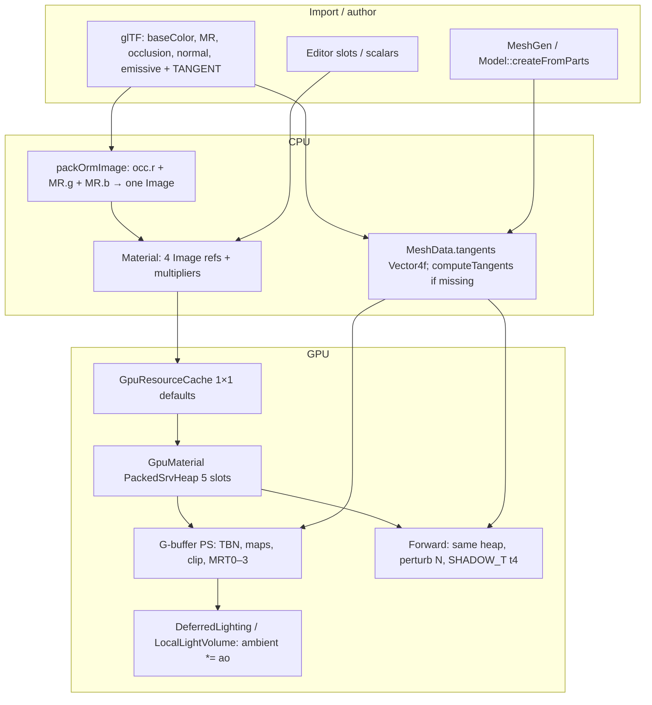
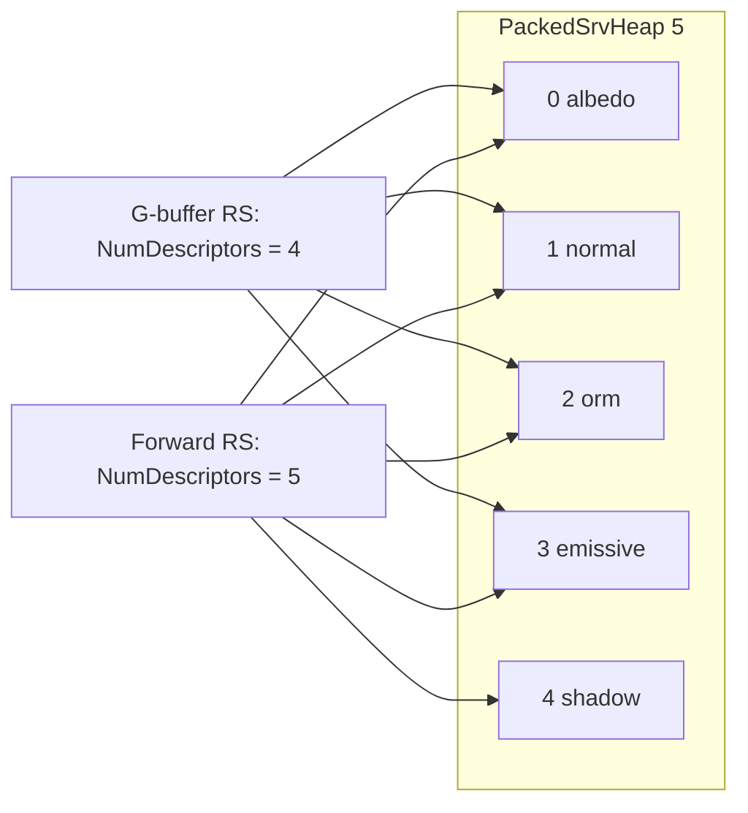

# PBR material maps (normal / ORM / emissive)

> **Accepted** draft. Implemented by execute-plan 3543bbee PRs 1–6. Body below is the approved RFC (rev 4); present-tense “today” describes the pre-PR1 tip.

> **Replacement RFC.** Overwrites in-tree `Render/DESIGN-pbr-material-maps.md` draft rev 1, which was not implementable (AO packing unfrozen, root-signature vs shadow slot unspecified, no tangents, glTF maps unloaded, Editor/save/forward/particles/GpuMaterial heap undesigned). Spine kept: optional maps, glTF-style ORM, scalars as multipliers.

| Field | Value |
|-------|--------|
| **Title** | Filament/glTF metallic-roughness maps through every DarkEngine6 bind/draw/load/save/edit path |
| **Author** | TBD |
| **Date** | 2026-09-17 |
| **Status** | Draft (rev 4 — emissive formula = M17 CPU luma fold; recipe key includes emissiveColor) |
| **Priority** | P1 — [DESIGN-pbr-roadmap.md](./DESIGN-pbr-roadmap.md) item 3 |
| **Area** | `Assets/Material.*`, `Assets/MeshData.h`, `Assets/GltfLoader.*`, `Assets/GltfMaterialSave.*`, `Assets/Model.cpp`, `Render/GpuMaterial.*`, `Render/GpuResourceCache.*`, `Render/PackedSrvHeap.*`, `Render/Mesh.*`, `Render/MeshPipeline.*`, `Render/SkinnedMeshPipeline.*`, `Render/ModelDraw.*`, `Render/MaterialSurface.*`, `Render/MeshConstants.h`, `Render/SceneBuffers.*`, `Render/DeferredLightingPipeline.*`, `Render/LocalLightVolumePipeline.*`, G-buffer / forward shaders, `Editor/EditorModel.cpp`, `Particles/ParticleMaterials.cpp`, UnitTests |
| **Audience** | Engine, Sandbox, Editor owners who already know this tree |
| **Depends on** | [DESIGN-color-management.md](./DESIGN-color-management.md) (**landed** — linear Rec.709, albedo `_SRGB`, data maps Linear UNORM, emissive maps sRGB). Does **not** depend on IBL. |
| **Supersedes** | In-tree `DESIGN-pbr-material-maps.md` rev 1 (AO “or”, unspecified SRV slots, no tangents). |
| **Does not** | Require IBL, add `1/π`, change HDR format, invent bindless / texture arrays, fold terrain splat into `Dark::Material`, add height/clearcoat/anisotropy/sheen/transmission/SSS. |

---

## Overview

DarkEngine6 already has a Filament-shaped **scalar** PBR recipe on `Dark::Material` (`baseColor`, `metallic`, `roughness`, `emissive`) and a two-RT G-buffer (`RT0` albedo+emissive A, `RT1` oct normal + roughness + metallic). What it does **not** have is authored maps. `GpuMaterial` packs albedo + shadow only (`kAlbedoSlot=0`, `kShadowSlot=1`, `kSrvCount=2`). `MeshData` has no tangents. `GltfLoader::extractPrimitive` reads `metallic_factor` / `roughness_factor` / baseColor texture and ignores `metallic_roughness_texture`, `normal_texture`, `emissive_texture`, and `occlusion_texture`. The Editor material panel is scalars-only. Forward `BasicMesh.hlsl` is Lambert + albedo. Particles intern albedo-only Materials.

This RFC extends the existing per-material `PackedSrvHeap` / `GpuMaterial::pack` pattern (no bindless) with **normal, ORM, emissive** SRVs, **authored tangents**, **glTF ORM packing at import**, a **fourth G-buffer MRT for AO**, and a full downstream inventory so every bind/draw/load/save/edit path can consume the new maps.

Color management has landed. Map uploads follow `Color::TextureUsage`:

| Usage | View |
|-------|------|
| `Albedo` / `Emissive` | sRGB `_SRGB` SRV (TYPELESS resource) |
| `Normal` / `Orm` / `Data` | Linear UNORM |
| Linear always wins | `GpuResourceCache::ensureTexture(image, usage)` |

Maps do **not** need IBL. IBL later benefits from AO and roughness. Until IBL lands, authored AO multiplies the existing `ambientColor` term only.

---

## Background & Motivation

### What the tip actually does

Verified against the tree at time of writing.



| Piece | Location | Fact |
|-------|----------|------|
| CPU Material | `Assets/Material.h` | One `AssetRef<Image> m_albedo`. Linear `m_baseColor[4]`, `m_metallic=0`, `m_roughness=1`, `m_emissive` scalar, `MaterialAlphaMode` Opaque/Mask/Blend. `isValid()` = albedo present. `setBaseColorFromSrgb8` exists. `copyFrom` copies albedo + scalars only. |
| Recipe key | `Assets/Material.cpp` `materialRecipeKey` | `"m:{albedoId}:{r}:{g}:{b}:{a}:{metallic}:{roughness}:{emissive}:{alphaMode}"`. 256-byte `snprintf`. |
| GPU material | `Render/GpuMaterial.h` | `kAlbedoSlot=0`, `kShadowSlot=1`, `kSrvCount=2`. `pack(device, albedo)` only. Slot 1 filled later by `copyShadow`. |
| Cache | `Render/GpuResourceCache.cpp` `ensureMaterial` | `ensureTexture(albedo, TextureUsage::Albedo)`, `pack`, `registerPackedHeap`, `copyShadow` if `m_shadowCpu`, `legacyUnormAlbedo` patches **slot 0 only** via `copyAlbedoSlot`. Early-outs if GPU already valid (no map-id refresh). |
| Packed heap | `Render/PackedSrvHeap.h` | Generic; terrain uses 6 slots, shadow at 5. `copyShadow` writes `heap.shadowSlot`. |
| Mesh pipeline | `Render/MeshPipeline.h` | `kRootAlbedoSrv=1`, `kSrvCount=2`. G-buffer table is **`NumDescriptors = 1`** (albedo only, no shadow). Forward table is 2 (albedo + shadow). Input layout pos/normal/uv, **no TANGENT**. G-buffer PSO: 3 RTs (`UNORM_SRGB`, `UNORM`, `R16G16_FLOAT`). |
| Skinned | `Render/SkinnedMeshPipeline.cpp` | Same 1-vs-2 SRV split. Color layout ends at `BLENDWEIGHT` offset 36. Shadow layout reads `BLENDINDICES` at **offset 32**. `SkinnedMeshVertex` is 48 bytes with `pad[2]`. |
| Vertex CPU | `Assets/MeshData.h` | `positions`, `normals`, `uvs`, `indices`, `jointPacked`, `weights`. **No tangents.** `detail::computeSmoothedNormals` exists; no tangent helper. |
| Vertex GPU | `Render/Mesh.h` / `Mesh.cpp` | `MeshVertex` = pos+nrm+uv (32 B). `tryCreate` ignores missing tangents. |
| G-buffer PS | `content/shaders/BasicMeshGBuffer.hlsl`, `SkinnedMeshGBuffer.hlsl` | Sample `gAlbedo t0`. Write `albedo.rgb, color.a` (emissive) to RT0; `EncodeOct(n), roughness, metallic` to RT1. **No clip. No maps.** |
| Packing | `content/shaders/GBuffer.hlsli` `GBufferOut` | `SV_TARGET0` albedo, `SV_TARGET1` attrib, `SV_TARGET2` velocity. |
| Lighting | `content/shaders/DeferredLighting.hlsl` | `ambientColor * albedo + PbrDirectional * shadow + albedo * emissive * emissiveGain`. No AO. `t0..t3` + height `t4`. |
| Lighting heap | `Render/SceneBuffers.h` | `kLightingCount=5`: albedo 0, attrib 1, depth 2, shadow 3, height 4. `kRtvCountGBuffer=6`: HDR, albedo, attrib, velocity, post, history. **No spare AO slot.** |
| Lighting RS | `Render/DeferredLightingPipeline.cpp` | First table `NumDescriptors=4` (`t0–t3`). Height is a **separate** table at `t4` (`kRootHeightSrv`). Growing the heap by one descriptor does **not** blow this layout. |
| Local lights | `content/shaders/LocalLightVolume.hlsl` | `t0` albedo, `t1` attrib, `t2` depth, `t4` lights, `t5` volume world, `t6` height. **`t3` is unused.** First table `NumDescriptors=3`. |
| Bind G-buffer | `Render/Renderer.cpp` `bindGBuffer` | `OMSetRenderTargets(3, {albedo, attrib, velocity})`. `clearGBuffer` clears those three. |
| glTF load | `Assets/GltfLoader.cpp` ~582 | `has_pbr_metallic_roughness` → factors + `base_color_texture` via `loadImageBytes` into `albedoFile`/`albedoBytes`. **Does not** read MR / normal / emissive / occlusion / `alpha_cutoff` / `normal.scale` / `emissive_factor`. **Does not** unpack `cgltf_attribute_type_tangent`. |
| glTF save | `Assets/GltfMaterialSave.cpp` `patchMaterialsObject` | Writes `baseColorFactor`, `metallicFactor`, `roughnessFactor`, `alphaMode`. Factors only. |
| Model intern | `Assets/Model.cpp` ~64–92 | Albedo image or white 1×1 + linear tint. `setMetallicRoughness`, `setAlphaMode`. No other maps. |
| Editor | `Editor/EditorModel.cpp` `drawMaterialPanel` | Base color, metallic, roughness, emissive, alpha mode. `ensureUniqueMeshMaterial` `copyFrom` + intern + `ensureMaterial`. |
| Particles | `Particles/ParticleMaterials.cpp` | Intern albedo-only (soft circle/streak, Linear tag). `ParticleRenderer` binds **`Texture2D` of albedo** at `ParticlePipeline::kRootSrv` — not the packed GpuMaterial heap. |
| Forward | `content/shaders/BasicMesh.hlsl` | Lambert + albedo. `#define SHADOW_T t1`. |
| Terrain | `Terrain/TerrainMaterial.h`, `content/shaders/TerrainGBuffer.hlsl` | **Separate splat system** (4 layers + splat + shadow, `kSrvCount=6`). Writes attrib roughness=1, metallic=0, emissive=0. Not `Dark::Material`. |
| Network | `ECS/Components.h` `MeshComponent::matAssetID` | AssetID only. `EntityPins` pins/unpins. No GPU heaps on the wire. |
| Tests | `UnitTests/Assets/MaterialTests.cpp`, `MaterialSurfaceTests.cpp`, `GltfMaterialSaveTests.cpp` | Scalars, copyFrom, recipe via CpuModel, G-buffer CB emissive in `color.a`. **No GpuMaterial slot test.** |

### Pain points

1. **Authored glTF looks plastic.** Metal/rough live only as constants; normal maps never perturb `EncodeOct`; occlusion never darkens ambient.
2. **AO has nowhere to go.** RT1 is full (oct.rg, rough.b, metal.a). Rev 1 left “pack AO into RT1 / multiply albedo / RT2 / emissive bits” as an “or”.
3. **Shadow lives in slot 1.** Adding maps without moving shadow collides with the global `copyShadow` patch and with forward `SHADOW_T t1`.
4. **No tangents.** Normal maps in tangent space cannot be applied. glTF `TANGENT` is dropped. MeshGen never builds a TBN. This is a **breaking vertex stride / PSO** change and must be one PR.
5. **`ensureMaterial` is sticky.** Once a GpuMaterial exists for an AssetID, map edits on that Material would not re-pack. Editor unique-copy works only because it interned a **new** id. Live map slots need an ID-mismatch re-pack.
6. **Mask mode is storage-only.** `MaterialAlphaMode::Mask` is loaded and saved; G-buffer PS never `clip`s.

---

## Goals & Non-Goals

### Goals (v1)

- Optional maps on `Material`: normal (tangent-space Linear UNORM RGB), ORM (AO/Rough/Metal packed), emissive (sRGB). Missing map → interned 1×1 default. Albedo remains required for `isValid()`.
- Scalars are **multipliers** on sampled maps (glTF / Filament).
- One ORM `Image` on `Material`. glTF loader packs occlusion.r + MR.g + MR.b at import.
- Tangent-space normals → world octahedral in RT1.rg. `MeshData::tangents` as `Vector4f` (xyz + w sign). glTF `TANGENT` unpacked; CPU generate if missing.
- Authored AO in a **new G-buffer MRT** (`R8_UNORM`, `SV_TARGET3`). Lighting multiplies **ambient only** (`ambientColor * albedo * ao`) until IBL.
- Alpha Mask: `clip(albedo.a - cutoff)` in G-buffer (and forward opaque) PS. Default cutoff 0.5.
- Same `GpuMaterial` heap for G-buffer and forward. Forward samples **normal** (Lambert still; roughness unused). `-forward` degrades to scalar-only lighting but does **not** use a second material type.
- Editor material panel grows map slots + AO + normalScale + cutoff.
- Recipe key includes map AssetIDs + new scalars.
- Unit tests named below. No C++ exceptions; `bool` + `DE_LOG_*` + `DE_ASSERT`.

### Non-goals (v1)

- Height / parallax, clearcoat, anisotropy, sheen, transmission, SSS.
- Texture arrays, bindless material heap, `Pipeline.h` revival.
- BC5 / BC7 required (RGBA8 UNORM is OK; usage table already documents future BC).
- Changing HDR away from `R16G16B16A16_FLOAT`.
- `1/π` energy (IBL RFC).
- Folding `TerrainMaterial` splat into PBR maps.
- Masked **shadow casters** (`ShadowDepth.hlsl` is VS-only, no PS). Follow-up.
- Embedding newly painted textures into GLB on save (JSON factor + existing texture-index preserve only).
- Shader `ddx/ddy` TBN as the product path (CPU tangents are v1).
- Vertex colors (`COLOR_0` still absent).
- Dual-use of one Image as both Albedo and Orm (cache first-usage-wins, already landed).

---

## Proposed Design

### End-to-end flow



### Frozen decision 1 — AO storage (option C, MRT3)

Rev 1’s A/B/C/D:

| Option | Mechanism | Verdict |
|--------|-----------|---------|
| A | Bit-pack AO into RT1 (steal rough/metal precision) | Rejected. RT1 is already the GGX input; 8-bit rough/metal is the floor. |
| B | `albedo *= ao` at G-buffer write | Rejected as product path. Wrong for metals and **all direct light**. Cheap fallback only if C were illegal. |
| **C** | Extra `R8_UNORM` AO target | **v1.** Lighting heap can grow one slot (`kLightingCount` 5→6). Cost ~2.0 MiB at 1080p, ~3.5 MiB at 1440p, +1 B/px G-buffer write (~8% on current **12 B/px** color: `R8G8B8A8` + `R8G8B8A8` + `R16G16_FLOAT`; ~6% if counting D32 depth as 16 B/px). |
| D | AO in RT0.a unused bits | Rejected. RT0.a is emissive (identity under `_SRGB`). |

**Naming:** sketch said “RT2 AO”. Tip G-buffer already has three MRTs: RT0 albedo, RT1 attrib, **RT2 velocity**. AO is **MRT3 / `SV_TARGET3`**, not a velocity shuffle.

**Frozen layout after this RFC:**

| MRT | Resource | RTV | Contents |
|-----|----------|-----|----------|
| 0 | `R8G8B8A8_TYPELESS` | `UNORM_SRGB` | linear albedo RGB (HW encode), A = emissive (identity) |
| 1 | `R8G8B8A8_UNORM` | UNORM | oct world N.rg, roughness.b, metallic.a |
| 2 | `R16G16_FLOAT` | FLOAT | velocity UV (unchanged) |
| **3** | **`R8_UNORM`** | **UNORM** | **authored AO 0..1** |

`SceneBuffers`:

```
kRtvHdr      = 0
kRtvAlbedo   = 1
kRtvAttrib   = 2
kRtvVelocity = 3
kRtvPost     = 4
kRtvHistory  = 5
kRtvAo       = 6          // NEW
kRtvCountGBuffer = 7      // was 6
```

`kAoClear = { 1, 0, 0, 0 }` — unoccluded. Sky/background pixels are discarded in lighting by depth, so the clear is for safety.

`Renderer::bindGBuffer`: `OMSetRenderTargets(4, {albedo, attrib, velocity, ao})`. `clearGBuffer` clears AO to 1. **`bindHdr(false)` today transitions only albedo/attrib/velocity** (`Renderer.cpp` ~713–717); it **must** also `transitionAo(..., PIXEL_SHADER_RESOURCE)` or lighting/`Load`s a still-bound RT. Overlay tile for AO is optional (not required v1); `aoSrvCpu()` exists for later debug.

`SceneBuffers::create` allocates a FLAG_NONE SRV heap per G-buffer target before `packLightingHeap` (`SceneBuffers.cpp` ~239–342). AO needs the same: `m_ao` resource, `kRtvAo` RTV, **`m_aoSrvHeap` + `m_aoSrvCpu`**, `packLightingHeap` copies that handle into lighting slot 5, and `reset()` releases `m_ao` / `m_aoSrvHeap` / `m_aoRtv` / `m_aoSrvCpu` / `m_aoState` (today `reset()` lists hdr/albedo/attrib/velocity/post/history only).

**Lighting heap — grows, does not reshuffle:**

```
kLightingAlbedo = 0
kLightingAttrib = 1
kLightingDepth  = 2
kLightingShadow = 3
kLightingHeight = 4
kLightingAo     = 5       // NEW
kLightingCount  = 6       // was 5
```

Why this is legal:

- `DeferredLightingPipeline` first table is **4** descriptors (`t0–t3`). Height is a **separate** root table at `t4`. Adding AO as a **third** table at `t5` (`kRootAoSrv = 4`) does not collide with height or with `SHADOW_T t3`.
- `LocalLightVolume.hlsl` **does not bind `t3`**. AO binds there (`gAo : register(t3)`) via a new root table sourced from lighting-heap slot 5. Lights stay `t4`, volume world `t5`, height `t6`. Root-parameter array grows 5→6 (`kRootAoSrv = 5`). DWORD cost today: `56 + 1 (table) + 2 (lights SRV) + 2 (world SRV) + 1 (height) = 62`. Adding the AO table is **63 / 64** — legal, one DWORD from the wall. Do **not** also grow `LocalLightPassConstants`.
- `heightTableGpu()` offset math unchanged (`+ kLightingHeight * incr`). New `aoTableGpu()` = `lightingGpu + 5 * incr`.

**AO in the BRDF (until IBL):**

```hlsl
float ao = gAo.Load(int3(texel, 0)).r; // 1 if terrain / missing
float3 lit = ambientColor * albedo.rgb * ao
           + PbrDirectional(n, v, albedo.rgb, roughness, metallic, lightDirWS, lightColor) * shadow
           + albedo.rgb * emissive * emissiveGain;
```

Local lights: **do not** multiply `PbrPunctual` by AO (Filament: occlusion is ambient/IBL). Same `gAo.Load`. When IBL lands it multiplies irradiance (and optionally specular AO) by this same channel; SSAO is a later pass that multiplies the same ambient path, not this RT.

Terrain G-buffer PS writes `o.ao = 1`. Particle / water / sky do not write the G-buffer.

### Frozen decision 2 — GpuMaterial SRV layout

Shadow stays **last** so `copyShadow` / `PackedSrvHeap::shadowSlot` keep a stable patch index. G-buffer does not sample shadow (lighting heap does). Forward does.

```
GpuMaterial / MeshPipeline material table
  kAlbedoSlot    = 0   // t0  Albedo   (_SRGB or raw if legacyUnormAlbedo)
  kNormalSlot    = 1   // t1  Normal   (Linear UNORM)
  kOrmSlot       = 2   // t2  ORM      (Linear UNORM)
  kEmissiveSlot  = 3   // t3  Emissive (_SRGB)
  kShadowSlot    = 4   // t4  Shadow   (last; copyShadow)
  kMapSrvCount   = 4   // G-buffer table size (prefix, no shadow)
  kSrvCount      = 5   // forward table size
```



**Root-signature details:**

- Keep parameter **index** `MeshPipeline::kRootAlbedoSrv = 1` (call-site name stays; it is the material table). Do not rename in v1.
- G-buffer: `srvRange.NumDescriptors = GpuMaterial::kMapSrvCount` (**4**, was 1). Still no shadow CBV / comparison sampler on the G-buffer RS (`MeshPipeline.cpp` already omits `kRootShadowCbv` when `gbuffer`).
- Forward / transparent: `NumDescriptors = kSrvCount` (**5**, was 2). `SHADOW_T` moves **`t1` → `t4`** in `BasicMesh.hlsl` and `SkinnedMesh.hlsl`. This **must** land in the same PR as the heap layout or `-forward` and HybridDeferred transparents sample normal/ORM as a shadow map.
- Skinned G-buffer / forward: same 4 vs 5 split (`SkinnedMeshPipeline.cpp` currently `m_gbuffer ? 1u : 2u`). Shadow-depth pass stays 0 samplers; it does not bind the material table. **Keep `kRootShadowCbv` on the G-buffer RS** (unused, 2 DWORDs) so we do not add a fifth permutation; 58-float CB still fits (`63/64`).
- `MeshGBufferConstants` / `MeshFrameConstants` live in `Render/MeshConstants.h`. G-buffer grows 54→58; forward is **append-only** 48→53 (see Frozen decision 5).
- Terrain packed heap **unchanged** (`kSrvCount=6`, shadow at 5). `GpuResourceCache::setAlbedoSamplingRaw` already iterates interned materials only.

**Defaults (interned once, process-lifetime, not AssetIDs):**

`GpuResourceCache` owns three `Texture2D`s created lazily on first `ensureMaterial` via `Texture2D::createSolidColor`:

| Default | Bytes | Usage | Why |
|---------|-------|-------|-----|
| Normal | `(128,128,255,255)` | `TextureUsage::Normal` | `sampled.xyz * 2 - 1` → `(0,0,1)` |
| ORM | `(255,255,255,255)` | `TextureUsage::Orm` | Multipliers pass scalars through (`ao*=1`, `rough*=1`, `metal*=1`). **Not** `(1,1,0)` — that would zero every scalar metallic. |
| Emissive | `(255,255,255,255)` | `TextureUsage::Emissive` | White so M17 `luminance(emisTex) * (emissiveScalar * luma(emissiveColor))` equals today’s scalar-only path when `emissiveColor=(1,1,1)` (`luma(white tex)=1`). A black default would kill existing `Material::setEmissive`. No GPU `emisTex * emissiveColor` — `applyMaterialSurface` folds luma into `color.a`. |

Missing map on a Material → pack the default GPU handle. Root signature does **not** change per material.

`legacyUnormAlbedo` still remaps **slot 0 only** (`copyAlbedoSlot`). Data maps have `cpuHandleRaw() == cpuHandle()`.

`GpuMaterial::pack`:

```cpp
bool pack(ID3D12Device* device,
          const Texture2D& albedo,
          const Texture2D& normal,
          const Texture2D& orm,
          const Texture2D& emissive);
```

All four must have valid CPU SRVs. Shadow slot left empty until `copyShadow`. `m_heap.shadowSlot = kShadowSlot` (4). `m_heap.srvCount = kSrvCount` (5).

### Frozen decision 3 — tangents

```cpp
// Assets/MeshData.h
struct MeshData
{
    std::vector<Math::Vector3f> positions;
    std::vector<Math::Vector3f> normals;
    std::vector<Math::Vector2f> uvs;
    std::vector<Math::Vector4f> tangents; // xyz = tangent, w = bitangent sign (glTF TANGENT)
    std::vector<uint32_t>       indices;
    std::vector<uint32_t>       jointPacked;
    std::vector<Math::Vector4f> weights;
};

namespace detail
{
    // Existing computeSmoothedNormals...
    // Lengyel accumulation, orthonormalize against N, w = sign(dot(cross(N,T), B)).
    // Degenerate UV → (1,0,0,1). No throw. Returns false only if positions/indices empty.
    // Mutating overload writes m.tangents (glTF / tests). Const overload fills `out` and
    // does not touch m — Mesh::tryCreate takes const MeshData&.
    bool computeTangents(MeshData& m);
    bool computeTangents(const MeshData& m, std::vector<Math::Vector4f>& out);
}
```

**Import:** `GltfLoader::extractPrimitive` unpacks `cgltf_attribute_type_tangent` (VEC4) when present and size matches. Else `computeTangents` after normals/UVs (same site as `computeSmoothedNormals`).

**Upload (breaking PSO — one PR):**

```cpp
struct MeshVertex
{
    Math::Vector3f point;    // 0
    Math::Vector3f normal;   // 12
    Math::Vector2f uv;       // 24
    Math::Vector4f tangent;  // 32
};
static_assert(sizeof(MeshVertex) == 48, "static VB stride");

struct SkinnedMeshVertex
{
    Math::Vector3f point;         // 0
    Math::Vector3f normal;        // 12
    Math::Vector2f uv;            // 24
    Math::Vector4f tangent;       // 32
    uint32_t       joints;        // 48
    uint32_t       packedWeights; // 52
    uint32_t       pad[2];        // 56; 8 bytes → 64 (live style: pad[2] after weights)
};
static_assert(sizeof(SkinnedMeshVertex) == 64, "skinned VB stride");
// Do not use pad[3] (that is 12 bytes → 68). Stride 56 with no pad is also legal;
// v1 keeps 64 for 16-byte alignment matching today's 48-byte padded struct.
```

`Mesh::tryCreate` / `tryCreateSkinned` take **`const MeshData&`** (`Render/Mesh.h` 47–48) and already copy into a local interleaved VB. They **must not** mutate `data`:

```cpp
std::vector<Math::Vector4f> tangents;
if (data.tangents.size() == data.positions.size())
    tangents = data.tangents;
else if (!detail::computeTangents(data, tangents))
    tangents.assign(data.positions.size(), Math::Vector4f(1, 0, 0, 1));
```

Zero-size / failed generate still uploads `(1,0,0,1)` per vertex so the input layout is always valid. CPU `MeshData.tangents` on procedural meshes stays empty until a caller (glTF, tests) runs the mutating overload — that is OK. The size/`w` unit test is on **`computeTangents`**, not on `tryCreate` writing back into `MeshData`.

Input layouts add `{ "TANGENT", 0, DXGI_FORMAT_R32G32B32A32_FLOAT, 0, 32, PER_VERTEX, 0 }` on mesh + skinned **color** PSOs (G-buffer, forward, transparent).

**Skinned shadow layout must move joints:** today `BLENDINDICES` is at offset 32 (`SkinnedMeshPipeline.cpp` `shadowLayout`). After this RFC: **offset 48**, `BLENDWEIGHT` at 52. Static `ShadowDepth.hlsl` only reads `POSITION` at 0; larger stride is legal.

**Skinning:** same 3×3 bone blend as `skinNrm`. Bitangent reconstructed in the PS after world transform:

```hlsl
float3 nW = normalize(mul(float4(nM, 0), world).xyz);
float3 tW = normalize(mul(float4(tM.xyz, 0), world).xyz);
tW = normalize(tW - nW * dot(nW, tW));
float3 bW = cross(nW, tW) * input.tangent.w;
float3 nt = normalTex.Sample(gSamp, uv).xyz * 2.0f - 1.0f;
nt.xy *= normalScale;
nt = normalize(nt);
float3 n = normalize(nt.x * tW + nt.y * bW + nt.z * nW);
```

Engine is row-major / row-vector (`#pragma pack_matrix(row_major)`, `mul(float4(n,0), world)` already). The `nt.x * T + nt.y * B + nt.z * N` form is independent of matrix packing.

If `length(tangent.xyz) < 1e-6`, skip the map (use vertex N). No shader `ddx/ddy` TBN in v1 (UV seams).

MeshGen does **not** grow each generator. `tryCreate` fills a **local** tangent vector for the VB only. Unit test: `CreateSphere` + **`computeTangents`** (mutating overload) has `tangents.size() == positions.size()` and `w` in `{-1,1}` — do not assert that after `tryCreate` the CPU `MeshData` grew.

### Frozen decision 4 — glTF import / ORM pack

glTF 2.0 split (do not pretend they are one texture on disk):

| Texture | Channels | Color space |
|---------|----------|-------------|
| `baseColorTexture` | RGBA sRGB | Albedo |
| `metallicRoughnessTexture` | **B=metallic, G=roughness, R unused** (linear) | |
| `occlusionTexture` | **R=AO** (linear); often a **separate** image; sometimes the **same** image as MR (then R=AO, G=rough, B=metal already) |
| `normalTexture` | RGB linear tangent-space; `scale` |
| `emissiveTexture` | RGB sRGB; `emissiveFactor` linear, may exceed 1 |

**v1 packs at import into one ORM Image on `Material`** so GpuMaterial stays at 5 SRVs.

```cpp
// Assets/Material.h (or Assets/OrmPack.h — keep next to Material if small)
// occupancy: out.r = ao, out.g = roughness, out.b = metallic, out.a = 255
// Linear tag, not defaulted.
bool packOrmImage(const Image* occlusion /*nullable*/, const Image* metallicRoughness /*nullable*/, Image& out);
```

Rules (no throw). Both inputs, when non-null, **must** be `ImageFormat::RGBA8` with `width>0`, `height>0`, `pixels()!=nullptr`, and `rowPitchBytes() >= width*4`. Iterate rows with `rowPitchBytes` (WIC images may pad). **Reject `R32F` / size 0 / null pixels** with `DE_LOG_ERROR` + `false`.

1. Both null → caller does not set `m_orm` (GPU default white). `packOrmImage` itself returns `false` if `out` cannot be written; the caller treats that as “no ORM image.”
2. Same pointer / same interned AssetID → **CPU memcpy** into `out` (already packed R,G,B). Tag Linear. This is **not** an AssetID alias — see intern rule below.
3. Only MR → `out = (255, MR.g, MR.b, 255)` at MR resolution, reading `MR.pixels()[y * rowPitch + x * 4 + {1,2}]`.
4. Only occlusion → `out = (occ.r, 255, 255, 255)` at occ resolution, reading `occ` via `rowPitchBytes`.
5. Both, different images → `out` resolution = MR size if MR else occ. Occlusion sampled **nearest-neighbor in pixel coords** if sizes differ (`DE_LOG_WARN` once), using each image’s `rowPitchBytes`. `out.r = occ.r`, `out.g = mr.g`, `out.b = mr.b`.
6. Format / pitch / size failure → `false` + `DE_LOG_ERROR`, loader continues with scalars / default ORM.

`GltfCpuPrimitive` grows image refs (replace the albedo-only `albedoFile`/`albedoBytes`/`imageIndex`):

```cpp
struct GltfImageBlob
{
    std::filesystem::path     file;
    std::vector<uint8_t>      bytes;
    int                       imageIndex = -1;
};

struct GltfCpuPrimitive
{
    // existing mesh, factors, alphaMode, ...
    GltfImageBlob albedo;
    GltfImageBlob normal;
    GltfImageBlob metallicRoughness;
    GltfImageBlob occlusion;
    GltfImageBlob emissive;
    float         normalScale  = 1.0f;
    float         ao           = 1.0f;   // occlusionTexture.strength
    float         alphaCutoff  = 0.5f;
    float         emissiveColor[3]{ 1.0f, 1.0f, 1.0f };
    int           albedoImageIndex = -1; // keep JSON indices for save
    int           mrImageIndex     = -1;
    int           occImageIndex    = -1;
    int           normalImageIndex = -1;
    int           emisImageIndex   = -1;
};
```

Refactor `loadImageBytes` to fill a `GltfImageBlob`, not only albedo.

`Model::createFromParsed`: intern each blob via existing `loadImageFile` / `loadMemoryImage` + `ImageCache::gltfKey(pathKey, imageIndex)`. Tag albedo/emissive sRGB; normal/MR/occ Linear. Call `packOrmImage` into a **new** `Image`, intern as `pathKey + "#orm" + matIndex` (**always** a new AssetID — memcpy even when occlusion==MR and already packed). **Never** `ensureTexture(..., Orm)` on an id that might have been uploaded as Albedo. Live `GpuResourceCache::ensureTexture` keeps the first `TextureUsage` (`classifyCachedTextureReuse`); if the same glTF image is both `baseColorTexture` and MR (legal, unusual), Albedo would win and ORM would silently become the white default. The `#orm{N}` key makes that impossible. Set Material maps + `setNormalScale` / `setAo` / `setAlphaCutoff` / `setEmissiveColor`.

glTF `emissiveFactor` (vec3) → `emissiveColor`; `emissive` scalar = `1` if any factor channel > 0 or emissive texture present, else `0`. **M17 (not a GPU `float3`):** `applyMaterialSurface` writes `color.a = emissiveScalar * Rec.709 luma(emissiveColor)`; G-buffer PS is `RT0.a = luminance(emisTex) * color.a`. White default tex × `emissiveColor=(1,1,1)` × scalar matches today’s scalar-only path. `luma(tex)*luma(color)` is a v1 approximation of `luma(tex*color)` when both are chromatic — same note as Frozen decision 5; do not add `emissiveRgb` to the CB.

glTF `alphaCutoff` → `Material::setAlphaCutoff` (cgltf default 0.5).

**Save (`GltfMaterialSave.cpp`):** still a JSON patch (no new BIN images in v1).

- Always write: `baseColorFactor`, `metallicFactor`, `roughnessFactor`, `emissiveFactor` (= `emissiveColor * emissiveScalar`), `alphaMode`, `alphaCutoff`, `normalTexture.scale` if the object exists or scale ≠ 1, `occlusionTexture.strength` if present or `ao ≠ 1`.
- Texture **indices**: if the JSON already has `pbrMetallicRoughness.metallicRoughnessTexture` / `occlusionTexture` / `normalTexture` / `emissiveTexture` / `baseColorTexture`, **leave indices in place** (do not strip maps). Round-trip of an authored glTF preserves URIs.
- If JSON lacked a map and the Editor assigned a live Image, **WARN once** and save factors only. Embedding new images is a follow-up.

### Frozen decision 5 — Mask / clip

```hlsl
float4 albedoS = gAlbedo.Sample(gSamp, uv);
if (alphaModeMask > 0.5f)
    clip(albedoS.a - alphaCutoff);
```

- Default cutoff **0.5**. `Material::setAlphaCutoff` clamps `[0,1]`.
- Opaque: no clip (even if albedo.a < 1).
- Blend: stays on the translucent list (`GltfLoader` already sets `translucent` only for `cgltf_alpha_mode_blend`). Forward-transparent PS does **not** clip.
- Mask: stays opaque, G-buffer + forward-opaque clip. Shadow casters **do not** clip in v1 (`ShadowDepth.hlsl` has no PS).
- Hardware `_SRGB` does not decode alpha (color-management C2). Cutoff compares authored UNORM A.

**Root-signature DWORD budget (not a “root-constant-only” cap).** D3D12 version 1.0 charges the **entire** `D3D12_ROOT_SIGNATURE_DESC` against 64 DWORDs: 1 per 32-bit root constant, 1 per descriptor table, **2 per root CBV/SRV/UAV**. Live `SkinnedMeshPipeline::create` **always** serializes four parameters, including G-buffer (`Render/SkinnedMeshPipeline.cpp` ~43–88): constants + albedo table + `kRootShadowCbv` (root CBV = 2) + `kRootBoneCbv` (2). Today that is `54 + 1 + 2 + 2 = 59`. A 62-float CB would be `62 + 1 + 2 + 2 = 67` — `D3D12SerializeRootSignature` rejects it. Dropping the unused G-buffer shadow CBV is still `62 + 1 + 2 = 65` — still illegal. HLSL `float3` after two scalars can also insert cbuffer padding, so “62 floats in C++” is not even a guaranteed shader size.

**Frozen G-buffer CB = 58 floats** (four map scalars only). `emissiveColor` stays on the CPU Material; it is **not** in the G-buffer CB.

```cpp
struct MeshGBufferConstants
{
    float worldViewProj[16];
    float world[16];
    float color[4];          // rgb linear tint; a = emissiveScalar * Rec.709 luma(emissiveColor)
    float prevWorldViewProj[16];
    float roughness;
    float metallic;
    float ao;                // NEW default 1
    float normalScale;       // NEW default 1
    float alphaCutoff;       // NEW default 0.5
    float alphaModeMask;     // NEW 1 if Mask else 0
};
static_assert(sizeof(MeshGBufferConstants) == 58 * sizeof(float), "gbuffer mesh CB");
// Skinned G-buffer RS DWORDs (keep today's unused kRootShadowCbv — no extra permutation):
//   58 constants + 1 table + 2 shadow CBV + 2 bone CBV = 63  (<= 64)
static_assert(58 + 1 + 2 + 2 <= 64, "skinned G-buffer root signature DWORD budget");
```

`applyMaterialSurface(MeshGBufferConstants&)` fills the four new fields and sets
`cb.color[3] = mat.emissive() * (0.2126*er + 0.7152*eg + 0.0722*eb)`
with default `emissiveColor = (1,1,1)` so existing scalar-only materials are bit-identical. G-buffer PS:

```hlsl
float emis = dot(gEmissive.Sample(gSamp, uv).rgb, float3(0.2126, 0.7152, 0.0722)) * color.a;
```

Per-channel `emisTex * emissiveColor` is a **v1 approximation** (luma of the factor, not a GPU `float3`). Common case is factor `(1,1,1)` or scalar-only. A follow-up CBV can restore the vec3 multiply; do not steal more root-signature DWORDs here.

Static `MeshPipeline` G-buffer is `58 + 1 = 59`. Skinned **forward** after the append below is `53 + 1 + 2 + 2 = 58`. Both legal.

**Forward `MeshFrameConstants` — append-only.** Keep the current 48 floats **bit-identical** (do not insert before `lightDirWS`; that `float3` already fills a register with `ambientScale`). Then append:

```cpp
struct MeshFrameConstants
{
    // existing 48 floats — worldViewProj, world, color, lightDirWS, ambientScale,
    // lightColor, pad1, cameraPos, lighting — must match BasicMesh.hlsl bit-for-bit
    float worldViewProj[16];
    float world[16];
    float color[4];
    float lightDirWS[3];
    float ambientScale;
    float lightColor[3];
    float pad1;
    float cameraPos[3];
    float lighting;
    // NEW — after lighting, same order in HLSL
    float normalScale;    // default 1
    float ao;             // default 1
    float alphaCutoff;    // default 0.5
    float alphaModeMask;  // 1 if Mask else 0
    float emissive;       // same premultiplied scalar as G-buffer color.a
};
static_assert(sizeof(MeshFrameConstants) == 53 * sizeof(float), "forward mesh CB");
```

Mirror that order in `BasicMesh.hlsl` / `SkinnedMesh.hlsl`. Lambert ignores roughness; samples normal + AO for ambient. `applyMaterialSurface(MeshFrameConstants&)` still copies `baseColor` into `cb.color` (including alpha — unchanged) and writes the five new fields.

### Frozen decision 6 — forward / `-forward`

Same GpuMaterial heap. `BasicMesh.hlsl` / `SkinnedMesh.hlsl`:

- Declare `gNormal t1`, `gOrm t2`, `gEmissive t3`, shadow `t4`.
- Perturb N as in G-buffer. Lambert with perturbed N. `ambientScale * albedo * ao`. Mask clip on opaque forward (`alphaModeMask`), not on transparent.
- **Emissive (frozen, one rule):** sample the map and add `luminance(gEmissive.Sample(...).rgb) * emissive` where `emissive` is the premultiplied scalar (`emissiveScalar * luma(emissiveColor)`). **No `emissiveGain`** on forward (that CB exists only on deferred lighting). Do **not** skip the map — HybridDeferred transparents and `-forward` would rot, which is why a second material type was rejected.
- Transparent forward: same table (5), no clip.
- `ENCODE_SRGB` contract unchanged (color-management C12).

PR split: **PR4** only moves `SHADOW_T t1→t4` and may declare unused `t1–t3` bound to defaults. **PR5** is the look-change PR that actually samples normal / ORM AO / emissive / mask clip on these two shaders.

Terrain forward stays splat; no PBR maps.

### Frozen decision 7 — Editor

`drawMaterialPanel` grows **below** existing sliders:

- Image slots: Albedo (existing, show id/size), Normal, ORM, Emissive. Button “Load…” uses the existing file picker, `assets().loadImageFile`, `set*Image`, then `gpuResources().ensureMaterial` (re-pack on id mismatch).
- Sliders: AO `[0,1]`, Normal Scale `[0,2]`, Alpha Cutoff `[0,1]` (enabled when Mask).
- Particle path: hide Normal/ORM/NormalScale; albedo is the sprite; extra maps no-op. Keep emissive slider (HDR gain).
- `copyFrom` copies all new refs + scalars so `ensureUniqueMeshMaterial` stays correct.
- Debug overlay already dumps albedo/attrib (`SandboxApp.cpp` ~2837, `EditorRender3D.cpp` ~481). Optional AO tile later.

### Frozen decision 8 — `ensureMaterial` refresh

Today:

```cpp
if (it != m_materials.end() && it->second.gpu && it->second.gpu->isValid())
    return true;
```

After: store packed map AssetIDs on `GpuMaterial` (albedo/normal/orm/emissive, `NULL_ASSET` = default). If valid **and** IDs match, return true. Else unregister old packed heap, re-`pack`, re-`copyShadow`, re-apply `legacyUnormAlbedo` slot 0.

Editor map edits on a unique Material then show up next frame without intern-new-id.

---

## API / Interface Changes

### `Assets/Material.h`

```cpp
class Material : public Asset
{
    // existing createFromAlbedo*, createSolid, copyFrom, setMetallicRoughness,
    // setBaseColor, setBaseColorFromSrgb8, setEmissive, setAlphaMode ...

    void setNormalImage(AssetRef<Image> img);
    void setOrmImage(AssetRef<Image> img);
    void setEmissiveImage(AssetRef<Image> img);
    const AssetRef<Image>& normalImage() const;
    const AssetRef<Image>& ormImage() const;
    const AssetRef<Image>& emissiveImage() const;

    void  setAo(float ao);               // clamp 0..1, default 1
    float ao() const;
    void  setNormalScale(float s);       // default 1, no upper clamp (glTF scale)
    float normalScale() const;
    void  setAlphaCutoff(float c);       // clamp 0..1, default 0.5
    float alphaCutoff() const;
    void  setEmissiveColor(float r, float g, float b); // linear, default 1s
    const float* emissiveColor() const;

    bool isValid() const; // still albedo present + albedo->valid()
};

// "m:{albedo}:{normal}:{orm}:{emis}:{r}:{g}:{b}:{a}:{metal}:{rough}:{emisS}:{ao}:{nScale}:{cut}:{mode}:{er}:{eg}:{eb}"
std::string materialRecipeKey(const Material& m);
```

`copyFrom` copies every ref + scalar. Missing maps (empty refs) are valid. `createFromAlbedoImage` leaves map refs empty.

`materialRecipeKey` uses a larger buffer (≥ 512). `NULL_ASSET` for missing maps. **`emissiveColor` (`er,eg,eb`, `%.9g` like baseColor) is part of the key** — two materials that differ only in factor `(1,0,0)` vs `(0,1,0)` must not collide (`emisS` can be `1` for both, but `color.a` / RT0.a still differs via luma).

### `Render/GpuMaterial.h`

Slot constants as frozen above. `pack` takes four textures. `packedMapIds()` for cache refresh.

### `Render/GpuResourceCache`

```cpp
bool ensureMaterial(const AssetRef<Material>& material); // re-pack on map-id mismatch
const Texture2D* defaultNormal() const;
const Texture2D* defaultOrm() const;
const Texture2D* defaultEmissive() const;
```

`ensureMaterial` calls `ensureTexture` with `Albedo` / `Normal` / `Orm` / `Emissive` for whichever refs are set. First usage still wins on conflict (WARN, keep first, pack default for the losing slot + `DE_LOG_ERROR` if albedo lost).

### `Render/MaterialSurface.cpp`

Writes new CB fields from Material. G-buffer: `color.a = emissive * Rec.709 luma(emissiveColor)`; `ao=1`, `normalScale=1`, `cutoff=0.5`, `mask=0` if unset. Forward: same four scalars plus `cb.emissive` (same premultiplied value); `cb.color` stays `baseColor` (including alpha). **No `emissiveRgb` in either CB.**

### `content/shaders` contract (G-buffer)

```hlsl
Texture2D gAlbedo   : register(t0);
Texture2D gNormal   : register(t1);
Texture2D gOrm      : register(t2);
Texture2D gEmissive : register(t3);

float4 albedoS = gAlbedo.Sample(gSamp, uv);
if (alphaModeMask > 0.5f)
    clip(albedoS.a - alphaCutoff);
float3 albedo = albedoS.rgb * color.rgb;

float3 nt = gNormal.Sample(gSamp, uv).xyz * 2.0f - 1.0f;
nt.xy *= normalScale;
nt = normalize(nt);
// TBN as above → nWorld; EncodeOct(nWorld) → attrib.rg

float4 orm = gOrm.Sample(gSamp, uv);
float  rough = saturate(orm.g * roughness);
float  metal = saturate(orm.b * metallic);
float  ao    = saturate(orm.r * aoScalar);
if (rough <= 0.0f && metal <= 0.0f) rough = 1.0f; // keep today's empty-CB guard

// M17: no GPU emisTex * emissiveColor. color.a already has emissiveScalar * luma(emissiveColor).
float  emis = dot(gEmissive.Sample(gSamp, uv).rgb, float3(0.2126, 0.7152, 0.0722)) * color.a;

o.albedo   = float4(albedo, emis);
o.attrib   = float4(EncodeOct(n), rough, metal);
o.velocity = VelocityUv(...);
o.ao       = ao; // SV_TARGET3, R8
```

`GBufferOut` gains `float ao : SV_TARGET3`.

### `MeshPipeline` / `SkinnedMeshPipeline` PSO

G-buffer `NumRenderTargets = 4`; `RTVFormats[3] = DXGI_FORMAT_R8_UNORM`; write mask on RT3. Terrain G-buffer PSO the same (`o.ao = 1`).

---

## Data Model Changes

No scene-JSON schema bump. `MeshComponent::matAssetID` / `ModelComponent::modelAssetID` / `ParticleEmitterComponent::matAssetID` stay AssetIDs. `MeshComponent::emissive` remains a leftover field unused by G-buffer (Material.emissive is source of truth); do not confuse it with the emissive **map**.

CPU Images are not a new persistence format. Packed ORM Images are process-local intern keys (`#orm{N}`).

glTF on disk: factors + existing texture indices. No engine-specific extension.

Vertex stride change is **not** a file-format change; CPU `MeshData` is not serialized except inside glTF (which already has `TANGENT`). Procedural meshes recompute.

---

## Downstream inventory

Every bind / draw / load / save / edit site. “Skip” means no code change required, with a reason.

| Site | Role today | v1 change |
|------|------------|-----------|
| `Assets/Material.h/.cpp` | Albedo + scalars | Map refs, ao, normalScale, cutoff, emissiveColor, recipe (**includes `{er}:{eg}:{eb}`**), copyFrom |
| `Assets/MeshData.h` | No tangents | `tangents` + `computeTangents` |
| `Render/Mesh.h/.cpp` | 32 B / 48 B verts (`pad[2]` after weights) | 48 B static / **64 B skinned with `pad[2]` at 56** (not `pad[3]`). `tryCreate(const MeshData&)` fills a **local** tangent vector; does not mutate `data` |
| `Render/GpuMaterial.h/.cpp` | pack albedo; slots 0–1 | pack 4 maps; slots 0–4; remember map ids |
| `Render/PackedSrvHeap.*` | Generic pack + copyShadow | Default `shadowSlot` comment 4 for materials; terrain still 5. Code already parametric. |
| `Render/GpuResourceCache.*` | ensure albedo, sticky pack, slot-0 raw, copyShadow; first-usage-wins | ensure 4 usages; defaults; re-pack on id mismatch; slot-0 raw unchanged; **never** `ensureTexture(Orm)` on an Albedo id |
| `Render/MeshPipeline.*` | G-buffer 1 SRV, forward 2; no TANGENT; 3 RTs | G-buffer 4 SRV, forward 5; TANGENT; 4 RTs; `kSrvCount=5` |
| `Render/SkinnedMeshPipeline.*` | same 1/2 split; shadow joints @ 32; **always 4 root params** (unused G-buffer `kRootShadowCbv`) | same 4/5 SRVs; joints @ 48; TANGENT; 4 RTs; **keep unused shadow CBV** so RS stays `58+1+2+2=63` |
| `Render/MeshConstants.h` | G-buffer 54 floats; forward 48 | G-buffer **58** (no `emissiveRgb`); forward **append-only** 53 |
| `Render/ModelDraw.cpp` | `bindMaterial(..., kRootAlbedoSrv)` + `applyMaterialSurface` | Same bind index. **`applyGBufferSurface` else-branch** (`ModelDraw.cpp` ~30–37) today writes only `color` / `roughness` / `metallic`. Must also set `ao=1`, `normalScale=1`, `alphaCutoff=0.5`, `alphaModeMask=0` (and leave `color.a` as emissive 0). `MeshGBufferConstants cb{}` zero-init is **not** enough — the else-branch overwrites the old fields and would leave AO 0 / cutoff 0 / clip-all if mask were garbage. No per-draw slot logic. |
| `content/shaders/BasicMeshGBuffer.hlsl` | albedo only | maps + TBN + clip + AO MRT |
| `content/shaders/SkinnedMeshGBuffer.hlsl` | albedo only; skin N | maps + skin T + TBN + clip + AO |
| `content/shaders/TerrainGBuffer.hlsl` | splat; attrib rough=1 metal=0 | write `o.ao = 1`; PSO 4 RTs. **No PBR maps.** |
| `content/shaders/GBuffer.hlsli` | 3-target struct | `ao : SV_TARGET3` |
| `content/shaders/DeferredLighting.hlsl` | no AO | `gAo t5`; `ambient *= ao` |
| `Render/DeferredLightingPipeline.*` | table 4 + height t4 | + `kRootAoSrv` table t5 from lighting slot 5 |
| `content/shaders/LocalLightVolume.hlsl` | t3 free; no AO | `gAo t3`; do **not** multiply punctual by AO |
| `Render/LocalLightVolumePipeline.*` | table 3 (t0–t2) | + AO table at t3 from lighting slot 5 |
| `Render/SceneBuffers.*` | 6 RTVs, lighting 5; FLAG_NONE SRV heap per target | `kRtvAo`, lighting slot 5, `m_ao` + **`m_aoSrvHeap` / `m_aoSrvCpu`**, `aoRtv/aoTableGpu`, `packLightingHeap` copies slot 5, **`reset()` releases AO resource + SRV heap**, clear=1 |
| `Render/Renderer.cpp` | bind/clear 3 G-buffer RTs; `bindHdr(false)` transitions albedo/attrib/velocity only | 4 RTs; `clearGBuffer` AO=1; **`bindHdr(false)` transitions AO → `PIXEL_SHADER_RESOURCE`** (explicit; lighting samples it) |
| `content/shaders/BasicMesh.hlsl` | Lambert; `SHADOW_T t1` | PR4: `SHADOW_T t4` + declare t1–t3. **PR5:** perturb N, ORM AO on ambient, emissive add, mask clip. Append-only CB. |
| `content/shaders/SkinnedMesh.hlsl` | same | same + skin T |
| `Assets/GltfLoader.*` | baseColor + factors | all five textures, TANGENT, cutoff, scale, strength, emissiveFactor |
| `Assets/GltfMaterialSave.*` | factors + alphaMode | + cutoff, emissiveFactor, scale/strength; preserve texture indices |
| `Assets/Model.cpp` | intern albedo material | intern maps, pack ORM, set new scalars |
| `Editor/EditorModel.cpp` `drawMaterialPanel` | scalars | slots + ao + scale + cutoff |
| `Editor/EditorModel.cpp` `ensureUniqueMeshMaterial` | copyFrom + ensureMaterial | works if copyFrom + re-pack are correct |
| `Particles/ParticleMaterials.cpp` | albedo-only intern | unchanged; extra maps stay empty |
| `Particles/ParticleRenderer.cpp` | binds albedo `Texture2D` | **no-op on extra maps** (does not use packed heap). `ensureMaterial` still packs 5 slots with defaults — harmless |
| `Sandbox/SandboxApp.cpp` / `PathChase.cpp` spawn | `internSolidMaterial` / `createSolid` | no change; defaults make maps identity |
| `Editor/EditorAppInit.cpp` ground / prop materials | solid + linear tint | no change |
| Network / `EntityPins` | AssetID pin | **no GPU heaps on the wire** |
| `Terrain/TerrainMaterial.*` | independent heap | **out of scope** (later RFC if splat PBR) |
| `Render/ShadowPipeline` / `ShadowDepth.hlsl` | position only | static stride change ignored; skinned shadow offsets **must** update |
| `UnitTests/Assets/MaterialTests.cpp` | scalars, copyFrom, sRGB solid | map ids, recipe, missing maps valid, cutoff clamp |
| `UnitTests/Render/MaterialSurfaceTests.cpp` | CB color.a = emis | ao / scale / cutoff / mask; `color.a == emissive * luma(emissiveColor)` |
| `UnitTests/Assets/GltfLoaderTests.cpp` | parse fixtures | TANGENT present; MR/occ/normal/emis blobs |
| `UnitTests/Assets/GltfMaterialSaveTests.cpp` | factor patch | cutoff + preserve texture indices + ORM round-trip fixture |
| `UnitTests/Geometry/MeshGenTests.cpp` | sphere/box facing | tangent presence / orthonormal |
| **New** `UnitTests/Render/GpuMaterialTests.cpp` | none | `kSrvCount==5`, `kShadowSlot==4`, `kAlbedoSlot==0` |
| **New** `UnitTests/Assets/OrmPackTests.cpp` | none | known pixels → AO/rough/metal; split vs combined |
| Sprite / HUD / 2D | own pipelines | skip |
| Water / Sky / Bloom / TAA / Tonemap | no material table | skip (lighting reads new AO; they do not) |

---

## Alternatives Considered

### 1. Separate AO / roughness / metallic textures vs packed ORM

| | Three textures | Packed ORM (v1) |
|--|----------------|-----------------|
| SRV count | +2 more (7 with emissive+shadow) | 5 total |
| glTF | 1:1 with split occlusion + MR | pack at import |
| Authoring | Photoshop-friendly | Matches glTF + UE/Filament packed maps |
| Sampling | 3 loads | 1 load |

**Pick: packed ORM on `Material`.** Loader packs. GPU never sees a split occlusion SRV in v1. Revisit only if a content pipeline cannot pack.

### 2. RT3 AO vs albedo-multiply vs bitpack vs skip

Covered in Frozen decision 1. Lighting heap **can** grow (`kLightingCount` is just `NumDescriptors` on a 5-entry heap; LocalLightVolume `t3` is free). **Pick C / MRT3.** Albedo-multiply is the documented emergency fallback (`#define DE_GBUFFER_AO_RT 0` is **not** shipped; if soak hates the extra RT, a one-line RFC amendment can switch to B, not an `#ifdef` product path).

### 3. Shader derivative TBN vs authored tangents

| | `ddx/ddy` TBN | Authored / generated tangents (v1) |
|--|----------------|-------------------------------------|
| MeshData | no change | +16 B/vert static, +16 B skinned (48→64 with `pad[2]`) |
| PSO | no input-layout break | **breaking stride** |
| UV seams | visible cracks | glTF-correct with MikkT-authored TANGENT |
| Skinned | derivatives after skinning are OK-ish | must skin T like N |

**Pick: authored tangents.** Derivative TBN is a debug fallback only if `tangent.xyz` is zero, not the product path. Full mikktspace library is **not** vendored in v1; Lengyel accumulation is close enough for MeshGen and for glTF that omitted TANGENT. Authored glTF TANGENT is used as-is (spec = MikkT).

### 4. Bindless / texture arrays vs packed heap v1

Bindless would need a new descriptor heap strategy, sampler heap, and a `MaterialIndex` in the instance CB. The tree already has `PackedSrvHeap` + `copyShadow` + `legacyUnormAlbedo` slot patches. **Pick: extend packed heap.** Bindless is an explicit non-goal (roadmap / this RFC).

### 5. Forward samples maps vs deferred-only

Deferred-only would mean `-forward` and HybridDeferred transparents never see normals, and a second “forward material” type would rot. Heap is already bound at `kRootAlbedoSrv`. **Pick: same heap, forward samples normal (+ AO on ambient, clip on mask, emissive add without `emissiveGain`).** Lambert stays until IBL. Roughness unused on forward. Sampling lands in **PR5** with the G-buffer look change.

---

## Security & Privacy Considerations

- **No new parser.** glTF still goes through cgltf; images through WIC (`Image.cpp`). Packed ORM is CPU memcpy of already-decoded RGBA8.
- **No ICC.** Color-management already forbids `IWICColorContext`. Data maps are Linear UNORM by `TextureUsage`, not by file metadata.
- **Image size.** `packOrmImage` allocates one RGBA8 buffer at MR (or occ) resolution. It does not add a max-dimension clamp (same as Image today). A huge MR + huge occ is two existing images plus one pack; not a new attack.
- **No GPU heaps on the network.** Replication continues to send `matAssetID` only (`Network/Replication.h` comments already require MeshComponent on spawn, not GPU state).
- Invalid DXGI / missing maps → `bool` + `DE_LOG_ERROR(LogCategory::Render, ...)`, never throw.

---

## Observability

| Signal | When | Volume |
|--------|------|--------|
| `DE_LOG_INFO(LogCategory::Render, "GpuResourceCache: default normal/ORM/emissive 1x1 ready")` | first `ensureMaterial` | Once per process |
| `DE_LOG_WARN(LogCategory::Render, "packOrmImage: occlusion {}x{} vs MR {}x{}, nearest")` | size mismatch | Once per material intern |
| `DE_LOG_WARN(LogCategory::Render, "GltfMaterialSave: live map Image not in glTF JSON, factors only")` | Editor assigned a new file | Once per save |
| `DE_LOG_ERROR(LogCategory::Render, "GpuMaterial::pack: ... has no CPU SRV")` | missing handle | Once; pack returns false |
| `DE_LOG_INFO(LogCategory::Render, "SceneBuffers: HDR {}x{} + G-buffer + AO")` | create | Once per resize |
| Frame spam | — | **Forbidden** |

PIX names: `DE.GBuffer.Ao` for the new target.

No new metric series. Optional debug overlay tile later.

---

## Risks

| Risk | Severity | Mitigation |
|------|----------|------------|
| Forward `SHADOW_T` left at t1 after heap bump | **High** (wrong shadow / garbage) | Same PR as `kSrvCount=5`. Test: Sandbox `-forward` still receives CSM. |
| Skinned shadow `BLENDINDICES` left at offset 32 | **High** (exploded shadows) | Shadow layout offsets 48/52 in the vertex-stride PR. Visual: PathChase walker shadow. |
| `ensureMaterial` sticky after Editor map swap | **High** (slot shows, draw doesn’t) | Re-pack on map-id mismatch. Test: change normal on unique material, next `ensureMaterial` packs new id. |
| Default ORM `(1,1,0)` zeros metallic scalars | **High** | Frozen white `(1,1,1)` multipliers. Test: solid metal=0.8, no ORM → attrib.a ≈ 0.8. |
| Default emissive black kills `setEmissive` | **High** | Frozen white. Test: lantern scalar 1, no map → RT0.a > 0. |
| Tangent handedness vs mirrored UVs | **Medium** | Store glTF `w`. Lengyel sign from `dot(cross(N,T),B)`. Visual: known mirrored-UV fixture if we have one. |
| G-buffer PSO still `NumRenderTargets=3` | **High** (debug layer) | Mesh + Skinned + Terrain G-buffer `NumRenderTargets=4` in **PR5**. |
| Lighting heap 5 vs shader t5 | **High** | `kLightingCount=6`, `packLightingHeap` copies AO SRV. |
| LocalLightVolume first table expanded to 4 by mistake | **Medium** (would bind **shadow** as t3, not AO) | AO is a **separate** table at t3 from **slot 5**, not an expansion of the 3-wide prefix. |
| Extra R8 bandwidth | **Low** | +1 B/px on 12 B/px color (~8%); 2 MiB @ 1080p. Soak; amendment to B if needed. |
| glTF same image as albedo and MR | **Low** | **Always** intern ORM under `#orm{N}` (memcpy even when occ==MR). Never `ensureTexture(Orm)` on an Albedo id. |
| Particle `ensureMaterial` 5-slot heap unused | **Low** | Accept. Renderer still binds albedo Texture2D only. |
| Masked foliage cube-shadows | **Low** | Non-goal v1; documented. |
| Skinned G-buffer root-signature **64-DWORD** overflow | **High** (serialize fails) | CB capped at **58** floats. Keep unused `kRootShadowCbv`. Sum `58+1+2+2=63`. `static_assert` the **RS DWORD sum**, not only `sizeof(MeshGBufferConstants)`. 64 is the whole signature, not a constants-only cap. |

---

## Rollout Plan

No AppConfig bit. Feature is always on: missing maps are identity 1×1. `-forward` is not a maps rollback; it samples the same heap.

**Look change:** glTF that already had ignored MR/normal/emissive/occlusion will start using them (intentional). Solid Sandbox/Editor materials must look **unchanged** (white ORM, flat normal, white emissive × scalar 0). Changelog: “glTF normal/ORM/emissive/occlusion maps now load; solids unchanged.”

Rollback: revert PR5 (maps/MRT3) first if needed; PR4 (heap/stride/`SHADOW_T t4`) can stay. CPU-only PRs (1–3) are soakable alone.

IBL may merge in parallel. Contract IBL needs: RT1 roughness/metallic unchanged; AO available as lighting-heap slot 5 / `gAo`. IBL RFC should multiply irradiance by that AO rather than invent a second channel.

---

## Open Questions

None that block implementation. Defaults below are frozen; change them with a one-line RFC amendment if soak disagrees.

| Topic | Frozen default | Why it is not a question |
|-------|----------------|--------------------------|
| AO packing | MRT3 `R8_UNORM`, ambient-only | Heap can grow; albedo-multiply is wrong for metals. |
| SRV slots | 0 albedo, 1 normal, 2 orm, 3 emis, 4 shadow | Shadow last = `copyShadow` stable. |
| Tangents | `Vector4f` in MeshData + VB | glTF TANGENT; breaking PSO one PR. |
| Default ORM | White multipliers | Must not zero scalar metallic. |
| Default emissive | White | Must not zero scalar emissive. |
| Forward | Same heap, sample normal + AO + emissive add (no gain) | No second material type. Sampling in PR5. |
| G-buffer CB | 58 floats; `emissiveColor` CPU-only (luma into `color.a`) | Skinned G-buffer RS is 63/64 DWORDs with unused shadow CBV kept. |
| Terrain | AO=1, no maps | Separate splat RFC later. |
| glTF save of new Images | Factors only + WARN | Save is JSON patch today. |
| Masked shadows | Out of v1 | No shadow PS. |

---

## Acceptance tests

### Unit (CPU)

| Test | Expected |
|------|----------|
| `Material_RecipeKey_IncludesMapIds` | different normal/orm/emis id → different key; missing maps use 0 |
| `Material_RecipeKey_IncludesEmissiveColor` | `setEmissiveColor(1,0,0)` vs `(0,1,0)` with identical scalar/maps → **different** keys |
| `Material_MissingMaps_Valid` | albedo-only `isValid()==true`; map getters empty |
| `Material_CopyFrom_CopiesMapRefs` | copyFrom duplicates all four refs + ao/scale/cutoff/emissiveColor |
| `Material_AoCutoff_Clamped` | `setAo(-1)→0`, `setAo(2)→1`; cutoff same; no throw |
| `Material_OrmDecode_CpuFixture` | `packOrmImage` known 1×1 occ `(32,0,0)` + MR `(0,64,192)` → ORM `(32,64,192)` |
| `Material_OrmPack_SameImage` | occ==MR pointer → `out` pixels match source (R,G,B); intern key is still `#orm{N}` (new id) |
| `Material_OrmPack_RejectsR32F` | heightfield input → `false`, no throw |
| `Material_OrmPack_UsesRowPitch` | padded `rowPitchBytes > width*4` still reads the correct G/B |
| `Material_OrmPack_SizeMismatch_Nearest` | 2×2 occ vs 1×1 MR succeeds, WARN path covered by not throwing |
| `MaterialSurface_Apply_GBufferConstants` | rough/metal/ao/scale/cutoff/mask match; `color.a == emissive * luma(emissiveColor)` |
| `MeshData_ComputeTangents_Sphere` | `CreateSphere` + `computeTangents` (mutating) → size match, `\|w\|=1`, T ⟂ N within 1e-3. **Not** asserted on `tryCreate`. |
| `MeshData_ComputeTangents_DegenerateUV` | all UVs zero → tangents `(1,0,0,1)`, `true`, no throw |
| `GltfLoader_ReadsTangent` | fixture with TANGENT accessor → `mesh.tangents.size()==positions` |
| `GltfLoader_LoadsMrNormalEmissiveOcclusion` | fixture JSON with four textures → blobs non-empty; packed ORM interned on Model |
| `GltfLoader_AlphaCutoff` | `"alphaCutoff":0.3` → `Material::alphaCutoff()==0.3f` |
| `GltfMaterialSave_PreservesTextureIndices` | load mapped glTF, save, JSON `normalTexture.index` unchanged |
| `GltfMaterialSave_WritesCutoffAndEmissiveFactor` | patch contains `alphaCutoff` + `emissiveFactor` |
| `GpuMaterial_SlotMap` | `kAlbedoSlot==0`, `kNormalSlot==1`, `kOrmSlot==2`, `kEmissiveSlot==3`, `kShadowSlot==4`, `kSrvCount==5`, `kMapSrvCount==4` |
| `GpuMaterial_Pack_NullAlbedo_Fails` | `pack` without albedo SRV → `false`, no throw |
| `SceneBuffers_LightingCount` | `kLightingCount==6`, `kLightingAo==5`, `kRtvCountGBuffer==7`, `kRtvAo==6` |
| `PbrLighting_DiffuseHasNoInvPi` | **unchanged** (IBL owns π) |

### Visual (Sandbox HybridDeferred)

- Normal map on a flat ground quad: lighting variation under a rotating sun; lighting-off still shows albedo.
- ORM roughness gradient sphere vs three scalar-only spheres at rough `{0.2,0.5,1}`: matching GGX spread at constant ORM.g.
- Occlusion: a glTF with a dark AO map darkens **creases in shadow/ambient**, **not** the fully sun-facing GGX term.
- Solid Sandbox lantern / PathChase trunk: **pixel-match-ish vs pre-RFC** (identity defaults).
- Masked cutout (alpha hole): G-buffer holes; no throw if albedo.a is 255 (nothing clips).
- `-forward`: perturbed N visible; shadows still land (t4). Lighting-off still IEC-encodes.
- Editor: assigning a normal PNG to a unique mesh material updates the next frame.

### Negative

| Case | Expected |
|------|----------|
| Broken image ref on normal | log, pack default flat, draw albedo-only shading |
| `packOrmImage` null out Image | `false`, `DE_LOG_ERROR`, no throw |
| Masked material, albedo.a=1 everywhere | no clip; documented |
| `ensureTexture` albedo id reused as Orm | WARN conflict, keep Albedo view, pack default ORM. Model.cpp must not do this (`#orm{N}` intern). |
| try/catch/throw in the diff | **forbidden** (`Agents.md`) |

---

## Key Decisions

| ID | Decision | Rationale |
|----|----------|-----------|
| **M0** | This RFC **replaces** `DESIGN-pbr-material-maps.md` rev 1. Color-management is a hard dependency and has landed. IBL is **not** a dependency; maps proceed in parallel. | Rev 1 was not implementable. Roadmap item 3. |
| **M1** | Target is Filament/glTF metallic-roughness. Scalars multiply maps. | Matches cgltf factors and existing `Material` fields. |
| **M2** | **One ORM Image** on Material (R=AO, G=rough, B=metal, A unused). Loader packs glTF split occlusion+MR. | Keeps `kSrvCount=5`. |
| **M3** | **AO = G-buffer MRT3 `R8_UNORM`** (`SV_TARGET3`). Velocity stays MRT2. Lighting-heap slot 5. Ambient (only) `*= ao`. Terrain writes 1. | Heap can grow; albedo-premultiply is wrong for metals/direct. Sketch “RT2 AO” meant “third G-buffer color”, but velocity already occupies RT2. |
| **M4** | GpuMaterial slots **0 albedo, 1 normal, 2 orm, 3 emissive, 4 shadow**. G-buffer table prefix 4; forward 5. `kRootAlbedoSrv` index unchanged. | `copyShadow` stays last. `legacyUnormAlbedo` stays slot 0. |
| **M5** | Missing maps bind **process-lifetime 1×1 defaults**: flat normal `(128,128,255)`, ORM **white multipliers**, emissive **white**. Not AssetIDs. Root sig does not vary. | Black emissive / metal-zero ORM would regress solids. |
| **M6** | `MeshData::tangents` as `Vector4f` (glTF TANGENT). Lengyel generate if missing. Breaking VB stride 32→48 static, 48→**64 skinned with `pad[2]` at offset 56** (not `pad[3]` → 68). Skinned shadow joint offset **32→48**. `tryCreate` stays `const MeshData&` and fills a **local** tangent vector. One PR. | No TBN without T. Live `tryCreate` is const-ref. Derivatives rejected as product path. |
| **M7** | Skin tangents with the same 3×3 bone blend as normals. Reconstruct world bitangent in PS. | Required for skinned normal maps. |
| **M8** | Mask = `clip(albedo.a - cutoff)` in G-buffer + forward opaque. Default cutoff 0.5. Shadow casters unclipped in v1. | Alpha is identity under `_SRGB`. |
| **M9** | Forward uses the **same heap**, samples normal, AO on ambient, mask clip, and **emissive add** `luminance(emisTex)*emissive` (no `emissiveGain`). `SHADOW_T t4` in PR4; sampling in PR5. Lambert until IBL. No second material type. | `-forward` / HDR transparents must not rot. |
| **M10** | `ensureMaterial` **re-packs on map AssetID mismatch**. | Editor live slots. |
| **M11** | glTF save is still JSON patch: write new factors; **preserve existing texture indices**; WARN if a live Image is not in the file. | No GLB image writer in tree. |
| **M12** | Particles: extra maps **no-op**. Renderer binds albedo `Texture2D`. `ensureMaterial` may pack defaults. | Soft masks are Linear albedo. |
| **M13** | Terrain splat is **out of scope**. Look-track is [`Terrain/DESIGN-terrain-system.md`](../Terrain/DESIGN-terrain-system.md) rev 2; still not `Dark::Material`. G-buffer PSO still grows to 4 RTs so AO=1 is written. Heap stays 6-slot splat. | Different material type. |
| **M14** | Network sends AssetIDs only. | GPU heaps are local. |
| **M15** | No bindless, no texture arrays, no exceptions, no `1/π`, no HDR format change. | Standing rules + IBL ownership of π. |
| **M16** | ColorUsage: Albedo/Emissive sRGB; Normal/Orm Linear. Linear always wins. Packed ORM **always** interned under `#orm{N}` (memcpy even when occ==MR). Never `ensureTexture(Orm)` on an Albedo id. | First-usage-wins (`classifyCachedTextureReuse`). |
| **M17** | Emissive: `RT0.a = luminance(emisTex) * (emissiveScalar * luma(emissiveColor))`. `applyMaterialSurface` folds luma into `color.a`. **No GPU `emisTex * emissiveColor`.** `emissiveColor` is **not** in the G-buffer CB but **is** in `materialRecipeKey` (`:{er}:{eg}:{eb}`). Default tex white. | Skinned RS DWORD budget. Recipe must distinguish chromatic factors. |
| **M18** | Local punctual lights **do not** multiply AO. | Filament ambient occlusion. |
| **M19** | **PR4** (5-slot heap + VB stride + `SHADOW_T t4`) **is mergable alone**. **PR5** (sample maps + MRT3 AO + forward sampling) **is not mergable without PR4**. Independently reviewable. Overlapping `MeshPipeline.cpp` / `SkinnedMeshPipeline.cpp` edits may still be stacked as a process preference, but PR4 is not unloadable. | Unused TANGENT + 4-wide table sampling only `t0` is legal. Color-management C19 stacked-merge does **not** apply. |
| **M20** | `MeshGBufferConstants` is **58 floats**. 64 DWORDs is the **whole root signature** (constants + tables + root descriptors), not a constants-only cap. Skinned G-buffer: `58+1+2+2=63`. `emissiveColor` stays CPU-side (luma folded into `color.a`). Forward CB is append-only 48→53. `static_assert` the RS DWORD **sum**. | Live skinned G-buffer already spends 59. 62-float CB would serialize-fail. |

---

## PR Plan

Independently **reviewable** slices. **PR4 is mergable alone** (5-slot heap, `SHADOW_T t4`, VB stride, skinned shadow offsets 32→48 must land together inside that PR). **PR5 is not mergable without PR4.** They remain independently reviewable. Overlapping `MeshPipeline.cpp` / `SkinnedMeshPipeline.cpp` edits may be stacked as a process preference; do **not** claim PR4 is unloadable (M19). Do not mix IBL, SSAO, or terrain-splat PBR into these.

### PR 1 — CPU Material maps + ORM pack + tests

- **Title:** `Material: optional normal / ORM / emissive maps and ORM pack helper`
- **Files:** `Assets/Material.h/.cpp`, `Assets/OrmPack.cpp` (or pack functions in Material.cpp), `UnitTests/Assets/MaterialTests.cpp`, **new** `UnitTests/Assets/OrmPackTests.cpp`.
- **Depends on:** nothing (color-management already on tip).
- **Description:** Map setters/getters, ao/normalScale/cutoff/emissiveColor, `copyFrom`, recipe key with four ids **and `{er}:{eg}:{eb}`**. `packOrmImage` (RGBA8 + `rowPitchBytes`, reject R32F). `isValid()` still albedo-only. **No GPU, no look change.** No exceptions.

### PR 2 — MeshData tangents + computeTangents (CPU only)

- **Title:** `MeshData: Vector4f tangents and Lengyel computeTangents`
- **Files:** `Assets/MeshData.h`, `UnitTests/Geometry/MeshGenTests.cpp` (call `computeTangents` on a sphere/plane).
- **Depends on:** nothing. Can parallel PR1.
- **Description:** Storage + mutating and const+out overloads. `Mesh::tryCreate` **not** switched yet (that is **PR4**). Size/`w` / degenerate-UV tests on `computeTangents`, not on GPU upload.

### PR 3 — glTF load/save maps + Model intern + TANGENT unpack

- **Title:** `glTF: load MR/normal/emissive/occlusion, pack ORM, unpack TANGENT`
- **Files:** `Assets/GltfLoader.h/.cpp`, `Assets/GltfMaterialSave.cpp`, `Assets/Model.cpp`, `UnitTests/Assets/GltfLoaderTests.cpp`, `UnitTests/Assets/GltfMaterialSaveTests.cpp`.
- **Depends on:** PR1, PR2.
- **Description:** `GltfImageBlob`s, `alphaCutoff`, `normal.scale`, `occlusion.strength`, `emissiveFactor`. `computeTangents` if no TANGENT. Packed ORM **always** interned as `#orm{N}` (new id even when occ==MR). Save writes new factors and preserves texture indices. CPU-only; GPU still ignores extra images until PR4/5. Solids with no maps unchanged.

### PR 4 — Vertex stride, GpuMaterial 5-slot heap, `SHADOW_T t4`, defaults

- **Title:** `Render: 5-slot GpuMaterial heap, mesh tangents in VB, shadow at t4`
- **Files:** `Render/Mesh.h/.cpp`, `Render/GpuMaterial.*`, `Render/GpuResourceCache.*`, `Render/MeshPipeline.*`, `Render/SkinnedMeshPipeline.*`, `Render/MeshConstants.h` (G-buffer 58 floats, forward append-only 53), `Render/MaterialSurface.*`, `Render/ModelDraw.cpp` (`applyGBufferSurface` defaults), `content/shaders/BasicMesh.hlsl`, `content/shaders/SkinnedMesh.hlsl` (**`SHADOW_T t4` even if maps not yet sampled**; CB layout append), skinned shadow input layout offsets 48/52, `UnitTests/Render/MaterialSurfaceTests.cpp`, **new** `UnitTests/Render/GpuMaterialTests.cpp`.
- **Depends on:** **PR1 and PR2** (map getters, `pack(albedo,normal,orm,emissive)`, `computeTangents` out-vector). PR3 optional for soak with real glTF maps.
- **Description:** Breaking PSO. **Mergable without PR5.** `tryCreate(const MeshData&)` fills a **local** tangent vector. Defaults 1×1. `ensureMaterial` uploads maps with correct `TextureUsage` and re-packs on id mismatch. G-buffer table size 4, forward 5. Forward shaders **must** move shadow to t4 in this commit or HybridDeferred transparents / `-forward` break. G-buffer shaders may still sample only t0 until PR5, but they must **declare** a 4-wide table (unused t1–t3 still bound to defaults — legal). `SkinnedMeshVertex` is 64 B with `pad[2]`. Skinned G-buffer RS stays 4 params; CB 58 → 63 DWORDs. Terrain heap untouched.

### PR 5 — Sample maps + MRT3 AO + lighting / local lights + **forward sampling**

- **Title:** `Render: PBR map sampling, G-buffer AO MRT, ambient occlusion`
- **Files:** `content/shaders/GBuffer.hlsli`, `BasicMeshGBuffer.hlsl`, `SkinnedMeshGBuffer.hlsl`, `TerrainGBuffer.hlsl` (ao=1 + 4th RT), `DeferredLighting.hlsl`, `LocalLightVolume.hlsl`, **`content/shaders/BasicMesh.hlsl`**, **`content/shaders/SkinnedMesh.hlsl`** (perturb N, ORM AO, emissive add, mask clip — `SHADOW_T` already t4 from PR4), `Render/SceneBuffers.*` (`m_ao`, **`m_aoSrvHeap` / `m_aoSrvCpu`**, `packLightingHeap` slot 5, **`reset()`**), `Render/Renderer.cpp` bind/clear/transition including **`bindHdr(false)` AO → `PIXEL_SHADER_RESOURCE`**, `Render/DeferredLightingPipeline.*`, `Render/LocalLightVolumePipeline.*` (AO table at t3 from slot 5; params 5→6), `Render/MeshPipeline.cpp` / `SkinnedMeshPipeline.cpp` / `TerrainPipeline.cpp` `NumRenderTargets=4` + `R8_UNORM`.
- **Depends on:** PR4. **Not mergable without PR4.** Independently reviewable. May stack overlapping pipeline files with PR4 as a process preference.
- **Description:** TBN, clip, ORM decode, emissive luminance, AO RT, lighting-heap slot 5, ambient `*= ao`, local lights load AO but do not multiply punctual. **Forward sampling lives here** (look-change PR). **Look change for mapped glTF only.** Changelog must say solids unchanged, mapped assets pick up normals/ORM/AO/emissive.

### PR 6 — Editor panel + unique-material map edits

- **Title:** `Editor: material map slots, AO, normal scale, alpha cutoff`
- **Files:** `Editor/EditorModel.cpp` (`drawMaterialPanel`, `ensureUniqueMeshMaterial` already copyFrom), maybe a small load-image helper.
- **Depends on:** PR5 (live GPU).
- **Description:** UI only. Re-pack path from PR4 is the backend. Particles hide irrelevant slots.

### PR 7 — Soak + RFC copy

- **Title:** `docs: DESIGN-pbr-material-maps replacement RFC`
- **Files:** overwrite `Render/DESIGN-pbr-material-maps.md` with this text; one-line pointer in `DESIGN-pbr-roadmap.md` if needed (“maps RFC rev 4, parallel with IBL”).
- **Depends on:** PR5 merged (or land docs first as Accepted draft — either is fine; body is this document).
- **Description:** No code. Status → Accepted when PR1–6 are in.

---

## References

- In-tree (replaced): `Render/DESIGN-pbr-material-maps.md` rev 1
- [DESIGN-pbr-roadmap.md](./DESIGN-pbr-roadmap.md) item 3
- [DESIGN-color-management.md](./DESIGN-color-management.md) TextureUsage + linear Rec.709
- [DESIGN-ibl.md](./DESIGN-ibl.md) (**rev 2**) — parallel; consume AO/rough; owns `1/π` (IBL-stack PR3, not maps)
- [DESIGN-ssao.md](./DESIGN-ssao.md) — later; multiplies the same ambient path, does not replace MRT3
- glTF 2.0 metallic-roughness, occlusion, normal, emissive
- Filament materials (`occlusion` is SSAO+spec AO on IBL; we apply authored AO to `ambientColor` until IBL)
- Tip files cited throughout: `Assets/Material.h`, `Render/GpuMaterial.h`, `Render/SceneBuffers.h`, `Render/MeshPipeline.cpp`, `Render/SkinnedMeshPipeline.cpp`, `content/shaders/DeferredLighting.hlsl`, `content/shaders/LocalLightVolume.hlsl`, `Assets/GltfLoader.cpp`, `Editor/EditorModel.cpp`, `Particles/ParticleRenderer.cpp`
