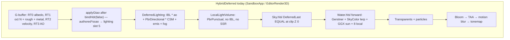

# Reflections (SSR + water) — replacement RFC

> **Accepted.** Implemented by execute-plan db67d670 PRs 1–5. Body below is the approved RFC (rev 2); present-tense “today” describes the pre-PR1 tip.

> **Replacement RFC.** Overwrites in-tree `Render/DESIGN-reflections.md` draft rev 1 (2026-09-17), which was not implementable (no heap / DWORD inventory, no water path despite the product ask, no reverse-Z march, no host knobs, no PR plan; planar water listed as a non-goal while the user wants sky **and** scene in the water). Spine kept: graphics-queue SSR for glossy G-buffer, compose with IBL specular, previous-frame scene color + current depth for deferred, HybridDeferred-first.

| Field | Value |
|-------|--------|
| **Title** | Screen-space reflections for glossy G-buffer surfaces **and** water, with analytic-sky miss |
| **Author** | Travis Johnston |
| **Date** | 2026-09-19 |
| **Status** | Accepted (rev 2 — product answers: planar v2, default-on after PR3, half-res) |
| **Priority** | P0 — [DESIGN-pbr-roadmap.md](./DESIGN-pbr-roadmap.md) item 7 |
| **Area** | `Render/SsrPipeline.*` (new), `Render/SceneBuffers.*`, `Render/SceneRenderer.*`, `Render/DeferredLightingPipeline.*`, `Render/WaterPipeline.*`, `Render/DebugRenderState.h`, `Render/Camera3D.*`, `content/shaders/{Ssr,SsrMarch,SkyEval,DeferredLighting,Water}.hlsl(i)`, Sandbox Dev Tools, Editor 3D, UnitTests |
| **Audience** | Engine, Sandbox, Editor owners who already know this tree |
| **Depends on** | [DESIGN-color-management.md](./DESIGN-color-management.md) (**landed** — linear Rec.709, HDR `R16G16B16A16_FLOAT`). [DESIGN-ibl.md](./DESIGN-ibl.md) (**landed** — split-sum, lighting heap slots 6–8, `evaluateIbl` in `DeferredLighting.hlsl`). [DESIGN-pbr-material-maps.md](./DESIGN-pbr-material-maps.md) (**landed** — RT1 roughness/metallic, octahedral N). [DESIGN-ssao.md](./DESIGN-ssao.md) (**landed** — GTAO, lighting slot 5 compose, Bloom-shaped graphics post). [DESIGN-reverse-z.md](./DESIGN-reverse-z.md) (**landed** — `D32_FLOAT` reverse-Z, `IsSkyDepth`, `ClampDepthForReconstruct`, infinite `GetProj()`, finite `GetCullViewProj()`). |
| **Supersedes** | In-tree `DESIGN-reflections.md` rev 1. |
| **Does not** | Compute PSOs / UAVs / `cs_5_0`. Hi-Z. Probe grid / dual-paraboloid. Planar extra view in **v1** (v2, user resolved Q1 — **R0**). IBL rebake with TOD. SSR on local-light volumes, particles, fog, sky backdrop. Growing `LightingConstants` past 56 floats. Bindless. Frame graph. Stencil. Putting water into the G-buffer. |

No C++ exceptions: `bool` + `DE_LOG_ERROR(LogCategory::Render, ...)` + `DE_ASSERT`. Fail `create` / `resize` closed.

---

## Overview

DarkEngine6 HybridDeferred already lights opaque G-buffer pixels with Karis split-sum IBL (`DeferredLighting.hlsl`: `ibl = (Fd * irr + spec) * ao * iblIntensity`) plus analytic sun / CSM. Chrome therefore reflects `content/env/studio_gradient.hdr` (peak ~0.42, no sun, no time-of-day), **not** the analytic `Sky.hlsl` dome the player sees. Water is a **forward** Gerstner pass (`Water.hlsl`) that lerps body color toward a two-color `SkyColor(R)` horizon/zenith gradient — no scene, no IBL cubes, no screen-space trace. The user wants **sky and scene** in the water, and the same idea on anything else shiny enough (PBR metals, wet stone, polished wood).

This RFC freezes **v1 as dual-path SSR**, both graphics-queue, both Bloom/GTAO-shaped (RTV + `SHADER_VISIBLE` SRV, `FLAG_NONE` resources, no UAV):

1. **Glossy G-buffer** — half-res ray march against current depth + previous-frame scene-color snapshot; compose **inside** `DeferredLighting.hlsl` **before** `FogIntegrate` as `spec = lerp(iblSpec, ssr.rgb, ssr.a)`. Direct sun / CSM / local lights stay. GTAO does **not** multiply SSR.
2. **Water** — after sky, downsample current HDR (opaques + sky, no water) into the snapshot; `Water.hlsl` marches from Gerstner-displaced pixels against that snapshot + scene depth. Hits show on-screen scene; sky-depth / off-screen misses show **analytic sky** (`EvaluateSky`), not the studio HDRI.

Planar extra-view water (off-screen trees behind the camera) is **v2**, specified below so it is not a footnote. v1 water **does** show sky and on-screen scene; it does **not** show off-screen. Dual-paraboloid / probe grids are rejected for v1 (no compute, no bindless, extra cubes). Putting water into the G-buffer is rejected (alpha, Gerstner, shore fade).

Default **on after PR3** (lighting compose). PR1–PR2 land `SsrSettings.enabled` and `DebugRenderState::ssrEnabled` **false** so plumbing/march soak via the checkbox. PR3 flips **both** to **true** (still AND together). Identity disable is the checkbox off. Sandbox Dev Tools is the primary soak. Editor 3D gets G-buffer SSR (Editor has no `WaterWorld`). `-forward`: G-buffer SSR is a no-op; water SSR runs only when `hasSceneBuffers()` (HDR snapshot exists).

---

## Background & Motivation

### What the tip actually does

Verified against `E:\DarkDev\DarkEngine6` at time of writing. Reverse-Z, IBL, and GTAO have landed. There is **no** SSR shader, no planar clip, no cubemap other than IBL, **zero** `cs_5_0` PSOs, stencil unused, no Hi-Z, no frame graph.



| Piece | Location | Fact |
|-------|----------|------|
| Lighting RS | `DeferredLightingPipeline.cpp` `create` | 6 params: **56** 32-bit constants b0, table **t0–t3** (4), shadow CBV b1, height t4, AO t5, IBL t6–t8. Static s0 point clamp, s1 comparison (`shadowCmpFunc()` = `GREATER_EQUAL`), s2 linear clamp `MaxLOD = FLOAT32_MAX`. |
| RS DWORD budget | `DeferredLightingPipeline.h` | `static_assert(56 + 1 + 2 + 1 + 1 + 1 <= 64)` → **62 / 64**. Headroom = **2 DWORDs**. |
| Lighting heap | `SceneBuffers.h` | `kLightingCount = 9`: albedo 0, attrib 1, depth 2, shadow 3, height 4, AO 5, irr 6, prefilter 7, LUT 8. **SHADER_VISIBLE**. One CBV_SRV heap (`SetDescriptorHeaps(1, { lightingHeap })`). A second heap **cannot** be bound at lighting time. |
| Lighting CB | `LightingConstants` | **56 floats**. `pbrLightColor` at float 48 / register 12. `padPbr0` / `padPbr1` occupy register 11.z/w so the float3 does not straddle. `padFog` at float 45. |
| IBL compose | `DeferredLighting.hlsl` ~135–140 | `spec = pre * (F0 * dfg.x + dfg.y)`; `ibl = (Fd * irr + spec) * ao * iblIntensity`. Then `lit = ibl + PbrDirectional * shadow + emis` and `ApplyLitFog`. |
| IBL content | `kDefaultIblVirtualPath` `env/studio_gradient.hdr` | Dim studio, no sun, **does not rebake with TOD**. Chrome ≠ visible sky. |
| G-buffer RT1 | `SceneBuffers.cpp` `R8G8B8A8_UNORM`; `GBuffer.hlsli` | `attrib = float4(EncodeOct(n), roughness, metallic)`. Decode: `DecodeOct(attrib.rg)`. |
| Depth | `Renderer::createDepthResources` | `R32_TYPELESS` / DSV `D32_FLOAT` / SRV `R32_FLOAT`. Clear **0**. Opaque `GREATER`. Water `GREATER_EQUAL`, depth write **off**. |
| Reverse-Z helpers | `content/shaders/Depth.hlsli` | `IsSkyDepth(d) = d <= 0`. `ClampDepthForReconstruct(d) = max(d, 1e-7)`. `LinearizeViewZ = nearZ / clamp(d)`. Infinite reverse `GetProj()`: `ndcZ = zn / viewZ`. |
| Reconstruct | `GBuffer.hlsli` `ReconstructWorldPos`; `Gtao.hlsl` `ReconstructViewPos` | Clip × inverse of the **writer** matrix (`GetViewProj()` / `GetProj()`). GTAO **S11**: do not pair unjittered `invP` with jittered depth. Never unproject raw 0. |
| HDR | `SceneBuffers::createColorTarget` | `R16G16B16A16_FLOAT`, **MipLevels = 1**, `ALLOW_RENDER_TARGET` only (no UAV). TAA history / post are separate RGBA16F targets. |
| `bindHdr(false)` | `Renderer.cpp` ~864 | Transitions G-buffer + depth → `PIXEL_SHADER_RESOURCE`, HDR → RT, **DSV unbound**. Lighting / GTAO run here. |
| `bindHdr(true)` | same | HDR RT + DSV. Sky, water, particles, transparents. |
| Host sequence | `SandboxApp.cpp` ~2543–2785; `EditorRender3D.cpp` ~397–427 | G-buffer → `bindHdr(false)` → `applyGtao` → `lighting.draw` → local volumes → `bindHdr(true)` → sky → **water** (Sandbox only) → transparents → particles → `applyPost`. |
| GTAO insert | `SceneRenderer::applyGtao` | After `bindHdr(false)`, before lighting. Skip restores lighting slot 5 to MRT3. Overlay tile **after unbinding DSV**. |
| Water RS | `WaterPipeline.cpp` `create` | 5 params: CBV b0 (**2 DWORDs**), root SRV t0 lights (**2**), height table t1 (**1**), shadow CBV b1 (**2**), shadow table t2 (**1**) = **8 / 64**. Plenty of headroom. Constants live in a **CBV** (`WaterFrameConstants`), not root constants — the 64-float block + `lightCount` + `waterIndex[8]` + fog already exceeds root-constant cap on purpose. |
| Water shading | `Water.hlsl` `PSMain` | Gerstner normal; `fres = F0 + (1-F0)*(1-NdotV)^5` with `fresnelF0 = 0.04`; `sky = SkyColor(R)` = `lerp(skyHorizon, skyZenith, sat(R.y*0.5+0.5))`; `color = lerp(body * (0.18+0.55*NdotL), sky, fres)` + `PbrDirectional(..., roughness 0.15, metallic 0, light 0.85)` **without CSM** on that sun term (Shadow.hlsli is included for fog; `ComputeShadow` is not called on the GGX highlight). 8 local `PbrPunctual`. Fog. Premultiplied-ish alpha `opacity * depthFade + fres*0.15`. `ENCODE_SRGB` when color format is UNORM. |
| Water fill | `WaterPipeline::fillConstants` | `deepColor (0.03,0.12,0.18)`, `shallow (0.12,0.38,0.36)`, `opacity 0.78`, `shoreDepth 2.4`, `specPower 96` (or −1 when lighting off). Zenith/horizon copied from `Sky::Environment` when present. |
| Water mesh | `WaterWorld` | Chunked patches where heightmap < water level. VS displaces; PS re-evaluates normal. Back-face cull, `FrontCounterClockwise = TRUE`. Depth write off. |
| Terrain RS | `TerrainPipeline.h` | G-buffer CB **63** floats + 1 table = **64 / 64**. Forward 60 + 1 + 2 = **63**. **Cannot grow.** Terrain stays G-buffer splat; SSR is a fullscreen / water-PS consumer, not a terrain bind. |
| Local-light RS | `LocalLightVolumePipeline.h` | 56 + 1 + 2 + 2 + 1 + 1 = **63 / 64**. No IBL, no SSR. Do not add a cube/SSR table. |
| TAA | `TaaPipeline` / `SceneBuffers` history | Post-water, post-bloom. History is **not** a legal SSR color source (includes water, jittered resolve). |
| Overlay | `DebugOverlay` | `drawColor` / `draw2D` / `drawVelocity` from FLAG_NONE CPU SRVs after `bindColorTargetOnly`. GTAO greyscale uses `draw2D(..., 1.0f, false)` because `drawColor` expands R8 to red. |
| Host knobs | `DebugRenderState` + `IblSettings` / `GtaoSettings` | IBL: `enabled` AND `debugState.iblEnabled` AND `GpuIbl::isReady()`. GTAO: `enabled` AND `debugState.ssaoEnabled`, default **off**. Dev Tools headers in `Sandbox/DevToolsPanel.cpp`; Editor in `Editor/EditorUi.cpp`. |
| Editor water | `EditorRender3D.cpp` | **No** `WaterWorld`. Grid + gizmos after sky. G-buffer SSR still applies to the ground plane and models. |
| Compute | `content/shaders/` | **Zero** `cs_5_0`. Bloom / TAA / lighting / IBL bake / GTAO are graphics fullscreen. |

### Pain points

1. **Chrome ≠ sky.** IBL is a static studio HDRI. The player sees Rayleigh/Mie + sun disc in `Sky.hlsl`. Rev 1’s “miss → IBL” makes a mirror floor reflect a grey studio, not the dome.
2. **Water has no scene.** `SkyColor` is a 2-stop lerp. Trees, crates, terrain banks never appear. The product ask is water **and** shiny props.
3. **Rev 1 cannot be implemented.** No DWORD math, no answer to “HDR is the water RT so it cannot also be the SSR SRV”, no reverse-Z compare, no host insert, planar listed as a non-goal while water is the first thing the user named.
4. **Compose-after-lighting is a fog trap.** `FogIntegrate` wraps the full `lit` including IBL spec. A later `hdr - iblSpec + ssr` is wrong once fog has run. Compose **must** happen inside the lighting shader, before fog — which means the SSR result must exist at `lighting.draw` time.
5. **Lighting RS is at 62/64.** Growing `LightingConstants` by 3 floats + a table blows the cap. Growing the lighting **heap** by one SRV is cheap; the DWORD cost is one descriptor table (**+1 → 63/64**).

---

## Goals & Non-Goals

### Goals (v1)

- Glossy G-buffer pixels (`roughness <= maxRoughness`, Fresnel-weighted) reflect **on-screen scene** via SSR and **analytic sky** on sky-depth miss.
- Water pixels reflect **on-screen scene** via a same-frame snapshot + march, and **analytic sky** on sky-depth / off-screen miss. Body / shore / Gerstner / local lights stay.
- Compose replaces **indirect specular only**. Sun, CSM, local punctual, emissive unchanged. GTAO stays ambient/IBL-diffuse+IBL-spec; it does not multiply SSR hits.
- Graphics-queue only. Bloom/GTAO lifetime: `create(device,w,h)` / `resize` / `draw`.
- Host knobs: Sandbox Dev Tools (primary) and Editor 3D. `SsrSettings` AND `DebugRenderState::ssrEnabled`. Default **on after PR3** (PR1–PR2 false).
- Debug overlay tiles: radiance, confidence. Not a lighting-shader early-out.
- CPU unit tests + `ShaderCompile` of new PS entry points. No GPU screenshot harness.
- No C++ exceptions.

### Non-goals (v1)

- **Planar extra view** (mirrored camera, oblique clip, second G-buffer/lighting). Specified as **v2** (user resolved Q1). Do not add planar to this stack. Do not drop water SSR.
- Hi-Z / hierarchical depth. None exists; do not invent a compute downsample pyramid.
- GGX-lobe-matched prefilter of SSR (roughness → HDR mip). HDR has `MipLevels = 1`. Gate roughness instead.
- Probe grid, dual-paraboloid, parallax-corrected volumes, DDGI.
- IBL on water / particles / `-forward` meshes / fog / sky. Water’s *sky* miss is analytic `EvaluateSky`, not `gIblPrefilter`.
- SSR on local-light volumes (would need a 64th DWORD on a 63/64 RS).
- Putting water into the G-buffer / deferred glass.
- Rebaking IBL cubes from `Sky.hlsl` (IBL RFC model B / v1.5).
- Compute. Bindless. Frame graph. Stencil.

---

## Key Decisions

| ID | Decision | Why |
|----|----------|-----|
| **R0** | **v1 technique = dual-path SSR, not planar.** Glossy opaques: fullscreen `SsrPipeline` composed in deferred lighting. Water: same snapshot + `SsrMarch.hlsli` inside `Water.hlsl`. Planar extra view is **v2** (user resolved Q1 — not this stack; a reverse-Z Lengyel RFC must land first). Dual-paraboloid / probes rejected. Water-in-G-buffer rejected. **Do not drop water SSR.** | The user asked for sky **and** scene in water. SSR-on-G-buffer-only would leave water as a gradient (rev 1’s actual outcome). Planar is the only off-screen technique and costs a second scene at half-res. Water-pixel SSR + analytic sky **does** put the opposite shore (on-screen) and the dome in the lake. Off-screen (behind camera) is the named v2 gap. |
| **R1** | **Graphics-queue fullscreen PS + RTV**, GTAO/Bloom-shaped. No `cs_5_0`, no `ALLOW_UNORDERED_ACCESS`, no `u0`. | Standing engine rule (IBL / GTAO / reverse-Z). |
| **R2** | **Lighting heap grows 9 → 10.** Slot 9 = SSR result (`RGBA16F` radiance + A confidence). New root table `kRootSsrSrv = 6` (**+1 DWORD → 63/64**). `LightingConstants` stays **56 floats**; rename `padPbr0` → `ssrEnabled` (float 46 / register 11.z). Do **not** grow the CB. **Dummy 1×1 `RGBA16F` `(0,0,0,0)` is owned by `Renderer`** (same pattern as `iblDummyLut` / `iblDummyCube` in `Renderer.cpp` ~771–800), packed into slot 9 at `enableSceneBuffers` / resize. `DeferredLightingPipeline::draw` **always** `SetGraphicsRootDescriptorTable(kRootSsrSrv, ssrTableGpu())` from PR1 — an unbound root table is a debug-layer error even if HLSL does not declare `t9`. | D3D12 allows one CBV_SRV heap. SSR cannot live on a second heap at `lighting.draw`. GTAO avoided growth by composing into slot 5; there is no existing unused lighting slot for a radiance buffer. `SsrPipeline` does **not** own the dummy (it does not exist in PR1). |
| **R3** | **Scene-color snapshot after the last opaque+sky write, before water/grid.** Downsample current HDR → half-res `SsrSceneColor[write]`, then swap so water and next frame’s trace read that buffer. Lighting/trace always sample **`[read]`** (previous capture). **`applySsr` / `captureSceneColor` unbind the HDR RT, then restore** (GTAO: `OMSetRenderTargets(0)` then `bindHdr(false)`). Editor has no sky/water: capture after local lights + `bindHdr(true)`, **before** grid/gizmos. `env == nullptr` → sky-depth miss is conf 0 (IBL), do not evaluate a zeroed `SkyEvalParams`. | HDR is the water RT (`bindHdr(true)`). D3D12 cannot bind the same resource as RTV and SRV. TAA history is post-water / post-resolve — illegal. Previous-frame color at lighting time is the only way to compose **before fog** (**R4**). Water gets same-frame opaques+sky. Leaving `SsrFull` bound makes lighting write into the SSR target (black scene). |
| **R4** | **Compose in `DeferredLighting.hlsl` before `FogIntegrate`.** SSR **does not** multiply `iblIntensity` or GTAO. IBL-off still adds SSR spec. Frozen equation in Proposed Design. Direct sun / local / emis unchanged. | Fog wraps `lit`. Post-lighting subtract is wrong. SSR is scene radiance, not studio-cube energy — dimming it with the IBL intensity knob is a look bug. Dummy `conf=0` keeps each branch bit-identical to today. |
| **R5** | **Sky-depth miss → analytic `EvaluateSky(R)`** when `env != nullptr` (extract `SkyEval.hlsli` from `Sky.hlsl` `EvaluateSky`, keep CPU `Environment::evaluateSky` in visual sync). **Off-screen / max-steps miss:** G-buffer SSR `conf=0` → IBL spec (do not invent sky where a building might be). Water miss (sky **or** off-screen) → `EvaluateSky(R)` (lakes should not fall back to studio HDRI; water has no IBL today). Editor sky-miss = conf 0. Starting G-buffer pixel `IsSkyDepth` = conf 0 (lighting `discard`s it). | Product: chrome reflects the dome the player sees, including sun disc. Rev 1’s miss→IBL is a look bug given `studio_gradient.hdr`. |
| **R6** | **HybridDeferred-first.** `-forward`: G-buffer SSR is a **no-op** (`!hasGBuffer()`). Water SSR runs if `hasSceneBuffers()` (HDR exists); else no-op. Forward shaders other than water are unchanged. | Roadmap track done-when 4. Editor 2D / Sandbox2D / HUD: no-op. |
| **R7** | **Default on after PR3.** PR1–PR2: `SsrSettings.enabled` and `DebugRenderState::ssrEnabled` are **false** (identity plumbing / soak checkbox). **PR3** (lighting compose — first opaque look) flips **both** struct defaults to **true**. Host still ANDs them (`fillSsrLightingConstants`). PR4 water inherits the same defaults. Identity disable is the checkbox **off** (dummy conf 0, water `SkyColor`) — not `maxRoughness=0`. Water also gates on `kWaterRoughness (0.15) <= maxRoughness`. | User resolved Q2: default-on after the look PRs, not GTAO stay-off. Flip in PR3 so chrome/wet floors reflect as soon as compose exists. PR1–PR2 stay false so dummy t9 / march can be soaked without a look change. |
| **R8** | **Half-res trace**, full-res upsample + temporal. One target `RGBA16F` (rgb radiance, a confidence). No HDR mips (`MipLevels = 1` on `SceneBuffers` HDR). Roughness gate instead of lobe blur. User resolved Q3: **half-res stays**; not a host knob. | Matches GTAO cost envelope. Stub’s “mip `roughness * k`” is not implementable without a mip chain we will not add to the scene HDR (Bloom owns its own mips and they are thresholded). |
| **R9** | **Screen-space DDA (McGuire & Mara), hit test in view-Z.** Reconstruct start with the matrix that **wrote** depth (`GetViewProj()` / `GetProj()`, GTAO **S11**, reverse-Z **Z8**). Clip the world segment so both endpoints have `clip.w > nearZ`. Walk UV with pixel `stride` (default 2). Perspective-correct `rayViewZ = 1 / lerp(1/clip0.w, 1/clip1.w, t)` — do **not** `lerp(clip.w)`. `lenPx < 1` (floor looking at the sky: `uv0 ≈ uv1`) is a **sky miss**, not off-screen IBL. Stop at `t >= 1`. `IsSkyDepth` → sky miss **before** any unproject (**Z9**). No `R·V` early-out. Thickness in view-Z metres. Hi-Z is a non-goal. | Reverse-Z ndc is 1/z; `w` is not linear in screen. `clip1.w <= 0` is the floor/lake ray toward the camera — must near-clip, not `max(w, 1e-4)` garbage UVs. Tiny `lenPx` is the dome, not a DDA blow-up. |
| **R10** | **Water stays forward.** Plug SSR into the existing Fresnel lerp: `reflection = lerp(EvaluateSky(R), hitRadiance, conf)` when SSR on and hit; miss (sky / off-screen / low conf) = `EvaluateSky`. SSR **off** keeps today’s `SkyColor` lerp. Art roughness stays the frozen **0.15** GGX sun term; water traces iff `0.15 <= maxRoughness`. Skip SSR if `NdotV <= 0`. Do not multiply water SSR by GTAO. Transparent tail uses **`bindHdrDepthRead()`**: DSV heap **1→2**, slot 1 = `D3D12_DSV_FLAG_READ_ONLY_DEPTH` on the same `R32_TYPELESS` resource (live slot 0 is `FLAG_NONE` write — cannot bind that DSV with the depth SRV). Append `SkyEvalParams` to `WaterFrameConstants`. `SsrMarch` resolution: water uses `gDepth.GetDimensions` (full-res), PSTrace uses half-res (`1/invSizeHalf`). | Water RS has 8/64 DWORDs and a CBV that **may grow**. Live `createDepthResources` is a **1-slot** DSV heap (`Renderer.cpp` ~239–352). PSO write-mask ZERO is not a read-only DSV. |
| **R11** | **Temporal is v1** and **owned by SsrPipeline**, not TAA. Ping-pong two `RGBA16F` histories (D3D12 cannot bind the same resource as SRV and RTV — GTAO lesson). History stores **linear radiance**, not post-curve / not tonemapped. Neighborhood clamp. `reset` on first frame, enable rising edge, resize, TAA history invalid. | TAA jitter is on by default (`DebugRenderState.taa = true`). Raw half-res sparkles when still. |
| **R12** | **Debug view is a DebugOverlay tile**, not a lighting early-out. `ssrDebug = 0/1/2` (off / radiance / confidence). Radiance = `drawColor(SsrFull)`. Confidence = pipeline-owned `SsrDebug` `R8_UNORM` + `draw2D(..., 1.0f, false)` (GTAO `AoFull` pattern). Bump `DebugOverlay::kDrawsPerFrame` **8 → 12** in PR2. | Lighting RS has 1 DWORD left after **R2**. Overlay heap is `8*2` today; Sandbox already spends albedo+attrib+velocity+SSAO+depth+shadow slices — two SSR tiles overflow and drop. `drawColor` samples `.rgb` only. |
| **R13** | **No compute. No new UAV. No Hi-Z. No stencil.** | Standing rules. |
| **R14** | **Do not commit `DESIGN-*.md` from code PRs 1–N-1.** Docs PR last, same as IBL / GTAO / reverse-Z. This scratch file is the RFC body. | Git policy. |
| **R15** | **`SsrPipeline` is created in `SceneRenderer::createPostPipelines`** (next to Bloom/GTAO), **not** `createWorldEnvPipelines`. Editor `SceneRendererDesc` is `createWorldEnvironment=false`, `createTerrainPipeline=true` — it still gets SSR. `shutdown` resets `m_ssr = SsrPipeline{}`. | Editor is promised G-buffer SSR. World-env create is Sandbox-only (terrain/water/sky). |
| **R16** | **Enabled checkbox + debug combo ship in PR2.** Thickness / stride / maxRoughness / edgeFade sliders stay PR5. PR1–PR2 defaults **false**; **PR3 flips both to true** (**R7**). | PRs 2 cannot be soaked if the only UI is PR5. Overlay is useless if SSR cannot be turned on. |

---

## Technique split (A / B / C / D) — why R0

| Option | What it delivers | Cost / constraint | v1? |
|--------|------------------|-------------------|-----|
| **A.** SSR on G-buffer only; water keeps `SkyColor` / IBL | Shiny floors show crates. Water does **not** show scene. | Cheap. **Fails the product ask.** | No (as the only water path) |
| **A+.** A + water-pixel SSR from snapshot (**frozen v1**) | Water shows on-screen scene + analytic sky. Glossy props too. Off-screen missing. | Half-res march + one HDR downsample. Water RS +1 DWORD. | **Yes** |
| **B.** Planar extra view for water + SSR for props | Water shows off-screen + sky. Classic lakes. | Extra half-res scene (terrain + opaques + sky), oblique clip, mirrored `Camera3D`, second DSV. Host sequence grows a lot. Editor has no water. | **v2** |
| **C.** Water into G-buffer / deferred composite | One SSR from all “reflective” pixels | Breaks Gerstner alpha, shore fade, forward fog, `GREATER_EQUAL` depth-test-only water. Pipeline rewrite. | No |
| **D.** Dual-paraboloid / probe grid | Off-screen, view-independent | Extra cubes, bake, no compute/bindless to make it cheap. IBL already occupies the only cube slots. | No |

**v2 planar (so it is specified, not waved at):**

- Mirror `Camera3D` through the horizontal plane `Y = waterLevel` (reflect position and look; keep +Y up by flipping the up that would invert winding, or reverse cull).
- Lengyel oblique clip on the **raster** `GetProj()` so geometry below the plane is clipped. Cull VP stays finite reverse (`GetCullViewProj()` analogue for the mirrored camera). Reverse-Z: clip plane must produce near→1 far→0; do not copy a forward-Z Lengyel snippet.
- Pipeline-owned half-res `RGBA16F` + `D32_FLOAT` DSV. Clear depth 0, color linear 0.
- Re-draw: sky `ForwardFirst` (depth off), terrain **forward** (or G-buffer+lighting — reject G-buffer; too expensive), opaque meshes forward, reuse world-space CSM. Skip GTAO, local volumes, particles, water, transparents, post.
- Water samples with projective texture + Gerstner-normal UV perturb (`R.xz` scaled). Combine with v1 SSR? **No** — planar replaces water SSR when enabled.
- Sandbox-only. Not in Editor.

**Q1 resolved: planar stays v2, not this stack.** A later reverse-Z Lengyel RFC must freeze `GetProj()` entries (m33/m43 and the homogeneous clip plane) and the finite cull-VP analogue **before** any planar code PR. Do not drop water SSR. Do not silently ship A-only.

---

## Proposed Design

### End-to-end frame (HybridDeferred)

```mermaid
sequenceDiagram
  participant Host as SandboxApp / EditorRender3D
  participant SR as SceneRenderer
  participant SSR as SsrPipeline
  participant Lit as DeferredLighting
  participant Sky as SkyPipeline
  participant W as WaterPipeline

  Host->>Host: G-buffer (depth GREATER, velocity, attrib)
  Host->>Host: bindHdr(false)  // G-buffer+depth = SRV, HDR = RT, no DSV
  Host->>SR: applyGtao(...)
  Note over SR: OMSetRenderTargets(0) → GTAO RTVs → bindHdr(false)
  Host->>SR: applySsr(camera, prevViewProj, env, settings)
  Note over SSR: OMSetRenderTargets(0) → trace vs depth + SsrSceneColor[read]<br/>upsample + temporal → SsrFull → bindHdr(false)
  SR->>Host: setLightingSsrSrv(ssr.fullSrvCpu()) or dummy
  Host->>Lit: lighting.draw  // t9 always bound; lerp IBL spec, then fog
  Host->>Host: local lights
  Host->>Host: bindHdr(true)
  Host->>Sky: DeferredLast EQUAL z=0  (Sandbox only; Editor skips)
  Host->>SSR: captureSceneColor(hdr)
  Note over SSR: unbind HDR+DSV → HDR PSR → downsample SsrSceneColor[write]<br/>swap read/write → bindHdrDepthRead()
  Host->>W: water.draw  // Sandbox: march vs SsrSceneColor[read] + depth SRV
  Host->>Host: transparents, particles, applyPost
  Host->>Host: debug overlay tiles after unbind DSV
```

**`applySsr` (mirrors `applyGtao`):** `OMSetRenderTargets(0, nullptr, FALSE, nullptr)` → pipeline-owned RTVs (depth is already `PIXEL_SHADER_RESOURCE` under `bindHdr(false)`) → `setLightingSsrSrv` → **`renderer.bindHdr(false)`**. Skip path binds dummy slot 9 and still restores `bindHdr(false)`.

**`captureSceneColor`:** unbind DSV+HDR → `transitionHdr(PIXEL_SHADER_RESOURCE)` → downsample into `SsrSceneColor[write]` → **swap** `read ↔ write` → **`renderer.bindHdrDepthRead()`** (HybridDeferred / `-forward` with water) or `bindHdr(true)` (Editor: no depth sample this frame after capture; grid/gizmos depth-test with write off is still legal as `DEPTH_WRITE`, but using `bindHdrDepthRead()` everywhere is simpler — **frozen: capture always restores via `bindHdrDepthRead()`**).

**Ping-pong:** `applySsr` / water always sample `[read]`. Capture writes `[write]`, then swaps so `[read]` is the buffer just captured (water this frame + lighting next frame).

`-forward` with `hasSceneBuffers()`: skip `applySsr` / lighting bind; still `captureSceneColor` after opaques (sky already drew first on this path) before water.

### Frozen GPU map (`SsrPipeline`-owned)

| Name | Size | Format | Role |
|------|------|--------|------|
| `SsrHalf` | `(w+1)/2 × (h+1)/2` | `R16G16B16A16_FLOAT` | Raw trace: rgb radiance, a confidence |
| `SsrFull` | `w × h` | `R16G16B16A16_FLOAT` | After bilateral upsample + temporal. **CopyDescriptors source for lighting slot 9** |
| `SsrHistory[2]` | `w × h` | `R16G16B16A16_FLOAT` | Ping-pong linear radiance+conf. Never the same resource as RTV and SRV in one draw |
| `SsrSceneColor[2]` | half-res | `R16G16B16A16_FLOAT` | Downsampled post-opaque HDR. `[read]` → G-buffer trace + water; `[write]` → this capture, then swap |
| `SsrDebug` | `w × h` | `R8_UNORM` | Confidence vis for overlay (`draw2D`). Written by `PSDebugConf` from `SsrFull.a` when `ssrDebug==2`, or every upsample (cheap). |

Clear: radiance 0, confidence 0 (identity = “use IBL”). On resize, recreate all; `resetHistory = true`.

`SsrFull` is the lighting bind. Overlay samples FLAG_NONE CPU SRVs (`SsrFull` / `SsrDebug`), not the shader-visible lighting heap.

Do **not** render SSR into SceneBuffers HDR, TAA history, or MRT3.

Dummy when off / invalid: **Renderer-owned** 1×1 `RGBA16F` `(0,0,0,0)` (`Renderer::ssrDummyCpu()`, sibling of `iblDummyLutCpu()`), packed at `enableSceneBuffers` / resize. `setLightingSsrSrv(dummy)` on skip so a disable cannot stick a stale handle (GTAO slot-5 lesson). `SsrPipeline` does not create this texture.

### Lighting bind (R2)

```cpp
// SceneBuffers.h — next to setLightingAoSrv
static constexpr UINT kLightingSsr = 9;
static constexpr UINT kLightingCount = 10; // was 9

void setLightingSsrSrv(ID3D12Device* device, D3D12_CPU_DESCRIPTOR_HANDLE ssrCpu);
```

`packLightingHeap` copies `m_lightingSsrCpu` if set, else `Renderer::ssrDummyCpu()`. **Frozen:** `enableSceneBuffers` / resize always pack the dummy (same as dummy IBL at `Renderer.cpp` ~798–800). `DeferredLightingPipeline::draw` always binds `kRootSsrSrv` — PR1, not PR3.

`DeferredLightingPipeline`:

```cpp
static constexpr UINT kRootSsrSrv = 6; // after kRootIblSrv = 5
// RS: 56 + 1 + 2 + 1 + 1 + 1 + 1 = 63 DWORDs
```

New descriptor range: `NumDescriptors = 1`, `BaseShaderRegister = 9` (`t9`). GPU handle = lighting heap start + `kLightingSsr * incr` (`renderer.ssrTableGpu()` analogue of `aoTableGpu()`).

`LightingConstants`: rename `padPbr0` → `ssrEnabled`. `fillSsrLightingConstants(lc, settings, debugEnabled, pipelineValid)` writes `1` iff `settings.enabled && debugState.ssrEnabled && pipelineValid && hasGBuffer()`. Do not add fields; `static_assert(sizeof == 56 * sizeof(float))` stays.

`UnitTests/Render/SceneBuffersTests.cpp` `LightingCount` and `GtaoTests.cpp` `LightingCount_Unchanged` must expect **10**. That is an intended, reviewable break.

### `SsrPipeline` root signature (separate PSO; lighting RS only gains t9)

```text
[0] CBV b0              2 DWORDs    SsrGpuParams (256-byte)
[1] SRV table t0–t4     1 DWORD     per-pass CopyDescriptors (see passes)
[2] CBV b1              2 DWORDs    SkyEvalParams (EvaluateSky miss; PR3+)
static s0 point clamp, s1 linear clamp
Total 5 DWORDs
```

PR2 may omit CBV b1 (3 DWORDs) and add it in PR3 with `SkyEval.hlsli`. Either is legal; **frozen:** PR3 adds b1 rather than leaving uninitialized sky uniforms. When `env == nullptr`, fill SkyEvalParams with zeros and the trace shader does **not** call `EvaluateSky` (conf 0).

Downsample pass reuses `[0]+[1]` with t0 = full-res HDR (CopyDescriptors into the pass heap, GTAO-style per-frame SHADER_VISIBLE tables). Depth-off fullscreen triangle, RTV `SsrSceneColor[curr]`.

### `SsrGpuParams` (CBV, 16-byte aligned, 64 floats)

```cpp
struct SsrGpuParams
{
    float invSizeHalf[2];
    float invSizeFull[2];
    float invViewProj[16];   // inverse of Camera3D::GetViewProj() — wrote depth
    float viewProj[16];      // Camera3D::GetViewProj() (jittered)
    float reprojection[16];  // inverse(GetViewProj()) * prevViewProj  — row-vector, matches GtaoPipeline::fillParams
    float nearZ;             // Camera3D::GetNearZ()
    float thickness;         // view-Z metres; default 0.2
    float stride;            // screen-space DDA pixel stride; default 2
    float maxRoughness;      // default 0.4
    float edgeFade;          // UV margin; default 0.1
    float reset;             // 1 = do not sample history
    float frameOffset;       // low bits of frameIndex, interleaved dither
    float _pad;
    float cameraPos[3];      // world; V = normalize(cameraPos - worldPos)
    float _padCam;
};
static_assert(sizeof(SsrGpuParams) == 64 * sizeof(float));
```

`kSsrMaxSteps = 32`, `kSsrWaterMaxSteps = 16`, and `kSsrRayLength = 256` (metres along `R` for DDA direction) are `#define` in HLSL, not CB fields (GTAO directions/steps pattern).

**Reprojection multiply order is row-vector** (`p * M`): `copyMatrix(out.reprojection, camera.GetViewProj().Inverse() * prevViewProj)` — live GTAO (`GtaoPipeline.cpp` ~486). Do **not** write `prevViewProj * inverse(this)`. Upsample primary history UV is MRT2 velocity (`histUv = uv - velocity`); the matrix is the sky / missing-velocity fallback.

Do **not** pass `GetProjUnjittered()` as the reconstruct matrix (GTAO **S11**).

**v1 F0 does not sample albedo.** Confidence uses `F0 = lerp(0.04, 1, metallic)` (scalar). Hit radiance is scene color, not F0. Colored-metal grazing confidence is slightly hot; v1.1 may bind linear albedo as t5. Trace table stays t0–t4 (1 DWORD).

### SkyEval (R5)

Extract `EvaluateSky` + its helpers (`Hash21`, `Noise2`, `Fbm`, `RayleighPhase`, `MiePhase`) from `content/shaders/Sky.hlsl` into `content/shaders/SkyEval.hlsli`. `Sky.hlsl` includes it. `Ssr.hlsl` / `Water.hlsl` include it for miss.

`SkyEvalParams` is the subset of `SkyPipeline`’s `FrameConstants` that `EvaluateSky` reads (24 floats, 16-byte aligned):

```cpp
struct SkyEvalParams
{
    float sunDir[3];    float coverage;
    float sunColor[3];  float turbidity;
    float moonDir[3];   float rain;
    float moonColor[3]; float windSpeed;
    float windDir[2];   float sunElevation; float exposure;
    float cloudTime;    float _pad[3];
};
static_assert(sizeof(SkyEvalParams) == 24 * sizeof(float));
```

Fill from `Sky::Environment` the same way `SkyPipeline::draw` already does. **Water:** append this struct plus the SSR camera block to `WaterFrameConstants` (CBV — prefer this over a second water CBV). `WaterPipeline::cbBytes()` is `(sizeof + 255) & ~255`; today that is **512** (`WaterLightPickTests`). The append is 16+16+8 + 24 = **64 floats** → aligned size **768**. Update the 512 assert in PR4. Identity disable (SSR off → `SkyColor` lerp) stays; SSR **on** miss uses `EvaluateSky` even with zero hits.

Keep CPU `Environment::evaluateSky` numerically in the same ballpark; a new unit test samples a few directions on CPU vs a documented HLSL contract (luminance, not bit-exact).

HLSL zeros stay `0.0.xxx`, not `0.xxx` (FXC X3000; IBL bake lesson).

### Graphics passes (one file, entry-point macros)

1. **PSDownsample** — half-res. t0 = full-res HDR. RTV `SsrSceneColor[write]`. 2×2 / bilinear. Host calls `SsrPipeline::captureSceneColor` after the last opaque+sky write (Sandbox: after sky; Editor: after local lights + `bindHdr(true)`, before grid). HDR is **not** the RT during this pass (unbind first).
2. **PSTrace** — half-res. t0 depth, t1 attrib, t2 `SsrSceneColor[read]`. RTV `SsrHalf`.
   - **PR2:** sky-pixel `IsSkyDepth`, roughness gate, off-screen, max-steps, and march sky-depth miss all write **`(0,0,0,0)`**. Do **not** include `SkyEval.hlsli` in PR2.
   - **PR3:** march sky-depth miss writes `EvaluateSky(R)` × edge fade (high conf) when `env != nullptr`; starting pixel `IsSkyDepth` still conf 0 (no surface; lighting `discard`s). Off-screen / max-steps stay conf 0. `env == nullptr` (Editor) → conf 0 on sky miss.
   - Roughness `> maxRoughness` → conf 0, no march. Else DDA (below).
3. **PSUpsampleTemporal** — full-res. t0 `SsrHalf`, t1 depth, t2 attrib, t3 history, t4 velocity. Dual RTV: `SsrFull` + `SsrHistory[write]`. Bilateral upsample (depth + oct-normal weights vs **full-res** G-buffer). Temporal blend + neighborhood min/max clamp of **radiance** (not confidence). `reset > 0.5` → current only. Confidence: `min(current, history)` after clamp, or current-only on reset. History UV: `uv - velocity` (MRT2); reprojection matrix if velocity is 0.
4. **PSDebugConf** — full-res. t0 `SsrFull`. RTV `SsrDebug` R8 = `.a`. Run when `ssrDebug==2` (or always; cheap). Overlay `draw2D`.

Disabled / `!isValid` / `!hasGBuffer()`: skip trace; `setLightingSsrSrv(renderer.ssrDummyCpu())`; restore `bindHdr(false)`. Water with no snapshot (`hasSceneColor()==false`) or SSR off uses **`SkyColor` lerp**, not `EvaluateSky`.

### Ray march (R9) — `SsrMarch.hlsli`

Shared by `Ssr.hlsl` PSTrace and `Water.hlsl` PSMain. **Frozen: screen-space DDA** (McGuire & Mara 2014, no Hi-Z), **perspective-correct view-Z hit test**. Signature takes `float2 resolution` (pixels of the depth being sampled): PSTrace = half-res (`1/invSizeHalf`); water = `gDepth.GetDimensions` (full-res scene depth). Do **not** reuse `SsrGpuParams.invSizeHalf` from water.

```
// --- setup ---
if IsSkyDepth(depth) && this is a G-buffer pixel: return miss (conf 0)   // no surface
worldPos = ReconstructWorldPos(ndc, depth, invViewProj)                  // ClampDepthForReconstruct
N        = DecodeOct(attrib.rg)                                          // world; water passes Gerstner N
V        = normalize(cameraPos - worldPos)
R        = reflect(-V, N)
// DO NOT early-out on R·V ≈ 1 — that IS a mirror floor / lake (N ≈ V ≈ +Y)

P0 = worldPos
P1 = worldPos + R * kSsrRayLength                         // 256 m
clip0 = mul(float4(P0, 1), viewProj)
clip1 = mul(float4(P1, 1), viewProj)
wMin  = max(nearZ, 1e-3)                                  // infinite reverse: clip.w == view-Z

// Near-plane clip of the world segment so both endpoints have clip.w > wMin.
// Floor/lake R often points toward the camera → clip1.w <= 0 without this.
if clip0.w <= wMin && clip1.w <= wMin: sky miss           // entire ray behind near
if clip1.w <= wMin:
    tClip = (clip0.w - wMin) / (clip0.w - clip1.w)
    P1 = lerp(P0, P1, saturate(tClip)); clip1 = mul(float4(P1,1), viewProj)
if clip0.w <= wMin:
    tClip = (wMin - clip0.w) / (clip1.w - clip0.w)
    P0 = lerp(P0, P1, saturate(tClip)); clip0 = mul(float4(P0,1), viewProj)
if clip0.w <= wMin || clip1.w <= wMin: sky miss

uv0 = clip0.xy/clip0.w * float2(0.5,-0.5)+0.5
uv1 = clip1.xy/clip1.w * float2(0.5,-0.5)+0.5
lenPx = length((uv1 - uv0) * resolution)
if lenPx < 1: sky miss   // toward camera / along view (uv0≈uv1). NOT off-screen IBL.
                         // Chrome floor looking at the dome must EvaluateSky (PR3), conf 0 in PR2.
stepUv = (uv1 - uv0) / lenPx * stride                    // stride = DDA pixels, this pass

for i in 1..maxSteps:                                    // skip i=0 self-hit; G-buffer 32, water 16
    t = stride * i / lenPx
    if t >= 1: max-distance miss                         // past kSsrRayLength; do not keep walking UV
    uv = uv0 + stepUv * i
    if uv out of [edgeFade, 1-edgeFade]: off-screen miss
    sceneD = depth.SampleLevel(point, uv, 0).r
    if IsSkyDepth(sceneD): sky miss                      // EvaluateSky in PR3; conf 0 in PR2
                                                         // NEVER unproject sceneD here
    rayViewZ   = 1.0 / lerp(1.0/clip0.w, 1.0/clip1.w, saturate(t))  // perspective-correct
    sceneViewZ = LinearizeViewZ(sceneD, nearZ)
    if rayViewZ >= sceneViewZ && (rayViewZ - sceneViewZ) <= thickness:
        hit: sample sceneColor at uv
        conf = edgeFade(uv) * F_schlick(F0, NdotV)_luma
             * saturate(1 - roughness/maxRoughness) * (1 - i/maxSteps)
        return
max steps → off-screen-style miss (G-buffer conf 0; water EvaluateSky)
```

Do **not** `lerp(clip0.w, clip1.w, t)` — `w` is not linear in screen. Equivalent form: lerp reverse-Z ndc `zn/w`, then `LinearizeViewZ`. Do **not** `max(clip1.w, 1e-4)` to salvage a behind-camera endpoint.

`F0` v1 = `lerp(0.04, 1, metallic)` (no albedo sample). Water uses `fresnelF0 = 0.04` and `roughness = 0.15`.

**Self-hit:** skip `i=0`. Water is **not** in the depth buffer (write off), so self-hit is G-buffer-only.

**Binary refinement:** 4 extra shrinking steps after first hit, v1 allowed. Not Hi-Z.

**CPU tests:** `N=V=+Y` → `lenPx < 1` sky miss (not off-screen IBL); no `R·V` gate. 45° ray: `lerp(w)` ≠ `1/lerp(1/w)`.

Dielectric wet stone (`metallic=0`, `roughness=0.2`) still traces; rough dirt (`roughness=0.9`) does not.

### Lighting equation (R4)

Replace the IBL / `lit` block in `DeferredLighting.hlsl` (~135–155). SSR is **not** scaled by `iblIntensity` (host IBL knob) and **not** multiplied by AO:

```hlsl
float4 ssr  = gSsr.Load(int3(texel, 0)); // t9; dummy is (0,0,0,0)
float  conf = (ssrEnabled >= 0.5f) ? saturate(ssr.a) : 0.0f;

float3 specIblTerm = 0.0.xxx;
float3 diffTerm    = ambientColor * albedo.rgb * ao; // IBL-off default
if (iblEnabled >= 0.5f)
{
    float3 Fd      = albedo.rgb * (1.0f - metallic) * (1.0f / DE_PBR_PI);
    float3 specIbl = pre * (F0 * dfg.x + dfg.y);
    specIblTerm    = specIbl * ao * iblIntensity;    // AO + intensity on IBL spec only
    diffTerm       = Fd * irr * ao * iblIntensity;
}
float3 spec = lerp(specIblTerm, ssr.rgb, conf);      // SSR: no AO, no iblIntensity
float3 lit  = diffTerm + spec
            + PbrDirectional(n, v, albedo.rgb, roughness, metallic, lightDirWS, pbrLightColor) * shadow
            + albedo.rgb * emissive * emissiveGain;
```

`ssrEnabled` / `lighting < 0.5` (albedo copy) / `iblDebug >= 0.5` (existing debug early-outs skip fog): `conf = 0` / skip SSR. Dummy t9 ⇒ `conf=0` is bit-identical to today’s IBL-on and IBL-off branches.

IBL-off + SSR-on: `specIblTerm = 0`, `diffTerm = ambient*albedo*ao`, `spec = ssr.rgb` at conf 1 → chrome still mirrors scene/sky. Dielectrics keep Lambert ambient + SSR × Fresnel.

Local lights: unchanged. They add punctual spec on top of deferred; do not SSR inside the volume shader (63/64).

### Water shading (R10)

Today (`Water.hlsl` ~176–188):

```hlsl
float3 r   = reflect(-v, n);
float3 sky = SkyColor(r);
float3 color = body * (0.18f + 0.55f * ndotl);
color = lerp(color, sky, fres);
color += PbrDirectional(n, v, 0.0.xxx, 0.15f, 0.0f, l, 0.85.xxx);
```

v1:

```hlsl
float3 r = reflect(-v, n);
float3 reflection = SkyColor(r); // SSR off / no snapshot: today's lerp — identity disable
if (ssrEnabled && NdotV > 0 && hasSceneColor && kWaterRoughness <= maxRoughness)
{
    reflection = EvaluateSky(r); // miss default when SSR on (sky / off-screen / low conf)
    uint w, hTex; gDepth.GetDimensions(w, hTex);          // full-res; do not use invSizeHalf
    SsrHit h = SsrMarch(worldPos, r, float2(w, hTex), /*water steps 16*/);
    if (h.kind == Hit)
        reflection = lerp(reflection, h.radiance, saturate(h.conf)); // edge fade, not a hard pop
}
float3 color = body * (0.18f + 0.55f * ndotl);
color = lerp(color, reflection, fres);
color += PbrDirectional(...); // unchanged, still no CSM on this term (pre-existing)
```

**Depth bind:** live `createDepthResources` (`Renderer.cpp` ~239–352) is a **1-slot** DSV heap, `D3D12_DSV_FLAG_NONE` (writable). D3D12 cannot bind that DSV together with the depth SRV even if the PSO write mask is ZERO — a simultaneous DSV+SRV bind requires **`D3D12_DSV_FLAG_READ_ONLY_DEPTH`**. Frozen:

```cpp
// createDepthResources / resize (PR2): DSV heap NumDescriptors 1 → 2
// slot 0: existing write DSV, FLAG_NONE  — G-buffer, bindHdr(true), sky
// slot 1: same R32_TYPELESS resource, D3D12_DSV_FLAG_READ_ONLY_DEPTH

void bindHdrDepthRead();
// transitionHdr(RENDER_TARGET);
// transitionDepth(DEPTH_READ | PIXEL_SHADER_RESOURCE);
// OMSetRenderTargets(1, hdrRtv, **read-only DSV slot 1**);  // not slot 0
```

Do **not** copy the depth buffer. Do **not** pass `m_dsvHeap` start (slot 0) into `bindHdrDepthRead()`. Water copies `Renderer::depthSrvCpu()` (already FLAG_NONE CPU SRV) into water-heap t4. `-forward` with HDR uses the same helper after capture. Overlay later uses `bindColorTargetOnly()`.

Water RS: add one table `kRootSsrSrv = 5`, range t3–t4 (scene color, depth). **+1 DWORD → 9/64**. Static s2 point clamp for depth. **Frozen:** grow `m_srvHeap` from 2 → 4 (height, shadow, sceneColor, depth). `bindReceiverSrvs` already sets heaps to `m_srvHeap`; keep one heap.

`WaterFrameConstants` is a CBV — append after `padFog`:

```
invViewProj[16], viewProj[16],
nearZ, ssrEnabled, thickness, stride, edgeFade, maxRoughness, _pad0, _pad1,  // 8 floats
SkyEvalParams (24 floats)
```

16+16+8+24 = **64 floats**. `cbBytes()` aligned size **512 → 768**. `WaterLightPickTests` `EXPECT_EQ((sizeof+255)&~255, 512u)` updates to **768**. `fillConstants` stays for the old block; `fillSsr` / `WaterWorld::draw` copies camera + `SkyEvalParams` from `Sky::Environment`.

`WaterWorld::draw` signature: append optional SSR args **at the end with defaults** (`sceneColorCpu = {}`, `depthCpu = {}`, `ssrSettings = nullptr`) so the only call site (`SandboxApp.cpp`) can be updated without a PathChase compile break (`PathChase` does not draw water).

Underwater: existing back-face cull hides the surface from below; `NdotV <= 0` is the extra guard if the camera skims a wave. No underwater volume SSR in v1.

Foam: none today (shore is color lerp + alpha). Unchanged.

### Snapshot vs TAA / ghosting

| Source | Legal for SSR? | Why |
|--------|----------------|-----|
| Current HDR while it is the RT | **No** | RTV+SRV same resource |
| TAA `history()` | **No** | Post-water, post-resolve, jittered display buffer |
| Bloom mips | **No** | Thresholded highlights, not scene radiance |
| `SsrSceneColor` downsample of post-sky HDR | **Yes** | Pre-water, linear, pipeline-owned |

G-buffer SSR is **one frame late**. Fast camera motion ghosts; temporal clamp + velocity (MRT2) fight it. Document as v1. Water is same-frame (snapshot just written).

Snapshot **includes fog and sky**. Reflected radiance is “what the screen looked like,” including fogged distant hills. Current-surface fog still wraps the water/deferred `lit`. Double-fog on the reflected path is the standard screen-space approximation; do not un-fog.

### Roughness / F0 gate

| Surface | Trace? |
|---------|--------|
| `roughness > maxRoughness` (0.4) | No, conf 0 |
| Sky G-buffer pixel `IsSkyDepth` | No surface; lighting already `discard`s |
| Metal `roughness 0, metallic 1` | Yes |
| Wet stone `roughness 0.15, metallic 0, F0 0.04` | Yes, confidence × Fresnel (weak at facing, strong at grazing) |
| Terrain dirt `roughness ~0.8` (splat) | No |
| Water | Traces iff SSR on, snapshot exists, `NdotV > 0`, and `kWaterRoughness (0.15) <= maxRoughness`. F0 0.04 |

### `-forward`

`ScenePath::SwapChainForward`: no G-buffer, `applySsr` returns immediately, lighting heap may not exist. If `hasSceneBuffers()`, HDR is bound from the start (`SandboxApp.cpp` ~2508); sky draws **first**, then terrain/meshes, then water. `captureSceneColor` after opaque meshes, before `m_water.draw`. Water march works. Glossy crates do **not** get SSR (no RT1). That is the frozen degrade.

### Editor

`EditorRender3D` has **no** `SkyPipeline`, **no** `WaterWorld`, **no** `Sky::Environment`. Sequence today: G-buffer → `bindHdr(false)` → GTAO → lighting → local → `bindHdr(true)` → grid/gizmos.

Frozen Editor insert:

1. `applySsr(..., env=nullptr)` after `applyGtao`, before `m_lighting.draw` (restore `bindHdr(false)`).
2. After local lights, `bindHdr(true)` (already), then **`captureSceneColor` before `drawGrid` / gizmos** so `[read]` next frame is the lit Editor scene, not black. Without this, every trace misses (conf 0 → IBL-only — looks like rev 1).
3. Sky-depth miss with `env==nullptr` is **conf 0** (IBL), never `EvaluateSky` on zeros.
4. Overlay tile next to the SSAO tile. Same `SsrSettings m_ssr`.
5. `SsrPipeline` lives in `createPostPipelines` (**R15**).

---

## API / Interface Changes

```cpp
struct SsrSettings
{
    bool  enabled      = true;  // PR1–PR2 land false; PR3 flips this (and DebugRenderState::ssrEnabled) to true
    float maxRoughness = 0.4f;
    float thickness    = 0.2f;  // view metres
    float stride       = 2.0f;  // DDA pixel stride in the current pass (half-res trace, full-res water)
    float edgeFade     = 0.1f;  // UV margin
    // maxSteps / half-res / Hi-Z are constants, not knobs (GTAO S9)
};

class SsrPipeline
{
public:
    bool create(ID3D12Device* device, uint32_t width, uint32_t height);
    bool resize(ID3D12Device* device, uint32_t width, uint32_t height);
    void draw(ID3D12GraphicsCommandList* cmd, Renderer& renderer, const Camera3D& camera,
              const Math::Matrix4f& prevViewProj, const Sky::Environment* env,
              const SsrSettings& settings, bool resetHistory);
    void captureSceneColor(ID3D12GraphicsCommandList* cmd, Renderer& renderer);
    // unbind HDR+DSV, HDR → PSR, downsample SsrSceneColor[write], swap, bindHdrDepthRead()

    bool isValid() const;
    bool hasSceneColor() const; // at least one successful capture this/last frame
    D3D12_CPU_DESCRIPTOR_HANDLE fullSrvCpu() const;       // FLAG_NONE, lighting + overlay
    D3D12_CPU_DESCRIPTOR_HANDLE debugConfSrvCpu() const;  // FLAG_NONE SsrDebug R8
    D3D12_CPU_DESCRIPTOR_HANDLE sceneColorSrvCpu() const; // [read] ping, water bind
};

// Renderer
void bindHdrDepthRead(); // HDR RT + read-only DSV slot 1 (FLAG_READ_ONLY_DEPTH) + depth SRV legal
D3D12_CPU_DESCRIPTOR_HANDLE ssrDummyCpu() const; // 1x1 RGBA16F zero; packed at enableSceneBuffers
D3D12_GPU_DESCRIPTOR_HANDLE ssrTableGpu() const; // lighting heap slot 9

// SceneRenderer — created in createPostPipelines; shutdown resets m_ssr
void applySsr(...);          // after applyGtao; OMSetRT(0) → draw → setLightingSsrSrv → bindHdr(false)
void captureSsrSceneColor(); // after sky (Sandbox) / after local+bindHdr(true) (Editor, before grid)
```

`create` / `resize` / `draw` never throw. Null device → `false`. `draw` no-ops when `!settings.enabled`, `!hasGBuffer()`, or `!isValid()` (log once, Bloom-style).

`DebugRenderState` additions:

```cpp
bool ssrEnabled = true; // AND with SsrSettings.enabled. PR1–PR2: false. PR3 flips both defaults to true.
int  ssrDebug   = 0;     // 0 off, 1 radiance, 2 confidence
```

Host AND matches IBL/GTAO. Log once per edge (`Ssr: enabled={} debug={}`), no per-draw logs.

### Dev Tools / Editor knobs

Sandbox `DevToolsPanel.cpp` new header **SSR** (after SSAO), `ImGuiTreeNodeFlags_DefaultOpen` when `hasGBuffer()`:

**PR2 (soak):** Enabled (writes both `m_ssr.enabled` and `debugState.ssrEnabled`) + debug combo Off / Radiance / Confidence. Edge log `Ssr: enabled={} debug={}`.

**PR5 (remaining):** Max roughness `[0.05, 1]`, Thickness `[0.02, 2]` m, Stride `[1, 8]` **pixels** (DDA step in the current pass, not metres), Edge fade `[0, 0.25]`. Disabled text: `HybridDeferred only` when `!hasGBuffer()`.

Editor `EditorUi.cpp` same split. Checkbox exists in PR2 (defaults false until PR3).

---

## Data Model Changes

None. No scene JSON, no new `AssetType`, no Material flag. Gate is roughness/F0 from the G-buffer and water’s existing Fresnel. No migration.

---

## Frozen inventory (DWORD / heap) — do not regress

| RS | Today | After v1 | Headroom |
|----|-------|----------|----------|
| Deferred lighting | 56+1+2+1+1+1 = **62** | +1 SSR table = **63** | 1 DWORD |
| Lighting heap | 9 slots | **10** (slot 9 SSR) | n/a |
| `LightingConstants` | 56 floats | **56** (`padPbr0`→`ssrEnabled`) | 0 floats |
| Local lights | **63** | **63** (no SSR) | 1 |
| Terrain G-buffer | **64** | **64** (no change) | 0 |
| Water | CBV + 8 DWORDs | CBV +64 floats (aligned **512→768**) + **9** DWORDs | 55 |
| SsrPipeline | — | 3 DWORDs (PR2) / 5 with SkyEval CBV (PR3) | plenty |
| GTAO | 6 | 6 | n/a |

---

## Alternatives Considered

**1. Compose SSR in a fullscreen pass after lighting+sky.** Avoids lighting RS growth. **Rejected:** `FogIntegrate` already wrapped IBL spec; subtracting spec after fog is wrong. Splitting fog out of lighting is a larger RFC than SSR.

**2. Trace against current HDR by running SSR after sky and delaying IBL spec.** Lighting would skip IBL spec when SSR is on; a later pass adds `lerp(iblSpec, ssr)`. **Rejected:** needs IBL cubes bound on a new PSO (duplicate split-sum), still needs a color snapshot because HDR is the RT, and fog is still in lighting.

**3. Previous-frame HDR = TAA history.** **Rejected:** includes water/particles, is temporally resolved, and is the wrong color space once any future display curve lives nearer TAA.

**4. Full-res trace.** Sharper mirrors, ~4× march cost. **Rejected for v1;** half-res matches GTAO. Soak may promote.

**5. Bind SSR into t0–t3 by growing that range to 5.** Would require packing SSR next to shadow in the heap (slot 3 is shadow). **Rejected:** shadow stays t3; a dedicated t9 table is the IBL pattern.

**6. Water samples G-buffer `SsrFull` instead of marching.** **Rejected:** rays would start from the floor under the water, not the Gerstner surface. Wrong hits.

**7. Rebake IBL from `EvaluateSky` so miss→IBL matches the dome.** IBL RFC already deferred this (model B). Cubes would still miss the *scene*. Does not replace SSR. May still happen later; not this cut.

---

## Security & Privacy Considerations

N/A — local renderer, no network, no user data. Debug overlays may show HDR radiance (bright); they are opt-in tiles, not screenshots uploaded anywhere.

---

## Observability

- `DE_LOG_INFO(LogCategory::Render, "SsrPipeline: ready")` on successful `create`.
- `DE_LOG_ERROR` on PSO / heap failure; `create` returns `false`; hosts leave SSR off.
- `DE_LOG_WARN` on `resize` fail (GTAO: “SSAO disabled”); skip draws, bind dummy.
- Enable/disable edge log once: `Ssr: enabled={} debug={}`.
- Overlay tiles for soak (radiance should show crates on a glossy floor; confidence white on mirrors, black on dirt / sky pixels).
- No per-draw logs. No GPU timestamps required in v1 (PerfCounters later if needed).

---

## Risks

| Risk | Sev | Mitigation |
|------|-----|------------|
| One-frame-late G-buffer SSR ghosts when strafing | M | Velocity clamp (**R11**); edge fade; checkbox off is identity |
| Self-lighting sparkles (floor reflects itself) | M | Skip first DDA step; thickness; snapshot is previous lighting |
| Reverse-Z march inverted (black mirrors / hits at sky) | **H** | Perspective-correct `1/lerp(1/w)`; near-clip segment; `lenPx<1` → sky miss; `t>=1` stop; never raw ndc |
| Water samples DSV as SRV while `DEPTH_WRITE` | **H** | DSV heap 1→2; `bindHdrDepthRead()` uses **slot 1 `READ_ONLY_DEPTH`**, not the write DSV; no depth copy |
| `applySsr` leaves `SsrFull` bound → lighting writes SSR target | **H** | Restore `bindHdr(false)` like GTAO; capture unbinds HDR first |
| Editor never captures → conf 0 forever | M | Capture after local+`bindHdr(true)`, before grid; `env=nullptr` sky miss = conf 0 |
| Unbound lighting t9 (debug layer / black) | **H** | PR1 `draw()` always binds dummy; dummy on Renderer |
| `iblIntensity` dims mirrors | M | SSR term not multiplied by intensity or AO (**R4**) |
| Chrome screen-edge mixes analytic sun disc with studio HDRI | M | G-buffer off-screen miss is conf 0 → IBL on purpose (do not invent sky over a building). Optional v1.1: fade to `EvaluateSky` instead. Do not block v1 |
| `R·V≈1` early-out skips floors/lakes | **H** | Deleted. `lenPx<1` is a **sky miss** (dome), not off-screen IBL |
| Lighting RS 63/64 — next feature has 1 DWORD | M | Documented. Local lights already 63 |
| `kLightingCount` 9→10 breaks existing tests | L | Update `SceneBuffersTests` / `GtaoTests` / `DebugRenderStateTests` in **PR1** |
| Water march cost on a full-screen lake | M | 16 steps, `maxRoughness` gate, half-res color |
| SkyEval extract drifts from `Sky.hlsl` | M | Single `hlsli`; ShaderCompile both |
| Overlay drops SSR tiles (`kDrawsPerFrame=8`) | M | Bump to 12; `SsrDebug` R8 + `draw2D` |
| Planar expected by user, not in v1 | **H** (product) | User resolved Q1: planar = v2, not this stack. Water SSR stays. |
| `-forward` users see water SSR but not crate SSR | L | Documented degrade |

---

## Rollout Plan

PR1–PR2 default **off** (checkbox in PR2). **PR3 flips both defaults on** so HybridDeferred chrome/wet floors reflect without a click. Identity disable is the checkbox off:

1. **Identity (PR1–PR2, or checkbox off after PR3):** `ssrEnabled=false` (dummy slot 9 + water `SkyColor` lerp) is bit-identical to pre-SSR. Do **not** treat `maxRoughness=0` with SSR on as the documented identity test (water miss sky would still become `EvaluateSky` unless the 0.15 gate also trips).

2. Glossy floor: roughness 0.05 metal or dielectric; colored crate in view; reflection of crate, edge fade to IBL.
3. Chrome sphere: sky-facing pixels show the **analytic sun disc / dome**, not `studio_gradient` grey (PR3+). Scene-facing side shows crates/terrain when they are on screen. Screen-edge may fade to studio IBL (known M risk).
4. Water valley: opposite bank visible; open water shows sky+sun; no studio HDRI tint. Screen-edge lake lerps to `EvaluateSky` via `h.conf`.
5. Disable GTAO: SSR hits unchanged; IBL-spec crevices still AO’d.
6. Toggle IBL off: metals still mirror scene/sky (`spec = ssr` on top of Lambert ambient). IBL intensity slider does **not** dim SSR hits.
7. `-forward`: water still reflects if HDR buffers exist; no crash if they do not.
8. Resize / first frame: no flash of garbage (dummy / reset).
9. Editor 3D: glossy ground reflects a mesh (needs the Editor capture). No water path.

Rollback: `ssrEnabled=false` restores dummy slot 9 and water `SkyColor`. No content migration.

---

## Open Questions

1. **Promote planar extra-view water into this stack?** **Resolved: no — SSR only (v1).** Planar extra view stays named v2 after a reverse-Z Lengyel RFC. Do not drop water SSR. Do not add planar to this stack. See **R0**.
2. **Default-on after soak?** **Resolved: default on after PR3.** PR1–PR2 both flags **false**. PR3 flips `SsrSettings.enabled` and `DebugRenderState::ssrEnabled` to **true** (still AND). PR4 inherits. Identity disable = checkbox off. See **R7**.
3. **Water sun term still unshadowed?** Pre-existing (`PbrDirectional` without `ComputeShadow`). Out of scope; do not “fix” CSM-on-water in this RFC.
4. **Half-res vs full-res after the first soak?** **Resolved: half-res** as frozen in **R8**. Not a host knob.

---

## Acceptance tests

### Unit (no GPU image)

| Test | Expected |
|------|----------|
| `Ssr_Settings_Defaults` | `maxRoughness=0.4`, `thickness=0.2`, `stride=2`, `edgeFade=0.1`. No `halfRes` / `maxSteps`. **`enabled=false` in PR1–PR2; `enabled=true` from PR3** (same for `DebugRenderState::ssrEnabled`) |
| `Ssr_LightingCount_IsTen` | `kLightingCount==10`, `kLightingSsr==9` |
| `Ssr_LightingRs_DwordBudget` | `56+1+2+1+1+1+1 <= 64`; `kRootSsrSrv==6` |
| `Ssr_LightingConstants_Still56` | `sizeof(LightingConstants)==56*sizeof(float)`; `offsetof(ssrEnabled)==46*sizeof(float)` |
| `Ssr_Project_RoundTrip_ReverseZ` | CPU: `PerspectiveFovLHReverseInfMatrix` + a center pixel. Reconstruct world via clip×invViewProj with `ClampDepthForReconstruct`; re-project; UV error `< 1e-4`. Depth near (`ndcZ≈1`) and far (`ndcZ` small) both round-trip. Raw `depth=0` is **not** passed in |
| `Ssr_IsSkyDepth_Miss` | `IsSkyDepth(0)==true`, `IsSkyDepth(1e-8)==false`, `IsSkyDepth(1)==false`. Sky miss path does not call unproject |
| `Ssr_RoughGate` | `roughness 0.41` with `maxRoughness 0.4` → no trace / conf 0 (CPU of the gate function extracted or duplicated in a small helper) |
| `Ssr_EdgeFade_ZeroAtBorder` | uv 0 and 1 → fade 0; uv 0.5 → fade 1 |
| `Ssr_Create_NullDevice_False` | `SsrPipeline::create(nullptr, 128, 128)==false` |
| `Ssr_Create_ZeroSize_False` | width or height 0 → false |
| `Ssr_Dummy_ConfZero` | `Renderer::ssrDummyCpu()` non-zero after `enableSceneBuffers`; disabled bind uses dummy |
| `Ssr_Floor_RdotVNear1_SkyMissNotOffscreen` | CPU: `N=V=(0,1,0)` ⇒ no `R·V` gate; `lenPx < 1` → **sky miss** (not off-screen IBL) |
| `Ssr_HitCompare_ViewZNotLength` | CPU helper: view-Z vs Euclidean disagree on a 45° ray; the frozen compare uses `LinearizeViewZ` both sides |
| `Ssr_Dda_PerspectiveCorrectViewZ` | CPU: `lerp(w0,w1,t)` ≠ `1/lerp(1/w0, 1/w1, t)` on a 45° ray; frozen formula is the latter |
| `Ssr_Reprojection_RowVector` | `reprojection = inverse(viewProj) * prevViewProj` (same concatenate as GTAO) |
| `Ssr_DebugRenderState_Defaults` | `ssrDebug==0`. `ssrEnabled==false` in PR1–PR2 tests; PR3 updates the same test to `ssrEnabled==true` |
| `ShaderCompile.Ssr` | `Ssr.hlsl` `VSMain`, `PSTrace`, `PSUpsampleTemporal`, `PSDownsample`, `PSDebugConf` compile `vs_5_0`/`ps_5_0` |
| `ShaderCompile.SkyEval_Included` | `Sky.hlsl` `VSMainDeferred` + `PSMain` still compile after the extract |
| `ShaderCompile.Water` | `Water.hlsl` VS+PS still compile (`ENCODE_SRGB` 0 and 1) |
| `Ssr_GtaoLightingCount_Updated` | existing `Gtao.LightingCount_Unchanged` expects 10 |

No GPU-required visual tests in UnitTests (no screenshot harness).

### Manual QA (Sandbox HybridDeferred, SSR on)

1. Glossy floor (`roughness~0.05`) reflects a colored crate; screen edge fades to IBL, not a hard cut.
2. Raise roughness above 0.4 → SSR off, IBL-only spec.
3. Chrome sphere: sky-facing side shows the **analytic sun disc / dome**, not `studio_gradient` grey. Scene-facing side shows crates/terrain when they are on screen.
4. Water: opposite bank of a valley is visible in the lake; open water shows sky+sun; no studio HDRI tint. Strafe — some ghosting allowed; no persistent smear.
5. SSR off: bit-identical to pre-PR lighting/water (dummy conf 0, water **`SkyColor` lerp**). When SSR is enabled, miss uses `EvaluateSky` (water sky changes even with zero hits — expected).
6. GTAO on/off does not darken SSR hits of a sunlit crate in a mirror.
7. F9 / overlay: radiance tile shows the crate; confidence tile is bright on the mirror, dark on dirt.
8. `-forward`: water still reflects if HDR buffers exist; no crash if they do not.
9. Editor 3D: glossy ground plane reflects a mesh; no water path.

---

## References

- In-tree stub: `Render/DESIGN-reflections.md` rev 1 (2026-09-17) — superseded.
- [DESIGN-ibl.md](./DESIGN-ibl.md) — split-sum, lighting slots 6–8, water/forward have no IBL.
- [DESIGN-ssao.md](./DESIGN-ssao.md) — GTAO insert, slot-5 compose, ping-pong history, overlay tiles, host AND flags.
- [DESIGN-reverse-z.md](./DESIGN-reverse-z.md) — **Z8/Z9**, `IsSkyDepth`, `ClampDepthForReconstruct`, infinite `GetProj()`, finite `GetCullViewProj()`.
- [DESIGN-color-management.md](./DESIGN-color-management.md) — linear Rec.709, HDR RGBA16F.
- [DESIGN-pbr-roadmap.md](./DESIGN-pbr-roadmap.md) item 7.
- Jorge Jimenez et al. are GTAO, not SSR. SSR v1 is **screen-space DDA** as in McGuire & Mara, “Efficient GPU Screen-Space Ray Tracing” (JMGT 2014) **without** Hi-Z; hit test is view-Z (`LinearizeViewZ`), not their forward-Z clip compare.
- Eric Lengyel, “Oblique View Frustum Depth Projection and Clipping” — **v2 planar only**.
- Karis SIGGRAPH 2013 split-sum — IBL spec we lerp against.

---

## PR Plan

Independently reviewable. Do **not** commit `DESIGN-*.md` in PRs 1–5. Plain-git stack; no `gt` / `gh` required. Author: Travis Johnston `<travisjjohnston@comcast.net>`.

### PR1 — Plumbing (no look change)

**Title:** `SSR: lighting heap slot 9, dummy t9 bind, ssrEnabled, SsrSettings`

**Files:** `Render/SceneBuffers.h/.cpp`, `Render/DeferredLightingPipeline.h/.cpp` (RS table t9, `kRootSsrSrv`, **`draw()` always binds `ssrTableGpu()`**), `Render/DebugRenderState.h`, `Render/SsrSettings.h` (or settings in `SsrPipeline.h`), `Renderer.h/.cpp` (`ssrDummyCpu` 1×1 RGBA16F like dummy IBL, `ssrTableGpu`, `setLightingSsrSrv`, pack dummy at `enableSceneBuffers` / resize), `UnitTests/Render/SceneBuffersTests.cpp`, `UnitTests/Render/GtaoTests.cpp` (`kLightingCount` 10), `UnitTests/Render/DebugRenderStateTests.cpp` (`ssrEnabled==false`, `ssrDebug==0`), new `UnitTests/Render/SsrTests.cpp` (defaults, DWORD budget, offsetof `ssrEnabled`).

**Depends on:** current main (IBL + GTAO + reverse-Z).

**Description:** Grow lighting heap 9→10. Dummy texture is **Renderer-owned**, packed in PR1 — `SsrPipeline` does not exist yet. Rename `padPbr0` → `ssrEnabled` (hosts write 0). Lighting **shader does not declare `gSsr`**. An unused HLSL register is legal; an **unbound root table is not** — bind dummy every `lighting.draw`. Do not merge PR1 if t9 is unbound. No look change.

### PR2 — `SsrPipeline` + DDA + snapshot + overlay + Enabled

**Title:** `SSR: SsrPipeline half-res DDA, scene-color snapshot, debug tile, Enabled checkbox`

**Files:** `Render/SsrPipeline.h/.cpp` (`create/resize/draw/captureSceneColor` in **`createPostPipelines`**, `shutdown` resets `m_ssr`), `content/shaders/Ssr.hlsl`, `content/shaders/SsrMarch.hlsli` (view-Z DDA; **no** `SkyEval.hlsli`; sky/off-screen/rough/sky-pixel → `(0,0,0,0)`), `Render/SceneRenderer.h/.cpp` (`applySsr` after GTAO: `OMSetRT(0)` → draw → `setLightingSsrSrv` → `bindHdr(false)`; `captureSsrSceneColor`), `Render/Renderer.h/.cpp` (`bindHdrDepthRead`; `createDepthResources` / resize: DSV heap **1→2**, slot 1 `D3D12_DSV_FLAG_READ_ONLY_DEPTH`), `Render/DebugOverlay.h` (`kDrawsPerFrame` 8→12), `Sandbox/SandboxApp.cpp` + `Editor/EditorRender3D.cpp` (applySsr; Sandbox capture after sky; Editor capture after local+`bindHdr(true)` **before grid**; overlay), `Sandbox/DevToolsPanel.cpp` + `Editor/EditorUi.cpp` (**Enabled + debug combo only**), `Sandbox/SandboxApp.h` / Editor header (`SsrSettings m_ssr`), `UnitTests/Render/ShaderCompileTests.cpp`, `UnitTests/Render/SsrTests.cpp` (project round-trip reverse-Z, `IsSkyDepth`, roughness gate, edge fade, `N=V=+Y` sky miss not off-screen IBL, view-Z vs length, perspective `1/lerp(1/w)`, row-vector reprojection).

**Depends on:** PR1.

**Description:** Trace / upsample-temporal / downsample / `PSDebugConf`. Temporal included, `reset` on first frame. **PR2 sky miss = conf 0** (IBL later). Overlay: radiance `drawColor(SsrFull)`; confidence `draw2D(SsrDebug)`. Host insert restores HDR RT. Lighting look still unchanged (shader does not sample t9). Defaults still **false**; checkbox so this PR can be soaked. PR3 flips defaults on.

### PR3 — Lighting compose + analytic sky miss

**Title:** `SSR: compose in DeferredLighting; SkyEval.hlsli miss`

**Files:** `content/shaders/DeferredLighting.hlsl` (equation **R4**: SSR **not** `* iblIntensity` / AO; IBL-off branch still adds `spec`; `Texture2D gSsr : register(t9)`), `content/shaders/SkyEval.hlsli` (extract), `content/shaders/Sky.hlsl` (include), `content/shaders/Ssr.hlsl` (march sky-depth miss → `EvaluateSky` when `env != nullptr`; starting sky pixel still conf 0; `env==nullptr` conf 0), `SsrPipeline` CBV b1 `SkyEvalParams`, Sandbox/Editor `fillSsrLightingConstants`, `Render/SsrSettings.h` / `SsrPipeline.h` (`SsrSettings::enabled` default **true**), `Render/DebugRenderState.h` (`ssrEnabled` default **true**), `UnitTests/Render/SsrTests.cpp` + `DebugRenderStateTests.cpp` (defaults now true), `ShaderCompile` Sky + DeferredLighting, `UnitTests` `Ssr_FallbackIbl` (`conf=0` → specIbl).

**Depends on:** PR2.

**Description:** First look change on **opaque glossy**. Flip **both** enable defaults to **true** (**R7**). Host still ANDs settings × debug flag. `iblDebug` views remain SSR-free. Off-screen miss stays conf 0. Chrome/wet floors reflect as soon as compose exists without a checkbox click. Identity disable = checkbox off.

### PR4 — Water SSR

**Title:** `SSR: Water.hlsl march against scene-color snapshot`

**Files:** `content/shaders/Water.hlsl` (`SsrMarch.hlsli` + `SkyEval.hlsli`; `lerp(EvaluateSky, hit, conf)` on hit; SSR off → `SkyColor`), `Render/WaterPipeline.h/.cpp` (heap 2→4, `kRootSsrSrv`, `WaterFrameConstants` +64 floats, `cbBytes` 512→768), `Water/Water.h/.cpp` (`WaterWorld::draw` optional SSR args **at the end with defaults**), `Sandbox/SandboxApp.cpp` (pass snapshot + depth after `bindHdrDepthRead`; fill SkyEval from `m_env`), `UnitTests/Render/WaterLightPickTests.cpp` (aligned size 768, new `offsetof`), `ShaderCompile.Water`.

**Depends on:** PR3 (`SkyEval.hlsli`, snapshot exists).

**Description:** Second look change: lakes show on-screen terrain/meshes + analytic sky. Inherits PR3 defaults (**on**). Identity disable = checkbox off (`SkyColor`). Water traces iff `0.15 <= maxRoughness`. `NdotV<=0` skips. 16 steps. Depth sampled as SRV against read-only DSV. Do **not** add planar.

### PR5 — Remaining knobs

**Title:** `SSR: thickness / stride / maxRoughness / edgeFade sliders`

**Files:** `Sandbox/DevToolsPanel.cpp`, `Editor/EditorUi.cpp`.

**Depends on:** PR4 (or PR3 if water slips). **Not** the first Enabled toggle (that is PR2).

**Description:** Remaining IBL/GTAO-shaped sliders. Enable defaults already true from PR3. No per-draw logs.

### PR6 — Docs

**Title:** `SSR: replace DESIGN-reflections.md (Accepted rev 2)`

**Files:** `Render/DESIGN-reflections.md` (this RFC, status → Accepted), one-line pointer on `DESIGN-pbr-roadmap.md` item 7 if needed.

**Depends on:** PRs 1–5 merged (or stacked).

**Description:** Copy this scratch body into the git tree. Mark Status Accepted. Do not mix code. Do **not** commit `DESIGN-*.md` from PRs 1–5.

---

## Implementation notes for agents

- C++23, MSVC, Allman, 4-space, `.clang-format` ColumnLimit 200. Namespace `Dark`.
- Match `GtaoPipeline` for heaps: RTV heap, SHADER_VISIBLE per-pass SRV heap, FLAG_NONE CPU SRV heap, 256-byte upload CBV × 2 frames.
- `CopyContent.cmake` copies `content/shaders` to `build/bin/Debug/content/shaders`. Close Sandbox/Editor before rebuild or the copy is skipped.
- `de_glob_folder` picks up new `Render/SsrPipeline.cpp` automatically.
- Search the diff for `\btry\b`, `\bcatch\b`, `\bthrow\b` before finishing each PR.
- `SsrPipeline` is created in `SceneRenderer::createPostPipelines` (HybridDeferred + `hasSceneBuffers`), reset in `shutdown` (`m_ssr = SsrPipeline{}`).
- `bindHdrDepthRead()` binds **DSV slot 1** (`READ_ONLY_DEPTH`). Slot 0 stays the write DSV. Do not sample depth while `bindHdr(true)` holds `DEPTH_WRITE` on slot 0.
- `kSsrRayLength` (256) and `kSsrMaxSteps` / `kSsrWaterMaxSteps` are HLSL `#define`s, not CB fields.
