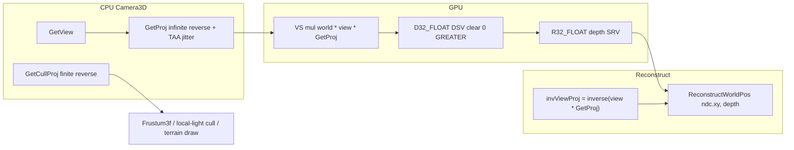
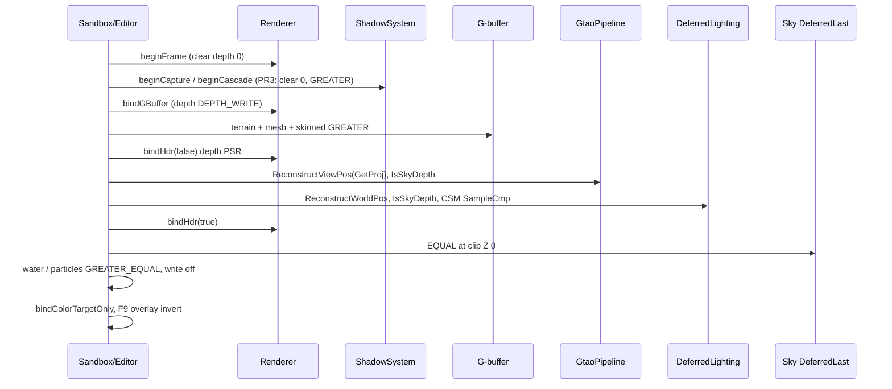

# Reverse-Z depth (D3D clip [0,1], near→1, far→0)

> **Accepted.** Body is the approved RFC (rev 2); present-tense “today” describes the pre-PR1 forward-Z tip. PR3 (CSM) and PR4 (host near/far) remain as planned in this RFC even if those code PRs land in parallel — this document is the contract.

| Field | Value |
|-------|--------|
| **Title** | Reverse-Z so HybridDeferred (and `-forward`) can draw much larger worlds with usable depth precision |
| **Author** | Travis Johnston |
| **Date** | 2026-09-19 |
| **Status** | Accepted (rev 2 — review pass: cull-VP at local-light gather, reconstruct clamp, PR1 test/call-site inventory) |
| **Priority** | P1 — world-scale prerequisite; not on [DESIGN-pbr-roadmap.md](./DESIGN-pbr-roadmap.md) seven-item track. Sibling of that track, like terrain look-track. |
| **Area** | `Math/Matrix4f.*`, `Render/Camera3D.*`, `Render/Camera2D.*`, `Render/Frustum3f.*`, `Render/Renderer.*`, every graphics PSO that writes or tests depth, `Render/ShadowSystem.*`, `Render/ShadowCascades.*`, `Render/ShadowPipeline.*`, `Render/SkinnedMeshPipeline.*`, `Render/DebugOverlay.*`, `content/shaders/{GBuffer,Shadow,Gtao,DeferredLighting,LocalLightVolume,Taa,MotionBlur,Tonemap,Sky}.hlsl(i)`, Sandbox / Editor 3D / Sandbox2D hosts, UnitTests |
| **Audience** | Engine, Sandbox, Editor owners who already know this tree |
| **Depends on** | Current HybridDeferred stack (**landed** — `D32_FLOAT` scene depth, G-buffer reconstruct via `invViewProj`, GTAO from `Camera3D::GetProj()`, CSM ortho). Does **not** depend on SSR, local-light shadows, auto-exposure, or terrain look-track. |
| **Supersedes** | Deferred **K21** sky `VS z=w` / `DepthFunc=EQUAL` at NDC z=1 (this RFC remaps far to 0; EQUAL stays). Deferred **K27** lighting `discard` when `depth >= 1 - eps` (becomes sky-at-0). |
| **Does not** | Compute PSOs / UAVs. Stencil. Hi-Z / GPU culling. Changing `DXGI_FORMAT_D32_FLOAT`. Dual runtime forward-Z / reverse-Z PSO sets. Bindless. Frame graph. Logarithmic Z. 64-bit depth. |

No C++ exceptions: `bool` + `DE_LOG_ERROR(LogCategory::Render, ...)` + `DE_ASSERT`. Fail init closed (`createDepthResources` / PSO create return `false`).

---

## Overview

DarkEngine6 stores scene and cascade depth in `DXGI_FORMAT_D32_FLOAT` and builds a **conventional (forward) D3D LH perspective**: clip Z = 0 at the near plane, 1 at the far plane, `D3D12_COMPARISON_FUNC_LESS`, clear **1.0**. IEEE-754 float concentrates precision near 0, so after the perspective divide almost all mantissa bits are spent in the first few metres. At Sandbox’s current 0.18–2000 m lens (`SandboxApp.cpp` `SetLens(..., 0.18f, 2000.0f)`) coplanar decals and distant silhouettes already z-fight; a 10 km world with a 5 cm near plane is not usable.

**Reverse-Z** remaps the same `D32_FLOAT` buffer so **near writes 1 and far writes 0**, tests with `GREATER` / `GREATER_EQUAL`, and clears **0.0**. Combined with an **infinite-far raster projection**, view-Z maps to `ndcZ = near / viewZ`, which is linear in 1/z and therefore matches the float density. This RFC freezes that mapping for the **scene camera** (and Camera2D, which shares the same DSV) and, in a follow-up PR, for **CSM ortho** so `SampleCmp` stays one comparison for today’s cascades and tomorrow’s perspective spot shadows ([DESIGN-local-light-shadows.md](./DESIGN-local-light-shadows.md)).

The change is a **single engine-wide cutover**. Dual-path depth compare in every PSO is rejected. Reconstruction that multiplies `(ndc.xy, depth, 1)` by `invViewProj` keeps working **if** `GetProj()` is the matrix that wrote depth (already GTAO **S11**). Every `depth >= 1 - eps` “this is sky” test must flip: cleared / infinite-far is **0**.

---

## Background & Motivation

### Why forward-Z fails at world scale

D3D clip Z after perspective divide is `ndcZ = (zf/(zf−zn)) − (zn·zf/(zf−zn))/viewZ` (`Matrix4f::PerspectiveFovLHMatrix`). With `zn=0.18`, `zf=2000`:

| view Z | ndcZ (forward) | spacing to next ULP at that ndc (approx) |
|--------|----------------|------------------------------------------|
| 0.18 m (near) | 0.0 | ~10⁻⁷ in ndc, millimetres in world |
| 10 m | ~0.99 | centimetres |
| 200 m | ~0.9991 | tens of centimetres |
| 2000 m (far) | 1.0 | metres |

Most of the 0–1 range is consumed by the first ~10 m. Reverse-Z + infinite far stores `ndcZ = zn/viewZ`, so 10 m and 10 km both keep relative precision on the order of `zn` times machine epsilon.

### What the tip actually does

Verified against `E:\DarkDev\DarkEngine6` at time of writing. No GPU occlusion, no portals, no CPU depth readback, **zero** `cs_5_0` PSOs, **stencil unused** (`StencilEnable = FALSE` on every engine PSO).

#### Projection / camera

| Piece | Location | Fact |
|-------|----------|------|
| Matrix convention | `Math/Matrix4f.h` | Row-major, row-vector `p * M`, translation `m41–m43`. LH. |
| Perspective | `Matrix4f::PerspectiveFovLHMatrix` | D3DX-style: `m33 = zf/(zf−zn)`, `m34 = 1`, `m43 = −zn·zf/(zf−zn)`, `m44 = 0`. Near→0, far→1. |
| Ortho | `OrthographicLHMatrix` / `OrthographicOffCenterLHMatrix` | `m33 = 1/(zf−zn)`, `m43 = zn/(zn−zf)`. Linear Z, near→0, far→1. |
| `Camera3D` | `Render/Camera3D.cpp` | Default `m_NearZ=0.1`, `m_FarZ=1000`. `RebuildProjPerspective` calls `PerspectiveFovLHMatrix`. `GetProj()` is the **jittered** matrix (TAA). `GetProjUnjittered()` is the pre-jitter copy. `GetViewProj() = view * m_Proj`. |
| TAA jitter | `Render/TaaJitter.h` `applyNdcJitter` | Adds `2*pixel / (w,h)` into `m31`/`m32`. XY only — reverse-Z does not change this. |
| Picking | `Camera3D::ScreenPointToRay` | Unprojects NDC z=**0** as near, z=**1** as far through `GetViewProj().Inverse()`. |
| Gizmo clip | `Editor/TranslateGizmo.h` `projectToScreen` | Rejects `ndcZ < 0 \|\| ndcZ > 1`. Still valid under reverse-Z (visible still in [0,1]). |
| `Camera2D` | `Render/Camera2D.cpp` | Ortho `OrthographicLHMatrix(m_NearZ, m_FarZ, width, height)`. Default near **0**, far 1000. Editor 2D `SetClipPlanes(0, 80)`. |
| Host lenses | Sandbox `SetLens(..., 0.18f, 2000.0f)`; Editor 3D `0.05f, 500.0f`; `CameraComponent` default `nearZ=0.01`, `farZ=1000` (`ECS/Components.h`). Sandbox’s spawned camera component is `0.5, 2000` and is **not** what `m_viewCamera` uses. |

#### Depth buffer

| Piece | Location | Fact |
|-------|----------|------|
| Scene DSV | `Renderer::createDepthResources` | Resource `R32_TYPELESS`, DSV `D32_FLOAT`, SRV `R32_FLOAT`. `D3D12_CLEAR_VALUE.Depth = 1.0f`. |
| Clear | `Renderer::beginFrame` | `ClearDepthStencilView(..., 1.0f, ...)`. |
| Viewport | `Renderer::updateViewport` | `MinDepth=0`, `MaxDepth=1`. **Keep.** |
| Lighting heap | `SceneBuffers::kLightingDepth = 2` | Copy of `Renderer::depthSrvCpu()`. |
| Cascades | `ShadowSystem::createResources` | `R32_TYPELESS` 2D array, DSV `D32_FLOAT`, SRV `R32_FLOAT`, clear **1.0**, `beginCascade` clears 1.0. |
| Stencil | all PSOs | `StencilEnable = FALSE`. ImGui `DSVFormat = D32_FLOAT` (`Ui/ImGuiHost.cpp`) is format-only; HUD draws with DSV unbound. |
| Optimized clear | DXGI clear-value | Must match the `ClearDepthStencilView` value or the debug layer errors. |

#### Depth-stencil / compare (scene)

| PSO | File | DepthEnable | Write | Func today | After |
|-----|------|-------------|-------|------------|-------|
| `MeshPipeline` opaque / G-buffer | `MeshPipeline.cpp` ~148 | TRUE | ALL / ZERO if transparent | `LESS` (both) | opaque `GREATER`; transparent `GREATER_EQUAL` (**not** analog — see Z5) |
| `SkinnedMeshPipeline` color | `SkinnedMeshPipeline.cpp` ~142 | TRUE | ALL / ZERO if transparent | `LESS` (both) | same as mesh |
| `TerrainPipeline` | `TerrainPipeline.cpp` ~142 | TRUE | ALL | `LESS` | `GREATER` |
| `WaterPipeline` | `WaterPipeline.cpp` ~172 | TRUE | ZERO | `LESS` | `GREATER_EQUAL` (**not** analog — see Z5) |
| `ParticlePipeline` | `ParticlePipeline.cpp` ~119 | TRUE | ZERO | `LESS_EQUAL` | `GREATER_EQUAL` |
| `LinePipeline` (depth on) | `LinePipeline.cpp` ~77 | TRUE | ZERO | `LESS_EQUAL` | `GREATER_EQUAL` |
| `SpritePipeline` (`enableDepth`) | `SpritePipeline.cpp` ~116 | TRUE | ALL | `LESS` | `GREATER` |
| `SkyPipeline` `DeferredLast` | `SkyPipeline.cpp` ~127 | TRUE | ZERO | `EQUAL` | **EQUAL stays**; VS clip Z 1→**0** |
| `SkyPipeline` `ForwardFirst` | same | FALSE | — | `ALWAYS` | unchanged |
| `ShadowPipeline` | `ShadowPipeline.cpp` ~85 | TRUE | ALL | `LESS` | `GREATER` (PR3) |
| `SkinnedMeshPipeline` shadow | `SkinnedMeshPipeline.cpp` ~142 + bias 4000/2.5 | TRUE | ALL | `LESS` | `GREATER` (PR3) |
| Lighting / GTAO / Bloom / TAA / MB / Tonemap / IBL bake / overlay / LoadingScreen / local-light volumes | respective `*Pipeline.cpp` | FALSE | — | n/a | n/a |

HealthHud / CrosshairHud create `SpritePipeline(..., false)` (`DSVFormat = UNKNOWN`). Editor 2D and Sandbox2D call `SpritePipeline::create(device)` with **default `enableDepth=true`** — they share the scene DSV.

#### Shadow testing

| Piece | Location | Fact |
|-------|----------|------|
| Static sampler | `MeshPipeline`, `SkinnedMeshPipeline`, `TerrainPipeline`, `WaterPipeline`, `SkyPipeline`, `DeferredLightingPipeline` | `D3D12_FILTER_COMPARISON_MIN_MAG_LINEAR_MIP_POINT`, `ComparisonFunc = LESS_EQUAL`, border **opaque white** (out of cascade = lit). |
| HLSL | `content/shaders/Shadow.hlsli` | `SampleCmpLevelZero(gShadowSamp, uv, uvz.z)`. Receiver bias `uvz.z -= shadowParams.x * cascadeInvZ[cascade]` (world metres → NDC). Cascade select is **view-Z** along `shadowLook`, not clip Z. |
| Raster bias | `ShadowPipeline.cpp` ~79–80, skinned shadow ~149–150 | `DepthBias = 4000`, `SlopeScaledDepthBias = 2.5`. Positive = increase stored Z = farther under forward-Z. |
| Receiver bias | `ShadowSettings::depthBias = 0.05f` metres | Packed as `params[0]`, always `Max(depthBias, 0)`. |
| Cascade build | `ShadowCascades::buildCascadeMatrix` | `OrthographicOffCenterLHMatrix(..., minZ, maxZ)` around a texel-snapped sphere. Light-space Z is **linear metres**. `extractFrustumCorners` uses camera basis × slice near/far — **not** clip Z. |
| Splits | `ShadowSystem::update` | `nearZ = Max(camera.GetNearZ(), 0.5f)`, `farZ = Min(camera.GetFarZ(), maxDistance=280)`. Independent of clip mapping. |
| Tests | `UnitTests/Render/ShadowCascadeTests.cpp` | `BuildCascadePlacesSliceCenterInClip` asserts `clip.z ∈ [0,1]`. `LargeTerrainBoundsPreserveMeterScaleDepth` asserts caster toward light has **smaller** clip Z than ground (`EXPECT_LT(cZ, gZ)`). |

#### Frustum / culling

| Piece | Location | Fact |
|-------|----------|------|
| Extraction | `Frustum3f::Update` | Gribb/Hartmann for row-vector D3D. **Near = column 2** (`z = 0`). **Far = w − z** (`z = 1`). Inward normals. |
| Call sites | `SandboxApp.cpp` ~2453 / ~2518, `EditorRender3D.cpp` ~76 / ~189, `LocalLightVolumePipeline.cpp` ~256, `TerrainWorld::draw` / `drawDepth`, `WaterWorld::draw` | `Frustum3f(viewProj)` or `Frustum3f(cascade.viewProj)`. |
| Collision | `Collision/StaticCollision.cpp`, `SweptCollision.cpp` | Delegate to `Frustum3f::Contains` / `Intersects`. No extra clip-Z math. |
| GPU culling | — | **None.** No occlusion queries, no Hi-Z, no portals. |

#### Shaders that reconstruct or branch on depth

| Shader | What it does | Forward-Z assumption |
|--------|----------------|----------------------|
| `GBuffer.hlsli` `ReconstructWorldPos` | `mul(float4(ndcX, ndcY, depth, 1), invViewProj)` | None — follows whatever wrote depth. |
| `DeferredLighting.hlsl` | Reconstruct + `if (depth >= 1.0f - 1e-6f) discard` | Sky / clear = 1. Deferred **K27**. |
| `LocalLightVolume.hlsl` | Same reconstruct + same discard | Sky = 1. Volume PSO itself has **depth off**; coverage is analytic from the SRV. |
| `Gtao.hlsl` | `ReconstructViewPos` via `invProj = inverse(GetProj())` (S11). `if (depth >= 1.0f - 1e-5f) return 1`. `vPos.z <= nearZ \|\| vPos.z >= farZ * 0.999` | Sky = 1. View-Z tests stay valid if reconstruction is correct. |
| `Taa.hlsl` / `MotionBlur.hlsl` | `if (depth >= 1.0f - 1e-5f) vel = ReconstructCameraVelocity(..., depth)` | Sky has no velocity RT; reconstruct from clip. |
| `Tonemap.hlsl` `linearViewZ` | ` (nearZ * farZ) / (farZ - z * (farZ - nearZ)) ` | Closed-form **forward** linearize. DoF CoC. |
| `Sky.hlsl` | `VSMain` clipZ **0**; `VSMainDeferred` clipZ **1** | DeferredLast EQUAL-tests the **far** plane. |
| `Fog.hlsli` | Marches world positions from reconstructed `worldPos` | No raw ndcZ. |
| `Water.hlsl` / `Particle.hlsl` / mesh G-buffer | Transform to clip via WVP; no scene-depth sample | Raster only. |
| `DebugOverlay.hlsli` `visDepth` | `invert ? (1-d) : d` then `pow(v, contrast)` | F9 scene depth: `invert=false`, contrast 24 (`SandboxApp::drawDebugOverlays`). Shadow tiles: `invert=true`, contrast 1.25. |

`content/shaders/` has **no** `SV_DEPTH` writes.

---

## Goals & Non-Goals

### Goals

- Usable depth precision from ~5 cm to tens of kilometres on the existing `D32_FLOAT` scene buffer.
- One clip-Z convention for HybridDeferred **and** `-forward` (same DSV, same PSOs).
- Correct CPU frustum, picking, GTAO, deferred lighting, TAA/MB sky velocity, DoF, sky EQUAL, CSM (including viz).
- Hosts may then drop near and raise far without a second renderer change.

### Non-goals

- Runtime or `#ifdef` dual path (`DE_REVERSE_Z` included). Never lands; PR1 is tests-only.
- Stencil outlines / deferred light volumes that stencil-mark pixels.
- Replacing CSM with perspective shadow maps, or freezing the spot-atlas format. [DESIGN-local-light-shadows.md](./DESIGN-local-light-shadows.md) still owns spots (today **D16_UNORM**). This RFC unifies **CSM** on reverse-Z + `GREATER_EQUAL`; PR5 asks that RFC to **revisit D16 vs D32**, it does not silently re-freeze the atlas.
- GPU culling, Hi-Z, depth prepass.
- Changing color management, IBL, or G-buffer packing.
- Compute.

---

## Key Decisions

| ID | Decision | Why |
|----|----------|-----|
| **Z0** | **Reverse-Z is always on.** No `DebugRenderState` flag, no second PSO set, **no `DE_REVERSE_Z` ifdef.** Stacked PRs may exist; main is never mixed. | Dual `LESS`/`GREATER` in every `create` is how engines ship a year of “sky is a hole” bugs. An ifdef on a stack that never merges PR1 to `main` alone is extra surface for missed compare/sky tests (R1/R2). PR1 is unit-test-only; PR2 is the binary cutover. |
| **Z1** | **Keep `DXGI_FORMAT_D32_FLOAT`.** Resource stays `R32_TYPELESS` + `R32_FLOAT` SRV. Do not introduce stencil (`D32_FLOAT_S8X24` / `D24_UNORM_S8`). | Stencil is off everywhere. D24 would **throw away** the float-precision reason to reverse-Z. |
| **Z2** | **Infinite reverse-Z for `Camera3D` raster projection** (`GetProj` / `GetProjUnjittered`). **Finite `m_FarZ` remains** for culling, cascade splits, GTAO far skip, fog, picking. | Infinite far is the actual precision win and matches DeferredLast sky (draw at 0 = cleared). A 1e6 finite far is 95% as good but still clips raster at far. Two matrices, one camera. |
| **Z3** | **`GetViewProj()` = view × jittered infinite reverse proj** (what wrote depth). **`GetCullViewProj()` = view × unjittered finite reverse proj using `m_FarZ`.** Every **scene** `Frustum3f` is built from the cull VP, including `LocalLightVolumePipeline::draw` (~256). Raster `GetViewProj()` stays on volume WVP, scissor, and `invViewProj`. | Today `Frustum3f(viewProj)` uses the jittered raster matrix. Subpixel jitter is harmless; an infinite far plane is **degenerate** (Gribb far row ≈ 0). Cull must stay finite. Local-light gather is a frustum consumer, not a special case. |
| **Z4** | **Scene depth clear = 0.0f.** `D3D12_CLEAR_VALUE` and `ClearDepthStencilView` must match. Viewport 0–1 unchanged. | Reverse-Z far / empty = 0. Mismatched optimized-clear is a debug-layer fire. |
| **Z5** | **Opaque write: `GREATER`. Water, particles, lines, and mesh/skinned transparents: `GREATER_EQUAL` even though mesh/water are `LESS` today (particles/lines are `LESS_EQUAL`). Sky DeferredLast: `EQUAL` + VS clip Z = 0.** Helper names: `sceneDepthFunc()` → `GREATER`, `sceneDepthFuncGreaterEqual()` → `GREATER_EQUAL` (not `sceneDepthFuncEqual()`). | Not a 1:1 analog — coplanar water/decals that fail `LESS` today will pass `GREATER_EQUAL`. That is the intended reverse-Z transparent policy (same class as today’s particle `LESS_EQUAL`). Do not name the helper `Equal` or call sites will grab sky `EQUAL`. |
| **Z6** | **Camera2D ortho is reverse-Z too**, including **`zn = 0`** (default and Editor/Sandbox2D `SetClipPlanes(0, 80)`). Sprite default `enableDepth=true` shares `Renderer` DSV. HUD / MainMenu stay **forward** `OrthographicOffCenterLHMatrix(0, w, 0, h, 0, 1)` + `enableDepth=false` — do not reverse them. | Leaving 2D forward-Z with a 0-clear and `GREATER` makes z=0 sprites fail the depth test. `zn=0` reverse ortho is `ndcZ = (zf−z)/zf` (near→1, far→0); the factory guards only `zn==zf`. PR1-alone blacks Editor 2D / Sandbox2D, not just Sandbox 3D. |
| **Z7** | **CSM ortho also reverse-Z** (PR3, not the scene cutover). `SampleCmp` → `GREATER_EQUAL`. Raster bias signs flip. Receiver `uvz.z +=` instead of `-=`. This does **not** freeze local-light spot shadows. | Ortho Z is already linear so the precision win is modest. One comparison for mesh/terrain/water/sky/lighting is the product reason for **CSM**. [DESIGN-local-light-shadows.md](./DESIGN-local-light-shadows.md) still freezes a **D16_UNORM** atlas — reverse-Z on UNORM is uniform in clip Z and throws away the float-density argument. PR5 tells that RFC to **revisit format** (prefer D32 reverse-Z + `GREATER_EQUAL`); until it does, spots are not “done” by this stack. Scene cutover must not wait on CSM: forward-Z cascades stay valid with `LESS_EQUAL` until PR3. |
| **Z8** | **`ReconstructWorldPos` / GTAO `ReconstructViewPos` stay clip×inverse of the writer matrix** (GTAO **S11** still holds). **Never pass raw depth=0 into `invP` / `invViewProj`.** `ClampDepthForReconstruct(d) = max(d, 1e-7)` in `Depth.hlsli`. | Inverse of the matrix that wrote depth is the reconstruction. Infinite reverse `mul(float4(ndc, 0, 1), invP)` yields **w = 0**. Lighting/GTAO *center* skip via `IsSkyDepth` and do not reconstruct. GTAO **neighbor** taps skip `IsSkyDepth` samples (do not treat infinity as an occluder) and clamp if they do unproject. TAA/MB sky velocity **must** reconstruct: clamp, then divide. |
| **Z9** | **Sky fill is EQUAL-to-clear (exactly 0).** `IsSkyDepth(d) = (d <= 0.0f)` for lighting/GTAO-center skip. Not `d >= 1-eps`, not `d < 1e-5`, not `d <= 1e-8`. | `1e-8` as a lighting discard opens a hole vs sky EQUAL: depths in `(0, 1e-8]` are dropped by lighting and not filled by sky (`viewZ >= near/1e-8` = 5000 km at near=0.05). Cleared / DeferredLast sky write **exactly 0**. `1e-5` leftover would classify 10 km geometry as sky. Reconstruct clamp (`1e-7`) is a separate guard for unproject, not a sky test. PR4 Sandbox/Editor near stays **≥ 0.05** (`CameraComponent` 0.01 is unused by `m_viewCamera`). |
| **Z10** | **Closed-form `linearViewZ` is replaced** by `nearZ / ClampDepthForReconstruct(depth)` (infinite reverse) in `Tonemap.hlsl`. Prefer reconstruct-via-inverse everywhere else. | The current `n*f/(f − d*(f−n))` is forward-only. |
| **Z11** | **Picking: `ScreenPointToRay` is rebuilt from camera basis + `m_NearZ`**, not unproject of clip z=0/1. | Infinite reverse `z=0` unproject is a point at infinity / `w≈0`. Basis ray matches `extractFrustumCorners` and is convention-independent. |
| **Z12** | **No compute. No new UAV. Graphics-queue PSOs only.** | Standing engine rule (IBL / GTAO). Reverse-Z is raster state + math. |
| **Z13** | **Shared constants**, not 20 copy-pasted `1.0f` / `LESS`. `Render/DepthState.h` (new, tiny): `kDepthClear`, `sceneDepthFunc()`, `sceneDepthFuncGreaterEqual()`, `skyDepthFunc()`, `shadowDepthFunc()`, `shadowCmpFunc()`. HLSL: `Depth.hlsli` with `IsSkyDepth`, `ClampDepthForReconstruct`, `LinearizeViewZ`. | The inventory is the bug list. A missed `LESS` is a black screen. Do not name a helper `Equal` unless it is sky `EQUAL`. |
| **Z14** | **Host near/far soak is a follow-up PR**, not the cutover. Keep Sandbox 0.18/2000 and Editor 0.05/500 until F9 / GTAO / shadows look right. Then Sandbox default **near 0.05, far 1e5**; Editor far **1e4**. `CameraComponent` already allows 0.01. | Mixing a 50× far jump with the compare flip makes soak unreadable. |
| **Z15** | **F9 depth overlay inverts by default** (`draw2D(..., invert=true)`). Shadow tiles already invert. Raw reverse-Z is **white-near / black-far**; without invert the tile looks like a hole. | `visDepth` already has `invert`. Do not change the shader contract; change the call site. |

---

## Proposed Design

### Clip-space mapping

D3D clip after divide stays **[0, 1]**. Reverse-Z does not change XY, W, or LH.

**Infinite reverse-Z (raster), row-vector, LH:**

```
m11 = xScale, m22 = yScale
m33 = 0,  m34 = 1
m43 = zn, m44 = 0
```

`clip = (xScale·x, yScale·y, zn, viewZ)` → `ndcZ = zn / viewZ`. Near → 1, ∞ → 0.

**Finite reverse-Z (cull / Camera2D / CSM ortho):**

Perspective (near→1, far→0):

```
m33 = zn / (zn − zf)          // = −zn/(zf−zn)
m34 = 1
m43 = zn * zf / (zf − zn)
m44 = 0
```

Ortho:

```
m33 = 1 / (zn − zf)           // negative of today’s 1/(zf−zn)
m43 = zf / (zf − zn)          // today’s zn/(zn−zf) swapped
```

`zn = 0` is **legal** (Camera2D default and Editor/Sandbox2D `SetClipPlanes(0, 80)`). Then `ndcZ = (zf − z) / zf` (near→1, far→0). Guard only `zn == zf` (same as today’s forward factory). Do not add a `zn < 0` reject.

New `Matrix4f` factories (names match the existing `*LHMatrix` style):

```cpp
static Matrix4f PerspectiveFovLHReverseInfMatrix(float fovy, float aspect, float zn);
static Matrix4f PerspectiveFovLHReverseMatrix(float fovy, float aspect, float zn, float zf);
static Matrix4f OrthographicLHReverseMatrix(float zn, float zf, float width, float height);
static Matrix4f OrthographicOffCenterLHReverseMatrix(float l, float r, float b, float t, float zn, float zf);
```

Keep the forward factories. Unit tests pin both. Do not silently change `PerspectiveFovLHMatrix` — TaaJitterTests and any external caller would shift without a name change.

`Camera3D::RebuildProjPerspective`:

```cpp
m_ProjUnjittered = Matrix4f::PerspectiveFovLHReverseInfMatrix(m_FovY, m_Aspect, m_NearZ);
m_Proj           = m_ProjUnjittered;
m_CullProj       = Matrix4f::PerspectiveFovLHReverseMatrix(m_FovY, m_Aspect, m_NearZ, m_FarZ);
```

`SetSubpixelJitter` still jitters **only** `m_Proj`. `GetCullViewProj()` = `GetView() * m_CullProj` (never jittered).

`Camera3D::RebuildProjOrthographic` (public `SetOrthographic`, unused by hosts, still must not leave `m_CullProj` stale). Infinite reverse does not apply to ortho — cull and raster unjittered are the **same** finite reverse ortho:

```cpp
m_ProjUnjittered = Matrix4f::OrthographicLHReverseMatrix(m_NearZ, m_FarZ, m_OrthoWidth, m_OrthoHeight);
m_CullProj       = m_ProjUnjittered;
m_Proj           = m_ProjUnjittered;
```

Jitter still only `m_Proj`.



### Frustum extraction

Today (`Frustum3f.cpp`):

```cpp
Planes[Near] = Plane4f(vp(0, 2), vp(1, 2), vp(2, 2), vp(3, 2));           // z >= 0
Planes[Far]  = Plane4f(vp(0, 3) - vp(0, 2), ...);                          // w - z >= 0
```

Reverse-Z finite (near is `z = w`, far is `z = 0`):

```cpp
Planes[Near] = Plane4f(vp(0, 3) - vp(0, 2), vp(1, 3) - vp(1, 2), vp(2, 3) - vp(2, 2), vp(3, 3) - vp(3, 2));
Planes[Far]  = Plane4f(vp(0, 2), vp(1, 2), vp(2, 2), vp(3, 2));
```

XY planes are unchanged. `Contains` / `Intersects` do not change.

**Call-site rule:** every **scene** frustum from `GetCullViewProj()`, including:

| Consumer | Today | After |
|----------|-------|-------|
| `SandboxApp.cpp` ~2518 terrain/water/mesh cull | `Frustum3f(viewProj)` with raster `GetViewProj()` | `Frustum3f(camera.GetCullViewProj())` |
| `EditorRender3D.cpp` ~189 | same | same |
| `LocalLightVolumePipeline::draw` ~256 | `Frustum3f(viewProj)` from the **raster** argument hosts pass | `Frustum3f(camera.GetCullViewProj())` for `gatherLocalLights`. Keep the raster `viewProj` argument for volume WVP, scissor, and `invViewProj` (XY-only). `SceneRenderer::drawLocalLights` stays a passthrough of raster VP. |
| Cascade caster `SandboxApp.cpp` ~2453 / `EditorRender3D.cpp` ~76 | `Frustum3f(cascade.viewProj)` | unchanged (light VP, not camera) |

`Frustum3f::Update` **always** uses the reverse-Z Near/Far formulas once Z0 lands. Until PR3, cascade `viewProj` is still **forward** ortho (`OrthographicOffCenterLHMatrix`, clear 1, `LESS`). Reverse extraction on that matrix only **swaps the Near/Far labels**; `Contains` / `Intersects` test all six planes and nothing indexes `Planes[Near]` vs `Planes[Far]` except `GetPlane`. Volume is identical. Collision wrappers in `StaticCollision.cpp` / `SweptCollision.cpp` also iterate all planes. **Do not add plane-index tests until PR3.** After PR3, cascade VP is reverse ortho and the labels match again.

`extractFrustumCorners` already uses `look * z + right * (x * z * tanX)` with **view metres**, not clip Z. **No change.** `computePracticalSplits` is view-Z. **No change.** `ShadowSystem::update` still clamps `Max(GetNearZ(), 0.5f)` — that 0.5 m floor is a cascade-quality choice, not a clip convention; leave it.

### Depth resources and clear

`Renderer::createDepthResources`:

```cpp
clear.Format             = DXGI_FORMAT_D32_FLOAT;
clear.DepthStencil.Depth = Dark::kDepthClear; // 0.0f
```

`beginFrame` and `ShadowSystem::beginCascade` (PR3) pass the same constant. Add `Renderer::depthClearValue() const` so tests and overlays do not hardcode.

No resize-path special case: `resize` already recreates the committed resource with the clear value.

### PSO depth func

New header `Render/DepthState.h` (include from every pipeline `create`):

```cpp
inline constexpr float kDepthClear = 0.0f;

inline D3D12_COMPARISON_FUNC sceneDepthFunc()             { return D3D12_COMPARISON_FUNC_GREATER; }
inline D3D12_COMPARISON_FUNC sceneDepthFuncGreaterEqual() { return D3D12_COMPARISON_FUNC_GREATER_EQUAL; }
inline D3D12_COMPARISON_FUNC skyDepthFunc()               { return D3D12_COMPARISON_FUNC_EQUAL; }
inline D3D12_COMPARISON_FUNC shadowDepthFunc()            { return D3D12_COMPARISON_FUNC_GREATER; }
inline D3D12_COMPARISON_FUNC shadowCmpFunc()              { return D3D12_COMPARISON_FUNC_GREATER_EQUAL; }
```

Replace every `D3D12_COMPARISON_FUNC_LESS` / `LESS_EQUAL` listed in the inventory. Opaque / sprite-with-depth / terrain: `sceneDepthFunc()`. Water, particles, lines, mesh/skinned transparent: `sceneDepthFuncGreaterEqual()`. Sky DeferredLast: `skyDepthFunc()` (already `EQUAL`). `PsoUtil::createFillVariantPsos` copies the solid desc — wire/point inherit the flipped func for free.

Rasterizer `DepthBias` on **scene** particles: `BloodSplatPool::create(..., -4, -3.0f)` pulls stored Z toward the camera under forward-Z. Under reverse-Z that sign **attracts acne**. Flip to `+4, +3.0f`. Additive/alpha particle pipelines use 0/0 — unchanged.

### Sky

`Sky.hlsl`:

```hlsl
PSInput VSMain(uint id : SV_VertexID)         { return VSCommon(id, 0.0f); } // ForwardFirst, depth off
PSInput VSMainDeferred(uint id : SV_VertexID) { return VSCommon(id, 0.0f); } // was 1.0f — EQUAL at far/clear
```

`VSMainDeferred` and `VSMain` become the same clip Z. Keep two VS entries so `SkyPipeline::create` does not change its `vsEntry` string (Deferred **K21** pass enum stays). `DepthFunc = EQUAL`, write off, still correct: G-buffer opaques have `ndcZ > 0`; only **exactly cleared** texels compare equal to 0. That is the sky **coverage** predicate. Lighting/GTAO `IsSkyDepth` is the same set (`d <= 0`), not a 1e-8 band that would leave a hole vs EQUAL.

`-forward` `ForwardFirst` still draws **first**, depth disabled. No EQUAL.

### Shaders — reconstruction and sky tests

`content/shaders/Depth.hlsli` (new):

```hlsl
#ifndef DE_DEPTH_HLSLI
#define DE_DEPTH_HLSLI
static const float kReconstructMinDepth = 1.0e-7f;

// Sky / clear: DeferredLast EQUAL-tests exactly 0. Do not use 1e-8 — that
// discards (0, 1e-8] which sky does not fill.
bool IsSkyDepth(float d) { return d <= 0.0f; }

float ClampDepthForReconstruct(float d) { return max(d, kReconstructMinDepth); }

// Infinite reverse-Z: viewZ = near / ndcZ. nearZ is Camera3D::GetNearZ().
float LinearizeViewZ(float depth, float nearZ)
{
    return nearZ / ClampDepthForReconstruct(depth);
}
#endif
```

`GBuffer.hlsli` `ReconstructWorldPos` (and GTAO `ReconstructViewPos`) **clamp first**:

```hlsl
float3 ReconstructWorldPos(float ndcX, float ndcY, float depth, float4x4 invViewProj)
{
    float4 clip = float4(ndcX, ndcY, ClampDepthForReconstruct(depth), 1.0f);
    float4 w    = mul(clip, invViewProj);
    return w.xyz / max(w.w, 1e-6f);
}
```

Replacements:

| Site | Today | After |
|------|-------|-------|
| `DeferredLighting.hlsl` ~97 | `if (depth >= 1.0f - 1e-6f) discard;` | `if (IsSkyDepth(depth)) discard;` then reconstruct (clamp is belt-and-suspenders) |
| `LocalLightVolume.hlsl` ~146 | same | same helper |
| `Gtao.hlsl` ~89, ~162 **center** | `depth >= 1.0f - 1e-5f` | `IsSkyDepth(depth)` → AO = 1, do not reconstruct center |
| `Gtao.hlsl` ~126–127, ~186 **neighbors** | reconstruct raw | `if (IsSkyDepth(d)) skip tap` (do not update horizon). If unprojecting, clamp. |
| `Taa.hlsl` ~54 / `MotionBlur.hlsl` ~54 | `depth >= 1.0f - 1e-5f` → `ReconstructCameraVelocity(..., depth)` | `IsSkyDepth(depth)` still selects the sky-velocity path; **inside** `ReconstructCameraVelocity` pass `ClampDepthForReconstruct(depth)` into `invViewProj`, never raw 0 |
| `Tonemap.hlsl` `linearViewZ` | forward closed form | `LinearizeViewZ(depth, nearZ)` — `farZ` cbuffer field becomes unused padding (keep the 12-float CB layout) |

Hosts already upload `invViewProj = GetViewProj().Inverse()` (`SandboxApp.cpp` ~2618, `EditorRender3D.cpp` ~403, `SceneRenderer.cpp` TAA/MB). After Z2 that inverse is reverse-Z + jitter, which is what wrote the DSV.

GTAO `fillParams` still copies `camera.GetProj().Inverse()` (`GtaoPipeline.cpp` ~484). View-space `vPos.z` remains positive LH. The `vPos.z >= farZ * 0.999` skip still uses `GetFarZ()` (cull far), which is what we want: do not AO the horizon at 2000 m just because raster can see infinity.

### Sequence (HybridDeferred, unchanged bind order)



### Shadows (PR3)

**Decision Z7:** reverse the cascade ortho, do not leave SampleCmp on `LESS_EQUAL` forever.

`buildCascadeMatrix` last lines:

```cpp
const Matrix4f proj = Matrix4f::OrthographicOffCenterLHReverseMatrix(
    cx - radius, cx + radius, cy - radius, cy + radius, minZ, maxZ);
```

`zRange = maxZ - minZ` stays **world metres** (used as `cascadeInvZ = 1/zRange`). Clip Z now decreases as light-space Z increases.

`Shadow.hlsli`:

```hlsl
uvz.z += shadowParams.x * cascadeInvZ[cascade]; // was -=
```

`SampleCmp` with `GREATER_EQUAL`: lit if `receiverZ >= storedZ`. Adding bias **increases** the test value → more lit → same acne reduction as today’s subtract-under-`LESS_EQUAL`.

`ShadowCoord` still rejects `uvz.z < 0 \|\| uvz.z > 1` (`Shadow.hlsli` ~46) — clip range is unchanged. Today `uvz.z -= bias` can drop below 0 (beyond far → fully lit). After PR3 `uvz.z += bias` can exceed **1** (closer than cascade near → also fully lit). Same class of light leak, opposite plane. **Keep the reject** (do not saturate in v1; that would change “out of Z range = lit” to “compare anyway”). Soak: receiver on cascade-0 near plane / grazing sun must not flash fully lit.

Rasterizer on `ShadowPipeline` / skinned shadow:

```cpp
DepthBias            = -4000;  // was +4000
SlopeScaledDepthBias = -2.5f;  // was +2.5
DepthFunc            = shadowDepthFunc(); // GREATER
```

Static sampler `ComparisonFunc = shadowCmpFunc()` (`GREATER_EQUAL`) in:

- `DeferredLightingPipeline.cpp` ~100
- `MeshPipeline.cpp` ~75 (forward)
- `SkinnedMeshPipeline.cpp` ~78
- `TerrainPipeline.cpp` ~71 (look-track wants t13; this RFC does not move the slot)
- `WaterPipeline.cpp` ~101
- `SkyPipeline.cpp` ~71

**Do not** flip `packShadowConstants`’s `Max(depthBias, 0)` — world metres stay positive; the HLSL sign carries the convention.

`ShadowCascadeTests.BuildCascadePlacesSliceCenterInClip`: `clip.z ∈ [0,1]` still holds. `LargeTerrainBoundsPreserveMeterScaleDepth`: caster toward the light is **closer to the light** → under reverse ortho **larger** clip Z → `EXPECT_GT(cZ, gZ)` and `EXPECT_GT(cZ - gZ, ndcBias * 4)`.

Visualization: `SandboxApp::drawDebugOverlays` already draws cascades with `invert=true`. After reverse-Z the stored near-to-light is **white** without invert, **black-near-to-light** with invert — same look as today (today invert turns forward-Z near-black into near-white). **Leave invert=true.** Tune contrast (1.25) if the linear reverse distribution looks too flat; that is soak, not a contract change.

F9 scene depth: switch to `invert=true` (Z15). Contrast 24 was compensating for forward-Z crowding at 1. Reverse-Z is already hyperbolic; start contrast at **1.0** and retune. Call:

```cpp
m_debugOverlay.draw2D(cmd, device, renderer().depthSrvCpu(), x, y, tile, tile, 1.0f, true);
```

### Other downstream

| System | Change |
|--------|--------|
| **Particles** | `GREATER_EQUAL`, write off. Blood splat bias sign flip. No depth sample. |
| **Water** | `GREATER_EQUAL`, write off. Shadow sampler in PR3. |
| **Lines / gizmos** | `LinePipeline` depth-on variant `GREATER_EQUAL`. TranslateGizmo `[0,1]` clip test stays. |
| **Editor picking** | `ScreenPointToRay` basis rebuild. `EditorSceneFile.cpp` / `EditorAppInit.cpp` call sites unchanged. |
| **Editor shadow box** | `EditorRender3D.cpp` ~60 hardcoded `AABox3f(±22, …)` then expands to entities/terrain. **Out of scope** (existing look-track note). Reverse-Z does not fix coarse cascades. |
| **ImGui** | `DSVFormat` stays `D32_FLOAT`. Draws after `bindColorTargetOnly`. |
| **LoadingScreen** | Depth off. No change. |
| **Local lights** | Volume PSO depth off. Shader sky test + clamped reconstruct. Gather frustum from `camera.GetCullViewProj()` inside `LocalLightVolumePipeline::draw`; raster `viewProj` argument stays WVP / scissor / `invViewProj`. |
| **HUD / MainMenu** | `HealthHud.cpp` ~70, `CrosshairHud.cpp` ~68, `Ui/MainMenu.cpp` ~461 keep `OrthographicOffCenterLHMatrix(0, w, 0, h, 0, 1)` and `SpritePipeline(..., false)`. **Do not reverse.** Depth disabled; grepping `Orthographic*LHMatrix` is not a license to flip these. |
| **SSR (future)** | [DESIGN-reflections.md](./DESIGN-reflections.md) traces depth. When it lands it must use `IsSkyDepth` and reverse-Z marching (`step along 1/z` is actually nicer). Call it out in that RFC’s PR5 one-liner; do not implement SSR here. |
| **Copy/resolve / readback** | None exist. |
| **LOD** | None keyed off clip Z. Terrain geomipmap uses camera distance. |

### Host knobs (PR4)

| Host | Today | After soak |
|------|-------|------------|
| Sandbox `m_viewCamera.SetLens` | 0.18 / 2000 | 0.05 / 1.0e5 |
| Editor `m_camera.SetLens` | 0.05 / 500 | 0.05 / 1.0e4 |
| `CameraComponent` default | 0.01 / 1000 | keep 0.01 / 1.0e5 (component is data; hosts must actually **read** it — today Sandbox does not drive `m_viewCamera` from the component) |
| Dev Tools | no near/far sliders | optional “Camera” header: Near `[0.01, 1]`, Far `[100, 1e6]`, log-scale far. Not required for cutover. |
| `ShadowSettings::maxDistance` | 280 m | keep 280 until a shadows-distance RFC. Reverse-Z does not magically give cascade resolution at 10 km. |
| `TonemapSettings::{nearZ,farZ}` | 0.18 / 2000 | copy `camera.GetNearZ()` / `GetFarZ()` every frame (already the intent; `SandboxApp` ~2746). `farZ` unused by `LinearizeViewZ` after Z10. |

---

## API / Interface Changes

### `Math/Matrix4f.h`

Add the four reverse factories documented above. Do not change the signature of `PerspectiveFovLHMatrix`.

### `Render/Camera3D.h`

```cpp
const Math::Matrix4f& GetCullProj() const { return m_CullProj; }
Math::Matrix4f GetCullViewProj() const;
```

`GetProj` / `GetProjUnjittered` / `GetViewProj` remain the **raster** (infinite reverse, jittered/unjittered) matrices on a **perspective** camera. On an **ortho** camera they are the finite reverse ortho (cull == unjittered raster). GTAO keeps `GetProj()`. Lighting keeps `GetViewProj().Inverse()`.

`ScreenPointToRay`: origin = `m_Position`; direction = normalize(`look + right * ndcX * tan(fovX/2) + up * ndcY * tan(fovY/2)`). Equivalent to `extractFrustumCorners`’s basis. Independent of clip Z.

### `Render/Frustum3f.h`

Comment update: “D3D reverse-Z (near = w−z, far = z)”. No new methods. `Update` formulas change in `.cpp`.

### `Render/DepthState.h` (new)

As in Z13. Allowed to live next to `PsoUtil.h`. Pipelines include it; no virtuals, no exceptions.

### `content/shaders/Depth.hlsli` (new)

Included by `GBuffer.hlsli` (so lighting / local lights / GTAO share `ReconstructWorldPos`), plus TAA, MB, tonemap. Do **not** grow any cbuffer.

### Hosts

```cpp
const Frustum3f frustum(camera.GetCullViewProj());
```

in `SandboxApp.cpp` (~2518) and `EditorRender3D.cpp` (~189). Cascade frustums stay `Frustum3f(m_shadows.cascade(i).viewProj)`.

`LocalLightVolumePipeline::draw` builds its own cull frustum from `camera`; hosts keep passing raster `GetViewProj()` (`SandboxApp.cpp` ~2644, `EditorRender3D.cpp` ~425, `SceneRenderer::drawLocalLights`). Do **not** pass `GetCullViewProj()` as the volume WVP — scissor projection is XY in clip of the **jittered raster** matrix.

No ECS component schema change. No scene-file version bump.

### `Render/Renderer.h`

```cpp
float depthClearValue() const { return kDepthClear; }
```

Used by tests and overlays; PR2 adds it (not present today).

---

## Data Model Changes

None. Depth is a runtime texture. No asset, no scene JSON, no `CameraComponent` layout change (PR4 may write different default numbers in `Components.h` only).

---

## Alternatives Considered

### A. Finite reverse-Z only (far = 1e6, no infinite raster)

**Pros:** One projection; `Frustum3f` can keep using `GetViewProj()`; `ScreenPointToRay` unproject z=0/1 still works (just swapped); sky EQUAL at a real far plane. **Cons:** Raster still clips at far; sky EQUAL is a moving target if hosts raise far; 5% precision left on the table. **Rejected for raster.** Finite reverse is **exactly** `GetCullProj()`.

### B. Reverse-Z scene camera, leave CSM forward-Z

**Pros:** Smaller cutover; SampleCmp stays `LESS_EQUAL`; shadow tests `EXPECT_LT(cZ, gZ)` stay. **Cons:** Two conventions in one frame; F8 tiles vs F9 tiles disagree. **Accepted as the PR2/PR3 split, not as the end state.** PR3 flips **CSM**. Local-light spots remain that RFC’s job (D16_UNORM until it revisits format).

### C. Runtime `DebugRenderState::reverseZ`

**Pros:** A/B soak. **Cons:** Every PSO `create` doubles or we recompile PSOs on toggle (no PSO cache today). Every HLSL branch. GTAO S11 already forbids pairing the wrong inverse. **Rejected (Z0).**

### D. D24_UNORM_S8 / keep 24-bit

Reverse-Z’s whole point is **float** density near 0. D24 is uniform in clip Z and would remain bad at range. Stencil unused. **Rejected (Z1).**

### E. Logarithmic Z in the VS (`SV_DEPTH = log(viewZ)`)

Destroys early-Z, Hi-Z, and EQUAL sky. We do not even have a depth prepass to justify it. **Rejected.**

---

## Security & Privacy Considerations

No network, no asset format, no user data. Threat model is “wrong depth compare ships a black frame / shadow acne,” not an exploit. Shaders still cannot write `SV_DEPTH`. No new UAV. Depth SRV stays the existing `R32_FLOAT` copy into the lighting heap (slot 2) — no extra descriptor. Failures are `bool` + `DE_LOG_ERROR(LogCategory::Render, ...)` as elsewhere.

---

## Observability

| Signal | Where |
|--------|--------|
| Create log | **New** in PR2 `createDepthResources` (there is no success log today; `resize` only logs `Renderer: resized to {}x{}` at `Renderer.cpp` ~426): `Renderer: depth D32_FLOAT clear=0 reverse-Z` |
| Shadow create | Existing `ShadowSystem.cpp` ~143 gains `clear=0` |
| F9 tile | Scene depth, inverted, contrast 1 (Z15) |
| F8 tiles | Cascades, already inverted |
| Unit tests | See test plan. `ReconstructPosition.NearAndFarOnRay` must flip expected ndc (near depth=1, far depth≈0). |
| Debug layer | Optimized-clear mismatch if `D3D12_CLEAR_VALUE` ≠ `ClearDepthStencilView` — that is the canary. |

No new PerfCounter. Depth precision is not a frame-time metric; soak is visual (z-fight grid at 1 m vs 10 km).

---

## Rollout Plan

Stacked git branches, same pattern as GTAO execute-plan 8be641e1. **Do not merge PR1 to `main` until PR2 is ready** — a reverse-Z camera with `LESS` PSOs is a black G-buffer **and** a black Editor 2D / Sandbox2D (sprites write ndcZ=1, `LESS` vs clear 1).

1. Land math + camera + frustum + tests (PR1). Engine binary is wrong if run (Sandbox 3D **and** Editor 2D / Sandbox2D); CI unit tests pass.
2. Land scene DSV/PSO/shader cutover (PR2). Sandbox HybridDeferred and `-forward` both boot. Shadows still forward-Z (valid). Reverse `Frustum3f` extraction on still-forward cascade VPs only swaps Near/Far labels (volume identical).
3. Land reverse-Z CSM (PR3).
4. Raise host far / lower near (PR4) after a soak, not in the same diff as the compare flip.
5. Docs RFC into `Render/DESIGN-reverse-z.md` + one-liner on the PBR roadmap “out of track” list (PR5). **This scratch file is the RFC body**; do not commit it from PRs 1–4.

**Rollback:** revert the stack. There is no feature flag and **no `DE_REVERSE_Z`**. Depth history (TAA) is not stored; a revert is one frame of invalid TAA (`reset=1` already exists). PR2 self-check: grep `COMPARISON_FUNC_LESS` and `1.0f - 1e-` (R1/R2).

---

## Test Plan

### Unit (GoogleTest, no GPU required except existing WARP GTAO create tests)

| Test | Expected |
|------|----------|
| `Matrix4f.PerspectiveReverseInf_NearIsOne` | `clip.z/clip.w ≈ 1` at view Z = zn; → 0 as Z → large |
| `Matrix4f.PerspectiveReverse_FarIsZero` | finite reverse: far plane ndcZ ≈ 0 |
| `Matrix4f.OrthoReverse_NearGreaterThanFar` | ndcZ(zn) > ndcZ(zf) |
| `Matrix4f.OrthoReverse_ZnZeroIsNear` | `zn=0` accepted; ndcZ(0)≈1, ndcZ(zf)≈0 |
| `Camera3D.GetProj_IsInfiniteReverse` | `m33 == 0`, `m43 == nearZ`, `m34 == 1` |
| `Camera3D.GetCullProj_UsesFar` | finite reverse; frustum far plane at `m_FarZ` |
| `Camera3D.Jitter_DoesNotTouchCullProj` | `SetSubpixelJitter` leaves `m_CullProj` |
| `Camera3D.Ortho_CullProjEqualsRasterUnjittered` | after `SetOrthographic`, `GetCullProj() == GetProjUnjittered()`; both reverse ortho |
| `Camera2D.ReverseOrtho_Z0IsNear` | default / `SetClipPlanes(0, far)`: world z=0 → ndcZ≈1, z=far → ndcZ≈0 |
| `Frustum3f.ReverseZ_PointInsideNearFar` | point at 1 m in front inside; behind camera out; beyond `m_FarZ` out on **cull** VP, **inside** on infinite raster VP. Do **not** assert `GetPlane(Near)` vs `GetPlane(Far)` on cascade VPs until PR3. |
| `ReconstructPosition.MatchesScreenPointToRayNdc` | still < 1e-3 m; uses basis ray |
| `ReconstructPosition.NearAndFarOnRay` | Z11: `ray.Origin` is the **camera**. `reconstruct(0,0,1)` is the **near-plane point** on that ray (distance `GetNearZ()`), not `ray.Origin`. Far direction from a clamped reconstruct `(0,0,1e-6)` aligns with `ray.Direction`. |
| `TaaJitter.NdcJitterOffsetsProjection` | still m31/m32; construct via reverse-inf factory |
| `Gtao.Camera3D_GetProjUnjittered` | jitter still in m31/m32 of `GetProj` |
| `ShadowCascades.BuildCascadePlacesSliceCenterInClip` | clip.z still [0,1] |
| `ShadowCascades.LargeTerrainBoundsPreserveMeterScaleDepth` | **sign flip** after PR3 |
| `LocalLightGather.*` / `WaterLightPick.*` | `makeView`: `frustum = Frustum3f(cam.GetCullViewProj())`; `viewProj = cam.GetViewProj()` (scissor / XY still raster). **PR1**, not “keep passing”. |

### Visual / soak (Sandbox HybridDeferred, then `-forward`)

| Case | Pass |
|------|------|
| Coplanar decal / blood splat on terrain at 2 m | no z-fight, no disappearing splat (bias sign) |
| Same at camera 200 m from a 1 cm-separated pair | still ordered |
| 1 m cube at 10 km (PR4 far) | silhouette stable, no flicker under TAA |
| Sky horizon | no depth hole, no z-fight with distant terrain |
| GTAO on, still camera | no yaw-dependent radius (S11 still holds) |
| GTAO sky pixels | AO = 1 (white), not a dark ring at infinity |
| F9 tile | visible gradient, **not** a black field (invert on) |
| F8 cascade tiles | casters visible, same polarity as today |
| Sun CSM on a 1 m cube on 256 m terrain | no acne worse than tip; no peter-panning beyond today’s 0.05 m |
| Receiver on cascade-0 near plane, grazing sun (PR3) | no fully-lit flash from `uvz.z += bias` pushing `> 1` and `ShadowCoord` rejecting |
| Editor 3D pick / translate gizmo | click hits the same mesh |
| Editor 2D + Sandbox2D sprites | still ordered; no vanished quads |
| TAA + motion blur on sky | sky uses reconstructed camera velocity, not stale 0 |

---

## Risks

| ID | Severity | Risk | Mitigation |
|----|----------|------|------------|
| R1 | **High** | Missed `LESS` on one PSO (e.g. `SpritePipeline` default, skinned shadow, water) | `DepthState.h` + grep `COMPARISON_FUNC_LESS` as a PR2 self-check. CI cannot see PSO blobs. |
| R2 | **High** | `depth >= 1-eps` leftover classifies **near** geometry as sky (near writes ~1) | That is the worst-class bug (lighting discard of the whole foreground). PR2 grep `1.0f - 1e-` in `content/shaders`. |
| R3 | **Med** | `IsSkyDepth` too loose (`1e-5`) eats kilometres; `1e-8` lighting discard holes vs sky EQUAL | Z9: `IsSkyDepth = d <= 0` matches EQUAL-to-clear. Reconstruct clamp is `1e-7`, not a sky test. PR4 near ≥ 0.05. |
| R4 | **Med** | Infinite `GetViewProj` in `Frustum3f` drops the far plane → lights/terrain never cull | Z3: **every** scene frustum from `GetCullViewProj()`, including `LocalLightVolumePipeline::draw`. Test `beyond far is out`. |
| R5 | **Med** | Shadow acne after compare flip without bias sign flip | PR3 lands compare + raster bias + HLSL `+=` together. Tests flip `cZ` vs `gZ`. |
| R9 | **Med** | GTAO neighbor / TAA sky unproject of depth=0 → `w=0` NaN/firefly | Z8: skip sky taps in GTAO; `ClampDepthForReconstruct` in TAA/MB and `ReconstructWorldPos`. |
| R10 | **Low** | `uvz.z += bias` > 1 → `ShadowCoord` reject → fully lit at cascade near | Keep [0,1] reject (same leak class as today, opposite plane). PR3 soak on cascade-0 near / grazing sun. |
| R6 | **Low** | F9 looks “broken” (black-near) | Z15 invert + contrast 1. |
| R7 | **Low** | TAA one-frame garbage on the cutover | Existing `taa.reset` / `m_taaHistoryValid`. |
| R8 | **Low** | `CameraComponent.nearZ=0.01` vs Sandbox lens 0.18 drift | Pre-existing. PR4 may unify; not this RFC’s cutover. |

---

## Open Questions

1. **PR4 default far: 1e5 vs 1e6?** Frozen **1e5 m (100 km)** for Sandbox. Cascade `maxDistance` stays 280 m; a 1000 km far without a shadows-distance RFC only helps sky/terrain silhouette precision.
2. **Should `ShadowSystem::update` keep `Max(GetNearZ(), 0.5f)`** when host near drops to 0.05? **Yes** for this RFC — first cascade starts at 0.5 m regardless. A tighter cascade-0 is a shadows RFC.
3. **Does Editor 2D need reverse ortho if we flipped SpritePipeline to `enableDepth=false` instead?** Possible, but Sandbox2D uses depth for sprite order. Z6 stands.

---

## References

- `Render/DESIGN-deferred-renderer.md` — K21 sky EQUAL at z=1, K27 lighting discard at depth≈1, K14 F9 overlay, D32_FLOAT inventory.
- `Render/DESIGN-ssao.md` rev 2 — S11 reconstruct from `GetProj()` (jittered writer), no compute.
- `Render/DESIGN-local-light-shadows.md` — future perspective spots; **still D16_UNORM** until that RFC revisits format. Z7 unifies CSM only; PR5 one-liner asks for a D32 reverse-Z revisit, does not re-freeze the atlas.
- `Render/DESIGN-reflections.md` — future SSR vs depth; consume `IsSkyDepth` + `ClampDepthForReconstruct`.
- `Terrain/DESIGN-terrain-system.md` — shadow SRV slot (t5 today, t13 in look-track); this RFC does not move it.
- Nathan Reed / Depth Precision Visualized; Reverse-Z in *D3D12* (infinite perspective, `GREATER`, clear 0, `D32_FLOAT`).
- Gribb/Hartmann frustum extraction (row-vector form already in `Frustum3f.cpp`).

---

## PR Plan

PRs are stacked. Each is independently reviewable; Sandbox is only *correct* after PR2, shadows *correct* after PR3.

### PR1 — Reverse-Z math, camera, frustum, picking

- **Title:** `Render: reverse-Z projection factories, Camera3D cull proj, Frustum3f near/far swap`
- **Files:** `Math/Matrix4f.h`, `Math/Matrix4f.cpp`, `Render/Camera3D.h`, `Render/Camera3D.cpp` (`RebuildProjPerspective` + `RebuildProjOrthographic` both assign `m_CullProj`), `Render/Camera2D.cpp` (`zn=0` reverse ortho), `Render/Frustum3f.h`, `Render/Frustum3f.cpp`, `Render/DepthState.h` (new; compare helpers unused until PR2), `Render/LocalLightVolumePipeline.cpp` (gather `Frustum3f(camera.GetCullViewProj())`; raster `viewProj` argument unchanged), `UnitTests/Render/ReconstructPositionTests.cpp` (rewrite `NearAndFarOnRay`: origin is camera, `reconstruct(0,0,1)` is near-plane point), `UnitTests/Render/LocalLightGatherTests.cpp` (`makeView`: frustum from `GetCullViewProj()`, scissor VP still `GetViewProj()`), `UnitTests/Render/WaterLightPickTests.cpp` (same `makeView` split), new `UnitTests/Math/Matrix4fReverseZTests.cpp` (incl. `OrthoReverse_ZnZeroIsNear`), new `UnitTests/Render/FrustumReverseZTests.cpp`, new `UnitTests/Render/Camera2DReverseZTests.cpp` (`ReverseOrtho_Z0IsNear`), `UnitTests/Render/TaaJitterTests.cpp` (add a reverse-inf jitter case; keep the forward factory case), `UnitTests/Editor/TranslateGizmoTests.cpp` if clip Z assumptions break.
- **Depends on:** none.
- **Changes:** Add reverse-Z matrix factories (`zn==zf` only; `zn=0` allowed); `Camera3D` raster = infinite reverse, `m_CullProj` = finite reverse, ortho cull = unjittered reverse ortho; `Camera2D` reverse ortho; `Frustum3f::Update` reverse Near/Far; `ScreenPointToRay` basis ray; local-light gather on cull VP; unit tests. **Do not** flip PSO/clear yet. **Do not** introduce `DE_REVERSE_Z`. PR body: running Sandbox 3D **or** Editor 2D / Sandbox2D off this commit alone is undefined (sprites write ndcZ=1 vs `LESS`/clear 1). HUD/MainMenu stay forward ortho + depth off.

### PR2 — Scene depth cutover (clear, PSOs, sky, reconstruct shaders)

- **Title:** `Render: reverse-Z scene depth — clear 0, GREATER, IsSkyDepth, sky EQUAL at 0`
- **Files:** `Render/Renderer.h` (`depthClearValue()`), `Render/Renderer.cpp` (clear value + `ClearDepthStencilView` + **new** create log `Renderer: depth D32_FLOAT clear=0 reverse-Z`), `Render/MeshPipeline.cpp`, `Render/SkinnedMeshPipeline.cpp` (color path only), `Render/TerrainPipeline.cpp`, `Render/WaterPipeline.cpp`, `Render/ParticlePipeline.cpp`, `Render/LinePipeline.cpp`, `Render/SpritePipeline.cpp`, `Render/SkyPipeline.cpp` (func already EQUAL), `content/shaders/Sky.hlsl` (`VSMainDeferred` clip Z 0), `content/shaders/Depth.hlsli` (new), `content/shaders/GBuffer.hlsli` (`ClampDepthForReconstruct` inside `ReconstructWorldPos`), `content/shaders/DeferredLighting.hlsl`, `content/shaders/LocalLightVolume.hlsl` (`IsSkyDepth` discard), `content/shaders/Gtao.hlsl` (center skip + neighbor skip), `content/shaders/Taa.hlsl`, `content/shaders/MotionBlur.hlsl` (sky velocity uses clamp), `content/shaders/Tonemap.hlsl`, `Sandbox/SandboxApp.cpp` (scene `GetCullViewProj`, F9 invert/contrast), `Editor/EditorRender3D.cpp` (scene `GetCullViewProj`), `Particles/BloodSplatPool.cpp` (bias +4 / +3.0f), `UnitTests/Render/GtaoTests.cpp` if it assumes forward `m33`.
- **Depends on:** PR1.
- **Changes:** Z4–Z6, Z8–Z11, Z15. All scene-depth compares and sky tests. Self-check: grep `COMPARISON_FUNC_LESS` and `1.0f - 1e-` in engine shaders (shadow `LESS` remains until PR3). Shadow maps remain forward-Z (`LESS` + clear 1 + `LESS_EQUAL` SampleCmp) and keep working. Reverse extraction on those cascade VPs only swaps Near/Far labels. `-forward` and HybridDeferred both. HUD/MainMenu files are **not** in this PR.

### PR3 — Reverse-Z CSM (draw, test, visualize)

- **Title:** `Render: reverse-Z shadow cascades — GREATER, SampleCmp GREATER_EQUAL, bias signs`
- **Files:** `Render/ShadowCascades.cpp` / `.h` (reverse off-center ortho), `Render/ShadowSystem.cpp` (clear 0; create log `clear=0`), `Render/ShadowPipeline.cpp` (func + negative bias), `Render/SkinnedMeshPipeline.cpp` (shadow variant), static samplers in `DeferredLightingPipeline.cpp`, `MeshPipeline.cpp`, `SkinnedMeshPipeline.cpp`, `TerrainPipeline.cpp`, `WaterPipeline.cpp`, `SkyPipeline.cpp`, `content/shaders/Shadow.hlsli` (`uvz.z +=`; keep [0,1] reject), `UnitTests/Render/ShadowCascadeTests.cpp` (clip-Z polarity). Overlay call sites already `invert=true` — no Sandbox change unless contrast needs a tweak.
- **Depends on:** PR2.
- **Changes:** Z7 for **CSM**. Does not implement or re-freeze the local-light spot atlas. Soak: cascade-0 near / grazing sun must not fully-lit flash.

### PR4 — Host near/far soak

- **Title:** `Sandbox/Editor: drop near, raise far now that reverse-Z landed`
- **Files:** `Sandbox/SandboxApp.cpp` (`SetLens` 0.05 / 1e5, spawned `CameraComponent` far), `Editor/EditorAppInit.cpp` (far 1e4), optionally `ECS/Components.h` default far, optionally `Sandbox/DevToolsPanel.cpp` Camera sliders. **Not** `ShadowSettings::maxDistance`.
- **Depends on:** PR2 (PR3 recommended but not required).
- **Changes:** Z14. Visual soak at range; cascade coverage stays 280 m.

### PR5 — Docs

- **Title:** `docs: DESIGN-reverse-z.md Accepted + roadmap pointer`
- **Files:** `Render/DESIGN-reverse-z.md` (this document, body through Key Decisions / PR Plan), one-liner in `Render/DESIGN-pbr-roadmap.md` Out of track, one-liner in `Render/DESIGN-deferred-renderer.md` striking K21’s “NDC z=1” and K27’s `depth >= 1-eps`, one-liner in `Render/DESIGN-local-light-shadows.md` (**revisit atlas format**: D16_UNORM vs D32 reverse-Z + `GREATER_EQUAL`; this stack does not re-freeze spots), one-liner in `Render/DESIGN-reflections.md` (`IsSkyDepth` + reconstruct clamp).
- **Depends on:** PR2 (PR3–4 if already landed).
- **Changes:** RFC Accepted. No code. Do not mix this into PRs 1–4.

---

*End of RFC. Implementation follows the PR Plan; do not land Camera3D reverse-Z without PR2’s PSO/clear/shader cutover.*
