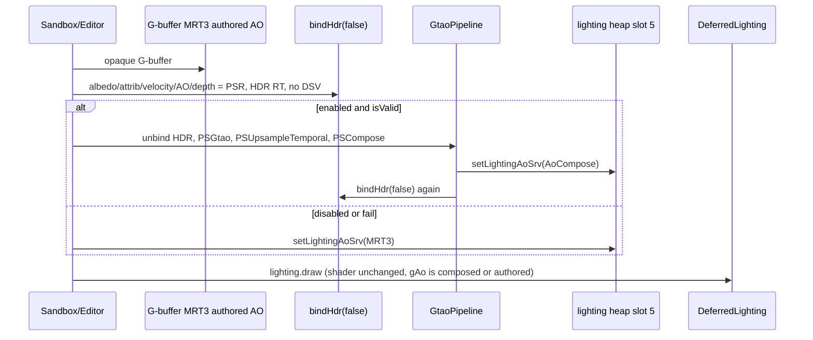

# Screen-space ambient occlusion (GTAO)

> **Accepted** draft. Implemented by execute-plan 8be641e1 PRs 1–4. Body below is the approved RFC (rev 2); present-tense “today” describes the pre-PR1 tip.

> **Replacement RFC.** Overwrites in-tree `Render/DESIGN-ssao.md` draft rev 1 (2026-09-17), which was not implementable (compute/UAV on an engine with zero `cs_5_0` PSOs, `GpuSrv`/`Camera` types that do not exist, `AoFull` replacing authored MRT3, `intensityAo` scaling IBL energy, Editor-only knobs, no lighting-heap / DWORD / host-insertion inventory). Spine kept: Jimenez GTAO, half-res produce, ambient/IBL only, same-frame, Dev Tools knobs.

| Field | Value |
|-------|--------|
| **Title** | Screen-space GTAO as a second ambient factor (does not replace MRT3) |
| **Author** | TBD |
| **Date** | 2026-09-18 |
| **Status** | Accepted draft — implemented in execute-plan 8be641e1 PRs 1–4 |
| **Priority** | P0 — [DESIGN-pbr-roadmap.md](./DESIGN-pbr-roadmap.md) item 4 |
| **Area** | `Render/GtaoPipeline.*`, `Render/SceneBuffers.*`, `Render/SceneRenderer.*`, `Render/Camera3D.*`, `Render/DebugRenderState.h`, `Render/DebugOverlay.*`, `content/shaders/Gtao.hlsl`, Sandbox Dev Tools, Editor 3D, UnitTests |
| **Audience** | Engine, Sandbox, Editor owners who already know this tree |
| **Depends on** | [DESIGN-color-management.md](./DESIGN-color-management.md) (**landed**). [DESIGN-pbr-material-maps.md](./DESIGN-pbr-material-maps.md) (**landed** — authored AO MRT3, lighting-heap slot 5). [DESIGN-ibl.md](./DESIGN-ibl.md) (**landed** — apply target is `evaluateIbl * ao`). |
| **Supersedes** | In-tree `DESIGN-ssao.md` rev 1. Maps RFC line “SSAO multiplies the same ambient path, does not replace MRT3”. |
| **Does not** | Compute PSOs / UAVs. XeGTAO visibility bitmasks, spatial denoise, bent normals, multi-bounce. HBAO+. AO on water / particles / sky / fog / `-forward`. Growing `kLightingCount` 9→10. Lighting-shader `pow` or a second IBL intensity. Bindless. Frame graph. |

---

## Overview

DarkEngine6 HybridDeferred already multiplies IBL and legacy ambient by **authored** G-buffer AO (`DeferredLighting.hlsl` `gAo` t5, lighting-heap slot 5, MRT3 `R8_UNORM`). There is no screen-space contact darkening: crates float on the floor; thin crevices get only the ORM cavity.

This RFC freezes **Jimenez GTAO** (2016 cosine-weighted horizon integration) at **half resolution**, graphics-queue fullscreen pixel passes, temporally filtered with the existing velocity RT, applied as a **second factor** on the same ambient/IBL term:

```text
ao = authoredMRT3 * ssao          // ssao = 1 when disabled / failed
ambient = evaluateIbl(...) * ao   // existing iblIntensity unchanged
direct sun / CSM / local lights: no AO
```

`DeferredLighting.hlsl` and the lighting root signature **do not change**. When GTAO is on, hosts `CopyDescriptors` the composed `authored * ssao` SRV into lighting-heap slot 5 (same pattern as `setShadowSrv`). When it is off, slot 5 stays MRT3.

Default **off**. Sandbox Dev Tools is the primary soak (IBL-style header). Editor 3D gets the same knobs. `-forward` is a no-op.

No C++ exceptions: `bool` + `DE_LOG_ERROR(LogCategory::Render, ...)` + `DE_ASSERT`.

---

## Background — what the tip actually does

Verified against the tree at time of writing.

| Piece | Location | Fact |
|-------|----------|------|
| Authored AO | `SceneBuffers` `kRtvAo = 6`, `kLightingAo = 5` | MRT3 `R8_UNORM`, clear 1. Lighting heap slot 5. |
| Deferred apply | `DeferredLighting.hlsl` | `float ao = gAo.Load(...).r` then `ibl = (Fd * irr + spec) * ao * iblIntensity` and `ambientColor * albedo * ao`. |
| Lighting RS | `DeferredLightingPipeline.h` | 56-float CB + tables t0–t3, shadow CBV, height t4, AO t5, IBL t6–t8. **62 / 64 DWORDs.** |
| One CBV_SRV heap | `DeferredLightingPipeline::draw` | `SetDescriptorHeaps(1, { lightingHeap })`. A second heap cannot be bound. |
| Local lights | `LocalLightVolumePipeline` | AO table bound at t3; shader does **not** declare `gAo`. Punctual must not multiply AO. |
| Compute | `content/shaders/` | **Zero** `cs_5_0`. Bloom / TAA / lighting / IBL bake are graphics. Color targets: `ALLOW_RENDER_TARGET` only. |
| TAA | `DebugRenderState.taa` default **true**; `Camera3D::SetSubpixelJitter` | Depth/velocity are jittered. `m_ProjUnjittered` is private. `GetProj()` is the matrix that wrote depth. |
| Host sequence | `SandboxApp` / `EditorRender3D` | After G-buffer: `bindHdr(false)` (G-buffer + depth → `PIXEL_SHADER_RESOURCE`, HDR bound, no DSV) → `lighting.draw` → local lights → `bindHdr(true)` sky. |
| Dev Tools | `Sandbox/DevToolsPanel.cpp` | IBL header: Enabled, Intensity, Rotation, Debug view. No SSAO fields. |
| Overlay | `SandboxApp::drawDebugOverlays` | G-buffer albedo/attrib tiles + velocity. No AO tile. |
| Ownership | `SceneRenderer` | Owns Bloom / TAA / motion blur / lighting **lifetime**. Hosts still sequence the frame. |
| Types | engine Render/ | No `GpuSrv`. No `class Camera`. 3D camera is `Camera3D`. SRVs are `D3D12_CPU_DESCRIPTOR_HANDLE` FLAG_NONE + SHADER_VISIBLE heaps. |

---

## Key decisions

| ID | Decision | Why |
|----|----------|-----|
| **S1** | **Jimenez GTAO**, 4 directions × 4 steps, half-res. Not XeGTAO (no bitmasks, no denoise, no bent normals). | Roadmap already says GTAO. Thin-feature cosine horizon is the quality claim. XeGTAO extras are a later RFC. |
| **S2** | **Graphics-queue fullscreen PS + RTV**, Bloom-shaped. No `cs_5_0`, no `ALLOW_UNORDERED_ACCESS`, no `u0`. | Engine post stack is graphics. IBL RFC explicitly rejected first compute PSO. |
| **S3** | **Ambient/IBL only.** Direct sun/CSM and local volumes do not multiply SSAO (or authored AO). | Matches maps M3 / IBL. Punctual dirt is a different product. |
| **S4** | **Compose `authored * ssao` into lighting-heap slot 5.** Do not grow `kLightingCount`. Do not overwrite the MRT3 resource. Lighting shader unchanged. | Slot 5 is already the ambient AO factor. Growing the heap needs a 63rd DWORD and a second sample. Premultiply is the minimum change. |
| **S5** | **Same-frame**, after `bindHdr(false)`, before `lighting.draw`. Never previous-frame AO. | One-frame lag is a different product (cut ghosts). |
| **S6** | **Temporal is v1**, but lighting never sees raw half-res. Upsample + history + clamp run before compose. Frame 0 / cut / `enabled` rising edge: TAA-style `reset` (current only). | TAA jitter is on by default. Binding unfiltered half-res falsifies “no shimmer when still”. |
| **S7** | **Intensity is mix-to-identity** in the produce path: `ssao = lerp(1, pow(saturate(raw), power), intensity)`. Lighting does not `pow` and does not multiply IBL by a second intensity. | `* intensityAo` on `evaluateIbl` zeros skylight. Intensity 0 must match SSAO-off. |
| **S8** | **Default `enabled = false`.** AND with `DebugRenderState::ssaoEnabled`. Turn on from Dev Tools after identity tests exist. | IBL only defaulted on after knobs + content. |
| **S9** | **Host knobs:** Sandbox Dev Tools (primary) and Editor 3D. `GtaoSettings` is enabled / radius / power / intensity only. | User request. IBL pattern. steps / directions / thickness / halfRes are constants. |
| **S10** | **HybridDeferred only.** `-forward` / `!hasGBuffer()`: do not create-run GTAO; forward shaders unchanged. | Roadmap track done-when 4. |
| **S11** | **View-space from the proj that wrote depth** (`Camera3D::GetProj()`), plus `GetView()` to rotate world octahedral N into view. Publish `GetProjUnjittered()` but do **not** pair unjittered `invP` with jittered depth. | Deferred reconstructs **world** via `invViewProj`. GTAO samples in **view**. Wrong matrix → yaw-dependent radius. |
| **S12** | **Debug view is a DebugOverlay tile** of `AoFull` (screen-space factor), not a lighting-shader early-out. | Lighting RS is 62/64. Overlay matches velocity / G-buffer tiles and costs zero lighting DWORDs. |

---

## Frozen GPU map

### Targets (GtaoPipeline-owned, Bloom-style `ALLOW_RENDER_TARGET` only)

| Name | Size | Format | Role |
|------|------|--------|------|
| `AoHalf` | `(w+1)/2 × (h+1)/2` | `R8_UNORM` | Raw GTAO visibility |
| `AoFull` | `w × h` | `R8_UNORM` | After bilateral upsample + temporal + power/intensity (`ssao` factor) |
| `AoHistory` | `w × h` | `R16_FLOAT` | Temporal history |
| `AoCompose` | `w × h` | `R8_UNORM` | `authoredMRT3 * ssao` — **CopyDescriptors source for lighting slot 5 when enabled** |

Clear: `AoHalf` / `AoFull` / `AoCompose` to **1**. `AoHistory` to 1. On resize, recreate all four.

MRT3 (`SceneBuffers::ao()`) stays the authored channel for G-buffer dumps and for the compose SRV. Never render GTAO into MRT3.

### GtaoPipeline root signature (separate PSO; does **not** touch lighting RS)

```text
[0] CBV b0          2 DWORDs    GtaoGpuParams
[1] SRV table t0–t3 2 DWORDs    depth, attrib, velocity, history (or authored AO on compose)
static s0 point clamp, s1 linear clamp
Total 4 DWORDs
```

Lighting RS stays **62 / 64**. No extra SSAO table. No extra `LightingConstants` field.

### `GtaoGpuParams` (CBV, 16-byte aligned)

```cpp
struct GtaoGpuParams
{
    float invSizeHalf[2];
    float invSizeFull[2];
    float invProj[16];       // inverse of Camera3D::GetProj() — the matrix that wrote depth
    float view[16];          // Camera3D::GetView() — world N → view N (row-vector)
    float reprojection[16];  // prevViewProj * inverse(thisViewProj), TAA-style
    float radius;            // view-space meters
    float power;
    float intensity;         // 0 = identity
    float thickness;         // constant kThickness = 1.0f
    float nearZ;
    float farZ;
    float reset;             // 1 = do not sample history
    float _pad;
};
static_assert(sizeof(GtaoGpuParams) == 64 * sizeof(float));
```

`steps = 4`, `directions = 4` are `#define` in `Gtao.hlsl`, not CB fields.

### Three graphics passes (one file, entry-point macros)

1. **PSGtao** — half-res. t0 depth, t1 attrib (oct world N in `.rg`). RTV `AoHalf`.
2. **PSUpsampleTemporal** — full-res. t0 `AoHalf`, t1 depth, t2 attrib, t3 `AoHistory`, velocity via the remaining slot or a second table of 1 (`t4` would need a third root param). **Frozen:** this pass’s SRV table is **t0–t4** (5 descriptors) so add root param `[2] SRV table t4 velocity` (**+2 DWORDs → 6 total**), still tiny. Bilateral upsample using **full-res** depth + attrib; then temporal blend with neighborhood min/max clamp of current AO (TAA-style box). `reset > 0.5` → current only. Apply `ssao = lerp(1, pow(vis, power), intensity)` **here**. RTV `AoFull`. Then copy/transition: this result becomes next frame’s history (write `AoHistory` as a second RTV **or** `CopyResource` AoFull→history after). **Frozen:** `OMSetRenderTargets` two RTVs (`AoFull` R8 + `AoHistory` R16) from this pass when `reset` is 0; when `reset`, write both to current (history = current).
3. **PSCompose** — full-res. t0 MRT3 authored AO, t1 `AoFull`. RT `AoCompose = authored * ssao`.

Disabled / `!isValid` / `!hasGBuffer()`: skip all three; do **not** call `setLightingAoSrv` with a white tex (leave slot 5 as packed MRT3).

### Lighting bind (S4)

```cpp
// SceneBuffers.h — next to setShadowSrv
void setLightingAoSrv(ID3D12Device* device, D3D12_CPU_DESCRIPTOR_HANDLE aoCpu);
```

Implementation: store `m_lightingAoCpu`, `CopyDescriptorsSimple` into heap slot `kLightingAo`. `packLightingHeap` uses `m_lightingAoCpu` if set, else `m_aoSrvCpu` (MRT3).

Each enabled frame, after compose: `renderer.sceneBuffers().setLightingAoSrv(device, gtao.composeSrvCpu())`.  
Each disabled / failed frame: `setLightingAoSrv(device, sceneBuffers.aoSrvCpu())` (restore MRT3). Resize / `packLightingHeap` must not stick a stale compose handle after a disable.

---

## Algorithm (cite, do not invent)

- **Jorge Jimenez et al., “Practical Real-Time Strategies for Accurate Indirect Occlusion,” SIGGRAPH 2016** — GTAO, cosine-weighted horizon integration, thickness heuristic. **v1.**
- **Not v1:** XeGTAO (Intel 2022) visibility bitmasks, Hilbert noise as a *required* spatial denoise, bent normals, multi-bounce GTAO.
- Per pixel, `kDirections = 4` slices in view-XY, `kSteps = 4` samples per side along the horizon. Rotate the slice set by interleaved-gradient noise using the pixel coord + a temporal offset (frame index low bits) so temporal has something to integrate.
- Reconstruct **view** position from window depth and `invProj` (S11). Decode oct world N from attrib.rg (`GBuffer.hlsli` `DecodeOct`), rotate by `view` 3×3 (row-vector: `mul(nWS, (float3x3)view)`).
- Falloff by `radius` in view meters. Thickness constant `kThickness = 1.0`.
- Output visibility in [0, 1]. Produce-path `ssao = lerp(1, pow(vis, power), intensity)` (S7).
- Bilateral upsample: depth + normal weights against the **full-res** G-buffer; this is the halo control. Thickness is **not** the upsample-edge fix (rev 1 named the wrong halo).

HLSL zeros are `0.0.xxx`, not `0.xxx` (FXC X3000).

---

## API

```cpp
struct GtaoSettings
{
    bool  enabled   = false;
    float radius    = 0.5f;  // view-space meters
    float power     = 1.5f;
    float intensity = 1.0f;  // 0 = identity
};

class GtaoPipeline
{
public:
    bool create(ID3D12Device* device, uint32_t width, uint32_t height);
    bool resize(ID3D12Device* device, uint32_t width, uint32_t height);
    void draw(ID3D12GraphicsCommandList* cmd, Renderer& renderer, const Camera3D& camera,
              const Math::Matrix4f& prevViewProj, const GtaoSettings& settings, bool resetHistory);

    bool isValid() const;
    D3D12_CPU_DESCRIPTOR_HANDLE composeSrvCpu() const; // FLAG_NONE, AoCompose
    D3D12_CPU_DESCRIPTOR_HANDLE aoFullSrvCpu() const;  // FLAG_NONE, overlay tile
};
```

`create` / `resize` / `draw` never throw. Null device → `false`. `draw` no-ops when `!settings.enabled`, `!renderer.hasGBuffer()`, or `!isValid()` (log once, Bloom-style).

`SceneRenderer` **owns** `GtaoPipeline` (create/resize with scene size, same place Bloom resizes). Hosts call:

```cpp
renderer.bindHdr(false);
renderer.clearHdr();
m_scene.applyGtao(cmd, renderer, camera, prevViewProj, gtaoSettings);
m_scene.lighting().draw(cmd, renderer, shadows, lc);
```

`applyGtao` internally: unbind HDR → three passes → `setLightingAoSrv` → `bindHdr(false)` again so lighting still has HDR as RT.

### Camera3D

```cpp
const Math::Matrix4f& GetProjUnjittered() const { return m_ProjUnjittered; }
```

v1 GTAO reconstructs with `GetProj()` (S11). The getter exists so tests and a later stable-radius pass can read it without befriending the camera.

### DebugRenderState

```cpp
bool ssaoEnabled = false; // AND with GtaoSettings.enabled
int  ssaoDebug   = 0;     // 0 off, 1 AoFull overlay tile
```

Host `GtaoSettings.enabled` is AND-ed with `debugState.ssaoEnabled`. Overlay draws even when SSAO is off if `ssaoDebug == 1` and `aoFullSrvCpu` is valid (dummy/cleared white → white tile).

### Dev Tools / Editor

Sandbox `DevToolsPanel.cpp`: `CollapsingHeader("SSAO")` when `hasGBuffer()`, IBL-shaped:

- Checkbox Enabled → `debugState.ssaoEnabled`
- Slider Intensity `[0, 1]`
- Slider Radius `[0.05, 2]`
- Slider Power `[0.5, 4]`
- Combo Debug view: Off / SSAO factor

Editor 3D: same knobs on an “SSAO” window (IBL sibling). Log once per edge. No per-draw logs.

---

## Frame integration



`SwapChainForward`: `applyGtao` returns immediately.

Sky / water / particles / fog: unchanged (no SSAO). Fog still uses unoccluded `ambientColor` (v1 accepted mismatch, same as IBL).

---

## Exact ambient apply

Produce path (PSUpsampleTemporal):

```hlsl
float vis  = /* GTAO visibility 0..1 after upsample+temporal */;
float ssao = lerp(1.0, pow(saturate(vis), power), intensity);
```

Compose:

```hlsl
float authoredAo = gAuthoredAo.Load(int3(texel, 0)).r;
float ssao       = gSsao.Load(int3(texel, 0)).r;
return authoredAo * ssao;
```

Deferred lighting **unchanged**:

```hlsl
float ao = gAo.Load(int3(texel, 0)).r; // slot 5 = composed or MRT3
// ibl = (Fd * irr + spec) * ao * iblIntensity;  // specular included, same as authored AO today
```

---

## Files

| Path | Change |
|------|--------|
| `Render/GtaoPipeline.h/.cpp` | New. Bloom-shaped create/resize/draw, 3 PSOs, 4 targets, FLAG_NONE SRV heap + SHADER_VISIBLE heap + RTV heap. |
| `content/shaders/Gtao.hlsl` | `VSMain` (fullscreen bit-trick, same as DeferredLighting), `PSGtao`, `PSUpsampleTemporal`, `PSCompose`. |
| `Render/SceneBuffers.h/.cpp` | `setLightingAoSrv`; `packLightingHeap` honors last compose handle. |
| `Render/SceneRenderer.h/.cpp` | Own `GtaoPipeline`; `applyGtao(...)`; resize with scene. |
| `Render/Camera3D.h` | Public `GetProjUnjittered()`. |
| `Render/DebugRenderState.h` | `ssaoEnabled`, `ssaoDebug`. |
| `Sandbox/DevToolsPanel.cpp` | SSAO header. |
| `Sandbox/SandboxApp.cpp` | `applyGtao` after `bindHdr(false)`; overlay tile when `ssaoDebug==1`; `GtaoSettings m_ssao`. |
| `Editor/EditorRender3D.cpp` | Same insertion. |
| `Editor/EditorUi.cpp` | SSAO window. |
| `UnitTests/Render/GtaoTests.cpp` | Settings / resize / nullptr / compose identity. |
| `UnitTests/Render/ShaderCompileTests.cpp` | `Gtao.hlsl` VS + three PS. |
| `CMake` Render / UnitTests lists | Add the new files. |

`DeferredLighting.hlsl` / `DeferredLightingPipeline.*` / `kLightingCount`: **no change**.

---

## Acceptance tests

| Test | Expected |
|------|----------|
| `Gtao_FlatPlane_Center_NearOne` | `AoFull` center ≥ 0.95 |
| `Gtao_CornerFixture_Darker` | corner `AoFull` < plane − 0.1 |
| `Gtao_Disabled_SkipsPass` | `draw` does not change slot 5; authored MRT3 still multiplies; no white SSAO tex |
| `Gtao_IntensityZero_Identity` | intensity 0 → `AoFull` = 1; composed ambient matches SSAO-off |
| `Gtao_AuthoredAo_StillDarkens` | flat plane, authored 0.2, GTAO ~1 → composed ~0.2 |
| `Gtao_SunLitFlat_MatchesOff` | sun-lit no-crevice HDR texel matches SSAO-off within ULP |
| `Gtao_ShadowedCrevice_DarkerWhenOn` | sun-shadowed crevice ambient darker by ≥ 0.05 only when enabled |
| `Gtao_Settings_Defaults` | enabled false; power 1.5; intensity 1; **no** halfRes field |
| `Gtao_Resize_RecreatesTargets` | 1280×720 → 1920×1080, `composeSrvCpu` valid |
| `Gtao_Create_NoDevice_False` | nullptr device → false; lighting still uses MRT3 |
| `Gtao_LightingCount_Unchanged` | `kLightingCount == 9`, `kLightingAo == 5` |
| `ShaderCompile.Gtao` | VS + PSGtao + PSUpsampleTemporal + PSCompose compile |

Visual QA (Sandbox, Dev Tools):

1. SSAO debug tile: soft creases, not white noise when still (temporal on).
2. Enabled off: authored ORM cavities still darken; sun-lit flats match.
3. Intensity 0 matches off (IBL stays up).
4. Camera around a crate: no 1-frame black flash (`reset` on enable rising edge).
5. `-forward`: no change, no crash.

---

## Manual QA checklist

1. HybridDeferred PathChase crate: crevice under the crate darkens when Enabled, not when Intensity is 0.
2. Toggle Enabled: screenshot difference only in shadowed ambient / crevices, not on the sun disk of the crate top.
3. Mapped glTF with ORM AO: cavities stay dark with SSAO off (S4).
4. Resize the window: no debug-layer error, no black frame.
5. Forward path (`-forward` if still wired): boots, no GTAO PSO.

---

## Risks

| Risk | Mitigation |
|------|------------|
| Upsample halo on thin props | Bilateral uses full-res depth+normal (S1/S12 halo). Thickness is a horizon heuristic only. |
| Temporal ghosting | Neighborhood min/max clamp of current AO; `reset` on cut / enable / resize. |
| TAA jitter shimmer | Temporal is v1 and runs **before** compose (S6). |
| Skinned / possessed `prevWorld` gaps smear history | `reset` when TAA resets; accept residual smear (known TAA gap). |
| R8 quantization vs ≥ 0.95 plane test | Test the **full-res** `AoFull` after temporal, not `AoHalf`. |
| Metals go darker in cavities | Same as authored AO today (full IBL × ao). v1 does not split specular. |
| Fog still unoccluded | Accepted IBL-class mismatch. |
| `bindHdr(false)` twice | `applyGtao` must restore HDR RT; lighting.draw assumes it. Test with debug layer. |

---

## Alternatives considered

| Option | Verdict |
|--------|---------|
| Classic kernel SSAO for v1, GTAO later | Rejected. Roadmap item 4 is GTAO; 4×4 horizon is not materially more code than a hemisphere kernel once the pass/bind exists. |
| Grow `kLightingCount` 9→10, lighting `ao *= gSsao` | Rejected. Extra table is a 63rd DWORD and a shader change. Premultiply slot 5 keeps lighting frozen. |
| Compute UAV GTAO (XeGTAO port) | Rejected. Zero compute PSOs; IBL already spent that “first compute” discussion. |
| Previous-frame AO (no wait on this-frame GTAO) | Rejected. Cut ghosts; Manual QA “no 1-frame black flash” becomes a different bug class. |
| Editor-only knobs | Rejected. Soak path is Sandbox Dev Tools. |
| Default on | Rejected. IBL lesson: knobs first. |
| Lighting-shader `pow` / `* intensityAo` | Rejected. Double-apply and IBL kill. |
| Debug as `iblDebug`-style early-out | Rejected. 62/64 lighting RS. Overlay tile. |
| Unjittered `invP` + jittered depth | Rejected. Wrong view Z. Reconstruct with `GetProj()`. |

---

## Rollout / PR plan

Each PR is independently reviewable. No C++ exceptions. Do not mix unrelated refactors. Do not commit this RFC from PRs 1–3 (docs are PR5).

### PR 1 — Plumbing, no look change

- **Title:** `render: GTAO settings, Camera3D unjittered getter, lighting AO SRV setter`
- **Files:** `Camera3D.h`, `SceneBuffers.h/.cpp` (`setLightingAoSrv`), `DebugRenderState.h` (`ssaoEnabled`/`ssaoDebug` default false), `GtaoSettings` in `GtaoPipeline.h` (header-only struct OK), UnitTests defaults + `kLightingCount==9`
- **Depends on:** none
- **Description:** Slot 5 still MRT3. No PSO. No host call.

### PR 2 — Pipeline + shaders, default off, not inserted

- **Title:** `render: GtaoPipeline graphics GTAO (not bound)`
- **Files:** `GtaoPipeline.h/.cpp`, `content/shaders/Gtao.hlsl`, `SceneRenderer` create/resize (do not call `draw` yet), ShaderCompile tests, Gtao resize/nullptr tests
- **Depends on:** PR1
- **Description:** Targets exist. Lighting still packed from MRT3.

### PR 3 — Insert + compose bind (still default off)

- **Title:** `render: apply GTAO before deferred lighting`
- **Files:** `SceneRenderer::applyGtao`, Sandbox + Editor `bindHdr(false)` insertion, compose → `setLightingAoSrv`, identity tests `Gtao_Disabled_SkipsPass`, `Gtao_IntensityZero_Identity`, `Gtao_AuthoredAo_StillDarkens`
- **Depends on:** PR2
- **Description:** Look unchanged until a user ticks Enabled. Temporal runs with `reset` on first enable.

### PR 4 — Dev Tools + Editor + overlay tile

- **Title:** `ui: SSAO Dev Tools and Editor knobs`
- **Files:** `DevToolsPanel.cpp`, `EditorUi.cpp`, `SandboxApp` overlay tile (`ssaoDebug==1` → `drawColor` of `aoFullSrvCpu`), `m_ssao` host settings
- **Depends on:** PR3
- **Description:** IBL-shaped header. Log once per edge.

### PR 5 — RFC copy

- **Title:** `docs: DESIGN-ssao replacement RFC`
- **Files:** overwrite `Render/DESIGN-ssao.md` with this text; one-line pointer in `DESIGN-pbr-roadmap.md` if needed (“ssao RFC rev 2”)
- **Depends on:** PR3 merged (or land docs first as Accepted draft)
- **Description:** Status → Accepted when PR1–4 are in.

---

## Open questions (none blocking v1)

None. Specular vs irradiance: **full IBL × ao**, same as authored AO. SSAO when TAA is off: **still runs** (more shimmer is acceptable). Combine: **product** `authored * ssao`, not `min()`.
