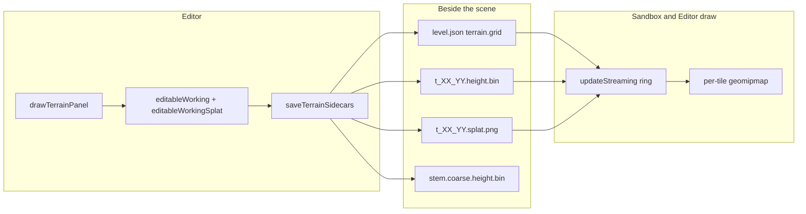
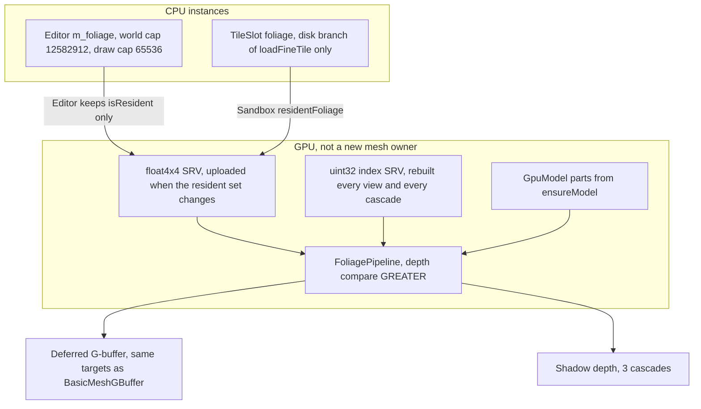

# Terrain foliage density spawn

> **Accepted.** Implemented by execute-plan 4c05816d PRs 1–9.

| Field | Value |
|-------|--------|
| **Title** | Density spawn of trees, flowers, and rocks on terrain splat layers |
| **Author** | Travis Johnston |
| **Date** | 2026-10-03 |
| **Status** | Accepted. Implemented by execute-plan 4c05816d PRs 1–9. |
| **Area** | `Terrain/` (spawn + sidecar), `Scene/SceneTypes.h`, `Scene/SceneFile.cpp`, `Editor/EditorTerrain.cpp`, `Editor/EditorRender3D.cpp`, `Sandbox/SandboxApp.cpp`, `Render/` (instanced draw of existing `Model`s), `UnitTests/Terrain/` |
| **Audience** | Engine, Editor, and Sandbox owners who already know the geomipmap, the four-channel splat, and scene sidecars |

No C++ exceptions. Failure is `bool` plus `DE_LOG_ERROR` / `DE_LOG_WARN` / `DE_LOG_INFO` (`Core/Log.h`, category `LogCategory::Render` unless noted). `Terrain/FoliageFile.cpp` sidecar load/save logs omit a category and therefore use `LogCategory::Core`. Spawn, editor, and prototype logs stay `Render`. The collider cap stays `Collision`. Programmer mistakes use `DE_ASSERT`. Allman braces, 4-space indent, C++23. Sample code below follows that rule: no `try`, `catch`, or `throw`.

---

## Overview

The Editor terrain panel can say how many trees and flowers appear on dirt, how many trees and flowers appear on grass, and how many rocks appear on rock, in counts per square metre. A button places them. The button is the only time placement runs. Moving the camera does not scatter more, and **Generate world** / **Generate from height** / sculpt / paint do not run it again.

What is saved is the instances themselves (where each tree, flower, and rock ended up), plus the five density numbers and the seed so the panel comes back. Densities live in the scene JSON under `terrain.foliage`. Instances live in per-tile binaries beside the height and splat files the grid already writes (`t_%02d_%02d.foliage.bin` in the tile directory). Scene `version` stays 2. `HeightMap::saveBinary` stays capped at 32 MB and is not used for this data.

The meshes are ordinary `Model`s. An empty path uses `Model::createFromParts`, uploaded through `GpuResourceCache::ensureModel`, the same owner PathChase already uses for its procedural tree. A path in `terrain.foliage` loads through `AssetManager::loadModel` / `loadModelFile` (`Assets/AssetManager_More.inl`) and `loadAndUploadModel` (`Render/GpuUpload.cpp`). They are not scene objects and they are not a second mesh type. Tens of thousands of `SceneObjectType::Model` entities would blow the outliner, `level.json`, and the per-entity draw in `EditorRender3D.cpp`. One shared model per kind is drawn with `Mesh::drawInstanced`. Trees and rocks also get a capped set of static `PhysicsWorld::createBox` bodies so the existing player sweep stops on them. Flowers do not.

Placement reads the working heightfield (`heightAtWorld`, `normalAtWorld`) and the splat (`sampleWeights`). It does not scatter uniformly and then hope. Snow has no budget. A pure-snow texel places nothing.

---

## Background & Motivation

### What the tree does today

Outdoor terrain is a finite baked tile world (`Terrain/TerrainGrid.h`). The default desc is 4×4 tiles, 512 cells, `cellSize` 1 m, origin (−1024, 0, −1024), so the default extent is 2048 m × 2048 m. `kMaxWorldTiles` is 8, so the max grid at 1 m cells is 4096 m on a side. The Editor **Generate** size combo is the literal `"1 (512 m) / 2 (1 km) / 4 (2 km) / 8 (4 km)"` (`Editor/EditorTerrain.cpp`, `kGenTileCounts`). Those labels assume 1 m cells and do not update when the cell-size slider moves (`m_genCellSize` is 0.5 m to 4 m, default 1 m; `m_genTilesIndex` default 2). Area for the cap is always `tiles * 512 * cellSize`. At 4 m the option labelled 2 km is 4 × 512 × 4 = 8192 m. The small FBM path is not that combo: `createFromHeightMap` sets `tileCells = width - 1`, and the 129² map is 128 cells at 2 m. Working maps may be up to 4097 samples (`kMaxWorkingHeightMapSize`, `kMaxWorkingSplatMapSize`). Runtime `HeightMap::create` stays at 1025. Samples stay raw. World Y is `origin.y + raw * heightScale` (`HeightMap::worldY`). Spawn must call `heightAtWorld` and must not write `heightScale` into the samples or into a second height file.



| Piece | Location | Fact used by this design |
|-------|----------|--------------------------|
| Splat | `Terrain/SplatMap.h`, `SplatMap.cpp` | Exactly four RGBA8 channels. R = dirt (0), G = grass (1), B = rock (2), A = snow (3). `generateFromHeight` weights dirt/grass/snow from normalized height and rock from slope (`SplatRules` defaults: `dirtMax` 0.28, `grassMin` 0.18, `grassMax` 0.72, `snowMin` 0.62, `rockSlope` 0.45, `blend` 0.08). Steep slopes multiply dirt and grass by `(1 - rock)`. Sum near zero becomes grass. `renormalizeTexel` does the same for an empty texel. `sampleWeights` is bilinear in **sample** space and renormalizes when the sum is above `1e-5`. An all-zero texel stays all zeros; spawn must not treat that as grass. |
| Height | `Terrain/HeightMap.h`, `HeightMap.cpp` | `heightAtWorld` clamps to the rim. `containsXZ` is the off-map test. `normalAtWorld` is the ground normal. `worldToSample` maps world XZ into sample space. `saveBinary` / `loadBinary` are DEHF (`magic` `0x46484544`, version 1). The 32 MB cap is `kMaxHeightSidecarBytes` inside `HeightMap.cpp` (not a header constant). A 4097² working map is rejected by that cap. Foliage does not call that symbol. |
| Tiles | `Terrain/TerrainTileFile.h` | `kTileCells` 512, `kTileSamples` 513. Names are `t_%02d_%02d.height.bin` and `t_%02d_%02d.splat.png`. |
| Grid | `Terrain/TerrainGrid.h`, `TerrainGrid.cpp` | Coarse height is always resident. Fine tiles load in a camera ring. `kResidentRingDefault` is 5. `inRing` uses `radius = residentRing / 2`, so 5 means a Chebyshev radius of 2 (a 5×5 block). `loadFineTile` returns immediately when the slot is already resident, and when `m_working` is valid it returns through `sliceWorkingTile` before it opens a file. Only the disk branch reads height and splat, on the calling thread. `updateStreaming` loads at most one tile per frame when a renderer is present (`maxLoad = renderer ? 1 : kMaxWorldTiles * kMaxWorldTiles`). `evictFineTile` drops the slot. `heightAtWorld` uses the fine tile if it is resident, otherwise the coarse map. Editor `assembleWorking` loads every fine tile into the working maps. Runtime must not call that. |
| Scene | `Scene/SceneTypes.h`, `Scene/SceneFile.cpp` | `version` stays 2. `TerrainSceneDesc` is not a `SceneObjectType`. When `tilesX * tilesZ > 1`, `fillTerrainSceneDesc` clears `heightFile` and `splatFile`. `saveSceneToJson` omits those two keys in that case and writes `terrain.grid` (`tilesX/Z`, `tileCells`, `cellSize`, `origin`, `heightScale`, `seed`, `coarseFile`, `tileDir`, `seaLevel`, `residentRing`). `SplatRules` are **not** in the JSON. The painted splat image is. |
| Editor save | `Editor/EditorTerrain.cpp` `saveTerrainSidecars` | Always writes the coarse DEHF and one height bin plus one splat PNG per tile. The legacy single `heightFile` / `splatFile` pair is written only when `tileCount <= 1`. |
| Editor UI | `drawTerrainPanel` | Generate, layers, blend, splat rules, **Generate from height**, paint, sculpt. No density controls. Brushes lock while `m_genRunning`. |
| Generate | `startGenerateWorld`, `applyGeneratedWorld` | Offline thread. Apply does `m_terrain.clear()`, then `setWorking` of the new height and splat. Previous ground is gone. |
| Small FBM | `createEditorTerrain` | 129², `cellSize` 2 m, origin (−128, 0, −128), extent 256 m. Calls `removeEditorTerrain` first. One-tile grid via `createFromHeightMap`. |
| Models | `Assets/Model.h` `createFromParts` | CPU parts. GPU meshes live on `GpuModel` inside `GpuResourceCache`. `Render/ModelDraw.cpp` draws one world matrix per entity: `part.localToRoot * world` (row-major, `Math/Matrix4f.h`). |
| Instancing today | `Render/Mesh.cpp` `Mesh::drawInstanced` | Exists. `BasicMeshGBuffer.hlsl` does **not** read `SV_InstanceID`. `Decal.hlsl` and `LocalLightVolume.hlsl` do. `MeshGBufferConstants` is 58 floats, one object. Skinned G-buffer root signature is already 63/64. Do not grow it. |
| Scene objects | `Scene/SceneTypes.h`, `Editor/EditorRender3D.cpp`, `Editor/EditorUi.cpp` | `SceneObjectType::Model` is a placed glTF (or cube proxy) with its own entity, outliner row, JSON object, and draw. `world().each<ModelComponent>` issues one draw per part per entity, including three shadow cascades (`kMaxShadowCascades` is 3 in `Render/ShadowCascades.h`). |
| Procedural tree | `Sandbox/PathChase.cpp` `makeTreeModel` | Private to PathChase. Cylinder trunk + cone canopy, `createFromParts`, cache key `runtime:/pathchase/tree`. Ten trees at fixed XZ seeds, each an ECS entity. Trunk radius 0.5 m, trunk height 2 m, canopy radius 2 m, canopy height 4 m (`kTreeHeight` 6 m). Not saved as terrain. |
| Content models | `content/models/` | `human`, `skeleton`, `unit_cube`, `unit_glass`, `wiggle`, `wolf`. No tree, flower, or rock glTF. |
| Ground contact | `content/terrain/ground.json`, `Terrain/TerrainGround.h` | Movement speed and footstep audio for dirt, grass, rock, snow. `TerrainGround::at` picks the **dominant** weight. That is not a foliage catalog and this design does not extend it. |
| Streaming RFC | `Terrain/DESIGN-terrain-streaming.md` | Vegetation was an explicit non-goal ("Named v2"). This document is that follow-up. It does not change geomipmap LOD, the 14-slot terrain heap, or the 32 MB DEHF cap. |

### Pain

There is no way to cover dirt, grass, or rock with repeatable props. The only trees in the game are ten PathChase entities around the origin, and they are not tied to the splat. Hand-placing `SceneObjectType::Model` rows cannot fill a 2 km map. A uniform random scatter would ignore the splat the user just painted.

### Scale, so the cap is not a guess

Default 4×4 world, 512 cells, 1 m cells:

- Side = 4 × 512 × 1 = **2048 m**
- Full square metres = 2048 × 2048 = **4,194,304 m²**

The prompt's example, 0.01 trees per m² on that map, is 0.01 × 4,194,304 = **41,943** trees, before flowers or rocks.

Max 8×8 world at 1 m cells: side 4096 m, area **16,777,216 m²**. At 0.01 trees per m² that is **167,772** trees.

Editor cell size slider runs from 0.5 m to 4 m (`drawTerrainPanel`). Worst authored area is 8 tiles × 512 cells × 4 m = 16,384 m on a side, **268,435,456 m²**. A 1 m candidate loop over that rectangle is 2.68×10⁸ steps. That must not run inside `drawTerrainPanel` or `onRender`.

`createEditorTerrain`'s 256 m × 256 m map is 65,536 m². Small.

One `SceneObjectData` in `level.json` is a JSON object with type, position, rotation, scale, and a model path. Forty thousand of those is tens of megabytes of JSON, tens of thousands of outliner rows (`EditorUi.cpp` walks `ModelComponent`), and tens of thousands of draw calls per cascade. That path does not fit. The asset path does: three `Model`s, many instances.

---

## Goals & Non-Goals

### Goals

- Editor panel, on a 3D scene that already has terrain, edits five densities before any spawn: dirt trees, dirt flowers, grass trees, grass flowers, rock rocks. Units are count per square metre. Tree and rock sliders are [0, 1]. Each flower slider is [0, 2].
- One **Spawn** button. A second press replaces the previous instance set. Same seed, same densities, same height samples, and same splat texels produce the same instances.
- Persist the densities and the foliage seed in `terrain.foliage` so the panel reloads.
- Persist every instance (position, yaw, scale, lean, kind) in per-tile `t_%02d_%02d.foliage.bin` files next to the height bins.
- Place from splat weights and from `heightAtWorld` / `normalAtWorld`. Trees and flowers only from dirt and grass weights. Rocks only from rock weight. No trees on rock. Skip every kind when world Y is below `terrain.grid.seaLevel`.
- Deterministic `Terrain::hash21` (`Terrain/TerrainGen.h`). Not `std::mt19937`, not `rand`.
- Hard cap of 12,582,912 instances for the whole world (`kMaxFoliageInstances`), the spawn cap and the multi-tile aggregator cap. That count is a pure-grass 2 km map at max trees and max flowers. Over-cap spawns keep that many, spread across the map, and log the drop. The sidecar predicate is `kMaxFoliagePerFile` (1,048,575) only. A spawn that would put more than that on any tile is not published.
- Spawn work runs on a worker thread with progress and cancel, same shape as `startGenerateWorld`. The main thread never scans the metre grid.
- Editor view, Editor play, and Sandbox all draw the saved instances. Editor play already uses `renderScene3D` (`Editor/EditorRender.cpp`). Sandbox must gain the same draw.
- Instances on a tile show when that tile is resident and hide when it is evicted.
- Each kind has a model path in `terrain.foliage`. Empty, missing, or unusable paths fall back to the `Model::createFromParts` prototype. Editor play and Sandbox draw that same model.
- Trees and rocks block the player with static boxes on the physics world the mover already clips. Flowers do not collide. The live body count is capped.

### Non-goals

- A snow density, a snow slider, or a snow kind. Snow stays a splat channel and a footstep layer. It only reduces the other weights because `sampleWeights` renormalizes.
- Spawning on camera move, on stream-in, or inside `generateWorld` / `generateFromHeight`.
- Putting instances in `objects[]` or the outliner. Collision is not an entity and not a dynamic body.
- A new mesh class, a host-owned foliage vertex buffer of tree geometry, or GPU-generated meshes.
- Growing `MeshGBufferConstants`, the skinned mesh root signature, `TerrainGBufferConstants`, or the lighting constant buffer.
- Raising `kMaxHeightSidecarBytes`, `kMaxTerrainLayers`, or `kMaxWorldTiles`.
- Writing a 4097² instance image, or stuffing instances into DEHF.
- Walkability rebakes and hunter pathing around foliage. PathChase's ten trunks stay in `WalkabilityDesc::cubes`. Foliage does not.
- Hand-editing one instance (move, delete, or pin against the next Spawn). Not in v1.
- Distance impostors, billboards, and mesh LOD. Not in v1.
- Wind or vertex animation. Not in v1. There is no previous per-instance matrix. Foliage writes `prevClip = mul(currentWorld, prevViewProj)`, the same matrix terrain uses. The instance buffer is still the current world only.
- A modal that blocks save while the set is stale. Save writes the baked Y and the panel keeps the warning.
- Replacing PathChase's ten ECS trees. Those stay a sandbox demo.
- Async I/O. `loadFineTile` already reads height and splat on the caller. Foliage matches that.
- A global job system. One extra `std::thread`, like `m_genThread`.
- 2D scenes. `drawTerrainPanel` already returns unless `m_sceneMode == Scene3D`.
- Network replication of the instance list.
- Using `content/terrain/ground.json` as a spawn table.

---

## Proposed Design

### Locked numbers

| Name | Value | Why |
|------|--------|-----|
| `kMaxFoliageInstances` | **12,582,912** | A pure-grass 2 km map at slider max: 4 × 512 × 512 × (1 tree + 2 flowers) = 16 × 262,144 × 3 = **12,582,912**. Records are 12,582,912 × 32 B = **402,653,184 B** (384 MiB). Defaults stay near 46k and do not allocate that. |
| Per-file record max | **1,048,575** | `(kMaxFoliageSidecarBytes − 32) / 32`. `kMaxFoliageSidecarBytes` is 32 MiB = 33,554,432. A 512 m tile at 1 tree + 2 flowers is 786,432 records, file size 32 + 786,432 × 32 = **25,165,856 B**, under that cap. 1 tree + 3 flowers on that tile is 1,048,576 records and **33,554,464 B**, which does not fit, so the flower max is 2 and not 3. |
| `kMaxFoliageDraw` | **65,536** | Matrix SRV. 65,536 × 64 B ≈ **4.0 MB**. The world list is not uploaded. |
| `kMaxLiveFoliageBodies` | **2,048** | Static boxes near the player. Not 12 million dynamic bodies. |
| Record size | **32 B** | See Data Model. |
| Tree and rock sliders | **[0, 1] per m²** | One trial per metre. |
| Flower sliders | **[0, 2] per m²** | Two slots in the metre cell. |
| Candidate cell | **1 m × 1 m** | The unit the user asked for. Not one sample, not one geomipmap chunk. |
| Jitter | **±0.45 m** | Stays inside the metre cell so two cells cannot claim the same point and the rim test is stable. |
| Default dirt trees | **0.002 / m²** | Full-dirt 2 km map: 0.002 × 4,194,304 = **8,389** |
| Default dirt flowers | **0.006 / m²** | Full-dirt 2 km: **25,166** |
| Default grass trees | **0.003 / m²** | Full-grass 2 km: **12,583**. Mean spacing `1/sqrt(0.003)` ≈ **18.3 m**. PathChase canopy diameter is 4 m, so defaults do not form a solid roof. |
| Default grass flowers | **0.008 / m²** | Full-grass 2 km: **33,554** |
| Default rocks | **0.004 / m²** | Full-rock 2 km: **16,777** |
| Foliage seed default | Copy of `terrain.grid.seed` when the JSON key is absent (`m_terrainSeed`, itself default **1337**) | After the first save the foliage seed is its own field. Editing the terrain seed does not reshuffle props. |

`kMaxFoliageInstances` (12,582,912) is the spawn cap and the Editor multi-tile load aggregator cap. The sidecar predicate is `kMaxFoliagePerFile` (1,048,575) only. `kMaxFoliageDraw` (65,536) lives in `Terrain/FoliageFile.h`. `kMaxLiveFoliageBodies` (2,048) lives in `Physics/FoliageCollision.h`, not in `FoliageFile.h`.

`sampleWeights` renormalizes, so a texel is a partition of 1. A pure-grass 2 km map at the defaults expects 12,583 + 33,554 = **46,137** instances, under the cap. A pure-dirt map expects 8,389 + 25,166 = **33,555**. A pure-rock map expects **16,777**. Blend texels land between those, not on top of them, because dirt and grass weights cannot both be 1.

Cheap upper bound the panel can show **without** reading the splat (it can over-count blends):

```
atMost = areaCells * (max(dirtTrees, grassTrees) + max(dirtFlowers, grassFlowers) + rockPerM2)
```

Defaults: 0.003 + 0.008 + 0.004 = **0.015**.

- 2 km, 4,194,304 cells, defaults: at most **62,915** (under the cap).
- 2 km, pure grass, sliders at max (1 tree + 2 flowers): **12,582,912**, equal to the cap, not thinned.
- 4 km at 1 m cells, 16,777,216 cells, defaults (0.015): at most **251,658**, still under the cap. The same map at max grass trees and flowers is 3 × 16,777,216 = **50,331,648**. Spawn keeps 12,582,912 and drops the rest.
- 8×8 at 4 m cells, 268,435,456 cells, defaults: at most **4,026,532**, under the cap. At 3 accepts per cell the scan can accept **805,306,368**. Same cap. The scan is the long part, not the keep list.

A 2 km map at 0.01 trees per m² (41,943) plus the default flower and rock fields fits this cap. Slider-max flowers on a map larger than 2 km, and a full 512 m tile that also tries to store 3 flowers per metre, are what the caps reject.

### Where a candidate looks

Spawn reads the Editor working pair only: `TerrainGrid::editableWorking()` and `editableWorkingSplat()`. Both are non-null after `assembleWorking` (scene load) and after `setWorking` (generate). If either is missing or invalid, spawn does not start and logs an error. It does not fall back to the coarse map (too low resolution) and it does not call `generateFromHeight` on the user's behalf.

The lattice uses the height map, not a silent 512. `spawnFoliage` reads `height->origin()` and `height->cellSize()` and returns false unless those equal `FoliageSpawnIn::origin` and `cellSize`, and unless `(height->width() - 1) == tilesX * tileCells` and `(height->height() - 1) == tilesZ * tileCells`. `tileCells == 0` fails. There is no default of `kTileCells`. World width in metres is `tilesX * tileCells * cellSize` after that check. Column count is `floor` of that width. A leftover sliver under 1 m on the far edge gets no candidate. The area figure used for the upper bound is `cols * rows`, not the raw AABB area. Centres sit at `origin + (i + 0.5, j + 0.5)` plus jitter. A centre that fails `containsXZ` is skipped. The Editor passes `m_terrain.tilesX()`, `tilesZ()`, `tileCells()`, `cellSize()`, and `origin()`. That is 512 for a generated world and **128** for **Create small FBM** (`createFromHeightMap` sets `tileCells = width - 1` on the 129² map, 128 cells × 2 m = 256 columns, not 129 samples and not 512). `worldToTile` stays private. Save and the spawn worker partition with inline floor-and-clamp (`tileCells * cellSize`, origin, clamp into the last tile). They do not call `worldToTile`. An internal edge belongs to the higher index. The far edge clamps into the last tile.

Jitter and rolls use `Terrain::hash21(int x, int z, uint32_t seed)`, which returns `[0, 1)`. Salt is xored into the seed so each roll is independent and stable:

| Roll | Seed xor |
|------|----------|
| Tree accept | `0x1000u` |
| Flower accept, slot `s` | `0x2000u + s` |
| Rock accept | `0x3000u` |
| Jitter X | `0x4000u` for tree and rock; `0x4100u + s` for flower slot `s` |
| Jitter Z | `0x5000u` for tree and rock; `0x5100u + s` for flower slot `s` |
| Yaw | `0x6000u + kind` for tree and rock; `0x6000u + kind + s * 16` for a flower slot |
| Scale | `0x7000u + kind` for tree and rock; `0x7000u + kind + s * 16` for a flower slot |

`hash21(cellX, cellZ, foliageSeed ^ salt)`. The function already mixes `x`, `z`, and `seed` (`Terrain/TerrainGen.cpp`). Compare with `< p`, never `<=`. `hash21` can be 0. A probability of 0 never accepts. A probability of 1 always accepts, because the hash is in `[0, 1)`.

### Which layer wins

Probabilistic by weight, per kind, not a hard argmax. `TerrainGround::at` uses argmax because a footstep wants one surface. A blend texel should be able to grow both a little grass and a little rock. Argmax would cut a hard line through every `blend` band (`SplatRules::blend` is 0.08).

At the jittered XZ, `HeightMap::worldToSample` then `SplatMap::sampleWeights`. Channels:

```
pTree   = dirtTreesPerM2   * w[0] + grassTreesPerM2   * w[1]
pFlower = dirtFlowersPerM2 * w[0] + grassFlowersPerM2 * w[1]
pRock   = rockPerM2        * w[2]
```

`w[3]` (snow) is not a term. It still occupies weight, because `sampleWeights` renormalizes all four channels. A texel that is half snow and half grass has `w[1] = 0.5`, so it takes grass densities at half rate. A texel that is all snow has `w[0] = w[1] = w[2] = 0` and places nothing. Rock weight never feeds `pTree` or `pFlower`. Dirt and grass never feed `pRock`.

`spawnFoliage` clamps tree and rock densities into `[0, 1]` and each flower density into `[0, 2]` before the scan. With weights summing to 1, `pTree` and `pRock` are at most 1. `pFlower` is at most 2. One tree trial and one rock trial per metre. Flowers use two slots so a rate above 1 can place two flowers in that metre:

```
kFlowerSlots = 2
for s in 0, 1:
    pSlot = min(1, max(0, pFlower - s))
    accept slot s when hash21(cellX, cellZ, seed ^ (0x2000u + s)) < pSlot
```

Slot 0 sits at the cell centre plus (−0.25 m, 0). Slot 1 sits at the cell centre plus (+0.25 m, 0). Each slot then adds its own jitter of ±0.12 m, which stays inside its half of the cell (the centres are 0.5 m apart). A rate of 0.5 fills only slot 0, and only sometimes. A rate of 1 fills slot 0 whenever the hash accepts a probability of 1, and slot 1 never. A rate of 2 fills both slots. Expectation equals `pFlower`. A tree and flowers may share a metre. This is not a Poisson disk. Canopies may overlap if the user pushes the sliders up; the cap then thins them, it does not enforce a radius.

An all-zero texel (never passed through `generateFromHeight` or `renormalizeTexel`) stays a hole. Spawn does not invent the grass default. The writers that already do that stay the writers.

Scan order, which the tests lock: increasing `cellZ`, then increasing `cellX`, and inside a cell tree, then flower slot 0, then flower slot 1, then rock.

### Sea level

`FoliageSpawnIn::seaLevel` is the editor field `m_terrainSeaLevel` (`Editor/EditorApp.h`, default **32.0f**). Save writes that float to `terrain.grid.seaLevel` (`Editor/EditorTerrain.cpp`, `Scene/SceneFile.cpp`). The JSON default when the key is missing is 0 (`Scene/SceneTypes.h`). Spawn does not invent a second sea.

Before any accept roll, `y = heightAtWorld(x, z)`. If `y < seaLevel`, the cell places nothing: no tree, no flower, no rock. `y == seaLevel` is kept. Dirt or grass under the line gets neither trees nor flowers. Rock under the line gets no rocks. The skipped cell does not increment the accept count, so it does not consume cap slots.

### Ground contact

On accept:

- Store that world Y. Do not store the raw sample. Do not multiply by `heightScale` again.
- Trees and flowers stay upright. `pitch = 0`, `tiltYaw = 0`. `yaw = hash * 2π`.
- Rocks lean onto the ground. `n = normalAtWorld(x, z)`. `pitch = acos(clamp(n.y, -1, 1))`, `tiltYaw = atan2(n.x, n.z)`, plus a yaw spin from the hash. If `n.y > 0.999`, store `pitch = 0` and `tiltYaw = 0` and keep the spin.
- Scale, uniform, from the hash, in the ranges in Prototypes.

Draw matrix, row-vector order (translation lives in `m41..m43`):

```
Scale(scale) * RotationY(yaw) * Align(pitch, tiltYaw) * Translation(x, y, z)
```

`Align` must map model +Y onto the normal that was stored. Upright instances (`pitch == 0 && tiltYaw == 0`) reduce to `Scale * RotationY(yaw) * Translation`. `UnitTests/Terrain/FoliageSpawnTests.cpp` `TreesStayUprightRocksFollowNormal` checks stored `pitch` and `tiltYaw` within `1e-5`. It does not build the draw matrix.

`ModelDraw` multiplies `part.localToRoot * world`. Prototypes put the base on model y = 0 (same idea as PathChase's trunk lift), so instance scale about the ground point grows the prop upward and does not bury the base. The rock sphere from `CreateSphere` is centred at the origin (`Render/MeshGen.h`: shapes are centred unless noted), so its `localToRoot` translates by `+radius` before any instance scale.

Painted grass on a cliff still gets upright trees. The splat is the authority the user painted. v1 does not add a second slope reject on top of channel 2. Trees may intersect a steep face. Rocks follow the normal, so they sit on that face.

### Cap without filling a corner

If the accept count is at most 12,582,912, keep every accept. If it is larger, keep exactly 12,582,912, spread over the scan, not the first 12,582,912 metres from `origin`.

Two passes on the worker. No vector of every accept (a max-size map can accept hundreds of millions: up to 4 trials × 2.68×10⁸ cells).

1. Count accepts. No writes.
2. Walk again. Bresenham keep: `acc` starts at `total / 2`, each accept adds `cap`, and when `acc >= total` the point is kept and `total` is subtracted. The phase `total / 2` keeps the set from hugging the origin. Integer math uses `uint64_t`. `total * cap` does not fit in `uint32_t`.

`total <= cap` skips the thinning. `total == 0` on a **successful** spawn still sets `m_foliageAuthored`, so the later save writes count-0 headers rather than leaving old files in place. A scene that has never spawned does not write those headers. See the authored flag below.

The result vector is `reserve`'d to `min(total, cap)`. A default 2 km grass map is about 46k × 32 B ≈ 1.5 MB. A slider-max 2 km grass map is the full 384 MB. That allocation happens on the worker, then the main thread swaps it in. The working height and splat the Editor already holds stay separate (up to ~64 MB floats + ~64 MB RGBA).

A legal spawn whose any tile exceeds `kMaxFoliagePerFile` is not published. The spawn worker leaves the previous set, sets ok false, and does not set authored. Save bins records with the same inline floor-and-clamp and, if any tile exceeds the per-file cap, logs and returns false before `coarse().saveBinary`. Nothing on disk is replaced. Caps were not raised. Records are not dropped. `cellSize` above 1 m at high density is the case that hits this. A later `saveFoliageTile` disk failure can still return false after the height writes. No temp-dir transaction was added.

### Time

The worker reports progress the way `onGenProgress` does: an atomic float and a short phase string, checked for cancel once per row. Pass 1 fills `[0, 0.5]`, pass 2 fills `[0.5, 1]`. Cancel discards the partial vector and **keeps the previous instances**. Same policy as a cancelled Generate, which keeps the previous terrain (`pollTerrainGenerate`).

The main thread only swaps in the finished vector, marks a GPU upload dirty, and logs. It does not sample the splat. `pollFoliageSpawn` (called from `syncTerrainLod` beside `pollTerrainGenerate`) joins the thread **before** it reads the result vector. The join is the happens-before. The atomic done flag alone is not.

The race gate is `EditorApp::terrainBrushesLocked()`, which today returns only `m_genRunning.load()`. `applyTerrainBrush`, the left-mouse path in `Editor/EditorSceneFile.cpp`, and `undoTerrainBrush` all consult that function. Disabling the terrain panel does not stop a brush that is already armed. Extend it to:

```cpp
bool EditorApp::terrainBrushesLocked() const
{
    return m_genRunning.load() || m_foliageRunning.load();
}
```

Spawn's starter returns immediately when `terrainBrushesLocked()` is true, then sets `m_foliageRunning` before it creates the thread. `startGenerateWorld` returns immediately when `m_foliageRunning` is set, so Generate does not capture the D3D device on top of a foliage read. `undoTerrainBrush` already bails out while the lock is true, so it cannot write the working map during the scan. After the lock drops, an undo that still applies sets `m_foliageStale`, same as sculpt and paint.

**Generate from height** is the other writer of the map the worker samples. The button lives in `drawTerrainPanel`'s Splat section (`Editor/EditorTerrain.cpp`). Today that block is `ImGui::BeginDisabled(baking)` with `baking` equal to `m_genRunning` only, and the click handler calls `built.generateFromHeight` then `m_terrain.setWorkingSplat(std::move(built))`. `TerrainGrid::setWorkingSplat` move-assigns `m_workingSplat`. `editableWorkingSplat()` returns that object, and the worker reads it for the whole scan. A disabled widget is not the gate: the handler returns immediately when `terrainBrushesLocked()` is true, before `generateFromHeight` and before `setWorkingSplat`, the same shape as `startGenerateWorld`. It does not set `m_foliageStale` on that return. When the lock is clear and `setWorkingSplat` succeeds, the handler sets `m_foliageStale`. That disable is two pairs, both `BeginDisabled(terrainBrushesLocked())`, with the **Foliage** section in the gap. The first pair starts at **Generate from height** and covers the paint widgets, then `EndDisabled` before **Foliage**. The second pair opens at `SeparatorText("Sculpt")` and closes after the brush sliders, where today's single `EndDisabled` sits (`Editor/EditorTerrain.cpp`, the `BeginDisabled(baking)` at the Splat button through the sculpt sliders). **Cancel**, the progress bar, the five density sliders, and the seed field are in that gap. They are not inside `BeginDisabled(terrainBrushesLocked())`. `BeginDisabled(true)` makes `ImGui::Button` return false, so a Cancel drawn inside the lock pair cannot stop the scan. The Spawn button has its own `BeginDisabled` while the lock is set or there is no working height or splat. Paint and sculpt stay under the lock pairs. The handler early-out stays. The Generate section above keeps `baking` (`m_genRunning`). Its **Generate world** button stays outside these disables and no-ops inside `startGenerateWorld`.

There is no lock inside `HeightMap` or `SplatMap`. This function is the lock. The foliage worker takes no `ID3D12Device*` and no command queue. `startGenerateWorld` does capture both for the erosion PSO. This worker must not. It reads `editableWorking()` / `editableWorkingSplat()` only.

`cancelFoliageSpawn` matches `cancelGenerateWorld`: set the cancel flag, `join` if the `std::thread` is joinable, then clear the running and done flags, and do not publish a partial vector. Call it from `EditorApp::~EditorApp` and from `EditorApp::onShutdown` next to the existing `cancelGenerateWorld()` calls, and from the top of `removeEditorTerrain` before the instance vector is cleared. A joinable `std::thread` destructor is `std::terminate`. The join on those paths is what prevents that.

This is the hitch strategy. A full respawn is bounded by the cap on the publish side (one 2 MB swap) and is cancellable on the scan side. It is not bounded to one frame, and it is not pretended to be.

### What happens to instances that are already there

An empty `m_foliage` is not enough state. `m_foliageAuthored` is a separate bool. It is set when a spawn succeeds (even if the keep count is 0) and when load finds any `*.foliage.bin` for the current grid, including a count-0 header. `clearFoliageInstances` clears the vector and clears `m_foliageStale`. It does **not** clear `m_foliageAuthored`.

| Action | Instances | `m_foliageAuthored` | Densities, seed, stale |
|--------|-----------|---------------------|------------------------|
| Spawn succeeds | **Replaced.** An empty set's button is `Spawn`. When instances are present the button is `Respawn (replaces N)`. | Set **true**. | Densities and seed unchanged. Stale cleared. |
| Spawn cancelled or failed | Previous set kept. | Unchanged. | Unchanged. |
| Sculpt, smooth, paint, **Generate from height**, `undoTerrainBrush` | **Left where they are**, including the Y baked at spawn. They can float or clip. | Unchanged. | `m_foliageStale` set. Densities and seed unchanged. |
| **Generate world**, **Create small FBM**, **Remove terrain** | Vector **cleared**, with a log line. | **Left true** if it was already true. A scene that never spawned stays false. | Stale cleared. Densities and seed kept. Remove drops the terrain UI; the densities stay in memory until New Scene or a load replaces them. |
| Save scene | If authored: write every current tile, including count 0. If not authored: write **no** bins. | Unchanged. | JSON, including `stale`. |
| Load 3D scene with terrain | Bins for this grid only, after the clear inside `removeEditorTerrain`. Not regenerated. | Set from those bins **after** the clear returns. True iff any foliage file exists for this grid. | From `terrain.foliage`. Missing key means the defaults and `stale` false. |
| Load 2D, or 3D with no terrain | Vector already cleared by the `removeEditorTerrain` at the top of `loadScene`. `loadScene` does not call `loadTerrainFromScene`. | **False.** | Built-in defaults. Stale false. |
| `newScene3D`, `newScene2D` | Vector cleared by `removeEditorTerrain`. | **False**, assigned at the end of those functions. | Built-in defaults. Stale false. |

`m_terrainHeightDirty` / `m_terrainSplatDirty` are the wrong stale signal: `syncTerrainLod` and save clear them while the baked Y is still old. `stale` is also a field on `terrain.foliage`. Save writes it. Load restores it. A sculpt, save, and reload still shows the warning, and the old Y stays. Reload does not clear the warning.

`clearFoliageInstances` runs at three sites, and it runs even when the surrounding function later returns false:

1. The top of `removeEditorTerrain`, including the early `!m_haveTerrain && !m_terrainMaterial` return. **Create small FBM** and the Remove button and `loadTerrainFromScene` all enter through here. `loadTerrainFromScene` reads bins only **after** that clear returns, then sets `m_foliageAuthored` from those files. The clear does not reset the flag. **Create small FBM** and **Generate world** must keep it so a later save can replace bins that are already on disk.
2. `applyGeneratedWorld`, on the line that already calls `m_terrain.clear()`, before stub create, `setWorking`, `boxFilterCoarseFromWorking`, or `applyEditorGridGpu`. Those steps can `return false` (`pollTerrainGenerate` then logs that the terrain was cleared). The old records must already be gone. The GPU-fail path also calls `removeEditorTerrain`, which clears again. Authored stays set.
3. Not on sculpt, paint, **Generate from height**, or undo.

Spawn is not hooked to `applyGeneratedWorld`. The user presses the button.

Clearing on **Generate world** is deliberate. The new grid can change origin, tile count, and cell size (`startGenerateWorld` rebuilds `desc.origin` from the tile count). Old XZ are not the same map. The clear does not touch disk until the user saves. If `m_foliageAuthored` is set, that save writes a count-0 header for every tile of the **current** grid (`m_terrain.tilesX/Z()`, `tileCells()`, `cellSize()`, `origin()`), so the previous forest cannot come back on the next load. The panel says that before Ctrl+S. Densities are not cleared.

If generate fails after `m_terrain.clear()` and `m_terrain` is not valid, today's `saveTerrainSidecars` returns without writing sidecars and `fillTerrainSceneDesc` omits `terrain` (`!m_terrain.valid()`). That save does not pair a new ground with the old forest, because it does not write a ground. Not saving leaves the previous file, bins included, alone.

A scene that has never spawned (`m_foliageAuthored` false, empty vector) saves densities and **no** bins. That is the migration case. It is not the same state as a clear.

`loadScene` (`Editor/EditorSceneFile.cpp`) always calls `removeEditorTerrain()` first, then calls `loadTerrainFromScene` only when `data.mode == Scene3D && data.hasTerrain`. A 2D file or a 3D file with no terrain never takes that assignment, so the previous document's flag would stay true over an empty vector. `newScene3D` and `newScene2D` (`Editor/EditorApp.cpp`) only call `removeEditorTerrain()` too. `resetFoliageAuthoring()` sets `m_foliageAuthored` false, `m_foliageStale` false, and `m_foliageDensity` back to the built-in `FoliageDensity` defaults. It does not touch the instance vector and it is not `clearFoliageInstances`. Call it when `loadScene` does not call `loadTerrainFromScene`, and at the end of `newScene3D` and `newScene2D`, after `removeEditorTerrain` has already cleared the vector. Also call it on `loadTerrainFromScene`'s early `Scene2D || !hasTerrain` return and on any failure return that happens before the bin read (grid create or `assembleWorking` fails). Those paths have already run `removeEditorTerrain` and have not assigned the flag. A successful terrain load still assigns authored from the bins and `stale` plus densities from JSON only after that clear returns. Leaving the flag set across New Scene or a terrain-less load makes the next **Create small FBM** or **Generate world** keep it, and the next save writes count-0 headers for a world that was never spawned. Those empty files then make a later load treat the new scene as authored.

### Prototypes (v1 art)

Nothing in `content/models/` is a tree, a flower, or a rock. v1 does not pretend an art pack exists. It builds three runtime models. Cache keys are new, so they do not alias PathChase's `runtime:/pathchase/tree`.

`FoliagePrototypes::create` lives in engine code both Editor and Sandbox can call. It uses `internSolidMaterial`, `CreateCylinder`, `CreateCone`, `CreateSphere`, `Model::createFromParts`, and `registerAndUploadModel` (`Render/GpuUpload.cpp`). Parts are opaque, not skinned, not translucent. Failure returns false and logs. Draw then no-ops. CPU instances are still saved.

| Kind | id | Mesh | Solid material (sRGB bytes) | Scale range |
|------|----|------|-----------------------------|-------------|
| Tree | 0 | Same recipe as `PathChase.cpp` `makeTreeModel`: unit cylinder trunk and unit cone canopy, `localToRoot` scaled and lifted so the trunk base is y = 0. Dimensions: trunk radius 0.5 m, trunk height 2 m, canopy radius 2 m, canopy height 4 m. Slices 16, matching that file. | Trunk `(118, 78, 38)`, canopy `(46, 140, 62)`. Those are the PathChase colours. | `[0.85, 1.15]` |
| Flower | 1 | Stem `CreateCylinder` radius 0.03 m, height 0.22 m, 6 slices, lifted so the base is y = 0. Blossom `CreateCone` radius 0.12 m, height 0.16 m, 8 slices, sitting on the stem. | Stem `(60, 110, 40)`, blossom `(210, 170, 40)`. | `[0.80, 1.20]` |
| Rock | 2 | `CreateSphere` radius 0.45 m, 6 stacks, 8 slices. `localToRoot` translates by `+0.45` m so the bottom is y = 0. | `(140, 140, 138)` | `[0.60, 1.80]` |

Cache keys: `runtime:/foliage/tree`, `runtime:/foliage/flower`, `runtime:/foliage/rock`, and matching `*-mat` keys per part. These are the fallbacks. The bin stores the kind id, not a path. The paths live in `terrain.foliage` (`treeModel`, `flowerModel`, `rockModel`). An empty string uses the procedural model.

A non-empty path is loaded with the existing glTF path, not a new parser. `AssetManager::loadModel` resolves a content-relative virtual path and calls `loadModelFile`. `loadModelFile` calls `parseGltfFile` (`Assets/GltfLoader.cpp`) and `Model::createFromParsed`. `loadAndUploadModel` / `loadAndUploadModelFile` (`Render/GpuUpload.cpp`) then `ensureModel`. The panel stores a virtual path when the file resolves through the content root, and otherwise the absolute path `loadModelFile` already accepts. Editor play and Sandbox both call this helper, so they draw the same model for a kind.

If the path is empty, `resolve` fails, `parseGltfFile` fails, the model has no opaque parts, or `Model::skinned()` is true, log once and use the procedural prototype. This PSO is the unskinned mesh PSO. A skinned glTF is not a foliage instance. CPU records are still saved either way. Changing the path does not move instances. The next draw uses the new model at the saved transforms. Spawn does not run.

`unit_cube.gltf` is the wrong stand-in. A cube forest fights the procedural tree the sandbox already has.

### Draw



These are two copies. Do not pretend `loadFineTile` fills both.

`loadFineTile` (`TerrainGrid.cpp`) is:

```cpp
if (slot.resident)
    return true;
if (m_working.valid())
    return sliceWorkingTile(tx, tz);
// only then: open t_%02d_%02d.height.bin and the splat PNG
```

Editor `assembleWorking` and `setWorking` leave `m_working` valid, so the Editor ring never reaches the disk branch. A foliage read at the top of `loadFineTile` would run on every Editor stream-in and on the FBM path. A read only inside `assembleWorking` would never run in Sandbox.

The bin is read **only in that disk branch**, after the `m_working.valid()` return, next to the splat PNG. `evictFineTile` frees `TileSlot::foliage` with the height and splat. A missing foliage file on that branch leaves the slot empty, warns once, and does not fail the tile. Use a per-slot `foliageMissingLogged` bool, the same idea as the existing `missingLogged` (one warn per tile, not a process-global). Do not reuse `missingLogged` itself. That flag is the height-file message. `evictFineTile` does not clear `foliageMissingLogged`. Height `missingLogged` also survives evict and `reset`. A successful foliage load sets `foliageMissingLogged` false. Height load failure stays the existing coarse fallback.

`updateStreaming` passes `maxLoad = renderer ? 1 : (kMaxWorldTiles * kMaxWorldTiles)`, so with a device the caller reads at most one tile, and therefore one foliage bin, per frame. That is the sync I/O this design already accepts. Do not move the bin read onto a worker. The streaming RFC wanted worker I/O. This function does not have it.

Who holds what:

- **Editor, including play.** `loadTerrainFromScene` fills `m_foliage` itself while it assembles the working map, after `removeEditorTerrain`. It does not use `TileSlot::foliage`. Draw filters `m_foliage` to tiles where `isResident` is true. Play and edit share `renderScene3D`.
- **Sandbox `hasGrid`.** That boot does not call `setWorking`, so the disk branch runs. Draw uses `residentFoliage` only. A tile that is not resident contributes nothing. Evict hides its instances. Y is the saved world Y, not a fresh `heightAtWorld`.
- **FBM and `createFromHeightMap`.** Both store the map as `m_working` (`createFromHeightMap` assigns `m_working` after `configure`). The disk branch does not run. Draw nothing. Do not warn about missing bins.

Default ring versus the default world: radius 2 on a 4×4 map does **not** cover every tile from a corner camera. From tile (0, 0) the ring reaches tiles 0..2, not tile 3. Streaming still matters on the 2 km map. On an 8×8 map a 5×5 ring holds at most 25 of 64 tiles. Instance RAM is the world vector in the Editor (up to 384 MB) or the sum of resident slot vectors in Sandbox. It does not multiply by the ring beyond the records those tiles hold. A 512 m tile at the flower max plus max trees is 786,432 records, about 25 MB on disk and the same in that slot.

Depth is reverse-Z. `sceneDepthFunc()` and `shadowDepthFunc()` in `Render/DepthState.h` both return `D3D12_COMPARISON_FUNC_GREATER`. `MeshPipeline` uses `sceneDepthFunc()` for the opaque G-buffer PSO (`DSVFormat` `DXGI_FORMAT_D32_FLOAT`, RTVs `R8G8B8A8_UNORM_SRGB`, `R8G8B8A8_UNORM`, `R16G16_FLOAT`, `R8_UNORM`, `FrontCounterClockwise` true). `ShadowPipeline` uses `shadowDepthFunc()`, no RTV, the same DSV format, and the depth bias already on that PSO (`DepthBias` −4000, `SlopeScaledDepthBias` −2.5). `FoliagePipeline` copies those two descs, including the comparison funcs. A new PSO that leaves the default less-equal test draws no forest and no cascade. Matrices are row-major, matching `#pragma pack_matrix(row_major)` in `BasicMeshGBuffer.hlsl`.

`Mesh::drawInstanced` is `DrawIndexedInstanced(indexCount, instanceCount, 0, 0, 0)`. It has no start-instance argument and it does not bind a second vertex stream. `BasicMeshGBuffer.hlsl` does not read `SV_InstanceID`. The stable matrix upload and the per-frame cull list only work together if the shader does the lookup.

Two SRVs, not one world matrix in a root constant:

- Instance SRV: `float4x4` world matrices for the **draw set**, at most `kMaxFoliageDraw` (65,536). That set is resident records whose XZ lies inside 96 m of the camera. If more than 65,536 qualify, keep 65,536 with the same Bresenham spread used for the world cap, not a prefix from the origin. The matrix buffer uploads when the camera XZ has moved 16 m or the resident set / `m_foliage` has changed, not every cascade. Worst case 65,536 × 64 B ≈ **4.0 MB**. The world list can be 384 MB and is not this buffer. The instance buffer is still the current world only. There is no previous per-instance matrix. Foliage writes `prevClip = mul(currentWorld, prevViewProj)`, the same matrix terrain uses. Two unused pad floats were dropped so the root signature is 63 DWORDs (58 constants + 1 descriptor table + 2 root SRVs), asserted `<= 64`. Hosts pass the same `prevViewProj` they already pass to terrain.
- Index SRV: `uint32` indices into that matrix buffer. Rebuild it every view and every cascade from the frustum test over the draw set. `SV_InstanceID` indexes this list: `world = matrices[indices[id]]`.

`localToRoot` stays a root constant on that draw, one per part. Trunk and canopy are two draws over the same index list. Call `drawInstanced` with the **list length** as the instance count. Tree, flower, and rock are separate lists because they are separate meshes: five G-buffer draws (tree two, flower two, rock one) and five per cascade. Three cascades means 15 depth draws. Do not copy `drawModelOpaqueGBuffer` as the foliage path. That function puts `part.localToRoot * world` in `MeshGBufferConstants` once and ignores any list.

Editor gather indexes records by tile (`FoliagePipeline::binEditorRecords`). The 96 m draw and the 16 m matrix rebuild walk only resident tiles. `recordTile` clamps into the last tile (`tx < 0` becomes 0, `tx >= tilesX` becomes `tilesX - 1`, same for Z). It does not reject out-of-range points and it does not call `worldToTile`. Sandbox draws `residentFoliage` only. A 16 m camera move does not rescan the full editor vector. The early-out compares pointer, size, tile counts, tile world, origin, plus the first record's x/y/kind bits and the last record's z bits. The frustum test then runs on at most 65,536 draw-set matrices. No occlusion culling.

Call the G-buffer draws only on the deferred path, beside the existing `drawModelOpaqueGBuffer` loops (`Editor/EditorRender3D.cpp` inside `if (deferred)`, `Sandbox/SandboxApp.cpp` in the deferred model block). Call the depth draws in the cascade loops beside `drawModelDepth`. Do not add a draw in the forward `else` of either file. Editor and Sandbox boot on `ScenePath::HybridDeferred`. Forward does not grow an uninstanced fallback.

The pixel shader writes the same targets as `BasicMeshGBuffer.hlsl` (albedo, octahedral normal, roughness, metallic, velocity, AO). Materials stay the 1×1 solids `internSolidMaterial` already uploads. The foliage root signature does not add a constant to `MeshPipeline`, and it does not sample the terrain splat.

If `FoliagePipeline::create` fails, log once and skip the draw. Do not fall back to one entity per instance. A `kind >= FoliageKind::Count` never reaches the draw: load already rejected the file.

Shadow bounds stay the camera-centred `TerrainGrid::shadowBounds` the streaming work already uses. Do not union the world list into `sceneBounds`. A tree outside the cascade frustum is simply not in that cascade's index list. Missing a few casters at the edge is the same compromise the terrain shadow AABB already makes.

### Collision

Trees and rocks block the player. Flowers do not. The bodies are static boxes from `PhysicsWorld::createBox` (`Physics/PhysicsWorld.cpp`: `dynamic == false` becomes `b3_staticBody`). They are not entities, not `PhysicsComponent`s, and not dynamic rigid bodies. `createBody` requires an entity with a transform. Foliage does not use it.

PathChase does not put trunks in that world. `PathChase::spawnTrees` pushes an `AABox3f` per trunk into `m_cubes` (`Sandbox/PathChase.cpp`). The sandbox player sweeps those cubes, and `WalkabilityDesc::cubes` is the same list for the hunter bake (`AI/Walkability.h`). Editor play does not look at that list. It sweeps `m_playCubes` / `m_playSpheres` and then `PhysicsWorld::clipMover` with `staticOnly = true` (`Editor/EditorPlay.cpp`). Sandbox does the same `clipMover` after the PathChase cubes (`Sandbox/SandboxApp.cpp`). A static box created on that `PhysicsWorld` is therefore on the sweep both hosts already run. Adding foliage to `m_chase.cubes` would block only the sandbox demo, and a walkability rebake is a one-shot of the coarse heightfield, not a streaming set. Hunters do not path around foliage in v1. The player does, through `clipMover`.

Which records get a box:

- Kind tree and kind rock only. Kind flower never does.
- The record's tile is resident. Editor filters `m_foliage` with `isResident`. Sandbox walks `residentFoliage`.
- World XZ is within 64 m of the player.
- At most `kMaxLiveFoliageBodies` (2,048), nearest to the player first. If more than 2,048 qualify, keep the nearest 2,048 and `DE_LOG_WARN` once per rebuild. A default grass map at 0.003 trees/m² holds on the order of `π × 64² × 0.003 ≈ 39` trees in that disk, so the cap is for the slider-max case (`π × 64² ≈ 12,868` trees at 1/m²).

Shapes, matching the procedural metres (a glTF does not change the box; the box is the gameplay volume, not the mesh):

- Tree: half extents `(0.5, 1.0, 0.5) * scale`. That is PathChase's `trunkHalf` (`kTrunkR`, `kTrunkH * 0.5`, `kTrunkR`) times the instance scale. Center `(x, y + scale, z)`. Yaw from the record. The canopy does not collide, same as PathChase's cube.
- Rock: half extents `(0.45, 0.45, 0.45) * scale`. Center is the instance position plus the stored normal times `0.45 * scale` (the sphere center). Rotation is the same align used to draw the rock.

When they exist:

- Editor edit mode creates none. There is no mover. Entering play builds them beside `ensurePlayPhysicsVolumes`, before `clipMover`. Leaving play destroys every foliage body id.
- Sandbox builds them on the same `PhysicsWorld` the player already clips, before that frame's `clipMover`, when `m_physics.valid()` is true. If the world is not valid, the sync no-ops and logs once. It does not grow a second cube vector.
- Rebuild when the player XZ has moved 8 m, or the resident set or `m_foliage` has changed, including a tile load or evict. Destroy the previous ids with `destroyBody(PhysicsBodyId)`, then `createBox`. Do not rebuild every frame.
- `removeEditorTerrain`, shutdown, and a failed spawn that keeps the old vector do not leak ids: the next sync matches the records that are still resident, and leaving play or destroying the physics world drops the rest.

### Editor panel

New section **Foliage** in `EditorApp::drawTerrainPanel`, after **Splat** and before **Sculpt**. It sits between the two `BeginDisabled(terrainBrushesLocked())` pairs: the paint pair has already ended, and the sculpt pair has not opened. Nothing in this section is drawn inside `BeginDisabled(terrainBrushesLocked())`.

- Five `SliderFloat`s, format `%.4f`. `Dirt trees / m2`, `Grass trees / m2`, and `Rock / m2` run from 0 to 1. `Dirt flowers / m2` and `Grass flowers / m2` run from 0 to 2. They stay enabled while the worker runs.
- Three model rows, `Tree model`, `Flower model`, `Rock model`. A button calls `pickEditorFile` the way the physics sidecar save does. Empty text reads `Procedural`. A clear control writes the empty string. The path is saved in `terrain.foliage` and is not written into the bin.
- `InputScalar` for the foliage seed (`ImGuiDataType_U32`). It stays enabled while the worker runs.
- Text: candidate cells, the cheap `atMost` figure, the cap, and the live instance count. When the set is stale the sentence is "Instances no longer match the ground. Saving keeps the baked Y. There is no modal. Save is not refused." When instances were authored the sentence is "Save writes a header for every current tile, including after a clear, so the old forest does not come back." Authored-false scenes do not get the header sentence.
- An empty set's button is `Spawn`. When instances are present the button is `Respawn (replaces N)`. Its own `BeginDisabled` is true while `terrainBrushesLocked()` is set, and while there is no working height or splat. That pair wraps this button only.
- While the worker runs: progress bar, phase text, **Cancel**. **Cancel** is outside every `BeginDisabled(terrainBrushesLocked())`. The button stores `m_foliageCancel`. It does not call `cancelFoliageSpawn`. `onFoliageProgress` returns false, and the join stays in `pollFoliageSpawn`. `cancelFoliageSpawn` stays the destructor, shutdown, and remove-terrain path only. Changing a slider or the seed during a run does not affect the run; the worker captured the settings at start. The next press uses the new values.
- A `BeginDisabled` is not the brush gate. `terrainBrushesLocked()` is. The **Generate from height** handler still returns before `generateFromHeight` and `setWorkingSplat` when the lock is set. Paint stays in the first lock pair. Sculpt stays in the second.

Sliders edit memory immediately. They do not move instances until Spawn. Save writes the sliders even if the user never spawned. It writes bins only when `m_foliageAuthored` is set.

### Runtime and tools that must not grow a second copy

Sandbox scene boot (`Sandbox/SandboxApp.cpp`, the `sceneData.terrain.hasGrid` branch) already builds a `TerrainGrid` from `tileDir` and does not call `setWorking`. The disk branch of `loadFineTile` is what pulls foliage there. The FBM fallback uses `createFromHeightMap`, which sets `m_working`, draws no foliage, and does not look for bins.

PathChase `spawnTrees` is unchanged.

`TerrainGround` is unchanged.

Spawn skips cells whose `heightAtWorld` is below `m_terrainSeaLevel` / `terrain.grid.seaLevel`. A stale save is allowed. It writes the baked Y. The stale sentence is "Instances no longer match the ground. Saving keeps the baked Y. There is no modal. Save is not refused."

---

## API / Interface Changes

CPU spawn and file I/O stay in `Terrain/` so unit tests do not link the renderer. The pipeline stays in `Render/`.

```cpp
namespace Dark::Terrain
{
    constexpr uint32_t kMaxFoliageInstances    = 12582912u; // spawn and multi-tile aggregator cap
    constexpr uint32_t kMaxFoliagePerFile      = 1048575u; // sidecar predicate only. (32 MiB - 32) / 32
    constexpr int      kFlowerSlots            = 2;
    constexpr uint32_t kMaxFoliageDraw         = 65536u; // Terrain/FoliageFile.h
    constexpr uint32_t kFoliageMagic        = 0x4C464544u; // bytes 'D','E','F','L' on little-endian
    constexpr uint32_t kFoliageVersion      = 1u;

    enum class FoliageKind : uint8_t
    {
        Tree = 0,
        Flower,
        Rock,
        Count
    };

    struct FoliageDensity
    {
        float    dirtTreesPerM2   = 0.002f;
        float    dirtFlowersPerM2 = 0.006f;
        float    grassTreesPerM2  = 0.003f;
        float    grassFlowersPerM2 = 0.008f;
        float    rockPerM2        = 0.004f;
        uint32_t seed             = 1337u;
        // Empty means the procedural prototype. Not stored in the bin.
        std::string treeModel;
        std::string flowerModel;
        std::string rockModel;
    };

    struct FoliageRecord
    {
        float   x       = 0.0f;
        float   y       = 0.0f;
        float   z       = 0.0f;
        float   yaw     = 0.0f;
        float   scale   = 1.0f;
        float   pitch   = 0.0f;
        float   tiltYaw = 0.0f;
        uint8_t kind    = 0;
        uint8_t pad[3]{};
    };

    static_assert(sizeof(FoliageRecord) == 32, "foliage record");

    struct FoliageSpawnIn
    {
        const HeightMap*  height = nullptr;
        const SplatMap*   splat  = nullptr;
        FoliageDensity    density{};
        // Zero fails closed. Do not default tileCells to kTileCells (512).
        // The 129-sample FBM grid is 128 cells.
        uint32_t         tilesX    = 0;
        uint32_t         tilesZ    = 0;
        uint32_t         tileCells = 0;
        float            cellSize  = 0.0f;
        Math::Vector3f   origin{ 0.0f, 0.0f, 0.0f };
        float            seaLevel = 0.0f; // Editor passes m_terrainSeaLevel. y < seaLevel places nothing.
        // Progress is optional. Return false to cancel. No exceptions.
        bool (*onProgress)(float t, const char* phase, void* user) = nullptr;
        void* user = nullptr;
    };

    struct FoliageSpawnOut
    {
        std::vector<FoliageRecord> records;
        uint64_t accepted = 0; // before the cap
        uint32_t kept     = 0;
        bool     capped   = false;
    };

    // false: bad inputs, or the callback requested cancel (records empty on cancel).
    bool spawnFoliage(const FoliageSpawnIn& in, FoliageSpawnOut& out);

    inline std::string tileFoliageFileName(int tileX, int tileZ); // t_%02d_%02d.foliage.bin

    // 32 MB, same figure as HeightMap.cpp. That constant is not visible here.
    constexpr uint64_t kMaxFoliageSidecarBytes = 32ull * 1024ull * 1024ull;

    // One tile. count 0 is a valid file. Rejects count > kMaxFoliagePerFile,
    // header+payload over kMaxFoliageSidecarBytes, and any kind >= FoliageKind::Count.
    // kMaxFoliageInstances is not a sidecar predicate.
    bool saveFoliageTile(const std::filesystem::path& path, int tileX, int tileZ,
                         const FoliageRecord* records, uint32_t count);
    bool loadFoliageTile(const std::filesystem::path& path, int expectTileX, int expectTileZ,
                         std::vector<FoliageRecord>& out);
}
```

`spawnFoliage` clamps tree and rock densities into `[0, 1]` and flower densities into `[0, 2]` before the scan. It does not modify the height or the splat. It returns false, with an empty `records` vector, when `height` or `splat` is missing, when `tilesX`, `tilesZ`, `tileCells`, or `cellSize` is not positive, when `cellSize` or `origin` disagrees with the height map, or when `(height->width() - 1) != tilesX * tileCells` or the Z axis disagrees. The Editor fills the struct from `m_terrain.tilesX()`, `tilesZ()`, `tileCells()`, `cellSize()`, and `origin()`, sets `seaLevel` from `m_terrainSeaLevel`, then points `height` at `editableWorking()`. Save and the spawn worker partition with inline floor-and-clamp (`tileCells * cellSize`, origin, clamp into the last tile). They do not call `worldToTile`. `kMaxLiveFoliageBodies` (2,048) lives in `Physics/FoliageCollision.h`, not in `FoliageFile.h`.

Scene DTO, added to `TerrainSceneDesc` (not a new `SceneObjectType`):

```cpp
struct FoliageSceneDesc
{
    bool     present            = false;
    uint32_t seed               = 1337u;
    float    dirtTreesPerM2     = 0.002f;
    float    dirtFlowersPerM2   = 0.006f;
    float    grassTreesPerM2    = 0.003f;
    float    grassFlowersPerM2  = 0.008f;
    float    rockPerM2          = 0.004f;
    bool     stale             = false;
    std::string treeModel;
    std::string flowerModel;
    std::string rockModel;
};

// inside TerrainSceneDesc
FoliageSceneDesc foliage;
```

`saveSceneToJson` writes `terrain.foliage` only when `hasTerrain` is set, as it already writes `terrain`. Missing `foliage` on load means `present = false` and the built-in defaults. Unknown keys stay ignored, so an older reader that does not know `foliage` still loads the height. `version` is not bumped.

`TerrainGrid` gains, on the private `TileSlot`:

```cpp
std::vector<FoliageRecord> foliage;
bool                       foliageMissingLogged = false;
const std::vector<FoliageRecord>* residentFoliage(int tileX, int tileZ) const;
```

`residentFoliage` returns null when the tile is not resident. The disk branch of `loadFineTile` and `evictFineTile` own `TileSlot::foliage`. The Editor working-map path does not write it. No public "spawn" method on the grid. The grid does not know densities.

Editor members (beside the existing terrain fields in `EditorApp.h`):

- `FoliageDensity m_foliageDensity`
- `std::vector<FoliageRecord> m_foliage`
- `bool m_foliageAuthored` — bins exist, or a spawn has succeeded. Survives a clear.
- `bool m_foliageStale`
- `std::atomic<bool> m_foliageRunning` and the cancel / done / progress atomics, plus `std::thread m_foliageThread`

`clearFoliageInstances(const char* reason)` clears the vector and `m_foliageStale`, logs `reason`, and leaves `m_foliageAuthored` alone. Call sites are the top of `removeEditorTerrain` and the `m_terrain.clear()` line inside `applyGeneratedWorld`. The successful publish only goes through `pollFoliageSpawn` after the join.

`resetFoliageAuthoring()` sets `m_foliageAuthored` false, `m_foliageStale` false, and `m_foliageDensity = FoliageDensity{}`. It does not clear `m_foliage` and it is not called from `clearFoliageInstances` or from `removeEditorTerrain`. Call sites are the `loadScene` branch that skips `loadTerrainFromScene`, the end of `newScene3D` and `newScene2D`, and `loadTerrainFromScene` when it returns without having read bins.

Draw entry. G-buffer only from the deferred branch. Depth from the cascade loop. No forward draw:

```cpp
struct FoliageDrawDesc
{
    const Terrain::FoliageRecord* records = nullptr;
    uint32_t                      count   = 0;
    const Terrain::TerrainGrid*   grid    = nullptr; // residency filter; null draws the pointer as given
};

void drawFoliageGBuffer(...);
void drawFoliageDepth(...); // one cascade
```

Sandbox passes resident records (or calls a helper that walks `residentFoliage`). Editor passes `m_foliage` and the grid so non-resident tiles are skipped.

---

## Data Model Changes

### Scene JSON (densities only)

Under the existing `terrain` object. Omitted entirely when the scene has no terrain. 2D scenes still ignore terrain (`saveSceneToJson` already skips terrain unless the mode is not 2D).

```json
"foliage": {
  "version": 1,
  "seed": 1337,
  "dirtTreesPerM2": 0.002,
  "dirtFlowersPerM2": 0.006,
  "grassTreesPerM2": 0.003,
  "grassFlowersPerM2": 0.008,
  "rockPerM2": 0.004,
  "stale": false,
  "treeModel": "",
  "flowerModel": "",
  "rockModel": ""
}
```

This blob does **not** contain positions. `stale` is the panel warning, not a second copy of the points. Saving while `stale` is true is allowed. The file keeps the baked Y. The panel shows the warning again on load. There is no modal and save is not refused. A reload with this object and no bin files shows the sliders, `m_foliageAuthored` false, and zero instances. A reload with `stale: true` and bins shows the warning and the baked Y. Missing `stale` loads as false. Missing model keys load as empty strings, which means the procedural prototype. Paths are content-relative when `AssetManager::resolve` finds them, otherwise absolute. They are not kind ids and they are not written into the bin.

`SplatRules` stay out of JSON, as they are today. Spawn reads texels, not the rules. Changing a rule slider does nothing to props until the user presses **Generate from height** (which only marks the set stale) and then **Spawn**.

### Per-tile instance file

Path: `{tileDir}/t_%02d_%02d.foliage.bin`, same directory `saveTerrainSidecars` already creates for `tileHeightPath` / `tileSplatPath`.

Little-endian header, 32 bytes:

| Offset | Type | Field |
|--------|------|--------|
| 0 | `uint32` | magic `0x4C464544` (`DEFL`, same byte order as DEHF's `0x46484544`) |
| 4 | `uint32` | version `1` |
| 8 | `int32` | tileX |
| 12 | `int32` | tileZ |
| 16 | `uint32` | count |
| 20 | `uint32` | flags, write 0 |
| 24 | `uint32` | reserved0, write 0 |
| 28 | `uint32` | reserved1, write 0 |

Then `count` records of `FoliageRecord` (32 bytes). World metres, ENU, Y already scaled. `kind` is `FoliageKind`. `pad` is zero.

Check order, then allocate. Do not allocate from an unchecked `count`.

1. Magic, version, and tile index match.
2. `count <= kMaxFoliagePerFile` (1,048,575). That is the sidecar predicate only. `loadFoliageTile` does not apply `kMaxFoliageInstances`. The Editor multi-tile load is the aggregator: the running total plus this tile must not exceed 12,582,912.
3. `32 + count * 32` fits in `kMaxFoliageSidecarBytes` (32 MiB, declared in `FoliageFile.h`) and in the file size. `kMaxHeightSidecarBytes` is local to `HeightMap.cpp` and will not compile from this file.
4. Allocate and read the records.
5. If any `kind >= FoliageKind::Count` (a `uint8_t` of 255 is a hostile record), clear the vector and return false. Do not keep the records that were already in range. Three prototypes are the only legal kinds.

Any failure is false, an empty vector, and `DE_LOG_ERROR`. A short file does not throw. `ifstream` is used the way `HeightMap::loadBinary` uses it: check the stream, do not call `exceptions()`.

Save writes a header for every tile of the current grid only when `m_foliageAuthored` is true, including count 0. That is how a clear survives Ctrl+S. A scene that has never spawned writes densities and no bins. Load treats "no file" as an empty tile and does not by itself set authored; the Editor sets `m_foliageAuthored` if **any** file for the grid existed. A count-0 header counts as a file.

Which tile owns a point: `tileWorld = tileCells * cellSize`, `tx = floor((x - origin.x) / tileWorld)`, and a point exactly on the far world edge clamps into the last tile. Shared height-sample edges are duplicated in the DEHF files. Instances are not duplicated. A point on an internal edge belongs to the higher index.

`saveTerrainSidecars` partitions with inline floor-and-clamp (`tileCells * cellSize`, origin, clamp into the last tile) and does not call `worldToTile`. If any tile exceeds `kMaxFoliagePerFile`, it logs and returns false before `coarse().saveBinary`. Nothing on disk is replaced. Caps were not raised. Records are not dropped. A later `saveFoliageTile` disk failure can still return false after the height writes. No temp-dir transaction was added. The 128-cell FBM grid uses 128, not 512. It does not append to the height bin and it does not grow the splat PNG. The legacy single-tile `heightFile` / `splatFile` pair is unchanged. When authored, a one-tile scene still gets `t_00_00.foliage.bin` inside `tileDir`, because `fillTerrainSceneDesc` always sets `hasGrid` when it writes terrain. When not authored, that file is not created.

### Migration

Existing `level.json` files have no `foliage` key and no bins. A 3D load with terrain keeps current behaviour plus default sliders, `m_foliageAuthored` false, and zero instances when no bin exists. The next save adds the JSON object (densities, seed, `stale: false`) and does not invent bins. After a spawn, or after a clear of a scene that already had bins, save writes the bins. No version bump, no rewrite of height samples. `loadTerrainFromScene` calls `removeEditorTerrain` first; the bin read happens after that returns, so the clear cannot drop records that were just loaded, and authored and `stale` are assigned from that read, not from the previous document. A 2D load, a 3D load with `hasTerrain` false, New Scene, and a terrain load that fails before the bin read all call `resetFoliageAuthoring()` so the previous scene's flag cannot make the next save write count-0 headers.

---

## Alternatives Considered

### 1. One `SceneObjectType::Model` entity per instance

Fits the sentence "the editor already places models" and reuses `EditorSceneFile.cpp` serialization, the outliner, gizmos, and `drawModelOpaqueGBuffer` with no new PSO.

Rejected for scale. The default grass-only 2 km expectation is already ~46k objects. Each is a JSON object, an ECS entity, an outliner row, a `ModelComponent` walk in four places inside `renderScene3D` (bounds, three cascades, the colour pass), and a candidate physics body (`EditorPhysics.cpp` treats `Model` as solid). Draw calls would be about two per tree per pass. At three cascades that is on the order of 2 × 12,583 × 4 ≈ 100k draws for trees alone, before flowers. The asset path (`createFromParts` + `ensureModel`) is what "do not invent a second mesh owner" requires. The entity path is the wrong index.

### 2. One world-level foliage bin instead of per-tile files

A single `stem.foliage.bin` beside the coarse height is simpler to save and does not care about tile borders.

Rejected as the runtime store. Sandbox never assembles the working set. It loads a ring. A world file forces either a full 2 MB read at boot (acceptable) and a full scan to hide non-resident tiles every stream change, or holding every instance even for tiles that are not loaded. Per-tile files match `loadFineTile` / `evictFineTile`, keep eviction an actual free, and stay far under 32 MB each. The Editor still keeps one world vector in memory so Spawn and Save do not depend on which tiles happen to be resident. That vector is the authoring copy. The bins are the runtime copy. They are the same records, sliced.

A world file plus a tile index was the other variant. It saves one open and makes a partial write harder to reason about. Tile files can be overwritten one at a time the way height bins already are. Consistency is "save wrote all tiles or returned false", same as `saveTerrainSidecars` today.

### 3. Dominant splat channel instead of a weighted coin flip

Closer to `TerrainGround::at` and easier to explain: the biggest channel picks the biome, ties go to the lowest index.

Rejected for blend bands. `generateFromHeight` already softens edges over `rules.blend` (default 0.08). Argmax turns that feather into a hard border, so a 51% grass / 49% dirt texel never grows a dirt flower. Weighted trials keep the feather, stay deterministic, and still cannot put a tree on a pure rock texel. Footsteps keep argmax. Foliage does not have to match footsteps.

### 4. Poisson disk, or a denser-than-one subdivision inside the metre

Better spacing, and it would honour a flower rate above 1 / m².

Rejected for v1. Poisson is order-dependent unless the whole grid is built in one pass with a stored neighbour structure, which fights the two-pass cap and the cancel check. The metre lattice plus `hash21` is reproducible from the code that is already tested (`TerrainGen.Hash21_UnitInterval`). Flower rates above 1 use two fixed slots in the cell, not a third Poisson pass.

### 5. Respawn automatically when the height or splat changes

Keeps props glued to the ground.

Rejected. The user asked for a button, and a silent rebuild would delete a set the user had accepted. Sculpt would also make every stroke a multi-second worker job on a 2 km map. Stale-and-wait is the policy above. **Generate world** is the exception because the map identity changes, and that exception is logged.

---

## Key Decisions

1. **Instances are records, models are `Model`s.** Three `createFromParts` prototypes, instanced with `Mesh::drawInstanced`. Not `objects[]`, not a new mesh class. Scene objects cannot carry the count; a second vertex owner is not needed.
2. **Densities in `terrain.foliage`, instances in `t_%02d_%02d.foliage.bin`.** The panel reloads from JSON. The world reloads from the tile directory the height path already uses. DEHF and the 32 MB cap stay untouched. Scene version stays 2.
3. **Spawn is a pure function of seed, densities, height samples, and splat texels, and it runs only from the button.** A second click with the same inputs repeats the layout. It does not bump the seed. Camera motion, streaming, and terrain generate do not call it.
4. **Weighted channels, snow unused.** `pTree` and `pFlower` see dirt and grass only. `pRock` sees rock only. Snow reduces the other weights by renormalization. There is no snow slider and no snow kind.
5. **World cap 12,582,912, spread with a two-pass Bresenham keep, scan on a worker.** That is max trees plus max flowers on a pure-grass 2 km map, and it fits a 32 MiB sidecar per 512 m tile (786,432 records, 25,165,856 B). `kMaxFoliageInstances` is the spawn and multi-tile aggregator cap. The sidecar predicate is `kMaxFoliagePerFile` only. A legal spawn whose any tile exceeds that per-file cap is not published: the worker leaves the previous set, sets ok false, and does not set authored. Records are not dropped and the caps were not raised. `cellSize` above 1 m at high density is that case. A default-grass 2 km map stays near 46k. Larger maps and a flower rate of 2 on more than 2 km thin to the world cap instead of allocating. The draw matrix buffer stays 65,536 entries (`kMaxFoliageDraw` in `Terrain/FoliageFile.h`). `kMaxLiveFoliageBodies` (2,048) lives in `Physics/FoliageCollision.h`.
6. **Sculpt, paint, and undo leave instances and set `stale`, which is saved in `terrain.foliage`.** Generate from height does too, and its handler returns before `setWorkingSplat` while `terrainBrushesLocked()` is set. Saving a stale set is allowed. The old Y is written. The panel keeps the warning. Only Spawn recomputes Y. There is no modal. Generate world, Create small FBM, and Remove terrain clear the vector and keep `m_foliageAuthored`, so the next save writes count-0 headers instead of leaving the old bins. New Scene and a load that does not read bins set the flag false and restore default densities. A scene that never spawned does not write bins.
7. **Meshes are the procedural prototypes unless `terrain.foliage` names a glTF.** The bin stores kind ids. Empty, missing, failed, opaque-less, or skinned files fall back to `Model::createFromParts`. Editor play and Sandbox load the same path.
8. **Editor draws `m_foliage`. Sandbox draws `residentFoliage`.** The bin is read only on `loadFineTile`'s disk branch, which the Editor working map never reaches. Evict frees the slot vector. `evictFineTile` does not clear `foliageMissingLogged`. Height `missingLogged` also survives evict and `reset`. A successful foliage load sets `foliageMissingLogged` false. Editor play uses `renderScene3D`. Non-resident tiles draw no props. The PSO uses `sceneDepthFunc()` / `shadowDepthFunc()` (`GREATER`). `SV_InstanceID` indexes a cull list into a matrix SRV of at most 65,536 draw-set rows. `drawInstanced` is called with that list's length. No forward-path draw. The instance buffer is the current world only. Foliage writes `prevClip = mul(currentWorld, prevViewProj)`, the same matrix terrain uses.
9. **Trees and rocks block the player with at most 2,048 static `createBox` bodies inside 64 m.** Flowers do not. Bodies are created in Editor play and in Sandbox, destroyed on leave-play, evict, and rebuild. They are not dynamic and they are not entities. PathChase walkability cubes stay the ten demo trunks.
10. **Tree and rock sliders max at 1 per m². Flower sliders max at 2.** Two slots per metre, 0.5 m apart, jitter ±0.12 m. The sidecar is why the flower max is 2 and not 3.
11. **Spawn skips world Y below `terrain.grid.seaLevel`.** The editor field is `m_terrainSeaLevel` (default 32 m). `y == seaLevel` is kept.

---

## Security & Privacy Considerations

All of this is local authored content. There is no account, no network payload, and no player-generated string in the bin (kind is a byte, positions are floats).

The threat is a hostile or corrupt sidecar, the same class as a hostile DEHF. Load rejects, in this order, before it keeps any records:

- bad magic, bad version, or a tile index that does not match the file name
- sidecar count above `kMaxFoliagePerFile` (1,048,575). A world total above `kMaxFoliageInstances` (12,582,912) is the spawn cap and the Editor multi-tile aggregator, not the sidecar predicate.
- payload that would pass `kMaxFoliageSidecarBytes` (32 MiB, in `FoliageFile.h`). Do not name `kMaxHeightSidecarBytes`. That symbol is private to `HeightMap.cpp`.
- a truncated file
- any record whose `kind >= FoliageKind::Count`

`kind` is a `uint8_t`. 255 would otherwise index off the three prototypes. The whole file fails. A partial keep is not a fallback.

Failure is an empty tile and a log, not an allocation of `count` when `count` is `0xFFFFFFFF`. Count and size are checked before the allocate. The kind scan runs after the read. Tree and rock densities from JSON are clamped to `[0, 1]`, and flower densities to `[0, 2]`, before a scan so a hand-edited `1e20` cannot turn the worker into an unbounded inner loop. Flower slots stay at 2. The file name is formatted by `tileFoliageFileName`. It is not taken from the JSON. Path joins stay on the scene-relative `tileDir` the height loader already trusts.

No personal data. Positions are world coordinates of props.

---

## Observability

There is no metrics service in the engine. Signals are the log and the panel.

| Event | Level | What |
|-------|--------|------|
| Spawn finished | `DE_LOG_INFO` `Render` | kept, accepted, capped or not, seed, per-kind counts |
| Cap thinned | `DE_LOG_WARN` `Render` | accepted vs 12,582,912 |
| Collider cap | `DE_LOG_WARN` `Collision` | qualifying tree/rock count vs 2,048 |
| glTF fallback | `DE_LOG_WARN` `Render` | path, and that the procedural model is in use |
| Spawn cancelled | `DE_LOG_INFO` | previous set kept |
| Spawn refused (no working splat / height) | `DE_LOG_ERROR` | which pointer failed |
| Generate / Remove cleared instances | `DE_LOG_INFO` | the reason string |
| Bad foliage bin | `DE_LOG_ERROR` `Core` | path, magic, version, count, or kind. `FoliageFile.cpp` omits a category, so this is `LogCategory::Core`, not `Render`. |
| Missing bin while the tile height exists | `DE_LOG_WARN` once per tile | empty slot |
| Pipeline create failed | `DE_LOG_ERROR` | draw skipped |

The panel shows live kept count, the pre-spawn `atMost` bound, the stale warning, and the worker phase. That is the only "metric". No per-frame log.

---

## Rollout Plan

No feature-flag type exists in the tree. The off state is the data:

- Old scenes have no `terrain.foliage` and no `*.foliage.bin`. They load as they do now, with default sliders in the panel and zero instances.
- Saving an old scene adds the JSON object and does not create instances.
- Nothing draws until a bin has a count above zero and the pipeline created.
- Rollback is reverting the commits. Height bins and splat PNGs are not reformatted, so a rolled-back binary still loads terrain. It ignores `foliage` and leaves the new files unused on disk.

Order of landing is the PR Plan. Each step compiles. Users do not see props until the draw PR. PR 4 grows a button, but it does not write bins. Do not treat that PR as the build a user saves a forest from. PR 5 is the first save that can replace old bins with count-0 headers. PR 8 stays last.

Editor and Sandbox both need `FoliagePipeline::create` at init, next to the existing mesh and terrain pipeline create. A failed create skips draw and does not fail the whole boot (terrain still comes up). Spawn in the Editor still works so bins can be written on a machine that cannot build the PSO; that is the same split as erosion's CPU fallback, without a second placement algorithm.

---

## Risks

| Risk | Severity | Mitigation |
|------|----------|------------|
| 65k tree canopies in the frustum are few draws but real triangles. A PathChase tree is a 16-slice cylinder plus a 16-slice cone. Worst case is the cap filled with trees, times 3 shadow cascades. | Medium | Defaults on 2 km stay near 12k trees, not 65k, and many are outside the frustum. Cull lists are per view and per cascade. Impostors are out of scope; if a capture shows the depth pass dominating, a later RFC cuts distance, it does not sneak into this one. |
| 8×8 at 4 m cells scans ~2.7×10⁸ cells twice, and a maxed 2 km grass map holds 384 MB of records. | Medium | Worker, row-level cancel, UI lock against sculpt and Generate. The published vector is at most the world cap. The GPU matrix buffer stays 4 MB. **Cancel** is outside `BeginDisabled(terrainBrushesLocked())`, so the button can return true. Cancel keeps the old set. |
| Sculpt leaves floating trees and the user saves them. | Medium | Stale line in the panel. Save is allowed and writes the old Y. No modal. Only Spawn recomputes Y. |
| Generate world clears an unsaved set; the following save writes zeros over good bins. | Medium | That happens only when `m_foliageAuthored` is already true. The log and the panel name the overwrite. A scene that never spawned still writes no bins. Densities survive so Spawn can refill. |
| Worker reads the working map while the main thread sculpts, or **Generate from height** move-assigns `m_workingSplat`, or a joinable `std::thread` outlives `EditorApp`. | High if the lock or the join is skipped | `terrainBrushesLocked()` is true while `m_foliageRunning` is set. Brush, scene-file click, and undo already call it. The **Generate from height** handler returns before `generateFromHeight` and `setWorkingSplat` while that lock is set. The paint and sculpt `BeginDisabled` pairs use the same function; they are not the gate. The **Foliage** section, including **Cancel** and the density sliders, sits between those pairs. Spawn and `startGenerateWorld` refuse to start when the other is running. `~EditorApp` and `onShutdown` join the foliage thread the way they join `m_genThread`. The worker takes no device and no queue. |
| New Scene or a terrain-less load leaves `m_foliageAuthored` true, so the next generated world saves count-0 bins. | Medium | `resetFoliageAuthoring()` runs when `loadScene` skips `loadTerrainFromScene`, at the end of `newScene3D` and `newScene2D`, and when `loadTerrainFromScene` returns before it reads bins. `clearFoliageInstances` still leaves the flag set, so **Create small FBM** and **Generate world** can still replace bins that already exist. |
| Corner-camera on a 2 km map does not resident the far tile, so those props pop when the user walks. | Low | Same pop the geomipmap already has. Documented. Y is the baked Y, so they do not also snap from coarse height. |
| Placeholder meshes look like a prototype, because they are. | Low | Named cache keys and kind ids. Art can replace the `Model` without a bin change. |
| A slider-max forest inside 64 m wants more than 2,048 boxes, or a glTF trunk is wider than the 0.5 m box. | Medium | The live cap keeps the nearest 2,048 and logs once. The box is the gameplay volume (PathChase trunk, rock sphere), not the mesh triangles. Flowers stay non-blocking on purpose. |

---

## Open Questions

None. Snow, sea level, stale save, collision, flower rates, and glTF paths are decided above. Hand-editing one instance, distance impostors, and wind are non-goals, not open choices.

---

## References

- `Terrain/DESIGN-terrain-streaming.md` — finite tiles, 32 MB sidecar, vegetation listed as a non-goal, resident ring.
- `Terrain/DESIGN-terrain-system.md` — four-layer splat, Editor terrain as one world object.
- `Terrain/SplatMap.h`, `Terrain/SplatMap.cpp` — channels, `SplatRules`, `generateFromHeight`, `sampleWeights`, grass default on empty sum.
- `Terrain/HeightMap.h`, `Terrain/HeightMap.cpp` — `heightAtWorld`, `normalAtWorld`, `worldToSample`, `kMaxHeightSidecarBytes`.
- `Terrain/TerrainTileFile.h` — `t_%02d_%02d` names, `kTileCells` 512, `kMaxWorldTiles` 8.
- `Terrain/TerrainGrid.h`, `Terrain/TerrainGrid.cpp` — `loadFineTile`, `evictFineTile`, `inRing`, `assembleWorking`.
- `Terrain/TerrainGen.h` — `hash21`.
- `Terrain/TerrainGround.h`, `content/terrain/ground.json` — footsteps, not foliage. Dominant weight.
- `Scene/SceneTypes.h`, `Scene/SceneFile.cpp` — `TerrainSceneDesc`, version 2, grid keys.
- `Editor/EditorTerrain.cpp` — `drawTerrainPanel`, `saveTerrainSidecars`, `fillTerrainSceneDesc`, `startGenerateWorld`, `createEditorTerrain`.
- `Editor/EditorRender.cpp`, `Editor/EditorRender3D.cpp` — play and edit share `renderScene3D`.
- `Editor/EditorPhysics.cpp` — scene cubes and spheres get static bodies. Foliage does not become those entities.
- `Editor/EditorPlay.cpp` — play mover sweeps scene primitives, then `clipMover` with `staticOnly`.
- `Physics/PhysicsWorld.h`, `Physics/PhysicsWorld.cpp` — `createBox` (`dynamic` false is `b3_staticBody`), `clipMover`, `destroyBody`.
- `Sandbox/PathChase.cpp` — ten trunks as `AABox3f` in `m_cubes`, not Box3D.
- `AI/Walkability.h` — `WalkabilityDesc::cubes` is that bake list.
- `Assets/AssetManager_More.inl`, `Assets/GltfLoader.cpp`, `Assets/Model.cpp` — `loadModel` / `parseGltfFile` / `createFromParsed`.
- `Render/GpuUpload.cpp` — `loadAndUploadModel`, `loadAndUploadModelFile`, `registerAndUploadModel`.
- `Sandbox/SandboxApp.cpp` — scene grid boot versus FBM fallback.
- `Sandbox/PathChase.cpp` — `makeTreeModel`, `spawnTrees`, the ten ECS trees.
- `Assets/Model.h` — `createFromParts`. `Render/GpuUpload.cpp` — `registerAndUploadModel`.
- `Render/ModelDraw.cpp`, `Render/Mesh.cpp`, `Render/MeshPipeline.h`, `Render/MeshConstants.h`.
- `Render/ShadowCascades.h` — `kMaxShadowCascades` 3.
- `Render/DepthState.h` — `sceneDepthFunc` and `shadowDepthFunc` are `D3D12_COMPARISON_FUNC_GREATER`.
- `Render/MeshPipeline.cpp`, `Render/ShadowPipeline.cpp` — PSO depth and RTV formats the foliage PSO copies.
- `Editor/EditorApp.cpp`, `Editor/EditorAppInit.cpp` — `~EditorApp` and `onShutdown` call `cancelGenerateWorld`.
- `Editor/EditorSceneFile.cpp` — brush click and Ctrl+Z go through `terrainBrushesLocked` / `undoTerrainBrush`.
- `content/shaders/BasicMeshGBuffer.hlsl`, `content/shaders/Decal.hlsl` — G-buffer outputs, and the in-tree `SV_InstanceID` pattern.
- `content/models/` — no tree, flower, or rock asset.
- `Render/MeshGen.h` — `CreateCylinder`, `CreateCone`, `CreateSphere`, centred at the origin.

---

## PR Plan

Each PR compiles on its own. Do not combine the panel, the spawn math, and the sidecar format. The design doc stays out of the repo until the last PR.

### PR 1 — Foliage record and per-tile bin

- **Title:** `terrain: add DEFL foliage tile sidecar`
- **Files:** `Terrain/FoliageFile.h`, `Terrain/FoliageFile.cpp`, `Terrain/TerrainTileFile.h` (file-name helper only), `UnitTests/Terrain/FoliageFileTests.cpp`, `CMakeLists.txt` (or the existing terrain test list).
- **Depends on:** none.
- **Changes:** `FoliageRecord`, `FoliageKind`, magic, version, `kMaxFoliageSidecarBytes`, `kMaxFoliagePerFile` (1,048,575), `saveFoliageTile` / `loadFoliageTile`, `tileFoliageFileName`. Round-trip test. Reject bad magic, wrong tile index, `count > 1048575`, a payload over `kMaxFoliageSidecarBytes`, and any `kind >= FoliageKind::Count` after the records are read. Check count and size before allocating. Count 0 is success. No spawn, no Editor, no scene JSON. Do not reference `kMaxHeightSidecarBytes`.

### PR 2 — Deterministic spawn

- **Title:** `terrain: spawn foliage from splat weights`
- **Files:** `Terrain/FoliageSpawn.h`, `Terrain/FoliageSpawn.cpp`, `UnitTests/Terrain/FoliageSpawnTests.cpp`.
- **Depends on:** PR 1 (record type).
- **Changes:** `spawnFoliage` as specified: `FoliageSpawnIn` carries `origin`, `cellSize`, `tileCells`, and `seaLevel`, with no 512 default. Spawn fails unless those match the height map and `(width - 1) == tilesX * tileCells` (and Z). 1 m lattice, `hash21`, weighted dirt/grass/rock, snow ignored, two flower slots, upright trees and flowers, rock pitch from `normalAtWorld`, Y from `heightAtWorld`, skip when `y < seaLevel`, two-pass cap at 12,582,912, cancel via the progress callback. Tests on a tiny `HeightMap` + `SplatMap`, including a 129-sample map passed as 128 cells: pure grass emits no rocks, pure rock emits no trees or flowers, pure snow emits nothing, all-zero texel emits nothing, `y` below sea level emits nothing, `y` equal to sea level can emit, a flower rate of 2 emits two flowers in one grass cell, a mismatched `tileCells` returns false, same seed repeats, a high density on a map larger than the cap keeps 12,582,912 and keeps a record in both the low and high half of the scan. No UI and no disk beyond what tests write through PR 1's saver if useful. The library does not start a thread; the Editor does that later.

### PR 3 — Scene JSON densities

- **Title:** `scene: persist terrain foliage densities`
- **Files:** `Scene/SceneTypes.h`, `Scene/SceneFile.cpp`, `Editor/EditorTerrain.cpp` (`fillTerrainSceneDesc`, `loadTerrainFromScene`), `Editor/EditorApp.h` (the `FoliageDensity` member only), `UnitTests` scene round-trip if one already covers `terrain.grid`.
- **Depends on:** PR 1 for the struct if the struct lives in `FoliageFile.h`; otherwise this PR can own `FoliageDensity` next to `TerrainSceneDesc` and PR 2 includes it. Preferred: `FoliageDensity` is declared in PR 1's header so this PR only threads it through JSON.
- **Changes:** Optional `terrain.foliage` object, version stays 2. Missing key loads defaults and `present = false`. Save writes the five floats, the seed, `stale` (false until a later PR sets the member), and `treeModel` / `flowerModel` / `rockModel` (empty strings). No button, no bins, no behaviour change in the viewport. Clamp tree and rock densities to [0, 1] and flower densities to [0, 2] on load. Missing `stale` is false. Missing model keys are empty.

### PR 4 — Editor panel and spawn worker

- **Title:** `editor: foliage density panel and spawn button`
- **Files:** `Editor/EditorTerrain.cpp`, `Editor/EditorApp.h`, `Editor/EditorApp.cpp` (`~EditorApp`, `newScene3D`, `newScene2D`), `Editor/EditorAppInit.cpp` (`onShutdown`), `Editor/EditorSceneFile.cpp` (`loadScene`). The brush and undo paths already call `terrainBrushesLocked()`.
- **Depends on:** PR 2 and PR 3.
- **Changes:** The **Foliage** section, sliders (trees and rocks 0..1, flowers 0..2), model path rows, seed, `atMost` text, and the Spawn button. The worker passes `m_terrainSeaLevel`. Worker thread with no D3D device or queue. `pollFoliageSpawn` joins before it swaps `m_foliage` and sets `m_foliageAuthored`. `cancelFoliageSpawn` is called from the destructor, `onShutdown`, and the top of `removeEditorTerrain`, same join shape as `cancelGenerateWorld`. `terrainBrushesLocked()` becomes `m_genRunning || m_foliageRunning`. Spawn refuses to start while that is true. `startGenerateWorld` refuses to start while foliage is running. The **Generate from height** handler returns immediately when `terrainBrushesLocked()` is true, before `generateFromHeight` and before `setWorkingSplat`. Split today's one Splat `BeginDisabled(baking)` into two `BeginDisabled(terrainBrushesLocked())` pairs: paint with **Generate from height**, then `EndDisabled`, then the whole **Foliage** section (sliders, seed, progress, **Cancel**), then `BeginDisabled` again for the sculpt widgets. **Cancel** and the density sliders are not inside that disable. Spawn's own `BeginDisabled` wraps only the Spawn button. After a successful `setWorkingSplat`, and after undo, sculpt, and paint, set `m_foliageStale`. `resetFoliageAuthoring()` runs when `loadScene` does not call `loadTerrainFromScene`, and at the end of `newScene3D` and `newScene2D`. Clear the vector, with the log, on Generate world (at the existing `m_terrain.clear()`), Create small FBM, and Remove. The clear does not clear `m_foliageAuthored`. No file writes in this PR. No draw. Not the PR a user saves a forest from: until PR 5, save still does not rewrite bins. The panel count is the in-memory proof.

### PR 5 — Save, load, and stream the bins

- **Title:** `terrain: save foliage with tiles and stream it`
- **Files:** `Editor/EditorTerrain.cpp` (`saveTerrainSidecars`, `loadTerrainFromScene`), `Terrain/TerrainGrid.h`, `Terrain/TerrainGrid.cpp` (`loadFineTile`, `evictFineTile`), `UnitTests` for "grid load reads a bin" if a CPU grid test harness exists; otherwise an Editor-free test that calls `loadFoliageTile` is already in PR 1, and this PR adds a grid-level test only if `TerrainGrid` can be built without a device (it can: `renderer` may be null).
- **Depends on:** PR 1 and PR 4.
- **Changes:** When `m_foliageAuthored` is set, `saveTerrainSidecars` writes every current tile, including count 0, using `m_terrain.tileCells()`, `cellSize()`, and `origin()`. When it is clear, write no foliage bins. `loadTerrainFromScene` reads bins into `m_foliage` only after `removeEditorTerrain` returns, and sets `m_foliageAuthored` from whether any file existed and `stale` from JSON. Its `Scene2D || !hasTerrain` return, and any failure return before that bin read, calls `resetFoliageAuthoring()`. It does not fill `TileSlot::foliage`. Do not clear `m_foliageAuthored` inside `removeEditorTerrain`. The disk branch of `loadFineTile` (after the `m_working.valid()` return) reads the bin next to the splat PNG into the slot. `evictFineTile` drops it. Missing-bin warn once per slot via `foliageMissingLogged`. `createFromHeightMap` / FBM never warns and never reads a bin. `updateStreaming` still loads at most one tile per frame when a renderer is set. Do not add a foliage I/O worker. Still nothing drawn.

### PR 6 — Prototypes and instanced draw

- **Title:** `render: draw terrain foliage instances`
- **Files:** `Render/FoliagePrototypes.h/.cpp` (or `Terrain/` for the CPU mesh build and `Render/` for upload — mesh build must not require a device, upload does), `Render/FoliagePipeline.h/.cpp`, `content/shaders/FoliageGBuffer.hlsl`, `content/shaders/FoliageDepth.hlsl`, `Editor/EditorAppInit.cpp`, `Editor/EditorRender3D.cpp`, `Sandbox/SandboxApp.cpp`, `CMake` shader copy if shaders are listed explicitly.
- **Depends on:** PR 5 (otherwise Sandbox has nothing to draw; Editor could draw `m_foliage` after PR 4, but one draw PR should serve both).
- **Changes:** The three procedural prototypes, plus resolve of `treeModel` / `flowerModel` / `rockModel` through `loadAndUploadModel` or `loadAndUploadModelFile`. Empty, missing, failed, opaque-less, or skinned files fall back to the prototype and log. G-buffer PSO copies the opaque `MeshPipeline` desc, including `sceneDepthFunc()` (`GREATER`) and the four RTV formats plus `D32_FLOAT`. Depth PSO copies `ShadowPipeline`, including `shadowDepthFunc()`. Row-major matrices. One SRV of at most 65,536 `float4x4` worlds, the 96 m draw set, uploaded when the camera has moved 16 m or the resident set / `m_foliage` changes. A second SRV is the per-view or per-cascade index list. The VS loads `matrices[indices[SV_InstanceID]]`. `localToRoot` is a root constant per part. `Mesh::drawInstanced` is called with the list length. Draws sit beside the deferred `drawModelOpaqueGBuffer` loops and the cascade `drawModelDepth` loops. No forward-path draw. Editor filters `m_foliage` with `isResident`. Sandbox draws `residentFoliage` only. Failed PSO creation logs and skips draw. No change to `MeshPipeline` root constants. No physics in this PR.

### PR 7 — Static collision for trees and rocks

- **Title:** `physics: block the player on foliage trunks and rocks`
- **Files:** `Physics/FoliageCollision.h`, `Physics/FoliageCollision.cpp`, `Editor/EditorPlay.cpp`, `Sandbox/SandboxApp.cpp`.
- **Depends on:** PR 5 (resident records exist). Does not depend on PR 6. The box uses the record, not the mesh.
- **Changes:** `PhysicsWorld::createBox` with `dynamic = false` for resident trees and rocks inside 64 m of the player, at most 2,048, nearest first. Flowers get no body. Editor builds them only in play, beside `ensurePlayPhysicsVolumes`, and destroys them on leave-play. Sandbox builds them before `clipMover` when `m_physics.valid()`. Rebuild after 8 m of player XZ motion or a residency change, including tile evict. `destroyBody` the previous ids first. No entities, no dynamic bodies, no walkability rebake. A unit test can feed a fake record list and check the chosen subset without a device if the selector is split from `createBox`; otherwise the host test is the play-mode sweep. Log when the cap drops bodies.

### PR 8 — Stale ground and clear copy

- **Title:** `editor: warn when foliage no longer matches the ground`
- **Files:** `Editor/EditorTerrain.cpp`, `Editor/EditorApp.h`.
- **Depends on:** PR 4 and PR 5. The clear itself is already in PR 4. The sentence about empty headers is only true once PR 5 writes bins.
- **Changes:** Panel copy, fed by the `stale` JSON field PR 3 already round-trips. An empty set's button is `Spawn`. When instances are present the button is `Respawn (replaces N)`. The stale sentence is "Instances no longer match the ground. Saving keeps the baked Y. There is no modal. Save is not refused." The authored sentence is "Save writes a header for every current tile, including after a clear, so the old forest does not come back." Authored-false scenes do not get the header sentence. Saving while stale is allowed and writes the baked Y. No second clear path. No spawn-math changes.

### PR 9 — Design doc into the tree

- **Title:** `docs: add foliage density spawn design`
- **Files:** `Terrain/DESIGN-foliage-density.md` only, copied from this draft once the implementation matches it. One-line pointer from `Terrain/DESIGN-terrain-streaming.md` under the vegetation non-goal, marked as the follow-up, not a rewrite of that RFC.
- **Depends on:** PR 1–PR 8.
- **Changes:** Documentation only. No code. Do not land this file in any earlier PR.
