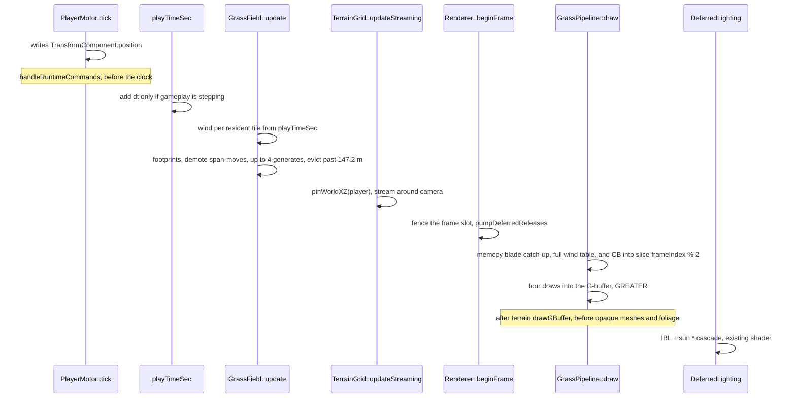
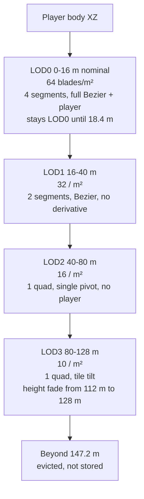
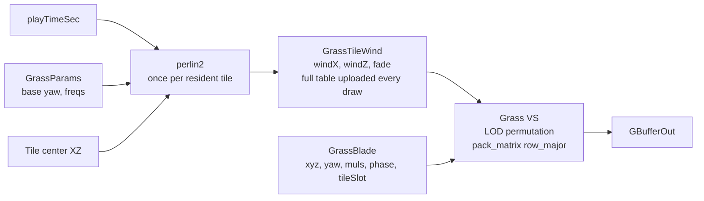

# Procedural grass and wind

| Field | Value |
|-------|--------|
| **Title** | Procedural grass blades, tiled LOD, and per-tile wind for DarkEngine6 |
| **Author** | Travis Johnston |
| **Date** | 2026-10-08 |
| **Status** | Accepted. Implemented by execute-plan b3219183 PRs 1–8. |
| **Area** | `Terrain/` (CPU field, wind, mesh build), `Render/GrassPipeline`, `content/shaders/GrassGBuffer.hlsl`, `Scene/SceneTypes.h`, `Sandbox/SandboxApp.cpp`, `UnitTests/Terrain/` |
| **Audience** | Engine and Sandbox owners who already know the geomipmap, the four-channel splat, `FoliagePipeline`, and reverse-Z |

No C++ exceptions. Failure is `bool` plus `DE_LOG_ERROR` / `DE_LOG_WARN` / `DE_LOG_INFO` (`Core/Log.h`, category `LogCategory::Render`). Programmer mistakes use `DE_ASSERT`. `noexcept` on special members is fine. Allman braces, 4-space indent, C++23, clang-format column limit 200. Sample code below follows that rule: no `try`, `catch`, `throw`, or `std::exception`.

HLSL written for this feature must use `0.0.xxx` forms (`0.0.xxx`, `float3(0.0, 0.0, 0.0)`). FXC error X3000 rejects `0.xxx`.

---

## Overview

The live grass is not a blade system. `FoliageKind::Grass` is a density spawn of one alpha-mask tuft from `models/Grass/grass_medium_01_2k.gltf`. `FoliagePipeline::partLocalToRoot` multiplies Grass and Flower by `ScaleMatrix(10)`. The glTF comment says those assets are authored at about a tenth of a metre, so the drawn tuft is a ×10 card, on the order of a metre. `FoliagePipeline` gathers at most `kMaxFoliageDraw` (65,536) instance matrices inside 96 m. That buffer cannot hold the blade cap, and the tufts do not bend.

This design adds a second system: procedural ribbon blades, instanced, generated on demand in 8 m tiles around the **player**, not around the editor fly camera and not on the 512 m terrain streaming grid. Four geometry LODs drop segment count and, with the same step, drop the wind and player math in the vertex shader. A CPU Perlin sample, once per tile per frame, supplies a wind direction that neighboring tiles cannot flip 180 degrees. The player’s body shoves nearby blades; far LODs skip that shove.

The tuft path stays. Blades are the meadow. Tufts stay the sparse hero clumps (`terrain.foliage.grassPerM2`, 0.25 in `content/scenes/level.json`). Nothing in this design deletes `FoliageKind::Grass`, changes the 32-byte `FoliageRecord`, or grows the foliage or terrain root signatures.

There is no runtime compute PSO. Spawn, wind, and LOD selection run on the CPU. Bend runs in the vertex shader. The first `cs_5_0` PSO in the project remains the Editor-offline `TerrainErosionPipeline`.

The resident cap is **1,048,576** blades. A standing full-grass disc inside the **128 m** nominal radius is **741,517** blades (the visual budget below). The four draw regions are sized to the hysteresis lattice, not to that nominal disc, and those regions sum to the cap exactly.

---

## Background & Motivation

### What exists today

| Piece | Location | Fact this design uses |
|-------|----------|------------------------|
| Tuft kind | `Terrain/FoliageFile.h` `FoliageKind::Grass` | Probability is `grassPerM2 *` grass splat weight only (`FoliageSpawn.cpp`). Dirt, rock, and snow place no tufts. Range 0–1. Sidecar records stay 32 bytes. World cap `kMaxFoliageInstances` (12,582,912) is saved props, not GPU blades. |
| Tuft draw | `Render/FoliagePipeline.cpp`, `content/shaders/FoliageGBuffer.hlsl` | `partLocalToRoot` does `local * ScaleMatrix(10)` for Grass and Flower. Row-vector matrices, translation in the last row. `drawDepth` / `drawPreparedDepth` skip `FoliageKind::Grass` on purpose. G-buffer is two-sided. No collision. The ×10 scale is on the order of a metre. No in-repo bound records a tuft height past that. |
| Instance load | `content/shaders/FoliageWorld.hlsli` | `StructuredBuffer<float4x4>` ignores `pack_matrix` and promotes translation into `w`. The live shader loads four `float4` rows. A new blade buffer must not repeat the broken load. Translations stay in metres. Cbuffers do honor `pack_matrix`. Every current G-buffer shader sets `#pragma pack_matrix(row_major)`. `GrassGBuffer.hlsl` must too, or `viewProj` / `prevViewProj` transpose and `VelocityUv` breaks. |
| Draw cap | `FoliagePipeline.cpp` `kGatherRadiusM` 96 m, `kMaxFoliageDraw` 65,536 | One matrix is 64 bytes. 65,536 matrices is the tuft path’s ceiling. Do not reuse `m_worlds` for blades. |
| Splat | `Terrain/SplatMap.h`, `SplatMap.cpp` | Gameplay channels are R dirt (0), G grass (1), B rock (2), A snow (3). `sampleWeights` is bilinear in sample space and renormalizes when the sum is above `1e-5`. An invalid map writes four zeros. An all-zero texel stays zero. |
| World Engine remap | `Terrain/WorldEngineMap.cpp` `canonicalSurface`, `loadWorldEngineDirectory` | `content/terrain/HurricaneRidge/surfaces.json` lists `["rock","snow","dirt","grass"]`, so file A becomes gameplay grass. Grass placement reads the remapped `SplatMap`, never the file channel order. |
| Height | `Terrain/HeightMap.h`, `Terrain/TerrainGrid.h` | World Y is `origin.y + raw * heightScale` (`HeightMap::worldY`). `heightAtWorld` clamps to the rim. `tryHeightAtWorld` / `containsXZ` are the off-map tests. `normalAtWorld` is a central difference. `TerrainGrid::heightAtWorld` uses the resident fine tile, else the coarse map. |
| Default scene | `content/scenes/level.json`, `Sandbox/SandboxApp.cpp` | `terrain.source` is `terrain/HurricaneRidge`, `worldSize` 1024, `importHeight` 480, `chunkCells` 64. Load calls `createFromHeightMap` (one grid tile whose cell count is `width - 1`) and `setWorkingSplat`. `editableWorking()` and `editableWorkingSplat()` are both valid for that path. Origin is centered, about (−512, 0, −512). About half the map has negative XZ. |
| Streaming tiles | `Terrain/TerrainTileFile.h`, `TerrainGrid` | Authored streaming tiles are 512 cells (`kTileCells`). `updateStreaming` loads at most one fine tile and rebuilds at most one resident tile per frame when a `Renderer` is present. Grass LOD tiles are not these tiles. |
| Footstep fallback | `Terrain/TerrainGround::at` | A missing height or splat returns the grass layer so footsteps still play. That fallback must not carpet the world in blades. |
| Player | `Character/PlayerMotor.h`, `Sandbox/SandboxApp.cpp` | The possessed body is an entity with `TransformComponent` and `PlayerMotorComponent`. `handleRuntimeCommands` calls `updatePossessed`, which calls `motor->tick` and writes `xf->position`, before `onUpdate` advances the clock. `PlayerMotor::velocity()` is world m/s. `PlayerMotor::state()` is `PlayerMoveState`. The sweep radius in the player update is a local `kRadius` of 0.45 m. `groundOffset` defaults to 0.5 m. Walk 8 m/s, sprint 16 m/s. |
| Camera | `SandboxApp::updateShoulderCamera` | Boom is 2.4 m. Grass is centered on the body, not on `m_viewCamera`. Dev Tools pause (`m_gameplayPaused`) flies the camera and leaves the body where it is. |
| Clock | `Save/ProgressComponents.h` `WorldClockComponent::playTimeSec` | Sandbox adds `dt` only while gameplay is stepping (`!m_gameplayPaused \|\| m_stepGameplay`), and that add runs **after** `handleRuntimeCommands` returns. Sky `timeScale` in `level.json` is 0, so `SkySceneDesc::timeOfDay` does not advance. Wind uses `playTimeSec`, not the sky clock and not wall time. |
| Frame dt | `Core/Application.cpp` | `dt` is replaced only when it is negative or above 0.25 s. There is no 60 Hz lock. A 30 Hz frame (`dt ≈ 0.033`) passes through. Tile rates below are `tiles_per_frame / dt`. |
| Depth | `Render/DepthState.h` | Reverse-Z is always on. Scene compare is `sceneDepthFunc()` (`GREATER`). Clear is `kDepthClear` (0). Sky is `EQUAL` at 0. No `SV_Depth` write. |
| G-buffer | `content/shaders/GBuffer.hlsli`, `FoliageGBuffer.hlsl` | `GBufferOut` is albedo (emissive in alpha), octahedral normal + roughness + metallic, `VelocityUv`, AO. `DeferredLighting.hlsl` then applies IBL plus the directional sun times the cascade shadow. Local lights are a later volume pass. Foliage does not have its own lighting model. |
| Terrain RS | `Render/TerrainPipeline.cpp` | The terrain G-buffer root signature is at the 64 DWORD cap (`TerrainGBufferConstants` is 63 floats plus one descriptor table). Grass does not add a root parameter to it. |
| GPU lifetime | `Render/Mesh.h` `GpuMeshRetire::kFrames` (3), `Renderer::deferRelease`, `Renderer::submitBufferCopies` | Do not destroy a buffer the previous command list still references. `Renderer::deferRelease` sets `framesLeft = kFrameCount + 1`, and `kFrameCount` is 2, so destruction also waits 3 frames. `submitBufferCopies` copies whole resources from offset 0 only (one or two buffers). It is the wrong tool for a 32 MiB sub-range update. Foliage already binds a persistently mapped UPLOAD heap as a root SRV (`FoliagePipeline::uploadWorlds`, slot = `renderer.frameIndex() % kFrameCount`, `kFrameCount == Renderer::kFrameCount` which is 2). `beginFrame` waits `m_fenceValues[m_frameIndex]` before that slot is reused. |
| Noise | `Terrain/TerrainGen.h` `hash21`, `Terrain/TerrainGen.cpp`, `HeightMap.cpp` | `hash21(int, int, uint32_t)` returns `[0, 1)` from the low 24 bits and is public. `ValueNoise` in `HeightMap.cpp` is a private value-noise helper, not Perlin, and not callable. `TerrainGen.cpp` also has a file-local `GradientNoise` inside an anonymous namespace: IQ gradient noise (quintic fade, `Hash2`, analytic derivatives). It is not `hash21`, it is not declared in a header, and it is not the wind API. Do not call it and do not copy it into `perlin2`. There is no public Perlin in `Math/`, `Terrain/`, or `Core/`. |
| Curves | `Math/Curves.h` | `BezierQuadratic` exists. The shared grass algebra is `grassTipOffset` plus `grassBladeLocal` in `Terrain/GrassBend.h`, duplicated in `content/shaders/GrassBend.hlsli`. Tests call the C++ functions. The shader does not link `Curves.h`. |
| Markers | `Render/Profile.h`, `GpuScope` | Sandbox G-buffer scopes use `ProfileColor`. Grass gets its own scope. |

Wind, hand-edit, and impostors were explicit non-goals of the foliage-density design (`Terrain/DESIGN-foliage-density.md`). This document is the wind and blade follow-up. It does not change geomipmap LOD, the 14-slot terrain heap, the DEHF cap, or the foliage sidecar.

### Pain

- Filling the meadow with tuft cards would blow `kMaxFoliageDraw`, the 96 m gather, and the shadow and overdraw budgets. The tuft is one ×10 card, on the order of a metre, not a blade.
- Uniformly scaling that card to “be grass” cannot LOD the vertex count or the animation, and it cannot bend a chain of segments.
- A single global wind vector cannot show a field that changes direction across a ridge. A per-blade Perlin sample cannot hit the blade cap on the CPU, and it is the wrong place to keep neighboring tiles coherent.

---

## Goals & Non-Goals

### Goals

- Instanced procedural blades, generated as the player moves, with a resident cap of **1,048,576** blades. The standing full-grass visual budget inside 128 m is **741,517** blades, **2,062,094** triangles, **3,545,128** vertex-shader invocations (arithmetic below).
- Four LODs. Each step reduces segments and the vertex-shader wind cost together. Draw regions are sized to the hysteresis lattice and still sum to the cap.
- Mean height and mean flexibility, live, with per-blade variation around those means.
- One low-frequency Perlin wind sample per grass tile per frame, uploaded every draw. Direction stays spatially coherent. Time base is `playTimeSec`.
- Blades near the player’s feet bend away from the body and recover after the player leaves, without storing a bend per blade.
- Sandbox play, hybrid deferred only. Same G-buffer layout as foliage so existing deferred lighting, IBL, and cascade receive-shadows apply.
- If grass init or a buffer create fails, log, draw nothing, and leave terrain, water, tufts, and the rest of the frame running.
- CPU unit tests for wind coherence, seeding, LOD choice, parameter clamps, the blade curve, and negative-origin tile indices. No GPU required for those tests.

### Non-goals

- Replacing or resimulating `FoliageKind::Grass` tufts. They stay spawned, saved, and drawn.
- Editor viewport and Editor play (`EditorPlay.cpp`). v1 is Sandbox only. A fly camera must not be the grass center.
- NPC bend behavior. The constant block has four interactor slots; v1 writes only the player into slot 0. `AiSystem` is not queried.
- Blade collision, blade shadows that **cast**, a grass sidecar, and a saved blade per square metre of a 4 km map.
- Runtime `cs_5_0` culling, skinning, or wind. No UAV on the G-buffer.
- Growing `TerrainPipeline` or `FoliagePipeline` root signatures.
- Coupling grass to `SkySceneDesc::windDir` / `windSpeed` every frame. Those drive clouds. The default grass yaw is a copied constant, not a live binding.
- Dirt, rock, or snow growing this grass. See Key Decisions.
- A forward-path grass shader. Non-deferred frames draw no blades.
- Hand-painted blade edits, impostor cards, and compute-generated meshes.

---

## Key Decisions

1. **New types, not a mode of `FoliagePipeline`.** CPU field is `Dark::Terrain::GrassField`. GPU owner is `Dark::GrassPipeline`. Tufts keep `FoliageKind::Grass`. The 65,536 matrix SRV is the wrong shape and the wrong cap. The blade cap stays **1,048,576**, split into four regions that match the hysteresis lattice (21 / 96 / 323 / 680 tiles).
2. **Tufts stay as hero clumps.** `grassPerM2` 0.25 still places the ×10 cards, on the order of a metre. Blades are the ground cover under and between them. Draw order is terrain, then blades, then the existing opaque and foliage draws, so a tuft card and the player body win depth where they are closer. v1 does not delete the tuft spawn, the grass glTF, or the `drawDepth` skip.
3. **No runtime compute.** The blade cap is a vertex-shader problem plus a CPU tile spawn. Steady state generates at most **four** tiles per frame (creates and promotions). Demotions are span moves and do not spend that budget. A compute cull would be the first runtime `cs_5_0` PSO on `Renderer::commandList()`, which the erosion rule forbids. Tile LOD already cuts the count; see the budget. If a capture later misses the GPU target, the first knobs are `densityScale` and the **128 m** outer radius, not a compute pass.
4. **Wind is a new public `perlin2`, CPU, once per tile.** The lattice hash is `Terrain::hash21`. `ValueNoise` is private value noise. `GradientNoise` in `TerrainGen.cpp` is private IQ gradient noise with `Hash2` and analytic derivatives; it is not callable and it is not this function. Direction is a base yaw plus a bounded deflection, not a normalized noise vector (those flip when they pass through the origin). `perlin2` returns a value clamped to `[-1, 1]`.
5. **Height stretches the blade axis only.** Width stays in metres on the mesh. Uniform scale would thicken the ribbon when the user asks for taller grass and would burn overdraw. Flexibility is a multiplier on tip displacement for both wind and the player. One knob, not two.
6. **Blades are world-up, not normal-aligned.** Slope is a spawn gate (`normal.y < 0.80` rejects, about 37 degrees from horizontal). Aligning every blade to the normal would fight the bend formula. Rock and snow weights reject as well. Dirt does not spawn blades: the user asked for grass, tufts already key off channel 1 only, and dirt is the path surface in `content/terrain/ground.json`.
7. **Missing terrain is an empty field.** Do not copy `TerrainGround::at`’s grass fallback. No height, no splat, or `!TerrainGrid::valid()` means zero tiles.
8. **Instance records are 32-byte POD rows, not `float4x4`.** The shader never loads `StructuredBuffer<float4x4>`. Positions are world metres. The grass cbuffer is a different path and **does** set `#pragma pack_matrix(row_major)`.
9. **GPU writes use one fenced upload slice; destruction waits three frames.** After `beginFrame`, memcpy blade catch-up, the full wind table, and the constant buffer into `frameIndex() % 2` only, then bind that slice. Do not store into `(frameIndex() % 2) ^ 1` on that frame. The bound slice is current after the catch-up copy. Destroyed meshes and heaps go through `Mesh::deferRelease` / `Renderer::deferRelease`. Both `GpuMeshRetire::kFrames` and `framesLeft = kFrameCount + 1` are 3. Streaming eviction does not `waitForGpu` and does not `Reset()` a buffer the last list still names.
10. **Grass does not cast shadows.** Tufts already skip `drawDepth` because a field of cards is the wrong shadow load. A field of blade casters is worse. Blades still **receive** sun shadows by writing the G-buffer. The visual cost is no blade-on-ground contact shadow and no blade self-shadow. That is accepted.
11. **v1 host is Sandbox, hybrid deferred, player-centered.** Editor is unchanged. The paused fly cam does not move the tile ring.
12. **JSON default is off when the block is absent.** `content/scenes/level.json` turns it on in the Sandbox hookup PR, not earlier. A failed `GrassPipeline::create` forces the session off and does not `DE_LOG_FATAL`. Terrain material failure is still fatal; grass failure is not. `create` takes `Renderer&`, because mesh upload and `deferRelease` need the renderer, not a bare device pointer.

---

## Proposed Design

### Blade mesh

A blade is a flat ribbon in the XY plane: local +Y is up the blade, local +X is width, local +Z is the authored normal. The mesh stores a **unit** blade. `position.y` is `t` in `[0, 1]` from root to tip, not metres. `position.x` is the tapered half-width in metres. `position.z` is `0.0`. The vertex shader applies height, yaw, and bend. Width does not scale with the height knob.

Half-width is `0.035 * (1 - t) + 0.004 * t` metres. Full width is **7 cm at the root and 8 mm at the tip** (half-width 0.035 m to 0.004 m). The tip is not a zero-area point. Per-blade width jitter is **not** in the mesh; it is omitted in v1 so one mesh serves every blade. Yaw variation is what breaks up the field.

Four `Mesh` objects are built by `Terrain/GrassMesh.cpp` into `MeshData` (no D3D12 types in that file). LOD2 and LOD3 share **one** mesh object and differ only by shader permutation. `GrassPipeline::create` uploads the meshes with `Mesh::tryCreate(Renderer&, const MeshData&, Mesh&)`. Input layout matches `MeshVertex` (48 bytes): POSITION, NORMAL, TEXCOORD0, TANGENT, the same elements `FoliagePipeline` declares. Normals on the mesh are `(0, 0, 1)`. Tangents are `(1, 0, 0, 1)`. UV.y is `t`. UV.x is 0 on −X and 1 on +X. Index winding puts +Z as the front face. The PSO sets `FrontCounterClockwise = TRUE` and `CullMode = NONE`, copied from the foliage two-sided G-buffer PSO. `SV_IsFrontFace` flips the normal in the pixel shader, as `FoliageGBuffer.hlsl` does.

| LOD | Segments | Vertices | Triangles | Indices | `t` joints |
|-----|----------|----------|-----------|---------|------------|
| 0 | 4 | 10 | 8 | 24 | 0, 0.25, 0.50, 0.75, 1 |
| 1 | 2 | 6 | 4 | 12 | 0, 0.50, 1 |
| 2 | 1 | 4 | 2 | 6 | 0, 1 |
| 3 | 1 | 4 | 2 | 6 | 0, 1 |

Index counts are triangle-list counts (3 × triangles). `Mesh::drawInstanced` uses the index count. LOD2 and LOD3 share the index buffer of the one quad mesh.

Each segment is two triangles (left/right at `t`, left/right at the next `t`). `buildGrassBladeMesh(int lod, MeshData& out)` returns false on a bad lod. Vertex and index counts above are the test contract. LOD3’s mesh build returns the same `MeshData` counts as LOD2; the pipeline still uploads one shared quad.

### How height and bend move a vertex

The instance `x, y, z` **is** the lifted world root. At spawn only, the root is lifted 1.5 cm along the ground normal and baked in:

```text
x = worldX + normal.x * 0.015
y = heightAtWorld + normal.y * 0.015
z = worldZ + normal.z * 0.015
```

The shader does not re-query the heightfield and does not add 0.015 again. Respawn recomputes the lift. No raster depth bias. Reverse-Z bias signs are easy to get wrong; a baked world lift is not. The G-buffer PSO uses `sceneDepthFunc()` and writes depth. It does not write `SV_Depth`.

Rest pose, after yaw, is a vertical ribbon of length `heightMetres * heightMul * fade`. Bend does not uniformly scale that ribbon and does not scale mesh X. The vertex shader evaluates a tip offset, then a blade-local curve, then adds that curve to the instance position after yaw.

One blade-local frame. P0 is local `(0, 0, 0)`. P2 is `(tip.x, yTip, tip.z)` in that frame. Both are metres relative to the instance root, not world Y.

Shared tip offset (metres), CPU function `grassTipOffset` in `Terrain/GrassBend.h` and the same algebra in `content/shaders/GrassBend.hlsli`:

```cpp
struct GrassTipIn
{
    float height = 0.55f;     // metres, already mean * per-blade mul * fade
    float flex   = 0.65f;     // 0 rigid, 1 full yield, already mean * per-blade mul
    float windX  = 0.0f;      // tile wind, metres at flex 1, already phase-scaled on LOD 0-2
    float windZ  = 0.0f;
    float shoveX = 0.0f;      // player + footprints, metres at flex 1; 0 on LOD 2 and 3
    float shoveZ = 0.0f;
};

struct GrassTip
{
    float x = 0.0f;
    float z = 0.0f;
};

inline GrassTip grassTipOffset(const GrassTipIn& in)
{
    GrassTip tip{};
    tip.x = (in.windX + in.shoveX) * in.flex;
    tip.z = (in.windZ + in.shoveZ) * in.flex;
    const float maxLen = 0.85f * in.height;
    const float len2   = tip.x * tip.x + tip.z * tip.z;
    if (maxLen > 0.0f && len2 > maxLen * maxLen)
    {
        const float s = maxLen / std::sqrt(len2);
        tip.x *= s;
        tip.z *= s;
    }
    return tip;
}
```

`flex == 0` yields a zero tip. Wind and shove add before the clamp, so a strong shove cannot fold the blade through the ground past 85% of its height.

Vertical coordinate of the curve keeps the root planted and shortens Y as the tip leans, so the ribbon does not stretch:

```text
tipLen = length(tip.xz)
yTip   = sqrt(max(height * height - tipLen * tipLen, (0.20 * height) * (0.20 * height)))
```

`yTip` is at least `0.20 * height`, so a fully clamped lean still stands. `yTip` is blade-local metres, not a world Y.

`grassBladeLocal` in `Terrain/GrassBend.h` is the curve the tests and `GrassBend.hlsli` both evaluate. It returns blade-local metres. It does not add a second 1.5 cm lift. P0 is the origin on every LOD.

```cpp
struct GrassLocal
{
    float x = 0.0f;
    float y = 0.0f;
    float z = 0.0f;
};

// lod is 0..3. t is in [0, 1]. LOD 3 passes a tip already scaled by mean flex, 0.65, and fade.
inline GrassLocal grassBladeLocal(int lod, float t, const GrassTip& tip, float height);
```

| LOD | Curve from `grassBladeLocal` | Normal | What is skipped |
|-----|-------------------------------|--------|-----------------|
| 0 | Quadratic Bezier. P0 = `(0, 0, 0)`, P2 = `(tip.x, yTip, tip.z)`, P1 = `(tip.x * 0.25, height * 0.55, tip.z * 0.25)`. Evaluate at the vertex `t`. | Analytic tangent (Bezier derivative) crossed with the yawed width axis, then normalize. | Nothing on this list. |
| 1 | Same Bezier, two segments. | Rotated rest normal plus `normalize(n + float3(tip.x, 0.0, tip.z) * t)`. No derivative. | Derivative and cross. |
| 2 | Single pivot. Offset `(tip.x * t, lerp(0.0, yTip, t), tip.z * t)`. One quad. | Same cheap tilt as LOD1, one normalize. | Bezier control point, player, footprints. `shove` is forced to 0 before `grassTipOffset`. |
| 3 | Tile tilt only. The tip passed in is the tile wind times **mean** flex (the CB mean, not the per-blade mul) times `0.65`, times `fade`. Offset `(tip.x * t, lerp(0.0, yTip, t), tip.z * t)`. | Mesh normal after yaw. No normalize. | Per-blade flex mul, per-blade phase, player, footprints, Bezier, normalize. |

After the curve, yaw the ribbon width with the 2×2 from the instance yaw, then add `GrassLocal` to the instance position. Wind direction does not depend on which way the ribbon faces, because the bend offset is applied in world XZ after yaw.

ALU class per vertex, targets not captures: LOD0 **high** (~60 ALU, includes the interactor loop), LOD1 **medium** (~35), LOD2 **low** (~15, no loop), LOD3 **tiny** (~8, two madds and the yaw). The interactor loop is compiled out of the LOD2 and LOD3 permutations (`GRASS_LOD` 2 and 3). Four PSOs, one root signature.

Per-blade `phase` in `[-1, 1]` scales the **pre-clamp** wind by `lerp(0.85, 1.15, phase * 0.5 + 0.5)` on LOD0–2 only. It does not sample time. LOD3 ignores it, which is a small magnitude pop at 80 m and is accepted. Phase is not a `sin(time + phase)` term; that term is exactly what LOD3 would have to drop, and it would shimmer. Phase is not a packed normal. `GrassBlade` has no `rootNx` / `rootNz`.

Distance fade is a tile constant, not a per-blade sample. If the tile-center distance `d` is above **112 m**, `fade = saturate((128 - d) / 16)`. Otherwise `fade = 1`. Height is multiplied by `fade` before `yTip`. The value is stored in `GrassTileWind.fade` and uploaded with the wind table. LOD3 tiles past 112 m shrink across the last 16 m instead of popping at 128 m. Tiles inside 112 m store `fade = 1`.

Yaw: `RotationMatrixY` convention (identity faces +Z). The shader builds the 2×2 yaw from `sin` / `cos` of the instance yaw and rotates the width axis. It does not load a matrix from a structured buffer.

Previous-frame position for `VelocityUv` re-evaluates the same curve with the previous tile wind and the previous interactor block (both are in the buffers described below). LOD3 still does this; it is two extra madds. Do not leave `prevClip` equal to the current clip or TAA smears the field.

### Instance record

```cpp
struct GrassBlade
{
    float    x         = 0.0f; // world metres, lifted root, baked at spawn
    float    y         = 0.0f;
    float    z         = 0.0f;
    float    yaw       = 0.0f; // radians
    float    heightMul = 1.0f; // multiplies GrassParams::heightMetres
    float    flexMul   = 1.0f; // multiplies GrassParams::flexibility
    float    phase     = 0.0f; // [-1, 1], bend-magnitude jitter, LOD0-2 only
    uint32_t tileSlot  = 0;    // index into the tile wind buffer, stable across LOD moves
};

static_assert(sizeof(GrassBlade) == 32, "grass blade");
```

The mean height and mean flexibility live in the constant buffer, not in the blade. Dragging the slider does not rebuild tiles. `heightMul` is `lerp(0.70, 1.30, hash)` and `flexMul` is `lerp(0.80, 1.20, hash)`, both from the tile seed. The shader does `height = heightMetres * heightMul * fade`, `flex = saturate(flexibility * flexMul)`. Mesh `position.x` is not multiplied by `height`.

`tileSlot` is how a blade finds its wind without a 4×4 matrix and without a per-blade Perlin. The shader reads `GrassTileWind gTiles[blade.tileSlot]`. A LOD move keeps `tileSlot` stable.

What is **not** stored: world matrix, segment rotations, current bend, time, splat weight, ground normal. Bend is derived. Splat is a spawn gate only. The normal was consumed when the lift was baked.

Alignment: 32 bytes, natural for a structured buffer. The HLSL struct is the same eight fields, not a `float4x4`.

```hlsl
struct GrassBlade
{
    float x;
    float y;
    float z;
    float yaw;
    float heightMul;
    float flexMul;
    float phase;
    uint  tileSlot;
};

StructuredBuffer<GrassBlade> gBlades : register(t0);
```

`SV_InstanceID` is the index inside the LOD range. The root SRV GPU virtual address for that draw is the first blade of that LOD, so the shader indexes `gBlades[iid]` from 0. Do not use `StartInstanceLocation`. In D3D, `SV_InstanceID` does not include it, and foliage already works around that with an index SRV. A separate index buffer is unnecessary if each LOD’s blades are packed contiguously and the SRV starts at that pack.

### Tile grid

Grass tiles are **8 m × 8 m**, world-aligned. Hurricane Ridge is centered near (−512, 0, −512), so about half of the tile indices are negative. The index is `std::floor` of the division, not a cast and not integer division (both truncate toward zero and split the negative axes):

```cpp
const int tileX = static_cast<int>(std::floor(worldX / 8.0));
const int tileZ = static_cast<int>(std::floor(worldZ / 8.0));
```

Examples: `worldX = -0.1` → tile −1, not 0. `worldX = -8.0` → tile −1. `worldX = -8.01` → tile −2. `hash21` is fine on those negative ints: it casts to `uint32_t` before the mix. Tile origin is `tileX * 8` metres. This grid is not `TerrainGrid`’s tile index and not the 512 m `kTileCells` grid.

The ring is centered on the possessed body’s XZ. Camera position is not an input. If `possessedBody()` is invalid, the field does not admit tiles and does not follow `m_viewCamera`.

Nominal bands are the LOD a **new** tile is created at. Hysteresis then moves an existing tile by one step. `d` is the distance from the player XZ to the tile center.

| LOD | Nominal `d` | Keep predicate on candidate `i` in `0 .. 4095` | Accepted at scale 1 | Blades / m² |
|-----|-------------|--------------------------------------------------|---------------------|-------------|
| 0 | `d <= 16` | all that pass gates | 4096 | 64 |
| 1 | `16 < d <= 40` | `(i % 32) < 16` | 2048 | 32 |
| 2 | `40 < d <= 80` | `(i % 32) < 8` | 1024 | 16 |
| 3 | `80 < d <= 128` | `(i % 32) < 5` | 640 | 10 |

`(i % 32) < 5` is a subset of `< 8`, `< 16`, and `< 32`. A promotion adds blades. A demotion filters blades that already exist. Survivors keep their XZ. `i = iz * 64 + ix` with `ix, iz` in `0 .. 63`, so the survivors are spread across the tile and not packed into one corner.

Hysteresis edges are 0.85× and 1.15× the nominal band edges:

| Edge | × 0.85 promote | × 1.15 demote or evict |
|------|----------------|------------------------|
| 16 m | 13.6 m | 18.4 m |
| 40 m | 34 m | 46 m |
| 80 m | 68 m | 92 m |
| 128 m | (no finer band past create) | **147.2 m evict** |

An existing tile promotes one step when `d` drops below 13.6 / 34 / 68, and demotes one step when `d` rises above 18.4 / 46 / 92. A jump across two bands takes two updates; each update moves one step. Evict when `d > 128 * 1.15` (147.2 m). Eviction is bookkeeping and may drop every outside tile in one frame. It does not spend a generate slot and it does not destroy the GPU buffer.

Create only when the center is inside **128 m** and inside `containsXZ`. Do not create out to 147.2 m. The extra ring is linger room so a tile the player just left does not pop back the moment `d` crosses 128.

Candidate placement, stable for a `(tileX, tileZ, seed)`:

```text
cell = 8 / 64          // 0.125 m
jx = (hash21(i, 1, tileSeed) - 0.5) * cell * 0.70
jz = (hash21(i, 2, tileSeed) - 0.5) * cell * 0.70
worldX = tileOriginX + (ix + 0.5) * cell + jx
worldZ = tileOriginZ + (iz + 0.5) * cell + jz
tileSeed = hash21(tileX, tileZ, params.seed ^ 0x6A11C3u) interpreted as the float’s 24-bit mantissa, stored as uint
```

`hash21` returns a float. The tile seed used as the next `hash21` seed is `static_cast<uint32_t>(hash21(...) * 16777216.0f)`. Same inputs, same blades. Do not call `rand`.

Spawn gates, all must pass, evaluated in this order:

1. `TerrainGrid::containsXZ`. Outside is a reject. Do not use the clamped rim of `heightAtWorld`.
2. Sample height and normal. Prefer `editableWorking()` when `valid()` (the Hurricane Ridge path keeps the full map there after `createFromHeightMap`). Otherwise `TerrainGrid::heightAtWorld` and `normalAtWorld`.
3. Splat. Prefer `editableWorkingSplat()` when `valid()`. Otherwise `residentSplat(tx, tz)`, a new accessor that returns the resident tile’s `SplatMap` or null. `worldToSample` then `sampleWeights`. If no splat is available, **skip the tile** and log once. Do not treat a null splat as grass.
4. Reject unless grass weight (channel 1) is `>= 0.35`.
5. Reject if rock weight `> 0.55` or snow weight `> 0.45`, even when some grass remains in the texel.
6. Reject dirt-only ground. A texel with grass `< 0.35` already failed step 4. Dirt is not a second density.
7. Reject if `normal.y < 0.80`.
8. Reject if the unlifted surface Y is below `waterLevel` (`WaterWorld` `params().waterLevel`, the Sandbox sea; `level.json` uses 100.4 m). This is the same “entire map, one surface” test `spawnFoliage` applies via its file-local `coveredByWater` on the World Engine path. Do not call that function; it is private to `FoliageSpawn.cpp`. Editor water bodies are out of scope.
9. The keep predicate for the tile’s LOD.

An all-zero `sampleWeights` result (invalid map, or a zero texel that does not renormalize) fails the grass threshold. `TerrainGround::at` returning grass when the map is missing is intentionally not used.

`densityScale` (default 1, clamp `[0, 1.5]`) changes the predicates, not the gates. At 1 the table above holds. At 0 the field admits nothing. Other values scale the `% 32` thresholds: `keep = (i % 32) < round(baseKeep * densityScale)` with `baseKeep` of 32 / 16 / 8 / 5, and the result clamped to `[0, 32]`. LOD0’s base is already every candidate (`round(32 * scale)` clamps at 32), so scale cannot put more than 4096 blades on an LOD0 tile. Regions below are sized for scale 1. Above 1 the field is **best-effort**: if the scaled keep does not fit in that LOD’s free slots, use the largest threshold `k` that fits and is still at least the scale-1 base; if even the scale-1 count does not fit, skip the tile. Do not claim scale 1.5 admits another 50%. Changing `densityScale` or `seed` marks every resident tile dirty. Regeneration consumes the generate budget, closest first.

### Resident count

#### Nominal visual budget

Full grass, `densityScale` 1, every candidate passes the gates, player standing so each tile sits in its nominal band. Area uses `π = 3.141592653589793`. Blade counts round half away from zero (every fractional part here is in `(0.3, 0.9)`, so the rounding mode does not change the integer). Triangle and vertex totals multiply those integers. This is the **standing visual target**, not a measurement, and it is not the region size.

| Band | Area | Blades | Tris / blade | Tris | VS verts / blade | VS invocations |
|------|------|--------|--------------|------|------------------|----------------|
| 0–16 m | `π·16² = π·256 = 804.248` | `round(804.248·64) = round(51,471.85) = 51,472` | 8 | 411,776 | 10 | 514,720 |
| 16–40 m | `π·(40²−16²) = π·1,344 = 4,222.301` | `round(4,222.301·32) = round(135,113.61) = 135,114` | 4 | 540,456 | 6 | 810,684 |
| 40–80 m | `π·(80²−40²) = π·4,800 = 15,079.645` | `round(15,079.645·16) = round(241,274.32) = 241,274` | 2 | 482,548 | 4 | 965,096 |
| 80–128 m | `π·(128²−80²) = π·9,984 = 31,365.661` | `round(31,365.661·10) = round(313,656.61) = 313,657` | 2 | 627,314 | 4 | 1,254,628 |
| **Total** | | **741,517** | | **2,062,094** | | **3,545,128** |

Check: `51,472 + 135,114 + 241,274 + 313,657 = 741,517`. `411,776 + 540,456 + 482,548 + 627,314 = 2,062,094`. `514,720 + 810,684 + 965,096 + 1,254,628 = 3,545,128`.

Partial grass weight only rejects candidates, so the count falls with the meadow, not with a second world-sized allocation. A 4 km map does not store a blade per square metre. Tiles outside 147.2 m do not exist. This nominal total is **under** the cap. It does not by itself prove the hysteresis regions fit. The next section is that proof.

#### Why the outer radius is 128 m

A nominal outer edge of 160 m does not leave a region layout that also survives hysteresis. The 80–160 m band alone is `π·(160²−80²) = π·19,200 = 60,318.6` m² × 10 = 603,186 blades before any hysteresis widen. The hysteresis evict radius at that edge would be `160 × 1.15 = 184` m. The LOD3 set `(92, 184]` has area `π·(184²−92²)/64 = π·25,392/64 = 1,246.7` tiles. At 640 blades each that is about 797,900 blades. The inner finest-hysteresis maxima below already need `21×4096 + 96×2048 + 320×1024 = 610,304` blades. `610,304 + 797,900` is about **1.41 million**, past 1,048,576. The outer nominal edge in this design is **128 m**, and eviction is **147.2 m**.

#### Hysteresis regions

Each draw is one contiguous range, so spare blades in LOD0 cannot be loaned to LOD3. Size each region to the finest-hysteresis lattice maximum of that band: every overlap kept at the finer LOD, which is what a path that has already promoted and then stopped produces (`d_min` small, then demote only past 18.4 / 46 / 92 / 147.2).

Lattice method, so this can be rechecked: tile centers at `8·i + 4`, player offset swept across one 8 m tile. A 0.25 m step and a 0.5 m step produce the same maxima below.

| Band | Distance test | How the 21 is counted / sweep max | Tiles | Blades |
|------|---------------|-------------------------------------|-------|--------|
| LOD0 | `d <= 18.4` | Player on a tile center. Centers at `8·(ix, iz)` with `sqrt(ix²+iz²) <= 2.3`: `(0,0)` 1, axis-1 4, diagonal-1 4, axis-2 4, `(±2,±1)` and `(±1,±2)` 8. `(±2,±2)` is `8·√8 ≈ 22.63 > 18.4`. | **21** | `21 × 4096 = 86,016` |
| LOD1 | `18.4 < d <= 46` | Sweep max. Area `π·(46²−18.4²)/64 = π·1,777.44/64 ≈ 87.3` undercounts the lattice. The full disc `d <= 46` is 112 lattice tiles, not 87. | **96** | `96 × 2048 = 196,608` |
| LOD2 | `46 < d <= 92` | Sweep max. | **320** | `320 × 1024 = 327,680` |
| LOD3 | `92 < d <= 147.2` | Sweep max. | **654** | `654 × 640 = 418,560` |

Sum of those blade maxima: `86,016 + 196,608 + 327,680 + 418,560 = 1,028,864`. Spare against the cap: `1,048,576 − 1,028,864 = 19,712` blades.

Those four maxima are not simultaneous (the LOD1 peak and the LOD0 peak happen at different player offsets). Each one **is** reached at some offset, so each region must be at least that big. A straight-line sprint, with tiles created at the nominal band and promoted only inside 68 / 34 / 13.6, peaks lower: about 14 / 66 / 230 / **626** tiles. `626 <= 654`. The looser annulus `(68, 147.2]` is 844 tiles and is **not** a sizing target. A tile inside 92 m is not demoted into LOD3, and a new tile is created at its nominal band, so that 844-tile set is not what the transition rule stores.

Region sizes, still summing to `2^20`. LOD3’s tile count is a multiple of 8 so `640 × n3` is a multiple of 1024 (`640/1024 = 5/8`). Put the spare on LOD3 and the leftover unit on LOD2:

```text
n3 = 680 = 654 + 26          (680 is a multiple of 8, 680 >= 654)
680 × 640 = 435,200
remainder = 1,048,576 − 435,200 = 613,376
613,376 / 1024 = 599
LOD0 takes 21 × (4096/1024) = 21 × 4 = 84
LOD1 takes 96 × (2048/1024) = 96 × 2 = 192
LOD2 takes 599 − 84 − 192 = 323
323 × 1024 = 330,752
323 − 320 = 3 spare LOD2 tiles
```

| Region | Slots | Tiles × blades | Spare tiles over the lattice max |
|--------|-------|----------------|----------------------------------|
| LOD0 | 86,016 | 21 × 4096 | 0 |
| LOD1 | 196,608 | 96 × 2048 | 0 |
| LOD2 | 330,752 | 323 × 1024 | 3 |
| LOD3 | 435,200 | 680 × 640 | 26 |
| **Sum** | **1,048,576** | | |

`86,016 + 196,608 + 330,752 + 435,200 = 1,048,576`. Each slot count equals `tiles × blades-per-tile`. There is no global spare that a full region can borrow.

If a create or a promotion does not fit in the destination region, skip that tile (a resident tile keeps its current LOD; a missing tile is not created) and try the next closest. One `DE_LOG_WARN` per LOD the first time the region refuses an admit. Do not drop existing blades to make room. A demotion into a full coarser region keeps the current LOD for the same reason. Closest work wins the generate budget below.

Tile slots in the nominal disc: area `π·128²/64 = π·256 = 804.2`, lattice maximum **812**. The linger disc `d <= 147.2` has lattice maximum **1,069**. The tile-wind table is allocated for **2,048** slots, not grown per frame. `2048 >= 1069`.

Memory, targets:

| Buffer | Size |
|--------|------|
| CPU shadow `vector<GrassBlade>` | 1,048,576 × 32 = 32 MiB |
| GPU instance UPLOAD, 2 slices | 64 MiB |
| Tile records, CPU, 2,048 × 48 B | ~96 KiB |
| Tile wind UPLOAD, 2 slices × 2,048 × 16 B | 2 × 32,768 = 65,536 B |
| Constant buffer, 2 slices × 768 B (528 B struct, 256-aligned) | 1,536 B |
| Four blade meshes (LOD2 and LOD3 share one) | < 2 KiB |

Peak GPU upload for instances is **64 MiB**. That is the budget. Do not allocate a third slice. The wind **allocation** is 64 KiB because two slices exist. The wind **copy** each draw is one slice, 32,768 bytes. See the constant-buffer arithmetic under Player interaction for why the CB stride is 768 and not 256.

### Generation policy

`GrassField::update` runs on the main thread from `SandboxApp::onUpdate`, next to `syncTerrainLod`. By then `handleRuntimeCommands` has already ticked the motor, and the gameplay-step block has already added `dt` to `playTimeSec` when gameplay is stepping. The update does not start a worker. Foliage spawn is a one-shot worker; grass is the opposite, a bounded amount of work every frame.

Per frame, in order:

1. If the session flag is off, or the grid is not `valid()`, or the pipeline failed create: return. Do not spawn.
2. Sample wind for every **resident** tile (below). About 800 samples standing inside 128 m (lattice max 812) and at most 1,069 while tiles linger to 147.2 m. This is not gated by the generate budget. The results must be uploaded every draw or the sample is wasted.
3. Decay footprints. Place a new footprint when the player moved more than 0.35 m while shoving.
4. Demote tiles that have crossed 18.4 / 46 / 92, one step each. A demotion **filters** the existing subset and moves the span. It does not resample the candidates it keeps, and it does **not** spend a generate slot. Cap demotion span-moves at **8 per frame** (closest first). A 16 m/s sprint crosses the three demote rings at `(2·v/64)·(18.4+46+92) = (16/32)·156.4 = 78.2` tiles/s, about 1.3/frame at 60 Hz and 2.6/frame at 30 Hz, so 8 is headroom. If the destination region is full, keep the current LOD and do not drop the tile.
5. Evict every resident tile with center distance above 147.2 m. Swap-remove those blades, append the byte ranges to the blade dirty log, and free the tile record. Do not destroy the GPU buffer. Eviction is not capped at 8; a teleport may drop the whole ring’s bookkeeping in one frame.
6. Build the generate list: promotions (a finer LOD needs blades that are not stored) and missing tiles whose center is inside 128 m and inside `containsXZ`. Sort closest first. Take at most **4** of them this frame in steady state. A promotion resamples only the predicate bits the coarser tile did not keep: LOD3→2 adds `(i % 32) ∈ {5, 6, 7}` (384 candidates), LOD2→1 adds 1,024, LOD1→0 adds 2,048. A create walks all 4,096 candidates and keeps the predicate. Do not split one tile across frames.
7. One LOD step per generate. A tile that must climb two bands takes two frames and two slots.

Warm-up, while any missing tile or pending promotion has center distance under **48 m**: the generate cap is **8**, still closest first, with no extra “only one of them may be LOD0” rule. Closest-first already prefers the feet. After that disc is caught up, steady state is 4 generates per frame.

#### Sprint arithmetic

New area enters a disc of radius `R` moving at speed `v` at `2·R·v` m²/s. That is the projected width `2R`, not the circumference `2πR`. Circumference is the right shape for a disc that is **expanding**; a translating disc’s leading flux is the width. Dividing the circumference rate by this rate leaves a factor of `π`, which over-counts creates. Tile rate is that area divided by 64 m².

Promotions are the same leading-edge flux through each promote radius. Demotions are the trailing edge and are free, so they are not in the demand.

```text
promote radii = 13.6 + 34 + 68 = 115.6 m
promotions/s  = (2 · v / 64) · 115.6 = (v / 32) · 115.6
creates/s     = 2 · R · v / 64
```

At a sprint `v = 16` and `R = 128`:

```text
promotions/s = (16 / 32) · 115.6 = 57.8
  of which 0.5 · 13.6 = 6.8,  0.5 · 34 = 17.0,  0.5 · 68 = 34.0
creates/s    = 2 · 128 · 16 / 64 = 64.0
demand       = 57.8 + 64.0 = 121.8 tiles/s
```

Supply is `generates_per_frame / dt`. `Application` does not lock 60 Hz.

| Case | Supply | Holds 128 m? |
|------|--------|----------------|
| 4 / frame at 60 Hz | 240 tiles/s | Yes. `240 > 121.8`. |
| 4 / frame at 30 Hz | 120 tiles/s | The leading edge settles inside the fade. `120 = (16/32)·(R + 115.6)` → `R + 115.6 = 240` → **`R = 124.4` m**. That is 3.6 m inside the 128 m create radius and inside the 112–128 m fade, not an empty ring. |
| 1 / frame at 60 Hz | 60 tiles/s | `60 = 0.5·(R + 115.6)` → **`R = 4.4` m**. This is why the steady budget is 4, not 1. |

Walk at 8 m/s is inside the same formula. At 60 Hz with 4/frame, demand at 128 m is `(8/32)·115.6 + 2·128·8/64 = 28.9 + 32 = 60.9` tiles/s, under 240. At 30 Hz the sustainable radius is `120 / (8/32) − 115.6 = 364.4` m, which is past 128, so the walk holds the full ring.

Closest-first is what the formula assumes: promotions are nearer than the rim, so they are served first, and creates get the leftover rate. At 30 Hz that leftover is `120 − 57.8 = 62.2` creates/s, and `62.2 · 64 / (2·16) = 124.4` m. Serving LOD repairs before creates does not starve the rim once the budget is 4; it is the priority the radius math uses.

One LOD0 create is 4,096 candidates. Each candidate is two `hash21` calls, one height sample, one `sampleWeights`. A sprint frame is typically two or three generates, and most of those are a promotion or an LOD3 create (640 kept). CPU target **1.5 ms** for the wind loop plus up to 4 generates on a mid-range desktop. If a later capture is over that, lower the steady cap from 4 before touching the shader and before adding a compute pass. Do not split one tile across frames; a half-written tile would shimmer.

#### LOD span move

Regions are fixed. A tile’s blade count changes with LOD (4096 / 2048 / 1024 / 640). One transition:

1. Allocate the destination span in the destination region. If it does not fit, keep the current LOD (or skip the create) and do not drop the tile.
2. Write the new subset. A promotion writes the blades it kept plus the newly sampled predicate bits. A demotion writes only the kept subset of blades that already exist.
3. Swap-remove the source span inside the source region.
4. Append both byte ranges to the blade dirty log.
5. Keep `tileSlot` stable so the wind row does not move.

Swap-remove of a dead tile **inside one region** is the same tail-fill, and it is not a LOD change. Eviction uses it and then drops the tile record. Eviction does not destroy the GPU buffer.

#### Upload

Upload happens in `GrassPipeline::draw`, after `Renderer::beginFrame`, into the slice `renderer.frameIndex() % 2` only. `beginFrame` has already waited that slot’s fence. The CPU shadow is updated in `GrassField::update` immediately. After the copies below, the slice about to be bound is **current**. Do not describe it as stale, and do not write `(frameIndex() % 2) ^ 1` on that frame. The previous command list still reads the other slice.

Three copies into that slice, in this order:

1. **Blade dirty catch-up.** `GrassPipeline` keeps a dirty log of `(byteOffset, byteCount)` per slice and memcpys every record that slice has not seen. A steady generate dirties one tile. LOD0 is `4096 × 32 = 128 KiB`. That is the blade copy. Do not memcpy the whole 32 MiB instance buffer.
2. **The full wind table.** `2048 × 16 = 32,768` bytes, every draw, not only the rows whose blades were regenerated. `tileSlot` indexes the whole table. A blade-range dirty log does not move wind, and wind is resampled for every resident tile every update.
3. **The whole constant buffer** for this frame (768-byte aligned view; the struct is 528 bytes). Previous-frame interactors are already inside it.

Do not call `submitBufferCopies`. It only copies from offset 0 and would move an entire buffer.

Destruction is a different path from slice reuse:

- `GrassPipeline::destroy` and any failed partial create hand every committed resource to `Renderer::deferRelease` (meshes through `Mesh::deferRelease(Renderer&)`). They do not `Reset()` a buffer in the frame it was bound. `create` stores the `Renderer*` so `destroy` can do this.
- The meshes are not rebuilt in v1.
- Shutdown order matches terrain: do not release grass heaps before in-flight command lists finish. `Renderer::deferRelease` is the mechanism (`framesLeft = kFrameCount + 1`, which is 3, same as `GpuMeshRetire::kFrames`). Do not add a `waitForGpu` on the streaming path. `waitForGpu` stays teardown and resize, as it is for terrain.

Device removed (`GetDeviceRemovedReason` failed): `draw` returns without recording. The next `create` is not attempted until the device is alive again. No throw.

`CreateCommittedResource` failure: `DE_LOG_ERROR` with the HRESULT, `isValid() == false`, draw nothing, leave the tuft pipeline alone.

### Wind

New files: `Terrain/GrassWind.h`, `Terrain/GrassWind.cpp`. Public entry points:

```cpp
namespace Dark::Terrain
{
    // Classic 2D Perlin in [-1, 1]. Lattice hash is hash21. Not GradientNoise.
    float perlin2(float x, float z, uint32_t seed);

    struct GrassWindSample
    {
        float dirX     = 0.0f; // unit XZ, y is 0
        float dirZ     = 1.0f;
        float strength = 1.0f; // 0.45 .. 1
        float yaw      = 0.0f; // radians, atan2(dirX, dirZ)
    };

    GrassWindSample sampleGrassWind(float tileCenterX, float tileCenterZ, double playTimeSec, const GrassParams& params);
}
```

`perlin2` is gradient noise seeded by `hash21`, not `ValueNoise` and not the private `GradientNoise`:

- Lattice cell `(ix, iz) = floor`. Fractional part faded with `t*t*t*(t*(t*6 - 15) + 10)`.
- Four corners. Gradient index is the low 3 bits of `static_cast<uint32_t>(hash21(ix, iz, seed) * 16777216.0f)`, mapped to the eight vectors `(±1, ±1)`, `(±1, 0)`, `(0, ±1)`, then normalized for the diagonals.
- Dot with the vector from the corner to the sample, bilinear lerp of the dots.
- The result is clamped to `[-1, 1]` before it drives yaw. Perlin is not strictly inside that range.

There is no 3D Perlin. Time scrolls the 2D domain along the base wind so gusts travel instead of boiling in place:

```text
scroll = playTimeSec * temporalFreq          // cycles
sx = tileCenterX * spatialFreq + cos(baseYaw) * scroll
sz = tileCenterZ * spatialFreq + sin(baseYaw) * scroll
n  = perlin2(sx, sz, seed)
n2 = perlin2(sx + 19.2, sz + 7.7, seed ^ 0xB5297A4Du)
yaw = baseYaw + clamp(n, -1, 1) * maxDeflection
strength = lerp(0.45, 1.0, clamp(n2, -1, 1) * 0.5 + 0.5)
dir = (sin(yaw), cos(yaw))                   // yaw 0 blows toward +Z, matching RotationMatrixY identity
```

Defaults on `GrassParams`:

| Field | Default | Meaning |
|-------|---------|---------|
| `windBaseYaw` | 1.37 rad | `atan2(1.0, 0.2)`, the same compass as `level.json` `sky.windDir` `[1, 0.2]`, stored as a number. Not read from the sky block at runtime. |
| `windDeflection` | 0.55 rad (~31°) | Peak yaw swing either side of the base. Two neighbors therefore cannot disagree by more than about 62°, and a sample cannot flip 180°. |
| `windSpatialFreq` | 0.004 cycles/m | Wavelength 250 m. An 8 m tile step is 0.032 cycle. |
| `windTemporalFreq` | 0.015 cycles/s | Scroll speed `0.015 / 0.004 = 3.75` m/s along the base yaw. One wavelength takes about 67 s. |
| `windTipMetres` | 0.40 m | Tip displacement at flex 1 and strength 1, before the 0.85·height clamp. |

The tile stores `windX = dirX * strength * windTipMetres`, `windZ = dirZ * strength * windTipMetres`, and `fade` as defined above. That pair is what `grassTipOffset` consumes. Blades do not see `perlin2`.

Coherence check an implementer can do by hand: at 0.004 cycles/m the Perlin gradient is O(1) per noise unit, so 8 m changes the noise by about 0.032 and the yaw by about `0.032 * 0.55 ≈ 0.018` rad (about one degree). The unit test locks a stricter bound (below).

`sampleGrassWind` runs once per resident tile per `update`. The upload copies the whole table every draw, including tiles that were not regenerated. Playing paused freezes `playTimeSec`, so the field holds still, which is what we want.

Sky `windSpeed` (0.04 in `level.json`) is a cloud parameter. It is not multiplied in.

### Player interaction

The interactor is the possessed body.

- Position: `TransformComponent::position` XZ of `possessedBody()`.
- Planar speed: `Vector3f{ velocity.x, 0, velocity.z }.Magnitude()`, the same reduction `SandboxApp::onUpdate` already uses for stealth. Speed is not required for the bend direction. It is required for the footprint drop and for the 25% velocity bias.
- Shove only when `PlayerMotor::state()` is `Grounded`, `Crouch`, or `Dodge`. `Jumping`, `Falling`, and `Swimming` write a zero interactor. Swimming is over water, where blades were not spawned. Airborne feet are not in the grass.
- Radius **1.15 m** from the body XZ. The sweep capsule uses `kRadius` 0.45 m, so 1.15 m is about 2.5× the body and is the halo that actually reads on screen. Falloff is `smoothstep` from 0 at 1.15 m to 1 at 0.15 m.
- Direction is **away from the body**, not along velocity. `away = normalize(blade.xz - body.xz)`. If the planar speed is above 0.5 m/s, `dir = normalize(away * 0.75 + planarVelocityDir * 0.25)`. Standing still is pure radial, so turning in place does not mow a line. The 25% term is why walking forward pushes the front a little harder than the back.
- Magnitude at flex 1: `pushMetres` **0.55**. The shader multiplies by the same `flex` as wind, inside `grassTipOffset`. A separate player-flexibility knob is not exposed. `pushMetres` is an engine constant, not a scene field, so the user-facing flexibility still drives both.
- LOD2 and LOD3 pass a zero shove. The permutation does not run the loop. LOD1 runs it; most blades early-out on distance before the normalize.
- Recovery is not a per-blade spring. Eight footprints, CPU only, uploaded in the constant buffer. Drop one when the shoving player has moved more than **0.35 m** since the last drop. Each footprint stores XZ, strength 1, radius 1.15 m, and age. Strength decays linearly to 0 over **0.50 s**, then the slot is free. The shader takes the **max** falloff across slot 0 (the live player) and the eight footprints, and uses the direction away from the winning disc’s center. When the last footprint expires, only wind remains. No persistent trample, no brown path. That is a non-goal.

Interactor block, fixed:

| Slot | v1 contents |
|------|-------------|
| 0 | Player, or zeros if not shoving |
| 1–3 | Zeros. Reserved so a later NPC pass does not rebuild the CB layout. `AiSystem` is not read. |
| Footprints 0–7 | Player trail only |

#### Constant buffer size

The CBV is one struct, not root constants. A root-constant block is at most 64 DWORDs (256 bytes). Foliage’s real block is 58 floats (232 bytes). This struct is larger than both, which is why it is a CBV on grass’s own signature and not a patch onto the terrain signature.

```cpp
struct GrassInteractor
{
    float x        = 0.0f;
    float z        = 0.0f;
    float strength = 0.0f;
    float radius   = 0.0f;
};

struct GrassFrameConstants
{
    float viewProj[16];                 // 64    current view-projection, row-vector
    float prevViewProj[16];             // 64    subtotal 128
    float heightMetres;                 //
    float flexibility;                  //
    float pushMetres;                   // 0.55, engine constant
    float pad0;                         // 16    subtotal 144; not spare (planar yaw codes)
    GrassInteractor interactor[4];      // 64    subtotal 208
    GrassInteractor prevInteractor[4];  // 64    subtotal 272
    GrassInteractor footprint[8];       // 128   subtotal 400
    GrassInteractor prevFootprint[8];   // 128   subtotal 528
};

static_assert(sizeof(GrassInteractor) == 16, "grass interactor");
static_assert(sizeof(GrassFrameConstants) == 528, "grass frame CB");
```

Arithmetic: `64 + 64 = 128`, `+ 16 = 144`, `+ 64 = 208`, `+ 64 = 272`, `+ 128 = 400`, `+ 128 = 528`. Previous-frame interactors and footprints are required for `VelocityUv`. Dropping them would still leave `128 + 16 + 64 + 128 = 336` bytes, which is already past 256.

`GrassFrameConstants::pad0` is not spare. The low 16 bits are the current planar yaw code and the high 16 bits are the previous yaw code. Zero means the planar speed is not above 0.5 m/s, so the shove stays radial. A nonzero code is a unit direction. The struct is still 528 bytes. `pushMetres` stays the engine constant 0.55.

A D3D12 constant-buffer view size must be a multiple of 256. `528 = 2·256 + 16`, so the aligned view is **768** bytes (`3·256`). Two slices (`Renderer::kFrameCount`) are `2 × 768 = 1,536` bytes. Stride between slices is 768. The `memcpy` copies 528 bytes and leaves the pad untouched. HLSL uses the same field order; `GrassInteractor` is a `float4` so each array element is one 16-byte register, matching the C++ struct. The shader file starts with `#pragma pack_matrix(row_major)` so the two `float4x4` values keep translation in the last row.

### Parameters

`Dark::Terrain::GrassParams` in `Terrain/GrassTypes.h` (CPU, no D3D12):

| Field | Default | Clamp | Unit |
|-------|---------|-------|------|
| `enabled` | `false` | — | Session and JSON. Missing JSON block stays false. |
| `heightMetres` | 0.55 | `[0.05, 1.50]` | Mean blade length. |
| `flexibility` | 0.65 | `[0.0, 1.0]` | 0 rigid, 1 full yield to wind and to the player. |
| `densityScale` | 1.0 | `[0.0, 1.5]` | Multiplies LOD keep counts. 0 spawns nothing. Above 1 is best-effort against the regions. |
| `windBaseYaw` | 1.37 | `(-π, π]` wrapped | Radians. |
| `windDeflection` | 0.55 | `[0.0, 1.20]` | Radians. 1.20 still cannot flip a neighbor 180°. |
| `windTipMetres` | 0.40 | `[0.0, 1.50]` | Metres at flex 1, strength 1. |
| `windSpatialFreq` | 0.004 | `[0.0005, 0.02]` | Cycles per metre. |
| `windTemporalFreq` | 0.015 | `[0.0, 0.10]` | Cycles per second. 0 freezes the scroll. |
| `seed` | 1337 | any `uint32_t` | Same default as `FoliageDensity::seed`. Independent. Changing it regenerates. |

The outer radius, hysteresis, and region sizes are engine constants, not JSON fields. Per-blade variation is the muls in `GrassBlade`, not extra sliders.

Scene JSON, sibling of `terrain.foliage`, not inside it. Scene `version` stays 2.

```json
"grass": {
  "enabled": true,
  "height": 0.55,
  "flexibility": 0.65,
  "densityScale": 1.0,
  "windBaseYaw": 1.37,
  "seed": 1337
}
```

`GrassSceneDesc` on `TerrainSceneDesc` carries the same fields. `SceneFile.cpp` clamps on load the way `grassPerM2` is clamped to `[0, 1]`. Unknown keys are ignored. A missing `terrain.grass` object leaves `enabled` false so old scenes do not grow a blade field. `level.json` sets `enabled` true in the Sandbox hookup PR only.

Sandbox Dev Tools (M, `SandboxApp::drawDevTools`) gets a “Procedural grass” collapsing header: enable checkbox, height slider, flexibility slider, density slider. Those edit the live `GrassParams` for the session. They do not write `level.json`. There is no Editor terrain-panel slider in v1.

Startup copy happens next to the existing foliage density copy in `SandboxApp::onInit` (the block that reads `sceneData.terrain.foliage`).

### Rendering

`GrassPipeline` is its own PSO. It is not a branch of `TerrainPipeline` and not a fifth `FoliageKind`.

Draw, Sandbox, inside the existing `deferred` branch (`scenePath() == ScenePath::HybridDeferred`), **immediately after** `m_terrain.drawGBuffer` and **before** the opaque-mesh loop. Foliage stays where it is, after models (`m_foliagePipeline.drawGBuffer`). Result:

1. Terrain writes the ground.
2. Blades test `GREATER` against it and win where the ribbon is closer.
3. Characters and tufts draw later and win where they are closer than the blades.

Forward frames (`deferred == false`) skip grass. One `DE_LOG_INFO` the first time, then silence.

G-buffer targets, copied from the foliage PSO in `FoliagePipeline.cpp`:

| RT | Format | Written |
|----|--------|---------|
| 0 | `DXGI_FORMAT_R8G8B8A8_UNORM_SRGB` | Albedo RGB, emissive in A (0) |
| 1 | `DXGI_FORMAT_R8G8B8A8_UNORM` | Octahedral normal, roughness, metallic |
| 2 | `DXGI_FORMAT_R16G16_FLOAT` | `VelocityUv` |
| 3 | `DXGI_FORMAT_R8_UNORM` | AO |
| DSV | `DXGI_FORMAT_D32_FLOAT` | `sceneDepthFunc()` `GREATER`, write on, stencil off |

No depth bias. No `SV_Depth`. Pixel shader does not `clip` and does not sample a texture. Early-Z stays available. Color is a gradient, not the tuft atlas: root `(0.10, 0.16, 0.05)`, tip `(0.22, 0.38, 0.10)`, lerp on `t`, roughness `0.82`, metallic `0.0`, AO `lerp(0.70, 1.0, t)`. Tufts and blades will not match texel for texel. Tufts keep their glTF. That is the hero-clump split.

Lighting consequence, stated on purpose: blades take the same deferred sun, cascade receive-shadow, IBL, and later local-light volume as foliage, because they share `GBufferOut`. They do not cast into the cascades. A meadow does not darken itself or the ground under it. Contact is the 1.5 cm lift baked into the instance root and the G-buffer occlusion of the terrain pixel, not a shadow map.

`GrassGBuffer.hlsl` begins with `#pragma pack_matrix(row_major)`. Default FXC packing is column-major and would transpose the two view-projection matrices in `b0`. `pack_matrix` does not apply to `StructuredBuffer<float4x4>`; grass instances are the eight-field `GrassBlade` so that bug does not apply, and the pragma is still required for the cbuffer.

Root signature, **three root parameters (6 DWORDs)**, own blob. A root CBV or root SRV costs 2 DWORDs, so this is not a 3-DWORD signature. It still does not touch the terrain signature, which is the one at the 64-DWORD cap.

| Slot | Type | Register |
|------|------|----------|
| 0 | CBV | `b0` `GrassFrameConstants` (768-byte aligned view) |
| 1 | SRV | `t0` `GrassBlade` range for this LOD |
| 2 | SRV | `t1` `GrassTileWind` for this frame’s slice |

No static sampler. No material table. `FoliagePipeline`’s 58-float constant block and its t0–t5 material textures are not reused.

`GrassTileWind` is 16 bytes: `windX, windZ, fade, pad`. `fade` is 1 inside 112 m and `saturate((128 - d) / 16)` past that. The tile index is `GrassBlade::tileSlot`.

Draws: **four** `DrawIndexedInstanced` (one per LOD), index count from the mesh (24 / 12 / 6 / 6, with LOD2 and LOD3 sharing the 6-index quad), instance count from the resident blades in that region. No `ExecuteIndirect`. No per-tile draw (a thousand draws is the wrong CPU trade). No CPU rebuild of a million-index list. No frustum cull of blades in v1. The GPU clips. Vertex work for blades behind the camera is the accepted cost (about half of 3.55 million invocations). A later incremental tile list is allowed only if a capture misses the GPU target; it is not the v1 design, and it is still not a compute cull.

`GpuScope` name `"Grass"` around the four draws. Add `ProfileColor::Grass` in `Render/Profile.h` next to `ProfileColor::Terrain`.

Opaque, two-sided, no alpha-to-coverage. The ribbon is solid geometry. Alpha cards are the tuft path.

### Frame order



Order in `SandboxApp::onUpdate`: `handleRuntimeCommands` runs first and the motor writes `TransformComponent::position`. The gameplay-step block then adds `dt` to `playTimeSec` when `!m_gameplayPaused || m_stepGameplay`. `GrassField::update` sits next to `syncTerrainLod`, so it sees both the post-tick body and the post-`dt` clock. A paused frame does not advance the clock; `update` still runs so a half-filled ring can finish, but the samples do not scroll. `syncTerrainLod` also still runs while paused. The fly camera does not move the ring.

Menu frames return from `onUpdate` before `syncTerrainLod`. Grass does not update on that path. `onRender` may still draw the previous field. That is fine.

### Integration and lifetime

`SandboxApp::onInit`, after the terrain load and **after** foliage pipeline create, and not in the same failure chain as `m_terrainMaterial`:

```cpp
if (!m_grassPipeline.create(renderer()))
{
    DE_LOG_ERROR(LogCategory::Render, "SandboxApp: grass pipeline unavailable");
    m_grassParams.enabled = false;
}
```

Pass `renderer()`, not `renderer().device()` alone. `create` failure must not `requestQuit`. A later `draw` with `!isValid()` returns. Tufts, water, and terrain already ran their own init.

`GrassField` holds no `ID3D12Resource`. `GrassPipeline` holds the heaps, the `Renderer*` from `create`, and the meshes. That split is the same rule as CPU `MeshData` versus `Mesh::tryCreate`.

When `m_terrain.clear()` would run, `GrassField::reset()` drops CPU tiles and pushes a full-range dirty so the next draw uploads zeros. v1 Sandbox does not clear the grid mid-session except through shutdown. Shutdown releases GPU resources only via `deferRelease` or after the device is idle, never by destroying a heap the last frame’s list still names.

There is no grass data in the save game. Blades rebuild from the seed and the splat. `playTimeSec` is already persisted on `WorldClockComponent`, so wind phase survives a load without a blade archive.

### Failure modes

| Case | Behavior |
|------|----------|
| No terrain (`!m_terrain.valid()`) | Update returns. Draw returns. No blades. |
| World Engine folder failed and the FBM fallback also failed | Sandbox already fatals on height create. Grass is not a second fatal. |
| Working splat missing and no resident splat | Tile skipped. One `DE_LOG_WARN`. Not the footstep grass fallback. |
| Pure rock, pure snow, pure dirt, zero texel, underwater, steeper than 0.80 | Zero blades in that cell. |
| `CreateCommittedResource` / PSO / shader compile fails | Log HRESULT or the compile log, `deferRelease` what was committed, `isValid() == false`, return false. Draw nothing. |
| Device removed | Draw returns. No recreate until the device is back. |
| Destination region full | Keep the current LOD, or skip the create. One warning per LOD. Do not drop existing blades. |
| `enabled` false or Dev Tools unchecked | CPU field resets on the transition to false (clear counts to 0 on the next fenced slice). GPU buffers stay allocated so toggling back on does not recreate heaps. |
| Exception temptation | Do not. Every new function returns `bool` or is infallible math. |

---

## API / Interface Changes

New, all infallible math or `bool`:

- `Terrain/GrassTypes.h` — `GrassParams` (PR 1). `GrassBlade`, `GrassTileWind`, the region caps, and the LOD distances (PR 2).
- `Terrain/GrassBend.h` — `grassTipOffset` and `grassBladeLocal` (inline). The CPU copy lands in PR 2, before the shader is the only copy.
- `Terrain/GrassWind.h` — `perlin2`, `sampleGrassWind`. `perlin2` does not call `GradientNoise`.
- `Terrain/GrassMesh.h` — `bool buildGrassBladeMesh(int lod, MeshData& out)`.
- `Terrain/GrassField.h` — `update`, `reset`, read-only blade span per LOD, tile wind span. No D3D12 includes.
- `Terrain/TerrainGrid.h` — `const SplatMap* residentSplat(int tx, int tz) const`. Null when the slot is empty. No other grid behavior changes.
- `Render/GrassPipeline.h` — `bool create(Renderer& renderer)`, `void destroy()`, `bool isValid()`, `void draw(...)`. `create` stores the renderer pointer for `destroy`.
- `Scene/SceneTypes.h` — `GrassSceneDesc` on `TerrainSceneDesc`.
- `Scene/SceneFile.cpp` — read/write `terrain.grass`, clamps.
- `content/shaders/GrassGBuffer.hlsl` (starts with `#pragma pack_matrix(row_major)`), `content/shaders/GrassBend.hlsli`.
- `Sandbox/SandboxApp.cpp`, `Sandbox/DevToolsPanel.cpp` — hookup and the live sliders.
- `Render/Profile.h` — `ProfileColor::Grass`.

`FoliagePipeline`, `FoliageSpawn`, `FoliageRecord`, and `partLocalToRoot` are not edited. The ×10 tuft path stays.

`Renderer::submitBufferCopies` is not extended. Sub-range blade updates are `memcpy` into the mapped slice. The wind table and the CB are also `memcpy`, of the whole small buffer, into that same slice.

Shader compile profile is `vs_5_0` / `ps_5_0`, the same as foliage. Not `cs_5_0`.

`create` uploads meshes with `Mesh::tryCreate(renderer, data, mesh)`. On any failed step it `deferRelease`s what was committed, sets `isValid() == false`, and returns false. It does not `requestQuit`.

---

## Data Model Changes

No new sidecar. No DEHF change. No `FoliageRecord` change. No scene version bump.

`terrain.grass` is optional. Absence means off. Presence is clamped as in the parameter table. Densities under `terrain.foliage` stay the tuft densities, including `grassPerM2`.

The instance buffer is transient GPU/CPU memory. It is not saved and not sent over the network.

`GrassBlade` is not an ECS component. A million entities would not survive the outliner or the save system, which is why tufts are already not entities.

---

## Diagrams

### Tile rings

Distances are tile-center distance to the player XZ. Terrain streaming tiles are not drawn; they are a different grid.



### Wind to vertex



---

## Alternatives Considered

### 1. Instanced procedural blades vs more tuft cards

Scaling `FoliageKind::Grass` was the obvious reuse. It loses on every requirement that motivated this work.

| | Blades (this design) | More tuft cards |
|--|----------------------|-----------------|
| Count | 1,048,576 resident, 32 B each, 32 MiB shadow | `kMaxFoliageDraw` 65,536 matrices, 64 B, and only inside 96 m |
| Mesh | 4 to 10 vertices, LOD’d, 24 / 12 / 6 indices | One glTF card, `ScaleMatrix(10)`, on the order of a metre, no segment LOD |
| Wind | Per-tile Perlin, curve on LOD0, full table uploaded every draw | No wind. Foliage design listed wind as a non-goal |
| Player | Tip offset inside 1.15 m | A card cannot bend around a body |
| Shadows | Not casters | Already skipped, and adding them at tuft density was rejected |
| Coexistence | Tufts stay | “Just raise `grassPerM2`” replaces the meadow with a forest of cards and still cannot hit the blade cap |

Tufts remain because a ×10 authored clump, on the order of a metre, is a better hero shape than a stack of ribbons, and because deleting them would change `level.json` and the sidecar format for no gain. The rejected alternative is to turn `grassPerM2` up and call the cards blades.

### 2. Per-tile CPU Perlin vs one global vector vs a flow texture

| | Per-tile Perlin | One global vector | Scrolling wind texture |
|--|-----------------|-------------------|------------------------|
| Spatial change | Wavelength 250 m, continuous across 8 m borders | None. The whole meadow leans the same way | Continuous if the texture is filtered |
| Time | Scrolls with `playTimeSec` | A uniform or a single sine | Needs a texture and a sampler |
| Flip risk | Removed by bounded deflection | None | A texture of directions can still encode a 180° texel if authored that way |
| Cost | One `perlin2` pair per resident tile (about 800 to 1,069), plus a 32,768-byte upload | Trivial | Extra root signature, a texture create, and a failure path |
| Asset | None. Seed plus params | One yaw | A new content file the scene must not require |

A global vector cannot answer “which way the wind is blowing on each tile”. A flow map can, and it is the right tool if an artist must paint a canyon funnel. v1 has no such art direction; the field is a seeded function so a tile regenerates identically with no sidecar. The flow map stays a later asset, not the core.

Sampling Perlin per blade was rejected with the compute discussion. It is millions of hashes for a direction that is defined to be smooth over 250 m. Calling the private `GradientNoise` was also rejected: different hash, derivative outputs, and no header.

### 3. Geometry LOD plus animation LOD vs fade or impostors only

| | Segment LOD + animation LOD | Alpha fade of the LOD0 ribbon | Impostor cards |
|--|-----------------------------|-------------------------------|----------------|
| Far cost | 4 verts, ~8 ALU, no player loop | Still 10 verts and the full Bezier | A second mesh and a pop when it swaps |
| Near shape | A curve, not a rigid quad | Good | Wrong within 16 m |
| Pop | Subset predicate keeps XZ; hysteresis; fade from 112 m to 128 m | Density never drops, so the GPU target is missed | Classic billboard pop. Foliage already rejected impostors |
| Shadows | Still not casters | Same | Cards in the cascade were the tuft problem |

Fade-only at 64 blades/m² out to 128 m is `π·128²·64 = π·1,048,576 ≈ 3.29 million` blades at 8 tris each, on the order of 26 million triangles. That does not survive the GPU budget. Impostors reintroduce the card path this system is not supposed to be. LOD3 is the impostor: a single quad with a shared tilt, still an instance of the same ribbon, so the swap is a subset of vertices rather than a different asset.

### 4. Compute cull or compute skin vs the vertex shader

A compute pass could compact visible blades and skin the chain into a vertex buffer. That is a `cs_5_0` PSO. The standing rule is that the only such PSO is `TerrainErosionPipeline`, on a private DIRECT allocator, never `Renderer::commandList()`, and it is an Editor-offline bake. A runtime grass compute would break that rule.

It is also unnecessary for the budget we are signing up to: four draws, 2.06 million triangles, 3.55 million vertex invocations, no pixel clip. A mid-range DX12 GPU at 1080p (RTX 3060 class is the reference target) is expected to absorb that **if** the pixel shader stays a few ALU and does not clip. The expensive failure mode is overdraw, which compute culling of off-screen blades does not fix. Off-screen blades are already clipped before the pixel shader.

If a PIX capture of the Sandbox frame puts the grass scope over **3 ms** at 1080p with `densityScale` 1, the response is `densityScale` and the 128 m radius, then an incremental CPU list of visible tiles. Not a compute PSO. This paragraph is the justification the rule asked for: the vertex path can hold the blade cap, so compute is not required.

---

## Budgets

Targets for a 1080p Sandbox frame on a mid-range DX12 GPU, full grass, `densityScale` 1. Not measurements. There is no capture yet. The blade and triangle rows are the nominal 128 m disc from the arithmetic above. The region cap is larger because hysteresis widens the bands; it is not a second visual target.

| Item | Target |
|------|--------|
| Resident blades | ≤ 1,048,576. Nominal full grass **741,517**. |
| Triangles | **2,062,094** on that nominal disc |
| Vertex invocations | **3,545,128** on that nominal disc |
| Draws | 4 |
| GPU grass scope | ≤ 3 ms. If over, cut `densityScale` and the 128 m radius. Do not add compute. |
| CPU `GrassField::update` | ≤ 1.5 ms steady (wind for every resident tile + up to 4 generates) |
| CPU warm-up | ≤ 3 ms while anything inside 48 m is missing or waiting to promote (up to 8 generates) |
| Steady generates | 4 per frame (create or promote). Demotions are extra and capped at 8 span-moves. |
| Sprint, 16 m/s | 60 Hz holds 128 m (`121.8 < 240` tiles/s). 30 Hz settles at **124.4 m**, inside the fade. |
| Instance memory | 32 MiB CPU + 64 MiB GPU upload |
| Constant buffer | 528 B struct, 768 B aligned, 1,536 B for two slices |
| Wind upload | 32,768 B memcpy every draw, into the fenced slice |
| Tile table | 2,048 slots, < 200 KiB CPU, 64 KiB GPU for two slices |
| Shadow casters | 0 |

Overdraw is the risk that makes the GPU target movable. Ribbons are 7 cm wide at the root, opaque, and drawn after the terrain so hills reject them. That is the mitigation inside the target, not a second system.

---

## Risks

| Risk | Severity | Mitigation |
|------|----------|------------|
| Overdraw from a dense near field, especially at a low camera angle | High | Opaque ribbons, no `clip`, 7 cm full root width, 64/m² only inside 16 m, terrain drawn first, no shadow pass. `densityScale` is the live brake. GPU target 3 ms, then cut the 128 m radius before adding passes. |
| Z-fighting with the terrain | Medium | 1.5 cm along the ground normal, baked into the instance root at spawn, not added again in the shader. No raster bias, so reverse-Z sign does not get a second interpretation. Slope gate at `normal.y` 0.80 limits how hard a vertical blade intersects an uphill face. |
| Wind or density pop at LOD borders | Medium | One tip formula. LOD2 is the small-angle form of that tip. LOD3 uses the tile wind and ignores per-blade phase. Hysteresis 0.85/1.15, one LOD step, subset predicate so XZ does not jump. Height fade from 112 m to 128 m (`(128−d)/16`). |
| Player bend sliding or snapping | Medium | Radial direction, not a velocity trail. 25% velocity bias only while moving. Eight footprints decay over 0.50 s so leaving the grass is not a one-frame pop. Far LODs skip the shove, and the LOD1/LOD2 border is at 40 m, well outside 1.15 m, so the skip is not visible. |
| Tile pop-in while sprinting | Low at 60 Hz; the 30 Hz edge sits in the fade | Closest first. Demand at 16 m/s and 128 m is 121.8 tiles/s against 240 at 60 Hz. At 30 Hz the create radius that balances 4 generates/frame is 124.4 m, inside the 112–128 m fade. Warm-up uses 8 generates/frame inside 48 m. Demotions do not spend the budget. |
| A LOD region fills | Medium | Create and promote skip that tile. Demote keeps the current LOD. Existing blades stay. The regions hold the finest-hysteresis lattice (21 / 96 / 320 / 654) with 3 and 26 spare tiles on LOD2 and LOD3. |
| GPU lifetime, `OBJECT_DELETED_WHILE_STILL_IN_USE` | High if ignored | After `beginFrame`, write only `frameIndex % 2` (blades, full wind, CB). Never store into the other slice that frame. `deferRelease` on destroy (`framesLeft = kFrameCount + 1`). No `waitForGpu` while streaming. Do not `Reset()` a heap on eviction. |
| Using the footstep grass fallback and carpeting a missing map | High if ignored | Explicit non-use of `TerrainGround::at`. Null splat skips the tile. Placement reads the remapped gameplay splat. |
| Tuft regression | Medium | No edits to `FoliagePipeline` or spawn. Draw is a separate PSO. Grass create failure does not touch `m_foliagePipeline`. |
| 32 MiB CPU shadow on a machine that is already streaming terrain | Low | Fixed cap, allocated once on first enable, released on `reset` when disabled. Not per tile `new`. |
| Negative XZ splits a tile | Medium if `floor` is skipped | `std::floor(world / 8.0)` plus a unit test at a negative origin. `hash21` already accepts the negative ints. |

---

## Security & Privacy Considerations

Local scene data only. No network payload, no account, no new file written by the grass system.

The hostile input is a hand-edited `terrain.grass` block. Load clamps every float to the table above before it reaches `perlin2` or the spawn loop, the same pattern as `grassPerM2`. A `1e20` height cannot become a loop bound: blade counts come from the fixed 4,096-candidate grid and the fixed region caps, not from the height. `seed` is a `uint32_t`. The JSON parser path stays the existing `SceneFile` nlohmann parse; this design adds keys, not a second parser.

Player XZ and velocity are uploaded in the grass CB for the frame that draws them. They are not logged and not written to the save. `playTimeSec` is already in the save. Blade positions are a function of the world seed and the splat; they are not personal data.

No path is taken from the grass JSON. There is no grass model path in v1 (the mesh is procedural), so there is no file-open to sandbox.

---

## Observability

No metrics service. Signals are the log, the Dev Tools FPS line that already prints draw and triangle counts, and the PIX / Nsight scope.

| Event | Level | Text includes |
|-------|--------|----------------|
| Pipeline create ok | `DE_LOG_INFO` `Render` | blade cap, slice count |
| Pipeline create failed | `DE_LOG_ERROR` `Render` | which call, HRESULT |
| Shader compile failed | `DE_LOG_ERROR` `Render` | the existing compile log |
| No splat | `DE_LOG_WARN` `Render` once | “grass skipped, no splat” |
| LOD region refused an admit | `DE_LOG_WARN` `Render` once per LOD | lod, cap |
| Session forced off | `DE_LOG_ERROR` `Render` | the create failure that cleared `enabled` |
| Forward path skip | `DE_LOG_INFO` `Render` once | scene path |

`GpuScope` `"Grass"` with `ProfileColor::Grass`. Do not put grass inside the terrain scope or the overdraw of the two systems cannot be separated.

Dev Tools shows resident blade count and resident tile count next to the sliders. Those are CPU counters on `GrassField`, not GPU queries.

---

## Rollout Plan

1. Land the code dark. `terrain.grass` absent means off. Existing scenes, including ones that only have tufts, render exactly as they do now.
2. The Sandbox hookup PR sets `enabled` true in `content/scenes/level.json` only. Tuft keys in that file stay, including `grassPerM2` 0.25.
3. Dev Tools checkbox can turn the field off for the session without a rebuild. That is the comparison switch.
4. If `GrassPipeline::create` fails, the session forces `enabled` false, logs, and continues. Water, terrain, foliage, and the player motor do not check the grass flag. Create failure does not `requestQuit`.
5. Rollback is the JSON flag or reverting the Sandbox draw call. There is no migrated sidecar to roll back. GPU buffers die with the pipeline through `deferRelease`.
6. No feature flag framework exists. The JSON bool plus the Dev Tools bool are the flags. Do not add a cvar system for this.

Editor builds do not construct `GrassPipeline` in v1, so an Editor crash in grass is not a rollout risk. Tufts in the Editor are unchanged.

---

## Tests

GPU not required. `UnitTests` already `GLOB_RECURSE`s `UnitTests/`. New files under `UnitTests/Terrain/` are picked up without a `CMakeLists.txt` edit. Terrain and Render sources are `GLOB_RECURSE` in `cmake/DarkEngineTargets.cmake`. New `Terrain/*.cpp` files are picked up that way. `Render/GrassPipeline.cpp` is compiled once in the DarkEngine target (`DE_ENGINE_REST_SOURCES` in `cmake/DarkEngineTargets.cmake`), not in DarkRender, because the TU calls `Terrain::buildGrassBladeMesh`. The header stays with Render. Shaders are copied by the existing shader glob.

`UnitTests/Terrain/GrassWindTests.cpp` (PR 1):

- `perlin2` is deterministic, finite, and inside `[-1, 1]`.
- `sampleGrassWind` on a 32×32 patch of 8 m tiles, at `spatialFreq` 0.004 and `windDeflection` 0.55, never changes yaw by more than **0.20 rad** between 4-neighbors.
- Across that patch, every yaw lies inside `[baseYaw - deflection - 1e-3, baseYaw + deflection + 1e-3]`.
- No neighbor pair differs by more than `π/2` (the 180° flip test).
- `playTimeSec` and `playTimeSec + 0.10` differ by less than **0.10 rad** at the same tile.
- Strength stays inside `[0.45, 1.0]`.
- A zero `windTemporalFreq` ignores time.

`UnitTests/Terrain/GrassMeshTests.cpp` (PR 2):

- LOD0..3 vertex and index counts match the table: indices **24 / 12 / 6 / 6**. LOD2 and LOD3 are the same counts (one shared quad).
- Every `position.y` is inside `[0, 1]`. Root verts are 0. Tip verts are 1.
- Half-width on X is inside `(0.003, 0.036)`, which covers the 0.004 m tip and the 0.035 m root.
- `buildGrassBladeMesh(-1)` and `(4)` return false and leave the mesh empty.

`UnitTests/Terrain/GrassBendTests.cpp` (PR 2, next to `GrassBend.h`, before the shader is the only copy):

- `grassTipOffset`: flex 0 is a zero tip. Wind plus shove clamps to `0.85 * height`.
- `grassBladeLocal` LOD0 at `t = 0` is the origin. There is no 0.015 term in P0 or in the LOD2 lerp.
- A tip at `t = 1` uses `heightMetres * heightMul` (times fade) as the curve length input. Mesh `position.x` is not an input to that length.
- LOD2 and LOD3 with a non-zero shove argument still follow the forced-zero-shove path the header documents (the test calls `grassTipOffset` with shove 0, matching the permutation).

`UnitTests/Terrain/GrassFieldTests.cpp` (PR 3, player cases in PR 4):

- Same `(tileX, tileZ, seed)` produces the same XZ list. A different seed differs.
- Tile index uses `std::floor`: world `(−0.1, −0.1)` is tile `(−1, −1)`; `(−8.0, 0)` is `(−1, 0)`; `(−8.01, 8)` is `(−2, 1)`; `(8, 8)` is `(1, 1)`.
- LOD selection: distances 0, 20, 50, 100 map to LOD 0, 1, 2, 3. A distance of 160 is not resident (create radius 128, evict 147.2). A tile at 16.1 m does not promote and demote in a single 0.1 m step (hysteresis). Promote thresholds 13.6 / 34 / 68 and demote thresholds 18.4 / 46 / 92 are the ones the test locks.
- Region caps: `21×4096 + 96×2048 + 323×1024 + 680×640 == 1,048,576`.
- Subset: every LOD3 XZ of a tile appears in that tile’s LOD0 set. A demotion does not call the height sampler again for a kept blade.
- Clamps: height below 0.05 becomes 0.05, above 1.50 becomes 1.50, flexibility below 0 becomes 0, above 1 becomes 1, `densityScale` above 1.5 becomes 1.5.
- Gates, on a tiny `HeightMap` plus `SplatMap` (no device): pure grass channel spawns, pure rock spawns none, pure snow none, pure dirt none, all-zero texel none, `normal.y` of 0.5 none, surface below the water level none, XZ outside `containsXZ` none. A null splat pointer yields an empty field and does not throw.
- `grassTipOffset` through the field: at the player center, shove length equals `flex * push` when under the clamp. Past 1.15 m, shove is 0. The LOD2/LOD3 path ignores a player standing on the blade.

A render test is optional and is not the acceptance test. The contracts above are.

---

## Open Questions

None. The calls that would have stayed open are decided in Key Decisions: the Editor viewport is out of v1, dirt does not grow blades, the outer radius is 128 m, and the steady generate budget is 4 tiles per frame. A product change on any of those is an amendment, not a hole in the implementation plan.

---

## References

- `Terrain/DESIGN-foliage-density.md` — tuft spawn, caps, and the wind/impostor non-goals this document does not reopen.
- `Terrain/DESIGN-terrain-streaming.md` — 512 m tiles, one load and one rebuild per frame, camera ring. Grass does not use that tile size.
- `Terrain/DESIGN-terrain-system.md` — splat channels, height formula, frozen terrain root signature.
- `content/shaders/FoliageWorld.hlsli` — why instance matrices are four `float4`s, and why `pack_matrix` does not save a `StructuredBuffer<float4x4>`. Blades store no matrix. The grass cbuffer still sets row-major.
- `content/shaders/FoliageGBuffer.hlsl`, `content/shaders/GBuffer.hlsli`, `content/shaders/Depth.hlsli` — G-buffer layout, octahedral normals, `VelocityUv`, reverse-Z reconstruct floor, `#pragma pack_matrix(row_major)`.
- `Render/DepthState.h` — `sceneDepthFunc`, `kDepthClear`.
- `Render/FoliagePipeline.cpp` — two-sided G-buffer PSO formats, `kGatherRadiusM`, `partLocalToRoot` (`ScaleMatrix(10)`).
- `Render/Mesh.h` — `MeshVertex`, `Mesh::tryCreate(Renderer&, ...)`, `Mesh::deferRelease(Renderer&)`, `GpuMeshRetire::kFrames`.
- `Render/Renderer.h` — `kFrameCount` 2, `frameIndex`, `deferRelease` (`framesLeft = kFrameCount + 1`), `submitBufferCopies` (whole buffer only).
- `Core/Application.cpp` — `dt` clamp at 0 and 0.25 s, no 60 Hz lock.
- `Terrain/TerrainGen.h` — `hash21`. `Terrain/TerrainGen.cpp` — private `GradientNoise`, not the wind API.
- `Terrain/WorldEngineMap.cpp` — `canonicalSurface`.
- `Terrain/TerrainGround.cpp` — the missing-map grass fallback that blades must not copy.
- `Character/PlayerMotor.h`, `Sandbox/SandboxApp.cpp` — motor tick inside `handleRuntimeCommands`, clock after that, `kRadius` 0.45 m, shoulder camera, `playTimeSec`.
- `content/scenes/level.json` — Hurricane Ridge, `grassPerM2` 0.25, sky `windDir`.
- `content/terrain/ground.json` — dirt, grass, rock, snow gameplay ids.

---

## PR Plan

Each PR compiles on its own. Do not put the design doc in a code PR. Do not combine wind math, the mesh, and the Sandbox draw. `FoliagePipeline` is not modified by any of these.

### PR 1 — Wind noise

- **Title:** `terrain: add per-tile Perlin wind samples`
- **Files:** `Terrain/GrassWind.h`, `Terrain/GrassWind.cpp`, `Terrain/GrassTypes.h` (only `GrassParams` and the wind clamps), `UnitTests/Terrain/GrassWindTests.cpp`.
- **Depends on:** none.
- **Description:** `perlin2` and `sampleGrassWind` as specified, built on `Terrain::hash21`, clamped to `[-1, 1]`. Do not call or copy `GradientNoise`. No mesh, no GPU, no scene JSON. The coherence, range, and time tests land here because this PR is otherwise unreviewable math. Clamps live next to `GrassParams` so later PRs do not invent a second range.

### PR 2 — Blade mesh and instanced draw

- **Title:** `render: draw procedural grass blade LODs`
- **Files:** `Terrain/GrassMesh.h`, `Terrain/GrassMesh.cpp`, `Terrain/GrassBend.h`, `Terrain/GrassTypes.h` (add `GrassBlade`, `GrassTileWind`, the region caps, and the LOD distances), `Render/GrassPipeline.h`, `Render/GrassPipeline.cpp`, `content/shaders/GrassGBuffer.hlsl`, `content/shaders/GrassBend.hlsli`, `UnitTests/Terrain/GrassMeshTests.cpp`, `UnitTests/Terrain/GrassBendTests.cpp`, `Render/Profile.h` (`ProfileColor::Grass` only).
- **Depends on:** PR 1 for `GrassParams`. The bend header does not need Perlin.
- **Description:** `buildGrassBladeMesh` into `MeshData`, including index counts 24 / 12 / 6 / 6. LOD2 and LOD3 share one quad mesh. `bool create(Renderer&)` stores the renderer, uploads meshes with `Mesh::tryCreate(renderer, data, mesh)`, builds the two-sided G-buffer PSO (`sceneDepthFunc`, the four RTV formats, `D32_FLOAT`), and can draw four LOD ranges from a caller-provided CPU blade array. On any failed step, `deferRelease` what was committed and return false. Do not `requestQuit`. Instance struct is `GrassBlade`. The shader starts with `#pragma pack_matrix(row_major)`, reads explicit blade floats, evaluates `grassBladeLocal` for LOD0–3, and writes `GBufferOut`. HLSL zeros are `0.0.xxx`. `GrassBendTests` lock flex 0, the 0.85·height clamp, P0 at the local origin, no second 0.015 lift, and “mesh X is not multiplied by height” before the HLSL is the only copy of the algebra. No Sandbox call yet. No compute shader.

### PR 3 — Tiles and LOD

- **Title:** `terrain: spawn grass tiles around a point`
- **Files:** `Terrain/GrassField.h`, `Terrain/GrassField.cpp`, `Terrain/TerrainGrid.h`, `Terrain/TerrainGrid.cpp` (`residentSplat` only), `UnitTests/Terrain/GrassFieldTests.cpp` (seeding, floor tile index, LOD, gates, subset, region-cap sum).
- **Depends on:** PR 1 and the bend header and `GrassBlade` layout from PR 2.
- **Description:** 8 m tiles indexed with `std::floor`. Nominal bands end at 128 m. Hysteresis 13.6 / 18.4, 34 / 46, 68 / 92. Evict past 147.2 m. Steady budget is 4 generates per frame (create or promote, closest first). Warm-up inside 48 m is 8. Demotion is a span move, not a generate, capped at 8/frame; a full destination keeps the current LOD. Splat, slope, and water gates. Null-splat refusal. `densityScale` above 1 is best-effort. `GrassField` stays D3D12-free. Tests use a small `HeightMap` and `SplatMap`, including a negative origin. No player shove yet (`shove` is zero). No Sandbox call.

### PR 4 — Player bend

- **Title:** `terrain: bend grass around the player`
- **Files:** `Terrain/GrassField.cpp`, `Terrain/GrassBend.h`, `content/shaders/GrassBend.hlsli`, the LOD2/3 shader permutations in `GrassGBuffer.hlsl`, `UnitTests/Terrain/GrassFieldTests.cpp` (radius, recovery decay, LOD skip).
- **Depends on:** PR 2 and PR 3.
- **Description:** Four interactor slots, eight decaying footprints, shove only for `Grounded` / `Crouch` / `Dodge`, radial direction with the 25% velocity bias, same `flex` as wind. LOD2 and LOD3 permutations omit the loop. Previous-frame interactors and footprints live in the 528-byte CB so `VelocityUv` can re-evaluate. Still no Sandbox call; the field takes a `GrassPlayerSample` struct the host will fill later.

### PR 5 — Parameters and scene JSON

- **Title:** `scene: persist procedural grass parameters`
- **Files:** `Scene/SceneTypes.h`, `Scene/SceneFile.cpp`, `UnitTests/Scene/SceneFileTests.cpp` (extend the existing terrain JSON round-trip).
- **Depends on:** PR 1 (`GrassParams` clamps).
- **Description:** Optional `terrain.grass`. Missing block → `enabled` false. Clamps from the parameter table. Scene version stays 2. `terrain.foliage` bytes are unchanged. Do not edit `level.json` in this PR, so a build that does not yet draw cannot be “on” in content. No Dev Tools yet.

### PR 6 — Sandbox hookup

- **Title:** `sandbox: draw procedural grass in play`
- **Files:** `Sandbox/SandboxApp.cpp`, `Sandbox/SandboxApp.h`, `Sandbox/DevToolsPanel.cpp`, `content/scenes/level.json` (`terrain.grass.enabled` true and the default knobs only).
- **Depends on:** PR 2, PR 3, PR 4, PR 5.
- **Description:** Construct `GrassPipeline` after foliage create. Call `create(renderer())`, not `create(renderer().device())`. Failure logs and clears `enabled`; it does not `requestQuit` and it is not on the terrain-material fatal path. `GrassField::update` next to `syncTerrainLod`, after the motor tick and after the clock add, using `possessedBody()`, `localMotor()`, `playTimeSec`, and `m_water.params().waterLevel`. Do not use the fly camera when paused. `draw` after `m_terrain.drawGBuffer` and only on the hybrid-deferred path. The draw memcpy’s blade catch-up, the full wind table, and the CB into `frameIndex() % 2`. `"Grass"` scope. Dev Tools sliders are session-only. Tuft draw and `grassPerM2` stay. Confirm a failed grass create still draws terrain, water, and tufts.

### PR 7 — Tests

- **Title:** `tests: lock grass LOD, gates, and wind coherence`
- **Files:** `UnitTests/Terrain/GrassWindTests.cpp`, `GrassMeshTests.cpp`, `GrassBendTests.cpp`, `GrassFieldTests.cpp`, and the scene JSON test from PR 5 if any clamp case is still missing.
- **Depends on:** PR 1–PR 5. Does not depend on PR 6.
- **Description:** Fill any contract from the Tests section that the earlier PRs did not already lock. Do not move tests that already landed; add the missing cases (null splat, underwater, hysteresis, subset, negative tile index, tip clamp, JSON clamps, region-cap sum). No `GrassPipeline` device test. No try/catch around production calls.

### PR 8 — Design doc

- **Title:** `docs: add procedural grass design`
- **Files:** `Terrain/DESIGN-procedural-grass.md` only, copied from this draft once the implementation matches it. One line in `Terrain/DESIGN-foliage-density.md` under the wind non-goal, pointing here, not a rewrite of that document.
- **Depends on:** PR 1–PR 7.
- **Description:** Documentation only. No code. Do not land this file in an earlier PR.
