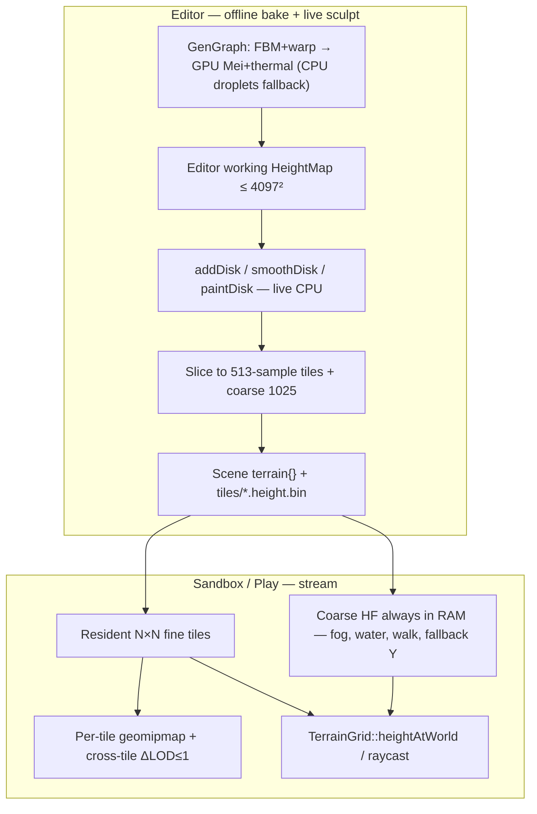
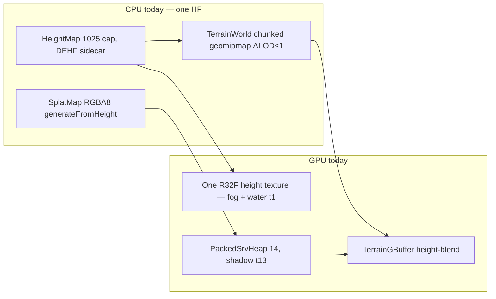
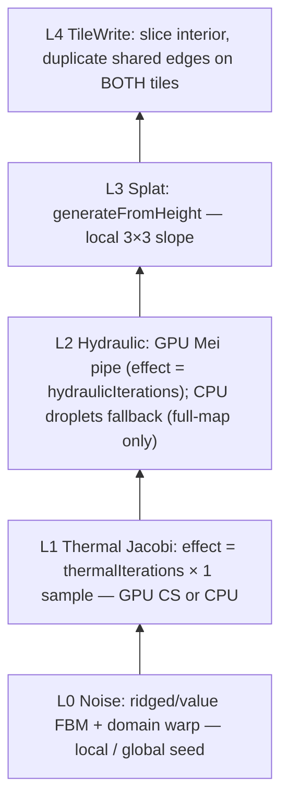

# Terrain streaming + erosion generation (baked tiles, LayerProcGen-style bake DAG)

> **Accepted.** Implemented by execute-plan 79b091b2 PRs 1–7. Body below is the approved RFC (rev 4); present-tense “today” describes the pre-PR1 tip.

> **Follow-up RFC.** Does **not** replace `Terrain/DESIGN-terrain-system.md` rev 2 (look-track). That RFC froze four-layer height-blend splat on the current geomipmap and **explicitly deferred** CDLOD, tile streaming, coarse physics HF, POM, RVT, bindless, BC7/BC5, and 8 layers. This document is the **streaming + generation** track: hydraulic/thermal erosion quality, Editor generate/sculpt/save, disk tiles, runtime residency. Look-track contracts stay: `kMaxTerrainLayers = 4`, `TerrainMaterial` ≠ `Dark::Material`, `HeightMap` query names, ENU metres, same `PbrLighting.hlsli` BRDF, no VT / Nanite / tessellation.

| Field | Value |
|-------|--------|
| **Title** | Finite authored terrain tiles: CPU erosion bake, Editor sculpt, streamed geomipmap |
| **Author** | Travis Johnston |
| **Date** | 2026-09-19 |
| **Status** | Accepted (rev 4 — Q1/Q2/Q5 resolved: finite 2 km default; bake-only GPU Mei erosion) |
| **Priority** | P1 — world scale after reverse-Z; sibling of look-track, not a G-buffer rewrite |
| **Area** | `Terrain/*` (new Gen + Grid), `Render/TerrainErosionPipeline.*` (first `cs_5_0`), `Editor/EditorTerrain.cpp`, `Scene/SceneTypes.h`, `Scene/SceneFile.cpp`, `Sandbox/SandboxApp.cpp`, `Sandbox/PathChase.cpp`, `Water/Water.*`, `Render/Fog.cpp`, `AI/Walkability.*`, `AI/Sight.cpp`, UnitTests |
| **Audience** | Engine, Sandbox, Editor owners who already know look-track |
| **Depends on** | Look-track **implementation** is in the tree (14-slot heap, `kShadowSlot = 13`, Editor panel, DEHF / splat PNG, 1025 cap, `createTerrainPipeline` only). In-tree [`Terrain/DESIGN-terrain-system.md`](./DESIGN-terrain-system.md) may still read **Draft rev 2**; this RFC does not wait on that file’s Accepted bit. [`Render/DESIGN-reverse-z.md`](../Render/DESIGN-reverse-z.md) **Accepted** (far clip is no longer the 2 km blocker). Does **not** depend on CDLOD, bindless, or 8 splat layers. **This RFC introduces the engine’s first compute PSO**, bake-only. |
| **Supersedes** | Nothing in-tree. Look-track **K0** named this follow-up. Does **not** un-freeze look-track T0–T13. IBL/GTAO/SSR “no compute” **stays for those systems**. |
| **Does not** | Infinite Minecraft runtime, vendoring [LayerProcGen](https://github.com/runevision/LayerProcGen) C#, **runtime** compute / UAV on G-buffer or color targets, compute in GTAO/SSR/IBL, CDLOD/clipmap/tessellation, POM, RVT, bindless, BC7/BC5, 8 splat layers, vegetation scatter, roads/rivers (`CultivationLayer`), Cesium, floating origin, growing `TerrainGBufferConstants` / `TerrainFrameConstants` / lighting CB. |

Companion one-pager: [Cheatsheet](#cheatsheet) at the end. Last PR overwrites in-tree `Terrain/DESIGN-terrain-streaming.md` (new) and a one-line pointer from look-track “follow-up RFC”. **Do not commit `DESIGN-*.md` in code PRs.**

No C++ exceptions: `bool` + `DE_LOG_ERROR(LogCategory::Render, ...)` / `DE_LOG_FATAL` + `DE_ASSERT`. Fail closed (legacy 129² FBM / no new tiles). Namespace `Dark`. Allman, 4-space, ColumnLimit 200.

---

## Overview

DarkEngine6 already draws a **single** `TerrainWorld` geomipmap from one CPU `HeightMap` (look-track cap **1025²**, sidecar **32 MB**, `kMaxTerrainLayers = 4`). Sandbox and Editor both boot a 129×129 FBM (`cellSize = 2 m`, origin −128, two `createFbm` layers, `SplatMap::generateFromHeight`). The look is now metal-rough height-blend; the **shape** is still cheap value-noise and the **scale** is still one heightfield in RAM forever.

The product ask is: **eroded, realistic mountains**, **editable in the Editor**, **saved as files the game can stream**, not one 1025² resident for the rest of the project. Reverse-Z has landed, so a 4 km extent is a depth-buffer non-issue. The remaining walls are RAM, hitching, neighbor-aware generation (erosion is contextual), and the live “one `HeightMap` / one R32F height SRV” assumption in water, fog, PathChase, Walkability, and shadows.

**v1 world model (Q1 resolved): a large finite authored world of baked tiles** (default **2.048 km / 4×4**, Q5). Editor **Generate** runs a LayerProcGen-*style* DAG **offline** (GPU Mei pipe + thermal Jacobi when the bake PSO exists; CPU thermal + droplets as fallback), writes tiles + a always-resident coarse HF, then the user sculpts/paints and saves. Runtime **streams fine tiles** around the camera and never allocates the full fine grid. This is **not** infinite Minecraft, and it is **not** runtime procedural. LayerProcGen is the **generator architecture** that writes the tiles, not a runtime world. The first `cs_5_0` PSO in the engine is **bake-only** (Q2 resolved) — not GTAO/SSR/IBL, not the frame’s draw list.



---

## Background & Motivation

### What the tip actually does

Verified against `E:\DarkDev\DarkEngine6` at time of writing (`Terrain/`, `Editor/EditorTerrain.cpp`, `Scene/SceneTypes.h`, `Sandbox/SandboxApp.cpp`, `Water/`, `Render/Fog.cpp`, `Render/TerrainPipeline.h`). Conversation does not override the tree. Look-track is **live**, not aspirational.



| Piece | Location | Fact |
|-------|----------|------|
| HeightMap | `Terrain/HeightMap.h` | Regular-grid floats. `origin` + `cellSize` + `heightScale`. `heightAtWorld` **clamps to rim**; `tryHeightAtWorld` / `containsXZ` false off-map. `createFbm` is **value-noise** (Hash21 + bilinear), deterministic (`HeightMap.FbmDeterministic`). `addDisk` / `smoothDisk` sculpt. `saveBinary` / `loadBinary` little-endian **DEHF** (`magic = 0x46484544`, version 1, 36-byte header + `float` samples). Caps: `kMaxHeightMapSize = 1025`, sidecar **32 MB** (`kMaxHeightSidecarBytes`). |
| Queries | Sandbox, PathChase, AI, PlayerMotor, Weapons | Function pointers call `TerrainWorld::heightAtWorld` → `HeightMap`. Jump-attack / hunter Y-snap is this API. Off-map clamp-to-rim is load-bearing (PathChase never wants 0). |
| TerrainWorld | `Terrain/Terrain.h` | One `HeightMap` + CPU chunks. Default `chunkCells = 16` (power of two). `kMaxLodLevels = 8`. `restrictNeighborLods` (ΔLOD ≤ 1). `EdgeMask` weld, **no skirts**. `uploadHeightTexture` rebuilds the **whole** R32F from `heightAtWorld` per sample (`Terrain.cpp` ~257–279). |
| TerrainLod | `Terrain/TerrainLod.h` | `buildPatchMesh` / `buildGridIndices`. Water shares the index helper (`Water/Water.cpp`). |
| SplatMap | `Terrain/SplatMap.h` | `kMaxTerrainLayers = 4` **exactly**. `kMaxSplatMapSize = 1025`. `generateFromHeight` dirt/grass/rock/snow from height + slope (`rockSlope = 0.45`). Paint helpers live. |
| TerrainMaterial | `Terrain/TerrainMaterial.h` | **14-slot** heap. `kSplatSlot = 12`, `kShadowSlot = 13`. `kMaxLayerImageSize = 2048`. Not `Dark::Material`. |
| TerrainPipeline | `Render/TerrainPipeline.h` | G-buffer CB **63 floats**, RS **64/64**. Forward CB **60 floats**, RS **63/64**. **Cannot grow either CB.** Shadow last. |
| Scene JSON | `Scene/SceneTypes.h` `TerrainSceneDesc` | `bindLayout: 1`, `chunkCells`, blend params, **one** `heightFile` + **one** `splatFile`, 4 layer paths. `version` stays **2**. 2D ignores. |
| Editor | `Editor/EditorTerrain.cpp` | `createEditorTerrain` = Sandbox FBM 129². Terrain window: layers, blend, splat rules + paint, sculpt raise/lower/smooth. Save: `HeightMap::saveBinary` + WIC splat PNG next to the scene. **No seed/size/erosion UI. No undo stack** (grep `Undo` in `Editor/` is empty). `createTerrainPipeline = true`, `createWorldEnvironment = false` (`EditorAppInit.cpp`). |
| Sandbox | `Sandbox/SandboxApp.cpp` ~2431–2494 | Always boots its own 129² FBM. **Does not load** Editor `terrain{}` sidecars. `syncTerrainLod` + `waitForGpu`. `setHeightSrv` + water `setHeightSrv` from the one height texture. |
| Water | `Water/Water.h` | `create(const HeightMap&, WaterDesc)`. Wet chunks where HF < water level. Shares `buildGridIndices`. Samples `gHeightMap` t1 for shore/fog. |
| Fog | `Render/Fog.cpp` `fillFogHeightMap` | Packs **one** origin / cellSize / worldSize into lighting CB. `Fog.hlsli` `FogSampleTerrainY` UV-maps XZ into that one texture. Dummy 1×1 if missing. |
| Walkability | `AI/Walkability.h` | Bakes a grid from **one** `HeightMap*`. Slope + water. Pathfinder Y uses `heightMap()->heightAtWorld`. |
| Shadows | `Editor/EditorRender3D.cpp` ~60–77, Sandbox | `sceneBounds` ∪ `m_terrain.bounds()` then `drawDepth` per cascade. A 4 km `bounds()` would smash CSM. |
| Compute | `content/shaders/`, `Renderer.cpp` ~192–252 | **Zero** `cs_5_0` PSOs **today**. One `D3D12_COMMAND_LIST_TYPE_DIRECT` queue; one recording list. `Texture2D` `Flags = D3D12_RESOURCE_FLAG_NONE` (`Texture2D.cpp` ~322). Color targets `ALLOW_RENDER_TARGET` only. IBL bake uses a **private DIRECT** allocator+list (`IblBakePipeline.cpp` ~193–195), not a compute queue. Feature level **11_0** (compute-capable). **No engine JobSystem**. |
| Reverse-Z | `Render/DESIGN-reverse-z.md` | Infinite-far raster. Far clip is not the mountain-scale blocker. |
| Content | `content/terrain/{dirt,grass,rock,snow}/` | Four modest layer sets. Keep. |

RAM today (look-track T11):

| Resource | Samples | Bytes |
|----------|---------|-------|
| Max HF float32 | 1025² | **4.01 MB** |
| Max splat RGBA8 | 1025² | **4.01 MB** |
| Sandbox boot HF | 129² | 65 KB |
| Hypothetical one 8192² HF | 8192² | **256 MB** |
| 8 resident 512² tiles | 8 × 512² | **8.4 MB** (prompt’s comparison — similar to one 1025²) |

1025² is already the “one HF in RAM forever” wall this RFC must **replace**, not raise in the runtime path.

### Pain points

1. **FBM is not terrain.** `createFbm` is value-noise octaves. It does not cut valleys, deposit talus, or drain to sea level. Foggy mountains in the screenshot are a 129² geomipmap with a good G-buffer writer.
2. **One map in RAM.** `kMaxHeightMapSize = 1025` and a single `TerrainWorld` make 4 km @ 1 m illegal. Raising the cap to 8k without streaming is a 256 MB HF plus splat plus lod-0 meshes — a hitch and a RAM bomb.
3. **Erosion is contextual.** A droplet that crosses a tile boundary is the LayerProcGen “blur / pathfind / erode” problem. Order-dependent tile erosion seams. Need padding / effect-distance, not “erode 256² in isolation”.
4. **Editor cannot Generate a world.** Create = hardcoded 129² seed 1337. Save is one sidecar. Sandbox ignores the sidecar.
5. **Consumers assume one HF texture.** Fog UV, water `HeightMap*`, Walkability bake, `setHeightSrv` — all one resource. Streaming without a **coarse always-resident** map leaves those sampling the dummy 1×1 (fog thinks the world is dry; PathChase Y = 0).
6. **Shadow bounds = full terrain AABB.** Correct for 256 m; wrong for 4 km. Live CSM (`ShadowCascades.cpp` ~89–143) uses `sceneBounds` to **pull the light camera back** and **expand minZ** toward casters between light and slice — a 2 km resident union still flattens cascade precision. v1 shadow AABB is **camera-centered**, not the tile union.
7. **No compute today.** GPU hydraulic is the industry default. Q2 **allows a first `cs_5_0` PSO for bake-only erosion**. IBL/GTAO/SSR stay graphics-queue. Live Renderer has **no compute queue** — bake `Dispatch`s on a **private DIRECT** list (IblBake pattern).

### LayerProcGen — facts (not a vendor)

Source: [docs](https://runevision.github.io/LayerProcGen/), [GitHub](https://github.com/runevision/LayerProcGen), MPL-2.0. v0.4.0.

- Framework for **layer-based infinite, deterministic, contextual** generation. **Does not include generation algorithms.**
- Chunks in layers; a chunk requests data in its bounds **plus padding**. Dependencies declared up front so provider chunks exist before the user chunk runs.
- **Determinism** (same chunk always, regardless of order) vs **integrity** (seamless, as if the plane was processed at once). Integrity = padding ≥ **effect distance**. Multi-iteration filters **add** effect distance per pass. “If you are handling edges specially, you are likely doing something wrong.”
- 2D infinity (Minecraft-like); 32-bit integer range; `Parallel.ForEach`; fixed-point world + floating origin.
- Unity-first, usable without Unity. MPL-2.0: modifications to the **library** must be shared; game code can stay proprietary.

**Do not vendor the C#.** Reimplement a small C++ scheduler if needed. If any file is *derived* from LayerProcGen, it stays MPL-2.0 and is called out in the PR. v1 files in this RFC are **original C++** (ideas only) and stay engine-licensed.

The idea that matters for **thermal** (and any Jacobi/kernel filter): padding ≥ iterations × kernel radius, then discard the halo. Sequential **droplets are not that**: later drops see earlier deposits, so information can cascade across the whole map. v1 therefore **erodes the full working HeightMap** for Generate integrity, and treats region-regen hydraulic as **approximate**. Do not claim `maxSteps` is hydraulic effect distance.

---

## Goals & Non-Goals

### Goals (v1)

- **Realistic bake:** ridged/warped FBM as the *input*, then **thermal Jacobi + hydraulic (GPU Mei pipe; CPU droplets fallback)** as the *shape*. Editor **Generate** is offline (progress, cancellable). Not a per-frame effect.
- **Finite authored world** of tiles the user saves and the game streams. Default **2048 m** (2049 samples @ 1 m) or **4096 m** (4097 samples @ 1 m). One world per 3D scene (look-track T8).
- **Editor:** seed, size, cell size, sea level, erosion iterations → Generate; then existing sculpt/paint; **region regen** (thermal padded / hydraulic approximate); save tiles + coarse + JSON. Sculpt stays same-frame CPU HF (look-track K19) on the Editor working set. Draw via Grid ring.
- **Runtime stream:** LRU/ring of fine tiles around the camera. Hitch budget on the **main thread**. I/O on a worker. GPU upload after `waitForGpu` (same contract as `syncTerrainLod`).
- **Query facade:** `TerrainGrid::heightAtWorld` / `tryHeightAtWorld` / `raycast` / `containsXZ` so PathChase, PlayerMotor, Weapons, AI, Editor picking do not special-case tiles. **Never return 0 for in-world XZ** because a fine tile is unloaded — use coarse.
- **Keep look-track:** 4 layers, 14-slot heap, `bindLayout: 1`, geomipmap + ΔLOD≤1 (now **across tiles**), water `buildGridIndices`, ENU, no lighting-CB growth.
- Named CPU tests. No C++ exceptions.

### Non-goals (v1)

- Infinite / wraparound / Minecraft runtime. Floating origin. Fixed-point world (4 km float32 is ~0.5 mm).
- Runtime compute / UAV on G-buffer or HDR color targets. Compute in GTAO, SSR, IBL, Bloom, lighting. Bindless, texture arrays, BC7/BC5, RVT, POM, tessellation, VT, Nanite, Cesium.
- CDLOD, clipmap, VS height fetch, LayerProcGen `LandscapeLayer` as a mesh scheme.
- 8 splat layers. Folding into `Dark::Material`.
- Vegetation, roads, rivers, locations (`CultivationLayer` / `LocationLayer`). Named v2.
- Runtime generation of missing tiles from seed (pure proc). Missing tile → coarse + log, not a live bake.
- Growing `TerrainGBufferConstants` (64/64) or `TerrainFrameConstants` (63/64) or lighting CB.
- Editor `createWorldEnvironment` (still terrain-pipeline only).
- Global engine job system. Undo of **Generate** (reload scene). Network replication of heightfields.

---

## Proposed Design

### Frozen product (G0–G14)

| ID | Freeze |
|----|--------|
| **G0** | Look-track stays. This RFC does not retune height-blend, Whiteout, triplanar policy (a), 14-slot heap, or `SHADOW_T t13` (live: `TerrainMaterial::kShadowSlot = 13`). |
| **G1** | **World model = hybrid finite baked tiles.** Proc seed + authored overlays (sculpt/paint) written to disk. Runtime streams those files. Infinite LayerProcGen runtime and “one giant HF” are rejected for v1. |
| **G2** | **Generator** is a C++ layer DAG (ideas from LayerProcGen: dependencies, padding = effect distance **for kernels**, determinism vs integrity, integer tile indices). Droplets are **not** a kernel. **No C#**, no MPL files unless a later PR explicitly vendors a derived translation. |
| **G3** | **Erosion = thermal Jacobi + hydraulic, Editor-offline.** **GPU Generate (preferred):** Mei 2007 **pipe/flux** hydraulic + thermal Jacobi, `cs_5_0` UAV. **CPU fallback** (PSO create fail / UnitTests without a device): thermal Jacobi + sequential droplets (`hash21`). Ridged FBM + domain warp is L0 only. Fastscape implicit solvers remain v2. |
| **G4** | **LOD = keep geomipmap + edge weld.** ΔLOD≤1 extends **across resident tile borders only**. Unloaded edges are OOB (no restrict, no weld). No CDLOD, no clipmap, no skirts. |
| **G5** | **Streaming unit = 512 cells = 513 samples**, power-of-two cells, default `cellSize = 1 m` (512 m tiles). Shared edge duplicated. Disk = DEHF + splat PNG per tile, plus one coarse DEHF. |
| **G6** | **Coarse always-resident HF** covering the full authored extent, **≤ 1025²**, box-filtered from fine on Generate **and** on sculpt dirty-rect. Fog, water wet-mask, Walkability bake, height SRV, Sight, and Y-fallback **all use coarse**. Missing **coarse** file → `TerrainGrid::create` **fails**. Missing **fine** tile → coarse + log. |
| **G7** | **Editor working set** may hold the full fine HF up to **4097²** (~64 MB float + 64 MB splat). Runtime **never** allocates that. Save **slices**; `HeightMap::saveBinary` on a 4097 map **rejects** (32 MB cap). Editor **draws** via the same Grid resident ring — never one 4097 `TerrainWorld`. |
| **G8** | **Physics:** `heightAtWorld` in-world = fine if resident else coarse. `tryHeightAtWorld` false only **outside the authored AABB**. Unloaded fine ≠ off-map. Raycast / Sight: resident fine first, else coarse. Coarse Y error is **O(coarseCellSize × slope) metres**, not centimetres. Pin the **Player** tile + 1-ring (3×3) so the possessed pawn stays on fine. |
| **G9** | **Shadow `sceneBounds` = camera-centered** (max cascade far + margin ∪ nearby props). **Not** world AABB, **not** the 5×5 resident union. `residentBounds()` is debug/overlay only. |
| **G10** | **Generate is offline.** Game/Play never runs erosion. Missing tiles do not bake on the hitch path. |
| **G11** | **Splat after erosion** = existing `SplatMap::generateFromHeight`. Paint overlay stays. No 5th layer. Each **resident tile owns a stable 14-slot table** (layers 0–11 copied from the shared `TerrainMaterial`, **slot 12 = that tile’s splat**, t13 shadow). Bind **that** GPU handle per draw. Patch splat at **tile GPU create / splat re-upload**, never by overwriting one shared table between draws. Register each table so `copyShadow` still hits t13. |
| **G12** | **First `cs_5_0` is bake-only** (`TerrainErosionPipeline`). Not the frame draw list, not GTAO/SSR/IBL. `Dispatch` on a **private DIRECT** command list (live Renderer has no COMPUTE queue). UAV R32F **only** on bake targets (`createUavR32Float`); do **not** set `ALLOW_UNORDERED_ACCESS` on general `Texture2D`. CPU fallback if PSO create fails. |
| **G13** | Scene `version` stays **2**. Extend optional `terrain{}`. Missing `grid` → today’s single `heightFile`. When `tilesX*tilesZ > 1`, omit **both** giant `heightFile` and `splatFile`. 2D ignores. |
| **G14** | Caps below. Fail closed, no throw. |
| **G15** | `tilesX, tilesZ ∈ [1, 8]` (`kMaxWorldTiles = 8`). 16×16 / 8193 is **Q4 only**. |

### Frozen sizes

| Resource | Cap | On exceed |
|----------|-----|-----------|
| Single `HeightMap::create` (tile or coarse or legacy) | **1025** stays for **runtime** `HeightMap` | `false` + log |
| Editor working `HeightMap` (new `createWorking` / flag) | **4097** inclusive | `false` + log, no giant alloc |
| Fine tile | **513** samples (512 cells) exactly for streamed worlds | reject tile |
| Coarse HF | **1025** max, covering full extent | downsample |
| Layer images | **2048** (look-track) | skip map, default |
| Per-file sidecar | **32 MB** stays (tile 513² × 4 B ≈ **1.05 MB**; coarse 1025² ≈ **4.01 MB**) | `false` |
| Authored world | `tilesX, tilesZ ∈ [1, 8]` (`kMaxWorldTiles = 8`), default **4×4** tiles = 2048 cells @ 1 m = **2.048 km**; max **8×8** = 4096 cells = **4.096 km**. 16×16 is **not** legal v1. | `false` |
| Resident ring | default **5×5** tiles (2-ring), max **7×7** | clamp |
| Sculpt undo ring | **8** dirty-rect snapshots | drop oldest |
| `restrictNeighborLods` on a virtual grid | `maxIterations` **≥ max(32, chunksX + chunksZ)** (64×64 grid needs more than the live default 32) | pass explicitly |
| `WaterDesc.chunkCells` when source is coarse 1025 | **64** (same as streamed terrain tiles) | — |

Quantified RAM (v1 default 4×4 tiles @ 1 m, resident 5×5 but only 16 exist → all resident; use 8×8 world for the stream case):

| Config | Fine CPU | Splat | Coarse | Notes |
|--------|----------|-------|--------|-------|
| Editor 4097² working | **64.0 MB** | 64.0 MB | 4.0 MB | Authoring only |
| Runtime 8×8 world, 5×5 resident 513² | 25 × 1.05 = **26.3 MB** | 26.3 MB | 4.0 MB | ≈ 57 MB samples vs 256 MB for one 8k² |
| Runtime 8 × 512² (prompt) | **8.4 MB** | 8.4 MB | 4.0 MB | Same order as today’s 1025² |
| Legacy 129² / 1025² | unchanged | | n/a | 1×1 “grid”, no coarse required |

Meshes: default streamed `chunkCells = 64` (8×8 chunks / 512-cell tile). 5×5 tiles = 1600 chunks if all drawn — **frustum cull** already exists (`drawGBuffer` frustum arg). LOD-2 dominant far chunks keep VB RAM in the tens of MB, not hundreds. Lod-0 65² × 48 B ≈ 203 KB per chunk; do **not** keep the whole ring at lod 0.

---

### Frozen decision 1 — world model (the product call)

Three options:

| | A. Infinite proc runtime | B. One giant HF | C. Finite baked tiles + stream (**pick**) |
|--|--------------------------|-----------------|------------------------------------------|
| Matches “save so the game can stream” | No (seed is the save) | No (one file, all RAM) | **Yes** |
| Erosion context | Live DAG + huge padding | Trivial (whole map) | Bake DAG, then slice |
| Editor sculpt | Hard (unloaded = missing) | Easy | Easy on working set; tile-aware at save |
| RAM at 4 km @ 1 m | Ring only | **64 MB+** always | Editor 64 MB; runtime ~26 MB ring |
| LayerProcGen fit | Full port (infinity, origin) | None | **Generator only** |
| Risk | Years; floating origin; MPL | Hits 32 MB sidecar; no stream | Tile weld + coarse consumers |

User wording (“saved off so they can be streamed into the game”) is **authored/baked tiles**, not Minecraft. **Pick C.** A and B stay in Open Questions as v2 / escape.

Hybrid detail: tiles are **proc seed + erosion bake + destructive sculpt/paint**. Region regen from seed **wipes sculpt in that rect** (Editor confirm). v1 does **not** store a separate sculpt-delta layer (matches live `addDisk` mutating samples).

Integer tile index `(tx, tz)` in `[0, tilesX)`. World XZ:

```
origin.x + tx * tileCells * cellSize
```

ENU metres. No wrap. No 32-bit LayerProcGen `Point` infinity.

**Legacy:** `terrain.heightFile` set and `grid` absent → today’s one `HeightMap` wrapped as a **1-tile `TerrainGrid`** (hosts switch in PR 6). Sandbox 129² FBM remains the no-JSON boot. Streaming code paths must not break that.

---

### Frozen decision 2 — generation DAG (LayerProcGen ideas, C++)

New files (engine, no exceptions):

```cpp
// Terrain/TerrainGen.h — sketch, names frozen
namespace Dark::Terrain
{
constexpr int kTileCells        = 512;
constexpr int kTileSamples      = kTileCells + 1; // 513
constexpr int kMaxWorldTiles    = 8;  // 8×8 × 512 cells + 1 = 4097 working
constexpr int kMaxWorkingSize   = 4097;
constexpr int kResidentRingMax  = 7;

// Duplicate of TU-private Hash21 in HeightMap.cpp ~21–28. NOT rand().
// Returns [0,1): (h & 0x00FFFFFF) / 16777216.0f — same as createFbm.
float hash21(int x, int z, uint32_t seed);

struct ErosionParams
{
    uint32_t seed              = 1337u;
    int      fbmOctaves        = 7;
    float    fbmFrequency      = 3.5f;
    float    fbmAmplitude      = 1.0f;
    float    warpAmp           = 0.35f;  // domain warp of FBM input, not “the erosion”
    int      thermalIterations = 40;
    float    talusTan          = 0.7f;   // ~35° scree; slope above this sheds
    float    thermalRate       = 0.5f;
    int      hydraulicDroplets = 0;      // CPU fallback only; 0 → auto (samples / 8)
    int      hydraulicMaxSteps = 64;     // CPU fallback: per-droplet travel cap, NOT world effect distance
    int      hydraulicIterations = 48;   // GPU Mei pipe Jacobi steps; effect distance = this (samples)
    float    hydraulicInertia  = 0.05f;
    float    evaporate         = 0.02f;
    float    capacity          = 1.0f;
    float    erode             = 0.3f;
    float    deposit           = 0.3f;
    float    gravity           = 4.0f;
    float    seaLevelRaw       = 0.0f;   // raw sample units; below this hydraulic stops
};

struct WorldGenDesc
{
    uint32_t      tilesX    = 4;
    uint32_t      tilesZ    = 4;
    uint32_t      tileCells = kTileCells;
    float         cellSize  = 1.0f;
    float         heightScale = 80.0f; // world Y metres for amplitude ~1
    Math::Vector3f origin{ -1024.0f, 0.0f, -1024.0f };
    ErosionParams erosion{};
};

// Returns false on cap / cancel / alloc fail. outFull is Editor working size
// (tiles*tileCells + 1). No throw.
bool generateWorld(const WorldGenDesc& desc, HeightMap& outFull, SplatMap& outSplat,
                   bool (*progress)(float t, const char* phase, void* user), void* user);
}
```

**Layers** (logical; may be functions on one buffer with halo, not 6 heap types):



Rules stolen from LayerProcGen, reimplemented — **thermal and GPU Mei pipe are kernels; CPU droplets are not:**

1. **Input/output separation.** Thermal Jacobi reads L0, writes L1 (ping-pong). GPU hydraulic reads L1, writes L2 via UAV ping-pong. CPU droplet fallback writes L2 in-place on the **full** working map.
2. **Thermal padding = `thermalIterations` samples.** Padded-tile thermal interior **bit-matches** a full-map thermal slice. Tests: `thermalIterations = 4`, 65² fixture.
3. **GPU Mei pipe padding = `hydraulicIterations` samples** (one cell of flux per Jacobi step). Region regen on the GPU path **is** integrity-capable: padding = `thermalIterations + hydraulicIterations`.
4. **CPU droplet fallback has no useful finite padding.** Sequential droplets are order-dependent. CPU Generate therefore still erodes the **full working HeightMap**. CPU region-regen hydraulic remains **approximate**.
5. **v1 Generate (both paths) erodes the full working HeightMap.** That is the product freeze even when GPU padding would allow tiles.
6. **Determinism.** GPU: same desc + same iteration count → same UAV readback (IEEE; test on 65²). CPU: `float hash21` [0,1) duplicate of `HeightMap.cpp` ~21–28; scanline spawn; **no `rand()`**; hydraulic **single-threaded**. Thermal CPU may row-split.
7. **Owned-within-bounds.** West/south owns shared edges. Slice-from-working writes **both** duplicates.

**Region regen:** confirm wipe of sculpt. GPU path: padded rect, `padding = thermalIterations + hydraulicIterations`, write interior. CPU fallback: thermal padded (bit-identical); droplets in-rect **approximate**.

**Progress / cancel:** `progress` returns `false` to cancel; `generateWorld` returns `false` and leaves `outFull` **invalid**; Editor keeps previous terrain. No throw. Generate runs on a **worker thread**; Editor polls ImGui. **Disable sculpt/paint brushes until apply.** GPU is not touched until apply.

**Thermal / droplet pseudocode (PR 2 is not a research task):**

```
// L1 Thermal — Jacobi, halo = 1 per iteration. src/dst ping-pong. Interior only.
for iter in 1 .. thermalIterations:
    copy src -> dst
    for z, x in interior:                    // optional: row-split this loop
        float h = src[x,z], out = h
        for each of 8 neighbors n:
            float dist = (n diagonal ? 1.414 : 1) * cellSize
            float dh = h - src[n]
            float talus = talusTan * dist
            if (dh > talus)
                out -= thermalRate * (dh - talus) / 8
        dst[x,z] = out
    swap src, dst

// L2 Hydraulic — single-threaded, scanline spawn order. Full map only for Generate.
N = hydraulicDroplets > 0 ? hydraulicDroplets : (width * height / 8)
for i in 0 .. N-1:                           // MUST be this order
    float fx = hash21(i, 0, seed) * (width  - 1)   // hash21 is float [0,1)
    float fz = hash21(i, 1, seed) * (height - 1)
    float dirX = 0, dirZ = 0, vel = 0, water = 1, sediment = 0
    for step in 1 .. hydraulicMaxSteps:
        // bilinear gradient on current cell; skip if below seaLevelRaw
        dir = normalize(dir * inertia - grad * (1 - inertia))
        float newX = fx + dir.x, newZ = fz + dir.z
        if out of map or water < 1e-4: break
        float cap = vel * water * capacity
        // erode if sediment < cap else deposit (standard droplet)
        fx, fz = newX, newZ
        water *= (1 - evaporate)
        vel = vel + gravity * cellSize * slopeMag   // then damp
```

Tests that would need a 104-sample halo on a 17²/65² map are **illegal** — use reduced `thermalIterations = 4`, `hydraulicMaxSteps = 8` on a 65² `tileCells` override.

**CPU cost (honest):**

| Map | Thermal 40 | Hydraulic auto droplets | Wall time 1 core (order of) |
|-----|------------|-------------------------|-----------------------------|
| 1025² | ~40 × 8 × 1e6 ≈ 3e8 ops | ~1e5 droplets × 64 | **0.5–3 s** |
| 2049² | ×4 | ×4 | **2–15 s** |
| 4097² | ×16 | ×16 | **10–90 s** |

**GPU is the Generate path when `TerrainErosionPipeline` creates.** CPU thermal + droplets run if PSO create fails (log once `"TerrainGen: CPU fallback"`). UnitTests without a Window/Renderer use CPU. **No** global job system.

**Reject list (algorithms):**

| Algo | Why not v1 |
|------|------------|
| Simplex / domain-warp **only** | Looks “interesting”, not drained. Allowed as **L0**. |
| Fastscape / stream-power implicit | Better rivers; research project. v2 candidate. |
| Sequential droplets **on GPU** | Order-dependent; terrible SIMT. **Mei pipe** is the GPU hydraulic. |
| Thermal-only | Talus without channels. Ship both. |
| Runtime / per-frame erosion CS | Offline bake only. |

After L2, **sea level:** samples `< seaLevelRaw` clamp toward sea (optional flatten). Water level in the scene is still a host `WaterDesc::waterLevel` (Sandbox today: lerp of terrain AABB at 0.38). Generate UI exposes sea level and writes a suggested `waterLevel` into scene JSON (new optional field; missing → today’s lerp).

**GPU wall time (honest, 4097², 40 thermal + 48 pipe iters):** tens to a few hundred ms plus **readback**. Still **offline** (progress every N iteration batches). Not per-frame.

---

### Frozen decision 2b — bake-only compute (Q2; first `cs_5_0`)

Live facts: `Renderer` creates **one** `D3D12_COMMAND_LIST_TYPE_DIRECT` queue and one in-frame list (`Renderer.cpp` ~192–252). `Texture2D` resources are `D3D12_RESOURCE_FLAG_NONE`. Shaders compile `vs_5_0` / `ps_5_0` only. IBL bake already owns a **private DIRECT** allocator+list — that is the template, not a COMPUTE queue.

**Freeze:**

| Item | Pick |
|------|------|
| Scope | **Editor Generate / `regenerateRect` only.** Never the HybridDeferred draw list, never GTAO/SSR/IBL/Bloom/lighting. |
| Queue | **Existing DIRECT queue.** `Dispatch` is legal on DIRECT. **No** second `COMPUTE` queue in v1 (extra fence vs the frame list is a platform RFC). |
| Command list | **Private** allocator+list, IblBake-shaped. `waitForGpu` (or a bake fence) after execute. Do **not** record CS onto `Renderer::commandList()` during `onRender`. |
| PSO | `D3D12_COMPUTE_PIPELINE_STATE_DESC`, shader `cs_5_0`, `[numthreads(8,8,1)]`. `compileShaderFromContent(..., "cs_5_0", ...)`. |
| Resources | New `Texture2D::createUavR32Float` (or a `TerrainErosionTargets` type). `ALLOW_UNORDERED_ACCESS`. Ping-pong **height** (R32F) + **water** (R32F) + **flux** (R32G32B32A32_FLOAT, L/R/T/B) + **sediment** (R32F). SRV+UAV pairs. **Do not** add UAV flags to general albedo/G-buffer/HDR textures. |
| Kernels | CS thermal Jacobi (one iter/dispatch). CS Mei pipe: flux from height+water → water/sediment transport → thermal optional in same batch. Barriers `UAV` between dispatches. |
| Readback | `CopyTextureRegion` height UAV → READBACK buffer → `HeightMap` samples. Progress/cancel between iteration batches (e.g. 8 dispatches, execute, wait, `progress()`, repeat). Cancel → `false`, Editor keeps previous terrain. |
| Fallback | PSO/`createUavR32Float` fail → CPU `generateWorld` (thermal + droplets). FL 11_0 is compute-capable; this is WARP/odd-device/tests. |
| Tests | CPU kernels remain the UnitTests oracle (no Window). GPU soak in Editor. Optional `ShaderCompileTests` that `cs_5_0` TerrainErosion.hlsl compiles. |

```cpp
// Render/TerrainErosionPipeline.h — sketch
class TerrainErosionPipeline
{
public:
    bool create(ID3D12Device* device); // cs_5_0 PSOs; false → CPU fallback
    bool dispatchThermal(ID3D12GraphicsCommandList* cmd, /* UAV height ping-pong, CBV params */);
    bool dispatchPipe(ID3D12GraphicsCommandList* cmd, /* UAV height/water/flux/sediment */);
    bool isValid() const;
};
```

No C++ exceptions. `FAILED(hr)` → log + `false`.

---

### Frozen decision 3 — LOD / mesh (keep geomipmap)

Look-track K2: weld + `buildGridIndices` + water topology. CDLOD was rev 1 Plan A and is still a **named follow-up**, not this track.

Streaming changes:

- Each resident tile is a **`TerrainWorld`** (internal `TerrainTile`) on a 513² `HeightMap`, `chunkCells = 64` default (maxLod = 6). This is a **contract change**, not “unchanged TerrainWorld”:
  - Grid owns a virtual lod grid of **resident tiles only** (size `residentTilesX * chunksPerTile`). It writes lods + `EdgeMask` into each tile via **`TerrainWorld::applyExternalLods(const int* lods, const EdgeMask* edges)`** (name frozen). Tiles **must not** call `updateLod` themselves — that function only sees its own 8×8 chunks (`Terrain.cpp` ~121–144) and cannot weld to the next tile.
  - Live `restrictNeighborLods` (`TerrainLod.cpp` ~45–84) **only pulls coarse chunks toward a finer neighbor**; it never pulls fine toward coarse. A missing-neighbor sentinel of lod = max is a **no-op**. Do **not** insert lod-max (or lod-0) sentinels for unloaded tiles.
  - **Unloaded edges are OOB:** no restrict, no weld bit. Silhouette against empty / coarse-only distance. Optional soak fallback: force **outermost resident** chunks to lod ≥ 1 (not lod-max halo).
  - Pass `maxIterations >= max(32, virtualChunksX + virtualChunksZ)` — a 64×64 grid (8×8 tiles × 8 chunks) will not converge in the live default 32.
- Shared edge samples are **bit-identical** so welded verts match in world space when **both** tiles are resident.
- **`createGpu` / `uploadDirty` on a tile must not upload a per-tile R32F height texture.** Live `createGpu` (`Terrain.cpp` ~282–290) always calls `uploadHeightTexture` if the tile’s texture is invalid — 25× 513² SRVs would fight G6. Freeze a flag `TerrainWorld::setUploadHeightTexture(false)` (default true for legacy one-world Sandbox 129²) or Grid never calls the upload path. **One coarse** `TerrainGrid::heightTexture()` for `setHeightSrv`.
- **Do not** introduce skirts in v1.

Clipmap / CDLOD: Open Questions. Not v1.

`TerrainLod.h` helpers stay. Water still calls `buildGridIndices`.

---

### Frozen decision 4 — streaming unit, disk, LRU, hitch

**Tile on disk** (next to the scene, directory `terrain_tiles/` or `terrain.heightFile` stem):

```
<sceneDir>/
  untitled.json
  untitled.coarse.height.bin      # DEHF, ≤1025², full extent, larger cellSize
  untitled.coarse.splat.png       # optional; fog does not need it
  untitled.tiles/
    t_00_00.height.bin            # DEHF 513×513, cellSize = fine, origin = tile origin
    t_00_00.splat.png             # RGBA8 513×513
    t_01_00.height.bin
    ...
```

Reuse **DEHF v1** (`HeightMap::saveBinary`). 513² × 4 + 36 < 32 MB. Magic/version/caps unchanged. **Do not** invent a second height codec in v1.

JSON extension (`TerrainSceneDesc` grows; unknown keys ignored by old loaders if we only *add* fields — nlohmann `value` defaults):

```json
"terrain": {
  "bindLayout": 1,
  "chunkCells": 64,
  "heightBlendK": 0.5,
  "heightBlendT": 0.1,
  "triplanarSlope": 0.45,
  "heightFile": "untitled.height.bin",
  "splatFile": "untitled.splat.png",
  "grid": {
    "tilesX": 4,
    "tilesZ": 4,
    "tileCells": 512,
    "cellSize": 1.0,
    "origin": [-1024, 0, -1024],
    "heightScale": 80,
    "seed": 1337,
    "coarseFile": "untitled.coarse.height.bin",
    "tileDir": "untitled.tiles",
    "seaLevel": 12.0,
    "residentRing": 5
  },
  "layers": [ { "...look-track..." } ]
}
```

- `grid` missing → legacy single HF (`heightFile` + `splatFile`).
- When `tilesX * tilesZ > 1`: omit **both** top-level `heightFile` and `splatFile` (a 4097 splat PNG is 64 MB, not even under the DEHF 32 MB cap). Tiles + coarse only. Empty strings.
- 1×1 grid may still write `heightFile` / `splatFile` as a convenience copy of `t_00_00`.
- `bindLayout: 1` unchanged. Future 8-layer is still `bindLayout: 2`.
- Missing **coarse** file → `TerrainGrid::create` returns `false` (fail closed, no 0-height world). Missing **fine** tile → coarse fallback + log once.

**Runtime `TerrainGrid`:**

```cpp
// Terrain/TerrainGrid.h — host-facing replacement for “the” TerrainWorld
class TerrainGrid
{
public:
    bool create(const TerrainGridDesc& desc); // coarse + paths; loads coarse now, fine on demand
    void updateStreaming(const Math::Vector3f& cameraPos, Renderer* renderer); // worker kick + GPU apply
    void updateLod(const Math::Vector3f& cameraPos);

    float heightAtWorld(float x, float z) const;
    bool  tryHeightAtWorld(float x, float z, float& outY) const;
    bool  containsXZ(float x, float z) const;
    Collision::RayHit3D raycast(const Math::Ray3f& ray, float maxDistance = Math::Infinity) const;
    Math::Vector3f normalAtWorld(float x, float z) const;

    Math::AABox3f bounds() const;          // full authored AABB (debug / containsXZ)
    Math::AABox3f residentBounds() const;  // union of loaded fine tiles; overlay / debug — NOT CSM
    Math::AABox3f shadowBounds(const Camera3D& camera) const; // camera-centered cascade far + margin

    const HeightMap& coarse() const;
    HeightMap*       editableWorking();    // Editor only; nullptr at runtime

    const Texture2D& heightTexture() const; // COARSE R32F for fog/water setHeightSrv

    void drawGBuffer(...) const; // per tile: bind that tile’s 14-slot GPU table, then draw chunks
    void draw(...) const;
    void drawDepth(ID3D12GraphicsCommandList* cmd, const Frustum3f* casterFrustum) const;
};
```

Hosts that today hold `Terrain::TerrainWorld m_terrain` switch to `TerrainGrid` in **PR 6** (see PR Plan). `TerrainWorld` is the **per-tile mesh** object with the lod/height-texture contract change above.

**Per-tile splat bind (look-track compatible, no new slots):**

`buildPatchMesh` (`TerrainLod.cpp` ~380–400) writes UVs as `sx / (width-1)` over **that tile’s** 513² `HeightMap`, so UVs are 0–1 **per tile**. G-buffer / forward sample splat at **t12** with those UVs. One world splat cannot atlas 5×5 × 513 into 1025². Texture arrays / bindless are on the explode list.

D3D12 does **not** snapshot a shader-visible heap at `SetGraphicsRootDescriptorTable` (same class of bug as upload-heap CBVs). Live `copyShadow` (`PackedSrvHeap.cpp` ~48–61) patches t13 **once** when the SRV is set, then `GpuResourceCache::registerPackedHeap` (~47–59) walks every registered heap. Live `TerrainWorld::draw` (`Terrain.cpp` ~328–329) binds **one** table, then draws every chunk. Recording `copySplat(tile0); draw0; copySplat(tile1); draw1` on **one** 14-slot heap leaves **both** draws reading tile1’s splat at execute.

Freeze **stable 14-slot tables per resident tile**, not a per-draw overwrite:

- Shared `TerrainMaterial` still interns layers 0–11 + dummy splat + holds `copyShadow`’s t13 source. It is the **template**, not the only bound table.
- Each resident tile owns a `PackedSrvHeap` (`srvCount = 14`, `shadowSlot = 13`) **or** a 14-descriptor range in a Grid-owned heap. Max ring 7×7 × 14 = **686** descriptors — cheap.
- **At tile GPU create / splat re-upload (not between draws):** `packFromCpuHandles` or copy slots 0–11 + t13 from the material, then `copySplat(device, tile.heap, tile.splat.cpuHandle())` into **slot 12**. Paint → re-upload that tile’s splat texture → patch **that** table’s slot 12 again. Layer-slot edits (Editor `applySurfaceDesc`) recopy 0–11 on every resident table.
- **Draw** binds **that tile’s** `heap.gpu` (`SetGraphicsRootDescriptorTable`), then draws that tile’s chunks. Never overwrite a table that another in-flight draw still names.
- **`GpuResourceCache::registerPackedHeap(&tile.heap)`** on create, `unregisterPackedHeap` on evict, so CSM `copyShadow` still patches **t13 on every resident table**.
- `copySplat` as a helper is fine; **calling it every draw on one shared heap is forbidden.**

Do **not** grow RS, `kSrvCount`, or layer count. Alternative rejected: one coarse-resolution world splat (kills fine paint).

**LRU / ring:** center tile = camera XZ. Keep `residentRing × residentRing` (odd, default 5). Prefetch the next Chebyshev ring on a worker. Evict the opposite side. **Pin:** Editor dirty tiles; **Player** tile + 1-ring (3×3 physics, so the possessed pawn is not on coarse). Hunters outside the mesh ring use coarse Y (metres of error — G8) until they enter.

**Threads:**

| Work | Thread | Rule |
|------|--------|------|
| File read DEHF + PNG | 1 worker | `bool` result into a queue; no GPU; no throw |
| `HeightMap::createFrom` + splat | worker | alloc ≤ 513² |
| `TerrainWorld::rebuildDirtyCpuMeshes` | **main** v1 | avoid racing `uploadDirty` |
| `uploadDirty` / mesh `tryCreate` | **main** | after `renderer.waitForGpu()`; **not** a per-tile height SRV |
| `heightAtWorld` | any, **no lock on the hot path** | resident pointers swapped at end of `updateStreaming` on main |

**Hitch budget (honest):** one 512-cell tile at `chunkCells = 64` is **64** chunks. First `createGpu` of a cold lod-0 tile is 64 `Mesh::tryCreate` after `waitForGpu` — that will **not** fit in 4 ms. Freeze:

1. `updateLod` / `applyExternalLods` **before** first upload so most of a new tile is **not** lod 0.
2. At most **one tile’s dirty GPU creates** per frame (not “one tile, all 64 meshes”).
3. Spread remaining chunk uploads across frames (tile is already resident for queries; meshes pop in).
4. First apply of a tile **may exceed 4 ms once** — `DE_LOG_INFO` the ms; do not promise 4 ms for 64× 65² lod-0 VBs.
5. Steady-state lod changes: **≤ 4 ms** target for the dirty subset.

Never stall gameplay on a 25-tile cold start — first frames draw **coarse-only** (no fine meshes) + log once `"TerrainGrid: streaming in"`. PathChase Y is coarse until the Player 3×3 arrives; error is **metres** (G8), then a **pop** onto fine.

Cold start / fast travel: if the destination is > 2 tiles away, **drop the ring** and load the 3×3 around the destination; Play/teleport may `waitForGpu` once. Do not bake.

**Coarse R32F:** one texture, **box-filtered from the full fine working set on Generate/Load**, and from the dirty rect on sculpt. `fillFogHeightMap` + `setHeightSrv` bind **coarse**. Fine 1 m hills will not move valley fog — accepted (coarse cell = `worldExtent / 1024`: **2 m** on a 4×4 @ 1 m world, **4 m** on 8×8).

---

### Frozen decision 5 — Editor workflow

Keep look-track punch-list (createTerrainPipeline only, skip 40 m plane, `waitForGpu`, `groundHitFromRay` = raycast, `setLayerSamplingRaw` 0,3,6,9). Add a **Generate** block above Create:

| Block | UI | Backend |
|-------|----|---------|
| Generate | tilesX/Z combo (1,2,4,8), cellSize, heightScale, seed, sea level, thermal iter, GPU `hydraulicIterations` (CPU maxSteps shown only if fallback), “Generate world” | GPU bake on private DIRECT list (progress batches); CPU fallback if PSO invalid; brushes **disabled** until apply; on success replace working HF, box-filter coarse, `generateFromHeight`, slice 513² CPU tiles (duplicate shared edges **into both tiles**), Grid uploads **resident ring only** |
| Create 129² | keep as “Create small FBM” | today’s `createEditorTerrain` as a 1-tile Grid |
| Region regen | “Regen tile under cursor” / brush rect | GPU: padded Mei+thermal (padding = iters). CPU fallback: thermal padded; droplets approximate. Confirm wipe sculpt |
| Sculpt / paint | **unchanged** `addDisk` / `smoothDisk` / `paintDisk` on the **working HF** (full 2–4 km, including off-camera) | dirty-rect slice into Grid tiles; coarse box-filter; GPU = resident ring |
| Undo | 8-deep **sculpt/paint** snapshots of the dirty rect only | not Generate, not Load |
| Save | grid JSON + coarse DEHF + `t_xx_zz` tiles; omit giant `heightFile`/`splatFile` when >1 tile | existing WIC splat; `HeightMap::saveBinary` per **tile** (513). Working 4097 `saveBinary` is **rejected** |
| Load | if `grid` present: load **coarse** (required) + **assemble full working HF from all tiles** (authoring hitch OK); GPU streams the ring. Else legacy one sidecar | missing coarse → fail closed |

**Editor draw = same `TerrainGrid` path as runtime.** Working HF is CPU source of truth. **Do not** build one 4097 `TerrainWorld` (256×256 chunks at `chunkCells = 16`, or 4096 at 64, plus a 64 MB R32F — illegal under G6/G7). GPU meshes and splat SRVs are the resident ring only. Sculpt/paint/undo **off-camera** still mutate the working HF; those tiles GPU-update when they enter the ring (or immediately if already resident).

**129² Create** remains so empty Editor 3D is instant. Generate is the quality path.

**Undo-ish:** live Editor already sculpts the CPU HF with no stack. v1 adds a ring: before each brush stroke (`applyTerrainBrush` first hit), copy the dirty AABB samples (max e.g. 256² rect — if bigger, skip undo and log). Ctrl+Z restores. Generate/Load/Remove clear the ring. **Not** a command-pattern editor.

**Apply Generate** hits GPU only after the worker finishes: `waitForGpu`, Grid resident `applyExternalLods` + mesh upload, **coarse** `uploadHeightTexture`, `setHeightSrv`. Same K19 sequence. Brushes re-enable after apply.

**Do not** flip `createWorldEnvironment`.

---

### Frozen decision 6 — physics / collision / AI / water / fog

| Consumer | Today | v1 |
|----------|-------|----|
| PathChase, PlayerMotor, JumpAttack, Weapons | `TerrainWorld::heightAtWorld` | `TerrainGrid::heightAtWorld` (fine else coarse). In-world never 0. Player 3×3 pin keeps the possessed pawn on fine. |
| `tryHeightAtWorld` | false off the one map | false **outside authored AABB** only |
| Raycast (Editor pick, weapons) | `HeightMap` pyramid | fine tiles along the ray if resident; else coarse pyramid. Miss = no-op (look-track). |
| Sight | `AI/Sight.cpp` ~13–55 `query.heightMap->raycast` | Host passes **coarse** HF, **or** `TerrainGrid::raycast`. Do **not** pass a single resident tile (LOS would clamp to that tile’s rim). |
| Walkability | bake from one HF | bake from **coarse** (v1). Y error vs visual mesh is **O(coarseCellSize × slope) metres** (2 m cells on default 4×4 @ 1 m; 4 m on 8×8). Pawns **pop** when a fine tile streams in. Rebake on Generate/load, not per stream tick. |
| Water | `WaterWorld::create(HeightMap)` | create from **coarse**; `WaterDesc.chunkCells = 64` when the source is the 1025 coarse (live 16 would be 64×64 = 4096 chunk slots vs today’s 8×8 on 129²). Height SRV = coarse. Shore UV.y from coarse. Fine 1 m beaches are v2. **Keep** `buildGridIndices`. |
| Fog | one HF UV | coarse. `fillFogHeightMap(&grid.coarse())`. |
| Shadows | `terrain.bounds()` | **`shadowBounds(camera)`** = camera-centered (cascade far + margin) ∪ nearby props. Look-track K13 `sceneBounds ∪ terrain.bounds()` is amended at world scale. `drawDepth` still frustum-culls per cascade. `residentBounds()` is **not** the CSM AABB (a 5×5 ring is still ~2.56 km on 8×8). |
| Height SRV | `TerrainWorld::heightTexture()` | **coarse** texture. Fine meshes carry their own verts; VS does not fetch height. |

`heightAtWorld` clamp-to-rim **of the authored world** (coarse rim), matching today’s clamp-to-single-map. Gameplay that walked off the 256 m FBM already stood on the rim; 4 km just moves the rim.

---

### Frozen decision 7 — what is not in v1 (repeat, product)

Vegetation scatter, rivers as splines, roads, locations, 8 splat layers, RVT, tessellation, Cesium, clipmap, CDLOD, GPU erosion, infinite streaming, floating origin, bindless, BC compression of height, physics cooked mesh, POM.

---

## API / Interface Changes

| Surface | Change |
|---------|--------|
| `HeightMap` | Keep 1025 cap on `create`. Add `createWorking` (or `create(width,height,...,AllowWorkingSize)`) capped at 4097, **Editor/gen only**. Queries unchanged. DEHF unchanged. |
| `SplatMap` | Working-size create matches HF. Runtime tiles stay ≤ 513. |
| **New** `Terrain/TerrainGen.h/.cpp` | `ErosionParams`, `WorldGenDesc`, `generateWorld`, `regenerateRect`, `hash21`, CPU thermal+droplets fallback; GPU dispatch + readback when pipeline valid. |
| **New** `Render/TerrainErosionPipeline.h/.cpp` | First `cs_5_0` PSOs, private DIRECT list, UAV targets. |
| **New** `content/shaders/TerrainErosion.hlsl` | Thermal Jacobi CS + Mei pipe CS. `0.0.xxx` literals. |
| **New** `Terrain/TerrainGrid.h/.cpp` | Residency, queries, draw, coarse texture, tile I/O, **per-tile 14-slot heap**, `shadowBounds`. |
| `TerrainWorld` | **Contract change (PR 4):** `applyExternalLods`; `setUploadHeightTexture(false)` for tiles; default `chunkCells = 64` when used as a tile. Legacy one-world 129² still uploads its R32F. |
| `TerrainLod` | Grid calls `restrictNeighborLods` on the **resident** virtual grid with a raised `maxIterations`. Water indices untouched. |
| `TerrainMaterial` / `PackedSrvHeap` | **Not skip.** Add `copySplat` (slot 12, `CopyDescriptorsSimple`, same pattern as `copyShadow`) used at **tile upload**. Each resident tile has its own `PackedSrvHeap` registered for `copyShadow` t13. Pipeline / shaders **skip** (14 slots, t13, 63/60 CBs). |
| `TerrainSceneDesc` | Optional nested `grid {…}`. |
| `SceneFile.cpp` | Parse/write `grid`; 2D skip; unknown bindLayout still skip terrain. |
| Editor | Generate UI, working-size HF, save tiles, undo ring, `m_terrain` type → Grid. |
| Sandbox | Own a Grid. If scene has `grid`, stream it; else 129² FBM as a 1-tile Grid. PathChase uses Grid queries. |
| Water / Fog / Walkability | Coarse pointer. |
| `Renderer::setHeightSrv` | Still one handle — coarse. |
| `Texture2D` | New UAV R32F create **only** for bake targets. Default path stays `FLAG_NONE`. |

No `AssetType` addition. No `Dark::Material` fields. No lighting-CB floats.

---

## Data Model Changes

- Scene JSON `terrain.grid` optional; version **2**.
- Sidecars: many DEHF + PNG under `tileDir`; one coarse DEHF. When `tilesX*tilesZ > 1`, omit top-level `heightFile` **and** `splatFile`. Legacy single pair still valid if `grid` absent.
- Editor working HF is **not** a sidecar (64 MB > 32 MB). `saveBinary` on it returns `false`.
- No network payload.

Shared-edge convention: tile `(tx,tz)` stores samples `[0,512]` in both axes, world origin = grid origin + `(tx,tz) * 512 * cellSize`. Sample 512 of tile `(tx,tz)` equals sample 0 of `(tx+1,tz)`. Slice-from-working writes **both** duplicates.

---

## Downstream inventory

| Site | Role today | v1 change |
|------|------------|-----------|
| `Terrain/HeightMap.*` | 1025, DEHF, FBM, sculpt | working-size create; tests |
| `Terrain/SplatMap.*` | 1025, generateFromHeight | working size |
| `Terrain/Terrain.*` | one-world geomipmap | per-tile; `applyExternalLods`; no per-tile height SRV |
| **New** `Terrain/TerrainGen.*` | none | DAG + CPU fallback + GPU bake orchestration |
| **New** `Render/TerrainErosionPipeline.*` | none | first `cs_5_0`; UAV; private DIRECT list |
| **New** `content/shaders/TerrainErosion.hlsl` | none | thermal + Mei pipe CS |
| `Render/Texture2D.*` | `FLAG_NONE` | `createUavR32Float` bake-only |
| `Render/ShaderCompile.*` | vs/ps_5_0 | allow `cs_5_0` target (no API change if target is a string) |
| **New** `Terrain/TerrainGrid.*` | none | stream + queries + draw + per-tile 14-slot heap |
| `Terrain/TerrainLod.*` | weld / water indices | Grid calls `restrictNeighborLods` on resident virtual grid |
| `Terrain/TerrainMaterial.*` / `Render/PackedSrvHeap.*` | 14-slot, `copyShadow` | **`copySplat` slot 12 at upload**; Grid **registers each tile heap** so `copyShadow` walks t13; pipeline/shaders skip |
| `Render/TerrainPipeline.*` | 64/64, t13 | **skip** |
| `Editor/EditorTerrain.cpp` | 129 FBM, one sidecar | Generate, working assemble, tiles, undo ring |
| `Editor/EditorApp.h` | `TerrainWorld m_terrain` | `TerrainGrid` (**PR 6**) |
| `Editor/EditorRender3D.cpp` | `m_terrain.bounds()` shadows | `shadowBounds(camera)` (**PR 6**) |
| `Editor/EditorSceneFile.cpp` | one sidecar | grid + tiles |
| `Sandbox/SandboxApp.cpp` | always FBM | load grid if present (**PR 6**) |
| `Sandbox/PathChase.cpp` | `terrain.heightAtWorld` | Grid, same name (**PR 6**) |
| `Water/Water.*` | one HF | coarse HF; `chunkCells = 64` |
| `Render/Fog.cpp` | one HF | coarse (host bind in PR 6) |
| `AI/Walkability.*` | one HF bake | coarse bake (host in PR 6) |
| `AI/Sight.cpp` | `HeightMap*` raycast | Grid raycast or coarse HF (**PR 6**) |
| `AI/AiSystem.cpp` | `terrain.heightAtWorld` | Grid (**PR 6**) |
| `Character/PlayerMotor`, `Weapons/` | fn ptr | host passes Grid (**PR 6**) |
| Network | none | skip |
| `UnitTests/Terrain/*` | HF/splat/lod/blend | gen determinism, padding integrity, grid queries, scene grid round-trip |
| Sprite / 2D | — | skip |

---

## Alternatives Considered

### 1. Infinite LayerProcGen runtime vs finite baked tiles vs one HF

Covered in Frozen decision 1. **Pick finite baked tiles.** Infinite needs floating origin, runtime DAG cost, and does not match “save tiles for the game”. One HF cannot stream and blows the 32 MB sidecar.

### 2. GPU compute erosion vs CPU offline

| | GPU Mei pipe + thermal CS (**pick for Generate**) | CPU thermal + droplets (**fallback**) |
|--|--------------------------------------------------|----------------------------------------|
| Time 4k | tens–hundreds of ms + readback | 10–90 s |
| Engine | **First `cs_5_0` + UAV**, bake-only DIRECT list | No new PSO |
| Integrity | padding = iterations (Jacobi) | Droplets: full map only |
| Tests | Editor soak; hlsl `cs_5_0` compile | UnitTests oracle (no Window) |

Q2 **resolved: GPU bake allowed.** IBL/GTAO/SSR stay graphics-queue. Exception is **narrow**: Editor Generate / `regenerateRect` only. Sequential droplets are **not** ported to CS.

### 3. Geomipmap vs clipmap vs CDLOD vs LayerProcGen LandscapeLayer

Look-track already picked geomipmap. Clipmap (GPU height fetch VS) is a different vertex path. CDLOD is the named geo follow-up. LandscapeLayer is a Unity mesh scheme. **Pick keep geomipmap**, extend weld across tiles.

### 4. Fine-only ring vs coarse+fine (**pick**)

Fine-only: unloaded XZ returns 0 or blocks. PathChase/fog/water break. **Pick coarse+fine.** Coarse is the look-track 1025 HF covering the whole authored extent (cellSize scaled).

### 5. Tile 257 vs 513 vs 1025

257 (256 m @ 1 m): more files, more tile-border welds. 1025: one tile = today’s max, 8×8 world = 8k samples — Editor working 8k is 256 MB, over G7. **Pick 513** (512 cells, power of two, 1.05 MB). Thermal halo for region regen still fits in a 1025 scratch at default 40 iter; hydraulic does **not** use that halo for integrity.

### 8. One world splat vs per-tile t12 patch (**pick patch**)

One coarse splat is one SRV and kills fine paint. Atlas into 1025² cannot hold 2×2 × 513. Arrays/bindless explode. Per-draw `copySplat` on **one** heap is not a snapshot (both draws see the last splat at execute). **Pick** a **stable 14-slot table per resident tile**; patch slot 12 at upload; bind that GPU handle; `registerPackedHeap` so `copyShadow` still hits t13.

### 6. Runtime proc of missing tiles vs disk-only

Runtime bake of a 513² tile (even without a fake hydraulic halo) is still hundreds of ms and fights the hitch budget. **Pick disk-only.** Missing fine file → coarse + error log. Missing coarse → create fails.

### 7. Sculpt overlay layer vs destructive samples (**pick destructive**)

Overlay survives region regen; doubles storage and blend. Live Editor mutates samples. **Pick destructive** + confirm on regen. Overlay is an Open Question.

---

## Security & Privacy

Local engine. No network fetch of tiles.

- Untrusted DEHF: existing magic/version/size/32 MB checks per **file**. Tile count ≤ **8×8**. Reject path `..` in `tileDir`.
- Worker I/O: no throw; `ifstream` fail → `false`.
- Do not parse a new general-purpose format (stay DEHF + PNG/WIC).
- `Agents.md`: no `try`/`catch`/`throw` in engine/Sandbox/Editor.

---

## Observability

| Signal | When | Volume |
|--------|------|--------|
| `DE_LOG_INFO(Render, "TerrainGen: {}x{} samples, thermal {}, hydro steps {}")` | Generate start | Once |
| `DE_LOG_INFO(Render, "TerrainGen: done in {:.1f}s")` | Generate end | Once |
| `DE_LOG_INFO(Render, "TerrainGrid: resident {} tiles, stream queue {}")` | ring change | Once per change, **not** per frame |
| `DE_LOG_ERROR(Render, "TerrainGrid: missing tile ({},{}) — coarse fallback")` | missing **fine** file | Once per tile index |
| `DE_LOG_ERROR(Render, "TerrainGrid: missing coarse '{}' — create failed")` | missing coarse | Once; `create` false |
| `DE_LOG_INFO(Render, "TerrainGrid: first tile GPU {} ms")` | first apply exceeded 4 ms | Once per tile |
| `DE_LOG_ERROR(Render, "HeightMap: {}x{} exceeds {}")` | cap | Once |
| Frame spam / per-droplet | — | **Forbidden** |

PIX: keep terrain draw names; optional `TerrainGrid` residency overlay in Dev Tools (tile indices, not a lighting-CB field).

---

## Risks

| Risk | Severity | Mitigation |
|------|----------|------------|
| Cross-tile T-junctions / height mismatch | **High** (cracks, sparkling) | Shared-edge ownership; bit-identical samples; resident-only virtual lod grid + `applyExternalLods`; tests `Grid_SharedEdge_Equal` + `Grid_DeltaLod_AtMostOne`. Unloaded borders: no weld. |
| `heightAtWorld` returns 0 on unloaded fine | **High** (pawns fall through) | Coarse fallback; test `Grid_Query_UnloadedUsesCoarse`; never treat unloaded as off-map |
| Shadow cascades cover 2–4 km | **High** (no nearby resolution) | **Camera-centered** `shadowBounds`; soak Editor + Sandbox against that, not 5×5 union |
| Fog/water still bound a 513 tile as if it were the world | **High** (UV stretch / dummy) | Height SRV **is coarse**; `fillFogHeightMap` from coarse |
| One splat t12 vs per-tile UVs / shared-heap overwrite | **High** (every tile paints the last splat) | Stable 14-slot table **per resident tile**; patch t12 at upload; bind that table; `registerPackedHeap` for t13. PR 4 |
| Editor `createWorldEnvironment=true` | **High** | Unchanged look-track punch-list |
| Generate on main thread | **High** (60 s freeze) | Worker + progress; cancel → false; brushes disabled |
| First `cs_5_0` / UAV bugs (state, FL 11_0, readback) | **High** (device hang / debug layer) | Bake-only private DIRECT list; UAV only on bake targets; `waitForGpu`; CPU fallback if PSO fails; IBL/GTAO/SSR unchanged |
| CS recorded on the frame list | **High** (fights G-buffer) | Forbidden; IblBake-shaped private list |
| UAV flag on all Texture2D | **High** | `createUavR32Float` only |
| Hydraulic padded-tile ≠ full map | **High** (false integrity tests / river seams on regen) | Full-map Generate; region-regen hydraulic **approximate**; thermal-only bit-identity test |
| 4097² Editor OOM / 32 MB sidecar write | **High** | Working cap 4097; save **slices**; `HeightMap_Working_SaveBinary_Rejected` |
| Editor one 4097 TerrainWorld | **High** (65k chunks / 64 MB R32F) | Editor draws Grid ring; working HF is CPU-only |
| Walkability / hunter Y vs visual mesh | **Medium** | Honest **metres** error; Player 3×3 pin; pop on stream-in |
| Water shores at coarse | **Medium** | Accept v1; `chunkCells = 64` on coarse 1025 |
| Mesh RAM all lod-0 / 4 ms miss | **Medium** | Lod before first upload; spread chunk GPU creates; log first-apply ms |
| Sandbox still ignores scene terrain | **High** (user saves, Play looks like FBM) | PR6 must load `grid` / legacy sidecar |
| Default 4×4 never evicts | **Medium** | Soak 8×8 (or 3×3 world, ring 1) |
| Droplet RNG uses `rand()` | **High** (non-deterministic) | `hash21` only; `Gen_World_Deterministic`; hydraulic single-threaded |
| Exceptions in worker | **High** | `Agents.md` grep; `bool` flags |
| CDLOD / 8 layers / RVT in this PR | **High** (scope) | G0 / explode list |

---

## Rollout Plan

No AppConfig bit. Legacy 129² / single sidecar remain valid. Streaming is **opt-in** via `terrain.grid` in JSON.

Look change: **only** when the user presses Generate (shape) or loads a generated scene. Checkers + 129 FBM **unchanged**. Changelog: “Editor can GPU-bake eroded tile worlds (CPU fallback); Sandbox streams tiles around the camera; queries fall back to a coarse HF. First cs_5_0 is bake-only.”

Rollback: revert Grid/Sandbox first if soak hates hitching; Gen/Editor can stay (files still load as coarse-only if fine tiles fail).

Stacked PRs below. Independently reviewable. **DESIGN-*.md last.** Author `Travis Johnston <travisjjohnston@comcast.net>`.

---

## Open Questions

Q1, Q2, and Q5 are **resolved by the user** (finite tiles, bake-only GPU Mei, default 2 km). Remaining rows are named follow-ups — do not silently pick them in implementation PRs.

| ID | Question | Notes |
|----|----------|-------|
| **Q1** | **Resolved: finite baked tiles.** | K1. Infinite LayerProcGen runtime stays **v2**. |
| **Q2** | **Resolved: first `cs_5_0` allowed for bake-only GPU erosion.** | G12 / K4 / Frozen decision 2b. Mei pipe + thermal Jacobi on a private DIRECT list. CPU droplets = fallback. IBL/GTAO/SSR stay no-compute. |
| **Q3** | CDLOD / clipmap after soak of 4 km geomipmap? | Named geo follow-up; this RFC keeps weld. |
| **Q4** | Editor max 4097 vs 8193? | 8193² = 256 MB working + **16×16** tiles. **Not legal v1** (`kMaxWorldTiles = 8`). Tempting later; RAM/hitch unknown. |
| **Q5** | **Resolved: default 2 km (4×4 tiles).** | K6. UI still offers 1/2/4/8. Soak **must** include an 8×8 (or 3×3 world with ring 1) that actually evicts. |
| **Q6** | Sculpt overlay that survives region regen? | v1 destructive. Overlay = 2nd HF per tile. |
| **Q7** | Walkability / water from fine tiles? | v1 coarse. Fine water is extra `WaterWorld`s. |
| **Q8** | Tile 257 samples for denser streaming? | More welds. Revisit if 513 GPU upload still misses after spreading chunks. |
| **Q9** | Hitch: 4 ms steady-state vs “one tile, whatever it costs”? | Steady-state dirty subset **4 ms**. First apply of a tile may exceed once (logged). Soak may raise. Do not promise 4 ms for 64 lod-0 meshes. |
| **Q15** | Bit-identical region regen on CPU droplets? | GPU Mei path **does** pad by iterations (v1 uses it). CPU droplet fallback remains approximate. Named follow-up to drop CPU droplets entirely. |
| **Q10** | Suggested `waterLevel` in JSON vs keep AABB lerp? | Freeze: write `grid.seaLevel`; Sandbox prefers it when present. |
| **Q11** | Ctrl+Z scope: brush-only vs include splat generateFromHeight? | Freeze brush-only. |
| **Q12** | Should Sandbox without a scene file still boot 129 FBM, or a tiny eroded 513 demo? | Freeze **keep 129 FBM** so no-content boot stays instant. |
| **Q13** | Vegetation / river splines as later layers? | User did not ask. Keep out. |
| **Q14** | Raise runtime `kMaxHeightMapSize` above 1025 for a non-streamed “hero” map? | No — that reintroduces one-HF-forever. Use 1×1 grid of 513 or the legacy path at 1025. |

---

## Acceptance tests

### Unit (CPU)

| Test | Expected |
|------|----------|
| `HeightMap_CreateWorking_Accepts4097` | 4097×4097 `true`; 4098 `false`, no giant alloc, no throw. Runtime `create(2048,…)` still `false`. |
| `HeightMap_Create_StillAccepts129And1025` | look-track sizes live. |
| `HeightMap_Working_SaveBinary_Rejected` | 4097 working `saveBinary` → `false` (32 MB cap), no throw. 513 tile save → `true`. |
| `Gen_World_Deterministic` | two `generateWorld` same desc (65², `thermalIterations=4`, `hydraulicMaxSteps=8`, `tileCells` override) → identical samples. Hydraulic single-threaded. |
| `Gen_Thermal_PaddedTile_MatchesFull` | **thermal only** (no droplets): padded-tile interior == full-map slice on 65², padding ≥ 4. Hydraulic **excluded**. |
| `Gen_Thermal_ReducesTalus` | synthetic spike; after N thermal iter, neighbor slopes ≤ talus + eps. |
| `Gen_Hydraulic_StopsAtMaxSteps` | a droplet does not write after `maxSteps` (travel cap, **not** world integrity). |
| `Gen_Rejects_OversizeWorld` | `tilesX=9` → `false`. `tilesX=8` + `tileCells=512` is the working-size max. |
| `Gen_Progress_Cancel_NoThrow` | progress returns false at 0.1 → `generateWorld` false, no throw. |
| `Grid_SharedEdge_Equal` | tile (0,0) sample (512,*) == tile (1,0) sample (0,*); slice-from-working wrote both. |
| `Grid_Query_UnloadedUsesCoarse` | unload all fine; in-world `heightAtWorld` == coarse, **not** 0; `tryHeightAtWorld` true. |
| `Grid_Query_OutsideAabb` | `tryHeightAtWorld` false; `containsXZ` false. |
| `Grid_MissingCoarse_CreateFails` | no coarse file → `create` false, no 0-height world. |
| `Grid_DeltaLod_AtMostOne` | virtual lod grid of **resident tiles only** after restrict; unloaded neighbors OOB (no lod-max sentinels). |
| `Grid_ResidentBounds_NotWorld` | 8×8 world, 3×3 resident → resident AABB ≪ world AABB. |
| `Grid_ShadowBounds_CameraCentered` | `shadowBounds` extent ≤ cascade far + margin, **not** equal to `residentBounds` on an 8×8. |
| `SceneFile_TerrainGrid_RoundTrip` | save/load `grid` keys; 2D omits; `heightFile`/`splatFile` empty when tiles>1. |
| `SceneFile_Terrain_LegacyHeightFile_StillLoads` | no `grid` → single sidecar path. |
| `Tile_Sidecar_Under32MB` | 513² DEHF save/load. |
| `Splat_GenerateFromHeight_AfterErosion` | 17×17 eroded fixture → splat size matches, ≥2 layers touched (existing test pattern). |
| `TerrainGrid_TileHeap_SplatSlot12` | Each resident tile heap: `kSplatSlot==12`, `kShadowSlot==13`, `srvCount==14`. `copySplat` patches **that** table’s slot 12 at upload. Two tiles keep distinct slot-12 CPU handles after both are packed — a later `copySplat` on tile1 **must not** change tile0’s slot 12. |

### Visual (Editor + Sandbox HybridDeferred)

- Generate 4×4 @ 1 m, modest erosion: valleys drain, scree on steep faces, snow still from height, rock from slope — **not** domain-warped FBM-only. Default 4×4 does **not** evict (5×5 ring holds all 16).
- **Soak stream:** Generate **8×8** (or a 3×3 world with `residentRing = 1`) and fly so tiles **evict**; missing-tile coarse fallback; Player Y does not go to 0; hunters outside the ring sit **metres** off the mesh until stream-in **pop**.
- Sculpt a hill, paint grass (per-tile splat visible, not world-stretched), Save, Sandbox load: hill present, streamed tiles, no pawn fall-through at tile edges.
- Fly across **resident** tile borders: no cracks. Unloaded border: no weld, silhouette vs empty.
- Unplug a **fine** tile file: coarse continues, log once, no throw. Unplug **coarse**: load fails closed.
- `-forward`: still draws (look-track albedo lerp); shadows use **camera-centered** bounds (nearby cubes still shadowed).
- Editor: Create small FBM still instant; Generate cancellable; brushes disabled during bake; off-camera sculpt survives when the camera returns.

### Negative

| Case | Expected |
|------|----------|
| Missing **fine** tile file | coarse fallback, log, draw |
| Missing **coarse** file | `TerrainGrid::create` false, no 0-height world |
| Oversize DEHF / 4097 `saveBinary` | `false`, no throw |
| `try`/`catch`/`throw` in engine/Sandbox/Editor diff | **Forbidden** |
| Compute shader / UAV on GTAO/SSR/IBL or G-buffer | **Forbidden** |
| Bake CS on `Renderer::commandList()` | **Forbidden** |
| Growing terrain/lighting CBs | **Forbidden** |

---

## Key Decisions

| ID | Decision | Rationale |
|----|----------|-----------|
| **K0** | Follow-up to look-track **implementation** (DESIGN file may still read Draft); **do not** undo 4 layers, `TerrainMaterial`, HeightMap names, ENU, BRDF, 14-slot t13, RS walls. | T0–T13 behavior is in the tree. This is stream+gen. |
| **K1** | **Finite baked tiles + stream**, not infinite proc, not one HF in RAM. **Q1 resolved.** | User: “saved off so they can be streamed”. Infinite runtime = v2. |
| **K2** | LayerProcGen = **ideas** (DAG, padding = effect distance **for kernels**, determinism vs integrity, integer chunk index). **No C# vendor.** Original C++ stays engine license. | MPL only if derived files appear (they must not in v1). CPU droplets are **not** a kernel; GPU Mei pipe is. |
| **K3** | Erosion **GPU Mei pipe + thermal Jacobi** (preferred), **CPU thermal + droplets** (fallback). Editor **offline**. Generate = **full working map**. GPU region regen padded by iterations; CPU droplet regen approximate. FBM+warp is L0 only. | Q2: GPU bake. Droplets stay off the CS. |
| **K4** | **First `cs_5_0` is bake-only** (`TerrainErosionPipeline`, private DIRECT list, UAV bake targets only). IBL/GTAO/SSR **stay no-compute**. CPU fallback: thermal row-split OK; droplets **single-threaded** `hash21`. | User overrode the standing “no compute” rule for this bake path only. Live Renderer has no COMPUTE queue. |
| **K5** | Keep **geomipmap + weld**; ΔLOD≤1 **across resident tiles only** via `applyExternalLods`. Unloaded edges OOB. No skirts, no CDLOD. No per-tile height SRV. | Water `buildGridIndices`; live `restrictNeighborLods` only pulls coarse toward fine. |
| **K6** | Tile **512 cells / 513 samples**, default 1 m, `tilesX,Z ∈ [1,8]`. Default Generate **4×4 / 2.048 km**. **Q5 resolved.** | 8×8 × 512 + 1 = 4097 working. 16×16 is Q4. Soak must evict (8×8 or ring 1). |
| **K7** | **Coarse ≤1025² always resident** (box-filter on Generate and sculpt dirty-rect) for fog, water, Walkability, Sight, height SRV, Y-fallback. Missing coarse → create **fails**. | Consumers cannot bind N height textures; lighting CB cannot grow. |
| **K8** | Editor working HF **4097²** CPU; **draw via Grid ring**. Runtime never allocates 4097. Load Editor **assembles all tiles** into working. Save slices. | One 4097 `TerrainWorld` is 4096+ chunks + 64 MB R32F. |
| **K9** | `heightAtWorld` in-world = fine else coarse, **never 0 because unloaded**. Off authored AABB = try false / clamp rim. Coarse error **metres**. Pin Player 3×3. | PathChase / motor / weapons. Sight uses Grid raycast or coarse, never one tile HF. |
| **K10** | Shadow bounds = **camera-centered** (`shadowBounds`), not world AABB, not resident union. | Live CSM expands minZ from `sceneBounds`; 2 km union still flattens cascades. |
| **K11** | Hitch: lod **before** first upload; **spread chunk GPU creates**; 4 ms is **steady-state**; first tile apply may exceed once (log). I/O worker. `waitForGpu` before VB rewrite. | 64 lod-0 meshes will not fit in 4 ms. |
| **K12** | Splat after erosion = **`generateFromHeight`**. **Stable 14-slot table per resident tile**; slot 12 patched at **upload** (`copySplat`); draw binds **that** GPU handle. Register each table for `copyShadow` t13. Forbidden: per-draw overwrite of one shared heap. 4 layers. | Tile UVs are 0–1 per 513 map. D3D12 does not snapshot shader-visible heaps at `SetGraphicsRootDescriptorTable`. |
| **K13** | Scene version **2**; optional `terrain.grid`; omit giant `heightFile` **and** `splatFile` when tiles>1. Sandbox **must** load it. | IBL/look-track precedent. Today Sandbox ignores sidecars — that is a bug for this product. |
| **K14** | Generate: GPU dispatch batches + progress/cancel (CPU worker if fallback); brushes disabled until apply; GPU region regen padded; CPU droplet regen approximate; sculpt **destructive**; 8-deep brush undo. | No Editor undo today. |
| **K15** | Water from coarse; `chunkCells = 64` on 1025 coarse; keep `buildGridIndices`. | Live 16 on 1025 is 4096 CPU chunk slots. |
| **K16** | No floating origin, no infinite 2D, no vegetation/rivers/8 layers/RVT/tessellation/Cesium/bindless/BC. | User did not ask; look-track explode list. |
| **K17** | `createTerrainPipeline` only; never `createWorldEnvironment`. | Look-track K13. |
| **K18** | DESIGN-*.md is the **last** PR. Host `m_terrain` type switch is the **Editor/Sandbox product PR**, not the water/fog API PR. | Independently reviewable; live hosts are still `TerrainWorld`. |
| **K20** | Bake CS never records on `Renderer::commandList()`. UAV never on G-buffer/HDR/albedo. | Standing post stack stays graphics. |
| **K19** | `kMaxWorldTiles = 8`. `Gen_Rejects_OversizeWorld` uses `tilesX=9`. | Matches 4097 working. |

---

## PR Plan

Independently reviewable. No look-track G-buffer/heap edits. No DESIGN in code PRs. No C++ exceptions.

### PR 1 — Caps, working-size HF, tile sidecar helpers, tests

- **Title:** `Terrain: working-size HeightMap, tile DEHF helpers, grid JSON DTO`
- **Files:** `Terrain/HeightMap.h/.cpp` (working create 4097, keep 1025 `create`, `saveBinary` still 32 MB — working 4097 rejects), `Terrain/SplatMap.h/.cpp` (matching cap path), `Scene/SceneTypes.h` (`TerrainGridSceneDesc` nested; omit heightFile/splatFile when tiles>1), `Scene/SceneFile.cpp` (round-trip `grid`), `UnitTests/Terrain/HeightMapTests.cpp`, `UnitTests/Scene/SceneFileTests.cpp`. Optional small `Terrain/TerrainTileFile.h` path helpers (`t_%02d_%02d.height.bin`).
- **Depends on:** nothing.
- **Description:** No erosion, no streaming, no look change. Legacy 129/1025 tests still pass. Sidecar 32 MB unchanged. `HeightMap_Working_SaveBinary_Rejected`. No throw.

### PR 2 — First compute PSO + UAV bake resources (no erosion math)

- **Title:** `Render: TerrainErosionPipeline cs_5_0, UAV R32F bake targets`
- **Files:** **new** `Render/TerrainErosionPipeline.h/.cpp`, **new** `content/shaders/TerrainErosion.hlsl` (stub CS that compiles; identity or 1-iter thermal OK), `Render/Texture2D.h/.cpp` (`createUavR32Float`), `UnitTests/Render/ShaderCompileTests.cpp` (cs_5_0 compiles), CMake.
- **Depends on:** nothing (device FL 11_0).
- **Description:** **Platform exception PR.** Compute PSO + private DIRECT allocator/list (IblBake-shaped). UAV **only** on bake textures. **No** `ALLOW_UNORDERED_ACCESS` on general Texture2D. **No** Dispatch on `Renderer::commandList()`. **No** GTAO/SSR/IBL edits. **No** look change. Create fail → `isValid()==false`. No throw.

### PR 3 — CPU GenGraph fallback + GPU Mei/thermal bake

- **Title:** `Terrain: GPU Mei pipe + thermal Jacobi Generate; CPU droplet fallback`
- **Files:** **new** `Terrain/TerrainGen.h/.cpp` (`hash21`; CPU thermal+droplets; GPU upload/dispatch/readback), `content/shaders/TerrainErosion.hlsl` (thermal Jacobi + Mei pipe kernels), `Render/TerrainErosionPipeline.*` (dispatch helpers), `UnitTests/Terrain/TerrainGenTests.cpp`.
- **Depends on:** PR1 (working-size buffer) + PR2 (PSO/UAV).
- **Description:** `generateWorld` prefers GPU when `pipeline.isValid()`, else CPU. Full-map Generate. CPU tests: `Gen_World_Deterministic` 65² reduced params; `Gen_Thermal_PaddedTile_MatchesFull`; droplets single-threaded. GPU region regen padding = iters. **No Editor UI yet.** No DESIGN.

### PR 4 — TerrainGrid residency + query facade (CPU)

- **Title:** `Terrain: TerrainGrid stream ring, coarse fallback queries`
- **Files:** **new** `Terrain/TerrainGrid.h/.cpp`, `UnitTests/Terrain/TerrainGridTests.cpp`. May call existing `TerrainWorld` per tile.
- **Depends on:** PR1.
- **Description:** Load coarse (**required** — `Grid_MissingCoarse_CreateFails`); fake or temp-dir tiles in tests. `heightAtWorld` unloaded → coarse. Shared-edge equality. `residentBounds` / `shadowBounds` CPU. LRU ring. **No GPU upload required in tests** (null renderer path). No look change. No host `m_terrain` type change.

### PR 5 — GPU stream apply, cross-tile lod weld, per-tile 14-slot heaps

- **Title:** `Terrain: stream tile meshes, applyExternalLods, per-tile 14-slot heaps`
- **Files:** `Terrain/Terrain.h/.cpp` (`applyExternalLods`, `setUploadHeightTexture`), `Terrain/TerrainGrid.cpp` (resident virtual lod grid, spread chunk uploads, **no** per-tile height SRV, **one PackedSrvHeap per resident tile**), `Render/PackedSrvHeap.h/.cpp` (`copySplat` slot 12), `Terrain/TerrainMaterial.h/.cpp` if a helper packs the template, `UnitTests/Terrain/TerrainLodTests.cpp` + `TerrainGrid_TileHeap_SplatSlot12`.
- **Depends on:** PR4.
- **Description:** Grid writes lods into tiles; tiles do **not** call `updateLod`. Unloaded edges OOB. Lod **before** first GPU create; spread dirty meshes; first-apply may exceed 4 ms once (log). At tile GPU create: pack 14-slot table, `copySplat` into **that** slot 12, `registerPackedHeap`. Draw binds **that** GPU handle. Evict unregisters. **Do not** `copySplat` on a shared heap between draws. **Do not** grow RS. Height texture remains **coarse**. **Do not** edit Sandbox/Editor hosts in this PR.

### PR 6 — Water / Fog / Walkability **APIs** consume a HeightMap* (tests)

- **Title:** `Terrain: coarse-HF helpers for water/fog/walk (no host Grid switch)`
- **Files:** `Water/Water.cpp` (honor `chunkCells = 64` on a 1025 source; still `create(const HeightMap&)`), `Render/Fog.cpp` (`fillFogHeightMap` unchanged signature), `AI/Walkability.cpp` if a size/cap comment is needed, **UnitTests** that pass a **coarse** `HeightMap` into Water/Walkability/Fog helpers. **Not** `SandboxApp.cpp` / `EditorRender3D.cpp` / PathChase / Sight.
- **Depends on:** PR1 (1025 coarse still a legal `HeightMap`). PR5 optional for Grid.coarse() test helper.
- **Description:** No lighting-CB layout change. Dummy 1×1 still if no terrain. Independently reviewable **without** hosts owning a Grid. Host bind of `grid.coarse()` and `shadowBounds` waits for PR 7.

### PR 7 — Editor Generate / Grid ownership; Sandbox loads grid; all host consumers

- **Title:** `Editor: eroded world generate, tile save; Sandbox streams scene terrain`
- **Files:** `Editor/EditorApp.h` (`TerrainGrid m_terrain`), `Editor/EditorTerrain.cpp`, `Editor/EditorSceneFile.cpp`, `Editor/EditorRender3D.cpp` (`shadowBounds`, skip plane), `Sandbox/SandboxApp.h/.cpp` (Grid + scene load + `fillFogHeightMap`/`setHeightSrv`/`shadowBounds`/Walkability bake from coarse), `Sandbox/PathChase.cpp`, `AI/AiSystem.cpp` call sites, `AI/Sight.cpp` host query (coarse or Grid raycast), `Character`/`Weapons` fn-ptrs in hosts.
- **Depends on:** PR3 (gen) + PR5 (stream Grid) + PR6 (water/fog/walk APIs).
- **Description:** **This is the host-ownership PR.** Generate UI (seed, size 1/2/4/8, erosion, sea level, progress/cancel, brushes disabled). Prefers GPU bake; CPU fallback if PSO invalid. Keep 129² Create as 1-tile Grid. Working HF assemble on Load. Sculpt/paint on working; slice to resident GPU. 8-deep brush undo. Save `grid` + tiles + coarse. Sandbox: if scene `hasTerrain`+`grid`, stream; else FBM 129 as 1-tile Grid. `createWorldEnvironment` stays Sandbox-true / Editor-false. Player 3×3 pin. **Product PR** (shape + scale). No DESIGN.

### PR 8 — Docs: this RFC Accepted

- **Title:** `docs: terrain streaming + erosion RFC`
- **Files:** add `Terrain/DESIGN-terrain-streaming.md` (this document); one-liner in `Terrain/DESIGN-terrain-system.md` / cheatsheet “streaming follow-up is DESIGN-terrain-streaming.md”; optional `Render/DESIGN-pbr-roadmap.md` sibling line.
- **Depends on:** none for merge-as-draft; typically after PR7.
- **Description:** No code. Status → Accepted when PR1–7 are in. **Last PR.**

---

## Cheatsheet

Companion to this RFC (stream + gen). Look-track cheatsheet still owns splat/G-buffer.

**Rule:** ENU metres. Same BRDF. Geomipmap weld, ΔLOD≤1 **across resident tiles**. Physics = `TerrainGrid` queries (fine else coarse). **No VT / Nanite / Cesium / tessellation / bindless / BC7.** Compute is **bake-only** (`TerrainErosionPipeline`); IBL/GTAO/SSR stay graphics.

### Stack (this RFC)

| Layer | Pick |
| --- | --- |
| World | **Finite baked tiles**, max 4.096 km, default 2.048 km |
| Generate | **GPU Mei pipe + thermal Jacobi** (preferred); CPU droplets fallback; full-map; Editor offline |
| Geo LOD | **Keep geomipmap**; tile 513; `chunkCells` 64; `applyExternalLods`; unloaded = OOB |
| Stream | 5×5 ring; spread chunk GPU; 4 ms **steady-state**; I/O worker |
| Fallback | **Coarse 1025** fog/water/walk/Sight/Y (metres of error) |
| Materials | Look-track **4** layers; **14-slot table per resident tile**; t12 splat patched at upload; t13 `copyShadow` via `registerPackedHeap` |
| Editor | Working HF CPU; **draw Grid ring**; Generate + sculpt + tile save |
| Physics | Fine else coarse; never 0 in-world; Player 3×3 pin |
| Shadows | **Camera-centered** AABB, not resident union |

### Tip gap (one line)

Look-track made dirt look like dirt; the mountains are still 129² value-noise in one RAM buffer. Bake erosion, slice tiles, stream them.

### Disk

```text
scene.json  terrain.grid { tilesX, tileCells=512, coarseFile, tileDir }
coarse DEHF ≤1025²
tiles/t_xx_zz.height.bin  DEHF 513²
tiles/t_xx_zz.splat.png   RGBA8 513²
legacy heightFile+splatFile still valid if grid absent
when tiles>1: omit both giant heightFile and splatFile
```

### Queries

```text
in authored AABB: fine tile if resident else coarse
outside AABB: tryHeightAtWorld = false
heightAtWorld clamp = authored rim (coarse)
```

### Explode list

- Infinite Minecraft in this stack
- Vendoring LayerProcGen C#
- `cs_5_0` on GTAO/SSR/IBL or the frame draw list
- UAV flags on general Texture2D / G-buffer / HDR
- CDLOD / clipmap / tessellation / 8 layers / RVT
- Growing terrain or lighting CBs
- `heightAtWorld` → 0 on unloaded tiles
- Shadow bounds = 4 km world AABB **or** 5×5 resident union
- Fog/water bound a single 513 tile as the world
- One 64 MB DEHF / 4097 splat PNG
- One 4097 `TerrainWorld` in the Editor
- Hydraulic padded-tile bit-identity / `rand()` droplets / threaded droplets
- lod-max sentinels into `restrictNeighborLods`
- Per-tile R32F height SRV
- Per-draw `copySplat` on **one** shared 14-slot heap (not a snapshot; last splat wins)
- Skipping `registerPackedHeap` on tile tables (CSM t13 stale)
- `rand()` droplets
- `createWorldEnvironment` in Editor
- DESIGN-*.md in PRs 1–6
- `try` / `catch` / `throw`

### Build order

PR1 caps/JSON → PR2 **cs_5_0 UAV bake pipeline** → PR3 GPU Mei + CPU fallback gen → PR4 Grid queries → PR5 stream + per-tile heaps → PR6 water/fog/walk **APIs** → PR7 Editor/Sandbox **own Grid** → PR8 docs.
