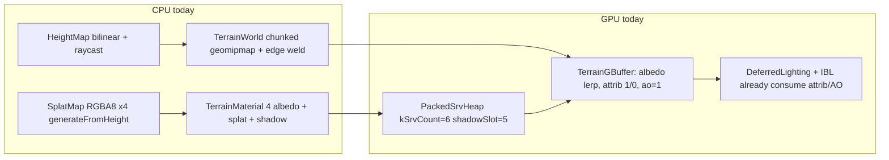
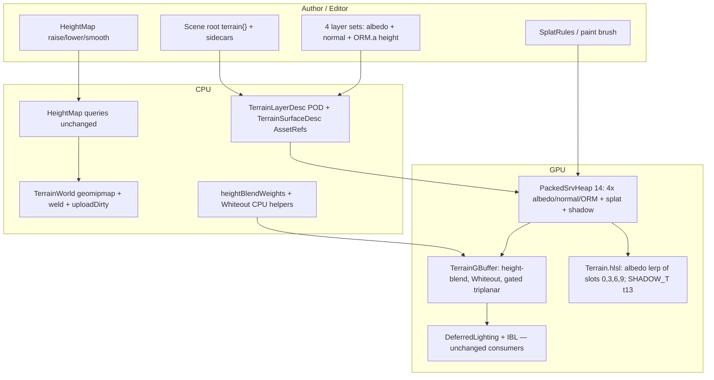
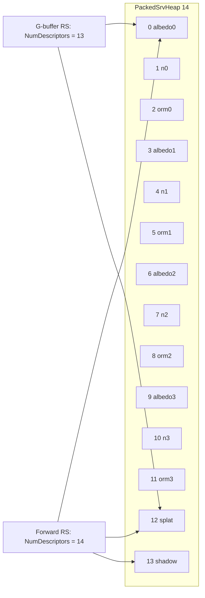

# Terrain look track (height-blend metal-rough splat on geomipmap)

> **Replacement RFC.** Overwrites in-tree `Terrain/DESIGN-terrain-system.md` draft rev 1 (2026-09-18, Plan A CDLOD + splat), which mixed a geo rewrite with the quality work and is not implementable at the bar of `Render/DESIGN-pbr-material-maps.md` rev 4 / `Render/DESIGN-ibl.md` rev 2 (no frozen GPU slots, no energy/blend math, Editor at P6, bindless/BC7 assumed, 4–8 layers unfrozen). Spine kept: four-layer splat, height-blend formula, ENU meters, same BRDF as props, no VT/Nanite/Cesium/tessellation.

| Field | Value |
|-------|--------|
| **Title** | Height-blend metal-rough splat + Editor brushes on current geomipmap |
| **Author** | TBD |
| **Date** | 2026-09-18 |
| **Status** | Draft (rev 2 — look track only; review pass: `k<=0` splat branch, world tiling, TBN + triplanar-(a), Editor punch-list) |
| **Priority** | P1 — quality of HybridDeferred terrain G-buffer (sibling of maps/IBL, not a geo rewrite) |
| **Area** | `Terrain/*`, `Render/TerrainPipeline.*`, `Render/PackedSrvHeap.*`, `content/shaders/TerrainGBuffer.hlsl`, `content/shaders/Terrain.hlsl`, `Sandbox/SandboxApp.cpp`, `Editor/*` (new terrain panel + scene I/O), `Scene/SceneTypes.h`, `Scene/SceneFile.*`, `content/terrain/`, UnitTests |
| **Audience** | Engine, Sandbox, Editor owners who already know this tree |
| **Depends on** | [DESIGN-pbr-material-maps.md](../Render/DESIGN-pbr-material-maps.md) (**landed** — G-buffer MRT3 AO, RT1 oct/rough/metal). [DESIGN-ibl.md](../Render/DESIGN-ibl.md) (**landed** — HybridDeferred lights G-buffer attrib + AO; terrain already participates). [DESIGN-color-management.md](../Render/DESIGN-color-management.md) (**landed** — albedo `_SRGB`, data Linear). Does **not** depend on CDLOD, SSAO, or a new lighting model. |
| **Supersedes** | In-tree `DESIGN-terrain-system.md` rev 1 and `DESIGN-terrain-cheatsheet.md` Plan A one-pager. Maps RFC **M13** “terrain splat out of scope / later RFC” — this is that RFC; still not `Dark::Material`. |
| **Does not** | CDLOD, tile streaming, VS height fetch, coarse physics HF, POM, RVT, bindless, texture arrays, BC7/BC5, 8 layers, world tessellation, VT/Nanite/Cesium, a terrain-only BRDF. |

Companion one-pager (look-track only): [Cheatsheet](#cheatsheet) at the end of this file. PR5 overwrites both `Terrain/DESIGN-terrain-system.md` and `Terrain/DESIGN-terrain-cheatsheet.md` from this document. Streaming follow-up is [`DESIGN-terrain-streaming.md`](./DESIGN-terrain-streaming.md).

---

## Overview

DarkEngine6 already draws a chunked **geomipmap** heightfield (`TerrainWorld`) into the HybridDeferred G-buffer and lights it with the same GGX + IBL path as props. The look is wrong because the G-buffer writer is wrong: `content/shaders/TerrainGBuffer.hlsl` lerps four albedo checkers by splat weights and then writes **roughness = 1, metallic = 0, AO = 1, geomipmap vertex normals**. Quality is not a new LOD scheme. This RFC freezes a **look track** on the current geo: four metal-rough layers (albedo + tangent normal + ORM with **height in A**), height-blend + Whiteout + gated triplanar in the G-buffer PS, a grown `PackedSrvHeap` (14 SRVs, shadow last), and an Editor that treats terrain as **one world-level object** (layer slots, splat rules + paint, height sculpt, scene save) rather than fifty cubes.

No C++ exceptions: `bool` + `DE_LOG_ERROR(LogCategory::Render, ...)` / `DE_LOG_FATAL` + `DE_ASSERT`. Fail closed to checkers / 1×1 defaults. `-forward` stays a Lambert albedo lerp of the new heap (the forward CB **cannot grow**). CDLOD and friends stay named follow-up RFCs.

---

## Background & Motivation

### What the tip actually does

Verified against the tree at `6b5d96aa380fd7f101df02cf3bcfc83871e234c0` (`Terrain/`, `Render/TerrainPipeline.*`, shaders, Sandbox, Editor, Scene). Conversation does not override the tree.



| Piece | Location | Fact |
|-------|----------|------|
| HeightMap | `Terrain/HeightMap.h` | Regular-grid floats. `origin` + `cellSize` + `heightScale`. `heightAtWorld` / `tryHeightAtWorld` / `containsXZ` / `normalAtWorld` / min-max pyramid `raycast`. `create` / `createFrom` / `createFromU16` / `createFbm` / `addLayer`. `setHeight` writes a sample and `markAccelDirty()`. **No dimension cap** (only `width,height >= 2`, `cellSize > 0`). |
| Queries | Sandbox, PathChase, AI, weapons, PlayerMotor | `TerrainWorld::heightAtWorld` forwards to `HeightMap`. Gameplay Y-snap is this API. |
| TerrainWorld | `Terrain/Terrain.h` | Chunked geomipmap. Default `chunkCells = 16` (power of two). `kMaxLodLevels = 8`. `restrictNeighborLods` (ΔLOD ≤ 1). `EdgeMask` weld. CPU `MeshData` per dirty chunk; GPU `Mesh` via `uploadDirty`. `needsRebuild` is LOD/mask/empty-IB only — **sculpt must force `builtLod = -1`**. `createGpu` uploads the fog/water **R32F height texture once** (`if (!m_heightTexture.valid())`); sculpt must re-upload. |
| TerrainLod | `Terrain/TerrainLod.h` | `buildPatchMesh` world-space, skip-odd-edge-verts, **no skirts**. `buildGridIndices` shared with **water** (`Water/Water.cpp` ~251). |
| Vertex | `Render/Mesh.h` | `MeshVertex` is **48 B** (pos/normal/uv/**tangent**). Terrain PSO input layout is still pos/normal/uv only (`TerrainPipeline.cpp` ~121–125); extra tangent bytes are ignored. **Do not add a TANGENT semantic to terrain.** TBN is derived in the PS from the geomipmap normal. |
| SplatMap | `Terrain/SplatMap.h` | `kMaxTerrainLayers = 4` **exactly**. RGBA8, one texel per height sample. Channels need not sum to 255; shader/blender renormalize. `generateFromHeight` paints dirt/grass/rock/snow from height + slope (`SplatRules::rockSlope = 0.45`, `blend = 0.08`). `setTexel` / `getTexel` / `sampleWeights`. **No paint-brush / renormalize helper.** |
| TerrainLayerDesc | `SplatMap.h` ~12–16 | `tiling` + `tint[4]`. `applySurface` writes **tiling only**; tint is dead. `createDefault` tilings 24/20/16/12. |
| TerrainMaterial | `Terrain/TerrainMaterial.h` | Four **albedo** `Texture2D` + splat + shadow. `kSplatSlot = 4`, `kShadowSlot = 5`. `createDefault` builds 64² sRGB checkers (dirt/grass/rock/snow hues, A=255) via `TextureUsage::Albedo`; splat via `TextureUsage::Data`. Registers `PackedSrvHeap` on `GpuResourceCache` so `copyShadow` patches slot 5. `setLayerSamplingRaw` recopies slots **0–3** for `legacyUnormAlbedo`. |
| PackedSrvHeap | `Render/PackedSrvHeap.h` | Generic. `packFromCpuHandles` takes `count`. `copyShadow` writes `heap.shadowSlot`. Default comment `shadowSlot = 4` (GpuMaterial); terrain sets 5. Growing `NumDescriptors` is **heap size, not a root-signature DWORD**. |
| TerrainPipeline | `Render/TerrainPipeline.h` | `kSrvCount = 6`. G-buffer CB **56 floats** (`static_assert`). Forward CB **60 floats**, lighting at byte 224. G-buffer RS: 56 + 1 table = **57/64**, **no** shadow CBV, 1 wrap sampler. Forward RS: 60 + 1 table + shadow CBV = **63/64** — **cannot grow the forward CB**. Both passes use `NumDescriptors = kSrvCount` (G-buffer table includes unused shadow; MeshPipeline already splits `kMapSrvCount` vs `kSrvCount`). PSO G-buffer: 4 RTs (`UNORM_SRGB`, UNORM, `R16G16_FLOAT`, `R8_UNORM`). |
| TerrainGBuffer.hlsl | `content/shaders/TerrainGBuffer.hlsl` | Sample t0–t3 albedo + t4 splat. Soft lerp. `o.albedo = (rgb, 0)`, `o.attrib = (EncodeOct(geomN), 1, 0)`, `o.ao = 1`. No world-pos interpolator (needed for triplanar). |
| Terrain.hlsl | `content/shaders/Terrain.hlsl` | Same albedo lerp. `#define SHADOW_T t5`. Lambert `* DE_PBR_PI` in-shader (IBL PR3; CB cannot hold `pbrLightColor`). FogIntegrate native `lightColor`. |
| G-buffer contract | `content/shaders/GBuffer.hlsli` | RT0 albedo+emis A, RT1 oct/rough/metal, RT2 velocity, MRT3 AO. DeferredLighting + IBL already light whatever attrib/AO terrain writes. |
| IBL | `Render/DESIGN-ibl.md` | HybridDeferred: `ibl * ao + PbrDirectional * CSM + emis`. Terrain G-buffer pixels already receive IBL. Debug views sample bound SRVs. **No terrain-only lighting model.** |
| GpuMaterial defaults | `GpuResourceCache.cpp` ~127–134 | Flat normal `(128,128,255)`, ORM **white `(255,255,255,255)`** (multipliers; metal=1 is OK because mesh scalars multiply). Terrain has **no metallic scalar** — must not reuse white ORM (would make missing maps chrome). |
| ColorUsage | `Math/Color.h` | Albedo/Emissive sRGB; Normal/Orm/Data/Height Linear. `Height` is **R32F world HF** (fog/water), not micro-height. Layer blend height is ORM.a (UNORM), usage **Orm**. |
| Sandbox boot | `Sandbox/SandboxApp.cpp` ~2128–2184 | FBM 129×129, cell 2 m, origin −128. `SplatMap::generateFromHeight` then `TerrainMaterial::createDefault` **checkers**. `setLayerSamplingRaw` from `legacyUnormAlbedo`. `createGpu` + `setHeightSrv`. |
| Editor | `Editor/` | **Zero** `Terrain` includes. 40 m `CreateGroundPlane` + solid `m_groundMaterial` (`EditorAppInit.cpp` ~165–221). `drawMaterialPanel` is mesh `Dark::Material` slots (`EditorModel.cpp` ~449). `SceneObjectType` has Cube/Sphere/lights — **no Terrain**. `groundHitFromRay` is a plane. |
| Scene JSON | `Scene/SceneTypes.h` | `version = 2`, `name`, `mode`, `environment` / `iblIntensity` / `iblRotationRadY`, `objects`. **No terrain field.** IBL added root keys **without** bumping version. 2D has `world.min/max`. |
| Water | `Water/Water.cpp` | Shares `buildGridIndices`. Height SRV from `TerrainWorld::heightTexture()`. |
| Tests | `UnitTests/Terrain/` | `HeightMapTests`, `HeightMapQueryTests`, `SplatMapTests` (set/sample + generateFromHeight touches ≥2 layers), `TerrainLodTests`. **No** height-blend, Whiteout, paint, scene round-trip, or slot-map tests. |
| Content | `content/` | `env/studio_gradient.hdr`. **No** `content/terrain/` layer sets. |

### Pain points

1. **Plastic dirt.** HybridDeferred already runs GGX/IBL on terrain pixels; the writer feeds roughness 1 / metal 0 / geom N / four albedo checkers. The quality jump is G-buffer content.
2. **Rev 1 mixed tracks.** Plan A put CDLOD, bindless, BC7, 8 layers, physics HF, and Editor-at-P6 in the same “v1”. None of that is the look bug. CDLOD does not write better attrib.
3. **Editor has no terrain.** Outdoor 3D scenes are a grey plane plus cubes. Splat/sculpt/save do not exist.
4. **Forward RS is full.** 63/64. Any look feature that needs extra CB floats is HybridDeferred-only, or it is hardcoded in `Terrain.hlsl`.
5. **Tint is dead.** `TerrainLayerDesc::tint` is never copied into the CB.
6. **Sculpt would desync GPU.** `needsRebuild` ignores height edits; `createGpu` will not refresh a valid height texture. Queries on `HeightMap` are already live — the gap is mesh/height-SRV.

---

## Goals & Non-Goals

### Goals (v1 — this look track)

- Four metal-rough layers on the **current** geomipmap. `kMaxTerrainLayers` stays **4**.
- Per layer: albedo (sRGB), tangent-space normal (Linear), ORM (R=AO G=rough B=metal, **A=height**, Linear). Missing map → 1×1 default.
- Height-blend (`k<=0` = splat weights) + Whiteout in the +X heightfield TBN + gated triplanar **albedo+ORM only** in `TerrainGBuffer.hlsl`. Write RT0/RT1/MRT3 so deferred+IBL just work.
- Grow `PackedSrvHeap` to an explicit 14-slot map. Shadow last. No bindless, no texture arrays, no BC7/BC5.
- Editor: one world-level terrain per 3D scene — layer slots, `SplatRules` + paint, height sculpt, scene JSON + sidecars.
- Sandbox: four real-ish layer sets when files exist; `createDefault` checkers remain the no-content fallback.
- Named CPU unit tests. No C++ exceptions.

### Non-goals (v1)

- CDLOD, morph, skirts-vs-weld rewrite, VS height fetch, tile streaming / `TerrainTile` residency.
- 8 layers (second RGBA8 weight map) — follow-up; do not silently drop layers.
- Bindless, texture arrays, BC7/BC5.
- POM, RVT, tessellation, VT, Nanite, Cesium.
- Coarser physics heightfield (queries stay on the same `HeightMap`).
- Folding splat into `Dark::Material` / `GpuMaterial`.
- IBL / π / G-buffer layout changes (already landed).
- Terrain-only BRDF. Water / foliage rewrites.
- Growing `TerrainFrameConstants` (illegal).

---

## Proposed Design

### End-to-end flow



### Frozen product (T0–T13 — not Open Questions)

| ID | Freeze |
|----|--------|
| **T0** | This RFC is the **look track only**. Geo/streaming/physics/POM/RVT/bindless/BC are follow-up RFCs. |
| **T1** | Quality is the G-buffer writer. HybridDeferred already lights terrain. |
| **T2** | Keep HeightMap query API, geomipmap + weld + `uploadDirty`, water `buildGridIndices`, ENU meters, same `PbrLighting.hlsli` BRDF. |
| **T3** | Four layers v1. `kMaxTerrainLayers = 4`. Eight is a follow-up RFC. |
| **T4** | No bindless / arrays / BC7/BC5. Grow `PackedSrvHeap`. Usages: albedo sRGB; normal/ORM/splat Data/Linear. |
| **T5** | Slot map below. Height lives in **ORM.a**. 14 SRVs. Dummy maps. |
| **T6** | Height-blend formula from rev 1, with **`k<=0` → splat weights** (ignore height). Never lerp normal RGB. **Whiteout** v1 in the heightfield TBN (`tW = cross(nG,+Z)` → +X on flats). Gated triplanar is **albedo+ORM only**; normals stay planar. |
| **T7** | G-buffer: RT0 albedo + emis 0; RT1 EncodeOct(blended N) + blended rough/metal; MRT3 blended AO. |
| **T8** | Editor is **in this RFC**. World-level, one per 3D scene. |
| **T9** | Ship or generate four modest layer sets. Tests use solids / tiny images. No 4K requirement. |
| **T10** | Named CPU tests listed under Acceptance. |
| **T11** | Local engine. Size caps. No throw. Fail closed. |
| **T12** | Cheatsheet is look-track only (appendix). |
| **T13** | PR5 sibling one-liners in maps RFC + pbr-roadmap. |

---

### Frozen decision 1 — SRV slot map (14)

Shadow stays **last** so `copyShadow` / `PackedSrvHeap::shadowSlot` / `GpuResourceCache::setShadowSrv` keep a stable patch index. G-buffer does not sample shadow (lighting heap does). Forward does.

Height in **ORM.a** (Linear UNORM). Not albedo.a (keep A=1 on albedo; RT0.a is emissive 0). Not `TextureUsage::Height` (that is the R32F world HF). Not a dedicated R8 (that is 18 SRVs — legal, rejected for v1 to keep authoring to three maps per layer).

```
TerrainMaterial / TerrainPipeline table
  layer i in [0,3]:
    kAlbedo0 + 3*i   = 0,3,6,9     t0/t3/t6/t9   Albedo  (_SRGB or raw if legacyUnormAlbedo)
    kNormal0 + 3*i   = 1,4,7,10    t1/t4/t7/t10  Normal  (Linear UNORM)
    kOrm0    + 3*i   = 2,5,8,11    t2/t5/t8/t11  ORM     (Linear; R=AO G=rough B=metal A=height)
  kSplatSlot  = 12                 t12           Splat   (Data, RGBA8 weights)
  kShadowSlot = 13                 t13           Shadow  (last; copyShadow)
  kMapSrvCount = 13                G-buffer table (prefix, no shadow)
  kSrvCount    = 14                forward table
```



**Root-signature DWORD budget** (static samplers do not count; 64 is the **whole** signature):

| Pass | Constants | Table | Shadow CBV | Sum |
|------|-----------|-------|------------|-----|
| G-buffer today | 56 | 1 | — | **57 / 64** (headroom 7) |
| G-buffer this RFC | **63** | 1 | — | **64 / 64** |
| Forward today / this RFC | 60 | 1 | 2 | **63 / 64** — **do not grow** |

Growing the table to 13 or 14 descriptors is still **one DWORD**. Illegal would be a second table, a root CBV, or a 64-float G-buffer CB.

G-buffer `create()`: `srvRange.NumDescriptors = kMapSrvCount` (13), same MeshPipeline split. Forward: `kSrvCount` (14).

**`SHADOW_T` must move `t5 → t13` in `Terrain.hlsl` in the same PR as the heap** or `-forward` samples ORM as a shadow map (maps RFC M19 class of bug).

`setLayerSamplingRaw` recopies **albedo slots 0,3,6,9 only** (not the whole prefix). Data maps have `cpuHandleRaw() == cpuHandle()`.

**Defaults** (process-lifetime, not AssetIDs; interned lazily on first `TerrainMaterial::pack` / `ensureTerrainDefaults`):

| Default | Bytes | Usage | Why |
|---------|-------|-------|-----|
| Albedo | `(255,255,255,255)` | `Albedo` | Tint/checkers pass through. |
| Normal | `(128,128,255,255)` | `Normal` | `*2-1 → (0,0,1)`. **Reuse** `GpuResourceCache::defaultNormal()`. |
| ORM | `(255, 255, 0, 128)` | `Orm` | AO=1, rough=1, **metal=0**, height=0.5. **Do not** reuse mesh `defaultOrm()` (white metal=1 would chrome missing maps). |

`createDefault` still builds the four **checker albedos**; it binds default normal/ORM on slots 1,2,4,5,… so the 14-wide table is always valid. Checkers stay dull (see Frozen decision 3: `heightBlendK = 0` takes the splat-weight branch, dummy ORM.a=0.5 is unused).

---

### Frozen decision 2 — G-buffer CB (63 floats) + tint packing

Need: height-blend `k`, `t`, triplanar slope threshold, four layer tints. `float4 layerTint[4]` is **16 floats** → CB 72, RS 73 — illegal.

HLSL **arrays of scalars are 16 bytes per element** (DXCB). `uint layerTintPacked[4]` after the three blend floats is not “one pad then four tightly packed uints”: each element takes a full register, so the CB lands around **~76** 32-bit values → RS well past 64. A C++ `uint32_t[4]` **does** pack tightly under MSVC, so an HLSL array vs C++ array would **silently disagree** (the real bug). `LightingConstants` already documents the float3-straddle lesson (`Render/DeferredLightingPipeline.h`).

**Frozen: four scalar uints in both C++ and HLSL, not an array.** Scalars pack tightly (IBL RFC register-11 pad lesson).

```cpp
// Render/TerrainPipeline.h
struct TerrainGBufferConstants
{
    float worldViewProj[16];
    float world[16];
    float color[4];             // rgb unused (1); a = 0 emissive — do not steal .a
    float layerTiling[4];
    float prevWorldViewProj[16];
    // NEW at float 56
    float    heightBlendK;      // 56
    float    heightBlendT;      // 57
    float    triplanarSlope;    // 58
    uint32_t layerTint0;        // 59  RGBA8; RGB = round(sat(linearTint)*255), A unused
    uint32_t layerTint1;        // 60
    uint32_t layerTint2;        // 61
    uint32_t layerTint3;        // 62
};
static_assert(sizeof(TerrainGBufferConstants) == 63 * sizeof(float), "gbuffer terrain CB");
static_assert(offsetof(TerrainGBufferConstants, heightBlendK) == 56 * sizeof(float), "blend params append");
static_assert(offsetof(TerrainGBufferConstants, layerTint0) == 59 * sizeof(float), "scalar uints pack tightly");
static_assert(63 + 1 <= 64, "terrain G-buffer root signature DWORD budget");
```

```hlsl
// TerrainGBuffer.hlsl — after prevWorldViewProj
float    heightBlendK;
float    heightBlendT;
float    triplanarSlope;
uint     layerTint0; // NOT uint layerTintPacked[4]
uint     layerTint1;
uint     layerTint2;
uint     layerTint3;
```

Tint on CPU is **linear Rec.709** (`TerrainLayerDesc::tint`, same convention as `Material::baseColor`). Pack:

```cpp
inline uint32_t packLayerTintLinear(const float tint[4])
{
    const uint32_t r = (uint32_t)Math::Clamp(tint[0] * 255.0f + 0.5f, 0.0f, 255.0f);
    const uint32_t g = (uint32_t)Math::Clamp(tint[1] * 255.0f + 0.5f, 0.0f, 255.0f);
    const uint32_t b = (uint32_t)Math::Clamp(tint[2] * 255.0f + 0.5f, 0.0f, 255.0f);
    return r | (g << 8) | (b << 16) | (255u << 24);
}
```

Shader: `float3 tint = float3(p & 255, (p >> 8) & 255, (p >> 16) & 255) * (1.0f/255.0f);` — already linear, **no** `srgbToLinear` (would double-decode). 8-bit linear quantization is accepted for a multiply.

`applySurface(TerrainGBufferConstants&, float worldSizeX, float worldSizeZ)` fills packed tints, `k/t/slope`, `color = (1,1,1,0)`, and **rewrites `layerTiling[i]` to world-space repeats-per-meter** (Frozen decision 3). The material does not store map size — `TerrainWorld::drawGBuffer` passes `(width-1)*cellSize` / `(height-1)*cellSize` from `HeightMap`. **Do not add origin/size floats to the CB** (already 64/64).

```cpp
inline float layerTilingWorldScale(float tilingRepeatsAcrossMap, float worldSizeX, float worldSizeZ)
{
    const float extent = worldSizeX > worldSizeZ ? worldSizeX : worldSizeZ;
    return (extent > 1.0e-3f) ? (tilingRepeatsAcrossMap / extent) : 0.0f;
}
```

Authored `tiling = 24` on a 256 m map → `24/256` repeats/m. Shader planar and triplanar both use `worldPos * that scale` so cliff density matches flats. Forward `applySurface(TerrainFrameConstants&)` copies **unconverted** tiling (repeats across the map) for `input.uv * layerTiling` — do not share the G-buffer conversion.

**Forward CB is bit-identical 60 floats.** No k/t/slope/tint. Forward does not height-blend.

---

### Frozen decision 3 — height-blend + Whiteout + gated triplanar

**Height-blend** (rev 1 formula, CPU helper + G-buffer PS; identical math), with an explicit **`k<=0` branch**. The raw formula is **not** the identity at `k=0`: dummy ORM.a is 0.5 on every layer, so \(h_i=0.5\), \(\hat{w}_i=1\), \(w_i'=1/4\) — a 4-way mix that **erases** splat. Large `k` with equal dummy heights *sharpens* splat; `k=0` with equal heights *erases* it.

\[
h_i = H_i + k\,w_i,\quad
\hat{w}_i=\mathrm{sat}\!\big((h_i-(h_{\max}-t))/t\big),\quad
w_i'=\hat{w}_i\Big/\sum_j\hat{w}_j
\]

**Frozen branch** (CPU + HLSL, before the formula):

- If `k <= 0`: `outW` = renormalized splat, **ignore height / ORM.a**. This is the checkers path.
- Else: apply the formula.
- If \(\sum\hat{w}=0\), fall back to the pre-blend splat weights.
- \(H_i\) = sampled ORM.a in \([0,1]\)
- \(w_i\) = splat weight after the existing 4-channel renormalize
- \(k\) default **0.5** on authored layer sets; `createDefault` checkers set **`k = 0`** (splat branch)
- Dummy ORM.a stays **0.5** so authored `k=0.5` still has a height contrast from \(k w_i\)
- \(t\) default **0.1**, clamped to \(\geq 10^{-3}\) in the helper (avoid div0)

```cpp
// Terrain/HeightBlend.h — CPU, no throw
bool heightBlendWeights(const float height[kMaxTerrainLayers],
                        const float splat[kMaxTerrainLayers],
                        float k, float t,
                        float outW[kMaxTerrainLayers]);
```

Returns `false` only if `outW` is null; still writes zeros. Always renormalizes. `HeightBlend_KZero_EqualsSplat` locks the branch (not the raw formula).

**Normals: never lerp RGB.** Whiteout in the **heightfield tangent frame**, then one transform to world.

**TBN from geomipmap N** (heightfield, +U = +X). Do not grow the terrain input layout. **Do not** use `cross(+Z, nG)` — on flat `nG=(0,1,0)` that is **−X** (flipped red channel vs patch UV). Frozen:

```hlsl
float3 nG = normalize(input.normalWS);
float3 tW = cross(nG, float3(0.0f, 0.0f, 1.0f)); // +X on nG = +Y
if (dot(tW, tW) < 1e-6f)
    tW = float3(1.0f, 0.0f, 0.0f);
tW = normalize(tW);
float3 bW = cross(tW, nG); // +Z on flats; right-handed
```

```hlsl
float3 WhiteoutAccum(float3 acc, float3 nLayer, float w)
{
    // nLayer already *2-1 and normalized in the heightfield TBN
    acc.xy += nLayer.xy * w;
    acc.z  *= lerp(1.0f, nLayer.z, w);
    return acc;
}
// init acc = float3(0,0,1); after layers: acc = normalize(acc);
// nWorld = normalize(acc.x * tW + acc.y * bW + acc.z * nG);
```

CPU oracle (tests):

```cpp
Math::Vector3f whiteoutBlend(const Math::Vector3f n[kMaxTerrainLayers], const float w[kMaxTerrainLayers]);
Math::Vector3f lerpRgbNormals(const Math::Vector3f n[kMaxTerrainLayers], const float w[kMaxTerrainLayers]); // test-only
```

`Terrain_Whiteout_DiffersFromLerpRgb` must fail if someone “simplifies” to `lerp(n0,n1,w)`.

RNM is a **named follow-up**, not v1.

**Gated triplanar — albedo + ORM only (policy a).** Slope \(= 1 - \mathrm{sat}(n_G.y)\), same convention as `SplatMap::generateFromHeight`. Threshold **`triplanarSlope = 0.45`** (matches `SplatRules::rockSlope`). Power **4** hardcoded. Editor may expose the threshold.

When `slope > triplanarSlope`, sample **albedo and ORM** on world XZ / YZ / XY, weights `pow(abs(nG), 4)` renormalized. **Normal maps always use planar world-XZ UVs in the heightfield TBN above.** Do **not** sample YZ/XY normals through that TBN (cliff maps would smear). Documented v1 compromise: steep color/ORM do not stretch; normal detail stays overhead-projected. Option (b) — per-plane TBN, Whiteout in world — is a named follow-up, not v1.

**World-space UVs (planar and triplanar).** G-buffer VS gains `float3 worldPos : TEXCOORD3` (`mul(float4(position,1), world)` — world is IDENTITY for terrain patches, but keep the mul). After `applySurface(..., worldSizeX, worldSizeZ)`, `layerTiling[i]` is **repeats-per-meter**. Both paths use it:

```hlsl
float  s    = layerTiling[i];
float2 uvXZ = input.worldPos.xz * s; // planar normals; planar albedo/ORM when slope <= threshold
float2 uvYZ = input.worldPos.yz * s;
float2 uvXY = input.worldPos.xy * s;
```

Do **not** use `input.uv * layerTiling` in the G-buffer PS (that was repeats-across-the-map). Origin is already in `worldPos`; wrap sampler handles negative UVs. No extra CB floats.

---

### Frozen decision 4 — G-buffer contract

After blend (weights \(w_i'\)):

| Target | Write |
|--------|--------|
| RT0 | `float4(albedo.rgb, 0)` — emissive **0** (terrain is not emissive). Albedo = \(\sum w_i' \cdot \mathrm{albedo}_i \cdot \mathrm{tint}_i\), already linear via `_SRGB`. |
| RT1 | `float4(EncodeOct(nWorld), roughness, metallic)` with roughness \(= \sum w_i' \cdot \mathrm{ORM}.g\), metallic \(= \sum w_i' \cdot \mathrm{ORM}.b\). |
| RT2 | `VelocityUv` unchanged. |
| MRT3 | AO \(= \sum w_i' \cdot \mathrm{ORM}.r\). |

Albedo/rough/metal/AO **may** lerp (they are scalars/colors). Normals **must not**.

Then `DeferredLighting.hlsl` / IBL consume attrib + AO with **zero** lighting-shader changes. Chrome rock (ORM metal=1, rough=0) reflects the studio HDRI; dirt (metal=0, authored rough) gets IBL diffuse × AO.

Empty-CB guard from maps (`if (rough==0 && metal==0) rough=1`) is **not** used on terrain: dummy ORM is metal=0 rough=1; authored black-metal is legal.

---

### Frozen decision 5 — `-forward`

HybridDeferred is the quality path. Forward RS is **63/64** and `TerrainFrameConstants` stays 60 floats.

**Frozen: albedo-weight lerp only**, sampling albedo slots **0,3,6,9** + splat **t12** from the new heap. Ignore normal/ORM. `SHADOW_T t13`. Tint is **not** in the forward CB — forward multiplies by `color.rgb` (still 1) only. Lighting-off still `encodeSceneRgb`. Lambert π contract unchanged.

Forward keeps **`input.uv * layerTiling`** with tiling = **repeats across the map** (today). Do **not** run the G-buffer world-scale conversion on `TerrainFrameConstants` — that would densify `-forward` by ~worldSize.

No second heap. Checkers and authored albedos both show; height-blend/Whiteout/triplanar are deferred-only. Document in changelog.

---

### Frozen decision 6 — CPU layer desc + splat paint + sculpt

Keep `TerrainLayerDesc` a **POD** on `Terrain/SplatMap.h` (tiling + tint only). Do **not** add `std::string` / `AssetRef<Image>` there — `SplatMap` is a CPU RGBA8 weight map with no Assets include.

```cpp
// Terrain/SplatMap.h — kMaxTerrainLayers stays 4. POD.
struct TerrainLayerDesc
{
    float tiling = 8.0f;
    float tint[4]{ 1.0f, 1.0f, 1.0f, 1.0f }; // linear Rec.709
};

// Terrain/TerrainMaterial.h (or TerrainSurfaceDesc next to it)
struct TerrainMaterialParams
{
    float heightBlendK   = 0.5f;
    float heightBlendT   = 0.1f;
    float triplanarSlope = 0.45f;
};

struct TerrainSurfaceDesc
{
    TerrainLayerDesc layers[kMaxTerrainLayers];
    AssetRef<Image>  albedo[kMaxTerrainLayers]; // empty → GPU default
    AssetRef<Image>  normal[kMaxTerrainLayers];
    AssetRef<Image>  orm[kMaxTerrainLayers];
    TerrainMaterialParams params;
};
```

JSON DTO stays in `Scene/SceneTypes.h` as `TerrainSceneDesc` (paths as `std::string`, tiling/tint, bindLayout, sidecar names). Do **not** put D3D types on any of these. Do **not** fold into `Dark::Material`.

`TerrainMaterial::pack` takes a `TerrainSurfaceDesc` (via `GpuResourceCache::ensureTexture` with Albedo/Normal/Orm) + splat `Texture2D`. Missing ref → default handle. First-usage-wins still applies: never `ensureTexture(Orm)` on an albedo id (intern ORM under a distinct key if a file is reused — `#terrainOrm{layer}` if needed). Fail `false` + log if splat invalid or device null. No throw.

**Splat paint** (CPU, then GPU re-upload):

```cpp
// Raise channel `layer` at texel, then renormalize so sum == 255 (or 1.0 in float).
void SplatMap::paintTexel(int x, int z, int layer, float amount); // amount in [-1,1] of full scale
void SplatMap::paintDisk(float sampleX, float sampleZ, float radiusSamples, int layer, float amount);
bool SplatMap::renormalizeTexel(int x, int z); // sum 0 → grass=255; else scale to 255
```

After paint: rebuild splat `Image` + `Texture2D::createFromImage(..., Data)` + `packSrvHeap`. Same frame as the CPU weights.

**Sculpt** (CPU `HeightMap`, then meshes + height SRV):

```cpp
void HeightMap::addDisk(float worldX, float worldZ, float radiusM, float deltaRaw);
void HeightMap::smoothDisk(float worldX, float worldZ, float radiusM, float alpha);
```

`setHeight` already dirties accel. `heightAtWorld` reads samples the same frame. `raycast` rebuilds the pyramid lazily via `ensureAccel()`.

`TerrainWorld` grows:

```cpp
void markHeightDirty();                 // all chunks builtLod = -1
void markHeightDirtyRect(int x0, int z0, int x1, int z1);
bool uploadHeightTexture(Renderer&);    // always rewrite R32F (sculpt path)
```

Host tick copies Sandbox `syncTerrainLod` (`Sandbox/SandboxApp.cpp` ~2015–2036): `updateLod` → if dirty **`renderer.waitForGpu()`** (in-flight command lists own the VBs) → `rebuildDirtyCpuMeshes` → `uploadDirty`; **plus** `uploadHeightTexture` + `renderer.setHeightSrv` / water `setHeightSrv` when the HF changed (`Texture2D::createFromRaw` resets GPU handles). Queries never wait on GPU. Sculpt “same tick” means this sequence, not a skip of `waitForGpu`.

**Caps (T11):**

| Resource | Cap | On exceed |
|----------|-----|-----------|
| HeightMap width, height | **1025** (inclusive) | `false` + `DE_LOG_ERROR`, no giant alloc |
| SplatMap | must equal HeightMap size; same 1025 cap | `false` |
| Layer images | max(width,height) **2048** | skip that map, pack default, log |
| Sidecar file | height.bin ≤ **32 MB**; splat PNG via existing Image/WIC | `false` + log |

1025² × 4 B ≈ 4.2 MB per HF. Sandbox 129×129 is legal. No cap today — this is new.

---

### Frozen decision 7 — Editor (in this RFC, not a later P6)

Terrain is **world-level**, one `TerrainWorld` + one `TerrainMaterial` per 3D scene. **Not** a `SceneObjectType`. Do not spawn 50 terrain cubes.

Editor today has **zero** `Terrain` includes. `SceneRendererDesc.createWorldEnvironment = false` (`Editor/EditorAppInit.cpp` ~110–111). TerrainPipeline is only created inside `SceneRenderer::createWorldEnvPipelines` (`Render/SceneRenderer.cpp` ~117–135), which also creates WaterPipeline + SkyPipeline. Sandbox sets the flag true; Editor does not. **Do not flip `createWorldEnvironment`** — that is not “create terrain,” it pulls water/sky the Editor does not draw.

**Host punch-list (PR4, required):**

1. **TerrainPipeline only.** Add `SceneRendererDesc::createTerrainPipeline` (default false). `init`: if `createWorldEnvironment` → today’s terrain+water+sky; else if `createTerrainPipeline` → **only** `TerrainPipeline` via `liveTerrainPass` (G-buffer when HybridDeferred). Editor sets `createTerrainPipeline = true`, `createWorldEnvironment` stays **false**. Accessor stays `m_scene.terrainPipeline()`. Do not Editor-own a second pipeline type unless the desc bit is rejected in review — the desc bit is the freeze.
2. **`EditorApp` members:** `Terrain::TerrainWorld m_terrain`, `TerrainMaterial m_terrainMaterial`, `Terrain::SplatMap m_splat`, `Terrain::SplatRules m_splatRules`, `bool m_haveTerrain`. Not a `SceneObjectType`.
3. **Tick:** copy Sandbox `syncTerrainLod` including **`renderer.waitForGpu()`** before `rebuildDirtyCpuMeshes` / `uploadDirty`. On HF dirty: `uploadHeightTexture` + `renderer.setHeightSrv` (`Texture2D::createFromRaw` resets handles; Editor has no height SRV path today).
4. **`renderScene3D` (`Editor/EditorRender3D.cpp`):** when `m_haveTerrain && m_terrainMaterial.isValid()`: **skip** the 40 m `m_groundMesh` draw (~178–181) and its shadow capture (~70–71); `m_terrain.drawDepth` per cascade; `drawGBuffer` (deferred) or `draw` (`-forward`); **expand `sceneBounds` with `m_terrain.bounds()`** (today a hardcoded ±22 box ~58 — a 256 m HF would be mostly unshadowed; Sandbox starts from `m_terrain.bounds()` ~2377 and `drawDepth` ~2411).
5. **`groundHitFromRay`:** if terrain valid, `HeightMap::raycast`; miss / off-map = **no-op** (`false`), not the Y=0 plane. If no terrain, keep today’s plane so empty 3D scenes stay usable.
6. **Legacy UNORM:** `EditorUi.cpp` ~116–120 already toggles `gpuResources().setAlbedoSamplingRaw` (interned **mesh** materials only). When terrain exists, also `m_terrainMaterial.setLayerSamplingRaw(device, raw)` on albedo slots **0,3,6,9**.

New ImGui window **Terrain** (always available in 3D mode; hidden in 2D), patterned on `drawMaterialPanel` (`Editor/EditorModel.cpp` ~605–673): Load / Clear / size text per image slot, sliders, live `ensure`/repack.

| Block | UI | Backend |
|-------|----|---------|
| Create / destroy | “Create terrain” (FBM 129×129, cell 2 m, origin −extent/2, `generateFromHeight`, checkers or content layer set); “Remove terrain” | Builds `m_terrain` + material + splat. Punch-list 4–5 take over draw/picking while valid. |
| Layer 0–3 | Albedo / Normal / ORM slots (virtual path + Load via existing `pickImagePath` + `assets().loadImageFile`); tiling; linear tint ColorEdit | `TerrainSurfaceDesc` refs; `ensureTexture` usages; pack. |
| Blend | k `[0,2]`, t `[0.01, 0.5]`, triplanar slope `[0,1]` | `TerrainMaterialParams` → G-buffer CB. `k=0` is the splat branch. |
| Splat | `SplatRules` sliders + “Generate from height”; brush: layer combo, radius, strength, raise/lower | `generateFromHeight` / `paintDisk`; dirty splat GPU. |
| Sculpt | raise / lower / smooth; radius; strength | `addDisk` / `smoothDisk`; `markHeightDirtyRect`; punch-list 3. |
| Save | scene root keys + sidecars next to the JSON | `TerrainSceneDesc` in `SceneTypes.h`. |

Particles / mesh material panel **unchanged**. Do not show terrain slots there.

Mouse: existing camera ray; punch-list 5 for brush center. Off-map: no-op, no throw.

When no terrain in the scene, keep today’s grey ground plane so Editor 3D remains usable.

---

### Frozen decision 8 — scene JSON + sidecars

**No version bump** (`SceneFileData::version` stays **2**; IBL precedent). Optional `terrain` object on the **root**. Missing → no terrain (Editor ground plane / Sandbox still boots its FBM). Empty/invalid → log, fail closed, no throw. **2D ignores** the object (do not write it).

```json
{
  "version": 2,
  "name": "untitled",
  "mode": "3d",
  "environment": "env/studio_gradient.hdr",
  "terrain": {
    "bindLayout": 1,
    "chunkCells": 16,
    "heightBlendK": 0.5,
    "heightBlendT": 0.1,
    "triplanarSlope": 0.45,
    "heightFile": "untitled.height.bin",
    "splatFile": "untitled.splat.png",
    "layers": [
      {
        "albedo": "terrain/dirt/albedo.png",
        "normal": "terrain/dirt/normal.png",
        "orm": "terrain/dirt/orm.png",
        "tiling": 24,
        "tint": [1, 1, 1, 1]
      }
    ]
  },
  "objects": []
}
```

`bindLayout: 1` = this 14-slot ORM.a map. Unknown layout → log, skip GPU pack, checkers if Sandbox, no terrain if Editor. Future 8-layer RFC is `bindLayout: 2`.

**Height sidecar** (`*.height.bin`), little-endian, no throw:

```
u32 magic = 0x46484544  // 'DEHF'
u32 version = 1
u32 width
u32 height
f32 cellSize
f32 heightScale
f32 originX, originY, originZ
f32 samples[width * height]
```

Reject magic/version mismatch, width/height outside `[2,1025]`, or `sizeof` past 32 MB.

**Splat sidecar:** PNG RGBA8 via existing `Image::createFromFile` / WIC, `TextureUsage::Data`. Size must match height samples. Missing splat → `generateFromHeight` (log once).

Layer paths are **virtual content paths** (same intern as materials). Missing file → that slot’s default, log, continue.

`SceneFile.cpp` parse uses `json::parse(s, nullptr, false)` + `is_discarded()` (no exceptions).

---

### Frozen decision 9 — content

Ship **`content/terrain/{dirt,grass,rock,snow}/{albedo,normal,orm}.png`**. Modest resolution (**256² or 512²**, not 4K). ORM.a holds a plausible height (dirt/grass ~0.4–0.6, rock noisier, snow flatter). Albedo sRGB; normal/ORM Linear tagged on intern.

CC0 / engine-generated is fine. Do not check in 4K sets.

Sandbox boot: if all four albedo files load, `TerrainMaterial::create` with those + generated splat; else `createDefault` checkers (log once). Tests **never** open these files — 1×1 solids / in-memory RGBA.

---

### Shader sketch (G-buffer PS, look change)

```hlsl
Texture2D gAlbedo0 : register(t0);
Texture2D gNormal0 : register(t1);
Texture2D gOrm0    : register(t2);
// ... layers 1–3 at t3–t11
Texture2D gSplat   : register(t12);
SamplerState gSamp : register(s0);

float3 DecodeTint(uint p)
{
    return float3(p & 255u, (p >> 8) & 255u, (p >> 16) & 255u) * (1.0f / 255.0f);
}

GBufferOut PSMain(PSInput input)
{
    float4 splat = gSplat.Sample(gSamp, input.uv);
    float  wsum  = splat.r + splat.g + splat.b + splat.a + 1e-5f;
    splat /= wsum;

    float  H[4], w[4];
    float3 alb = 0.0.xxx;
    float  ao = 0, rough = 0, metal = 0;
    float3 nT = float3(0, 0, 1);
    float3 nG = normalize(input.normalWS);
    float  slope = 1.0f - saturate(nG.y);
    // albedo/ORM: planar world XZ if slope <= triplanarSlope, else triplanar XZ/YZ/XY
    // normals: ALWAYS planar world XZ in heightfield TBN (policy a) — never YZ/XY through XZ TBN
    // if (heightBlendK <= 0) w = splat; else heightBlendWeights(H, splat, k, t) → w
    // WhiteoutAccum nT from planar normals; alb/ao/rough/metal weighted
    // tW = cross(nG, +Z), fallback +X; bW = cross(tW, nG); nWorld = TBN * normalize(nT)
    GBufferOut o;
    o.albedo   = float4(alb, 0);
    o.attrib   = float4(EncodeOct(nWorld), rough, metal);
    o.velocity = VelocityUv(input.currClip, input.prevClip);
    o.ao       = ao;
    return o;
}
```

Use `0.0.xxx` not `0.xxx` (FXC X3000; Fog/IblBake lesson).

---

## API / Interface Changes

Covered above. Summary of new/changed surfaces:

- `Terrain::kMaxTerrainLayers` **unchanged** (4).
- `TerrainLayerDesc` stays POD tiling+tint on `SplatMap.h`.
- `TerrainSurfaceDesc` + `TerrainMaterialParams` on `TerrainMaterial.h` (AssetRefs live here).
- `TerrainMaterial`: 14-slot pack; `kSplatSlot=12`, `kShadowSlot=13`; `create` from `TerrainSurfaceDesc`; defaults; `applySurface(GBuffer, worldSizeX, worldSizeZ)` writes blend params, packed tints, **world-scale tiling**; forward `applySurface` keeps repeats-across-map.
- `TerrainPipeline::kSrvCount=14`, `kMapSrvCount=13`; G-buffer CB 63 floats; G-buffer table 13, forward 14.
- `HeightBlend.h` helpers (`k<=0` splat branch, `layerTilingWorldScale`); `SplatMap::paint*`; `HeightMap::addDisk` / `smoothDisk`; size caps on `create`.
- `TerrainWorld::markHeightDirty*`, `uploadHeightTexture`.
- `SceneFileData` optional `TerrainSceneDesc` (JSON DTO, paths as strings).
- `SceneRendererDesc::createTerrainPipeline` (Editor; not `createWorldEnvironment`).
- Editor Terrain window + punch-list; Sandbox content load with checker fallback.

No `AssetType` addition. No `Dark::Material` fields.

---

## Data Model Changes

- Scene JSON optional `terrain` object; version stays 2.
- Sidecars `*.height.bin` + `*.splat.png` next to the scene file (not inside JSON).
- CPU Images interned by virtual path; ORM must not share an Albedo AssetID (first-usage-wins).
- No network payload (hosts own `TerrainWorld`; replication does not send heaps).
- Vertex stride unchanged (already 48 B from maps RFC). Terrain PSO still 3 elements.

---

## Downstream inventory

Every bind / draw / load / save / edit site.

| Site | Role today | v1 change |
|------|------------|-----------|
| `Terrain/SplatMap.h/.cpp` | 4-ch RGBA, generateFromHeight, sampleWeights; POD `TerrainLayerDesc` | paint/renorm helpers; size cap; **keep desc POD** (no AssetRef) |
| `Terrain/HeightMap.h/.cpp` | queries, setHeight, no cap | 1025 cap; addDisk/smoothDisk; tests (query unchanged after sculpt) |
| `Terrain/HeightBlend.h` (+.cpp) | none | CPU height-blend (`k<=0` splat branch) + Whiteout + lerpRgb (test) + attrib pack + `layerTilingWorldScale` |
| `Terrain/Terrain.h/.cpp` | geomipmap draw/upload | markHeightDirty*; uploadHeightTexture on sculpt; `drawGBuffer` passes world size into `applySurface`; **query wrappers unchanged** |
| `Terrain/TerrainLod.*` | weld + `buildGridIndices` | **skip** (water contract) |
| `Terrain/TerrainMaterial.*` | 6-slot albedo heap | 14-slot pack; `TerrainSurfaceDesc` AssetRefs; defaults; packed tints; G-buffer world tiling; setLayerSamplingRaw albedo 0,3,6,9 |
| `Render/TerrainPipeline.*` | kSrvCount=6; CB 56/60 | kSrvCount=14, kMapSrvCount=13; G-buffer CB 63; table split; `static_assert` RS sum |
| `Render/PackedSrvHeap.*` | parametric | comment: terrain shadowSlot 13; code already parametric |
| `Render/GpuResourceCache.*` | registerPackedHeap; default normal/ORM/emis; setAlbedoSamplingRaw **interned materials only** | optional `defaultTerrainOrm`; do **not** walk terrain in `setAlbedoSamplingRaw` (host still calls `setLayerSamplingRaw`) |
| `content/shaders/TerrainGBuffer.hlsl` | albedo lerp, attrib 1/0, ao=1 | 14-decl, `k<=0` splat branch, Whiteout in +X TBN, triplanar **albedo+ORM only**, worldPos UVs, attrib/AO write |
| `content/shaders/Terrain.hlsl` | albedo lerp, `SHADOW_T t5` | sample albedo 0/3/6/9 + splat t12; **`SHADOW_T t13` in PR2**; keep `uv * tiling` (unconverted) |
| `Sandbox/SandboxApp.cpp` | FBM + createDefault checkers; `syncTerrainLod` + `waitForGpu` | try `content/terrain/...`; fallback checkers; keep waitForGpu; `setHeightSrv` after height re-upload |
| `Sandbox/DevToolsPanel.cpp` | `setLayerSamplingRaw` | still host-side; albedo slots 0,3,6,9 |
| `Render/SceneRenderer.h/.cpp` | `createWorldEnvironment` → terrain+water+sky | **new** `createTerrainPipeline` (terrain only). Editor must not set `createWorldEnvironment` |
| `Editor/EditorAppInit.cpp` | `createWorldEnvironment=false`; ground plane + solid | `createTerrainPipeline=true`; keep plane until `m_haveTerrain` |
| `Editor/EditorApp.h` | no terrain members | `TerrainWorld` + `TerrainMaterial` + `SplatMap` + rules + `m_haveTerrain` |
| `Editor/EditorRender3D.cpp` | ±22 shadow box; draw/capture `m_groundMesh`; no terrain draw | punch-list 4: skip plane, `drawDepth`/`drawGBuffer`/`draw`, `sceneBounds` ∪ `terrain.bounds()` |
| `Editor/EditorUi.cpp` | `setAlbedoSamplingRaw` interned materials only | also `setLayerSamplingRaw` albedo 0,3,6,9 when terrain exists |
| `Editor/EditorModel.cpp` | mesh material panel | **skip** (do not fold terrain into it) |
| **New** `Editor/EditorTerrain.cpp` (or `EditorApp` methods) | none | Terrain window, brushes, create/remove |
| `Editor/EditorSceneFile.cpp` | objects + IBL root keys | fill/load `TerrainSceneDesc` + sidecars |
| `Editor` picking | Y=0 plane `groundHitFromRay` | HeightMap raycast when terrain valid; miss = no-op |
| `Scene/SceneTypes.h` | no terrain | `TerrainSceneDesc` JSON DTO + `SceneFileData::terrain` optional |
| `Scene/SceneFile.cpp` | version 2 + IBL keys | optional `terrain` object; 2D skip |
| `content/terrain/` | none | four layer sets (PR3) |
| `Render/DESIGN-pbr-material-maps.md` | M13 “later RFC” | PR5 one-liner: look-track is this RFC; still not Dark::Material |
| `Render/DESIGN-pbr-roadmap.md` | seven PBR features | PR5 one-liner: terrain splat look-track is sibling, not item 3 |
| `AI/`, `Character/PlayerMotor`, `Weapons/`, PathChase | heightAtWorld / raycast | **skip** (API stable) |
| Water / Sky / Fog / Particles / IBL lighting | consume G-buffer / height SRV | skip except height SRV refresh on sculpt |
| Network | no terrain component | skip |
| `UnitTests/Terrain/*` | HF / splat / lod | new tests listed below |
| Sprite / HUD / 2D | own pipelines | skip |

---

## Alternatives Considered

### 1. CDLOD (rev 1 Plan A) vs look-on-geomipmap (this RFC)

| | CDLOD first | Look track first (**pick**) |
|--|-------------|------------------------------|
| Visual | Same dull attrib until P3 | G-buffer metal-rough **now** |
| Risk | Rewrite selection + morph + crack policy | Shader + heap + Editor |
| Keep | Would retire weld | Weld + ΔLOD≤1 stay |
| Editor | Rev 1 parked at P6 | In this RFC |

CDLOD does not write roughness. Follow-up RFC after this lands.

### 2. Dedicated R8 height (18 SRVs) vs ORM.a (14)

18 is still one table. Extra authoring map, extra dummy. **Pick ORM.a** so three files per layer match mesh (albedo/normal/ORM). Dedicated R8 is the named escape if packed height fights an external tool.

### 3. Bindless / texture arrays vs packed heap

Maps RFC M15 / platform-agnostic-assets D4: the tree is packed heaps + `copyShadow`. Bindless is a different project. **Pick grow PackedSrvHeap.**

### 4. 8 layers v1 vs 4

Second weight texture + 12 more SRVs (or arrays). Tip splat is 4-channel. Silent drop is on the explode list. **Pick 4.** Eight is a follow-up with `bindLayout: 2`.

### 5. Height-blend on `-forward` vs albedo lerp

Forward CB cannot grow (63/64). Hardcoding k/t in the shader would diverge from Editor sliders. **Pick albedo lerp** of the new heap; quality is HybridDeferred.

### 6. RNM vs Whiteout vs RGB lerp

RGB lerp is forbidden (flattening). RNM is better on steep blends, more ALU. **Pick Whiteout v1**; RNM follow-up.

### 7. `Dark::Material` for layers vs `TerrainMaterial`

Four blended layers with splat/height are not a Filament recipe. Maps RFC explicitly left splat out. **Pick keep TerrainMaterial.**

### 8. SceneObjectType::Terrain vs world-level root

Fifty cubes is the failure mode. IBL already used a root object (`environment`). **Pick world-level `terrain{}`.**

### 9. Triplanar normals vs albedo+ORM only (policy a)

| | (a) albedo+ORM triplanar, normals planar | (b) per-plane TBN, Whiteout in world |
|--|------------------------------------------|--------------------------------------|
| ALU | 3× albedo/ORM on cliffs, 1× normal | 3× all maps + 3 TBNs × 4 layers |
| Cliff color | No stretch | No stretch |
| Cliff normals | Overhead-projected (documented) | Correct per face |
| Wrong option | YZ/XY samples through XZ TBN — smear | — |

**Pick (a) for v1.** (b) is the named follow-up. Do not ship YZ/XY normals through the heightfield TBN.

---

## Security & Privacy Considerations

Local game engine. No network fetch of heightfields.

- **Untrusted sidecars / images:** HeightMap 1025² and 32 MB file cap; layer 2048; splat must match HF. RLE/WIC stay on the existing Image path.
- **No new parser** beyond a trivial `DEHF` header (magic + sizes then floats).
- **Fail closed:** missing file / bad magic / oversize / null device → defaults or no terrain, `DE_LOG_ERROR`, **no throw**.
- **No GPU heaps on the network.**
- `Agents.md`: no `try`/`catch`/`throw` in engine/Sandbox/Editor.

---

## Observability

| Signal | When | Volume |
|--------|------|--------|
| `DE_LOG_INFO(LogCategory::Render, "TerrainMaterial: 14-slot heap ready (bindLayout=1)")` | successful pack | Once per pack |
| `DE_LOG_INFO(LogCategory::Render, "Terrain: using content layer set")` / `"checkers fallback"` | Sandbox boot | Once |
| `DE_LOG_ERROR(LogCategory::Render, "TerrainMaterial: missing '{}' — default slot {}")` | missing map | Once per slot |
| `DE_LOG_ERROR(..., "HeightMap: {}x{} exceeds 1025")` | cap | Once; `false` |
| `DE_LOG_ERROR(..., "SceneFile: terrain bindLayout {} unknown")` | future/garbage | Once; skip terrain |
| Frame spam | — | **Forbidden** |

PIX: keep terrain draw names; no new metric series.

---

## Risks

| Risk | Severity | Mitigation |
|------|----------|------------|
| Forward `SHADOW_T` left at t5 after heap bump | **High** (garbage shadows / debug layer) | Same PR as `kSrvCount=14`. Soak `-forward`. |
| G-buffer CB 63 + table = 64; HLSL `uint arr[4]` is **16 bytes/element** (~76 floats) while C++ `uint32_t[4]` packs tight | **High** (serialize fail or silent C++/HLSL mismatch) | **Scalar** `layerTint0..3` in both languages; `static_assert` sizeof + offsets + RS sum. |
| `k=0` coded as the raw formula | **High** (4-way mix, splat gone) | Explicit `k<=0` splat branch; `HeightBlend_KZero_EqualsSplat`. |
| `layerTiling` as repeats-across-map on `worldPos` | **High** (~256× density on cliffs) | CPU `layerTilingWorldScale`; G-buffer uses worldPos × repeats/m. No extra CB floats. |
| `cross(+Z, nG)` TBN / YZ normals through XZ TBN | **High** (flipped U; smeared cliffs) | `tW = cross(nG,+Z)`; policy (a) planar normals. |
| Editor `createWorldEnvironment=true` | **High** (unwanted Water/Sky) | `createTerrainPipeline` only. |
| Editor ±22 shadow box / leftover ground plane | **High** (unshadowed HF / z-fight) | `sceneBounds` ∪ `terrain.bounds()`; skip `m_groundMesh` when valid. |
| Sculpt without `waitForGpu` | **High** (in-flight VB) | Copy `syncTerrainLod`. |
| Reuse mesh `defaultOrm` (metal=1) | **High** (chrome checkers) | Terrain ORM dummy `(255,255,0,128)`. Test missing ORM → metal 0. |
| `createGpu` skips height SRV refresh | **High** (fog/water stale after sculpt) | `uploadHeightTexture` always on HF dirty. |
| `needsRebuild` ignores sculpt | **High** (CPU queries live, mesh old) | `markHeightDirty` clears `builtLod`. |
| `setLayerSamplingRaw` still copies 0–3 linearly | **High** (raw albedo on normal slot) | Copy slots 0,3,6,9 only. |
| ensureTexture Orm on an albedo id | **Medium** | Distinct intern key if a file is reused. |
| Extra 8 SRVs bandwidth | **Low** | 14 vs 6; HybridDeferred only samples them in the terrain PS. Soak. |
| Editor raycast off-map throw | **High** | `tryHeightAtWorld` / raycast miss → no-op. Test missing files / empty scene. |
| 8-layer content silently dropped | **High** (explode list) | `kMaxTerrainLayers=4`; unknown JSON layers >4 → WARN, use first 4, do not drop without log. |
| CDLOD sneaking into this PR | **High** (scope) | T0; review rejects geo rewrite. |

---

## Rollout Plan

No AppConfig bit. Missing maps are identity. Checkers remain valid. `-forward` is not a look-track rollback; it samples albedo from the new heap.

**Look change:** HybridDeferred terrain with authored maps (PR2+PR3). Solids/checkers **unchanged** (`k<=0` splat branch, dummy ORM metal 0). Changelog: “Terrain G-buffer writes height-blended metal-rough layers; checkers unchanged; Editor terrain window.”

Rollback: revert PR2 (shaders/heap) first if soak hates the look; PR1 CPU helpers can stay. Reverting PR2 without moving `SHADOW_T` back **breaks** `-forward` — revert the whole heap PR.

Stacked PRs below. Independently reviewable. Do not mix CDLOD.

---

## Open Questions

None that block implementation. T0–T13 were accepted as the product freeze. Change with a one-line RFC amendment if soak disagrees.

| Topic | Frozen default | Why it is not a question |
|-------|----------------|--------------------------|
| Track | Look only, geomipmap stays | T0/T1 |
| Layers | 4 | T3 |
| Height channel | ORM.a | 14 SRVs; dummy 0.5 |
| Heap | 14, shadow last | copyShadow |
| G-buffer CB | 63 floats, scalar uint tints (not HLSL arrays: 16 B/element) | 64 DWORD wall |
| Forward | Albedo lerp, `SHADOW_T t13`, unconverted tiling | CB cannot grow |
| `k<=0` | Splat weights, ignore ORM.a | Raw formula erases splat at dummy H=0.5 |
| World tiling | CPU repeats/m from HeightMap size | Cannot grow CB |
| Normals | Whiteout in `cross(nG,+Z)` TBN; triplanar albedo+ORM only | T6 / policy (a) |
| Triplanar gate | slope > 0.45, power 4 | Matches `SplatRules::rockSlope` |
| Editor | World-level + punch-list; `createTerrainPipeline` not `createWorldEnvironment` | T8 |
| Scene version | Stays 2 | IBL precedent |

---

## Acceptance tests

### Unit (CPU)

| Test | Expected |
|------|----------|
| `HeightBlend_Renormalize` | Known H/w/k/t with `k>0` → \(\sum w'=1\), winners within `t` of \(h_{max}\). |
| `HeightBlend_KZero_EqualsSplat` | `k=0` (and `k<0`) → `outW ==` renormalized splat **even if heights differ** (branch, not formula). |
| `HeightBlend_TClamped` | `t=0` with `k>0` does not div0; `true`, finite weights. |
| `TerrainTiling_WorldScale` | `layerTilingWorldScale(24, 256, 256) == 24/256`; zero/negative extent → 0. |
| `Terrain_Whiteout_DiffersFromLerpRgb` | Two opposing tangent normals, w=0.5 → Whiteout ≠ lerp(RGB); Whiteout.z < lerp.z (detail). |
| `SplatMap_Paint_Renormalize` | Paint layer 2 on a dirt texel → channel 2 up, sum==255, others scaled. |
| `SplatMap_Paint_EmptyTexel_Grass` | All-zero texel paint 0 amount still renormalize → grass (index 1) = 255. |
| `TerrainAttrib_Pack_OctRoughMetal` | CPU `packTerrainAttrib` + `encodeOct` matches `Octahedral.h`; rough/metal pass through. |
| `TerrainMaterial_SlotMap` | `kAlbedo0==0`, `kOrm0==2`, `kSplatSlot==12`, `kShadowSlot==13`, `kSrvCount==14`, `kMapSrvCount==13`. |
| `TerrainGBufferConstants_Size` | `sizeof==63*4`, `offsetof(heightBlendK)==56*4`, `offsetof(layerTint0)==59*4`, `63+1<=64`. |
| `TerrainLayer_MissingMap_Default` | Empty normal/ORM refs still `pack` with defaults; no throw. |
| `TerrainLayer_MissingFile_NoThrow` | `loadImageFile` missing path → empty ref, pack default, `false` from load, no throw. |
| `SceneFile_Terrain_RoundTrip` | Save/load `terrain{}` + layer paths + k/t/slope + bindLayout 1; 2D omits object. |
| `SceneFile_Terrain_UnknownBindLayout` | `bindLayout: 99` → load JSON ok, terrain skipped, log, no throw. |
| `HeightMap_QueryUnchanged_AfterSculpt` | `heightAtWorld` / `tryHeightAtWorld` after `addDisk` match `setHeight` oracle on the same samples. |
| `HeightMap_Create_RejectsOversize` | 2048×2048 → `false`, no giant alloc, no throw. |
| `HeightMap_Create_StillAccepts129` | 129×129 Sandbox size → `true`. |
| `SplatMap_GenerateFromHeight_MatchesHeightMap` | `generateFromHeight` on 17×17 HF → splat 17×17 (always `create(width,height)` of the HF). Paint off-map clamps. |
| `SplatMap_Create_RejectsOversize` | `create(2048,2048)` → `false`, no giant alloc, no throw (1025 cap). |

### Visual (Sandbox HybridDeferred)

- Content layer set: dirt/grass/rock/snow read as surfaces (rock spec under sun, snow brighter, height-blend at transitions — not a linear smear).
- Checkers path (rename/hide `content/terrain/`): **dull checkers**, soft splat, no chrome.
- IBL debug irradiance: terrain responds like props (not the pre-RFC grey).
- `-forward`: albedo splat still draws; shadows land (t13); lighting-off IEC-encodes.
- Editor: Load a normal on layer 2, paint rock, sculpt a hill; next frame G-buffer N/height queries follow; Save/load round-trips.

### Negative

| Case | Expected |
|------|----------|
| Missing ORM file | Default metal 0 / height 0.5, log, draw |
| Oversize height.bin | `false`, no throw |
| 2D scene with `terrain{}` | Ignored |
| `try`/`catch`/`throw` in the engine/Sandbox/Editor diff | **Forbidden** — PR self-check / explode list (`Agents.md`). Not a UnitTests gtest (GoogleTest may throw internally). |

---

## Key Decisions

| ID | Decision | Rationale |
|----|----------|-----------|
| **K0** | This RFC **replaces** `DESIGN-terrain-system.md` rev 1. Look track only. CDLOD/stream/phys/POM/RVT/bindless/BC are follow-ups. | Rev 1 mixed geo with quality and was not implementable. T0/T1. |
| **K1** | Quality is `TerrainGBuffer.hlsl` attrib/AO/albedo, not LOD. | HybridDeferred + IBL already light G-buffer. Tip writes rough=1/metal=0/ao=1/geom N. |
| **K2** | Keep HeightMap queries, geomipmap + weld, water `buildGridIndices`, ENU, `PbrLighting.hlsli`. | T2. Gameplay Y-snap and water topology. |
| **K3** | **Four layers.** `kMaxTerrainLayers=4`. Eight = second weight map, later RFC. | T3. Do not silently drop. |
| **K4** | **14-slot PackedSrvHeap**: 4×(albedo, normal, ORM) + splat + **shadow last**. G-buffer table 13, forward 14. | T4/T5. `copyShadow` stable. Table growth is 1 DWORD. |
| **K5** | Height in **ORM.a**. Dummy ORM `(255,255,0,128)`. Reuse mesh default **normal** only. | 14 vs 18 SRVs. Mesh white ORM would chrome terrain. |
| **K6** | G-buffer CB **63 floats**: k, t, slope + **four scalar uint tints** (not an HLSL array — arrays are **16 bytes/element**, ~76 floats, and C++ `uint32_t[4]` would silently disagree). RS **64/64**. Forward CB **unchanged 60**. World tiling is a **CPU rewrite** of `layerTiling[]`, not extra CB floats. | 7 DWORDs of headroom. Forward 63/64 cannot grow. |
| **K7** | Height-blend rev 1 formula **when `k>0`**. If **`k<=0`**, `outW` = renormalized splat, **ignore height/ORM.a**. Authored `k=0.5`; checkers `k=0`. Dummy A stays 0.5. `t=0.1`. | Raw `k=0` with H=0.5 is a 4-way mix. `HeightBlend_KZero_EqualsSplat` locks the branch. |
| **K8** | **Whiteout** in the heightfield TBN: `tW = cross(nG,+Z)` (fallback +X), `bW = cross(tW,nG)` (+X/+Z on flats). Never lerp normal RGB. RNM follow-up. | `cross(+Z,nG)` is −X on flats (flipped U). |
| **K9** | Gated triplanar when `slope > 0.45` (matches `SplatRules::rockSlope`), power 4. **Policy (a): albedo+ORM only; normals always planar XZ.** World UVs = `worldPos * layerTilingWorldScale`. | Do not sample YZ/XY normals through XZ TBN. Option (b) is a follow-up. |
| **K10** | G-buffer: RT0 albedo + emis 0; RT1 oct + blended rough/metal; MRT3 blended AO. | T7. IBL/deferred unmodified. |
| **K11** | `-forward`: albedo lerp of slots 0,3,6,9 + splat t12; **`SHADOW_T t13` in the heap PR**. | Cannot height-blend without CB growth. |
| **K12** | Terrain stays `TerrainMaterial`, not `Dark::Material`. | Maps M13. Different bind group. |
| **K13** | Editor **in this RFC**, world-level. Punch-list: `createTerrainPipeline` (not `createWorldEnvironment`); `EditorApp` holds World+Material+splat; `syncTerrainLod`+`waitForGpu`; skip 40 m plane; `drawGBuffer`/`draw`/`drawDepth`; `sceneBounds` ∪ `terrain.bounds()`; `groundHitFromRay` → `HeightMap::raycast`; `setLayerSamplingRaw` 0,3,6,9. | T8. Editor has no TerrainPipeline today. |
| **K14** | Scene `version` stays 2; optional `terrain{}` + sidecars; `bindLayout: 1`; 2D ignores. | IBL root-key precedent. |
| **K15** | Size caps 1025 HF / 2048 maps / 32 MB sidecar. No throw. Fail closed. | T11. Tip had no cap. |
| **K16** | Content: four modest layer sets under `content/terrain/`. Tests in-memory. | T9. |
| **K17** | No bindless, arrays, BC7/BC5, exceptions, π, HDR format, CDLOD. | Standing rules + T0. |
| **K18** | `setAlbedoSamplingRaw` still interned **mesh** materials only; terrain host calls `setLayerSamplingRaw` on albedo slots 0,3,6,9. | Tip split already exists (DevTools). |
| **K19** | Sculpt: CPU HF live same frame; `markHeightDirty` + **`waitForGpu`** + `uploadDirty` + `uploadHeightTexture` + `setHeightSrv`. | In-flight VBs (`syncTerrainLod`); `createFromRaw` resets handles. |
| **K21** | `TerrainLayerDesc` stays POD on `SplatMap.h`. AssetRefs + params on `TerrainSurfaceDesc` / `TerrainMaterial`. JSON DTO `TerrainSceneDesc` in `SceneTypes.h`. | Do not pull Image/Asset into every splat TU. |
| **K20** | PR2 is the look-change PR and **must** include `SHADOW_T t13`. PR1 has no look change. | Independently reviewable; unloadable heap vs shaders would break `-forward`. |

---

## PR Plan

Independently reviewable slices, look-first. Do not mix CDLOD, bindless, or `Dark::Material` into these.

### PR 1 — CPU/data: layer desc, height-blend, splat paint, caps, tests

- **Title:** `Terrain: layer maps desc, height-blend helpers, splat paint, size caps`
- **Files:** `Terrain/SplatMap.h/.cpp` (POD `TerrainLayerDesc` **unchanged** besides paint helpers + cap), `Terrain/HeightMap.h/.cpp`, **new** `Terrain/HeightBlend.h/.cpp`, `Terrain/Terrain.h/.cpp` (`markHeightDirty*`, no GPU look), `Terrain/TerrainMaterial.h` (`TerrainSurfaceDesc` / `TerrainMaterialParams` CPU-only), `UnitTests/Terrain/SplatMapTests.cpp`, `HeightMapQueryTests.cpp`, **new** `UnitTests/Terrain/HeightBlendTests.cpp`.
- **Depends on:** nothing.
- **Description:** `heightBlendWeights` with **`k<=0` splat branch** / Whiteout / lerpRgb / `packTerrainAttrib` / `layerTilingWorldScale`. `SplatMap::paintTexel` / `paintDisk` / renormalize; 1025 cap on `create`. `HeightMap` 1025 cap, `addDisk` / `smoothDisk`. `TerrainWorld::markHeightDirty*`. AssetRefs live on `TerrainSurfaceDesc`, not `SplatMap.h`. **No look change.** No heap/shader edits. No exceptions. PR self-check: grep the diff for `try`/`catch`/`throw` (not a gtest).

### PR 2 — GPU heap + G-buffer sampling (look change)

- **Title:** `Terrain: 14-slot metal-rough heap, height-blend G-buffer, SHADOW_T t13`
- **Files:** `Render/TerrainPipeline.h/.cpp`, `Terrain/TerrainMaterial.h/.cpp`, `Render/PackedSrvHeap.h` (comment), `content/shaders/TerrainGBuffer.hlsl`, `content/shaders/Terrain.hlsl` (**`SHADOW_T t13`** + albedo slots 0,3,6,9 + splat t12), `Terrain/Terrain.cpp` (`applySurface` already on material; `uploadHeightTexture` if not in PR1), `UnitTests/Render/` or `UnitTests/Terrain/` slot-map + CB size tests, `Sandbox/DevToolsPanel.cpp` (`setLayerSamplingRaw` albedo slots).
- **Depends on:** PR1.
- **Description:** Slot map, dummy maps, G-buffer CB 63, table 13 vs 14, `k<=0` branch + Whiteout in `cross(nG,+Z)` TBN + triplanar **albedo+ORM only**, worldPos UVs, `applySurface(..., worldSizeX, worldSizeZ)`. `createDefault` checkers + dummy normal/ORM + `k=0`. **Look change for HybridDeferred when maps present; checkers stay dull.** Forward albedo lerp of the new heap with **unconverted** tiling. **Not mergable without moving `SHADOW_T`.** `static_assert` RS sums.

### PR 3 — Content: four layer sets + Sandbox wiring

- **Title:** `content: dirt/grass/rock/snow terrain layers; Sandbox prefers files`
- **Files:** `content/terrain/dirt|grass|rock|snow/{albedo,normal,orm}.png`, `Sandbox/SandboxApp.cpp` (load virtual paths; fallback `createDefault`).
- **Depends on:** PR2 (heap must accept normal/ORM).
- **Description:** Modest PNGs (≤512). Sandbox uses them when present; missing → checkers + log. Tests do not read these files.

### PR 4 — Editor: layer slots, splat rules + brush, height sculpt, save/load

- **Title:** `Editor: world-level terrain panel, splat/sculpt brushes, scene terrain I/O`
- **Files:** `Render/SceneRenderer.h/.cpp` (`createTerrainPipeline`), `Scene/SceneTypes.h` (`TerrainSceneDesc`), `Scene/SceneFile.cpp`, `Editor/EditorApp.h` (World+Material+splat members), `Editor/EditorAppInit.cpp`, `Editor/EditorRender3D.cpp` (draw/depth/bounds/skip plane), `Editor/EditorUi.cpp` (legacy albedo slots 0,3,6,9), `Editor/EditorSceneFile.cpp`, **new** Editor terrain UI (panel + brushes + picking), `Editor/EditorAppInit.cpp` `groundHitFromRay`, height/splat sidecar I/O helpers, `UnitTests` scene round-trip.
- **Depends on:** PR2 (live GPU). PR3 optional (panel Load works with any PNG).
- **Description:** Punch-list in Frozen decision 7. One terrain per 3D scene. **Do not** set `createWorldEnvironment`. Layer slots intern/upload like `drawMaterialPanel`. `SplatRules` + generate + paint. Sculpt: `waitForGpu` + rebuild + `uploadHeightTexture` + `setHeightSrv`. Save root `terrain{}` + sidecars; 2D ignores. Create/remove; no `SceneObjectType`. No throw on missing files.

### PR 5 — Docs: this RFC + cheatsheet + sibling one-liners

- **Title:** `docs: terrain look-track RFC rev 2 (replace Plan A)`
- **Files:** overwrite `Terrain/DESIGN-terrain-system.md` with this document (body through Key Decisions / PR Plan); overwrite `Terrain/DESIGN-terrain-cheatsheet.md` with the Cheatsheet appendix below; one-liners in `Render/DESIGN-pbr-roadmap.md` and `Render/DESIGN-pbr-material-maps.md` (“terrain splat look-track is `Terrain/DESIGN-terrain-system.md` rev 2; still not `Dark::Material`”).
- **Depends on:** none for merge-as-Accepted-draft; typically after PR2 so the slot map is real.
- **Description:** No code. Status → Accepted when PR1–4 are in.

---

## Cheatsheet

Companion to this RFC (look track). Replaces the Plan A CDLOD one-pager. Streaming follow-up is [`DESIGN-terrain-streaming.md`](./DESIGN-terrain-streaming.md).

**Rule:** ENU meters. Same metal-rough BRDF as props (`PbrLighting.hlsli` + deferred IBL). Geomipmap weld, ΔLOD≤1 — **no CDLOD in this track**. Physics queries = the same `HeightMap`. **No VT / Nanite / Cesium / tessellation / bindless / BC7.**

### Stack (this RFC)

| Layer | Pick |
| --- | --- |
| Geo LOD | **Keep geomipmap + edge weld** (tip). CDLOD = follow-up RFC |
| Materials | **4** metal-rough; height-blend (`k<=0` = splat); **Whiteout** in +X TBN; gated triplanar **albedo+ORM only** |
| Textures | Packed heap **14 SRVs**; height in **ORM.a**; shadow last. **No VT / arrays / BC** |
| Displacement | CPU HF mesh LOD. **No POM / tessellation** |
| Data | FBM / U16 / sculpt `HeightMap` + RGBA8 splat |
| Physics | Same HF queries (no coarse cook) |
| Editor | World-level, in this RFC |

### Tip gap (one line)

`HeightMap` + geomipmap + 4 albedo splat → **G-buffer still writes rough=1/metal=0/ao=1/geom N**. Fix the writer; do not start with CDLOD.

### Heap (`bindLayout: 1`)

```text
t0,t3,t6,t9   albedo sRGB
t1,t4,t7,t10  normal Linear
t2,t5,t8,t11  ORM Linear (R AO, G rough, B metal, A height)
t12           splat RGBA8
t13           shadow (copyShadow)
G-buffer table 13 / forward 14
G-buffer CB 63 floats (k, t, slope, 4 scalar uint tints) — RS 64/64
  HLSL arrays = 16 bytes/element — do not use uint[4]; C++ uint32_t[4] would disagree
Forward CB 60 — cannot grow; albedo lerp only; SHADOW_T t13; tiling unconverted
G-buffer layerTiling[] = repeats/m (CPU worldScale); planar+triplanar use worldPos * s
```

### Height-blend

If `k<=0`: `outW` = renormalized splat, ignore ORM.a (checkers). Else \(h_i=H_i+k w_i\), keep winners within \(t\), renormalize. Dummy A=0.5 for authored `k=0.5`. Never lerp normal RGB. Whiteout in `tW=cross(nG,+Z)`. Triplanar albedo+ORM only.

### G-buffer

RT0 albedo, emis 0. RT1 EncodeOct(Whiteout N), blended rough/metal. MRT3 blended AO. Then deferred+IBL.

### Editor / save

One terrain per 3D scene. `createTerrainPipeline` (not `createWorldEnvironment`). `EditorApp` holds World+Material+splat. `syncTerrainLod`+`waitForGpu`. Skip 40 m plane; `drawGBuffer`/`draw`/`drawDepth`; bounds from `terrain.bounds()`. `groundHitFromRay` = `HeightMap::raycast`. JSON `terrain{}` + sidecars. Version 2. 2D ignores.

### Build order

PR1 CPU helpers → PR2 heap+G-buffer (look) → PR3 content → PR4 Editor → PR5 docs.

### Explode list

- Normal RGB lerp / Overlay “blend”
- `k=0` implemented as the raw formula (4-way mix)
- YZ/XY normal maps through the XZ heightfield TBN
- `cross(+Z, nG)` TBN (−X on flats)
- `worldPos * layerTiling` without CPU repeats/m conversion
- CDLOD / bindless / BC7 as this track
- Growing `TerrainFrameConstants` (63/64)
- `SHADOW_T` left at t5
- HLSL `uint tint[4]` (16 bytes **per element**, ~76 floats; C++ array would disagree)
- Reuse mesh white ORM (metal=1)
- Silent >4 layer drop
- Terrain-only BRDF / skipping IBL
- Editor as “later P6” / `createWorldEnvironment=true` (pulls Water/Sky)
- Editor ±22 shadow box with a 256 m HF
- Sculpt without `waitForGpu`
- `AssetRef` on `SplatMap.h`
- Exceptions on missing files (`try`/`catch`/`throw` in the PR diff — review grep, not a gtest)
- Mercator meters / VT / tessellation as world LOD

### Size

DESIGN: docs. PR1: small-medium. PR2: medium (look). PR3: content. PR4: medium-large (Editor+I/O). PR5: docs.
