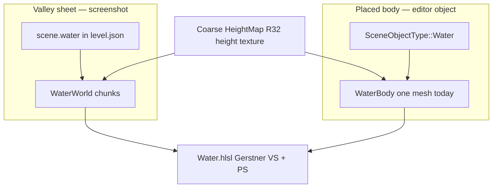
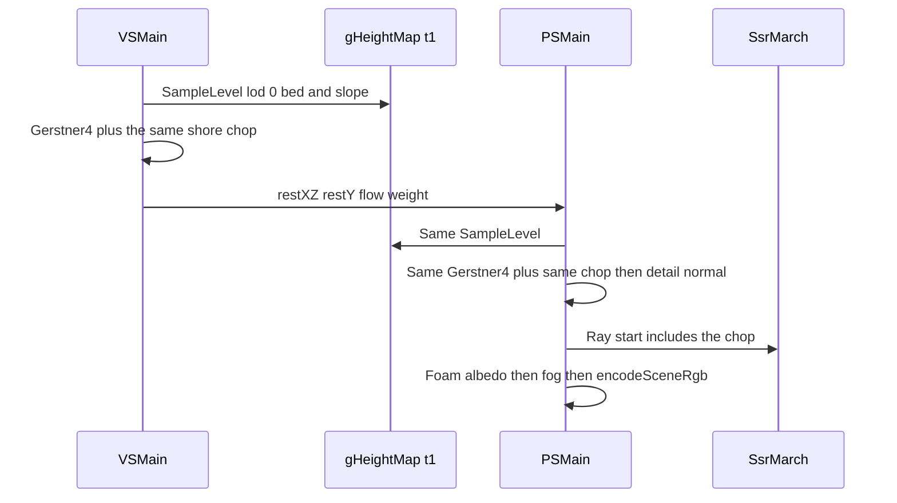
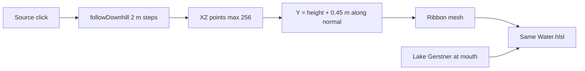

# Water body realism — irregular swell, shore foam, fixed-meter tiles, mountain streams

| Field | Value |
|-------|--------|
| **Title** | Upgrade water-body realism (grid, shore, tiling, streams) |
| **Author** | Travis Johnston |
| **Date** | 2026-10-06 |
| **Status** | Approved. Not implemented. |
| **Priority** | The valley lake in `F:\BadWater.PNG` reads as a diagonal lattice, and the bank is a hard color change. |
| **Area** | `Water/WaterWaves.*`, `Water/Water.cpp`, `Water/WaterBody.*`, `content/shaders/Water.hlsl`, `Render/WaterPipeline.*`, `Scene/SceneFile.*`, `Scene/SceneTypes.h`, `Editor/EditorTerrain.cpp`, `Editor/EditorUi.cpp`, `Sandbox/SandboxApp.cpp`, `Sandbox/DevToolsPanel.cpp`, `UnitTests/Water/WaterTests.cpp` |
| **Audience** | Engine, Sandbox, and Editor owners who already know the forward water pass |
| **Depends on** | Landed water Gerstner pass, coarse geomipmap height field, graphics-queue SSR (`Render/DESIGN-reflections.md`), `SkyEvalParams` tail inside the water CBV. Does not change those contracts. |
| **Does not** | FFT or `cs_5_0`. A new G-buffer. Planar reflections. Caustics, underwater camera, boat wake, spray particles. Nav or swim using animated height. Cloud redesign. SSR redesign. |

No C++ exceptions. `bool` plus `DE_LOG_ERROR` / `DE_LOG_WARN` with `LogCategory`. `DE_ASSERT` for programmer errors. HLSL float literals keep a digit before the decimal (`0.0f`). Reverse-Z stays `D32_FLOAT` / `GREATER_EQUAL`. Do not reformat unrelated code.

---

## Overview

The lake in the paused fly-cam shot is one analytic Gerstner sheet: four wavelengths that are exact octaves, pulled toward a single flow axis, shaded again in the pixel shader so the sun glints sit on those same crests. The bank is a depth lerp of two body colors over `shoreDepth` (2.4 m) and an alpha kill over about 0.84 m of vertical depth. On the steep mountain contact that kill is a hard edge. There is no foam and no extra displacement at the bank.

This design keeps one closed-form surface for lakes and streams. Displacement stays four world-space Gerstners so chunk edges and LOD stitches cannot crack. A second, normal-only spectrum in the pixel shader breaks the glint rows without tessellating the far lake. Shore foam and a short, steep bank chop come from the height field already bound for fog, not from scene depth and not from a new G-buffer. Placed bodies stop stretching one 64×64 grid across the whole rectangle and tile at a fixed 2 m cell. Mountain streams are authored ribbons that share that shader, with a strong downhill flow, and meet the lake on the same displacement function.

---

## Background & Motivation

### What the screenshot is

`F:\BadWater.PNG` is Sandbox, not the editor. The overlay string is `DevToolsPanel.cpp` ("PAUSED  fly cam  WASD move  Q/Space up  Z/Ctrl down  Shift sprint  mouse look  O step  P resume"). Sandbox builds `WaterWorld` from the scene water block (`SandboxApp.cpp`, water create next to the terrain upload). `content/scenes/level.json` sets `water.level` to 100.4 on Hurricane Ridge: 1025×1025 samples, world size 1024 m, cell 1 m (`WorldEngineMapTests`). The shoreline follows the valley because `WaterWorld::chunkIsWet` keeps a chunk when any stepped height sample is below `waterLevel + maxWaveAmplitude`. It is not a rectangle.

The editor does not draw that sheet. `EditorApp::rebuildEditorWater` default-constructs `WaterWorld` and never calls `create`. `drawPlacedWater` draws only `SceneObjectType::Water` rectangles (`WaterBody`). No scene JSON in the tree has `"type": "water"`. The editor Water inspector sizes those rectangles (width / depth / Y). The Water Waves window scales amplitude and speed "for every placed water body."

Both paths call the same shader and the same `WaterParams`. Fixing the shader fixes the screenshot. Fixing `WaterBody` is what makes a large *placed* lake keep a meter-scale mesh. The screenshot's lake is already chunked; its grid is not a 64-cell cap.

### Two representations



| | `WaterWorld` | `WaterBody` |
|--|--|--|
| Who draws it | Sandbox. Editor stores params only. | Editor `m_placedWater`. Sandbox does not spawn water objects. |
| Surface | One horizontal `waterLevel`. Wet chunks only. | Rectangle, Y = `center.y`. Full grid even on dry land; the shader fades it. |
| Mesh | Height-map posts. 1025 map forces `kWaterChunkCellsCoarse` (64). Chunk is 64 m. LOD 0 cell is the height cell (1 m on this map). | `kWaterCellMeters = 2`, then `kWaterMaxCells = 64`. Cell size becomes `extent / cells`. A body wider than 128 m gets cells coarser than 2 m. A 512 m side (inspector max) is 8 m cells. |
| Edge | `uv.x = 1`. No rectangle fade. | `uv.x` fades over `kWaterEdgeFadeMeters` (4 m) from the rectangle rim. |
| Shore signal | `uv.y` = height at the post, baked in `buildChunkMesh`. | Same, `heightAtWorld` at the vertex, or `waterY - 10` if there is no map. |
| Constants | One CBV for every chunk. `Environment*` is passed. | One CBV slot per body (`drawIndex`). `fillConstants` is called with `env == nullptr`, so a placed pond does not get the live sky or fog the sheet uses. |
| LOD | `lodDistances` 40, 80, 160, 320, 640 m. `lodStep` is `1 << lod`. Neighbor LODs differ by at most 1. Dry neighbors are not stitched. | None. |

`TEXCOORD0.y` is terrain height. `TEXCOORD0.x` is the rectangle fade. The vertex normal is `(0, 1, 0)` and the shader ignores it. `MeshVertex` is 48 bytes and already has a tangent at offset 32; the water input layout does not read it. `Mesh::tryCreate` calls `computeTangents` when `tangents.size()` is not the vertex count. That function starts every tangent at `(1, 0, 0, 1)` and leaves it there when the UV determinant is ~0 (`Assets/MeshData.h`). Valley-sheet `uv.x` is constant, so the determinant is 0 and `tangent.w` stays 1. Today the shader ignores that. The stream path treats `tangent.w` as a blend, so a forgotten write would turn the screenshot lake into a stream. Both builders must write `(0, 0, 0, 0)` before upload. PR 5 adds the input element and a test that sheet and placed vertices have `tangent.w == 0`.

### Why the surface is a grid

`defaultWaterParams` and the four waves saved in `level.json` are the same set:

| Wave | Angle from flow (rad) | Wavelength | Amplitude | Speed |
|------|------------------------|------------|-----------|-------|
| 0 | 0.10 | 28 m | 0.42 | 1.15 |
| 1 | −0.55 | 14 m | 0.20 | 1.70 |
| 2 | 0.95 | 7 m | 0.09 | 2.35 |
| 3 | −1.35 | 3.5 m | 0.035 | 3.10 |

Wavelengths are exact octaves (`TwoPi / 28`, `/ 14`, `/ 7`, `/ 3.5`). Crests phase-lock.

`waveDirection` then pulls every direction toward `flowDir` by `flowStrength * 0.65`. `level.json` has `flowStrength` 0.85 and `flowDir` `(1, 0.35)`, so the pull is 0.5525. The four headings collapse into a fan along one diagonal. Amplitudes 0.42 and 0.20 dominate 0.09 and 0.035, so two locked harmonics own the shape.

`Water.hlsl` `PSMain` calls `Gerstner` again and lights that normal (`kWaterRoughness` 0.15, GGX via `PbrDirectional`). The comment at the top of the shader is right: specular is not Gouraud. The rows of bright ovals are the analytic crests of those two harmonics, not interpolated vertex normals. A denser mesh alone does not move them.

Mesh Nyquist is real, and it is the second cause:

- WaterWorld LOD 1 starts at 40 m (`step` 2, 2 m cells). LOD 2 starts at 80 m (4 m cells). The 7 m and 3.5 m waves are then below the vertex grid. The fly cam looks across a valley, so most of the lake in the shot is in that band. The silhouette can only show the 14–28 m locked crests.
- `WaterBody::cellsForExtent` clamps to 64. Past 128 m the whole body coarsens. That is the "will not tile" cap. It is not what is on screen in `BadWater.PNG`, but a placed valley-sized lake hits it.

`flowStrength` does not advect anything. It only aligns headings. There is no separate flow speed.

### Why the shore is a hard edge

```hlsl
float depth = waterLevel - input.terrainY;
float shallow = saturate(1.0f - depth / max(shoreDepth, 1e-3f));
float alpha = opacity * saturate(depth / max(shoreDepth * 0.35f, 1e-3f));
```

`shoreDepth` is 2.4 m and `opacity` is 0.78 (`WaterPipeline::fillConstants`). Color moves from `shallowColor (0.12, 0.38, 0.36)` to `deepColor (0.03, 0.12, 0.18)` across 2.4 m of **vertical** water. Alpha reaches full over `2.4 * 0.35 = 0.84` m of vertical depth. A gentle near shore is a turquoise band. A steep mountain contact crosses 0.84 m of depth in a few pixels, so the edge is a cut. Foam is not in the shader. Splat is footsteps and NPC speed, not a foam mask. Do not paint foam from it.

`gDepth` is the wrong shore signal. Water does not write depth, so the buffer still holds the first opaque hit. Birch trees and the player stand in the lake in this shot. A depth reconstruct would foam on trunks. The coarse height texture is already bound at `t1` (`R32_FLOAT` world Y, `FogSampleTerrainY` in `Fog.hlsli`) and is the bed, not the foliage.

### What must not move

- `WaterFrameConstants` field order through `SkyEvalParams`. `skyEval` is at float 136. `SkyEvalParams` is 44 floats, `sunDir` through `clWind`. The cloud tail is the last 20 (`clLightColor` through `clWind`; `clLightColor` is float 24 of that struct). Tests lock the aligned CBV at 768 bytes. Water calls `EvaluateSky` on an SSR miss. Do not reorder that tail, do not insert at `clLightColor`, and do not grow `SkyEvalParams` (SSR's `b1` slot is a separate 256-byte `SsrGpuParams`).
- Appended water shade floats fit in the 12 floats of spare before byte 768 (`192 - 180`). This design appends four. The 768-byte assert stays.
- SSR march, `kWaterRoughness` as the SSR roughness gate, reverse-Z, `ENCODE_SRGB` (0 on `R16G16B16A16_FLOAT`; tonemap owns exposure). Foam colors are linear scene-referred. `encodeSceneRgb` stays the last step.
- Walkability uses still `waterLevel` (`Walkability::cellWet`). Sandbox swim uses `PlayerMotor::terrainWet` against `m_water.params().waterLevel`. `WaterWorld::tryHeightAtWorld` stays off those paths. Editor play bakes `waterLevel = -1.0e9f` on purpose (`EditorPlay.cpp`). Leave it.

---

## Goals & Non-Goals

### Goals

1. At the distance in the screenshot, crests and sun glints read as irregular wind-driven water, including on LOD 2+ water.
2. A broken foam band and shorter, steeper displacement where water meets the height field. Steep banks get a narrower band than flat ones. Wave height widens it.
3. A placed lake up to 1024 m on a side keeps a 2 m cell at LOD 0. Seams match. The valley sheet stays on the height-map lattice it already has.
4. Authored streams flow downhill on the height field, share the lake shader, and meet the lake on the same displacement.
5. Old `level.json` files load. A file that still has the legacy quartet renders the new swell. A hand-authored quartet that is not that preset is kept, and still gets the detail normal.

### Non-Goals

- FFT ocean, a spectrum texture, or any per-frame `cs_5_0`.
- Caustics, underwater camera, boat wake, spray particles, whitecap particles.
- Planar reflection of off-screen mountains. SSR v1 already misses to `EvaluateSky`. Do not redesign it.
- Putting water in the G-buffer.
- Changing nav wetness, swim enter/exit, or editor-play `waterLevel`.
- Carving a channel into the geomipmap, splat, or foliage.
- A fluid sim, erosion, or automatic stream network from the whole map.
- Splat-painted foam.
- Drawing the valley sheet and a placed body as one mesh. They stay two surfaces. Do not stack them; the later draw has no depth write.

---

## Proposed Design

### One shading model

Lakes and streams use `Water.hlsl`. Flow is a parameter, not a second material.

| | Lake / valley sheet | Stream |
|--|--|--|
| Rest position | Vertex Y = `waterLevel`. Flat. | Vertex Y = height(XZ) + `0.45 * terrainNormal`. Not `+ 0.12` on Y. |
| Flow direction | CBV `flowDir`, normalized in `fillConstants` and again in the shader. | Vertex tangent XZ, unit polyline tangent. |
| Direction blend | Baked `waves[i].xy` (lake pull already applied). | Continuous shader lerp of that heading toward the unit tangent. If the lerp length is under `1e-4`, use the tangent. |
| Flow speed | `kLakeFlowSpeed` 0.4 m/s unless the CBV overrides it. Scrolls detail phase along normalized `flowDir`. Does not align headings. | Authored, default 1.6 m/s. Same scroll. |
| Displacement | Four Gerstners below. | Same four, directions blended by `w`, amplitude scaled by `lerp(1, 0.35, w)`. |
| Short flow ripples | Detail normal only. | 1.3 m and 0.6 m are pixel normals scaled by `w`, not vertex displacement. The ribbon step is 2 m (Nyquist 4 m). |
| Bank | Height-field shore function. `uv.x` is the rectangle fade. | `uv.x` is centerline 1 to bank 0 and is **not** `edge`. Foam uses that coordinate. `edge` stays 1. |

`fillConstants` bakes `waveDirection` into `waves[i].xy` once per draw. Angles are not in the CBV, and `waves[4]` must not grow, so a CPU `pullScale` cannot see a polyline tangent. The shader blends the baked lake heading toward the vertex tangent. There is no `waveDirection(..., pullScale)` and no `w > 0` snap. Two unit headings that point opposite each other cancel near `w == 0.5`. If that lerp's length is under `1e-4`, the direction is the unit tangent, so the mouth stays a finite downhill vector. A lake vertex stores tangent `(0,0,0,0)`. The shader uses `waves[i].xy` as the tangent stand-in when `length(tangent.xz)` is at most `1e-5`, and only then runs the lerp. `w == 0` still returns the lake heading.

`tangent.w` is that blend weight. Lakes write `(0, 0, 0, 0)`, so `w` is 0 and the baked heading is unchanged. `computeTangents`'s leftover `w == 1` is a stream, which is why the explicit zero write is required. At a mouth, `w` lerps from 1 to 0 over the last 4 m (partial weights stay partial), and rest Y lerps from the bed to `waterLevel`. The last vertices use the lake heading and the full lake amplitude. The ribbon overlaps the lake by 2 m. Grids do not share indices (lake LOD 0 is 1 m, ribbon step is 2 m).

The 1.3 m and 0.6 m along-flow terms are pixel normals, same idea as the detail set. Putting them in the vertex shader on a 2 m step would alias on every stream. Cutting the step to 0.25 m to make them geometric would multiply the ribbon by about eight and blow the ~2k triangle cap (`256` points × 4 quads). Direction in the normals is the product ask; the four swells, aimed along the tangent and scaled to 35% at `w == 1`, are the silhouette. At `w == 0` the scale is 1 and the heading is the lake's, so the mouth matches. The leftover 35% travels downhill, not along the lake `flowDir`.

The pixel shader stops reconstructing Y as `waterLevel`. The vertex shader already starts from `input.position`. Pass `restY = input.position.y` and add the displacement on top in both stages:

```hlsl
float3 worldPos = float3(input.restXZ.x, input.restY, input.restXZ.y) + offset;
```

`offset` in both stages is the four swells **plus** the shore-chop offset. The pixel shader re-evaluates that sum. It does not light a position that omitted the chop. Lake `position.y` is `waterLevel`. `WaterBody::draw` passes the same `Sky::Environment*` into both `fillConstants` and `fillSsr` (`fillSkyEval`). Passing it only to `fillConstants` leaves the pond on the fallback sky. The editor call site is `drawPlacedWater`.



### Kill the grid

**Cause, named.** Both, with the glints on the first cause.

1. Primary: four harmonic Gerstners whose headings `waveDirection` collapses with `flowStrength * 0.65`, amplitudes dominated by 28 m and 14 m. The PS re-evaluates that same normal, so the specular rows are the crests.
2. Secondary: vertex spacing. WaterWorld past 80 m is a 4 m lattice and cannot carry a 7 m or 3.5 m silhouette. `WaterBody` coarsens the whole rectangle once the extent exceeds 128 m.

**Displacement set (vertex and CPU).** Replace the legacy preset. Sum of amplitudes stays near today's 0.745 m so AABBs and the valley-cull margin do not jump.

| Wave | Angle from flow (rad) | Wavelength (m) | Frequency | Amplitude (m) | Speed |
|------|------------------------|----------------|-----------|---------------|-------|
| 0 | 0.15 | 37.0 | `TwoPi / 37` | 0.36 | 1.05 |
| 1 | 2.05 | 19.4 | `TwoPi / 19.4` | 0.18 | 1.45 |
| 2 | −1.55 | 11.3 | `TwoPi / 11.3` | 0.11 | 1.85 |
| 3 | 1.15 | 6.4 | `TwoPi / 6.4` | 0.07 | 2.25 |

Sum of amplitudes = 0.72 m. Angles span about 3.6 rad. Ratios are not integers, so crests do not phase-lock. These four stay in the existing `waves[4]` / `waveSpeed` slots. Do not add a fifth displacement wave to that array. Doing so would shift fog, SSR, and `skyEval`.

Lake alignment pull becomes `saturate(flowStrength) * 0.25` instead of `* 0.65`. At the saved 0.85 the pull is 0.2125, not 0.5525. Headings stay spread. The saved `flowStrength` number is left alone. That pull is applied once, on the CPU, inside `waveDirection`, and `fillConstants` stores the result in `waves[i].xy`. The shader does not apply a second pull. Stream headings are the shader lerp above, not a second CPU pull.

CPU `evaluateWaves` / `waveHeight` and HLSL `Gerstner` are **not** the same function today, and this design does not pretend they become one. HLSL adds horizontal displacement `horiz += D * (Q * A * cos)`. `evaluateWaves` only adds `A * sin` to Y and uses Q on the normal. Gameplay and `tryHeightAtWorld` use the CPU Y. The GPU silhouette uses the HLSL float3. A seam test checks shared rest XZ plus equal `waveHeight` (the Y query), not equal float3 offsets. Do not add the horizontal term to `evaluateWaves` in this work. It would change every height query and is not what nav uses.

**Detail normal (pixel only).** Four more Gerstners, literals in `Water.hlsl`, not in the CBV and not in `evaluateWaves`. They do not move the silhouette, the AABB, or gameplay height.

| Wave | Angle (rad) | Wavelength (m) | Normal amplitude |
|------|-------------|----------------|------------------|
| 0 | 0.40 | 2.70 | 0.08 |
| 1 | 1.70 | 1.45 | 0.05 |
| 2 | 2.80 | 0.83 | 0.03 |
| 3 | −0.90 | 0.47 | 0.02 |

Phase scrolls. `flowDir` is normalized (length under `1e-5` becomes `(1, 0)`). `fillConstants` normalizes before the upload, and the shader normalizes again. `level.json`'s `(1, 0.35)` is not unit length.

```text
flow = normalize(flowDir)
phase = dot(dir, xz - flow * flowSpeed * time) * k + time * speed
```

`flowSpeed` is meters per second along `flow`. Without the `time` on that term, Drift is a static skew and the glints do not move. Foam noise keeps its own `time * flow * flowSpeed * 0.15` term. Detail directions are not run through the lake alignment pull. `detailAmount` (default 1) scales the normal offset. `0` restores a swell-only normal for A/B in Dev Tools. The art default stays 1. The Dev Tools Drift slider writes this `flowSpeed`.

The detail normal is added after the displacement normal and renormalized. GGX roughness stays 0.15 on open water so the glints stay small, but they land on the detail slopes instead of in rows. `SsrMarch` keeps the constant `kWaterRoughness` gate. Foam, below, lerps the mirror away; it does not retune SSR.

**What the silhouette still does.** Vertex Y is the four long swells plus the shore chop below. At LOD 2 the 6.4 m swell is marginal (Nyquist of a 4 m grid is 8 m). The 11–37 m swells remain. The far lake is long irregular swell, not a field of short chop. Short chop is a shading signal past ~80 m. That is the trade for not densifying WaterWorld. WaterWorld vertex density is unchanged.

**Legacy files.** `sceneWaterParams` already copies saved waves when `waveCount > 0`, which is why `level.json` pins the bad set.

- If the four waves match the legacy table (frequency and speed within `1e-3`, amplitude and angle within `1e-4`), replace them in memory with the table above. Speed is part of the signature. A hand edit that only retunes speed is kept. Keep `waterLevel`, `flowDir`, `flowStrength`, `steepness`, `amplitudeScale`, `speedScale`. Log once at info: `Water: legacy harmonic preset replaced`.
- If `waveCount == 0`, `defaultWaterParams` is the new table. That path already exists.
- Any other quartet is kept as the displacement set. `detailAmount` still defaults to 1, so glints still break up.
- PR 1 also rewrites the `waves` array in `content/scenes/level.json` to the new numbers so the committed scene is not depending on the detector. Same keys. No version bump in that PR.

`maxWaveAmplitude` is the sum of the four displacement amplitudes after `amplitudeScale`, plus `kShoreChopMax` (0.18 m) once shore chop exists. The 0.18 m term is **not** multiplied by `amplitudeScale`. Detail normals are not included. `WaterWorld.BoundsTrackWaveHeight` currently expects scale 2 to double the captured amp. After this change the scale-2 height is `waterLevel + 2 * swell + 0.18`, where `swell` is the scaled sum without the constant. Open-water chunks get the same pad. That is conservative and acceptable.

### Shore foam and bank chop

Pick the height field. Per vertex, `uv.y` is already the bed, but on a 4 m LOD it stair-steps. The pixel shader samples `gHeightMap` (`t1`, `R32_FLOAT`) with `gHeightSamp` (`s0`) and the origin / cell / world size already in the CBV (`FogSampleTerrainY`). The vertex shader uses the same `SampleLevel(..., 0)`. It does not use `Sample`.

That sample does not compile against today's root signature. `kRootHeightSrv` and static sampler `s0` are `D3D12_SHADER_VISIBILITY_PIXEL` in `Render/WaterPipeline.cpp`. A VS reference fails PSO creation. PR 2 sets both to `D3D12_SHADER_VISIBILITY_ALL`. The DWORD count does not change. Shadow and SSR stay pixel-only. If `heightCellSize <= 0` (no map), shore weight is 0 and the rectangle fade behaves as it does today.

Gradient, two extra taps. `h` is `heightCellSize` (1 m on this map):

```text
hL = height(xz - (h, 0))
hR = height(xz + (h, 0))
hD = height(xz - (0, h))
hU = height(xz + (0, h))
slope = length((hR - hL, hU - hD) * (0.5 / h))
```

`slope` is rise over run. Depth for a lake is vertical water thickness at that XZ, using the displaced surface against the bed:

```text
depth = max(restY + dispY - terrainY, 0)
horiz = slope > 1e-3 ? depth / slope : (depth < 0.05 ? 0 : 1e4)
```

Band width in horizontal meters, then clamped:

```text
band = 8.0 * foamWidthScale
band *= lerp(1.15, 0.45, saturate(slope / 0.7))
band *= lerp(0.85, 1.25, saturate(maxAmp / 0.75))
band = clamp(band, 2.5, 14.0)
shore = saturate(1.0 - horiz / band)
```

`foamWidthScale` defaults to 1. `maxAmp` in this formula is the sum of the four displacement amplitudes, **not** `maxWaveAmplitude` after the 0.18 m pad. Using the padded value would widen the band by the chop constant.

Worked defaults at `foamWidthScale` 1 and amplitude 0.72. Neither row hits the clamp. The slope factor saturates at 0.45, and `8 * 0.45 * 0.85` (calm water) is still about 3.06 m.

| Slope | Meaning | `band` |
|-------|---------|--------|
| 0.15 | Gentle near shore in the shot | about 9.8 m |
| 0.70 | Steep mountain contact | about 4.4 m |

The 2.5 m floor is a reduced `foamWidthScale`, not a steep bank at the default. At scale 0.5 on a slope ≥ 0.70 and zero amplitude the raw product is about 1.53 m and the clamp raises it to 2.5 m. The beach stays a wide broken band. The cliff gets a few meters, not a one-pixel cut and not a 14 m bathtub ring.

**Chop, not just tint.** Two extra Gerstners, amplitude multiplied by `shore`, so open water (`shore == 0`) does not move:

| | Along downslope | Across slope |
|--|--|--|
| Wavelength | 1.6 m | 0.9 m |
| Amplitude at `shore == 1` | 0.12 m | 0.06 m |
| Steepness add | +0.35 on Q | +0.35 on Q |

Direction comes from the height gradient (downslope and a perpendicular). Phase uses world XZ and time. `evaluateShoreChop` is a separate function. It is not new parameters on `evaluateWaves`. `waveHeight` and `tryHeightAtWorld` stay Y-only and chop-free. An overload that sampled the bed inside `evaluateWaves` would fold chop into gameplay height. Do not add one.

The vertex shader and the pixel shader both add this chop offset and the matching chop normal, then the pixel shader adds the detail normal. Crest foam reads `dispNormal` after the chop and before the detail normal, so a 0.18 m chop is in the SSR ray start and in the crest mask. The pixel shader must not rebuild `worldPos` from the four swells alone.

These wavelengths are under the LOD 2 vertex grid. Near the camera, LOD 0 is 1 m (sheet) or 2 m (placed), so the bank in the screenshot actually displaces. Far banks still get the normal and the foam albedo. The silhouette of a distant cliff-water line stays the long swell plus a coarse bump. State that in the shader comment so nobody "fixes" it with a compute tessellator.

**Foam albedo, broken.** Two octaves of value noise. No texture. Not a `sin` hash: MSVC `sinf` and FXC `sin` do not match, and the CPU test must call the same function the shader uses.

Lattice coordinate is `floor` (toward −∞). The hash is the two's-complement bits of those ints, so negatives on a centered height map stay stable. C++ uses `static_cast<uint32_t>(ix)`. HLSL uses `asuint(ix)`.

```text
uint hash2i(int x, int z)
    n = asuint(x) * 374761393u ^ asuint(z) * 668265263u
    n = (n ^ 0x27d4eb2du) * 1274126177u
    n = n ^ (n >> 16)
    return n
hash01 = (hash2i & 0x00FFFFFFu) / 16777216.0    // [0, 1)
// hash01(0, 0) = 0.108964, hash01(-1, 2) = 0.682527

valueNoise(xz):
    i = floor(xz), f = xz - i
    u = f * f * (3 - 2 * f)                    // smoothstep, not linear
    bilinear lerp of hash01 at the four lattice corners
```

```text
n0 = valueNoise(restXZ * 0.22 + time * normalize(flowDir) * flowSpeed * 0.15)
n1 = valueNoise(restXZ * 0.57 - time * float2(0.07, 0.04))
broken = saturate(shore * 1.35 - 0.25 + 0.55 * n0 + 0.25 * n1)
crest = saturate(shore * saturate(0.5 - dispNormal.y))
foam = smoothstep(0.35, 0.72, saturate(broken * 0.85 + crest * 0.5))
```

`smoothstep` on `foam` is what keeps a straight bank from being a uniform strip. Crests of the bank chop add foam. Troughs stay water. Foam color `(0.85, 0.88, 0.86)`. GGX roughness lerps from 0.15 to 0.55 with `foam`. Reflection lerps back toward the body color with `foam`.

Order in `PSMain`: body, fresnel, SSR, lights, then foam albedo, then `ApplyLitFog`, then alpha, then `encodeSceneRgb`. Foam is in the color that fog sees. It is not applied after fog.

Alpha. Valley-sheet `uv.x` is 1 (`buildChunkMesh`). A ribbon stores centerline-to-bank in `uv.x` and must not reuse that as `edge`. Today's `PSMain` also does `alpha = saturate(alpha + fres * 0.15) * edge` after the shore term (about line 275). Replacing only the `shoreDepth * 0.35` kill leaves that fresnel cut, and `foam * edge` is 0 on a ribbon bank where foam is 1.

```text
edge             = stream ? 1 : rectangleFade   // sheet is already 1
metersInFromBank = uv.x * (width * 0.5)         // uv.x is 1 at the centerline, 0 at the bank
rim              = stream ? smoothstep(0, 0.10, metersInFromBank) : 1
alpha            = opacity * alphaDepth * edge * rim
alpha            = max(alpha, foam * 0.85)
```

`metersInFromBank` is meters, not `uv.x`. Feeding `uv.x` to that `smoothstep` would fade 10% of the half-width (about 17.5 cm at 3.5 m, about 60 cm at the 12 m slider max). `width * 0.5` makes the 0.10 threshold 10 cm at every width. Delete the `fres * 0.15 * edge` multiply. A small fresnel boost may remain as `fres * 0.15 * (1 - foam)` added before the max, and it must not be multiplied by `edge`. Foam alpha follows `foam`. The outer 10 cm of a ribbon softens only the non-foam water (`rim`). On the sheet, `rim` is 1 and `edge` is 1, so the beach foam stays opaque. Past the band, foam is 0 and alpha is the existing opacity.

Shallow / deep color stays, driven by vertical `depth / shoreDepth`, and is multiplied down where `foam` is high so the turquoise does not tint the foam.

CPU `evaluateShore`, `valueNoise`, and `evaluateShoreChop` live beside `evaluateWaves` and are the functions the shader copies. They are not a claim that CPU Gerstner matches HLSL's horizontal term. Tests call these CPU functions.

### Large bodies

**Valley sheet.** Do not retile it. It is already 1 m at LOD 0 on this map, welded with `buildGridIndices`. Changing the lattice would fight `WaterWorld.WeldedLodSharesEdgeXZ` and the height posts. The screenshot's far grid is the wave set, fixed above. LOD distances stay. No extra vertices.

**Placed body.** Replace the single clamped grid.

| Knob | Value |
|------|--------|
| Cell | 2 m (`kWaterCellMeters`). Not `extent / 64`. |
| Chunk | 32 cells = 64 m. Power of two so `buildGridIndices` and `lodStep` apply. |
| LOD distances | 48, 96, 192, 384 m. Same hysteresis as terrain (`lodFromDistance`). |
| LOD 0 | 33×33 vertices, 2048 triangles, 64 m chunk. |
| Max LOD | 3 (16 m cells). Do not let a distant pond become one quad. |
| Max extent | 1024 m × 1024 m. `build` logs and returns false above that. Inspector already stops at 512; raise the slider to 1024. |
| Max wet chunks stored per body | 256. A dry chunk is not stored. |
| Origin | Body min corner, snapped to a 2 m lattice, so neighboring chunks share XZ on that lattice. |

`chunkIsWet` uses the same rule as `WaterWorld`: a chunk is kept if any sample on a 2-post step is below `waterLevel + maxWaveAmplitude`. Interior shores come from the height field.

Rectangle fade stays per vertex, as `edgeFade` in `WaterBody.cpp` is today (`kWaterEdgeFadeMeters` 4). A chunk is 64 m and can hold both beach and deep water, so a chunk-wide deep/shallow bit is wrong, and "deeper than the foam band" would compare vertical depth to a horizontal width.

```text
rectFade = saturate(nearestRimMeters / 4.0)   // 0 at the rim, 1 once 4 m inside
uv.x     = (shoreWeight > 0) ? 1 : rectFade
```

Beach and interior vertices stay at 1. Only a vertex in the last 4 m whose shore weight is 0 fades. No height map means shore weight is 0, so the old rectangle fade remains. A pond in a closed basin still fades its deep outer rim. A vertex on the beach does not.

PR 3 can merge before `shoreWeight` exists. The stand-in is the full assignment, not a swapped predicate:

```text
uv.x = (verticalDepth > 2.4) ? rectFade : 1
```

`verticalDepth > 2.4` is deep water. `shoreWeight > 0` is the shallow bank. Those predicates are opposites, and `shoreDepth` 2.4 m is the vertical color range in `fillConstants`, not the horizontal foam band. Writing `(verticalDepth > 2.4) ? 1 : rectFade` fades the beach and leaves the deep rim at 1. PR 2 replaces the stand-in with `uv.x = (shoreWeight > 0) ? 1 : rectFade`.

**Budgets.** One CBV slot per body, not per chunk. `kMaxWaterDrawsPerFrame` stays 32. Slot 0 is the valley sheet when it draws in the same frame as bodies. Bodies and streams use slots 1 onward. Over the cap: `DE_LOG_WARN` once per frame and skip the rest (the editor already warns).

| Case | Draws | Triangles (order) |
|------|-------|-------------------|
| Screenshot sheet, unchanged density | 1 CBV, one draw per visible wet chunk (today's loop) | Do not grow. A 1025 map is at most 16×16 chunks. LOD 0 is 8192 tris per 64 m chunk. A shore view is tens of chunks, on the order of 1e5–2e5 tris if many are LOD 0. That is the current cost. |
| One placed 400 m lake, all wet, mixed LOD | 1 CBV, ≤ 49 chunk draws | LOD 0 ring plus coarser interior. Target ≤ 80k tris. Hard stop: if the wet set exceeds 256 chunks, `build` fails and logs. |
| Several ponds plus the sheet | ≤ 32 CBV slots | 15 ponds × ~40k tris is the practical ceiling before the slot cap. Frustum cull uses the existing wave-padded AABB. |
| Streams, § below | 1 slot each | ≤ 2k tris each, ≤ 16 per scene. |

Vertex positions on a chunk edge are the rest XZ of the 2 m lattice (or the welded coarse subset). Displacement is applied in the vertex shader from world XZ only, so a shared rest XZ cannot crack. LOD stitches use the existing `EdgeMask` / `isSkippedEdgeVertex` path. A dry neighbor clears the stitch bit, same as `WaterWorld::updateLod`.

`WaterBody::matches` gains chunk identity only through the desc it already compares (center, extents). A terrain reload still rebuilds, which the editor already forces.

### Mountain streams

v1 is a ribbon. No sim.

**Placement.** New object type `stream` (`SceneObjectType::Stream`, JSON `"stream"`). Place menu entry next to Water. The user drops a source on the terrain, then either:

- clicks **Follow downhill**, or
- edits the polyline.

`followDownhill` walks the coarse height map from the source:

- Step 2 m along the downhill gradient (central difference, same taps as the shore slope).
- Stop when `terrainY <= waterLevel + 0.25`, or slope stays under 0.02 for three steps, or length would pass 512 m, or the point count would pass 256.
- Drop a point every step. Y is not stored.

The lake level passed in is the valley sheet's `waterLevel` when the scene has a water block, otherwise the terrain sea level. The walk is deterministic. A unit test on a tilted plane expects non-increasing height and a stop at the water plane.

Points are absolute world XZ. `TransformComponent.position` is rewritten to `(points[0].x, derivedY, points[0].z)` whenever the ribbon is built or saved. The translate gizmo writes `position` only. On a position change, if `position.xz` differs from `points[0]` by more than `1e-3` m, add that XZ delta to every point, then set `position` back to the new `points[0]` with derived Y. Rotation and scale on the transform are ignored. Width is the stream field, not `scale`. On load, if `position` and `points[0]` disagree, the points win and `position` is rewritten. Do not treat that disagreement as a delta or a stale position would slide the creek.

Y is derived at build: `heightAtWorld + 0.45 * terrainNormal`, not `+ 0.12` on Y. Moving the terrain rebuilds the ribbon. If the height map is missing, `build` fails and logs; a stream with no bed is not drawn.

**Clearance.** The coarse map is 1 m posts. The drawn terrain is a geomipmap: one LOD step replaces a post with a chord (`lodStep` is `1 << lod`). A constant `+0.12` on Y does not clear that chord, and on a 0.70 slope it is only about 0.10 m along the normal (`0.12 / sqrt(1 + 0.49)`). Water depth write is off and the test is `GREATER_EQUAL`, so a ribbon that dips under the terrain mesh disappears and one that skims it z-fights. Do not "fix" that by marking the cell wet or by changing editor-play `-1.0e9f`.

Two separate fixes, ribbon only:

- Geometric: offset 0.45 m along the terrain normal sampled at the centerline (central difference, same taps as the shore slope). That is the floor for one skipped post (a 2 m chord). It does not cover an 8 m chord at terrain LOD 3.
- Depth: a second PSO cloned from the water color PSO in `Render/WaterPipeline.cpp` (same root signature, alpha blend, `DepthWriteMask = ZERO`, `sceneDepthFuncGreaterEqual()`, `D32_FLOAT`, one color target). Streams only. `DepthBias = 4`, `SlopeScaledDepthBias = 3`, clamp 0. The lake color PSO stays at bias 0. The sheet still draws first.

Scene depth is reverse-Z: `kDepthClear` is 0, near is 1, and the test is `GREATER_EQUAL` (`Render/DepthState.h`). D3D adds `DepthBias * r + SlopeScaledDepthBias * MaxDepthSlope` to the interpolated depth before that test. A positive bias raises the tested value, toward the camera, so a ribbon under a geomipmap chord still passes. A negative bias lowers it, toward clear 0, and the same ribbon fails more often. Water does not write depth, so the bias never stores a new value. It only changes the test.

`BloodSplatPool::create` passes `4, 3.0f` (`Particles/BloodSplatPool.cpp`). `Render/DESIGN-reverse-z.md` flipped that pair from `-4, -3` because a negative scene bias under reverse-Z attracts acne. Start the stream PSO at that same pair. `-4000 / -2.5` is the shadow-depth constant in `FoliagePipeline.cpp` (the depth pass: `NumRenderTargets = 0`, `shadowDepthFunc()`, depth write on) and `ShadowPipeline.cpp`. `Render/DESIGN-local-light-shadows.md` states that negative bias stores a caster farther, closer to 0. Those PSOs are the wrong reference, and cloning one would drop the color target. Magnitude 4000 is about a thousand times the scene decal bias and is not a meter clearance on the camera DSV. The 0.45 m normal offset is the clearance. The `+4 / +3` pair is only the z-fight nudge.

**Mesh.** Width default 3.5 m (slider 1.5–12). Five vertices across (four segments). Along-spline step 2 m. `uv.x` is 1 on the centerline and 0 on the bank. That is `bankCoord`, not `edge`. `edge` for a ribbon vertex is 1. The outer 10 cm is `rim = smoothstep(0, 0.10, uv.x * (width * 0.5))` from the alpha section. Tangent XYZ is the smoothed polyline tangent. `tangent.w` lerps from 1 to 0 over the last 4 m before the end if that end is within 2 m vertical of `waterLevel`. Rest Y lerps to `waterLevel` over that same 4 m. The last 2 m of the ribbon overlaps the lake.

**Shading.** Same pixel shader, stream PSO for the bias. `flowSpeed` default 1.6 m/s (slider 0–6). In the shader:

```text
w    = saturate(tangent.w)
tLen = length(tangent.xz)
t    = (tLen > 1e-5) ? (tangent.xz / tLen) : waves[i].xy
raw  = lerp(waves[i].xy, t, w)
D    = (length(raw) < 1e-4) ? t : normalize(raw)
amp  = waves[i].w * lerp(1, 0.35, w)
```

No binary pull. Partial mouth weights stay partial. The 1.3 m and 0.6 m ripples are pixel normals (normal amplitudes 0.05 and 0.025) multiplied by `w`, phase `dot(tangentXZ, xz) * k - time * flowSpeed * k`. They are not in the vertex displacement. Bank foam uses `saturate(1 - uv.x)` in place of `shore`, widened by `foamWidthScale` but clamped to at most `0.45 * width` so the centerline stays water. Over the mouth blend, foam is `max(ribbonBank, lakeShore)`. Foam is not multiplied by `uv.x`.

**Who draws.** Editor `drawPlacedWater` gains the ribbons and uses the next CBV slot, on the stream PSO. Sandbox, after `m_water.draw` returns, walks scene objects of type `stream` and draws them with the sheet's `Environment`, height texture, and SSR handles. The `"Water"` GPU scope is lifted to that caller so the sheet and the ribbons are one range (see Observability). Sandbox still does not spawn placed lake rectangles in v1 (none exist in content, and the sheet is the lake). A stream is visual only.

**Nav.** `Walkability::cellWet` and editor-play `-1e9` are unchanged. A stream is not a wet cell. Swimming a creek is out of scope. Say so in the stream builder comment so a later change is deliberate.



### CBV append

Inside the HLSL `cbuffer`, after `clWind`, and in C++ after `skyEval`:

```cpp
float foamAmount;      // default 1
float foamWidthScale;  // default 1
float flowSpeed;       // default 0.4 m/s, stream overrides
float detailAmount;    // default 1
```

Float offsets 180..183. `184 < 192`, so `(sizeof + 255) & ~255` stays 768. Do not insert fields earlier. `ssrPad0` / `ssrPad1` stay 0. New `static_assert`s on the four offsets. `WaterLightPickTests` and `CloudLayerTests` keep the 768 assert.

`fillConstants` writes the defaults. Callers override per draw. `specPower < 0` (lighting off) still returns the unlit body, and multiplies foam on as albedo so a debug unlit view still shows the band.

### Editor and Dev Tools

| Control | Where | Saved? |
|---------|--------|--------|
| Wave height, wave speed | Existing Water Waves window and Sandbox Water header. Still `amplitudeScale` / `speedScale`. | Already saved. |
| Drift (m/s) | Same windows. Default 0.4. Scrolls detail phase by `flowSpeed * time` along normalized `flowDir`. | New `flowSpeed`, PR 1 slider, saved in PR 2. |
| Foam | 0–1, default 1. | New `foam`. |
| Foam width | 0.5×–2×, default 1. Maps to `foamWidthScale`. | New `foamWidthScale`. |
| Detail | 0–1, default 1. Dev Tools only, so the grid fix can be A/B'd. | Not a separate art control. Scene default is 1. A value other than 1 saves as `detail` so a level can turn it down. |
| Wind direction | Existing `flowDir` on the water block. Not a per-wave angle sheet. | Already saved. |
| Placed width, depth, Y | Existing inspector. Depth slider max becomes 1024. | Already `scale` and position. |
| Stream width, flow speed, points | New inspector. **Follow downhill** button. | New object. |
| Wavelengths, per-wave angles, noise octaves, shore slope curve | Derived. Not on a panel. | No. |

Do not dump Gerstner coefficients into the panel. The cloud-layer UI lesson applies: artists edit amount, wind, foam, and the spline.

---

## API / Interface Changes

`WaterWaves.h` (CPU, tested):

```cpp
struct WaterDetailDefaults
{
    // Documented literals. The GPU copy is in Water.hlsl. Not packed into the CBV.
};

float lakeAlignmentPull(float flowStrength); // saturate(flowStrength) * 0.25

struct ShoreSample
{
    float slope = 0.0f;
    float horizMeters = 0.0f;
    float bandMeters = 0.0f;
    float weight = 0.0f; // 0 open, 1 on the bank
};

ShoreSample evaluateShore(
    float waterSurfaceY,
    float terrainY,
    float slope,
    float foamWidthScale,
    float maxDisplacementAmp);

// Extra meters of Y at the bank. 0 when weight is 0. Same phase as the shader.
float evaluateShoreChop(
    float worldX,
    float worldZ,
    float time,
    float shoreWeight,
    float downslopeX,
    float downslopeZ);

bool isLegacyHarmonicPreset(const WaterParams& params);
```

`defaultWaterParams` returns the new quartet. `waveDirection` uses `lakeAlignmentPull` only. There is no `pullScale` overload. Stream heading blend is `blendFlowDirection(lakeDir, tangentXZ, w)` in `WaterStream.h`, the CPU copy of the shader block above. `w == 0` returns `lakeDir`. If `length(tangentXZ)` is at most `1e-5`, the tangent stand-in is `lakeDir`. If the lerp length is under `1e-4`, the result is that stand-in, which on a ribbon is the unit tangent. `fillConstants` normalizes `flowDir` before writing the CBV.

`WaterBody` holds a chunk list instead of one `MeshData`. `vertex()` stays for tests and addresses the LOD 0 chunk that contains the index, or returns false if that chunk was culled as dry. `build` returns false on extent > 1024, on more than 256 wet chunks, or on an empty result. `draw` takes `const Sky::Environment*`.

Stream, new `Water/WaterStream.h`:

```cpp
struct StreamDesc
{
    float width = 3.5f;
    float flowSpeed = 1.6f;
    float bedClearance = 0.45f; // meters along the terrain normal, not +Y
    std::vector<Math::Vector2f> pointsXZ;
};

bool followDownhill(
    const Terrain::HeightMap& height,
    Math::Vector2f source,
    float waterLevel,
    std::vector<Math::Vector2f>& outPoints,
    std::string* errorOut);

bool buildStreamRibbon(
    const Terrain::HeightMap& height,
    const StreamDesc& desc,
    float lakeLevel,
    const WaterParams& lakeParams,
    MeshData& out,
    std::string* errorOut);
```

Caps inside `followDownhill` / `buildStreamRibbon`: 256 points, width clamped to [1.5, 12], length 512 m. Over-cap input returns false and logs `LogCategory::Render`. No exceptions.

Water PSO input layout adds:

```cpp
{ "TANGENT", 0, DXGI_FORMAT_R32G32B32A32_FLOAT, 0, 32, D3D12_INPUT_CLASSIFICATION_PER_VERTEX_DATA, 0 }
```

That matches `MeshVertex::tangent` at byte 32. No vertex-format change.

---

## Data Model Changes

Scene `version` stays 2 through the shading and chunk work. New water keys are optional. PR 5 (streams) writes version **3**.

Readers accept version 1, 2, and 3. `content/scenes/level.json` ends with `"version": 2`. The reader keeps that. It does not load as 1. `SceneFile.cpp` does not reject an unknown version number.

| Key | When missing | When present |
|-----|--------------|--------------|
| `water.waves` | New `defaultWaterParams`. | Used, unless `isLegacyHarmonicPreset`. |
| `water.flowStrength` | 0.85, same as today. Pull is still `* 0.25` on lakes. | Kept. Not rewritten. |
| `water.flowSpeed` | 0.4 m/s | CBV drift. |
| `water.foam` | 1 | 0..1 |
| `water.foamWidthScale` | 1 | Clamped to [0.5, 2] on load. |
| `water.detail` | 1 | 0..1 |
| objects `"stream"` | None. | This design's reader accepts the type. Today's reader does not: `tryParseSceneObjectType` failure logs `SceneFile: unknown type` and `continue`s. The object is skipped. The rest of the file loads. Unknown types are not a failed parse. |

Version 3 adds the object type. A version 3 file with no stream objects is the PR 2 file plus a newer writer. No version 4. A version 3 file opens on today's binary: optional water keys are ignored by `value` defaults, and each `stream` object is skipped with the warning above. The valley sheet still loads. Do not claim an old binary fails the parse.

`saveSceneToJson` writes `scene.version`. The editor does not leave that at the `SceneFileData` default. `EditorApp::saveScene` sets `data.version = 2` in `Editor/EditorSceneFile.cpp`. PR 5 changes that assignment to 3 in the same change as the reader. Optional water keys stay valid on a version 2 file. Do not bump for them.

Stream object JSON. `position.xz` is `points[0]`. The file Y is not used.

```json
{
  "type": "stream",
  "position": [12.0, 0.0, 40.0],
  "stream": {
    "width": 3.5,
    "flowSpeed": 1.6,
    "points": [[12.0, 40.0], [10.0, 36.0]]
  }
}
```

Missing `stream` on a `stream` object fails that object (log, skip), not the whole scene. More than 16 streams: load the first 16, warn once. More than 256 points: fail that stream. Point arrays shorter than 2: fail that stream.

`WaterSceneDesc` gains `flowSpeed`, `foam`, `foamWidthScale`, `detail`, each with a `has*` or a sentinel. Prefer `value(key, default)` so a missing key is indistinguishable from the default and old files do not need a migration pass. The legacy-wave replace is the only in-memory migration, and it does not require a version bump.

The next editor save after PR 5 writes version 3. PR 1 rewrites the wave numbers under version 2. Amplitude and speed scales round-trip as they do now.

---

## Alternatives Considered

### 1. FFT spectrum and a compute displacement

Tessendorf FFT, 256² tile, updated every frame or every few frames. Rejected. The standing constraint on this renderer is that frame work is graphics-queue pixel shaders. IBL, GTAO, SSR, and reverse-Z all shipped that way. A per-frame `cs_5_0` is out. A load-time bake of one repeating FFT tile was considered and rejected too: a single tile large enough for a 400 m lake either repeats (the grid we are removing, at a lower frequency) or stores a unique displacement for the whole valley (hundreds of MB, and LOD seams need the same border texels). Analytic Gerstner is already the seam solution (`Water.hlsl` header: LOD seams share the closed form). Keep it.

### 2. Only densify the mesh

Push WaterWorld LOD 0 out to 300 m and remove `kWaterMaxCells`. Rejected as the primary fix. The PS normal is already analytic; the glint rows would remain on the harmonic crests. Cost: LOD 0 on a 300 m disk of 1 m cells is on the order of 1e5 vertices **per** nearby chunk ring and several times the current triangle count, for a silhouette that is still two parallel wavelengths. Densify is not in the budget table. The placed-body change is a fixed 2 m cell with LOD, which is the opposite of stretching 64 quads, and it is capped.

### 3. Scene-depth shoreline

Reconstruct the opaque hit from `gDepth` and foam where the water-to-hit distance is small. Rejected. The depth buffer contains birch trunks, rocks, and the player. The shot would grow foam rings around trees. The height texture is the bed, it is already on the water root signature (`t1`), and it matches `uv.y`.

### 4. More than four displacement waves inside `waves[4]`

Rejected as a layout change. Growing `waves[4]` or `waveSpeed` shifts `lightCount`, fog, `invViewProj`, and `skyEval`. The detail set is literals. The bank chop is literals scaled by `shore`. Four CBV waves remain the swell.

### 5. Full shallow-water sim for streams

Rejected. The user asked for water coming down the new mountains, and allowed splines. A sim would fight the geomipmap, need a timestep, and has no nav story. Gradient walk plus a ribbon is deterministic and testable on the CPU.

---

## Security & Privacy Considerations

Local single-player content. No network surface, no credentials, no new asset fetch.

The new attack surface is a scene file. Caps are part of the design, not a follow-up: 16 streams, 256 points, 1024 m body extent, 256 wet chunks, 32 CBV slots. Over-cap paths return false or skip and log. Those caps bound the mesh and the object list after a successful parse. They do not bound the JSON library's DOM. A huge `points` array is still built by the existing parser, same as any other array in `loadSceneFromJson` today, and is then rejected. No `try` / `catch` / `throw`.

Shaders are engine content, not scene data. A stream does not name a shader.

---

## Observability

Existing pieces to keep:

- `DE_LOG_INFO` in `WaterWorld::create` (chunk counts, wet count, level).
- One `GpuScope` `"Water"` / `ProfileColor::Water` per frame. Today that scope is inside `WaterWorld::draw` and ends before the function returns (`Water.cpp`). `drawPlacedWater` opens a second one. Sandbox calls `m_water.draw` and returns (`SandboxApp.cpp` ~3996), so a stream draw after that call is a later range, not a child. PR 5 removes the scope from `WaterWorld::draw` and from `drawPlacedWater`, and opens one scope in the caller around sheet, then placed bodies, then streams: `SandboxApp.cpp` and `Editor/EditorRender3D.cpp`. One range. No nested `"Water"`. No new timestamp queries.
- `WaterWorld::lastDrawCalls` / `lastTriangles`.
- Editor warn when `kMaxWaterDrawsPerFrame` is hit.

Add:

- One info log when the legacy preset is replaced.
- `DE_LOG_ERROR(LogCategory::Render, ...)` when a body or stream `build` fails (extent, chunk cap, no height map, bad point count).
- `DE_LOG_WARN` when the 16-stream cap drops the rest.
- `followDownhill` does not log per step. The editor button can show the stop reason in the panel (reached lake / flat / length / point cap) from the `errorOut` string. That string is a status, not an exception.

No new telemetry, no GPU timestamp queries, no screenshot test. Acceptance for the look is a Sandbox fly-over of `level.json` after PR 1 and PR 2, compared with `F:\BadWater.PNG`. Acceptance for tiling and streams is the CPU tests below.

---

## Rollout Plan

No feature-flag service. Defaults are the new look.

- `detailAmount` 1 and `foam` 1 ship on. Dev Tools can set detail to 0 for the session.
- A **Legacy wave set** checkbox in the Sandbox Water header swaps in the old quartet and the old `* 0.65` pull for the session. It does not save. That is the rollback for the art call without a build revert.
- Code rollback is reverting the PR. A version 3 file already loads on today's binary: unknown `stream` objects are skipped with a warning, and the sheet remains. Do not land `data.version = 3` in `EditorApp::saveScene` before that reader exists. PR 5 contains both. PR 1's `level.json` wave rewrite uses existing keys and stays version 2, so an old binary loads it as a custom quartet and will not pass `isLegacyHarmonicPreset` (those numbers are the new set, and speed is part of the match). An old binary will show the new swell without the detail normal. That is acceptable and still better than the octave lattice.
- Editor-play walkability stays dry. Do not couple the visual PR to swim.

Order is the PR list. Each PR builds `DarkEngine`, `UnitTests`, and the water shader (`vs_5_0` / `ps_5_0`) on its own.

---

## Risks

| Risk | Severity | Mitigation |
|------|----------|------------|
| CPU `evaluateWaves` and HLSL `Gerstner` are treated as one formula. | Med | They are not, and they stay split. CPU is Y plus normal. HLSL adds the horizontal term. Tests assert `waveHeight` and rest XZ, not float3 equality. Shore chop is `evaluateShoreChop` on both GPU stages and is not folded into `evaluateWaves`. |
| Detail normal costs too much ALU in the water PS (four extra sin/cos on top of SSR). | Low | Unrolled 4, no texture, no extra sample except the shore taps (three `SampleLevel`s, the fog pass already samples this texture). If a PIX capture of the Water scope regresses badly, `detailAmount` 0 is the kill switch and the swell change still stands. |
| Shore taps on a 1 m height texture shimmer as the camera moves. | Med | `SampleLevel` lod 0, bilinear, world XZ, not screen derivatives. Noise is world-locked. Do not use `Sample` (it needs derivatives and will shimmer on coarse LOD). |
| Bank chop double-counts in `maxWaveAmplitude` and culls a chunk that used to draw, or the reverse. | Low | Add 0.18 m once, not scaled by `amplitudeScale`. `BoundsTrackWaveHeight` at scale 2 expects `waterLevel + 2 * swell + 0.18`, not `2 * amp`. |
| Placed-body chunk LOD cracks. | Med | Same welder as the sheet. New test mirrors `WeldedLodSharesEdgeXZ` on two body chunks. Displacement test evaluates `waveHeight` at the shared XZ twice. |
| Stream mouth Z-fights the sheet. | Med | Overlap 2 m, same analytic Y at `tangent.w == 0`, depth write stays off, sheet draws first. | 
| Ribbon slips under the geomipmap or z-fights the terrain. | High | 0.45 m along the terrain normal, plus a stream PSO cloned from the water color PSO with `DepthBias +4` and `SlopeScaledDepthBias +3` (the `BloodSplatPool` pair). Positive bias raises the tested reverse-Z value. The shadow-map `-4000 / -2.5` stores casters farther and is not used. Lake PSO bias stays 0. Not a walkability change. |
| Legacy detector misses a rounded JSON frequency and the old grid stays. | Med | Tolerance `1e-3` on frequency covers `level.json`'s 0.224399 versus `TwoPi/28`. PR 1 rewrites that file anyway. A unit test feeds the JSON literals. |
| Editor draws the sheet (PR 4) and a future placed body occupies the same XZ. | Low | No water objects in content today. Document: do not stack. Slot 0 is the sheet so constants are not overwritten. |
| Someone uses `tryHeightAtWorld` for swim after the shore chop changes it. | High if it happens | `tryHeightAtWorld` does **not** take the shore chop. Swim and `cellWet` keep still `waterLevel`. Comment on both. |
| Growing the CBV past 768 by accident while appending. | Med | Four floats only. Assert offset 180 and aligned size 768 in `WaterLightPickTests`. |

---

## Tests

File: `UnitTests/Water/WaterTests.cpp`. No GPU screenshot test. No D3D device required for the new cases.

| Test | Asserts |
|------|---------|
| `WaterWaves.DefaultWavelengthsAreNotHarmonic` | New preset: each wavelength / neighbor is not within 1% of 2. Angles span more than 2 rad. Sum of amplitudes is within 0.05 of 0.72. |
| `WaterWaves.LegacyPresetIsReplaced` | Params filled with the `level.json` literals (frequencies `0.224399`, `0.448799`, `0.897598`, `1.795196`, amps `0.42/0.2/0.09/0.035`, speeds `1.15/1.7/2.35/3.1`) make `isLegacyHarmonicPreset` true. After `sceneWaterParams`, frequencies match the new table and `flowStrength` is unchanged. A quartet that only changes wave 0 speed to `2.0` is not legacy and survives. A quartet with amplitude 0.5 on wave 0 is not legacy and survives. |
| `WaterWaves.LakePullDoesNotCollapse` | `flowStrength` 0.85. Angle between wave 0 and wave 1 directions is greater than 0.8 rad. No stream-pull assert on this function. |
| `WaterBody.CellSizeStaysTwoMeters` | Extent 400 m. LOD 0 edge length is 2 m ± 1e-3, not `400/64`. Vertex count of one chunk is 33×33. |
| `WaterBody.AdjacentChunksShareSeam` | Two chunks, one forced coarser. Coarse edge XZ appears on the fine edge. `waveHeight` at that XZ is one value. |
| `WaterShore.FlatBandWiderThanSteep` | `foamWidthScale` 1, amplitude 0.72. Slope 0.15 band is within 0.3 m of 9.8. Slope 0.70 band is within 0.3 m of 4.4. Neither equals the 2.5 floor. Weight is 1 at depth 0 and 0 past the band. |
| `WaterShore.FoamBreaksAlongAStraightBank` | CPU `valueNoise` sampled every 0.5 m along 32 m of a straight shore inside the band. Not all samples sit on the same side of the 0.35 threshold. `hash01(0, 0)` is within `1e-5` of `0.108964` and `hash01(-1, 2)` is within `1e-5` of `0.682527`. |
| `WaterShore.OpenWaterChopIsZero` | `evaluateShoreChop` at weight 0 is 0. At weight 1, absolute Y is ≤ 0.18. |
| `WaterStream.DownhillDoesNotClimb` | 17×17 height map, plane rising in +X, water level at the low end. Points' heights are non-increasing within 0.05 m and the last point is at or below the water level. |
| `WaterStream.MouthMatchesLake` | Ribbon end with `tangent.w` 0. Rest Y at the last centerline vertex equals `lakeLevel`. The Y offset the mouth uses equals `waveHeight(lakeParams, x, z, time) - lakeLevel`, not absolute `waveHeight`. |
| `WaterStream.FlowBlendIsContinuous` | `blendFlowDirection` at `w == 0` equals the lake heading. At `w == 1` it equals the unit tangent. At `w == 0.5` with a 90° tangent it is neither input and has length 1. Opposing case: lake `(1, 0)`, tangent `(-1, 0)`, `w == 0.5` returns a finite unit vector equal to the tangent. |
| `WaterWorld.LakeTangentsAreZero` | After `buildChunkMesh` / `WaterBody::build`, every `tangents[i].w` is 0. Guards the `computeTangents` default of 1. |
| `WaterWorld.BoundsTrackWaveHeight` (update in PR 2) | Scale 1 pad is `swell + 0.18`. Scale 2 pad is `2 * swell + 0.18`. Not `2 * (swell + 0.18)`. |
| Existing `FiniteFootprintAndEdgeFade` | Keep. A 48 m body is still 24 cells of 2 m, so the 48 m expectations hold. Update only if the chunk split changes which vertex index is the center. |
| `WaterLightPickTests` layout | `skyEval` still at float 136. New floats at 180. Aligned size still 768. |

`WalkabilityTests` are not edited. A comment on the stream PR states they must stay green without a water-level change.

---

## Open Questions

No question blocks v1. The four asks (grid, shore, large tiles, streams) are decided above.

Editor play bakes walkability at `waterLevel = -1.0e9f`. This design does not turn that into the valley level. If editor play should swim the way Sandbox does, that is a separate gameplay change. It is not required to fix the picture or the stream ribbon.

---

## Key Decisions

- **The screenshot is the Sandbox valley sheet.** The HUD matches `DevToolsPanel.cpp`, and the lake follows `WaterWorld` wet chunks on Hurricane Ridge at level 100.4. Placed `WaterBody` rectangles are a second path and are not in that shot.
- **The grid is the wave set first and the mesh second.** Octaves plus `flowStrength * 0.65` lock the crests; the PS lights that normal, so glints form rows. LOD and the 64-cell cap limit the silhouette but do not create those rows.
- **Four displacement Gerstners stay in `waves[4]`.** New incommensurate wavelengths, lake pull `* 0.25`. A pixel-only detail spectrum breaks glints on coarse LOD. The silhouette remains the long swell. FFT and frame compute are rejected.
- **Legacy `level.json` waves are detected and replaced in memory.** Any other saved quartet is kept. Missing keys do not change `flowStrength`'s stored meaning. Detail defaults on, including for custom quartets.
- **Shore uses the bound height texture, not `gDepth` and not splat.** The height SRV and sampler `s0` become visible to the vertex shader in PR 2. Horizontal band from depth/slope, about 9.8 m at slope 0.15 and about 4.4 m at slope 0.70. Those two do not hit the 2.5 m floor. Foam is integer value noise, shared by CPU and HLSL. Bank chop is `evaluateShoreChop`, added in both shader stages, and is not a parameter of `evaluateWaves`.
- **Placed lakes tile at 2 m in 64 m chunks.** Cap 1024 m extent, 256 wet chunks, 32 CBV slots. Rectangle fade is per vertex: `uv.x = (shoreWeight > 0) ? 1 : rectFade`. If PR 3 lands first, the stand-in is `uv.x = (verticalDepth > 2.4) ? rectFade : 1`. The valley sheet keeps the height-map lattice and its current LOD. One slot per surface, slot 0 reserved for the sheet.
- **Streams are ribbons, not a sim.** Width 3.5 m, flow 1.6 m/s, 0.45 m along the terrain normal, plus a stream color PSO with depth bias `+4 / +3` (same pair as `BloodSplatPool`, not the shadow-map `-4000 / -2.5`). Points are absolute XZ. `position` tracks `points[0]`. The gizmo applies an XZ delta to every point. Shader lerp of the baked heading by `tangent.w`; a blend shorter than `1e-4` uses the tangent. Rim is `smoothstep(0, 0.10, uv.x * width * 0.5)`, which is 10 cm. Short ripples are pixel normals. Max 256 points / 512 m / 16 streams. They do not affect `cellWet` or swim.
- **One shader, flow as a parameter.** Lakes write tangent 0 so `w` is 0. `w == 1` is the `tryCreate` default and is now a stream. Placed draws pass `Environment*` to both `fillConstants` and `fillSsr`.
- **Detail drift includes time.** `dot(dir, xz - normalize(flowDir) * flowSpeed * time) * k + time * speed`. `flowDir` is normalized.
- **CBV grows by four floats after `skyEval`.** Offsets 180–183. `SkyEvalParams` is 44 floats, `sunDir` through `clWind`; the cloud tail is the last 20. Aligned size stays 768. SSR is not retuned.
- **Scene version stays 2 until streams land.** `level.json` is already version 2. PR 5 sets `data.version = 3` in `EditorApp::saveScene`. Unknown types are skipped, not a hard parse failure. Missing `foam`, `foamWidthScale`, `flowSpeed`, and `detail` mean 1, 1, 0.4, and 1.
- **Nav and editor-play water level are unchanged.** `waveHeight` stays chop-free. The editor sheet is created after authored params, not inside the sea-level reset.
- **CPU Gerstner is Y-only.** HLSL keeps the horizontal term. Tests do not require float3 lockstep.

---

## References

- `content/shaders/Water.hlsl` — Gerstner VS/PS, shore lerp, SSR, `EvaluateSky`.
- `Water/WaterWaves.cpp` — `defaultWaterParams`, `waveDirection` pull `t * 0.65`.
- `Water/Water.cpp` — wet chunks, LOD weld, `uv.y` terrain height.
- `Water/WaterBody.cpp` — `kWaterCellMeters` 2, `kWaterMaxCells` 64, `kWaterEdgeFadeMeters` 4.
- `Render/WaterPipeline.h` — `WaterFrameConstants`, 768-byte CBV, `kMaxWaterDrawsPerFrame` 32.
- `content/shaders/Fog.hlsli` — `FogSampleTerrainY` on `gHeightMap`.
- `content/scenes/level.json` — `water.level` 100.4 and the legacy quartet.
- `Sandbox/DevToolsPanel.cpp` — the paused fly-cam overlay in the screenshot.
- `Editor/EditorTerrain.cpp` — placed bodies only; `rebuildEditorWater` does not `create` the sheet. Editor play walkability: `Editor/EditorPlay.cpp` (`waterLevel = -1.0e9f`).
- `AI/Walkability.cpp` — `cellWet` vs still `waterLevel`.
- `Render/DESIGN-reflections.md` — v1 water SSR, miss to `EvaluateSky`. Do not extend it here.
- `Render/DESIGN-cloud-layer.md` — `SkyEvalParams` tail. Water already consumes it. Do not redesign it.
- `UnitTests/Water/WaterTests.cpp` — existing wave, body, and weld tests.
- `UnitTests/Render/WaterLightPickTests.cpp` — CBV offsets and 768-byte alignment.
- `docs` habit on the reflections and status-effect RFCs: the design file lands in the last PR, not the first.

---

## PR Plan

This file is the approved contract. PRs 1–5 do not edit it. PR 6 updates it only if the code diverged, and does not mark it Implemented. Each PR below builds and tests on its own. No `try` / `catch` / `throw`.

### PR 1 — Incommensurate swell and a detail normal

- **Files / components:** `Water/WaterWaves.h`, `Water/WaterWaves.cpp`, `content/shaders/Water.hlsl`, `Render/WaterPipeline.h`, `Render/WaterPipeline.cpp`, `Water/WaterBody.h`, `Water/WaterBody.cpp` (`draw` takes `const Sky::Environment*` and passes it to `fillConstants` and `fillSsr`), `Editor/EditorTerrain.cpp` (`drawPlacedWater` passes `m_env`), `Scene/SceneFile.cpp` (`sceneWaterParams` legacy replace only), `content/scenes/level.json` (wave numbers only, file stays version 2), `Sandbox/DevToolsPanel.cpp` (detail slider, Drift slider, legacy checkbox), `UnitTests/Water/WaterTests.cpp`, `UnitTests/Render/WaterLightPickTests.cpp`.
- **Dependencies:** none.
- **Description:** New four-wave preset, lake pull `* 0.25` baked into `waves[i].xy`, legacy detector including speed, pixel detail normal whose phase is `dot(dir, xz - flow * flowSpeed * time) * k + time * speed` with `flowDir` normalized. Four CBV floats after `skyEval`. 768-byte CBV preserved. No foam, no TANGENT input, no scene version bump. The tangent zero-write waits for PR 5, which is the first shader that reads `w`.

### PR 2 — Shore foam and bank chop

- **Files / components:** `Water/WaterWaves.*` (`evaluateShore`, `evaluateShoreChop`, `valueNoise`), `content/shaders/Water.hlsl` (height taps, foam, alpha, same chop in VS and PS), `Render/WaterPipeline.cpp` (host foam defaults, and `kRootHeightSrv` plus sampler `s0` set to `D3D12_SHADER_VISIBILITY_ALL`), `Water/WaterBody.cpp` (replace the fade stand-in when PR 3 has already written it), `Scene/SceneTypes.h`, `Scene/SceneFile.cpp` (optional keys), `Editor/EditorTerrain.cpp` Water Waves window, `Sandbox/DevToolsPanel.cpp`, `UnitTests/Water/WaterTests.cpp` (including the scale-2 bounds expectation).
- **Dependencies:** PR 1.
- **Description:** Height-field shore band and broken foam. `SampleLevel` lod 0 from the vertex shader after the visibility change. Chop is `evaluateShoreChop`, added in both stages, not a new `evaluateWaves` argument. `maxWaveAmplitude` adds 0.18 m unscaled. Foam albedo before `ApplyLitFog`. Alpha uses `max(bodyAlpha, foam * 0.85)` and drops the `fres * edge` cut. Placed-body fade becomes `uv.x = (shoreWeight > 0) ? 1 : rectFade`. If PR 3 has not landed, PR 3 writes that formula directly instead of the `verticalDepth > 2.4` stand-in. Keys stay on version 2. Streams are not in it. Walkability untouched.

### PR 3 — Fixed 2 m chunks for placed bodies

- **Files / components:** `Water/WaterBody.h`, `Water/WaterBody.cpp`, `Editor/EditorTerrain.cpp` (draw loop, slot 0 reserved), `Editor/EditorUi.cpp` (extent slider max 1024), `UnitTests/Water/WaterTests.cpp`.
- **Dependencies:** PR 1. The 2 m lattice does not need PR 2. The final fade is `uv.x = (shoreWeight > 0) ? 1 : rectFade` from PR 2. If this PR merges first, the stand-in assignment is `uv.x = (verticalDepth > 2.4) ? rectFade : 1`. Deep rim fades. Shallow bank stays 1. It is still per vertex, not a per-chunk bit. PR 2 replaces that assignment. Do not write `(verticalDepth > 2.4) ? 1 : rectFade`.
- **Description:** Remove the 64-cell coarsen. 2 m cells, 64 m chunks, existing LOD welder, wet-chunk cull. Rectangle fade is per vertex over the last 4 m. With shore weight, `uv.x = (shoreWeight > 0) ? 1 : rectFade`. Before PR 2, `uv.x = (verticalDepth > 2.4) ? rectFade : 1`. Budgets in the large-body table. One CBV per body.

### PR 4 — Draw the valley sheet in the editor

- **Files / components:** `Editor/EditorSceneFile.cpp` (after the `sceneWaterParams` assignment in `loadScene`), `Editor/EditorTerrain.cpp` (`rebuildEditorWater` stays a param reset and does **not** `create`), `Editor/EditorRender3D.cpp` (draw sheet before placed bodies, CBV slot 0, one Water scope once PR 5 lifts it).
- **Dependencies:** PR 1. Best after PR 3 so slot assignment is already in `drawPlacedWater`.
- **Description:** Do not `create` inside `rebuildEditorWater`. That function sets `defaultWaterParams(m_terrainSeaLevel)` (`m_terrainSeaLevel` defaults to 32). `loadTerrainFromScene` calls it, and `loadScene` copies authored params only afterwards. Hurricane Ridge is `level` 100.4, not sea level. After that copy, build a `WaterDesc` the way `SandboxApp.cpp` does: explicit `hasLevel` wins over `levelFraction` over sea level, and copy `chunkCells` plus `lodDistances`. Call `create` / upload there, and again at the end of `loadWorldEngineTerrain` only after reapplying `m_authoredWater` if it is present. A panel reload must not leave the sheet at the sea-level params `rebuildEditorWater` just wrote. Editor-play walkability stays `-1.0e9f`. If create fails, log and keep placed bodies.

### PR 5 — Mountain streams

- **Files / components:** `Water/WaterStream.h`, `Water/WaterStream.cpp`, `Water/Water.cpp` and `Water/WaterBody.cpp` (explicit tangent `(0,0,0,0)` on every lake vertex), `content/shaders/Water.hlsl` (shader lerp of baked `waves[i].xy` by `tangent.w`, tangent fallback when the lerp is shorter than `1e-4`, pixel-only 1.3 m / 0.6 m flow, ribbon `edge = 1`, rim from `uv.x * width * 0.5`), `Render/WaterPipeline.cpp` (TANGENT element at byte 32, stream PSO cloned from the water color PSO with `DepthBias +4` and `SlopeScaledDepthBias +3`, lake PSO bias unchanged), `Scene/SceneTypes.h`, `Scene/SceneFile.cpp`, `Scene/SceneFile.h`, `Editor/EditorSceneFile.cpp` (`data.version = 3`), `Editor/EditorSpawn.cpp`, `Editor/EditorUi.cpp`, `Editor/EditorAssetBrowser.cpp`, `Editor/EditorTerrain.cpp`, `Sandbox/SandboxApp.cpp` and `Editor/EditorRender3D.cpp` (one Water scope around sheet plus streams), `UnitTests/Water/WaterTests.cpp`, `UnitTests/Scene/SceneFileTests.cpp`.
- **Dependencies:** PR 1 and PR 2. PR 3 for CBV slots. PR 4 not required.
- **Description:** `stream` objects, absolute XZ points, gizmo delta, 0.45 m normal clearance, downhill walk, ribbon, shared shader, mouth overlap, caps. The stream PSO is the water color state plus bias `+4 / +3`. `EditorApp::saveScene` writes version 3. Lake meshes write `tangent.w = 0` in this PR, before the shader reads it. `FlowBlendIsContinuous` covers `w` of 0, 1, 0.5, and the opposing-heading case. `Walkability` and `PlayerMotor` not edited. Readers of version 1 and 2 still load. An older binary skips `stream` objects with the existing warning.

### PR 6 — Design doc

- **Files / components:** `Water/DESIGN-water-bodies.md` (this document, already in tree as Approved).
- **Dependencies:** PRs 1–5, so any correction matches what landed. If a PR diverges, correct the doc in this PR rather than in PR 1.
- **Description:** Reconcile this file with the code that landed. Leave the status Approved until the valley lake, the shore, the tiled bodies, and a stream have been checked in the editor. Do not mark Implemented in the same change as a wording fix.
