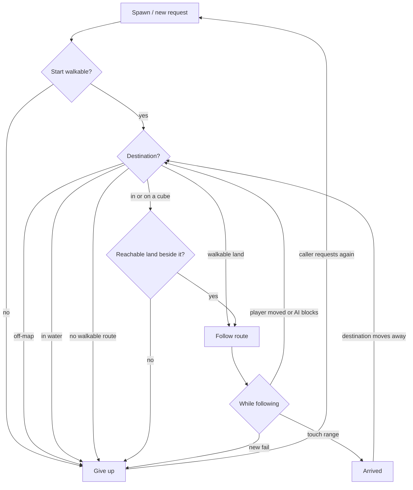
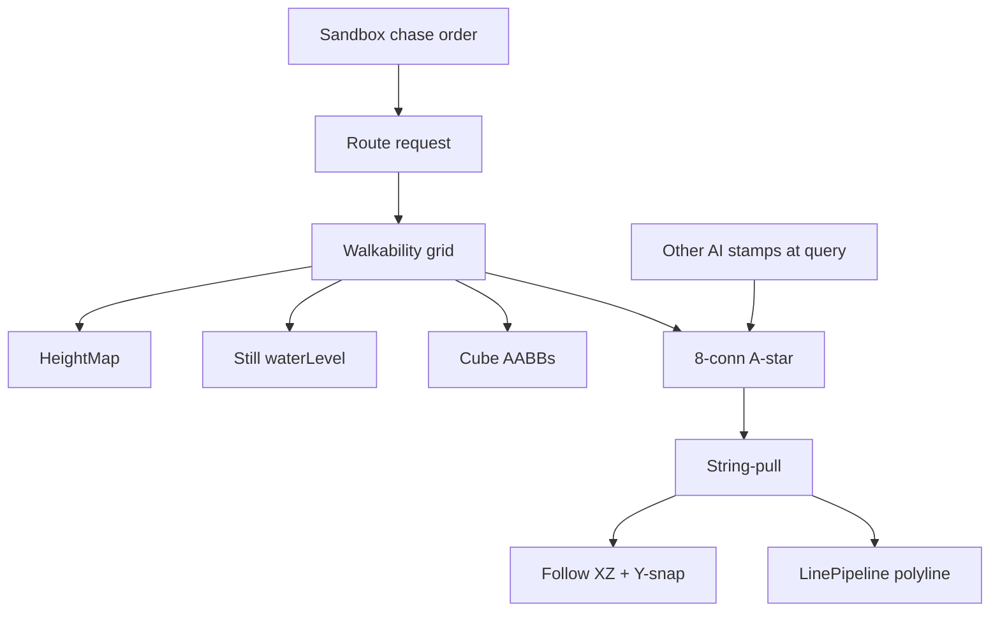
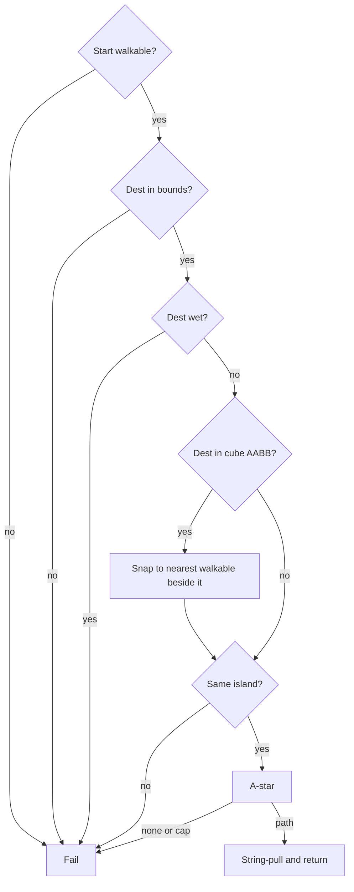

# AI Terrain Pathfinding - Plan

## Goal Capsule

- **Objective:** AIs on the 3D Sandbox terrain can reach the player or a land point by walking around water, steep ground, tree-cubes, and each other, and they stop instead of entering water.
- **Means:** In-engine heightfield route-then-follow on the existing AI surface (KTD1, KTD9).
- **Product authority:** This plan owns walkable routing and following. Seeing, losing, and re-acquiring a target are surrounding AI, not active scope.
- **Stop conditions:** Stop if a change would send AIs through water, skip going around cubes/other AIs, or add sight/swimming/Recast.
- **Execution profile:** Engine library plus Sandbox demo. Unit tests first for walkability and search. Sandbox chase is the watchable proof.
- **Tail ownership:** `ce-work` or a human implementer. Abandoned-attempt code is removed before done.
- **Open blockers:** None.

---

## Product Contract

### Summary

Game code can request a walkable route from an AI to the player or to a world point.
The AI follows that route on dry, not-too-steep land, around static tree-cubes and other pathing AIs, and gives up when the destination is in water or cannot be reached on walkable land.
The proof is three randomly spawned AIs chasing the Sandbox player live, with each current route drawn in the world.
This plan builds that in-engine on the heightfield, with unit tests for lake, cube, steep, and give-up cases.

### Problem Frame

Sandbox already has chunked terrain and valley water, but nothing walks it.
AI is a hierarchical state machine with no movement.
Pawns and cubes snap their height to the ground and otherwise go nowhere.
There is no way for an AI placed on the terrain to get to the player without crossing water or clipping props, so 3D chase and point-to-point travel cannot be shown.

### Key Decisions

- **Route then follow.** A world-scale route is the product, not local veering or a player-only chase field. Governs R4, R5, R10. (session-settled: user-approved — chosen over a player-pointing field and walk-and-veer: lakes must be gone around, and a point is the same kind of destination as the player)
- **Cubes and other AIs are the obstacles.** First-slice blockers are static tree-cubes and other pathing AIs at their current position. Governs R1, R2, R5, R11. (session-settled: user-directed — chosen over static-only, all-collision, and marked-only: they asked to go around objects and other AI)
- **Detour on meeting.** Meeting AIs keep moving around each other's current footprint. Governs R11. (session-settled: user-approved — chosen over wait, overlap-if-stuck, and block-only-at-request)
- **Live chase.** The player is a moving destination. Governs R10, R12. (session-settled: user-approved — chosen over go-to-where-they-were)
- **Walking only.** This plan does not notice or re-acquire targets. Governs R13, R14. (session-settled: user-approved — chosen over a see/lose loop and a target-flag-without-sight: seeing is later AI)
- **Wet and steep fail; a dest in a cube does not.** Water and unreachable steep are give-up. A destination inside or on a static prop routes to the nearest walkable land beside it. Governs R6, R7, R8. (session-settled: user-directed — nearest-land chosen over give-up-like-water; steep-blocked chosen over all-dry-walkable)
- **Invalid start gives up.** An AI already in water or on too-steep ground does not walk. Governs R9. (session-settled: user-approved — chosen over slide-to-land and assume-valid-spawn)
- **Caller resumes chase.** After give-up the engine waits for a new request. Sandbox keeps the chase order live. Governs R13, R14. (session-settled: user-approved — chosen over stay-idle-for-the-demo and wait-on-the-shoreline)
- **Touch-range arrival.** Chasing counts as arrived at contact, or a short standoff if the player has no body yet. Governs R12. (session-settled: user-directed — chosen over a fixed stand-off and occupying the player's exact point)
- **Demo retries spawn; draw the route.** Three chasers land on walkable ground; each current route is visible. Governs R16, R17, R18. (session-settled: user-approved)
- **Engine can path to a point; the demo is chase-only.** A placed point uses the same route request as the player. Governs R4. (session-settled: user-approved — synthesis call-out confirmed: no planted flags in this slice)

<!-- ce-section: work-relationships -->
### How This Work Fits Together

This plan owns walkable routing and following for DarkEngine 3D AI.
The broader breakdown below is the current understanding, not a committed roadmap.

- Seeing / losing / re-acquiring a target
  - Depends on this plan (acquire then needs a route)
  - Not active scope
- Swimming or climbing onto props
  - Still to decide
  - Would change what counts as walkable (R1)
- Combat or other behavior after arrival
  - Can proceed independently of this plan
  - Shares R12 as the handoff moment

### Actors

- A1. Sandbox player — runs on the terrain, including into and out of water.
- A2. Pathing AI — requests routes, follows them, detours, arrives, or gives up.
- A3. Route caller — Sandbox chase order in the demo, or any game code asking for a route to a player or point.

### Requirements

**Walkable land**

- R1. A position is walkable when it is on the terrain, not in water, not too steep, and not overlapping a static prop footprint.
- R2. Other pathing AIs occupy their current position as obstacles whether they are walking, arrived, or given-up.
- R3. The player is a destination, not an obstacle.

**Route request**

- R4. A route request takes a start position and a destination, which may be the player or any world point.
- R5. A successful route uses only walkable land (R1) and goes around static props and other pathing AIs (R2).
- R6. If the destination is in water, the request fails.
- R7. If the destination is on land but inside or on a static prop, the request succeeds to the nearest reachable walkable land beside that prop.
- R8. If the destination is not covered by R7 and no walkable route exists (off-map, only-over-steep, or disconnected land), the request fails.
- R9. If the AI's current position is not walkable, the request fails immediately and the AI does not walk.

**Following and chase**

- R10. While the destination is a moving player, the AI keeps requesting an updated route as the player moves, until R12 or a failed request.
- R11. When another pathing AI blocks the current route, the AI keeps moving by requesting a new route around that AI's current position.
- R12. The AI has arrived when it reaches touch range of the destination (or of R7's stand-in). If the player has no body yet, touch range is a short standoff. If the destination then moves away, chase resumes per R10.

**Give-up**

- R13. After a failed request, the engine does not resume on its own. A new request from a caller is required.
- R14. In the Sandbox demo, the chase order stays live: while those AIs are meant to chase the player, the demo requests again once the player is on walkable land.

**Sandbox proof**

- R15. The first watchable slice is three pathing AIs chasing the Sandbox player on the existing 3D terrain and water.
- R16. Those three spawn at random walkable positions. Unwalkable rolls are retried until each start satisfies R1.
- R17. Green cubes stand in for trees and are static props under R1 and R7.
- R18. Each AI's current route is drawn in the world so it is visible that they go around water, cubes, and each other.

### Key Flows

- F1. Live chase around water and cubes
  - **Trigger:** Demo starts, or A3 keeps a chase order on A2.
  - **Actors:** A1, A2, A3
  - **Steps:** Spawn or retry until R16. Request a route to the player (R4). Follow on walkable land (R5). Re-request as the player moves (R10) and detour around other AIs (R11). Draw the current route (R18). Stop at touch range (R12).
  - **Outcome:** Three AIs run around lakes and tree-cubes toward the player.
  - **Covered by:** R4, R5, R10, R11, R12, R15, R16, R18

- F2. Player enters water, then returns
  - **Trigger:** A1 steps into water while being chased.
  - **Actors:** A1, A2, A3
  - **Steps:** Next request fails (R6). A2 stops (R13). A3 keeps the chase order. When A1 is on walkable land again, A3 requests again (R14). A2 resumes F1.
  - **Outcome:** They do not enter the water. They start moving again once the player is back on land.
  - **Covered by:** R6, R13, R14

- F3. Two AIs meet
  - **Trigger:** Two A2 routes cross.
  - **Actors:** A2
  - **Steps:** Each treats the other's current position as blocked (R2, R11) and requests a new route around it. Debug lines update (R18).
  - **Outcome:** They detour rather than wait or pass through.
  - **Covered by:** R2, R11, R18

- F4. Destination inside a tree-cube
  - **Trigger:** Request whose destination is inside or on a green cube.
  - **Actors:** A2, A3
  - **Steps:** Request succeeds to nearest walkable land beside the cube (R7). A2 walks there and arrives (R12).
  - **Outcome:** They do not give up the way they do for water.
  - **Covered by:** R7, R12

### Acceptance Examples

- AE1. Lake between AI and player
  - **Covers R5, R18.**
  - **Given:** An AI on one shore and the player on the other, with water between them and a dry way around.
  - **When:** A chase request runs.
  - **Then:** The route and the AI go around the water, not through it. The drawn path does not cross the lake.

- AE2. Player in the water
  - **Covers R6, R13.**
  - **Given:** The player is standing in water.
  - **When:** An AI requests a route to the player.
  - **Then:** The request fails. The AI does not walk into the water and does not wait on the shoreline as a success.

- AE3. Player leaves the water during the demo
  - **Covers R14, R10.**
  - **Given:** AE2 has just happened in the Sandbox demo.
  - **When:** The player steps back onto walkable land.
  - **Then:** The demo requests chase again and the AIs resume walking.

- AE4. Destination in a tree-cube
  - **Covers R7, R12.**
  - **Given:** A destination point or player position sits inside or on a green cube.
  - **When:** A route is requested.
  - **Then:** The AI walks to the nearest walkable land beside the cube and arrives. It does not fail the way AE2 does.

- AE5. Plateau only reachable over too-steep ground
  - **Covers R8.**
  - **Given:** The destination is on land, not in a prop, and every approach is too steep.
  - **When:** A route is requested.
  - **Then:** The request fails. The AI does not climb the slope.

- AE6. AI spawned in water
  - **Covers R9, R16.**
  - **Given:** A random spawn roll lands in water or on too-steep ground.
  - **When:** The demo places the three AIs.
  - **Then:** That roll is discarded and retried until walkable. A caller that places an AI on unwalkable ground without retry gets an immediate failed request and no walking.

- AE7. Catch-up then you run
  - **Covers R12, R10.**
  - **Given:** An AI has reached touch range of the player.
  - **When:** The player moves away.
  - **Then:** Chase resumes. The AI does not stay at the old contact point.

- AE8. Packed chasers
  - **Covers R2, R11, R18.**
  - **Given:** Three AIs chasing the same player near a cluster of cubes.
  - **When:** Their paths meet.
  - **Then:** Each detours around the others and around the cubes. Drawn routes update. They do not walk through each other.

- AE9. Destination off the map
  - **Covers R1, R8.**
  - **Given:** The destination XZ is outside the heightfield.
  - **When:** A route is requested.
  - **Then:** The request fails. The AI does not treat the clamped rim height as a valid goal.

- AE10. Cube with no dry ring
  - **Covers R7, R8.**
  - **Given:** The destination is inside a static cube and every adjacent cell is water, too steep, or off-map.
  - **When:** A route is requested.
  - **Then:** The request fails. There is no shoreline or cliff-edge “success.”

- AE11. Default Sandbox boot
  - **Covers R15.**
  - **Given:** `Sandbox.exe` is started without hosting a session.
  - **When:** The chase demo runs.
  - **Then:** A local walking player exists on the terrain so the three AIs have someone to chase.

### Success Criteria

- Watching the Sandbox demo, it is obvious the three AIs go around water and green cubes rather than through them.
- Drawn routes match what the AIs walk, including detours around each other.
- Stepping into water stops them from entering it; returning to land starts chase again without restarting the demo.

### Scope Boundaries

**Deferred for later**

- Seeing, losing, or re-acquiring a target
- Swimming
- Climbing onto cubes or other props
- Jumping or flying
- Treating the player or other moving non-AI objects as obstacles
- Planted-flag / click-to-place destination UI in Sandbox
- Sandbox2D / 2D pathfinding
- Combat or other behavior after arrival
- Hierarchical state machine chase states
- Third-party nav libraries
- Player walkability clamp (the player may still run into water)

### Deferred to Follow-Up Work

- Predicted future footprints / local avoidance beyond current-position cost
- Dynamic GPU line ring without a dedicated upload helper if U5 proves too heavy
- Networking the pathing AIs

### Dependencies / Assumptions

- Terrain already answers world height and in-bounds XZ (`Terrain/HeightMap.h`). Off-map must use `containsXZ` / `tryHeightAtWorld`, not clamped `heightAtWorld`.
- Still water for nav is `WaterParams::waterLevel` versus terrain Y. `WaterWorld::tryHeightAtWorld` is animated waves and is not the wet test.
- Sandbox boots terrain and water. A `PlayerPawn` is spawned on Host today, not on Idle. The demo must provide a local walking pawn for R15/AE11.
- `LinePipeline` can draw world line lists. `LineMesh::Create` calls `Renderer::waitForGpu` and is not the live-repath upload path (KTD8).
- Nothing in-tree pathfinds. `AI/` is HSM-only and Sandbox does not use it. `LogCategory::AI` already exists.
- Sandbox cubes are 1 m meshes Y-snapped with `heightAtWorld + 0.5f`. The pawn is drawn as the same cube even without a physics body.
- No C++ exceptions. Failures return `bool` and log `DE_LOG_ERROR(LogCategory::AI, ...)`.

Product Contract preservation: R1–R7, R9–R18 and Key Decisions unchanged. R8 widened to include off-map (AE9). Added AE9–AE11. Outstanding Questions resolved into KTDs. Dependencies corrected for still water, Idle pawn, and LineMesh.

### Outstanding Questions

**Resolve Before Planning**

- None.

### Sources / Research

- `AI/Hsm.h` — HSM only; no movement.
- `Terrain/HeightMap.h` — `heightAtWorld`, `tryHeightAtWorld`, `containsXZ`, `normalAtWorld`, `cellSize`.
- `Water/Water.cpp` — still `waterLevel`; `tryHeightAtWorld` compares land to `waveHeight`.
- `ECS/Components.h` — `TransformComponent`; no nav component.
- `Sandbox/SandboxApp.cpp` — FBM 129×129, `cellSize` 2, origin −128; water at 38% of terrain Y; Y-snap; Host-only pawn; spinning origin cube.
- `Geometry/LineMesh.cpp` — `Create` uploads then `waitForGpu`.
- `Render/LinePipeline.h` — unlit world line list. Sandbox 3D does not create one today.
- `UnitTests/AI/HsmTests.cpp`, `UnitTests/Terrain/HeightMapTests.cpp`, `UnitTests/Water/WaterTests.cpp` — bool APIs, tiny heightmaps, zeroed waves.
- Amit Patel, *A\* on grids* (implementation, heuristics, movement costs); Rayner, grid A\* practices; Recast `rcConfig` parameter band (cell, slope, climb, radius) used as numbers only; Godot `AStarGrid2D` diagonal modes; GameAIPro2 crowd hysteresis.

---

## Planning Contract

### Key Technical Decisions

- KTD1. **Heightfield grid A\*.** Nav cells are the bilinear patches: `(width-1)×(height-1)`, spacing `cellSize`. Search is 8-connected with octile costs. A diagonal is legal only if both orthogonal neighbors are walkable. Start cell is the containing patch (`worldToSample` floor). Governs R4, R5. (session-settled: user-approved — instantiates route-then-follow over flow field and walk-and-veer: R4, R5, R10)
- KTD2. **Still water, not waves.** A cell is wet if any of its four corner samples has terrain Y below `waterLevel`. Never use `WaterWorld::tryHeightAtWorld` for nav. Governs R1, R6, R9.
- KTD3. **Slope and climb.** A cell is too steep when `normalAtWorld` implies slope > 45°. A neighbor edge is unwalkable when `|ΔY|` exceeds `tan(45°) * cellSize` (2.0 on the Sandbox map). A fixed 0.75 wu step is a ledge height for 1 wu cells, not this heightmap. Splat `rockSlope` 0.45 is visual rock blend only. Governs R1, R8.
- KTD4. **Other AIs are high cost, not walls.** Stamp current XZ footprints (not the player, not self) at about 8–16× octile so a short side path beats a squeeze. If a dry detour exists, the route must use it (R5, AE8). If the only path goes through another AI, fail (R8), do not squeeze. Follow must not advance through another AI AABB between searches. Governs R2, R11. (session-settled: user-approved — instantiates detour over wait and pass-through)
- KTD5. **Island IDs before A\*.** After bake, if start and dest (or R7 stand-in) are different connected components, fail without search. Island flood uses the same 8-conn, no-corner-cut, and climb-edge rules as search (KTD1, KTD3). Governs R8.
- KTD6. **String-pull on the same walkability.** Pull the A\* polyline with the KTD1/KTD2 tests, including no corner cut. Follow and debug-draw the pulled polyline. Governs R5, R18.
- KTD7. **Throttled chase repath (Sandbox).** Do not start a search more often than every 0.5 s, except when another AI’s inflated AABB overlaps the next two pulled segments. Dest moving more than one cell queues a search; it does not bypass the 0.5 s cap. Stagger agents by `i * 0.5/3` s. Keep the previous path unless the new one is < 0.8× old cost or the old corridor is occupied. Engine Pathfinder does not own this timer. Governs R10, R11.
- KTD8. **Live lines without draining the GPU.** Sandbox draws with `LinePipeline`. Use a `Renderer::kFrameCount` ring of pre-sized UPLOAD buffers (or DEFAULT VB plus CopyBufferRegion on the frame `commandList`). Do not Map the buffer the GPU is still reading. Do not grow on the chase tick. Do not call `LineMesh::Create` or `syncTerrainLod` on repath. Governs R18.
- KTD9. **In-engine under `AI/`.** New sources go in the existing `AI/` glob. No Recast/Detour. No new top-level Nav folder. No HSM wiring this slice.
- KTD10. **Wet dest fails; cube dest snaps then searches.** Water and off-map destinations do not snap to shoreline or rim. Cube destinations pick the nearest **same-island** walkable cell beside the inflated AABB, then search. If none exists, fail (R7 + R8). Dest in the inflate ring but not in the visual cube uses that same snap. Governs R6, R7, R8. (session-settled: user-directed — instantiates nearest-land for cubes vs give-up for water)
- KTD11. **Search cap.** Expansion is capped at 4096 nodes plus the island precheck (KTD5). Hitting the cap is give-up, not a partial shoreline path. Governs R8.
- KTD12. **Demo numbers.** Agent radius 0.8. Cubes and AIs use 1 m XZ AABB inflated by that radius. Sandbox pawn arrival is contact of those 1 m visual footprints (R12). “No body” in R12 is a point destination only. Ten green tree-cubes plus the origin cube are static props. AI follow speed 10. Keep sampling until three walkable non-overlapping spawns exist; if 256 consecutive rolls fail, log fatal and skip demo boot rather than ship fewer than three AIs.

### High-Level Technical Design

Sandbox holds chase orders, spawn retry, XZ follow, mesh draw, and debug draw.
The engine bakes walkability and answers route requests with a pulled world-XZ polyline.
Heightmap, still water level, cube AABBs, and other-AI stamps feed the grid.

Request classification (product flowchart stays authoritative for states):

Bake once when terrain, water level, and static cubes are known.
Stamp other AIs only at query time.
Follow is XZ along the pulled path; Y is `heightAtWorld + 0.5f` on walkable cells only.

Directional sketch, not signatures: a route request returns false on R6, R8, and R9, and true with a pulled world-XZ polyline on success (R7 is a successful snap, then search).

### Assumptions

- Sandbox Idle/offline will spawn a local 1 m player pawn so AE11 holds. That is demo delivery of R15, not a networking change.
- The spinning origin cube is a static XZ AABB obstacle. Spin does not grow the footprint.
- Three arrived AIs may all sit in the player's touch ring (R3).
- After give-up, no current route is drawn (R18).
- Failed detour is R8 + R13. Sandbox may retry while the chase order is live (KTD7 hysteresis limits twitch).

### Implementation Constraints

- C++20, MSVC, no exceptions in engine or Sandbox.
- `DE_ENGINE_FOLDERS` already globs `AI/`. New `AI/*.cpp` compile into `DarkEngine` with no CMake folder add.
- Root `CMakeLists.txt` globs `Sandbox/*.cpp`. Nested `Sandbox/CMakeLists.txt` is not used. New Sandbox sources are picked up by that glob.
- `UnitTests/` globs recursively. New `UnitTests/AI/*Tests.cpp` need no CMake edit.
- Log pathfinding with `LogCategory::AI`.

### Sequencing

1. U1 then U2 — walkability and search-plus-pull, proven on tiny maps (AE1, AE2, AE4, AE5, AE9, AE10).
2. U4 — other-AI cost stamps on Pathfinder (no follow type).
3. U3 + U5 + U6 — Sandbox follow, pre-sized mapped lines, mesh draw, Idle-controllable pawn, three-AI chase.

### System-Wide Impact

- `AI/` gains walkability and pathfinder types compiled into `DarkEngine` via the existing folder glob.
- Sandbox 3D gains `LinePipeline` and a mapped line buffer, drawn after water in `onRender`. F8/F9 `DebugOverlay` stays a depth blit.
- Player pawn motion is unchanged (may enter water). Pathing AIs are not networked.
- `LogCategory::AI` is the log switch for the new code.

### Risks & Dependencies

- **Repath hitch.** `LineMesh::Create`, terrain `uploadDirty`, and ParticleRenderer grow-path all drain the GPU. Mitigation: KTD8 pre-sized mapped buffer, no grow on the chase tick.
- **Failed search cost.** Unbounded A\* on a miss walks the island. Mitigation: KTD5 island IDs and KTD11 expansion cap.
- **Shoreline flicker.** Wave `tryHeightAtWorld` would flip wet/dry. Mitigation: KTD2 still `waterLevel`.
- **Head-on freeze.** Infinite walls on other AIs deadlock two chasers. Mitigation: KTD4 high cost, not walls.
- **Demo with no target.** Idle boot has no pawn today. Mitigation: U6 local pawn (AE11).
- **Depends on** existing HeightMap queries, still water level, 1 m cube transforms, and `LinePipeline`.

---

## Implementation Units

### U1. Walkability grid

- **Goal:** Bake a static walkable grid from a heightmap, still water level, slope/climb, and inflated cube AABBs, plus connected-component IDs.
- **Requirements:** R1, R9
- **Dependencies:** None
- **Files:** `AI/Walkability.h`, `AI/Walkability.cpp`, `UnitTests/AI/WalkabilityTests.cpp`
- **Approach:**
  1. Grid is `(width-1)×(height-1)` patches at `cellSize`. Mark wet if any of the four sample corners is below still water (KTD1, KTD2, KTD3).
  2. Rasterize cube AABBs inflated by agent radius. Do not stamp other AIs. Do not include `Hsm.h`. Do not use `WaterWorld::tryHeightAtWorld`.
  3. Flood-fill island IDs with the same 8-conn, no-corner-cut, and climb-edge predicate as search (KTD5).
- **Execution note:** Implement test-first on tiny `HeightMap::create` maps, matching `UnitTests/Terrain` helpers.
- **Patterns to follow:** `Terrain/HeightMap.h` queries; `UnitTests/Water/WaterTests.cpp` still-level wet checks; bool + `DE_LOG_ERROR(LogCategory::AI, ...)`.
- **Test scenarios:**
  - Happy path: flat dry 5×5 map, water at −10, all interior cells walkable and one island.
  - Covers AE1. A valley of cells with Y below waterLevel is unwalkable; dry cells around it stay walkable.
  - Covers AE5. A ramp steeper than 45°, or a neighbor `|ΔY|` over `tan(45°)*cellSize`, is unwalkable.
  - Covers AE9. World XZ outside `containsXZ` is not walkable.
  - A 1 m cube at the origin marks its inflated cells unwalkable; a cell just outside the inflate is walkable.
  - Two dry blobs separated by water have different island IDs.
- **Verification:** `Walkability*` tests pass. No wave API is referenced.

### U2. Route search and string-pull

- **Goal:** Answer a start-to-dest request with a pulled world-XZ polyline, or fail per R6, R8, R9.
- **Requirements:** R4, R5, R6, R7, R8, R9
- **Dependencies:** U1
- **Files:** `AI/Pathfinder.h`, `AI/Pathfinder.cpp`, `UnitTests/AI/PathfinderTests.cpp`
- **Approach:**
  1. Classify dest (KTD10): off-map or dest-patch four-corner wet → fail; in cube or inflate ring → nearest same-island walkable beside inflated AABB, else fail; else search. Use the same wet test as bake, not a single `heightAtWorld`.
  2. If islands differ, fail (KTD5). Else 8-conn A\* with no corner cut and octile costs (KTD1). Cap expansions (KTD11).
  3. String-pull the result with the same walkability tests (KTD6). Other-AI cost field empty until U4. No `PathFollower` type.
- **Execution note:** Test-first. Cover give-up vs cube-snap before Sandbox exists.
- **Patterns to follow:** `UnitTests/AI/HsmTests.cpp` (`using namespace Dark::AI`, `TEST(Pathfinder, ...)`).
- **Test scenarios:**
  - Covers AE1. Opposite shores with a dry U-shaped bridge: pulled path exists, no waypoint wet, no wet-corner cut.
  - Covers AE2. Dest cell wet: false, no polyline.
  - Covers AE4. Dest inside a cube with a same-island dry cell beside the inflated AABB: polyline ends there, not inside the cube.
  - Covers AE5. Plateau only over steep: false.
  - Covers AE6. Start wet or too steep: false immediately.
  - Covers AE9. Dest outside the map: false.
  - Covers AE10. Cube surrounded by water: false.
  - A three-cell zigzag with LOS collapses to a shorter dry pulled polyline.
  - Expansion cap: a huge miss hits the cap and fails.
- **Verification:** `Pathfinder*` tests pass. Lake paths never include wet cells.

### U3. Sandbox follow

- **Goal:** Advance each demo AI along the pulled polyline in XZ and detect R12 arrival. No new engine type.
- **Requirements:** R5, R12
- **Dependencies:** U2
- **Files:** `Sandbox/SandboxApp.h`, `Sandbox/SandboxApp.cpp`
- **Approach:**
  1. String-pull from the agent’s current XZ. Move XZ toward the next pulled waypoint at 10 wu/s in steps smaller than half the agent radius. Reject a step that lands unwalkable or inside another AI AABB. Advance waypoint when XZ distance < 1.0. Snap Y with `heightAtWorld + 0.5f`.
  2. Pawn arrival is 1 m visual-footprint contact (KTD12). Point dest uses 0.75 m standoff.
  3. Do not clamp the player with Walkability. Do not include `Hsm.h`.
- **Patterns to follow:** `SandboxApp::updatePawnMotion` XZ then Y-snap, applied only to pathing AIs.
- **Test scenarios:**
  - Test expectation: none in UnitTests — covered by U2 pull tests and U6 chase smoke.
  - On a straight 10-unit path at speed 10, after 0.5 s the AI is about 5 units along.
  - Touch-range to the pawn cube counts as arrived; moving the pawn resumes chase in U6.
- **Verification:** U6 chase AIs walk the drawn polyline and stop at pawn contact.

### U4. Other-AI cost stamps

- **Goal:** Stamp other pathing AIs as high cost at query time. Chase throttle stays in Sandbox (U6).
- **Requirements:** R2, R11
- **Dependencies:** U2
- **Files:** `AI/Pathfinder.h`, `AI/Pathfinder.cpp`, `UnitTests/AI/PathfinderDynamicTests.cpp`
- **Approach:**
  1. Pass other-agent XZ into the request. Never stamp self or the player (R3, KTD4).
  2. High cost, not infinite. If a dry detour exists, use it. Squeeze only when no detour exists.
  3. Engine does not auto-retry after fail (R13). KTD7 accept/reject lives in U6.
- **Test scenarios:**
  - Covers AE8. Two agents with a dry side path: both routes go around, not through the other as first choice.
  - Head-on in a one-cell corridor: search returns a squeeze route or fails cleanly; no infinite loop.
  - Arrived/given-up stamps still occupy space (R2).
  - After a failed request, no auto-retry inside the engine (R13).
- **Verification:** `PathfinderDynamic*` tests pass.

### U5. Live debug polylines

- **Goal:** Draw each AI’s current pulled route without stalling the GPU on repath.
- **Requirements:** R18
- **Dependencies:** U2
- **Files:** `Sandbox/SandboxApp.h`, `Sandbox/SandboxApp.cpp`
- **Approach:**
  1. Pre-size a mapped upload VB/IB at init for three worst-case pulled paths (KTD8). `waitForGpu` is allowed at that init, not on the chase tick.
  2. Map/memcpy/Unmap on repath. Draw with `LinePipeline` after water. Lift Y by a small epsilon. Draw nothing after give-up.
  3. Do not call `LineMesh::Create`, `syncTerrainLod`, or grow the buffer on the chase tick. Do not add a MeshGen path helper.
- **Patterns to follow:** Editor/Sandbox2D `LinePipeline::bind` → `setConstants` → `draw`; `SandboxApp::onRender` `commandList()`.
- **Test scenarios:**
  - Test expectation: none in UnitTests — GPU path is Sandbox smoke.
  - Empty path draws nothing, not a leftover lake-crossing line.
  - Chase tick does not call `LineMesh::Create` or `waitForGpu`.
- **Verification:** U6 chase shows updating routes without a hitch.

### U6. Sandbox three-AI chase demo

- **Goal:** Three visible AIs chase a locally controllable player around water and green tree-cubes, with routes drawn.
- **Requirements:** R10, R12, R14, R15, R16, R17, R18
- **Dependencies:** U3, U4, U5
- **Files:** `Sandbox/SandboxApp.h`, `Sandbox/SandboxApp.cpp`
- **Approach:**
  1. Place ten unrotated green cubes (seeded XZ that miss the origin spawn ring). Collect their AABBs plus the origin cube. Bake Walkability after those AABBs exist. Draw cubes with `m_cubeMesh` without `registerEntity`.
  2. Spawn a local player pawn on Idle as well as Host. Drive Idle motion from a stored `SandboxApp` entity, not `network().localPawn()` (empty while Idle). Player XZ stays unclamped.
  3. Spawn three AIs until walkable and non-overlapping (KTD12). Draw them with `m_cubeMesh` and a distinct tint. Do not `registerEntity` them.
  4. Each tick: U3 follow, KTD7 repath (0.5 s or dest moved > 1 cell or next two waypoints blocked; keep old path otherwise), resume after give-up when dest is walkable (R14).
  5. Do not include HSM. Do not `registerEntity` the AIs.
- **Execution note:** Smoke/runtime proof. Engine behavior is U1–U2 and U4 tests.
- **Patterns to follow:** `CreateCube` 1 m; `onRender` after water; `updatePawnMotion` but retargeted to the stored Idle pawn.
- **Test scenarios:**
  - Test expectation: none in UnitTests — watchable Sandbox slice.
  - Covers AE11. Default `Sandbox.exe` WASD-moves a pawn and shows three chasers and green cubes.
  - Covers AE1/AE8 visually: AIs go around lakes and cubes; lines match.
  - Covers AE2/AE3: player in water, chasers stop; back on land, they resume.
  - Covers AE6: no AI standing in a lake at boot.
- **Verification:** Debug Sandbox shows three chasers, green cubes, drawn routes, Idle control, and no `waitForGpu` on the chase tick.

---

## Verification Contract

- Build engine tests: `cmake --build build --config Debug --target UnitTests`
- Run: `build\bin\Debug\UnitTests.exe --gtest_filter=Walkability*:Pathfinder*`
- Full suite: `build\bin\Debug\UnitTests.exe`
- Build demo: `cmake --build build --config Debug --target Sandbox`
- Watchable proof: run `build\bin\Debug\Sandbox.exe`, walk the pawn around water and cubes, confirm AE1–AE3 and AE8 by eye.
- `scripts/check-no-exceptions.ps1` still clean on `AI/` and `Sandbox/`.

---

## Definition of Done

- R1–R18 are met for the Sandbox chase slice and the engine point-dest API.
- U1, U2, and U4 unit tests listed above pass in Debug.
- U6 demo matches Success Criteria without Recast, HSM chase, or player water clamp.
- No `try` / `catch` / `throw` under engine or Sandbox paths.
- Dead-end experimental path code is not left in the tree.
- Abandoned GPU upload experiments are removed if U5 lands a single update path.

### Per-unit done

- U1: walkability tests cover wet corners, slope/climb, cubes, islands, off-map.
- U2: search and pull tests cover AE1, AE2, AE4, AE5, AE6, AE9, AE10 and diagonal corner cut.
- U3: Sandbox follow is proven in U6 chase smoke.
- U4: dynamic tests cover detour, squeeze-only-if-no-detour, occupancy of arrived AIs, no engine auto-resume.
- U5: chase tick does not call `LineMesh::Create` or `waitForGpu`; buffer is pre-sized at init.
- U6: default Sandbox chase is watchable; Idle WASD-moves a pawn; AIs and green cubes are drawn.
