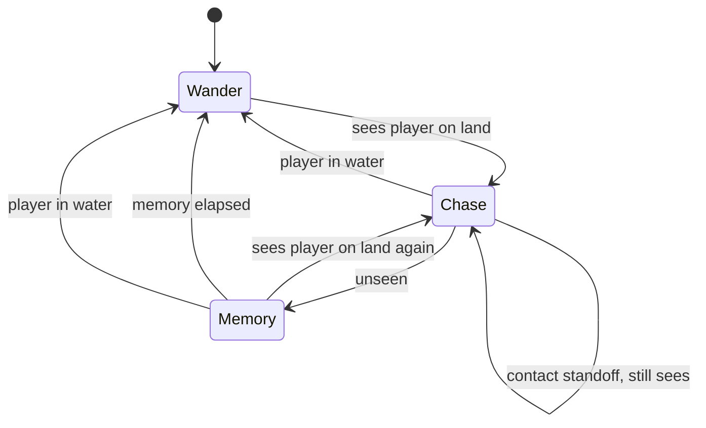
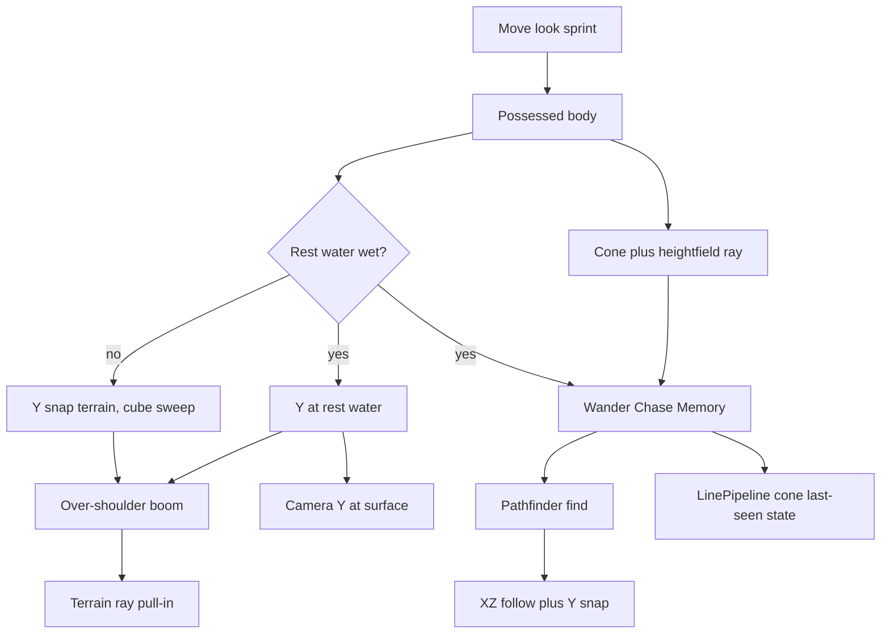
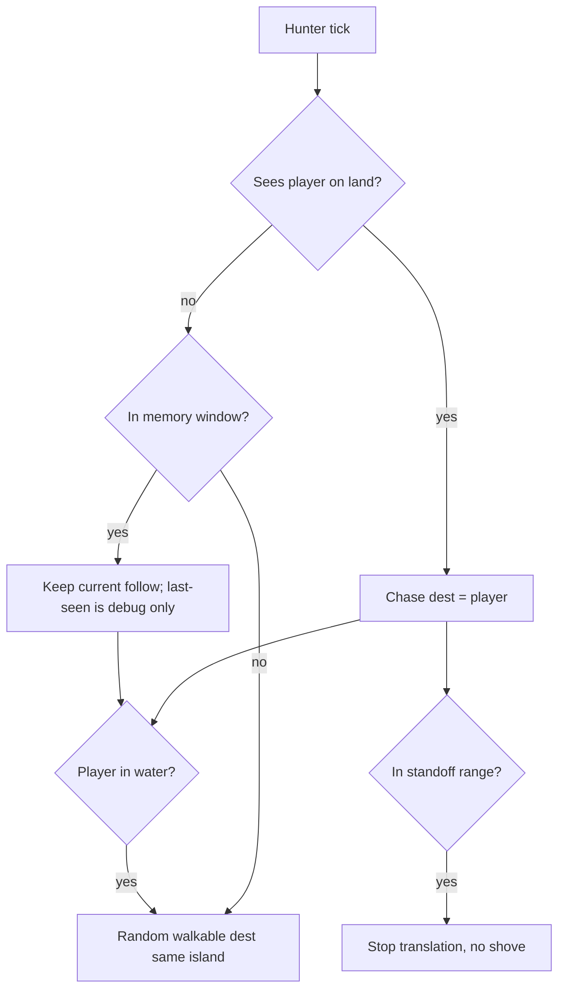

# Player and Enemy Hunted Loop - Plan

## Goal Capsule

- **Objective:** In 3D Sandbox you possess a third-person body on the terrain, and a small pack of enemies hunt you when they notice you, then give up after they lose you or you swim.
- **Means:** Possessed over-shoulder character plus wander/see/chase hunters on existing land pathing (KTD1, KTD2, KTD3, KTD5).
- **Product authority:** This plan owns the playable hunted loop. Combat, jump, climb, dive, enemy swimming, authored patrols, and an animated mesh are surrounding work, not active scope.
- **Stop conditions:** Stop if a change would add combat or a fail-state, let enemies enter water, add jump or climb, or replace the over-shoulder possess with the fly camera as the way you move.
- **Execution profile:** Engine sight and hunter-state tests first. 3D Sandbox is the watchable proof.
- **Tail ownership:** `ce-work` or a human implementer. Abandoned-attempt code is removed before done.
- **Open blockers:** None.

---

## Product Contract

### Summary

3D Sandbox becomes a possessed third-person hunted loop: you look and move a close over-shoulder character, stand on terrain, sprint, and swim as an escape, while a small pack of enemies random-walk on dry land, chase when you are in their cone and not hidden by a hill, forget after a short memory, and stand off at contact.
Debug cones, last-seen, and hunter state plus footstep and water audio make the loop visible and audible.
This plan extends the land-chase demo, input map, and camera. Sight and hunter states are unit-tested. A live Idle Sandbox session is the playable proof.

### Problem Frame

3D Sandbox is still a fly camera and a height-snapped pawn.
Enemies from the terrain-pathfinding work always path to that pawn.
They do not wander, see, or forget.
The pathfinding plan left seeing, losing, swimming, and hunter states as later AI, so there is no way to play "I am in this world and they hunt me when they see me."

### Key Decisions

- One hunted loop, not two slices. Governs R1, R12, R15. (session-settled: user-approved — chosen over player-only and enemy-only: the proof is being hunted while you drive the body)
- Hunted, not a fight. Governs R18. (session-settled: user-approved — chosen over catch-means-lose and combat: contact is the hunt proof, not a fail or attack)
- Off-duty is random walk on walkable land. Governs R12. (session-settled: user-approved — chosen over idle, patrol routes, and a mix: matches walking around without authored paths)
- Water is a hard chase reset. Governs R9, R17. (session-settled: user-approved — chosen over shore watch, ignoring a swimmer, and enemy swimming: water is an escape)
- Sight is a cone plus terrain, not cubes. Governs R13, R14. (session-settled: user-approved — chosen over cone-only, tree-cube occlusion, and range-only: hills hide you)
- Unseen uses short memory, then wander. Governs R16. (session-settled: user-approved — chosen over instant drop and go-to-last-seen: avoids cone-edge flicker without a search beat)
- Close over-shoulder on a placeholder body. Governs R2, R7. (session-settled: user-approved — chosen over centered follow, high-far follow, a mix, and adding a mesh: keep the tight camera)
- Camera-relative look; keyboard and gamepad share actions. Governs R3, R4. (session-settled: user-approved — chosen over locked-behind and hold-to-look)
- Jump is out; footstep and water audio are in. Governs R10, R20. (session-settled: user-approved — chosen over keeping jump and dropping both: jump collides with cubes, slopes, and water without serving the hunt)
- Standoff at contact, no shove. Governs R18. (session-settled: user-approved — chosen over solid nudge/pin and overlapping through the player)
- Debug draw is part of the proof. Governs R19.
- Camera does not clip through terrain. Governs R6.
- Analog move plus keyboard sprint. Governs R5.
- Swim uses the same camera, held at the surface. Governs R7. (session-settled: user-approved — chosen over dunking the camera under the water mesh)
- Cone width and range are tunable defaults, not a stealth difficulty. Governs R14. (session-settled: user-approved — chosen over designing a named stealth difficulty)

<!-- ce-section: work-relationships -->
### How This Work Fits Together

This plan owns the playable hunted loop: the possessed player and notice/forget hunters.
The broader breakdown below is the current understanding, not a committed roadmap.

- Walkable routing and following
  - This plan depends on it for chase and wander travel
  - Owned by `docs/plans/2026-08-26-2054-feat-terrain-pathfinding-plan.md`
- Combat or fail after contact
  - Can proceed independently of this plan
  - Shares R18 as the handoff moment
- Jump, climb onto props, or dive
  - Still to decide
- Animated character mesh
  - Can proceed independently of this plan
  - Close over-shoulder stays per R2
- Enemy swimming
  - Still to decide
  - Would change R9 and R17

### Actors

- A1. Possessed player — you in 3D Sandbox, driving the third-person body.
- A2. Hunter — an enemy that wanders, sees, chases, forgets, or gives up at water.
- A3. Route follower — existing land pathing used when a hunter travels to a wander point or to A1 on land.

### Requirements

**Possession and camera**

- R1. 3D Sandbox play is possession of a third-person body, not the fly camera as the way you move through the world.
- R2. The camera sits close over the shoulder even when the body is a placeholder with no walk or swim animation.
- R3. Looking is camera-relative: mouse and right stick look; WASD and left stick move relative to where the camera faces.
- R4. Keyboard and gamepad drive the same named actions.
- R5. Stick magnitude is walk-to-run on land; keyboard has a sprint action. Swim uses analog speed without a land sprint.
- R6. If terrain would occupy the camera, the camera pulls in so it is not inside the mesh.
- R7. While swimming, the same over-shoulder camera stays at the surface rather than sitting under the water.

**Locomotion**

- R8. On land the body stands on the terrain, does not fall through, and follows the ground including slopes.
- R9. Entering water is surface swimming and is an escape from hunters per R17.
- R10. Tree-cubes are solid for the player. The player cannot jump or climb onto them.

**Hunters**

- R11. A small pack of hunters operate independently in the same Sandbox session.
- R12. When not hunting, a hunter random-walks on walkable land by traveling to nearby walkable points.
- R13. A hunter sees A1 when A1 is inside the hunter's forward cone, inside range, and a line to A1 is not buried in the heightfield.
- R14. Cone width and range are tunable defaults. Tree-cubes do not break sight.
- R15. While a hunter sees A1 on land, it chases A1 on existing walkable routes.
- R16. After A1 leaves the cone or terrain blocks the line, the hunter keeps chasing for a short memory, then returns to R12 if A1 is still unseen.
- R17. When A1's body is in water, the hunter ends Chase or Memory and returns to R12 even if A1 is still in the cone.
- R18. At contact with A1 on land, the hunter stops at standoff, does not shove, and stays in chase while it still sees A1.

**Proof in the world**

- R19. Debug draw shows each hunter's cone, last-seen point, and whether it is wandering, chasing, or in short memory.
- R20. Footstep audio plays while walking or sprinting on land. Water audio plays while swimming.

### Key Flows

- F1. Possess and walk
  - **Trigger:** 3D Sandbox starts.
  - **Actors:** A1
  - **Steps:** You look and move the body. It stays on terrain. Sprint is available on land. The camera stays over the shoulder and pulls in if a hill is behind you.
  - **Outcome:** You are in the world as the character.
  - **Covered by:** R1, R2, R3, R4, R5, R6, R8

- F2. Noticed and chased
  - **Trigger:** A1 enters a hunter's cone with a clear terrain line, on land.
  - **Actors:** A1, A2, A3
  - **Steps:** The hunter leaves random walk, paths toward A1, and stands off at contact while it still sees A1.
  - **Outcome:** You are being hunted.
  - **Covered by:** R12, R13, R15, R18

- F3. Hide behind a hill
  - **Trigger:** Terrain breaks the line or A1 leaves the cone during a chase.
  - **Actors:** A1, A2
  - **Steps:** The hunter keeps chasing for a short memory. If A1 is still unseen when memory ends, it returns to random walk.
  - **Outcome:** You broke the hunt without combat.
  - **Covered by:** R16, R19

- F4. Swim escape
  - **Trigger:** A1 enters water during a chase or memory.
  - **Actors:** A1, A2
  - **Steps:** A1 surface-swims. The camera stays over the shoulder at the surface. The hunter ends chase and random-walks on land.
  - **Outcome:** Water reset the hunt.
  - **Covered by:** R7, R9, R17, R20

- F5. Off-duty wander
  - **Trigger:** A hunter is not seeing A1 and is not in short memory.
  - **Actors:** A2, A3
  - **Steps:** The hunter picks nearby walkable land points and travels them. It does not enter water.
  - **Outcome:** The pack is walking around until someone is seen.
  - **Covered by:** R11, R12

### Acceptance Examples

- AE1. Hill hides you
  - **Covers R13, R16.**
  - **Given:** A hunter is chasing A1 on land.
  - **When:** A1 steps behind a hill that buries the line in the heightfield.
  - **Then:** The hunter does not see A1. After short memory it returns to random walk if A1 stays hidden.

- AE2. Tree-cube does not hide you
  - **Covers R13, R14.**
  - **Given:** A1 is in the cone and in range.
  - **When:** A tree-cube sits on the line but the heightfield does not bury it.
  - **Then:** The hunter sees A1 and chases.

- AE3. Brief leave-cone does not drop chase
  - **Covers R16.**
  - **Given:** A hunter is chasing A1.
  - **When:** A1 leaves the cone for less than the memory window, then re-enters with a clear line.
  - **Then:** The hunter stays in chase rather than wandering.

- AE4. Swim ends chase
  - **Covers R9, R17.**
  - **Given:** A hunter is chasing or in short memory.
  - **When:** A1's body enters water, still in the cone.
  - **Then:** The hunter ends chase and random-walks. It does not stand on the shore watching.

- AE5. Contact is a standoff
  - **Covers R18.**
  - **Given:** A hunter reaches A1 on land and still sees A1.
  - **When:** The bodies are in contact range.
  - **Then:** The hunter stops, does not shove A1, and stays in chase until sight is lost or A1 enters water.

- AE6. Camera vs hill
  - **Covers R6.**
  - **Given:** The camera is close over the shoulder.
  - **When:** A hill occupies the camera's default point.
  - **Then:** The camera pulls in. You are not looking from inside the terrain.

- AE7. Swim camera stays above water
  - **Covers R7, R9.**
  - **Given:** A1 is surface swimming.
  - **When:** The over-shoulder camera would sit below the water surface.
  - **Then:** The camera is held at the surface.

- AE8. Keyboard and gamepad are the same loop
  - **Covers R3, R4, R5.**
  - **Given:** 3D Sandbox is running.
  - **When:** You move, look, and sprint from keyboard, then from gamepad.
  - **Then:** Both drive the same actions. There is no second control scheme.

### Success Criteria

- One 3D Sandbox boot is enough to walk, sprint, swim, be seen, hide behind a hill, hear land and water audio, and read hunter state from debug draw.
- An observer who only watches debug draw can tell wander, chase, and short memory apart.
- The loop has no combat, health, fail-state, or jump.

### Scope Boundaries

**Deferred for later**

- Combat, health, death, and catch-as-fail
- Jump, climb onto cubes or other props, and diving
- Enemy swimming
- Authored patrol routes
- Go-to-last-seen as a search beat
- Tree-cubes breaking line of sight
- Animated walk or swim cycles and a finished character mesh

**Outside this product's identity**

- A fly-camera sandbox as the way you play this loop
- A player-only camera demo with always-on chasers
- A stealth game with alert phases, noise, or cover systems

**Deferred to Follow-Up Work**

- Mouse as a first-class ActionMap axis type
- Driving cone or speeds from `Character/` physiology
- Replicating hunters or making Host/Client the watchable proof
- Using DebugOverlay for world AI debug
- Recast/Detour

### Dependencies / Assumptions

- Land route-then-follow from `docs/plans/2026-08-26-2054-feat-terrain-pathfinding-plan.md` is the travel used for wander points and land chase. Hunters still do not walk into water.
- 3D Sandbox today is a fly camera plus an XZ pawn with Y snapped to terrain. PathChase always paths to that pawn and does not wander, see, or forget.
- Keyboard, gamepad, 3D camera, heightfield, water level, collision queries, a hierarchical state machine, and audio playback already exist in the engine.
- Surface swim only. There is no dive.

### Outstanding Questions

**Resolve Before Planning**

- None.

**Deferred to implementation**

- Exact helper names and whether the placeholder body is the current pawn cube or a still humanoid mesh (KTD10, R2).
- Real footstep and water wav files versus generated tones (KTD12).

### Sources / Research

- `docs/plans/2026-08-26-2054-feat-terrain-pathfinding-plan.md` — walkable routing and following; seeing/losing, swimming, hunter states, and jumping were deferred.
- `README.md` — XInput is linked; Character physiology is not a finished gameplay controller.
- `Walkability::lineOfSight` is 2D walkability plus cubes for string-pull. It cannot implement R13/R14. Use heightfield raycast (KTD1).
- PathChase auto-resumes when dest is walkable again. That undoes R16/R17 if reused as policy (KTD2).
- Idle has no `localPawn()`. Fly camera owns WASD, look, and sprint. Possession must unbind those (KTD3).
- `DebugOverlay` is a 2D blit. World hunter debug is `LinePipeline` (KTD6).
- `kNetPawnMaxSpeed` is 20. Hunters are not networked. Land sprint must stay at or below 20 if the body is a net pawn (KTD8).
- No footstep or water clips in `content/audio/` (KTD12).
- `docs/solutions/` does not exist. No institutional learnings apply.

Product Contract preservation: Summary gained the implementation-approach sentence. Outstanding Questions moved into Planning Contract defaults. No R-ID changes.

---

## Planning Contract

### Key Technical Decisions

- KTD1. **Heightfield ray for sight.** Cone plus range plus a heightmap ray from eye to player. A hit in front of the player is buried. Do not call `Walkability::lineOfSight` for seeing. Cubes do not occlude. Governs R13, R14. (session-settled: user-approved — instantiates cone plus terrain, not cubes: R13, R14)
- KTD2. **HSM policy, PathChase follow.** Each hunter owns Wander, Chase, and Memory as HSM leaves. PathChase tick still bakes, finds, and follows. Delete always-chase and dest-walkable auto-resume. Governs R12, R15, R16, R17.
- KTD3. **Idle possession, fly unbound.** Default `Sandbox.exe` (Idle) spawns a local possessed body. Host/Client use the local pawn the same way. Unbind fly from move, look, and sprint. Governs R1. (session-settled: user-approved — chosen over keeping fly on WASD: possession is the only way you move)
- KTD4. **Ground move, not camera Walk.** Flatten camera look and right onto Y=0 for XZ. Snap Y to terrain on land and to rest water while swimming. Swept sphere vs tree-cube AABBs. Governs R3, R8, R10.
- KTD5. **Boom, pull-in, surface clamp.** Close over-shoulder `LookAt` from a short boom. Pull in on a terrain ray along the boom. Clamp camera Y to the rest water plane while swimming. Clamp pitch so the follow cannot invert. Governs R2, R6, R7. (session-settled: user-approved — instantiates close over-shoulder and surface camera: R2, R6, R7)
- KTD6. **World lines for hunter proof.** Draw cones, last-seen, and state color with `LinePipeline` on the existing path-draw path. Raise the line cap if three cone fans overflow. Governs R19.
- KTD7. **One rest-water wet bit.** `playerInWater` compares body/terrain Y to rest `waterLevel` with enter/exit hysteresis. Same bit drives swim, R17, R7, and water audio. Never use Gerstner `heightAtWorld` for that bit. Governs R9, R17.
- KTD8. **Local hunters, capped sprint.** Hunters stay un-replicated. Chase the local body only. Land walk about 8, sprint about 16, hunters 10, all at or below `kNetPawnMaxSpeed` (20). Governs R5, R11. (session-settled: user-approved — chosen over networking hunters: the hunted loop is a local proof)
- KTD9. **Always-on look in Sandbox glue.** Capture the cursor while playing. Mouse delta and right stick both feed look. Do not add a mouse axis type to ActionMap. Governs R3, R4. (session-settled: user-approved — chosen over hold-right-mouse to look)
- KTD10. **Demo numbers.** Three hunters. Memory about 1.5 s. Cone about 70 degrees and 25 m, tunable. Standoff greater than combined half-extents (about 2.0–2.5 m for 2 m hunter cubes). Possessed spawn retries dry walkable land. Governs R11, R14, R16, R18.
- KTD11. **Sight in `AI/`.** A small engine sight query so UnitTests own AE1 and AE2. HSM state objects are hunter members for lifetime. Governs R13.
- KTD12. **Audio through existing playback.** Use `loadOrBlip` or generated tones until real footstep and water clips exist. Loop water while wet. Gate footsteps on land speed. Governs R20.

### High-Level Technical Design

Sandbox owns possession, camera boom, input rebinding, audio gates, and hunter follow/draw.
The engine owns walkability, path search, heightfield raycast, and the sight query.
Each hunter's HSM chooses a destination. PathChase follow never enters water.

Hunter policy (product state diagram stays authoritative):

Bake walkability once with static cubes.
Stamp other hunters at query time as today.
Do not route sight through `Walkability::lineOfSight` or `Character/` FOV.

### Assumptions

- Placeholder body may stay the current pawn cube. A still humanoid is optional under R2.
- Hysteresis about 0.3–0.5 m or 0.25 s is enough to stop shoreline hunt flicker (KTD7).
- Pitch clamp about ±55 degrees is enough for KTD5.
- Space / gamepad A cube-spin can be dropped or moved off gameplay-facing buttons. Escape still quits.
- Host/Client keep a local possess at the same speeds. They are not the watchable proof.

### Implementation Constraints

- C++20, MSVC, no exceptions in engine or Sandbox.
- `DE_ENGINE_FOLDERS` globs `AI/`. New `AI/*.cpp` compile into `DarkEngine` with no CMake folder add.
- Root `CMakeLists.txt` globs `Sandbox/*.cpp`. Nested `Sandbox/CMakeLists.txt` is not the Sandbox target.
- `UnitTests/` globs recursively. New `UnitTests/AI/*Tests.cpp` need no CMake edit.
- Log with `LogCategory::AI` for hunters and `LogCategory::Input` for action bind failures.
- New wavs under `content/audio/` are copied by existing CopyContent.

### Sequencing

1. U1 — sight query tests on tiny heightmaps (AE1, AE2).
2. U2 — HSM policy on PathChase using U1 and existing find/follow.
3. U3 — possessed Idle body, unbind fly, land/swim, cube sweep (F1, F4).
4. U4 — over-shoulder boom, pull-in, surface clamp (AE6, AE7).
5. U5 — cone / last-seen / state lines (R19).
6. U6 — footstep and water audio (R20).

U3 can start after U1 in parallel with U2. U4 needs U3. U5 needs U2. U6 needs U3 and KTD7.

### System-Wide Impact

- `AI/` gains a sight query compiled into `DarkEngine`.
- Sandbox Idle becomes the playable 3D loop. Fly camera is no longer locomotion.
- PathChase policy changes from always-chase to HSM. Bake, find, follow, and line draw stay.
- Hunters remain local cubes, not networked entities.
- `Character/` physiology is untouched.

### Risks & Dependencies

- **Wrong LOS API.** `Walkability::lineOfSight` would hide you behind cubes and not behind hills. Mitigation: KTD1 heightfield ray.
- **Shoreline flicker.** Wave height or a single wet sample would toggle R17. Mitigation: KTD7 rest water plus hysteresis.
- **Idle has no body.** Default exe would stay a fly camera. Mitigation: KTD3.
- **Auto-resume after water.** Old PathChase givenUp retry undoes R17. Mitigation: KTD2.
- **Sprint dropped on the wire.** Net pawn rejects speed above 20. Mitigation: KTD8.
- **Cone line overflow.** Existing 512-vert cap may be too small. Mitigation: KTD6 raise cap.
- **Depends on** HeightMap raycast, Walkability bake/`destWet`/`walkableWorld`, Pathfinder find, Camera3D, Collision swept sphere vs AABB, Water rest level, ActionMap, LinePipeline, AudioSystem.

### Alternative Approaches Considered

- **PathChase enum instead of HSM.** Fewer types in Sandbox. Rejected: the product has three named states, HSM already exists, and tests already show the pattern. KTD2.
- **New engine character controller.** Would own move, camera, and collide. Rejected: Sandbox can possess with existing snap, sweep, and camera; Character physiology is not a controller.
- **Copy Sandbox2D Box2D player.** Wrong dimension and water model. Rejected.

---

## Implementation Units

### U1. Hunter sight query

- **Goal:** Answer whether a hunter sees a world point: forward cone, range, and heightfield burial.
- **Requirements:** R13, R14
- **Dependencies:** None
- **Files:** `AI/HunterSight.h`, `AI/HunterSight.cpp`, `UnitTests/AI/HunterSightTests.cpp`
- **Approach:**
  1. Query takes eye, forward, target, cone angle, range, and a heightmap (KTD1, KTD11).
  2. Fail closed if the target is outside the cone or range. Raycast the heightfield. A hit with t before the target is not seen.
  3. Do not test cube AABBs. Do not call `Walkability::lineOfSight`. Do not read `Character/` FOV.
- **Execution note:** Implement test-first on tiny `HeightMap::create` maps, matching `UnitTests/Terrain` raycast tests.
- **Patterns to follow:** `Terrain/HeightMap` raycast tests; `UnitTests/AI/WalkabilityTests.cpp` helpers; bool plus `DE_LOG_ERROR(LogCategory::AI, ...)`.
- **Test scenarios:**
  - Happy path: flat map, target in cone and range, no hit, seen is true.
  - Covers AE1. A hill between eye and target: ray hits before the target, seen is false.
  - Covers AE2. Sight does not take cubes. A blocked walkability line with a clear heightfield ray is still seen.
  - Target behind the hunter (dot of forward below the cone cosine): unseen.
  - Target beyond range: unseen.
  - Eye and target at the same XZ: defined result, no hang.
- **Verification:** `HunterSight*` tests pass. No Walkability LOS or Character include.

### U2. Hunter wander, chase, and memory

- **Goal:** Replace always-chase with independent hunters that wander, see, chase, forget, give up in water, and stand off.
- **Requirements:** R11, R12, R15, R16, R17, R18
- **Dependencies:** U1
- **Files:** `Sandbox/PathChase.h`, `Sandbox/PathChase.cpp`, `UnitTests/AI/HunterHsmTests.cpp`
- **Approach:**
  1. Per hunter: HSM leaves Wander, Chase, Memory as members (KTD2). Guards use U1 plus KTD7 wet on the player, not dest-walkable auto-resume.
  2. Wander dest: random walkable point on the same island. Chase dest: player XZ while seen on land. Memory keeps the current chase follow for the memory window. Last-seen is stored for debug draw only. Do not retarget the pathfinder to last-seen.
  3. Contact: stop translation at KTD10 standoff. Do not shove A1. Other hunters may overlap each other.
  4. Keep bake, find, follow, spawn retry, and other-AI stamps. Tick still takes the possessed body as the walker.
- **Execution note:** Unit-test HSM transitions test-first. Sandbox smoke waits on U3.
- **Patterns to follow:** `UnitTests/AI/HsmTests.cpp` nested states, custom events, `setOwner`; PathChase find/follow and givenUp today except the auto-resume path is removed.
- **Test scenarios:**
  - Covers AE3. Unseen shorter than memory, then seen: still Chase, not Wander.
  - Covers AE1. Unseen longer than memory: Wander.
  - Covers AE4. Player wet while Chase or Memory: Wander even if still in cone.
  - Covers AE5. XZ in standoff range: no translation this tick, still Chase.
  - Wander dest is walkable and same island. A wet dest is never chosen.
  - Two hunters: one Chase and one Wander at the same time.
- **Verification:** `HunterHsm*` tests pass. PathChase no longer repaths solely because dest became walkable.

### U3. Possessed locomotion

- **Goal:** Idle Sandbox is a body you drive on land and in water, with fly unbound from those actions.
- **Requirements:** R1, R3, R4, R5, R8, R9, R10
- **Dependencies:** None
- **Files:** `Sandbox/SandboxApp.h`, `Sandbox/SandboxApp.cpp`
- **Approach:**
  1. Spawn a local possessed body on Idle. Host/Client keep using the local pawn. Retry dry walkable spawn (KTD3, KTD10).
  2. Bind `move_x` / `move_z` to WASD and left stick. Bind `sprint` to Shift and the existing pad sprint. Unbind fly from those actions and from look (KTD3, KTD9).
  3. Flatten camera look/right onto Y=0. Scale by axis magnitude. Sprint on land only, speeds per KTD8. Ignore land sprint while KTD7 wet.
  4. Land: snap Y to terrain, swept sphere vs tree-cube AABBs (KTD4). Wet: Y at rest water, no cube climb. Pass that body into PathChase as the walker.
- **Patterns to follow:** ActionMap named axes already used for `pawn_*` and `fly_*`; `Collision` swept sphere vs AABB; PathChase spawn retry.
- **Test scenarios:**
  - Test expectation: none in UnitTests — Idle Sandbox smoke plus AE8 by hand.
  - Covers F1. Default `Sandbox.exe` boots in a body. WASD moves camera-relative. Fly does not steal those keys.
  - Covers AE8. Gamepad left stick and right stick drive the same move and look.
  - Walking into a tree-cube stops; the body does not enter the AABB.
  - Covers F4 body. Crossing rest water starts surface swim. Land sprint does not apply.
- **Verification:** Idle boot possesses a dry-land body. Fly is not locomotion. Cubes are solid. Water is a swim.

### U4. Over-shoulder camera

- **Goal:** Close over-shoulder follow that pulls in on hills and stays at the water surface.
- **Requirements:** R2, R6, R7
- **Dependencies:** U3
- **Files:** `Sandbox/SandboxApp.h`, `Sandbox/SandboxApp.cpp`
- **Approach:**
  1. Each frame place a short boom behind the shoulder and `LookAt` the body (KTD5). Lower near plane if the boom is shorter than today's 0.5.
  2. Raycast terrain along the boom. If it hits before the camera, pull in (R6, AE6).
  3. While wet, clamp camera Y to rest water plus a small bias so it does not sit under the mesh (R7, AE7). Then apply pull-in.
  4. Always-on look with captured cursor and pitch clamp (KTD9, KTD5).
- **Patterns to follow:** `Camera3D` LookAt / Pitch / RotateY; `TerrainWorld` raycast used the same way as U1's heightmap ray.
- **Test scenarios:**
  - Test expectation: none in UnitTests — Sandbox smoke for AE6 and AE7.
  - Covers AE6. Backing into a hill pulls the camera in. The view is not inside terrain.
  - Covers AE7. While swimming the camera stays at the surface.
  - Pitch stops before the camera inverts under the body.
- **Verification:** Over-shoulder is the only play camera. Hills and water do not swallow it.

### U5. Hunter debug draw

- **Goal:** An observer can read wander, chase, and memory from world lines.
- **Requirements:** R19
- **Dependencies:** U2
- **Files:** `Sandbox/PathChase.h`, `Sandbox/PathChase.cpp`
- **Approach:**
  1. Extend the existing path line upload with cone edges, a last-seen marker, and a state color (KTD6).
  2. Raise the pre-sized vert cap if three hunters overflow it. Do not grow on the tick. Do not use DebugOverlay.
  3. Empty last-seen while Wander. Keep last-seen during Memory.
- **Patterns to follow:** PathChase `LinePipeline` double-buffered upload and draw after water.
- **Test scenarios:**
  - Test expectation: none in UnitTests — watchable proof of Success Criteria.
  - Three hunters: each cone and state color visible, no leftover lake-crossing line after give-up.
  - Chase tick does not create a new line mesh or wait for the GPU.
- **Verification:** From debug draw alone, wander vs chase vs memory is obvious.

### U6. Footstep and water audio

- **Goal:** Land movement and swimming are audible.
- **Requirements:** R20
- **Dependencies:** U3
- **Files:** `Sandbox/SandboxApp.h`, `Sandbox/SandboxApp.cpp`, `content/audio/` (optional wavs)
- **Approach:**
  1. Load clips with `loadOrBlip` or generated tones (KTD12). Prefer real wavs if added under `content/audio/`.
  2. Footsteps: land, speed above a walk threshold, not stacking every frame.
  3. Water: start a loop when KTD7 becomes wet, stop when dry.
- **Patterns to follow:** Sandbox `loadOrBlip` / `play2D` / `play3D` and listener from camera.
- **Test scenarios:**
  - Test expectation: none in UnitTests — Sandbox smoke.
  - Walking on land produces footsteps. Standing still does not.
  - Entering water starts water audio. Leaving stops it. Sprint does not apply in water.
- **Verification:** One Sandbox session has land steps and swim audio without a new audio system.

---

## Verification Contract

- Build tests: `cmake --build build --config Debug --target UnitTests`
- Run sight and hunter tests: `build\bin\Debug\UnitTests.exe --gtest_filter=HunterSight*:HunterHsm*`
- Full suite: `build\bin\Debug\UnitTests.exe`
- Build demo: `cmake --build build --config Debug --target Sandbox`
- Watchable proof: run `build\bin\Debug\Sandbox.exe` Idle. Walk, sprint, swim, hide behind a hill, and read hunter state from world lines (Success Criteria, AE1–AE8).
- `scripts/check-no-exceptions.ps1` still clean on `AI/` and `Sandbox/`.

---

## Definition of Done

- R1–R20 hold for the Idle Sandbox hunted loop and the engine sight query.
- U1 and U2 unit tests listed above pass in Debug.
- U3–U6 match Success Criteria in a Debug Sandbox session: possess, no fly locomotion, swim escape, standoff, debug states, audio.
- No `try` / `catch` / `throw` under engine or Sandbox paths.
- Dead-end experimental camera, HSM, or GPU-upload code is not left in the tree.

### Per-unit done

- U1: HunterSight tests cover cone, range, hill burial, and no cube occlusion.
- U2: HunterHsm tests cover memory, water reset, standoff, and independent hunters. Always-chase auto-resume is gone.
- U3: Idle possess, shared actions, cube sweep, rest-water swim, fly unbound.
- U4: Over-shoulder pull-in and surface clamp visible in Sandbox.
- U5: Cones, last-seen, and state colors readable without DebugOverlay.
- U6: Footsteps on land and water audio while swimming.
