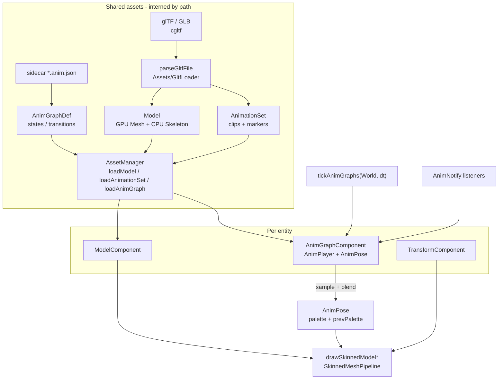

# Animated glTF Models, Animation Sets, Runtime State Machine, and Frame Notifications

| Field | Value |
|-------|--------|
| **Title** | Animated glTF models, animation sets, runtime state machine, and frame notifications |
| **Author** | TBD |
| **Date** | 2026-09-10 |
| **Status** | Reviewed (rev 5) |
| **Area** | `Assets/`, new `Animation/`, `Render/`, `content/shaders/`, `ECS/`, `Sandbox/`, `Editor/`, `UnitTests/` |
| **Audience** | Engine, Sandbox, and Editor owners who already know this tree |
| **Scope** | Design only. No production implementation in this document. |

---

## Overview

DarkEngine6 can load **static** glTF meshes through `Assets/GltfLoader.cpp` → `Model` → `AssetManager::loadModel`, then draw them with `Render/ModelDraw.cpp` on the existing pos/normal/uv `MeshPipeline`. That path does not read skins, joints, inverse bind matrices, `JOINTS_0` / `WEIGHTS_0`, or `animations`. There is no per-instance pose, no clip playback, and no way for gameplay to switch or blend clips.

This design adds a **CPU animation stack** (skeleton, clips, sampler, two-clip crossfade player, data-driven state machine, edge-triggered notifies) and a **GPU skinning draw path** that consumes a per-instance bone palette. Static `Model` drawing stays unchanged. Animation assets go through `AssetManager` like models and textures. Errors are `bool` + `DE_LOG_*` — no C++ exceptions.

v1 target: one humanoid (or simpler) glTF with one skin, ≤ 64 joints, named clips, Idle/Walk/Attack-style graph, footstep/hit markers, drawn in Sandbox deferred G-buffer + shadow cascades. Morph targets, additive layers, retargeting, and networked poses are out of v1.

---

## Background & Motivation

### What the engine actually does today

**Import (`Assets/GltfLoader.cpp` `parseGltfFile`)** is a static mesh importer via `third_party/cgltf`. It:

1. `cgltf_parse_file` + `cgltf_load_buffers`.
2. Walks `data->scene` (else root nodes) with `cgltf_node_transform_world`.
3. For each triangle primitive, unpacks `POSITION`, optional `NORMAL` / `TEXCOORD_0`, indices, PBR metallic-roughness, albedo image.
4. Stores `GltfCpuPrimitive.localToRoot` as the **baked node world matrix**. Vertices stay in mesh-local space; `ModelDraw` does `part.localToRoot * world`.

It never inspects `data->skins`, `data->animations`, `cgltf_node::skin`, `cgltf_attribute_type_joints`, `cgltf_attribute_type_weights`, or morph `targets`. `cgltf.h` already defines the types (`cgltf_skin`, `cgltf_animation_channel`, `cgltf_interpolation_type`, `cgltf_animation_path_type_weights`).

**`Assets/Model.h`** is a GPU-resident asset (`AssetType::Model`): opaque/translucent `Part`s (`Mesh` + `Material` + `localToRoot` + metallic/roughness). CPU `MeshData` is discarded after `Mesh::tryCreate`. Bounds are a bind-pose AABB in model space.

**`AssetManager::loadModel`** (`Assets/AssetManager.cpp`) resolves a virtual path, interned by `TextureCache::normalizePath`, and returns the same `Model` instance for the same file. Animation data must use this intern-by-path pattern so N instances share clips.

**Rendering** assumes `MeshVertex` `{ float3 position; float3 normal; float2 uv; }` (32 bytes) and the input layout in `Render/MeshPipeline.cpp` (~118–122). Shaders `content/shaders/BasicMesh.hlsl`, `BasicMeshGBuffer.hlsl`, and `ShadowDepth.hlsl` all take that layout (`ShadowDepth` only `POSITION`, stride still 32 because `Mesh::draw` sets the VBV from the static mesh). Frame constants are **root 32-bit constants** (`MeshFrameConstants` = 48 floats, `MeshGBufferConstants` = 54 floats). D3D12 root constants max out at 64 DWORDs (256 bytes) — a 64-bone palette cannot live there.

**ECS** (`ECS/Components.h`) has `ModelComponent { AssetID modelAssetID; bool castShadow; }` plus `TransformComponent`. Hosts (`Sandbox/SandboxApp.cpp` `spawnGltfDemo` ~847, `onRender` ~1810 / ~1909; `Editor/EditorApp.cpp` ~2428) iterate `world().each<ModelComponent>` and call `drawModelDepth` / `drawModelOpaqueGBuffer` / `drawModelForward`. There are no ECS “systems”; hosts tick and draw. `Application::onUpdate(float dt)` runs before `onRender`.

**2D `SpriteAnimator`** (`Sprite/SpriteAnimator.h`) is a named-clip player on a sprite sheet: `play(name, restart)`, loop vs hold, `update(dt)`, JSON clips in `content/sprites/player.json`. It is **not** glTF animation. Steal: named clips, “don’t restart if already playing”, sidecar JSON, bool returns. Do not share types.

**AI HSM** (`AI/Hsm.h`, `HsmMachine`, `HsmState`) is a UML-style hierarchical machine: nested states, history, `std::function` guards/actions, `HsmEventId` bubbling. `Brain` uses it for AI. It has no time, no pose, no blend weights, and is code-assembled rather than clip-authored.

**Math:** `Math::Quaternion` is **wxyz** (`Quaternion.h`). glTF rotations are **xyzw**. `Quaternion::Slerp` / `Lerp` exist. `Matrix4f` is row-major; `GltfLoader::fromGltfMatrix` memcpy’s cgltf’s 16 floats (documented as matching as a memcpy / transpose of convention). TRS composition in hosts is `S * R * T` (`SandboxApp.cpp` `makeWorldMatrix`).

**JSON:** `nlohmann/json.hpp` via `json::parse(text, nullptr, false)` (non-throwing; discarded on error) in `Scene/SceneFile.cpp`, `Sprite/SpriteSheet.cpp`, `Render/LoadingScreenConfig.cpp`. New parsers must use that form and type-check before `.get<>`.

**Policy:** `Agents.md` / `.grok/rules/no-exceptions.md` — no `try`/`catch`/`throw` in engine or Sandbox. `scripts/check-no-exceptions.ps1` must gain `Animation/` **and** the other engine folders it currently omits (`Character`, `Sprite`, `Scene`, `Particles`, `Terrain`, `Water`). Do not treat that script as already covering the engine.

**CMake:** `DE_ENGINE_FOLDERS` in root `CMakeLists.txt` is an explicit list. A new `Animation/` directory is **not** compiled until it is added there. Tests glob `UnitTests/**/*.cpp`.

### Pain points

- A character glTF imported today is a T-pose (or worse: skinned vertices drawn as if static, with a baked mesh-node world that **double-transforms** if we later apply a skin).
- Gameplay cannot say “play Walk” or “crossfade to Attack in 80 ms”.
- Footsteps and hit frames have no engine hook; games would poll time.
- `Mesh` is default-heap immutable — CPU skinning every frame would fight that (re-upload VB, or a second dynamic mesh).

---

## Goals & Non-Goals

### Goals (v1)

1. Parse glTF **skins** (joints, parents, rest TRS, inverse bind matrices) and **skeletal animation clips** (translation / rotation / scale channels; LINEAR / STEP / CUBICSPLINE) in `parseGltfFile`, CPU-only, no GPU required for tests.
2. Load those through `AssetManager`: shared `Model` (GPU mesh + CPU skeleton) and shared `AnimationSet` (clips + markers). Instances do not mutate the asset.
3. Per-instance `AnimPlayer`: sample, loop, speed, finish vs interrupt, **two-clip crossfade**.
4. Data-driven **flat** animation state machine (JSON sidecar) with named states, blend duration, parameter conditions, `onClipEnd`, interrupt flag.
5. **Edge-triggered notifies** when playback crosses a marker time. Callback API, no polling, no exceptions.
6. **GPU linear-blend skinning** (4 influences) in G-buffer, forward transparent, and shadow depth. Static models keep the current PSO / vertex layout.
7. ECS component + host tick/draw. Sandbox spawns one animated character (Idle / Walk driven by a speed parameter).
8. GoogleTest coverage for sampling, blend, notify wrap, root-motion apply/ignore, and a tiny in-memory glTF with one clip.
9. **Optional root motion:** per-instance flag; default ignore; when on, apply root-joint translation delta to `TransformComponent`.

### Non-goals (v1)

- Morph targets / `cgltf_animation_path_type_weights` / blend shapes.
- Additive clips, N-layer graphs, blend trees, 2D blend spaces, look-at / IK, ragdoll.
- Animation retargeting across skeletons; clips from a second file applied to a first mesh.
- Multiple skins per model (second skin: warn + skip its primitives).
- GPU compute skinning, texture-based bone palettes, instanced skinned draws.
- Networked animation (`Network/DESIGN.md` already lists this as deferred).
- Replacing or wrapping `AI::HsmMachine`.
- Sharing types with `SpriteAnimator`.
- Editor graph GUI (JSON on disk is the v1 authoring).
- Root-motion **yaw / rotation** applied to `TransformComponent` (v1 is translation only). In-place “hip lock” extraction beyond the designated root joint.
- Unskinned primitives parented under a joint (weapon, lid, extra mesh) do **not** inherit joint motion. They keep the bind-time `localToRoot` bake and stay frozen in v1. Attachments are a later PR.

---

## Key Decisions

| # | Decision | Rationale |
|---|----------|-----------|
| K1 | **Same `Model` type**, optional CPU `Skeleton` + skinned parts. New **`AnimationSet` asset** for clips/markers. Not a `SkinnedModel` subclass. | Static draw path (`Model::opaque()`, `ModelDraw`) stays valid. Skinning is a part flag + extra VB attributes. Clips are CPU and independently interned. A skinned mesh with no clips still draws at bind pose. |
| K2 | **One glTF file → one `Model` + optional `AnimationSet`**, interned by normalized path (`model` key as today; anim set key `path + "#anims"`). `Model` holds a **strong** `AssetRef<AnimationSet>`. Graphs load only via `loadAnimGraph`. | Matches `loadModel` caching. Strong ref keeps the set alive across `collectGarbage` (`use_count() == 1` drops manager-only entries). Instances also hold `AssetRef`s, never a bare `AssetID` as the only lifetime. |
| K3 | **Dedicated `AnimGraph`**, do **not** reuse `AI::HsmMachine`. | HSM is event-bubbling, hierarchical, `std::function`-heavy, owned by `Brain`. Animation needs sampled time, blend weights, pose buffers, and JSON. AI can *drive* graph parameters later (`SetFloat("speed")`) without owning clips. |
| K4 | **GPU skinning in v1**; CPU evaluates pose only. No CPU vertex-skin fallback in the draw path. | `Mesh` is default-heap. Re-uploading skinned VBs every frame fights the current uploader (`Mesh::tryCreate`). Pose of 64 bones is cheap on CPU; vertex count is not. Tests sample poses on CPU and never need a device. |
| K5 | **Bone palette is a VS CBV**, not root constants. `kMaxBones = 64`. | Root constants are already 48–54 floats and capped at 64 DWORDs. 64 × float4x4 = 4096 bytes, legal CBV (256-byte aligned). Humanoids fit; overflow **fails load**. |
| K6 | **New `SkinnedMeshPipeline` + skinned shaders**. Do not change `MeshPipeline` input layout. | Static cubes/glass (`content/models/unit_cube.gltf`) and all MeshGen geometry must keep working with zero PSO churn. |
| K7 | **Sidecar JSON is the source of truth for the graph.** Clip markers: glTF extras copied onto `AnimationClip::markers` at parse; sidecar `notifies` live on `AnimGraphDef` and are unioned at fire time. Never mutate interned clips after register. | glTF extras are untyped strings (`cgltf_extras::data`). Mutating a shared `AnimationSet` from `loadAnimGraph` would leak graph A’s markers onto graph B. nlohmann is already used for sprites/scenes. |
| K8 | **Two-clip crossfade only.** No additive, no layers. | Enough for Idle↔Walk↔Attack. Layering is a v2 graph node. |
| K9 | **Notifies fire from the incoming clip only** during a blend. Loop wrap fires markers in `(prev, duration]` then `[0, new]`. | Predictable combat/audio. Outgoing footsteps during a 150 ms blend are almost always wrong. |
| K10 | **New top-level `Animation/` folder** (runtime). Loader stays in `Assets/GltfLoader.*`. | Parallel to `Sprite/` vs texture load. Requires `DE_ENGINE_FOLDERS` + `check-no-exceptions.ps1` update. |
| K11 | **Canonical time is seconds** (glTF sampler input). JSON `"frame": 12` is **0-based**: `time = frame / fps` (`fps` default 30 → 0.4 s). | glTF is seconds. DCC UIs are often 1-based; authors subtract one if their tool shows frame 13 for the same instant. |
| K12 | **TAA: previous bone palette AND previous entity world.** `currClip = skinCurr * world * viewProj`, `prevClip = skinPrev * prevWorld * prevViewProj`. First frame: `prevWorld = world`, `prevPalette = palette`. | `MeshGBufferConstants.prevWorldViewProj` uses the **current** `w` today (`ModelDraw.cpp`). Sandbox `m_prevWorldByEntity` is only filled for `NetworkedComponent`. A possessed character translates via `PlayerMotor`; bones-only prev still ghosts. |
| K13 | **Skinned LBS runs in mesh space.** `Part.localToRoot` is the **mesh node’s bind-time world**. `restT/R/S` stay **node-local** (what glTF channels replace). Non-joint ancestors live in `Joint::ancestorBindWorld`, not in rest TRS. IBM is converted to mesh space (`ibmMesh`) so bind palette ≈ I and `w = localToRoot * entityWorld` matches today’s static bake. `joints[]` stays in `skin->joints` order; `Skeleton::fkOrder` is a separate permutation. | Mixamo/Blender parent hips to an `Armature` that is not a joint; hips *are* animated. Baking that armature into `restT/R/S` is wiped by the first Walk key. Raw glTF IBM is `inv(jointWorld)`, so `ibm * inv(meshWorld) * jointWorld` is `inv(meshWorld)`, not I — that cancels `localToRoot = meshWorld` and drops the mesh translation. |
| K14 | **No exceptions in public APIs.** JSON via `json::parse(..., false)`. nlohmann `.get<>` only after `is_number()` / `is_string()` checks. | Standing engine rule. SceneFile already uses the non-throwing parse. |
| K15 | **Stable skinned root parameter indices** across G-buffer / forward: `kRootBoneCbv` is always slot 3. G-buffer reserves an unused shadow CBV slot so hosts never bind bones at “root 2 or 3”. | G-buffer `MeshPipeline` has `paramCount = 2` (no shadow). A split layout would make `SetGraphicsRootConstantBufferView` easy to get wrong. |
| K16 | **Invalid skin fails the whole `loadModel`.** No static T-pose fallback. | Silent static draw of a broken character hides exporter bugs. Joint count 0 or > 64, IBM size mismatch: `DE_LOG_ERROR` and return `{}`. |
| K17 | **Outgoing clip keeps playing during a blend; notifies suppressed.** | Cancelling a blend must not hitch a walk cycle. Combat/audio stays incoming-only (K9). |
| K18 | **Marker at t=0 does not fire on `play()`.** | `(prevT, newT]` excludes 0 at start. Loop wrap may still fire t=0. |
| K19 | **Per-instance root motion flag** (`AnimPlayer::setApplyRootMotion`, default **false**). When true, apply **translation-only** delta from the designated root-motion joint to `TransformComponent`. | PlayerMotor owns locomotion unless a clip is authored as traveling. Two entities can differ. Yaw is v2. |

---

## Proposed Design

### Architecture



### Runtime data flow (one frame)

```mermaid
sequenceDiagram
    participant Host as SandboxApp::onUpdate
    participant Tick as tickAnimGraphs
    participant Graph as AnimGraph
    participant Player as AnimPlayer
    participant Samp as sampleClip
    participant Pose as AnimPose
    participant Draw as onRender ModelDraw
    participant GPU as Skinned VS

    Host->>Tick: dt
    Tick->>Graph: evaluate transitions (params, clip end)
    Graph->>Player: play(clipIndex, blendDur) if edge
    Tick->>Player: advance(dt)
    Player->>Samp: sample(clipA, tA) and clipB if blending
    Samp-->>Player: local TRS per joint
    Player->>Pose: FK + IBM → palette; prevPalette ← last palette
    Player->>Player: fire notifies on incoming clip
    Note over Draw: later in onRender
    Draw->>GPU: world, prevWorld, viewProj, bone CBV (curr+prev)
    GPU->>GPU: currClip = skinCurr*world*viewProj; prevClip = skinPrev*prevWorld*prevViewProj
```

### v1 feature cut

| Feature | v1 | Later |
|---------|----|--------|
| Skin, IBM, 4 influences (`JOINTS_0`/`WEIGHTS_0`) | yes | `JOINTS_1` (8 influences) |
| Channels T/R/S, LINEAR/STEP/CUBICSPLINE | yes | morph weights |
| Two-clip crossfade, loop, speed | yes | additive, layers, blend trees |
| Flat FSM + JSON parameters | yes | hierarchical anim graph, HSM link |
| Named notifies (sidecar + extras) | yes | payload curves, sound auto-hook |
| GPU LBS, 64 bones, TAA prev palette **and** prevWorld | yes | 128 bones, compute skinning |
| One skin per file | yes | multiple skins / clothing |
| Root motion → entity | opt-in flag, translation only | yaw / hip-lock |
| Network pose | no | quantized joint stream |

---

## Asset Identity

### Types

```
AssetType::Model          // existing — GPU parts + optional Skeleton
AssetType::AnimationSet   // new — clips, markers, joint-name table
AssetType::AnimGraph      // new — states/transitions + sidecar notify overlay (JSON)
```

Register `AnimGraphDef` as `AssetType::AnimGraph` so `AssetManager` interns `hero.anim.json` the same way as models. `loadModel` does **not** auto-load the graph.

Do **not** introduce `SkinnedModel`. `Model::valid()` stays “has drawable parts”. Add:

```cpp
bool Model::skinned() const;          // any part has influences
const Skeleton* Model::skeleton() const; // nullptr if static
uint32_t Model::jointCount() const;
```

### Sharing

| Data | Lifetime | Mutability |
|------|----------|------------|
| GPU VB/IB, materials, albedo | `Model` asset | immutable after load |
| `Skeleton` (names, parents, rest TRS, IBM, rest palette) | `Model` (CPU) | immutable |
| Clips, keyframes, glTF-extras markers | `AnimationSet` | immutable after register |
| Graph def + sidecar notify overlay | `AnimGraphDef` asset | immutable after register |
| Current time, blend, parameters, palettes, prevWorld, notify cursor | `AnimGraphComponent` | per instance |

`AssetManager::loadModel` continues to return `AssetRef<Model>`. If the parse produced clips (or a skeleton with zero clips), it also interns `AnimationSet` under key `normalizePath(path) + "#anims"`. **`Model` holds `AssetRef<AnimationSet> m_animSet` (strong)** so `collectGarbage` cannot drop the set while any `Model` is alive. `AnimGraphComponent` (declared in `Animation/AnimGraphComponent.h`, **not** `ECS/Components.h`) likewise holds those strong refs — not a lone `AssetID`. Tick must not cache raw pointers across a GC call. Do **not** `#include "Assets/Model.h"` from `ECS/Components.h` (that pulls `Render/Mesh.h` → `<d3d12.h>` into Network, Scene, and ECS tests).

`loadAnimationSet(virtualPath)` looks up the `#anims` key. If missing, it parses CPU-only (`parseGltfFile`, no `Renderer`) and interns the set. Reverse order (`loadAnimationSet` then `loadModel`) may parse the glTF twice unless a short-lived CPU cache is present (see API section). `loadModel` does **not** intern `AnimGraphDef`.

Optional helper `tryLoadAnimGraphForModel(virtualGltfPath)` resolves `same-stem.anim.json` and calls `loadAnimGraph` if the file exists; spawn code uses this explicitly. Missing sidecar is OK.

### glTF with only a mesh (today’s files)

`content/models/unit_cube.gltf` / `unit_glass.gltf`: no skin, no animations. `parseGltfFile` fills primitives as today. `Model::skeleton() == nullptr`. `loadAnimationSet` returns empty ref (log at Trace, not Error). Draw path unchanged.

### glTF with skin but no animations

Load skeleton + skinned VB. `AnimationSet` may be empty. Draw uses **rest palette** (precomputed at load from node-local rest + `ancestorBindWorld` + `ibmMesh`). Hosts still bind the **skinned** PSO whenever `model->skinned()` — never the 32-byte static PSO. Rest palette is the no-graph path. Mixed **color** draws pass the matching static `MeshPipeline` (opaque or transparent). Mixed **depth** draws use `ShadowSystem` for unskinned casters — not `MeshPipeline`.

### Multiple animations in one file

Each `cgltf_animation` becomes one `AnimationClip` in the set. Name = `animation->name` if non-empty, else `animation_{index}`. Duplicate names: log `DE_LOG_WARN`, keep the first, suffix the later (`Walk_1`). The set **is** the animation set; there is no extra wrapping type.

---

## glTF Mapping

### Coordinate / math conventions

- Engine matrices: row-major, row-vector (`v * M`), translation in `m41,m42,m43` (`Math/Matrix4f.h`).
- Existing loader: `fromGltfMatrix` memcpy of cgltf’s 16 floats (`GltfLoader.cpp` ~16–21). **Reuse it** for inverse bind matrices.
- Node local matrix: if `has_matrix`, `fromGltfMatrix(node->matrix)`; else compose rest TRS as `S * R * T` to match `makeWorldMatrix`.
- **Quaternions:** glTF accessor `VEC4` is **xyzw**. Convert at unpack: `Quaternion(w, x, y, z)`. Never feed xyzw into `Math::Quaternion` constructors.
- Time: sampler input `SCALAR` floats, **seconds**. Clip duration = max input over channels (glTF does not store duration on the animation).

### Skeleton

From `data->skins[0]` (v1: first skin only).

```cpp
struct Joint {
    std::string      name;       // node->name or "joint_N"
    int32_t          parent = -1; // nearest joint ancestor in joints[], or -1
    Math::Vector3f   restT{ 0, 0, 0 };           // **node-local** rest (channels replace these)
    Math::Quaternion restR = Math::Quaternion::IDENTITY;
    Math::Vector3f   restS{ 1, 1, 1 };
    Math::Matrix4f   ancestorBindWorld; // see FK; identity if no non-joint gap
    Math::Matrix4f   inverseBind;       // **mesh-space** IBM (`ibmMesh`), not raw glTF
};

struct Skeleton {
    std::vector<Joint>          joints;      // **skin->joints order** — JOINTS_0 indexes this
    std::vector<uint32_t>       fkOrder;     // permutation: parent before child; do not reorder joints[]
    AnimPose                    restPose;    // mesh-space bind palette after ibmMesh conversion
    Math::Matrix4f              meshWorld;   // bind-time world of the mesh node (identity if none)
    int32_t                     skeletonRoot = -1; // skin->skeleton mapped into joints[], else -1
    int32_t                     rootMotionJoint = 0; // see Root motion
};
```

**`joints[]` is never sorted.** Vertex `JOINTS_0`, IBM rows, and channel `joint` indices all use `skin->joints` order. `fkOrder[k]` is the joint index to visit at FK step k (parents first). A unit test must use a file where joint 0 is a child of joint 1 to prove remap is not required.

**Do not store world-space rest in `restT/R/S`.** Those slots are what glTF translation/rotation/scale channels overwrite. Typical Mixamo/Blender files parent hips to an `Armature` node that is **not** in `skin->joints`, while hips *are* keyed. Baking that armature into `restT/R/S` makes bind look right and Walk jump to the origin.

Build order:

1. Map `cgltf_node*` → joint index for each `skin->joints[i]` (array order = joint index).
2. Compute **rest local and rest world for every `cgltf_node`** (full hierarchy). This includes armature roots and `skin->skeleton` even when they are not joints.
3. Parent = nearest **joint** ancestor, else `-1`.
4. `restT/R/S` = the node’s **local** TRS, always stored as T/R/S (FK only `composeLocal(S*R*T)`; **no** unused `restLocalMat`). If `has_translation` / `has_rotation` / `has_scale`, copy those (glTF: TRS wins over `matrix`). Else if `has_matrix`, **decompose** `fromGltfMatrix(node->matrix)` into local T/R/S — do not leave identity. Use `Matrix4f::GetTranslation`, `Quaternion::FromMatrix3(GetRotation())` then `Normalize`, and scale from `GetBasisX/Y/Z` lengths. Decompose failure: Warn and identity TRS. Channels may then replace T, R, or S independently.
5. `ancestorBindWorld`:
   - If `parent < 0`: bind-time world of the non-joint ancestor chain above this joint (armature / `skin->skeleton` / model root). Identity if this joint is already a scene root.
   - If `parent >= 0` and every node between this joint and that parent is a joint: **identity**.
   - If `parent >= 0` and one or more **non-joint** nodes sit between them: bind-time local of that middle chain relative to the parent joint (`inv(parentJointWorld) * thisNodeParentWorld`), so FK can do `local * middle * parentWorld`.
6. Raw IBM: `skin->inverse_bind_matrices` via `fromGltfMatrix`. If missing, raw IBM = inverse(full rest **world** of that joint) (log Warn).
7. Mesh node: `skeleton.meshWorld` = that node’s bind-time world. **`Part.localToRoot = meshWorld`**.
8. **IBM conversion (mesh space).** Starting formula, same row-vector convention as the palette multiply:
   ```
   ibmMesh[j] = ibmGltf[j] * meshWorld
   Joint::inverseBind = ibmMesh[j]
   ```
   If the observable bind-vs-static test fails, swap to `meshWorld * ibmGltf` (one-line comment in `AnimSampler.cpp` / loader). Do **not** leave raw glTF IBM in `inverseBind`.
9. `fkOrder`: topological sort by parent index. Does not permute `joints[]`.
10. Fill `restPose` from rest locals + `ancestorBindWorld` + `ibmMesh` (see FK).
11. `joints_count == 0` or `> kMaxBones` (64): `DE_LOG_ERROR`, **fail the whole file**.

v1 **ignores animation channels whose target node is not a joint** (except they never drive the skeleton; root motion still uses a **joint**). Non-joint ancestors are static: `ancestorBindWorld` does not change at runtime. Joint locals *do* change and must not contain that bake.

After joint map + `skeletonRoot`, set `rootMotionJoint = (skeletonRoot >= 0) ? skeletonRoot : 0`.

**Lock tests (PR 1):**

- **Observable bind vs static import (authoritative):** a unit vertex, weight 1 on joint 0, drawn as `pos * restPalette * localToRoot * entityWorld` matches today’s `cgltf_node_transform_world` bake (`pos * meshWorld * entityWorld` for a mesh-local vertex) within 1e-3, **including a translated mesh node**. After `ibmMesh` conversion, rest palette ≈ I is a *consequence*, not the spec — do not claim ≈ I against raw glTF IBM.
- **Ancestor survives animation:** translated non-joint parent + clip that keys the skin-root joint’s **local** TRS. Bind *and* `t > 0` must keep the ancestor translation (character does not jump to the origin).
- **Child-first `skin->joints`:** `fkOrder` parent-first; `JOINTS_0` still indexes `joints[]`.
- **Translate-joint multiply order:** independent of IBM conversion; swap `ibmMesh * jointWorldMesh` vs `jointWorldMesh * ibmMesh` only if that test fails.

### Mesh attributes (skinned primitives)

Extend `MeshData` (`Render/MeshGen.h`) **optionally** — do not force every generator to fill influences:

```cpp
struct MeshData {
    std::vector<Math::Vector3f> positions;
    std::vector<Math::Vector3f> normals;
    std::vector<Math::Vector2f> uvs;
    std::vector<uint32_t>       indices;
    // Empty = static. If non-empty, size == positions.size().
    std::vector<uint32_t>       jointPacked; // 4× uint8 in a uint32 (little-endian: j0 in byte 0)
    std::vector<Math::Vector4f> weights;
};
```

`extractPrimitive` today uses `findAttr(..., cgltf_attribute_type_position)`. Add `cgltf_attribute_type_joints` index 0 and `cgltf_attribute_type_weights` index 0.

- Joints: unpack as uints (`cgltf_accessor_unpack_indices` or per-element read). Component types `UNSIGNED_BYTE` or `UNSIGNED_SHORT`. Clamp each index to `jointCount-1`; if `index >= jointCount`, log Error and fail that primitive.
- Weights: unpack floats, then **renormalize** the four weights if sum > 1e-8; if all zero, weight 1 on joint 0.
- `JOINTS_1` / `WEIGHTS_1`: log Warn once per file, ignore (v1 is 4 influences).
- Primitive on a node with `node->skin` but missing JOINTS/WEIGHTS: `DE_LOG_ERROR`, skip primitive (same as missing POSITION).
- Primitive **without** skin: current path; do not require influences.

**`localToRoot` for skinned primitives = mesh node bind world** (`skeleton.meshWorld`), not identity. Vertices stay in mesh/bind space. Palettes use **mesh-space** `ibmMesh` (step 8) so bind LBS + `localToRoot` matches the static importer. Unskinned primitives still set `localToRoot` from `cgltf_node_transform_world` (bind pose); they do **not** follow joints in v1.

`GltfCpuPrimitive` gains `bool skinned = false`. `Model::Part` gains the same flag. `Model::createFromFile` calls `Mesh::tryCreate` for static parts and `Mesh::tryCreateSkinned` (or `tryCreate` that picks layout from `MeshData::jointPacked`) for skinned parts.

### Animation clips

```cpp
enum class AnimPath : uint8_t { Translation, Rotation, Scale };
enum class AnimInterp : uint8_t { Linear, Step, CubicSpline };

struct AnimChannel {
    uint32_t   joint = 0;
    AnimPath   path  = AnimPath::Translation;
    AnimInterp interp = AnimInterp::Linear;
    std::vector<float> times;   // seconds, strictly non-decreasing
    std::vector<float> values;  // LINEAR/STEP: 3 or 4 floats per key
                                // CUBICSPLINE: 3 segments per key (in-tangent, value, out-tangent)
};

struct AnimationClip {
    std::string name;
    float       duration = 0.0f; // max(times.back())
    bool        loopDefault = true; // may be overridden by graph state
    std::vector<AnimChannel> channels;
    std::vector<AnimMarker>  markers; // glTF extras only; sidecar lives on AnimGraphDef
};
```

Channel mapping:

| glTF `target_path` | Engine | values per key (LINEAR/STEP) |
|--------------------|--------|------------------------------|
| translation | `AnimPath::Translation` | 3 |
| rotation | `AnimPath::Rotation` | 4, convert xyzw → wxyz, normalize |
| scale | `AnimPath::Scale` | 3 |
| weights | **skip**, Warn once | morphs out of v1 |

Interpolation:

- `cgltf_interpolation_type_linear` → Linear (vectors `Math::Lerp`; **quaternions `Quaternion::Slerp`**, which already takes the shortest path in `Math/Quaternion.cpp` ~209–218). Do not re-derive negate-b.
- `step` → Step (hold left key).
- `cubic_spline` → CubicSpline per glTF spec: output is `3n` values of (in-tangent, value, out-tangent). Implement the spec formula (not Catmull-Rom in `Math/Curves.h` — different layout). Quaternion cubic: nlerp the evaluated vec4 then normalize (acceptable v1; full quaternion cubic spline can wait).

Empty channels / zero keys: skip channel, Warn. More than **4096 keys** on a channel: `DE_LOG_ERROR`, skip that channel. More than **64 markers** on a clip (after extras parse): Error, drop extras past 64.

### CPU parse output

Extend `GltfCpuModel` (`Assets/GltfLoader.h`):

```cpp
struct GltfCpuModel {
    std::vector<GltfCpuPrimitive> primitives;
    std::string                   generator;
    Skeleton                      skeleton;     // joints.empty() = unskinned
    std::vector<AnimationClip>    clips;        // markers may still be empty
};
```

`parseGltfFile` remains **CPU-only** and is the unit-test entry point (as today’s `UnitTests/Assets/GltfLoaderTests.cpp`).

After `cgltf_free`, no cgltf pointers survive — everything is copied into engine vectors.

---

## Runtime Playback

### Pose buffers (per instance, fixed size)

```cpp
// Animation/Pose.h
struct AnimPose {
    static constexpr uint32_t kMaxBones = 64;
    Math::Matrix4f palette[kMaxBones];     // mesh-space: ibmMesh * inv(meshWorld) * jointWorld
    Math::Matrix4f prevPalette[kMaxBones]; // last tick, for TAA
    uint32_t       boneCount = 0;
};
```

No heap in the hot pose. `AnimGraphComponent` embeds this (~8 KB of matrices) plus `prevWorld`.

### Sampling (`Animation/AnimSampler`)

```cpp
bool sampleClipLocal(
    const AnimationClip& clip,
    const Skeleton& skeleton,
    float timeSec,                 // unwrapped or wrapped by caller
    Math::Vector3f* outT,          // arrays of skeleton.joints.size()
    Math::Quaternion* outR,
    Math::Vector3f* outS);
```

Algorithm:

1. Seed `outT/R/S` from `skeleton.joints[i].restT/R/S` (**node-local** rest only — not `ancestorBindWorld`).
2. For each channel, binary-search `times` for `timeSec` (clips are short; linear scan is OK under ~64 keys, but bsearch is simple).
3. Interpolate by `AnimInterp`. Sampled values **replace** local TRS; they must not be composed with `ancestorBindWorld` here.
4. Time outside `[t0, tLast]`: clamp (graph/player handles loop wrap **before** calling).

`sampleClipLocal` does not allocate. Returns false only if `clip` has no channels or joint index OOB (should not happen if loader validated).

### Forward kinematics

```cpp
void localToPalette(
    const Skeleton& skeleton,
    const Math::Vector3f* T,
    const Math::Quaternion* R,
    const Math::Vector3f* S,
    AnimPose& pose);
```

Visit joints in `skeleton.fkOrder` (parent before child). Do **not** assume `joints[i].parent < i`. Local matrix = `composeLocal(T,R,S)` = `S * R * T` matching `makeWorldMatrix` — **node-local only**.

Unified FK (row-vector, same convention as `ModelDraw.cpp` ~34):

```
jointWorld = local * joints[j].ancestorBindWorld * (parent >= 0 ? parentWorld : Identity)
```

- Skin-root under an `Armature`: `parent < 0`, `ancestorBindWorld` is the armature bind world; sampled local Walk keys do **not** wipe it.
- Joint whose parent is a joint with no gap: `ancestorBindWorld = I`, `jointWorld = local * parentWorld`.
- Non-joint node between two joints: `ancestorBindWorld` is that middle bind local; `jointWorld = local * middle * parentWorld`.

**Starting palette formula** (row-major, row-vector, `#pragma pack_matrix(row_major)`, shader `mul(float4(p,1), palette[j])`). `inverseBind` is already `ibmMesh`:

```
jointWorldMesh = inv(skeleton.meshWorld) * jointWorld     // mesh space
palette[j]     = ibmMesh[j] * jointWorldMesh
```

With `ibmMesh = ibmGltf * meshWorld` this is `ibmGltf * jointWorld`. At bind that is ≈ I, so `pos * restPalette * meshWorld * entityWorld` matches the static bake.

HLSL:

```
float4 skinned = 0;
[unroll] for (int i = 0; i < 4; ++i)
    skinned += weights[i] * mul(float4(input.position, 1), bonePalette[joints[i]]);
```

Two independent swaps (one-line comments, do not bikeshed):

1. **IBM conversion:** if the bind-vs-static observable fails, `ibmMesh = meshWorld * ibmGltf` instead of `ibmGltf * meshWorld`.
2. **Palette multiply:** if the one-joint **translate** test fails (vertex at (1,0,0), weight 1 on joint 0, joint rest translated on X), `palette[j] = jointWorldMesh * ibmMesh[j]`.

After computing `palette`, copy previous `palette` into `prevPalette` **before** overwrite (first frame: `prevPalette = palette`).

Required CPU fixtures:

1. **Observable bind vs static import:** translated mesh node; `pos * restPalette * localToRoot * entityWorld` equals today’s `cgltf_node_transform_world` bake (1e-3). Rest palette ≈ I only *after* `ibmMesh` conversion.
2. Child-first `skin->joints`: `fkOrder` parent-first; `JOINTS_0` indexes `joints[]`.
3. **Ancestor + clip:** translated non-joint parent; clip keys the skin-root joint local. Bind *and* `t > 0` keep the ancestor translation.
4. Translate-joint multiply-order check (independent of 1).

### AnimPlayer (two-clip)

Steal `SpriteAnimator::play` semantics: playing the same clip without `restart` does not reset time.

```cpp
class AnimPlayer {
public:
    void bind(const Skeleton* skel, const AnimationSet* set); // non-owning
    bool play(std::string_view clipName, float blendSec, bool restart = false);
    bool playIndex(uint32_t clipIndex, float blendSec, bool restart = false);
    void setSpeed(float s);          // default 1; graph state speed is applied here by AnimGraph
    void setLoopOverride(int loop);  // -1 = clip/graph default, 0 = once, 1 = loop
    void setApplyRootMotion(bool apply); // default false; per instance, not process-wide
    bool applyRootMotion() const;
    void stop();
    // overlay = sidecar markers for this clip (may be null/empty). Fired after clip.markers.
    void update(float dt, AnimNotifyQueue& outNotifies, const AnimMarker* overlay = nullptr, uint32_t overlayCount = 0);

    bool  playing() const;
    bool  finished() const;          // oneshot reached end and not blending
    float time() const;              // incoming clip time
    const char* clipName() const;
    const AnimPose& pose() const;
    uint32_t incomingClip() const;
    uint32_t outgoingClip() const;   // ~0u if not blending
    float blendAlpha() const;        // 0 = full outgoing, 1 = full incoming
    Math::Vector3f rootMotionDelta() const; // model-space translation this tick; 0 if flag off
};
```

State:

- Incoming clip index + time + prevTime.
- Optional outgoing clip index + time (frozen or still advancing — **v1: outgoing time continues at its speed** so a walk cycle doesn’t hitch if the blend is cancelled; notifies still suppressed).
- `blendAlpha` goes 0 → 1 over `blendSec` with **linear** alpha (smoothstep later).
- `speed` multiplies `dt`. Negative speed is ignored (clamp to 0) in v1.

Loop vs oneshot:

- Loop: `time = fmod(time, duration)` with `duration > 0`. If `time` wraps, notify path sees wrap (below).
- Oneshot: clamp to `duration`, set `finished`, keep last pose. Graph `onClipEnd` transitions can fire.

Blend of two local poses: lerp T, slerp R, lerp S, then **one** FK. Do not blend palettes (safer for large rotations).

`play()` with `blendSec <= 0` or no current clip: snap. `play()` of unknown name: `false`, `DE_LOG_WARN`, keep previous pose.

Standalone `AnimPlayer` is **clip-only**: no parameter table, no `setFloat`. Graph parameters live on `AnimGraphInstance` / `AnimGraphComponent`. `setApplyRootMotion` **does** live on the player (and is forwarded by the graph instance) so player-only entities can opt in.

### Root motion (v1)

**Owner:** per-instance flag on `AnimPlayer`, forwarded as `AnimGraphInstance::setApplyRootMotion(bool)`. Not a global switch — two characters can differ. Default **false**: `PlayerMotor` (or gameplay) owns `TransformComponent::position`.

**Root joint:** `Skeleton::rootMotionJoint`. Resolve at load:

1. If `skin->skeleton` maps to a joint, use that index.
2. Else joint `0` (first `skin->joints` entry — typically hips).

Do **not** use glTF node 0 (often the scene/armature node, not a joint). Named-joint override is v2.

**When the flag is false:** `rootMotionDelta()` is zero; tick does not write the transform.

**When the flag is true:** after FK, read the root-motion joint’s **model-space translation** (from `jointWorld`, not the skinning palette). Each `update`:

```
delta = newRootPos - prevRootPos   // if no wrap
if loopedThisTick:
    delta = (clipEndRootPos - prevRootPos) + (newRootPos - clipStartRootPos)
            // same wrap interval as notifies; never apply (new - prev) across a rewind
prevRootPos = newRootPos
```

`clipStartRootPos` / `clipEndRootPos` are the root joint translations sampled at t=0 and t=`duration` of the **incoming** clip (rest + channels). On `play()` / snap / flag turning on: set `prevRootPos = newRootPos` and emit **zero** delta (no catch-up, no t=0 jump).

**Blend:** use the **blended** pose’s root translation (the same blended local TRS already fed to FK). That is a blended root delta, not incoming-only. Justification: locomotion must not hitch during Idle→Walk (150 ms); notifies stay incoming-only (K9) because they are discrete combat/audio edges. Continuous displacement should match the visible blend.

**Apply (tick, not the player):** `TransformComponent::position += rotation.Rotate(delta)` using the entity’s current quaternion (so a facing Walk moves along look). **Translation only** — do not write yaw/pitch. Root-joint rotation in the clip is visual only in v1.

If `applyRootMotion` is on, gameplay must not also add the same translation via `PlayerMotor` (double move). Sandbox possessed player: leave the flag **off**. A cutscene/NPC walk clip: flag **on**.

**Tests:** clip keys the root-motion joint +1 m on X over 1 s at speed 1. Flag on → entity `position.x` ≈ 1 after 1 s. Flag off → 0. Loop wrap does not apply a ~−1 m rewind. Blend of two traveling clips interpolates deltas (not a snap to incoming).

---

## State Machine

### Why not `AI::HsmMachine`

| HSM | Animation graph |
|-----|-----------------|
| `HsmEventId` + void* payload | named clips, float/bool parameters |
| Nested composites, history, inheritance | flat states, one active clip |
| `std::function` guards/actions | data-driven JSON, no heap per edge |
| Owned by `AI::Brain` | owned by renderable entity |
| No time / pose | sampling every tick |

Reusing HSM would either (a) force every Walk/Idle into C++ `HsmState` objects and `std::function`, or (b) warp HSM into a pose blender. Both couple AI to rendering. **v1 graph is a separate `AnimGraph`.** Later, an HSM action may call `AnimGraph::setFloat("speed", v)` — one-way.

### Graph definition (shared)

```cpp
enum class AnimParamType : uint8_t { Float, Bool, Trigger };

struct AnimParamDef {
    std::string    name;
    AnimParamType  type = AnimParamType::Float;
    float          defaultFloat = 0.0f;
    bool           defaultBool  = false;
};

struct AnimCondition {
    uint32_t paramIndex = 0;
    enum class Op : uint8_t { Gt, Lt, Ge, Le, Eq, Ne } op = Op::Gt;
    float    floatValue = 0.0f;
    bool     boolValue  = true;
};

struct AnimTransitionDef {
    uint32_t from = 0;            // or kAnyState
    uint32_t to   = 0;
    float    blendSec = 0.15f;
    bool     canInterrupt = true; // if false, wait for oneshot finish / ignore while blending
    bool     onClipEnd = false;   // fire when incoming clip finished()
    std::vector<AnimCondition> when; // AND
};

struct AnimStateDef {
    std::string name;             // logical: "Idle"
    uint32_t    clipIndex = 0;    // into AnimationSet
    float       speed = 1.0f;
    bool        loop = true;
};

struct AnimGraphDef : Asset {
    uint32_t                  defaultState = 0;
    std::vector<AnimParamDef> params;
    std::vector<AnimStateDef> states;
    std::vector<AnimTransitionDef> transitions;
    AssetRef<AnimationSet>    animSet;           // strong; resolved at loadAnimGraph
    // Sidecar notifies, never written into AnimationSet clips.
    std::vector<AnimMarker>   overlayMarkers;    // time already converted to seconds
    std::vector<uint32_t>     overlayClipIndex;  // parallel to overlayMarkers
};

class AnimGraphInstance {
public:
    bool bind(const AnimGraphDef* def, const Skeleton* skel);
    // Requires def != null. Copies param defaults, then player.bind(skel, def->animSet.get()).
    // Returns false if def/skel/animSet missing. Player-only: call player.bind(skel, set) instead;
    // do not call evaluate() without a successful bind.
    bool started() const;
    // First evaluate(): play(defaultState, blendSec=0), started=true.
    void evaluate(); // transitions only; caller then player.update

    bool setFloat(std::string_view name, float v);
    bool setBool(std::string_view name, bool v);
    bool setTrigger(std::string_view name); // sets bool true; consumed on successful transition
    float getFloat(std::string_view name, float fallback = 0.0f) const;

    AnimPlayer& player();
    const AnimPlayer& player() const;
    void setApplyRootMotion(bool apply); // forwards to player; default false
};
```

`kAnyState = 0xFFFFFFFFu` for `from` (JSON `"from": "*"` or `"Any"`). JSON `from`/`to` **names** resolve to state indices at parse; unknown state or clip name → fail graph load (`DE_LOG_ERROR`), same as unknown clips.

JSON `interrupt` maps to `AnimTransitionDef::canInterrupt` on that **candidate** edge.

Evaluation each tick, **before** `AnimPlayer::update`:

0. If `!started()`, `player.playIndex(states[defaultState].clipIndex, 0.0f)`, apply that state’s loop/speed, `started = true`. Skip transition scan this tick (Idle actually starts).
1. Scan transitions in **author order**. First match wins.
2. Match if: `from` is current state or Any; **all** `when` pass (empty `when` = always true); if `onClipEnd`, `player.finished()` is true. **`onClipEnd` is ignored when the current state’s `loop` is true** (a looping clip never finishes).
3. **Interrupt:** a candidate may fire while blending iff `candidate.canInterrupt == true`. The active blend does not have its own flag — interruptibility is a property of the incoming candidate. If no candidate has `canInterrupt`, wait until the blend completes (and for `onClipEnd`, until finished).
4. Enter `to`: `player.play(state.clipIndex, t.blendSec)`, apply `state.loop` / `state.speed`.
5. **Triggers** consume (reset to false) only after a **successful** transition that listed them in `when`. A held bool (gameplay calling `setBool("attack", true)` every tick) will re-enter Any→Attack every tick if `interrupt: true`; Sandbox must call `setTrigger` on **press**, not level.

No sub-state machines, no blend trees, no automatic dual-clip “Walk+Run by speed” in v1 — the game sets `speed` and discrete states (Idle vs Walk) via thresholds in JSON.

### Who owns the machine

- **Definition:** data (`hero.anim.json`), interned by `AssetManager`.
- **Instance:** `AnimGraphComponent` on the entity (parameters + player + pose).
- **Tick:** free function `tickAnimGraphs(World& world, AssetManager& assets, float dt)` called from `SandboxApp::onUpdate` / `EditorApp` update. Not a hidden engine singleton.
- **Gameplay:** sets parameters on the **graph instance** (`ag->graph.setFloat("speed", length(velocity))`), never on `AnimPlayer`. Does not call `play()` unless it wants to bypass the graph (`AnimPlayer` remains usable standalone for tests and simple props).

### Sidecar schema (`content/models/hero.anim.json`)

`loadModel` does **not** auto-intern the graph. Spawn (or `tryLoadAnimGraphForModel`) calls `loadAnimGraph("models/hero.anim.json")`. Missing sidecar is OK (clips still play by name via `AnimPlayer`).

```json
{
  "version": 1,
  "model": "models/hero.gltf",
  "defaultState": "Idle",
  "parameters": [
    { "name": "speed", "type": "float", "default": 0.0 },
    { "name": "attack", "type": "trigger" }
  ],
  "states": [
    { "name": "Idle", "clip": "Idle", "loop": true },
    { "name": "Walk", "clip": "Walk", "loop": true },
    { "name": "Attack", "clip": "Attack", "loop": false }
  ],
  "transitions": [
    { "from": "Idle", "to": "Walk", "blend": 0.15, "interrupt": true,
      "when": [{ "param": "speed", "gt": 0.1 }] },
    { "from": "Walk", "to": "Idle", "blend": 0.20,
      "when": [{ "param": "speed", "lt": 0.1 }] },
    { "from": "*", "to": "Attack", "blend": 0.08, "interrupt": true,
      "when": [{ "param": "attack", "eq": true }] },
    { "from": "Attack", "to": "Idle", "blend": 0.10, "onClipEnd": true }
  ],
  "notifies": [
    { "clip": "Walk", "name": "footstep", "time": 0.32 },
    { "clip": "Walk", "name": "footstep", "time": 0.80 },
    { "clip": "Attack", "name": "hit", "frame": 12, "fps": 30, "int": 1 }
  ]
}
```

Parse with `json::parse(text, nullptr, false)` like `Sprite/SpriteSheet.cpp` (~328). Unknown clip **or state** names in states/transitions/notifies: `DE_LOG_ERROR` and fail graph load (do not fail the `Model` load). `"frame"` is 0-based (`12 / 30 = 0.4s`). More than 64 sidecar notifies: Error, fail graph load (or truncate with Error — **fail load**).

---

## Frame / Time Notifications

### Authoring (one pipeline)

1. **glTF extras → `AnimationClip::markers` at parse** (copy `cgltf_animation.extras.data` to `std::string` **before** `cgltf_free`; this tree’s cgltf fills extras via `cgltf_parse_json_extras`). JSON `{ "notifies": [ { "name": "footstep", "time": 0.32 } ] }`. If extras JSON is discarded, ignore (Warn). Cap 64 markers per clip.
2. **Sidecar `notifies` → `AnimGraphDef::overlayMarkers`** (parallel `overlayClipIndex`). Never written into the interned `AnimationSet`. Cap 64 per graph file.

```cpp
struct AnimMarker {
    std::string name;
    float       time = 0.0f;     // seconds, clamped to [0, duration]
    int32_t     intPayload = 0;
    float       floatPayload = 0.0f;
};
```

**Override rule:** fire `clip.markers` first, then overlay entries for that clip index. **Append** (duplicates allowed, array order). If sidecar has the **same name and time** (epsilon 1e-4 s) as a clip marker, **sidecar wins**: skip the clip marker, fire the overlay one (payload from sidecar). `AnimPlayer::update(..., overlay, overlayCount)` receives the graph overlay slice for the incoming clip.

Interned clips are immutable after `registerAsset`. Two graphs on the same glTF cannot leak markers into each other.

### Dispatch

```cpp
struct AnimNotify {
    const char* name = "";
    float       time = 0.0f;
    int32_t     intPayload = 0;
    float       floatPayload = 0.0f;
    uint32_t    clipIndex = 0;
};

using AnimNotifyFn = void (*)(void* user, const AnimNotify& n);

struct AnimNotifyListener {
    AnimNotifyFn fn = nullptr;
    void*        user = nullptr;
};
```

`AnimPlayer` holds a fixed `AnimNotifyListener listeners[8]` (`addListener` returns false if full). No `std::function` (HSM uses it; animation hot path should not allocate). Eight slots cover audio, VFX, combat, debug, and a few extras. ECS helper: `animGraphAddListener(World&, Entity, fn, user)`.

**Edge trigger:**

```
incoming clip, prevT → newT after dt (both in [0, duration] after wrap handling)

if !loopedThisTick:
    fire markers with time in (prevT, newT]
else:
    fire markers with time in (prevT, duration] ∪ [0, newT]
    (if a marker sits at 0, it fires on wrap, not at t=0 start — except the first play from t=0 does not fire t=0 unless we document otherwise)

v1: markers at time 0 do **not** fire on play() start; they fire when a loop wraps back through 0, or if playback starts at 0 and the first update passes them (prevT=0, newT>0 → (0, newT] excludes 0). Author markers at a small epsilon if spawn-frame events are needed.
```

During blend: **incoming clip only**. Outgoing markers suppressed.

`stop()` / snap `play(restart)`: no retroactive fires. `restart` resets `prevT = 0` without firing.

Multiple markers at the same time: fire in **array order**.

Listeners must be reentrant-safe against `play()` from inside a notify (queue notifies into a small stack array during `update`, then dispatch after pose is done). Capacity: 16 notifies/tick; overflow logs Warn and drops extras.

### What this is not

Not a polling API (`if (time > 0.32)` in game code). Not exceptions. Not bone-position events (use a named marker on the clip; v2 can add “when joint Y crosses floor”).

---

## Rendering

### Vertex layout (skinned only)

One packed upload struct. **No** 52-byte or 64-byte variant.

```cpp
struct SkinnedMeshVertex {
    Math::Vector3f point;          // 0
    Math::Vector3f normal;         // 12
    Math::Vector2f uv;             // 24
    uint32_t       joints;         // 32  DXGI_FORMAT_R8G8B8A8_UINT
    uint32_t       packedWeights;  // 36  DXGI_FORMAT_R8G8B8A8_UNORM
    uint32_t       pad[2];         // 40  (stride 48)
};
static_assert(sizeof(SkinnedMeshVertex) == 48, "skinned VB stride");
```

| Field | Format | Offset |
|-------|--------|--------|
| POSITION | R32G32B32_FLOAT | 0 |
| NORMAL | R32G32B32_FLOAT | 12 |
| TEXCOORD | R32G32_FLOAT | 24 |
| BLENDINDICES | R8G8B8A8_UINT | 32 |
| BLENDWEIGHT | R8G8B8A8_UNORM | 36 |

`tryCreateSkinned` packs float weights to UNORM8 so the four bytes **sum to 255** (largest remainder to the max weight). HLSL `float4 weights : BLENDWEIGHT` is correct for `R8G8B8A8_UNORM`; the C++ field is `uint32_t packedWeights`, not `Vector4f`.

`Mesh::tryCreate` stays on `MeshVertex` (32-byte). `Mesh::tryCreateSkinned` writes `SkinnedMeshVertex` and a VBV with `StrideInBytes = 48`. `Mesh::draw` already uses the stored VBV. **Skinning requires a different VS**, so a dedicated skinned shadow PSO is required. That PSO’s input layout is POSITION + BLENDINDICES + BLENDWEIGHT (normal/uv unused but present in the VB). Do not bind a 48-byte VBV to `MeshPipeline` / `ShadowPipeline`.

### Pipelines

Do **not** modify `MeshPipeline`’s input layout or root signature.

New `Render/SkinnedMeshPipeline.h`. **Do not** “mirror MeshPipeline” loosely — copy these facts from `Render/MeshPipeline.cpp` / `ShadowPipeline.cpp`:

- Fill variants: solid / wire / point via `createFillVariantPsos` (G-buffer and forward).
- `FrontCounterClockwise = TRUE`.
- G-buffer: `NumRenderTargets = 3`, `R8G8B8A8_UNORM`, `R8G8B8A8_UNORM`, `R16G16_FLOAT`, DSV `D32_FLOAT`.
- Transparent: `NumRenderTargets = 1`, **`colorFormat` from the host** (`renderer().sceneColorFormat()`, `SandboxApp.cpp` ~1365), alpha blend + depth write off as `MeshPass::ForwardTransparent`.
- Shadow: depth-only, `DepthBias = 4000`, `SlopeScaledDepthBias = 2.5f`, `CullMode = BACK`, FCCW TRUE — copy from `ShadowPipeline.cpp` ~75–81. Input layout POSITION + BLENDINDICES + BLENDWEIGHT. No pixel shader.

**Stable root indices** (same numbers on every pass; G-buffer reserves an unused shadow slot):

```cpp
class SkinnedMeshPipeline {
public:
    static constexpr UINT kRootConstants = 0; // b0  MeshFrameConstants / MeshGBufferConstants
    static constexpr UINT kRootAlbedoSrv = 1; // t0 (+ t1 shadow in forward)
    static constexpr UINT kRootShadowCbv = 2; // b1  PS; G-buffer: unused (dummy CBV or still declared)
    static constexpr UINT kRootBoneCbv   = 3; // b2  VS  always
};
```

| Root | Type | Register | Visibility | G-buffer | Forward | Shadow |
|------|------|----------|------------|----------|---------|--------|
| 0 | 32-bit constants | b0 | ALL / VS | frame CB | frame CB | WVP 16 floats (same as `ShadowPipeline`) |
| 1 | SRV table | t0 | PS | albedo | albedo+shadow | — |
| 2 | CBV | b1 | PS | reserved unused | shadow | — |
| 3 | CBV bone palette | b2 | VS | yes | yes | yes (curr only; prev ignored) |

Hosts always `SetGraphicsRootConstantBufferView(SkinnedMeshPipeline::kRootBoneCbv, va)`.

Bone CBV CPU layout (256-byte aligned):

```cpp
struct BonePaletteCB {
    float curr[64][16];
    float prev[64][16]; // TAA; unused in shadow VS
};
static_assert(sizeof(BonePaletteCB) == 8192);
```

**Upload ring:** copy `Render/LocalLightGpuList` (`kFrameCount = 2`, persistent `Map`, `frameIndex % kFrameCount`, GPU VA = base + slot * stride). New `SkinningUploadRing`: persistent-mapped UPLOAD buffer, stride `align256(sizeof(BonePaletteCB))` times max instances (start with 8 → grow). Per skinned draw: memcpy into the current frame’s next slot, bind VA.

**Overflow:** if the ring is full this frame, `DE_LOG_WARN` once and **skip the draw**. Do **not** wrap into an in-flight slot (that races the GPU). Grow the buffer on the next `create`/resize if overflow happened last frame (or size for 32 instances from day one — 32 * 8192 * 2 ≈ 512 KB, acceptable).

### Shaders (new files; do not edit static VS input of BasicMesh)

- `content/shaders/SkinnedMesh.hlsl` — forward, copy of `BasicMesh.hlsl` VS + LBS.
- `content/shaders/SkinnedMeshGBuffer.hlsl` — G-buffer + prev palette for `prevClip`.
- `content/shaders/SkinnedShadowDepth.hlsl` — depth-only LBS.

`#pragma pack_matrix(row_major)` like existing shaders.

G-buffer VS sketch:

```hlsl
cbuffer BonePalette : register(b2) {
    float4x4 boneCurr[64];
    float4x4 bonePrev[64];
};

struct VSInput {
    float3 position : POSITION;
    float3 normal   : NORMAL;
    float2 uv       : TEXCOORD0;
    uint4  joints   : BLENDINDICES;
    float4 weights  : BLENDWEIGHT;
};

float4 skinPos(float3 p, uint4 j, float4 w, float4x4 bones[64]) {
    float4 hp = float4(p, 1);
    return w.x * mul(hp, bones[j.x]) + w.y * mul(hp, bones[j.y])
         + w.z * mul(hp, bones[j.z]) + w.w * mul(hp, bones[j.w]);
}

PSInput VSMain(VSInput input) {
    float4 posM  = skinPos(input.position, input.joints, input.weights, boneCurr);
    float4 prevM = skinPos(input.position, input.joints, input.weights, bonePrev);
    o.currClip = mul(posM, worldViewProj);           // world already in worldViewProj
    o.prevClip = mul(prevM, prevWorldViewProj);      // prevWorld already in prevWorldViewProj
    o.position = o.currClip;
    // normal: 3x3 of boneCurr, then * world
}
```

Normals: skin with the **3×3** of the bone matrix (ignore translation). Do not inverse-transpose in v1 (uniform scale assumed on joints).

### ModelDraw

Keep existing overloads for static models. They **must skip `part.skinned`** as a hard safety net (48-byte VBV on `MeshPipeline` is undefined). Add (option **a**: one host loop, switch PSO per part):

```cpp
void drawSkinnedModelOpaqueGBuffer(
    ID3D12GraphicsCommandList* cmd,
    const SkinnedMeshPipeline& skinned,
    const MeshPipeline& staticPipeline,   // opaque MeshPipeline (G-buffer)
    const Model& model, const AnimPose& pose,
    const Matrix4f& world, const Matrix4f& prevWorld,
    const Matrix4f& viewProj, const Matrix4f& prevViewProj, ...);
void drawSkinnedModelForward(
    ..., const SkinnedMeshPipeline& skinned, const MeshPipeline& staticPipeline, ...);
    // staticPipeline must match the pass: opaque forward vs m_meshTransparentPipeline
void drawSkinnedModelDepth(
    ID3D12GraphicsCommandList* cmd,
    const ShadowSystem& shadows,          // unskinned casters — same as drawModelDepth
    int cascade,
    const SkinnedMeshPipeline& skinnedShadow, // skinned casters + bone CBV
    const Model& model, const AnimPose& pose,
    const Matrix4f& world);               // no prevWorld write
```

**Do not pass `MeshPipeline` into the shadow helper.** `MeshPipeline` is a color PSO (G-buffer 3 RTs or forward lighting). Today’s `drawModelDepth` (`Render/ModelDraw.cpp` ~92–109) uses `ShadowSystem::pipeline()` (`ShadowPipeline`: WVP root constants, POSITION-only VS, DSV-only, depth bias 4000 / slope 2.5). Mixed-file unskinned casters must stay on that path.

G-buffer constants: `worldViewProj = (localToRoot * world) * viewProj`, `prevWorldViewProj = (localToRoot * prevWorld) * prevViewProj`, `world = localToRoot * world`. `localToRoot` is the mesh-node bind world (K13). First frame: caller passes `prevWorld = world`.

Per-part bind:

| Pass | `part.skinned` | Bind |
|------|----------------|------|
| G-buffer / opaque forward | yes | `skinned` + bone CBV |
| G-buffer / opaque forward | no | opaque `MeshPipeline` (`m_meshPipeline`) |
| Transparent forward | yes | `m_skinnedTransparentPipeline` + bone CBV |
| Transparent forward | no | `m_meshTransparentPipeline` (`MeshPass::ForwardTransparent`, `sceneColorFormat()`) |
| Shadow / depth | yes | `skinnedShadow` + bone CBV + cascade WVP |
| Shadow / depth | no | `shadows.pipeline().setWvp` like `drawModelDepth` |

Unskinned parts stay at bind `localToRoot` and **do not follow joints** (v1 known miss).

**Host rule:** if `model->skinned()`, call the matching `drawSkinnedModel*`. Color passes take the **pass-correct** `MeshPipeline` pair. Depth takes `ShadowSystem` + `m_skinnedShadowPipeline` — never `m_meshPipeline`. Pose is `ag->graph.player().pose()` when an `AnimGraphComponent` exists and `boneCount > 0`, else `model->skeleton()->restPose`. If the skinned pipeline is invalid, skip **skinned parts** (log); still draw unskinned parts through the static/shadow path. Never bind a 48-byte VBV to `MeshPipeline` or to `ShadowPipeline`.

### Static models

Zero changes to `MeshPipeline`, `BasicMesh*.hlsl`, `ShadowDepth.hlsl`, `Model::Part` default `skinned = false`. `spawnGltfDemo` cubes keep working.

### Bounds / shadows

`Model::bounds()` remains bind-pose AABB (already computed from rest vertices × localToRoot; for skinned, use rest vertices in model space). v1: **inflate AABB by 1.25** when `skinned()` for frustum/shadow bounds so Walk cycles don’t clip. No per-frame pose bounds in v1.

### Host PSO lifetime

`SandboxApp` / `EditorApp` already hold `m_meshPipeline`, `m_meshTransparentPipeline`, `m_shadows`. Add `m_skinnedPipeline`, `m_skinnedTransparentPipeline`, `m_skinnedShadowPipeline` created next to the static ones. Failure: log Error, skip **skinned parts** (do not bind 48-byte VBs to `MeshPipeline`). Unskinned parts and static cubes still work.

---

## ECS / Sandbox

### Components

`ModelComponent` in `ECS/Components.h` is unchanged (`AssetID` only). **Do not add `AnimGraphComponent` to `ECS/Components.h`.** That header is included by Network, Scene, and ECS tests; `#include "Assets/Model.h"` would pull `Render/Mesh.h` → `<d3d12.h>` into those TUs.

Declare the runtime component in `Animation/AnimGraphComponent.h`, included only by `tickAnimGraphs`, Sandbox, Editor, and animation tests:

```cpp
// Animation/AnimGraphComponent.h
struct AnimGraphComponent {
    static constexpr const char* kTypeName = "AnimGraph";

    AssetRef<Model>         model;     // strong; skeleton + restPose
    AssetRef<AnimationSet>  animSet;   // strong
    AssetRef<AnimGraphDef>  graphDef;  // may be null: player-only, play clips by name

    AnimGraphInstance graph;           // params, started flag, embeds AnimPlayer + AnimPose
    Math::Matrix4f    prevWorld = Math::Matrix4f(); // last **G-buffer / main color** world
    bool              prevWorldValid = false;
    bool              warnedMissing  = false;

    // Notify listeners live on graph.player(); 8 slots.
};
```

`World::each<AnimGraphComponent>` still works (typed pool). `AnimGraphInstance` / `AnimPlayer` must be **move-assignable**. No self pointers. Strong `AssetRef`s stay here, not as `AssetID`s in `Components.h`.

`AnimGraphInstance` API used by gameplay:

```cpp
ag->graph.setFloat("speed", Vector3f(vel.x, 0, vel.z).Length());
ag->graph.setTrigger("attack");
```

### Tick

```cpp
// Animation/AnimGraphTick.h
void tickAnimGraphs(World& world, AssetManager& assets, float dt);
```

Call **inside** Sandbox’s pause/step guard (`SandboxApp::onUpdate` ~1729: `if (!m_gameplayPaused || m_stepGameplay)`), after input, with the rest of gameplay. Ticking before that guard would animate while the fly-cam pause is on. Skip the whole function when `dt == 0`.

Editor: call `tickAnimGraphs` from `EditorApp::onUpdate` (~2239) for 3D mode so the editor does not T-pose while Sandbox animates (Rollout). Editor has no pause guard today.

`AnimGraphInstance::bind(const AnimGraphDef* def, const Skeleton* skel)` **must** call `player.bind(skel, def->animSet.get())` so the player has clips. Player-only spawn calls `player.bind(skel, set)` and leaves `graphDef` null — **do not** `evaluate()` in that case (`states[defaultState]` is undefined).

For each `AnimGraphComponent`:

1. If `!model || !model->skeleton()` (player-only also needs `animSet`): skip, Warn once (`warnedMissing`).
2. If `graphDef`: `graph.evaluate()` — first call enters `defaultState` at blend 0. **Else** skip evaluate (player-only; gameplay/tests call `player.play` themselves).
3. `player.update(dt, queue, overlay, overlayCount)` → pose + notifies + `rootMotionDelta`. Overlay is empty when `graphDef` is null.
4. Dispatch listeners.
5. If `player.applyRootMotion()` and `TransformComponent* xf`: `xf->position += xf->rotation.Rotate(player.rootMotionDelta())`. Skip when delta is zero or `dt == 0`.
6. Do **not** write `prevWorld` here.

Gameplay example (Sandbox character):

```cpp
if (auto* ag = world.get<AnimGraphComponent>(hero))
    ag->graph.setFloat("speed", Vector3f(vel.x, 0, vel.z).Length());
```

`PlayerMotor` (`Character/PlayerMotor.h`) already exposes velocity — wire `speed` from that when a possessed skinned mesh exists. Leave **`applyRootMotion` false** on the possessed player so motor and root delta do not double-move. v1 Sandbox can also keyboard-toggle Walk vs Idle without a full motor. An NPC/cutscene spawn may `setApplyRootMotion(true)`.

### Spawn path

Extend `spawnGltfDemo` or add `spawnAnimatedDemo()`:

```cpp
AssetRef<Model> model = assets().loadModel(renderer(), "models/wiggle.gltf");
if (!model || !model->valid()) { DE_LOG_WARN(...); return; }
AssetRef<AnimationSet> set = model->animationSet(); // strong ref already on Model
AssetRef<AnimGraphDef> graph = assets().loadAnimGraph("models/wiggle.anim.json"); // optional
AnimGraphComponent ag;
ag.model = model;
ag.animSet = set;
ag.graphDef = graph;
if (graph)
    ag.graph.bind(graph.get(), model->skeleton()); // also player.bind(skel, graph->animSet)
else if (set)
    ag.graph.player().bind(model->skeleton(), set.get()); // no evaluate() on tick
world().emplace<AnimGraphComponent>(e, std::move(ag));
```

PR 7 **must** check in `content/models/wiggle.gltf` + `wiggle.anim.json` (two joints, Idle/Walk or one looping clip + a speed transition). Sandbox skip remains if the files are missing at runtime, but the PR is not complete without the fixture. CPU tests still use temp glTF.

### Draw path changes (Sandbox ~1810 and Editor ~2428)

Sandbox draws `ModelComponent` in **shadow first** (~1810), then **G-buffer** (~1909), then forward. `prevWorld` must be updated **only in the G-buffer loop** (or the single main color pass when `ScenePath::SwapChainForward`). Shadow / depth / extra transparent loops may **read** `prevWorldValid` but must **not** assign `ag->prevWorld = world` — that would make G-buffer see `prevWorld == world` and kill K12 TAA.

G-buffer (owns the write):

```cpp
world().each<ModelComponent>([&](Entity e, ModelComponent& mc) {
    const auto model = assets().getAs<Model>(mc.modelAssetID);
    const TransformComponent* xf = world().get<TransformComponent>(e);
    if (!xf || !model || !model->valid()) return;
    const Matrix4f world = makeWorldMatrix(*xf);
    if (model->skinned()) {
        const AnimPose* pose = &model->skeleton()->restPose;
        Matrix4f prevWorld = world;
        if (AnimGraphComponent* ag = world().get<AnimGraphComponent>(e)) {
            if (ag->graph.player().pose().boneCount > 0)
                pose = &ag->graph.player().pose();
            if (ag->prevWorldValid)
                prevWorld = ag->prevWorld;
            ag->prevWorld = world;          // G-buffer / main color ONLY
            ag->prevWorldValid = true;
        }
        drawSkinnedModelOpaqueGBuffer(cmd, m_skinnedPipeline, m_meshPipeline, *model, *pose,
            world, prevWorld, viewProj, prevViewProj, fill);
    } else {
        drawModelOpaqueGBuffer(cmd, m_meshPipeline, *model, world, viewProj, prevViewProj, fill);
    }
});
```

Shadow / depth (read pose, **do not write prevWorld**, **do not pass `MeshPipeline`**):

```cpp
drawSkinnedModelDepth(cmd, m_shadows, cascade, m_skinnedShadowPipeline, *model, *pose, world);
```

Unskinned opaque casters go through `shadows.pipeline().setWvp` inside that helper (same as `drawModelDepth`). Skinned casters use `m_skinnedShadowPipeline` + bone CBV.

Transparent mixed files — **not** the G-buffer pair (opaque PSO has no alpha blend and the wrong RT format). Call:

```cpp
drawSkinnedModelForward(cmd, m_skinnedTransparentPipeline, m_meshTransparentPipeline,
    m_shadows, *model, true /* translucentOnly */, *pose, world, viewProj, lit, fill);
```

Opaque forward uses `m_skinnedPipeline, m_meshPipeline`. Transparent **must not** write `prevWorld`. First G-buffer frame: `prevWorldValid == false` → pass `prevWorld = world`, then set valid. If a skinned pipeline is invalid, skip skinned parts; still draw unskinned parts via the static/shadow object for that pass.

---

## Error Handling

No `try` / `catch` / `throw`. No `std::runtime_error`. Follow `Model::createFromFile` / `parseGltfFile`.

| Failure | Behavior |
|---------|----------|
| Missing file | `parseGltfFile` / `loadModel` false, `DE_LOG_ERROR` (already) |
| No triangle primitives | false, Error (already) |
| Skin joint count 0 | Error, fail load |
| Skin joint count > 64 | Error, fail load (`"GltfLoader: skin has {} joints, max {}"`) |
| IBM accessor size mismatch | Error, fail load |
| JOINT index ≥ joint count | Error, skip primitive; if no primitives remain, fail |
| Skinned node without JOINTS/WEIGHTS | Error, skip primitive |
| Morph / weights channels | Warn once, ignore |
| Extra skins | Warn, ignore skins after the first; **skip primitives** using other skins |
| CUBICSPLINE output count not `3 * keyCount * components` | Error, skip channel |
| Channel key count > 4096 | Error, skip channel |
| Clip extras markers > 64 | Error, drop extras past 64 |
| Sidecar notifies > 64 | Error, fail graph load |
| Clip name not found in `play()` | false, Warn, keep pose |
| Graph JSON discarded / version mismatch | false, Error; model still usable |
| Graph state / clip / `from`/`to` name missing | false, Error on graph load |
| Bone CBV / PSO create fail | Error, `SkinnedMeshPipeline::create` false; skip **skinned parts**; still draw unskinned parts via `staticPipeline` |
| Notify listener list full (8) | false from `addListener`, Warn |
| Skinning upload ring overflow | Warn, skip that draw this frame |

`DE_ASSERT` only for programmer contract violations (null pose buffer passed to sampler with non-zero count).

Logging: CPU loader/player under **`LogCategory::Core`** (no Animation category today). GPU PSO/shader under **`LogCategory::Render`**. See Open Questions to add `LogCategory::Assets` later.

nlohmann: `json::parse(s, nullptr, false)` + `is_discarded()`. Do not call throwing `.at()` / `.get<>` without type checks. `scripts/check-no-exceptions.ps1` `defaultRoots` **must include `Animation`**. The same script currently also omits `Character`, `Sprite`, `Scene`, `Particles`, `Terrain`, `Water` — PR 1 adds `Animation` **and** those engine folders so a JSON parser cannot hide under `Character/`. Do not treat the script as already covering the engine.

---

## Tests

All CPU. No D3D device. Follow `UnitTests/Assets/GltfLoaderTests.cpp` (`writeTempGltf` + inline JSON + base64 buffer).

| Test file | Cases |
|-----------|--------|
| `UnitTests/Assets/GltfLoaderTests.cpp` (extend) | Existing cube/glass still pass. New: skin+clip fixture parses 2 joints, 1 clip, JOINTS/WEIGHTS present; missing file still fails; >64 joints fails; morph-only animation still loads mesh. Fixture with **translated mesh node + non-joint parent**. Fixture where `skin->joints[0]` is a **child**. Channel with 4097 keys is skipped. `restT/R/S` are node-local (not world). `ancestorBindWorld` non-identity when armature is translated. **`has_matrix` joint decomposes** to non-identity T (and R/S as authored); rest T/R/S are not left identity. |
| `UnitTests/Animation/AnimSamplerTests.cpp` | Linear translation at t=0, mid, end. Step holds. `Quaternion::Slerp`. Loop wrap. **Observable bind vs static bake** with translated mesh node (authoritative; rest palette ≈ I only after `ibmMesh = ibmGltf * meshWorld`). Child-first `skin->joints`. **Ancestor + clip at t>0** keeps armature translation. Blend two clips. Palette multiply swap only if translate-joint test fails. |
| `UnitTests/Animation/AnimNotifyTests.cpp` | Marker at 0.5 fires once when crossing. Does fire if `(prev, new]` contains it. Loop wrap fires end marker then start-range. Blend does not fire outgoing. t=0 does not fire on play. Overlay after clip markers; name+time match → sidecar wins. |
| `UnitTests/Animation/AnimRootMotionTests.cpp` | Root joint +1 m X over 1 s: flag on → entity moves ≈ 1 m; flag off → 0. `play()` emits 0 delta. Loop wrap does not rewind −1 m. Blended pose deltas during crossfade. `setApplyRootMotion` is per player (two instances differ). |
| `UnitTests/Animation/AnimGraphTests.cpp` | First evaluate plays Idle (blend 0). Idle→Walk when speed>0.1. Attack trigger from Any; re-setTrigger required to re-enter. onClipEnd Attack→Idle; onClipEnd ignored if loop. Empty `when` always matches. Unknown state name fails parse. `canInterrupt` on the candidate. Player-only (no def) ticks without `evaluate()`. `bind` wires `player` to `def->animSet`. |
| `UnitTests/Animation/AnimJsonTests.cpp` | Parse sidecar; `json::parse` discarded → false; 0-based `frame` 12 / fps 30 = 0.4s. |

Minimal glTF (one bone, one triangle, one rotation clip) lives as a string in the test cpp, same as `kCubeJson`. Do not require `content/` at test cwd.

---

## API / Interface Changes

### `Assets/AssetHandle.h`

```cpp
enum class AssetType : uint8_t {
    None = 0,
    Mesh, Texture2D, Material, Shader, Audio, Scene, Model,
    AnimationSet,  // new
    AnimGraph,     // new
};
```

### `Assets/AssetManager.h`

```cpp
AssetRef<class Model>         loadModel(Renderer& renderer, const std::string& virtualPath);
// Interns Model + AnimationSet only. Does not load *.anim.json.
AssetRef<class AnimationSet>  loadAnimationSet(const std::string& virtualPath); // CPU; no Renderer
AssetRef<class AnimGraphDef>  loadAnimGraph(const std::string& virtualPath);    // *.anim.json only
AssetRef<class AnimGraphDef>  tryLoadAnimGraphForModel(const std::string& gltfVirtualPath); // stem + ".anim.json" if present
```

**Parse-once sequence** (same double-check as `loadModel` today):

1. `resolve` + `normalizePath` **outside** `m_mutex`.
2. Lookup `m_pathToID` under lock; if `Model` exists, return it (AnimationSet already interned).
3. Drop the lock. `parseGltfFile` on the CPU (never under `m_mutex`).
4. GPU upload (`Model::createFromParsed(renderer, assets, cpu)`).
5. Re-lock; if another thread interned the same key, discard the duplicate and return the existing `Model` (same pattern as `AssetManager.cpp` ~196–204).
6. `registerAsset` Model at `key`, AnimationSet at `key + "#anims"`. `model->m_animSet` = strong ref.

`loadAnimationSet` first looks up `#anims`. If missing, parse CPU-only and intern the set (no GPU). Reverse order can parse twice: optional **short-lived** `GltfCpuModel` cache keyed by normalized path, dropped after both GPU upload and set intern (or after a successful `loadAnimationSet` if no `loadModel` follows). v1 may skip the cache and accept a second parse; do not parse under the mutex.

`loadAnimGraph` is the only intern path for graphs. `tryLoadAnimGraphForModel` is a convenience for spawn.

### `Assets/GltfLoader.h`

`GltfCpuModel` / `GltfCpuPrimitive` extended as above. `parseGltfFile` signature unchanged: `bool parseGltfFile(const path&, GltfCpuModel& out)`.

### `Render/Mesh.h`

```cpp
static bool tryCreateSkinned(Renderer& renderer, const MeshData& data, Mesh& out);
```

`Mesh::draw` unchanged.

### `Render/ModelDraw.h`

New `drawSkinnedModel*` overloads. **Color:** `const SkinnedMeshPipeline&` + **`const MeshPipeline&` matching the pass** (opaque vs `ForwardTransparent`) + `const AnimPose&` + **`prevWorld`** (G-buffer only). **Depth:** `const ShadowSystem&`, cascade index, `const SkinnedMeshPipeline& skinnedShadow` — **no `MeshPipeline`**. Existing `drawModel*` stay and **skip `part.skinned`**.

### New headers (engine)

```
Animation/Skeleton.h
Animation/AnimationClip.h
Animation/AnimationSet.h      // Asset
Animation/AnimSampler.h
Animation/AnimPlayer.h
Animation/AnimNotify.h
Animation/AnimGraph.h         // def + instance evaluate
Animation/AnimGraphJson.h
Animation/Pose.h
Animation/AnimGraphTick.h
Animation/AnimGraphComponent.h  // NOT ECS/Components.h
Render/SkinnedMeshPipeline.h
```

### Forbidden in these APIs

`throw`, `try`, `catch`, `std::exception`. Failures: `bool`, `nullptr`/`{}` asset refs, `DE_LOG_ERROR`.

---

## Data Model Changes

No database. On-disk:

| File | Role |
|------|------|
| `content/models/*.gltf` / `*.glb` | mesh + skin + clips (Khronos) |
| `content/models/*.anim.json` | graph + notifies (engine) |

No migration. Old scenes (`Scene/SceneTypes.h` has no model objects today — Sandbox spawns glTF in code) keep working. Future scene JSON may store `model` path + `animGraph` path; **not v1**.

Do **not** bump `SceneFileData` and do **not** add anim fields. On-disk scenes remain as today (`content/scenes/level.json` and `level2d.json` are `"version": 1`; `SceneFileData::version` defaults to 2 in `Scene/SceneTypes.h` — unrelated).

---

## Alternatives Considered

### A1. `SkinnedModel` subclass vs optional skeleton on `Model`

- **Subclass:** clean type split; hosts `dynamic_cast`; doubles draw loops; `AssetType` growth; `loadModel` return type splits.
- **Optional skeleton (chosen):** one interned asset per path; mixed static/skinned parts in one file; `ModelComponent` unchanged.
- **Trade-off:** `Model.h` grows a CPU skeleton. Acceptable (tens of joints, not vertex data).

### A2. CPU vertex skinning vs GPU LBS (chosen GPU)

- **CPU:** simpler shaders, reuse `MeshPipeline`, but `Mesh` is default-heap immutable (`Mesh::tryCreate` upload-then-discard). Would need UPLOAD/dynamic VB every frame or a second mesh class. Vertex-heavy characters make this the hot path. Tests would still sample bones on CPU.
- **GPU:** extra PSO + CBV + vertex layout. Matches D3D12 deferred engine. Pose upload is 8 KB/instance.
- **Hybrid fallback:** not in v1. If a GPU create fails, skip draw (log), do not silently CPU-skin.

### A3. Reuse `AI::HsmMachine` vs dedicated `AnimGraph` (chosen dedicated)

- **Reuse:** one state-machine concept in the engine; AI “Attack” state could enter anim “Attack” via actions.
- **Cost:** HSM has no blend/time/pose; would still need `AnimPlayer` underneath; JSON would have to emit `HsmState` heap objects and `std::function` guards; `HsmEventId` is not a clip name.
- **Dedicated:** matches `SpriteAnimator` (domain-specific player). AI remains a *client* of parameters.

### A4. glTF extras-only notifies vs sidecar JSON (chosen sidecar primary)

- **Extras-only:** one file to ship; Blender extras are awkward; untyped strings; hard to diff graph.
- **Sidecar-only:** simple; cannot see markers in DCC.
- **Both, split storage (chosen):** extras copied onto interned clips at glTF parse; sidecar overlay on `AnimGraphDef`; union at fire time. Graph always sidecar (not in glTF). Never mutate interned clips.

### A5. Bone palette in a structured buffer vs CBV

- **Structured buffer:** scales to 128+ bones and instancing.
- **CBV (chosen):** one `SetGraphicsRootConstantBufferView`, 64 bones, no SRV heap slot fight with albedo/shadow tables. Revisit if `kMaxBones` grows.

### A6. Bake all clips to 30 Hz joint arrays vs sparse channels

- **Bake:** simpler sampler (index `frame = t * fps`). Memory: 64 joints × 30 Hz × 2 s × (3+4+3) floats ≈ 150 KB/clip, fine, but CUBICSPLINE quality drops and file fidelity is lost.
- **Sparse (chosen):** store author keys; interpolate. Matches glTF; tests can use 2 keys.

---

## Security & Privacy Considerations

| Threat | Mitigation |
|--------|------------|
| Malformed glTF / huge accessors | cgltf parse already fails; cap joints at 64; reject IBM count mismatch; **cap 4096 keys/channel** and **64 markers/clip**; skip bad primitives. |
| JSON sidecar path traversal | `AssetManager::resolve` only searches mounted content roots (`mountDirectory`). Same as sprites/scenes. |
| Extra JSON in glTF extras | nlohmann discarded on invalid; ignore unknown keys. |
| Notify callbacks | Function pointer + user void*. Game code must not assume re-entrancy beyond queued dispatch. |
| No network | Poses not replicated (v1). No privacy surface. |

This is a local content pipeline, not a service. No auth.

---

## Observability

- **Logs:** `DE_LOG_INFO` on successful load (`GltfLoader: 'path' (N primitives, J joints, C clips)`). `WARN` for ignored morphs/extra skins/duplicate clip names. `ERROR` for fail-load cases in the table above. GPU: `LogCategory::Render` on PSO/shader compile failure (`compileShaderFromContent`).
- **Debug draw (v1 optional, PR 8+):** if `DebugFill` or a future Dev Tools checkbox, draw joint axes with `LinePipeline` from `AnimPose` world matrices (need jointWorld, not just palette — store `jointWorld` alongside palette **or** debug-only recompute). Not required for first merge.
- **Metrics:** none required. Optional: `Debug/PerfCounters` tick time for `tickAnimGraphs` if the Sandbox Dev Tools already lists counters — only if a counter API is already used for similar systems; do not invent a new telemetry backend.
- **Alerting:** N/A (offline engine).

---

## Rollout Plan

No feature flag infrastructure exists (scene path is the closest: `ScenePath::HybridDeferred` vs forward). Rollout is **compile-and-ship incremental PRs** (see PR Plan).

- Static models: bit-identical path if skinned PSO create fails.
- Sandbox: spawn animated demo **only if** `loadModel` + `skinned()` succeed; otherwise Warn and continue (cubes still spawn).
- Rollback: revert the PR; no content migration. Sidecar files unused if graph loader is reverted.
- Editor gets the same **tick** (`EditorApp::onUpdate`) and **draw** branch as Sandbox so F3 3D view does not T-pose while Sandbox animates.

---

## Risks

| Risk | Severity | Mitigation |
|------|----------|------------|
| IBM / multiply-order mismatch → exploding mesh | **High** | Convert `ibmMesh = ibmGltf * meshWorld`; observable bind-vs-static test is the lock; translate-joint multiply is a second check. |
| Quaternion xyzw vs wxyz | **High** | Convert at unpack; use `Quaternion::Slerp`. |
| Clip keys wiping armature bake | **High** | `restT/R/S` stay node-local; `ancestorBindWorld` on FK (`local * ancestor * parentWorld`). Fixture keys hips while Armature is translated. |
| Dropping mesh node translation | **High** | `localToRoot = meshWorld` + mesh-space IBM so rest palette ≈ I does not cancel the mesh node. |
| 48-byte skinned VB on 32-byte static PSO | **High** | Color helpers take the pass-correct `MeshPipeline`; depth uses `ShadowSystem` for unskinned casters. `drawModel*` skips `part.skinned`. |
| TAA ghosting on a moving character | Medium | prev palette **and** `prevWorld`; write `prevWorld` only in G-buffer / main color, never shadow. |
| 64-bone cap rejects a DCC export | Medium | Log joint count; document `kMaxBones`; raise to 96/128 in v2 via CBV size. |
| nlohmann throw via `.get<>` | Medium | Type-check; non-throwing parse; exception script on `Animation/`. |
| Shadow VBV stride vs POSITION-only PSO | Medium | Dedicated skinned shadow PSO + VS. |
| `AnimGraphComponent` size (~8 KB pose) in ECS pool | Low | Accept; character count is tiny. Pimpl later. |
| Mixed static/skinned file | Low | Helper switches PSO per part (static `MeshPipeline` + skinned). Unskinned children of joints stay frozen (v1 non-goal). |
| `ECS/Components.h` pulling D3D12 | **High** if ignored | `AnimGraphComponent` lives in `Animation/AnimGraphComponent.h`. |
| cgltf extras pointer invalid after `cgltf_free` | Low | Copy extras JSON to `std::string` before free. |

---

## Open Questions

All product questions below are **Resolved** (user 2026-09-10). Do not re-open without a new decision.

| # | Question | Locked answer |
|---|----------|----------------|
| Q1 | GPU vs CPU skinning for v1 | **GPU LBS** (K4). CPU pose only. |
| Q2 | Reuse AI HSM? | **Dedicated `AnimGraph`** (K3). |
| Q3 | Notify authoring | **Extras → clip.markers at parse; sidecar → graph overlay; union at fire** (K7). |
| Q4 | `kMaxBones` | **64**. Fail load above (K5). |
| Q5 | Fail whole file if skin invalid? | **Fail `loadModel`** (K16). No static T-pose fallback. |
| Q6 | `LogCategory` for animation | **Core** for CPU, **Render** for GPU. |
| Q7 | Register `AnimGraphDef` as an `AssetType`? | **Yes**, intern by path. |
| Q8 | Outgoing clip time during blend | **Keep playing, no notifies** (K17 / K9). |
| Q9 | Marker at t=0 on `play()` | **Do not fire** (K18). |
| Q10 | Second skin in a glTF | **Skip primitives** using non-primary skins. |
| Q11 | `loadModel` vs anim-only tests | **`parseGltfFile` CPU-only**; tests never call `loadModel`. |
| Q12 | Root motion | **Per-instance `setApplyRootMotion`**, default ignore; translation-only apply when on (K19). |
| Q13 | 8-bit UNORM weights vs float4 in VB | **UNORM8**, packed `uint32 packedWeights`, stride 48. |
| Q14 | `loadModel` auto-load graph? | **No.** Graphs only via `loadAnimGraph` / `tryLoadAnimGraphForModel`. |
| Q15 | Listener cap | **8** function pointers. |

---

## References

- `Assets/GltfLoader.cpp` / `GltfLoader.h` — static parse; `fromGltfMatrix`, `extractPrimitive`, `walkNode`, `parseGltfFile`
- `Assets/Model.h` / `Model.cpp` — GPU parts, `createFromFile`
- `Assets/AssetManager.h` / `AssetManager.cpp` — `loadModel`, path intern, `registerAsset`
- `Assets/AssetHandle.h` — `AssetType`, `AssetRef`
- `Render/Mesh.h` / `Mesh.cpp` — `MeshVertex`, `tryCreate`, default-heap VB
- `Render/MeshGen.h` — `MeshData`
- `Render/MeshPipeline.h` / `MeshPipeline.cpp` — root constants, input layout pos/nrm/uv
- `Render/ModelDraw.cpp` — `part.localToRoot * world`; `drawModelDepth` uses `ShadowSystem::pipeline().setWvp`
- `Render/ShadowPipeline.cpp` / `content/shaders/ShadowDepth.hlsl` — POSITION-only depth, bias 4000 / slope 2.5
- `content/shaders/BasicMesh.hlsl`, `BasicMeshGBuffer.hlsl` — `#pragma pack_matrix(row_major)`
- `ECS/Components.h` — `ModelComponent`, `TransformComponent`
- `ECS/World.h` — `each<T>`, value-type pools
- `Sprite/SpriteAnimator.h` / `SpriteSheet.h` — named clips, JSON, `json::parse(..., false)`
- `AI/Hsm.h`, `HsmMachine.h`, `HsmTypes.h` — not reused
- `Sandbox/SandboxApp.cpp` — `spawnGltfDemo`, `makeWorldMatrix`, `onRender` model draws
- `Editor/EditorApp.cpp` — parallel `ModelComponent` draws
- `Core/Log.h` — `LogCategory`, `DE_LOG_*`, `DE_ASSERT`
- `third_party/cgltf/cgltf.h` — `cgltf_skin`, `cgltf_animation_*`, extras
- `UnitTests/Assets/GltfLoaderTests.cpp` — temp glTF fixtures
- `CMakeLists.txt` — `DE_ENGINE_FOLDERS`
- `scripts/check-no-exceptions.ps1`
- Khronos glTF 2.0: skins, animations, CUBICSPLINE sampler output
- `Network/DESIGN.md` — networked animation deferred
- `Render/DESIGN-deferred-renderer.md` — G-buffer / TAA context
- `Agents.md`, `.grok/rules/no-exceptions.md`

---

## PR Plan

Incremental, each PR independently reviewable and mergeable. Tests land with the code they prove. No giant “animation everything” PR.

### PR 1 — CPU skeleton, clips, sampler

- **Title:** Add CPU skeleton/clip types and glTF animation sampling
- **Files:** new `Animation/Skeleton.h`, `Animation/AnimationClip.h`, `Animation/Pose.h`, `Animation/AnimSampler.h/.cpp`; `Assets/GltfLoader.h/.cpp`; `Render/MeshGen.h` (`MeshData` influence fields); `CMakeLists.txt` (`Animation` in `DE_ENGINE_FOLDERS`); `scripts/check-no-exceptions.ps1`; `UnitTests/Assets/GltfLoaderTests.cpp`; `UnitTests/Animation/AnimSamplerTests.cpp`
- **Depends on:** none
- **Description:** Extend `parseGltfFile` to read first skin and animations. `joints[]` stays in `skin->joints` order; store `fkOrder`. **`restT/R/S` are node-local**; non-joint ancestors go in `ancestorBindWorld` (not baked into rest TRS). Record mesh-node world. Convert IBM to mesh space (`ibmMesh = ibmGltf * meshWorld`). Unpack `JOINTS_0`/`WEIGHTS_0`. Convert quaternions xyzw→wxyz. Cap 4096 keys/channel and 64 extras markers/clip. **Do not** change GPU `Model` or shaders. Skinned primitives set `localToRoot = meshWorld` (CPU struct only). Fail load if joint count is 0 or > 64. Sampler: `sampleClipLocal` seeds locals only; FK is `local * ancestorBindWorld * parentWorld`. Tests (gate PR 6): **observable bind vs static bake** with translated mesh node; **ancestor + clip at t>0** keeps armature translation; child-first `skin->joints`; translate-joint multiply order. Use `Quaternion::Slerp`. Exception script: add `Animation` **and** the other missing engine folders. Static cube tests remain green. No `AssetType` change yet.

### PR 2 — `AnimationSet` asset and `AssetManager` intern

- **Title:** Intern AnimationSet through AssetManager
- **Files:** `Animation/AnimationSet.h/.cpp`; `Assets/AssetHandle.h` (`AssetType::AnimationSet`); `Assets/AssetManager.h/.cpp`; `Assets/Model.h/.cpp` (optional `Skeleton` on `Model`, `Part.skinned`, **strong** `AssetRef<AnimationSet>`); `UnitTests/Assets/AssetManagerTests.cpp`
- **Depends on:** PR 1
- **Description:** `loadModel` parses **outside** `m_mutex`, then intern Model + AnimationSet (`key + "#anims"`). Does **not** load `*.anim.json`. `Model` holds a strong `AssetRef<AnimationSet>` so GC cannot drop clips. **Skinned primitives upload as static `MeshVertex` (drop influences) until PR 6** so a skin-only file still has drawable parts (`Model::valid()` true, `loadModel` does not return `{}`). `Part.skinned` is set; GPU VB is 32-byte until PR 6 replaces it. `loadAnimationSet` is CPU-only. Tests: intern same path twice; holding a `Model` keeps the set alive across `collectGarbage`.

### PR 3 — AnimPlayer, two-clip blend, notifies

- **Title:** Add AnimPlayer crossfade and edge-triggered notifies
- **Files:** `Animation/AnimPlayer.h/.cpp`; `Animation/AnimNotify.h`; `UnitTests/Animation/AnimNotifyTests.cpp`; extra sampler/player tests
- **Depends on:** PR 2
- **Description:** Per-instance player: play by name/index, speed, loop vs oneshot, linear crossfade of local TRS then one FK, `prevPalette` copy. Clip-only (no `setFloat`). Notify queue: incoming-only, loop wrap, t=0 does not fire on play, **8** listeners, 16 fires/tick cap, overlay pointer for sidecar markers. **`setApplyRootMotion` (default false)** + `rootMotionDelta()` from the designated root joint (blended pose, wrap-safe). No ECS apply yet — tests assert deltas with a fake entity position. Does **not** block PR 6.

### PR 4 — AnimGraph JSON + evaluation

- **Title:** Add data-driven animation state machine
- **Files:** `Animation/AnimGraph.h/.cpp`; `Animation/AnimGraphJson.h/.cpp`; `Assets/AssetHandle.h` (`AssetType::AnimGraph`); `Assets/AssetManager.h/.cpp` (`loadAnimGraph`); `UnitTests/Animation/AnimGraphTests.cpp`; `UnitTests/Animation/AnimJsonTests.cpp`
- **Depends on:** PR 3
- **Description:** Parse `*.anim.json` (nlohmann non-throwing). Resolve `from`/`to` names to indices (unknown state/clip → fail). States, AND conditions (empty `when` = always), Any-state, `onClipEnd` ignored if `loop`, `canInterrupt` on the **candidate**, trigger consume on successful transition only. First `evaluate()` plays `defaultState` at blend 0. Sidecar notifies stay on `AnimGraphDef` overlay; interned clips unchanged. `setFloat`/`setBool`/`setTrigger` on `AnimGraphInstance`, not `AnimPlayer`. Fail graph load on missing clips; do not fail `Model`.

### PR 5 — ECS tick

- **Title:** Add AnimGraphComponent and host tick
- **Files:** `Animation/AnimGraphComponent.h`; `Animation/AnimGraphTick.h/.cpp`; `Sandbox/SandboxApp.cpp` (`onUpdate` call); `Editor/EditorApp.cpp` 3D `onUpdate`; animation tests with a `World`. **Do not edit `ECS/Components.h`.**
- **Depends on:** PR 4
- **Description:** Value-type `AnimGraphComponent` in the Animation header (strong `AssetRef`s, `AnimGraphInstance`, `prevWorld`). `tickAnimGraphs`: if `graphDef` then `bind`/`evaluate`, else **only** `player.update`. After update, if `applyRootMotion`, add `rotation.Rotate(rootMotionDelta())` to `TransformComponent::position`. Sandbox tick **inside** the `m_gameplayPaused` / `m_stepGameplay` guard; skip `dt == 0`. Editor 3D `onUpdate` ticks too. Unit test with a `World` (player-only path does not call `evaluate`; root-motion flag on/off). Draw still static until PR 6. Does **not** block PR 6.

### PR 6 — GPU skinning path

- **Title:** GPU linear-blend skinning for skinned Model parts
- **Files:** `Render/Mesh.h/.cpp` (`tryCreateSkinned`); `Render/SkinnedMeshPipeline.h/.cpp`; `content/shaders/SkinnedMesh.hlsl`, `SkinnedMeshGBuffer.hlsl`, `SkinnedShadowDepth.hlsl`; `Render/ModelDraw.h/.cpp`; `Assets/Model.cpp` (upload skinned parts); `Sandbox/SandboxApp.cpp` / `Editor/EditorApp.cpp` (create pipelines, branch draw); `Render/ShaderCompile` usage only
- **Depends on:** PR 2 (mesh data + skeleton on Model); works with PR 5 pose if present, else `Model::skeleton()->restPose`
- **Description:** Replace PR 2’s static 32-byte skinned parts with `tryCreateSkinned` (packed 48-byte `SkinnedMeshVertex`, `static_assert(sizeof==48)`). Stable root indices (`kRootBoneCbv = 3` on every pass). G-buffer 3 RTs; transparent uses `sceneColorFormat()`; skinned shadow copies `ShadowPipeline` bias/FCCW. `SkinningUploadRing` like `LocalLightGpuList`. Color `drawSkinnedModel*` takes the **pass-correct** `MeshPipeline` pair (`m_meshPipeline` vs `m_meshTransparentPipeline`). **Depth takes `ShadowSystem` + `m_skinnedShadowPipeline` — never `MeshPipeline`.** Hosts: `if (model->skinned())` call the matching helper with player pose or `restPose`. **Write `ag->prevWorld` only in the G-buffer / main-color loop**, never in shadow or transparent. `drawModel*` skips `part.skinned`. Fail skinned PSO → skip skinned parts; unskinned color/shadow still draw.

### PR 7 — Sandbox Idle/Walk demo + sidecar example

- **Title:** Sandbox animated glTF demo with Idle/Walk graph
- **Files:** `Sandbox/SandboxApp.cpp` / `.h`; **required** `content/models/wiggle.gltf` + `content/models/wiggle.anim.json` (two joints, Idle/Walk or one clip + speed parameter); maybe `Character/PlayerMotor` speed wiring
- **Depends on:** PR 5, PR 6
- **Description:** Spawn next to existing cubes. `graph.setFloat("speed", ...)` from key/gamepad or motor. Notifies log `DE_LOG_INFO` for `footstep`. Runtime missing files → Warn, no crash — but **this PR is incomplete without the checked-in wiggle fixture** (CPU temp-glTF tests do not exercise PSOs, CBV ring, or the host branch). No Mixamo required.

### PR 8 (optional follow-up) — Debug skeleton overlay

- **Title:** Debug-draw animation skeletons
- **Files:** `Render/LinePipeline` usage in Sandbox Dev Tools; `Animation/Pose.h` if jointWorld stored
- **Depends on:** PR 6
- **Description:** Toggle in Dev Tools to draw bones. Not required for v1 gameplay.

**Suggested merge order:** 1 → 2 → 3 → 4 → 5 and 6 can parallel after 2 (6 needs skeleton on Model; 5 needs player). **Do not** merge 6 before PR 1’s **observable bind-vs-static**, **ancestor+clip at t>0**, and multiply-order tests are green.
