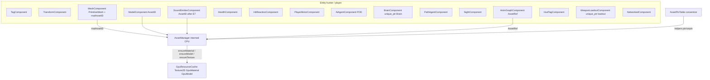
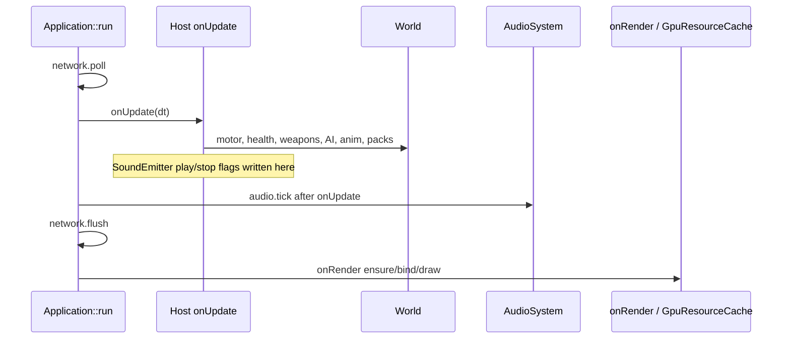

# Entity components in ECS: one ID, many parts, interned assets, no GPU in World

| Field | Value |
|-------|--------|
| **Title** | Entity components in ECS |
| **Author** | DarkEngine6 |
| **Date** | 2026-09-12 |
| **Status** | Draft (rev 3, questions resolved) |
| **Area** | `ECS/`, `Character/`, `AI/`, `Audio/`, `Gameplay/`, `Weapons/`, `Particles/`, `Animation/`, `Network/`, `Editor/`, Sandbox, Sandbox2D |
| **Audience** | Engine, Sandbox, Editor, and DarkGameplay owners who already know this tree |
| **Scope** | Design only. No production implementation in this document. |
| **Depends on** | `docs/plans/2026-09-12-platform-agnostic-assets.md` (M1–M8 landed: CPU assets in DarkAssets, GPU in `GpuResourceCache`, D17 render-thread only) |

---

## Overview

DarkEngine6 already has a sparse-set `World` and a handful of POD components (`Transform`, `Tag`, `Mesh`, `Model`, camera, lights). Almost everything that *makes a pawn a pawn* still lives beside that graph: PathChase hunters are a parallel `std::array<Agent, 3>` with `Brain` / `Health` / `HitReaction`; the Sandbox player is `m_playerHealth` / `m_motor` / `m_weapons` / `shared_ptr<SoundClip>` members; health packs are `HealthPackSet`; 2D platforms/coins are host vectors with an optional `Entity` stamp; Editor particle emitters are `m_emitters` plus `EditorObjectComponent::emitterIndex`. Draw still often binds host-held GPU `Mesh` objects. `MeshComponent` / `ModelComponent` store `AssetID`s, which is the right shape, but nothing else follows that pattern.

This design keeps **one `World` as the only runtime object graph** (Editor already killed `m_objects`). An `Entity` is the handle you query for transform, mesh/model, health, AI, audio, HUD tags, particles, and weapons. Components hold **interned CPU identities** (`AssetID`). They never hold D3D12 heaps, `GpuMaterial*`, `Texture2D`, or GPU `Mesh`. GPU upload remains `renderer().gpuResources().ensureTexture` / `ensureMaterial` / `ensureModel` on the **render thread** (asset-split D17). There is **no** `ensureMesh`; v1 cube/cross/sphere identity is `PrimitiveMesh` + `matAssetID`.

`World` is **not** thread-safe and is not given a mutex. v1 is sequential main-thread systems. The first off-thread work (optional later PR) is pathfinding into a typed write-back buffer. Non-relocatable runtimes (`AI::Brain`, `ParticleEmitter`, `WeaponLoadout`) live in the component as **`std::unique_ptr<T>`** so `World::destroyEntity` already runs their destructors. An `AssetPinTable` on `Application` plus **helpers** is a pin *convention* — it does not hook `World` mutation. `collectGarbage` stays test-only in v1.

---

## Background & Motivation

### What the engine actually does today

Library DAG (`cmake/DarkEngineTargets.cmake` ~170–189):

```
DarkFoundation  (Math, Collision, ECS, foundation Core)
     ^
     |-- DarkAssets    (CPU Image/Material/Model/MeshData; intern by AssetID)
     |        ^
     |        `-- DarkRender  (GpuResourceCache, Mesh, GpuMaterial, GpuModel; D3D12)
     |-- DarkNet
     `-- DarkGameplay  (Weapons/* + Gameplay/Platform,Coin,HealthPack)
DarkEngine umbrella PUBLIC-links all and compiles AI, Animation, Audio,
Character, Debug, Input, Particles, Scene, Sprite, Terrain, Water, …
```

`Application` (`Core/Application.h`) owns **one** `World`, plus `AssetManager`, `Renderer` (and `gpuResources()`), `AudioSystem`, `NetworkSystem`, `DebugServer`. Hosts (`SandboxApp`, `Sandbox2DApp`, `EditorApp`) tick and draw by reaching into that World *and* into large parallel member state.

#### ECS (`ECS/World.h`, `ECS/Components.h`, `ECS/Component.h`, `ECS/Entity.h`)

- Generation-packed `Entity` (`kEntityIndexBits = 20`). Slot 0 reserved. `destroyEntity` bumps generation and walks **all** pools.
- `ComponentPool<T>`: `unordered_map` sparse + dense `EntityID` + dense `T`. Insert **replaces in place**. Remove is swap-back — **`T` must be MoveAssignable**.
- **No mutex.** `each<T>` takes `std::function<void(Entity, T&)>` and iterates dense arrays. `get` / `has` / `emplace` / `remove` are unsynchronized.
- Typed pools are created lazily via `componentID<T>()` (process-wide counter in `ECS/Component.h`).
- Existing components, all with `kTypeName`, no inheritance:

| Component | Fields that matter |
|-----------|--------------------|
| `TransformComponent` | `position`, `rotation`, `scale` |
| `TagComponent` | `std::string name` |
| `MeshComponent` | `AssetID meshAssetID`, `AssetID matAssetID`, `castShadow`, `emissive` |
| `ModelComponent` | `AssetID modelAssetID`, `castShadow` |
| `CameraComponent` | fov/near/far/`primary` |
| `DirectionalLightComponent` | color, intensity |
| `LocalLightComponent` | point/spot, range, cones, `Entity emissiveMesh` |
| `NetworkedComponent` (`Network/Replication.h`) | `netId`, owner, prefab, color, `replicateTransform` |
| `EditorObjectComponent` (`Editor/EditorObject.h`) | `SceneObjectType`, tint, `emitterIndex` into host `m_emitters` |
| `AnimGraphComponent` (`Animation/AnimGraphComponent.h`) | **strong** `AssetRef<Model/AnimationSet/AnimGraphDef>` + `AnimGraphInstance` |

`MeshComponent.meshAssetID` is **always `NULL_ASSET`** at every production emplace (Sandbox `spawnOwnedPawn` / `ensureLocalCube` / `onNetSpawn` ~1581, 1602, 1617, 1980; Editor `EditorSpawn.cpp` ~108–110). Draw uses a **host GPU `Mesh`** (`m_cubeMesh`, Editor `meshForType`). `matAssetID` / `modelAssetID` are interned **CPU** ids; Sandbox/Editor resolve with `assets().getAs<Material/Model>(id)` then `gpuResources().bindMaterial` / `drawModel*`.

`AnimGraphComponent` is the existing exception to AssetID-only: `tickAnimGraphs` (`Animation/AnimGraphTick.cpp`) needs the live `Model` skeleton and `AnimGraphInstance` every tick. Strong refs pin those assets against `AssetManager::collectGarbage` (`use_count == 1`).

There is **no** multi-component view, no command buffer, no job system, no transform snapshot.

#### Assets vs GPU (landed split, do not regress)

- CPU: `Image`, `Material`, `Model`, `MeshData` in DarkAssets. `AssetID` / `AssetRef` / `AssetWeakRef` in `Assets/AssetHandle.h`. `NULL_ASSET = 0`.
- `GpuResourceCache` (`Render/GpuResourceCache.h`) interns **only** `Texture2D` (from `Image`), `GpuMaterial` (from `Material`), and `GpuModel` (from `Model`), keyed by **registered** CPU `AssetID`. `ensure*` rejects `NULL_ASSET` (asset-split D13). Entries store `AssetWeakRef` + destroy order models → materials (unregister packed heap) → textures (D14). **Render-thread only, no `m_gpuMutex` (D17).**
- There is **no** `ensureMesh`. GPU `Mesh` (`Render/Mesh.h`) is a D3D12 VB/IB object created by `Mesh::Create` / `tryCreate` from CPU `MeshData`. Today those objects are host members (`m_cubeMesh`, `m_crossMesh`, PathChase `m_trunkMesh` / `m_canopyMesh`) or `GpuModel::Part::mesh`. Do **not** intern GPU `Mesh*` by `meshAssetID` in this work.
- `AssetType::Mesh` is unused as a loaded asset (UnitTests dummy only). There is no `AssetManager::loadMesh`.
- `AssetManager` has a mutex for CPU intern/decode. `ImageCache` has single-flight waiters. That is the only asset threading today.
- `collectGarbage` (`use_count == 1`) has **no production call site** (tests + API only).

#### Spread state (the pain)

**Sandbox** (`Sandbox/SandboxApp.h`):

- Player: `PlayerMotor m_motor`, `Health m_playerHealth`, `HitReaction m_playerHit`, `WeaponLoadout m_weapons` — **not** on `m_cube` / `PlayerPawn`.
- Audio: `shared_ptr<SoundClip>` members. `AudioSystem` interns clips in its **own** `m_clips` map (`Audio/AudioSystem.cpp` `loadWav`), **not** `AssetManager` (`AssetType::Audio` exists and is unused). `SoundClip` is **not** an `Asset` and has **no** `AssetID`.
- GPU: `Mesh m_cubeMesh`, `m_tracerMesh`, `m_crossMesh`. Materials as `AssetRef<Material>` members (accidental pin).
- Particles: `ParticleEmitter m_blood` (one-shot hit FX), `ParticleRenderer`, `BloodSplatPool` — not components.
- Health packs: `HealthPackSet` — 4-slot array, no Entity, drawn with `m_crossMesh` + `m_packMaterial`.
- Lanterns: entities with `MeshComponent` (no `matAssetID`, no primitive) **and** `m_lanternFixtures` vector; drawn by `drawLanternFixtures*` (~1444), not the networked cube loop.
- PathChase: see below.
- Walker: Entity with **Transform + Tag only**. Hunters are not entities.

**PathChase** (`Sandbox/PathChase.h` `struct Agent`): pos, forward, lastSeen, wanderDest, `Brain`, `PathResult`, waypoint, repathAt, givenUp, `Health`, `HitReaction`, deadFor, assistLeft, fleeLeft, helpPos. Plus host GPU tree meshes, `AssetRef<Material>` for trees/AI, `Walkability` bake, line debug. Draw walks `m_agents` / tree meshes. Combat indexes `int i`.

**Sandbox2D**: `Dark::Platform` / `Coin` already have an `Entity` field; source of truth is host vectors. `b2BodyId` on host-derived `Platform`. Sprites are `Texture2D` members (HUD-class; out of `GpuResourceCache` by the asset split).

**Editor**: World is the live graph for props/lights. Draw iterates `each<EditorObjectComponent>` and `meshForType` (cube vs sphere). Particles: `vector<unique_ptr<ParticleEmitter>>` + `emitterIndex`.

**Net** (`Network/Replication.h`, `NetworkSystem.h` ~66–68): `NetSpawnFn` must attach draw components (`MeshComponent`; Editor also `EditorObjectComponent`). `unregisterEntity` → `NetDespawnFn` → `destroyEntity`. **Apps must not pair `unregisterEntity` with a second `destroyEntity`.** Prefabs: Cube, Sphere, PlayerPawn, Platform, Coin, Player2D.

**Scene JSON** (`Scene/SceneTypes.h`): version **2**. Does not serialize Mesh AssetIDs, models, health, audio, or AI.

### Pain points

1. **Cannot query a pawn.** `world.get<HealthComponent>(hunter)` does not exist.
2. **Two graphs for one object.** PathChase `Agent` vs Walker Entity; `HealthPackSet`; Editor `emitterIndex`.
3. **GPU types leak into gameplay headers.** `PathChase.h` includes `Render/Mesh.h` and `<d3d12.h>` because *draw* lives on the chase object.
4. **Asset lifetime is accidental.** Live `matAssetID` is only safe because Sandbox also holds `m_cubeMaterial`. A pin table that is not called on every mutation does not close this.
5. **`World::each` is a trap for threading.** No mutex; `GpuResourceCache` is render-thread only.
6. **Non-relocatable types cannot go in a pool by value.** `HsmState` deletes copy and defines no move, so `Brain` is not MoveAssignable (`AI/HsmState.h`). Even a generated move would UAF: ctor wires sibling `HsmState*` and `setOwner(this)` (`AI/Brain.cpp`). `ParticleEmitter` and `WeaponLoadout` delete copy and define no move — **they fail to compile** in `ComponentPool`, they do not silently corrupt.

---

## Goals & Non-Goals

### Goals (v1)

1. **One Entity, many components.** Query transform, mesh/model, health, hit reaction, AI POD + `Brain` via `unique_ptr`, sound emitter, HUD tag, particle desc + runtime `unique_ptr`, lights, camera, net, editor. PathChase hunters become entities. No parallel `Agent` array for the same pawn.
2. **Components reference interned CPU assets**, never D3D12. `AssetID` in components; GPU via `GpuResourceCache` (`ensureTexture` / `ensureMaterial` / `ensureModel` only) on the render thread.
3. **Keep live entity assets alive while hosts still hold `AssetRef` members, then migrate to an `AssetPinTable` convention + helpers.** Do **not** claim the table hooks `World`. `collectGarbage` stays test-only until a production tick either scans World or every mutation path is proven (emplace-replace, net/editor destroy tests).
4. **Relocatable component rule.** By-value types must be MoveAssignable. Non-relocatable runtimes sit behind `std::unique_ptr` **in the component** so pool swap-remove moves the pointer and `destroyEntity` runs the destructor.
5. **Threading that does not lie.** v1: main thread owns World mutation. Optional later: pathfinding worker with copied stamps. No World mutex. No `each` from workers.
6. **Keep Mesh/Model split.** No god `RenderComponent` or `GameObject`.
7. **No scene JSON bump in v1.** Scene JSON stays v2. Scene v3 / Editor-authored hunters and packs are **out of this slice** (resolved Q4).
8. **No C++ exceptions.** Bool/status, `DE_LOG_*`, `DE_ASSERT`.
9. **Independently mergeable PRs.** Thin E1 (PrimitiveMesh + pin table + helpers), Sandbox-only mesh gather, then PathChase hunters — **before** any job system. Domain components land **with** the PR that first uses them, not as a dump in E1.

### Non-goals (v1)

- Job graph / frame graph / fibers; World mutex; sim/render overlap.
- Bindless / `MeshPipeline` changes; `ensureMesh`; interned `MeshData` as a loaded asset.
- `VisibilityComponent` (follow-up when Editor hide or net relevancy exists). `castShadow` stays on Mesh/Model.
- GPU objects in ECS; actor/message architecture.
- Scene v2 → v3; HP net field; moving `Character/` into DarkGameplay.
- World-space UI widgets. v1 HUD = `HudTagComponent` feeding `Render/HealthHud` / `CrosshairHud` only.
- Rewriting HSM so `Brain` is MoveAssignable by value.
- Box2D types in engine headers.
- 100k-entity archetypes. Design for hundreds (Sandbox today: tens).
- Invented `WeaponSystem` / `ParticleSystem` engine types. Tick those components from the host (Sandbox / Editor). `AiSystem` **is** specified (walkability + pathfinder + hunter tick) because PathChase already owns that logic.
- Live projectiles as entities (D12).
- Sandbox blood (`m_blood`) as an entity map in v1.

---

## Key Decisions

| # | Decision | Rationale |
|---|----------|-----------|
| D1 | **Keep sparse-set `World` as the only runtime graph.** | Editor already uses World + `EditorObjectComponent`. |
| D2 | **Default identity in components is `AssetID`, not `AssetRef`, not GPU pointers.** | Matches shipped Mesh/Model. GPU cache keys are registered CPU ids. |
| D3 | **`Application` owns `AssetPinTable`.** Pin/unpin is a **convention** enforced by helpers (`pinMeshComponent`, `setMeshMaterial`, `onEntityRemoved`), not a World hook. `pin(AssetManager&, AssetID)` resolves the strong ref. | `World::emplace` replaces in place and does not call unpin. `get<MeshComponent>()->matAssetID = x` is unhooked. `collectGarbage` is test-only today. Goal 3 is **not** met by the table alone. Host `AssetRef` members remain the accidental pin until those PRs delete them. |
| D4 | **`AnimGraphComponent` keeps strong `AssetRef`s.** | Already pins; `tickAnimGraphs` needs the objects. |
| D5 | **GPU objects never appear in component headers.** Draw uses CPU `AssetID` → `getAs` → `ensureMaterial` / `ensureModel` / `bindMaterial`. | D17. Host draw may still take `ID3D12GraphicsCommandList*` — that is a host header, not a component. |
| D6 | **v1 mesh identity is `PrimitiveMesh` + `matAssetID`.** `meshAssetID` stays `NULL_ASSET` and is **reserved** for a future CPU `MeshData` intern. **Do not add `ensureMesh`.** | `GpuResourceCache` does not intern `Mesh`. Every current `meshAssetID` is 0. |
| D7 | **Small components, not a god object.** Rendering = Mesh + Model. AI = `AiAgentComponent` (POD) + Path + Sight + `BrainComponent { unique_ptr<Brain> }`. **No `VisibilityComponent` in v1.** | Hunters need health without a mesh. Hide-without-destroy is a follow-up. |
| D8 | **Non-relocatable runtimes: `unique_ptr` in the component (A8).** `Brain` is not MoveAssignable (copy deleted, no move) **and** has self-pointers so a generated move would UAF. `ParticleEmitter` / `WeaponLoadout` delete copy — they **do not compile** in a pool by value. | Same heap allocation as a side map; `destroyEntity` already destroys the `unique_ptr`. Query is `world.get<BrainComponent>(e)->brain`. No `AiSystem::m_brains` map. |
| D9 | **No mutex on `World`.** Typed path write-back only. | World lock serializes `each` and can deadlock with `AssetManager::m_mutex`. |
| D10 | **v1 does not overlap sim and render.** `Application::run` is `onUpdate` → `audio().tick()` → net flush → `onRender`. | Do not add a second `AudioSystem::tick` inside `onUpdate`. `ensure*` at spawn or onRender on this same thread. |
| D11 | **Domain components live next to their systems, not all in `ECS/Components.h`.** Foundation: Transform/Tag/Mesh/Model/Camera/Lights + `PrimitiveMesh`. | DarkFoundation must not include Character/AI/Audio. |
| D12 | **HealthPack/Coin become components; `HealthPackSet` dies after E5.** Platform stays helper + host `b2BodyId`. Weapons: `WeaponLoadoutComponent { int slot; unique_ptr<WeaponLoadout> loadout; }` — **no desc ids in v1.** Live projectiles stay inside `ProjectileWeapon` (not entities). | Loadout already owns melee/projectile + `setAudio` / impact particles. Slot is the only extra POD. |
| D13 | **UI v1 = `HudTagComponent` feeding `HealthHud` / `CrosshairHud`.** Not `Ui/` widgets, not world-space nameplates. | Those HUDs are renderer `Texture2D` objects (out of the asset cache). |
| D14 | **Net spawn attaches draw components the host already requires; Health on pawns when that host migrates.** No hunter prefab. Scene JSON stays v2. | Silent format bump breaks `content/scenes/*.json`. |
| D15 | **`World::each` stays single-threaded.** Template `Fn` in E1 to drop `std::function` allocation. Not a threading fix. | |
| D16 | **E2 mesh gather is Sandbox-only** and **replaces** `each<NetworkedComponent>` cube draws with a **full `PrimitiveMesh` switch** (`Cube` / `Cross` / `Sphere` / `None` skip). E2 spawn sites only set `Cube`. Unused Cross/Sphere branches no-op until E5/E3. Lanterns stay `None` + host draw. Editor stays on `EditorObjectComponent`. | Cube-only gather would make E5 invisible packs after `drawHealthPacks*` is deleted. Default `None` would hide lanterns if E2 stole their draw. |
| D17 | **`SoundClip` intern into `AssetManager` (`AssetType::Audio`) in E7**, before or as the first half of SoundEmitter. Until E7 the pin table does **not** store clips (no `AssetID`). Keep-alive is `AudioSystem::m_clips` + host `shared_ptr`. | Cannot put a non-Asset into `AssetPinTable`. |
| D18 | **`onEntityRemoved` is side-table cleanup only.** It never calls `World::destroyEntity`. DarkNet **must not** include or call it. `NetSpawnFn` unpins before returning `false`; Network spawn-fail stays destroy-only. Unique_ptr components do not need a map erase. | DarkEngine PUBLIC-links DarkNet; a pin include in `NetReplicationApply.cpp` is a cycle. The host spawn callback is the layer that pinned. |

---

## Proposed Design

### Target: one pawn, many parts



### Frame loop (v1)



`Core/Application.cpp` ~590–602: `onUpdate` → `m_audio.tick()` → `m_network.flush` → `onRender`. Hosts **must not** call `AudioSystem::tick` a second time. `ensure*` belongs at spawn (main thread) or lazily in `onRender`, not in an AI worker.

### Relocatable component rule

`ComponentPool<T>::remove` does `m_components[idx] = std::move(m_components[last])`. `insert` assigns `T` in place on replace.

**Allowed by value:** trivially relocatable structs; `std::string`; `std::vector` of PODs; `AssetID`; `Health` / `HitReaction` / `PlayerMotor`; `std::unique_ptr<U>`.

**Not allowed by value:**

| Type | Compile / runtime | v1 storage |
|------|-------------------|------------|
| `AI::Brain` | `HsmState` copy deleted ⇒ Brain not MoveAssignable; self-pointers would UAF if someone defaulted a move | `BrainComponent { unique_ptr<AI::Brain> brain; }` |
| `ParticleEmitter` | copy deleted, no move ⇒ **does not compile** in a pool | `ParticleEmitterComponent { desc; unique_ptr<ParticleEmitter> runtime; }` |
| `WeaponLoadout` | copy deleted, no move ⇒ **does not compile** | `WeaponLoadoutComponent { int slot; unique_ptr<WeaponLoadout> loadout; }` |
| GPU `Mesh` / `GpuMaterial` / `Texture2D` | D3D12 | `GpuResourceCache` / host members |
| `b2BodyId` | Box2D is Sandbox2D-private | host `Platform` wrapper |

### AssetID vs AssetRef vs pins

The pin table **does not** intercept `World::emplace` / `remove` / `destroyEntity` / in-place field writes. Goal 3 is a **convention + tests**, plus existing host `AssetRef` members, plus **no production `collectGarbage`**.

```cpp
class AssetPinTable
{
public:
    void pin(AssetRef<Asset> asset);                 // no-op if !asset || id == NULL_ASSET
    void pin(AssetManager& assets, AssetID id);      // get(id) then pin; ERROR if missing
    void unpin(AssetID id);                          // refcount--; erase at 0; ERROR+assert if unknown
    AssetRef<Asset> get(AssetID id) const;
    void clear();
};

void pinMeshComponent(AssetPinTable& pins, AssetManager& assets, const MeshComponent& mc);
void unpinMeshComponent(AssetPinTable& pins, const MeshComponent& mc);
void pinModelComponent(AssetPinTable& pins, AssetManager& assets, const ModelComponent& mc);
void unpinModelComponent(AssetPinTable& pins, const ModelComponent& mc);

// Replace in place: unpin old ids, emplace, pin new. Use this instead of raw emplace<MeshComponent>.
void setMeshComponent(World& world, AssetPinTable& pins, AssetManager& assets, Entity e, MeshComponent next);
void setMeshMaterial(World& world, AssetPinTable& pins, AssetManager& assets, Entity e, AssetID matId);

// Walk Mesh/Model/(Sound after E7). AnimGraph AssetRefs are not double-pinned.
void onEntityRemoved(World& world, Entity e, AssetPinTable* pins);
```

**Mutation sites that must call helpers** (load-bearing; tests cover the first two):

| Site | Pin action |
|------|------------|
| First `emplace<MeshComponent>` / `ModelComponent` | `pinMeshComponent` / `pinModelComponent` after emplace, or `setMeshComponent` |
| Re-`emplace` same T (pool replace in place) | `setMeshComponent` only — raw emplace **leaks** the old pin |
| `world.get<MeshComponent>(e)->matAssetID = x` | **Forbidden.** Use `setMeshMaterial`. |
| `World::remove<MeshComponent>` | `unpinMeshComponent` **before** remove |
| `onEntityRemoved` then destroy/unregister | unpin remaining Mesh/Model/Sound ids |
| Spawn fail (`registerEntity` false → `destroyEntity`) | Host: `onEntityRemoved` then destroy if this host pinned. `NetSpawnFn`: unpin **before** `return false`; DarkNet does not unpin. |
| E7+ SoundEmitter clip change | pin/unpin clip `AssetID` |

`Application` owns the table (`Core/Application.h` next to `m_assets`). Editor and Sandbox both see `pins()`. **Headers live under `Core/`** (`Core/AssetPinTable.h`, `Core/EntityPins.h` for `setMeshComponent` / `onEntityRemoved`), compiled in the DarkEngine umbrella via `DE_ENGINE_CORE_SOURCES` in `cmake/DarkEngineTargets.cmake` (Core TUs are **explicit**, not a glob — E1 must add the `.cpp` files to that list). Do **not** put them in `Assets/` (that glob is DarkAssets; World-walking hooks cannot live there). Do not put the table on `World` (Foundation).

Until E7, **do not** invent clip AssetIDs for the pin table. `SoundClip` is not an `Asset`.

If a later PR adds a production `collectGarbage` tick, it must either (1) treat pin-table entries as extra strong refs (already true if convention holds) **or** (2) scan World Mesh/Model/Sound/Anim fields. Do not add that tick in E1–E9.

### GPU still not in ECS

Draw path for an entity with `MeshComponent` **that this host's gather is responsible for**:

1. Read `TransformComponent` on the main thread during `onRender`.
2. `assets().getAs<Material>(mc.matAssetID)`.
3. `gpuResources().bindMaterial` — `ensureMaterial` at spawn or first draw.
4. `mc.meshAssetID` is `NULL_ASSET` in v1 — **ignore it**. Do not look up a GPU `Mesh` in `GpuResourceCache`.
5. Switch `mc.primitive` (**E2 implements the full switch**, not Cube-only): `Cube` → host `m_cubeMesh`; `Cross` → `m_crossMesh` (no-op until E5 sets Cross on pack entities); `Sphere` → skip in Sandbox (no host sphere mesh; Editor keeps `meshForType`); `None` → **skip** (lanterns and any other host-owned draw). Missing GPU mesh for a branch → skip that entity, do not crash.

Model path: `getAs<Model>` + existing `drawModel*` + `ensureModel`. No change to `GpuModel::Part::mesh`.

### Host draw iterators (do not double-draw)

| Host | Current iterator | After E2 | `primitive` / material | Old draw to delete in this PR? |
|------|------------------|----------|------------------------|--------------------------------|
| Sandbox networked cubes / pawns | `each<NetworkedComponent>` + `m_cubeMesh` (`SandboxApp.cpp` ~2205–2217 and depth/forward siblings) | `each<MeshComponent>` **replacing** that loop with a **full primitive switch**; tint from `NetworkedComponent` if present | E2 sets `Cube` + `m_cubeMatId` on `spawnOwnedPawn`, `ensureLocalCube`, `onNetSpawn`. Cross/Sphere branches exist but match no entities yet. | **Yes** — the Networked cube mesh draws. Keep `m_cubeMesh` / `m_crossMesh` as GPU objects. |
| Sandbox lanterns | `m_lanternFixtures` + `drawLanternFixtures*` (~1444) | **Unchanged in E2** | Leave `primitive = None`, no `matAssetID` | **No.** Migrating lanterns is a later optional PR (set Cube + lantern mat, fold into gather, delete `m_lanternFixtures` draw). |
| Sandbox health packs | `HealthPackSet` + `m_crossMesh` (not entities) | Draw path **already** in the E2 switch (`Cross` → `m_crossMesh`); no pack entities until E5 | E5: `Cross` + pack mat; **E5 does not extend the gather** | E5 deletes `drawHealthPacks*` |
| PathChase hunters | `PathChase::drawMeshes*` walking `m_agents` | Unchanged until E3 | E3: `Cube` + `m_aiMat`; then **Sandbox gather draws them** (Cube branch already in E2) — PathChase must **stop** drawing hunter cubes | E3 deletes hunter cube draws inside PathChase; **keep** tree / line / walker draws |
| PathChase trees | host `m_trunkMesh` / `m_canopyMesh` | Unchanged in v1 | n/a | **No** |
| Editor 3D props | `each<EditorObjectComponent>` + `meshForType` (`EditorRender3D.cpp`) | **Unchanged in E2** (E2 is Sandbox-only) | `meshAssetID` stays 0; Editor may set `primitive` later without switching iterator | **No** |
| Sandbox / Editor models | `each<ModelComponent>` already | Unchanged | `modelAssetID` | **No** |

Debug skip (E2 Sandbox gather): `primitive == None` → skip (lanterns). `Cross` with no matching entity is a no-op until E5. After E3, hunters must take the Cube branch.

### Component catalog (land with the PR that uses them)

#### A. Foundation — `ECS/Components.h` (E1)

Keep existing types. Add `PrimitiveMesh` to `MeshComponent` only:

```cpp
enum class PrimitiveMesh : uint8_t
{
    None = 0,
    Cube,
    Sphere,
    Cross,
};

struct MeshComponent
{
    static constexpr const char* kTypeName = "Mesh";

    AssetID       meshAssetID = NULL_ASSET; // reserved; v1 always 0
    AssetID       matAssetID  = NULL_ASSET;
    PrimitiveMesh primitive   = PrimitiveMesh::None;
    bool          castShadow  = true;
    float         emissive    = 0.0f;
};
```

**Do not** add `VisibilityComponent` in v1. **Do not** add `RenderComponent`.

#### B. Character — land in E3 (Health/HitReaction) and E4 (Motor)

```cpp
struct HealthComponent { static constexpr const char* kTypeName = "Health"; Health health; };
struct HitReactionComponent { static constexpr const char* kTypeName = "HitReaction"; HitReaction hit; };
struct PlayerMotorComponent { static constexpr const char* kTypeName = "PlayerMotor"; PlayerMotor motor; };
```

Motor is **local possessed only**. `Character/Character.h` stays unused.

#### C. AI — land in E3

```cpp
struct SightComponent { /* coneDeg=70, range=25; matches AI::SightQuery */ };
struct PathAgentComponent { AI::PathResult path; int waypoint = 0; float repathAt = 0; float radius = 0.8f; };
struct AiAgentComponent { /* POD: leaf, timers, lastSeen, wanderDest, helpPos, forward, givenUp, … */ };
struct BrainComponent
{
    static constexpr const char* kTypeName = "Brain";
    std::unique_ptr<AI::Brain> brain;
};
```

**`AI/AiSystem.h` (DarkEngine), constructed by PathChase in E3:**

| Owns | Does not own |
|------|----------------|
| `Walkability`, `Pathfinder` (moved from PathChase) | GPU meshes, D3D12, tree `m_cubes`, line debug |
| `PackSettings` (moved from PathChase) | `Application`, `World` lifetime |
| `tickHunters(World&, Terrain::TerrainWorld&, bool playerInWater, float dt, Entity player)` | Brain map (brains live on `BrainComponent`) |

`tickHunters` **replaces** `PathChase::tickHunterHealth` + the hunter loop in `PathChase::tick` (`PathChase.cpp` ~409–447, ~900–945). Order (same as today):

1. **Health / corpse / respawn** (today `tickHunterHealth`, **before** sight). For each hunter entity with `HealthComponent` + `AiAgentComponent` + `TransformComponent`:
   - If `health.alive()`: `health.tick(dt)` (regen).
   - Else: `AiAgentComponent.deadFor += dt`. If `deadFor >= 8.0f` and walkability is valid, pick a walkable XZ (same 64-try random as today), write Transform Y from `heightMap->heightAtWorld + 1`, `health.revive()`, reset `HitReactionComponent`, clear path/waypoint/`givenUp`/`hasLastSeen`/`assistLeft`/`fleeLeft`, `forward = {0,0,1}`, `deadFor = 0`, `BrainComponent.brain->start()`. **Do not** `destroyEntity` or unpin — the corpse stays the same entity (pins stay).
2. **Alive hunters only** (today `if (!a.health.alive()) continue`):
   - `HitReactionComponent` integrate **into Transform** first (`integrateHitReaction`: knockback along walkable XZ, then snap Y to terrain + 1). Existing order: knockback **then** sight/follow.
   - Fill `AI::SightQuery` **including `heightMap`** (`AI/Sight.h` via `Walkability::heightMap()`), `brain->tick`, write POD leaf/timers, follow `PathAgentComponent` into Transform.

`Brain::start` at spawn (and on respawn); if spawn `start` fails, host calls `onEntityRemoved` + `world.destroyEntity` + `DE_LOG_ERROR(LogCategory::AI, ...)` + return `{}`.

**PathChase after E3 (not deleted):** Sandbox host. Still: `init`/`bake` from `TerrainWorld`/`WaterWorld` into `AiSystem::walkability`, tree positions/`m_cubes`/`m_trunkMesh`/`m_canopyMesh`, line path overlay, walker Entity (Transform+Tag), `drawMeshes*` **for trees and debug only**. `PathChase::tick` keeps walker input + `m_time`, then **calls `AiSystem::tickHunters`** (do not leave a second `tickHunterHealth` on `Agent`). Hunters are World entities. `PathChase.h` may keep `<d3d12.h>` for tree/line draw.

Pathfinding stays **main-thread** in E3 (`Pathfinder::find`). E10 (off-thread worker) **does not ship in this slice** (resolved Q1).

#### D. Audio — land in E7

`AudioListenerComponent`, `SoundEmitterComponent` as previously specified (`clipId` is a real interned `AssetID` only after `SoundClip : Asset`). One-shot UI/music stay `play2D` / `setMusic`. No one-shot SFX queue required in E3. Host `onUpdate` sets `play` / stops; `Application` ticks the mixer afterwards.

E7 intern: `loadWav(AssetManager&, path)` `registerAsset`s the clip (or `loadAudio`) and returns `AssetRef<SoundClip>`. Collapse `AudioSystem::m_clips` onto AssetManager so there are not two strong maps (same lesson as ImageCache D7 in the asset split).

#### E. UI — land in E4

`HudTagComponent` + `HudKind::{HealthBar, Crosshair}`. Feeds existing `HealthHud` / `CrosshairHud`. Nameplate reserved, not implemented. This is the **entire** v1 UI surface.

#### F. Particles — land in E6 (Editor authored emitters only)

```cpp
struct ParticleEmitterComponent
{
    static constexpr const char* kTypeName = "ParticleEmitter";
    ParticleEmitterDesc desc{};
    bool playing = true;
    std::unique_ptr<ParticleEmitter> runtime; // created on first tick
};
```

Editor: drop `m_emitters` + `emitterIndex`. Tick `each<ParticleEmitterComponent>` in Editor `onUpdate`; `destroyEntity` destroys `runtime`. Scene JSON **unchanged** (DTO still on `SceneObjectData`).

**Sandbox `m_blood` stays a host `ParticleEmitter`** (one-shot hit FX, not an authored looping entity). `BloodSplatPool` / `ParticleRenderer` stay renderer objects. **No `ParticleSystem` class.**

#### G. Gameplay — HealthPack in E5, Coin in E9

`HealthPackComponent` / `CoinComponent` as previously specified. `tickHealthPacks(World&, Entity player, float dt)` in DarkGameplay. Platform remains helper; Sandbox2D keeps `b2BodyId`.

#### H. Weapons — `HittableComponent` in E3; loadout unique_ptr in E8

```cpp
struct HittableComponent
{
    static constexpr const char* kTypeName = "Hittable";
    Math::Vector3f halfExtents{ 1.0f, 1.0f, 1.0f };
};

struct WeaponLoadoutComponent
{
    static constexpr const char* kTypeName = "WeaponLoadout";
    int slot = 0; // 0 melee, 1 projectile
    std::unique_ptr<WeaponLoadout> loadout;
};
```

**No `WeaponSystem` class.** Sandbox ticks `get<WeaponLoadoutComponent>(possessed)->loadout` in E8. Until E8, `SandboxApp::m_weapons` stays. `ProjectileWeapon::setAudio` / `setImpactDesc` remain on the loadout object.

Combat gather (Sandbox, E3): once per tick, `each<HittableComponent>` into a scratch `vector<{Entity, Vector3f center, Vector3f half}>`. `WeaponWorldQuery` callbacks index that vector. Weapons stay DarkGameplay — **no** include of `AI/` or `HittableComponent` from `Weapons/Weapon.h`. `targetHalfExtents` remains as **fallback** when the scratch half is unset (0). Player pawn gets `HittableComponent` in **E4** if weapons should hit the local player; hunters get it in E3.

`Entity (*targetEntity)(void*, int)` optional on `WeaponWorldQuery`; `onWeaponHit` maps index → Entity via the scratch vector. `WeaponHit.targetIndex` stays.

Live projectiles: still inside `ProjectileWeapon` (max 16). Not entities.

#### I. Sprite — optional in E9

`SpriteComponent` with `imageId` (CPU Image). Sandbox2D may keep host `Texture2D` members in E9 if only coins move.

#### J. Unchanged

`NetworkedComponent`, `EditorObjectComponent` (except `emitterIndex` retirement in E6), `AnimGraphComponent`, lights, camera.

### Where types live (DAG)

| Type | Header | Link target | Lands in |
|------|--------|-------------|----------|
| Transform/Tag/Mesh/Model/Camera/Lights/`PrimitiveMesh` | `ECS/Components.h` | DarkFoundation | E1 |
| `AssetPinTable` | `Core/AssetPinTable.h/.cpp` | DarkEngine (`DE_ENGINE_CORE_SOURCES`) | E1 |
| `setMeshComponent` / `onEntityRemoved` | `Core/EntityPins.h/.cpp` | DarkEngine (`DE_ENGINE_CORE_SOURCES`) | E1 |
| NetworkedComponent | `Network/Replication.h` | DarkNet | exists |
| EditorObjectComponent | `Editor/EditorObject.h` | Editor | exists |
| Health/HitReaction | `Character/HealthComponent.h` | DarkEngine | E3 |
| PlayerMotorComponent | `Character/PlayerMotorComponent.h` | DarkEngine | E4 |
| Ai/Sight/Path/Brain components + `AiSystem` | `AI/AiComponents.h`, `AI/AiSystem.h` | DarkEngine | E3 |
| HudTag | `Ui/HudTagComponent.h` | DarkEngine or host | E4 |
| ParticleEmitterComponent | `Particles/ParticleComponents.h` | DarkEngine | E6 |
| Sound/Listener | `Audio/SoundComponents.h` | DarkEngine | E7 |
| HealthPack/Coin | `Gameplay/*.h` | DarkGameplay | E5 / E9 |
| Hittable | `Weapons/HittableComponent.h` | DarkGameplay | E3 |
| WeaponLoadoutComponent | `Weapons/WeaponLoadoutComponent.h` | DarkGameplay | E8 |

Component headers: **no** `<d3d12.h>`, `wrl/client.h`, `Render/Mesh.h`, `Render/Texture2D.h`, `Render/GpuMaterial.h`. `BrainComponent` may include `AI/Brain.h`. `WeaponLoadoutComponent` may include `Weapons/WeaponLoadout.h` (already pulls Audio/Particles — existing DarkGameplay pattern).

### Systems and thread ownership (v1)

| Logic | Thread | Read | Write | Owner |
|-------|--------|------|-------|-------|
| Network apply | Main | — | Transform, Networked | `NetworkSystem` (exists) |
| PlayerMotor | Main | Input | Transform, motor | Sandbox E4 |
| Health / HitReaction (hunters) | Main | Walkability | Health, Hit, Transform knockback, `deadFor`, revive | **`AiSystem::tickHunters`** (must not be dropped when `Agent` dies) |
| Health / HitReaction (player) | Main | — | Health, Hit | Sandbox E4 |
| Weapons | Main | scratch hittables | Health, Hit, loadout unique_ptr | Sandbox `m_weapons` until E8, then component |
| AI sense / path follow | Main | Transform, Sight, HeightMap, Health | AiAgent, Brain unique_ptr, Path, Transform | `AiSystem::tickHunters` after health/knockback |
| Pathfinder worker | Out of this slice (E10 later) | Walkability* (stable after bake), **owned** `vector<AgentStamp>` + start/dest | `PathWritebackQueue` only | not E3; Q1 resolved **no** |
| AnimGraph | Main | AnimGraph | AnimGraph, Transform | exists |
| HealthPack / Coin | Main | Transform, Health | those components | DarkGameplay helpers |
| Particles | Main | Transform | `ParticleEmitterComponent.runtime` | Editor E6; Sandbox blood host |
| Audio | `Application` after onUpdate; XAudio2 internal | Transform, SoundEmitter | `voice` | do not double-tick |
| Render | Main `onRender` | Transform, Mesh, Model, Lights, Anim pose | host prev-world map | host gather table |
| DebugServer | Main | pool stats | — | exists |

**Forbidden:** worker `World*`, worker `ensure*`, worker `each`.

### Destruction — `onEntityRemoved` vs World destroy

`World::destroyEntity` already destroys pool entries, including `unique_ptr` members. It does **not** unpin.

```cpp
// Side tables only. NEVER calls world.destroyEntity.
void onEntityRemoved(World& world, Entity e, AssetPinTable* pins);
```

Optional extra host lambdas (lantern vector, `m_cube = {}`) stay in `NetDespawnFn` / Editor `eraseOne` as they do today.

**DarkNet must not call `onEntityRemoved`.** `NetReplicationApply.cpp` is DarkNet (`DE_NET_FOLDERS`). DarkEngine already PUBLIC-links DarkNet; pin helpers in DarkNet would cycle. Spawn-callback failure (~123–130) stays **destroy-only**. The host `NetSpawnFn` is the layer that pinned: if it `setMeshComponent`d and then fails, it calls `onEntityRemoved` **before returning `false`**. Network then `destroyEntity` as today.

**Wire this way** (empty pin table is a no-op, so E1 can add the calls before anything is pinned):

| Existing call | After | Lands in |
|---------------|--------|----------|
| `NetworkSystem::teardownEntity` (`NetReplication.cpp` ~213–217): `NetDespawnFn` then `destroyEntity` | `NetDespawnFn` (host) calls `onEntityRemoved` **only**. Network still destroys. Apps **must not** destroy again (`NetworkSystem.h` ~66–68). **No DarkNet include of EntityPins.** | Host despawn fn: Sandbox E1, Editor E1, Sandbox2D E1 |
| `unregisterEntity` | unchanged; goes through teardown → host `NetDespawnFn` | exists |
| `NetReplicationApply` spawn-callback fail (~123–130) `destroyEntity` | **Unchanged in DarkNet.** Host `NetSpawnFn` unpins before `return false`. | Host spawn fn when that host pins (Sandbox E2) |
| Editor `deleteSelected` `eraseOne` (`EditorSpawn.cpp` ~263–277): `unregisterEntity` **or** `destroyEntity` | `onEntityRemoved` **first**, then the same branch | **E1** (no-op until pins exist; makes E6 “already wired”) |
| Editor `clearScene` (~349–360), `discardLocalSceneForJoin` (`EditorNet.cpp` ~94–104) | same | **E1** |
| Sandbox `applyNetRole` stale replicas (`SandboxApp.cpp` ~520) `unregisterEntity` | covered by `onNetDespawn` | E1 |
| Sandbox `onNetDespawn` (~1624) currently only clears `m_cube` | add `onEntityRemoved`; keep `m_cube = {}` | **E1** |
| Sandbox `onNetPeer` Left (~1643) `unregisterEntity` | covered by despawn fn | E1 |
| Sandbox `spawnOwnedPawn` / `ensureLocalCube` register fail (~1586) `destroyEntity` | `onEntityRemoved` **then** destroy — **E2 pins these meshes**, so E2 must wire spawn-fail (do not wait for E3) | **E2** |
| Sandbox `onNetSpawn` | if it pins via `setMeshComponent` and later returns false, unpin first; today it returns true after emplace | **E2** |
| Sandbox2D register fail (~521, 543, 566) `destroyEntity` | `onEntityRemoved` then destroy (no-op until E9 pins) | **E1** |
| Sandbox2D `spawnOwnedPawn` register fail (`Sandbox2DApp.cpp` ~623–626) `destroyEntity` | same as ~566 | **E1** |
| Sandbox2D `unregisterIdleReplicas` (~581), peer left (~875), host coin collect `unregisterEntity` (~711) | despawn fn → `onEntityRemoved` | **E1** (despawn fn) |
| UnitTests `World::destroyEntity` | no pin table required | tests |

Grep list as of 2026-09-12 also includes `UnitTests/ECS/WorldTests.cpp`, `UnitTests/Debug/ServerClientTests.cpp`, `UnitTests/Network/ReplicationTests.cpp` — tests only.

Hunter **death** in v1 keeps the entity (corpse, `Health` dead, `deadFor`) — no destroy, no unpin.

Do **not** add World listeners. Do **not** take `AiSystem*` / `ParticleSystem*` / `WeaponSystem*` on the helper — those maps do not exist under A8.

### PathChase migration (E3)

**Before:** `array<Agent, 3>` + walker Entity (Transform/Tag).

**After:** 3 hunter Entities + walker Entity. PathChase remains the Sandbox host for bake/trees/debug.

Each hunter: Tag, Transform, Mesh (`Cube` + `m_aiMat->id`), Health, HitReaction, Hittable (`halfExtents` from `m_agentR`), AiAgent, PathAgent, Sight, `BrainComponent` (`make_unique<Brain>()`, `start()`).

`setMeshComponent` pins `m_aiMat`. Sandbox E2 gather draws the cubes (Cube branch) — PathChase **stops** drawing hunters. Trees still PathChase. `applyHunterDamage(int)` deleted; Entity-based. `WeaponWorldQuery` uses the scratch hittable vector. Regen, knockback, `deadFor`, and 8s walkability respawn run inside `AiSystem::tickHunters` (see catalog C) — deleting `struct Agent` must not drop `tickHunterHealth` / `integrateHitReaction`.

### Player pawn (E4)

`spawnOwnedPawn` already: Tag, Transform, Mesh, Networked. Add Health, HitReaction, Hittable, `HudTagComponent{HealthBar}` on **local** pawn, `PlayerMotorComponent` on local only. Delete `m_playerHealth` / `m_motor` / `m_playerHit`. Weapons stay `m_weapons` until E8.

### Health packs (E5)

4 entities: Transform + Mesh `Cross` + pack mat (pin) + `HealthPackComponent`. Pickup writes player `HealthComponent`. Delete `HealthPackSet` and `drawHealthPacks*`. Fold into Sandbox mesh gather.

### Threading: v1 vs later

v1 window: one gameplay thread. Pathfinding in E3 is `Pathfinder::find` on main. E10 does **not** ship in this slice (resolved Q1). The write-back types below are recorded so a later PR can add a worker without changing components:

```cpp
struct PathJob
{
    Entity                 entity;
    float                  startX, startZ, destX, destZ;
    std::vector<AI::AgentStamp> stamps; // owned; PathRequest.others = stamps.data()
};

struct PathWriteback { Entity entity; AI::PathResult path; bool ok = false; };
```

Worker binds `const Walkability*` that **main will not rebuild until join** (PathChase bake is init-time today; if LOD ever rebakes, join first). `PathRequest.others` must **not** point at main-thread memory. `drainTo`: skip if `!world.alive(entity)`. Mutex only on the queue.

v2 (E12 RFC): exclusive component-type jobs, transform snapshot. Not these PRs.

### Replication / Editor / SceneFile

Net: attach Health in `NetSpawnFn` for PlayerPawn when E4 lands; **do not** replicate HP floats. Hunters are not a `NetPrefab`.

Editor: still `EditorObjectComponent`. E6 removes `emitterIndex`.

Scene JSON version 2 unchanged. Scene v3 / Editor-authored hunters and packs are **out of this slice** (resolved Q4; E11 later).

---

## API / Interface Changes

MeshComponent: add `PrimitiveMesh primitive = None` (see catalog A).

```cpp
Entity spawnHunter(World& world, AssetPinTable& pins, AssetManager& assets,
                   AssetRef<Material> aiMat, const TransformComponent& xf);
// setMeshComponent Cube+aiMat; emplace Health/Hit/Hittable/Ai/Path/Sight;
// emplace BrainComponent{make_unique<Brain>()}; start() or onEntityRemoved+destroy and return {}
```

`WeaponWorldQuery`: optional `targetEntity`; scratch extents on the **host**; `targetHalfExtents` fallback.

`World::each`: template `Fn` in E1; keep call sites compiling.

---

## Data Model Changes

Runtime only. Scene v2 and net protocol unchanged.

| Store | Change |
|-------|--------|
| World pools | New types as each PR migrates a host |
| `Application` `AssetPinTable` | E1; not serialized |
| `AssetType::Audio` | E7 |
| `AiSystem` Walkability/Pathfinder | moved from PathChase in E3; not a Brain map |

Memory: 3 `Brain` heap objects (same as today, now under `unique_ptr` in the pool). Pin table ~10–40 entries once hosts drop duplicate `AssetRef`s. No GPU `Mesh` intern.

---

## Alternatives Considered

### A1. Unity-style GameObject + `GetComponent<T>` — reject

Second object model; Editor already deleted `m_objects`. `world.get<T>(e)` is GetComponent.

### A2. One `RenderComponent` blob — reject for v1

Mesh/Model already split for skinned draws. Visibility is a named follow-up, not a v1 type.

### A3. Strong `AssetRef` on every component — reject as default

Atomic inc on swap-remove; AnimGraph already does this for a reason. Pin convention + AssetID matches GPU keys.

### A4. Shared mutex on `World` — reject

Serializes `each`; deadlocks with `AssetManager`; does not make `GpuResourceCache` safe.

### A5. Actor/message model — reject as architecture

Keep `AnimNotifyQueue` / `PathWritebackQueue` as narrow queues. Combat is `health.applyDamage`.

### A6. Generic type-erased `WorldCommandQueue` in v1 — defer

Unused until jobs spawn entities. Path write-back is three fields.

### A7. Make `Brain` movable by heap-allocating HSM nodes — reject

Rewrite of `HsmState` ownership. A8 gives a stable heap address without touching HSM.

### A8. `unique_ptr` in the component — **adopt**

```cpp
struct BrainComponent { std::unique_ptr<AI::Brain> brain; };
```

`unique_ptr` is relocatable; `Brain` address is stable so HSM `this` pointers stay valid; `destroyEntity` runs the destructor. Same allocation as `unordered_map<EntityID, unique_ptr<Brain>>`, without a god `destroyGameEntity` and without leaking maps when Editor/Network destroy. Same pattern for `ParticleEmitter` and `WeaponLoadout`.

**Rejected:** system maps as the v1 storage for those three types (Issue 2 would be blocking). `AiSystem` still exists for walkability/pathfinder/tick orchestration, not as a Brain dictionary.

---

## Security & Privacy Considerations

Local trusted content. No new net asset fetch. No PII. Stale `Entity` after recycle: `alive()` on path write-back. Pin leak: helpers + tests (emplace-replace, net/editor destroy); production GC still off. Worker: no `World*`. GPU: no `ensure*` in AI.

---

## Observability

No new `LogCategory`.

| Event | Level | Category |
|-------|--------|----------|
| `Brain::start` failed | ERROR | AI |
| Path write-back for dead entity | TRACE | AI |
| `ensureMaterial` missing | ERROR | Render |
| Unpin unknown id | ERROR | Core |
| Raw `matAssetID` write detected (debug assert in `setMeshMaterial` only) | — | — |

---

## Testing

| File | Cases |
|------|--------|
| `UnitTests/ECS/WorldTests.cpp` | Existing + `MeshComponent` default `primitive == None`; `each` template lambda |
| `UnitTests/ECS/AssetPinTableTests.cpp` | pin/unpin refcount; `pin(AssetManager&, id)`; **emplace-replace via `setMeshComponent` does not leak**; `onEntityRemoved` unpins; unpin unknown |
| `UnitTests/Network/ReplicationTests.cpp` or host-level test | spawn + `unregisterEntity` runs host `NetDespawnFn` → `onEntityRemoved` without double-destroy. **Do not** call pin helpers from DarkNet TUs. |
| `UnitTests/Character/HealthComponentTests.cpp` | emplace Health; swap-remove of another entity leaves Health valid (relocatable) |
| `UnitTests/AI/AiAgentEntityTests.cpp` | hunter-like entity: Transform+Health+AiAgent+`BrainComponent` unique_ptr; `start`; damage via `get<HealthComponent>`; `tickHunters` regen / `deadFor` / revive without destroy; `destroyEntity` destroys Brain (no map). No D3D12. |
| `UnitTests/Gameplay/HealthPackComponentTests.cpp` | E5: pickup heals player HealthComponent |

Grep every PR: new component headers have no d3d12 / GPU Mesh / Texture2D / GpuMaterial.

---

## Risks

| ID | Severity | Risk | Mitigation |
|----|----------|------|------------|
| R1 | High | Invisible entities (`primitive` left `None`, or E5 Cross never drawn) | E2 implements the **full** primitive switch; spawn sites set `Cube`. Lanterns stay `None` + host draw. E5 only sets `Cross` — gather already has the branch. |
| R2 | High | `emplace<Brain>` by value | Will **fail to compile** (not MoveAssignable). Review: only `BrainComponent`. |
| R3 | Medium | Pin leak / GC dropping live material | Convention + `setMeshComponent`; **no production `collectGarbage`**; hosts keep `AssetRef` members until deleted; tests for replace and net/editor destroy. |
| R4 | Medium | Missed `onEntityRemoved` | Call-site table above is load-bearing. Unique_ptr runtimes still die with the pool; leak is pins + host vectors (`m_lanternFixtures`, `m_cube`). |
| R5 | Medium | Leftover `int hunterIndex` | E3 deletes `struct Agent` and `applyHunterDamage(int)`. |
| R6 | Medium | Worker `each` | E10 worker has no `World*`. `World.h` comment: not thread-safe. |
| R7 | Low | Skip `each` template | Do it in E1. |
| R8 | Low | Scene/net drift | Non-goal. |
| R9 | Low | Motor on remotes | E4 local only. |
| R10 | Medium | `PathChase.h` still includes d3d12 | Allowed for tree/line draw after E3. Hunter data headers must not. |
| R11 | Medium | E2 double-draw | Replace Networked cube loop; do not add a second iterator. |

---

## Open Questions

### Resolved (user, 2026-09-12)

1. **Path worker in the same milestone as PathChase?** **No.** E3 is main-thread `Pathfinder::find`. E10 does **not** ship in this slice. Still no World mutex. A later PR may add the worker using the recorded `PathJob` / `PathWriteback` types.
2. **v1 UI on entities?** **HUD tags only.** `HudTagComponent` → `HealthHud` / `CrosshairHud`. No world-space widgets. v1 “entity components” UI is that tag surface only (D13).
3. **Scene v3 / Editor-authored hunters and health packs this slice?** **No.** Runtime only. Scene JSON stays v2. E11 is later.

Engineering decisions already in Key Decisions (not product forks): live projectiles stay on `ProjectileWeapon` (D12); E2 mesh gather is Sandbox-only before PathChase (D16); `SoundClip` intern in E7 (D17); `AssetPinTable` on `Application` in E1 (D3).

---

## References

- `ECS/World.h`, `ECS/World.cpp`, `ECS/Components.h`, `ECS/Component.h`, `ECS/Entity.h`
- `Assets/AssetHandle.h`, `Assets/AssetManager.h` — intern, `collectGarbage` (`use_count == 1`, test-only)
- `Render/GpuResourceCache.h` — `ensureTexture` / `ensureMaterial` / `ensureModel` only; D17
- `docs/plans/2026-09-12-platform-agnostic-assets.md` — D5–D17
- `Animation/AnimGraphComponent.h`, `Animation/AnimGraphTick.cpp`
- `Network/Replication.h`, `Network/NetworkSystem.h` (`unregisterEntity` contract), `Network/NetReplication.cpp` `teardownEntity`
- `Editor/EditorObject.h`, `Editor/EditorSpawn.cpp` (`deleteSelected` / `clearScene`), `Editor/EditorNet.cpp`, `Editor/EditorRender3D.cpp`
- `Sandbox/PathChase.h`, `Sandbox/SandboxApp.h/.cpp` (lanterns, networked cube draw, `onNetDespawn`)
- `Gameplay/HealthPack.h`, `Gameplay/Platform.h`, `Gameplay/Coin.h`
- `Character/Health.h`, `Character/HitReaction.h`, `Character/PlayerMotor.h`
- `AI/Brain.h`, `AI/Brain.cpp`, `AI/HsmState.h`, `AI/Pathfinder.h`, `AI/Sight.h`
- `Audio/AudioSystem.h`, `Audio/SoundClip.h`
- `Weapons/Weapon.h`, `Weapons/WeaponLoadout.h`, `Weapons/ProjectileWeapon.h` (`setAudio`)
- `Particles/ParticleEmitter.h`, `Scene/SceneTypes.h`
- `Core/Application.cpp` ~590–602
- `Agents.md`, `.grok/rules/no-exceptions.md`
- `cmake/DarkEngineTargets.cmake`

---

## PR Plan

Each PR is independently reviewable and mergeable. Builds Debug, passes `UnitTests.exe`, leaves **Sandbox and Editor drawable**, no `try`/`catch`/`throw` in engine/Sandbox, no tree-wide reformat. Grep new component headers for d3d12/GPU types. **Rollback:** revert the PR. No content migration.

**Do not** dump Health/AI/Audio/UI/Particle/Weapon/Sprite headers in E1. Domain types land with the PR that migrates that host. **Do not** ship a job system with hunters. E10 and E11 **do not ship in this slice** (resolved Q1 / Q4).

### PR-E1 — PrimitiveMesh, AssetPinTable on Application, pin helpers, `each` template

- **Title:** `PrimitiveMesh` + `AssetPinTable` on Application (no domain catalog)
- **Files:** `ECS/Components.h` (`PrimitiveMesh` on `MeshComponent` only), `ECS/World.h` (`each` template), `Core/AssetPinTable.h/.cpp`, `Core/EntityPins.h/.cpp` (`setMeshComponent`, `onEntityRemoved`), `cmake/DarkEngineTargets.cmake` (**append both `.cpp` to `DE_ENGINE_CORE_SOURCES`** — Core is not globbed), `Core/Application.h/.cpp` (`AssetPinTable m_pins` + `pins()`), Editor `EditorSpawn.cpp` `eraseOne` / `clearScene`, `EditorNet.cpp` `discardLocalSceneForJoin`, Sandbox `onNetDespawn`, Sandbox2D despawn fn + register-fail (~521, 543, 566, **`spawnOwnedPawn` ~623–626**) + coin `unregisterEntity` (~711) via despawn fn, `UnitTests/ECS/WorldTests.cpp`, `UnitTests/ECS/AssetPinTableTests.cpp` (including **emplace-replace**)
- **Depends on:** none
- **Changes:** Pin table + helpers under **`Core/`** (DarkEngine umbrella). **Do not** add files under `Assets/`. No host draw change. Empty pin table: `onEntityRemoved` at Editor/Sandbox/Sandbox2D destroy sites is a **no-op**. **Do not** edit DarkNet / `NetReplicationApply.cpp`. No `AiSystem`. No `VisibilityComponent`. Tests: pin refcount, replace does not leak, `onEntityRemoved` unpins. Hosts still drawable.

### PR-E2 — Sandbox mesh gather from MeshComponent (full PrimitiveMesh switch)

- **Title:** Sandbox: draw MeshComponents via PrimitiveMesh switch; set `Cube` on pawns
- **Files:** `Sandbox/SandboxApp.cpp` (G-buffer/forward/depth mesh draws ~2204+; `spawnOwnedPawn`, `ensureLocalCube`, `onNetSpawn`; spawn-fail `destroyEntity` ~1586)
- **Depends on:** E1
- **Changes:** **Replace** `each<NetworkedComponent>` mesh draws with `each<MeshComponent>` and a **full switch**: `Cube` → `m_cubeMesh`, `Cross` → `m_crossMesh` (no entities yet), `Sphere` → skip (no Sandbox sphere mesh), `None` → skip. Tint from `NetworkedComponent` if present. Set `primitive = Cube` and `matAssetID = m_cubeMatId` at the three spawn sites via `setMeshComponent` (pins). **On `registerEntity` fail after pin:** `onEntityRemoved` then `destroyEntity` (E2 is the first pin of these meshes). If `onNetSpawn` pins and would return false, unpin **before** `return false` — DarkNet spawn-fail stays destroy-only. **Leave** lanterns, health packs, PathChase, Editor on existing paths. Do not edit `EditorRender3D.cpp`. Sandbox player cube still visible; Editor unchanged.

### PR-E3 — PathChase hunters become entities

- **Title:** PathChase hunters are ECS entities
- **Files:** `AI/AiComponents.h`, `AI/AiSystem.h/.cpp` (Walkability + Pathfinder + `tickHunters` including **health/knockback/deadFor/respawn**, **no** brain map), `Character/HealthComponent.h` (Health + HitReaction wrappers), `Weapons/HittableComponent.h`, `Weapons/Weapon.h` (optional `targetEntity`), `Sandbox/PathChase.h/.cpp` (delete `struct Agent` **and** `tickHunterHealth` / `integrateHitReaction` on Agent; keep trees/bake/line/walker/draw of trees; `tick` calls `AiSystem::tickHunters`), `Sandbox/SandboxApp.cpp` (weapon scratch vector, `onWeaponHit` → Entity), `UnitTests/AI/AiAgentEntityTests.cpp`, `UnitTests/Character/HealthComponentTests.cpp`
- **Depends on:** E2 (hunters drawable via Cube branch of the E2 switch)
- **Changes:** Spawn 3 hunter entities (catalog C + Health + Hittable + Brain unique_ptr). Pin `m_aiMat`. Pathfinding **main-thread**. PathChase **not** deleted. Stop PathChase hunter cube draws. `tickHunters` must perform today’s `tickHunterHealth` (regen, `deadFor`, 8s walkability revive on the **same entity**) and `integrateHitReaction` into Transform **before** sight/follow. No destroy on death. Despawn/spawn-fail unpin already from E1/E2. No worker. No d3d12 in new AI/Character headers. `HealthComponent` is introduced **here** (not E1).

### PR-E4 — Player Health / motor / HudTag / Hittable on the pawn

- **Title:** Possessed pawn owns Health, motor, HUD tag
- **Files:** `Character/PlayerMotorComponent.h`, `Ui/HudTagComponent.h`, `Sandbox/SandboxApp.h/.cpp` (`m_playerHealth`, `m_motor`, `m_playerHit`, HUD draw, `spawnOwnedPawn`, `respawnPlayer`)
- **Depends on:** E3 (`HealthComponent` exists)
- **Changes:** Emplace Health/HitReaction/Hittable/HudTag/Motor on local pawn. HUD reads `get<HealthComponent>(possessedBody())`. Delete those Sandbox members. Remote pawns: no motor. `m_weapons` stays. Player hittable extents = cube half (weapons can hit local player).

### PR-E5 — HealthPackComponent entities

- **Title:** Health packs as entities
- **Files:** `Gameplay/HealthPack.h/.cpp`, `Sandbox/SandboxApp.cpp` (`placeHealthPacks`, `updateHealthPacks`, delete `drawHealthPacks*`), `UnitTests/Gameplay/HealthPackComponentTests.cpp`
- **Depends on:** E2 (gather **already** switches `Cross` → `m_crossMesh`; unused until this PR), E4 (heal player HealthComponent)
- **Changes:** Up to 4 entities, `primitive = Cross`, pin pack material. Delete `HealthPackSet` and `drawHealthPacks*`. **Do not** extend the Sandbox gather in this PR. Packs appear in the E2 switch. Host drawable.

### PR-E6 — Editor ParticleEmitterComponent (parallel)

- **Title:** Editor emitters on the entity; drop `emitterIndex`
- **Files:** `Particles/ParticleComponents.h`, `Editor/EditorObject.h`, `EditorSpawn.cpp`, `EditorRender3D.cpp`, `EditorSceneFile.cpp`, `EditorApp.h` (`m_emitters`)
- **Depends on:** E1 (`eraseOne` / `clearScene` / `discardLocalSceneForJoin` already call `onEntityRemoved`; unique_ptr dtor frees `runtime`)
- **Changes:** `unique_ptr<ParticleEmitter>` on the component. Scene JSON unchanged. **Sandbox `m_blood` not migrated.** Editor drawable. Do not add a second destroy path.

### PR-E7 — SoundClip intern + SoundEmitter (parallel with E6)

- **Title:** `SoundClip : Asset`; SoundEmitterComponent
- **Files:** `Audio/SoundClip.h/.cpp`, `Audio/AudioSystem.cpp`, `Audio/SoundComponents.h`, `Assets/AssetManager` (`loadAudio` or register from `loadWav`), Sandbox optional pawn emitter
- **Depends on:** E1 for pins; E3 if attaching to hunters
- **Changes:** `AssetType::Audio`. Collapse `m_clips` onto AssetManager. Pin clips via AssetID. Extend `Core/EntityPins.cpp` `onEntityRemoved` to unpin `SoundEmitterComponent.clipId` (E1 only walked Mesh/Model). `AudioListenerComponent` on camera or pawn. Host `onUpdate` writes play flags; do not double-tick audio. One-shots (UI click) may stay `play2D`.

### PR-E8 — WeaponLoadoutComponent unique_ptr on the pawn (parallel after E3+E4)

- **Title:** Loadout on the possessed entity
- **Files:** `Weapons/WeaponLoadoutComponent.h`, `Sandbox/SandboxApp.cpp` (`m_weapons`, `makeWeaponQuery`)
- **Depends on:** E3 (hittables), E4 (possessed entity)
- **Changes:** Move `m_weapons` into `WeaponLoadoutComponent.loadout`. Keep `setAudio` / impact particles on the object. Live projectiles not entities. **No `WeaponSystem` class.** Tracer mesh stays host.

### PR-E9 — Sandbox2D CoinComponent (parallel)

- **Title:** 2D coins as components; platforms keep host physics
- **Files:** `Gameplay/Coin.h`, `Sandbox2D/Sandbox2DApp.cpp`
- **Depends on:** E1
- **Changes:** `CoinComponent` on World; host vector optional. No `b2BodyId` in engine headers. Scene JSON unchanged. Optional `SpriteComponent`.

### PR-E10 — Pathfinding worker (later; **not this slice**)

- **Title:** Off-thread Pathfinder write-back
- **Files:** `AI/PathWritebackQueue.h/.cpp`, `AI/AiSystem`, PathChase tick
- **Depends on:** E3. **Out of this slice** (resolved Q1 = no).
- **Changes:** Worker-owned `vector<AgentStamp>` + start/dest; `Walkability*` immutable until join. No World mutex. Do not start this PR with E1–E9.

### PR-E11 — Scene v3 (later; **not this slice**)

- **Title:** Scene JSON v3: optional material virtual path, health-pack type
- **Files:** `Scene/SceneTypes.h`, `Scene/SceneFile.cpp`, Editor spawn
- **Depends on:** none for this slice. **Out of this slice** (resolved Q4 = no). Scene stays v2.
- **Changes:** Bump version to 3; load v2. Virtual paths, never raw AssetIDs. Only if a later slice authors hunters/packs in the Editor.

### PR-E12 — Transform snapshot / exclusive pools (later RFC)

- **Title:** (RFC) Overlap sim and render
- **Depends on:** profile evidence; not this slice
- **Changes:** Out of v1.

**Merge order (this slice):** E1 → E2 → E3 → E4 → E5. Then E6 ∥ E7 ∥ E8 ∥ E9. Stop. E10 / E11 / E12 are later.

---

*End of design.*
