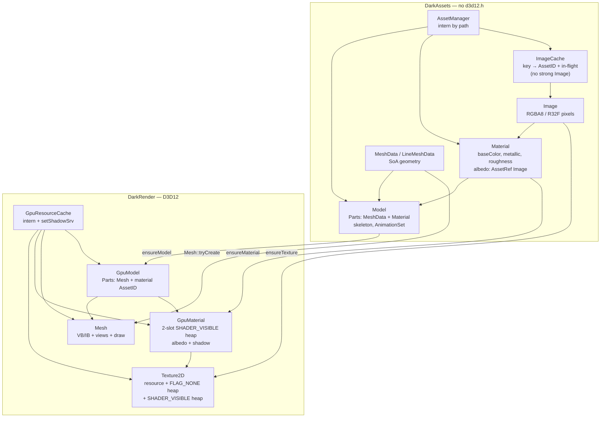
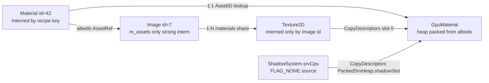
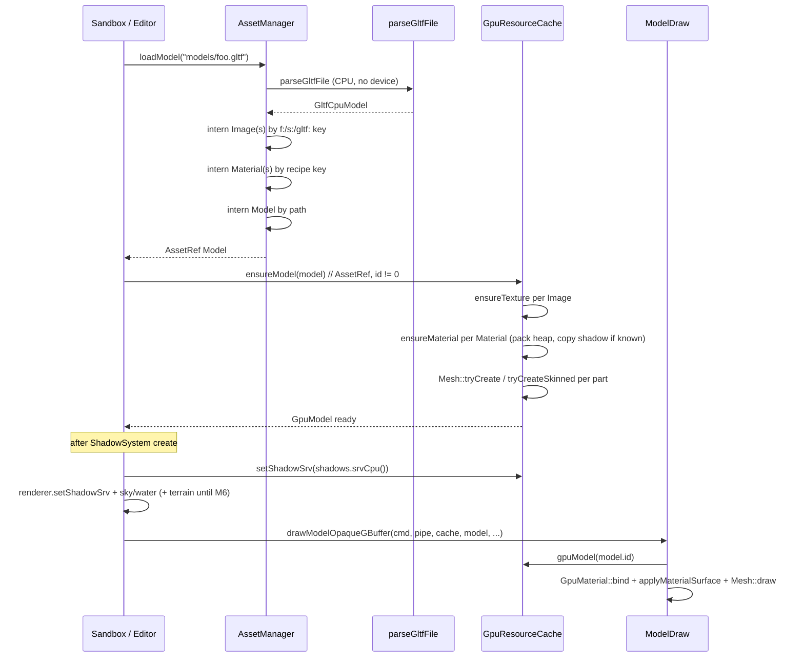

# Platform-agnostic assets vs D3D12 GPU artifacts

| Field | Value |
|-------|--------|
| **Title** | Platform-agnostic assets vs D3D12 GPU artifacts |
| **Author** | DarkEngine6 |
| **Date** | 2026-09-12 |
| **Status** | Draft (rev 5) |
| **Area** | `Assets/`, `Render/`, `Terrain/`, `cmake/DarkEngineTargets.cmake`, Sandbox, Editor, UnitTests |
| **Audience** | Engine, Sandbox, and Editor owners who already know this tree |
| **Scope** | Design only. No production implementation in this document. |

---

## Overview

DarkEngine6 stores **content** (PBR recipes, CPU mesh geometry, glTF graphs, decoded pixels) and **D3D12 bind objects** (committed resources, vertex/index views, shader-visible descriptor heaps) in the same types: `Material`, `Mesh`, `Model`, `Texture2D`, `TerrainMaterial`. `Assets/` therefore includes `<d3d12.h>`, `AssetManager::loadModel` requires a live `Renderer`, and unit tests cannot construct a material without a device.

This design splits every content type into a **CPU asset** with no D3D12 types and a **GPU artifact** owned by a renderer-side cache. CPU `Material` / `Model` / `Image` / `MeshData` become serializable, testable, and free of descriptor-heap rules. `GpuMaterial` / `Mesh` / `Texture2D` / `GpuModel` stay in `DarkRender` and are the only types that call `SetDescriptorHeaps`, `CopyDescriptorsSimple`, or `DrawIndexedInstanced`. Shadow-SRV packing, today copy-pasted across `Material`, `TerrainMaterial`, `Model`, `SkyPipeline`, and `WaterPipeline`, is centralized for **asset** heaps in one `GpuResourceCache::setShadowSrv`. Root signatures and shaders do **not** change in v1.

The work is incremental: each PR is independently mergeable. The last PR inverts the CMake DAG so `DarkAssets` no longer links `DarkRender`, and no header under `Assets/` includes `<d3d12.h>`.

---

## Background & Motivation

### What the engine actually does today

Library graph (`cmake/DarkEngineTargets.cmake` ~166–183):

```
DarkFoundation  (Math, Collision, ECS, Core log/paths/UUID)
     ^
     |-- DarkRender   (Render/* + d3d12/dxgi/d3dcompiler/windowscodecs)
     |        ^
     |        `-- DarkAssets  (Assets/*; PUBLIC-links DarkRender because
     |                         Model/TextureCache need Renderer)
     `-- DarkNet
DarkEngine umbrella PUBLIC-links all four and compiles Terrain/Animation/…
```

`DarkRender` already includes `Assets/Model.h` from `Render/ModelDraw.cpp` but **does not** link `DarkAssets` (would cycle). Unresolved symbols resolve at final link. That is the smell this design removes.

#### Material (`Render/Material.h`)

One class is both the PBR recipe and the bind group:

| CPU / content | D3D12 |
|---------------|--------|
| `m_albedo` (`shared_ptr<Texture2D>`) | `ComPtr<ID3D12DescriptorHeap> m_srvHeap` (SHADER_VISIBLE, `MeshPipeline::kSrvCount` = 2) |
| `m_baseColor[4]`, `m_metallic`, `m_roughness` | `D3D12_GPU_DESCRIPTOR_HANDLE m_gpuHandle` |
| `applySurface` into `MeshFrameConstants` / `MeshGBufferConstants` | `bind(ID3D12GraphicsCommandList*)`, `packSrvHeap`, `setShadowSrv` |

`isValid()` requires **both** a valid albedo **and** `m_srvHeap != nullptr`. Create methods all take `Renderer&` and pack immediately. The header includes `<d3d12.h>` and `Render/MeshPipeline.h` (for the constant structs).

`packSrvHeap` (`Material.cpp` ~29–48) creates a 2-slot shader-visible CBV_SRV_UAV heap, `CopyDescriptorsSimple`s the albedo from `Texture2D::cpuHandle()`, and leaves slot 1 empty for the CSM array. `setShadowSrv` copies into slot 1. This is the same recipe as `TerrainMaterial` (6 slots: 4 layers + splat + shadow).

#### Mesh (`Render/Mesh.h`)

CPU vertex **layouts** (`MeshVertex`, `SkinnedMeshVertex`) and GPU **resources** (`ID3D12Resource` VB/IB, `D3D12_VERTEX_BUFFER_VIEW` / `D3D12_INDEX_BUFFER_VIEW`, `draw`) live together. The actual source geometry is already separate: `MeshData` in `Render/MeshGen.h` is SoA (`positions`, `normals`, `uvs`, `indices`, optional `jointPacked` / `weights`) with **no** D3D12 types. `Mesh::tryCreate` interleaves SoA → `MeshVertex` and uploads with a blocking `renderer.waitForGpu()` (`Mesh.cpp` ~44–127).

`GltfLoader.h` includes `MeshGen.h` **only** to get `MeshData`.

#### Model (`Assets/Model.h`)

`Model` is `AssetType::Model`, interned by `AssetManager::loadModel(Renderer&, virtualPath)`. Each `Part` owns a GPU `Mesh`, an `AssetRef<Material>` (mixed), `localToRoot`, and **duplicate** `roughness` / `metallic` / `translucent` / `skinned` flags. `createFromParsed` uploads every primitive immediately and constructs a `Material` per primitive. `setShadowSrv` walks both opaque and translucent parts.

The CPU parse already exists and is tested: `GltfCpuModel` / `GltfCpuPrimitive` in `Assets/GltfLoader.h`, `parseGltfFile`, `UnitTests/Assets/GltfLoaderTests.cpp`. After parse, `MeshData` is discarded.

#### Texture2D (`Render/Texture2D.h`)

Decode (WIC PNG/JPEG/BMP) + default-heap resource + **two** descriptor heaps:

- `m_cpuSrvHeap` — `D3D12_DESCRIPTOR_HEAP_FLAG_NONE`. `cpuHandle()` is a legal `CopyDescriptors` **source**.
- `m_srvHeap` — `SHADER_VISIBLE`. `gpuHandle()` / `bind()` use this. Shader-visible CBV_SRV_UAV heaps are CPU **write-only**.

This dual-heap rule is load-bearing. D3D12 debug layer error **#654** fires if anything copies **from** a shader-visible heap. `Material::packSrvHeap` and `TerrainMaterial::packSrvHeap` correctly copy from `cpuHandle()`. Any GPU bind layer **must** preserve that.

`Texture2D::bind` also calls `SetDescriptorHeaps` for its **own** 1-slot heap. Mesh draws never use that path; they use the packed material heap. HUD / loading screen / particles still call `Texture2D::bind` directly.

#### TextureCache (`Assets/TextureCache.h`)

Thread-safe intern of `shared_ptr<Texture2D>` keyed by normalized path / solid RGBA / soft-circle size. Failed loads are not cached. GPU uploads take `m_gpuMutex` because `Renderer` uploads are not thread-safe. Unit tests (`TextureCacheTests.cpp`) already construct **empty** `Texture2D` objects with no device — the intern logic is CPU, the values are GPU.

#### TerrainMaterial (`Terrain/TerrainMaterial.h`)

Same mixed pattern: 4 `Texture2D` layers + splat + `TerrainLayerDesc` tiling + 6-slot shader-visible heap + `setShadowSrv` + `bind`. `TerrainWorld` is already closer to the target: each `TerrainChunk` has `MeshData cpu` **and** `Mesh gpu` (`Terrain/Terrain.h` ~43–53).

#### Shadow SRV fan-out

Hosts must remember to patch every packed heap after CSM creation:

```1980:1989:Sandbox/SandboxApp.cpp
    m_terrainMaterial.setShadowSrv(renderer().device(), m_shadows.srvCpu());
    m_cubeMaterial->setShadowSrv(renderer().device(), m_shadows.srvCpu());
    m_treeTrunkMaterial->setShadowSrv(renderer().device(), m_shadows.srvCpu());
    m_treeMaterial->setShadowSrv(renderer().device(), m_shadows.srvCpu());
    m_aiMaterial->setShadowSrv(renderer().device(), m_shadows.srvCpu());
    m_packMaterial->setShadowSrv(renderer().device(), m_shadows.srvCpu());
    m_lanternMaterial->setShadowSrv(renderer().device(), m_shadows.srvCpu());
    renderer().setShadowSrv(m_shadows.srvCpu());
    m_skyPipeline.setShadowSrv(renderer().device(), m_shadows.srvCpu());
    m_waterPipeline.setShadowSrv(renderer().device(), m_shadows.srvCpu());
```

Plus `model->setShadowSrv` on every Sandbox glTF load (`SandboxApp.cpp` ~948, ~983). Editor does **not** call `loadModel` / `model->setShadowSrv`; it only registers `m_propMaterial` / `m_groundMaterial` and patches those two plus `renderer().setShadowSrv` (`EditorAppInit.cpp` ~206–208). `Renderer::setShadowSrv` only updates `SceneBuffers`' lighting heap (deferred lighting pass), **not** per-material heaps. A newly loaded model drawn in forward/transparent without a follow-up material-heap patch samples a stale/empty shadow slot.

#### Why the root table is packed this way

`MeshPipeline` root layout (`Render/MeshPipeline.h` ~59–63):

- `kRootConstants = 0` — 32-bit root constants (`MeshFrameConstants` 48 floats, or `MeshGBufferConstants` 54 floats)
- `kRootAlbedoSrv = 1` — descriptor table
- `kRootShadowCbv = 2` — shadow cascade matrices CBV
- `kSrvCount = 2` — **albedo + shadow map** in one table

D3D12 allows **one** CBV_SRV_UAV heap via `SetDescriptorHeaps` at a time. A descriptor table cannot span heaps. Therefore albedo and the CSM SRV **must** live in the same shader-visible heap for the forward mesh pass. G-buffer mesh PSOs only bind **1** SRV (`MeshPipeline.cpp` ~40: `gbuffer ? 1u : kSrvCount`) because lighting samples the shadow map later from `SceneBuffers::lightingHeap()`. v1 still packs 2 slots so one `GpuMaterial` serves both passes (G-buffer ignores slot 1).

This is **not** bindless. Changing it is a root-signature / shader / `SetDescriptorHeaps` sweep across mesh, skinned mesh, terrain, sky, and water. Out of v1.

### Pain points

1. **Untestable content.** `Material`, `Model`, and `Texture2D` cannot be unit-tested without a D3D12 device. `GltfCpuModel` and `MeshData` already prove the opposite is possible.
2. **No serialization.** A material is not data; it is a COM heap. Editor/Sandbox author materials only by calling `createSolid` / `createFromAlbedoPath` with a `Renderer`.
3. **Descriptor rules leaked into assets.** `Assets/Model.h` includes `Render/Material.h` → `<d3d12.h>`. `PathChase.h` includes both `Material.h` and `<d3d12.h>`. Sandbox/Editor cannot mention a material without pulling the D3D12 SDK.
4. **Shadow packing is a distributed protocol.** Miss one `setShadowSrv` and forward receivers are unshadowed. There is no single registry of packed heaps.
5. **Wrong dependency direction.** `DarkAssets` links `DarkRender`. Content should not depend on the GPU backend. The existing cycle workaround (Render includes Assets headers, does not link Assets) is the inverse of a healthy DAG.
6. **Future backends / descriptor refactors rewrite assets.** A bindless heap, a Vulkan port, or even moving packed heaps into a global ring requires editing `Material` / `Model` / `TerrainMaterial`.

---

## Goals & Non-Goals

### Goals (v1)

1. **CPU types with zero `<d3d12.h>`:** `Material`, `Model`, `Image`, `MeshData` / `LineMeshData`. `Assets/**/*.h` must not include `<d3d12.h>` or `wrl/client.h` after the final PR.
2. **GPU types stay in `DarkRender`:** `Texture2D`, `Mesh`, `GpuMaterial`, `GpuModel`, `LineMesh`. They are the only types that create heaps, views, or draw.
3. **One upload/bind service:** `GpuResourceCache`, owned by `Renderer`, creates GPU artifacts from CPU assets, interns them by **registered** `AssetID` (`ensure*` fails on `NULL_ASSET`), and is the **only** place that patches shadow SRVs into **asset** packed heaps (`PackedSrvHeap` records, per-heap `shadowSlot`). It does **not** replace `Renderer::setShadowSrv` (SceneBuffers lighting heap) or sky/water pipeline heaps.
4. **Preserve dual-heap CopyDescriptors legality** on `Texture2D::cpuHandle()`. Packed heaps copy **from** FLAG_NONE sources only.
5. **No shader / root-signature changes.** `MeshPipeline::kSrvCount == 2`, `TerrainPipeline::kSrvCount == 6` stay. Forward still packs albedo+shadow.
6. **Call sites stay reviewable.** Hosts still hold `AssetRef<Material>` / `AssetRef<Model>`. Draw goes through `GpuResourceCache` (or a one-line bind helper). No ECS component field changes (`MeshComponent.matAssetID`, `ModelComponent.modelAssetID` remain CPU asset ids).
7. **Tests without a device:** PBR defaults, glTF → `Material` mapping, `MeshData` validation, `Image` solid/RGBA, `AssetManager::loadModel` with no `Renderer`.
8. **No C++ exceptions.** Bool returns, `DE_LOG_ERROR` / `DE_LOG_FATAL`, `DE_ASSERT`. `noexcept` on special members is fine.
9. **Independently mergeable PRs.** See [PR Plan](#pr-plan). No “rewrite the renderer” PR.

### Non-goals (v1)

- Bindless / global shader-visible heap / GPU descriptor rings.
- Changing `MeshPipeline` / `SkinnedMeshPipeline` / `TerrainPipeline` root signatures or HLSL.
- Async / copy-queue uploads; `waitForGpu` on mesh/texture create stays (known debt).
- Vulkan / other backends. The split **enables** them; it does not add an RHI.
- Serializing materials to JSON on disk (the CPU type **makes it possible**; a sidecar format is a follow-up).
- Splitting `LineMesh`, `ParticleRenderer`, `BloodSplatPool`, HUD textures, `LoadingScreen`, ImGui, `SkyPipeline`, `WaterPipeline` descriptor heaps. Those are renderer/pass objects, not content assets. `LineMeshData` does move with `MeshData`.
- Rewriting `TerrainWorld` LOD / welding. `TerrainMaterial` GPU split is an explicit follow-up PR that **reuses** the v1 cache API.
- Dropping WIC or making image decode non-Windows. DarkEngine6 is MSVC/Windows. Decode may live in Assets (WIC is not D3D12).
- Unifying `Texture2D::bind` (1-slot heap) with packed material heaps. HUD keeps `Texture2D::bind`.

---

## Key Decisions

| # | Decision | Rationale |
|---|----------|-----------|
| D1 | **Invert the library DAG:** `DarkFoundation` ← `DarkAssets` ← `DarkRender` ← `DarkEngine`. | Content must not link D3D12. Render already consumes `Model`; once Assets stops including Render, DarkRender can PUBLIC-link DarkAssets and the cycle workaround goes away. |
| D2 | **Keep the name `Material` for the CPU PBR recipe.** GPU bind object is `GpuMaterial`. Keep the name `Mesh` for the GPU VB/IB object. CPU geometry stays `MeshData`. Keep the name `Model` for the CPU asset. GPU is `GpuModel`. Keep the name `Texture2D` for the GPU texture. CPU pixels are `Image`. | Matches existing mental model: “a material is data, a mesh is what you draw.” Renaming `Mesh` → `GpuMesh` would touch every `mesh.draw` in Sandbox/Editor/Terrain/Water. `MeshData` already exists. |
| D3 | **1 CPU `Material` : 1 `GpuMaterial`.** Tint / metallic / roughness stay on the CPU object and are pushed through `applyMaterialSurface` into root constants every draw. No per-pass GPU variants. Shadow is **not** a second `GpuMaterial`; it is `PackedSrvHeap::shadowSlot` of the same packed heap, patched in place. Two primitives share a `Material` / heap **only** when the full recipe matches (D16). | Matches today at the GPU-heap level. G-buffer only samples slot 0; one heap still works. Instancing with different tints that share an albedo still needs **distinct** CPU materials (and heaps) unless the whole recipe is identical. |
| D4 | **Do not change root signatures in v1.** Keep per-material (and per-terrain-material) packed shader-visible heaps. Centralize **who packs them**, not **how the pipeline binds**. | Bindless is the right long-term fix for shadow fan-out, but it is a different project (every `SetDescriptorHeaps`, every table, debug layer #654, ImGui heap). v1 removes the coupling without touching HLSL. |
| D5 | **`GpuResourceCache` is owned by `Renderer`** (`Renderer::gpuResources()`), constructed after a valid device. | GPU lifetime is device lifetime. `waitForGpu` / teardown already live on `Renderer`. Application keeps exposing `assets()` (CPU) and `renderer()` (GPU). Forward-declare in `Renderer.h` so the header does not include every asset type. |
| D6 | **`AssetManager` load APIs drop `Renderer&`.** `loadModel(virtualPath)`, `loadImage(virtualPath)`, `loadSolidImage(...)`. GPU upload is `gpuResources().ensureModel(model)` (hosts, or a Render-side convenience `loadAndUploadModel`). | This is the actual dependency break. A `loadModel(Renderer&, path)` overload that secretly uploads would keep DarkAssets needing Renderer. |
| D7 | **Split `Texture2D` into `Image` (CPU pixels) + `Texture2D` (GPU).** WIC decode moves to `Image`. **One strong intern:** `AssetManager::m_assets` holds the only `shared_ptr<Image>`. `ImageCache` maps `f:`/`s:`/`c:`/`gltf:` → `AssetID` plus in-flight waiters — it does **not** hold `shared_ptr<Image>`. `loadImage` is the `loadModel` pattern (key hit returns the existing registered instance; miss decodes, `registerAsset` once, store id). `GpuResourceCache` interns `Texture2D` **only** by `Image::id`. HUD/particles never enter the GPU texture cache. | Two strong maps (ImageCache + `m_assets`) would pin every interned Image at `use_count >= 2`, so `collectGarbage` (`use_count == 1`) and cache `collectUnused` could never drop them. That is not how `TextureCache` works today (`Texture2D` is not in `m_assets`). |
| D8 | **`applySurface` leaves `Material`.** Free functions in `Render/MaterialSurface.h` read CPU getters and write `MeshFrameConstants` / `MeshGBufferConstants`. | Shader constant layout is a backend concern. `Material` must not include `MeshPipeline.h`. G-buffer still writes 0 into `color[3]` (emissive) there. |
| D9 | **`MeshVertex` / `SkinnedMeshVertex` stay in `Render/Mesh.h`.** They are the interleaved GPU upload format, not content. `packBlendWeightsUnorm8` stays with them. | `MeshData` is SoA and already the portable geometry. Interleaving is an upload step. Existing `SkinnedMeshVertexTests` keep including `Render/Mesh.h` (POD, no device). |
| D10 | **TerrainMaterial is in scope as a follow-up PR, not v1.** v1’s `GpuResourceCache::setShadowSrv` walks a list of `PackedSrvHeap` records (each has `shadowSlot` + `srvCount`). M6 only **appends** 6-slot terrain records. LineMesh / particles / HUD are out. | Terrain is the same bug but a different pipeline (`kSrvCount = 6`) and lives in `DarkEngine`, not `DarkAssets`. A mesh-only “slot 1” walk would force a breaking cache rewrite in M6. |
| D11 | **Keep decoded `Image` pixels after GPU upload in v1.** | Content is small (a handful of PNGs + glTF embeddings). Editor/debug and tests need bytes. Drop-after-upload can be a later memory pass. |
| D12 | **Transitional bridge in PR-M2 and PR-M3b only:** `Material` may hold `unique_ptr<GpuMaterial>` and forward `bind` / `setShadowSrv`. PR-M3c deletes `m_gpu`, `bind`, and `setShadowSrv` from `Material`, and **`Model::createFromParsed` interns + `ensureMaterial`s each primitive** while `Part.mesh` is still a GPU `Mesh`. Host `model->setShadowSrv` dies in **M3c**, not M3b. `create*(Renderer&)` wrappers stay until PR-M5. | After M3c a glTF `Material` has no `m_gpu`. If intern/`ensureMaterial` waited until M4, forward draws would sample an empty shadow slot (`ensure*` rejects `NULL_ASSET`). M3b keeps `model->setShadowSrv` because `Material::setShadowSrv` still exists. |
| D13 | **`ensure*` requires `id != NULL_ASSET`.** Every `Image` / `Material` / `Model` is interned via `AssetManager` **before** GPU upload. Today only `m_cubeMaterial` (Sandbox ~1971) and Editor prop/ground are `registerAsset`’d; tree/pack/lantern/tracer/ai materials and every glTF primitive `Material` have `id == 0`. | `AssetID` is `uint64_t` with `NULL_ASSET = 0`. Keying the GPU cache by id without this rule merges every unregistered object into `m_materials[0]`. |
| D14 | **GPU lifetime is `AssetWeakRef` + destroy order, not TextureCache `use_count`.** Each cache entry stores a weak to the CPU asset. `collectUnused()`: drop expired models; drop expired materials (**unregister `PackedSrvHeap*` from `m_packedHeaps`, then destroy `unique_ptr`**); drop eligible textures. `clear()` clears `m_packedHeaps` first. `GpuModel::Part` stores `AssetID materialId` only. GPU objects do **not** keep CPU assets alive. | `m_packedHeaps` is non-owning pointers into `GpuMaterial`. Leaving them after `unique_ptr` delete is UAF on the next `setShadowSrv`. |
| D15 | **Albedo is immutable after the first successful `ensureMaterial`.** `baseColor` / metallic / roughness / `alphaMode` may change every draw via `applyMaterialSurface`. v1 has no `rebuildMaterial`. | Slot 0 is packed once. `ensureMaterial` that no-ops when already valid would leave a stale albedo SRV if `albedo()` were swapped. Editor albedo hot-swap is a new `Material` id or a later `rebuildMaterial`. |
| D16 | **Intern `Material` by full recipe, not by albedo image.** Key = albedo `Image::id` + baseColor[4] + metallic + roughness + `alphaMode`. Intern `Image` / `Texture2D` by file/memory/solid/`gltf:` key only. | glTF primitives can share a baseColor texture and differ in metallic/roughness/alpha (`GltfCpuPrimitive`). Today each primitive gets its own `Material` (`Model.cpp` ~75–87) while the albedo `Texture2D` is interned. Intern-by-image would apply the last recipe to every part. |
| D17 | **`GpuResourceCache` is render-thread only** (no `m_gpuMutex`). `ImageCache` keeps single-flight CPU decode and `key → AssetID` (no strong `Image`, no GPU mutex). | Today `TextureCache` is thread-safe *and* serializes GPU uploads. After the split those are different objects. Do not move intern waiters onto the GPU cache. Off-thread `ensure*` is a follow-up. |

---

## Proposed Design

### Target architecture



### Identity and lifetime

**Hard rule:** `GpuResourceCache::ensureTexture` / `ensureMaterial` / `ensureModel` return `false` and `DE_LOG_ERROR(LogCategory::Render, ...)` if `id == NULL_ASSET`. They never insert at key `0`. Every CPU object that will be uploaded is interned first (`loadImage` / `internMaterial` / `loadModel`).



- **Material ↔ GpuMaterial:** 1:1, keyed by `Material::id` (**never** `NULL_ASSET`). Created on `ensureMaterial`. CPU intern key is the **recipe** (D16), not the albedo path. Destroyed in `collectUnused` when the `AssetWeakRef<Material>` has expired (CPU asset gone). GPU does **not** keep the CPU `Material` alive.
- **Image ↔ Texture2D:** **One strong intern** — `AssetManager::m_assets` is the only `shared_ptr<Image>` (D7). `ImageCache` is **not** a second owner:
  - Keys (same strings as today): `f:` + `normalizePath`; `s:r,g,b,a`; `c:size`; `gltf:{normalizedGltfPath}:{imageIndex}` (today `Model.cpp` ~62–64).
  - Durable intern is `m_pathToID` + `m_assets` (**same tables as `loadModel`**). `ImageCache` owns **only** key-string helpers (`fileKey` / `solidKey` / `softCircleKey` / glTF key) and in-flight waiters. No `shared_ptr<Image>` in ImageCache.
  - `loadImage` / `loadSolidImage` / `loadMemoryImage` match `loadModel`: lock, `m_pathToID` hit → `getAs<Image>(id)` if still in `m_assets`; else decode once (single-flight), `registerAsset` **once** with that key. Never `registerAsset` on a hit.
  - `collectGarbage` (`use_count == 1`) drops Images and `erasePathEntriesLocked` already scrubs the key. GPU `AssetWeakRef<Image>` then expires.
  - `GpuResourceCache` keys `Texture2D` **only** by `Image::id`. HUD/particles call `Texture2D::createFromImage` on a stack `Image` and **do not** enter this cache.
- **Model ↔ GpuModel:** 1:1, keyed by `Model::id` (`loadModel` already registers). Each `GpuModel::Part` holds a `Mesh` (unique per part; geometry is not interned in v1) and `AssetID materialId` only. Draw looks up `gpu.material(part.materialId)`; null → skip bind (same as a missing material today). Two primitives with the same recipe share one `GpuMaterial` heap because they share one interned `Material` id.
- **Shadow:** **not** a GPU variant. `GpuResourceCache` holds `std::vector<PackedSrvHeap*>` (non-owning pointers into `GpuMaterial` / later `GpuTerrainMaterial`) and `D3D12_CPU_DESCRIPTOR_HANDLE m_shadowCpu`. `setShadowSrv` copies into each record’s `shadowSlot` (2-slot mesh heaps use 1; 6-slot terrain heaps use 5). This is **not** `Renderer::setShadowSrv` (SceneBuffers lighting heap) and does **not** patch sky/water pipeline heaps. `ensure*` after a shadow handle is known copies immediately, so late-loaded glTFs are not unshadowed.
- **`collectUnused` protocol (only one):**
  1. Each GPU map entry stores `AssetWeakRef<T>` next to the GPU object (`Image` / `Material` / `Model`).
  2. `collectUnused()` takes **no** `AssetManager&`. Drop when `weak.expired()`.
  3. Order: drop expired **models**; drop expired **materials** — `unregisterPackedHeap(&gpu->packedHeap())` (swap-remove by pointer identity) **then** destroy `unique_ptr<GpuMaterial>`; drop eligible **textures**.
  4. Textures are `shared_ptr<Texture2D>` so SpriteSheet can hold a copy. After the Image weak expires, also drop if `use_count() == 1` (only the GPU cache remains). A live `SpriteSheet` keeps the GPU texture even if the CPU `Image` was collected.
  5. `clear()`: `m_packedHeaps.clear()` **first**, then the three maps. `Stats::packedHeaps == m_packedHeaps.size()`.
  6. Call site: there is **no** production `collectGarbage` tick today (`AssetManager::collectGarbage` is tests + API). When a host adds one: `assets().collectGarbage(); renderer().gpuResources().collectUnused();` in that order. `Renderer` dtor / `gpuResources().clear()` drops everything on teardown.
- **In-flight GPU:** v1 keeps blocking `waitForGpu` on create, so destroying a `Texture2D` / `Mesh` immediately after upload is safe. When (later) uploads become async, the cache must defer destroy by `Renderer::kFrameCount` (2). Do not invent a frame-resource tracker in v1.

`Model::Part` **drops** the duplicate `roughness` / `metallic` fields. They live only on `Material`. `translucent` and `skinned` stay on the part (draw-list membership / PSO choice). `Part.translucent = (material->alphaMode() == MaterialAlphaMode::Blend)` — see alpha-mode mapping below.

### Data flow: glTF load to G-buffer draw



### CPU types

#### `MeshData.h` (moved out of `Render/MeshGen.h`)

Move `MeshData` and `LineMeshData` verbatim. **PR-M1:** `Render/MeshData.h` (still DarkRender, no `<d3d12.h>`). **PR-M7:** move to `Assets/MeshData.h`. Drop the unused `#include <stdexcept>` (only leftover commented `throw`s in `MeshGen.cpp`). `Render/MeshGen.h` includes that header and keeps the generators. `Assets/GltfLoader.h` includes `MeshData.h` instead of `MeshGen.h`.

No D3D12. Already tested by `UnitTests/Geometry/MeshGenTests.cpp` and `GltfLoaderTests.cpp`.

#### `Assets/Image.h`

```cpp
enum class ImageFormat : uint8_t
{
    RGBA8 = 0,
    R32F  = 1,
};

class Image : public Asset
{
public:
    Image();

    bool createFromFile(const std::filesystem::path& path);
    bool createFromMemory(const void* bytes, size_t byteCount); // PNG/JPEG/BMP via WIC
    bool createSolidColor(uint8_t r, uint8_t g, uint8_t b, uint8_t a = 255);
    bool createSoftCircle(uint32_t size = 64);
    bool createSoftStreak(uint32_t size = 64);
    bool createFromRGBA(const uint8_t* rgba, uint32_t width, uint32_t height, uint32_t rowPitchBytes);
    bool createFromR32Float(const float* samples, uint32_t width, uint32_t height, uint32_t rowPitchBytes);

    bool     valid() const; // width/height > 0 and pixels size matches
    uint32_t width() const;
    uint32_t height() const;
    uint32_t rowPitchBytes() const;
    ImageFormat format() const;
    const uint8_t* pixels() const;
    // ...
};
```

- `type = AssetType::Texture2D` (existing enum; do not add `Image` to the enum in v1 — ECS/debug already say Texture2D).
- WIC helpers move out of `Texture2D.cpp` into `Assets/Image.cpp` (same `EnsureCom` / `IWICImagingFactory` path). **PR-M5:** `DarkAssets` PUBLIC-links `windowscodecs` **and** `ole32` (`CoInitializeEx` / `CoCreateInstance` — DarkEngine’s `ole32` does not propagate backward after M7). DarkRender does **not** keep `windowscodecs` once WIC is gone from `Texture2D.cpp`. This is **Windows**, not **D3D12**.
- `Image::createFromR32Float` is optional CPU storage. `Texture2D::createFromR32Float` **stays** in Render (Terrain height `Terrain.cpp` ~205, fog dummy `Renderer.cpp` ~621) with **no** WIC.
- File/memory decode tests may skip if `CoCreateInstance` fails. `createSolidColor` / `createFromRGBA` do not CoInit.
- No `Renderer`. No heaps.
- `loadImage` / `loadSolidImage` / `loadMemoryImage` follow the `loadModel` intern: `ImageCache` key → `AssetID` → `m_assets`. Callers never pass an unregistered `Image` to `ensureTexture`. Do not also stash a strong `Image` in `ImageCache`.

#### `Assets/Material.h`

```cpp
enum class MaterialAlphaMode : uint8_t
{
    Opaque = 0,
    Mask,
    Blend,
};

class Material : public Asset
{
public:
    Material();

    // Content constructors — no Renderer, no descriptor heaps.
    bool createFromAlbedoImage(AssetRef<Image> albedo, float r = 1.f, float g = 1.f, float b = 1.f, float a = 1.f);
    bool createFromAlbedoPath(AssetManager& assets, const std::string& virtualAlbedoPath,
                              uint8_t fallbackR = 64, uint8_t fallbackG = 166, uint8_t fallbackB = 242, uint8_t fallbackA = 255);
    bool createSolid(AssetManager& assets, uint8_t r, uint8_t g, uint8_t b, uint8_t a = 255);

    void  setMetallicRoughness(float metallic, float roughness);
    float metallic() const;
    float roughness() const;
    void  setBaseColor(float r, float g, float b, float a = 1.0f);
    const float* baseColor() const;
    void  setAlphaMode(MaterialAlphaMode mode);
    MaterialAlphaMode alphaMode() const;

    bool isValid() const; // albedo present and Image::valid(); NO heap check
    uint64_t sortKey() const; // still `id` (low bits)

    const AssetRef<Image>& albedo() const;
};
```

`createFromAlbedoPath` uses `assets.loadImage` and on failure `loadSolidImage` — same fallback behavior as today (`Material.cpp` ~62–100), minus `packSrvHeap`. Create methods fill CPU fields only; they do **not** `registerAsset` (no `shared_ptr` from `this`). The caller (host or `Model::createFromParsed`) **must** pass the `AssetRef<Material>` to `internMaterial` before `ensureMaterial`.

**Alpha mode (wired, not ornamental):**

| `cgltf_alpha_mode` | `MaterialAlphaMode` | `Part.translucent` | Draw |
|--------------------|---------------------|--------------------|------|
| `opaque` (default) | `Opaque` | false | G-buffer / deferred opaque |
| `mask` | `Mask` | false | **Opaque** in v1 (no clip-alpha PSO; current engine behavior — mask is lost today) |
| `blend` | `Blend` | true | Forward transparent list |

`GltfCpuPrimitive` gains `MaterialAlphaMode alphaMode{}` (loader sets it next to `translucent` at `GltfLoader.cpp` ~572). `createFromParsed` copies `alphaMode` onto the interned `Material` and sets `Part.translucent = (mode == Blend)`. Intern keys include `alphaMode`. G-buffer vs forward selection still reads `Part.translucent`, not the material, so draw-list membership stays a bool.

**Albedo immutability (D15):** after the first successful `ensureMaterial`, do not replace `albedo()`. Changing `baseColor` / metallic / roughness / `alphaMode` is allowed and is consumed by `applyMaterialSurface` / draw-list flags on the CPU object. v1 has no `rebuildMaterial`; an Editor albedo swap is a new interned `Material` (new recipe key).

**Deleted from this type:** `bind`, `setShadowSrv`, `packSrvHeap`, `applySurface` overloads that take D3D structs, `m_srvHeap`, `m_gpuHandle`, any `ID3D12*` parameter.

#### `Assets/Model.h`

```cpp
class Model : public Asset
{
public:
    struct Part
    {
        MeshData           mesh;       // CPU SoA; retained (today it is discarded after upload)
        AssetRef<Material> material;
        Math::Matrix4f     localToRoot;
        bool               translucent = false;
        bool               skinned     = false;
    };

    bool createFromFile(AssetManager& assets, const std::filesystem::path& path);
    bool createFromParsed(AssetManager& assets, const GltfCpuModel& cpu, const std::filesystem::path& path);

    const std::vector<Part>& opaque() const;
    const std::vector<Part>& translucent() const;
    const Math::AABox3f&     bounds() const;
    bool valid() const; // has at least one part with non-empty MeshData
    // skeleton / AnimationSet accessors unchanged
};
```

**Deleted:** `setShadowSrv`, GPU `Mesh` members, `Renderer&` on create.

`createFromParsed` algorithm per primitive:

1. Intern albedo `Image` (`loadFile` / `loadMemoryImage` with key `gltf:{normalizePath(path)}:{imageIndex}` / `loadSolidImage` from `baseColor` as today).
2. Build a `Material`, `createFromAlbedoImage` + `setMetallicRoughness` + `setBaseColor` (same solid-tint vs textured-tint rule as `Model.cpp` ~76–86) + `setAlphaMode(src.alphaMode)`.
3. `assets.internMaterial(mat, materialRecipeKey(*mat))` — **not** intern-by-image. Two primitives share a `Material` iff albedo id + baseColor + metallic + roughness + alphaMode match. They may share an `Image` without sharing a `Material`.
4. Copy `MeshData`, set `Part.translucent` / `skinned` / `localToRoot`.
5. Bounds as today (skinned inflated 1.25×).

It does **not** call `Mesh::tryCreate`.

Recipe key helper (Assets, no D3D12):

```cpp
// "m:{albedoId}:{r}:{g}:{b}:{a}:{metallic}:{roughness}:{alphaMode}"
// %.9g so intern is stable for glTF floats already in the primitive.
std::string materialRecipeKey(const Material& m);
```

Retaining `MeshData` costs RAM. Sandbox models are tiny (one animated glTF + a few static). If a 50k-vert character lands later, add an opt-in `ModelUploadFlags::DropCpuMesh` then. v1 keeps CPU mesh so tests and the Editor can inspect / rebuild GPU without re-parsing.

`GltfCpuPrimitive` stays as the **parser output** (includes `albedoFile` / `albedoBytes` / `imageIndex` / `alphaMode` before intern). `Model::Part` is the **asset** (Image already interned). Do not collapse them in v1; the extra copy is obvious and testable.

#### `AssetManager` (CPU-only loads)

```cpp
AssetRef<Image>    loadImage(const std::string& virtualPath);          // key → id → m_assets
AssetRef<Image>    loadSolidImage(uint8_t r, uint8_t g, uint8_t b, uint8_t a = 255);
AssetRef<Image>    loadMemoryImage(const std::string& key, const void* bytes, size_t byteCount);
AssetRef<Model>    loadModel(const std::string& virtualPath);          // no Renderer
AssetRef<Material> internMaterial(AssetRef<Material> mat, const std::string& cacheKey = {});
```

`internMaterial` is **mandatory**, not optional sugar. It is the only way a `Material` gets `id != 0`. **Idempotent.** Algorithm:

1. Null `mat` → empty ref + `DE_LOG_ERROR`.
2. If `mat->id != NULL_ASSET` **and** `cacheKey` is empty → return `mat` (do **not** `allocID` again).
3. If `cacheKey` is non-empty and `m_pathToID` hits → return the existing `getAs<Material>(id)` (do **not** `registerAsset`; if that id is gone, scrub the mapping and fall through).
4. If `mat->id != NULL_ASSET` **and** `cacheKey` is non-empty and a miss → insert `m_pathToID[cacheKey] = mat->id` only; return `mat`. Never overwrite `id`.
5. Else `registerAsset(mat, cacheKey)` once.

Hosts must **not** also `registerAsset` the same material (today Sandbox does both for `m_cubeMaterial` ~1971 — after this, `internMaterial` only). Empty `cacheKey` is for one-off authored solids; pass `materialRecipeKey(*mat)` when sharing is desired (glTF, M4+).

`loadTexture(Renderer&, ...)` / `loadSolidTexture` / `loadModel(Renderer&, ...)` **go away** only after SpriteSheet and Model call sites compile against the replacements (PR-M5 / PR-M4). DarkRender provides:

```cpp
// Render/GpuUpload.h — convenience for hosts, not on AssetManager
AssetRef<Model> loadAndUploadModel(Renderer& r, AssetManager& assets, const std::string& virtualPath);
// SpriteSheet / 2D: loadImage + ensureTexture + shared_ptr from the GPU cache.
std::shared_ptr<Texture2D> loadAndUploadTexture(Renderer& r, AssetManager& assets, const std::string& virtualPath);
```

`textureCache()` is renamed `imageCache()` in the Image PR (`ImageCache`). Key helpers + single-flight + `key → AssetID`; **no** strong `Image`, **no** `m_gpuMutex`. `TextureCacheTests::CollectUnusedDropsOrphans` moves to `AssetManagerTests` (drop Image via `collectGarbage` when no external `AssetRef`). Concurrent single-flight tests stay on ImageCache waiters.

`loadAnimationSet` / `loadAnimGraph` are already CPU-only; unchanged.

### GPU types

#### `Texture2D` — GPU only

Remove WIC decode and procedural pixel generation from this class. Remaining API:

```cpp
bool createFromImage(Renderer& renderer, const Image& image);
bool createFromR32Float(Renderer& renderer, const float* samples, uint32_t width, uint32_t height, uint32_t rowPitchBytes);
void bind(ID3D12GraphicsCommandList* cmd, UINT rootParameterIndex) const; // HUD / particles
bool valid() const; // m_resource != nullptr
D3D12_CPU_DESCRIPTOR_HANDLE cpuHandle() const; // FLAG_NONE — CopyDescriptors source
D3D12_GPU_DESCRIPTOR_HANDLE gpuHandle() const;
```

`createFromImage` is today’s `createFromRaw` using `image.pixels()`, format derived from `ImageFormat` (`DXGI_FORMAT_R8G8B8A8_UNORM` / `DXGI_FORMAT_R32_FLOAT`). Dual heaps unchanged. **No WIC** in this class after M5.

`createFromR32Float` stays (Terrain height, fog dummy). HUD may keep `createSolidColor` as a wrapper that builds a **stack** `Image` (id 0) and calls `createFromImage` — that path never hits `GpuResourceCache`.

#### `GpuMaterial` — `Render/GpuMaterial.h`

```cpp
class GpuMaterial
{
public:
    static constexpr UINT kAlbedoSlot = 0;
    static constexpr UINT kShadowSlot = 1; // PackedSrvHeap::shadowSlot for mesh
    static constexpr UINT kSrvCount   = MeshPipeline::kSrvCount; // 2

    bool pack(ID3D12Device* device, const Texture2D& albedo); // fills PackedSrvHeap {srvCount=2, shadowSlot=1}
    void bind(ID3D12GraphicsCommandList* cmd, UINT albedoSrvRootIndex) const;
    bool isValid() const;
    uint64_t cpuAssetId() const;
    PackedSrvHeap&       packedHeap();
    const PackedSrvHeap& packedHeap() const;
};
```

Pack implementation is **today’s** `Material::packSrvHeap` / `bind` moved here. `CopyDescriptorsSimple` **must** use `albedo.cpuHandle()`, never `gpuHandle()`. Shadow copies go through `PackedSrvHeap` via the cache walk, not a public `GpuMaterial::setShadowSrv` in the end state (M2 may keep a forwarder).

#### `GpuModel` — `Render/GpuModel.h`

```cpp
class GpuModel
{
public:
    struct Part
    {
        Mesh             mesh;
        AssetID          materialId = NULL_ASSET; // lookup: gpu.material(materialId)
        Math::Matrix4f   localToRoot;
        bool             translucent = false;
        bool             skinned     = false;
    };
    const std::vector<Part>& opaque() const;
    const std::vector<Part>& translucent() const;
    bool valid() const;
};
```

No skeleton (CPU `Model` / `AnimGraphComponent` keep that). **No raw `GpuMaterial*`** on the part — `collectUnused` can drop materials without dangling pointers. `ModelDraw` looks up `gpu.material(part.materialId)` each draw (tens of parts).

#### `Mesh` — GPU only (already)

`Mesh::tryCreate(Renderer&, const MeshData&, Mesh&)` stays. Header still includes `<d3d12.h>`. After M1, `Mesh.h` includes `Render/MeshData.h`; after M7, `Assets/MeshData.h`.

`LineMesh` stays GPU; it already consumes `LineMeshData`.

### `GpuResourceCache` — `Render/GpuResourceCache.h`

The upload/bind service. Owned by `Renderer` as `std::unique_ptr<GpuResourceCache>`. **Render-thread only** (D17): no intern waiters, no `m_gpuMutex`. `ImageCache` keeps single-flight CPU decode.

```cpp
struct PackedSrvHeap
{
    ComPtr<ID3D12DescriptorHeap> heap;
    D3D12_GPU_DESCRIPTOR_HANDLE  gpu{};
    UINT                         shadowSlot = 1;
    UINT                         srvCount   = 2;
};
bool packFromCpuHandles(ID3D12Device*, PackedSrvHeap& out, const D3D12_CPU_DESCRIPTOR_HANDLE* src, UINT count);
void copyShadow(ID3D12Device*, PackedSrvHeap&, D3D12_CPU_DESCRIPTOR_HANDLE shadowCpu);

class GpuResourceCache
{
public:
    explicit GpuResourceCache(Renderer& renderer);

    // False + DE_LOG_ERROR if !ref || id == NULL_ASSET or pack/upload fails. Never insert key 0.
    // AssetRef so collectUnused can store AssetWeakRef without AssetManager.
    bool ensureTexture(const AssetRef<Image>& image);
    bool ensureMaterial(const AssetRef<Material>& material);
    bool ensureModel(const AssetRef<Model>& model);

    std::shared_ptr<Texture2D> texture(AssetID imageId) const; // SpriteSheet holds this
    GpuMaterial*               material(AssetID materialId) const;
    GpuModel*                  model(AssetID modelId) const;

    void bindMaterial(ID3D12GraphicsCommandList* cmd, const Material& material, UINT albedoSrvRootIndex) const;

    // Walks m_packedHeaps and copyShadow() using each record's shadowSlot.
    // Does NOT patch SceneBuffers, sky, or water. Remembers m_shadowCpu for later ensure*.
    void setShadowSrv(D3D12_CPU_DESCRIPTOR_HANDLE shadowCpu);

    void collectUnused(); // expired weaks; unregister packed heaps before unique_ptr delete
    void clear();         // m_packedHeaps.clear() first, then maps

    struct Stats
    {
        uint32_t textures   = 0;
        uint32_t materials  = 0;
        uint32_t models     = 0;
        uint32_t packedHeaps = 0;
        uint32_t shadowPatches = 0;
    };
    Stats stats() const;

private:
    struct TexEntry { AssetWeakRef<Image>    cpu; std::shared_ptr<Texture2D>   gpu; };
    struct MatEntry { AssetWeakRef<Material> cpu; std::unique_ptr<GpuMaterial> gpu; };
    struct ModEntry { AssetWeakRef<Model>    cpu; std::unique_ptr<GpuModel>    gpu; };

    Renderer* m_renderer = nullptr;
    D3D12_CPU_DESCRIPTOR_HANDLE m_shadowCpu{};
    std::unordered_map<AssetID, TexEntry> m_textures;
    std::unordered_map<AssetID, MatEntry> m_materials;
    std::unordered_map<AssetID, ModEntry> m_models;
    std::vector<PackedSrvHeap*>           m_packedHeaps; // non-owning; MUST unregister before GpuMaterial delete

    void registerPackedHeap(PackedSrvHeap* heap);
    void unregisterPackedHeap(PackedSrvHeap* heap); // swap-remove by pointer identity; no-op if null/missing
};
```

`registerPackedHeap` / `unregisterPackedHeap` are the only mutators of `m_packedHeaps`. Do **not** store `PackedSrvHeap` by value in the vector (would duplicate heaps).

**`ensureMaterial` — M3c (albedo is still `shared_ptr<Texture2D>`, no `Image`):**

1. If `!material` or `material->id == NULL_ASSET`: `DE_LOG_ERROR` + return false.
2. If `m_materials[id]` exists and `gpu->isValid()`, return true (**no repack** — D15).
3. If `!material->albedoPtr()` or `!albedo->valid()`, fail.
4. `GpuMaterial::pack(device, *albedo)` from `Texture2D::cpuHandle()`. `registerPackedHeap(&gpu->packedHeap())`.
5. If `m_shadowCpu.ptr != 0`, `copyShadow` on this heap only.
6. Store `{ AssetWeakRef<Material>(material), gpu }`.

**`ensureMaterial` — M5+ (albedo is `AssetRef<Image>`):**

1–2. Same NULL_ASSET / already-valid checks.
3. If `!material->albedo()` or albedo `id == NULL_ASSET` or `!ensureTexture(material->albedo())`, fail.
4–6. Pack from the interned `Texture2D`, `registerPackedHeap`, copy shadow if known, store weak.

`collectUnused` must call `unregisterPackedHeap` **before** the `unique_ptr<GpuMaterial>` destructor. Same for `GpuTerrainMaterial` in M6. `clear()`: `m_packedHeaps.clear()` first (owners are about to die with the maps).

`ensureModel` walks parts, `ensureMaterial(part.material)` each, `Mesh::tryCreate` / `tryCreateSkinned` into `GpuModel::Part`, copies `part.material->id` into `materialId`. Skip failed primitives and log (same as `Model.cpp` ~51–54). Fail the model only if zero drawable GPU parts.

`bindMaterial` is the one-liner hosts use instead of `material->bind`. Null-safe: missing GPU object → no-op + (once) `DE_LOG_ERROR`.

**Terrain follow-up (M6):** `GpuTerrainMaterial::pack` builds a `PackedSrvHeap` with `srvCount = 6`, `shadowSlot = 5` and pushes it onto the same `m_packedHeaps`. `setShadowSrv` does not change. Sky/water pipelines keep their own heaps (not assets).

### `applyMaterialSurface`

`Render/MaterialSurface.h` — no D3D12 types other than the constant structs. If we want `MaterialSurface.h` itself d3d12-free, first extract `MeshFrameConstants` / `MeshGBufferConstants` into `Render/MeshConstants.h` **without** `<d3d12.h>` (they are float arrays + `static_assert` on size). `MeshPipeline.h` includes that header.

```cpp
void applyMaterialSurface(const Material& mat, float color[4]);
void applyMaterialSurface(const Material& mat, MeshFrameConstants& cb);
void applyMaterialSurface(const Material& mat, MeshGBufferConstants& cb);
```

G-buffer path: RGB from `baseColor`, `color[3] = 0`, roughness/metallic copied. Matches `Material.cpp` ~155–163.

`ModelDraw` uses these + `GpuMaterial::bind` + `part.mesh.draw`. Depth passes stay mesh-only (no material bind) as today.

### Header include graph (after final PR)

| Header | May include | Must not include |
|--------|-------------|------------------|
| `Assets/**/*.h` | `Core/`, `Math/`, `Animation/` (skeleton/clips), `Assets/` | `<d3d12.h>`, `wrl/client.h`, `Render/Renderer.h`, `Render/Texture2D.h`, `Render/Mesh.h`, `Render/Material.h` (gone) |
| `Render/Gpu*.h`, `Texture2D.h`, `Mesh.h` | `Assets/` CPU headers, `<d3d12.h>` | — |
| `Sandbox/PathChase.h` | `Assets/Material.h` | `<d3d12.h>` unless draw signatures still need `ID3D12GraphicsCommandList*` (they do; that is a **host** header, not an asset header) |

`PathChase.h` including `<d3d12.h>` because `drawMeshes` takes a command list is **acceptable**. It must stop including it **transitively via Material**.

### CMake DAG (after final PR)

```
DarkFoundation
     ^
     |-- DarkAssets   (Assets/* ; PUBLIC Foundation + windowscodecs + ole32; NO d3d12)
     |        ^
     |        `-- DarkRender  (Render/* ; PUBLIC DarkAssets + d3d12/dxgi/…)
     `-- DarkNet
DarkEngine  PUBLIC  Foundation + Assets + Render + Net
```

`DarkRender` **PUBLIC-links** `DarkAssets`. The comment at `DarkEngineTargets.cmake` ~180–183 (“does NOT link DarkAssets (would cycle)”) is deleted.

`Animation/` stays in DarkEngine. `Assets/GltfLoader.h` already includes `Animation/Skeleton.h`; that is the existing “headers in Assets, TUs in DarkEngine, resolve at final link” pattern and is **unchanged**. Do not move Animation in this project.

### Call-site changes

#### Authoring (Sandbox / Editor init)

Today:

```cpp
m_cubeMaterial->createFromAlbedoPath(renderer(), assets(), "textures/dark_engine_cube.png", 64, 166, 242, 255);
m_cubeMaterial->setShadowSrv(renderer().device(), m_shadows.srvCpu());
```

After (every authored material is interned; `ensure*` takes `AssetRef`):

```cpp
m_cubeMaterial = std::make_shared<Material>();
if (!m_cubeMaterial->createFromAlbedoPath(assets(), "textures/dark_engine_cube.png", 64, 166, 242, 255))
    return;
assets().internMaterial(m_cubeMaterial); // assigns id; do not also registerAsset
if (!renderer().gpuResources().ensureMaterial(m_cubeMaterial))
    return;

// same internMaterial + ensureMaterial for trunk / canopy / ai / pack / lantern / tracer
// (today only m_cubeMaterial is registerAsset'd)

// After ShadowSystem is ready — remaining host list, not a single call:
renderer().gpuResources().setShadowSrv(m_shadows.srvCpu()); // all current+future PackedSrvHeap records
renderer().setShadowSrv(m_shadows.srvCpu());               // SceneBuffers lighting heap — NOT replaced
m_skyPipeline.setShadowSrv(renderer().device(), m_shadows.srvCpu());
m_waterPipeline.setShadowSrv(renderer().device(), m_shadows.srvCpu());
m_terrainMaterial.setShadowSrv(renderer().device(), m_shadows.srvCpu()); // until PR-M6
```

`GpuResourceCache::setShadowSrv` does **not** replace `Renderer::setShadowSrv`. Dropping the lighting/sky/water/terrain lines unshadows those passes.

Editor after:

```cpp
assets().internMaterial(m_propMaterial);
assets().internMaterial(m_groundMaterial);
renderer().gpuResources().ensureMaterial(m_propMaterial);
renderer().gpuResources().ensureMaterial(m_groundMaterial);
renderer().gpuResources().setShadowSrv(m_shadows.srvCpu());
renderer().setShadowSrv(m_shadows.srvCpu());
```

`spawnGltfDemo` / `spawnAnimatedDemo` (Sandbox only; Editor has no `loadModel`):

```cpp
AssetRef<Model> model = assets().loadModel(virtualPath);
if (!model || !renderer().gpuResources().ensureModel(model))
    return;
```

No `model->setShadowSrv` in the **end state** (M4 `ensureModel`). **M3c** already intern+`ensureMaterial`s each primitive inside `createFromParsed` (still `loadModel(Renderer&)` until M4), so host `model->setShadowSrv` dies in M3c — not M3b, not deferred to M4. New GPU materials pick up `m_shadowCpu` inside `ensureMaterial`.

#### Draw (Sandbox health packs, PathChase, ModelDraw)

Today:

```cpp
if (m_packMaterial && m_packMaterial->isValid())
    m_packMaterial->bind(cmd, MeshPipeline::kRootAlbedoSrv);
m_crossMesh.draw(cmd, points);
```

After:

```cpp
if (m_packMaterial)
    renderer().gpuResources().bindMaterial(cmd, *m_packMaterial, MeshPipeline::kRootAlbedoSrv);
m_crossMesh.draw(cmd, points); // Mesh stays GPU; procedural meshes still Mesh::Create
```

All six `ModelDraw` overloads (`Render/ModelDraw.h`) take `GpuResourceCache& gpu` once `Material::bind` is gone (PR-M3c). Depth overloads do not bind materials but still need `gpu` in PR-M4 when `Part::mesh` moves to `GpuModel`.

| Overload | Needs cache for bind (M3c) | Needs `GpuModel` (M4) |
|----------|----------------------------|------------------------|
| `drawModelOpaqueGBuffer` | yes | yes |
| `drawModelForward` | yes | yes |
| `drawModelDepth` | no (mesh only) | yes |
| `drawSkinnedModelOpaqueGBuffer` | yes | yes |
| `drawSkinnedModelForward` | yes | yes |
| `drawSkinnedModelDepth` | no | yes |

M3c (still GPU `Mesh` on `Model::Part`):

```cpp
void drawModelOpaqueGBuffer(..., GpuResourceCache& gpu, const Model& model, ...);
// inside: gpu.bindMaterial(cmd, *part.material, ...); part.mesh.draw(...);
```

M4:

```cpp
void drawModelOpaqueGBuffer(..., GpuResourceCache& gpu, const Model& model, ...);
// inside: const GpuModel* g = gpu.model(model.id); if (!g) return;
//         GpuMaterial* m = gpu.material(part.materialId); if (m) m->bind(...);
//         part.mesh.draw(...);
```

Procedural `Mesh` (`m_crossMesh`, `m_cubeMesh`, terrain chunk `gpu`) is unchanged. Hosts that already have a GPU mesh do not go through the cache.

#### `isValid()` semantics

| Type | `isValid()` / `valid()` means |
|------|-------------------------------|
| `Image` | pixels present |
| `Material` | albedo `Image` valid (content complete) |
| `Model` | at least one part with non-empty `MeshData` |
| `GpuMaterial` | packed heap exists |
| `Mesh` | VB/IB exist (unchanged) |
| `GpuModel` | at least one drawable GPU part |

Draw code must check GPU validity, not only CPU. `bindMaterial` no-ops if GPU missing. Hosts that used `material->isValid()` as “can draw” switch to `gpuResources().material(id) && gpu->isValid()`, or just call `bindMaterial`.

### TerrainMaterial (follow-up, specified so v1 does not paint us into a corner)

CPU:

```cpp
struct TerrainMaterialDesc
{
    AssetRef<Image> layer[Terrain::kMaxTerrainLayers];
    AssetRef<Image> splat;
    Terrain::TerrainLayerDesc layers[Terrain::kMaxTerrainLayers];
};
```

GPU: `GpuTerrainMaterial` with `PackedSrvHeap` (`srvCount = 6`, `shadowSlot = 5`). `TerrainWorld` already split CPU/GPU meshes; only the material class is mixed. `createDefault` checker generation moves to `Image` helpers (CPU checker bytes, then `ensureTexture`).

M6 registers a 6-slot `PackedSrvHeap` (`shadowSlot = 5`) on the existing `m_packedHeaps` walk. No cache API change. Until M6, hosts keep `m_terrainMaterial.setShadowSrv`.

### LineMesh, particles, HUD

| Object | v1 action |
|--------|-----------|
| `LineMeshData` | Move with `MeshData` to `Assets/MeshData.h` |
| `LineMesh` | Stay GPU in Render; already a clean split |
| `ParticleRenderer` | Out. Dynamic upload mesh + `Texture2D` sprite. May later `createFromImage` for the soft circle |
| `BloodSplatPool` | Out |
| HUD `Texture2D` (`HealthHud`, `CrosshairHud`) | Out of asset split. Stack `Image` + `Texture2D::createFromImage` (or keep `createSolidColor` wrappers). **Not** `GpuResourceCache` |
| `SpriteSheet` | **In M5.** `loadTexture` → `loadAndUploadTexture` (or `loadImage` + `ensureTexture` + `gpu.texture(id)`). Still holds `shared_ptr<Texture2D>` |
| `SkyPipeline` / `WaterPipeline` heaps | Out. Not content. Keep `setShadowSrv` on those pipeline objects |

---

## API / Interface Changes

### Before / after (critical)

**Material create**

```cpp
// before
bool createFromAlbedoPath(Renderer&, AssetManager&, const std::string&, uint8_t, uint8_t, uint8_t, uint8_t);
bool createSolid(Renderer&, AssetManager&, uint8_t, uint8_t, uint8_t, uint8_t);
bool createFromAlbedoTexture(Renderer&, shared_ptr<Texture2D>, float, float, float, float);
void bind(ID3D12GraphicsCommandList*, UINT) const;
void setShadowSrv(ID3D12Device*, D3D12_CPU_DESCRIPTOR_HANDLE);
void applySurface(MeshGBufferConstants&) const;

// after (Assets/Material.h)
bool createFromAlbedoPath(AssetManager&, const std::string&, uint8_t, uint8_t, uint8_t, uint8_t);
bool createSolid(AssetManager&, uint8_t, uint8_t, uint8_t, uint8_t);
bool createFromAlbedoImage(AssetRef<Image>, float, float, float, float);
// bind / setShadowSrv / applySurface: gone
```

**AssetManager**

```cpp
// before
shared_ptr<Texture2D> loadTexture(Renderer&, const std::string&);
AssetRef<Model>       loadModel(Renderer&, const std::string&);

// after (AssetManager — CPU only)
AssetRef<Image>    loadImage(const std::string&);
AssetRef<Image>    loadSolidImage(uint8_t, uint8_t, uint8_t, uint8_t);
AssetRef<Image>    loadMemoryImage(const std::string& key, const void*, size_t); // gltf:path:index
AssetRef<Model>    loadModel(const std::string&);
AssetRef<Material> internMaterial(AssetRef<Material>, const std::string& cacheKey = {});

// Render/GpuUpload.h — not on AssetManager
AssetRef<Model>            loadAndUploadModel(Renderer&, AssetManager&, const std::string&);
std::shared_ptr<Texture2D> loadAndUploadTexture(Renderer&, AssetManager&, const std::string&);
```

Do not delete `loadTexture` until `Sprite/SpriteSheet.cpp` (~406, ~456) compiles against `loadAndUploadTexture`.

**Model**

```cpp
// before
bool createFromParsed(Renderer&, AssetManager&, const GltfCpuModel&, const path&);
void setShadowSrv(ID3D12Device*, D3D12_CPU_DESCRIPTOR_HANDLE);
struct Part { Mesh mesh; AssetRef<Material> material; /* metallic, roughness */ };

// after
bool createFromParsed(AssetManager&, const GltfCpuModel&, const path&);
struct Part { MeshData mesh; AssetRef<Material> material; /* no metallic/roughness dup */ };
```

**New**

```cpp
assets().internMaterial(mat);                 // before any ensure*
renderer().gpuResources().ensureModel(model);
renderer().gpuResources().ensureMaterial(mat);
renderer().gpuResources().setShadowSrv(m_shadows.srvCpu()); // asset heaps only
renderer().setShadowSrv(m_shadows.srvCpu());                // lighting heap
renderer().gpuResources().bindMaterial(cmd, *mat, MeshPipeline::kRootAlbedoSrv);
applyMaterialSurface(*mat, cb);
```

### Migration bridge (PR-M2 + PR-M3b only)

```cpp
// Render/Material.h during M2/M3b — NOT the end state
class Material : public Asset
{
    // CPU fields
    std::unique_ptr<GpuMaterial> m_gpu; // filled by create* still taking Renderer&
    void bind(...) const { if (m_gpu) m_gpu->bind(...); }
};
```

M2 extracts `GpuMaterial` + `PackedSrvHeap`; hosts unchanged. M3b adds `GpuResourceCache` and a **mesh-material** `setShadowSrv` on the cache; `Material::bind` still forwards. **M3c** deletes `m_gpu`, `bind`, and `setShadowSrv` from `Material`. `create*(Renderer&)` stays until M5 (albedo still `Texture2D`).

---

## Data Model Changes

No on-disk schema in v1. Runtime layout:

| AssetType enum | CPU object | GPU object |
|----------------|------------|------------|
| `Texture2D` | `Image` | `Texture2D` |
| `Material` | `Material` | `GpuMaterial` |
| `Model` | `Model` | `GpuModel` |
| `Mesh` (enum exists, unused as a loaded asset) | `MeshData` | `Mesh` |
| `AnimationSet` / `AnimGraph` | unchanged | none |

`MeshComponent.matAssetID` / `ModelComponent.modelAssetID` still name **CPU** assets. Draw looks up GPU via cache. No ECS migration. No scene JSON change (`Scene/SceneFile.cpp` does not serialize materials today).

**Memory (order-of-magnitude, current Sandbox):**

- ~10 authored materials + a few glTF primitives → ~10–40 `GpuMaterial` heaps × 2 descriptors. Negligible.
- Interned textures: a dozen PNG/JPEG + solids. Dual heaps per `Texture2D` already exist.
- Retaining `MeshData` on `Model`: extra SoA copy of whatever glTF is loaded (wiggle fixture / character). Fine for v1.
- `Image` pixels + GPU resource is a duplicate of texel data in RAM+VRAM. D11 accepts this.

---

## Alternatives Considered

### A1. Bindless global shader-visible heap (no per-material heaps)

**Idea:** One large CBV_SRV_UAV heap on `Renderer`. Albedo SRVs allocated by index; shadow lives at a fixed slot (or per-frame). Materials store a uint index. `SetDescriptorHeaps` once per frame.

**Pros:** Eliminates shadow fan-out completely; matches where D3D12 wants to go; ImGui already uses a growing heap in `Ui/ImGuiHost.cpp`.

**Cons:** Touches every PSO’s root table, every `SetDescriptorHeaps` (today each packed object / pass has its own 1-heap bind; count will move as this split lands), debug layer #654 if we ever copy from that heap, heap growth / compaction, synchronization with ImGui. This is a renderer project, not an asset split.

**Verdict:** Explicit follow-up. v1’s `PackedSrvHeap` helper is the seam that bindless would replace.

### A2. Leave GPU pointers on CPU types (`Material` holds `GpuMaterial*`)

**Idea:** Single object the hosts already have; `bind` stays a method.

**Pros:** Smallest call-site diff.

**Cons:** `Assets/Material.h` either includes D3D12 again or forward-declares `GpuMaterial` and keeps a backend pointer in a “platform-agnostic” type. `isValid()` stays ambiguous. Serialization / tests still trip over a maybe-null GPU half. DarkAssets cannot drop the Render link cleanly (destructor of `unique_ptr<GpuMaterial>` needs the complete type in the TU that destroys Material — doable with out-of-line dtor, but it is the same coupling with extra ceremony).

**Verdict:** Allowed **only** as the PR-M2 / M3b bridge (D12). Deleted in M3c. Not the end state.

### A3. Full RHI (`ITexture`, `IBuffer`, `IDevice`) in v1

**Idea:** Abstract D3D12 behind interfaces so a second backend can slot in.

**Pros:** Matches “platform-agnostic” literally.

**Cons:** Every `ComPtr<ID3D12Resource>` in Render becomes an interface; virtual calls on draw; no second backend exists; months of work. The user asked to separate **assets** from **D3D12 artifacts**, not to rewrite the renderer.

**Verdict:** Rejected. CPU assets + D3D12 GPU types **is** the v1 RHI: the CPU side is the portable API.

### A4. `Model` stays GPU, new `CpuModel` for tests only

**Idea:** Keep `loadModel(Renderer&)` as the real path; promote `GltfCpuModel` for tests.

**Pros:** Hosts unchanged.

**Cons:** Does not solve header pollution (`Model.h` still includes `Mesh.h` / `Material.h` / d3d12). Duplicate part structs forever. Editor still cannot author a model without a device.

**Verdict:** Rejected. `GltfCpuModel` remains parser output; `Model` becomes the CPU asset.

---

## Security & Privacy Considerations

Threat model is a local trusted content tree (`AssetManager::mountDirectory`, `resolve(virtualPath)`). No network asset fetch in v1.

| Risk | Mitigation |
|------|------------|
| Path traversal via virtual paths | Unchanged: `resolve` only returns paths under mounts. Do not add URL loads. |
| WIC decoder bugs on untrusted bytes | Same as today’s `Texture2D::createFromMemory` / glTF embedded images. No new surface; code **moves**. Keep size checks (`w == 0 \|\| h == 0` fail). |
| GPU descriptor confusion (binding the wrong heap, copying from SHADER_VISIBLE) | `Texture2D::cpuHandle()` remains the only CopyDescriptors source. `GpuMaterial::pack` asserts/logs if `cpuHandle().ptr == 0`. Debug-layer #654 is the test. |
| Use-after-free of GPU bind objects | `GpuModel::Part` stores `AssetID materialId` **only**. `collectUnused` drops expired weaks **models → materials → textures**, and **unregisters `PackedSrvHeap*` before destroying `GpuMaterial`**. `clear()` clears `m_packedHeaps` first. GPU objects do not keep CPU assets alive. SpriteSheet’s `shared_ptr<Texture2D>` is the only extra GPU keep-alive. |

No auth, no PII, no telemetry.

---

## Observability

Existing logs stay. `LogCategory` today is Core, Render, Audio, Collision, AI, Input, Networking, **Debug** (`Core/Log.h` ~18–28). There is no `Assets` category. v1: CPU asset logs use **no category** (`LogCategory::Core`). GPU pack/upload uses `LogCategory::Render`. Do not invent `LogCategory::Assets` in this work.

| Event | Level | Where |
|-------|--------|--------|
| Image decode fail / empty | ERROR | `Image.cpp` |
| Material albedo missing, solid fallback | WARN | `Material.cpp` (same as today) |
| Mesh upload vert/index counts | INFO | `Mesh.cpp` (unchanged) |
| `ensureModel` with 0 GPU parts | ERROR | `GpuResourceCache` |
| `setShadowSrv` with 0 packed heaps | WARN once | `GpuResourceCache` |
| Cache stats (`textures/materials/models`) | INFO on `clear` / optional debug tick | `GpuResourceCache::stats` |

No new metrics backend. `GpuResourceCache::Stats` is queryable for a future DevTools widget (Sandbox already has a Dev Tools panel).

Alerts: none (offline engine). Debug layer #654 during packed-heap work is a **hard fail** in Debug.

---

## Rollout Plan

Feature flags: **none**. This is a structural split, not a runtime toggle. Shipping a half-split Material that still packs heaps behind `DE_GPU_MATERIALS` would double the code.

Staged via **PRs** (see below). Each PR:

1. Builds Debug (`cmake --build build --config Debug`).
2. Passes `UnitTests.exe`.
3. Leaves Sandbox + Editor drawable (shadows still work — if a PR adds a material create path, it must pack shadow if `m_shadowCpu` is already set).
4. Contains **no** `try` / `catch` / `throw` in engine/Sandbox (search the diff).
5. Does not reformat the tree.

**Rollback:** revert the PR. No data migration. No content-format change.

**Risk during rollout:** forgetting a remaining `setShadowSrv` (lighting / sky / water / terrain). Mitigation: `ensureMaterial` copies `m_shadowCpu` onto new **asset** heaps; hosts still call `renderer().setShadowSrv` + sky/water (and terrain until M6). Do not delete those lines when mesh materials move to the cache.

---

## Testing

### New tests (no D3D12 device)

| File | Cases |
|------|--------|
| `UnitTests/Assets/MaterialTests.cpp` | Default metallic=0 roughness=1; `setMetallicRoughness` / `setBaseColor` / `setAlphaMode`; `createSolid` via `AssetManager` without Renderer (after Image PR); `internMaterial` assigns `id != 0`; **empty-key second intern returns the same id**; recipe-key hits share one instance; `isValid()` true with albedo, false without; `sortKey() == id` after intern |
| `UnitTests/Assets/ImageTests.cpp` | `createSolidColor` 1×1 bytes; `createFromRGBA` pitch; `createSoftCircle` center alpha > edge; invalid empty fail |
| `UnitTests/Assets/CpuModelTests.cpp` | `createFromParsed` without Renderer: part count, translucent split, bounds contain verts, material metallic/roughness/`alphaMode` match `GltfCpuPrimitive`, no duplicate roughness on Part; two primitives with the same albedo and **different** metallic intern as **two** materials |
| `UnitTests/Assets/GltfLoaderTests.cpp` | Existing cases stay. Add: parser fills `baseColor`/`metallic`/`roughness` already (`ParsesOpaqueCube`). Optional helper `materialFromPrimitive` if extracted |
| `UnitTests/Assets/TextureCacheTests.cpp` | Key helpers + single-flight waiters (no strong `Image`). `CollectUnusedDropsOrphans` moves to `AssetManagerTests`: `loadSolidImage`, drop the ref, `collectGarbage`, `get(id)` empty and ImageCache key gone |

### Tests that still need a device (not added in v1)

GPU upload, `CopyDescriptors`, `Mesh::tryCreate`, `GpuMaterial::pack`. UnitTests do not create a D3D12 device today; do not start here. Sandbox/Editor remain the GPU smoke test.

### Tests unchanged

`MeshGenTests`, `SkinnedMeshVertexTests` (`packBlendWeightsUnorm8`), `PbrLightingTests`, `AssetManagerTests` (register/gc, plus Image `collectGarbage` orphans and `internMaterial` empty-key idempotence), `WiggleFixtureTests` (CPU glTF).

`SkinnedMeshVertexTests` includes `Render/Mesh.h` — still valid (POD + pack function). After split that header still has those structs.

---

## Risks

| ID | Severity | Risk | Mitigation |
|----|----------|------|------------|
| R1 | High | CMake / include cycle while moving files | Ordered PRs: extract CPU types first **inside existing targets**, invert DAG last. After each PR, `DarkAssets` TUs must still compile. Do not PUBLIC-link DarkRender←DarkAssets until Assets `.cpp` files include no Renderer. |
| R2 | High | D3D12 #654 (copy from shader-visible heap) | Packed heaps copy only `Texture2D::cpuHandle()`. Code review checklist on `CopyDescriptorsSimple`. Do not “simplify” Texture2D to one heap. |
| R3 | Medium | Forward draws unshadowed after load | `GpuResourceCache` remembers `m_shadowCpu` and patches on `ensure*`. Hosts still patch lighting/sky/water/(terrain until M6). Delete `Model::setShadowSrv`. |
| R4 | Medium | `isValid()` meaning change breaks draw skips | GPU bind helper no-ops; G-buffer still draws a missing-material part with default white (today already has an else branch in `ModelDraw.cpp` ~51–59). |
| R5 | Medium | GPU lifetime / UAF | `AssetWeakRef` + destroy models → materials (unregister packed heap, then unique_ptr) → textures. `clear()` clears `m_packedHeaps` first. `GpuModel::Part` stores `AssetID` only. |
| R6 | Low | Extra lookup on draw | `gpu.material(part.materialId)` per part. Scale is tens of parts. |
| R7 | Low | Retained `MeshData` RAM | Accepted (D11 analogue). Drop flag later. |
| R8 | Low | `MeshGen.h` still in DarkRender while `MeshData` is in DarkAssets | Fine once DarkRender links DarkAssets. **PR-M1 puts `MeshData.h` in `Render/`**; **PR-M7 moves it to `Assets/`**. |
| R9 | Medium | WIC on DarkAssets pulls COM into asset tests | Tests already run on Windows. `Image::createSolidColor` does not need WIC; file-decode tests may skip if `CoCreateInstance` fails. `DarkAssets` links `ole32` + `windowscodecs`. |
| R10 | Low | Host compile churn | M2/M3b keep `bind()`; M3c is the bind-site PR. |
| R11 | High | `ensure*` keyed by `id == 0` | Reject `NULL_ASSET`. Hosts `internMaterial` every create. Tests cover intern-before-ensure. |
| R12 | Medium | SpriteSheet still calling `loadTexture` | M5 does not delete `loadTexture` until `SpriteSheet.cpp` compiles against `loadAndUploadTexture`. |

---

## Open Questions

### Resolved (2026-09-12)

1. **`AssetType` enum vs CPU `Image`.** **Keep `AssetType::Texture2D` in v1.** The CPU type is still named `Image` in code. Do not add `AssetType::Image` until an Editor asset browser exists.

3. **Bindless as the next renderer RFC?** **Yes — a separate RFC after this split lands.** Do not fold bindless into this work. `PackedSrvHeap` remains the deletion target of that later RFC.

### Unresolved

2. **Drop CPU `MeshData` after GPU upload for shipping games?** v1 keeps it. If a large-character PR lands first, we may want `DropCpuMesh` sooner. **Need product input only if content size jumps before this ships.**

No open question on root signatures, 1:1 identity, Terrain-in-v1 (follow-up), `AssetType::Image`, or bindless-in-this-work.

---

## References

- `Render/Material.h`, `Render/Material.cpp` — mixed PBR + packed heap
- `Render/Mesh.h`, `Render/Mesh.cpp` — GPU mesh; `Render/MeshGen.h` — CPU `MeshData`
- `Assets/Model.h`, `Assets/Model.cpp` — GPU model; `Assets/GltfLoader.h` — `GltfCpuModel`
- `Render/Texture2D.h`, `Render/Texture2D.cpp` — WIC + dual heaps; comment on CopyDescriptors
- `Assets/TextureCache.h` — intern/single-flight
- `Terrain/TerrainMaterial.h`, `Terrain/Terrain.h` (`MeshData cpu` + `Mesh gpu` per chunk)
- `Render/MeshPipeline.h` — `kSrvCount = 2`; `Render/MeshPipeline.cpp` — G-buffer uses 1 SRV
- `Render/SceneBuffers.h` — lighting heap shadow slot (`kLightingShadow = 3`)
- `Render/ModelDraw.cpp` — `material->bind` / `applySurface` / `mesh.draw`
- `cmake/DarkEngineTargets.cmake` — layer DAG and cycle note
- `docs/plans/2026-09-10-animated-gltf-models-design.md` — CPU parse vs GPU model precedent
- `Agents.md`, `.grok/rules/no-exceptions.md` — no `try`/`catch`/`throw`
- `Sprite/SpriteSheet.h/.cpp` — holds `shared_ptr<Texture2D>`; `loadTexture` at ~406 and ~456
- D3D12 debug layer error **#654** — cannot copy descriptors from shader-visible CBV_SRV_UAV heaps

---

## PR Plan

Each PR is independently reviewable and mergeable. Later PRs may no-op if an earlier PR already moved a file; do not combine “just to save a merge.”

### PR-M1 — Extract CPU mesh geometry header

- **Title:** Extract `MeshData` / `LineMeshData` from `MeshGen.h`
- **Files:** `Render/MeshData.h` (new), `Render/MeshGen.h`, `Render/Mesh.h`, `Assets/GltfLoader.h`, any include of `MeshGen.h` that only needed `MeshData`
- **Depends on:** none
- **Changes:** Move the two structs to `Render/MeshData.h` (still DarkRender, **no** `<d3d12.h>`). `MeshGen.h` includes it; drop unused `<stdexcept>`. `GltfLoader.h` includes `Render/MeshData.h` instead of `MeshGen.h`. Delete commented `throw` lines in `MeshGen.cpp` if touched. No behavior change.

### PR-M2 — Introduce `GpuMaterial` + `PackedSrvHeap`; Material keeps a bridge pointer

- **Title:** Split `GpuMaterial` out of `Material` (bridge)
- **Files:** `Render/GpuMaterial.h/.cpp` (new), `Render/PackedSrvHeap.h/.cpp` (new), `Render/Material.h/.cpp`
- **Depends on:** none (parallel with M1)
- **Changes:** Move heap, `packSrvHeap`, `bind`, `setShadowSrv` onto `GpuMaterial` wrapping `PackedSrvHeap` (`srvCount=2`, `shadowSlot=1`). `Material` holds `std::unique_ptr<GpuMaterial> m_gpu` and forwards `bind` / `setShadowSrv` / `isValid()` (valid iff CPU albedo **and** `m_gpu`). Create methods still take `Renderer&` and pack. Hosts **do not change**. `PackedSrvHeap` is slot-index-based from day one (M6 appends 6-slot records; no walk rewrite).

### PR-M3a — `applyMaterialSurface` + `MeshConstants.h`

- **Title:** Move `applySurface` off `Material`
- **Files:** `Render/MaterialSurface.h/.cpp` (new), `Render/MeshConstants.h` (new; `MeshFrameConstants` / `MeshGBufferConstants` without `<d3d12.h>`), `Render/MeshPipeline.h`, `Render/Material.h/.cpp`, `Render/ModelDraw.cpp`, Sandbox/Editor call sites that call `applySurface`
- **Depends on:** none (parallel with M1/M2; if it lands first, functions can still take `const Material&` and read getters)
- **Changes:** Extract `applySurface` to `applyMaterialSurface`. `Material` no longer includes `MeshPipeline.h`. **No** bind / `setShadowSrv` / host create changes. Tests: G-buffer still writes 0 into `color[3]`.

### PR-M3b — `GpuResourceCache` on `Renderer`; mesh shadow fan-in; keep `Material::bind`

- **Title:** Add `GpuResourceCache`; centralize **mesh-asset** shadow SRV
- **Files:** `Render/GpuResourceCache.h/.cpp` (new), `Render/Renderer.h/.cpp`, `Render/Material.h/.cpp` (register packed heap with cache on pack, still via `m_gpu`), `Assets/AssetManager.h/.cpp` (`internMaterial`, idempotent), `Sandbox/SandboxApp.cpp`, `Editor/EditorAppInit.cpp`
- **Depends on:** PR-M2
- **Changes:** `Renderer` constructs `GpuResourceCache` after device init; `gpuResources()`. `ensureMaterial` may still be fed from `Material::m_gpu` (bridge). Hosts add `gpuResources().setShadowSrv(m_shadows.srvCpu())` and delete **authored** mesh-material `setShadowSrv` lines **after** those materials are `internMaterial` + `ensureMaterial`. **Keep** `model->setShadowSrv` (glTF materials are not interned yet — `Material::setShadowSrv` still exists). **Keep** `renderer().setShadowSrv`, sky, water, terrain. `Material::bind` still forwards to `m_gpu`. `ensure*` rejects `NULL_ASSET`. `ModelDraw` **unchanged**.

### PR-M3c — Delete `Material::m_gpu` / `bind` / `setShadowSrv`; keep `create*(Renderer&)`

- **Title:** CPU `Material` has no D3D12 heaps; hosts bind via cache
- **Files:** `Render/Material.h/.cpp`, `Render/GpuResourceCache.*`, `Render/ModelDraw.h/.cpp` (all six overloads take `GpuResourceCache&`; depth overloads may take it unused until M4), `Sandbox/SandboxApp.cpp` (drop `model->setShadowSrv` ~948/~983), `Sandbox/PathChase.cpp/.h`, `Editor/EditorRender3D.cpp`, `Assets/Model.cpp/.h` (`createFromParsed` interns + `ensureMaterial`; **delete** `Model::setShadowSrv`)
- **Depends on:** PR-M3b
- **Changes:** Delete `m_gpu`, `Material::bind`, `Material::setShadowSrv`. `isValid()` is albedo-only. Hosts call `gpuResources().bindMaterial` / `ensureMaterial`. **Keep** `createFromAlbedoPath(Renderer&, …)` / `createSolid(Renderer&, …)` / `createFromAlbedoTexture(Renderer&, shared_ptr<Texture2D>, …)`. Do **not** remove `Renderer&` from Material create (no Image yet). `Material.h` still includes `Texture2D.h` until M5.

  **glTF bridge (this PR, not M4):** `Model::createFromParsed` still takes `Renderer&` and still `Mesh::tryCreate`s into `Part.mesh`. Per primitive, after `createFromAlbedoTexture`: `assets.internMaterial(mat)` (empty key is fine — unique id, matches today; recipe-key sharing waits for M4) then `renderer.gpuResources().ensureMaterial(mat)` using the **M3c Texture2D albedo algorithm**. New heaps land on `m_packedHeaps` and pick up `m_shadowCpu`. Then **delete** `Model::setShadowSrv` and host `model->setShadowSrv`. Do not leave a “forward to cache or keep walking” fork.

### PR-M5 — `Image` + GPU-only `Texture2D` + `ImageCache`; move CPU `Material` into `Assets/`

- **Title:** Split `Image` from `Texture2D`; CPU `Material` lives in `Assets/`
- **Files:** `Assets/Image.h/.cpp` (new), `Assets/Material.h/.cpp` (**moved** from `Render/Material.h/.cpp`), `Render/Texture2D.h/.cpp`, `Assets/TextureCache.h/.cpp` (rename `ImageCache`), `Assets/AssetManager.h/.cpp`, `Render/GpuResourceCache.*` (`ensureTexture`, M5+ Image algorithm), `Render/GpuUpload.h` (`loadAndUploadTexture`), `Sprite/SpriteSheet.cpp/.h`, `Sandbox2D/` sheet loads, HUD wrappers as needed, `cmake/DarkEngineTargets.cmake` (DarkAssets `windowscodecs` + `ole32`; Material.cpp compiled in DarkAssets), **`Assets/Model.cpp/.h`** (albedo create path only), **`Sandbox/SandboxApp.cpp`** (~1918–1964 material creates), **`Editor/EditorAppInit.cpp`** (~187, ~198)
- **Depends on:** PR-M3c (**not** M4)
- **Changes:** WIC moves to `Image.cpp`. `Texture2D::createFromImage`; `createFromR32Float` stays in Render with no WIC. Material albedo is `AssetRef<Image>`. `create*(Renderer&)` / `createFromAlbedoTexture(Renderer&, shared_ptr<Texture2D>, …)` **removed** in this PR — every remaining caller is updated here so M5 compiles before M4:

  1. **`Model::createFromParsed`** (still GPU `Part::mesh` until M4; still takes `Renderer&` for `Mesh::tryCreate`): intern albedo via `loadImage` / `loadMemoryImage` (`gltf:{path}:{imageIndex}`) / `loadSolidImage` instead of `textureCache().loadFile` / `loadMemory` / `loadSolidTexture`; `createFromAlbedoImage`; `internMaterial` (empty key still OK until M4 recipe keys); `ensureMaterial` using the **M5+ Image** algorithm.
  2. **Sandbox/Editor authored materials:** `createFromAlbedoPath(assets(), …)` / `createSolid(assets(), …)` as in the After snippet (intern + `ensureMaterial` already present from M3b/M3c). Drop the `Renderer&` argument.

  HUD `Texture2D::createSolidColor` wrappers stay (HealthHud, CrosshairHud, Sandbox2D/Editor coins). `loadImage` / `loadSolidImage` / `loadMemoryImage` added. `loadAndUploadTexture` for SpriteSheet; `SpriteSheet` still holds `shared_ptr<Texture2D>` from `gpu.texture(id)`. **Do not delete `AssetManager::loadTexture` until `SpriteSheet.cpp` compiles.** DarkRender drops `windowscodecs` if no WIC remains. Tests: `ImageTests`; `TextureCacheTests` key helpers + waiters (orphans in `AssetManagerTests`); `MaterialTests` without Renderer. After this PR `Assets/Material.h` has zero d3d12.

  **Include shim (required for M5 to compile):** `Assets/Model.h` (already in this PR) switches to `#include "Assets/Material.h"`. Leave `Render/Material.h` as a one-line `#include "Assets/Material.h"` so `Sandbox/SandboxApp.h`, `Sandbox/PathChase.h`, and `Editor/EditorApp.h` keep compiling. Do **not** delete `Render/Material.h` in M5. M8 removes the shim and retargets those three host headers.

### PR-M4 — CPU `Model` + `GpuModel`

- **Title:** Split `Model` into CPU asset and `GpuModel`
- **Files:** `Render/GpuModel.h/.cpp` (new), `Assets/Model.h/.cpp`, `Assets/GltfLoader.h/.cpp` (`alphaMode` on `GltfCpuPrimitive`), `Assets/AssetManager.cpp` (`loadModel` drops `Renderer&`), `Render/ModelDraw.h/.cpp` (all six overloads use `GpuModel`), `Render/GpuUpload.h` (`loadAndUploadModel`), Sandbox spawn + draw (`spawnGltfDemo` / `spawnAnimatedDemo`). Editor: no `loadModel` today — only include/`ModelComponent` draw if it uses `ModelDraw`.
- **Depends on:** PR-M5 (so `Model::Part` can be `MeshData` + `AssetRef<Material>` with a d3d12-free `Material`)
- **Changes:** `Part` stores `MeshData` + `AssetRef<Material>`; drop Part `metallic`/`roughness`. Switch intern from empty-key to `materialRecipeKey` (not per image). `GpuModel::Part` stores `Mesh` + `AssetID materialId`. `createFromParsed` takes `AssetManager&` only (GPU mesh upload moves to `ensureModel`; Image albedo create already landed in M5). Hosts `ensureModel`. `Model::setShadowSrv` is already gone (M3c). Tests: `CpuModelTests` (including two primitives, same albedo, different metallic → two materials).

### PR-M6 — TerrainMaterial on `PackedSrvHeap` / cache

- **Title:** Split `TerrainMaterial` GPU heap onto `PackedSrvHeap`
- **Files:** `Terrain/TerrainMaterial.h/.cpp`, `Render/GpuResourceCache.*` (push 6-slot record; **no** walk change), `Sandbox/SandboxApp.cpp` (remove `m_terrainMaterial.setShadowSrv`)
- **Depends on:** PR-M3b (`PackedSrvHeap` + `m_packedHeaps`). Prefer after M5 so layers are `Image`.
- **Changes:** CPU `TerrainMaterialDesc` + GPU packed heap (`srvCount=6`, `shadowSlot=5`). `createDefault` checkers via `Image` if M5 landed. `TerrainWorld` chunk CPU/GPU already split — do not refactor LOD here.

### PR-M7 — Invert CMake DAG; move `MeshData.h` into Assets; purge d3d12 from Assets

- **Title:** DarkAssets no longer links DarkRender
- **Files:** `cmake/DarkEngineTargets.cmake`, move `Render/MeshData.h` → `Assets/MeshData.h`, `Assets/GltfLoader.h` include path, `DarkAssets` `target_link_libraries` (Foundation + `windowscodecs` + `ole32`), `DarkRender` PUBLIC-link `DarkAssets` (d3d12/dxgi/d3dcompiler; **no** windowscodecs), grep `Assets/` for `d3d12` / `Renderer.h` / `Texture2D.h` / `Mesh.h` (GPU)
- **Depends on:** PR-M5 (Image/Material in Assets, no GPU), PR-M4 (Model no longer GPU)
- **Changes:** Delete the cycle comment. Self-check: no `d3d12.h` / `Renderer.h` under `Assets/`. DarkRender does not keep `windowscodecs`.

### PR-M8 — Delete `Render/Material.h` shim; retarget host includes

- **Title:** Stop using `Render/Material.h`; include `Assets/Material.h`
- **Files:** `Render/Material.h` (shim from M5 — **delete**), `Sandbox/SandboxApp.h`, `Sandbox/PathChase.h`, `Editor/EditorApp.h`
- **Depends on:** PR-M5 (canonical header is `Assets/Material.h`; shim kept M5–M7 green). M7 not required for includes.
- **Changes:** Retarget the three host headers to `#include "Assets/Material.h"`, then delete the shim. Grep for any remaining `Render/Material.h`. Leave `<d3d12.h>` in PathChase only if command-list signatures require it.

**Suggested merge order:** M1 ∥ M2 ∥ M3a → M3b → M3c → **M5 → M4** → M6 ∥ M7 → M8.

M6 (Terrain) can slip without blocking the Assets d3d12 purge (M7). **Do not slip M5 before M7.** **Do not run M4 before M5** if the goal is a d3d12-free `Model.h` in the Model PR.

---

*End of design.*
